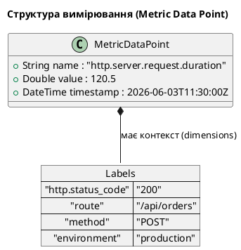

# Вбудовані метрики .NET 10 та System.Diagnostics.Metrics

Метрики є одним із фундаментальних стовпів спостережуваності (Observability). Якщо логи надають деталізований контекст про конкретні одиничні події (наприклад, «Користувач X не зміг авторизуватись через невірний пароль»), а трейси допомагають простежити шлях запиту крізь розподілену систему, то метрики дають **агреговану картину стану системи в часі**. Вони відповідають на стратегічні запитання: «Який рівень завантаження процесора?», «Скільки HTTP-запитів на секунду (RPS) ми обробляємо?» або «Який відсоток помилок спостерігається при взаємодії з базою даних?».

У цьому розділі ми детально розглянемо сучасну інфраструктуру вимірювання показників у .NET 10, що базується на просторі імен `System.Diagnostics.Metrics`.

---

## Що таке метрика: числовий вимір у часі

З технічної точки зору, метрика — це числовий показник, який реєструється з певним інтервалом часу та супроводжується набором метаданих. На відміну від логів, які генерують великі обсяги текстової інформації на кожен запит, метрики агрегуються безпосередньо в пам'яті процесу. Це робить їх надзвичайно ефективними з точки зору використання ресурсів (пам'яті та мережевого трафіку) та дозволяє зберігати дані протягом тривалого періоду з мінімальними витратами.

Будь-яке вимірювання (data point) у системі моніторингу складається з чотирьох основних елементів:

1. **Назва метрики (Metric Name)** — унікальний ідентифікатор вимірюваної величини (наприклад, `http.server.request.duration`).
2. **Значення (Value)** — числове значення показника в момент вимірювання (наприклад, `120.5` або `1`).
3. **Мітка часу (Timestamp)** — точний час, коли було зафіксовано значення.
4. **Теги / Розмірності (Tags / Labels / Dimensions)** — пари «ключ-значення», що забезпечують додатковий аналітичний контекст (наприклад, `http.status_code=200`, `route=/api/orders`).

::plant-uml



::

Завдяки тегам системи моніторингу (такі як Prometheus) можуть виконувати багатовимірний аналіз: ми можемо побудувати графік загального часу відповіді сервера, а потім легко згрупувати його за конкретними URL-адресами або кодами відповідей.

---

## Еволюція вимірювань у .NET: чому System.Diagnostics.Metrics?

Історично платформа .NET мала кілька підходів до збору та експорту метрик:

* **Performance Counters (Лічильники продуктивності)** — класичний механізм Windows, жорстко прив'язаний до операційної системи. Він не є кросплатформним, вимагає спеціальних прав доступу для створення лічильників та має високі накладні витрати.
* **EventCounters** — кросплатформний API, представлений у .NET Core 3.0. Хоча він вирішив проблему залежності від Windows, він мав суттєві обмеження: слабку підтримку багатовимірних метрик (тегів) та обмежену інтеграцію з сучасними стандартами на кшталт OpenTelemetry.

Починаючи з .NET 6 та отримавши остаточну зрілість у .NET 10, стандартом де-факто став API **System.Diagnostics.Metrics**. Він був розроблений у тісній співпраці з консорціумом **OpenTelemetry** і повністю відповідає сучасним індустріальним специфікаціям.

---

## Архітектура System.Diagnostics.Metrics: Meter та інструменти

Центральним класом в API є `Meter`. Він виступає в ролі логічного контейнера та фабрики для створення вимірювальних інструментів. Як правило, кожен компонент або бібліотека створює свій власний `Meter` із унікальним ім'ям (зазвичай це назва збірки або простору імен, наприклад `Microsoft.AspNetCore.Hosting`).

Реєстрація метрик будується на концепції **інструментів (instruments)**. Всі інструменти поділяються на дві великі категорії:

1. **Синхронні (Synchronous)** — значення записані безпосередньо в момент події у коді застосунку (наприклад, реєстрація вхідного запиту або збільшення суми замовлення).
2. **Асинхронні / Спостережувані (Asynchronous / Observable)** — інструмент не викликається у коді під час подій. Замість цього він реєструє callback-метод, який система моніторингу викликає періодично (наприклад, кожні 15 секунд під час scrape-інтервалу) для зчитування поточного стану (наприклад, обсяг вільної оперативної пам'яті).

---

## Типи вимірювальних інструментів

Розглянемо детально кожен тип інструмента, що надається `System.Diagnostics.Metrics`, його характеристики та практичні сценарії застосування.

### 1. Counter<T> (Синхронний лічильник)

`Counter<T>` — це синхронний інструмент, який підтримує лише **неухильне зростання** (monotonically increasing). Значення лічильника не може зменшуватися. Він використовується для накопичувальних значень з початку життєвого циклу процесу.

* **Типові сценарії:**
  * Кількість оброблених HTTP-запитів.
  * Кількість успішно завершених транзакцій.
  * Кількість викинутих винятків (exceptions).
  * Кількість надісланих байтів по мережі.

Приклад ініціалізації та використання:

```csharp
// Створення Meter
var meter = new Meter("Shop.BusinessLogic", "1.0.0");

// Створення Counter
Counter<long> ordersCounter = meter.CreateCounter<long>(
    name: "shop.orders.completed.total",
    unit: "orders",
    description: "Загальна кількість оформлених замовлень");

// Використання: збільшення лічильника на 1
ordersCounter.Add(1, new KeyValuePair<string, object?>("payment.method", "card"));
```

### 2. UpDownCounter<T> (Синхронний двонаправлений лічильник)

На відміну від звичайного `Counter<T>`, `UpDownCounter<T>` може як **збільшуватися, так і зменшуватися** (non-monotonically changing). Він відображає поточну величину, яка коливається навколо певного значення.

* **Типові сценарії:**
  * Кількість активних HTTP-з'єднань на даний момент.
  * Розмір черги повідомлень у пам'яті.
  * Кількість товарів у кошиках активних користувачів.

Приклад використання:

```csharp
UpDownCounter<int> activeConnections = meter.CreateUpDownCounter<int>(
    name: "network.connections.active",
    unit: "connections",
    description: "Кількість активних з'єднань");

// Користувач підключився
activeConnections.Add(1);

// Користувач відключився
activeConnections.Add(-1);
```

### 3. Histogram<T> (Гістограма)

`Histogram<T>` — це синхронний інструмент, який фокусується на **розподілі значень**. Замість простого підсумовування, гістограма групує вимірювання за інтервалами (buckets). Це дозволяє обчислювати статистичні показники: середнє значення, мінімум, максимум, а також перцентилі (P50, P90, P95, P99).

* **Типові сценарії:**
  * Тривалість виконання HTTP-запитів (Request Latency).
  * Розмір завантажуваних файлів (Request Size).
  * Час виконання SQL-запитів до бази даних.

Приклад використання:

```csharp
Histogram<double> requestDuration = meter.CreateHistogram<double>(
    name: "http.server.request.duration",
    unit: "ms",
    description: "Тривалість обробки HTTP-запитів");

// Вимірюємо тривалість запиту
var stopwatch = Stopwatch.StartNew();
await next(context);
stopwatch.Stop();

requestDuration.Record(
    stopwatch.Elapsed.TotalMilliseconds,
    new KeyValuePair<string, object?>("route", "/api/orders"),
    new KeyValuePair<string, object?>("status", 200));
```

### 4. Gauge<T> (Синхронний вимірювач)

`Gauge<T>` (введений у .NET 9) — це синхронний інструмент для фіксації **одиничних миттєвих значень**, які не підлягають агрегації у вигляді суми. На відміну від `UpDownCounter<T>`, де ви додаєте або віднімаєте дельту (`Add(1)` або `Add(-1)`), у `Gauge<T>` ви записуєте абсолютне значення (`Record(value)`).

* **Типові сценарії:**
  * Рівень заряду батареї (%).
  * Поточна швидкість вентилятора охолодження (RPM).
  * Поточна температура процесора.

Приклад використання:

```csharp
Gauge<double> cpuTemperature = meter.CreateGauge<double>(
    name: "hardware.cpu.temperature",
    unit: "Celsius",
    description: "Поточна температура процесора");

// Запис поточного абсолютного значення
cpuTemperature.Record(45.5);
```

### 5. Асинхронні (Observable) інструменти

Асинхронні інструменти (`ObservableCounter<T>`, `ObservableUpDownCounter<T>`, `ObservableGauge<T>`) вирішують проблему збору даних, які вже існують в операційній системі або runtime, і які неефективно чи неможливо вимірювати на кожну подію.

Замість методу `.Add()` або `.Record()`, ви реєструєте зворотний виклик (callback), який повертає поточне значення.

#### ObservableGauge<T>

Використовується, коли потрібно періодично знімати абсолютне значення зовнішнього ресурсу.

* **Типові сценарії:**
  * Обсяг вільної фізичної пам'яті (RAM).
  * Відсоток використання дискового простору.

```csharp
meter.CreateObservableGauge<double>(
    name: "os.memory.free",
    observeValue: () =>
    {
        var info = GC.GetGCMemoryInfo();
        return info.TotalAvailableMemoryBytes - info.FragmentedBytes;
    },
    unit: "bytes",
    description: "Обсяг доступної пам'яті");
```

#### ObservableCounter<T>

Використовується для періодичного зчитування накопичувального значення, яке змінюється ззовні нашого застосунку.

* **Типові сценарії:**
  * Загальний час роботи процесора (CPU Time) з моменту запуску ОС.
  * Загальна кількість байтів, прочитаних диском.

```csharp
meter.CreateObservableCounter<long>(
    name: "process.cpu.time.total",
    observeValue: () => Process.GetCurrentProcess().TotalProcessorTime.Ticks,
    unit: "ticks",
// Користувач відключився
activeConnections.Add(-1);
```

---

## Порівняльна таблиця вимірювальних інструментів

Для полегшення вибору правильного інструмента скористайтеся наступною порівняльною таблицею:

| Інструмент | Тип | Зміна значення | Метод | Основна мета |
| :--- | :--- | :--- | :--- | :--- |
| **Counter<T>** | Синхронний | Тільки збільшення ($\ge 0$) | `Add()` | Накопичення загальної кількості подій |
| **UpDownCounter<T>** | Синхронний | Будь-яка дельта ($+$ або $-$) | `Add()` | Відстеження поточної кількості активних елементів |
| **Histogram<T>** | Синхронний | Реєстрація величин | `Record()` | Аналіз розподілу та перцентилів величини |
| **Gauge<T>** | Синхронний | Пряме встановлення | `Record()` | Фіксація поточного абсолютного стану |
| **ObservableGauge<T>** | Асинхронний | Опитування callback | Зворотний виклик | Періодичне вимірювання зовнішнього показника |
| **ObservableCounter<T>** | Асинхронний | Опитування callback | Зворотний виклик | Періодичний збір накопичувальних значень ззовні |

---

## Вбудовані метрики .NET 10 та ASP.NET Core

Однією з найсильніших сторін екосистеми .NET є те, що **вам не потрібно писати код для збору базових метрик**. Застосунки на базі .NET 10 та ASP.NET Core з коробки вимірюють і надають детальні метрики роботи runtime та веб-сервера. Ці метрики публікуються через вбудовані об'єкти `Meter`.

Ось ключові системні `Meter` джерела, які доступні в будь-якому ASP.NET Core застосунку:

### 1. Джерело `Microsoft.AspNetCore.Hosting`

Цей `Meter` відповідає за життєвий цикл HTTP-запитів на рівні хостингу ASP.NET Core.

::field-group

::field{name="http.server.request.duration" type="Histogram"}
Тривалість обробки вхідних HTTP-запитів на сервері. Це найважливіша метрика для розрахунку SLO (Service Level Objectives) латентності. Теги включають `http.route`, `http.status_code`, `http.request.method`.
::

::field{name="http.server.active_requests" type="UpDownCounter"}
Кількість HTTP-запитів, які обробляються сервером прямо зараз (in-flight requests). Допомагає виявити застрягання запитів або раптові напливи трафіку.
::

::field{name="http.server.request.body.size" type="Histogram"}
Розмір тіла вхідних запитів у байтах. Корисно для виявлення аномальних обсягів завантаження даних користувачами.
::

::

### 2. Джерело `System.Runtime`

Цей `Meter` публікує низькорівневі метрики про роботу віртуальної машини CLR (.NET Runtime). Вони критично важливі для діагностики витоків пам'яті (memory leaks), перевантаження ThreadPool та деградації продуктивності через роботу збирача сміття (GC).

::field-group

::field{name="dotnet.gc.collections.count" type="Counter"}
Загальна кількість запусків збирання сміття, розділена за поколіннями (generation: `gen0`, `gen1`, `gen2`). Дозволяє виявити часті запуски `gen2` (stop-the-world), що серйозно уповільнює роботу системи.
::

::field{name="dotnet.memory.allocated.total" type="Counter"}
Загальний обсяг пам'яті в байтах, виділений з моменту старту застосунку (накопичувальний підсумок). Висока швидкість зростання цього лічильника свідчить про надлишкове створення тимчасових об'єктів.
::

::field{name="dotnet.threadpool.thread.count" type="UpDownCounter"}
Поточна кількість потоків у пулі потоків (ThreadPool). Допомагає відстежувати явище голодування пулу (thread pool starvation).
::

::field{name="dotnet.threadpool.queue.length" type="UpDownCounter"}
Кількість робочих елементів, які зараз очікують на вільний потік у черзі ThreadPool. Стабільне зростання цієї черги — ознака того, що система не справляється із потоком задач.
::

::field{name="dotnet.exceptions.thrown" type="Counter"}
Кількість викинутих винятків (.NET exceptions). Логування exceptions є дорогим, тому висока частота помилок може створювати значне навантаження на CPU навіть без видимих збоїв для клієнта (first-chance exceptions).
::

::

### 3. Інші системні джерела

* **`System.Net.Http`** — відстежує метрики вихідних HTTP-запитів, які робить застосунок (наприклад, через `HttpClient`). Метрика `http.client.request.duration` показує час відповіді сторонніх інтеграцій (Stripe, LiqPay тощо).
* **`Microsoft.AspNetCore.Http.Connections` / Kestrel** — надає інформацію про поточні TCP та WebSocket з'єднання, відкриті до Kestrel.
* **`Microsoft.AspNetCore.Diagnostics`** — збирає результати виконання Health Checks. Метрика `aspnetcore.diagnostics.health_checks.status` дає числове відображення стану здоров'я системи (0 — Unhealthy, 1 — Degraded, 2 — Healthy).

---

## Створення кастомних метрик для бізнес-логіки

Хоча системні метрики допомагають зрозуміти «здоров'я» інфраструктури, вони не дають відповіді на питання бізнесу. Наприклад: «Скільки замовлень ми оформили за останню годину?», «Який середній чек клієнта?» або «Як часто користувачі скасовують кошик?». Для цього розробник повинен інструментувати код вручну.

Створимо сервіс бізнес-метрик, який реєструє Counter для замовлень та Histogram для розміру кошика:

```csharp [Services/BusinessMetrics.cs]
using System.Diagnostics.Metrics;

public class BusinessMetrics
{
    private readonly Counter<long> _ordersCounter;
    private readonly Histogram<double> _cartSizeHistogram;

    public BusinessMetrics(IMeterFactory meterFactory)
    {
        // IMeterFactory — рекомендований .NET 10 спосіб створення Meter у DI-середовищі
        var meter = meterFactory.Create("Shop.BusinessMetrics");

        _ordersCounter = meter.CreateCounter<long>(
            name: "shop.orders.completed.total",
            unit: "orders",
            description: "Загальна кількість оформлених замовлень");

        _cartSizeHistogram = meter.CreateHistogram<double>(
            name: "shop.cart.items.count",
            unit: "items",
            description: "Кількість товарів у кошику при оформленні");
    }

    public void RegisterOrder(int itemsCount, string paymentMethod)
    {
        // Додаємо 1 до лічильника замовлень з міткою методу оплати
        _ordersCounter.Add(1, 
            new KeyValuePair<string, object?>("payment.method", paymentMethod));

        // Фіксуємо розмір кошика
        _cartSizeHistogram.Record(itemsCount);
    }
}
```

---

## Перегляд метрик у реальному часі: CLI-інструмент `dotnet-counters`

Під час локальної розробки та діагностики проблем на серверах часто виникає потреба перевірити метрики застосунку без налаштування Prometheus чи Grafana. Для цього у складі .NET SDK є спеціальна кросплатформна утиліта командного рядка — `dotnet-counters`.

Вона працює як локальний монітор процесів (на кшталт `top` або `htop`), підключаючись до diagnostic socket запущеного .NET-процесу через механізм IPC.

### Встановлення та запуск

Якщо утиліта ще не встановлена у вашій системі, її можна встановити глобально за допомогою команди `dotnet tool`:

```bash
dotnet tool install --global dotnet-counters
```

Після встановлення ви можете вивести список усіх запущених .NET-процесів у системі, щоб дізнатися їхні ідентифікатори (PID):

```bash
dotnet-counters ps
```

::terminal-preview{title="dotnet-counters ps"}

<div class="line"><span class="opacity-40">$</span> <strong class="font-bold">dotnet-counters ps</strong></div>
<div class="line">  23410  dotnet     /usr/share/dotnet/dotnet</div>
<div class="line">  98765  Shop.Api   /Users/username/bin/Shop.Api</div>

::

Щоб запустити моніторинг стандартних метрик процесу з PID `98765`, використовуйте команду `monitor`:

```bash
dotnet-counters monitor -p 98765
```

Якщо ви хочете відстежувати не лише системні метрики, а й ваші власні бізнес-метрики (наприклад, з нашого `Shop.BusinessMetrics` Meter), вкажіть назву джерела через параметр `--counters`:

```bash
dotnet-counters monitor -p 98765 --counters System.Runtime,Microsoft.AspNetCore.Hosting,Shop.BusinessMetrics
```

::terminal-preview{title="dotnet-counters monitor"}

<div class="line">Press p to pause, r to resume, q to quit.</div>
<div class="line">Status: Running</div>
<div class="line"></div>
<div class="line">[System.Runtime]</div>
<div class="line">    CPU Usage (%)                                 12</div>
<div class="line">    Working Set (MB)                             142</div>
<div class="line">    GC Heap Size (MB)                             45</div>
<div class="line">[Microsoft.AspNetCore.Hosting]</div>
<div class="line">    Request Rate (req/s)                          15</div>
<div class="line">    Total Requests                               421</div>
<div class="line">    Current Requests                               1</div>
<div class="line">[Shop.BusinessMetrics]</div>
<div class="line">    shop.orders.completed.total (orders)          12</div>

::

---

## Теги (Labels) у метриках та проблема кардинальності (Cardinality)

Теги (або мітки, labels, dimensions) перетворюють плоскі метрики на багатовимірні структури даних. Завдяки їм ми можемо записати одну метрику `http.server.request.duration`, але аналізувати її під різними кутами.

Проте, використання тегів має серйозне архітектурне обмеження, відоме як **проблема високої кардинальності (High Cardinality)**.

### Що таке кардинальність?

У контексті баз даних часових рядів (TSDB), таких як Prometheus, кожна унікальна комбінація назви метрики та її тегів створює окремий **часовий ряд (time series)**, який Prometheus зберігає у пам'яті та індексує.

Формула загальної кількості часових рядів для однієї метрики виглядає так:

$$N_{\text{series}} = V_1 \times V_2 \times \dots \times V_n$$

де $V_i$ — кількість унікальних значень кожного тегу.

::warning
**Антипатерн: теги з унікальними значеннями.**
Ніколи не додавайте в теги метрик значення, які мають необмежену множину значень. Наприклад: `User ID`, `Order ID`, `Session ID`, `Email`, `UUID` або повні `URL` параметри з query string.
::

### Чому висока кардинальність небезпечна?

Якщо ви додасте `User ID` (наприклад, 1 000 000 унікальних користувачів) як тег до метрики `http.server.request.duration`, Prometheus створить **1 000 000 унікальних часових рядів** для цієї однієї метрики. Це призведе до:

1. **Вибухового споживання RAM** на сервері моніторингу (Prometheus тримає індекси активних рядів у пам'яті).
2. **Уповільнення запитів PromQL** (базі даних доведеться сканувати мільйони індексів).
3. **Можливої відмови в обслуговуванні (OOM — Out of Memory)** сервера моніторингу.

### Правила проектування тегів (Best Practices)

Для запобігання проблемам високої кардинальності дотримуйтеся таких рекомендацій:

* **Використовуйте шаблони маршрутів (Route Templates) замість реальних URL.**
  Замість запису `/api/orders/542` та `/api/orders/981` використовуйте шаблон `/api/orders/{id}`. ASP.NET Core робить це автоматично в метриці `http.server.request.duration` через тег `http.route`.
* **Обмежуйте діапазон значень.**
  Якщо у вас є багато статус-кодів або помилок, можливо, варто згрупувати їх. Наприклад, замість кожного дрібного коду помилки використовувати класифікацію: `client_error`, `server_error`, `success`.
* **Відокремлюйте метрики від логів.**
  Якщо вам потрібна детальна інформація про конкретного користувача, який здійснив запит — запишіть це в структурований лог (де є поля `UserId`, `OrderId`), але не в метрику. Логи індексуються інакше і призначені для зберігання великої кількості унікальних значень.

---

## Підсумок

Метрики дають змогу тримати руку на пульсі додатку, оцінювати продуктивність у масштабі та вчасно реагувати на деградацію сервісів. Завдяки сучасному та стандартизованому API `System.Diagnostics.Metrics` у .NET 10, розробка та експорт метрик є швидким та високопродуктивним процесом.

| Що зробити | Який інструмент обрати |
| :--- | :--- |
| Порахувати кількість подій (помилки, запити) | `Counter<T>` |
| Відстежувати поточний розмір (черга, з'єднання) | `UpDownCounter<T>` |
| Виміряти тривалість або обсяг (latency, розмір файлу) | `Histogram<T>` |
| Періодично зчитувати системний показник (пам'ять, CPU) | `ObservableGauge<T>` / `ObservableCounter<T>` |
| Переглянути метрики локально в реальному часі | CLI `dotnet-counters monitor` |

::note
На наступному кроці переходимо до ознайомлення з **Prometheus** — базою даних часових рядів, яка збиратиме (scrape) та зберігатиме ці метрики, а також мовою запитів **PromQL**, що дозволить нам будувати аналітичні графіки.
::

