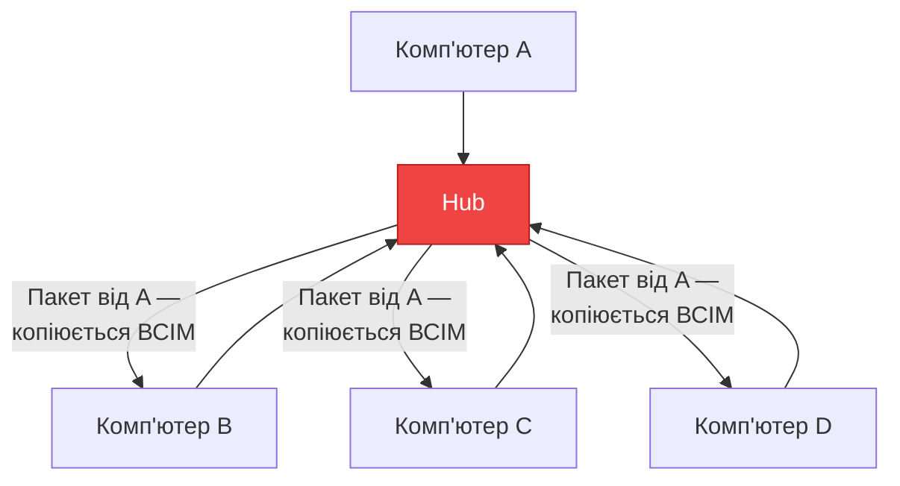
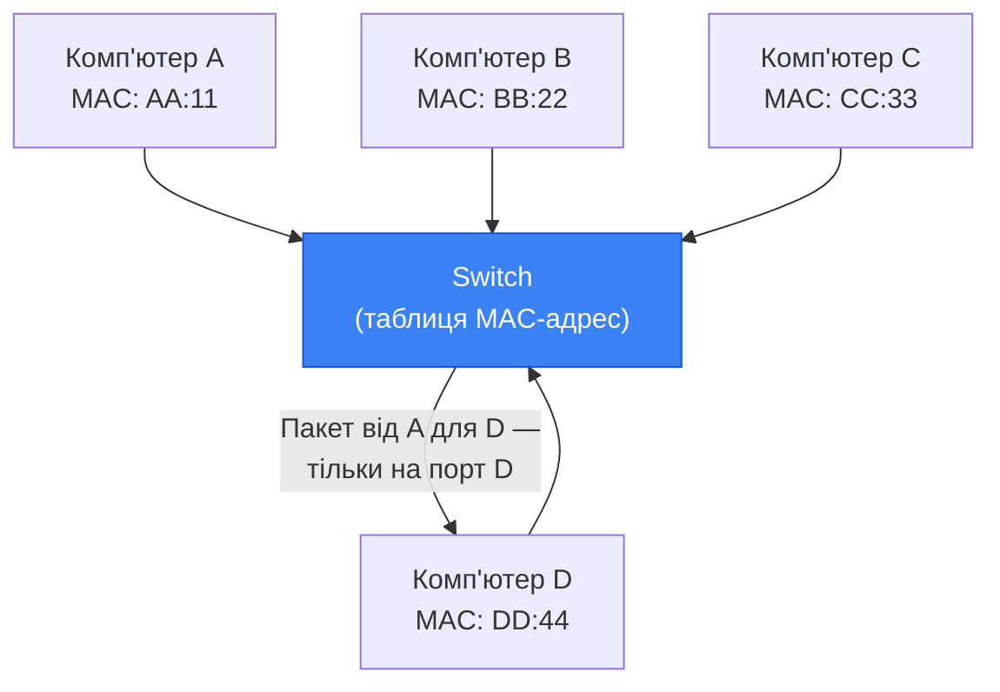
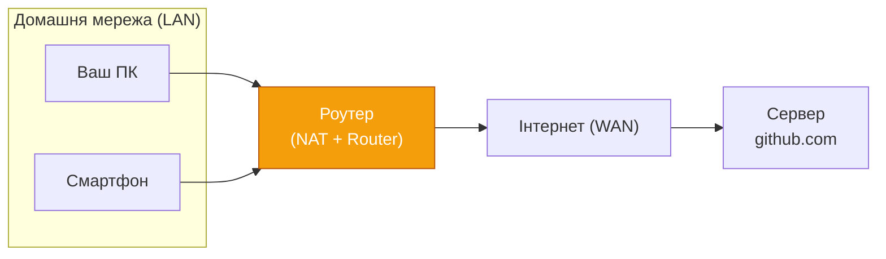
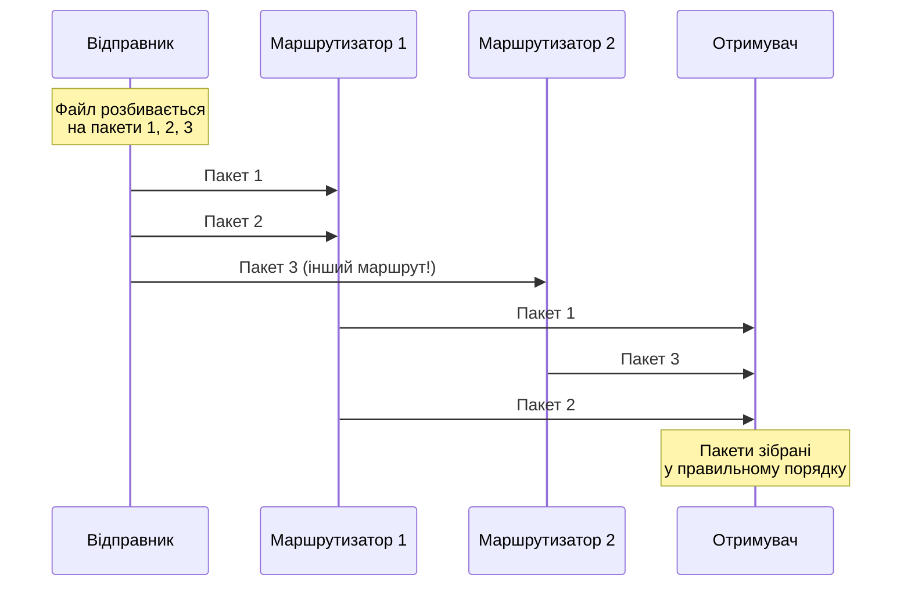
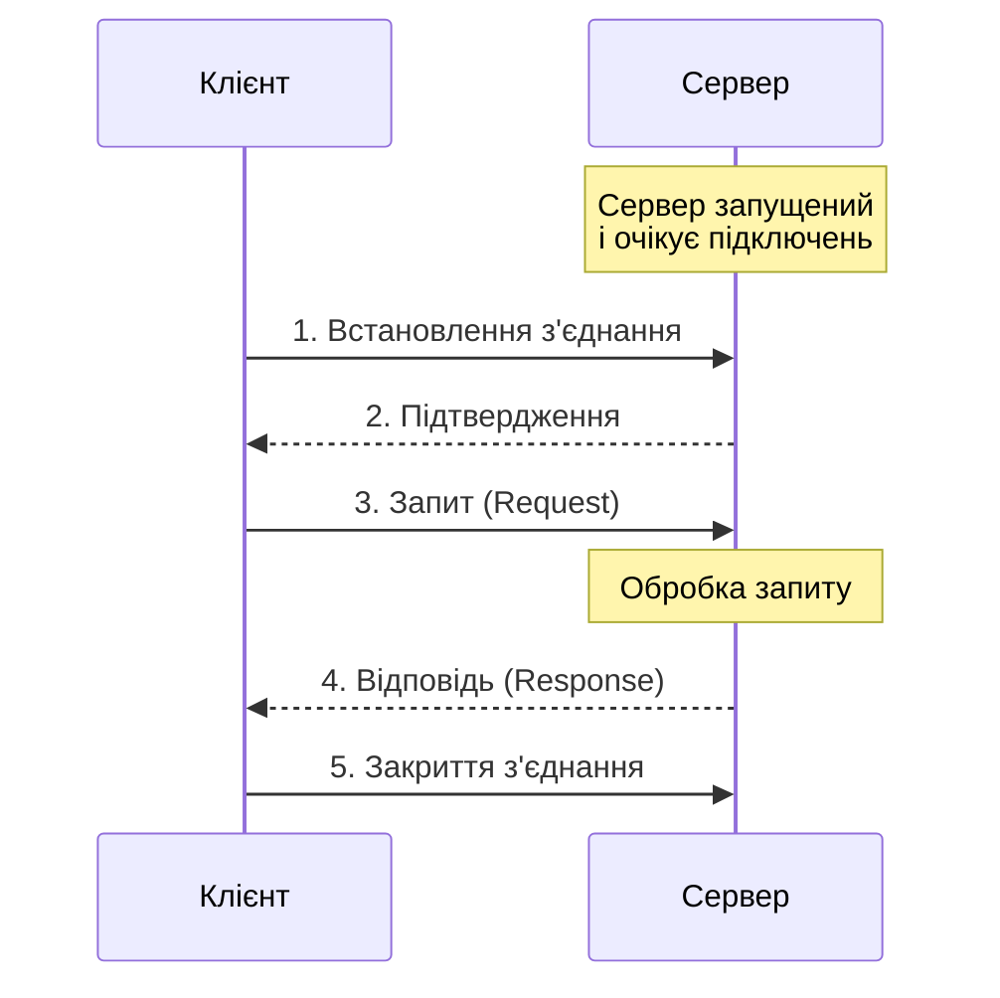

# Основи комп'ютерних мереж

## Вступ та Контекст

### Навіщо розробнику розуміти мережі?

Уявіть, що ви написали чудовий застосунок. Він ідеально працює на вашому комп'ютері. Але що, якщо потрібно отримати дані з віддаленого сервера? Відправити повідомлення іншому користувачу? Обслужити десятки тисяч одночасних підключень?

Сучасне програмування — це мережеве програмування. Від мобільних додатків до хмарних сервісів — абсолютна більшість програмного забезпечення взаємодіє через мережу. Розробник, який не розуміє принципів мережевої взаємодії, схожий на архітектора, що проєктує будівлю без знання законів фізики.

::card-group

::card{title="Що ви дізнаєтесь" icon="i-lucide-graduation-cap"}
- Як з'явились комп'ютерні мережі і чому вони побудовані саме так
- Типи мереж та їх характеристики
- Роль мережевого обладнання
- Принцип пакетної комутації — основи Інтернету
- Клієнт-серверну архітектуру та поняття порту
::

::card{title="Передумови" icon="i-lucide-list-checks"}
- ✅ Базове розуміння C# та .NET
- ✅ Вміння працювати з консольними застосунками
::

::

---

## Фундаментальні Концепції

### Що таке комп'ютерна мережа?

**Комп'ютерна мережа** (Computer Network) — це група комп'ютерів або пристроїв, з'єднаних між собою каналами зв'язку для обміну даними та спільного використання ресурсів.

Це визначення може здатись простим, але за ним стоять десятиліття інженерних рішень. Щоб два комп'ютери могли «поговорити», необхідно вирішити цілу низку взаємопов'язаних проблем:

- **Фізичне з'єднання** — яким кабелем або бездротовим каналом з'єднати пристрої?
- **Адресація** — як однозначно ідентифікувати кожен пристрій у мережі?
- **Спільна мова** — за якими правилами обмінюватися повідомленнями?
- **Надійність** — що робити, якщо дані загубились або пошкодились по дорозі?
- **Масштабованість** — як з'єднати не два, а мільярди пристроїв?

Усі ці проблеми вирішуються за допомогою **протоколів** (Protocol) — наборів правил, що визначають формат та порядок обміну повідомленнями між пристроями.

::note
**Аналогія:** Протокол — це як правила телефонної розмови. Ви знімаєте слухавку, чекаєте гудок, набираєте номер, чекаєте відповіді, вітаєтесь, спілкуєтесь, прощаєтесь і кладете слухавку. Якщо одна сторона не дотримується цих правил — розмова не відбудеться.
::

---

### Коротка історія комп'ютерних мереж

Розуміння історії допомагає зрозуміти **чому** мережі побудовані саме так, а не інакше. Кожне архітектурне рішення — це відповідь на конкретну проблему свого часу.

::steps

### 1969 — ARPANET: перша передача даних

29 жовтня 1969 року о 21:00 відбулася перша передача даних між двома вузлами: Каліфорнійським університетом (UCLA) та Стенфордським дослідним інститутом (SRI) на відстані 600 км.

Мережу **ARPANET** фінансувало агентство **DARPA** (Defense Advanced Research Projects Agency). Головна вимога — **відмовостійкість**: навіть при руйнуванні частини мережі, решта мала продовжувати функціонувати. Саме ця вимога і спричинила появу принципу **пакетної комутації**, який ми розберемо далі в цьому модулі.

### 1970-ті — проблема несумісності

З появою нових мереж постала критична проблема: мережі різних виробників (IBM, DEC, Xerox) **не могли взаємодіяти** між собою. Кожна компанія мала власні стандарти. Розпочалась бурхлива робота зі стандартизації — так зароджувалась ідея єдиної моделі для всіх мереж.

### 1983 — народження Інтернету

1 січня 1983 року мережа ARPANET перейшла на стек протоколів **TCP/IP** — той самий стек, що використовується і сьогодні. Саме тоді за мережею закріпився термін **«Internet»** (Inter-network — «між-мережа»). До 1990-х мережа переважно використовувалась для електронної пошти та обміну файлами між університетами.

### 1991 — World Wide Web

Тім Бернерс-Лі представив **WWW** — систему гіпертекстових документів, доступних через мережу. Інтернет перестав бути інструментом вчених і почав ставати доступним для широкої аудиторії.

### 2000-ні — мобільна революція

Поява смартфонів та бездротових мереж (Wi-Fi, 3G/4G) кардинально змінила вимоги до мережевого програмування. Кількість підключених пристроїв зросла від мільйонів до мільярдів.

### Сьогодення — хмари та IoT

Сучасний Інтернет з'єднує не лише комп'ютери та телефони, але й датчики, камери, автомобілі, побутову техніку (IoT). Знання мережевого програмування стало базовою навичкою для більшості розробників.

::

::tip
**Висновок з історії:** Кожен стандарт та протокол, який ви вивчатимете в цьому курсі, виник як відповідь на реальну інженерну проблему. Розуміти «чому» так само важливо, як «як».
::

---

## Типи мереж за масштабом

Мережі класифікуються передусім за **географічним охопленням**. Ця класифікація практично важлива: масштаб мережі визначає характеристики каналів і, зрештою, те, як розробник має проєктувати свій застосунок.

::card-group

::card{title="PAN — Personal Area Network" icon="i-lucide-bluetooth"}
**Радіус:** до 10 метрів.

Мережа для одного користувача. Технології: Bluetooth, NFC, USB. Приклади: бездротові навушники, смарт-годинник, підключення телефону до ноутбука.
::

::card{title="LAN — Local Area Network" icon="i-lucide-building"}
**Радіус:** до кількох кілометрів.

Мережа в межах будівлі або кампусу. Технології: Ethernet (кабель), Wi-Fi (бездротово). Приклади: домашня мережа, офісна мережа, комп'ютерний клас.
::

::card{title="MAN — Metropolitan Area Network" icon="i-lucide-building-2"}
**Радіус:** місто або район.

З'єднує кілька LAN у межах міста. Приклади: університет із кількома корпусами, міська мережа провайдера.
::

::card{title="WAN — Wide Area Network" icon="i-lucide-globe"}
**Радіус:** країни та континенти.

З'єднує кілька LAN/MAN на великих відстанях. **Інтернет** — найбільша WAN у світі. Також: корпоративні мережі з офісами в різних країнах.
::

::

Ця класифікація безпосередньо впливає на архітектуру застосунку. Розглянемо ключові характеристики в порівнянні:

| Характеристика | PAN | LAN | MAN | WAN |
|:---|:---:|:---:|:---:|:---:|
| **Радіус** | ~10 м | ~1 км | ~100 км | Необмежено |
| **Типова швидкість** | 1–25 Мбіт/с | 100 Мбіт/с – 10 Гбіт/с | 100 Мбіт/с – 1 Гбіт/с | 1 Мбіт/с – 100 Гбіт/с |
| **Типова затримка** | <5 мс | <1 мс | 1–10 мс | 10–300 мс |
| **Власник** | Користувач | Організація | Провайдер | Провайдери / держава |

::

---

## Мережеве обладнання

Пристрої у мережі не з'єднуються безпосередньо один з одним — між ними знаходиться спеціалізоване обладнання. Розуміння ролі кожного пристрою допомагає програмісту правильно діагностувати мережеві проблеми і розуміти, де саме «загубився» пакет.

### Хаб (Hub) — «тупий» повторювач

**Хаб** (Hub, концентратор) — найпростіший мережевий пристрій. Він отримує сигнал на один порт і **повторює його на всі інші порти** без жодного аналізу.

::mermaid

::

Якщо комп'ютер A надсилає дані комп'ютеру D, їх також отримують B та C. Це створює три проблеми: зайвий трафік, відсутність конфіденційності та **колізії** (коли два пристрої передають одночасно і сигнали «стикаються»).

::caution
Хаби вважаються застарілим обладнанням і практично не використовуються в сучасних мережах. Їх замінили **комутатори (switches)**.
::

### Комутатор (Switch) — розумний посередник

**Комутатор** (Switch) — розумніший пристрій. Він веде таблицю MAC-адрес (фізичних адрес мережевих карток) і знає, до якого порту підключений кожен пристрій. Завдяки цьому він передає пакет **тільки на потрібний порт**.

::mermaid

::

Переваги над хабом: менше зайвого трафіку, підвищена безпека (пристрої не бачать чужих даних), відсутність колізій між різними парами пристроїв.

::note
**MAC-адреса** (Media Access Control address) — унікальний ідентифікатор мережевого адаптера, «зашитий» виробником у залізо. Виглядає як `AA:BB:CC:DD:EE:FF`. Комутатор запам'ятовує, з якого порту прийшов кадр із певною MAC-адресою, і наступного разу відправить відповідь саме туди.
::

### Маршрутизатор (Router) — навігатор між мережами

Свіч чудово працює **всередині** однієї мережі. Але він не знає, як дістатись до **іншої** мережі. Тут з'являється **маршрутизатор** (Router).

Маршрутизатор з'єднує кілька мереж і обирає найкращий маршрут для кожного пакета. Він оперує не MAC-адресами, а **IP-адресами** — логічними адресами, що ми детально вивчимо в наступних модулях.

::mermaid

::

Ваш домашній Wi-Fi роутер — це саме маршрутизатор, що з'єднує локальну мережу (LAN) з мережею інтернет-провайдера.

---

## Пакетна комутація

### Проблема: як передавати великі об'єми даних?

Існують два принципово різних підходи до організації передачі даних між вузлами мережі. Розуміння їх відмінностей пояснює, чому Інтернет побудований саме так і чому мережеве програмування має свою специфіку.

::tabs

::tab{label="Комутація каналів (Circuit Switching)"}

**Принцип:** перед початком передачі між відправником та отримувачем встановлюється **виділений фізичний канал**. Цей канал резервується на весь час з'єднання — навіть якщо в даний момент дані не передаються.

**Приклад:** традиційна аналогова телефонна мережа. Коли ви телефонуєте, для вас виділяється окрема лінія. Ніхто інший не може використати цей ресурс, поки ви не покладете слухавку.

**Переваги:**
- Гарантована пропускна здатність на весь час з'єднання
- Постійна затримка (jitter відсутній)

**Недоліки:**
- Канал зайнятий навіть під час пауз (неефективне використання)
- Якщо одна ланка в ланцюжку виходить з ладу — з'єднання розривається повністю
- Кількість одночасних з'єднань жорстко обмежена ресурсами

::

::tab{label="Пакетна комутація (Packet Switching)"}

**Принцип:** дані розбиваються на невеликі **пакети** (Packet). Кожен пакет містить адресу отримувача і може йти до нього своїм маршрутом, незалежно від інших пакетів. На стороні отримувача пакети збираються в правильному порядку.

**Приклад:** поштова служба. Ви розрізаєте велику книгу на розділи, нумеруєте їх, кладете кожен у окремий конверт з адресою і відправляєте. Конверти можуть їхати різними маршрутами, але адресат зберуть книгу назад за номерами.

**Переваги:**
- Ефективне використання каналів (канал не простоює)
- Відмовостійкість: якщо один маршрут недоступний, пакет піде іншим
- Масштабованість: мільярди пристроїв використовують спільну інфраструктуру

**Недоліки:**
- Затримка може варіюватись (jitter)
- Пакети можуть прибувати в неправильному порядку
- Пакети можуть губитись

::

::

::mermaid

::

::warning
**Чому це важливо для розробника.** Пакетна комутація пояснює три «дивні» явища у мережевому програмуванні, з якими ви неодмінно зіткнетесь:

1. **Пакети можуть приходити не в порядку** — ваш код не може покладатись на порядок отримання
2. **Пакети можуть губитись** — необхідний механізм підтвердження та повторної передачі
3. **Затримка непостійна** — час між відправкою та отриманням варіюється

Саме ці три проблеми є причиною існування двох різних транспортних протоколів — TCP та UDP, які ми вивчимо в наступних модулях.
::

---

## Клієнт-серверна архітектура

### Ролі у мережевій взаємодії

Найпоширеніша модель організації мережевої взаємодії — **клієнт-серверна** (Client-Server Architecture). У ній пристрої поділяються на два типи за своєю роллю:

- **Сервер** (Server) — програма або комп'ютер, що постійно запущений, очікує підключень і надає сервіси: дані, обчислення, файли, повідомлення.
- **Клієнт** (Client) — програма, що **ініціює** з'єднання із сервером, надсилає **запит** (Request) і отримує **відповідь** (Response).

::mermaid

::

Ця модель — основа абсолютної більшості мережевих застосунків: веббраузер (клієнт) і вебсервер, поштовий клієнт і SMTP-сервер, мобільний додаток і REST API.

### Порти: адреса конкретного застосунку

IP-адреса ідентифікує **комп'ютер** у мережі. Але на одному комп'ютері одночасно можуть працювати десятки мережевих програм: вебсервер, поштовий сервер, SSH-daemon. Як операційна система знає, якій програмі передати пакет?

Для цього використовуються **порти** (Ports) — числа від **0 до 65535**. Пара **IP-адреса + порт** однозначно ідентифікує конкретний мережевий застосунок на конкретному комп'ютері. Ця пара називається **кінцевою точкою** (Endpoint).

| Діапазон | Назва | Призначення | Приклади |
|:---|:---|:---|:---|
| **0–1023** | Well-known ports | Зарезервовані стандартом | HTTP: 80, HTTPS: 443, SSH: 22, SMTP: 25 |
| **1024–49151** | Registered ports | Для конкретних застосунків | MySQL: 3306, PostgreSQL: 5432, Redis: 6379 |
| **49152–65535** | Dynamic / Ephemeral | Тимчасові клієнтські порти | Призначаються ОС автоматично |

::note
**Аналогія:** Якщо IP-адреса — це **адреса будинку**, то порт — це **номер квартири**. Пакет, адресований на `93.184.216.34:443`, потрапить саме до HTTPS-сервера на цьому хості, а не до будь-якої іншої програми.
::

Коли клієнт підключається до сервера, він також отримує тимчасовий **порт відправника** — ОС автоматично обирає вільний номер із динамічного діапазону. Завдяки цьому сервер може відрізнити, від якого саме клієнта прийшов пакет.

---

## Перший погляд на мережевий C\# код

Перш ніж заглиблюватись у сокети та протоколи (це буде в наступних модулях), подивімось, як .NET дозволяє дізнатись базову інформацію про мережеве оточення власного комп'ютера. Це допоможе вам одразу відчути роботу з простором імен `System.Net`.

### Інформація про мережеві інтерфейси

Кожен комп'ютер має один або кілька **мережевих інтерфейсів** (Network Interface) — апаратних або віртуальних пристроїв для підключення до мережі. Клас `NetworkInterface` дає доступ до їх переліку:

```csharp
using System.Net;
using System.Net.NetworkInformation;

// Отримуємо всі мережеві інтерфейси комп'ютера
NetworkInterface[] interfaces = NetworkInterface.GetAllNetworkInterfaces();

foreach (NetworkInterface nic in interfaces)
{
    // Відображаємо лише активні інтерфейси
    if (nic.OperationalStatus != OperationalStatus.Up)
        continue;

    Console.WriteLine($"Інтерфейс: {nic.Name}");
    Console.WriteLine($"  Тип: {nic.NetworkInterfaceType}");
    Console.WriteLine($"  MAC: {nic.GetPhysicalAddress()}");

    // IP-адреси, призначені цьому інтерфейсу
    IPInterfaceProperties props = nic.GetIPProperties();
    foreach (UnicastIPAddressInformation addr in props.UnicastAddresses)
    {
        Console.WriteLine($"  IP: {addr.Address} / {addr.IPv4Mask}");
    }

    Console.WriteLine();
}
```

Розберімо ключові елементи цього коду:

- **`NetworkInterface.GetAllNetworkInterfaces()`** — статичний метод, що повертає масив усіх інтерфейсів: фізичних (Ethernet, Wi-Fi) та віртуальних (loopback, VPN-адаптери)
- **`OperationalStatus.Up`** — фільтруємо лише активні (підключені) інтерфейси; `Down` означає відключений кабель або вимкнений Wi-Fi
- **`nic.GetPhysicalAddress()`** — MAC-адреса цього мережевого адаптера (та сама, що ми обговорювали в розділі про комутатори)
- **`UnicastIPAddressInformation`** — IP-адреса, призначена інтерфейсу (може бути кілька: IPv4 та IPv6 одночасно)
- **`addr.IPv4Mask`** — маска підмережі, яка показує, де закінчується мережева частина адреси і починається хостова

::note
Зверніть увагу, що тут ми лише **читаємо** інформацію з ОС, не встановлюємо жодних з'єднань. `System.Net.NetworkInformation` — це діагностичний простір імен, аналог команди `ipconfig` (Windows) або `ifconfig`/`ip addr` (Linux/macOS) у коді.
::

### Перевірка доступності хоста

Інша корисна операція — перевірка, чи доступний певний хост у мережі. Клас `Ping` реалізує протокол **ICMP Echo**, що лежить в основі команди `ping`:

```csharp
using System.Net.NetworkInformation;

using var ping = new Ping();

string[] hosts = { "8.8.8.8", "1.1.1.1", "localhost" };

foreach (string host in hosts)
{
    PingReply reply = await ping.SendPingAsync(host, timeout: 3000);

    string status = reply.Status == IPStatus.Success
        ? $"✅ доступний, RTT = {reply.RoundtripTime} мс"
        : $"❌ недоступний ({reply.Status})";

    Console.WriteLine($"{host,-15} {status}");
}
```

- **`Ping.SendPingAsync()`** — асинхронна відправка ICMP Echo запиту. Параметр `timeout` — максимальний час очікування у мілісекундах
- **`reply.Status`** — результат: `IPStatus.Success` означає успіх, інші значення (`TimedOut`, `DestinationUnreachable`) — різні типи помилок
- **`reply.RoundtripTime`** — **RTT** (Round-Trip Time) — час у мілісекундах від відправки до отримання відповіді. Це і є **затримка** (latency), про яку ми говорили в розділі про типи мереж

::tip
**RTT** — фундаментальна характеристика мережевого з'єднання. Затримка у 1 мс означає, що ви в одній LAN. Затримка 15–50 мс — зазвичай в межах країни. Затримка 150–300 мс — трансконтинентальне з'єднання. Завжди вимірюйте RTT при діагностиці мережевих проблем.
::

### Ім'я вузла та його адреси: перший крок до DNS

У практичному мережевому програмуванні розробник майже ніколи не працює лише з "голими" IP-адресами. Люди мислять доменними іменами: `google.com`, `api.github.com`, `localhost`. Тому наступний базовий крок після перевірки доступності вузла — зрозуміти, як ім'я хоста пов'язується з конкретними мережевими адресами.

У .NET для цього існує клас `Dns`. Він ще не відкриває з'єднання і не передає прикладні дані, але вже дозволяє побачити надзвичайно важливу річ: **одне ім'я може відповідати кільком IP-адресам одночасно**, а один і той самий сервіс може бути доступний як через IPv4, так і через IPv6.

```csharp
using System.Net;

string hostName = "localhost";
IPHostEntry hostEntry = await Dns.GetHostEntryAsync(hostName);

Console.WriteLine($"Хост: {hostEntry.HostName}");

foreach (IPAddress address in hostEntry.AddressList)
{
    Console.WriteLine($"  Адреса: {address} ({address.AddressFamily})");
}
```

Цей приклад здається простим, але за ним стоїть важливий концептуальний місток до наступних модулів:

- **`Dns.GetHostEntryAsync()`** виконує резолюцію імені, тобто перетворює символьне ім'я на одну або кілька адрес
- **`hostEntry.AddressList`** повертає всі знайдені адреси, а не лише одну; це критично, бо великі сервіси майже завжди мають кілька точок входу
- **`address.AddressFamily`** показує, до якої сім'ї належить адреса: `InterNetwork` для IPv4 або `InterNetworkV6` для IPv6

::note
На цьому етапі достатньо запам'ятати головну ідею: між "людським" ім'ям сервісу та реальним мережевим маршрутом завжди існує проміжний шар резолюції. Саме його ми формально вивчатимемо в модулі про DNS.
::

---

## Підсумок

У цьому модулі ми розглянули мережу не як абстрактне "середовище, де щось працює", а як інженерну систему з чіткими правилами. Ми побачили історичні причини виникнення сучасного Інтернету, розібрали класифікацію мереж за масштабом, зрозуміли відмінність між комутатором і маршрутизатором, а також з'ясували, чому пакетна комутація стала фундаментом глобальної мережі.

Не менш важливим є й те, що ми заклали правильну ментальну модель для подальшого навчання. Сервер і клієнт — це не "магічні ролі", а конкретні способи організації взаємодії. IP-адреса і порт — не просто числа, а адреса машини й адреса процесу всередині цієї машини. Затримка, втрата пакетів і невпорядкованість доставки — не випадкові винятки, а природні властивості мережевого середовища, з якими протоколи і програміст працюють системно.

Перші приклади на C# показали ще одну принципову річ: мережеве програмування починається не з написання сервера, а з уміння спостерігати мережу, вимірювати її параметри і читати інформацію, яку вже надає операційна система. Це правильна професійна оптика: перед тим як будувати складну комунікацію, потрібно навчитися бачити її фундамент.

У наступному модулі ми перейдемо від загальних основ до формальної моделі, яка описує мережеву взаємодію по рівнях, — моделі **OSI** та стеку **TCP/IP**. Саме вони дадуть нам мову, якою професійно описують рух даних від прикладної програми до фізичного середовища передачі.

---

## Практика та закріплення

Теоретичний модуль про мережі легко створює оманливе відчуття зрозумілості. Поки терміни "маршрутизатор", "пакет", "порт" і "клієнт" залишаються лише словами, вони швидко змішуються в пам'яті. Саме тому після вивчення фундаменту важливо не просто перечитати визначення, а спробувати застосувати їх у невеликих аналітичних і практичних вправах.

Наведені нижче завдання побудовані за принципом поступового ускладнення. Спочатку ви перевірите термінологічну точність і базове розуміння ролей у мережі. Далі попрацюєте з реальною інформацією про мережеве середовище вашої машини. Наприкінці спробуєте пов'язати всі елементи в єдину картину, як це робить інженер, коли аналізує реальний мережевий сценарій.

### Рівень 1. Базове розуміння

1. Поясніть власними словами різницю між **комп'ютерною мережею**, **протоколом**, **IP-адресою** та **портом**. Спробуйте дати визначення без підглядання в текст, а потім звірте їх з матеріалом модуля.

2. Побудуйте коротку таблицю порівняння для **Hub**, **Switch** і **Router**. Для кожного пристрою вкажіть:
   - який тип адрес він використовує;
   - чи вміє він "думати" про маршрут;
   - де саме його зазвичай застосовують.

3. Візьміть будь-який знайомий вам застосунок, наприклад браузер або месенджер, і опишіть його взаємодію в термінах **клієнт-серверної архітектури**. Хто є клієнтом? Хто сервером? Який ресурс або сервіс запитується?

### Рівень 2. Спостереження за реальною мережею

1. Запустіть приклад із `NetworkInterface.GetAllNetworkInterfaces()` та випишіть:
   - назви активних інтерфейсів;
   - їхні MAC-адреси;
   - IPv4 та IPv6 адреси, якщо вони присутні.

   Після цього дайте письмову відповідь на питання: чому один комп'ютер може мати **кілька** адрес одночасно?

2. Змініть приклад із `Ping` так, щоб він перевіряв щонайменше п'ять вузлів: `localhost`, адресу вашого маршрутизатора, публічний DNS-сервер, популярний сайт і навмисно неіснуючий хост. Порівняйте результати та поясніть, чому відповіді відрізняються.

3. Використайте `Dns.GetHostEntryAsync()` для двох різних доменів. Зверніть увагу, що один домен може повертати кілька адрес. Сформулюйте висновок: чому великі сервіси не обмежуються однією IP-адресою?

### Рівень 3. Архітектурне мислення

1. Уявіть, що ви проєктуєте простий чат для локальної комп'ютерної мережі університетської лабораторії. Коротко опишіть:
   - чому тут доречна LAN;
   - яку роль виконує комутатор;
   - чому сервер має слухати конкретний порт;
   - що станеться, якщо два клієнти спробують звернутися до сервера одночасно.

2. Напишіть невеликий консольний застосунок-діагност, який:
   - виводить активні мережеві інтерфейси;
   - резолює ім'я заданого хоста;
   - виконує `ping`;
   - формує короткий звіт про доступність вузла.

   У цьому завданні важливий не лише код, а й текстовий висновок: які саме відомості про мережу ви отримали і як вони допомагають діагностувати проблему.

3. Розгляньте сценарій: користувач каже, що "сайт не відкривається". Опишіть послідовність міркувань, спираючись на цей модуль. Які можливі причини слід перевіряти спочатку: відсутність мережевого інтерфейсу, проблеми з локальною адресацією, недоступність маршрутизатора, помилка DNS чи недоступність віддаленого сервера?

::tip
Правильна відповідь у мережевому програмуванні майже завжди починається не з коду, а з **діагностики рівнем нижче**. Якщо ім'я не резолвиться, немає сенсу одразу шукати помилку в HTTP-клієнті. Якщо хост не відповідає на мережевому рівні, проблема ще не дійшла до прикладного протоколу.
::

---

## Контрольні питання

Нижче подано короткий набір запитань для самоперевірки. Якщо на будь-яке з них важко відповісти без повторного читання, це нормальний сигнал повернутися до відповідного розділу й зміцнити фундамент.

1. Чому пакетна комутація виявилася придатнішою для глобальної мережі, ніж комутація каналів?
2. У чому принципова різниця між фізичною адресацією через MAC і логічною адресацією через IP?
3. Чому комутатор не може замінити маршрутизатор у задачі взаємодії між різними мережами?
4. Що саме ідентифікує порт: комп'ютер, мережевий адаптер чи конкретний процес/службу?
5. Чому один хост може мати одночасно кілька IP-адрес?
6. Яку інформацію дає `Ping`, а яку — ні?
7. Чому знання RTT є важливим навіть для прикладного розробника?

::note
Якщо ви впевнено відповідаєте на ці питання, то маєте достатню теоретичну базу для переходу до моделей OSI і TCP/IP. Далі терміни стануть точнішими, а зв'язки між ними — формальнішими.
::


