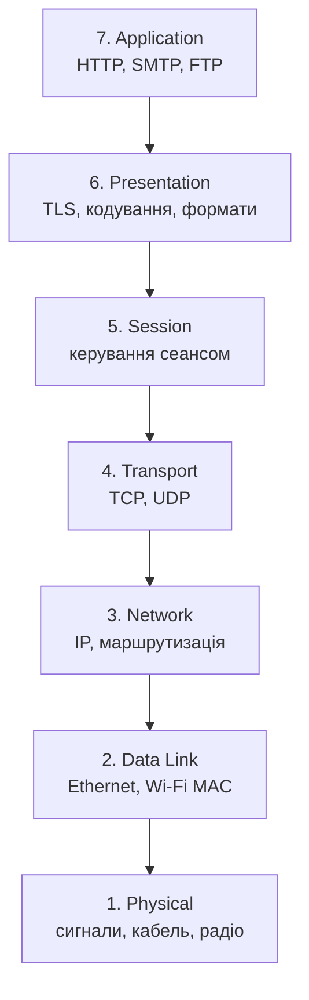
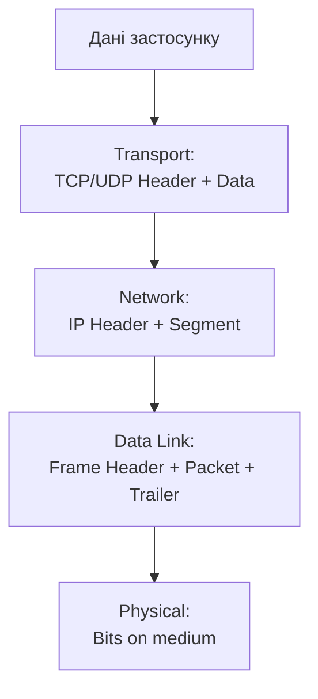

# Модель OSI та стек TCP/IP

## Вступ та Контекст

### Чому мережу не можна зрозуміти як єдине ціле?

Після знайомства з базовими поняттями мережі природно виникає наступне питання: **як саме організована передача даних від прикладної програми до фізичного середовища?** Коли браузер відкриває сторінку, поштовий клієнт надсилає лист, а консольний застосунок виконує `ping`, у кожному випадку відбувається одна й та сама фундаментальна подія: інформація проходить через кілька логічних етапів обробки.

Саме тут починається справжня інженерна дисципліна. Мережі не будуються як хаотичний набір "дротів, пакетів і серверів". Вони будуються як **ієрархія рівнів** (layers), де кожен рівень відповідає за чітко окреслену групу завдань і взаємодіє лише з сусідніми рівнями. Такий підхід дозволяє стандартизувати величезну кількість різнорідних технологій і зробити їх сумісними.

Без цієї моделі мережеве програмування перетворилося б на некеровану суміш деталей. Розробник мав би одночасно думати про сигнали на кабелі, MAC-адреси, маршрутизацію, втрату пакетів, формати HTTP-запитів і ще безліч інших аспектів. Модель рівнів дозволяє розділити складність на частини і працювати з нею системно.

::card-group

::card{title="Що ви дізнаєтесь" icon="i-lucide-graduation-cap"}
- Навіщо виникла модель OSI і яку проблему вона розв'язує
- Які функції виконує кожен із 7 рівнів OSI
- Як стек TCP/IP співвідноситься з OSI
- Що таке інкапсуляція даних і PDU
- Чому прикладному розробнику потрібно мислити рівнями
::

::card{title="Передумови" icon="i-lucide-list-checks"}
- ✅ Розуміння базових мережевих понять з попереднього модуля
- ✅ Уявлення про IP-адресу, порт, клієнт і сервер
- ✅ Базове знайомство з C# та простором імен `System.Net`
::

::

---

## Навіщо потрібна модель рівнів

### Проблема стандартизації

Уявімо світ без загальноприйнятої мережевої моделі. Один виробник вирішує, що програма має сама піклуватися про повторну передачу даних. Інший вважає, що це справа мережевого обладнання. Третій використовує власний формат адресації. У такому середовищі сумісність між системами була б радше винятком, ніж правилом.

Саме цю проблему намагалися вирішити дослідники і стандартизуючі організації у 1970-х та 1980-х роках. Потрібна була абстракція, яка б:

- розділила мережеву взаємодію на зрозумілі функціональні рівні;
- визначила відповідальність кожного рівня;
- дала спільну термінологію інженерам, розробникам і виробникам обладнання;
- дозволила змінювати одну частину системи без переписування всіх інших.

Результатом стала **модель OSI** (Open Systems Interconnection) — еталонна семирівнева модель, запропонована ISO для опису взаємодії відкритих систем.

::note
Модель OSI важлива не тому, що Інтернет "буквально" працює точно за нею в чистому вигляді, а тому, що вона дає **мову опису**. Це концептуальна карта, яка дозволяє не загубитися в деталях.
::

### Аналогія з поштовою службою

Найзручніше зрозуміти модель рівнів через аналогію з поштовою доставкою. Уявімо, що ви надсилаєте паперовий документ в інше місто. Ви не думаєте про все одразу. Ви послідовно проходите кілька стадій:

1. Формулюєте зміст листа.
2. Оформлюєте його в зручний для передачі вигляд.
3. Вкладаєте в конверт і пишете адресу.
4. Передаєте лист у систему доставки.
5. Пошта обирає маршрут і транспортує відправлення.
6. У місці призначення лист проходить зворотний шлях, аж поки адресат не прочитає зміст.

У комп'ютерних мережах відбувається те саме. Дані прикладної програми послідовно "обгортаються" службовою інформацією, спускаються вниз по рівнях, передаються мережею, а на приймальному боці підіймаються вгору, доки не потрапляють у програму-отримувач.

---

## Семирівнева модель OSI

### Загальна картина

Модель OSI складається із семи рівнів. Кожен наступний рівень спирається на послуги попереднього і водночас надає сервіси рівню вище.

::mermaid

::

Щоб не перетворити цей список на формальне заучування, розглянемо кожен рівень не як абстрактну назву, а як відповідь на конкретну проблему.

::accordion

::accordion-item{label="7. Прикладний рівень (Application)" icon="i-lucide-app-window"}
Це рівень, найближчий до користувача та прикладної програми. Саме тут живуть протоколи, з якими найчастіше працює розробник: **HTTP**, **SMTP**, **FTP**, **DNS**, **WebSocket**.

Його завдання не в тому, щоб фізично передати біти, а в тому, щоб визначити **смислові правила взаємодії**. Наприклад, HTTP описує, що таке запит, метод, заголовок, тіло відповіді та статус-код.

Для C#-розробника це рівень `HttpClient`, `SmtpClient`, `TcpClient` поверх власного прикладного протоколу або будь-якої бібліотеки, що реалізує мережевий API високого рівня.
::

::accordion-item{label="6. Рівень представлення (Presentation)" icon="i-lucide-braces"}
Якщо прикладний рівень відповідає за сенс повідомлення, то рівень представлення відповідає за **форму подання даних**. Тут вирішуються питання кодування, серіалізації, стиснення та шифрування.

Типові приклади:
- перетворення рядків у UTF-8;
- серіалізація JSON або XML;
- стиснення вмісту;
- криптографічний захист через TLS.

У реальних стекових реалізаціях цей рівень не завжди виділений окремо як самостійний програмний шар, але концептуально він надзвичайно важливий: дві системи можуть бути ідеально з'єднані фізично, але не зрозуміють одна одну, якщо по-різному трактують формат даних.
::

::accordion-item{label="5. Сеансовий рівень (Session)" icon="i-lucide-repeat"}
Сеансовий рівень керує **логікою сеансу взаємодії**: встановленням, підтримкою та завершенням тривалої комунікації між сторонами.

Його задача полягає не просто в передачі байтів, а в організації впорядкованої розмови. У деяких системах саме тут існують механізми синхронізації, відновлення діалогу або контролю над довгими взаємодіями.

У сучасному прикладному програмуванні цей рівень часто розчиняється між транспортним і прикладним, але як концепція він допомагає зрозуміти різницю між "разовим повідомленням" і "керованим сеансом зв'язку".
::

::accordion-item{label="4. Транспортний рівень (Transport)" icon="i-lucide-arrow-left-right"}
Транспортний рівень відповідає за доставку даних **між процесами**, а не просто між комп'ютерами. Саме тут з'являються **порти**, а також поняття надійної чи ненадійної передачі.

Два фундаментальні протоколи цього рівня:
- **TCP** — орієнтований на з'єднання, надійний, із підтвердженням, повторною передачею і впорядкуванням;
- **UDP** — безз'єднальний, легкий, швидший, але без гарантій доставки.

Для програміста це один із найважливіших рівнів, бо саме тут вирішується, чи буде ваша взаємодія потоковою, датаграмною, надійною чи максимально швидкою.
::

::accordion-item{label="3. Мережевий рівень (Network)" icon="i-lucide-route"}
Це рівень логічної адресації та маршрутизації. Він відповідає на питання: **як доставити пакет з однієї мережі в іншу?**

Тут працює протокол **IP**. Саме на цьому рівні з'являються IP-адреси, маршрути, TTL, фрагментація та проходження через маршрутизатори.

Якщо транспортний рівень думає в категоріях "процес ↔ процес", то мережевий рівень мислить у категоріях "вузол ↔ вузол через набір мереж".
::

::accordion-item{label="2. Канальний рівень (Data Link)" icon="i-lucide-network"}
Канальний рівень відповідає за передавання даних у межах **одного фізичного сегмента мережі**. Тут з'являються **MAC-адреси**, кадри (frames), перевірка цілісності на локальному відрізку, робота комутаторів.

Типові технології цього рівня — **Ethernet** і **Wi-Fi**. Якщо IP визначає, куди в принципі треба доставити пакет у глобальному сенсі, то канальний рівень вирішує, як реально передати його сусідньому вузлу в межах локального каналу.
::

::accordion-item{label="1. Фізичний рівень (Physical)" icon="i-lucide-cable"}
Це найнижчий рівень, на якому немає "пакетів", "запитів" чи "сесій" у звичному для програміста сенсі. Тут існують лише **електричні, оптичні або радіосигнали**, параметри кабелю, частоти, модуляція, рівні напруги, форма імпульсів.

Фізичний рівень не знає, що саме передається: вебсторінка, відео чи електронний лист. Його завдання набагато скромніше і водночас фундаментальніше — зробити так, щоб біти взагалі могли бути представлені в матеріальному середовищі.
::

::

::tip
Практичне правило мислення: що нижче рівень, то менше він "розуміє" зміст даних. Фізичний рівень нічого не знає про HTTP. Транспортний рівень не знає, що в тілі запиту був JSON. Прикладний рівень, навпаки, не повинен думати про форму електричного сигналу на кабелі.
::

---

## Стек TCP/IP

### Чому ми говоримо і про OSI, і про TCP/IP

У практиці Інтернету домінує не "чиста OSI", а **стек TCP/IP** (Internet Protocol Suite). Це не суперечність, а питання рівня абстракції.

- **OSI** — еталонна концептуальна модель із 7 рівнів.
- **TCP/IP** — практичний стек протоколів, на якому реально побудований Інтернет.

Стек TCP/IP зазвичай описують чотирма рівнями:

| TCP/IP | Відповідність OSI | Приклади |
|:---|:---|:---|
| **Application** | OSI 5-7 | HTTP, SMTP, DNS, FTP |
| **Transport** | OSI 4 | TCP, UDP |
| **Internet** | OSI 3 | IP, ICMP |
| **Link** | OSI 1-2 | Ethernet, Wi-Fi |

::tabs

::tab{label="Чому OSI корисна"}
OSI детальніше розділяє функції. Вона дає точнішу навчальну й аналітичну оптику. Особливо корисна для пояснення того, де закінчується прикладний протокол, де починається формат представлення даних і чому "сеанс" — це окрема концепція.
::

::tab{label="Чому TCP/IP практичний"}
TCP/IP ближчий до реальної реалізації стеку Інтернету. Саме в цих термінах говорять RFC, утиліти на кшталт `ping`, мережеві бібліотеки ОС та переважна більшість інженерної документації.
::

::tab{label="Як мислити розробнику"}
На практиці корисно володіти обома моделями. OSI потрібна для розуміння і класифікації проблем, TCP/IP — для читання документації та роботи з реальними протоколами.
::

::

---

## Інкапсуляція даних

### Як повідомлення проходить крізь рівні

Коли прикладна програма хоче надіслати дані мережею, вона не "кидає" їх одразу в кабель. Повідомлення проходить серію перетворень. Кожен рівень додає до даних власну службову інформацію — **заголовок** (header), а інколи й завершальний блок — **trailer**.

Цей процес називається **інкапсуляцією** (encapsulation). На приймальному боці відбувається зворотний процес — **деінкапсуляція** (decapsulation).

::mermaid

::

Розглянемо інкапсуляцію не як абстрактну схему, а як послідовність інженерних рішень:

1. **Прикладний рівень** формує зміст повідомлення, наприклад HTTP-запит.
2. **Транспортний рівень** додає інформацію про порти, порядок сегментів, надійність або її відсутність.
3. **Мережевий рівень** додає IP-адреси джерела й призначення, щоб пакет можна було маршрутизувати.
4. **Канальний рівень** оформлює все у вигляді кадру, придатного для передачі в конкретному локальному середовищі.
5. **Фізичний рівень** перетворює бітову послідовність на сигнали.

### Чому це настільки важливо

Інкапсуляція є одним із найсильніших інженерних принципів у комп'ютерних мережах. Вона дає змогу:

- змінити технологію нижчого рівня без переписування протоколів верхнього рівня;
- використовувати один і той самий HTTP поверх різних транспортів і каналів;
- локалізувати проблеми: якщо пошкоджено кадр у Wi-Fi, це не означає, що проблема в JSON-серіалізації;
- будувати модульні реалізації стеку в операційних системах і бібліотеках.

---

## PDU: як називаються дані на кожному рівні

У мережевій теорії недостатньо казати "передаємо дані". На кожному рівні ці "дані" мають власний формат і власну назву. Узагальнений термін для них — **PDU** (Protocol Data Unit).

| Рівень | PDU | Що це означає |
|:---|:---|:---|
| **Application / Presentation / Session** | Data | Прикладні дані |
| **Transport** | Segment / Datagram | TCP-сегмент або UDP-датаграма |
| **Network** | Packet | IP-пакет |
| **Data Link** | Frame | Кадр Ethernet/Wi-Fi |
| **Physical** | Bits | Бітовий потік |

::note
У повсякденному мовленні часто все називають "пакетами", але це технічно неточно. Для базового спілкування така неточність терпима, однак для професійного аналізу важливо розрізняти **сегмент**, **пакет** і **кадр**.
::

### Один і той самий запит очима різних рівнів

Припустімо, ви виконуєте HTTP-запит із C# через `HttpClient`. Для прикладного рівня це "HTTP GET /users". Для транспортного — послідовність байтів усередині TCP-сегмента. Для мережевого — корисне навантаження IP-пакета. Для канального — вміст Ethernet-кадру. Для фізичного — зміни електричного або радіосигналу.

Це не п'ять різних подій, а **одна і та сама комунікація**, описана з п'яти різних точок зору. Саме в цьому і полягає сила рівневої моделі: вона дозволяє не плутати перспективи.

---

## Практичне значення для C#-розробника

### Чому ця теорія не є "мережевою філософією"

Поширена помилка початківця полягає в тому, щоб сприймати OSI як матеріал "для іспиту", не пов'язаний із повсякденною розробкою. Насправді майже кожна мережева проблема у прикладному коді точніше формулюється саме через рівні.

Розгляньмо кілька типових ситуацій:

- Якщо доменне ім'я не резолвиться, проблема знаходиться між прикладним і мережевим контекстом, а не всередині JSON-парсера.
- Якщо TCP-з'єднання не встановлюється, проблема транспортна, навіть якщо ви викликаєте її з `HttpClient`.
- Якщо сервер повернув `404` або `500`, це вже прикладний рівень: транспорт міг спрацювати бездоганно.
- Якщо Wi-Fi нестабільний, але програма "бачить" лише обриви сокета, першопричина може лежати значно нижче за код застосунку.

::tip
Сильний інженер відрізняється від слабкого не тим, що "знає більше термінів", а тим, що **швидко локалізує рівень проблеми**. Це економить години безсистемного пошуку.
::

### Як це проявляється у .NET

Навіть бібліотеки високого рівня у .NET віддзеркалюють багаторівневу природу мережі:

- `HttpClient` працює на прикладному рівні.
- `SslStream` або HTTPS-взаємодія торкаються представлення й безпеки.
- `TcpClient`, `TcpListener`, `UdpClient` — це транспортний рівень.
- `IPAddress`, `IPEndPoint`, `Ping`, `Dns` — це місток до мережевого рівня й діагностики.

Коли ви розумієте, на якому рівні живе клас або протокол, код перестає бути набором API-викликів і починає складатися у систему.

---

## Практика та закріплення

### Рівень 1. Концептуальне розуміння

1. Поясніть, чому модель OSI взагалі з'явилася. Яку проблему вона вирішує в порівнянні з "хаотичною" мережею без рівнів?
2. Назвіть усі 7 рівнів OSI зверху вниз і коротко сформулюйте головне призначення кожного.
3. Поясніть різницю між моделлю OSI та стеком TCP/IP. Чому в інженерній практиці використовують обидві моделі?

### Рівень 2. Аналітичні вправи

1. Візьміть звичний сценарій: відкриття сторінки у браузері. Опишіть, що відбувається на рівнях Application, Transport, Network і Link.
2. Для кожного з протоколів `HTTP`, `TCP`, `IP`, `Ethernet` визначте його місце в OSI та TCP/IP моделях.
3. Побудуйте власну таблицю відповідності між рівнями OSI і TCP/IP без підглядання, а потім звірте її з матеріалом.

### Рівень 3. Архітектурне мислення

1. Розгляньте помилку: застосунок не може звернутися до API за доменним іменем, але за прямою IP-адресою працює. На якому рівні найімовірніше проблема і чому?
2. Розгляньте іншу ситуацію: DNS працює, `ping` до хоста проходить, але з'єднання з портом `443` не встановлюється. Який це рівень проблеми?
3. Опишіть процес інкапсуляції для простого HTTP-запиту так, ніби ви пояснюєте його студенту першого курсу: від текстового запиту до сигналу в середовищі передачі.

---

## Контрольні питання

1. Чому модель OSI називають еталонною, а не буквальним описом сучасного Інтернету?
2. Яка різниця між прикладним і транспортним рівнями?
3. Чому рівень представлення концептуально важливий навіть тоді, коли в реальному стеку він не виділений окремо?
4. Який зв'язок між IP-адресою, портом і кінцевою точкою взаємодії?
5. Чим відрізняються `segment`, `packet`, `frame` і `bits`?
6. Що таке інкапсуляція і чому без неї масштабований Інтернет був би практично неможливим?
7. Яким чином знання рівнів OSI допомагає швидше діагностувати помилки в прикладному коді?

::note
Якщо цей модуль став для вас зрозумілим не на рівні запам'ятовування назв, а на рівні причинно-наслідкових зв'язків, то далі вивчення IP, TCP, UDP і HTTP піде значно легше. Надалі ми вже не просто називатимемо протоколи, а завжди прив'язуватимемо їх до конкретного рівня і конкретної інженерної задачі.
::
