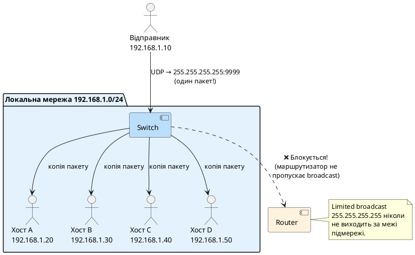
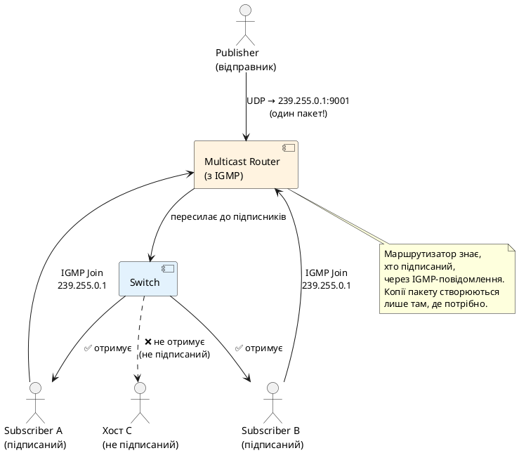
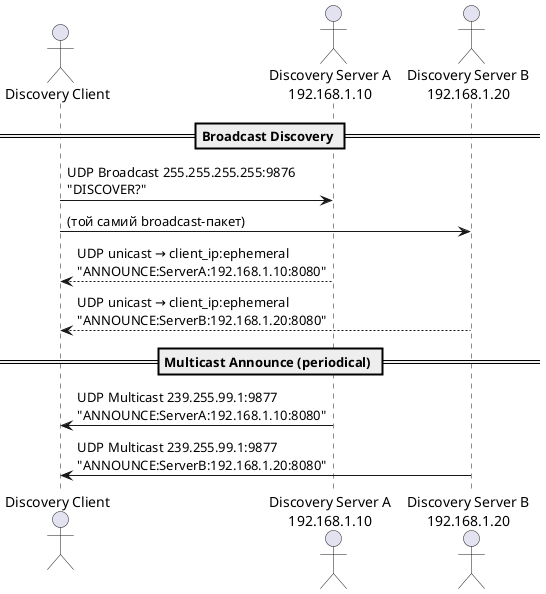

# UDP Broadcast та Multicast

## Проблема групової доставки

У попередній статті ми вивчили базову модель UDP: один відправник — один одержувач (unicast). Але реальний мережевий світ значно складніший. Розглянемо три типові задачі:

1. **Виявлення сервісів**: застосунок запускається і хоче знайти всі принтери/сервери в локальній мережі — без жодних попередніх знань про їхні IP-адреси.
2. **Синхронізація годинника**: сервер точного часу хоче одночасно надіслати поточний timestamp **тисячам** клієнтів у мережі.
3. **Групові оновлення**: система моніторингу розсилає сповіщення про стан усім зацікавленим підписникам.

Для вирішення цих задач через unicast-UDP довелося б знати IP-адресу кожного одержувача та надіслати N окремих дейтаграм. Це неефективно, а іноді й неможливо. Саме для таких сценаріїв існують два механізми: **Broadcast** та **Multicast**.

::note
**Ключова відмінність від unicast:** При unicast маршрутизатор передає пакет лише одному наступному вузлу. При broadcast/multicast мережева інфраструктура сама вирішує, як доставити пакет усім цільовим хостам — відправник надсилає лише **один** пакет.
::

---

## UDP Broadcast

### Що таке Broadcast

**Broadcast** — це механізм доставки, при якому одна дейтаграма надсилається **усім хостам у мережевому сегменті**. Пакет отримують всі пристрої, підключені до тієї ж підмережі (subnet), незалежно від того, чи хочуть вони його отримати.

### Типи broadcast-адрес

В IPv4 існує два типи broadcast-адрес:

::field-group

::field{name="Limited Broadcast — 255.255.255.255" type="тип"}
Надсилає пакет усім хостам у **поточній локальній мережі**. Маршрутизатори **ніколи** не пропускають такі пакети за межі підмережі. Це захист від «broadcast storm» в Інтернеті. В C# це `IPAddress.Broadcast`.
::

::field{name="Directed Broadcast — напр. 192.168.1.255" type="тип"}
Надсилає пакет усім хостам у **конкретній підмережі** (останній октет = 255 для /24). Маршрутизатори **можуть** передавати такі пакети між підмережами (якщо налаштовано), але більшість маршрутизаторів блокує це за замовчуванням (RFC 2644).
::

::

### Як це працює на рівні мережі

::plant-uml



::

Ключовий момент: **switch** (комутатор) дублює broadcast-фрейм на всі свої порти. Це відбувається на рівні Ethernet (MAC broadcast `FF:FF:FF:FF:FF:FF`), ще до того, як хост розпакує IP-пакет.

### Застосування Broadcast

::card-group

::card{title="🔍 Service Discovery" icon="i-lucide-search"}

- mDNS (Multicast DNS) — пошук `.local` імен
- DHCP — клієнт шукає DHCP-сервер при старті
- Ваш чат-клієнт шукає сервер у мережі
- NBNS (NetBIOS Name Service) — Windows

::

::card{title="⚠️ Обмеження Broadcast" icon="i-lucide-alert-triangle"}

- Отримують **усі** хости, навіть ті, що не цікавляться
- Не перетинає межі підмережі (тільки LAN)
- Відсутній в IPv6 (замінений multicast)
- При зловживанні — «broadcast storm»

::

::

---

## UDP Multicast

### Що таке Multicast

**Multicast** — це цільова групова доставка: пакет отримують **лише ті хости, які явно підписались** на конкретну групу. На відміну від broadcast, multicast може перетинати межі підмережі (маршрутизовний multicast через PIM, DVMRP тощо) і є єдиним механізмом групової доставки в **IPv6**.

### Multicast-адреси (клас D)

IPv4 резервує адреси класу D — `224.0.0.0 – 239.255.255.255` — виключно для multicast. Вони поділені на діапазони:

| Діапазон | Назва | Призначення |
|---|---|---|
| `224.0.0.0 – 224.0.0.255` | Link-Local | Локальний сегмент, TTL=1. Не маршрутизується. |
| `224.0.1.0 – 238.255.255.255` | Global scope | Глобальний multicast (для Інтернету) |
| `239.0.0.0 – 239.255.255.255` | Site-Local | Локальний multicast для організації (аналог RFC 1918) |

::tip
Для локальних застосунків завжди використовуйте діапазон **`239.0.0.0 – 239.255.255.255`** (Site-Local). Ці адреси не маршрутизуються в Інтернет, аналогічно `192.168.x.x` для unicast. Наприклад, `239.255.0.1` — хороший вибір для власного сервісу.
::

### Відомі multicast-адреси

| Адреса | Протокол | Використання |
|---|---|---|
| `224.0.0.1` | All Hosts | Всі хости у сегменті |
| `224.0.0.2` | All Routers | Всі маршрутизатори |
| `224.0.0.251` | mDNS | Bonjour / Avahi (`.local`) |
| `239.255.255.250` | SSDP | UPnP, пошук пристроїв (Chromecast, TV) |
| `239.192.0.0` | OpenPGP | Сервери ключів |

### Як це працює: IGMP

Щоб отримувати multicast-пакети, хост надсилає **IGMP** (Internet Group Management Protocol) повідомлення маршрутизатору: «Хочу отримувати пакети для групи `239.255.0.1`». Маршрутизатор запам'ятовує це і починає пересилати відповідні multicast-пакети в цю підмережу.

::plant-uml



::

### Broadcast vs Multicast vs Unicast

| Параметр | Unicast | Broadcast | Multicast |
|---|---|---|---|
| Одержувачі | 1 конкретний | Всі в підмережі | Лише підписані |
| Масштабованість | Погана (N пакетів) | Погана (зайвий трафік) | **Відмінна** |
| Маршрутизація | ✅ | ❌ (в LAN only) | ✅ (при підтримці) |
| IPv6 | ✅ | ❌ (відсутній) | ✅ (обов'язковий) |
| Контроль підписки | — | — | IGMP |
| Типове використання | HTTP, TCP | DHCP, ARP | Відео, mDNS, SSDP |

---

## Практичний приклад: сервіс виявлення у мережі

Побудуємо просту, але реалістичну систему **Network Discovery** — консольний застосунок, що дозволяє автоматично знаходити запущені екземпляри сервісу в локальній мережі без жодної попередньої конфігурації. Ця ж схема лежить в основі Bonjour, SSDP та DNS-SD.

### Сценарій

Є два консольних застосунки: **Server** та **Client**. Клієнт не знає IP сервера. Клієнт надсилає broadcast-запит, сервер відповідає своєю адресою. Клієнт також підписується на multicast-групу, де сервер регулярно анонсує себе.

::plant-uml



::

### Структура проєкту

Створимо один Console-проєкт з двома режимами запуску — через аргумент командного рядка:

::terminal-preview{title="dotnet new"}

<div class="line"><span class="opacity-40">$</span> <strong>dotnet new console -n NetworkDiscovery -o NetworkDiscovery</strong></div>
<div class="line"><span class="text-green-400">The template "Console App" was created successfully.</span></div>
<div class="line"></div>
<div class="line"><span class="opacity-40">$</span> <strong>cd NetworkDiscovery</strong></div>
<div class="line"><span class="opacity-40">$</span> <strong>dotnet run -- server</strong></div>
<div class="line"><span class="text-blue-400">[Server] Discovery Server запущено. Ctrl+C для зупинки.</span></div>

::

### Протокол

Протокол гранично простий: два рядкових повідомлення.

| Повідомлення | Напрям | Транспорт |
|---|---|---|
| `DISCOVER?` | Client → всі | **Broadcast** `255.255.255.255:9876` |
| `ANNOUNCE:name:ip:port` | Server → Client | Unicast (відповідь) **або** Multicast |

### DiscoveryProtocol.cs — спільні константи

```csharp showLineNumbers
// DiscoveryProtocol.cs
namespace NetworkDiscovery;

public static class DiscoveryProtocol
{
    // ── Порти ────────────────────────────────────────────────────────────────

    /// <summary>Порт для broadcast-запитів DISCOVER?</summary>
    public const int BroadcastPort = 9876;

    /// <summary>Порт для multicast-анонсів ANNOUNCE</summary>
    public const int MulticastPort = 9877;

    // ── Адреси ───────────────────────────────────────────────────────────────

    /// <summary>
    /// Multicast-група для анонсів сервісу.
    /// Вибрано з діапазону Site-Local (239.x.x.x),
    /// щоб пакети не виходили за межі організації.
    /// </summary>
    public const string MulticastGroupAddress = "239.255.99.1";

    // ── Команди ──────────────────────────────────────────────────────────────

    public const string CmdDiscover = "DISCOVER?";
    public const string CmdAnnounce = "ANNOUNCE";

    /// <summary>Сервер анонсує себе в multicast кожні 5 секунд.</summary>
    public const int AnnounceIntervalMs = 5_000;

    // ── Формування та парсинг ─────────────────────────────────────────────

    /// <summary>Формує рядок анонсу: ANNOUNCE:name:ip:port</summary>
    public static string FormatAnnounce(string name, string ip, int port) =>
        $"{CmdAnnounce}:{name}:{ip}:{port}";

    /// <summary>
    /// Розбирає ANNOUNCE-рядок.
    /// Повертає null, якщо формат некоректний.
    /// </summary>
    public static ServiceInfo? ParseAnnounce(string raw)
    {
        // Очікуємо рівно: ANNOUNCE:name:ip:port
        var parts = raw.Split(':');
        if (parts.Length != 4) return null;
        if (parts[0] != CmdAnnounce) return null;
        if (!int.TryParse(parts[3], out int port)) return null;

        return new ServiceInfo(parts[1], parts[2], port);
    }
}

/// <summary>Інформація про знайдений сервіс.</summary>
public record ServiceInfo(string Name, string Ip, int Port)
{
    public override string ToString() => $"{Name} @ {Ip}:{Port}";
}
```

### DiscoveryServer.cs — сервер

Сервер виконує дві функції паралельно: відповідає на broadcast-запити та регулярно анонсує себе через multicast.

```csharp showLineNumbers
// DiscoveryServer.cs
namespace NetworkDiscovery;

using System.Net;
using System.Net.NetworkInformation;
using System.Net.Sockets;
using System.Text;

/// <summary>
/// Сервер виявлення. Виконує дві функції паралельно:
/// 1. Слухає broadcast-порт (9876) і відповідає unicast на DISCOVER? запити.
/// 2. Кожні 5 секунд надсилає ANNOUNCE в multicast-групу (239.255.99.1:9877).
/// </summary>
public sealed class DiscoveryServer : IAsyncDisposable
{
    private readonly string _serviceName;
    private readonly int _servicePort;
    private readonly CancellationTokenSource _cts = new();

    // Сокет для прослуховування broadcast-запитів
    private readonly UdpClient _broadcastListener;

    // Сокет для надсилання multicast-анонсів
    private readonly UdpClient _multicastSender;

    private readonly IPEndPoint _multicastEndPoint = new(
        IPAddress.Parse(DiscoveryProtocol.MulticastGroupAddress),
        DiscoveryProtocol.MulticastPort);

    public DiscoveryServer(string serviceName, int servicePort)
    {
        _serviceName = serviceName;
        _servicePort = servicePort;

        // ── Broadcast listener ──────────────────────────────────────────
        _broadcastListener = new UdpClient();
        // ReuseAddress дозволяє кільком процесам слухати той самий порт
        _broadcastListener.Client.SetSocketOption(
            SocketOptionLevel.Socket, SocketOptionName.ReuseAddress, true);
        _broadcastListener.Client.Bind(
            new IPEndPoint(IPAddress.Any, DiscoveryProtocol.BroadcastPort));
        _broadcastListener.EnableBroadcast = true;

        // ── Multicast sender ────────────────────────────────────────────
        _multicastSender = new UdpClient();
        // TTL=32: пакет може пройти через до 32 маршрутизаторів
        _multicastSender.Client.SetSocketOption(
            SocketOptionLevel.IP, SocketOptionName.MulticastTimeToLive, 32);
    }

    public async Task RunAsync()
    {
        string localIp = GetLocalIpAddress();
        Console.WriteLine($"[Server] Сервіс '{_serviceName}' на {localIp}:{_servicePort}");
        Console.WriteLine($"[Server] Broadcast listener: :{DiscoveryProtocol.BroadcastPort}");
        Console.WriteLine($"[Server] Multicast announcer: {DiscoveryProtocol.MulticastGroupAddress}:{DiscoveryProtocol.MulticastPort}");
        Console.WriteLine("[Server] Ctrl+C для зупинки.");

        Console.CancelKeyPress += (_, e) => { e.Cancel = true; _cts.Cancel(); };

        await Task.WhenAll(
            BroadcastListenerLoopAsync(localIp, _cts.Token),
            MulticastAnnouncerLoopAsync(localIp, _cts.Token)
        );

        Console.WriteLine("[Server] Зупинено.");
    }

    // ── Відповідь на broadcast-запити ─────────────────────────────────────────

    private async Task BroadcastListenerLoopAsync(string localIp, CancellationToken ct)
    {
        while (!ct.IsCancellationRequested)
        {
            UdpReceiveResult result;
            try { result = await _broadcastListener.ReceiveAsync(ct); }
            catch (OperationCanceledException) { break; }
            catch (SocketException ex)
            {
                Console.WriteLine($"[Server] Broadcast помилка: {ex.SocketErrorCode}");
                continue;
            }

            string message = Encoding.UTF8.GetString(result.Buffer).Trim();
            Console.WriteLine($"[Server] Broadcast від {result.RemoteEndPoint}: '{message}'");

            if (message == DiscoveryProtocol.CmdDiscover)
            {
                // Відповідаємо unicast безпосередньо відправнику
                string announce = DiscoveryProtocol.FormatAnnounce(
                    _serviceName, localIp, _servicePort);
                byte[] response = Encoding.UTF8.GetBytes(announce);

                try
                {
                    await _broadcastListener.SendAsync(response, result.RemoteEndPoint, ct);
                    Console.WriteLine($"[Server] → Unicast відповідь: '{announce}'");
                }
                catch (SocketException ex)
                {
                    Console.WriteLine($"[Server] Помилка відповіді: {ex.SocketErrorCode}");
                }
            }
        }
    }

    // ── Регулярний multicast-анонс ─────────────────────────────────────────────

    private async Task MulticastAnnouncerLoopAsync(string localIp, CancellationToken ct)
    {
        string announce = DiscoveryProtocol.FormatAnnounce(
            _serviceName, localIp, _servicePort);
        byte[] data = Encoding.UTF8.GetBytes(announce);

        while (!ct.IsCancellationRequested)
        {
            try
            {
                await _multicastSender.SendAsync(data, _multicastEndPoint, ct);
                Console.WriteLine($"[Server] Multicast → '{announce}'");
                await Task.Delay(DiscoveryProtocol.AnnounceIntervalMs, ct);
            }
            catch (OperationCanceledException) { break; }
            catch (SocketException ex)
            {
                Console.WriteLine($"[Server] Multicast помилка: {ex.SocketErrorCode}");
                await Task.Delay(1000, ct);
            }
        }
    }

    // ── Визначення локальної IP-адреси ────────────────────────────────────────

    private static string GetLocalIpAddress()
    {
        foreach (var ni in NetworkInterface.GetAllNetworkInterfaces())
        {
            if (ni.OperationalStatus != OperationalStatus.Up) continue;
            if (ni.NetworkInterfaceType == NetworkInterfaceType.Loopback) continue;

            foreach (var addr in ni.GetIPProperties().UnicastAddresses)
            {
                if (addr.Address.AddressFamily == AddressFamily.InterNetwork)
                    return addr.Address.ToString();
            }
        }
        return "127.0.0.1";
    }

    public async ValueTask DisposeAsync()
    {
        await _cts.CancelAsync();
        _broadcastListener.Dispose();
        _multicastSender.Dispose();
        _cts.Dispose();
    }
}
```

### DiscoveryClient.cs — клієнт

Клієнт виконує дві функції: надсилає broadcast-запит та прослуховує multicast-групу для пасивного виявлення.

```csharp showLineNumbers
// DiscoveryClient.cs
namespace NetworkDiscovery;

using System.Net;
using System.Net.Sockets;
using System.Text;

/// <summary>
/// Клієнт виявлення. Виконує два типи пошуку:
/// 1. Активний — надсилає broadcast DISCOVER? і збирає unicast-відповіді.
/// 2. Пасивний — підписується на multicast-групу та слухає анонси.
/// </summary>
public sealed class DiscoveryClient : IAsyncDisposable
{
    private readonly CancellationTokenSource _cts = new();

    // Сокет для надсилання broadcast і отримання unicast-відповідей
    private readonly UdpClient _broadcastSender;

    // Сокет для отримання multicast-анонсів
    private readonly UdpClient _multicastListener;

    private readonly IPEndPoint _broadcastEndPoint = new(
        IPAddress.Broadcast, DiscoveryProtocol.BroadcastPort);

    private readonly IPAddress _multicastGroup =
        IPAddress.Parse(DiscoveryProtocol.MulticastGroupAddress);

    public DiscoveryClient()
    {
        // ── Broadcast sender (також отримує unicast-відповіді) ──────────
        _broadcastSender = new UdpClient();
        _broadcastSender.EnableBroadcast = true;
        // Прив'язуємо до довільного порту — ОС призначить ефемерний
        _broadcastSender.Client.Bind(new IPEndPoint(IPAddress.Any, 0));

        // ── Multicast listener ──────────────────────────────────────────
        _multicastListener = new UdpClient();
        _multicastListener.Client.SetSocketOption(
            SocketOptionLevel.Socket, SocketOptionName.ReuseAddress, true);
        _multicastListener.Client.Bind(
            new IPEndPoint(IPAddress.Any, DiscoveryProtocol.MulticastPort));

        // Підписуємось на multicast-групу через IGMP
        _multicastListener.JoinMulticastGroup(_multicastGroup);
    }

    // ── Активний пошук через Broadcast ───────────────────────────────────────

    /// <summary>
    /// Надсилає DISCOVER? broadcast та збирає відповіді протягом <paramref name="timeoutSeconds"/> секунд.
    /// </summary>
    public async Task<List<ServiceInfo>> DiscoverViaBroadcastAsync(int timeoutSeconds = 3)
    {
        var found = new List<ServiceInfo>();

        byte[] request = Encoding.UTF8.GetBytes(DiscoveryProtocol.CmdDiscover);
        await _broadcastSender.SendAsync(request, _broadcastEndPoint);
        Console.WriteLine($"[Client] Broadcast DISCOVER? надіслано → {_broadcastEndPoint}");

        using var timeoutCts = new CancellationTokenSource(
            TimeSpan.FromSeconds(timeoutSeconds));

        Console.WriteLine($"[Client] Збираємо відповіді протягом {timeoutSeconds}с...");

        while (!timeoutCts.Token.IsCancellationRequested)
        {
            try
            {
                UdpReceiveResult result =
                    await _broadcastSender.ReceiveAsync(timeoutCts.Token);

                string raw = Encoding.UTF8.GetString(result.Buffer).Trim();
                ServiceInfo? info = DiscoveryProtocol.ParseAnnounce(raw);

                if (info is not null && !found.Any(s => s.Ip == info.Ip && s.Port == info.Port))
                {
                    found.Add(info);
                    Console.ForegroundColor = ConsoleColor.Green;
                    Console.WriteLine($"[Client] ✅ Знайдено (broadcast): {info}");
                    Console.ResetColor();
                }
            }
            catch (OperationCanceledException) { break; }
            catch (SocketException ex)
            {
                Console.WriteLine($"[Client] Помилка прийому: {ex.SocketErrorCode}");
                break;
            }
        }

        return found;
    }

    // ── Пасивний пошук через Multicast ───────────────────────────────────────

    /// <summary>
    /// Слухає multicast-групу та виводить кожен новий анонс.
    /// Зупиняється при натисканні Ctrl+C або виклику DisposeAsync().
    /// </summary>
    public async Task ListenMulticastAsync()
    {
        Console.WriteLine($"[Client] Слухаємо multicast {DiscoveryProtocol.MulticastGroupAddress}:{DiscoveryProtocol.MulticastPort}...");
        Console.WriteLine("[Client] Ctrl+C для зупинки.");

        Console.CancelKeyPress += (_, e) => { e.Cancel = true; _cts.Cancel(); };

        var seen = new HashSet<string>(); // щоб не дублювати у виводі

        while (!_cts.Token.IsCancellationRequested)
        {
            UdpReceiveResult result;
            try { result = await _multicastListener.ReceiveAsync(_cts.Token); }
            catch (OperationCanceledException) { break; }
            catch (SocketException ex)
            {
                Console.WriteLine($"[Client] Multicast помилка: {ex.SocketErrorCode}");
                break;
            }

            string raw = Encoding.UTF8.GetString(result.Buffer).Trim();
            ServiceInfo? info = DiscoveryProtocol.ParseAnnounce(raw);

            if (info is not null)
            {
                string key = $"{info.Ip}:{info.Port}";
                bool isNew = seen.Add(key);

                Console.ForegroundColor = isNew ? ConsoleColor.Green : ConsoleColor.Gray;
                string prefix = isNew ? "✅ Новий сервіс" : "🔄 Анонс";
                Console.WriteLine($"[Client] {prefix}: {info}");
                Console.ResetColor();
            }
        }

        // Відписуємось від multicast-групи при завершенні
        _multicastListener.DropMulticastGroup(_multicastGroup);
        Console.WriteLine("[Client] Зупинено.");
    }

    public async ValueTask DisposeAsync()
    {
        await _cts.CancelAsync();
        _broadcastSender.Dispose();
        _multicastListener.Dispose();
        _cts.Dispose();
    }
}
```

### Program.cs — точка входу

```csharp showLineNumbers
// Program.cs
using NetworkDiscovery;

string mode = args.Length > 0 ? args[0].ToLower() : string.Empty;

switch (mode)
{
    case "server":
        // dotnet run -- server MyService 8080
        string name = args.Length > 1 ? args[1] : $"Service-{Environment.MachineName}";
        int port    = args.Length > 2 && int.TryParse(args[2], out int p) ? p : 8080;

        await using var server = new DiscoveryServer(name, port);
        await server.RunAsync();
        break;

    case "broadcast":
        // Активний пошук: надсилає broadcast і чекає на відповіді
        await using (var client = new DiscoveryClient())
        {
            var services = await client.DiscoverViaBroadcastAsync(timeoutSeconds: 3);

            Console.WriteLine();
            Console.WriteLine($"=== Знайдено сервісів: {services.Count} ===");
            foreach (var svc in services)
                Console.WriteLine($"  • {svc}");
        }
        break;

    case "multicast":
        // Пасивне прослуховування multicast-анонсів
        await using (var client = new DiscoveryClient())
        {
            await client.ListenMulticastAsync();
        }
        break;

    default:
        Console.WriteLine("Використання:");
        Console.WriteLine("  dotnet run -- server [name] [port]   — запустити сервер");
        Console.WriteLine("  dotnet run -- broadcast              — знайти сервери (broadcast)");
        Console.WriteLine("  dotnet run -- multicast              — слухати multicast-анонси");
        break;
}
```

---

### Запуск та демонстрація

Для тестування відкрийте кілька термінальних вікон в одній директорії проєкту.

::steps

### Запустіть сервер (термінал 1)

::terminal-preview{title="Terminal 1 — Discovery Server"}

<div class="line"><span class="opacity-40">$</span> <strong>dotnet run -- server MyApiService 8080</strong></div>
<div class="line"><span class="text-blue-400">[Server] Сервіс 'MyApiService' на 192.168.1.15:8080</span></div>
<div class="line"><span class="text-blue-400">[Server] Broadcast listener: :9876</span></div>
<div class="line"><span class="text-blue-400">[Server] Multicast announcer: 239.255.99.1:9877</span></div>
<div class="line">[Server] Ctrl+C для зупинки.</div>
<div class="line"><span class="text-gray-400">[Server] Multicast → 'ANNOUNCE:MyApiService:192.168.1.15:8080'</span></div>

::

### Знайдіть сервер через Broadcast (термінал 2)

::terminal-preview{title="Terminal 2 — Broadcast Discovery"}

<div class="line"><span class="opacity-40">$</span> <strong>dotnet run -- broadcast</strong></div>
<div class="line">[Client] Broadcast DISCOVER? надіслано → 255.255.255.255:9876</div>
<div class="line">[Client] Збираємо відповіді протягом 3с...</div>
<div class="line"><span class="text-green-400">[Client] ✅ Знайдено (broadcast): MyApiService @ 192.168.1.15:8080</span></div>
<div class="line"></div>
<div class="line">=== Знайдено сервісів: 1 ===</div>
<div class="line">  • MyApiService @ 192.168.1.15:8080</div>

::

### Слухайте multicast-анонси (термінал 3)

::terminal-preview{title="Terminal 3 — Multicast Listener"}

<div class="line"><span class="opacity-40">$</span> <strong>dotnet run -- multicast</strong></div>
<div class="line">[Client] Слухаємо multicast 239.255.99.1:9877...</div>
<div class="line">[Client] Ctrl+C для зупинки.</div>
<div class="line"><span class="text-green-400">[Client] ✅ Новий сервіс: MyApiService @ 192.168.1.15:8080</span></div>
<div class="line"><span class="text-gray-400">[Client] 🔄 Анонс: MyApiService @ 192.168.1.15:8080</span></div>
<div class="line"><span class="text-gray-400">[Client] 🔄 Анонс: MyApiService @ 192.168.1.15:8080</span></div>

::

### Вивід сервера після broadcast-запиту

::terminal-preview{title="Terminal 1 — Server (after broadcast)"}

<div class="line"><span class="text-gray-400">[Server] Multicast → 'ANNOUNCE:MyApiService:192.168.1.15:8080'</span></div>
<div class="line"><span class="text-blue-400">[Server] Broadcast від 192.168.1.7:54231: 'DISCOVER?'</span></div>
<div class="line"><span class="text-green-400">[Server] → Unicast відповідь: 'ANNOUNCE:MyApiService:192.168.1.15:8080'</span></div>
<div class="line"><span class="text-gray-400">[Server] Multicast → 'ANNOUNCE:MyApiService:192.168.1.15:8080'</span></div>

::

::

---

## Підсумок

::card-group

::card{title="📡 Broadcast" icon="i-lucide-radio"}

- Доставляє пакет **усім** у локальній підмережі
- Адреса `255.255.255.255` — limited broadcast, не виходить за LAN
- Потрібно `EnableBroadcast = true` на сокеті
- Відсутній в IPv6 — замінений multicast
- Ідеально для: DHCP, ARP, service discovery в LAN

::

::card{title="📶 Multicast" icon="i-lucide-signal"}

- Доставляє лише **підписаним** (`JoinMulticastGroup`)
- Адреси класу D: `224.0.0.0 – 239.255.255.255`
- Для локальних застосунків: `239.x.x.x` (Site-Local)
- Протокол підписки: IGMP (ОС керує автоматично)
- При завершенні — `DropMulticastGroup`

::

::

::tip
**Коли що обирати:**
- **Broadcast** — коли потрібно знайти щось у LAN одним запитом (DHCP-стиль).
- **Multicast** — коли є постійний потік даних для групи підписників, або коли важлива масштабованість за межі одного сегменту.
::
