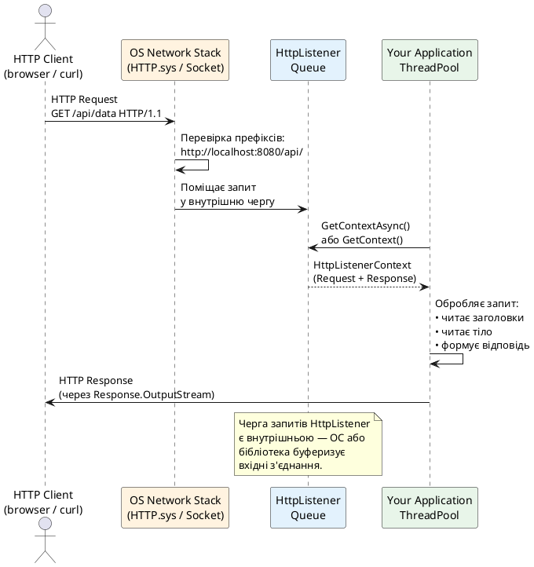

# HttpListener — вбудований HTTP-сервер .NET

## Що таке HttpListener і навіщо він потрібен

У попередньому розділі ми вивчили `HttpClient` — клієнтську сторону HTTP. Але .NET надає й серверну сторону без будь-яких фреймворків: клас `System.Net.HttpListener`. Він дозволяє отримувати та обробляти HTTP-запити безпосередньо у будь-якому .NET-застосунку — без ASP.NET Core, без IIS, без Kestrel.

`HttpListener` є тонкою керованою обгорткою навколо операційної системи: на Windows він використовує `HTTP.sys` — системний HTTP-сервер, вбудований у ядро ОС. На Linux і macOS `HttpListener` використовує власну реалізацію на основі сокетів. У всіх випадках результат однаковий: ваш процес може відповідати на HTTP-запити безпосередньо із зазначеного URL-префіксу.

::note
**Ключова різниця від ASP.NET Core:** `HttpListener` — це **примітивний** HTTP-сервер. Він не надає middleware pipeline, dependency injection, маршрутизації, model binding, Razor Pages чи будь-чого подібного. Це просто «слухач», що дає вам сирий `HttpListenerRequest` і `HttpListenerResponse` — далі ви будуєте всю логіку самостійно. Саме тому `HttpListener` цінний як навчальний інструмент і як компонент для специфічних вбудованих сценаріїв.
::

### Сценарії застосування

Незважаючи на простоту (або завдяки їй), `HttpListener` є правильним інструментом у кількох ситуаціях:

**Тестові та mock-сервери.** У unit і integration тестах часто потрібен реальний HTTP-сервер, що відповідає на конкретні запити. `HttpListener` запускається за мілісекунди і не тягне за собою весь стек ASP.NET Core.

**Утиліти командного рядка.** Якщо ваша CLI-утиліта повинна тимчасово відкрити HTTP-ендпоінт (наприклад, для OAuth callback або webhooks), `HttpListener` — найлегше рішення.

**Вбудовані системи та IoT.** На пристроях з обмеженими ресурсами (Windows IoT, embedded .NET) повноцінний ASP.NET Core може бути надмірним. `HttpListener` дає мінімальний HTTP-сервер із мінімальними залежностями.

**Адміністративні інтерфейси.** Десктопні застосунки іноді відкривають HTTP-ендпоінт для управління або моніторингу без запуску окремого сервера.

**Навчання.** Робота з `HttpListener` дозволяє зрозуміти HTTP без «магії» фреймворків: обробка заголовків, відповіді, статус-коди, потокова передача — все вручну.

---

## Архітектура та принцип роботи

`HttpListener` будується на концепції **URL-префіксів** (URL prefixes). Ви реєструєте один або кілька префіксів, і ОС спрямовує відповідні HTTP-запити до вашого процесу.

::plant-uml



::

### URL-префікси: основна концепція

Префікс — це рядок вигляду `scheme://host:port/path/`. Зверніть увагу на **обов'язковий** завершальний слеш `/`. Декілька правил префіксів:

- `http://localhost:8080/` — усі запити на localhost:8080
- `http://localhost:8080/api/` — лише шляхи, що починаються з `/api/`
- `http://+:8080/` — усі інтерфейси на порту 8080 (еквівалент `0.0.0.0`)
- `http://*:8080/` — аналогічно `+`, але менш суворий пріоритет
- `https://+:443/` — HTTPS на всіх інтерфейсах (потрібен сертифікат)

Символи `+` і `*` є сильними та слабкими wildcard відповідно. `+` обирається, якщо є і `+`, і конкретний хост на тому ж порту.

::warning
На Windows для прослуховування не-localhost адрес (особливо `+` або `*`) без прав адміністратора необхідно попередньо зареєструвати URL-простір командою `netsh`:

```powershell
# Дозволити поточному користувачу прослуховувати http://+:8080/api/
netsh http add urlacl url=http://+:8080/api/ user=DOMAIN\username

# Перегляд зареєстрованих префіксів
netsh http show urlacl

# Видалення
netsh http delete urlacl url=http://+:8080/api/
```

`localhost` — виняток: для нього права адміністратора не потрібні.
::

---

## API класу HttpListener

### Клас HttpListener

::field-group

::field{name="Prefixes" type="HttpListenerPrefixCollection"}
Колекція URL-префіксів, на яких `HttpListener` буде приймати запити. Префікси додаються методом `Add(string)` до виклику `Start()`. Зміна після `Start()` можлива, але залежить від реалізації (HTTP.sys підтримує динамічне додавання).
::

::field{name="IsListening" type="bool (readonly)"}
Повертає `true`, якщо `Start()` було викликано і `Stop()` / `Abort()` ще не виконано. Корисно для перевірки стану перед викликом `GetContext()`.
::

::field{name="AuthenticationSchemes" type="AuthenticationSchemes (enum)"}
Схема аутентифікації на рівні HTTP: `None` (за замовчуванням), `Basic`, `Digest`, `Ntlm`, `Negotiate`, `Anonymous`. Можна комбінувати прапорці. При `Basic` клієнт надсилає `Authorization: Basic base64(user:password)`.
::

::field{name="AuthenticationSchemeSelectorDelegate" type="Func<HttpListenerRequest, AuthenticationSchemes>"}
Динамічний вибір схеми аутентифікації залежно від запиту. Дозволяє вимагати Basic Auth для одних шляхів і `Anonymous` для інших.
::

::field{name="Realm" type="string"}
Рядок realm для Basic та Digest аутентифікації. Відображається браузером у діалозі входу: `Authorization Required — realm`. Типово: назва застосунку або домену.
::

::field{name="IgnoreWriteExceptions" type="bool"}
Якщо `true` — виключення при записі у `Response.OutputStream` (наприклад, клієнт розірвав з'єднання) ігноруються. Корисно при потоковій передачі, щоб один відключений клієнт не руйнував цикл обробки.
::

::field{name="TimeoutManager" type="HttpListenerTimeoutManager"}
Управління таймаутами з'єднань: `DrainEntityBody`, `EntityBody`, `HeaderWait`, `IdleConnection`, `MinSendBytesPerSecond`, `RequestQueue`. Дозволяє тонко налаштувати поведінку при повільних або зависаючих клієнтах.
::

::

### Методи HttpListener

::field-group

::field{name="Start()" type="void"}
Відкриває прослуховування на зареєстрованих префіксах. На Windows реєструє префікси у HTTP.sys. Кидає `HttpListenerException`, якщо порт зайнятий або недостатньо прав. Після `Start()` префікси можна лише переглядати (зміна залежить від реалізації).
::

::field{name="Stop()" type="void"}
Зупиняє прослуховування нових з'єднань. Вже прийняті запити можна завершити. `GetContext()` / `GetContextAsync()` повернуть `null` або кинуть виключення. Після `Stop()` можна знову викликати `Start()`.
::

::field{name="Abort()" type="void"}
Негайно скасовує всі з'єднання та ресурси без очікування завершення поточних запитів. Використовуйте для аварійного відключення.
::

::field{name="Close()" type="void"}
Еквівалентний `Abort()` + звільнення ресурсів. Після `Close()` об'єкт не може бути перезапущений.
::

::field{name="GetContext()" type="HttpListenerContext"}
**Синхронний** метод. Блокує поточний потік до отримання наступного запиту. Повертає `HttpListenerContext` із парою `Request`/`Response`. При `Stop()` під час очікування кидає `HttpListenerException`.
::

::field{name="GetContextAsync()" type="Task<HttpListenerContext>"}
**Асинхронний** метод. Повертає `Task`, що завершується при надходженні запиту. Є правильним підходом для серверів, оскільки не блокує потік. Підтримує `CancellationToken` через `Task`-обгортку.
::

::field{name="BeginGetContext() / EndGetContext()" type="IAsyncResult / HttpListenerContext"}
Застарілий APM (Asynchronous Programming Model) підхід. Не використовуйте у новому коді — є `GetContextAsync()`.
::

::

---

## API класу HttpListenerContext

`HttpListenerContext` — це «контейнер» одного HTTP-обміну: запит + відповідь.

::field-group

::field{name="Request" type="HttpListenerRequest (readonly)"}
Вхідний HTTP-запит від клієнта. Містить URL, метод, заголовки, тіло та інформацію про клієнта.
::

::field{name="Response" type="HttpListenerResponse (readonly)"}
Відповідь, що буде надіслана клієнту. Ви заповнюєте статус, заголовки та тіло. `Close()` або `OutputStream.Close()` надсилає відповідь клієнту.
::

::field{name="User" type="IPrincipal? (readonly)"}
Автентифікований користувач. Не `null` лише якщо `AuthenticationSchemes` не `None`/`Anonymous` і клієнт надав валідні облікові дані. Містить `Identity` з `Name` та `AuthenticationType`.
::

::

---

## API класу HttpListenerRequest

`HttpListenerRequest` надає доступ до всіх аспектів вхідного HTTP-запиту:

::field-group

::field{name="HttpMethod" type="string"}
HTTP-метод запиту: `"GET"`, `"POST"`, `"PUT"`, `"DELETE"`, `"PATCH"`, `"HEAD"`, `"OPTIONS"`. Завжди у верхньому регістрі.
::

::field{name="Url" type="Uri"}
Повний URL запиту, включно зі схемою, хостом, портом та шляхом: `http://localhost:8080/api/users?page=1`. Включає query string.
::

::field{name="RawUrl" type="string"}
Сирий URL без схеми та хосту: `/api/users?page=1`. Зручний для маршрутизації.
::

::field{name="QueryString" type="NameValueCollection"}
Розібрані параметри query string. `request.QueryString["page"]` → `"1"`. При кількох значеннях одного ключа повертає їх через кому.
::

::field{name="Headers" type="WebHeaderCollection"}
Всі заголовки запиту. Регістронезалежний доступ: `request.Headers["Content-Type"]` або `request.Headers[HttpRequestHeader.ContentType]`.
::

::field{name="InputStream" type="Stream"}
Потік тіла запиту. Для `GET` / `HEAD` — порожній. Для `POST` / `PUT` — містить тіло. Читайте за допомогою `StreamReader` або `JsonSerializer.DeserializeAsync()`.
::

::field{name="ContentType" type="string?"}
Значення заголовку `Content-Type`: `"application/json; charset=utf-8"`. Може бути `null` якщо заголовок відсутній.
::

::field{name="ContentLength64" type="long"}
Довжина тіла запиту в байтах (заголовок `Content-Length`). `-1` якщо `Content-Length` не вказано (може бути chunked).
::

::field{name="IsAuthenticated" type="bool"}
`true` якщо аутентифікація пройшла успішно (доступний `context.User`).
::

::field{name="RemoteEndPoint" type="IPEndPoint"}
IP-адреса та порт клієнта: `192.168.1.100:54321`. Для визначення джерела запиту. При наявності проксі — адреса проксі, а не кінцевого клієнта.
::

::field{name="IsLocal" type="bool"}
`true` якщо запит надійшов з того самого хосту (localhost). Зручно для захисту адміністративних ендпоінтів.
::

::field{name="IsSecureConnection" type="bool"}
`true` для HTTPS-з'єднань. Корисно, якщо `HttpListener` обслуговує обидва протоколи.
::

::field{name="Cookies" type="CookieCollection"}
Cookies із заголовку `Cookie`. Доступ за іменем: `request.Cookies["session"]?.Value`.
::

::field{name="AcceptTypes" type="string[]?"}
Розібраний заголовок `Accept`. Масив типів, які клієнт готовий прийняти.
::

::field{name="UserAgent" type="string?"}
Заголовок `User-Agent` — ідентифікатор клієнтського застосунку.
::

::field{name="UserLanguages" type="string[]?"}
Розібраний `Accept-Language`. Мови у порядку пріоритету клієнта.
::

::field{name="HasEntityBody" type="bool"}
`true` якщо запит містить тіло (ContentLength > 0 або `Transfer-Encoding: chunked`). Перевіряйте перед читанням `InputStream`.
::

::

---

## API класу HttpListenerResponse

`HttpListenerResponse` є вашим «пером» для написання HTTP-відповіді:

::field-group

::field{name="StatusCode" type="int"}
HTTP статус-код відповіді. За замовчуванням `200`. Встановлюйте до початку запису у `OutputStream`: `response.StatusCode = 404`.
::

::field{name="StatusDescription" type="string"}
Reason phrase для статус-коду: `"OK"`, `"Not Found"`. Автоматично встановлюється при зміні `StatusCode`, але можна перевизначити. У HTTP/2 ігнорується.
::

::field{name="ContentType" type="string"}
Заголовок `Content-Type` відповіді: `"application/json; charset=utf-8"`, `"text/html; charset=utf-8"`. Встановлюйте завжди, щоб клієнт знав, як інтерпретувати тіло.
::

::field{name="ContentLength64" type="long"}
Довжина тіла відповіді у байтах. Якщо встановлено — відповідь передається з `Content-Length`. Якщо не встановлено і `SendChunked = false` — буферизується до `OutputStream.Close()`.
::

::field{name="ContentEncoding" type="Encoding"}
Кодування тексту для відповіді. Впливає на `Content-Type; charset=`. За замовчуванням `UTF-8`.
::

::field{name="Headers" type="WebHeaderCollection"}
Заголовки відповіді. Встановлюйте до запису у `OutputStream`. `response.Headers.Add("X-Custom-Header", "value")` або `response.Headers[HttpResponseHeader.CacheControl] = "no-store"`.
::

::field{name="OutputStream" type="Stream"}
Потік для запису тіла відповіді. Після запису всіх даних закрийте потік: `response.OutputStream.Close()` або через `using`. Закриття потоку надсилає відповідь клієнту.
::

::field{name="SendChunked" type="bool"}
Якщо `true` — використовується `Transfer-Encoding: chunked`. Дозволяє надсилати відповідь до того, як відомий її повний розмір. Не можна використовувати разом із `ContentLength64`.
::

::field{name="Cookies" type="CookieCollection"}
Cookies для встановлення у відповіді (заголовок `Set-Cookie`). Додавайте через `response.Cookies.Add(new Cookie("name", "value"))`.
::

::field{name="KeepAlive" type="bool"}
Чи зберігати TCP-з'єднання для наступного запиту (`Connection: keep-alive`). За замовчуванням `true`.
::

::field{name="RedirectLocation" type="string"}
Встановлює заголовок `Location` для редиректу. Зручніше використовувати `response.Redirect(url)`.
::

::field{name="Close()" type="void"}
Завершує відповідь і закриває з'єднання (або повертає у пул для keep-alive). Еквівалент `OutputStream.Close()`.
::

::field{name="Close(byte[] responseEntity, bool willBlock)" type="void"}
Надсилає масив байт як тіло відповіді та завершує. Зручно для коротких відповідей без окремого `Write`.
::

::field{name="Redirect(string url)" type="void"}
Встановлює `StatusCode = 302` та `Location: url`. Клієнт автоматично перейде за вказаним URL.
::

::field{name="Abort()" type="void"}
Негайно обриває з'єднання без надсилання відповіді. Використовуйте для відхилення небажаних з'єднань.
::

::

---

## Схема lifecycle одного HTTP-запиту

Розуміння послідовності операцій критично важливо для правильного використання `HttpListener`:

::plant-uml

```plantuml
@startuml
skinparam style plain
skinparam backgroundColor #ffffff

start

:HttpListenerContext context =\nawait listener.GetContextAsync();|

:HttpListenerRequest request = context.Request;
HttpListenerResponse response = context.Response;|

if (Перевірка методу, шляху, аутентифікації) then (OK)
  :Читаємо тіло:\nrequest.InputStream|

  :Бізнес-логіка|

  :Встановлюємо відповідь:\nresponse.StatusCode\nresponse.ContentType\nresponse.Headers|

  :Записуємо тіло:\nresponse.OutputStream.Write()|

  :response.OutputStream.Close()\nабо response.Close()|
else (Помилка)
  :response.StatusCode = 400/403/404/500|
  :response.Close()|
endif

:Повертаємось до GetContextAsync() —\nочікуємо наступний запит|

stop

@enduml
```

::

::caution
**Критична помилка початківців:** якщо ви не викликаєте `response.OutputStream.Close()` або `response.Close()` — клієнт буде нескінченно чекати відповіді, а ресурси з'єднання не звільняться. **Завжди** закривайте відповідь у блоці `try/finally` або через `using`.
::


---

## Приклад 1: Статичний файловий сервер

Перший приклад демонструє базову роботу з `HttpListener`: роздача статичних файлів із директорії. Це повноцінний HTTP-сервер для статичного контенту — HTML, CSS, JS, зображень. Він демонструє ключові патерни: цикл обробки запитів, визначення MIME-типів, обробку помилок та коректне завершення роботи.

```csharp showLineNumbers
using System.Net;
using System.Text;

// ── Налаштування сервера ────────────────────────────────────────────────────
string wwwroot = Path.GetFullPath("./wwwroot");  // Директорія зі статичними файлами
string prefix  = "http://localhost:8080/";

if (!Directory.Exists(wwwroot))
    Directory.CreateDirectory(wwwroot);

// Таблиця MIME-типів для розширень файлів
var mimeTypes = new Dictionary<string, string>(StringComparer.OrdinalIgnoreCase)
{
    [".html"] = "text/html; charset=utf-8",
    [".htm"]  = "text/html; charset=utf-8",
    [".css"]  = "text/css; charset=utf-8",
    [".js"]   = "application/javascript; charset=utf-8",
    [".json"] = "application/json; charset=utf-8",
    [".png"]  = "image/png",
    [".jpg"]  = "image/jpeg",
    [".jpeg"] = "image/jpeg",
    [".gif"]  = "image/gif",
    [".svg"]  = "image/svg+xml",
    [".ico"]  = "image/x-icon",
    [".txt"]  = "text/plain; charset=utf-8",
    [".xml"]  = "application/xml; charset=utf-8",
    [".pdf"]  = "application/pdf",
    [".woff2"]= "font/woff2",
};

// ── Ініціалізація та запуск HttpListener ────────────────────────────────────
using var listener = new HttpListener();
listener.Prefixes.Add(prefix);

// CancellationTokenSource для коректного завершення по Ctrl+C
using var cts = new CancellationTokenSource();

Console.CancelKeyPress += (_, e) =>
{
    e.Cancel = true;   // Запобігаємо негайному завершенню процесу
    cts.Cancel();      // Сигналізуємо про необхідність зупинки
};

listener.Start();
Console.WriteLine($"📁 Файловий сервер запущено: {prefix}");
Console.WriteLine($"   Директорія: {wwwroot}");
Console.WriteLine($"   Натисніть Ctrl+C для зупинки.");

// ── Основний цикл обробки запитів ───────────────────────────────────────────
// Декілька паралельних обробників — сервер не чекає завершення одного
// запиту перед прийняттям наступного (Task.Run для кожного контексту)
try
{
    while (!cts.Token.IsCancellationRequested)
    {
        HttpListenerContext context;
        try
        {
            // GetContextAsync не приймає CancellationToken безпосередньо —
            // використовуємо Task.WhenAny для скасування
            Task<HttpListenerContext> getContextTask = listener.GetContextAsync();
            Task cancelTask = Task.Delay(Timeout.Infinite, cts.Token);

            Task completed = await Task.WhenAny(getContextTask, cancelTask);

            if (completed == cancelTask)
                break; // Отримали сигнал зупинки

            context = await getContextTask;
        }
        catch (HttpListenerException) when (cts.Token.IsCancellationRequested)
        {
            break; // Listener зупинено через Stop()
        }

        // Обробляємо запит у окремому завданні — не блокуємо прийом наступного
        _ = Task.Run(() => HandleRequestAsync(context, wwwroot, mimeTypes));
    }
}
finally
{
    listener.Stop();
    Console.WriteLine("\n🛑 Сервер зупинено.");
}

// ── Обробник одного запиту ──────────────────────────────────────────────────
static async Task HandleRequestAsync(
    HttpListenerContext context,
    string wwwroot,
    Dictionary<string, string> mimeTypes)
{
    HttpListenerRequest  req = context.Request;
    HttpListenerResponse res = context.Response;

    Console.WriteLine($"[{DateTime.Now:HH:mm:ss}] {req.HttpMethod} {req.RawUrl} " +
                      $"← {req.RemoteEndPoint}");

    try
    {
        // HEAD — ідентичний GET, але без тіла відповіді
        if (req.HttpMethod != "GET" && req.HttpMethod != "HEAD")
        {
            await SendErrorAsync(res, 405, "Method Not Allowed");
            res.Headers.Add("Allow", "GET, HEAD");
            return;
        }

        // Визначаємо локальний шлях до файлу
        // RawUrl: "/index.html" або "/" або "/css/style.css"
        string urlPath = req.Url!.AbsolutePath;

        // Захист від path traversal: ".." у шляху може вийти за межі wwwroot
        string localPath = Path.GetFullPath(
            Path.Combine(wwwroot, urlPath.TrimStart('/')));

        if (!localPath.StartsWith(wwwroot, StringComparison.OrdinalIgnoreCase))
        {
            await SendErrorAsync(res, 403, "Forbidden");
            return;
        }

        // Якщо шлях вказує на директорію — шукаємо index.html
        if (Directory.Exists(localPath))
            localPath = Path.Combine(localPath, "index.html");

        if (!File.Exists(localPath))
        {
            await SendErrorAsync(res, 404,
                $"File not found: {urlPath}");
            return;
        }

        // Визначаємо MIME-тип за розширенням
        string ext = Path.GetExtension(localPath);
        string contentType = mimeTypes.TryGetValue(ext, out string? mime)
            ? mime
            : "application/octet-stream";

        // Відкриваємо файл та налаштовуємо відповідь
        await using FileStream fileStream = File.OpenRead(localPath);

        res.StatusCode  = 200;
        res.ContentType = contentType;
        res.ContentLength64 = fileStream.Length;

        // Заголовки кешування: дозволяємо кешувати на 1 годину
        res.Headers[HttpResponseHeader.CacheControl] = "public, max-age=3600";
        res.Headers["Last-Modified"] =
            File.GetLastWriteTimeUtc(localPath).ToString("R");

        // HEAD-запит: заголовки без тіла
        if (req.HttpMethod == "HEAD")
        {
            res.Close();
            return;
        }

        // Потокова передача файлу — не завантажуємо повністю у пам'ять
        await fileStream.CopyToAsync(res.OutputStream);
    }
    catch (Exception ex)
    {
        Console.Error.WriteLine($"Помилка обробки {req.RawUrl}: {ex.Message}");
        try { await SendErrorAsync(res, 500, "Internal Server Error"); }
        catch { /* Відповідь вже могла бути частково надіслана */ }
    }
    finally
    {
        // ОБОВ'ЯЗКОВО — завжди закривати відповідь!
        try { res.OutputStream.Close(); } catch { }
    }
}

// ── Допоміжний метод для надсилання помилок ────────────────────────────────
static async Task SendErrorAsync(
    HttpListenerResponse res, int statusCode, string message)
{
    byte[] body = Encoding.UTF8.GetBytes($"""
        <!DOCTYPE html>
        <html lang="uk"><head><meta charset="UTF-8">
        <title>{statusCode}</title></head>
        <body>
        <h1>{statusCode}</h1>
        <p>{System.Net.WebUtility.HtmlEncode(message)}</p>
        </body></html>
        """);

    res.StatusCode   = statusCode;
    res.ContentType  = "text/html; charset=utf-8";
    res.ContentLength64 = body.Length;

    await res.OutputStream.WriteAsync(body);
    res.OutputStream.Close();
}
```

### Що демонструє цей приклад

Розберемо ключові аспекти реалізації:

**Паралельна обробка через `Task.Run`.** Кожен запит обробляється у власному Task. Якби ми `await`-ували `HandleRequestAsync` у головному циклі — сервер обробляв би лише один запит одночасно. Файловий сервер повинен обробляти декілька паралельних завантажень.

**Скасування через `Task.WhenAny`.** `GetContextAsync()` не приймає `CancellationToken`. Обхід: `Task.WhenAny(getContextTask, Task.Delay(Timeout.Infinite, cts.Token))`. Якщо `cancelTask` завершується першою — виходимо з циклу.

**Захист від Path Traversal атаки.** URL `/../../etc/passwd` після `Path.GetFullPath()` може вийти за межі `wwwroot`. Перевірка `localPath.StartsWith(wwwroot)` запобігає цьому.

**Потокова передача файлів.** `fileStream.CopyToAsync(res.OutputStream)` передає файл по частинах без завантаження у пам'ять. Критично для великих файлів.

**HEAD-метод.** Клієнти (браузери, curl) використовують HEAD для отримання метаданих (розмір, тип, дата) без завантаження тіла. Наш сервер коректно відповідає без тіла.


---

## Приклад 2: Мінімальний REST API сервер

Другий приклад значно складніший: повноцінний REST API для управління колекцією задач (To-Do list). Він демонструє маршрутизацію, обробку різних HTTP-методів, читання тіла запиту (JSON), запис JSON-відповідей, обробку помилок та базову аутентифікацію.

```csharp showLineNumbers
using System.Collections.Concurrent;
using System.Net;
using System.Text;
using System.Text.Json;
using System.Text.Json.Serialization;
using System.Text.RegularExpressions;

// ── Модель даних ─────────────────────────────────────────────────────────────
record TodoItem(
    int Id,
    string Title,
    bool IsCompleted,
    DateTimeOffset CreatedAt
);

// ── Сховище в пам'яті ────────────────────────────────────────────────────────
// ConcurrentDictionary забезпечує thread-safe доступ без явних lock-ів
var store = new ConcurrentDictionary<int, TodoItem>();
int nextId = 1; // Лічильник ID — інкрементується через Interlocked

// Заповнюємо початковими даними
for (int i = 1; i <= 3; i++)
    store[i] = new TodoItem(i, $"Завдання #{i}", i == 1, DateTimeOffset.UtcNow);
nextId = 4;

// ── Налаштування серіалізації ────────────────────────────────────────────────
var jsonOptions = new JsonSerializerOptions
{
    PropertyNamingPolicy = JsonNamingPolicy.CamelCase,
    WriteIndented = true,
    DefaultIgnoreCondition = JsonIgnoreCondition.WhenWritingNull
};

// ── Маршрути: регулярні вирази для REST URL ──────────────────────────────────
// REST API маршрути:
//   GET    /todos        → список усіх задач
//   POST   /todos        → створення нової задачі
//   GET    /todos/{id}   → отримання конкретної задачі
//   PUT    /todos/{id}   → повне оновлення задачі
//   PATCH  /todos/{id}   → часткове оновлення (лише IsCompleted)
//   DELETE /todos/{id}   → видалення задачі
static readonly Regex RouteCollection = new(@"^/todos/?$",
    RegexOptions.Compiled | RegexOptions.IgnoreCase);
static readonly Regex RouteItem = new(@"^/todos/(?<id>\d+)/?$",
    RegexOptions.Compiled | RegexOptions.IgnoreCase);

// ── Ініціалізація HttpListener ───────────────────────────────────────────────
using var listener = new HttpListener();
listener.Prefixes.Add("http://localhost:8081/");

// Basic Auth: логін admin, пароль secret (для прикладу)
listener.AuthenticationSchemes = AuthenticationSchemes.Basic;
listener.Realm = "TodoAPI";

using var cts = new CancellationTokenSource();
Console.CancelKeyPress += (_, e) => { e.Cancel = true; cts.Cancel(); };

listener.Start();
Console.WriteLine("📋 Todo REST API запущено: http://localhost:8081/");
Console.WriteLine("   Аутентифікація: admin / secret");
Console.WriteLine("   Натисніть Ctrl+C для зупинки.\n");

// ── Основний цикл ────────────────────────────────────────────────────────────
try
{
    while (!cts.Token.IsCancellationRequested)
    {
        Task<HttpListenerContext> getCtx = listener.GetContextAsync();
        Task cancel = Task.Delay(Timeout.Infinite, cts.Token);

        if (await Task.WhenAny(getCtx, cancel) == cancel) break;

        HttpListenerContext ctx = await getCtx;
        _ = Task.Run(() => ProcessRequestAsync(ctx));
    }
}
finally
{
    listener.Stop();
    Console.WriteLine("\n🛑 API сервер зупинено.");
}

// ── Диспетчер запитів ────────────────────────────────────────────────────────
async Task ProcessRequestAsync(HttpListenerContext ctx)
{
    HttpListenerRequest  req = ctx.Request;
    HttpListenerResponse res = ctx.Response;

    // ─ Логування ──────────────────────────────────────────────────────────
    Console.WriteLine($"  [{DateTime.Now:HH:mm:ss}] {req.HttpMethod} {req.RawUrl}");

    try
    {
        // ─ Аутентифікація ─────────────────────────────────────────────────
        // HttpListener перевіряє Basic Auth заголовок автоматично
        // і заповнює ctx.User при успіху
        if (!ctx.User.Identity.IsAuthenticated)
        {
            await WriteJsonAsync(res, 401,
                new { error = "Unauthorized", message = "Потрібна Basic аутентифікація" });
            return;
        }

        // Перевіряємо облікові дані (у реальності — із БД або Identity)
        var identity = (HttpListenerBasicIdentity)ctx.User.Identity;
        if (identity.Password != "secret")
        {
            await WriteJsonAsync(res, 403,
                new { error = "Forbidden", message = "Невірний пароль" });
            return;
        }

        // ─ CORS Headers ───────────────────────────────────────────────────
        res.Headers.Add("Access-Control-Allow-Origin", "*");
        res.Headers.Add("Access-Control-Allow-Methods", "GET, POST, PUT, PATCH, DELETE");
        res.Headers.Add("Access-Control-Allow-Headers", "Content-Type, Authorization");

        // OPTIONS preflight (браузерний CORS)
        if (req.HttpMethod == "OPTIONS")
        {
            res.StatusCode = 204;
            res.Close();
            return;
        }

        // ─ Маршрутизація ──────────────────────────────────────────────────
        string path = req.Url!.AbsolutePath;

        if (RouteCollection.IsMatch(path))
        {
            await HandleCollectionAsync(req, res);
        }
        else if (RouteItem.Match(path) is { Success: true } match)
        {
            int id = int.Parse(match.Groups["id"].Value);
            await HandleItemAsync(req, res, id);
        }
        else
        {
            await WriteJsonAsync(res, 404,
                new { error = "Not Found", path });
        }
    }
    catch (Exception ex)
    {
        Console.Error.WriteLine($"  ❌ Помилка: {ex.Message}");
        try
        {
            await WriteJsonAsync(res, 500,
                new { error = "Internal Server Error", message = ex.Message });
        }
        catch { }
    }
    finally
    {
        try { res.OutputStream.Close(); } catch { }
    }
}

// ── GET /todos, POST /todos ───────────────────────────────────────────────────
async Task HandleCollectionAsync(HttpListenerRequest req, HttpListenerResponse res)
{
    switch (req.HttpMethod)
    {
        case "GET":
        {
            // Фільтрація: ?completed=true|false
            string? completedFilter = req.QueryString["completed"];
            IEnumerable<TodoItem> items = store.Values.OrderBy(t => t.Id);

            if (completedFilter is not null &&
                bool.TryParse(completedFilter, out bool filterValue))
                items = items.Where(t => t.IsCompleted == filterValue);

            await WriteJsonAsync(res, 200, items.ToArray());
            break;
        }

        case "POST":
        {
            if (!req.HasEntityBody)
            {
                await WriteJsonAsync(res, 400,
                    new { error = "Bad Request", message = "Тіло запиту обов'язкове" });
                return;
            }

            // Читаємо та десеріалізуємо JSON-тіло
            using var reader = new StreamReader(req.InputStream,
                req.ContentEncoding ?? Encoding.UTF8);
            string body = await reader.ReadToEndAsync();

            using var doc = JsonDocument.Parse(body);
            string? title = doc.RootElement
                .GetProperty("title").GetString();

            if (string.IsNullOrWhiteSpace(title))
            {
                await WriteJsonAsync(res, 422,
                    new { error = "Unprocessable Entity",
                          message = "Поле 'title' обов'язкове та не може бути порожнім" });
                return;
            }

            // Атомарна операція збільшення лічильника ID
            int id = Interlocked.Increment(ref nextId);
            var item = new TodoItem(id, title.Trim(), false, DateTimeOffset.UtcNow);
            store[id] = item;

            // 201 Created + заголовок Location з URL нового ресурсу
            res.Headers.Add("Location", $"/todos/{id}");
            await WriteJsonAsync(res, 201, item);
            break;
        }

        default:
            res.Headers.Add("Allow", "GET, POST");
            await WriteJsonAsync(res, 405,
                new { error = "Method Not Allowed" });
            break;
    }
}

// ── GET/PUT/PATCH/DELETE /todos/{id} ─────────────────────────────────────────
async Task HandleItemAsync(
    HttpListenerRequest req, HttpListenerResponse res, int id)
{
    // Перевіряємо існування ресурсу
    if (!store.TryGetValue(id, out TodoItem? existing))
    {
        await WriteJsonAsync(res, 404,
            new { error = "Not Found", id });
        return;
    }

    switch (req.HttpMethod)
    {
        case "GET":
            await WriteJsonAsync(res, 200, existing);
            break;

        case "PUT":
        {
            // Повне оновлення — вимагає всі поля
            using var reader = new StreamReader(req.InputStream,
                req.ContentEncoding ?? Encoding.UTF8);
            string body = await reader.ReadToEndAsync();
            using var doc = JsonDocument.Parse(body);

            string? title = doc.RootElement.GetProperty("title").GetString();
            bool isCompleted = doc.RootElement
                .GetProperty("isCompleted").GetBoolean();

            if (string.IsNullOrWhiteSpace(title))
            {
                await WriteJsonAsync(res, 422,
                    new { error = "Unprocessable Entity", field = "title" });
                return;
            }

            var updated = existing with
            {
                Title = title.Trim(),
                IsCompleted = isCompleted
            };
            store[id] = updated;
            await WriteJsonAsync(res, 200, updated);
            break;
        }

        case "PATCH":
        {
            // Часткове оновлення — тільки isCompleted
            using var reader = new StreamReader(req.InputStream,
                req.ContentEncoding ?? Encoding.UTF8);
            string body = await reader.ReadToEndAsync();
            using var doc = JsonDocument.Parse(body);

            bool? isCompleted = null;
            if (doc.RootElement.TryGetProperty("isCompleted", out var val))
                isCompleted = val.GetBoolean();

            if (isCompleted is null)
            {
                await WriteJsonAsync(res, 400,
                    new { error = "Bad Request",
                          message = "Хоча б одне поле має бути вказано" });
                return;
            }

            var patched = existing with { IsCompleted = isCompleted.Value };
            store[id] = patched;
            await WriteJsonAsync(res, 200, patched);
            break;
        }

        case "DELETE":
        {
            store.TryRemove(id, out _);
            res.StatusCode = 204;  // No Content — успішно видалено, тіло відсутнє
            res.Close();
            break;
        }

        default:
            res.Headers.Add("Allow", "GET, PUT, PATCH, DELETE");
            await WriteJsonAsync(res, 405,
                new { error = "Method Not Allowed" });
            break;
    }
}

// ── Допоміжний метод: серіалізація та відправлення JSON ──────────────────────
async Task WriteJsonAsync<T>(HttpListenerResponse res, int statusCode, T data)
{
    byte[] body = JsonSerializer.SerializeToUtf8Bytes(data, jsonOptions);

    res.StatusCode   = statusCode;
    res.ContentType  = "application/json; charset=utf-8";
    res.ContentLength64 = body.Length;

    // Стандартні заголовки безпеки та відсутності кешу для API
    res.Headers[HttpResponseHeader.CacheControl] = "no-store";
    res.Headers.Add("X-Content-Type-Options", "nosniff");

    await res.OutputStream.WriteAsync(body);
}
```

### Тестування API за допомогою curl

::tabs

::tabs-item{label="GET — список"}

```bash
# Список усіх задач
curl -u admin:secret http://localhost:8081/todos | json_pp

# Тільки невиконані
curl -u admin:secret "http://localhost:8081/todos?completed=false" | json_pp
```

::

::tabs-item{label="POST — створення"}

```bash
curl -u admin:secret \
  -X POST \
  -H "Content-Type: application/json" \
  -d '{"title": "Вивчити HttpListener"}' \
  http://localhost:8081/todos

# Відповідь: 201 Created
# Location: /todos/4
```

::

::tabs-item{label="GET, PUT, PATCH — ресурс"}

```bash
# GET конкретної задачі
curl -u admin:secret http://localhost:8081/todos/1

# PUT — повне оновлення
curl -u admin:secret \
  -X PUT \
  -H "Content-Type: application/json" \
  -d '{"title": "Оновлена задача", "isCompleted": true}' \
  http://localhost:8081/todos/1

# PATCH — часткове оновлення (лише статус)
curl -u admin:secret \
  -X PATCH \
  -H "Content-Type: application/json" \
  -d '{"isCompleted": true}' \
  http://localhost:8081/todos/2
```

::

::tabs-item{label="DELETE — видалення"}

```bash
curl -u admin:secret \
  -X DELETE \
  http://localhost:8081/todos/3

# Відповідь: 204 No Content
# Тіло відсутнє
```

::

::tabs-item{label="Помилки"}

```bash
# 401 — без аутентифікації
curl http://localhost:8081/todos

# 403 — невірний пароль
curl -u admin:wrong http://localhost:8081/todos

# 404 — ресурс не існує
curl -u admin:secret http://localhost:8081/todos/999

# 422 — некоректне тіло
curl -u admin:secret \
  -X POST \
  -H "Content-Type: application/json" \
  -d '{"title": ""}' \
  http://localhost:8081/todos
```

::

::

### Що демонструє цей приклад

**Маршрутизація через регулярні вирази** є ручною реалізацією того, що ASP.NET Core робить автоматично. `RouteItem.Match(path).Groups["id"]` витягує числовий ідентифікатор із URL `/todos/42`.

**Basic аутентифікація через HttpListener.** При `AuthenticationSchemes = Basic`, HTTP.sys автоматично перевіряє наявність заголовку `Authorization: Basic base64(user:pass)` і відповідає `401 WWW-Authenticate: Basic realm="..."` якщо він відсутній. Успішно автентифікований контекст містить `HttpListenerBasicIdentity` з `Name` та `Password`.

**PATCH vs PUT.** Стандарт REST: `PUT` — повна заміна ресурсу (усі поля обов'язкові), `PATCH` — часткове оновлення (лише змінені поля). Наша реалізація коректно розрізняє їх.

**204 No Content для DELETE.** Успішне видалення не повертає тіло — лише статус `204`. Намагання встановити `ContentLength64 = 0` і відповісти `200 OK` із порожнім тілом — поширена помилка.

**`Interlocked.Increment`** для атомарного збільшення лічильника ID в умовах паралельної обробки запитів. Без нього два одночасних POST могли б отримати однаковий ID через race condition.

---

## Підсумок

`HttpListener` є потужним, але низькорівневим інструментом. У цьому розділі ми вивчили:

- **Архітектуру** та місце `HttpListener` у .NET: тонка обгортка над HTTP.sys / сокетами
- **URL-префікси**: `localhost`, `+`, `*`, необхідність `netsh` для не-localhost адрес
- **Повний API**: `HttpListener`, `HttpListenerContext`, `HttpListenerRequest`, `HttpListenerResponse` — всі властивості та методи з описом
- **Lifecycle запиту**: від `GetContextAsync()` до `response.Close()`
- **Приклад 1**: статичний файловий сервер із MIME-типами, path traversal захистом, потоковою передачею та підтримкою HEAD
- **Приклад 2**: REST API сервер із маршрутизацією, Basic Auth, CRUD операціями, JSON серіалізацією та стандартними HTTP-кодами

::note
Для продакшн-сервісів використовуйте **ASP.NET Core Kestrel** — він надає middleware pipeline, dependency injection, автоматичний HTTPS, HTTP/2, production-grade performance та екосистему NuGet. `HttpListener` залишається цінним для утиліт, тестових серверів та навчання основам HTTP без абстракцій фреймворку.
::
