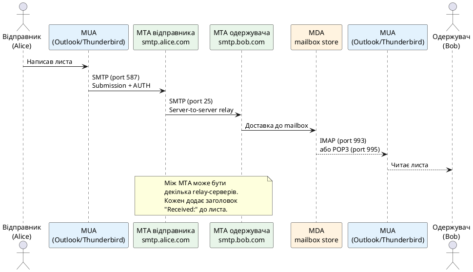
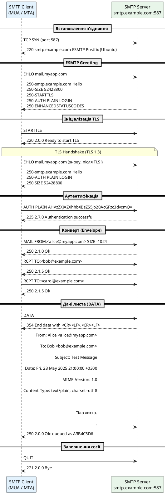
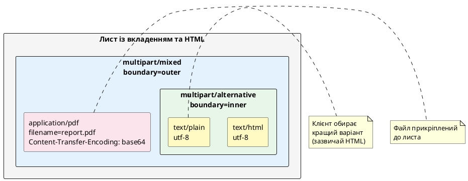
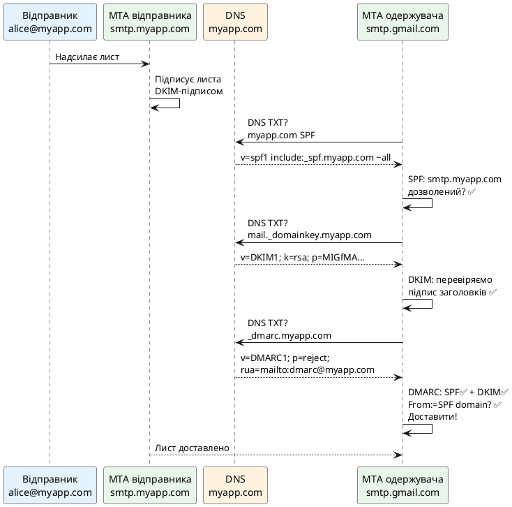

# SMTP та протоколи електронної пошти

## Екосистема протоколів електронної пошти

Електронна пошта — одна з найстаріших і найважливіших служб Інтернету. На відміну від HTTP, де один протокол обслуговує і запит, і відповідь, поштова інфраструктура розподілена між кількома спеціалізованими протоколами, кожен з яких вирішує окреме завдання в ланцюжку доставлення повідомлення від відправника до одержувача.

::note
**Ключова ідея:** Відправлення і отримання пошти — це принципово різні операції, що обслуговуються різними протоколами. SMTP відповідає виключно за **відправлення і ретрансляцію**. POP3 та IMAP — за **отримання** клієнтом листів із поштового сервера.
::

Перш ніж заглибитися у деталі SMTP, розглянемо повну картину поштової інфраструктури:

| Протокол | RFC | Порт (plaintext / TLS) | Призначення |
|---|---|---|---|
| **SMTP** | RFC 5321 | 25 / 465 (SMTPS), 587 (Submission) | Відправлення та ретрансляція між серверами |
| **POP3** | RFC 1939 | 110 / 995 | Завантаження листів із сервера на клієнт (з видаленням) |
| **IMAP4** | RFC 3501 | 143 / 993 | Синхронізація листів між сервером та клієнтами |
| **MIME** | RFC 2045–2049 | — | Стандарт форматування вмісту листа (текст, HTML, вкладення) |

::plant-uml



::

### Ролі агентів у доставці пошти

У поштовій екосистемі кожен компонент має власну назву та функцію:

::field-group

::field{name="MUA (Mail User Agent)" type="Клієнт"}
Поштовий клієнт користувача: Outlook, Thunderbird, Apple Mail, веб-інтерфейс Gmail. Саме тут користувач пише, надсилає та читає листи. Спілкується із сервером через SMTP (відправлення) і IMAP/POP3 (отримання).
::

::field{name="MTA (Mail Transfer Agent)" type="Сервер ретрансляції"}
Поштовий сервер, що приймає листи від MUA або іншого MTA і пересилає їх далі. Виконує DNS MX-lookup для визначення наступного сервера в ланцюжку. Приклади: Postfix, Exim, Microsoft Exchange, SendGrid.
::

::field{name="MDA (Mail Delivery Agent)" type="Агент доставки"}
Компонент, що фінально зберігає лист у поштовій скриньці одержувача. Іноді інтегрований у MTA. Форматування сховища: Maildir (окремі файли), mbox (один файл). Dovecot — типовий MDA для Linux-систем.
::

::field{name="MX-запис (Mail eXchanger)" type="DNS"}
Запис у DNS, що вказує, який сервер відповідає за прийом пошти для даного домену. При відправленні MTA виконує `DNS MX bob.com` → отримує `smtp.bob.com` → підключається по SMTP (port 25).
::

::

---

## Огляд IMAP та POP3 (суміжні протоколи)

Оскільки ці протоколи виходять за межі основної теми розділу, подамо їх описово, для повноти картини.

### POP3 — Post Office Protocol version 3 (RFC 1939)

POP3 — найпростіший протокол отримання пошти, що дотримується моделі «завантажити і видалити». Клієнт підключається до сервера, завантажує всі нові листи у локальне сховище і, як правило, видаляє їх із сервера. Протокол є **текстовим** і надзвичайно простим: клієнт надсилає команди (`USER`, `PASS`, `LIST`, `RETR`, `DELE`, `QUIT`), сервер відповідає рядком `+OK` або `-ERR`.

Головна вада POP3 — **відсутність синхронізації між пристроями**. Якщо лист завантажено на ноутбук, він зникає з телефону. Через це POP3 майже витіснений IMAP у сучасних системах, проте досі використовується там, де потрібен офлайн-доступ без серверного сховища.

### IMAP4 — Internet Message Access Protocol version 4 (RFC 3501)

IMAP є значно потужнішою альтернативою POP3. Ключова відмінність: **листи залишаються на сервері**, а клієнт синхронізує їхній стан (прочитаний/непрочитаний, переміщений, видалений). Це забезпечує однакове відображення поштової скриньки на всіх пристроях.

IMAP підтримує **папки (mailbox)**, **часткове завантаження** (лише заголовки без тіла листа), **серверний пошук**, **підписку на папки** та **IDLE**-режим (push-нотифікації без постійного polling). Саме тому IMAP є стандартом у корпоративних системах та сучасних поштових клієнтах.

::note
У .NET нативна підтримка IMAP та POP3 відсутня у `System.Net.Mail`. Для роботи з цими протоколами використовують бібліотеку **MailKit** — повноцінну реалізацію IMAP4, POP3 та SMTP із підтримкою OAuth 2.0, MIME та TLS. У межах цього розділу зосередимося на нативному SMTP.
::

---

## SMTP — Simple Mail Transfer Protocol

**SMTP (RFC 5321)** — протокол прикладного рівня для **відправлення та ретрансляції** електронних повідомлень. Попри назву «Simple», протокол розвинувся у складну специфікацію з підтримкою аутентифікації, шифрування та розширень (ESMTP).

### Коротка історія

- **1982** — RFC 821: перша стандартизація SMTP. Команди `HELO`, `MAIL FROM`, `RCPT TO`, `DATA`, `QUIT`.
- **1995** — ESMTP (Extended SMTP, RFC 1869): команда `EHLO` замість `HELO`, розширення через `250-KEYWORD`.
- **1998** — RFC 2554: розширення `AUTH` для аутентифікації (PLAIN, LOGIN, CRAM-MD5).
- **2002** — RFC 3207: `STARTTLS` — механізм переходу до шифрованого з'єднання в рамках звичайного TCP-з'єднання.
- **2008** — RFC 5321: сучасна специфікація SMTP, що об'єднала попередні RFC.
- **2011** — RFC 6409: SMTP Submission (port 587) відокремлено від relay (port 25) — клієнти мають надсилати через 587.

### Порти SMTP та їх призначення

| Порт | Назва | Шифрування | Призначення |
|---|---|---|---|
| **25** | SMTP Relay | Plaintext або STARTTLS | Server-to-server (MTA↔MTA). ISP блокують для клієнтів |
| **465** | SMTPS (Legacy) | TLS від початку (Implicit TLS) | Застаріла схема; деякі провайдери досі підтримують |
| **587** | Submission | STARTTLS (обов'язково) | Клієнт→Сервер. Стандарт для MUA з AUTH |

::warning
Порт **465** офіційно «звільнений» для SMTPS і знову стандартизований у RFC 8314 (2018) як **Implicit TLS**. Однак порт **587 з STARTTLS** залишається найпоширенішим стандартом для submission. Google, Microsoft, SendGrid — всі підтримують обидва варіанти.
::

---

## SMTP-сесія: покроковий протокол

SMTP є **текстовим протоколом** на базі TCP. Кожна команда — це рядок ASCII, що завершується `\r\n`. Сервер відповідає **тризначним кодом** із необов'язковим текстовим поясненням. Розглянемо повну SMTP-сесію:

::plant-uml



::

### Основні команди SMTP

::field-group

::field{name="EHLO / HELO" type="Greeting (обов'язково першою)"}
Представлення клієнта серверу. `EHLO` (Extended Hello) — сучасна версія для ESMTP; сервер відповідає списком підтримуваних розширень. `HELO` — застаріла версія для базового SMTP без розширень. Завжди надсилайте EHLO, і знову після STARTTLS — бо розширення можуть відрізнятись після встановлення TLS.

Формат: `EHLO <FQDN або IP клієнта>`
::

::field{name="MAIL FROM" type="Envelope Sender"}
Визначає адресу **конверта відправника** (envelope sender / return path). Це не те саме, що заголовок `From:` у листі! Якщо лист відхилено або збій доставки — bounce-повідомлення надсилається на цю адресу. Можна передати `SIZE=<bytes>` для попередньої перевірки сервером.

Формат: `MAIL FROM:<alice@example.com> SIZE=4096`
::

::field{name="RCPT TO" type="Envelope Recipients"}
Визначає адресу(и) **одержувача(ів)**. Команду можна повторити для кількох одержувачів — кожен `RCPT TO` обробляється незалежно. Сервер може прийняти одних одержувачів і відхилити інших — необхідно перевіряти код відповіді для кожного.

Формат: `RCPT TO:<bob@example.com>` → Відповідь: `250 Ok` або `550 No such user`
::

::field{name="DATA" type="Початок передачі тіла листа"}
Переводить сервер у режим прийому даних. Сервер відповідає `354 Start input`. Клієнт надсилає заголовки та тіло листа (формат MIME). **Ознака завершення** — рядок, що містить лише одну крапку: `\r\n.\r\n` (CRLF dot CRLF). Якщо в тілі листа є рядок, що починається з `.`, він екранується подвоєнням: `..`.
::

::field{name="STARTTLS" type="TLS Upgrade (розширення RFC 3207)"}
Ініціює перехід від plaintext-з'єднання до TLS-шифрованого. Після успішного TLS Handshake необхідно повторно надіслати `EHLO` — бо сервер може оголосити інший набір розширень (особливо `AUTH`, який не пропонується до TLS). Доступне лише якщо сервер оголосив `250-STARTTLS` у відповіді на `EHLO`.
::

::field{name="AUTH" type="Аутентифікація (розширення RFC 4954)"}
Аутентифікація клієнта. Механізми: `PLAIN` (base64 від `\0user\0password`), `LOGIN` (окремо логін і пароль в base64), `CRAM-MD5` (challenge-response, складніше). Сучасні сервери підтримують також OAuth 2.0 Bearer через `OAUTHBEARER` або `XOAUTH2`. Завжди виконуйте AUTH після STARTTLS — інакше credentials передаються у відкритому вигляді.
::

::field{name="QUIT" type="Завершення сесії"}
Коректне завершення TCP-з'єднання. Сервер підтверджує `221 Bye` і закриває з'єднання. Якщо клієнт закриває з'єднання без QUIT — сервер вважає сесію аварійно перерваною і може не прийняти лист у чергу.
::

::

### Коди відповідей SMTP

Перша цифра визначає клас відповіді, друга — категорію, третя — специфіку:

| Код | Значення | Приклад ситуації |
|---|---|---|
| **2xx** | Успіх | `250 Ok`, `221 Bye`, `235 Auth successful` |
| **354** | Проміжний | Чекаю дані листа (відповідь на DATA) |
| **4xx** | Тимчасова помилка | `421 Service unavailable` — спробуйте пізніше |
| **5xx** | Постійна помилка | `550 User unknown`, `552 Message too large` |
| **220** | Готовий | Привітання сервера після TCP-підключення |
| **250** | Команда прийнята | Стандартна відповідь на EHLO, MAIL FROM, RCPT TO |
| **354** | Починайте введення | Відповідь на DATA — сервер чекає тіло листа |
| **421** | Сервіс недоступний | Перевантаження; MTA повторить спробу |
| **550** | Ящик не існує | Постійна помилка — не повторювати |
| **552** | Ліміт розміру | Лист перевищує `SIZE` сервера |

---

## MIME — Multipurpose Internet Mail Extensions

**MIME (RFC 2045–2049)** — стандарт форматування вмісту листа. Базовий SMTP передає лише 7-bit ASCII текст. MIME розширив цю можливість: UTF-8 текст, HTML, вкладені файли, зображення, аудіо — все це стало доступним завдяки MIME-кодуванню.

### Анатомія MIME-листа

Кожен лист складається з **заголовків** (Headers) та **тіла** (Body), розділених порожнім рядком (`\r\n\r\n`):

```text
From: Alice <alice@example.com>
To: Bob <bob@example.com>
Subject: =?UTF-8?B?0KLQtdGB0YLQvtCy0LjQuSDQu9C40YHRgg==?=
Date: Fri, 23 May 2025 21:00:00 +0300
Message-ID: <20250523180000.A1B2C3@myapp.com>
MIME-Version: 1.0
Content-Type: multipart/alternative; boundary="boundary_abc123"

--boundary_abc123
Content-Type: text/plain; charset=utf-8
Content-Transfer-Encoding: quoted-printable

=D0=A2=D0=B5=D1=81=D1=82=D0=BE=D0=B2=D0=B8=D0=B9 =D0=BB=D0=B8=D1=81=D1=82

--boundary_abc123
Content-Type: text/html; charset=utf-8
Content-Transfer-Encoding: base64

PCFET0NUWVBFIGh0bWw+PGh0bWw+PGJvZHk+PGgxPlRlc3QgTWVzc2FnZTwvaDE+PC9ib2R5PjwvaHRtbD4=

--boundary_abc123--
```

### Ключові заголовки листа

::field-group

::field{name="From" type="string (RFC 5322)"}
Адреса відправника у заголовку листа. **Відрізняється від Envelope Sender** (`MAIL FROM:`). Саме цей заголовок відображається клієнту. Формат: `Name <email@domain.com>` або просто `email@domain.com`. Може бути підроблений у звичайного SMTP-клієнта — SPF/DKIM/DMARC перевіряють саме цю відповідність.
::

::field{name="To / Cc / Bcc" type="string (RFC 5322)"}
Одержувачі в заголовку листа. `To` — основні, `Cc` (Carbon Copy) — копія, `Bcc` (Blind Carbon Copy) — прихована копія. **Bcc не потрапляє до заголовка листа** — одержувачі Bcc не бачать один одного. Проте всі вони перераховуються у `RCPT TO:` команди SMTP-конверта.
::

::field{name="Subject" type="encoded-word (RFC 2047)"}
Тема листа. Якщо містить не-ASCII символи (кирилиця, японська тощо) — кодується у форматі `=?charset?encoding?encoded_text?=`. Кодування: `B` = Base64, `Q` = Quoted-Printable. Приклад: `=?UTF-8?B?0KLQtdGB0YLQvtCy...?=`. `SmtpClient` у .NET кодує Subject автоматично.
::

::field{name="Message-ID" type="string (RFC 5322)"}
Унікальний ідентифікатор листа. Формат: `<local-part@domain>`. Генерується MUA або MTA. Використовується для з'єднання листів у ланцюжки (threading) через `In-Reply-To:` та `References:` заголовки.
::

::field{name="Content-Type" type="MIME type; parameters"}
Визначає тип вмісту. Для простого тексту: `text/plain; charset=utf-8`. Для HTML: `text/html; charset=utf-8`. Для мультичастинних листів: `multipart/alternative; boundary="..."` або `multipart/mixed; boundary="..."`. Параметр `boundary` — унікальний рядок-роздільник між частинами.
::

::field{name="Content-Transfer-Encoding" type="7bit | quoted-printable | base64"}
Кодування передачі вмісту. `7bit` — лише ASCII (застаріло для unicode). `quoted-printable` — ASCII-сумісний, не-ASCII символи замінюються `=HH` (hex). `base64` — повне Base64-кодування, збільшує розмір на ~33% але гарантує безпечну передачу бінарних даних.
::

::

### Типи MIME multipart

::plant-uml



::

| MIME Type | Призначення |
|---|---|
| `multipart/mixed` | Лист із вкладеннями. Частини є незалежними — текст + файли |
| `multipart/alternative` | Один вміст у кількох форматах. Клієнт обирає найкращий (зазвичай HTML) |
| `multipart/related` | HTML із вбудованими ресурсами (inline зображення через `cid:`) |
| `text/plain` | Звичайний текст |
| `text/html` | HTML-вміст |
| `application/octet-stream` | Довільний бінарний файл (вкладення) |
| `image/png`, `image/jpeg` | Зображення (для inline або вкладення) |

::tip
Правильна ієрархія для листа з HTML **і** вкладеннями: `multipart/mixed` (зовнішній) → `multipart/alternative` (всередині) → `text/plain` + `text/html`. Зображення вбудовані в HTML (`cid:`) розміщуються у `multipart/related`, що вкладається всередину `multipart/alternative`.
::

---

## System.Net.Mail — нативна відправка SMTP у .NET 10

Простір імен `System.Net.Mail` надає вбудовані засоби для відправки електронної пошти без залежностей від сторонніх бібліотек. Основні класи:

::field-group

::field{name="SmtpClient" type="System.Net.Mail"}
Клієнт SMTP-протоколу. Керує підключенням до сервера, аутентифікацією, шифруванням і надсиланням. Підтримує STARTTLS (`EnableSsl = true`). Реалізує `IDisposable`. **Важлива примітка**: Microsoft позначила `SmtpClient` як `[Obsolete]` у документації з рекомендацією використовувати MailKit для нових проектів, однак клас залишається повністю функціональним у .NET 10 для базових сценаріїв.
::

::field{name="MailMessage" type="System.Net.Mail"}
Представляє один електронний лист. Містить відправника, одержувачів, тему, тіло, вкладення та альтернативні подання. Реалізує `IDisposable` — звільняє ресурси вкладень (потоки файлів).
::

::field{name="MailAddress" type="System.Net.Mail"}
Представляє поштову адресу із необов'язковим ім'ям. `new MailAddress("alice@example.com", "Alice")` → `Alice <alice@example.com>`. Виконує базову валідацію формату адреси.
::

::field{name="Attachment" type="System.Net.Mail"}
Представляє вкладення листа. Може бути створений із файлу (`new Attachment("path/to/file.pdf")`) або потоку (`new Attachment(stream, "report.pdf", "application/pdf")`). Реалізує `IDisposable`.
::

::field{name="AlternateView" type="System.Net.Mail"}
Альтернативне подання тіла листа. Використовується для `multipart/alternative` (текст + HTML) та `multipart/related` (HTML із inline-зображеннями через `LinkedResource`).
::

::

### Базове надсилання листа

Розпочнемо із найпростішого сценарію — надсилання текстового листа через SMTP із аутентифікацією та STARTTLS:

::tabs

::tabs-item{label="Простий текстовий лист"}

```csharp showLineNumbers
using System.Net;
using System.Net.Mail;

// SmtpClient налаштовується один раз і може надсилати кілька листів
using var smtpClient = new SmtpClient("smtp.gmail.com")
{
    Port = 587,                        // Submission port (STARTTLS)
    EnableSsl = true,                  // STARTTLS: спочатку з'єднання, потім TLS upgrade
    DeliveryMethod = SmtpDeliveryMethod.Network,
    UseDefaultCredentials = false,
    Credentials = new NetworkCredential(
        userName: "alice@gmail.com",
        password: "app-specific-password" // Gmail: App Password (не основний пароль!)
    )
};

// MailMessage реалізує IDisposable — звільняє потоки вкладень
using var message = new MailMessage
{
    From = new MailAddress("alice@gmail.com", "Alice"),
    Subject = "Тестовий лист із .NET 10",
    Body = """
        Привіт, Боб!
        
        Це тестовий лист, надісланий через System.Net.Mail у .NET 10.
        
        З повагою,
        Alice
        """,
    IsBodyHtml = false,          // false = text/plain, true = text/html
    BodyEncoding = System.Text.Encoding.UTF8,
    SubjectEncoding = System.Text.Encoding.UTF8
};

message.To.Add(new MailAddress("bob@example.com", "Bob"));
message.Cc.Add("carol@example.com");   // Копія (видима в заголовках)

// Синхронне надсилання (блокуюче) — для простих сценаріїв
smtpClient.Send(message);
Console.WriteLine("Лист надіслано успішно.");
```

::

::tabs-item{label="Async надсилання"}

```csharp showLineNumbers
using System.Net;
using System.Net.Mail;

// SmtpClient.SendMailAsync — рекомендований підхід для async контексту
async Task SendEmailAsync(string toEmail, string subject, string body)
{
    using var smtpClient = new SmtpClient("smtp.gmail.com")
    {
        Port = 587,
        EnableSsl = true,
        UseDefaultCredentials = false,
        Credentials = new NetworkCredential("alice@gmail.com", "app-password")
    };

    using var message = new MailMessage(
        from: "alice@gmail.com",
        to: toEmail,
        subject: subject,
        body: body
    );

    message.BodyEncoding = System.Text.Encoding.UTF8;
    message.SubjectEncoding = System.Text.Encoding.UTF8;

    try
    {
        // SendMailAsync повертає Task — не блокує потік
        await smtpClient.SendMailAsync(message);
        Console.WriteLine($"Лист надіслано на {toEmail}");
    }
    catch (SmtpException ex) when (ex.StatusCode == SmtpStatusCode.MailboxUnavailable)
    {
        // 550: Ящик не існує — постійна помилка, не повторювати
        Console.Error.WriteLine($"Ящик не знайдено: {ex.Message}");
    }
    catch (SmtpException ex) when ((int)ex.StatusCode >= 400 && (int)ex.StatusCode < 500)
    {
        // 4xx: Тимчасова помилка — можна повторити через деякий час
        Console.Error.WriteLine($"Тимчасова помилка SMTP ({ex.StatusCode}): {ex.Message}");
        throw; // Перекидаємо для retry-логіки вище
    }
}

// Виклик:
await SendEmailAsync("bob@example.com", "Привіт від .NET 10", "Тіло листа...");
```

::

::tabs-item{label="Кілька одержувачів та BCC"}

```csharp showLineNumbers
using System.Net;
using System.Net.Mail;

using var smtp = new SmtpClient("smtp.office365.com")
{
    Port = 587,
    EnableSsl = true,
    Credentials = new NetworkCredential("noreply@company.com", "password")
};

using var message = new MailMessage
{
    From = new MailAddress("noreply@company.com", "Компанія ABC"),
    Subject = "Щомісячний звіт",
    Body = "Шановні колеги, у вкладенні звіт за травень.",
    IsBodyHtml = false
};

// Кілька основних одержувачів
message.To.Add(new MailAddress("ceo@company.com", "Директор"));
message.To.Add(new MailAddress("cfo@company.com", "Фінансовий директор"));

// Копія (Cc) — видима всім одержувачам у заголовках
message.CC.Add(new MailAddress("assistant@company.com", "Асистент"));

// Прихована копія (Bcc) — одержувачі не бачать один одного
// Бухгалтер отримає лист, але To/Cc-одержувачі його не побачать
message.Bcc.Add(new MailAddress("accountant@company.com", "Бухгалтер"));

// ReplyTo — куди надсилати відповідь (може відрізнятися від From)
message.ReplyToList.Add(new MailAddress("support@company.com", "Підтримка"));

await smtp.SendMailAsync(message);
```

::

::

---

### HTML-листи та вкладення

Більшість реальних листів використовують HTML для форматування та можуть містити файлові вкладення. `MailMessage` підтримує обидва сценарії через `IsBodyHtml`, `Attachments` та `AlternateViews`.

::tabs

::tabs-item{label="HTML-лист (IsBodyHtml)"}

```csharp showLineNumbers
using System.Net;
using System.Net.Mail;
using System.Text;

using var smtp = new SmtpClient("smtp.gmail.com")
{
    Port = 587,
    EnableSsl = true,
    Credentials = new NetworkCredential("alice@gmail.com", "app-password")
};

// HTML-тіло листа — SmtpClient встановить Content-Type: text/html; charset=utf-8
string htmlBody = """
    <!DOCTYPE html>
    <html lang="uk">
    <head><meta charset="UTF-8"></head>
    <body style="font-family: Arial, sans-serif; color: #333;">
        <h2 style="color: #1a73e8;">Привіт, Боб!</h2>
        <p>Це <strong>HTML-лист</strong>, надісланий через <em>.NET 10</em>.</p>
        <table border="1" cellpadding="8" style="border-collapse: collapse;">
            <tr><th>Продукт</th><th>Кількість</th><th>Ціна</th></tr>
            <tr><td>Товар A</td><td>5</td><td>250 грн</td></tr>
            <tr><td>Товар B</td><td>2</td><td>180 грн</td></tr>
        </table>
        <p style="color: #888; font-size: 12px;">Цей лист згенеровано автоматично.</p>
    </body>
    </html>
    """;

using var message = new MailMessage
{
    From = new MailAddress("alice@gmail.com", "Alice"),
    Subject = "Замовлення #12345",
    Body = htmlBody,
    IsBodyHtml = true,    // Content-Type: text/html
    BodyEncoding = Encoding.UTF8
};

message.To.Add("bob@example.com");
await smtp.SendMailAsync(message);
```

::

::tabs-item{label="Вкладення файлів"}

```csharp showLineNumbers
using System.Net;
using System.Net.Mail;

using var smtp = new SmtpClient("smtp.gmail.com")
{
    Port = 587,
    EnableSsl = true,
    Credentials = new NetworkCredential("alice@gmail.com", "app-password")
};

// Attachment реалізує IDisposable — явно звільняємо ресурси
using var pdfAttachment = new Attachment(
    fileName: "/reports/monthly_report.pdf",
    mediaType: "application/pdf"
);

// Налаштовуємо ім'я файлу у заголовках MIME (Content-Disposition)
pdfAttachment.ContentDisposition!.FileName = "Звіт_травень_2025.pdf";
pdfAttachment.ContentDisposition.Inline = false; // false = вкладення, true = inline

// Attachment із потоку (для динамічно згенерованих файлів)
byte[] csvData = System.Text.Encoding.UTF8.GetBytes("Name,Value\nA,1\nB,2");
using var csvStream = new MemoryStream(csvData);
using var csvAttachment = new Attachment(csvStream, "data.csv", "text/csv");

using var message = new MailMessage
{
    From = new MailAddress("alice@gmail.com", "Alice"),
    Subject = "Місячний звіт — травень 2025",
    Body = "Привіт! У вкладенні — звіт та таблиця даних.",
    IsBodyHtml = false
};

message.To.Add("ceo@company.com");
message.Attachments.Add(pdfAttachment);
message.Attachments.Add(csvAttachment);

await smtp.SendMailAsync(message);
// Після відправки: Attachment та MemoryStream ще живі до виходу з using-блоку
```

::

::tabs-item{label="Inline-зображення (CID)"}

```csharp showLineNumbers
using System.Net;
using System.Net.Mail;
using System.Net.Mime;

// Inline-зображення: вбудовані у HTML через Content-ID (cid:)
// MIME-структура: multipart/related → [text/html + image/png]
using var smtp = new SmtpClient("smtp.gmail.com")
{
    Port = 587,
    EnableSsl = true,
    Credentials = new NetworkCredential("alice@gmail.com", "app-password")
};

// 1. Створюємо HTML-подання із посиланням cid:logo
string htmlBody = """
    <html><body>
        <br/>
        <h2>Ласкаво просимо!</h2>
        <p>Цей лист містить вбудоване зображення.</p>
    </body></html>
    """;

// 2. AlternateView для HTML-частини
AlternateView htmlView = AlternateView.CreateAlternateViewFromString(
    htmlBody,
    encoding: System.Text.Encoding.UTF8,
    mediaType: "text/html"
);

// 3. LinkedResource — прив'язуємо зображення через ContentId
using var logoResource = new LinkedResource("/assets/logo.png", "image/png")
{
    ContentId = "logo_image",    // Відповідає cid:logo_image у HTML
    TransferEncoding = TransferEncoding.Base64
};

htmlView.LinkedResources.Add(logoResource);

// 4. Текстова альтернатива (для клієнтів без HTML)
AlternateView plainView = AlternateView.CreateAlternateViewFromString(
    "Ласкаво просимо! Ваш поштовий клієнт не підтримує HTML.",
    encoding: System.Text.Encoding.UTF8,
    mediaType: "text/plain"
);

using var message = new MailMessage
{
    From = new MailAddress("alice@gmail.com", "Alice"),
    Subject = "Лист із вбудованим логотипом"
};

message.To.Add("bob@example.com");

// Порядок: plain перед html — клієнт обирає останній підтримуваний
message.AlternateViews.Add(plainView);
message.AlternateViews.Add(htmlView);

await smtp.SendMailAsync(message);
```

::

::

::note
При використанні `AlternateViews` не встановлюйте `message.Body` і `message.IsBodyHtml` — вони конфліктують із `AlternateViews`. Або використовуйте `Body`/`IsBodyHtml` (для простих HTML без inline-зображень), або `AlternateViews` (для `multipart/alternative` і `multipart/related`).
::

---

### Конфігурація SmtpClient через appsettings

У реальних застосунках параметри SMTP зберігаються у конфігурації, а не хардкодяться у коді:

```json
{
  "SmtpSettings": {
    "Host": "smtp.gmail.com",
    "Port": 587,
    "EnableSsl": true,
    "Username": "alice@gmail.com",
    "Password": "app-password",
    "FromName": "Alice",
    "FromEmail": "alice@gmail.com"
  }
}
```

```csharp showLineNumbers
using Microsoft.Extensions.Configuration;
using System.Net;
using System.Net.Mail;

// Клас налаштувань (зв'язується з секцією SmtpSettings)
public record SmtpSettings(
    string Host,
    int Port,
    bool EnableSsl,
    string Username,
    string Password,
    string FromName,
    string FromEmail
);

// Реєстрація у DI-контейнері (Program.cs або Startup.cs)
builder.Services.Configure<SmtpSettings>(
    builder.Configuration.GetSection("SmtpSettings")
);
builder.Services.AddTransient<IEmailSender, SmtpEmailSender>();

// Реалізація сервісу відправки
public class SmtpEmailSender(IOptions<SmtpSettings> options) : IEmailSender
{
    private readonly SmtpSettings _settings = options.Value;

    public async Task SendAsync(string to, string subject, string htmlBody,
        CancellationToken ct = default)
    {
        using var smtp = new SmtpClient(_settings.Host)
        {
            Port = _settings.Port,
            EnableSsl = _settings.EnableSsl,
            Credentials = new NetworkCredential(_settings.Username, _settings.Password)
        };

        using var message = new MailMessage
        {
            From = new MailAddress(_settings.FromEmail, _settings.FromName),
            Subject = subject,
            Body = htmlBody,
            IsBodyHtml = true,
            BodyEncoding = System.Text.Encoding.UTF8
        };

        message.To.Add(to);
        await smtp.SendMailAsync(message, ct);
    }
}
```

---

### Обробка помилок SmtpClient

Детальна обробка помилок є критично важливою у поштових системах — частина помилок є тимчасовими (слід повторити), частина постійними (слід зафіксувати й не повторювати):

```csharp showLineNumbers
using System.Net;
using System.Net.Mail;
using System.Net.Sockets;

async Task SendWithRetryAsync(MailMessage message, int maxRetries = 3)
{
    using var smtp = new SmtpClient("smtp.gmail.com")
    {
        Port = 587,
        EnableSsl = true,
        Credentials = new NetworkCredential("alice@gmail.com", "app-password"),
        Timeout = 30_000 // Таймаут 30 секунд на операцію
    };

    for (int attempt = 1; attempt <= maxRetries; attempt++)
    {
        try
        {
            await smtp.SendMailAsync(message);
            Console.WriteLine($"Лист надіслано (спроба {attempt})");
            return; // Успіх — виходимо з циклу
        }
        catch (SmtpException ex)
        {
            int code = (int)ex.StatusCode;

            // 5xx — постійна помилка: не повторювати
            if (code >= 500)
            {
                Console.Error.WriteLine($"Постійна SMTP-помилка {code}: {ex.Message}");
                // 550 = Mailbox unavailable, 552 = Too large, 554 = Transaction failed
                throw;
            }

            // 4xx — тимчасова помилка: повторити з паузою
            if (code >= 400 && attempt < maxRetries)
            {
                // Exponential backoff: 2s, 4s, 8s...
                var delay = TimeSpan.FromSeconds(Math.Pow(2, attempt));
                Console.Warning($"Тимчасова помилка {code}. Повтор через {delay.TotalSeconds}с...");
                await Task.Delay(delay);
                continue;
            }

            throw; // Вичерпали спроби або невідомий код
        }
        catch (SmtpFailedRecipientException ex)
        {
            // Один або кілька одержувачів відхилені
            // ex.FailedRecipient — адреса, що спричинила помилку
            Console.Error.WriteLine($"Одержувача відхилено: {ex.FailedRecipient}");
            Console.Error.WriteLine($"Код: {ex.StatusCode}, Деталі: {ex.Message}");
            throw;
        }
        catch (SmtpFailedRecipientsException ex)
        {
            // Всі одержувачі відхилені (при масовому відправленні)
            foreach (SmtpFailedRecipientException inner in ex.InnerExceptions)
                Console.Error.WriteLine($"  Відхилено: {inner.FailedRecipient} ({inner.StatusCode})");
            throw;
        }
        catch (SocketException ex)
        {
            // Мережева помилка: сервер недоступний, DNS-помилка
            Console.Error.WriteLine($"Помилка мережі: {ex.Message}");
            if (attempt < maxRetries)
            {
                await Task.Delay(TimeSpan.FromSeconds(5));
                continue;
            }
            throw;
        }
    }
}
```

---

### Локальне тестування: SpecifiedPickupDirectory

При розробці та тестуванні небажано надсилати реальні листи. `SmtpDeliveryMethod.SpecifiedPickupDirectory` зберігає листи як `.eml` файли у вказану директорію — без жодного мережевого з'єднання:

```csharp showLineNumbers
using System.Net.Mail;

// Зберігає листи як .eml файли — ідеально для unit-тестів та розробки
using var smtp = new SmtpClient
{
    DeliveryMethod = SmtpDeliveryMethod.SpecifiedPickupDirectory,
    PickupDirectoryLocation = "/tmp/email-outbox",  // Директорія для .eml файлів
    EnableSsl = false                               // TLS не потрібен для файлового збереження
};

using var message = new MailMessage
{
    From = new MailAddress("test@myapp.com", "Test App"),
    Subject = "Тестовий лист",
    Body = "<h1>Тест</h1>",
    IsBodyHtml = true
};

message.To.Add("user@example.com");

smtp.Send(message);
// Лист збережено у /tmp/email-outbox/xxxxxxxx.eml
// Відкрийте у Outlook або Thunderbird для перегляду
```

::tip
Для локального тестування поштових функцій також чудово підходить [**MailHog**](https://github.com/mailhog/MailHog) — SMTP-сервер із веб-інтерфейсом, що перехоплює всі листи і відображає їх у браузері. Запуск: `docker run -p 1025:1025 -p 8025:8025 mailhog/mailhog`. Налаштовуйте `SmtpClient` на `Host = "localhost", Port = 1025`.
::

---

## Безпека поштових систем: SPF, DKIM, DMARC

Сучасна поштова безпека базується на трьох стандартах, що разом забезпечують **автентифікацію** відправника та **захист від підробки**:

::plant-uml



::

::accordion

::accordion-item{label="SPF — Sender Policy Framework (RFC 7208)" icon="i-lucide-shield-check"}
**SPF** — DNS-запис типу `TXT`, що перераховує IP-адреси та сервери, яким дозволено надсилати пошту від імені домену.

```dns
myapp.com. IN TXT "v=spf1 ip4:203.0.113.10 include:sendgrid.net -all"
```

- `ip4:203.0.113.10` — дозволена конкретна IP-адреса
- `include:sendgrid.net` — дозволено всі IP із SPF-запису sendgrid.net
- `-all` — всі решта відхиляються (`-all` = жорстко, `~all` = м'яко, `?all` = нейтрально)

**Обмеження SPF:** перевіряє лише **Envelope Sender** (`MAIL FROM:`), не заголовок `From:`. Тому SPF недостатньо без DKIM/DMARC.
::

::accordion-item{label="DKIM — DomainKeys Identified Mail (RFC 6376)" icon="i-lucide-key"}
**DKIM** — криптографічний підпис листа. MTA відправника підписує вибрані заголовки та тіло листа RSA або Ed25519 приватним ключем. Публічний ключ публікується у DNS.

```dns
mail._domainkey.myapp.com. IN TXT "v=DKIM1; k=rsa; p=MIGfMA0GCSqGSIb3DQEBAQUAA..."
```

Підпис додається у заголовок `DKIM-Signature:`:
```
DKIM-Signature: v=1; a=rsa-sha256; d=myapp.com; s=mail;
  h=from:to:subject:date:message-id;
  bh=base64(SHA256(тіло));
  b=base64(RSA-підпис-заголовків)
```

**Переваги DKIM:** підпис проходить через будь-яку кількість relay-серверів незмінним, оскільки перевіряє вміст, а не IP-адресу.
::

::accordion-item{label="DMARC — Domain-based Message Authentication (RFC 7489)" icon="i-lucide-shield-alert"}
**DMARC** — політика, що об'єднує SPF і DKIM. Визначає, що робити із листами, які провалили автентифікацію.

```dns
_dmarc.myapp.com. IN TXT "v=DMARC1; p=reject; rua=mailto:dmarc-reports@myapp.com; pct=100"
```

- `p=none` — тільки моніторинг (не відхиляти)
- `p=quarantine` — помістити у спам
- `p=reject` — повністю відхилити
- `rua=` — адреса для aggregate-звітів (щоденні JSON/XML-звіти)
- `pct=100` — застосовувати до 100% листів

**DMARC alignment:** вимагає, щоб домен `From:` збігався з доменом, що пройшов SPF або DKIM-перевірку — саме це закриває дірку підробки заголовка `From:`.
::

::

::caution
Без SPF/DKIM/DMARC ваші листи будуть потрапляти до спаму або відхилятися більшістю сучасних поштових провайдерів. Gmail та Microsoft відхиляють листи від доменів без SPF із серпня 2024 року.
::

---

## Налаштування популярних SMTP-провайдерів

::tabs

::tabs-item{label="Gmail"}

```csharp showLineNumbers
// Gmail SMTP — ВАЖЛИВО: потрібен App Password, не основний пароль!
// Google вимкнув "Less secure apps" з травня 2022 року.
// Налаштування: Google Account → Security → 2-Step Verification → App Passwords
// Або використовуйте OAuth 2.0 Bearer через XOAUTH2 (MailKit)

using var smtp = new SmtpClient("smtp.gmail.com")
{
    Port = 587,           // Або 465 для Implicit TLS (SSL від початку)
    EnableSsl = true,     // STARTTLS для port 587
    Credentials = new NetworkCredential(
        "yourname@gmail.com",
        "xxxx xxxx xxxx xxxx"   // App Password (16 символів із пробілами)
    )
};
```

Обмеження Gmail SMTP:
- **500 листів/день** для звичайних акаунтів
- **2000 листів/день** для Google Workspace
- Максимальний розмір листа: **25 MB**

::

::tabs-item{label="Outlook / Office 365"}

```csharp showLineNumbers
// Microsoft/Outlook SMTP
// З жовтня 2022: Basic Auth вимкнено для Exchange Online
// Для продакшну — Modern Authentication (OAuth 2.0)
// Для тестування — smtp-mail.outlook.com ще підтримує Basic Auth

using var smtp = new SmtpClient("smtp-mail.outlook.com")  // Особисті @outlook.com/@hotmail.com
{
    Port = 587,
    EnableSsl = true,
    Credentials = new NetworkCredential("yourname@outlook.com", "password")
};

// Для Office 365 / Exchange Online (корпоративні акаунти):
using var office365Smtp = new SmtpClient("smtp.office365.com")
{
    Port = 587,
    EnableSsl = true,
    Credentials = new NetworkCredential("user@company.onmicrosoft.com", "password")
};
```

::

::tabs-item{label="SendGrid"}

```csharp showLineNumbers
// SendGrid — один із найпопулярніших транзакційних поштових сервісів
// Безкоштовний план: 100 листів/день. Платні плани: від 40 000/місяць.
// Автоматично налаштовує DKIM для вашого домену.

// SMTP-спосіб (простіший, але обмеженіший за HTTP API):
using var smtp = new SmtpClient("smtp.sendgrid.net")
{
    Port = 587,           // Або 465
    EnableSsl = true,
    Credentials = new NetworkCredential(
        userName: "apikey",    // Літерально рядок "apikey"
        password: "SG.xxxxxxxxxxxxxxxxxxxxxxxxxxxxxxxx"  // Ваш SendGrid API Key
    )
};

using var message = new MailMessage
{
    From = new MailAddress("sender@yourdomain.com", "Your App"),
    Subject = "Транзакційний лист",
    Body = "<h1>Hello!</h1>",
    IsBodyHtml = true
};

message.To.Add("user@example.com");
// Заголовки для SendGrid-аналітики (необов'язково):
message.Headers.Add("X-SMTPAPI",
    """{"category": ["welcome_email"], "unique_args": {"user_id": "12345"}}""");

await smtp.SendMailAsync(message);
```

::

::tabs-item{label="Локальний (Mailpit / MailHog)"}

```csharp showLineNumbers
// Mailpit (сучасна альтернатива MailHog) або MailHog
// Для локального розробки: перехоплює всі листи, відображає у веб-UI
// Встановлення: docker run -p 1025:1025 -p 8025:8025 axllent/mailpit
// Веб-інтерфейс: http://localhost:8025

using var smtp = new SmtpClient("localhost")
{
    Port = 1025,          // SMTP порт Mailpit/MailHog
    EnableSsl = false,    // Без TLS — лише локально
    DeliveryMethod = SmtpDeliveryMethod.Network
    // Credentials не потрібні — Mailpit/MailHog приймає без auth
};

using var message = new MailMessage
{
    From = new MailAddress("test@myapp.local", "Test App"),
    Subject = "Тест відправки",
    Body = "<h2>Перевірка!</h2><p>Листа перехоплено у Mailpit.</p>",
    IsBodyHtml = true
};

message.To.Add("developer@example.com");
await smtp.SendMailAsync(message);
// Відкрийте http://localhost:8025 для перегляду листа
```

::

::

::field-group

::field{name="smtp.gmail.com" type="Google Gmail"}
Порт 587 (STARTTLS) або 465 (Implicit TLS). Вимагає App Password або OAuth 2.0. Ліміт: 500/день (звичайний), 2000/день (Workspace).
::

::field{name="smtp.office365.com" type="Microsoft Office 365"}
Порт 587 (STARTTLS). Basic Auth вимкнено з 2022 — потрібен OAuth 2.0 для Exchange Online.
::

::field{name="smtp.sendgrid.net" type="SendGrid (Twilio)"}
Порт 587 або 465. Username завжди `apikey`, password — SendGrid API Key. Безкоштовно: 100 листів/день.
::

::field{name="email-smtp.eu-west-1.amazonaws.com" type="Amazon SES"}
Порт 587 або 465. Credentials: SMTP credentials із консолі SES (не IAM!). Від 0.10$ за 1000 листів.
::

::field{name="smtp.mailersend.com" type="MailerSend"}
Порт 587 або 465. Безкоштовно: 3000 листів/місяць. Підтримує шаблони, аналітику, webhooks.
::

::

---

## Підсумок

Електронна пошта — це складна екосистема взаємодіючих протоколів. У цьому розділі ми вивчили:

- **Архітектуру** поштової інфраструктури: ролі MUA, MTA, MDA, DNS MX-записів
- **SMTP-протокол** (RFC 5321): команди, відповіді, сесія, порти 25/465/587
- **MIME-стандарт** (RFC 2045–2049): структуру листа, заголовки, типи `multipart`
- **System.Net.Mail**: `SmtpClient`, `MailMessage`, `Attachment`, `AlternateView`, `LinkedResource`
- **Безпеку**: SPF, DKIM, DMARC — три рівні захисту від підробки адреси відправника
- **Практику**: налаштування Gmail, Office 365, SendGrid, локального тестування

::note
Для продакшн-систем із великим обсягом листів або потребою OAuth 2.0 розгляньте бібліотеку **MailKit** — вона забезпечує повну підтримку IMAP4, POP3, SMTP, MIME, OAuth 2.0 та NTLM, і є рекомендованою Microsoft для нових .NET-проектів.
::
