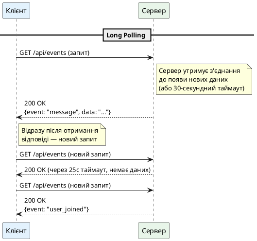
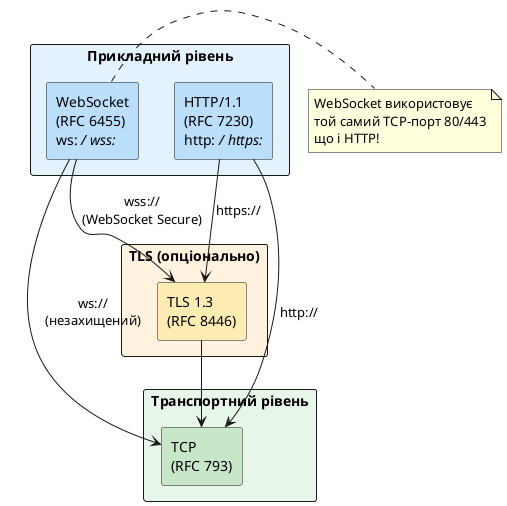
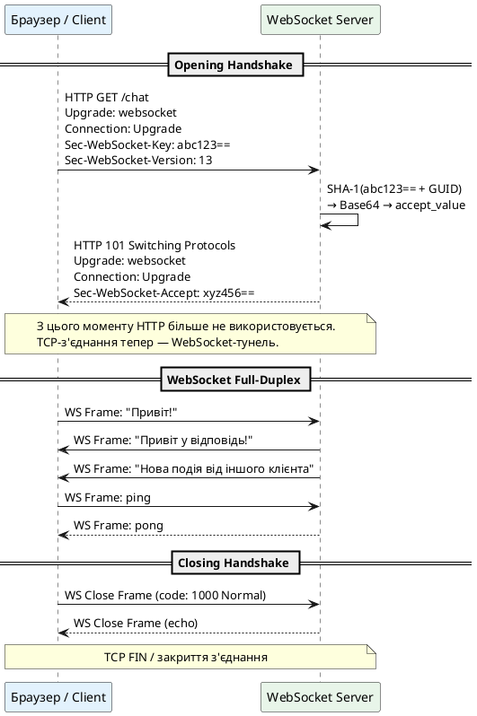
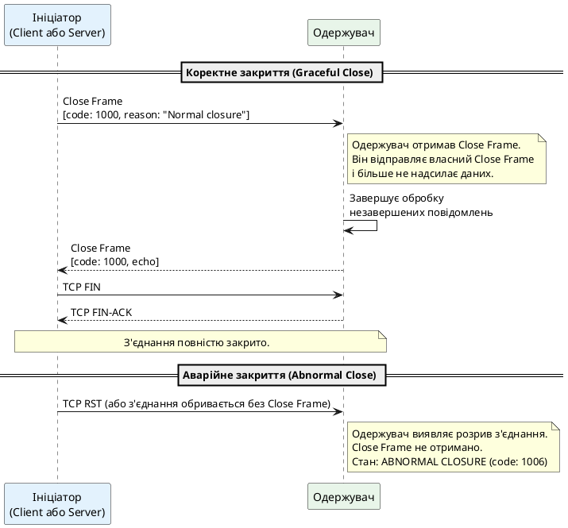
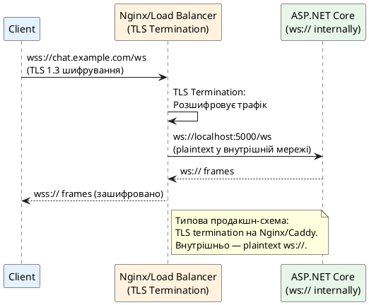
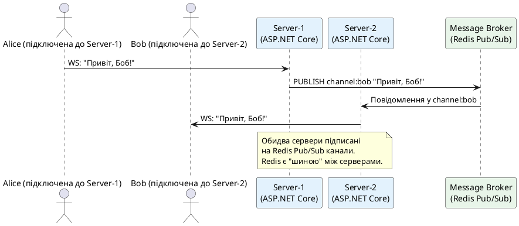
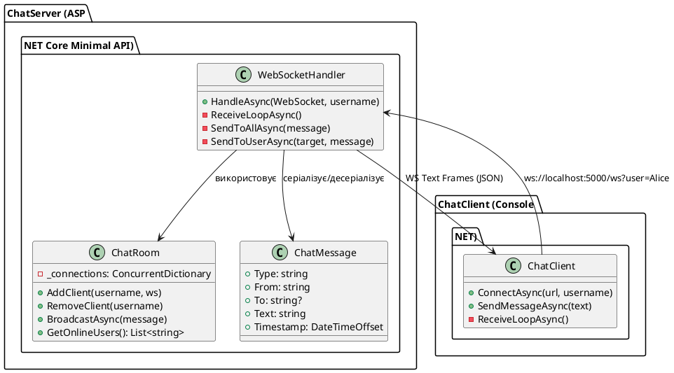

# WebSocket — повнодуплексний протокол реального часу

## Фундаментальна обмеженість HTTP у контексті реального часу

Веб-розробка протягом десятиліть розвивалась навколо моделі **запит–відповідь** (request–response), що є серцем HTTP. Ця модель є інтуїтивно зрозумілою та ефективною для переважної більшості веб-застосунків: клієнт запитує ресурс, сервер відповідає, з'єднання закривається. Однак сучасні вимоги до веб-застосунків давно вийшли за межі цієї моделі.

Розглянемо декілька поширених сценаріїв, де модель запит–відповідь виявляється принципово недостатньою:

**Чат-застосунок.** Коли Аліса надсилає повідомлення Бобу, сервер повинен негайно сповістити браузер Боба. Браузер Боба не надсилав жодного запиту — він просто чекає. За класичним HTTP-підходом це неможливо: сервер не може «штовхнути» дані клієнту без попереднього запиту.

**Фінансова торгівля.** Котирування акцій змінюються сотні разів на секунду. Для відображення актуальної ціни клієнт мав би опитувати сервер з частотою, що не поступається частоті оновлення даних. Кожен такий «порожній» запит (де дані не змінились) — це марна трата ресурсів.

**Онлайн-ігри.** Позиція гравця, стан ігрового поля, дії противника — всі ці дані мають передаватися з мінімальною затримкою в обох напрямках. Затримка у 100–200 мс, спричинена накладними витратами HTTP, руйнує ігровий досвід.

**Спільне редагування.** Google Docs, Figma, Notion — при одночасній роботі кількох користувачів кожна зміна має миттєво відображатися у всіх підключених клієнтів.

::note
**Ключова ідея розділу:** HTTP є протоколом однонаправленої комунікації, ініційованої клієнтом. WebSocket — це протокол **повнодуплексного** (full-duplex) з'єднання, де і клієнт, і сервер можуть ініціювати передачу даних у будь-який момент після встановлення з'єднання.
::

---

## Еволюція підходів до real-time: від костилів до стандарту

Перш ніж WebSocket став стандартом (RFC 6455, 2011), розробники використовували низку хитрощів поверх HTTP для симуляції real-time поведінки. Розуміння цих підходів та їх обмежень пояснює, чому WebSocket є революційним кроком.

### Short Polling: найпростіший і найдорожчий підхід

Найпримітивніший спосіб отримати «нові дані» — регулярно запитувати сервер через рівні проміжки часу:

```
Кожні 2 секунди:
  Client → Server: GET /api/messages?since=1234567890
  Server → Client: 200 OK (порожній масив, якщо нових немає)
```

Цей підхід надзвичайно марнотратний. Якщо частота оновлення даних нижча за частоту polling, переважна більшість запитів повертає порожню відповідь. Кожен запит несе повний HTTP-overhead: встановлення TCP-з'єднання (якщо нема Keep-Alive), HTTP-заголовки (~500 байт мінімум), обробка на сервері. При 1000 одночасних клієнтах із polling кожні 2 секунди — 500 запитів/секунду лише для перевірки «чи є щось нове».

### Long Polling: розумніший компроміс

Long Polling покращує ситуацію: клієнт надсилає запит, але сервер **затримує відповідь** до моменту появи нових даних або до таймауту:

::plant-uml



::

Long Polling суттєво зменшує кількість запитів, але не вирішує фундаментальних проблем: кожна відповідь потребує нового TCP-з'єднання (або повторного використання Keep-Alive), HTTP-заголовки дублюються у кожному запиті, а передача даних залишається однонаправленою (лише сервер→клієнт через polling). Затримка в один цикл round-trip завжди присутня між появою події та її доставкою.

### Server-Sent Events (SSE): однонаправлений потік від сервера

SSE (RFC 8898) є більш елегантним рішенням для сценаріїв, де потрібна лише однонаправлена передача (сервер→клієнт). Клієнт відкриває одне HTTP-з'єднання, і сервер безперервно надсилає події у форматі `text/event-stream`:

```
HTTP/1.1 200 OK
Content-Type: text/event-stream
Cache-Control: no-cache

id: 1
event: message
data: {"user": "Alice", "text": "Привіт!"}

id: 2
event: message
data: {"user": "Bob", "text": "Привіт, Аліс!"}
```

SSE автоматично підтримує **reconnect** (клієнт перепідключається при розриві з'єднання), **event ID** для відновлення з місця зупинки, та **named events** для маршрутизації. Браузери підтримують SSE через нативний клас `EventSource`. SSE — відмінний вибір для dashboards, стрічок новин, live-оновлень статусу. Але для двостороннього спілкування (клієнт↔сервер) SSE не підходить: клієнт для відправки даних мусить використовувати окремі HTTP-запити.

### Порівняльна таблиця підходів

| Критерій | Short Polling | Long Polling | SSE | **WebSocket** |
|---|---|---|---|---|
| **Напрямок** | Клієнт→Сервер | Сервер→Клієнт | Сервер→Клієнт | Обидва напрямки |
| **Затримка** | Висока (інтервал) | Середня (1 RTT) | Низька | Мінімальна |
| **HTTP overhead** | Кожен запит | Кожен цикл | Один раз | Один раз |
| **TCP з'єднань** | Одне на запит | Одне на цикл | Одне | Одне постійне |
| **Складність** | Дуже проста | Середня | Проста | Середня |
| **Reconnect** | Вбудований | Вручну | Автоматичний | Вручну |
| **Підтримка браузерів** | Усі | Усі | Усі сучасні | Усі сучасні |
| **Ідеально для** | Рідкі оновлення | Помірна активність | Live feeds | Чат, ігри, співпраця |

::tip
SSE та WebSocket не є конкурентами — вони доповнюють одне одного. SSE простіший, автоматично reconnect, працює через HTTP/2 (мультиплексування). WebSocket — для справді двосторонньої комунікації з мінімальною затримкою. Обирайте SSE для read-heavy сценаріїв, WebSocket — для interactive real-time.
::

---

## Протокол WebSocket зсередини

### Стандарт та місце в стеку протоколів

**WebSocket (RFC 6455)** — протокол прикладного рівня, стандартизований IETF у грудні 2011 року. На відміну від HTTP, WebSocket є **повнодуплексним**: обидва боки з'єднання можуть незалежно одне від одного надсилати дані у будь-який момент, не чекаючи запиту від іншої сторони.

Принципово важливо розуміти місце WebSocket у мережевому стеку:

::plant-uml



::

WebSocket **починається як HTTP-запит** і потім «оновлюється» до WebSocket-протоколу. Це не випадково: дизайн WebSocket навмисно побудований поверх HTTP, щоб:

1. Працювати через стандартні HTTP-порти (80 і 443) без змін у мережевій інфраструктурі
2. Проходити через HTTP-проксі та firewall, що пропускають HTTP-трафік
3. Використовувати існуючу TLS-інфраструктуру для безпечного режиму (`wss://`)

Після успішного «оновлення» (Upgrade) TCP-з'єднання переходить у WebSocket-режим, і HTTP-протокол більше не використовується. З цього моменту обидва боки спілкуються безпосередньо через **WebSocket-фрейми**, що є принципово іншим форматом від HTTP.

---

### WebSocket Handshake: відкриття з'єднання

Процес встановлення WebSocket-з'єднання складається з одного HTTP round-trip і називається **Opening Handshake**. Розглянемо його детально:

**Крок 1. Клієнт надсилає HTTP Upgrade Request:**

```http
GET /chat HTTP/1.1
Host: server.example.com
Upgrade: websocket
Connection: Upgrade
Sec-WebSocket-Key: dGhlIHNhbXBsZSBub25jZQ==
Sec-WebSocket-Version: 13
Sec-WebSocket-Protocol: chat, superchat
Sec-WebSocket-Extensions: permessage-deflate; client_max_window_bits
Origin: https://example.com
```

Це звичайний HTTP GET-запит із декількома спеціальними заголовками. Браузер чи клієнт сигналізує серверу про бажання оновити протокол. Заголовок `Sec-WebSocket-Key` містить випадковий 16-байтовий nonce, закодований у Base64. Він генерується клієнтом для кожного нового з'єднання і слугує для **перевірки сервера** — що сервер справді є WebSocket-сервером, а не HTTP-сервером, що випадково повертає неправильну відповідь.

**Крок 2. Сервер підтверджує Upgrade:**

```http
HTTP/1.1 101 Switching Protocols
Upgrade: websocket
Connection: Upgrade
Sec-WebSocket-Accept: s3pPLMBiTxaQ9kYGzzhZRbK+xOo=
Sec-WebSocket-Protocol: chat
```

Код статусу **101 Switching Protocols** є унікальним для WebSocket Handshake. Заголовок `Sec-WebSocket-Accept` — це сервер доводить, що він отримав і обробив саме той `Sec-WebSocket-Key`, що надіслав клієнт.

::field-group

::field{name="Sec-WebSocket-Key" type="Base64(random 16 bytes)"}
Випадковий nonce клієнта. Не є засобом безпеки у традиційному розумінні — він не захищає від перехоплення (це роль TLS). Його мета — запобігти тому, щоб кешувальні HTTP-проксі випадково «пограли» роль WebSocket-сервера, відповідаючи кешованою HTTP-відповіддю на WebSocket-запит.
::

::field{name="Sec-WebSocket-Accept" type="Base64(SHA-1(key + GUID))"}
Сервер обчислює: `Base64(SHA-1(Sec-WebSocket-Key + "258EAFA5-E914-47DA-95CA-C5AB0DC85B11"))`. Магічний GUID `258EAFA5-...` вшито в специфікацію RFC 6455. Клієнт перевіряє це значення — якщо не збігається, з'єднання відхиляється.
::

::field{name="Sec-WebSocket-Protocol" type="string (субпротокол)"}
Необов'язковий заголовок для узгодження прикладного субпротоколу поверх WebSocket. Клієнт пропонує список (`chat, superchat`), сервер обирає один. Це лише ідентифікатор — реальна інтерпретація на рівні застосунку. Приклади стандартних субпротоколів: `graphql-transport-ws`, `mqtt`, `stomp`.
::

::field{name="Sec-WebSocket-Extensions" type="список розширень"}
Переговори про розширення протоколу. Найважливіше: `permessage-deflate` — стиснення повідомлень. При увімкненні кожне повідомлення стискається алгоритмом Deflate (LZ77 + Huffman). Дуже ефективно для текстових JSON-повідомлень (50–70% зменшення). Для вже стиснутих бінарних даних (PNG, JPEG, ZIP) — контрпродуктивно.
::

::

::plant-uml



::

---

### Структура WebSocket-фрейму

Після встановлення з'єднання всі дані передаються у вигляді **фреймів** (frames). Формат фрейму визначено у RFC 6455, §5 і є бінарним — на відміну від текстового HTTP. Це ключова причина мінімальної затримки WebSocket:

```
 0                   1                   2                   3
 0 1 2 3 4 5 6 7 8 9 0 1 2 3 4 5 6 7 8 9 0 1 2 3 4 5 6 7 8 9 0 1
+-+-+-+-+-------+-+-------------+-------------------------------+
|F|R|R|R| opcode|M| Payload len |    Extended payload length    |
|I|S|S|S|  (4)  |A|     (7)     |             (16/64)           |
|N|V|V|V|       |S|             |   (if payload len==126/127)   |
| |1|2|3|       |K|             |                               |
+-+-+-+-+-------+-+-------------+-------------------------------+
|     Extended payload length continued, if payload len == 127  |
+---------------------------------------------------------------+
|              Masking-key, if MASK set to 1                    |
+---------------------------------------------------------------+
|    Masking-key (cont.)    |          Payload Data             |
+---------------------------------------------------------------+
|                     Payload Data continued                    |
+---------------------------------------------------------------+
```

Це виглядає складно, але насправді кожне поле виконує конкретну функцію:

::field-group

::field{name="FIN (1 біт)" type="Fragment indicator"}
Прапорець «фінального фрейму». Якщо встановлено `1` — фрейм є останнім (або єдиним) фрагментом повідомлення. Якщо `0` — за ним слідуватимуть continuation frames. WebSocket підтримує **фрагментацію** великих повідомлень на менші фрейми. Перший фрагмент має opcode `0x1` або `0x2`, всі наступні — opcode `0x0` (continuation), останній — FIN=1.
::

::field{name="RSV1, RSV2, RSV3 (по 1 біту)" type="Reserved bits"}
Зарезервовані біти. Стандартно мають бути `0`. Використовуються розширеннями: `permessage-deflate` встановлює RSV1=1 для стиснутих повідомлень. Якщо сервер отримує ненульові RSV-біти без узгодженого розширення — з'єднання закривається з кодом помилки.
::

::field{name="Opcode (4 біти)" type="Тип фрейму"}
Визначає тип фрейму та правила його обробки. Значення від `0x0` до `0xF`. Розподіл: `0x0`–`0x7` — data frames (фрейми даних), `0x8`–`0xF` — control frames (управляючі фрейми). Control frames не можна фрагментувати і їх розмір обмежений 125 байтами.
::

::field{name="MASK (1 біт)" type="Masking flag"}
Якщо встановлено `1` — payload замаскований. За специфікацією RFC 6455: **клієнт зобов'язаний** маскувати всі фрейми, що надсилаються серверу. **Сервер не повинен** маскувати фрейми, що надсилаються клієнту. Причина маскування — захист від атак на проміжні HTTP-проксі.
::

::field{name="Payload Length (7 + 0/16/64 біт)" type="Розмір payload"}
Три варіанти кодування: `0–125` — довжина вміщується в 7 бітах. `126` — наступні 2 байти (uint16) містять справжню довжину (до 65535 байт). `127` — наступні 8 байт (uint64) містять справжню довжину (до ~18 ексабайт). Це компактне представлення: маленькі повідомлення займають лише 2 байти заголовку.
::

::field{name="Masking Key (32 біти)" type="Ключ маскування (тільки від клієнта)"}
Випадковий 4-байтовий ключ, що генерується для кожного фрейму окремо. Payload XOR-ується з ключем циклічно: `masked[i] = data[i] XOR key[i % 4]`. Маскування — симетрична операція: XOR двічі повертає оригінал. Сервер розмасковує тим самим ключем. Це не шифрування — воно не захищає від перехоплення, а лише від певних типів атак на кеш-проксі.
::

::

### WebSocket Opcodes: мова фреймів

Чотири біти opcode визначають один із 16 можливих типів фрейму:

| Opcode | Hex | Назва | Призначення |
|---|---|---|---|
| 0 | `0x0` | Continuation | Продовження фрагментованого повідомлення |
| 1 | `0x1` | Text | Текстові дані (UTF-8 обов'язково) |
| 2 | `0x2` | Binary | Бінарні дані (довільний формат) |
| 3–7 | `0x3`–`0x7` | — | Зарезервовано для майбутніх data frames |
| 8 | `0x8` | Close | Ініціювання закриття з'єднання |
| 9 | `0x9` | Ping | Перевірка живучості з'єднання |
| 10 | `0xA` | Pong | Відповідь на Ping |
| 11–15 | `0xB`–`0xF` | — | Зарезервовано для майбутніх control frames |

Розподіл на **Text** та **Binary** є принциповим. Text-фрейми зобов'язані містити валідний **UTF-8** — якщо сервер або клієнт отримує Text-фрейм із некоректним UTF-8, з'єднання закривається з кодом `1007 Invalid frame payload data`. Binary-фрейми можуть містити будь-які байти — Protocol Buffers, MessagePack, стиснуті дані, зображення.

На практиці більшість веб-застосунків використовує **Text-фрейми з JSON**. Це зручно для debugging і сумісності, але менш ефективно за бінарний формат. Для систем з жорсткими вимогами до продуктивності (онлайн-ігри, фінансові дані) використовують Binary-фрейми з Protocol Buffers або FlatBuffers.

---

## Lifecycle WebSocket-з'єднання

### Ping/Pong: перевірка живучості

WebSocket-з'єднання є постійним, але мережа — ненадійна. Мобільні пристрої переходять між мережами, NAT-таблиці очищуються через неактивність, проміжні проксі розривають «мертві» з'єднання. Механізм **Ping/Pong** (opcodes `0x9` і `0xA`) вирішує цю проблему.

Будь-яка зі сторін може надіслати **Ping**-фрейм. Одержувач **зобов'язаний** відповісти **Pong**-фреймом із тим самим payload. Якщо Pong не надходить протягом розумного часу — з'єднання вважається розірваним і закривається.

На практиці саме **сервер** надсилає Ping клієнтам через певний інтервал (зазвичай 30–60 секунд). Це дозволяє:
- Виявити «зомбі»-з'єднання (клієнт завис, але TCP-з'єднання формально відкрите)
- Утримувати з'єднання через NAT і проксі, що закривають неактивні з'єднання
- Вимірювати round-trip latency між сервером і клієнтом

Клієнт також може надсилати **unsolicited Pong** (Pong без попереднього Ping) — це допустимо за RFC 6455 і слугує як keepalive-сигнал від клієнта.

::note
Браузерний JavaScript **не дозволяє** застосунку безпосередньо надсилати Ping або обробляти Pong через API `WebSocket`. Браузер обробляє Ping/Pong автоматично на рівні реалізації. Цей контроль є лише у нативних клієнтах (наприклад, `ClientWebSocket` у .NET).
::

### Closing Handshake: коректне закриття

Коректне закриття WebSocket-з'єднання — це двосторонній процес, аналогічний TCP FIN/FIN-ACK, але на рівні протоколу:

::plant-uml



::

Після отримання Close Frame жодна зі сторін не повинна надсилати нових **data frames**. Close Frame може містити **Close Code** (uint16) та необов'язковий текстовий **reason** (UTF-8, до 123 байт):

| Close Code | Назва | Значення |
|---|---|---|
| **1000** | Normal Closure | Коректне закриття. З'єднання виконало своє завдання |
| **1001** | Going Away | Сервер перезавантажується або клієнт закриває сторінку |
| **1002** | Protocol Error | Порушення протоколу WebSocket |
| **1003** | Unsupported Data | Неприйнятний тип даних (наприклад, binary замість text) |
| **1005** | No Status | Зарезервований: Close Frame отримано без коду (внутрішнє) |
| **1006** | Abnormal Closure | Зарезервований: з'єднання розірвано без Close Frame |
| **1007** | Invalid Payload | Некоректне кодування (не UTF-8 у text frame) |
| **1008** | Policy Violation | Порушення політики сервера (занадто великий payload тощо) |
| **1009** | Message Too Big | Повідомлення перевищує ліміт розміру сервера |
| **1011** | Server Error | Внутрішня помилка сервера, неможливо обробити запит |
| **1012** | Service Restart | Сервер перезавантажується; клієнт може повторити спробу |
| **4000–4999** | Application | Зарезервовано для прикладних кодів (визначається застосунком) |

::warning
Коди `1004`, `1005`, `1006`, `1015` зарезервовані RFC і **ніколи не повинні** передаватися у Wire (реальному Close Frame). Вони використовуються лише внутрішньо у реалізаціях WebSocket для позначення певних станів.
::

---

## Безпека WebSocket

### WSS — WebSocket Secure

Незахищений WebSocket (`ws://`) передає всі дані у відкритому вигляді, включно з будь-якими токенами автентифікації та чутливими даними. У будь-якому продакшн-середовищі **обов'язково** використовуйте `wss://` — WebSocket поверх TLS.

`wss://` працює ідентично `wss://` HTTPS: TLS-з'єднання встановлюється першим, HTTP Upgrade Handshake відбувається вже всередині шифрованого тунелю. З точки зору мережевої інфраструктури, `wss://` трафік є невідрізним від HTTPS-трафіку.

::plant-uml



::

### Аутентифікація WebSocket-з'єднань

WebSocket не має вбудованого механізму аутентифікації — на відміну від HTTP, де кожен запит може нести `Authorization` заголовок. Існують три поширені підходи:

::accordion

::accordion-item{label="Query Parameter (найпростіший, але небезпечний)" icon="i-lucide-link"}
Токен передається у URL при відкритті з'єднання:

```
ws://server.com/chat?token=eyJhbGciOiJIUzI1NiJ9...
```

Переваги: простота реалізації, підтримується всюди. **Недоліки:** URL логується у server access logs, проксі-серверах, браузерній історії. Токен у відкритому вигляді у логах — критична вразливість. Прийнятно лише для short-lived токенів (< 30 секунд дії) або у нечутливих сценаріях.
::

::accordion-item{label="Cookie (найкращий для браузерів)" icon="i-lucide-cookie"}
Браузер автоматично надсилає cookies із WebSocket Upgrade Request — так само, як і зі звичайними HTTP-запитами. Якщо HTTP-сесія вже аутентифікована через `HttpOnly` cookie, WebSocket-з'єднання автоматично успадковує цю автентифікацію.

Сервер перевіряє cookie у момент Upgrade Handshake. Якщо cookie відсутній або недійсний — повертає `401 Unauthorized` замість `101 Switching Protocols`. Це найбезпечніший підхід для браузерних клієнтів, оскільки cookie захищений `HttpOnly` (недоступний через JavaScript) та `Secure` (тільки HTTPS).
::

::accordion-item{label="Перший Message після підключення (для нативних клієнтів)" icon="i-lucide-message-square"}
Клієнт підключається до WebSocket без аутентифікації, але **першим повідомленням** надсилає токен:

```json
{"type": "auth", "token": "eyJhbGciOiJIUzI1NiJ9..."}
```

Сервер чекає це повідомлення протягом певного таймауту (наприклад, 5 секунд). Якщо токен відсутній або недійсний — закриває з'єднання з кодом `4001`. Цей підхід популярний для нативних клієнтів і API-з'єднань, де cookies недоступні. Перевага: заголовок `Authorization` стандартно **не підтримується** у WebSocket Upgrade Request браузерним API (але підтримується `ClientWebSocket` у .NET).
::

::

### Захист від Cross-Site WebSocket Hijacking (CSWSH)

**CSWSH** — аналог CSRF для WebSocket. Зловмисник може змусити браузер жертви відкрити WebSocket-з'єднання до сервера, якщо браузер автоматично додає cookies автентифікації.

На відміну від CSRF, тут немає CSRF-токенів «з коробки». Основний захист — **перевірка заголовку `Origin`** у момент Handshake:

```
Запит браузера: Origin: https://evil.com
Сервер перевіряє: чи є evil.com у whitelist дозволених Origins?
Якщо ні → HTTP 403 Forbidden (відмовляємо у Upgrade)
```

Браузер **завжди** надсилає заголовок `Origin` у WebSocket Upgrade Request і **не дозволяє** JavaScript змінити його. Тому перевірка `Origin` на сервері є надійним захистом від CSWSH.

::caution
Не плутайте `Origin` із `Referer`. `Origin` надійний — браузер не дозволяє його підробити. Нативні клієнти (curl, `ClientWebSocket`) можуть надсилати будь-який `Origin`, але вони і так контролюються розробником, а не стороннім сайтом.
::

---

## Масштабування WebSocket: виклики і рішення

### Проблема sticky sessions та горизонтального масштабування

Кожне WebSocket-з'єднання є **стійким TCP-з'єднанням** до конкретного екземпляра сервера. Якщо у вас три екземпляри ASP.NET Core, кожен підключений клієнт «прив'язаний» до одного з них. Коли Аліса надсилає повідомлення Бобу, Аліса підключена до Server-1, але Боб може бути підключеним до Server-2 або Server-3.

::plant-uml



::

Типові рішення для масштабування:

- **Redis Pub/Sub** — найпоширеніший підхід. SignalR у .NET має вбудовану підтримку Redis Backplane. При нативному підході — реалізується вручну.
- **Sticky Sessions (IP Affinity)** — балансувальник завжди направляє одного клієнта до одного сервера. Простіше, але погано для failover: якщо Server-1 впаде, всі його клієнти з'єднання розірвуться.
- **Message Queue (RabbitMQ, Kafka)** — повноцінна асинхронна черга повідомлень для high-throughput систем.

### Обмеження одночасних з'єднань

Кожне WebSocket-з'єднання — це відкритий файловий дескриптор та виділений буфер пам'яті. На рівні ОС кількість одночасних відкритих з'єднань обмежена `ulimit -n` (за замовчуванням 1024 на Linux, змінюється до мільйонів). ASP.NET Core використовує асинхронну модель вводу-виводу через `libuv`/IO completion ports, тому один потік може обслуговувати тисячі WebSocket-з'єднань.

Практичні орієнтири для ASP.NET Core на сучасному сервері (8-16 ядер, 32 ГБ RAM):
- До **10 000** одночасних з'єднань — стандартна конфігурація без налаштувань
- До **100 000** — потрібне налаштування `ulimit`, Kestrel limits та moніторинг пам'яті
- Понад **100 000** — горизонтальне масштабування обов'язкове

---

## Практичний проєкт: Real-Time чат від А до Я

Перейдемо від теорії до повноцінного застосунку. Ми побудуємо **консольний чат** на нативних засобах .NET 10 — без SignalR, без сторонніх бібліотек WebSocket. Це дозволить зрозуміти, як WebSocket-протокол працює на найнижчому рівні, доступному через стандартний .NET API.

### Архітектура проєкту

::plant-uml



::

Протокол обміну повідомленнями (JSON поверх Text WebSocket frames):

| Тип | Напрямок | Структура |
|---|---|---|
| `chat` | обидва | `{type, from, text, timestamp}` |
| `private` | Client→Server | `{type, to, text}` |
| `private` | Server→Client | `{type, from, to, text, timestamp}` |
| `system` | Server→Client | `{type, text}` — сповіщення про вхід/вихід |
| `users` | Server→Client | `{type, users: [...]}` — список онлайн |

---

### Серверна частина: ChatServer

**Ініціалізація проєктів:**

```bash
dotnet new sln -n ChatDemo
dotnet new webapi -n ChatServer --no-openapi -minimal
dotnet new console -n ChatClient
dotnet sln add ChatServer ChatClient
```

**Модель повідомлення** — `ChatServer/Models/ChatMessage.cs`:

```csharp showLineNumbers
namespace ChatServer.Models;

public record ChatMessage
{
    public required string Type { get; init; }   // "chat" | "private" | "system" | "users"
    public string? From { get; init; }
    public string? To { get; init; }
    public string? Text { get; init; }
    public List<string>? Users { get; init; }
    public DateTimeOffset Timestamp { get; init; } = DateTimeOffset.UtcNow;
}
```

**ChatRoom — управління з'єднаннями** — `ChatServer/Services/ChatRoom.cs`:

```csharp showLineNumbers
using System.Collections.Concurrent;
using System.Net.WebSockets;
using System.Text;
using System.Text.Json;
using ChatServer.Models;

namespace ChatServer.Services;

public class ChatRoom
{
    private readonly ConcurrentDictionary<string, WebSocket> _connections = new();
    private static readonly JsonSerializerOptions JsonOptions = new()
    {
        PropertyNamingPolicy = JsonNamingPolicy.CamelCase
    };

    public bool TryAddClient(string username, WebSocket socket)
        => _connections.TryAdd(username, socket);

    public void RemoveClient(string username)
        => _connections.TryRemove(username, out _);

    public IReadOnlyList<string> GetOnlineUsers()
        => [.. _connections.Keys];

    public async Task BroadcastAsync(ChatMessage message, string? excludeUsername = null)
    {
        byte[] bytes = Encoding.UTF8.GetBytes(
            JsonSerializer.Serialize(message, JsonOptions));
        ArraySegment<byte> segment = new(bytes);

        // Task.WhenAll — паралельне відправлення всім клієнтам одночасно
        var tasks = _connections
            .Where(kv => kv.Key != excludeUsername
                      && kv.Value.State == WebSocketState.Open)
            .Select(kv => SafeSendAsync(kv.Value, segment));

        await Task.WhenAll(tasks);
    }

    public async Task<bool> SendToUserAsync(string username, ChatMessage message)
    {
        if (!_connections.TryGetValue(username, out WebSocket? socket)
            || socket.State != WebSocketState.Open)
            return false;

        byte[] bytes = Encoding.UTF8.GetBytes(
            JsonSerializer.Serialize(message, JsonOptions));
        await SafeSendAsync(socket, new ArraySegment<byte>(bytes));
        return true;
    }

    // WebSocket.SendAsync не є thread-safe — використовуйте SemaphoreSlim
    // у продакшні для захисту від concurrent writes до одного сокету
    private static async Task SafeSendAsync(WebSocket socket, ArraySegment<byte> data)
    {
        try
        {
            await socket.SendAsync(data, WebSocketMessageType.Text,
                endOfMessage: true, CancellationToken.None);
        }
        catch (WebSocketException) { /* з'єднання вже закрито */ }
    }
}
```

**WebSocketHandler** — `ChatServer/Handlers/WebSocketHandler.cs`:

```csharp showLineNumbers
using System.Net.WebSockets;
using System.Text;
using System.Text.Json;
using ChatServer.Models;
using ChatServer.Services;

namespace ChatServer.Handlers;

public class WebSocketHandler(ChatRoom room, ILogger<WebSocketHandler> logger)
{
    private static readonly JsonSerializerOptions JsonOptions = new()
    {
        PropertyNamingPolicy = JsonNamingPolicy.CamelCase
    };

    public async Task HandleAsync(WebSocket ws, string username,
        CancellationToken ct = default)
    {
        if (!room.TryAddClient(username, ws))
        {
            await ws.CloseAsync((WebSocketCloseStatus)4000,
                $"Username '{username}' is already taken", ct);
            return;
        }

        logger.LogInformation("{User} підключився. Онлайн: {Count}",
            username, room.GetOnlineUsers().Count);

        // Сповіщаємо всіх про нового учасника
        await room.BroadcastAsync(new ChatMessage
        {
            Type = "system",
            Text = $"🟢 {username} приєднався до чату"
        }, excludeUsername: username);

        // Новому клієнту — список онлайн
        await room.SendToUserAsync(username, new ChatMessage
        {
            Type = "users",
            Users = [.. room.GetOnlineUsers()]
        });

        try { await ReceiveLoopAsync(ws, username, ct); }
        finally
        {
            room.RemoveClient(username);
            logger.LogInformation("{User} відключився", username);
            await room.BroadcastAsync(new ChatMessage
            {
                Type = "system",
                Text = $"🔴 {username} покинув чат"
            });
        }
    }

    private async Task ReceiveLoopAsync(WebSocket ws, string username,
        CancellationToken ct)
    {
        byte[] buffer = new byte[4096];

        while (ws.State == WebSocketState.Open && !ct.IsCancellationRequested)
        {
            using var ms = new MemoryStream();
            WebSocketReceiveResult result;

            // Збираємо фрагментоване повідомлення в єдиний MemoryStream
            do
            {
                result = await ws.ReceiveAsync(new ArraySegment<byte>(buffer), ct);

                if (result.MessageType == WebSocketMessageType.Close)
                {
                    await ws.CloseAsync(WebSocketCloseStatus.NormalClosure, "OK", ct);
                    return;
                }

                ms.Write(buffer, 0, result.Count);
            } while (!result.EndOfMessage);

            if (result.MessageType != WebSocketMessageType.Text) continue;

            await ProcessMessageAsync(username,
                Encoding.UTF8.GetString(ms.ToArray()));
        }
    }

    private async Task ProcessMessageAsync(string from, string json)
    {
        ChatMessage? msg;
        try { msg = JsonSerializer.Deserialize<ChatMessage>(json, JsonOptions); }
        catch { return; }
        if (msg is null) return;

        switch (msg.Type)
        {
            case "chat":
                await room.BroadcastAsync(new ChatMessage
                {
                    Type = "chat", From = from, Text = msg.Text
                });
                break;

            case "private" when msg.To is not null:
                var pm = new ChatMessage
                {
                    Type = "private", From = from, To = msg.To, Text = msg.Text
                };
                bool sent = await room.SendToUserAsync(msg.To, pm);
                // Відправляємо копію відправнику
                await room.SendToUserAsync(from, sent ? pm : new ChatMessage
                {
                    Type = "system",
                    Text = $"⚠️ {msg.To} не в мережі"
                });
                break;
        }
    }
}
```

**Program.cs** — `ChatServer/Program.cs`:

```csharp showLineNumbers
using ChatServer.Handlers;
using ChatServer.Services;

var builder = WebApplication.CreateBuilder(args);
builder.Services.AddSingleton<ChatRoom>();   // Один на весь застосунок
builder.Services.AddScoped<WebSocketHandler>();

var app = builder.Build();

app.UseWebSockets(new WebSocketOptions
{
    KeepAliveInterval = TimeSpan.FromSeconds(30)
});

// GET /ws?user=Alice → WebSocket Upgrade
app.MapGet("/ws", async (HttpContext ctx,
    WebSocketHandler handler, string? user) =>
{
    if (!ctx.WebSockets.IsWebSocketRequest)
    {
        ctx.Response.StatusCode = 400;
        return;
    }

    if (string.IsNullOrWhiteSpace(user))
    {
        ctx.Response.StatusCode = 400;
        await ctx.Response.WriteAsync("?user= required");
        return;
    }

    // AcceptWebSocketAsync → відповідає 101 Switching Protocols
    using WebSocket ws = await ctx.WebSockets.AcceptWebSocketAsync();
    await handler.HandleAsync(ws, user, ctx.RequestAborted);
});

app.Run();
```

---

### Клієнтська частина: ChatClient

Консольний клієнт використовує `System.Net.WebSockets.ClientWebSocket` — нативний WebSocket-клієнт .NET. Ключовий виклик: одночасно читати повідомлення від сервера **та** чекати введення користувача з консолі. Це класичний сценарій для `Task.WhenAny` із паралельними задачами.

**Program.cs** — `ChatClient/Program.cs`:

```csharp showLineNumbers
using System.Net.WebSockets;
using System.Text;
using System.Text.Json;

Console.Write("Ваш нікнейм: ");
string username = Console.ReadLine()?.Trim() ?? "Anonymous";

// ClientWebSocket — нативний WS-клієнт .NET
// Виконує HTTP Upgrade Handshake автоматично при ConnectAsync
using var ws = new ClientWebSocket();

// Додаємо заголовок для ідентифікації клієнта (опціонально)
ws.Options.SetRequestHeader("X-Client-App", "ConsoleChat/1.0");

Uri serverUri = new($"ws://localhost:5000/ws?user={Uri.EscapeDataString(username)}");

try
{
    Console.WriteLine($"Підключення до {serverUri}...");
    await ws.ConnectAsync(serverUri, CancellationToken.None);
    Console.WriteLine("✅ Підключено! Введіть повідомлення (або /private <user> <text>):");
    Console.WriteLine("─────────────────────────────────────────");
}
catch (WebSocketException ex)
{
    Console.Error.WriteLine($"❌ Не вдалось підключитись: {ex.Message}");
    return;
}

using var cts = new CancellationTokenSource();

// Задача 1: отримання повідомлень від сервера (безперервно у фоні)
Task receiveTask = ReceiveLoopAsync(ws, cts.Token);

// Задача 2: читання введення користувача з консолі (головний потік)
Task inputTask = SendLoopAsync(ws, username, cts);

// Чекаємо завершення будь-якої з задач
// (або розрив з'єднання, або Ctrl+C від користувача)
await Task.WhenAny(receiveTask, inputTask);

// Коректне закриття: сигналізуємо скасування другій задачі
cts.Cancel();

if (ws.State == WebSocketState.Open)
{
    await ws.CloseAsync(WebSocketCloseStatus.NormalClosure,
        "Client closing", CancellationToken.None);
}

Console.WriteLine("\nВідключено. До побачення!");

// ─── Методи ────────────────────────────────────────────────────────────

static async Task ReceiveLoopAsync(ClientWebSocket ws, CancellationToken ct)
{
    byte[] buffer = new byte[8192];
    var jsonOptions = new JsonSerializerOptions
    {
        PropertyNameCaseInsensitive = true
    };

    try
    {
        while (ws.State == WebSocketState.Open && !ct.IsCancellationRequested)
        {
            using var ms = new MemoryStream();
            WebSocketReceiveResult result;

            // Читаємо, поки не отримаємо повне повідомлення
            do
            {
                result = await ws.ReceiveAsync(new ArraySegment<byte>(buffer), ct);
                if (result.MessageType == WebSocketMessageType.Close) return;
                ms.Write(buffer, 0, result.Count);
            } while (!result.EndOfMessage);

            string json = Encoding.UTF8.GetString(ms.ToArray());

            // Десеріалізуємо та відображаємо відповідно до типу
            var msg = JsonSerializer.Deserialize<JsonElement>(json, jsonOptions);
            string type = msg.GetProperty("type").GetString() ?? "";

            // Зберігаємо поточний курсор і перемальовуємо повідомлення
            // вище рядка введення (спрощена версія без ncurses)
            Console.ForegroundColor = type switch
            {
                "system" => ConsoleColor.Yellow,
                "private" => ConsoleColor.Magenta,
                "users" => ConsoleColor.Cyan,
                _ => ConsoleColor.White
            };

            string displayText = type switch
            {
                "chat" => $"[{msg.TryGetProp("from")}]: {msg.TryGetProp("text")}",
                "private" => $"[🔒 {msg.TryGetProp("from")} → {msg.TryGetProp("to")}]: {msg.TryGetProp("text")}",
                "system" => $"  {msg.TryGetProp("text")}",
                "users" => $"  👥 Онлайн: {string.Join(", ", msg.GetProperty("users").EnumerateArray().Select(u => u.GetString()))}",
                _ => json
            };

            Console.WriteLine(displayText);
            Console.ResetColor();
        }
    }
    catch (OperationCanceledException) { }
    catch (WebSocketException ex)
    {
        Console.Error.WriteLine($"\n⚠️ З'єднання розірвано: {ex.Message}");
    }
}

static async Task SendLoopAsync(ClientWebSocket ws, string username,
    CancellationTokenSource cts)
{
    var jsonOptions = new JsonSerializerOptions
    {
        PropertyNamingPolicy = JsonNamingPolicy.CamelCase
    };

    while (!cts.Token.IsCancellationRequested && ws.State == WebSocketState.Open)
    {
        // Console.ReadLine() блокує — не підходить для async.
        // У реальному застосунку — використовуйте спеціалізовану TUI-бібліотеку.
        string? input = await Task.Run(() => Console.ReadLine(), cts.Token);
        if (input is null) break;
        input = input.Trim();
        if (string.IsNullOrEmpty(input)) continue;

        if (input == "/quit" || input == "/exit")
        {
            cts.Cancel();
            break;
        }

        // Формат приватного повідомлення: /private <username> <text>
        object message;
        if (input.StartsWith("/private "))
        {
            string[] parts = input[9..].Split(' ', 2);
            if (parts.Length < 2)
            {
                Console.WriteLine("Використання: /private <user> <text>");
                continue;
            }
            message = new { type = "private", to = parts[0], text = parts[1] };
        }
        else
        {
            message = new { type = "chat", text = input };
        }

        string json = JsonSerializer.Serialize(message, jsonOptions);
        byte[] bytes = Encoding.UTF8.GetBytes(json);

        await ws.SendAsync(new ArraySegment<byte>(bytes),
            WebSocketMessageType.Text, endOfMessage: true, cts.Token);
    }
}

// Extension method для зручного читання полів JsonElement
static class JsonElementExtensions
{
    public static string TryGetProp(this JsonElement el, string prop)
        => el.TryGetProperty(prop, out var val) ? val.GetString() ?? "" : "";
}
```

---

### Запуск та демонстрація

::steps

#### Запустіть сервер

```bash
cd ChatServer
dotnet run
# Сервер слухає на http://localhost:5000
```

#### Запустіть кілька клієнтів (у різних терміналах)

```bash
# Термінал 1:
cd ChatClient && dotnet run
# Введіть нікнейм: Alice

# Термінал 2:
cd ChatClient && dotnet run
# Введіть нікнейм: Bob

# Термінал 3:
cd ChatClient && dotnet run
# Введіть нікнейм: Carol
```

#### Тестуйте функціональність

```bash
# У терміналі Alice — публічне повідомлення:
> Привіт усім!
# Відображається у всіх клієнтів:
[Alice]: Привіт усім!

# Приватне повідомлення лише для Bob:
> /private Bob Це тільки для тебе

# У терміналі Bob:
[🔒 Alice → Bob]: Це тільки для тебе

# Від'єднання Alice:
> /quit
# У всіх клієнтів:
  🔴 Alice покинула чат
```

::

::tip
Для тестування WebSocket-з'єднань без клієнтського коду використовуйте **wscat** — CLI-інструмент:

```bash
npm install -g wscat
wscat -c "ws://localhost:5000/ws?user=TestUser"
# Введіть JSON вручну:
{"type":"chat","text":"Привіт з wscat!"}
```

Або **websocat** (Rust, standalone бінарний файл, не потребує Node.js):
```bash
websocat "ws://localhost:5000/ws?user=TestUser"
```
::

---

## Підсумок

У цьому розділі ми вивчили WebSocket від фундаментальних принципів до повноцінного проєкту:

- **Обмеженість HTTP** для real-time сценаріїв і еволюція підходів: Short Polling → Long Polling → SSE → WebSocket
- **Протокол WebSocket (RFC 6455)**: Opening Handshake із SHA-1 верифікацією, бінарний формат фреймів, opcodes Text/Binary/Ping/Pong/Close, маскування клієнтських фреймів
- **Lifecycle з'єднання**: Ping/Pong keepalive, Closing Handshake із кодами закриття, аварійне закриття
- **Безпека**: WSS (TLS), аутентифікація через cookies/query param/перше повідомлення, захист від CSWSH через перевірку `Origin`
- **Масштабування**: проблема sticky sessions, Redis Pub/Sub як backplane, обмеження ОС
- **Практика**: повноцінний чат на `System.Net.WebSockets` + ASP.NET Core Minimal API + `ClientWebSocket` без жодних сторонніх залежностей

::note
Для продакшн-застосунків розгляньте **ASP.NET Core SignalR** — він надбудовується поверх нативних WebSocket (та SSE/Long Polling як fallback), додає автоматичний reconnect, групи, стрімінг та typed hubs. `System.Net.WebSockets` залишається цінним для розуміння протоколу та для сценаріїв із нестандартними вимогами до протоколу.
::

---

## Доповнення: Браузерний клієнт на HTML + Vanilla JS

Попередній приклад використовував консольний .NET-клієнт. У цьому доповненні ми замінимо його на **повноцінну веб-сторінку** — єдиний HTML-файл із вбудованим CSS і JavaScript, що використовує нативний браузерний `WebSocket` API. Сервер залишається незмінним — той самий `ChatServer`. Цей підхід є найпоширенішим у реальних застосунках: бекенд — ASP.NET Core, фронтенд — браузер.

### Браузерний WebSocket API

Браузер надає глобальний клас `WebSocket` без будь-яких залежностей:

```javascript
const ws = new WebSocket('ws://localhost:5000/ws?user=Alice');
```

::field-group

::field{name="ws.readyState" type="number (readonly)"}
Стан з'єднання. Значення: `0` — CONNECTING (handshake), `1` — OPEN (можна `send()`), `2` — CLOSING (handshake закриття), `3` — CLOSED. Перевіряйте `ws.readyState === WebSocket.OPEN` перед `send()`.
::

::field{name="ws.onopen" type="EventListener (Event)"}
Спрацьовує після `101 Switching Protocols`. З цього моменту дозволено надсилати дані. `event` — стандартний `Event` без додаткових полів.
::

::field{name="ws.onmessage" type="EventListener (MessageEvent)"}
Спрацьовує при отриманні **повного** повідомлення. Браузер сам збирає фрагментовані фрейми. `event.data` — рядок (Text frame), `Blob` або `ArrayBuffer` (Binary frame, залежно від `ws.binaryType`).
::

::field{name="ws.onerror" type="EventListener (Event)"}
Помилка з'єднання. Браузер **не розкриває** деталі помилки з міркувань безпеки (запобігання CSWSH). Після `onerror` завжди спрацьовує `onclose`.
::

::field{name="ws.onclose" type="EventListener (CloseEvent)"}
Закриття з'єднання. `event.code` — close code, `event.reason` — причина, `event.wasClean` — чи пройшов Closing Handshake коректно.
::

::field{name="ws.send(data)" type="void"}
Надсилає Text або Binary frame. Якщо `readyState !== OPEN` — кидає `InvalidStateError`. `data`: `string` → Text frame; `ArrayBuffer` / `Blob` → Binary frame.
::

::field{name="ws.bufferedAmount" type="number (readonly)"}
Байти у буфері, що очікують відправки. Корисно для backpressure: якщо зростає — сповільніть відправлення.
::

::field{name="ws.binaryType" type="'blob' | 'arraybuffer'"}
Тип для Binary frames. За замовчуванням `'blob'`. Встановіть `ws.binaryType = 'arraybuffer'` для прямої роботи з бінарними даними.
::

::

::note
Браузерний API є **подієво-орієнтованим** (event-driven): немає явного циклу читання — браузер сам викликає `onmessage`. Ping/Pong обробляються автоматично, без доступу з JavaScript.
::

---

### Оновлення ChatServer: роздача статичних файлів

Щоб браузер отримував HTML без окремого веб-сервера, додаємо роздачу статики в `ChatServer/Program.cs`:

```csharp showLineNumbers
var app = builder.Build();

// ОБОВ'ЯЗКОВО до UseWebSockets та маршрутів
app.UseDefaultFiles();   // GET / → повертає wwwroot/index.html
app.UseStaticFiles();    // Роздає CSS, JS, зображення з wwwroot/

app.UseWebSockets(new WebSocketOptions
{
    KeepAliveInterval = TimeSpan.FromSeconds(30)
});
// ... решта коду незмінна
```

Помістіть HTML-файл у `ChatServer/wwwroot/index.html`.


---

### Повний HTML-клієнт: `wwwroot/index.html`

```html showLineNumbers
<!DOCTYPE html>
<html lang="uk">
<head>
  <meta charset="UTF-8" />
  <meta name="viewport" content="width=device-width, initial-scale=1.0" />
  <title>WebSocket Chat</title>
  <style>
    *, *::before, *::after { box-sizing: border-box; margin: 0; padding: 0; }

    body {
      font-family: 'Segoe UI', system-ui, sans-serif;
      background: #1a1a2e;
      color: #e0e0e0;
      height: 100dvh;
      display: flex;
      flex-direction: column;
    }

    /* ── Заголовок ──────────────────────────────── */
    header {
      background: #16213e;
      padding: 12px 20px;
      display: flex;
      align-items: center;
      gap: 12px;
      border-bottom: 1px solid #0f3460;
    }
    header h1 { font-size: 1.1rem; font-weight: 600; color: #e94560; }
    #status-badge {
      font-size: 0.75rem;
      padding: 3px 10px;
      border-radius: 999px;
      font-weight: 500;
    }
    .badge-connecting { background: #f59e0b22; color: #f59e0b; border: 1px solid #f59e0b55; }
    .badge-open       { background: #10b98122; color: #10b981; border: 1px solid #10b98155; }
    .badge-closed     { background: #ef444422; color: #ef4444; border: 1px solid #ef444455; }

    /* ── Основний layout ────────────────────────── */
    main {
      flex: 1;
      display: grid;
      grid-template-columns: 220px 1fr;
      overflow: hidden;
    }

    /* ── Бокова панель (онлайн-список) ─────────── */
    aside {
      background: #16213e;
      border-right: 1px solid #0f3460;
      padding: 16px;
      overflow-y: auto;
    }
    aside h2 { font-size: 0.75rem; text-transform: uppercase;
               letter-spacing: 0.1em; color: #64748b; margin-bottom: 10px; }
    #users-list { list-style: none; }
    #users-list li {
      padding: 6px 10px;
      border-radius: 8px;
      font-size: 0.9rem;
      cursor: pointer;
      transition: background 0.15s;
      display: flex;
      align-items: center;
      gap: 8px;
    }
    #users-list li:hover { background: #0f3460; }
    #users-list li.me { color: #e94560; font-weight: 600; }
    #users-list li::before { content: '●'; font-size: 0.55rem; color: #10b981; }

    /* ── Область повідомлень ────────────────────── */
    .chat-area {
      display: flex;
      flex-direction: column;
      overflow: hidden;
    }

    #messages {
      flex: 1;
      overflow-y: auto;
      padding: 16px;
      display: flex;
      flex-direction: column;
      gap: 8px;
      scroll-behavior: smooth;
    }

    /* Базовий стиль повідомлення */
    .msg {
      max-width: 70%;
      padding: 8px 14px;
      border-radius: 12px;
      font-size: 0.9rem;
      line-height: 1.5;
      animation: fadeIn 0.2s ease;
    }
    @keyframes fadeIn { from { opacity: 0; transform: translateY(4px); } to { opacity: 1; } }

    /* Чужі повідомлення — ліворуч */
    .msg-other {
      align-self: flex-start;
      background: #0f3460;
      border-bottom-left-radius: 4px;
    }
    /* Мої повідомлення — праворуч */
    .msg-mine {
      align-self: flex-end;
      background: #e94560;
      color: #fff;
      border-bottom-right-radius: 4px;
    }
    /* Приватні — фіолетові */
    .msg-private {
      align-self: flex-start;
      background: #4c1d95;
      border: 1px solid #7c3aed;
      border-bottom-left-radius: 4px;
    }
    .msg-private.msg-mine {
      align-self: flex-end;
      border-bottom-right-radius: 4px;
      border-bottom-left-radius: 12px;
    }
    /* Системні — по центру */
    .msg-system {
      align-self: center;
      background: transparent;
      color: #64748b;
      font-size: 0.8rem;
      font-style: italic;
    }

    .msg-header {
      font-size: 0.72rem;
      font-weight: 600;
      margin-bottom: 2px;
      opacity: 0.8;
    }
    .msg-time {
      font-size: 0.68rem;
      opacity: 0.5;
      margin-top: 3px;
    }

    /* ── Поле введення ──────────────────────────── */
    .input-area {
      padding: 12px 16px;
      background: #16213e;
      border-top: 1px solid #0f3460;
      display: flex;
      gap: 10px;
      align-items: flex-end;
    }
    .input-wrap {
      flex: 1;
      position: relative;
    }
    #private-target {
      font-size: 0.75rem;
      color: #7c3aed;
      padding: 2px 8px;
      margin-bottom: 4px;
      display: none;
      align-items: center;
      gap: 6px;
      background: #4c1d9520;
      border-radius: 4px;
    }
    #private-target.visible { display: flex; }
    #private-target button {
      background: none; border: none; color: #64748b;
      cursor: pointer; font-size: 0.8rem; padding: 0;
    }
    #msg-input {
      width: 100%;
      background: #0f3460;
      border: 1px solid #1e4080;
      color: #e0e0e0;
      border-radius: 10px;
      padding: 10px 14px;
      font-size: 0.9rem;
      resize: none;
      min-height: 42px;
      max-height: 120px;
      outline: none;
      transition: border-color 0.2s;
      font-family: inherit;
    }
    #msg-input:focus { border-color: #e94560; }

    #send-btn {
      background: #e94560;
      color: white;
      border: none;
      border-radius: 10px;
      width: 42px;
      height: 42px;
      font-size: 1.2rem;
      cursor: pointer;
      transition: background 0.2s, transform 0.1s;
      display: flex;
      align-items: center;
      justify-content: center;
      flex-shrink: 0;
    }
    #send-btn:hover { background: #c73652; }
    #send-btn:active { transform: scale(0.95); }
    #send-btn:disabled { background: #374151; cursor: not-allowed; }

    /* ── Вікно входу ────────────────────────────── */
    #login-overlay {
      position: fixed; inset: 0;
      background: #1a1a2eee;
      display: flex;
      align-items: center;
      justify-content: center;
      z-index: 100;
      backdrop-filter: blur(4px);
    }
    .login-card {
      background: #16213e;
      border: 1px solid #0f3460;
      border-radius: 16px;
      padding: 32px;
      width: 320px;
      text-align: center;
    }
    .login-card h2 { color: #e94560; margin-bottom: 8px; }
    .login-card p { color: #64748b; font-size: 0.85rem; margin-bottom: 24px; }
    .login-card input {
      width: 100%;
      background: #0f3460;
      border: 1px solid #1e4080;
      color: #e0e0e0;
      border-radius: 10px;
      padding: 10px 14px;
      font-size: 1rem;
      outline: none;
      margin-bottom: 14px;
      font-family: inherit;
    }
    .login-card input:focus { border-color: #e94560; }
    .login-card button {
      width: 100%;
      background: #e94560;
      color: white;
      border: none;
      border-radius: 10px;
      padding: 11px;
      font-size: 1rem;
      cursor: pointer;
      font-weight: 600;
      transition: background 0.2s;
    }
    .login-card button:hover { background: #c73652; }
    #login-error { color: #f87171; font-size: 0.8rem; margin-top: 8px; }
  </style>
</head>
<body>

<!-- ── Вікно входу ──────────────────────────────────── -->
<div id="login-overlay">
  <div class="login-card">
    <h2>💬 WebSocket Chat</h2>
    <p>Введіть нікнейм для входу в кімнату</p>
    <input id="username-input" type="text" placeholder="Ваш нікнейм..."
           maxlength="20" autocomplete="off" />
    <button id="join-btn">Увійти</button>
    <div id="login-error"></div>
  </div>
</div>

<!-- ── Головний інтерфейс ──────────────────────────── -->
<header>
  <h1>💬 WebSocket Chat</h1>
  <span id="status-badge" class="badge-connecting">● Підключення...</span>
  <span id="my-name" style="margin-left:auto; color:#64748b; font-size:0.85rem"></span>
</header>

<main>
  <aside>
    <h2>🟢 Онлайн</h2>
    <ul id="users-list"></ul>
  </aside>

  <div class="chat-area">
    <div id="messages"></div>
    <div class="input-area">
      <div class="input-wrap">
        <div id="private-target">
          <span id="private-label">🔒 Приватно до: <strong></strong></span>
          <button id="cancel-private" title="Скасувати">✕</button>
        </div>
        <textarea id="msg-input" placeholder="Введіть повідомлення... (Enter — надіслати, Shift+Enter — новий рядок)"
                  rows="1"></textarea>
      </div>
      <button id="send-btn" disabled title="Надіслати">➤</button>
    </div>
  </div>
</main>

<script>
  // ── Стан застосунку ──────────────────────────────────
  let ws = null;
  let myUsername = '';
  let privateTarget = null; // username для приватного повідомлення або null

  const $ = id => document.getElementById(id);

  // ── Елементи DOM ─────────────────────────────────────
  const overlay     = $('login-overlay');
  const usernameIn  = $('username-input');
  const joinBtn     = $('join-btn');
  const loginError  = $('login-error');
  const statusBadge = $('status-badge');
  const myNameEl    = $('my-name');
  const messagesList = $('messages');
  const usersList   = $('users-list');
  const msgInput    = $('msg-input');
  const sendBtn     = $('send-btn');
  const privateDiv  = $('private-target');
  const privateLabel = $('private-label').querySelector('strong');

  // ── Підключення до сервера ───────────────────────────
  function connect(username) {
    myUsername = username;
    // Визначаємо URL: якщо HTTPS — використовуємо wss://, якщо HTTP — ws://
    const protocol = location.protocol === 'https:' ? 'wss:' : 'ws:';
    const url = `${protocol}//${location.host}/ws?user=${encodeURIComponent(username)}`;

    ws = new WebSocket(url);

    setStatus('connecting');

    // Підключення встановлено
    ws.onopen = () => {
      setStatus('open');
      sendBtn.disabled = false;
      overlay.style.display = 'none';
      myNameEl.textContent = `Ви: ${myUsername}`;
      addSystemMessage('✅ Підключено до чату');
    };

    // Отримано повідомлення від сервера
    ws.onmessage = (event) => {
      // event.data завжди рядок для Text frames
      let msg;
      try { msg = JSON.parse(event.data); }
      catch { return; }
      handleMessage(msg);
    };

    // Помилка (деталі не доступні з міркувань безпеки)
    ws.onerror = () => {
      addSystemMessage('⚠️ Помилка з\'єднання');
    };

    // Закриття з'єднання
    ws.onclose = (event) => {
      setStatus('closed');
      sendBtn.disabled = true;
      const reason = event.reason || 'невідома причина';
      // Код 4000 — ім'я зайняте (визначено у сервері)
      if (event.code === 4000) {
        loginError.textContent = `❌ Нікнейм "${username}" вже зайнятий`;
        overlay.style.display = 'flex';
      } else {
        addSystemMessage(`🔴 Відключено (код ${event.code}: ${reason})`);
      }
    };
  }

  // ── Обробка вхідних повідомлень ──────────────────────
  function handleMessage(msg) {
    switch (msg.type) {
      case 'chat':
        addChatMessage(msg.from, msg.text, msg.timestamp, false);
        break;

      case 'private':
        // msg.from: хто надіслав, msg.to: кому
        const isOutgoing = msg.from === myUsername;
        addPrivateMessage(msg.from, msg.to, msg.text, msg.timestamp, isOutgoing);
        break;

      case 'system':
        addSystemMessage(msg.text);
        break;

      case 'users':
        renderUsersList(msg.users);
        break;
    }
  }

  // ── Відображення повідомлень ─────────────────────────
  function addChatMessage(from, text, timestamp, isMine) {
    const isMineMsg = from === myUsername;
    const el = document.createElement('div');
    el.className = `msg ${isMineMsg ? 'msg-mine' : 'msg-other'}`;
    el.innerHTML = `
      ${!isMineMsg ? `<div class="msg-header">${escapeHtml(from)}</div>` : ''}
      <div>${escapeHtml(text).replace(/\n/g, '<br>')}</div>
      <div class="msg-time">${formatTime(timestamp)}</div>
    `;
    appendMessage(el);
  }

  function addPrivateMessage(from, to, text, timestamp, isOutgoing) {
    const el = document.createElement('div');
    el.className = `msg msg-private ${isOutgoing ? 'msg-mine' : ''}`;
    const label = isOutgoing
      ? `🔒 → ${escapeHtml(to)}`
      : `🔒 ${escapeHtml(from)}`;
    el.innerHTML = `
      <div class="msg-header">${label}</div>
      <div>${escapeHtml(text).replace(/\n/g, '<br>')}</div>
      <div class="msg-time">${formatTime(timestamp)}</div>
    `;
    appendMessage(el);
  }

  function addSystemMessage(text) {
    const el = document.createElement('div');
    el.className = 'msg msg-system';
    el.textContent = text;
    appendMessage(el);
  }

  function appendMessage(el) {
    messagesList.appendChild(el);
    // Автоскрол донизу
    messagesList.scrollTop = messagesList.scrollHeight;
  }

  // ── Список користувачів ──────────────────────────────
  function renderUsersList(users) {
    usersList.innerHTML = '';
    users.forEach(user => {
      const li = document.createElement('li');
      li.textContent = user;
      if (user === myUsername) li.classList.add('me');
      li.title = user === myUsername ? 'Це ви' : `Написати приватно ${user}`;
      if (user !== myUsername) {
        // Клік на користувача — переключаємо на приватний режим
        li.addEventListener('click', () => setPrivateTarget(user));
      }
      usersList.appendChild(li);
    });
  }

  // ── Приватний режим ──────────────────────────────────
  function setPrivateTarget(username) {
    privateTarget = username;
    privateLabel.textContent = username;
    privateDiv.classList.add('visible');
    msgInput.placeholder = `Приватне для ${username}...`;
    msgInput.focus();
  }

  $('cancel-private').addEventListener('click', () => {
    privateTarget = null;
    privateDiv.classList.remove('visible');
    msgInput.placeholder = 'Введіть повідомлення...';
  });

  // ── Відправлення повідомлення ────────────────────────
  function sendMessage() {
    const text = msgInput.value.trim();
    if (!text || !ws || ws.readyState !== WebSocket.OPEN) return;

    const payload = privateTarget
      ? { type: 'private', to: privateTarget, text }
      : { type: 'chat', text };

    // ws.send() — передає рядок як Text WebSocket frame
    ws.send(JSON.stringify(payload));
    msgInput.value = '';
    msgInput.style.height = 'auto';
  }

  // ── Обробники подій UI ───────────────────────────────
  joinBtn.addEventListener('click', () => {
    const username = usernameIn.value.trim();
    if (!username) { loginError.textContent = 'Введіть нікнейм'; return; }
    if (username.length > 20) { loginError.textContent = 'Максимум 20 символів'; return; }
    loginError.textContent = '';
    connect(username);
  });

  usernameIn.addEventListener('keydown', e => {
    if (e.key === 'Enter') joinBtn.click();
  });

  sendBtn.addEventListener('click', sendMessage);

  msgInput.addEventListener('keydown', e => {
    if (e.key === 'Enter' && !e.shiftKey) {
      e.preventDefault(); // Запобігаємо новому рядку
      sendMessage();
    }
  });

  // Автозростання textarea
  msgInput.addEventListener('input', () => {
    msgInput.style.height = 'auto';
    msgInput.style.height = Math.min(msgInput.scrollHeight, 120) + 'px';
  });

  // Коректне закриття при закритті вкладки
  window.addEventListener('beforeunload', () => {
    if (ws && ws.readyState === WebSocket.OPEN) {
      // Надсилаємо Close Frame із кодом 1001 "Going Away"
      ws.close(1001, 'Page closing');
    }
  });

  // ── Допоміжні функції ────────────────────────────────
  function setStatus(state) {
    const labels = {
      connecting: ['● Підключення...', 'badge-connecting'],
      open:       ['● Онлайн',         'badge-open'],
      closed:     ['● Відключено',      'badge-closed'],
    };
    const [text, cls] = labels[state];
    statusBadge.textContent = text;
    statusBadge.className = cls;
  }

  function formatTime(iso) {
    if (!iso) return '';
    try {
      return new Date(iso).toLocaleTimeString('uk-UA',
        { hour: '2-digit', minute: '2-digit' });
    } catch { return ''; }
  }

  function escapeHtml(str = '') {
    return str
      .replace(/&/g, '&amp;')
      .replace(/</g, '&lt;')
      .replace(/>/g, '&gt;')
      .replace(/"/g, '&quot;');
  }
</script>
</body>
</html>
```


---

### Розбір ключових рішень у JavaScript-клієнті

**Визначення URL (ws:// або wss://)** — скрипт автоматично обирає схему залежно від протоколу сторінки:

```javascript
const protocol = location.protocol === 'https:' ? 'wss:' : 'ws:';
const url = `${protocol}//${location.host}/ws?user=${encodeURIComponent(username)}`;
```

Це критично важлива деталь: сторінка, завантажена по `https://`, **не може** відкрити незашифроване `ws://` з'єднання (Mixed Content Policy браузера). Завжди синхронізуйте схему сторінки та WebSocket.

**Ідентифікація власних повідомлень** — сервер повертає повідомлення відправника назад у broadcast:

```javascript
case 'chat':
  const isMineMsg = msg.from === myUsername;  // порівнюємо з myUsername
  addChatMessage(msg.from, msg.text, msg.timestamp, isMineMsg);
```

Завдяки цьому не потрібен окремий механізм «підтвердження»: відправник бачить своє повідомлення лише після того, як воно пройшло через сервер. Це гарантує, що відображений текст відповідає тому, що реально отримали інші клієнти.

**Безпека: `escapeHtml()`** — усі рядки від сервера проходять HTML-екранування перед вставкою через `innerHTML`. Це захист від **Stored XSS**: якщо зловмисний користувач надішле `<script>alert(1)</script>`, браузер відобразить цей рядок як текст, а не виконає його.

**Автозростання `textarea`** — замість фіксованої висоти поле введення динамічно розширюється:

```javascript
msgInput.addEventListener('input', () => {
  msgInput.style.height = 'auto';
  msgInput.style.height = Math.min(msgInput.scrollHeight, 120) + 'px';
});
```

Скидання до `'auto'` змушує браузер перерахувати `scrollHeight` — без цього кроку висота ніколи не зменшується після видалення тексту.

**Коректне закриття при закритті вкладки:**

```javascript
window.addEventListener('beforeunload', () => {
  if (ws && ws.readyState === WebSocket.OPEN)
    ws.close(1001, 'Page closing');
});
```

Код `1001 Going Away` є семантично правильним: він сигналізує серверу, що клієнт навмисно йде (закрита вкладка, перехід на іншу сторінку), а не аварійний розрив. Сервер може використовувати це для відображення іншого системного повідомлення.

---

### Запуск браузерного клієнта

::steps

#### Оновіть Program.cs сервера

Додайте `UseDefaultFiles()` і `UseStaticFiles()` перед `UseWebSockets()` (як показано вище).

#### Створіть файл

Збережіть HTML у `ChatServer/wwwroot/index.html`.

#### Запустіть сервер

```bash
cd ChatServer
dotnet run
# Сервер слухає на http://localhost:5000
```

#### Відкрийте браузер

Перейдіть на `http://localhost:5000` — буде відкрита сторінка чату.

#### Тестуйте з кількох вкладок або браузерів

Відкрийте `http://localhost:5000` у двох різних вкладках або браузерах із різними нікнеймами. Спілкуйтеся!

::

::tip
Ви можете одночасно підключити і браузерних, і консольних клієнтів до одного сервера — вони обмінюватимуться повідомленнями в режимі реального часу, бо використовують один і той самий `ChatRoom` на сервері.
::

---

### Порівняння: консольний (.NET) vs браузерний (JS) клієнт

| Аспект | `ClientWebSocket` (.NET) | Browser `WebSocket` (JS) |
|---|---|---|
| **API стиль** | Async/await, явний цикл читання | Event-driven, колбеки |
| **Ping/Pong** | Повний контроль | Автоматично (браузер) |
| **Заголовки при Handshake** | Можна будь-які | Лише `Sec-WebSocket-*` + cookies |
| **Reconnect** | Вручну (loop + delay) | Вручну (новий `new WebSocket()`) |
| **Binary data** | `ArraySegment<byte>` | `ArrayBuffer` / `Blob` |
| **Доступ до фреймів** | Так (`WebSocketReceiveResult`) | Ні (тільки цілі повідомлення) |
| **Середовище** | .NET Desktop, Server, MAUI | Браузер, Node.js (lib) |
| **Ідеально для** | Серверні з'єднання, IoT, тести | Веб-застосунки, SPA |

