# TLS/SSL — криптографічний захист мережевих з'єднань

## Чому відкрита мережа — це ворожа територія

Уявіть, що кожен лист, який ви відправляєте поштою, написаний на прозорій листівці. Листоноша, сусід, будь-хто на пошті — всі можуть прочитати його без жодних зусиль. Саме так виглядає передача даних через мережу без шифрування.

Інтернет — це децентралізована мережа з тисячами проміжних вузлів: маршрутизаторів, комутаторів, проксі-серверів. Пакети TCP, що несуть ваш HTTP-запит, можуть пройти через десятки таких вузлів перш ніж досягнути сервера. Кожен із цих вузлів технічно здатний:

**Перехопити дані.** Оператор будь-якого проміжного вузла може зчитувати вміст нешифрованих TCP-пакетів у відкритому вигляді. Ваш пароль, номер кредитної картки, медичні записи — все це видно як звичайний текст.

**Підмінити відповідь.** Зловмисник між клієнтом і сервером (атака «людина посередині», Man-in-the-Middle, MitM) може не просто читати, а й змінювати дані на льоту. Ви думаєте, що завантажуєте оновлення програми — насправді отримуєте виконуваний файл із шкідливим кодом.

**Видати себе за сервер.** Без механізму перевірки справжності нічого не заважає зловмисникові підняти фейковий сервер, що відповідає на запити до `bank.example.com`. Клієнт не матиме жодного способу відрізнити справжній сервер від підробки.

```
Без TLS (HTTP):

Клієнт                    Маршрутизатор ISP           Сервер
  |                              |                       |
  |---[GET /login HTTP/1.1  ]--->|                       |
  |---[Authorization: Basic ]--->|                       |
  |---[ dXNlcjpwYXNzd29yZA= ]--->|---------------------> |
  |                              |                       |
  |                         Видно всім!
  |                    user:password (base64)
```

```
З TLS (HTTPS):

Клієнт                    Маршрутизатор ISP           Сервер
  |                              |                       |
  |---[TLS Record: ÿ§2Ø...  ]--->|                       |
  |---[TLS Record: ×9∆Ψ...  ]--->|---------------------> |
  |                              |                       |
  |                      Виглядає як сміття.
  |                  Ключ є лише у клієнта і сервера.
```

::note
**Ключова ідея розділу:** TLS (Transport Layer Security) вирішує три фундаментальні проблеми мережевої безпеки одночасно — **конфіденційність** (дані не може прочитати третя сторона), **цілісність** (дані не можна непомітно змінити) та **автентичність** (сервер є саме тим, за кого себе видає). Жодна з цих властивостей окремо не є достатньою — лише всі три разом.
::

---

## Коротка, але насичена подіями історія

### Від Netscape до IETF: народження SSL

Протокол SSL (Secure Sockets Layer) розробила компанія **Netscape Communications** на початку 1990-х років для свого браузера Netscape Navigator. Ціль була конкретною: зробити можливим безпечні покупки в інтернеті. Без шифрування комерційна революція в мережі була приречена.

**SSL 1.0** (1994) — ніколи не публікувався. Під час внутрішнього аудиту в самій Netscape були виявлені критичні вразливості. Версія була відкинута до будь-якого публічного використання.

**SSL 2.0** (1995) — перша публічна версія. Вже у 1996 році дослідник Вагнер (David Wagner) разом із колегами опублікували роботу, що виявила кілька серйозних криптографічних слабкостей. SSL 2.0 офіційно визнано небезпечним у RFC 6176 (2011) і заборонено до використання.

**SSL 3.0** (1996) — повне переписування. Спроектований разом із незалежними криптографами, SSL 3.0 став надійною основою. Але у 2014 році атака **POODLE** (Padding Oracle On Downgraded Legacy Encryption) зробила його небезпечним. RFC 7568 (2015) офіційно забороняє SSL 3.0.

У 1999 році IETF взяла SSL під свій контроль і перейменувала його на **TLS (Transport Layer Security)**. Зміна назви підкреслює зміну статусу — з фірмового продукту Netscape до відкритого міжнародного стандарту.

::plant-uml

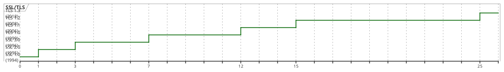

::

::plant-uml

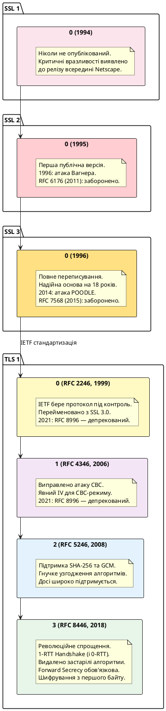

::

::caution
Станом на 2024 рік IETF рекомендує **лише TLS 1.2 та TLS 1.3**. Версії TLS 1.0 та TLS 1.1 офіційно депреційовано у RFC 8996 (2021). SSL 3.0 і нижче — заборонені. Якщо ваш застосунок досі підтримує TLS 1.0 або TLS 1.1, це є порушенням вимог PCI DSS та GDPR.
::

---

## Криптографічні основи: мова, якою говорить TLS

Перш ніж занурюватись у деталі протоколу, необхідно опанувати криптографічну абетку. TLS — це не один алгоритм, а **оркестр** різних криптографічних примітивів, кожен з яких вирішує свою конкретну задачу.

### Симетрична криптографія: швидкість ціною спільного секрету

У симетричній криптографії **той самий ключ** використовується і для шифрування, і для розшифрування. Це ефективно та швидко — сучасні процесори мають апаратне прискорення (AES-NI), що дозволяє шифрувати гігабайти даних за секунду.

```
Симетричне шифрування:

  Відкритий текст          Зашифрований текст
  "Hello, World!"  ──[KEY]──►  "Ω∆≤≥¥§ÿ..."
                                   │
                               [той самий KEY]
                                   │
  "Hello, World!"  ◄──────────────┘
```

**Класичний приклад — AES (Advanced Encryption Standard):**

AES оперує блоками по 128 біт і підтримує ключі довжиною 128, 192 або 256 біт. Але просте блочне шифрування (AES-ECB) є вразливим: однакові блоки відкритого тексту дають однакові блоки шифртексту, що дозволяє виявити патерни.

```
AES-ECB (небезпечний — зберігає структуру):

Блок 1: "АЛІСА ВІДПРАВЛЯ"  ──► [AES-ECB] ──► "Ω∆≤3K7#..."
Блок 2: "Є БОБУ 100 ДОЛАРІ"──► [AES-ECB] ──► "ΨΠ∑9L2@..."
Блок 3: "АЛІСА ВІДПРАВЛЯ"  ──► [AES-ECB] ──► "Ω∆≤3K7#..."  ← Однаковий! Витік інформації.
```

Тому TLS використовує **режими роботи** блочних шифрів:

::field-group

::field{name="AES-CBC (Cipher Block Chaining)" type="TLS 1.2"}
Кожен блок XOR-ується з попереднім зашифрованим блоком перед шифруванням. Перший блок XOR-ується з випадковим **Initialization Vector (IV)**. Однакові блоки відкритого тексту дають різні блоки шифртексту. Вразливий до атак на основі оракула заповнення (Padding Oracle), якщо реалізований неправильно (саме звідси — атаки BEAST і POODLE).
::

::field{name="AES-GCM (Galois/Counter Mode)" type="TLS 1.2/1.3, рекомендований"}
Поєднує CTR-режим шифрування з автентифікацією Galois MAC. **AEAD** (Authenticated Encryption with Associated Data) — шифрує та автентифікує одночасно. Паралелізується (на відміну від CBC), апаратно прискорений, позбавлений вразливостей padding oracle. TLS 1.3 дозволяє лише AEAD-режими.
::

::field{name="ChaCha20-Poly1305" type="TLS 1.2/1.3, альтернатива AES-GCM"}
Потоковий шифр ChaCha20 + MAC Poly1305. Розроблений Деніелом Бернштейном. Ефективний на пристроях без апаратного прискорення AES (мобільні ARM без AES-NI). Google обрав його як основний шифр у Chrome для Android.
::

::

**Фундаментальна проблема симетричної криптографії:** якщо Аліса і Боб хочуть спілкуватись зашифровано, їм спочатку потрібно **узгодити спільний ключ**. Але якщо передати ключ у відкритій мережі — його перехоплять. Це замкнене коло: щоб передати ключ безпечно — потрібен ключ.

---

### Асиметрична криптографія: відкриті та закриті ключі

Асиметрична криптографія (public-key cryptography) вирішує парадокс розподілу ключів геніально простим способом: у кожного учасника є **два пов'язаних ключі** — відкритий (public key) та закритий (private key). Математичний зв'язок між ними такий: те, що зашифровано відкритим ключем, можна розшифрувати **лише** відповідним закритим ключем, і навпаки.

```
Асиметричне шифрування (для обміну даними):

      Аліса                              Боб
  [публічний ключ Боба]            [приватний ключ Боба]
  [приватний ключ Аліси]           [публічний ключ Аліси]
         │                                  │
         │   "Привіт, Боб!"                 │
         │ ──[encrypt(Боб.pub)]──►          │
         │   "ΩΨ∆≤K7#@..."                  │
         │                   ──[decrypt(Боб.priv)]──►
         │                                  │
         │                          "Привіт, Боб!"
```

```
Цифровий підпис (для автентифікації):

      Аліса                              Боб
  [приватний ключ Аліси]           [публічний ключ Аліси]
         │                                  │
         │   Документ D                     │
         │   sign(hash(D), Аліса.priv)      │
         │ ──[Документ D + Підпис S]──►     │
         │                                  │
         │              verify(hash(D), S, Аліса.pub) == true?
         │                           ↑
         │              Якщо так — Аліса точно підписала,
         │              і документ не змінювався.
```

**RSA (Rivest–Shamir–Adleman)** — найстаріший і найвідоміший алгоритм асиметричного шифрування. Безпека RSA ґрунтується на **обчислювальній складності факторизації великих чисел**: добуток двох великих простих чисел легко обчислити, але відновити ці числа із добутку — практично неможливо за розумний час.

```
RSA — математична основа (спрощено):

1. Беремо два великих простих числа: p = 61, q = 53
2. n = p × q = 3233  (модуль, частина публічного ключа)
3. φ(n) = (p-1)(q-1) = 3120  (функція Ейлера)
4. Обираємо e таке, що gcd(e, φ(n)) = 1:  e = 17
5. Знаходимо d таке, що (d × e) mod φ(n) = 1:  d = 2753

Публічний ключ:  (e=17, n=3233)  ← можна поширювати
Приватний ключ:  (d=2753, n=3233) ← тримати в таємниці

Шифрування:  C = M^e mod n  →  42^17 mod 3233 = 2557
Дешифрування: M = C^d mod n  →  2557^2753 mod 3233 = 42  ✓

На практиці: n має бути 2048+ біт (≈617 десяткових цифр).
Факторизація 2048-бітного числа неможлива за розумний час
навіть для найпотужніших суперкомп'ютерів.
```

**ECDSA та ECDH — криптографія еліптичних кривих:** Сучасніша альтернатива RSA. Той самий рівень безпеки досягається з **значно меншими ключами**: 256-бітний ключ ECDSA приблизно еквівалентний 3072-бітному ключу RSA за надійністю. Математична основа — операції на еліптичних кривих у скінченних полях.

```
Порівняння розмірів ключів для еквівалентного рівня безпеки:

Рівень безпеки │ RSA/DH      │ ECC
─────────────────────────────────────
80 біт         │ 1024 біт    │ 160 біт
112 біт        │ 2048 біт    │ 224 біт
128 біт        │ 3072 біт    │ 256 біт  ← P-256, найпоширеніший
192 біт        │ 7680 біт    │ 384 біт
256 біт        │ 15360 біт   │ 521 біт
```

::note
Асиметрична криптографія є принципово **повільнішою** за симетричну — на 100–10000 разів. Тому TLS не шифрує дані асиметрично. Натомість асиметрична криптографія використовується **лише для Handshake** — для безпечного узгодження симетричного сесійного ключа. Після цього всі дані шифруються швидкою симетричною криптографією.
::

---

### Алгоритм Діффі–Гелмана: як узгодити ключ через відкритий канал

У 1976 році Вітфілд Діффі та Мартін Гелман опублікували революційну роботу, що вирішила задачу безпечного обміну ключами через відкритий канал. Ідея проста, але геніальна: два учасники можуть узгодити **спільний секрет**, жодного разу не передаючи його через мережу.

Найпростіший спосіб зрозуміти цей алгоритм — аналогія з фарбами:

```
Аналогія з фарбами (Діффі–Гелман):

1. Аліса і Боб публічно домовляються про
   спільну "базову" фарбу: ЖОВТА.
   Вороги це бачать — і це нормально.

2. Аліса додає свою таємну фарбу (СИНЯ) →
   отримує ЗЕЛЕНУ, яку надсилає Бобу.

3. Боб додає свою таємну фарбу (ЧЕРВОНА) →
   отримує ПОМАРАНЧЕВУ, яку надсилає Алісі.

4. Аліса отримує ПОМАРАНЧЕВУ Боба, додає
   свою СИНЮ → КОРИЧНЕВА (спільний секрет!)

5. Боб отримує ЗЕЛЕНУ Аліси, додає
   свою ЧЕРВОНУ → КОРИЧНЕВА (той самий секрет!)

Ворог бачить: ЖОВТУ, ЗЕЛЕНУ, ПОМАРАНЧЕВУ.
Відновити КОРИЧНЕВУ без знання таємних фарб —
обчислювально неможливо (задача дискретного логарифму).
```

::plant-uml

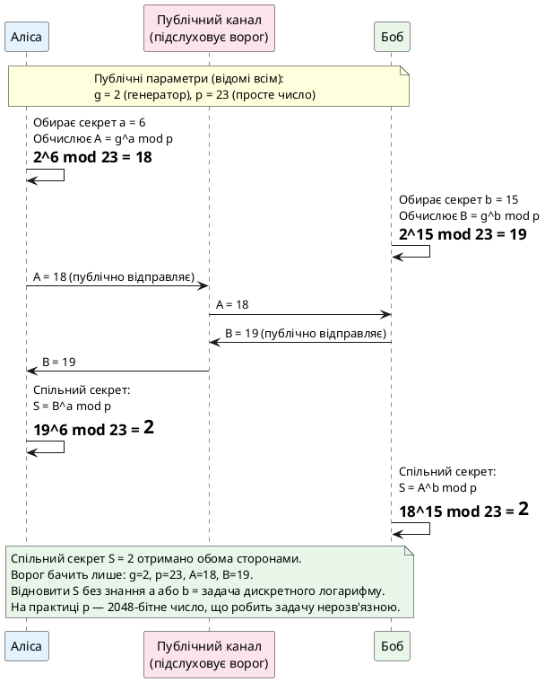

::

**ECDH (Elliptic Curve Diffie-Hellman)** — версія алгоритму на еліптичних кривих. Використовується в TLS 1.3. Замість модульних потенцій — скалярне множення точок на кривій, що забезпечує той самий рівень безпеки при значно менших ключах.

```
ECDH на кривій P-256:

1. Публічно: крива P-256, точка G (генератор)
2. Аліса: обирає секрет a, обчислює A = a·G (точка на кривій)
3. Боб:   обирає секрет b, обчислює B = b·G (точка на кривій)
4. Аліса → Боб: A;   Боб → Аліса: B
5. Аліса: S = a·B = a·b·G
6. Боб:   S = b·A = b·a·G  → той самий S ✓

Ворог знає G, A, B, але не може обчислити a або b
(задача дискретного логарифму на еліптичних кривих).
```

::tip
**Ephemeral DH (DHE/ECDHE):** У TLS для кожної нової сесії генеруються нові тимчасові (ephemeral) DH-ключі. Навіть якщо приватний ключ сервера буде скомпрометований у майбутньому, зловмисник **не зможе розшифрувати минулі сесії** — для цього потрібні ефемерні ключі, що вже знищені. Ця властивість називається **Perfect Forward Secrecy (PFS)** і є обов'язковою у TLS 1.3.
::

---

### Хеш-функції та HMAC: цілісність без секрету

Криптографічна хеш-функція перетворює дані довільного розміру на рядок фіксованого розміру (дайджест) із такими властивостями:

```
Властивості криптографічних хеш-функцій:

1. Детермінованість:
   SHA256("Hello") = "185f8db3..."  ← завжди однаково

2. Лавинний ефект:
   SHA256("Hello") = "185f8db3..."
   SHA256("Hello!") = "334d0162..."  ← кардинально інший!

3. Незворотність (Pre-image resistance):
   "185f8db3..." → ? → неможливо відновити "Hello"
   (обчислювально неможливо, не теоретично)

4. Стійкість до колізій (Collision resistance):
   Неможливо знайти два різних входи з однаковим хешем.
   SHA256(X) = SHA256(Y), де X ≠ Y → практично неможливо

5. Ефективність:
   Обчислення хешу — дуже швидка операція.
```

**SHA-256 та SHA-384** — основні хеш-функції в TLS 1.2/1.3. SHA-1 офіційно вилучено через практичні атаки колізій (Google, 2017).

**HMAC (Hash-based Message Authentication Code)** — механізм автентифікації повідомлень на основі хеш-функції та секретного ключа:

```
HMAC-SHA256(key, message):

ipad = 0x36 repeated 64 times
opad = 0x5C repeated 64 times

HMAC = SHA256( (key XOR opad) || SHA256( (key XOR ipad) || message ) )

Властивості:
- Без знання key неможливо обчислити правильний HMAC
- Зміна будь-якого байту message дасть інший HMAC
- Використовується для перевірки цілісності TLS записів
```

---

### Криптографічний алфавіт TLS: Cipher Suite

Перш ніж перейти до Handshake, введемо поняття **Cipher Suite** (набір шифрів) — це ідентифікатор, що повністю описує комбінацію алгоритмів, що використовуються у TLS-сесії. Кожен Cipher Suite кодує чотири компоненти:

```
TLS_ECDHE_RSA_WITH_AES_256_GCM_SHA384
│    │     │        │    │   │    │
│    │     │        │    │   │    └── Хеш-функція (для PRF/HMAC)
│    │     │        │    │   └─────── Режим шифрування
│    │     │        │    └─────────── Розмір ключа (біт)
│    │     │        └──────────────── Симетричний алгоритм
│    │     └───────────────────────── Алгоритм автентифікації
│    └─────────────────────────────── Алгоритм обміну ключами
└──────────────────────────────────── Протокол
```

| Cipher Suite                            | Обмін ключами | Автентифікація | Шифрування  | MAC               |
| --------------------------------------- | ------------- | -------------- | ----------- | ----------------- |
| `TLS_AES_256_GCM_SHA384`                | ECDHE         | з сертифікату  | AES-256-GCM | Вбудований (AEAD) |
| `TLS_CHACHA20_POLY1305_SHA256`          | ECDHE         | з сертифікату  | ChaCha20    | Poly1305 (AEAD)   |
| `TLS_ECDHE_RSA_WITH_AES_128_GCM_SHA256` | ECDHE         | RSA            | AES-128-GCM | SHA-256           |
| `TLS_RSA_WITH_AES_256_CBC_SHA`          | RSA           | RSA            | AES-256-CBC | SHA-1             |

::warning
У TLS 1.3 залишилось лише 5 стандартних Cipher Suite — всі вони є AEAD. Небезпечні алгоритми (RC4, 3DES, MD5, SHA-1, RSA-обмін ключами) офіційно видалені. Якщо ваш сервер пропонує Cipher Suite з `NULL`, `EXPORT`, `anon`, `RC4` або `3DES` — це серйозна вразливість.
::

---

Перша частина охоплює криптографічний фундамент TLS. Далі розглянемо сертифікати X.509, інфраструктуру відкритих ключів (PKI), ланцюжок довіри та як браузер перевіряє, що `bank.example.com` — справді ваш банк, а не зловмисник.

---

## Сертифікати X.509 та інфраструктура відкритих ключів (PKI)

### Парадокс відкритого ключа: кому довіряти?

Асиметрична криптографія вирішила задачу обміну ключами, але породила нову. Припустімо, Аліса хоче відправити зашифроване повідомлення Бобу. Вона отримує «відкритий ключ Боба» з якогось сайту. Але **звідки вона знає, що це справді ключ Боба?** Що ніхто не підмінив його своїм ключем на шляху?

```
Атака підміни ключа (MitM на відкритому ключі):

Аліса               Зловмисник Єва               Боб
   |                      |                        |
   | "Дай мені твій       |                        |
   |  відкритий ключ" ──► |                        |
   |                      | ──► Боб.pub_key ──────►|
   |                      | ◄── Боб.pub_key ────── |
   |                      |                        |
   |    [Єва.pub_key] ◄── |  (підміна!)            |
   |                      |                        |
   | Шифрує своїм ключем  |                        |
   | Єви, думаючи що це   |                        |
   | ключ Боба ──────────►|                        |
   |              Єва розшифровує,                 |
   |              читає, перешифровує              |
   |              ключем Боба і передає ►          |
```

Ця атака відома як **Man-in-the-Middle (MitM)**. Без додаткового механізму перевірки справжності ключа асиметрична криптографія не захищає від неї.

**Рішення:** потрібна довірена третя сторона, яка засвідчить зв'язок між відкритим ключем та ідентичністю його власника. Саме цю роль виконує **Центр Сертифікації (Certificate Authority, CA)**, а документ, що засвідчує зв'язок — **цифровий сертифікат X.509**.

::note
**Ключова ідея:** Сертифікат X.509 — це, по суті, відповідь на питання «Хто запевняє, що цей відкритий ключ належить саме цьому домену?». Відповідь: «Центр Сертифікації, якому довіряє ваш браузер/ОС».
::

---

### Анатомія сертифіката X.509

Стандарт **X.509** визначений ITU-T і є частиною стандарту X.500 для служб каталогів. Версія X.509v3 (RFC 5280) — поточний стандарт для сертифікатів в Інтернеті.

Сертифікат — це бінарний документ у форматі **DER** (Distinguished Encoding Rules, підмножина ASN.1), часто закодований у Base64 у форматі **PEM** (Privacy Enhanced Mail). Структура:

```
Сертифікат X.509v3 (спрощено):

┌─────────────────────────────────────────────┐
│  TBSCertificate (To Be Signed Certificate)  │
│  ┌──────────────────────────────────────┐   │
│  │ Version: 3                           │   │
│  │ Serial Number: 0x0F:A3:2B:...        │   │
│  │ Signature Algorithm: sha256WithRSA   │   │
│  │                                      │   │
│  │ Issuer (Видавець):                   │   │
│  │   C=US, O=DigiCert Inc,              │   │
│  │   CN=DigiCert TLS RSA SHA256 2020 CA1│   │
│  │                                      │   │
│  │ Validity:                            │   │
│  │   Not Before: 2024-01-15 00:00:00    │   │
│  │   Not After:  2025-02-14 23:59:59    │   │
│  │                                      │   │
│  │ Subject (Власник):                   │   │
│  │   C=US, ST=California, L=Menlo Park  │   │
│  │   O=Example Corp, CN=www.example.com │   │
│  │                                      │   │
│  │ Subject Public Key Info:             │   │
│  │   Algorithm: rsaEncryption           │   │
│  │   Public Key: (2048 bit)             │   │
│  │   30 82 01 0a 02 82 01 01 00 ...     │   │
│  │                                      │   │
│  │ Extensions (v3):                     │   │
│  │   Subject Alt Names: DNS:example.com │   │
│  │                       DNS:*.example.com│  │
│  │   Key Usage: Digital Signature,      │   │
│  │              Key Encipherment        │   │
│  │   Extended Key Usage: serverAuth     │   │
│  │   Basic Constraints: CA:false        │   │
│  │   CRL Distribution Points: http://.. │   │
│  │   OCSP: http://ocsp.digicert.com     │   │
│  └──────────────────────────────────────┘   │
│                                             │
│  Signature Algorithm: sha256WithRSAEncryption│
│  Signature Value:                           │
│    (цифровий підпис CA, ~256 байт RSA)      │
│    3d 4a f2 b1 ... 9e 0c 7f               │
└─────────────────────────────────────────────┘
```

::field-group

::field{name="Version" type="integer (1/2/3)"}
Версія стандарту X.509. Версія 3 (значення `2` у DER через відлік від нуля) — єдина актуальна. Додала розширення (Extensions), без яких неможливі SAN, Key Usage та інші критично важливі поля.
::

::field{name="Serial Number" type="великий integer"}
Унікальний номер сертифіката, призначений CA. Використовується у списках відкликання (CRL). Починаючи з 2016 року (RFC 5280 errata + Baseline Requirements) — повинен містити мінімум 64 біти ентропії для запобігання передбачуваності.
::

::field{name="Issuer / Subject" type="Distinguished Name (DN)"}
Ієрархічний ідентифікатор у форматі X.500. Компоненти: `CN` (Common Name), `O` (Organization), `OU` (Organizational Unit), `C` (Country), `ST` (State), `L` (Locality). У серверних сертифікатах `Subject.CN` колись вказував на домен, але тепер **застарів** — для доменів використовується лише `Subject Alternative Names` (SAN).
::

::field{name="Subject Alternative Names (SAN)" type="розширення X.509v3, критичне"}
Список доменів, IP-адрес, email або URI, для яких дійсний сертифікат. Замінив `Subject.CN` для перевірки домену (RFC 2818). Приклад: `DNS:example.com`, `DNS:*.example.com`, `IP:93.184.216.34`. Wildcard (`*`) охоплює **лише один рівень**: `*.example.com` → `www.example.com` ✓, але `sub.www.example.com` ✗.
::

::field{name="Key Usage / Extended Key Usage" type="розширення X.509v3"}
**Key Usage** обмежує криптографічне використання ключа: `digitalSignature`, `keyEncipherment`, `keyCertSign` (для CA). **Extended Key Usage** вказує призначення: `serverAuth` (TLS-сервер), `clientAuth` (TLS-клієнт), `codeSigning`, `emailProtection`. Сервер без `serverAuth` в EKU буде відхилений браузером.
::

::field{name="Basic Constraints" type="розширення X.509v3, критичне"}
`CA:true` — сертифікат може підписувати інші сертифікати (є CA). `CA:false` — кінцевий (leaf) сертифікат, не може підписувати. `PathLen` обмежує глибину ланцюжка. **Критично важливе розширення**: якщо CA:false, браузер не дозволить використати сертифікат для підпису інших.
::

::field{name="Signature Value" type="байтовий рядок"}
Цифровий підпис CA, обчислений над полем TBSCertificate (все вище підпису). Верифікується відкритим ключем Issuer (CA). Зміна будь-якого поля сертифіката одразу робить підпис невалідним — сертифікат стає підробленим і буде відхилений.
::

::

Подивимось на реальний сертифікат. Команда `openssl x509 -text` парсить DER/PEM та виводить усі поля у читабельному вигляді:

```bash
# Отримати та розібрати сертифікат github.com
echo | openssl s_client -connect github.com:443 2>/dev/null | openssl x509 -text -noout
```

```
Certificate:
    Data:
        Version: 3 (0x2)
        Serial Number:
            17:67:44:75:96:48:b3:8e:6b:de:a9:92:42:10:d7:bb
        Signature Algorithm: ecdsa-with-SHA256
        Issuer: C=US, O=DigiCert, Inc., CN=DigiCert TLS Hybrid ECC SHA384 2020 CA1
        Validity
            Not Before: Feb 15 00:00:00 2024 GMT
            Not After : Mar 15 23:59:59 2025 GMT
        Subject: C=US, ST=California, L=San Francisco,
                 O=GitHub, Inc., CN=github.com
        Subject Public Key Info:
            Public Key Algorithm: id-ecPublicKey
                Public-Key: (256 bit)
                pub: 04:fa:2d:...
                ASN1 OID: prime256v1
                NIST CURVE: P-256
        X509v3 extensions:
            X509v3 Subject Alternative Name:
                DNS:github.com, DNS:www.github.com
            X509v3 Key Usage: critical
                Digital Signature
            X509v3 Extended Key Usage:
                TLS Web Server Authentication, TLS Web Client Authentication
            X509v3 Basic Constraints: critical
                CA:FALSE
            Authority Information Access:
                OCSP - URI:http://ocsp.digicert.com
                CA Issuers - URI:http://cacerts.digicert.com/...
```

---

### Ланцюжок довіри: від Root CA до вашого сертифіката

Жоден CA не підписує сертифікати кінцевих сервісів своїм **кореневим (Root) CA** сертифікатом безпосередньо. Чому? Приватний ключ Root CA — найцінніший актив у PKI. Компрометація Root CA означає компрометацію **всіх** сертифікатів, виданих цим CA.

Тому в реальному світі використовується **ієрархія сертифікатів** із трьох рівнів:

::plant-uml

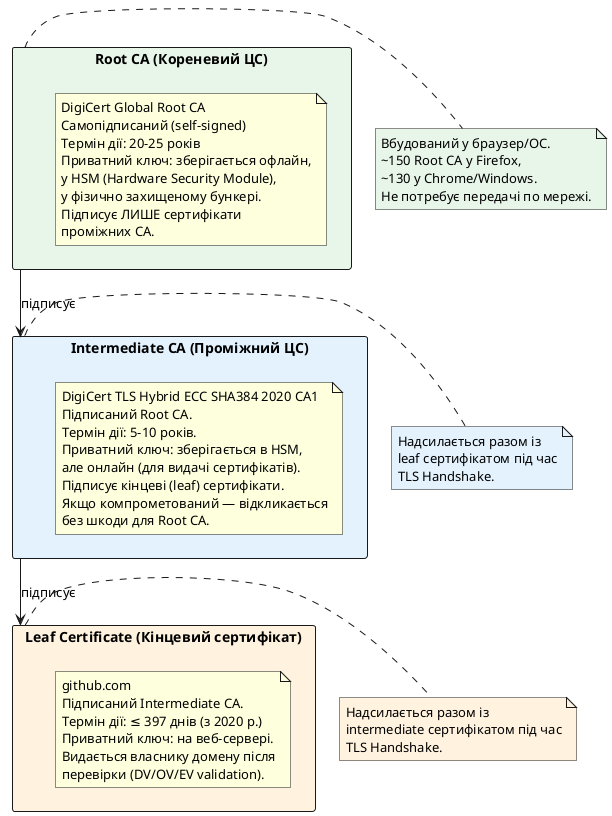

::

**Як клієнт перевіряє ланцюжок довіри:**

::steps

### Отримання сертифікатів із TLS Handshake

Під час TLS Handshake сервер надсилає **Certificate message**, що містить свій leaf-сертифікат та один або кілька проміжних сертифікатів (але не Root CA — він вже є у клієнта). Якщо сервер не надсилає проміжний CA — більшість клієнтів відхилить з'єднання, хоча деякі можуть спробувати завантажити його через AIA (Authority Information Access).

### Побудова ланцюжка

Клієнт будує ланцюжок від leaf-сертифіката до кореневого: `Leaf → Intermediate → Root`. Кожен наступний рівень є **Issuer** (видавцем) попереднього.

### Верифікація підписів

Для кожної пари `(сертифікат, його видавець)` клієнт перевіряє:

- Підпис сертифіката верифікується **відкритим ключем видавця** ✓
- Видавець має `Basic Constraints: CA:true` ✓
- Поточний час знаходиться між `Not Before` і `Not After` ✓

### Перевірка прив'язки до Root

Ланцюжок повинен завершуватись сертифікатом, що є в **системному сховищі довірених кореневих CA**. Windows: Certificate Store. macOS: Keychain. Linux: `/etc/ssl/certs/`. Firefox: власне сховище, незалежне від ОС.

### Перевірка відкликання

Чи не відкликано сертифікат? Два механізми:

- **CRL (Certificate Revocation List):** Завантажити список відкликаних серійних номерів з URL у `CRL Distribution Points`. Може бути мегабайтним.
- **OCSP (Online Certificate Status Protocol):** Запит до OCSP Responder із серійним номером сертифіката. Відповідь: `good`, `revoked`, або `unknown`.

### Перевірка домену

Домен у запиті (`github.com`) **точно збігається** з SAN сертифіката? Якщо так — перевірка пройдена. Wildcard-сертифікат `*.github.com` покриває `api.github.com`, але не `github.com` і не `sub.api.github.com`.

::

```
Повний шлях перевірки (chain validation):

Браузер                    Мережа                    Сервер
   │                          │                         │
   │◄─────────────────────────┤ Certificate (leaf)      │
   │◄─────────────────────────┤ + Intermediate CA       │
   │                          │                         │
   │ [1] Знайти Root CA у сховищі ОС                   │
   │     Root CA = DigiCert Global Root CA              │
   │                                                    │
   │ [2] verify(Intermediate.signature, Root.pubkey)    │
   │     → OK ✓                                         │
   │                                                    │
   │ [3] verify(Leaf.signature, Intermediate.pubkey)    │
   │     → OK ✓                                         │
   │                                                    │
   │ [4] Leaf.NotBefore ≤ now ≤ Leaf.NotAfter           │
   │     → OK ✓                                         │
   │                                                    │
   │ [5] OCSP запит: чи відкликано Leaf?                │
   │ ────────────────────────────────────────────────►  │
   │ ◄────────────────────────────────── status: good ✓ │
   │                                                    │
   │ [6] "github.com" ∈ Leaf.SAN?                       │
   │     DNS:github.com ✓                               │
   │                                                    │
   │ TLS Handshake продовжується. З'єднання довірене.  │
```

---

### Типи валідації та рівні довіри сертифікатів

Не всі сертифікати однаково «довірені» з точки зору ідентифікації власника. CA Браузерний форум (CA/Browser Forum) визначає три рівні:

::plant-uml

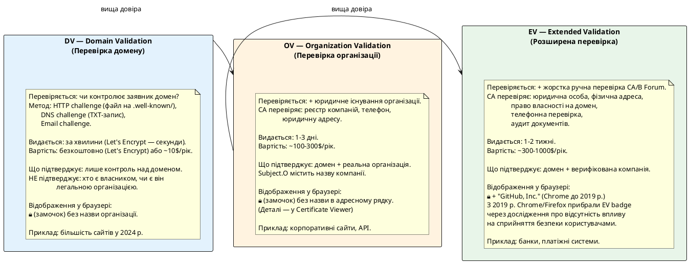

::

::tip
**Let's Encrypt** (заснований у 2014, ISRG) виконав революцію в PKI: безкоштовні DV-сертифікати з автоматичним оновленням через протокол **ACME** (RFC 8555). До 2014 року DV-сертифікат коштував $10-50/рік. Let's Encrypt видає близько **400 мільйонів** активних сертифікатів, що більше ніж усі комерційні CA разом. HTTPS став доступним для будь-якого сайту.
::

---

### Certificate Transparency: публічний аудит видачі сертифікатів

Уявіть ситуацію: CA DigiCert за помилкою (або зловмисно) видає сертифікат для `google.com` якійсь третій особі. Ця особа може здійснити MitM-атаку на мільярди користувачів. Саме так трапилось у 2011 р. із нідерландським CA DigiNotar — він видав фальшиві сертифікати для Google та Yahoo іранським хакерам.

**Certificate Transparency (CT, RFC 9162)** — відповідь на цю загрозу, запроваджена Google у 2013 р. та обов'язкова у Chrome з 2018 р.

Ідея: кожен публічний сертифікат **повинен бути записаний** у публічний, незмінний журнал (CT Log) до моменту видачі. Будь-хто може перевірити журнал і виявити несанкціоновану видачу сертифіката для свого домену.

```
Certificate Transparency workflow:

CA                    CT Log (Merkle Tree)              Браузер
 │                          │                               │
 │ Надсилає pre-certificate │                               │
 │─────────────────────────►│                               │
 │                          │ Додає до append-only журналу  │
 │◄─────────────────────────│ Повертає SCT (signed timestamp│
 │  SCT (Signed             │ + підпис Log) ─────────────►  │
 │  Certificate Timestamp)  │                               │
 │                          │                               │
 │ Вбудовує SCT у сертифікат│                               │
 │                          │                               │
 │──────────────────────────────────────────────────────►   │
 │             Сертифікат із SCT                             │
 │                          │                               │
 │                          │ Браузер перевіряє SCT        │
 │                          │ Немає SCT → ❌ не довіряти   │
```

::plant-uml

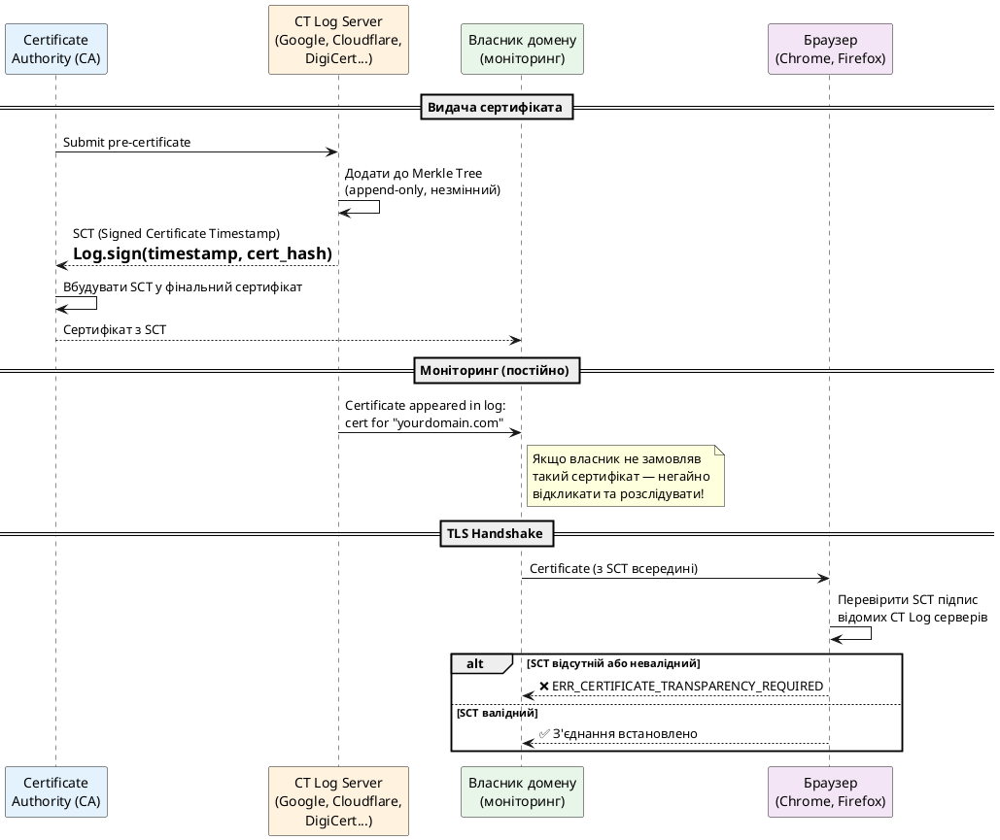

::

---

### Відкликання сертифікатів: CRL та OCSP

Що відбувається, якщо приватний ключ сервера скомпрометовано ще до закінчення дії сертифіката? Наприклад, зловмисник отримав доступ до сервера і скопіював `server.key`. Сертифікат формально ще дійсний — але довіряти йому не можна.

Рішення: **відкликання (revocation)** — CA публікує інформацію про те, що сертифікат більше не є довіреним, незважаючи на технічну дійсність.

::accordion

::accordion-item{label="CRL (Certificate Revocation List)" icon="i-lucide-list-x"}
CA публікує підписаний список серійних номерів відкликаних сертифікатів у вигляді файлу за URL з поля `CRL Distribution Points`.

```
# Завантажити та розібрати CRL
curl -s http://crl3.digicert.com/DigiCertTLSRSASHA2562020CA1-4.crl | \
  openssl crl -inform DER -text -noout | head -30

Certificate Revocation List (CRL):
    Version 2 (0x1)
    Signature Algorithm: sha256WithRSAEncryption
    Issuer: CN=DigiCert TLS RSA SHA256 2020 CA1
    Last Update: May 29 03:00:00 2026 GMT
    Next Update: Jun  5 02:00:00 2026 GMT
Revoked Certificates:
    Serial Number: 0A:1B:2C:3D:...
        Revocation Date: Jan 15 12:00:00 2026 GMT
        CRL entry extensions:
            X509v3 CRL Reason Code:
                Key Compromise
```

**Проблеми CRL:** Файл може бути мегабайтним (для популярних CA). Кешується на дні — тому відкликання не є миттєвим. Якщо CRL недоступний — більшість клієнтів пропускають перевірку (fail-open).
::

::accordion-item{label="OCSP (Online Certificate Status Protocol)" icon="i-lucide-shield-check"}
Замість завантаження всього списку — запит статусу конкретного сертифіката до OCSP Responder (сервер CA).

```
# OCSP запит для github.com (отримати сертифікати через s_client)
openssl s_client -connect github.com:443 -showcerts 2>/dev/null > chain.pem

# Розділити leaf та intermediate (вручну або через скрипт)
# Зробити OCSP запит
openssl ocsp \
  -issuer intermediate.pem \
  -cert leaf.pem \
  -url http://ocsp.digicert.com \
  -text

OCSP Response Data:
    OCSP Response Status: successful (0x0)
    Response Type: Basic OCSP Response
    Version: 1 (0x0)
    Responder Id: CN=DigiCert TLS RSA SHA256 2020 CA1 OCSP
    Produced At: May 29 10:00:00 2026 GMT
    Responses:
    Certificate ID:
      Hash Algorithm: sha1
      Issuer Name Hash: 4B:2A:...
      Issuer Key Hash: 0A:BC:...
      Serial Number: 17:67:44:...
    Cert Status: good
    This Update: May 29 10:00:00 2026 GMT
    Next Update: Jun  5 10:00:00 2026 GMT
```

**Проблема приватності:** OCSP-запит розкриває CA, який сайт ви відвідуєте (за серійним номером сертифіката). CA стає «брокером» знань про вашу мережеву активність.
::

::accordion-item{label="OCSP Stapling: найкраще з двох світів" icon="i-lucide-paperclip"}
Сервер **сам** отримує підписану OCSP-відповідь від CA та «пришиває» (staples) її до TLS Handshake. Клієнт отримує свіжий статус без додаткового мережевого запиту — і не розкриває CA, який сайт відвідує.

```
TLS Handshake з OCSP Stapling:

Клієнт                                          Сервер
   │                                               │
   │ ClientHello (з status_request extension)      │
   │──────────────────────────────────────────────►│
   │                                               │
   │◄─────────────────────────────── Certificate  │
   │◄─────────────────────── CertificateStatus    │
   │         (вбудована OCSP відповідь,            │
   │          підписана CA, свіжа ≤ 7 днів)        │
   │                                               │
   │ Перевіряє OCSP підпис локально.               │
   │ Жодного додаткового запиту до CA.             │
```

Включається в nginx: `ssl_stapling on; ssl_stapling_verify on;`
Включається в Apache: `SSLUseStapling On`
Включається в ASP.NET Core Kestrel: автоматично для деяких версій.
::

::

::caution
**OCSP fail-open:** За замовчуванням, якщо OCSP Responder недоступний, більшість браузерів **продовжують з'єднання** (fail-open), а не блокують його (fail-closed). Це компроміс між безпекою та доступністю. Єдиний механізм fail-closed — **OCSP Must-Staple** (розширення сертифіката, що вимагає обов'язкову OCSP Stapling відповідь від сервера).
::

---

### Pinning та HPKP: довіра понад PKI

**HTTP Public Key Pinning (HPKP, RFC 7469)** — механізм, що дозволяв сайту «закріпити» конкретні відкриті ключі у браузері. Навіть якби хтось отримав сертифікат від іншого CA — браузер відхилив би його, бо він не збігається із закріпленим ключем.

HPKP був депрецовано у Chrome у 2017 р. та Firefox у 2018 р. Причина — **катастрофічна небезпека**: сайт, що помилково закріпив ключі і потім замінив їх, стає недоступним для всіх відвідувачів до закінчення терміну дії pin. Кілька великих сайтів пережили такі інциденти.

**Certificate Pinning у мобільних та desktop застосунках** (не HPKP) — досі широко використовується. Застосунок містить очікуваний fingerprint сертифіката або публічного ключа і відмовляється підключатись, якщо він не збігається:

```csharp
// Certificate pinning у HttpClient (.NET)
var handler = new HttpClientHandler();
handler.ServerCertificateCustomValidationCallback =
    (message, cert, chain, errors) =>
    {
        // SHA-256 fingerprint очікуваного сертифіката
        const string expectedPin =
            "sha256/AAAAAAAAAAAAAAAAAAAAAAAAAAAAAAAAAAAAAAAAAAA=";

        // Обчислити fingerprint отриманого сертифіката
        var actualPin = Convert.ToBase64String(
            SHA256.HashData(cert!.RawData));
        var actual = $"sha256/{actualPin}";

        return actual == expectedPin;
    };
```

::warning
Certificate Pinning ускладнює оновлення сертифікатів та налагодження (неможливо використовувати корпоративний TLS-інспектор). Оновлення застосунку при зміні сертифіката стає критично важливим. Використовуйте **public key pinning** замість certificate pinning — ключ живе довше за сертифікат.
::

---

Друга частина охоплює архітектуру PKI від сертифіката X.509 до ланцюжків довіри та механізмів відкликання. Далі — серце протоколу: TLS Handshake у версіях 1.2 та 1.3.

---

## TLS Handshake: від першого байту до зашифрованих даних

### Загальна картина: що відбувається до першого HTTP-запиту

Коли ви вводите `https://github.com` і натискаєте Enter, браузер не надсилає HTTP GET одразу. Спочатку відбувається **TLS Handshake** — протокол узгодження, що встановлює захищений канал. Лише після його успішного завершення перший байт HTTP-запиту вирушає у мережу.

Handshake вирішує чотири задачі одночасно:

```
Задачі TLS Handshake:

1. УЗГОДЖЕННЯ ВЕРСІЇ ТА АЛГОРИТМІВ
   Клієнт і сервер домовляються:
   - Яку версію TLS використовувати (1.2 чи 1.3)?
   - Який Cipher Suite? (AES-256-GCM? ChaCha20?)
   - Які параметри обміну ключами?

2. АВТЕНТИФІКАЦІЯ СЕРВЕРА
   Сервер доводить свою ідентичність:
   - Надсилає сертифікат X.509
   - Клієнт перевіряє ланцюжок довіри (PKI)
   - Клієнт перевіряє, що CN/SAN збігається з доменом

3. ОБМІН КЛЮЧАМИ
   Клієнт і сервер встановлюють спільний секрет
   (Pre-Master Secret → Master Secret → Session Keys)
   через асиметричну криптографію або DH,
   жодного разу не передаючи секрет у відкритому вигляді.

4. ПІДТВЕРДЖЕННЯ
   Обидві сторони доводять, що вони мають
   однаковий сесійний ключ (Finished message).
   Від цього моменту всі дані шифруються.
```

TLS 1.2 і TLS 1.3 вирішують ці задачі принципово по-різному. Розглянемо обидва варіанти.

---

### TLS 1.2 Handshake: класичний підхід

TLS 1.2 Handshake вимагає **2 round-trips (2-RTT)** до початку передачі даних застосунку. Тобто між `SYN` TCP та першим байтом HTTP-відповіді проходить **3 round-trips**: 1 для TCP + 2 для TLS.

::plant-uml

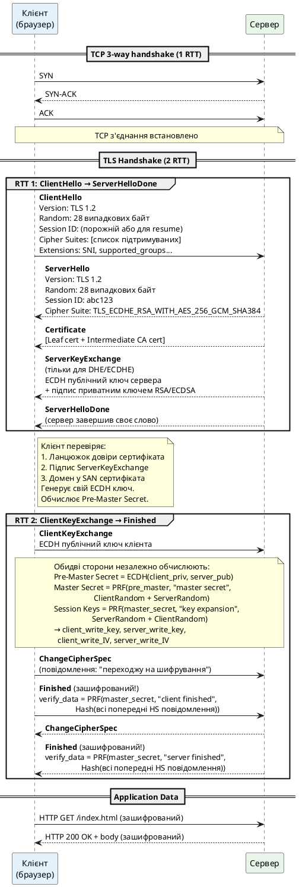

::

Розберемо кожне повідомлення детально.

#### ClientHello: клієнт відкриває переговори

`ClientHello` — перше повідомлення TLS, що надсилається після встановлення TCP-з'єднання. Це «меню» можливостей клієнта:

```
ClientHello (розбір у hex + пояснення):

Record Header:
  16          → Content Type: Handshake (0x16)
  03 01       → Legacy Record Version: TLS 1.0 (для сумісності!)
  00 f1       → Record Length: 241 байт

Handshake Header:
  01          → Handshake Type: ClientHello (1)
  00 00 ed    → Length: 237 байт

ClientHello тіло:
  03 03       → Client Version: TLS 1.2
  [28 bytes]  → ClientRandom:
                  4a 3f 2b 8c d1 e5 ... (timestamp + random)

  00          → Session ID Length: 0 (нова сесія)

  00 2a       → Cipher Suites Length: 42 (21 suite × 2 байти)
  13 01       →   TLS_AES_128_GCM_SHA256          (TLS 1.3)
  13 02       →   TLS_AES_256_GCM_SHA384          (TLS 1.3)
  13 03       →   TLS_CHACHA20_POLY1305_SHA256     (TLS 1.3)
  c0 2b       →   TLS_ECDHE_ECDSA_WITH_AES_128_GCM_SHA256
  c0 2f       →   TLS_ECDHE_RSA_WITH_AES_128_GCM_SHA256
  c0 2c       →   TLS_ECDHE_ECDSA_WITH_AES_256_GCM_SHA384
  ... (ще 15 наборів)
  00 ff       →   TLS_EMPTY_RENEGOTIATION_INFO_SCSV (захист)

  01          → Compression Methods Length: 1
  00          →   null (стиснення заборонено з TLS 1.3)

  Extensions:
  00 00       →   server_name (SNI): "github.com"
  00 0d       →   signature_algorithms: sha256+rsa, sha384+ecdsa...
  00 0a       →   supported_groups: x25519, P-256, P-384
  00 23       →   session_ticket: (порожній)
  00 10       →   application_layer_protocol_negotiation (ALPN):
                    h2, http/1.1
```

::note
**SNI (Server Name Indication)** — критично важливе розширення. Воно дозволяє одному IP-серверу обслуговувати кілька доменів із різними сертифікатами. Клієнт вказує у `server_name` extension, до якого домену підключається, ще **до** отримання сертифіката. Без SNI неможливо, наприклад, розмістити `alice.example.com` і `bob.example.com` на одному сервері з різними сертифікатами.

Важливо: SNI надсилається у **відкритому вигляді** до встановлення шифрування. Тобто ISP або зловмисник може бачити, до якого домену ви підключаєтесь — навіть для HTTPS. Рішення: **Encrypted Client Hello (ECH)**, що шифрує SNI. Наразі (2026) ECH реалізовано у Chrome та Firefox.
::

#### ServerHello та ServerKeyExchange: відповідь сервера

Сервер обирає один набір шифрів з переліку клієнта і відповідає:

```
ServerHello:
  Version:      TLS 1.2
  ServerRandom: [28 bytes] ← 28 нових випадкових байт
  Session ID:   abc123...  ← для можливого resume
  Cipher Suite: TLS_ECDHE_RSA_WITH_AES_256_GCM_SHA384

ServerKeyExchange (для ECDHE):
  Curve:        named_curve: secp256r1 (P-256)
  ECPoint:      04 a3 f2 ... ← публічний ключ ECDH сервера (65 байт)
  Signature:    [RSA підпис приватним ключем сервера над:
                  ClientRandom + ServerRandom + ECPoint]

  Навіщо підпис?
  Без нього зловмисник міг би підмінити ECPoint власним ключем.
  Підпис прив'язує ECDH-ключ до сертифіката сервера.
```

#### Master Secret та деривація ключів

Після отримання `ServerKeyExchange` та відправки `ClientKeyExchange` обидві сторони мають однаковий `Pre-Master Secret`. З нього через **PRF (Pseudorandom Function)** деривуються всі сесійні ключі:

```
Деривація ключів у TLS 1.2:

Pre-Master Secret (48 байт):
  = ECDH(client_ephemeral_priv, server_ephemeral_pub)
  = 3f a2 b1 ...  (48 байт)

Master Secret (48 байт):
  = PRF(pre_master_secret,
        label: "master secret",
        seed:  ClientRandom + ServerRandom)
  = 9e 4c 2d ...

Key Material (деривується з Master Secret):
  = PRF(master_secret,
        label: "key expansion",
        seed:  ServerRandom + ClientRandom)

Розбивається на:
  client_write_MAC_key  → HMAC-ключ для даних від клієнта
  server_write_MAC_key  → HMAC-ключ для даних від сервера
  client_write_key      → AES-ключ для шифрування від клієнта
  server_write_key      → AES-ключ для шифрування від сервера
  client_write_IV       → IV для AES-GCM від клієнта
  server_write_IV       → IV для AES-GCM від сервера
```

::tip
`ClientRandom` та `ServerRandom` у деривації ключів виконують важливу функцію: навіть якщо два з'єднання мають однаковий `Pre-Master Secret` (теоретично), сесійні ключі будуть різними, бо Random-и унікальні для кожної сесії. Це захищає від атак повторного відтворення (replay attacks).
::

#### Finished: взаємна верифікація

`Finished` — перше зашифроване повідомлення Handshake. Воно містить хеш **усіх попередніх** Handshake-повідомлень, обчислений через PRF:

```
client Finished:
  verify_data = PRF(master_secret,
                    "client finished",
                    SHA256(всі HS повідомлення від ClientHello))

server Finished:
  verify_data = PRF(master_secret,
                    "server finished",
                    SHA256(всі HS повідомлення від ClientHello))
```

Якщо зловмисник модифікував будь-яке повідомлення під час Handshake — хеші не збіжаться, і з'єднання буде негайно закрите. `Finished` забезпечує **цілісність всього Handshake ретроспективно**.

---

### TLS 1.3 Handshake: революційне спрощення

TLS 1.3 (RFC 8446, 2018) — результат чотирьох років роботи IETF та аналізу десятків атак на TLS 1.2. Мета: **видалити все застаріле, спростити до мінімуму, зашифрувати якнайбільше**.

Ключова різниця у порівнянні з TLS 1.2:

```
TLS 1.2: 2-RTT до початку даних
  TCP SYN ─►
           ◄─ TCP SYN-ACK
  TCP ACK ─►
  ClientHello ─►                              (RTT 1 початок)
               ◄─ ServerHello
               ◄─ Certificate
               ◄─ ServerKeyExchange
               ◄─ ServerHelloDone            (RTT 1 кінець)
  ClientKeyExchange ─►
  ChangeCipherSpec ─►
  Finished ─►                                 (RTT 2 початок)
               ◄─ ChangeCipherSpec
               ◄─ Finished                   (RTT 2 кінець)
  HTTP GET ─►

TLS 1.3: 1-RTT до початку даних
  TCP SYN ─►
           ◄─ TCP SYN-ACK
  TCP ACK ─►
  ClientHello ─►                              (RTT 1 початок)
  (з KeyShare: ECDH публічний ключ вже тут!)
               ◄─ ServerHello + KeyShare
               ◄─ EncryptedExtensions       ← вже зашифровано!
               ◄─ Certificate               ← вже зашифровано!
               ◄─ CertificateVerify         ← вже зашифровано!
               ◄─ Finished                  ← вже зашифровано!
  Finished ─►                                (RTT 1 кінець)
  HTTP GET ─►  ← одразу після Finished!
```

::plant-uml

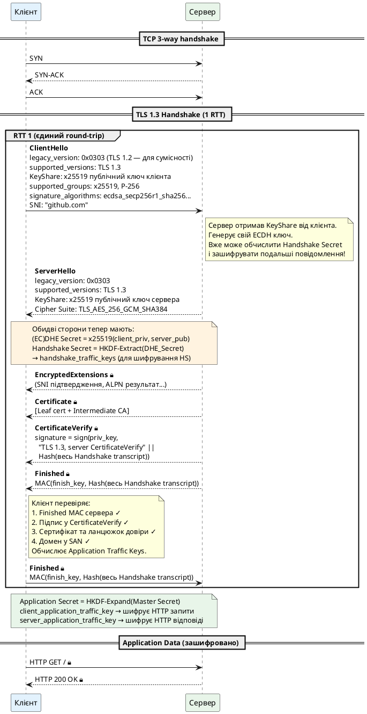

::

#### Що змінилось у TLS 1.3 принципово

::accordion

::accordion-item{label="KeyShare у ClientHello: ключ заздалегідь" icon="i-lucide-key"}
У TLS 1.2 клієнт спочатку чекав, поки сервер оголосить Cipher Suite, і лише після цього надсилав свій ECDH-ключ у `ClientKeyExchange`. Це і вимагало другого RTT.

У TLS 1.3 клієнт **робить ставку** — надсилає ECDH-ключі для кількох кривих одразу у `KeyShare` extension у `ClientHello`. Сервер обирає одну з кривих та відповідає своїм ключем у `ServerHello`. Якщо жодна крива не підійшла — сервер відповідає `HelloRetryRequest` (що знову вимагає RTT, але це виняток).

```
ClientHello.KeyShare:
  x25519: [32 bytes публічний ключ]  ← найімовірніша крива
  P-256:  [65 bytes публічний ключ]  ← запасний варіант

ServerHello.KeyShare:
  x25519: [32 bytes публічний ключ]  ← сервер обрав x25519
```

Ця зміна скорочує Handshake з 2-RTT до 1-RTT.
::

::accordion-item{label="Шифрування з першого байту після ServerHello" icon="i-lucide-lock"}
У TLS 1.2 `Certificate`, `ServerKeyExchange` та `ServerHelloDone` передавались у **відкритому вигляді**. Це означало, що пасивний спостерігач міг бачити:

- Який сертифікат використовується (яка організація, який домен)
- Які параметри ECDH обрав сервер

У TLS 1.3 після обміну `ServerHello` / `ClientHello.KeyShare` обидві сторони вже мають ключі Handshake Traffic Keys. Всі подальші повідомлення (`EncryptedExtensions`, `Certificate`, `CertificateVerify`, `Finished`) **шифруються одразу**. Спостерігач бачить лише `ClientHello` та `ServerHello` у відкритому вигляді.
::

::accordion-item{label="HKDF замість PRF: стандартна KDF" icon="i-lucide-git-branch"}
TLS 1.2 використовував власну PRF (Pseudorandom Function) на основі HMAC. TLS 1.3 замінив її на стандарт **HKDF (HMAC-based Key Derivation Function, RFC 5869)** — добре вивчену та доведено безпечну KDF.

Деривація ключів у TLS 1.3 слідує чіткій ієрархії:

```
0 (нульовий salt)
│
├─ HKDF-Extract(salt=0, IKM=0)
│   → Early Secret  (для 0-RTT, якщо є PSK)
│
├─ HKDF-Extract(salt=Early Secret, IKM=DHE Secret)
│   → Handshake Secret
│   ├─ HKDF-Expand → client_handshake_traffic_secret
│   └─ HKDF-Expand → server_handshake_traffic_secret
│
└─ HKDF-Extract(salt=Handshake Secret, IKM=0)
    → Master Secret
    ├─ HKDF-Expand → client_application_traffic_secret_0
    └─ HKDF-Expand → server_application_traffic_secret_0
```

::

::accordion-item{label="Видалення застарілих алгоритмів та механізмів" icon="i-lucide-trash-2"}
TLS 1.3 агресивно очищує протокол:

| Видалено з TLS 1.3           | Причина                        |
| ---------------------------- | ------------------------------ |
| RSA Key Exchange             | Немає Forward Secrecy          |
| DHE (finite field)           | Ненадійні параметри (Logjam)   |
| RC4                          | Статистичні атаки              |
| 3DES                         | SWEET32 атака                  |
| AES-CBC                      | Padding Oracle (BEAST, POODLE) |
| MD5 та SHA-1                 | Практичні колізії              |
| Renegotiation                | MITM-атаки                     |
| Compression                  | CRIME атака                    |
| ChangeCipherSpec (смисловий) | Зайве повідомлення             |
| Export cipher suites         | Свідоме ослаблення             |

Результат: TLS 1.3 Cipher Suites лише 5, всі — AEAD.
::

::

---

### 0-RTT Early Data: найшвидший TLS

TLS 1.3 пропонує ще один режим — **0-RTT (Zero Round Trip Time)**, що дозволяє надіслати дані застосунку в **першому пакеті**, разом із `ClientHello`, ще до завершення Handshake.

Можливо це завдяки **Pre-Shared Key (PSK)** — секрету від попередньої сесії, що зберігається клієнтом та сервером після першого з'єднання:

```
Перше з'єднання (1-RTT):
  Звичайний TLS 1.3 Handshake.
  Наприкінці сервер надсилає:
    NewSessionTicket (зашифрований):
      ticket: [зашифрований PSK для сервера]
      ticket_lifetime: 7200 (2 години)

  Клієнт зберігає ticket та PSK.

Повторне з'єднання (0-RTT):

  ClientHello ─►
  + early_data_indication extension
  + PSK identity (посилання на ticket)
  HTTP GET / ─►  ← 0-RTT Early Data!
                 ← сервер отримує запит до завершення HS!

               ◄─ ServerHello
               ◄─ EncryptedExtensions
               ◄─ Finished (прийнято 0-RTT)
  Finished ─►
               ◄─ HTTP 200 OK
```

::plant-uml

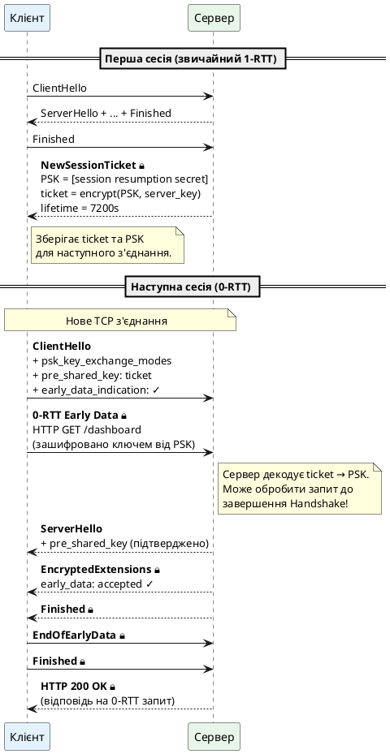

::

::caution
**0-RTT має фундаментальне обмеження: вразливість до Replay-атак.** Зловмисник може перехопити пакет із 0-RTT Early Data та надіслати його повторно. Для ідемпотентних операцій (GET-запити) це прийнятно. Для операцій зі станом (POST, платежі) — небезпечно без додаткових заходів на рівні застосунку (nonce, timestamp). IETF вказує у RFC 8446: «0-RTT data is not forward secret, and there are no guarantees of non-replay between connections».
::

---

### Session Resumption у TLS 1.2: Session ID та Session Ticket

До появи 0-RTT у TLS 1.3, TLS 1.2 мав два механізми відновлення сесії, що дозволяли уникнути повного Handshake.

**Session ID:** Сервер зберігає стан сесії (Master Secret та параметри) у внутрішньому кеші та надає клієнту короткий `Session ID`. При повторному підключенні клієнт надсилає `Session ID` у `ClientHello`. Якщо сервер знаходить відповідний запис у кеші — Handshake скорочується до 1-RTT.

```
Session Resumption через Session ID (TLS 1.2, 1-RTT):

ClientHello (Session ID: abc123) ─►
                                  ◄─ ServerHello (Session ID: abc123)
                                  ◄─ ChangeCipherSpec
                                  ◄─ Finished
ChangeCipherSpec ─►
Finished ─►
HTTP GET ─►
```

**Проблема Session ID:** Сервер повинен зберігати стан кожної сесії. При мільйонах клієнтів — це величезне навантаження на пам'ять. І якщо клієнт підключиться до іншого сервера у кластері — Session ID буде невідомим.

**Session Ticket (RFC 5077):** Сервер шифрує стан сесії та відправляє його клієнту у вигляді непрозорого `Session Ticket`. При відновленні клієнт повертає ticket, сервер розшифровує його власним ключем і відновлює стан. Сервер не зберігає нічого — стан на стороні клієнта.

::note
Session Ticket у TLS 1.2 є попередником PSK у TLS 1.3. Але між ними є важлива різниця: у TLS 1.2 відновлена сесія **успадковує Master Secret** від початкової сесії. Якщо початкова сесія використовувала RSA Key Exchange (без Forward Secrecy), то всі відновлені сесії теж не мають PFS. У TLS 1.3 кожна відновлена сесія (0-RTT або 1-RTT з PSK) завжди виконує ECDHE, що гарантує PFS.
::

---

### Взаємна автентифікація (mTLS): клієнт теж доводить ідентичність

У стандартному TLS лише **сервер** автентифікується (надає сертифікат). Клієнт залишається анонімним з точки зору TLS (хоча може автентифікуватись пізніше через HTTP, OAuth тощо).

У **mTLS (mutual TLS)** обидві сторони надають сертифікати:

::plant-uml

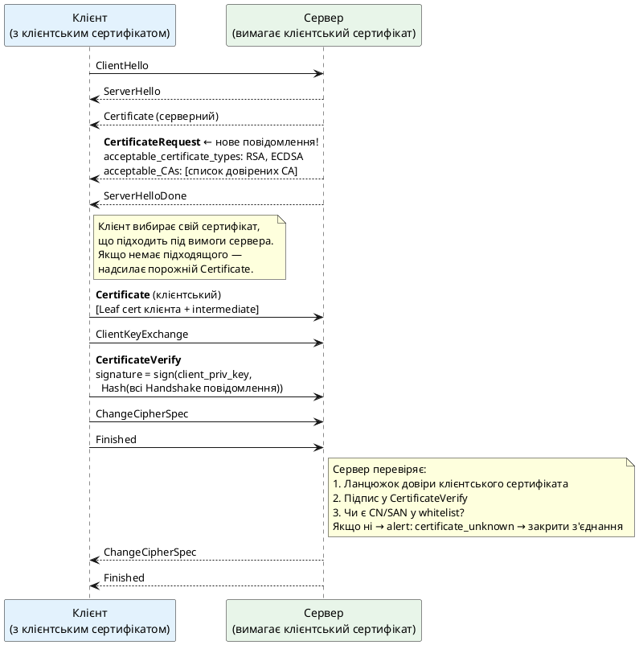

::

mTLS широко використовується у:

- **Service Mesh** (Istio, Linkerd) — автентифікація між мікросервісами
- **Zero Trust архітектурах** — кожен клієнт має свій сертифікат, IP-адреса не є достатнім доказом ідентичності
- **API Gateway** — клієнти (партнери, мобільні застосунки) підключаються з клієнтськими сертифікатами замість API-ключів
- **IoT пристрої** — кожен пристрій має унікальний сертифікат, що дозволяє точно ідентифікувати його

```csharp
// mTLS клієнт у .NET
var cert = X509Certificate2.CreateFromPemFile("client.crt", "client.key");

var handler = new HttpClientHandler();
handler.ClientCertificates.Add(cert);
// При підключенні клієнт автоматично надає сертифікат,
// якщо сервер надіслав CertificateRequest

var client = new HttpClient(handler);
var response = await client.GetAsync("https://api.internal/data");
```

---

### Wireshark: Handshake наочно

Найкращий спосіб закріпити розуміння Handshake — переглянути реальний трафік. Wireshark дозволяє бачити кожне повідомлення TLS:

```bash
# Захопити TLS трафік до github.com (фільтр у Wireshark)
tls.handshake and ip.addr == 140.82.121.3

# Або через tshark (CLI Wireshark):
tshark -i en0 \
  -f "host github.com and port 443" \
  -Y "tls.handshake" \
  -V 2>/dev/null | grep -A3 "Handshake Protocol"
```

```
Frame 4: TLSv1.3 Record Layer: Handshake Protocol: Client Hello
    Content Type: Handshake (22)
    Version: TLS 1.0 (0x0301)  ← legacy compatibility!
    Handshake Protocol: Client Hello
        Version: TLS 1.2 (0x0303)
        Random: 4a3f2b8c...
        Extensions Length: 508
        Extension: server_name (len=16)
            Server Name: github.com
        Extension: supported_versions (len=7)
            Supported Version: TLS 1.3 (0x0304)  ← справжня версія
        Extension: key_share (len=71)
            Key Share Entry: Group: x25519, Key Exchange length: 32

Frame 6: TLSv1.3 Record Layer: Handshake Protocol: Server Hello
    Handshake Protocol: Server Hello
        Version: TLS 1.2 (0x0303)  ← legacy compatibility!
        Extension: supported_versions
            Supported Version: TLS 1.3 (0x0304)  ← обрано TLS 1.3
        Extension: key_share
            Key Share Entry: Group: x25519, Key Exchange length: 32

Frame 7: TLSv1.3 Record Layer: Handshake Protocol: (Encrypted)
    Content Type: Application Data (23)  ← шифрований HS!
    [Decrypted TLS: Certificate, CertificateVerify, Finished]
```

::tip
Зверніть увагу на legacy compatibility: `ClientHello` вказує `Version: TLS 1.0 (0x0301)` у Record Header та `Version: TLS 1.2 (0x0303)` у тілі, а справжня версія `TLS 1.3 (0x0304)` передається через `supported_versions` extension. Це навмисний дизайн для обходу middlebox-ів (проміжних пристроїв), що помилково відхиляли невідомі версії TLS. Аналогічно, `ServerHello` у TLS 1.3 виглядає як звичайний TLS 1.2 ServerHello для несумісних middlebox-ів.
::

---

Третя частина охоплює TLS Handshake — від класичного 2-RTT у TLS 1.2 до оптимізованого 1-RTT та 0-RTT у TLS 1.3, мTLS та механізми відновлення сесій. Далі — TLS Record Layer та каталог реальних атак.

---

## TLS Record Layer: як дані шифруються після Handshake

### Концептуальна модель: TLS як обгортка

Після завершення Handshake TLS стає **прозорою трубою** для даних застосунку. HTTP, SMTP, WebSocket — будь-який протокол прикладного рівня передає свої байти через TLS, не знаючи нічого про деталі шифрування. Це архітектурна елегантність: TLS реалізує безпеку на транспортному рівні, не вимагаючи від застосунку жодних змін.

Але «прозора труба» — це спрощення. Насправді TLS не просто шифрує потік байтів: він розбиває його на **записи (records)** і обробляє кожен запис окремо.

```
Місце TLS Record Layer у стеку:

┌─────────────────────────────────┐
│   Застосунок (HTTP, SMTP...)    │  "GET /index.html HTTP/1.1\r\n..."
└─────────────────┬───────────────┘
                  │ передає байти
┌─────────────────▼───────────────┐
│      TLS Record Protocol        │  розбиває → шифрує → передає
│  ┌──────────┐  ┌──────────────┐ │
│  │Handshake │  │Alert Protocol│ │  (субпротоколи TLS)
│  └──────────┘  └──────────────┘ │
└─────────────────┬───────────────┘
                  │ TLS Records (бінарний потік)
┌─────────────────▼───────────────┐
│         TCP (потік байтів)      │
└─────────────────────────────────┘
```

TLS Record Protocol є **мультиплексором**: він обслуговує кілька субпротоколів одночасно, використовуючи поле `Content Type` для розрізнення:

| Content Type         | Значення | Призначення                                     |
| -------------------- | -------- | ----------------------------------------------- |
| `change_cipher_spec` | 20       | Сигнал переходу на нові ключі (legacy, TLS 1.2) |
| `alert`              | 21       | Повідомлення про помилки та закриття            |
| `handshake`          | 22       | Повідомлення Handshake-протоколу                |
| `application_data`   | 23       | Дані застосунку (HTTP, тощо)                    |

---

### Структура TLS Record

Кожен TLS Record — це самодостатній блок із заголовком та payload:

```
TLS Record (5-байтовий заголовок + payload):

┌──────────────────────────────────────────────┐
│ Content Type    │  1 байт  │ 0x17 = app data  │
│ Legacy Version  │  2 байти │ 0x03 0x03         │
│ Length          │  2 байти │ до 16384 байт     │
├──────────────────────────────────────────────┤
│                                              │
│  Encrypted Payload                           │
│  (Ciphertext + Authentication Tag)           │
│                                              │
└──────────────────────────────────────────────┘

Максимальний розмір plaintext payload: 2^14 = 16 384 байти
(з розширенням max_fragment_length: до 2^16 − 1)
```

Розглянемо реальний TLS 1.3 Record із зашифрованими даними застосунку у hex:

```
17 03 03 00 45  ← заголовок (Content Type: 23, Version: TLS 1.2 legacy, Length: 69)

Encrypted payload (69 байт):
  a3 f2 b1 4c 8e 2d 71 09 ...  ← Ciphertext (AES-GCM)
  ...
  6f 2a 11 bc 9e 44 d3 7c      ← Authentication Tag (16 байт, GCM)
                                   (Полі1305: теж 16 байт)

Примітка: у TLS 1.3 Content Type у заголовку завжди 0x17
(application_data), навіть для Handshake повідомлень після
ServerHello. Справжній тип зашифровано всередині payload.
```

---

### AES-GCM шифрування запису: покроково

Для конкретності розглянемо, як шифрується TLS Record із AES-256-GCM — найпоширенішим шифром у сучасному TLS.

**GCM (Galois/Counter Mode)** — режим AEAD (Authenticated Encryption with Associated Data). «Authenticated» означає: шифрування та автентифікація виконуються одночасно, одним алгоритмом. Це принципово важливо: автентифікація **охоплює і заголовок запису** (Associated Data), що запобігає атакам на метадані.

```
Шифрування одного TLS Record (AES-256-GCM):

Входи:
  key        = client_write_key      (32 байти, AES-256)
  nonce      = client_write_IV XOR sequence_number
               ← sequence_number інкрементується для кожного record!
               ← 0, 1, 2, 3... (захист від replay в межах сесії)
  plaintext  = дані застосунку + TLS inner content type (1 байт)
  aad        = Record Header (Content Type + Version + Length)
               ← автентифікується, але НЕ шифрується

Алгоритм:
  1. CTR режим: ciphertext = plaintext XOR AES-CTR(key, nonce)
  2. GHASH: authentication_tag = GHASH(aad || ciphertext)
     (128-бітний поліноміальний MAC над полем GF(2^128))

Вихід:
  TLS Record = Header || Ciphertext || Authentication Tag (16 байт)
```

```
Чому nonce = IV XOR sequence_number?

Проблема: AES-GCM ВИМАГАЄ унікального nonce для кожного
шифрування з одним ключем. Якщо nonce повторюється —
повна катастрофа: зловмисник може відновити ключ.

Рішення у TLS 1.3:
  implicit_nonce (12 байт) = client_write_IV XOR record_seq_num

  sequence_number = 0: nonce = IV XOR 0x000000000000000000000000
  sequence_number = 1: nonce = IV XOR 0x000000000000000000000001
  sequence_number = 2: nonce = IV XOR 0x000000000000000000000002
  ...

Кожен запис — унікальний nonce. Гарантовано, бо
sequence_number ніколи не повторюється в рамках сесії.
```

::note
Послідовний nonce також забезпечує **захист від replay-атак** в межах однієї TLS-сесії: якщо зловмисник перехопить і повторно надішле Record #42, отримувач відхилить його, бо sequence_number вже пройшов це значення.
::

---

### TLS Alert Protocol: мова помилок

TLS Alert Protocol — механізм сигналізації про помилки та стани з'єднання. Кожен Alert — це двобайтовий TLS Record (Content Type: 21):

```
Alert Record:
  Level       (1 байт): warning (1) або fatal (2)
  Description (1 байт): код помилки

Приклади:
  02 00  → fatal: close_notify       — коректне закриття з'єднання
  02 02  → fatal: unexpected_message — неочікуване повідомлення
  02 14  → fatal: bad_record_mac     — невалідний MAC (некоректний ключ?)
  02 28  → fatal: handshake_failure  — не вдалось узгодити параметри
  02 2a  → fatal: bad_certificate    — проблема з сертифікатом
  02 2c  → fatal: certificate_revoked
  02 2f  → fatal: certificate_expired
  02 30  → fatal: unknown_ca         — невідомий кореневий CA
  02 46  → fatal: inappropriate_fallback — SCSV downgrade detection
  02 70  → fatal: no_application_protocol — ALPN не узгоджено
  01 00  → warning: close_notify     — graceful close (TLS 1.3: завжди fatal!)
```

::caution
У TLS 1.3 **всі** Alerts є `fatal` — сесія завжди закривається після Alert. Рівень `warning` збережено лише для `close_notify` для зворотної сумісності, але фактично після нього теж закривається з'єднання. Це усунуло цілий клас атак, що використовували `warning` alerts для маніпуляцій зі станом з'єднання.
::

---

### Key Update: ротація ключів без перезапуску

TLS 1.3 вводить механізм **Key Update** — оновлення ключів шифрування без нового Handshake. Це важливо для довготривалих з'єднань:

```
Проблема: чому треба оновлювати ключі?

AES-GCM має обмеження: при одному ключі безпечно
зашифрувати не більше ~2^32 записів (≈4 мільярди).
Після цього ймовірність nonce-колізії стає неприйнятною.

Для HTTPS-сесій це теоретична проблема.
Але для довгострокових gRPC-стрімів, VPN-тунелів
або файлових передач — цілком реальна.
```

```
Key Update handshake (TLS 1.3):

Клієнт                                        Сервер
   │                                             │
   │ KeyUpdate (update_requested: true) 🔒 ─────►│
   │   ← просить сервер теж оновити ключ        │
   │                                             │
   │          нові ключі (HKDF-Expand від       │
   │          поточного application_secret)     │
   │                                             │
   │◄────────────────── KeyUpdate (not_requested)│
   │                                             │
   │   Обидві сторони переходять на нові ключі. │
   │   Старі ключі знищуються.                  │
```

---

## Реальні атаки на TLS: від теорії до практики

Найкращий спосіб зрозуміти, чому TLS 1.3 виглядає саме так — вивчити атаки, що зламали попередні версії. Кожна вразливість нижче стала уроком, що знайшов відображення у дизайні TLS 1.3.

::plant-uml

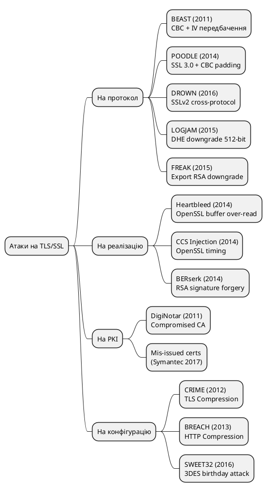

::

---

### BEAST (2011): коли IV стає передбачуваним

**Browser Exploit Against SSL/TLS** — атака Дуонга (Thai Duong) та Різо (Juliano Rizzo), представлена на ekoparty 2011.

**Вразливий компонент:** TLS 1.0 + AES-CBC.

**Суть проблеми:** У TLS 1.0 IV для кожного наступного запису **не є випадковим** — ним є останній блок шифртексту попереднього запису. Це відоме як «IV chaining» або «implicit IV».

```
TLS 1.0 CBC IV Chaining (вразливість):

Запис N:
  IV_N = останній блок ciphertext(N-1)  ← передбачуваний!
  Ciphertext_block_1 = AES(key, IV_N XOR plaintext_block_1)

Атака (спрощено):
  Зловмисник знає IV для наступного запису (він відкритий у мережі).
  Зловмисник може вибирати, які дані клієнт відправляє.
  (Наприклад, через JavaScript у браузері)

  Вгадка G такого, що: AES(key, IV XOR G) == ciphertext_block_1?
  → Підбір побайтово через browser oracle.
  → Атака відновлює cookie/session token.
```

::plant-uml

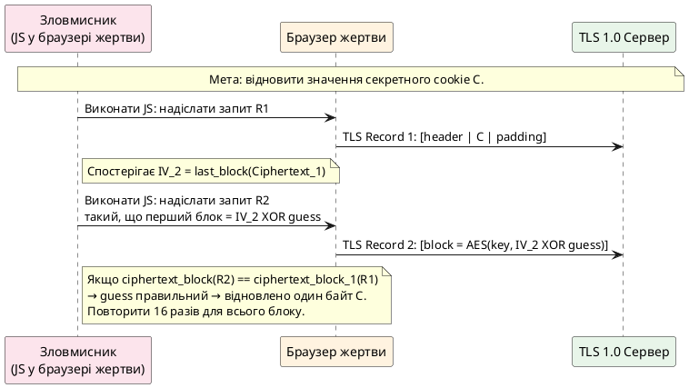

::

**Виправлення в TLS 1.1/1.2:** Явний випадковий IV для кожного запису. **Виправлення в TLS 1.3:** CBC повністю видалено.

---

### POODLE (2014): оракул заповнення на старому протоколі

**Padding Oracle On Downgraded Legacy Encryption** — атака Меллера (Bodo Möller), Дуонга та Козловського з Google Security Team.

**Вразлива конфігурація:** SSL 3.0 підтримується як fallback.

**Суть:** SSL 3.0 використовує CBC з padding, де останній байт padding вказує на довжину, але решта байтів padding **не перевіряється**. Це padding oracle: сервер мимоволі повідомляє, чи правильний padding, через різні response коди (успіх vs MAC error).

```
SSL 3.0 CBC Padding (вразлива схема):

Block = [data...][pad_bytes...][pad_length_byte]

Перевірка: лише останній байт == кількість padding байтів.
Інші padding байти можуть бути будь-якими.

Оракул: якщо сервер повертає "MAC error" — padding OK.
         якщо "decryption error" — padding не OK.
         (або вимірювання часу відповіді)

Атака: маніпулюючи зашифрованим блоком та використовуючи
оракул, зловмисник може відновити plaintext побайтово.
1 байт = 256 спроб у середньому.
Для 16-байтового блоку = ~4096 HTTPS запитів.
```

**Ключова умова:** зловмисник може **змусити клієнт перемкнутись на SSL 3.0** через downgrade fallback. Якщо TLS-з'єднання «не вдається» (підроблений мережевий збій), браузер пробує SSL 3.0.

**Виправлення:** вимкнути SSL 3.0 повністю. TLS Fallback SCSV (RFC 7507) — клієнт вставляє спеціальний псевдо-cipher-suite `TLS_FALLBACK_SCSV` у ClientHello при downgrade, сервер відхиляє підключення якщо версія нижча за підтримувану.

```
TLS_FALLBACK_SCSV (захист від downgrade):

Клієнт підтримує TLS 1.2, але через помилку намагається TLS 1.1:
  ClientHello:
    Version: TLS 1.1
    CipherSuites: [..., TLS_FALLBACK_SCSV (0x56,0x00)]

Сервер підтримує TLS 1.2:
  Бачить SCSV + TLS 1.1 < TLS 1.2 → fatal alert: inappropriate_fallback
  Зловмисник не може штучно понизити версію протоколу.
```

---

### Heartbleed (CVE-2014-0160): кров з серця OpenSSL

Heartbleed — не атака на протокол TLS, а **вразливість реалізації** у бібліотеці OpenSSL. Але вона стала однією з найруйнівніших вразливостей в історії інтернету: понад 500 000 серверів були вразливі на момент публікації (квітень 2014).

**Компонент:** TLS Heartbeat Extension (RFC 6520) — механізм keepalive для перевірки живучості з'єднання.

**Принцип роботи Heartbeat (нормальний):**

```
Клієнт → Сервер: HeartbeatRequest
  type:    request (1)
  length:  5
  payload: "HELLO"  (5 байт)

Сервер → Клієнт: HeartbeatResponse
  type:    response (2)
  length:  5
  payload: "HELLO"  (скопійовано з запиту)
```

**Вразливість (Heartbleed):**

```c
/* Вразливий код OpenSSL (спрощено): */
void tls1_process_heartbeat(SSL *s) {
    unsigned char *p = &s->s3->rrec.data[0], *pl;
    unsigned short hbtype;
    unsigned int payload;

    hbtype = *p++;             /* тип: request/response */
    n2s(p, payload);           /* довжина payload з пакету */
    pl = p;                    /* вказівник на payload */

    /* ПОМИЛКА: не перевіряється, чи payload <= реальний розмір даних! */

    unsigned char *buffer = OPENSSL_malloc(1 + 2 + payload + padding);
    memcpy(bp, pl, payload);   /* копіюємо payload байт з пам'яті */
    /* Якщо payload=65535, але реальних даних 5 — читаємо 65530 зайвих байт! */
}
```

**Атака:**

```
Зловмисник → Сервер: HeartbeatRequest
  type:    request
  length:  65535   ← заявлена довжина
  payload: "HELLO" ← лише 5 байт реальних даних

Сервер → Зловмисник: HeartbeatResponse
  payload: "HELLO" + [65530 байт з heap-пам'яті сервера]
                         ↑
             Тут можуть бути:
             - приватні ключі TLS
             - паролі користувачів
             - session tokens
             - інші секрети з пам'яті
```

::plant-uml

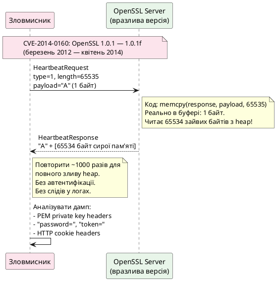

::

**Масштаб катастрофи:** Атака не залишала слідів у логах. Не вимагала автентифікації. Виконувалась через легітимне TLS-з'єднання. Могла витягувати 64 КБ пам'яті за запит, необмежену кількість разів.

**Виправлення:** OpenSSL 1.0.1g (7 квітня 2014) — додано перевірку: `if (1 + 2 + payload + padding > s->s3->rrec.num_data) return 0;`

::warning
Heartbleed показав: навіть бездоганний криптографічний дизайн TLS не захищає від вразливостей реалізації. **Безпека TLS-системи — це ланцюг**: криптографія + реалізація (OpenSSL, BoringSSL, SChannel) + конфігурація + операційна система.
::

---

### CRIME та BREACH: стиснення як оракул

**CRIME (Compression Ratio Info-leak Made Easy, 2012)** — атака на **TLS-стиснення** (`DEFLATE` як TLS extension).

**Принцип:** Алгоритми стиснення (LZ77) замінюють повторювані рядки посиланнями. Якщо payload містить рядок, що вже зустрічався — розмір зашифрованого запису стає **меншим**. Зловмисник може спостерігати розмір записів навіть без розшифрування.

```
CRIME — атака через розмір:

Секрет у cookie: "sessionid=abc123secret"

Спроба 1: Зловмисник змушує браузер надіслати:
  ?q=sessionid=a  → cookie + query мають спільний "sessionid=a"
  Compressed size: МАЛИЙ  ← стиснення спрацювало!

Спроба 2:
  ?q=sessionid=b  → no match
  Compressed size: БІЛЬШИЙ

→ "a" правильний! Побайтово відновлюємо весь sessionid.
```

**Виправлення:** Заборонити TLS-стиснення. У TLS 1.3 стиснення на рівні Record Layer **видалено повністю**.

**BREACH (2013)** — аналогічна атака, але на **HTTP-стиснення** (gzip у HTTP response body). Оскільки HTTP-стиснення не є частиною TLS — виправити на рівні TLS неможливо. Заходи: рандомізація padding у HTTP відповідях, відключення Gzip для відповідей із секретами.

---

### SWEET32 (2016): day birthday у 3DES

**Атака:** Блонто (Karthikeyan Bhargavan) та Лейні (Gaëtan Leurent) з INRIA.

**Проблема:** 3DES використовує **64-бітний розмір блоку**. За парадоксом днів народження, при шифруванні $2^{32}$ блоків (~32 ГБ) виникає приблизно 50% ймовірність **колізії двох блоків шифртексту**. Якщо два блоки шифртексту однакові — зловмисник знає, що відповідні блоки plaintext теж однакові (XOR з однаковим keystream).

```
Birthday bound для 64-бітного блоку:

Кількість блоків для колізії з ймовірністю 50%:
  N = 2^(n/2) = 2^32 ≈ 4 мільярди блоків × 8 байт = 32 ГБ

Сучасне HTTPS з'єднання передає 32 ГБ?
  HTTP keep-alive + TLS session reuse → так, за кілька годин!
  Особливо актуально для bulk-transfer або streaming.

3DES у TLS → TLS_RSA_WITH_3DES_EDE_CBC_SHA (найпоширеніший)
```

**Виправлення:** Заборонити 3DES у TLS. Рекомендація: обмежити тривалість сесії або кількість записів при використанні будь-якого шифру зі слабким birthday bound.

---

### LOGJAM та FREAK: атаки зниження до export-grade

**FREAK (2015):** Федеральний уряд США у 1990-х вимагав, щоб американські продукти на експорт підтримували ослаблену **export-grade** криптографію (RSA 512 біт, замість 2048). Ця вимога зникла у 2000 р., але export cipher suites залишились у коді багатьох реалізацій.

**LOGJAM (2015):** Аналогічна атака, але на **DHE export** (512-бітний DH). Зловмисник типу MitM може «переконати» клієнт перемкнутись на 512-бітний DHE, який легко зламати за ~7 хвилин на звичайному ноутбуці.

```
Логіка downgrade атаки (спрощено):

  Клієнт (підтримує TLS 1.2 + DHE 2048):
    ClientHello: [..., TLS_DHE_RSA_EXPORT_WITH_DES40_CBC_SHA, ...]

  Зловмисник між клієнтом і сервером:
    Підмінює ClientHello, залишаючи лише export suites.

  Сервер (підтримує export для legacy):
    ServerHello: TLS_DHE_RSA_EXPORT_WITH_DES40_CBC_SHA ✓
    DHE: 512-бітні параметри

  Зловмисник: зламує 512-бітний DH за хвилини.
  Розшифровує і підмінює трафік.
```

**Виправлення:** Вилучити всі EXPORT та NULL cipher suites. TLS 1.3 видалив їх повністю.

---

### Порівняльна таблиця атак

| Атака      | Рік  | Вразлива конфігурація | Що компрометується | Виправлення в TLS 1.3        |
| ---------- | ---- | --------------------- | ------------------ | ---------------------------- |
| BEAST      | 2011 | TLS 1.0 + CBC         | Session cookies    | CBC видалено                 |
| CRIME      | 2012 | TLS Compression       | Session tokens     | Стиснення видалено           |
| BREACH     | 2013 | HTTP Compression      | Secrets in body    | Не в TLS (застосунок)        |
| Heartbleed | 2014 | OpenSSL реалізація    | Приватні ключі     | Не в TLS (патч OpenSSL)      |
| POODLE     | 2014 | SSL 3.0 fallback      | Session cookies    | SSL 3.0/downgrade заборонено |
| FREAK      | 2015 | Export RSA 512-bit    | Session ключі      | Export видалено              |
| LOGJAM     | 2015 | Export DHE 512-bit    | Session ключі      | DHE < 1024 заборонено        |
| DROWN      | 2016 | SSLv2 на тому ж ключі | RSA decrypt        | SSLv2 заборонено             |
| SWEET32    | 2016 | 3DES                  | Блоки plaintext    | 3DES видалено                |

::tip
Спільна риса більшості атак — **downgrade**: зловмисник змушує сторони використовувати застарілий, слабший протокол або алгоритм. TLS 1.3 вирішує це радикально: просто **видаляє** всі застарілі опції. Неможливо бути атакованим через алгоритм, якого немає.
::

---

Четверта частина охоплює TLS Record Layer та реальні атаки — від BEAST до Heartbleed. Далі — практика: TLS у .NET.

---

## TLS у .NET: від SslStream до Kestrel

### Архітектура TLS у .NET

.NET надає TLS на кількох рівнях абстракції. Розуміння ієрархії допомагає обрати правильний інструмент для конкретної задачі:

```
Рівні TLS-абстракції у .NET:

┌─────────────────────────────────────────────┐
│  HttpClient / IHttpClientFactory            │  ← найвищий рівень
│  (HTTPS автоматично через HttpClientHandler)│
├─────────────────────────────────────────────┤
│  ASP.NET Core Kestrel                        │  ← для серверів
│  (ssl_protocols, ssl_ciphers, cert config)  │
├─────────────────────────────────────────────┤
│  SslStream                                  │  ← прямий доступ до TLS
│  (поверх будь-якого Stream: TCP, Pipe...)   │
├─────────────────────────────────────────────┤
│  System.Security.Cryptography.X509Certs     │  ← сертифікати
│  System.Net.Security.SslClientAuthOptions   │  ← налаштування
├─────────────────────────────────────────────┤
│  SChannel (Windows) / OpenSSL (Linux/macOS) │  ← нативний TLS-стек ОС
└─────────────────────────────────────────────┘
```

.NET не реалізує TLS самостійно — він делегує до **нативного TLS-стеку ОС**:

- **Windows:** SChannel (Security Support Provider Interface)
- **Linux:** OpenSSL (через `libssl`)
- **macOS:** Secure Transport (Apple) або OpenSSL

Це означає: оновлення безпеки TLS (нові Cipher Suites, виправлення вразливостей) надходять через оновлення ОС, а не через оновлення .NET.

---

### SslStream: найнижчий рівень API

`System.Net.Security.SslStream` — прямий wrapper над нативним TLS. Він обгортає будь-який `Stream` (зазвичай `NetworkStream` від `TcpClient`) і додає шифрування. Використовується коли потрібен повний контроль: нестандартні протоколи, custom certificate validation, raw TLS поверх TCP.

#### TLS-клієнт на SslStream

```csharp
using System.Net.Security;
using System.Net.Sockets;
using System.Security.Cryptography.X509Certificates;
using System.Security.Authentication;
using System.Text;

// Підключення до HTTPS сервера вручну через SslStream
var tcpClient = new TcpClient();
await tcpClient.ConnectAsync("github.com", 443);

// Обгортаємо NetworkStream у SslStream
// leaveInnerStreamOpen: false — закрити TcpClient разом із SslStream
var sslStream = new SslStream(
    innerStream: tcpClient.GetStream(),
    leaveInnerStreamOpen: false,
    userCertificateValidationCallback: ValidateServerCertificate);

// Виконати TLS Handshake (клієнтська сторона)
var clientOptions = new SslClientAuthenticationOptions
{
    TargetHost = "github.com",          // SNI + перевірка CN/SAN
    EnabledSslProtocols = SslProtocols.Tls12 | SslProtocols.Tls13,
    CertificateRevocationCheckMode = X509RevocationMode.Online,
    // ClientCertificates — для mTLS (необов'язково)
};

await sslStream.AuthenticateAsClientAsync(clientOptions);

Console.WriteLine($"Protocol:    {sslStream.SslProtocol}");
Console.WriteLine($"Cipher:      {sslStream.NegotiatedCipherSuite}");
Console.WriteLine($"KeyExchange: {sslStream.KeyExchangeAlgorithm}");
Console.WriteLine($"Cert:        {sslStream.RemoteCertificate?.Subject}");

// Тепер SslStream — звичайний Stream для читання/запису
// Всі дані автоматично шифруються/дешифруються
var request = "GET / HTTP/1.1\r\nHost: github.com\r\nConnection: close\r\n\r\n";
await sslStream.WriteAsync(Encoding.ASCII.GetBytes(request));

using var reader = new StreamReader(sslStream);
var firstLine = await reader.ReadLineAsync();
Console.WriteLine($"Response: {firstLine}");  // HTTP/1.1 200 OK

// Коректне закриття TLS-з'єднання (відправляє close_notify alert)
await sslStream.ShutdownAsync();

// Валідатор сертифіката (можна повністю замінити стандартну поведінку)
static bool ValidateServerCertificate(
    object sender,
    X509Certificate? certificate,
    X509Chain? chain,
    SslPolicyErrors sslPolicyErrors)
{
    // У продакшені: повертати sslPolicyErrors == SslPolicyErrors.None
    // Тут — логування для навчального прикладу

    if (sslPolicyErrors != SslPolicyErrors.None)
    {
        Console.Error.WriteLine($"TLS Error: {sslPolicyErrors}");
        // RemoteCertificateChainErrors — детальні помилки ланцюжка
        if (chain != null)
        {
            foreach (var status in chain.ChainStatus)
                Console.Error.WriteLine($"  Chain: {status.StatusInformation}");
        }
        return false;  // відхилити з'єднання
    }
    return true;
}
```

#### TLS-сервер на SslStream

```csharp
using System.Net;
using System.Net.Security;
using System.Net.Sockets;
using System.Security.Authentication;
using System.Security.Cryptography.X509Certificates;

// Завантажити сертифікат сервера з PEM файлів
// (або з Windows Certificate Store: X509Store)
var serverCert = X509Certificate2.CreateFromPemFile(
    certPemFilePath: "server.crt",
    keyPemFilePath:  "server.key");

var listener = new TcpListener(IPAddress.Any, 8443);
listener.Start();
Console.WriteLine("TLS сервер слухає на :8443");

while (true)
{
    var tcpClient = await listener.AcceptTcpClientAsync();

    // Обробляємо кожне з'єднання в окремій Task
    _ = Task.Run(() => HandleClientAsync(tcpClient, serverCert));
}

async Task HandleClientAsync(TcpClient client, X509Certificate2 cert)
{
    await using var sslStream = new SslStream(
        client.GetStream(),
        leaveInnerStreamOpen: false);

    try
    {
        // TLS Handshake — серверна сторона
        var serverOptions = new SslServerAuthenticationOptions
        {
            ServerCertificate = cert,
            EnabledSslProtocols = SslProtocols.Tls12 | SslProtocols.Tls13,
            ClientCertificateRequired = false,    // true для mTLS
            CertificateRevocationCheckMode = X509RevocationMode.NoCheck,
            // AllowRenegotiation = false — вимкнути renegotiation (безпечніше)
        };

        await sslStream.AuthenticateAsServerAsync(serverOptions);

        Console.WriteLine($"[{client.Client.RemoteEndPoint}] "
            + $"TLS {sslStream.SslProtocol}, {sslStream.NegotiatedCipherSuite}");

        // Читати HTTP запит
        using var reader = new StreamReader(sslStream, leaveOpen: true);
        var requestLine = await reader.ReadLineAsync();
        Console.WriteLine($"Request: {requestLine}");

        // Відповісти HTTP/1.1
        var response =
            "HTTP/1.1 200 OK\r\n" +
            "Content-Type: text/plain\r\n" +
            "Content-Length: 13\r\n" +
            "Connection: close\r\n\r\n" +
            "Hello, TLS!\r\n";

        await sslStream.WriteAsync(Encoding.UTF8.GetBytes(response));
        await sslStream.ShutdownAsync();
    }
    catch (AuthenticationException ex)
    {
        // Handshake провалився (невалідний сертифікат, версія, тощо)
        Console.Error.WriteLine($"TLS Handshake failed: {ex.Message}");
    }
}
```

---

### HttpClient та HTTPS: найпоширеніший сценарій

Для більшості застосунків прямий `SslStream` надлишковий — достатньо `HttpClient`. Він автоматично виконує TLS Handshake, перевіряє сертифікати та керує пулом з'єднань.

#### Базове використання

```csharp
// HttpClient автоматично використовує HTTPS для https:// URL
// TLS налаштовується через HttpClientHandler (або SocketsHttpHandler)
using var httpClient = new HttpClient();
var response = await httpClient.GetStringAsync("https://api.github.com/");
```

#### Тонке налаштування TLS через SocketsHttpHandler

```csharp
var handler = new SocketsHttpHandler
{
    // Пул з'єднань — одне TLS-з'єднання перевикористовується
    // для багатьох HTTP-запитів (HTTP/1.1 Keep-Alive, HTTP/2)
    PooledConnectionLifetime = TimeSpan.FromMinutes(5),
    PooledConnectionIdleTimeout = TimeSpan.FromMinutes(1),

    SslOptions = new SslClientAuthenticationOptions
    {
        // Дозволити лише сучасні версії TLS
        EnabledSslProtocols = SslProtocols.Tls12 | SslProtocols.Tls13,

        // Власна логіка валідації сертифіката
        RemoteCertificateValidationCallback = (sender, cert, chain, errors) =>
        {
            // Приклад: ігнорувати помилки у dev-середовищі
            if (Environment.GetEnvironmentVariable("ASPNETCORE_ENVIRONMENT")
                == "Development")
            {
                return true;  // НЕБЕЗПЕЧНО У ПРОДАКШЕНІ!
            }
            return errors == SslPolicyErrors.None;
        },

        // Для mTLS: клієнтський сертифікат
        ClientCertificates = new X509CertificateCollection
        {
            X509Certificate2.CreateFromPemFile("client.crt", "client.key")
        },
    }
};

using var httpClient = new HttpClient(handler);
```

#### IHttpClientFactory: правильна реєстрація у DI

```csharp
// Program.cs / DI реєстрація
builder.Services.AddHttpClient("SecureApi", client =>
{
    client.BaseAddress = new Uri("https://api.example.com/");
    client.DefaultRequestHeaders.Add("Accept", "application/json");
})
.ConfigurePrimaryHttpMessageHandler(() => new SocketsHttpHandler
{
    PooledConnectionLifetime = TimeSpan.FromMinutes(5),
    SslOptions = new SslClientAuthenticationOptions
    {
        EnabledSslProtocols = SslProtocols.Tls13,
    }
});

// Використання в сервісі
public class ApiService(IHttpClientFactory factory)
{
    public async Task<string> GetDataAsync()
    {
        // IHttpClientFactory керує пулом — не створює нові handler-и щоразу
        var client = factory.CreateClient("SecureApi");
        return await client.GetStringAsync("/data");
    }
}
```

::warning
Ніколи не створюйте `new HttpClient()` у кожному запиті — це виснажує порти (socket exhaustion). `IHttpClientFactory` або довгоживучий static `HttpClient` — правильні підходи. Крім того, `HttpClientHandler` не є thread-safe; `SocketsHttpHandler` — є.
::

---

### Kestrel: налаштування TLS для ASP.NET Core сервера

Kestrel — вбудований веб-сервер ASP.NET Core. Він підтримує HTTPS безпосередньо (або через reverse proxy як Nginx).

#### Базове налаштування через appsettings.json

```json
{
    "Kestrel": {
        "Endpoints": {
            "Http": {
                "Url": "http://localhost:5000"
            },
            "Https": {
                "Url": "https://localhost:5001",
                "Certificate": {
                    "Path": "certs/server.pfx",
                    "Password": "cert-password"
                }
            }
        }
    }
}
```

#### Програмне налаштування TLS (детальний контроль)

```csharp
// Program.cs
builder.WebHost.ConfigureKestrel(options =>
{
    // HTTP — лише для redirect на HTTPS (або для health checks)
    options.ListenAnyIP(5000);

    // HTTPS з повним контролем TLS
    options.ListenAnyIP(5001, listenOptions =>
    {
        listenOptions.UseHttps(httpsOptions =>
        {
            // Сертифікат: з файлу, зі сховища або через Let's Encrypt
            httpsOptions.ServerCertificate =
                X509Certificate2.CreateFromPemFile("server.crt", "server.key");

            // Дозволені версії TLS
            httpsOptions.SslProtocols = SslProtocols.Tls12 | SslProtocols.Tls13;

            // Cipher Suites (Windows: через CNG policy; Linux: через OpenSSL)
            // На Linux можна задати через DOTNET_SYSTEM_NET_SECURITY_*
            // env variables або через SslStreamCertificateContext

            // Для mTLS: вимагати клієнтський сертифікат
            httpsOptions.ClientCertificateMode =
                ClientCertificateMode.RequireCertificate;

            httpsOptions.ClientCertificateValidation =
                (cert, chain, errors) =>
                {
                    // Перевірити, що CN клієнтського сертифіката
                    // є у whitelist дозволених сервісів
                    return cert.Subject.Contains("CN=trusted-service");
                };
        });
    });
});
```

#### HTTP Strict Transport Security (HSTS)

**HSTS** (RFC 6797) — заголовок відповіді, що змушує браузер **завжди** використовувати HTTPS для цього домену протягом зазначеного часу, навіть якщо користувач введе `http://`:

```csharp
// Program.cs
var app = builder.Build();

// Redirect HTTP → HTTPS
app.UseHttpsRedirection();

// HSTS — лише у продакшені!
// У розробці HSTS може заблокувати localhost на HTTP
if (!app.Environment.IsDevelopment())
{
    app.UseHsts();
    // Відправляє: Strict-Transport-Security: max-age=31536000; includeSubDomains
}
```

```csharp
// Налаштування HSTS
builder.Services.AddHsts(options =>
{
    options.MaxAge = TimeSpan.FromDays(365);   // 1 рік
    options.IncludeSubDomains = true;           // і субдомени
    options.Preload = true;                     // для HSTS preload list
    // options.ExcludedHosts.Add("api.example.com"); // виключення
});
```

```
HSTS в дії:

Перший запит (HTTP):
  Client → http://example.com/
  Server ← 301 Moved Permanently → https://example.com/
           Strict-Transport-Security: max-age=31536000

Всі наступні запити (протягом 1 року):
  Браузер: бачить "http://example.com/" → автоматично змінює на HTTPS
  Жодного HTTP запиту не надсилається взагалі.
  MitM зловмисник не може перехопити initial HTTP запит.
```

::note
**HSTS Preload List** — браузери Chrome, Firefox, Safari мають вбудований список доменів, що завжди повинні завантажуватись через HTTPS. Навіть **перший** запит іде одразу по HTTPS. Домен можна додати через hstspreload.org (безповоротньо — видалення займає місяці).
::

---

### Генерація та управління сертифікатами у .NET

#### Самопідписаний сертифікат для розробки

```csharp
using System.Security.Cryptography;
using System.Security.Cryptography.X509Certificates;

// Генерація самопідписаного сертифіката для localhost
// (не для продакшену!)
static X509Certificate2 CreateSelfSignedCertificate(string subjectName)
{
    using var rsa = RSA.Create(keySizeInBits: 2048);

    var request = new CertificateRequest(
        subjectName: $"CN={subjectName}",
        key: rsa,
        hashAlgorithm: HashAlgorithmName.SHA256,
        RSASignaturePadding.Pkcs1);

    // Розширення
    request.CertificateExtensions.Add(
        new X509BasicConstraintsExtension(
            certificateAuthority: false,
            hasPathLengthConstraint: false,
            pathLengthConstraint: 0,
            critical: true));

    request.CertificateExtensions.Add(
        new X509KeyUsageExtension(
            X509KeyUsageFlags.DigitalSignature | X509KeyUsageFlags.KeyEncipherment,
            critical: true));

    request.CertificateExtensions.Add(
        new X509EnhancedKeyUsageExtension(
            new OidCollection { new Oid("1.3.6.1.5.5.7.3.1") }, // serverAuth
            critical: false));

    // Subject Alternative Names (SAN)
    var sanBuilder = new SubjectAlternativeNameBuilder();
    sanBuilder.AddDnsName("localhost");
    sanBuilder.AddDnsName(subjectName);
    sanBuilder.AddIpAddress(System.Net.IPAddress.Loopback);
    request.CertificateExtensions.Add(sanBuilder.Build());

    // Самопідписаний (без CA)
    var cert = request.CreateSelfSigned(
        notBefore: DateTimeOffset.UtcNow.AddMinutes(-5),
        notAfter:  DateTimeOffset.UtcNow.AddYears(1));

    // Повернути з приватним ключем (для сервера)
    return new X509Certificate2(
        cert.Export(X509ContentType.Pfx),
        password: (string?)null,
        X509KeyStorageFlags.Exportable);
}
```

#### dotnet dev-certs: стандарт для розробки

.NET SDK має вбудований інструмент для dev-сертифікатів:

```bash
# Створити та встановити dev-сертифікат (робить його довіреним в ОС)
dotnet dev-certs https --trust

# Експортувати у PEM для nginx/docker
dotnet dev-certs https --export-path ./certs/dev.pem --format Pem

# Перевірити статус
dotnet dev-certs https --check --trust

# Очистити та перестворити
dotnet dev-certs https --clean
dotnet dev-certs https --trust
```

#### Завантаження сертифікатів із різних джерел

```csharp
// З PEM файлів (Linux/macOS стандарт, Let's Encrypt)
var cert1 = X509Certificate2.CreateFromPemFile("cert.pem", "key.pem");

// З PFX/PKCS#12 файлу (Windows стандарт)
var cert2 = new X509Certificate2("cert.pfx", "password",
    X509KeyStorageFlags.MachineKeySet | X509KeyStorageFlags.PersistKeySet);

// З Windows Certificate Store
using var store = new X509Store(StoreName.My, StoreLocation.LocalMachine);
store.Open(OpenFlags.ReadOnly);
var certs = store.Certificates
    .Find(X509FindType.FindBySubjectName, "example.com", validOnly: true);
var cert3 = certs.Count > 0 ? certs[0] : throw new Exception("Cert not found");

// Із змінної середовища (Kubernetes Secrets, Docker Secrets)
var certBase64 = Environment.GetEnvironmentVariable("TLS_CERT_BASE64")!;
var keyBase64  = Environment.GetEnvironmentVariable("TLS_KEY_BASE64")!;
var certPem = Encoding.UTF8.GetString(Convert.FromBase64String(certBase64));
var keyPem  = Encoding.UTF8.GetString(Convert.FromBase64String(keyBase64));
var cert4 = X509Certificate2.CreateFromPem(certPem, keyPem);
```

---

### Перевірка TLS конфігурації сервера

Перед виходом у продакшен варто перевірити конфігурацію TLS інструментами:

#### OpenSSL s_client: ручна перевірка

```bash
# Базова перевірка TLS з'єднання
openssl s_client -connect example.com:443 -servername example.com

# Примусово тільки TLS 1.3
openssl s_client -connect example.com:443 -tls1_3

# Перевірити підтримку TLS 1.0 (має бути відхилено)
openssl s_client -connect example.com:443 -tls1   # має повернути помилку

# Перевірити OCSP Stapling
openssl s_client -connect example.com:443 -status 2>/dev/null | \
  grep -A10 "OCSP Response"

# Переглянути повний ланцюжок сертифікатів
openssl s_client -connect example.com:443 -showcerts 2>/dev/null | \
  openssl x509 -text -noout

# Виміряти час Handshake (TLS 1.3 vs TLS 1.2)
time openssl s_client -connect example.com:443 -tls1_3 < /dev/null
time openssl s_client -connect example.com:443 -tls1_2 < /dev/null
```

#### nmap: сканування Cipher Suites

```bash
# Перелік підтримуваних Cipher Suites
nmap --script ssl-enum-ciphers -p 443 example.com

# Приклад виводу:
# PORT    STATE SERVICE
# 443/tcp open  https
# | ssl-enum-ciphers:
# |   TLSv1.2:
# |     ciphers:
# |       TLS_ECDHE_RSA_WITH_AES_256_GCM_SHA384 (ecdh_x25519) - A
# |       TLS_ECDHE_RSA_WITH_AES_128_GCM_SHA256 (ecdh_x25519) - A
# |     compressors:
# |       NULL
# |   TLSv1.3:
# |     ciphers:
# |       TLS_AKE_WITH_AES_256_GCM_SHA384 - A
# |     cipher preference: server
# |_  least strength: A
```

#### SSL Labs API: автоматизована перевірка

```csharp
// Програмна перевірка через Qualys SSL Labs API
using var http = new HttpClient();

var endpoint = "https://api.ssllabs.com/api/v3/analyze";
var url = $"{endpoint}?host=example.com&publish=off&ignoreMismatch=off";

var result = await http.GetFromJsonAsync<SslLabsResult>(url);
Console.WriteLine($"Grade: {result?.Endpoints?[0]?.Grade}");
// A+ — відмінно, A — добре, B — є проблеми, F — критичні вразливості
```

---

### Типові помилки конфігурації TLS у .NET

::accordion

::accordion-item{label="❌ Відключення валідації сертифіката" icon="i-lucide-alert-triangle"}
Найпоширеніша і найнебезпечніша помилка — відключення перевірки сертифіката для «зручності» у розробці, що потрапляє у продакшен:

```csharp
// ❌ КАТЕГОРИЧНО ЗАБОРОНЕНО У ПРОДАКШЕНІ
handler.ServerCertificateCustomValidationCallback =
    HttpClientHandler.DangerousAcceptAnyServerCertificateValidator;
// або
handler.ServerCertificateCustomValidationCallback = (_, _, _, _) => true;
```

Ці рядки повністю знищують весь захист TLS: будь-який MitM може підставити будь-який сертифікат. Правильне рішення для dev: `dotnet dev-certs https --trust` або додати CA до довірених.

```csharp
// ✅ Правильно для dev: довіряти конкретному self-signed CA
static bool ValidateDevCertificate(
    HttpRequestMessage request,
    X509Certificate2? certificate,
    X509Chain? chain,
    SslPolicyErrors errors)
{
    if (errors == SslPolicyErrors.None) return true;

    // Лише у dev: прийняти self-signed якщо thumbprint збігається
    const string devCertThumbprint = "ABC123...";
    return certificate?.Thumbprint == devCertThumbprint;
}
```

::

::accordion-item{label="❌ Використання застарілих протоколів" icon="i-lucide-shield-off"}

```csharp
// ❌ Вмикає застарілі та небезпечні протоколи
options.SslProtocols = SslProtocols.Ssl3 | SslProtocols.Tls;  // SSL 3.0, TLS 1.0

// ❌ "None" означає "дозволити ОС вирішувати" — може включати TLS 1.0
options.SslProtocols = SslProtocols.None; // небезпечно на старих ОС

// ✅ Явно вказати сучасні версії
options.SslProtocols = SslProtocols.Tls12 | SslProtocols.Tls13;
```

У .NET 6+ значення за замовчуванням вже безпечне (TLS 1.2+), але явна вказівка — хороша практика для документування наміру.
::

::accordion-item{label="❌ Рядок підключення з паролем у сертифікаті" icon="i-lucide-key-round"}

```csharp
// ❌ Пароль у вихідному коді — потрапить у git!
var cert = new X509Certificate2("cert.pfx", "SuperSecret123");

// ✅ Зчитати з конфігурації / Secret Manager / Azure Key Vault
var password = configuration["TLS:CertPassword"]
    ?? throw new InvalidOperationException("TLS cert password not configured");
var cert = new X509Certificate2("cert.pfx", password);

// ✅ Ще краще: PEM без пароля + захист ключа через ОС permissions
var cert = X509Certificate2.CreateFromPemFile("cert.pem", "key.pem");
// Встановити права: chmod 600 key.pem
```

::

::accordion-item{label="❌ Неправильне управління X509Certificate2 lifecycle" icon="i-lucide-refresh-cw"}
`X509Certificate2` реалізує `IDisposable` і тримає нативні ресурси (Windows CNG ключ). Без `Dispose()` — витік ресурсів.

```csharp
// ❌ Витік ресурсів — cert ніколи не звільняється
var handler = new HttpClientHandler();
handler.ClientCertificates.Add(new X509Certificate2("cert.pfx", "pass"));

// ✅ Dispose сертифіката коли він більше не потрібен
var cert = new X509Certificate2("cert.pfx", "pass");
try
{
    handler.ClientCertificates.Add(cert);
    // HttpClientHandler копіює сертифікат внутрішньо
}
finally
{
    cert.Dispose();
}

// ✅ Або через using для короткоживучих сертифікатів
using var tempCert = X509Certificate2.CreateFromPemFile("cert.pem", "key.pem");
Console.WriteLine(tempCert.Subject);
// tempCert.Dispose() викликається автоматично
```

::

::accordion-item{label="❌ HttpClient socket exhaustion" icon="i-lucide-network"}

```csharp
// ❌ Створення нового HttpClient на кожен запит — вичерпання портів!
// TLS Handshake виконується щоразу — величезний overhead.
public async Task<string> GetDataAsync(string url)
{
    using var client = new HttpClient();  // НЕ робіть так!
    return await client.GetStringAsync(url);
}

// ✅ Використовуйте IHttpClientFactory (рекомендовано)
public class DataService(IHttpClientFactory factory)
{
    public async Task<string> GetDataAsync(string url)
    {
        var client = factory.CreateClient("api");
        return await client.GetStringAsync(url);
    }
}

// ✅ Або static/singleton HttpClient з правильним SocketsHttpHandler
private static readonly HttpClient _sharedClient = new(
    new SocketsHttpHandler
    {
        PooledConnectionLifetime = TimeSpan.FromMinutes(2)
    });
```

::

::

---

### Налаштування TLS на рівні ОС та середовища

Деякі параметри TLS у .NET керуються через **змінні середовища** або **системні налаштування**:

```bash
# Вимкнути TLS 1.0 та 1.1 глобально для всього .NET процесу
# (якщо не задано явно через SslProtocols)
export DOTNET_SYSTEM_NET_SECURITY_TLSPROTOCOL=Tls12,Tls13

# OpenSSL (Linux): шлях до CA certificates bundle
export SSL_CERT_FILE=/etc/ssl/certs/ca-certificates.crt
export SSL_CERT_DIR=/etc/ssl/certs/

# Вимкнути перевірку відкликання (не рекомендовано)
export DOTNET_SYSTEM_NET_SECURITY_NOOCSPCHECK=1

# Діагностика TLS (verbose logging)
export DOTNET_SYSTEM_NET_SECURITY_LOGBROWSERAUTHENTICATIONERRORS=1
```

```csharp
// Программне налаштування глобальних TLS параметрів
// (впливає на весь AppDomain — використовувати з обережністю)
System.Net.ServicePointManager.SecurityProtocol =
    System.Net.SecurityProtocolType.Tls12 |
    System.Net.SecurityProtocolType.Tls13;
// Примітка: ServicePointManager застарів у .NET Core.
// Для .NET Core/5+ використовуйте SocketsHttpHandler.SslOptions.
```

---

### Підсумок: чеклист безпечного TLS у .NET

::card-group

::card{title="✅ Протокол" icon="i-lucide-shield-check"}

- Дозволено лише TLS 1.2 та TLS 1.3
- TLS 1.3 пріоритетний (швидший, безпечніший)
- SSL 3.0, TLS 1.0, TLS 1.1 — заборонені

::

::card{title="✅ Сертифікат" icon="i-lucide-file-badge"}

- RSA 2048+ або ECDSA P-256+
- Термін дії ≤ 397 днів
- SAN містить усі необхідні домени
- OCSP Stapling увімкнено
- CT SCT вбудовано

::

::card{title="✅ Cipher Suites" icon="i-lucide-lock-keyhole"}

- AES-256-GCM або ChaCha20-Poly1305
- ECDHE для обміну ключами (PFS)
- Заборонені: NULL, EXPORT, RC4, 3DES, MD5, SHA-1

::

::card{title="✅ HTTP заголовки" icon="i-lucide-layers"}

- `Strict-Transport-Security: max-age=31536000; includeSubDomains`
- `Content-Security-Policy: upgrade-insecure-requests`
- `X-Content-Type-Options: nosniff`
- HSTS Preload для публічних сервісів

::

::

---

TLS — це не просто «увімкнути HTTPS». Це система із взаємозалежних компонентів: криптографічні примітиви, сертифікати та PKI, протокол Handshake, шифрування записів та операційна конфігурація. Розуміння кожного рівня дозволяє не лише правильно налаштувати захист, але й діагностувати проблеми: від `ERR_CERTIFICATE_TRANSPARENCY_REQUIRED` до `handshake_failure` у Wireshark.

Найважливіший урок з еволюції SSL → TLS 1.3: **безпека досягається виключенням**, а не включенням. Кожна нова версія протоколу ставала безпечнішою переважно через видалення застарілих механізмів, а не через додавання нових. Правило просте: чим менше опцій — тим менше поверхні для атаки.
