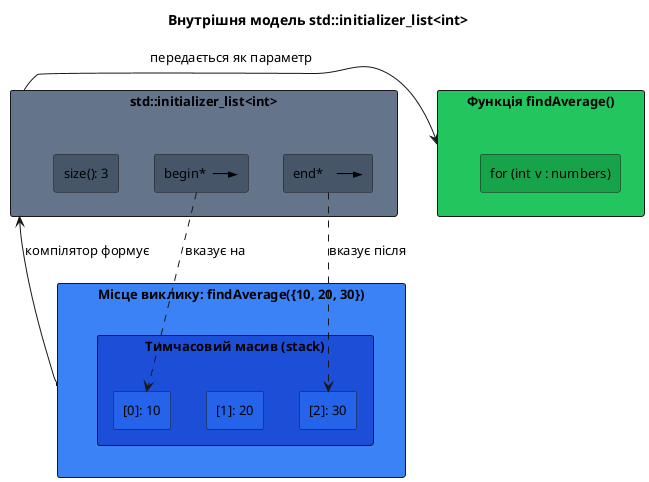
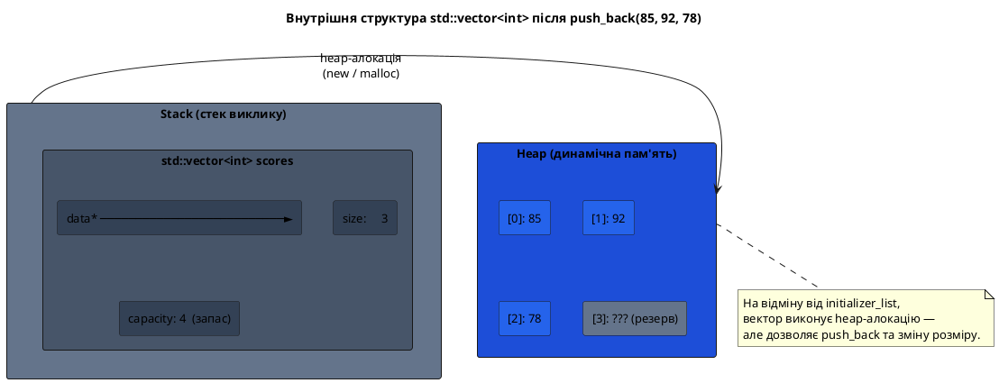
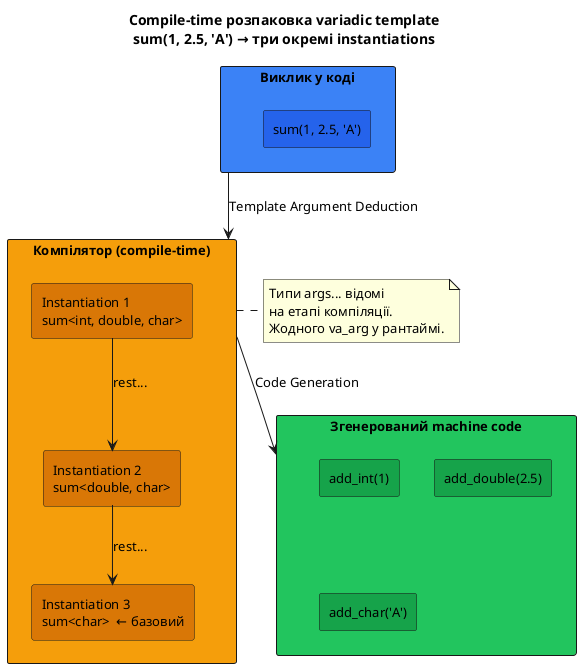
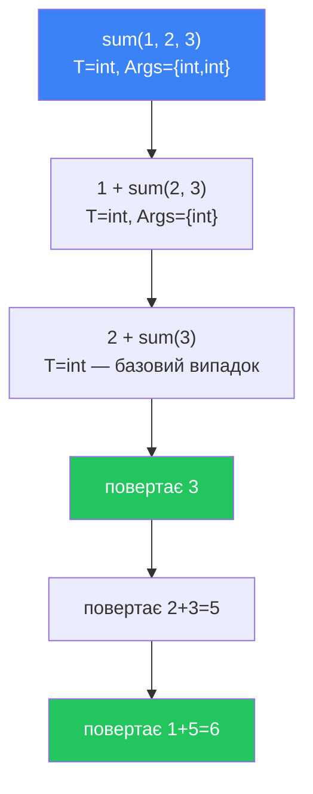

# Безпечні альтернативи еліпсису

## Чому варто відмовитись від `va_list`

У попередній статті було детально показано механізм еліпсиса — `...` — та його небезпеки: відсутність перевірки типів під час компіляції, невизначена поведінка при невідповідності кількості аргументів, проблеми з малими типами та неможливість передачі об'єктів C++ з нетривіальними конструкторами. Усе це — спадщина мови C, успадкована C++ заради зворотної сумісності.

Сучасний C++ (стандарти C++11 і новіші) пропонує набір потужних інструментів, що вирішують ту саму задачу — прийняти довільну кількість аргументів — але роблять це **типобезпечно**: компілятор перевіряє типи під час компіляції, і жодної «невизначеної поведінки» не виникає за умови правильного використання.

::note
**Ключова відмінність від `va_list`:** у всіх описаних нижче альтернативах компілятор _знає_ типи аргументів. Якщо ви передасте `double` туди, де очікується `int`, програма або не скомпілюється (тверда помилка), або виконає неявне перетворення за правилами мови — але ніколи не прочитає «сміттєві» байти зі стеку.
::

Розглянемо чотири основні альтернативи у порядку від найпростішої до найпотужнішої.

---

## Альтернатива 1: `std::initializer_list<T>` — однорідний список літеральних значень

### Концепція

`std::initializer_list<T>` — легковажний контейнер, введений у C++11, що дозволяє передавати довільну кількість значень **одного типу** за допомогою синтаксису фігурних дужок `{}`. Визначений у заголовку `<initializer_list>`, хоча на практиці він підключається автоматично разом із більшістю стандартних заголовків.

Принцип роботи: компілятор розміщує аргументи у тимчасовому масиві і передає до функції пару вказівників (початок і кінець масиву). Функція отримує об'єкт типу `std::initializer_list<T>`, що надає ітераторний інтерфейс до цього масиву — методи `begin()`, `end()` і `size()`.

::plant-uml



::


```cpp [InitializerListBasic.cpp] showLineNumbers
#include <iostream>
#include <initializer_list>  // для std::initializer_list

// Функція приймає довільну кількість int через {}-синтаксис
double findAverage(std::initializer_list<int> numbers)
{
    double sum = 0;

    for (int value : numbers)  // range-based for — безпечна ітерація
    {
        sum += value;
    }

    return sum / numbers.size();
}

int main()
{
    std::cout << findAverage({10, 20, 30})        << '\n'; // 20
    std::cout << findAverage({1, 2, 3, 4, 5})     << '\n'; // 3
    std::cout << findAverage({100, 200})           << '\n'; // 150

    return 0;
}
```

::terminal-preview{title="./InitializerListBasic"}
<div class="line"><span class="opacity-40">$</span> <strong class="font-bold">./InitializerListBasic</strong></div>
<div class="line"><span class="text-blue-400">20</span></div>
<div class="line"><span class="text-blue-400">3</span></div>
<div class="line"><span class="text-blue-400">150</span></div>
::

**Порівняйте виклики:** `findAverage({10, 20, 30})` проти `findAverage(3, 10, 20, 30)` — жодного ручного лічильника, жодного sentinel. Фігурні дужки самі обмежують список.

### Що компілятор перевіряє

При спробі передати несумісний тип компілятор видасть помилку:

```cpp [TypeCheck.cpp]
// ❌ Помилка компіляції — narrowing conversion (звуження типу)
// std::cout << findAverage({10, 2.5, 30}) << '\n';
// error: narrowing conversion of '2.5e+0' from 'double' to 'int'

// ✅ Правильно — явне приведення
std::cout << findAverage({10, static_cast<int>(2.5), 30}) << '\n'; // 14
```

Це принципова відмінність від `va_arg`: компілятор **відмовиться** компілювати код із невідповідністю типів замість того, щоб мовчки прочитати «сміттєві» байти.

### Розширений приклад: пошук мінімуму та максимуму

Щоб краще відчути переваги підходу, розглянемо функцію, що повертає відразу пару значень — мінімум і максимум:

```cpp [MinMax.cpp] showLineNumbers
#include <iostream>
#include <initializer_list>

// Повертає пару {min, max} серед переданих значень
std::pair<int, int> findMinMax(std::initializer_list<int> numbers)
{
    int minVal = *numbers.begin();
    int maxVal = *numbers.begin();

    for (int value : numbers)
    {
        if (value < minVal)
            minVal = value;

        if (value > maxVal)
            maxVal = value;
    }

    return {minVal, maxVal};
}

int main()
{
    auto [minVal, maxVal] = findMinMax({5, 3, 8, 1, 9, 2});

    std::cout << "Min: " << minVal << '\n'; // 1
    std::cout << "Max: " << maxVal << '\n'; // 9

    return 0;
}
```

::terminal-preview{title="./MinMax"}
<div class="line"><span class="opacity-40">$</span> <strong class="font-bold">./MinMax</strong></div>
<div class="line">Min: <span class="text-blue-400">1</span></div>
<div class="line">Max: <span class="text-blue-400">9</span></div>
::

### Обмеження `std::initializer_list`

::warning
`std::initializer_list<T>` є **однорідним** — усі елементи повинні мати один тип `T`. Передати одночасно `int` і `double` як різні типи не вийде. Крім того, список не можна змінювати: він завжди `const` — ітератори надають лише читання. Якщо потрібна гетерогенна (різнотипна) колекція аргументів, слід використовувати variadic templates (альтернатива 3).
::

---

## Альтернатива 2: `std::vector<T>` — динамічний список із повним контролем

### Концепція

Якщо список аргументів формується динамічно під час виконання програми (а не лише з літеральних значень у коді), `std::initializer_list` не підходить — він призначений виключно для синтаксису `{}` у місці виклику. Натомість `std::vector<T>` є повноцінним динамічним масивом, що підтримує додавання і видалення елементів, довільний доступ за індексом і передачу між функціями.

::plant-uml



::


```cpp [VectorAlternative.cpp] showLineNumbers
#include <iostream>
#include <vector>
#include <numeric>   // для std::accumulate

// Отримуємо вектор за const-посиланням — без копіювання
double findAverage(const std::vector<int>& numbers)
{
    if (numbers.empty())
        return 0.0;

    double sum = std::accumulate(numbers.begin(), numbers.end(), 0.0);

    return sum / numbers.size();
}

int main()
{
    // Варіант 1: передача через ініціалізатор (компілятор будує тимчасовий vector)
    std::cout << findAverage({10, 20, 30})       << '\n'; // 20

    // Варіант 2: побудова вектора динамічно (наприклад, зчитано з файлу)
    std::vector<int> scores;
    scores.push_back(85);
    scores.push_back(92);
    scores.push_back(78);

    std::cout << findAverage(scores) << '\n'; // 85

    return 0;
}
```

::terminal-preview{title="./VectorAlternative"}
<div class="line"><span class="opacity-40">$</span> <strong class="font-bold">./VectorAlternative</strong></div>
<div class="line"><span class="text-blue-400">20</span></div>
<div class="line"><span class="text-blue-400">85</span></div>
::

### Коли обирати `std::vector` замість `std::initializer_list`

::card-group

::card{title="Список відомий заздалегідь" icon="i-heroicons-check-circle"}
Використовуйте `std::initializer_list` — синтаксис `{1, 2, 3}` коротший і виразніший. Компілятор не копіює дані зайво.
::

::card{title="Список формується в рантаймі" icon="i-heroicons-cpu-chip"}
Використовуйте `std::vector` — він дозволяє `push_back`, `emplace_back`, алгоритми STL та передачу між функціями без копіювання (через `const&`).
::

::

---

## Альтернатива 3: Variadic Templates — гетерогенні аргументи з перевіркою типів

### Концепція

**Variadic templates** (шаблони зі змінною кількістю параметрів) — найпотужніший і найгнучкіший механізм C++11 для роботи з довільною кількістю аргументів. На відміну від `initializer_list`, вони дозволяють приймати аргументи **різних типів** — і при цьому всі типи відомі компілятору та перевіряються статично.

Ключовий синтаксис — параметричний пакет (`parameter pack`): `typename... Args` у шаблоні та `Args... args` у параметрах функції. Три крапки `...` тут несуть **зовсім інший смисл**, ніж еліпсис `va_list` — це синтаксис розпаковки пакету типів, цілком підконтрольний компілятору.

::note
Variadic templates є складнішою темою і повною мірою розглядаються у розділі про шаблони. Тут ми зосередимось на практичному використанні для заміни `va_list` — щоб показати можливість і синтаксис.
::

::plant-uml



::


### Базовий приклад: рекурсивне підсумовування

Класичний спосіб розпаковки пакету аргументів — рекурсія з базовим випадком:

```cpp [VariadicSum.cpp] showLineNumbers
#include <iostream>

// Базовий випадок рекурсії — один аргумент
template<typename T>
T sum(T value)
{
    return value;
}

// Рекурсивний випадок: перший + рекурсивно решта
template<typename T, typename... Args>
T sum(T first, Args... rest)
{
    return first + sum(rest...); // розпаковка: rest... → наступний виклик
}

int main()
{
    std::cout << sum(1, 2, 3)           << '\n'; // 6
    std::cout << sum(10, 20, 30, 40)    << '\n'; // 100
    std::cout << sum(1.5, 2.5, 3.0)     << '\n'; // 7.0

    return 0;
}
```

::terminal-preview{title="./VariadicSum"}
<div class="line"><span class="opacity-40">$</span> <strong class="font-bold">./VariadicSum</strong></div>
<div class="line"><span class="text-blue-400">6</span></div>
<div class="line"><span class="text-blue-400">100</span></div>
<div class="line"><span class="text-blue-400">7</span></div>
::

**Як компілятор розгортає виклик `sum(1, 2, 3)`:**

::mermaid



::

### Сучасний підхід: `fold expressions` (C++17)

C++17 ввів **згортальні вирази** (`fold expressions`), що позбавляють від необхідності писати рекурсивну функцію-базу:

```cpp [FoldExpression.cpp] showLineNumbers
#include <iostream>

// Унарне лівостороннє згортання: (... op pack)
template<typename... Args>
auto sum(Args... args)
{
    return (... + args); // розгортається в: ((args1 + args2) + args3) + ...
}

template<typename... Args>
auto findMax(Args... args)
{
    // Бінарне згортання із початковим значенням через ternary
    auto maxVal = (... , args); // бере останній — трюк; краще через std::max
    ((maxVal = args > maxVal ? args : maxVal), ...);
    return maxVal;
}

int main()
{
    std::cout << sum(1, 2, 3, 4, 5)     << '\n'; // 15
    std::cout << sum(1.5, 2.5, 3.0)     << '\n'; // 7.0
    std::cout << findMax(3, 7, 1, 9, 4) << '\n'; // 9

    return 0;
}
```

::terminal-preview{title="./FoldExpression"}
<div class="line"><span class="opacity-40">$</span> <strong class="font-bold">./FoldExpression</strong></div>
<div class="line"><span class="text-blue-400">15</span></div>
<div class="line"><span class="text-blue-400">7</span></div>
<div class="line"><span class="text-blue-400">9</span></div>
::

### Гетерогенний приклад: виведення аргументів різних типів

Головна сила variadic templates — можливість приймати аргументи **різних типів**. Наступна функція є типобезпечним аналогом `printf`:

```cpp [VariadicPrint.cpp] showLineNumbers
#include <iostream>

// Базовий випадок — порожній пакет, нічого не виводимо
void print()
{
    std::cout << '\n';
}

// Рекурсивний випадок: виводимо перший, потім решту
template<typename T, typename... Args>
void print(T first, Args... rest)
{
    std::cout << first;

    if (sizeof...(rest) > 0) // sizeof... — кількість аргументів у пакеті
        std::cout << ' ';

    print(rest...); // рекурсивно виводимо решту
}

int main()
{
    print(42, 3.14, "hello", 'A'); // 42 3.14 hello A
    print(1, 2, 3);                // 1 2 3
    print("only one");             // only one

    return 0;
}
```

::terminal-preview{title="./VariadicPrint"}
<div class="line"><span class="opacity-40">$</span> <strong class="font-bold">./VariadicPrint</strong></div>
<div class="line"><span class="text-blue-400">42 3.14 hello A</span></div>
<div class="line"><span class="text-blue-400">1 2 3</span></div>
<div class="line"><span class="text-blue-400">only one</span></div>
::

`print(42, 3.14, "hello", 'A')` — тут чотири різних типи: `int`, `double`, `const char*`, `char`. Компілятор знає кожен із них і генерує чотири окремі розгалуження функції. Жодного `va_arg`, жодного «сміття зі стеку».

---

## Порівняльна таблиця: `va_list` проти сучасних альтернатив

| Критерій | `va_list` / еліпсис | `initializer_list<T>` | `vector<T>` | Variadic templates |
|:---|:---:|:---:|:---:|:---:|
| **Перевірка типів** | ❌ Немає | ✅ Статична | ✅ Статична | ✅ Статична |
| **Гетерогенні типи** | ⚠️ Технічно | ❌ Ні | ❌ Ні | ✅ Так |
| **Динамічний список** | ✅ Так | ❌ Лише `{}` | ✅ Так | ❌ Лише compile-time |
| **Складність** | Низька | Низька | Низька | Висока |
| **Стандарт** | C / C++98 | C++11 | C++98 | C++11 |
| **Об'єкти C++** | ❌ UB | ✅ Так | ✅ Так | ✅ Так |
| **Нульова вартість** | ✅ | ✅ | ❌ Heap | ✅ |

::tip
**Практичне правило вибору:** якщо аргументи однотипні й відомі на етапі написання коду — `initializer_list`. Якщо список формується динамічно — `vector`. Якщо потрібні різні типи — variadic templates. `va_list` — лише для читання старого коду.
::

---

## Зведення: коли що використовувати

::accordion

::accordion-item{label="std::initializer_list<T> — найкращий вибір для однотипних літеральних значень" icon="i-lucide-circle-help"}

**Обирайте, якщо:**
- Усі аргументи одного типу `T`
- Список задається безпосередньо в місці виклику (`{1, 2, 3}`)
- Потрібен простий і виразний API без зайвої складності

**Не підходить, якщо:**
- Список формується динамічно (потрібен `vector`)
- Аргументи різних типів (потрібні variadic templates)
- Необхідно змінювати список всередині функції (він `const`)

::

::accordion-item{label="std::vector<T> — для динамічних однотипних колекцій" icon="i-lucide-circle-help"}

**Обирайте, якщо:**
- Список аргументів читається з вводу, файлу або формується у циклі
- Потрібно передавати список між кількома функціями
- Необхідні алгоритми STL (`std::sort`, `std::find`, тощо)
- Розмір списку може змінюватись після формування

**Не підходить, якщо:**
- Список задається лише як літеральний набір значень — тоді `initializer_list` синтаксично простіший
- Критична продуктивність: `vector` виконує heap-алокацію

::

::accordion-item{label="Variadic Templates — для гетерогенних аргументів і максимальної гнучкості" icon="i-lucide-circle-help"}

**Обирайте, якщо:**
- Аргументи можуть мати різні типи (як у `std::make_tuple`, `std::make_pair`)
- Потрібен абсолютно нульовий runtime-overhead (все вирішується на compile-time)
- Ви реалізуєте бібліотечний код або обгортки загального призначення

**Не підходить, якщо:**
- Команда не знайома з шаблонами — код стане важко читаємим
- Список формується динамічно — шаблони вирішуються лише під час компіляції

::

::

---

## Практичні завдання

### :icon{name="i-heroicons-pencil-square"} Завдання

::card-group

::card{title="Рівень 1 — Базовий" icon="i-heroicons-academic-cap"}

**Завдання 1.** Напишіть функцію `int sumAll(std::initializer_list<int> numbers)`, що повертає суму всіх переданих чисел. Протестуйте:
- `sumAll({1, 2, 3})` → 6
- `sumAll({10, 20, 30, 40, 50})` → 150
- `sumAll({})` → 0 (порожній список)

**Завдання 2.** Реалізуйте функцію `double findAverage(const std::vector<int>& numbers)`. Заповніть вектор значеннями від 1 до 10 через цикл і знайдіть середнє. Порівняйте з еквівалентним кодом на `va_list` — яка версія коротша і безпечніша?

**Завдання 3.** Напишіть функцію `int countPositive(std::initializer_list<int> numbers)`, що рахує кількість додатних чисел у списку. Протестуйте: `countPositive({-1, 2, -3, 4, 5})` → 3.

::

::card{title="Рівень 2 — Логіка" icon="i-heroicons-cpu-chip"}

**Завдання 4.** Реалізуйте функцію `bool allPositive(std::initializer_list<int> numbers)`, що повертає `true`, якщо всі числа в списку додатні. Протестуйте:
- `allPositive({1, 2, 3})` → `true`
- `allPositive({1, -2, 3})` → `false`
- `allPositive({})` → `true` (порожній список — вакуумна істина)

**Завдання 5.** Напишіть variadic-функцію `void printAll(Args... args)`, що виводить усі аргументи через пробіл і завершує рядком. Протестуйте:
- `printAll(1, 2.5, "hello")` → `1 2.5 hello`
- `printAll(true, 'A', 42)` → `1 A 42`

**Завдання 6.** Реалізуйте функцію `std::vector<int> buildVector(std::initializer_list<int> values)`, що повертає копію списку як вектор, але лише з елементами, що перевищують нуль. Протестуйте: `buildVector({-1, 2, -3, 4, 0})` → `{2, 4}`.

::

::card{title="Рівень 3 — Аналіз" icon="i-heroicons-building-library"}

**Завдання 7.** Порівняйте два підходи: реалізуйте функцію `int findMax` двома способами — через `std::initializer_list<int>` і через variadic templates. Порівняйте синтаксис виклику, складність реалізації та обмеження кожного підходу. Оформіть висновок у вигляді таблиці.

**Завдання 8.** Поясніть, чому наступний код не компілюється, і як його виправити:
```cpp
std::initializer_list<int> nums = {1, 2, 3};
nums[0] = 10; // ❌ Чому помилка?
```

::

::

---

## Підсумок

::card-group

::card{title="std::initializer_list<T>" icon="i-heroicons-code-bracket"}

Найпростіша заміна `va_list` для однотипних аргументів. Синтаксис `{1, 2, 3}` — виразний і безпечний. Компілятор перевіряє типи. Список `const` і лише для compile-time наборів значень.

::

::card{title="std::vector<T>" icon="i-heroicons-list-bullet"}

Для динамічних однотипних колекцій. Підтримує зміну розміру, алгоритми STL, передачу між функціями. Виконує heap-алокацію — не «нульова вартість», але максимальна гнучкість.

::

::card{title="Variadic Templates" icon="i-heroicons-cpu-chip"}

Найпотужніший інструмент: гетерогенні типи, compile-time розпаковка, нульовий runtime-overhead. Потребує знання шаблонів. `fold expressions` (C++17) спрощують код. Саме так влаштовані `std::make_tuple`, `std::printf`-обгортки у сучасних бібліотеках.

::

::card{title="Загальний принцип" icon="i-heroicons-shield-check"}

Жодна з трьох альтернатив не дозволяє «читати байти зі стеку». Компілятор завжди знає типи аргументів і або відмовить у компіляції, або виконає безпечне перетворення. Це і є головна цінність відмови від `va_list`.

::

::

У наступній статті ми розглянемо **аргументи командного рядка** — вбудований механізм C++ для передачі параметрів програмі при її запуску через `argc` та `argv`.


