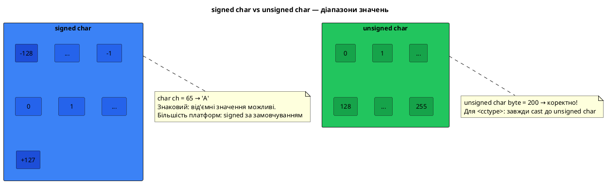
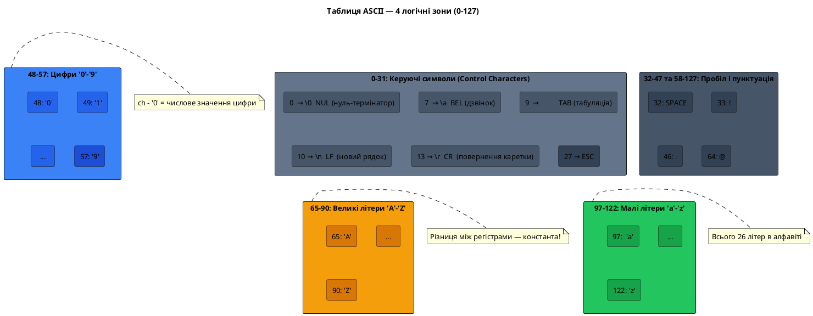
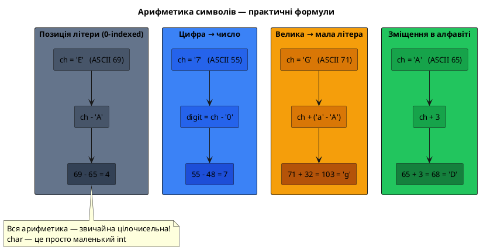
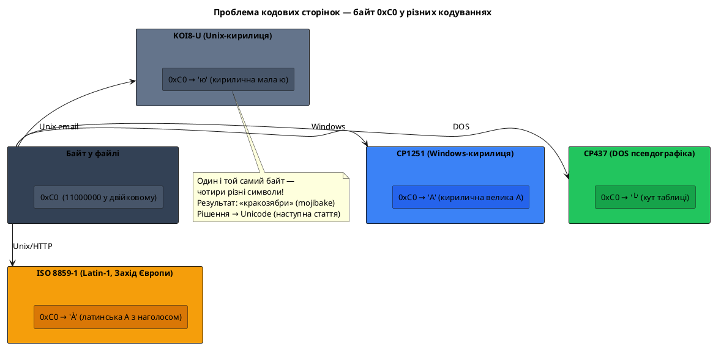

# Символи та таблиця ASCII

## Чому `'A' + 1` дорівнює `'B'`

Ви вже знаєте, що в C++ існує тип `char` для зберігання одного символу. Але подивіться на цей фрагмент коду:

```cpp [CharMath.cpp] showLineNumbers
#include <iostream>

int main()
{
    char first = 'A';
    char next  = first + 1;
    char digit = '7' - '0';

    std::cout << next  << "\n"; // B
    std::cout << (int)digit << "\n"; // 7

    return 0;
}
```

Чому додавання одиниці до символу `'A'` дає символ `'B'`? Чому віднімання `'0'` від символу-цифри `'7'` дає звичайне число `7`? І чому взагалі можна виконувати арифметику над символами? Це не магія — це пряме наслідування того, що `char` насправді **є числом**. А яке число відповідає якому символу — визначає **таблиця кодування**.

---

## Тип `char` — це просто маленький цілочисельний тип

### Байт, біти та діапазон значень

Ви вже знаєте зі [статті про типи даних](/cpp/data-types-variables), що `char` займає рівно **1 байт** — 8 біт. Вісім біт дають 256 можливих комбінацій: від `0000 0000` до `1111 1111`. Отже, `char` може зберігати одне з **256 різних чисел**.

Залежно від того, як компілятор інтерпретує 8-й біт (знаковий чи ні), розрізняють:

- `signed char` — діапазон від **−128 до 127** (знаковий тип, старший біт = знак)
- `unsigned char` — діапазон від **0 до 255** (беззнаковий тип)
- `char` — залежить від платформи; на більшості сучасних систем **signed**, але це не гарантовано стандартом

```cpp [CharTypes.cpp] showLineNumbers
#include <iostream>

int main()
{
    signed char   sc = -1;
    unsigned char uc = 255;
    char          ch = 'A';  // 65 у внутрішньому представленні

    std::cout << (int)sc << "\n"; // -1
    std::cout << (int)uc << "\n"; // 255
    std::cout << (int)ch << "\n"; // 65

    return 0;
}
```

Зверніть увагу на `(int)ch` — без явного приведення `std::cout` виведе символ `A`, а не число `65`. Ми говоримо компілятору: «інтерпретуй цей байт як ціле число, а не символ».

::note
Тип `char` є окремим від `signed char` і `unsigned char` навіть попри те, що фізично відповідає одному з них. Стандарт C++ трактує `char`, `signed char` та `unsigned char` як **три різних типи**. Це важливо при перевантаженні функцій та шаблонах.
::

### `char` у пам'яті

Символ `'A'` зберігається в пам'яті як байт зі значенням **65** (або `0x41` у шістнадцятковій):

::memory-view{title="char ch = 'A'" startAddress="0x00F0" :data='[65, 0, 0, 0]' :highlight="[0]"}
::

Порівняйте з `int x = 65` — значення те саме, але займає 4 байти:

::memory-view{title="int x = 65" startAddress="0x00F4" :data='[65, 0, 0, 0]' :highlight="[0, 1, 2, 3]"}
::

`char ch = 'A'` і `char ch = 65` — це абсолютно ідентичні оголошення. Компілятор зберігає в обох випадках один байт зі значенням 65. Різниця лише в тому, як програміст **записує** ініціалізатор — одинарні лапки (`'A'`) або числовий літерал (`65`).

::plant-uml



::

---

## Що таке кодування символів

### Проблема: число є, але що воно означає?

Отже, `char` — це число від 0 до 255. Але саме по собі число нічого не каже. Байт зі значенням `65` — це буква `'A'`? Кирилична `'А'`? Якийсь спеціальний символ? Відповідь залежить від того, яку **таблицю відповідності** ми використовуємо.

**Кодування символів** (character encoding) — це стандартизована таблиця, що визначає, яке число відповідає якому символу. Це договір між усіма учасниками: комп'ютером, операційною системою, компілятором, текстовим редактором та людиною.

Аналогія з реального світу: уявіть азбуку Морзе. Три крапки (`...`) — це буква `S`. Але якщо хтось не знає, що ми використовуємо саме азбуку Морзе, а не, скажімо, шифр Цезаря — три крапки для нього лишаться беззмістовним сигналом. Кодування і є таким «ключем до розшифровки».

::note
Принципово важливо розуміти різницю між **значенням** і **поданням**: значення `65` існує незалежно від кодування. Кодування лише визначає, який **символ** ми намалюємо на екрані, коли зустрінемо байт `65`. Саме тому «змінити кодування» файлу — це не змінити байти, а лише змінити правило їх інтерпретації.
::

### Чому потрібен єдиний стандарт

На зорі комп'ютерної ери кожен виробник мав **власну** таблицю кодування. IBM використовувала EBCDIC, різні термінали — власні схеми. Це означало, що текстовий файл, створений на одній системі, перетворювався на «кракозябри» (mojibake) на іншій. Обмін даними між різними комп'ютерами був вкрай складним завданням.

Рішення прийшло у 1963 році у вигляді стандарту **ASCII**.

---

## Таблиця ASCII

### Що таке ASCII

**ASCII** (American Standard Code for Information Interchange — Американський стандартний код для обміну інформацією) — перший широко прийнятий стандарт кодування символів, розроблений у США у 1963 році і затверджений як стандарт ANSI у 1968 році.

Ключові характеристики ASCII:
- Використовує **7 біт** → 128 символів (коди від 0 до 127)
- Розроблявся для **телетайпів** (teletypes) — пристроїв передачі тексту по телефонних лініях
- Орієнтований на **англійську мову**: латинські букви, цифри, пунктуація
- Досі є основою всіх сучасних кодувань — UTF-8 повністю сумісний з ASCII

::note
Чому 7 біт, а не 8? У 1963 році 8-й біт часто використовувався для **контролю парності** (parity bit) — примітивної перевірки цілісності даних при передачі. Тому для символів залишили 7 біт. Восьмий біт пізніше дав простір для «розширеного ASCII» з 128 додатковими символами — про це розповімо наприкінці статті.
::

### Структура таблиці ASCII

::plant-uml



::

Таблиця ASCII поділяється на чотири логічні групи:

::card-group

::card{title="Керуючі символи (0–31)" icon="i-lucide-settings"}

Невидимі символи для керування пристроями та форматування тексту. Жодного «малюнку» вони не мають — це **команди**.

Найважливіші:
- `0` (`\0`) — нуль-термінатор, кінець C-style рядка
- `7` (`\a`) — дзвінок (bell) — звуковий сигнал
- `8` (`\b`) — backspace — крок назад
- `9` (`\t`) — горизонтальна табуляція
- `10` (`\n`) — новий рядок (LF, Line Feed)
- `13` (`\r`) — повернення каретки (CR, Carriage Return)
- `27` — escape-символ (ESC)

::

::card{title="Пунктуація і спецсимволи (32–47, 58–64, 91–96, 123–127)" icon="i-lucide-type"}

Пробіл (`32`), `!`, `"`, `#`, `$`, `%`, `&`, `'`, `(`, `)`, `*`, `+`, `,`, `-`, `.`, `/` та інша пунктуація. Також `:`, `;`, `<`, `=`, `>`, `?`, `@`, дужки, `\`, `^`, `_`, `` ` ``, `{`, `|`, `}`, `~`, `DEL` (127).

::

::card{title="Цифри (48–57)" icon="i-lucide-hash"}

Символи `'0'` через `'9'`. Зверніть увагу: **символ** `'0'` має код `48`, а не `0`. Саме тому `'7' - '0' = 55 - 48 = 7`.

::

::card{title="Літери (65–90 та 97–122)" icon="i-lucide-a-large-small"}

Великі літери `'A'`–`'Z'`: коди **65–90**.<br/>
Малі літери `'a'`–`'z'`: коди **97–122**.<br/>
Різниця між великою і малою літерою: рівно **32**. Саме тому перетворення регістру — це проста арифметика.

::

::

---

### Повна таблиця ASCII (32–127)

| Dec | Hex | Sym | Dec | Hex | Sym | Dec | Hex | Sym | Dec | Hex | Sym |
|:---:|:---:|:---:|:---:|:---:|:---:|:---:|:---:|:---:|:---:|:---:|:---:|
| 32 | 20 | ` ` | 56 | 38 | `8` | 80 | 50 | `P` | 104 | 68 | `h` |
| 33 | 21 | `!` | 57 | 39 | `9` | 81 | 51 | `Q` | 105 | 69 | `i` |
| 34 | 22 | `"` | 58 | 3A | `:` | 82 | 52 | `R` | 106 | 6A | `j` |
| 35 | 23 | `#` | 59 | 3B | `;` | 83 | 53 | `S` | 107 | 6B | `k` |
| 36 | 24 | `$` | 60 | 3C | `<` | 84 | 54 | `T` | 108 | 6C | `l` |
| 37 | 25 | `%` | 61 | 3D | `=` | 85 | 55 | `U` | 109 | 6D | `m` |
| 38 | 26 | `&` | 62 | 3E | `>` | 86 | 56 | `V` | 110 | 6E | `n` |
| 39 | 27 | `'` | 63 | 3F | `?` | 87 | 57 | `W` | 111 | 6F | `o` |
| 40 | 28 | `(` | 64 | 40 | `@` | 88 | 58 | `X` | 112 | 70 | `p` |
| 41 | 29 | `)` | 65 | 41 | `A` | 89 | 59 | `Y` | 113 | 71 | `q` |
| 42 | 2A | `*` | 66 | 42 | `B` | 90 | 5A | `Z` | 114 | 72 | `r` |
| 43 | 2B | `+` | 67 | 43 | `C` | 91 | 5B | `[` | 115 | 73 | `s` |
| 44 | 2C | `,` | 68 | 44 | `D` | 92 | 5C | `\` | 116 | 74 | `t` |
| 45 | 2D | `-` | 69 | 45 | `E` | 93 | 5D | `]` | 117 | 75 | `u` |
| 46 | 2E | `.` | 70 | 46 | `F` | 94 | 5E | `^` | 118 | 76 | `v` |
| 47 | 2F | `/` | 71 | 47 | `G` | 95 | 5F | `_` | 119 | 77 | `w` |
| 48 | 30 | `0` | 72 | 48 | `H` | 96 | 60 | `` ` `` | 120 | 78 | `x` |
| 49 | 31 | `1` | 73 | 49 | `I` | 97 | 61 | `a` | 121 | 79 | `y` |
| 50 | 32 | `2` | 74 | 4A | `J` | 98 | 62 | `b` | 122 | 7A | `z` |
| 51 | 33 | `3` | 75 | 4B | `K` | 99 | 63 | `c` | 123 | 7B | `{` |
| 52 | 34 | `4` | 76 | 4C | `L` | 100 | 64 | `d` | 124 | 7C | `\|` |
| 53 | 35 | `5` | 77 | 4D | `M` | 101 | 65 | `e` | 125 | 7D | `}` |
| 54 | 36 | `6` | 78 | 4E | `N` | 102 | 66 | `f` | 126 | 7E | `~` |
| 55 | 37 | `7` | 79 | 4F | `O` | 103 | 67 | `g` | 127 | 7F | DEL |

---

## Арифметика символів

Оскільки `char` — це число, з символами можна виконувати усі арифметичні та порівняльні операції. Це не просто цікавий факт — це основа багатьох алгоритмів обробки тексту.

### Конвертація символу-цифри в числове значення

Символи `'0'`–`'9'` розташовані в ASCII послідовно (коди 48–57). Тому щоб отримати числове значення з символу-цифри, достатньо відняти код символу `'0'`:

```cpp [DigitConvert.cpp] showLineNumbers
#include <iostream>

int main()
{
    char ch = '7';

    // Неправильно: ch сам по собі — це число 55, а не 7
    // Правильно:
    int digit = ch - '0'; // 55 - 48 = 7

    std::cout << "Символ: " << ch    << "\n"; // 7
    std::cout << "Код:    " << (int)ch       << "\n"; // 55
    std::cout << "Число:  " << digit << "\n"; // 7

    return 0;
}
```

::terminal-preview{title="./DigitConvert"}
<div class="line"><span class="opacity-40">$</span> <strong class="font-bold">./DigitConvert</strong></div>
<div class="line">Символ: <span class="text-blue-400">7</span></div>
<div class="line">Код:    <span class="text-blue-400">55</span></div>
<div class="line">Число:  <span class="text-green-400 font-bold">7</span></div>
<div class="line">Execution finished with <span class="text-green-400 font-bold">exit code 0</span>.</div>
::

Цей прийом є повсюдним у реальному коді: конвертація рядка з цифрами у число (ручна реалізація `atoi`), перевірка коректності введення тощо. Важливо пам'ятати, що він **лише** для символів `'0'`–`'9'` — якщо `ch` не є цифрою, результат буде безглуздим.

### Навігація по алфавіту

Літери `'A'`–`'Z'` і `'a'`–`'z'` також розташовані в ASCII послідовно, тому зміщення по алфавіту — це проста арифметика:

```cpp [AlphabetNav.cpp] showLineNumbers
#include <iostream>

int main()
{
    char letter = 'E';

    // Зсув вперед по алфавіту
    char shifted = letter + 3; // 'E' (69) + 3 = 72 = 'H'
    std::cout << shifted << "\n"; // H

    // Позиція літери в алфавіті (0-indexed)
    int pos = letter - 'A'; // 69 - 65 = 4
    std::cout << "Позиція 'E': " << pos << "\n"; // 4

    // Циклічний шифр Цезаря (зсув на 13, ROT13)
    char rotated = 'A' + (letter - 'A' + 13) % 26; // 'R'
    std::cout << "ROT13('E'): " << rotated << "\n"; // R

    return 0;
}
```

::terminal-preview{title="./AlphabetNav"}
<div class="line"><span class="opacity-40">$</span> <strong class="font-bold">./AlphabetNav</strong></div>
<div class="line"><span class="text-blue-400">H</span></div>
<div class="line">Позиція 'E': <span class="text-blue-400">4</span></div>
<div class="line">ROT13('E'): <span class="text-green-400 font-bold">R</span></div>
<div class="line">Execution finished with <span class="text-green-400 font-bold">exit code 0</span>.</div>
::

### Перетворення регістру вручну

Оскільки між кодами великих і малих літер різниця рівно **32**, перетворення регістру — це додавання або віднімання константи:

```cpp [CaseConvert.cpp] showLineNumbers
#include <iostream>

int main()
{
    char upper = 'G';
    char lower = 'g';

    // Велика → мала: додати 32 (або 'a' - 'A')
    char toLower = upper + ('a' - 'A'); // 71 + 32 = 103 = 'g'

    // Мала → велика: відняти 32
    char toUpper = lower - ('a' - 'A'); // 103 - 32 = 71 = 'G'

    std::cout << toLower << "\n"; // g
    std::cout << toUpper << "\n"; // G

    // Перевірка: чи є символ великою літерою
    bool isUpper = (upper >= 'A' && upper <= 'Z');
    std::cout << std::boolalpha << isUpper << "\n"; // true

    return 0;
}
```

::tip
Замість магічної константи `32` краще писати `'a' - 'A'` — це самодокументований код, який явно показує різницю між регістрами. Компілятор обчислить `'a' - 'A'` на етапі компіляції і підставить `32` — жодних витрат часу виконання.
::

### Порівняння символів

Оскільки порівняння символів — це порівняння їх числових кодів, `'a' < 'b'` є правдою (97 < 98), а `'A' < 'a'` — теж правда (65 < 97). Це є основою **лексикографічного** (алфавітного) сортування рядків:

```cpp [CharCompare.cpp] showLineNumbers
#include <iostream>

int main()
{
    std::cout << std::boolalpha;

    // Порівняння символів
    std::cout << ('a' < 'b')  << "\n"; // true  (97 < 98)
    std::cout << ('A' < 'a')  << "\n"; // true  (65 < 97)
    std::cout << ('Z' < 'a')  << "\n"; // true  (90 < 97) — усі великі < малих
    std::cout << ('9' < 'A')  << "\n"; // true  (57 < 65) — цифри < букв

    return 0;
}
```

::terminal-preview{title="./CharCompare"}
<div class="line"><span class="opacity-40">$</span> <strong class="font-bold">./CharCompare</strong></div>
<div class="line"><span class="text-green-400 font-bold">true</span></div>
<div class="line"><span class="text-green-400 font-bold">true</span></div>
<div class="line"><span class="text-green-400 font-bold">true</span></div>
<div class="line"><span class="text-green-400 font-bold">true</span></div>
<div class="line">Execution finished with <span class="text-green-400 font-bold">exit code 0</span>.</div>
::

Це має практичний наслідок: функція `strcmp` для рядків порівнює їх саме побайтово за ASCII-кодами. «Banana» стоятиме **після** «Apple» лексикографічно, бо `'B'` (66) > `'A'` (65). Але «apple» стоятиме **після** «Banana», бо `'a'` (97) > `'B'` (66). Регістр символів **впливає** на лексикографічний порядок у чистому ASCII.

::plant-uml



::

---

## Бібліотека `<cctype>`: стандартні функції для символів

Писати власні перевірки на кшталт `ch >= 'A' && ch <= 'Z'` — це не лише багатослівно, але й ненадійно: такий підхід не враховує локалізацію і може давати неправильні результати для розширеного ASCII. Стандартна бібліотека C++ пропонує готові функції у заголовку `<cctype>`.

### Функції класифікації символів

Усі функції приймають `int` (неявне розширення `char`) і повертають ненульове значення (true) або нуль (false):

```cpp [CctypeDemo.cpp] showLineNumbers
#include <iostream>
#include <cctype>

int main()
{
    char samples[] = {'A', 'z', '5', ' ', '!', '\n'};

    for (char ch : samples)
    {
        std::cout << "'" << ch << "' (код " << (int)ch << "):\n";
        std::cout << "  isalpha:  " << std::boolalpha << (bool)std::isalpha(ch) << "\n";
        std::cout << "  isdigit:  " << (bool)std::isdigit(ch) << "\n";
        std::cout << "  isalnum:  " << (bool)std::isalnum(ch) << "\n";
        std::cout << "  isspace:  " << (bool)std::isspace(ch) << "\n";
        std::cout << "  ispunct:  " << (bool)std::ispunct(ch) << "\n";
        std::cout << "  isupper:  " << (bool)std::isupper(ch) << "\n";
        std::cout << "  islower:  " << (bool)std::islower(ch) << "\n";
    }

    return 0;
}
```

### Таблиця функцій `<cctype>`

::field-group

::field{name="isalpha(ch)" type="bool"}
Чи є символ **літерою** (A–Z або a–z). `isalpha('A')` → true, `isalpha('5')` → false.
::

::field{name="isdigit(ch)" type="bool"}
Чи є символ **десятковою цифрою** (0–9). `isdigit('7')` → true, `isdigit('a')` → false.
::

::field{name="isalnum(ch)" type="bool"}
Чи є символ **літерою або цифрою**. Об'єднання `isalpha` і `isdigit`.
::

::field{name="isspace(ch)" type="bool"}
Чи є символ **пробільним**: пробіл (32), `\t` (9), `\n` (10), `\r` (13), `\f` (12), `\v` (11).
::

::field{name="ispunct(ch)" type="bool"}
Чи є символ **розділовим знаком**: `!`, `"`, `#`, `$`, `%`, `&`, `'`, `(`, `)`, `*`, `+`, `,`, `-`, `.`, `/`, `:`, `;`, `<`, `=`, `>`, `?`, `@`, `[`, `\`, `]`, `^`, `_`, `` ` ``, `{`, `|`, `}`, `~`.
::

::field{name="isupper(ch) / islower(ch)" type="bool"}
Чи є символ **великою / малою літерою**.
::

::field{name="isprint(ch)" type="bool"}
Чи є символ **друкованим** (коди 32–126 включно, тобто все крім керуючих символів та DEL).
::

::field{name="iscntrl(ch)" type="bool"}
Чи є символ **керуючим** (коди 0–31 та 127).
::

::field{name="toupper(ch)" type="int"}
**Перетворює** символ на велику літеру, якщо він є малою. Інакше повертає символ без змін. Повертає `int` — не забувайте про `static_cast<char>`.
::

::field{name="tolower(ch)" type="int"}
**Перетворює** символ на малу літеру. Повертає `int`.
::

::

### Практичний приклад: валідація та нормалізація введення

```cpp [Normalize.cpp] showLineNumbers
#include <iostream>
#include <cctype>
#include <string>

// Перевіряє, чи рядок є коректним ідентифікатором C++:
// починається з літери або _, далі — букви, цифри або _
bool isValidIdentifier(const std::string& s)
{
    if (s.empty()) return false;
    if (!std::isalpha(static_cast<unsigned char>(s[0])) && s[0] != '_')
        return false;

    for (size_t i = 1; i < s.size(); ++i)
    {
        if (!std::isalnum(static_cast<unsigned char>(s[i])) && s[i] != '_')
            return false;
    }
    return true;
}

// Перетворює рядок у верхній регістр
std::string toUpperCase(std::string s)
{
    for (char& ch : s)
        ch = static_cast<char>(std::toupper(static_cast<unsigned char>(ch)));
    return s;
}

int main()
{
    std::cout << std::boolalpha;
    std::cout << isValidIdentifier("myVar")   << "\n"; // true
    std::cout << isValidIdentifier("_count")  << "\n"; // true
    std::cout << isValidIdentifier("2fast")   << "\n"; // false
    std::cout << isValidIdentifier("my-var")  << "\n"; // false

    std::cout << toUpperCase("Hello, World!") << "\n"; // HELLO, WORLD!

    return 0;
}
```

::terminal-preview{title="./Normalize"}
<div class="line"><span class="opacity-40">$</span> <strong class="font-bold">./Normalize</strong></div>
<div class="line"><span class="text-green-400 font-bold">true</span></div>
<div class="line"><span class="text-green-400 font-bold">true</span></div>
<div class="line"><span class="text-yellow-400">false</span></div>
<div class="line"><span class="text-yellow-400">false</span></div>
<div class="line"><span class="text-blue-400">HELLO, WORLD!</span></div>
<div class="line">Execution finished with <span class="text-green-400 font-bold">exit code 0</span>.</div>
::

::warning
Функції `<cctype>` приймають `int`, а не `char`. Якщо ваша платформа використовує `signed char` і символ має від'ємне значення (наприклад, кирилиця в CP1251), передача такого `char` напряму є **невизначеною поведінкою** (UB). Правильний спосіб: `std::isupper(static_cast<unsigned char>(ch))`.
::

---

::plant-uml



::

## Extended ASCII та проблема кодових сторінок

### 8-й біт: ще 128 символів

Оригінальний ASCII використовує лише 7 біт (коди 0–127). Восьмий біт залишався вільним, і різні компанії та організації почали заповнювати коди **128–255** власними символами. Це і є **розширений ASCII** (Extended ASCII).

Проблема в тому, що **єдиного стандарту розширеного ASCII не існує**. Кожна «кодова сторінка» (code page) по-своєму визначає, що означають коди 128–255:

| Кодова сторінка | Призначення | Де використовується |
|:---|:---|:---|
| **CP437** | Псевдографіка DOS (`░`, `▒`, `▓`, `█`) | Старі DOS-програми |
| **CP1251** (Windows-1251) | Кирилиця (українська, російська) | Windows-системи |
| **CP1252** (Windows-1252) | Западноєвропейські мови | Windows, Захід Європи |
| **ISO 8859-1** (Latin-1) | Западноєвропейські мови | Unix-системи, HTTP |
| **ISO 8859-5** | Кирилиця | Unix-системи |
| **KOI8-U** | Кирилиця (українська) | Старі Unix/email системи |

### «Кракозябри» — наочна демонстрація проблеми

Уявіть: ви зберегли текст `"Привіт"` у файлі з кодуванням CP1251. Байти виглядають так:

```
0xCF 0xF0 0xE8 0xE2 0xB3 0xF2  (CP1251: "Привіт")
```

Якщо відкрити той самий файл, але вказати кодування ISO 8859-1 (Latin-1), браузер або редактор інтерпретує байт `0xCF` як `Ï`, `0xF0` як `ð`, `0xE8` як `è` — і замість «Привіт» ви побачите: `Ïðèâ³ò`. Це і є «кракозябри» (mojibake).

::caution
Код C++, що жорстко покладається на розширений ASCII (наприклад, порівнює байти кирилиці з числовими константами), буде **непортабельним**: він може давати різні результати на Windows (CP1251) та Linux (UTF-8). Сучасне вирішення — стандарт **Unicode**, якому присвячена наступна стаття.
::

### Тизер: чому ASCII більше недостатньо

ASCII відмінно вирішив задачу для англійської мови. Але наш світ — багатомовний. Китайська мова має тисячі ієрогліфів, арабська — пишеться справа наліво, математична нотація вимагає грецьких та спеціальних літер, емодзі стали частиною цифрового спілкування.

Жодна кодова сторінка з 256 символами не здатна охопити всю людську писемність. У 1991 році світ отримав **Unicode** — єдиний каталог для понад мільйона символів усіх мов і скриптів. Але це — тема наступної статті.

---

## Практика

### Рівень 1: Розуміння та базові операції

::accordion

::accordion-item{label="Завдання 1.1 — Інспектор символів"}

Напишіть програму, що зчитує один символ з клавіатури і виводить про нього повну інформацію: ASCII-код у десятковому та шістнадцятковому форматі, категорію (велика літера / мала літера / цифра / пробільний / пунктуація / керуючий), а також для літер — відповідний символ іншого регістру.

Очікуваний вивід для `'G'`:
```
Символ: G
Код:    67 (0x43)
Категорія: велика літера
Мала версія: g
```

**Підказка:** використайте `std::hex` для шістнадцяткового виводу та функції `<cctype>`.
::

::accordion-item{label="Завдання 1.2 — Виправте помилки"}

Знайдіть і виправте всі помилки у наступному коді:

```cpp
#include <iostream>

int main()
{
    char ch = "A";           // помилка 1
    int code = ch;
    char upper = ch - 32;    // помилка 2 (логічна): ch вже велика
    char digit = '5';
    int num = digit;         // помилка 3 (логічна): це дасть 53, а не 5

    std::cout << code  << "\n";
    std::cout << upper << "\n";
    std::cout << num   << "\n";
    return 0;
}
```
::

::

### Рівень 2: Алгоритми обробки символів

::accordion

::accordion-item{label="Завдання 2.1 — Статистика символів"}

Напишіть програму, що зчитує рядок (через `std::getline`) і виводить статистику:
- Кількість великих літер
- Кількість малих літер
- Кількість цифр
- Кількість пробілів
- Кількість знаків пунктуації
- Кількість інших символів

Використайте функції `<cctype>`.
::

::accordion-item{label="Завдання 2.2 — Шифр Цезаря"}

Реалізуйте функцію `std::string caesarCipher(const std::string& text, int shift)`, що зсуває кожну літеру тексту на `shift` позицій в алфавіті (з оберненням через кінець: після `'Z'` іде `'A'`). Нелітерні символи залишати без змін. Реалізуйте також функцію дешифрування.

Приклад: `caesarCipher("Hello, World!", 13)` → `"Uryyb, Jbeyq!"`
::

::

### Рівень 3: Більш складні завдання

::accordion

::accordion-item{label="Завдання 3.1 — Функція charInfo"}

Напишіть функцію `void charInfo(char ch)`, що виводить:
- Символ та його ASCII-код (dec, hex, oct, bin)
- Категорію символу (за `<cctype>`)
- Для літер: позицію в алфавіті (1-indexed), відповідний символ іншого регістру
- Для цифр: числове значення
- Для керуючих символів: назву (наприклад, `\n` → «Line Feed`, `\t` → «Tab»)

Продемонструйте роботу функції для набору символів: `'A'`, `'z'`, `'5'`, `'\n'`, `'!'`, `' '`.
::

::accordion-item{label="Завдання 3.2 — ASCII-арт генератор"}

Напишіть програму, що генерує «ASCII-арт» рамку навколо введеного тексту. Програма зчитує рядок і виводить його у рамці з символів `+`, `-`, `|`:

```
Введіть текст: Hello, World!
+---------------+
| Hello, World! |
+---------------+
```

Ускладнення: якщо текст довший за 40 символів, автоматично перенести на наступний рядок всередині рамки.
::

::

---

## Резюме

::card-group

::card{title="🔢 char — це число" icon="i-lucide-binary"}

- `char` займає 1 байт і може зберігати значення 0–255
- `char ch = 'A'` ≡ `char ch = 65` — ідентичні оголошення
- `signed char` (−128..127), `unsigned char` (0..255), `char` (платформозалежний)
- Для виводу числового значення: `(int)ch` або `static_cast<int>(ch)`

::

::card{title="📋 Таблиця ASCII" icon="i-lucide-table"}

- 128 символів (7 біт), коди 0–127
- 0–31: керуючі символи (`\0`, `\n`, `\t`, `\r`)
- 48–57: цифри `'0'`–`'9'`
- 65–90: великі літери `'A'`–`'Z'`
- 97–122: малі літери `'a'`–`'z'`
- Різниця великих і малих: 32

::

::card{title="➕ Арифметика символів" icon="i-lucide-calculator"}

- `'7' - '0'` → числове значення цифри (7)
- `'a' - 'A'` → 32 (різниця регістрів)
- `'A' + pos` → літера за позицією в алфавіті
- `ch >= 'A' && ch <= 'Z'` → перевірка на велику літеру
- `'A' + (ch - 'A' + n) % 26` → циклічний зсув по алфавіту

::

::card{title="🔧 Бібліотека <cctype>" icon="i-lucide-wrench"}

- `isalpha`, `isdigit`, `isalnum` — перевірка типу символу
- `isspace`, `ispunct`, `isprint`, `iscntrl` — додаткові категорії
- `isupper`, `islower` — перевірка регістру
- `toupper`, `tolower` — зміна регістру (повертають `int`!)
- ⚠️ Завжди: `static_cast<unsigned char>(ch)` перед викликом

::

::card{title="⚠️ Extended ASCII і кодові сторінки" icon="i-lucide-alert-triangle"}

- Коди 128–255 не стандартизовані
- Різні кодові сторінки (CP1251, CP1252, ISO 8859-x) — різна інтерпретація
- «Кракозябри» (mojibake) — наслідок неправильного кодування
- ASCII стандартизував лише 128 символів для англійської мови

::

::card{title="🌍 Що далі: Unicode" icon="i-lucide-globe"}

- 256 значень `char` не вистачає для всіх мов світу
- Множинні кодові сторінки → несумісність та помилки
- Unicode (1991): єдиний каталог для всіх символів усіх мов
- UTF-8, UTF-16, UTF-32 — різні способи кодування Unicode
- Наступна стаття: детально про Unicode та кодування UTF

::

::

::note
Наступний крок — стаття **«Unicode та кодування UTF»**: дізнаємось, що таке code point, чим відрізняється UTF-8 від UTF-16, чому `"Привіт".length()` повертає 12, а не 6, і які символьні типи є в C++ для роботи з Unicode.
::
