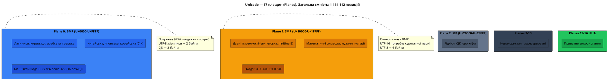
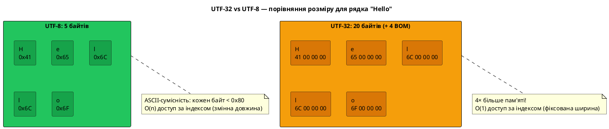
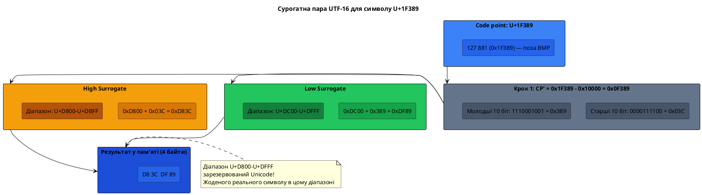
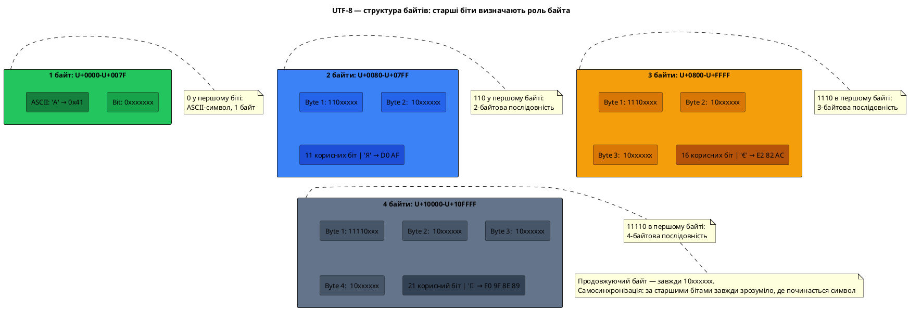
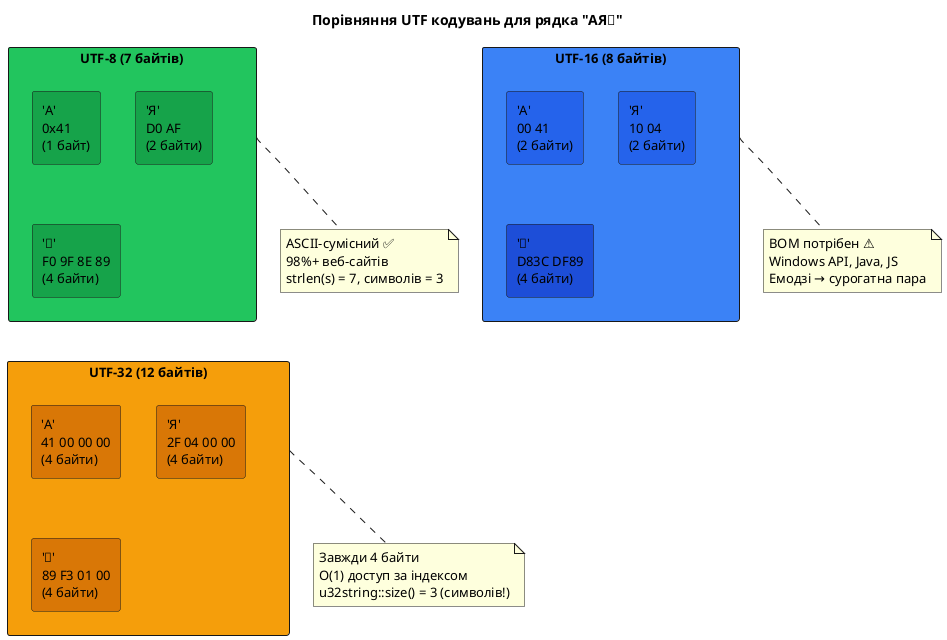

# Unicode та кодування UTF

## Загадки, на які у вас поки немає відповіді

Подивіться на три фрагменти коду:

```cpp [UnicodeQuestions.cpp] showLineNumbers
#include <iostream>
#include <cstring>
#include <string>

int main()
{
    // Питання 1: чому довжина не дорівнює кількості символів?
    const char* greeting = "Привіт";
    std::cout << strlen(greeting) << "\n"; // 12, а не 6!

    // Питання 2: чому емодзі «важчий» за літеру?
    const char* party = "🎉";
    std::cout << strlen(party) << "\n"; // 4, а не 1!

    // Питання 3: чому однакові на вигляд рядки можуть мати різну довжину?
    std::string cafe1 = "café";  // e з наголосом як один символ (U+00E9)
    std::string cafe2 = "cafe\xCC\x81"; // e + комбінуючий наголос (два code points)
    std::cout << cafe1.length() << "\n"; // 5
    std::cout << cafe2.length() << "\n"; // 6
    // Виглядають однаково, але різні у пам'яті!

    return 0;
}
```

Усі три результати видаються контрінтуїтивними. Рядок із шести символів займає 12 байтів? Один смайлик — 4 байти? Два рядки, які виглядають ідентично, мають різну довжину? Щоб зрозуміти ці явища, необхідно зануритися у тему, що лежить в основі всього сучасного текстового програмування: стандарт **Unicode** та пов'язані з ним кодування **UTF**.

---

## Проблема, яку вирішує Unicode

### Повторення: хаос кодових сторінок

У попередній статті ми з'ясували, що ASCII — стандарт 1963 року — охоплює лише 128 символів і орієнтований виключно на англійську мову. Спроби розширити його за рахунок 8-го біту породили десятки несумісних між собою «кодових сторінок» (code pages): CP437 для псевдографіки DOS, CP1251 для кирилиці Windows, ISO 8859-1 для Заходу Європи, KOI8-U для Unix-систем тощо.

Кожна з цих кодових сторінок по-своєму інтерпретує байти з діапазону 128–255. Байт `0xC0`, наприклад, означає:
- `À` (A з наголосом) у кодуванні ISO 8859-1 (Latin-1)
- `А` (кирилична велика) у кодуванні CP1251
- зовсім інший символ у CP437

Поки комп'ютери існували в ізоляції, ця фрагментація була терпимою. Але коли у 1980-х роках почав формуватися глобальний інтернет, проблема стала невідкладною.

### Уявний сценарій: міжнародний документ

Уявіть, що вам потрібно створити документ, у якому одночасно присутні:
- Японський текст: `日本語` (три ієрогліфи кана / канджі)
- Арабський текст: `مرحبا` (привіт арабською)
- Українська кирилиця: `Привіт`
- Математичні символи: `∑`, `√`, `π`
- Звичайна латиниця: `Hello`

Жодна кодова сторінка з 256 символами не здатна охопити всі ці системи письма одночасно. Японська мова сама по собі має понад 2 000 символів у повсякденному вжитку (і більше 50 000 усього). Кирилиця, арабська, грецька, гебрайська, деванагарі — це лише кілька з понад 150 активних систем письма у світі.

Відповідь на цей виклик була сформульована у 1988 році і реалізована у 1991 році: **Unicode**.

### Народження Unicode

У 1987 році двоє інженерів — Джо Бекер (Xerox) і Лі Коллінз (Apple) — почали розробляти єдиний стандарт для всіх символів усіх мов світу. До проекту приєднався Марк Девіс з Apple. У 1991 році був опублікований перший том стандарту Unicode 1.0, що містив 7 161 символ.

У 2024 році стандарт Unicode 15.1 охоплює **149 813 символів** з **161 системи письма** — від давньоєгипетських ієрогліфів до сучасних емодзі. При цьому простір для зростання залишається: стандарт може вмістити до **1 112 064** символів.

::note
Назва «Unicode» походить від слова «universal» (універсальний) і числа «1» — натяк на те, що це одне кодування для всіх. Проект з самого початку мав амбіційну мету: кожен символ кожної писемності — один раз, однозначно, без дублювань.
::

---

## Unicode — це каталог, а не кодування

### Ключова концептуальна відмінність

Ось найважливіша ідея цієї статті, яку необхідно засвоїти на самому початку, перш ніж рухатися далі:

**Unicode — це не кодування.** Unicode — це **каталог символів** (character repertoire). Він присвоює кожному символу унікальний **номер**, але не визначає, як саме цей номер зберігати у пам'яті комп'ютера.

Аналогія: уявіть бібліотечний каталог, де кожна книга має унікальний інвентарний номер. Каталог лише фіксує, що «книга № 7389 — це твори Шевченка». Але де саме стоїть ця книга на полиці, у якому відділі, у якій будівлі — каталог не визначає. Розміщення книг — окреме питання.

Так само Unicode каже: «символ `А` (кирилична велика) має номер 1040 (або `U+0410` у шістнадцятковій)». А от як саме зберегти число 1040 у файлі або в пам'яті — для цього існують окремі **схеми кодування**: UTF-8, UTF-16 та UTF-32.

### Що таке код-поінт

**Код-поінт** (code point) — це унікальний номер, присвоєний символу у стандарті Unicode. Записується у форматі `U+XXXX`, де `XXXX` — шістнадцяткове число.

```
U+0041  →  A  (латинська велика літера A)
U+0061  →  a  (латинська мала літера a)
U+0410  →  А  (кирилична велика літера А)
U+0430  →  а  (кирилична мала літера а)
U+20AC  →  €  (знак євро)
U+1F600 →  😀 (широко усміхнене обличчя, смайлик)
U+1F389 →  🎉 (феєрверк, святковий хлопавець)
U+0000  →  (нульовий символ, NULL)
```

Зверніть увагу: код-поінт — це просто число. Воно нічого не говорить про те, скільки байтів займатиме цей символ у пам'яті. Визначення байтового представлення — завдання конкретного **кодування** (encoding).

### Площини Unicode (Planes)

Простір Unicode розбитий на **17 площин** (planes), кожна з яких містить до 65 536 (2¹⁶) символів:

| Площина | Діапазон | Назва | Що містить |
|:---:|:---:|:---|:---|
| 0 | U+0000–U+FFFF | BMP (Basic Multilingual Plane) | Більшість щоденно вживаних символів: латиниця, кирилиця, арабська, китайська, японська, корейська |
| 1 | U+10000–U+1FFFF | SMP (Supplementary Multilingual Plane) | Давні писемності, музичні нотації, математичні символи, емодзі |
| 2 | U+20000–U+2FFFF | SIP (Supplementary Ideographic Plane) | Рідкісні китайські, японські та корейські ієрогліфи |
| 3–13 | — | Невикористані | Зарезервовані для майбутнього |
| 14 | U+E0000–U+EFFFF | SSP (Supplementary Special-purpose Plane) | Теги |
| 15–16 | U+F0000–U+10FFFF | PUA (Private Use Area) | Символи для приватного використання |

Переважна більшість символів, з якими стикається пересічний розробник, знаходиться у **BMP** (площина 0). Символи поза BMP — це передусім рідкісні ієрогліфи та сучасні емодзі.

::plant-uml



::

---

## UTF-32: найпростіший підхід

### Принцип роботи

Перше і найбільш очевидне рішення питання «як зберегти код-поінт у пам'яті» — використати ціле число, достатньо велике для будь-якого Unicode-символу. Оскільки найбільший код-поінт дорівнює `U+10FFFF` (= 1 114 111 у десятковій), для його зберігання вистачає **21 біту**. На практиці використовується 32 біти — 4 байти — з невеликим запасом.

Таке кодування називається **UTF-32** (Unicode Transformation Format, 32-bit). Його ідея проста до граничності: **кожен символ кодується рівно одним 32-бітним числом**, значення якого дорівнює код-поінту цього символу.

```
Символ  →  Код-поінт  →  UTF-32 (4 байти, little-endian)
───────────────────────────────────────────────────────
  A     →  U+0041     →  41 00 00 00
  А     →  U+0410     →  10 04 00 00
  €     →  U+20AC     →  AC 20 00 00
  🎉    →  U+1F389    →  89 F3 01 00
```

### Переваги UTF-32

Фіксована ширина кодування дає одну фундаментальну перевагу: **доступ до довільного символу за індексом виконується за час O(1)**. Якщо кожен символ займає рівно 4 байти, то символ з індексом `i` знаходиться за байтовим зміщенням `i × 4`. Це робить UTF-32 зручним для внутрішньої обробки тексту, коли потрібні такі операції, як «повернути символ за номером 500» або «розбити текст на сторінки по N символів».

### Недоліки UTF-32: витрати пам'яті

Платою за простоту є **значне споживання пам'яті**. Будь-який ASCII-символ (`A`, `0`, пробіл) в UTF-32 займає 4 байти замість одного. Для переважної більшості текстів, що складаються з латиниці або кирилиці, це означає **4-кратне збільшення розміру** порівняно з оптимальним варіантом.

Для порівняння: рядок `"Hello"` (5 символів) у різних кодуваннях:

```
ASCII / UTF-8:  48 65 6C 6C 6F                    (5 байтів)
UTF-16:         FF FE 48 00 65 00 6C 00 6C 00 6F 00 (12 байтів з BOM)
UTF-32:         FF FE 00 00 48 00 00 00 65 00 00 00 6C 00 00 00 6C 00 00 00 6F 00 00 00 (24 байти з BOM)
```

Саме через цей надлишок UTF-32 практично не використовується для зберігання або передачі текстових даних. Натомість його застосовують у внутрішніх структурах даних деяких програм, де швидкість доступу за індексом важливіша за об'єм пам'яті.

::plant-uml



::

---

## UTF-16: компроміс між розміром та простотою

### Ідея та базовий принцип

Розробники Unicode спочатку вважали, що 65 536 символів (2¹⁶) вистачить для всіх потреб — адже вся писемність людства точно не перевищить цю кількість, чи не так? Звідси народилося кодування **UCS-2**: кожен символ — рівно 2 байти. Але незабаром виявилося, що 65 536 символів справді недостатньо, і UCS-2 трансформувався в **UTF-16**.

**UTF-16** використовує **16-бітні одиниці коду** (code units) і має змінну довжину:

- Символи BMP (U+0000–U+FFFF), **крім** діапазону U+D800–U+DFFF, кодуються **однією code unit** (2 байти). Значення code unit дорівнює код-поінту.
- Символи поза BMP (U+10000–U+10FFFF) кодуються **двома code units** (4 байти) — так звана **сурогатна пара** (surrogate pair).

### Сурогатні пари: кодування символів поза BMP

Сурогатна пара — це механізм кодування символів поза BMP за допомогою двох 16-бітних значень з діапазонів:
- **Старший сурогат** (high surrogate): `U+D800`–`U+DBFF` (1024 значень)
- **Молодший сурогат** (low surrogate): `U+DC00`–`U+DFFF` (1024 значень)

Разом ці 1024 × 1024 = **1 048 576 комбінацій** забезпечують кодування всіх символів поза BMP. Ось алгоритм:

```
Для символу з код-поінтом CP, де U+10000 ≤ CP ≤ U+10FFFF:

1. Відняти 0x10000:  CP' = CP - 0x10000
   (CP' тепер у діапазоні 0x00000–0xFFFFF, тобто 20 біт)

2. Старші 10 біт → старший сурогат:
   High = 0xD800 + (CP' >> 10)

3. Молодші 10 біт → молодший сурогат:
   Low  = 0xDC00 + (CP' & 0x3FF)
```

Розберемо на прикладі символу 🎉 (U+1F389):

```
CP = 0x1F389

CP' = 0x1F389 - 0x10000 = 0x0F389

Двійкове: 0000 1111 0011 1000 1001
          ┌───────────┐ ┌──────────┐
          Старші 10 біт Молодші 10 біт
           0b0000111100   0b1110001001
           = 0x03C         = 0x389

High = 0xD800 + 0x03C = 0xD83C
Low  = 0xDC00 + 0x389 = 0xDF89

UTF-16: D8 3C DF 89  (4 байти)
```

Щоб декодер міг відрізнити сурогати від звичайних символів, діапазон `U+D800`–`U+DFFF` у стандарті Unicode **зарезервований** і не може бути призначений жодному реальному символу. Ця зона існує виключно для потреб сурогатних пар у UTF-16.

::plant-uml



::

### Byte Order Mark (BOM)

Коли 16-бітні числа зберігаються у файлі, виникає питання **порядку байтів** (byte order). Для числа `0x0041` ('A') у пам'яті можливі два варіанти:

```
Little-Endian (молодший байт перший):  41 00
Big-Endian    (старший байт перший):   00 41
```

Щоб вказати, який порядок використовується у файлі, UTF-16 використовує **BOM** (Byte Order Mark) — спеціальний символ `U+FEFF` («нерозривний пробіл нульової ширини»), що записується на самому початку файлу:

```
UTF-16 LE: FF FE  (FF FE → 0xFEFF у little-endian → символ U+FEFF)
UTF-16 BE: FE FF  (FE FF → 0xFEFF у big-endian)
```

Побачивши два початкові байти `FF FE`, програма розуміє: «цей файл у UTF-16 Little-Endian». Побачивши `FE FF` — Big-Endian. Якщо BOM відсутній, стандарт рекомендує вважати Big-Endian, але на практиці переважає Little-Endian (особливо у Windows).

::note
У Windows UTF-16 Little-Endian є **рідним** кодуванням для Win32 API. Функції `CreateFileW`, `MessageBoxW` та більшість Unicode-функцій Windows оперують рядками у кодуванні UTF-16 LE. Саме тому у Windows `wchar_t` займає 2 байти. На Linux та macOS `wchar_t` зазвичай займає 4 байти і відповідає UTF-32.
::

### Де використовується UTF-16

UTF-16 є рідним кодуванням у кількох важливих технологіях:
- **Windows API** — усі Unicode-функції Win32 (з суфіксом `W`)
- **Java** — тип `char` у Java є 16-бітним, рядки `String` зберігаються у UTF-16
- **JavaScript / ECMAScript** — рядки зберігаються у UTF-16 (що і є причиною відомих проблем з емодзі у JS)
- **Qt (Qt framework)** — клас `QString` внутрішньо використовує UTF-16
- **macOS Cocoa/Swift** — тип `NSString` / `String` також UTF-16

---

## UTF-8: кодування, що підкорило інтернет ⭐

### Передумови та винахід

**UTF-8** був розроблений у 1992 році Кеном Томпсоном (автором Unix) і Робом Пайком (пізніше один із творців мови Go). Вони вирішували конкретну задачу: як зробити Unicode-сумісним операційну систему Plan 9, яка ґрунтувалася на однобайтових символах ASCII. Елегантне рішення, народжене за одну ніч у ресторані, де Томпсон набросав схему на паперовій серветці, стало найпоширенішим кодуванням у світі.

Сьогодні UTF-8 використовується на **98%+ всіх вебсайтів**, є кодуванням за замовчуванням у Linux, macOS, Python 3, Rust, Go та безлічі інших технологій. Його успіх пояснюється трьома властивостями: **сумісністю з ASCII**, **компактністю** та **самосинхронізацією**.

### Схема кодування UTF-8

UTF-8 кодує кожен Unicode код-поінт у послідовність від **одного до чотирьох байтів**. Кількість байтів визначається діапазоном код-поінту:

| Діапазон код-поінтів | Байтів | Шаблон байтів |
|:---|:---:|:---|
| U+0000 – U+007F | 1 | `0xxxxxxx` |
| U+0080 – U+07FF | 2 | `110xxxxx 10xxxxxx` |
| U+0800 – U+FFFF | 3 | `1110xxxx 10xxxxxx 10xxxxxx` |
| U+10000 – U+10FFFF | 4 | `11110xxx 10xxxxxx 10xxxxxx 10xxxxxx` |

Де `x` — біти самого код-поінту (заповнюються справа наліво).

Ключ до розуміння схеми — у **структурі старших бітів**:

- **Одинарний байт** (ASCII): починається з `0`. Це означає «я повноцінний символ і ніхто мені більше не потрібен».
- **Перший байт** багатобайтової послідовності: починається з двох або більше одиниць, потім нуль. Кількість провідних одиниць вказує **загальну кількість байтів** у послідовності.
- **Продовжуючий байт**: завжди починається з `10`. Це знак «я — не перший байт символу, я — продовження».

Така структура дозволяє декодеру у будь-який момент однозначно визначити, чи є поточний байт початком нового символу, чи продовженням попереднього. Саме це і є **самосинхронізацією**.

### Покрокове кодування: від код-поінту до байтів

Розберемо процес кодування для трьох символів — латинського `A`, кириличного `Я` та смайлика 🎉.

#### Символ `A` (U+0041 = 65 = `0b01000001`)

Код-поінт `0x41` потрапляє у діапазон U+0000–U+007F, тому використовується **однобайтова схема**:

```
Шаблон: 0xxxxxxx
Заповнення: 0 1000001
Результат: 0x41
```

Ідентично ASCII. Це і є сумісність: будь-який ASCII-текст є валідним UTF-8 без жодних змін.

#### Символ `Я` (U+042F = 1071 = `0b10000101111`)

Код-поінт `0x042F` потрапляє у діапазон U+0080–U+07FF, тому потрібно **2 байти**:

```
Шаблон: 110xxxxx 10xxxxxx

Код-поінт у двійковому:  0 0100 0010 1111
                                         (11 корисних біт)

Розкладаємо: старші 5 біт → 00100 (= 0x04)
             молодші 6 біт → 101111 (= 0x2F)

Байт 1: 110 00100 = 0xC4
Байт 2: 10 101111 = 0xAF

UTF-8: C4 AF
```

Перевірка: `0xC4` = `11000100`, починається з `110` → перший байт 2-байтової послідовності. `0xAF` = `10101111`, починається з `10` → продовжуючий байт. ✓

#### Символ 🎉 (U+1F389 = 127881 = `0b11111001110001001`)

Код-поінт `0x1F389` потрапляє у діапазон U+10000–U+10FFFF, тому потрібно **4 байти**:

```
Шаблон: 11110xxx 10xxxxxx 10xxxxxx 10xxxxxx

Код-поінт: 0x1F389 = 0001 1111 0011 1000 1001
                     (21 корисний біт, доповнений до 21: 000 011111 001110 001001)

Розкладаємо (21 біт справа наліво):
  Байт 4 (молодші 6): 001001 = 0x09
  Байт 3 (наст.   6): 001110 = 0x0E
  Байт 2 (наст.   6): 011111 = 0x1F
  Байт 1 (старші  3): 000    = 0x00

Байт 1: 11110 000 = 0xF0
Байт 2: 10 011111 = 0x9F
Байт 3: 10 001110 = 0x8E
Байт 4: 10 001001 = 0x89

UTF-8: F0 9F 8E 89
```

### Таблиця кодування ключових символів у UTF-8

| Символ | Code Point | UTF-8 (hex) | Байтів | Примітка |
|:---:|:---:|:---:|:---:|:---|
| `A` | U+0041 | `41` | 1 | ASCII, сумісний |
| `0` | U+0030 | `30` | 1 | ASCII |
| ` ` (пробіл) | U+0020 | `20` | 1 | ASCII |
| `é` | U+00E9 | `C3 A9` | 2 | Latin Extended |
| `ї` | U+0457 | `D1 97` | 2 | Кирилиця |
| `А` | U+0410 | `D0 90` | 2 | Кирилиця |
| `Я` | U+042F | `D0 AF` | 2 | Кирилиця |
| `€` | U+20AC | `E2 82 AC` | 3 | Знак євро |
| `中` | U+4E2D | `E4 B8 AD` | 3 | Китайський ієрогліф |
| `😀` | U+1F600 | `F0 9F 98 80` | 4 | Емодзі (SMP) |
| `🎉` | U+1F389 | `F0 9F 8E 89` | 4 | Емодзі (SMP) |

::plant-uml



::

### Практична демонстрація у C++

```cpp [Utf8Demo.cpp] showLineNumbers
#include <iostream>
#include <cstring>

// Виводить кожен байт рядка у шістнадцятковому форматі
void printBytes(const char* str)
{
    const unsigned char* bytes = reinterpret_cast<const unsigned char*>(str);
    size_t len = strlen(str);

    std::cout << "Рядок: " << str << "\n";
    std::cout << "Байти (" << len << "): ";
    for (size_t i = 0; i < len; ++i)
    {
        // Вивести кожен байт у форматі 0xXX
        char hex[5];
        std::snprintf(hex, sizeof(hex), "%02X ", bytes[i]);
        std::cout << hex;
    }
    std::cout << "\n\n";
}

int main()
{
    printBytes("A");          // 1 байт: 41
    printBytes("Я");          // 2 байти: D0 AF
    printBytes("€");          // 3 байти: E2 82 AC
    printBytes("🎉");         // 4 байти: F0 9F 8E 89
    printBytes("Привіт");     // 12 байтів: кожна буква по 2 байти

    // Демонстрація: strlen ≠ кількість символів
    const char* greet = "Привіт";
    std::cout << "strlen(\"Привіт\") = " << strlen(greet) << "\n"; // 12
    std::cout << "Символів насправді: 6\n";

    return 0;
}
```

::terminal-preview{title="./Utf8Demo"}
<div class="line"><span class="opacity-40">$</span> <strong class="font-bold">./Utf8Demo</strong></div>
<div class="line">Рядок: A</div>
<div class="line">Байти (1): <span class="text-blue-400">41 </span></div>
<div class="line"></div>
<div class="line">Рядок: Я</div>
<div class="line">Байти (2): <span class="text-yellow-400">D0 AF </span></div>
<div class="line"></div>
<div class="line">Рядок: €</div>
<div class="line">Байти (3): <span class="text-yellow-400">E2 82 AC </span></div>
<div class="line"></div>
<div class="line">Рядок: 🎉</div>
<div class="line">Байти (4): <span class="text-green-400 font-bold">F0 9F 8E 89 </span></div>
<div class="line"></div>
<div class="line">Рядок: Привіт</div>
<div class="line">Байти (12): <span class="text-yellow-400">D0 9F D1 80 D0 B8 D0 B2 D1 96 D1 82 </span></div>
<div class="line"></div>
<div class="line">strlen("Привіт") = <span class="text-yellow-400">12</span></div>
<div class="line">Символів насправді: <span class="text-green-400 font-bold">6</span></div>
<div class="line">Execution finished with <span class="text-green-400 font-bold">exit code 0</span>.</div>
::

Тепер ви розумієте, чому `strlen("Привіт")` повертає `12`: функція підраховує **байти**, а не символи. Кожна українська буква займає **2 байти** у кодуванні UTF-8.

::caution
У C++ `strlen`, `s.length()` та `s.size()` для `std::string` завжди повертають **кількість байтів** (точніше, `char`-одиниць), а не кількість Unicode символів. Для UTF-8 тексту з кириличними символами результат буде вдвічі більшим за «людську» кількість символів. Якщо вам потрібна кількість Unicode-символів — треба реалізовувати окрему функцію підрахунку code points.
::

### Три унікальних властивості UTF-8

**1. Зворотна сумісність з ASCII.** Будь-який ASCII-рядок є валідним UTF-8 рядком без будь-яких змін. Перший біт `0` гарантує, що однобайтові символи ніколи не плутаються з продовжуючими байтами (у яких перші два біти — завжди `10`). Це означає, що весь існуючий C-код, написаний для ASCII, продовжує коректно обробляти ASCII-частину UTF-8 тексту.

**2. Самосинхронізація.** Якщо у потоці байтів виникла помилка і один байт загубився, декодер не «поїде» до кінця файлу. Побачивши будь-який байт, що починається з `0` або `11`, декодер може впевнено заявити: «тут починається новий символ». Декодери UTF-16 і UCS-2 такою властивістю не мають.

**3. Відсутність нуль-байтів всередині символів.** Єдиний символ UTF-8, що кодується нулем, — це `U+0000` (NULL), і він кодується єдиним байтом `0x00`. Жодна многобайтова послідовність не містить байт `0x00`. Це означає, що C-рядки (`\0`-термінований `char*`) можна використовувати для зберігання UTF-8 без конфліктів із нуль-термінатором.

::plant-uml



::

---

## Символьні типи C++ для Unicode

### Чому `char` недостатньо

Маючи розуміння того, як влаштовані UTF-8, UTF-16 та UTF-32, ми можемо точно сформулювати проблему типу `char` у C++:

- `char` — це лише **один байт** (8 біт)
- UTF-8 символ може займати **від 1 до 4 байтів**
- UTF-16 символ може займати **2 або 4 байти**
- Навіть UTF-32 символ займає **4 байти**

Отже, `char` може зберігати лише **одну UTF-8 code unit** — базову одиницю кодування, але аж ніяк не повноцінний Unicode-символ для більшості нелатинських письменностей.

Стандарт C++ поступово вводив нові типи для роботи з різними кодуваннями. Розглянемо їх усі:

### `wchar_t` — широкий символ (C++98)

```cpp [WcharDemo.cpp] showLineNumbers
#include <iostream>
#include <cwchar>

int main()
{
    // wchar_t — широкий символ: 2 байти на Windows, 4 байти на Linux/macOS
    wchar_t ch = L'Я'; // Префікс L — широкий символьний літерал
    std::wcout << ch << L"\n";

    const wchar_t* greeting = L"Привіт";
    std::wcout << greeting << L"\n";

    // sizeof залежить від платформи!
    std::cout << "sizeof(wchar_t) = " << sizeof(wchar_t) << "\n";
    // Windows: 2 (UTF-16), Linux/macOS: 4 (UTF-32)

    // Довжина рядка — КІЛЬКІСТЬ wchar_t, а не байтів
    std::cout << "wcslen = " << wcslen(greeting) << "\n"; // 6

    return 0;
}
```

**Проблема `wchar_t`:** його розмір **залежить від платформи**. На Windows `sizeof(wchar_t) == 2` (зберігає UTF-16 code unit), на Linux і macOS `sizeof(wchar_t) == 4` (зберігає повний code point у UTF-32). Це унеможливлює написання портабельного Unicode-коду з `wchar_t`. Саме тому C++11 ввів три нові фіксованого розміру типи.

### `char16_t` та `char32_t` — фіксовані Unicode-типи (C++11)

```cpp [Char1632Demo.cpp] showLineNumbers
#include <iostream>
#include <string>

int main()
{
    // char16_t: 16 біт — для UTF-16 code units
    char16_t c16 = u'Я'; // Префікс u — UTF-16 символьний літерал
    std::u16string s16 = u"Привіт"; // u16string = basic_string<char16_t>

    // char32_t: 32 біти — для повного Unicode code point
    char32_t c32 = U'🎉'; // Префікс U — UTF-32 символьний літерал
    std::u32string s32 = U"Привіт"; // u32string = basic_string<char32_t>

    std::cout << "sizeof(char16_t) = " << sizeof(char16_t) << "\n"; // 2
    std::cout << "sizeof(char32_t) = " << sizeof(char32_t) << "\n"; // 4

    // Довжина в char16_t-одиницях (може відрізнятись від кількості символів!)
    std::cout << "u16string: " << s16.size() << " code units\n"; // 6
    // Довжина в char32_t-одиницях = кількість code points
    std::cout << "u32string: " << s32.size() << " code points\n"; // 6

    // Але для емодзі ситуація інша:
    std::u16string emoji16 = u"🎉";
    std::u32string emoji32 = U"🎉";
    std::cout << "Emoji UTF-16 code units: " << emoji16.size() << "\n"; // 2 (сурогатна пара!)
    std::cout << "Emoji UTF-32 code points: " << emoji32.size() << "\n"; // 1

    return 0;
}
```

::tip
`std::u32string` і `char32_t` є єдиним типом у стандартній бібліотеці C++, де `s.size()` гарантовано повертає **кількість Unicode code points**, а не байтів чи code units. Якщо вам потрібна правильна «довжина» у сенсі кількості символів — конвертуйте у `u32string`.
::

### `char8_t` — явний UTF-8 тип (C++20)

```cpp [Char8Demo.cpp] showLineNumbers
#include <iostream>
#include <string>

int main()
{
    // char8_t: 8 біт, але явно позначає UTF-8 code unit
    char8_t c8 = u8'A'; // Префікс u8 — UTF-8 символьний літерал (лише ASCII)
    std::u8string s8 = u8"Привіт"; // u8string = basic_string<char8_t>

    std::cout << "sizeof(char8_t) = " << sizeof(char8_t) << "\n"; // 1

    // size() = кількість байтів, як і для std::string
    std::cout << "u8string: " << s8.size() << " bytes\n"; // 12

    // Основна перевага: система типів тепер відрізняє UTF-8 від "просто char"
    // Ця функція приймає ЛИШЕ UTF-8 рядки, а не довільні char*:
    // void processText(std::u8string_view text);

    return 0;
}
```

`char8_t` з'явився у C++20 як відповідь на давню проблему: компілятор не міг відрізнити `char*` із звичайним ASCII від `char*` із UTF-8. Тепер функції можуть оголошувати у сигнатурі, що очікують саме `u8string` або `u8string_view` — і система типів не дозволить передати туди довільний текст.

### Префікси рядкових літералів

```cpp [StringLiterals.cpp] showLineNumbers
#include <iostream>
#include <string>

int main()
{
    // Звичайний літерал — кодування залежить від компілятора/ОС
    const char*     s1 = "Привіт";         // зазвичай UTF-8 на сучасних системах

    // Явно UTF-8 (C++11, але char8_t — лише C++20)
    const char*     s2 = u8"Привіт";       // UTF-8, тип const char* до C++20
    // const char8_t* s2 = u8"Привіт";     // UTF-8, тип const char8_t* з C++20

    // Широкий символ — залежить від платформи
    const wchar_t*  s3 = L"Привіт";        // UTF-16 на Windows, UTF-32 на Linux

    // Фіксований UTF-16 (C++11)
    const char16_t* s4 = u"Привіт";        // UTF-16

    // Фіксований UTF-32 (C++11)
    const char32_t* s5 = U"Привіт";        // UTF-32

    std::cout << sizeof("A")   << "\n";     // 2 (char + нуль-термінатор)
    std::cout << sizeof(u"A")  << "\n";     // 4 (char16_t + нуль-термінатор)
    std::cout << sizeof(U"A")  << "\n";     // 8 (char32_t + нуль-термінатор)
    std::cout << sizeof(L"A")  << "\n";     // 8 на Linux (wchar_t=4 + нуль)

    return 0;
}
```

### Зведена таблиця символьних типів C++

::field-group

::field{name="char" type="1 байт"}
Тип за замовчуванням. Одна UTF-8 code unit або один ASCII-символ. **НЕ** Unicode-символ у загальному випадку. Рядковий тип: `std::string`. Префікс літерала: `'A'` / `"text"`.
::

::field{name="wchar_t" type="2 або 4 байти"}
Широкий символ. **Платформозалежний**: 2 байти (UTF-16) на Windows, 4 байти (UTF-32) на Linux/macOS. Уникайте у портабельному коді. Рядковий тип: `std::wstring`. Префікс: `L'A'` / `L"text"`.
::

::field{name="char8_t" type="1 байт (C++20)"}
Явний UTF-8 code unit. Фізично ідентичний `unsigned char`, але окремий тип у системі типів. Рядковий тип: `std::u8string`. Префікс: `u8"text"`.
::

::field{name="char16_t" type="2 байти (C++11)"}
Одна UTF-16 code unit. Символ BMP — одна code unit; символ поза BMP — сурогатна пара (2 code units). Рядковий тип: `std::u16string`. Префікс: `u'A'` / `u"text"`.
::

::field{name="char32_t" type="4 байти (C++11)"}
Один повний Unicode code point. `u32string::size()` == кількість символів (для не-BMP теж). Рядковий тип: `std::u32string`. Префікс: `U'A'` / `U"text"`.
::

::

---

## Порівняльна таблиця кодувань

| Властивість | ASCII | UTF-8 | UTF-16 | UTF-32 |
|:---|:---:|:---:|:---:|:---:|
| Байтів на символ | 1 (фіксовано) | 1–4 (змінна) | 2–4 (змінна) | 4 (фіксовано) |
| Символів у стандарті | 128 | 1 114 112 | 1 114 112 | 1 114 112 |
| Сумісність з ASCII | ✅ | ✅ | ❌ | ❌ |
| Фіксована довжина | ✅ | ❌ | ❌ | ✅ |
| Компактність для латиниці | ✅ | ✅ | ❌ | ❌ |
| Компактність для CJK | ❌ | ✅ (3 байти) | ✅ (2 байти) | ❌ |
| O(1) доступ за індексом | ✅ | ❌ | ❌ | ✅ |
| Підтримка емодзі | ❌ | ✅ | ✅ (сурогати) | ✅ |
| Відсутність нуль-байтів | ✅ | ✅ | ❌ | ❌ |
| Питання порядку байтів | ні | ні | так (BOM) | так (BOM) |
| **Де використовується** | Спадщина | Веб, Linux, macOS, Python | Windows, Java, JS | Внутрішня обробка |

---

## Практика

### Рівень 1: Байти та код-поінти

::accordion

::accordion-item{label="Завдання 1.1 — Байтова розвідка"}

Напишіть програму, що зчитує рядок (через `std::getline`) і виводить:
- Кількість **байтів** (через `strlen` або `s.size()`)
- Побайтовий вивід у шістнадцятковому форматі (так само, як у прикладі `printBytes`)
- Чи складається рядок повністю з ASCII-символів (усі байти < 128)

Перевірте на рядках: `"Hello"`, `"Привіт"`, `"café"`, `"🎉"`.
::

::accordion-item{label="Завдання 1.2 — Розмір типів"}

Напишіть програму, що виводить таблицю розмірів усіх символьних типів C++:
- `char`, `signed char`, `unsigned char`
- `wchar_t`
- `char16_t`, `char32_t` (C++11)

Для кожного типу виведіть `sizeof` і поясніть результат коментарем. Порівняйте результати на Windows та Linux (якщо є доступ до обох платформ).
::

::

### Рівень 2: Аналіз UTF-8 байтів

::accordion

::accordion-item{label="Завдання 2.1 — Підрахунок символів"}

Реалізуйте функцію `size_t countUtf8Chars(const char* str)`, що підраховує кількість **Unicode code points** у UTF-8 рядку.

Алгоритм: перебирайте байти рядка. Для кожного байта перевірте старші біти:
- `0xxxxxxx` (байт < 0x80) — новий символ
- `110xxxxx` (0xC0 ≤ байт < 0xE0) — перший байт 2-байтового символу
- `1110xxxx` (0xE0 ≤ байт < 0xF0) — перший байт 3-байтового символу
- `11110xxx` (0xF0 ≤ байт < 0xF8) — перший байт 4-байтового символу
- `10xxxxxx` — продовжуючий байт, **не рахувати**

Перевірте: `countUtf8Chars("Привіт")` → 6, `countUtf8Chars("Hello")` → 5, `countUtf8Chars("🎉")` → 1.
::

::accordion-item{label="Завдання 2.2 — Класифікація байтів"}

Напишіть функцію `void analyzeUtf8(const char* str)`, що для кожного байта рядка виводить його тип:
- `[ASCII]` — однобайтовий символ (0x00–0x7F)
- `[START-2]` — початок 2-байтової послідовності
- `[START-3]` — початок 3-байтової послідовності
- `[START-4]` — початок 4-байтової послідовності
- `[CONT]` — продовжуючий байт (починається з `10`)
- `[INVALID]` — некоректний байт (0xFE, 0xFF)

Перевірте на рядку `"A€Я🎉"`.
::

::

### Рівень 3: Реальний сценарій

::accordion

::accordion-item{label="Завдання 3.1 — Усічення UTF-8 рядка"}

Написати функцію `std::string truncateUtf8(const std::string& s, size_t maxChars)`, що обрізає UTF-8 рядок до `maxChars` Unicode-символів. Важливо: функція **не має** розрізати багатобайтовий символ навпіл — необхідно завжди зупинятись на межі символу.

Приклад: `truncateUtf8("Привіт, Світ!", 7)` → `"Привіт,"`
::

::accordion-item{label="Завдання 3.2 — Детектор кодування"}

Напишіть функцію `bool isValidUtf8(const char* str, size_t len)`, що перевіряє, чи є послідовність байтів коректним UTF-8:
- Кожна багатобайтова послідовність має правильне число продовжуючих байтів
- Немає надмірно довгих послідовностей (overlong encoding)
- Немає сурогатних пар (U+D800–U+DFFF), що є некоректними у UTF-8
- Немає кодів вище U+10FFFF

Протестуйте на: коректних рядках (`"Hello"`, `"Привіт"`), некоректних послідовностях (`"\xC0\x80"` — overlong NULL, `"\xED\xA0\x80"` — сурогат), обрізаній послідовності.
::

::

---

## Резюме

::card-group

::card{title="📚 Unicode — каталог, не кодування" icon="i-lucide-book-open"}

- Unicode присвоює кожному символу унікальний **код-поінт** (U+XXXX)
- Поточний стан: ~150 000 символів, 161 система письма
- 17 **площин** (planes); більшість символів у BMP (U+0000–U+FFFF)
- Unicode **не визначає** байтове представлення — лише номер

::

::card{title="⚡ UTF-32: просто, але витратно" icon="i-lucide-square"}

- Кожен символ = рівно **4 байти**
- O(1) доступ за індексом
- **4-кратне** збільшення розміру для ASCII-тексту
- Застосування: внутрішня обробка, коли потрібен O(1) доступ

::

::card{title="🪟 UTF-16: рідне кодування Windows" icon="i-lucide-window"}

- BMP символи = 2 байти; поза BMP = 4 байти (сурогатні пари)
- Діапазон сурогатів: U+D800–U+DFFF (зарезервовано!)
- **BOM** (`U+FEFF`) визначає порядок байтів (LE/BE)
- Застосування: Windows API, Java, JavaScript, Qt

::

::card{title="🌐 UTF-8: стандарт сучасного вебу" icon="i-lucide-globe"}

- 1–4 байти на символ; **сумісний з ASCII** (однобайтові символи незмінні)
- **Самосинхронізація**: перший біт байта визначає його роль
- 98%+ вебсайтів; кодування за замовчуванням у Linux, macOS, Python, Rust
- Без `\0` всередині символів — сумісний із C-рядками

::

::card{title="🔠 Типи C++ для Unicode" icon="i-lucide-type"}

- `char` — 1 байт, UTF-8 code unit (не Unicode-символ!)
- `wchar_t` — **платформозалежний** (2 б. Windows / 4 б. Linux), уникайте
- `char16_t` (C++11) — UTF-16 code unit, 2 байти
- `char32_t` (C++11) — повний code point, 4 байти, `size()` = кількість символів
- `char8_t` (C++20) — явний UTF-8 code unit

::

::card{title="⚠️ Практичні наслідки для C++" icon="i-lucide-alert-triangle"}

- `strlen("Привіт")` = **12**, не 6 — функція рахує байти, не символи
- `s.length()` для `std::string` = байти, а не Unicode-символи
- `s[i]` повертає `char` — один байт, а не Unicode-символ
- Для коректного підрахунку символів — `std::u32string` або власна функція

::

::

::note
Наступний крок — стаття **«C-style рядки»**: тепер, розуміючи що таке байт, кодування і нуль-термінатор, ми можемо детально вивчити масиви `char` — фундамент, на якому будується весь сучасний рядковий API C++.
::
