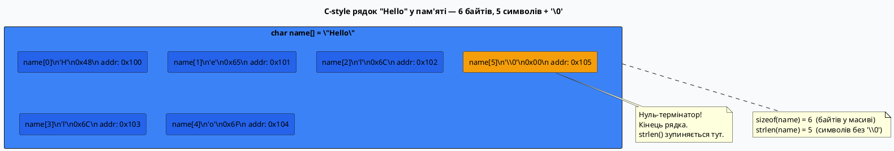
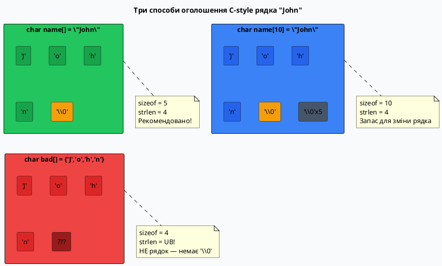
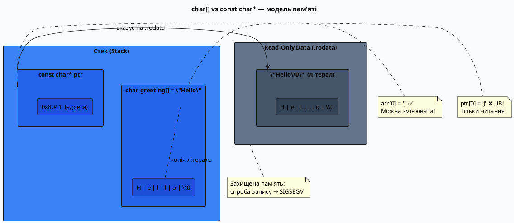

# C-style рядки

## «Що таке рядок насправді?»

Ви вже бачили рядки з першого дня знайомства з C++:

```cpp [CStringHello.cpp]
#include <iostream>

using namespace std;

int main()
{
    cout << "Hello, World!\n";
    return 0;
}
```

Але що насправді являє собою `"Hello, World!"`? Це не примітивний тип, як `int` чи `double`. Це не об'єкт, як `std::string`. У фундаменті мови C, успадкованому C++, рядок — це **масив символів з особливим стоп-сигналом в кінці**. Цей «стоп-сигнал» — нульовий байт `'\0'` (нуль-термінатор), і саме він перетворює звичайний масив `char` на рядок.

Подивіться, що відбувається у пам'яті, коли компілятор обробляє рядковий літерал `"Cat"`:

::memory-view{title="Рядок \"Cat\" у пам'яті" startAddress="0x00A0" :data='[67, 97, 116, 0, 0, 0, 0, 0]' :highlight="[0, 1, 2, 3]"}
::

Чотири байти — `'C'` (67), `'a'` (97), `'t'` (116) та `'\0'` (0) — ось і весь рядок. Три видимих символи, але чотири байти у пам'яті. Нуль-термінатор є **невід'ємною частиною рядка**, хоча ми його ніколи не бачимо при виводі.

Цей документ розкриє механіку C-style рядків від нуля до дна — разом із усіма пастками, що підстерігають необережного програміста.

---

## C-style рядок: визначення та нуль-термінатор

### Формальне визначення

::note
**C-style рядок** (C-string, null-terminated string) — це масив елементів типу `char`, в якому після останнього значущого символу стоїть **нульовий байт** `'\0'` (ASCII-код 0). Функції стандартної бібліотеки використовують цей термінатор як сигнал кінця рядка, оскільки масиви в C/C++ не зберігають свій розмір.
::

Цей підхід є прямим наслідком архітектурного рішення мови C: масив — це лише адреса початку в пам'яті. Без нуль-термінатора функція `strlen` або `std::cout` не знала б, де зупинитися — вона б продовжувала читати байти за межами масиву, поки не натрапила б на щось невизначене.

### Навіщо саме нуль?

Код `'\0'` є єдиним значенням в ASCII, що гарантовано означає «нічого» — це керуючий символ NUL (код 0), який ніколи не є частиною звичайного тексту. Саме тому він є ідеальним сигнальним значенням: якщо ми зустріли байт `0x00` — рядок закінчився.

::plant-uml



::

### `sizeof` vs `strlen` — принципова різниця

Одна з найперших точок плутанини:

```cpp [SizeofVsStrlen.cpp] showLineNumbers
#include <iostream>
#include <cstring>  // для strlen

using namespace std;

int main()
{
    char name[] = "Hello";

    // sizeof — розмір масиву в байтах (compile-time)
    cout << "sizeof(name)  = " << sizeof(name)        << "\n"; // 6

    // strlen — кількість символів до '\0' (runtime, обходить масив)
    cout << "strlen(name)  = " << strlen(name)   << "\n"; // 5

    // Різниця: sizeof рахує '\0', strlen — ні
    cout << "Різниця       = " << sizeof(name) - strlen(name) << "\n"; // 1

    return 0;
}
```

::terminal-preview{title="./SizeofVsStrlen"}
<div class="line"><span class="opacity-40">$</span> <strong class="font-bold">./SizeofVsStrlen</strong></div>
<div class="line">sizeof(name)  = <span class="text-blue-400">6</span></div>
<div class="line">strlen(name)  = <span class="text-blue-400">5</span></div>
<div class="line">Різниця       = <span class="text-green-400 font-bold">1</span></div>
::

::tip
`sizeof` — **оператор часу компіляції**: він повертає розмір типу або об'єкта в байтах, відомий до запуску програми. `strlen` — **функція часу виконання**: вона фізично обходить байти масиву від початку до `'\0'` і рахує їх. Для рядка з N символів `strlen` виконує N+1 читань з пам'яті — це O(N) операція.
::

---

## Оголошення та ініціалізація

### Спосіб 1: масив з рядковим літералом (рекомендований)

```cpp [AutoSizeArray.cpp] showLineNumbers
// Компілятор автоматично визначає розмір масиву і додає '\0'
char name[] = "John";
// Еквівалентно: char name[5] = {'J', 'o', 'h', 'n', '\0'};
// sizeof(name) == 5, strlen(name) == 4
```

Це найбільш компактна та ідіоматична форма оголошення. Компілятор:
1. Підраховує символи у літералі (4 символи)
2. Додає 1 для нуль-термінатора
3. Виділяє масив розміром **5 байтів** на стеку
4. Копіює всі 5 байтів (включно з `'\0'`)

### Спосіб 2: явний розмір масиву

```cpp [FixedSizeArray.cpp] showLineNumbers
char name[10] = "John";
// name[0]='J', name[1]='o', name[2]='h', name[3]='n', name[4]='\0'
// name[5]..name[9] = '\0' (решта байтів — нулі)
// sizeof(name) == 10, strlen(name) == 4
```

При ініціалізації масиву меншим значенням, **решта байтів заповнюється нулями** — це гарантує стандарт C++. Це важливо: масив на 10 байтів, але рядок у ньому займає лише 5 (включно з термінатором).

::caution
Якщо явний розмір масиву **менший** за рядок (включно з `'\0'`) — це помилка компіляції або, у деяких випадках, мовчазне усічення без нуль-термінатора:

```cpp
char name[3] = "John";  // ❌ Помилка: "John" потребує 5 байтів
char name[4] = "John";  // ⚠️  У деяких компіляторах: 'J','o','h','n' БЕЗ '\0'!
```
::

### Спосіб 3: явна посимвольна ініціалізація

```cpp [NullTerminatorRules.cpp] showLineNumbers
// ✅ Правильно: явний '\0' в кінці
char name[] = {'J', 'o', 'h', 'n', '\0'};

// ❌ Неправильно: масив char БЕЗ '\0' — це НЕ рядок!
char notAString[] = {'J', 'o', 'h', 'n'};
// Передача notAString у strlen або cout → невизначена поведінка!
```

Третій спосіб є абсолютно легальним, але вразливим: людина легко забуває додати `'\0'`. Саме тому перший спосіб (з рядковим літералом) — найбезпечніший.

### Візуальне порівняння трьох способів

::plant-uml



::

---

## `char[]` vs `const char*` — принципова різниця

Це одне з найважливіших розмежувань у всій темі C-style рядків.

### `char[]` — масив на стеку (змінюваний)

```cpp [CharArray.cpp] showLineNumbers
#include <iostream>

using namespace std;

int main()
{
    char greeting[] = "Hello";  // Масив: локальна копія на стеку

    greeting[0] = 'J';          // ✅ Дозволено: масив можна змінювати
    cout << greeting << "\n"; // Jello

    return 0;
}
```

Коли ми пишемо `char greeting[] = "Hello"`, компілятор:
1. Розміщує рядковий літерал `"Hello\0"` у read-only сегменті `.rodata`
2. Виділяє масив з 6 байтів **на стеку** (в кадрі функції `main`)
3. **Копіює** вміст літерала у стековий масив

Отже, `greeting` — це повноправна **локальна копія**, з якою можна робити що завгодно.

### `const char*` — вказівник на літерал (незмінний)

```cpp [ConstCharPtr.cpp] showLineNumbers
#include <iostream>

using namespace std;

int main()
{
    const char* ptr = "Hello";  // Вказівник на літерал у .rodata

    // ptr[0] = 'J';  // ❌ Невизначена поведінка (UB)! Crash на більшості систем
    // *(ptr) = 'J';  // ❌ Те саме UB

    ptr = "World";  // ✅ Дозволено: можна переключити вказівник на інший літерал

    cout << ptr << "\n"; // World
    return 0;
}
```

При `const char* ptr = "Hello"` **жодного копіювання не відбувається**. Компілятор розміщує літерал у захищеній read-only пам'яті (`.rodata`), а `ptr` отримує **адресу** цього літерала. Спроба записати через цей вказівник — це звернення до захищеної сторінки пам'яті, що призводить до `SIGSEGV` (segmentation fault) або, у кращому випадку, до тихого UB.

::plant-uml



::

### Ключові відмінності у таблиці

::tabs

::tabs-item{label="char[] масив" icon="i-lucide-layout-list"}

| Властивість | Значення |
|:---|:---|
| **Тип** | Масив `char` на стеку |
| **Пам'ять** | Локальна копія у стековому фреймі |
| **Модифікація** | ✅ Дозволена (елементи масиву) |
| **Переназначення** | ❌ Не можна (`arr = "New"` — помилка компіляції) |
| **sizeof** | Повертає розмір масиву в байтах |
| **Передача у функцію** | Перетворюється на вказівник (array decay) |
| **Використання** | Буфери для читання/запису |

::

::tabs-item{label="const char* вказівник" icon="i-lucide-pointer"}

| Властивість | Значення |
|:---|:---|
| **Тип** | Вказівник на `const char` |
| **Пам'ять** | Адреса у `.rodata` — жодного копіювання |
| **Модифікація** | ❌ UB (звернення до read-only) |
| **Переназначення** | ✅ Дозволено (`ptr = "New"` — змінює адресу) |
| **sizeof** | Повертає розмір **вказівника** (4 або 8 байтів) |
| **Передача у функцію** | Вже є вказівником, передається як є |
| **Використання** | Рядкові константи, строкові літерали |

::

::

::warning
Навіть без `const` перед `char*` спроба змінити літерал є невизначеною поведінкою. Деякі компілятори не заперечують проти `char* p = "Hello";` (з попередженням), але `p[0] = 'J'` — UB. Завжди використовуйте `const char*` для вказівників на літерали.
::

---

## Ввід та вивід C-style рядків

### Вивід через `std::cout`

```cpp [PrintCString.cpp] showLineNumbers
#include <iostream>

using namespace std;

int main()
{
    char name[] = "Alice";
    const char* title = "Dr.";

    cout << title << " " << name << "\n"; // Dr. Alice

    // Вивід окремих символів з ASCII-кодами
    for (int i = 0; name[i] != '\0'; ++i)
    {
        cout << "name[" << i << "] = '"
                  << name[i] << "' (код "
                  << static_cast<int>(name[i]) << ")\n";
    }

    return 0;
}
```

::terminal-preview{title="./PrintCString"}
<div class="line"><span class="opacity-40">$</span> <strong class="font-bold">./OutputDemo</strong></div>
<div class="line"><span class="text-blue-400">Dr. Alice</span></div>
<div class="line">name[0] = '<span class="text-blue-400">A</span>' (код <span class="text-blue-400">65</span>)</div>
<div class="line">name[1] = '<span class="text-blue-400">l</span>' (код <span class="text-blue-400">108</span>)</div>
<div class="line">name[2] = '<span class="text-blue-400">i</span>' (код <span class="text-blue-400">105</span>)</div>
<div class="line">name[3] = '<span class="text-blue-400">c</span>' (код <span class="text-blue-400">99</span>)</div>
<div class="line">name[4] = '<span class="text-blue-400">e</span>' (код <span class="text-blue-400">101</span>)</div>
::

`std::cout` з `char*` виводить символи один за одним до зустрічі з `'\0'`. Це буквально: читати байт, якщо `!= 0` — вивести і перейти до наступного.

### Ввід через `std::cin >>` — небезпечний спосіб

```cpp [ReadCString.cpp] showLineNumbers
#include <iostream>

using namespace std;

int main()
{
    char name[20];

    cout << "Введіть ім'я: ";
    cin >> name;  // ⚠️ Зупиняється на пробілі, переповнення можливе!

    cout << "Привіт, " << name << "!\n";
    return 0;
}
```

Два **критичних** недоліки `std::cin >>` для `char*`:
1. **Зупиняється на першому пробілі** — `"John Doe"` читається лише як `"John"`
2. **Відсутня перевірка меж** — якщо користувач введе 100 символів у буфер розміром 20, відбудеться **buffer overflow** (переповнення буфера)

### Безпечний ввід через `cin.getline`

```cpp [SafeReadLine.cpp] showLineNumbers
#include <iostream>

using namespace std;

int main()
{
    char fullName[50];

    cout << "Введіть повне ім'я: ";
    cin.getline(fullName, sizeof(fullName)); // Безпечно!
    // Аргументи: (буфер, максимальний розмір включно з '\0')
    // Читає до '\n' або до (sizeof - 1) символів — завжди додає '\0'

    cout << "Привіт, " << fullName << "!\n";
    cout << "Довжина: " << strlen(fullName) << " символів\n";

    return 0;
}
```

::terminal-preview{title="./SafeReadLine"}
<div class="line"><span class="opacity-40">$</span> <strong class="font-bold">./SafeInput</strong></div>
<div class="line">Введіть повне ім'я: <span class="text-blue-400">John Doe</span></div>
<div class="line">Привіт, <span class="text-green-400 font-bold">John Doe</span>!</div>
<div class="line">Довжина: <span class="text-blue-400">8</span> символів</div>
::

::tip
`cin.getline(buf, N)` — **завжди** безпечний: він ніколи не запишить більше `N-1` символів (залишаючи місце для `'\0'`). Це єдиний рекомендований спосіб читання C-style рядків з клавіатури.
::
