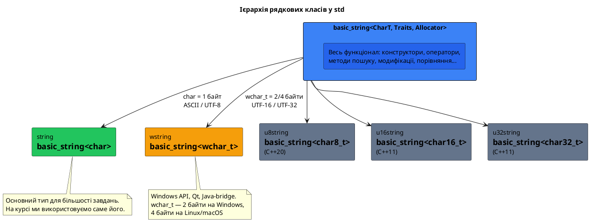
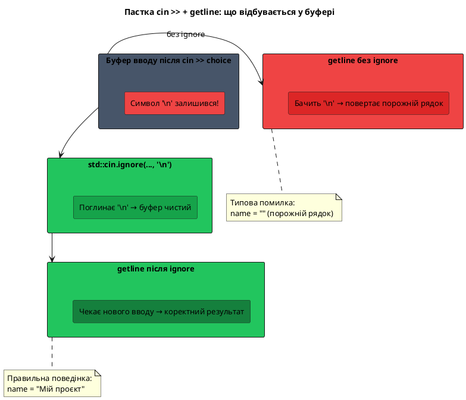
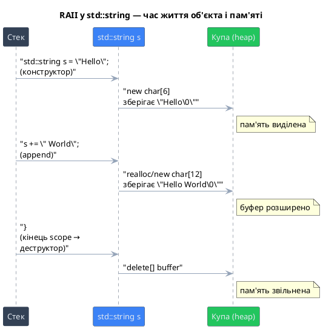

# Вступ до `std::string`

## Знайомий незнайомець

Ви вже зустрічали рядки на самому початку навчання — ще у першій програмі:

```cpp [Hello.cpp] showLineNumbers
#include <iostream>

int main()
{
    std::cout << "Hello, World!" << std::endl;
    return 0;
}
```

Той рядковий літерал у лапках — це C-style рядок, масив символів із нуль-термінатором в кінці. Ви детально познайомилися з ними в [попередній статті](/cpp/c-strings): як вони оголошуються, чому потрібен `'\0'`, які небезпеки несуть.

Але пригадайте всі ті застереження: переповнення буфера, ручне управління пам'яттю, `strcpy` замість `=`, `strcmp` замість `==`. Ось типовий код для роботи з C-style рядком — «скопіювати ім'я та додати привітання»:

::code-group

```cpp [C-style — небезпечно ⚠️]
#include <iostream>
#include <cstring>

int main()
{
    const int BUFFER_SIZE = 50;
    char name[BUFFER_SIZE];

    // Ввід: ризик переповнення без перевірки розміру
    std::cin.getline(name, BUFFER_SIZE);

    // Буфер для результату — розмір треба рахувати вручну
    char greeting[BUFFER_SIZE + 7]; // "Hello, " = 7 символів
    strcpy(greeting, "Hello, ");
    strcat(greeting, name);         // ризик переповнення!

    std::cout << greeting << "\n";
    std::cout << "Length: " << strlen(greeting) << "\n";

    return 0;
}
```

```cpp [std::string — безпечно ✅]
#include <iostream>
#include <string>

int main()
{
    std::string name;
    std::getline(std::cin, name);

    std::string greeting = "Hello, " + name;

    std::cout << greeting << "\n";
    std::cout << "Length: " << greeting.length() << "\n";

    return 0;
}
```

::

Правий варіант коротший, виразніший і безпечніший. Немає ручних буферів, немає `strcpy`, немає ризику переповнення. Клас `std::string` сам керує своєю пам'яттю, самостійно росте за потреби і надає всі звичні оператори (`=`, `+`, `==`, `<`) у їх природному сенсі.

---

## Навіщо потрібен `std::string`

### Проблеми C-style рядків

Перш ніж рухатися далі, корисно зрозуміти, **чому** C-style рядки настільки незручні. Причина корениться в їхній природі: `char[]` — це просто масив байтів. Мова нічого не знає про те, що цей масив «є рядком». Звідси й усі наслідки:

**Ручне управління пам'яттю.** Щоб зберегти рядок `"Hello!"`, потрібно самостійно виділити буфер потрібного розміру, не забути про нуль-термінатор, а після роботи — звільнити пам'ять:

```cpp [ManualMemory.cpp] showLineNumbers
#include <cstring>

int main()
{
    // 7 символів: H-e-l-l-o-!-\0
    char* s = new char[7];
    strcpy(s, "Hello!");

    // ... робота з рядком ...

    delete[] s; // не забути! і саме [], не просто delete
    return 0;
}
```

**Небезпечне копіювання.** Оператор `=` для `char*` копіює **адресу**, а не вміст. Після `char* b = a;` обидва вказівники дивляться на ту саму пам'ять. Зміна через `b` змінить і `a`:

```cpp [ShallowCopy.cpp] showLineNumbers
#include <iostream>
#include <cstring>

int main()
{
    char src[] = "Hello";
    char* a    = src;
    char* b    = a;    // копіюємо адресу, не рядок!

    b[0] = 'J';        // змінюємо через b...
    std::cout << a;    // ...але бачимо зміну і тут: "Jello"
    return 0;
}
```

**Порівняння порівнює адреси.** `if (a == b)` для двох `char*` перевіряє, чи вказують вони на **одну й ту саму адресу** пам'яті, а не чи однаковий їх текст. Це типова помилка початківців:

```cpp [WrongCompare.cpp] showLineNumbers
#include <iostream>
#include <cstring>

int main()
{
    const char* s1 = "hello";
    const char* s2 = "hello";

    // Порівнює АДРЕСИ, а не вміст!
    if (s1 == s2)
        std::cout << "same address\n";

    // Правильно: порівнює вміст
    if (strcmp(s1, s2) == 0)
        std::cout << "same content\n";

    return 0;
}
```

::terminal-preview{title="./WrongCompare"}

<div class="line"><span class="opacity-40">$</span> <strong class="font-bold">./WrongCompare</strong></div>
<div class="line">same address</div>
<div class="line">same content</div>
<div class="line">Execution finished with <span class="text-green-400 font-bold">exit code 0</span>.</div>
::

::note
Результат `same address` у цьому прикладі залежить від компілятора. Більшість компіляторів інтернують рядкові літерали — зберігають ідентичні літерали в одному місці пам'яті. Але це оптимізація, а не гарантія. В загальному випадку `s1 == s2` для двох окремих `char*` повертає `false`, навіть якщо тексти однакові.
::

**Відсутність зручних операторів.** Немає `+` для конкатенації, немає `<` для лексикографічного порівняння (точніше, є, але порівнює адреси). Потрібно пам'ятати цілий арсенал функцій: `strcpy`, `strcat`, `strcmp`, `strncpy`, `strlen`, `strncmp`, `strncat`...

::card-group

::card{title="Проблеми C-style рядків" icon="i-lucide-triangle-alert"}

- Ручне виділення і звільнення пам'яті (`new[]` / `delete[]`)
- Ризик переповнення буфера при `strcpy`, `strcat`
- Оператор `=` копіює адресу, а не вміст
- Оператор `==` порівнює адреси, а не текст
- Немає природного `+` для конкатенації
- Потрібно пам'ятати `strlen`, `strcpy`, `strcmp`, `strcat`...
- Нуль-термінатор завжди «невидимо» присутній і може бути втрачений

::

::card{title="Переваги std::string" icon="i-lucide-check-circle"}

- Пам'ять керується автоматично (RAII)
- Рядок сам зростає при потребі — без переповнень
- Оператор `=` виконує глибоке копіювання
- Оператори `==`, `!=`, `<`, `>`, `<=`, `>=` порівнюють текст
- Оператор `+` та `+=` для конкатенації
- Зручні методи: `.length()`, `.find()`, `.substr()`, `.replace()`...
- Інтеграція з алгоритмами STL через ітератори

::

::

### Рішення: клас з RAII

Ключова ідея `std::string` — це **RAII** (Resource Acquisition Is Initialization): клас сам захоплює ресурс (пам'ять для рядка) при створенні і сам звільняє її при знищенні. Програміст не думає про `new[]` і `delete[]` — це робить деструктор.

Крім того, клас **перевантажує оператори** — `=`, `+`, `==`, `<` тощо — надаючи їм зрозумілу рядкову семантику. Під капотом це ті самі операції з пам'яттю та байтами, але приховані за зручним інтерфейсом.

---

## Клас `std::string`: заголовок та ієрархія

### Підключення заголовка

Для роботи з `std::string` потрібно підключити заголовок `<string>`:

```cpp
#include <string>
```

::note
Заголовок `<iostream>` в деяких реалізаціях неявно включає частину `<string>`, але покладатися на це — погана практика. Завжди підключайте `<string>` явно, коли використовуєте `std::string`.
::

### Шаблон `basic_string`

В стандартній бібліотеці рядковий клас реалізований як шаблон `basic_string<>` — щоб підтримувати рядки з різними типами символів:

```cpp
namespace std
{
    template<
        class CharT,
        class Traits    = std::char_traits<CharT>,
        class Allocator = std::allocator<CharT>
    >
    class basic_string;
}
```

Параметр `CharT` — тип одного символу. `Traits` визначає операції над символами (порівняння, копіювання), `Allocator` — як виділяється пам'ять. Для більшості завдань значення за замовчуванням ідеальні — ви їх не чіпатимете.

На основі `basic_string<>` визначені конкретні типи:

```cpp
namespace std
{
    using string    = basic_string<char>;     // ASCII / UTF-8
    using wstring   = basic_string<wchar_t>;  // UTF-16 (Windows) / UTF-32 (Linux/macOS)
    using u8string  = basic_string<char8_t>;  // UTF-8  (явний тип, C++20)
    using u16string = basic_string<char16_t>; // UTF-16 (C++11)
    using u32string = basic_string<char32_t>; // UTF-32 (C++11)
}
```

::plant-uml



::

### Який тип використовувати

У переважній більшості програм використовується `std::string` — рядок із символів типу `char`. Він зберігає байти, які на практиці є або ASCII (якщо рядок лише з латиниці та цифр), або UTF-8 (якщо рядок містить символи поза ASCII — кирилицю, емодзі, тощо).

`std::wstring` використовується переважно при роботі з Windows API (функції `CreateFileW`, `MessageBoxW` тощо) та деякими GUI-бібліотеками.

::tip
Весь функціонал — методи, оператори, алгоритми — реалізований у базовому шаблоні `basic_string<>` і **однаково** доступний у `std::string`, `std::wstring` та інших. Вивчаєте `std::string` — автоматично знаєте API і для решти.
::

---

## Створення та ініціалізація

### Конструктор за замовчуванням — порожній рядок

Найпростіший спосіб створити рядок — оголосити його без ініціалізатора. Результат — порожній рядок:

```cpp [DefaultConstruct.cpp] showLineNumbers
#include <iostream>
#include <string>

int main()
{
    std::string s; // порожній рядок, length() == 0

    std::cout << "Value:  '" << s << "'\n";
    std::cout << "Length: " << s.length() << "\n";
    std::cout << "Empty:  " << std::boolalpha << s.empty() << "\n";

    return 0;
}
```

::terminal-preview{title="./DefaultConstruct"}

<div class="line"><span class="opacity-40">$</span> <strong class="font-bold">./DefaultConstruct</strong></div>
<div class="line">Value:  <span class="text-blue-400">''</span></div>
<div class="line">Length: <span class="text-blue-400">0</span></div>
<div class="line">Empty:  <span class="text-green-400 font-bold">true</span></div>
<div class="line">Execution finished with <span class="text-green-400 font-bold">exit code 0</span>.</div>
::

### Ініціалізація рядковим літералом

Найчастіший спосіб — передати рядковий літерал або `const char*` у конструктор (або через `=`):

```cpp [InitFromLiteral.cpp] showLineNumbers
#include <iostream>
#include <string>

int main()
{
    std::string s1("Hello, World!"); // конструктор з const char*
    std::string s2 = "Hello, World!"; // те саме — через синтаксис копіювання

    std::cout << s1 << "\n";
    std::cout << s2 << "\n";
    std::cout << (s1 == s2) << "\n"; // true

    return 0;
}
```

::terminal-preview{title="./InitFromLiteral"}

<div class="line"><span class="opacity-40">$</span> <strong class="font-bold">./InitFromLiteral</strong></div>
<div class="line"><span class="text-blue-400">Hello, World!</span></div>
<div class="line"><span class="text-blue-400">Hello, World!</span></div>
<div class="line"><span class="text-green-400 font-bold">true</span></div>
<div class="line">Execution finished with <span class="text-green-400 font-bold">exit code 0</span>.</div>
::

Запис `std::string s2 = "Hello"` виглядає як присвоювання, але насправді це виклик конструктора. Компілятор автоматично конвертує `const char*` у тимчасовий `std::string` і потім (з C++17 — без копіювання через NRVO/RVO) ініціалізує `s2`.

### Конструктор копіювання

Якщо потрібна незалежна копія існуючого рядка — передайте його у конструктор. На відміну від `char*`, тут справжнє **глибоке копіювання**:

```cpp [CopyConstruct.cpp] showLineNumbers
#include <iostream>
#include <string>

int main()
{
    std::string original = "Hello";
    std::string copy(original); // глибока копія

    copy[0] = 'J'; // змінюємо копію

    std::cout << original << "\n"; // Hello — не змінився!
    std::cout << copy     << "\n"; // Jello

    return 0;
}
```

::terminal-preview{title="./CopyConstruct"}

<div class="line"><span class="opacity-40">$</span> <strong class="font-bold">./CopyConstruct</strong></div>
<div class="line"><span class="text-blue-400">Hello</span></div>
<div class="line"><span class="text-blue-400">Jello</span></div>
<div class="line">Execution finished with <span class="text-green-400 font-bold">exit code 0</span>.</div>
::

### Підрядок при конструюванні

Можна відразу взяти частину іншого рядка — вказавши стартову позицію та кількість символів:

```cpp [SubstringConstruct.cpp] showLineNumbers
#include <iostream>
#include <string>

int main()
{
    std::string source = "Hello, World!";

    // від позиції 7, 5 символів
    std::string sub1(source, 7, 5);

    // від позиції 7 до кінця (кількість не вказана)
    std::string sub2(source, 7);

    std::cout << sub1 << "\n"; // World
    std::cout << sub2 << "\n"; // World!

    return 0;
}
```

::terminal-preview{title="./SubstringConstruct"}

<div class="line"><span class="opacity-40">$</span> <strong class="font-bold">./SubstringConstruct</strong></div>
<div class="line"><span class="text-blue-400">World</span></div>
<div class="line"><span class="text-blue-400">World!</span></div>
<div class="line">Execution finished with <span class="text-green-400 font-bold">exit code 0</span>.</div>
::

### Рядок із повторюваного символу

Конструктор `(n, char)` створює рядок із `n` однакових символів:

```cpp [RepeatChar.cpp] showLineNumbers
#include <iostream>
#include <string>

int main()
{
    std::string dashes(20, '-');
    std::string stars(5, '*');

    std::cout << dashes << "\n"; // --------------------
    std::cout << stars  << "\n"; // *****

    return 0;
}
```

::terminal-preview{title="./RepeatChar"}

<div class="line"><span class="opacity-40">$</span> <strong class="font-bold">./RepeatChar</strong></div>
<div class="line"><span class="text-blue-400">--------------------</span></div>
<div class="line"><span class="text-blue-400">*****</span></div>
<div class="line">Execution finished with <span class="text-green-400 font-bold">exit code 0</span>.</div>
::

### Конвертація числа в рядок: `std::to_string`

`std::string` **не має** конструктора для чисел безпосередньо — `std::string s(42)` викличе конструктор «повторення символу» і дасть 42 нуль-байти, що не те, що очікується. Правильний шлях — функція `std::to_string` (C++11):

```cpp [NumberToString.cpp] showLineNumbers
#include <iostream>
#include <string>

int main()
{
    int    count  = 42;
    double price  = 3.14;
    long   big    = 1'000'000L;

    std::string s1 = std::to_string(count);
    std::string s2 = std::to_string(price);
    std::string s3 = std::to_string(big);

    std::cout << s1 << "\n"; // 42
    std::cout << s2 << "\n"; // 3.140000
    std::cout << s3 << "\n"; // 1000000

    // Конкатенація з числами через to_string
    std::string msg = "Знайдено " + s1 + " елементів";
    std::cout << msg << "\n";

    return 0;
}
```

::terminal-preview{title="./NumberToString"}

<div class="line"><span class="opacity-40">$</span> <strong class="font-bold">./NumberToString</strong></div>
<div class="line"><span class="text-blue-400">42</span></div>
<div class="line"><span class="text-blue-400">3.140000</span></div>
<div class="line"><span class="text-blue-400">1000000</span></div>
<div class="line"><span class="text-blue-400">Знайдено 42 елементів</span></div>
<div class="line">Execution finished with <span class="text-green-400 font-bold">exit code 0</span>.</div>
::

::note
`std::to_string` для `double` завжди дає 6 знаків після коми. Для форматування дійсних чисел з довільною точністю використовуйте `std::ostringstream` із маніпулятором `std::setprecision`, або (C++20) `std::format("{:.2f}", price)`.
::

### Конвертація рядка в число

Зворотна операція — стандартні функції з `<string>`, доступні з C++11:

```cpp [StringToNumber.cpp] showLineNumbers
#include <iostream>
#include <string>

int main()
{
    std::string intStr   = "42";
    std::string floatStr = "3.14";
    std::string hexStr   = "FF";

    int    i = std::stoi(intStr);           // string to int
    double d = std::stod(floatStr);         // string to double
    int    h = std::stoi(hexStr, nullptr, 16); // шістнадцяткова основа

    std::cout << i << "\n"; // 42
    std::cout << d << "\n"; // 3.14
    std::cout << h << "\n"; // 255

    return 0;
}
```

::terminal-preview{title="./StringToNumber"}

<div class="line"><span class="opacity-40">$</span> <strong class="font-bold">./StringToNumber</strong></div>
<div class="line"><span class="text-blue-400">42</span></div>
<div class="line"><span class="text-blue-400">3.14</span></div>
<div class="line"><span class="text-blue-400">255</span></div>
<div class="line">Execution finished with <span class="text-green-400 font-bold">exit code 0</span>.</div>
::

::field-group

::field{name="std::stoi(s)" type="int"}
Перетворює рядок на `int`. Другий параметр — покажчик на позицію після числа, третій — основа числення (за замовчуванням 10).
::

::field{name="std::stol(s)" type="long"}
Перетворює рядок на `long`.
::

::field{name="std::stoll(s)" type="long long"}
Перетворює рядок на `long long`.
::

::field{name="std::stof(s)" type="float"}
Перетворює рядок на `float`.
::

::field{name="std::stod(s)" type="double"}
Перетворює рядок на `double`.
::

::field{name="std::stoul(s)" type="unsigned long"}
Перетворює рядок на `unsigned long`. Корисно для шістнадцяткових значень.
::

::

::warning
Функції `std::stoi`, `std::stod` тощо кидають виняток `std::invalid_argument`, якщо рядок не починається з числа, і `std::out_of_range`, якщо значення виходить за межі типу. У продакшн-коді обертайте виклики у `try/catch`.
::

---

## Конвертація між `std::string` та C-style рядком

### Отримати `const char*` з рядка: `.c_str()`

Багато старих API (функції C, системні виклики POSIX) приймають `const char*`. Метод `.c_str()` повертає вказівник на внутрішній буфер рядка — нуль-термінований:

```cpp [CStr.cpp] showLineNumbers
#include <iostream>
#include <string>
#include <cstdio>  // printf

int main()
{
    std::string filename = "data.txt";

    // printf вимагає const char*
    std::printf("Opening: %s\n", filename.c_str());

    // Або для будь-якої C-функції
    const char* raw = filename.c_str();
    std::cout << raw << "\n";

    return 0;
}
```

::terminal-preview{title="./CStr"}

<div class="line"><span class="opacity-40">$</span> <strong class="font-bold">./CStr</strong></div>
<div class="line">Opening: <span class="text-blue-400">data.txt</span></div>
<div class="line"><span class="text-blue-400">data.txt</span></div>
<div class="line">Execution finished with <span class="text-green-400 font-bold">exit code 0</span>.</div>
::

### `.data()` — варіант без гарантії нуль-термінатора (до C++11)

До C++11 метод `.data()` повертав `const char*` **без** нуль-термінатора в кінці. З C++11 поведінка `.data()` і `.c_str()` ідентична. З C++17 також є неконстантне перевантаження `char* data()`, яке дозволяє пряму запис:

```cpp
// C++17: неконстантний доступ до буфера
std::string s = "Hello";
char* p = s.data();
p[0] = 'J'; // безпечно в C++17
```

::warning
Вказівник, отриманий через `.c_str()` або `.data()`, стає **невалідним** після будь-якої операції, що змінює рядок або перевиділяє його буфер: `+=`, `append`, `insert`, `resize`, `push_back` тощо. Ніколи не зберігайте цей вказівник «на потім» — отримуйте його щоразу заново безпосередньо перед використанням.
::

### Конструювання `std::string` з `const char*`

Зворотна операція тривіальна — вже показана вище через конструктор. Але є тонкість із частиною C-style рядка:

```cpp [FromCString.cpp] showLineNumbers
#include <iostream>
#include <string>

int main()
{
    const char* cstr = "Hello, World!";

    // Весь рядок
    std::string s1(cstr);

    // Перші 5 символів
    std::string s2(cstr, 5);

    std::cout << s1 << "\n"; // Hello, World!
    std::cout << s2 << "\n"; // Hello

    return 0;
}
```

::terminal-preview{title="./FromCString"}

<div class="line"><span class="opacity-40">$</span> <strong class="font-bold">./FromCString</strong></div>
<div class="line"><span class="text-blue-400">Hello, World!</span></div>
<div class="line"><span class="text-blue-400">Hello</span></div>
<div class="line">Execution finished with <span class="text-green-400 font-bold">exit code 0</span>.</div>
::

::note
Конструктор `std::string(const char*, size_t n)` копіює рівно `n` байтів — він **не зупиняється** на нуль-байті всередині рядка. Це відрізняється від поведінки конструктора `std::string(const char*)`, де зупинкою є `'\0'`.
::

---

## Ввід та вивід рядків

### Вивід через `std::cout`

Клас `std::string` перевантажує оператор `<<` для `std::ostream` — вивід виглядає так само, як для `int` або `double`:

```cpp [Output.cpp] showLineNumbers
#include <iostream>
#include <string>

int main()
{
    std::string name    = "Олена";
    std::string surname = "Коваль";

    std::cout << name << " " << surname << "\n";
    std::cout << "Довжина: " << name.length() << "\n";

    return 0;
}
```

::terminal-preview{title="./Output"}

<div class="line"><span class="opacity-40">$</span> <strong class="font-bold">./Output</strong></div>
<div class="line"><span class="text-blue-400">Олена Коваль</span></div>
<div class="line"><span class="text-blue-400">Довжина: 10</span></div>
<div class="line">Execution finished with <span class="text-green-400 font-bold">exit code 0</span>.</div>
::

::note
Довжина `"Олена"` — 10 байтів, хоча символів 5. Причина — кирилиця в UTF-8 займає по 2 байти на символ. Метод `.length()` повертає **кількість байтів**, а не символів. Про це детально написано в [статті про Unicode](/cpp/unicode-utf).
::

### Ввід одного «слова» через `std::cin >>`

Оператор `>>` зчитує рядок **до першого пробілу** (або символу-розділювача):

```cpp [InputWord.cpp] showLineNumbers
#include <iostream>
#include <string>

int main()
{
    std::cout << "Введіть ім'я: ";
    std::string name;
    std::cin >> name; // зупиняється на пробілі

    std::cout << "Привіт, " << name << "!\n";
    return 0;
}
```

::terminal-preview{title="./InputWord"}

<div class="line"><span class="opacity-40">$</span> <strong class="font-bold">./InputWord</strong></div>
<div class="line">Введіть ім'я: <span class="text-yellow-400">Іван Петров</span></div>
<div class="line">Привіт, <span class="text-blue-400">Іван</span>!</div>
<div class="line">Execution finished with <span class="text-green-400 font-bold">exit code 0</span>.</div>
::

Якщо користувач ввів `Іван Петров`, `name` отримає лише `"Іван"`. Рядок `" Петров"` залишиться в буфері вводу і буде зчитаний наступним оператором `>>`.

### Ввід цілого рядка через `std::getline`

Щоб зчитати рядок **разом із пробілами**, використовується `std::getline(stream, string)` — зчитує до символу `'\n'` (або до вказаного розділювача):

```cpp [Getline.cpp] showLineNumbers
#include <iostream>
#include <string>

int main()
{
    std::cout << "Введіть повне ім'я: ";
    std::string fullName;
    std::getline(std::cin, fullName);

    std::cout << "Введіть вік: ";
    std::string age;
    std::getline(std::cin, age);

    std::cout << "Ім'я: " << fullName << "\n";
    std::cout << "Вік:  " << age      << "\n";
    return 0;
}
```

::terminal-preview{title="./Getline"}

<div class="line"><span class="opacity-40">$</span> <strong class="font-bold">./Getline</strong></div>
<div class="line">Введіть повне ім'я: <span class="text-yellow-400">Іван Петров</span></div>
<div class="line">Введіть вік: <span class="text-yellow-400">25</span></div>
<div class="line">Ім'я: <span class="text-blue-400">Іван Петров</span></div>
<div class="line">Вік:  <span class="text-blue-400">25</span></div>
<div class="line">Execution finished with <span class="text-green-400 font-bold">exit code 0</span>.</div>
::

### Пастка: `std::cin >>` + `std::getline`

Це одна з найпоширеніших помилок у C++. Що станеться, якщо спочатку зчитати число через `>>`, а потім рядок через `getline`?

```cpp [CinTrap.cpp] showLineNumbers
#include <iostream>
#include <string>

int main()
{
    std::cout << "Оберіть варіант (1 або 2): ";
    int choice;
    std::cin >> choice; // зчитує "2", але '\n' залишається в буфері!

    std::cout << "Введіть назву: ";
    std::string name;
    std::getline(std::cin, name); // отримує '\n' — порожній рядок!

    std::cout << "Вибір: " << choice << "\n";
    std::cout << "Назва: '" << name << "'\n";
    return 0;
}
```

::terminal-preview{title="./CinTrap — ПРОБЛЕМА ⚠️"}

<div class="line"><span class="opacity-40">$</span> <strong class="font-bold">./CinTrap</strong></div>
<div class="line">Оберіть варіант (1 або 2): <span class="text-yellow-400">2</span></div>
<div class="line">Введіть назву: <span class="text-yellow-400">(програма не чекає вводу!)</span></div>
<div class="line">Вибір: <span class="text-blue-400">2</span></div>
<div class="line">Назва: <span class="text-red-400">''</span></div>
<div class="line">Execution finished with <span class="text-green-400 font-bold">exit code 0</span>.</div>
::

**Чому так?** Оператор `>>` зчитує `2`, але символ нового рядка `'\n'` (що натиснула клавіша Enter) **залишається** у вхідному буфері. Коли наступним йде `getline`, він бачить `'\n'` і думає, що введено порожній рядок — і негайно повертається.

**Рішення** — видалити залишковий `'\n'` із буфера за допомогою `std::cin.ignore()`:

```cpp [CinFixed.cpp] showLineNumbers
#include <iostream>
#include <string>
#include <limits> // std::numeric_limits

int main()
{
    std::cout << "Оберіть варіант (1 або 2): ";
    int choice;
    std::cin >> choice;

    // Очищуємо буфер: ігноруємо все до '\n' включно
    std::cin.ignore(std::numeric_limits<std::streamsize>::max(), '\n');

    std::cout << "Введіть назву: ";
    std::string name;
    std::getline(std::cin, name);

    std::cout << "Вибір: " << choice << "\n";
    std::cout << "Назва: '" << name << "'\n";
    return 0;
}
```

::terminal-preview{title="./CinFixed — ВИПРАВЛЕНО ✅"}

<div class="line"><span class="opacity-40">$</span> <strong class="font-bold">./CinFixed</strong></div>
<div class="line">Оберіть варіант (1 або 2): <span class="text-yellow-400">2</span></div>
<div class="line">Введіть назву: <span class="text-yellow-400">Мій проєкт</span></div>
<div class="line">Вибір: <span class="text-blue-400">2</span></div>
<div class="line">Назва: <span class="text-blue-400">'Мій проєкт'</span></div>
<div class="line">Execution finished with <span class="text-green-400 font-bold">exit code 0</span>.</div>
::

::tip
`std::numeric_limits<std::streamsize>::max()` — максимально можливий розмір. Така форма `ignore` гарантовано видалить усе до `'\n'`, навіть якщо перед ним є кілька символів. Це надійніший варіант, ніж довільне число на кшталт `32767`.
::

::plant-uml



::

---

## Конкатенація та довжина

### Оператор `+` і `+=`

`std::string` перевантажує `+` для з'єднання двох рядків і `+=` для додавання до існуючого. Це інтуїтивно і безпечно — клас сам розширить буфер при потребі:

```cpp [Concat.cpp] showLineNumbers
#include <iostream>
#include <string>

int main()
{
    std::string first = "Hello";
    std::string second = " World";

    // Оператор + — новий рядок
    std::string result = first + second + "!";
    std::cout << result << "\n"; // Hello World!

    // Оператор += — додає до існуючого
    first += " there";
    first += '!'; // можна додати і один символ
    std::cout << first << "\n"; // Hello there!

    // Конкатенація з числом через to_string
    int count = 5;
    std::string msg = "Знайдено " + std::to_string(count) + " файлів";
    std::cout << msg << "\n";

    return 0;
}
```

::terminal-preview{title="./Concat"}

<div class="line"><span class="opacity-40">$</span> <strong class="font-bold">./Concat</strong></div>
<div class="line"><span class="text-blue-400">Hello World!</span></div>
<div class="line"><span class="text-blue-400">Hello there!</span></div>
<div class="line"><span class="text-blue-400">Знайдено 5 файлів</span></div>
<div class="line">Execution finished with <span class="text-green-400 font-bold">exit code 0</span>.</div>
::

::caution
Оператор `+` зі **рядковими літералами** не завжди працює без `std::string` поруч. Два літерали не можна з'єднати оператором `+` безпосередньо — це не `std::string`, а `const char[]`:

```cpp
// ПОМИЛКА: обидва операнди — const char[], не std::string
// std::string s = "Hello" + " World"; // помилка компіляції

// ПРАВИЛЬНО: хоча б один операнд — std::string
std::string s = std::string("Hello") + " World";
// або:
std::string s2 = "Hello";
s2 += " World";
```

::

### Довжина і перевірка на порожнечу

Метод `.length()` (синонім `.size()`) повертає кількість **байтів** у рядку, не включаючи нуль-термінатор. `.empty()` перевіряє, чи рядок порожній:

```cpp [Length.cpp] showLineNumbers
#include <iostream>
#include <string>

int main()
{
    std::string ascii    = "Hello";
    std::string cyrillic = "Привіт"; // UTF-8: кожен символ = 2 байти
    std::string empty;

    std::cout << ascii.length()    << "\n"; // 5
    std::cout << cyrillic.length() << "\n"; // 12 (6 символів × 2 байти)
    std::cout << empty.length()    << "\n"; // 0

    std::cout << std::boolalpha;
    std::cout << ascii.empty()    << "\n"; // false
    std::cout << empty.empty()    << "\n"; // true

    return 0;
}
```

::terminal-preview{title="./Length"}

<div class="line"><span class="opacity-40">$</span> <strong class="font-bold">./Length</strong></div>
<div class="line"><span class="text-blue-400">5</span></div>
<div class="line"><span class="text-blue-400">12</span></div>
<div class="line"><span class="text-blue-400">0</span></div>
<div class="line"><span class="text-green-400 font-bold">false</span></div>
<div class="line"><span class="text-green-400 font-bold">true</span></div>
<div class="line">Execution finished with <span class="text-green-400 font-bold">exit code 0</span>.</div>
::

::tip
Для перевірки «рядок порожній» завжди використовуйте `.empty()`, а не `s.length() == 0`. Причина: `.empty()` гарантовано є операцією O(1) і краще виражає намір.
::

### Продуктивність конкатенації у циклі

Оператор `+` кожного разу створює **новий тимчасовий рядок**. У циклі це може призвести до багатьох виділень пам'яті. Правильний підхід — використовувати `+=` або `.append()`:

```cpp [ConcatPerf.cpp] showLineNumbers
#include <iostream>
#include <string>

int main()
{
    // Погано: кожна ітерація — нова копія
    std::string bad;
    for (int i = 0; i < 5; ++i)
        bad = bad + "x"; // bad + "x" → тимчасовий std::string

    // Добре: додає на місці, без зайвих копій
    std::string good;
    good.reserve(5); // підказка: заздалегідь виділити місце для 5 символів
    for (int i = 0; i < 5; ++i)
        good += 'x';  // += для одного символу — найефективніше

    std::cout << bad  << "\n"; // xxxxx
    std::cout << good << "\n"; // xxxxx

    return 0;
}
```

---

## Знищення та час життя: RAII

`std::string` є прикладом **RAII** (Resource Acquisition Is Initialization) — одного з фундаментальних принципів C++. Ресурс (динамічна пам'ять для зберігання символів) захоплюється при конструюванні об'єкта і автоматично звільняється при його знищенні — коли об'єкт виходить за межі своєї [области видимості](/cpp/functions-scope).

```cpp [RAII.cpp] showLineNumbers
#include <iostream>
#include <string>

void processName(const std::string& name)
{
    std::string upper; // конструктор виділяє пам'ять
    for (char c : name)
        upper += static_cast<char>(std::toupper(static_cast<unsigned char>(c)));

    std::cout << upper << "\n";
} // деструктор автоматично звільняє пам'ять upper

int main()
{
    {
        std::string s = "Hello"; // пам'ять виділена
        std::cout << s << "\n";
    } // s виходить зі scope → деструктор → пам'ять звільнена

    processName("world"); // WORLD

    // НЕ ПОТРІБНО: жодного delete, жодного free()
    return 0;
}
```

::terminal-preview{title="./RAII"}

<div class="line"><span class="opacity-40">$</span> <strong class="font-bold">./RAII</strong></div>
<div class="line"><span class="text-blue-400">Hello</span></div>
<div class="line"><span class="text-blue-400">WORLD</span></div>
<div class="line">Execution finished with <span class="text-green-400 font-bold">exit code 0</span>.</div>
::

Порівняйте з C-style аналогом, де все управління пам'яттю лежить на програмісті:

::code-group

```cpp [std::string — RAII ✅]
void process()
{
    std::string s = "Hello";
    // ... робота ...
} // автоматичне звільнення
```

```cpp [char* — вручну ⚠️]
void process()
{
    char* s = new char[6];
    strcpy(s, "Hello");
    // ... робота ...
    delete[] s; // треба пам'ятати!
    // Якщо забути або кинути виняток —
    // витік пам'яті (memory leak)
}
```

::

::plant-uml



::

---

## Практика

### Рівень 1 — Знайомство

Напишіть програму, що:

1. Запитує ім'я та прізвище через `std::getline` (два окремих виклики)
2. Об'єднує їх у повне ім'я через `+`
3. Виводить повне ім'я та його довжину в байтах

```cpp [Task1.cpp] showLineNumbers
#include <iostream>
#include <string>

int main()
{
    std::cout << "Ім'я: ";
    std::string firstName;
    std::getline(std::cin, firstName);

    std::cout << "Прізвище: ";
    std::string lastName;
    std::getline(std::cin, lastName);

    std::string fullName = firstName + " " + lastName;

    std::cout << "Повне ім'я: " << fullName << "\n";
    std::cout << "Довжина:    " << fullName.length() << " байтів\n";

    return 0;
}
```

::terminal-preview{title="./Task1"}

<div class="line"><span class="opacity-40">$</span> <strong class="font-bold">./Task1</strong></div>
<div class="line">Ім'я: <span class="text-yellow-400">Іван</span></div>
<div class="line">Прізвище: <span class="text-yellow-400">Коваленко</span></div>
<div class="line">Повне ім'я: <span class="text-blue-400">Іван Коваленко</span></div>
<div class="line">Довжина:    <span class="text-blue-400">27</span> байтів</div>
<div class="line">Execution finished with <span class="text-green-400 font-bold">exit code 0</span>.</div>
::

### Рівень 2 — Конвертація та змішаний ввід

Напишіть програму, що:

1. Запитує кількість товарів (через `std::cin >>`) та назву кожного (через `getline`)
2. Формує рядок-звіт виду `"Товар 1: Яблука\nТовар 2: Груші\n..."`

Ключовий момент: після `cin >> count` потрібно очистити буфер перед першим `getline`.

```cpp [Task2.cpp] showLineNumbers
#include <iostream>
#include <string>
#include <limits>

int main()
{
    std::cout << "Кількість товарів: ";
    int count;
    std::cin >> count;
    std::cin.ignore(std::numeric_limits<std::streamsize>::max(), '\n');

    std::string report;
    for (int i = 1; i <= count; ++i)
    {
        std::cout << "Назва товару " << i << ": ";
        std::string item;
        std::getline(std::cin, item);
        report += "Товар " + std::to_string(i) + ": " + item + "\n";
    }

    std::cout << "\n--- Звіт ---\n";
    std::cout << report;

    return 0;
}
```

::terminal-preview{title="./Task2"}

<div class="line"><span class="opacity-40">$</span> <strong class="font-bold">./Task2</strong></div>
<div class="line">Кількість товарів: <span class="text-yellow-400">3</span></div>
<div class="line">Назва товару 1: <span class="text-yellow-400">Яблука</span></div>
<div class="line">Назва товару 2: <span class="text-yellow-400">Груші</span></div>
<div class="line">Назва товару 3: <span class="text-yellow-400">Сливи</span></div>
<div class="line"></div>
<div class="line">--- Звіт ---</div>
<div class="line"><span class="text-blue-400">Товар 1: Яблука</span></div>
<div class="line"><span class="text-blue-400">Товар 2: Груші</span></div>
<div class="line"><span class="text-blue-400">Товар 3: Сливи</span></div>
<div class="line">Execution finished with <span class="text-green-400 font-bold">exit code 0</span>.</div>
::

### Рівень 3 — Функція `repeat`

Напишіть функцію `std::string repeat(const std::string& s, int n, const std::string& sep)`, яка повторює рядок `s` рівно `n` разів, розділяючи копії рядком `sep`. При `n <= 0` повертає порожній рядок.

```cpp [Task3.cpp] showLineNumbers
#include <iostream>
#include <string>

std::string repeat(const std::string& s, int n, const std::string& sep = "")
{
    if (n <= 0) return "";

    std::string result;
    result.reserve(s.length() * static_cast<size_t>(n) +
                   sep.length() * static_cast<size_t>(n - 1));

    for (int i = 0; i < n; ++i)
    {
        if (i > 0) result += sep;
        result += s;
    }

    return result;
}

int main()
{
    std::cout << repeat("ha", 3)        << "\n"; // hahaha
    std::cout << repeat("abc", 4, "-")  << "\n"; // abc-abc-abc-abc
    std::cout << repeat("*", 5, " ")    << "\n"; // * * * * *
    std::cout << repeat("hey", 0)       << "\n"; // (порожній)

    return 0;
}
```

::terminal-preview{title="./Task3"}

<div class="line"><span class="opacity-40">$</span> <strong class="font-bold">./Task3</strong></div>
<div class="line"><span class="text-blue-400">hahaha</span></div>
<div class="line"><span class="text-blue-400">abc-abc-abc-abc</span></div>
<div class="line"><span class="text-blue-400">* * * * *</span></div>
<div class="line"></div>
<div class="line">Execution finished with <span class="text-green-400 font-bold">exit code 0</span>.</div>
::

---

## Резюме

У цій статті ми заклали фундамент для роботи з рядками в C++:

::card-group

::card{title="Навіщо std::string" icon="i-lucide-shield-check"}

C-style рядки вимагають ручного управління пам'яттю, не мають безпечних операторів `=` і `==`, ризикують переповненням буфера. `std::string` вирішує всі ці проблеми через RAII та перевантаження операторів.

::

::card{title="Ієрархія класів" icon="i-lucide-layers"}

`std::string` — це `basic_string<char>`. Той самий шаблон лежить в основі `wstring`, `u8string`, `u16string`, `u32string`. Весь функціонал однаковий для всіх.

::

::card{title="Створення рядків" icon="i-lucide-plus-circle"}

6 способів: порожній, з літерала, копіюванням, з підрядка іншого рядка, з повторюваного символу, з числа через `std::to_string`. Зворотне: `std::stoi`, `std::stod` та споріднені функції.

::

::card{title="Конвертація в C-style" icon="i-lucide-arrow-right-left"}

`.c_str()` — нуль-термінований `const char*` для C-API. Вказівник стає невалідним після будь-якої модифікації рядка. З C++17 `.data()` повертає `char*` для запису.

::

::card{title="Ввід та вивід" icon="i-lucide-terminal"}

`cout <<` — вивід. `cin >>` — одне слово. `std::getline(cin, s)` — цілий рядок. Пастка: `cin >> число` залишає `'\n'` у буфері — потрібен `cin.ignore(...)` перед `getline`.

::

::card{title="Конкатенація" icon="i-lucide-link"}

`+` для нового рядка (копія), `+=` для додавання на місці. У циклі завжди `+=` — `+` кожного разу виділяє тимчасовий об'єкт. `.length()` / `.size()` — кількість байтів.

::

::

**Що далі?** У наступній статті ми детально розберемо внутрішню модель пам'яті `std::string` — різницю між `length()` та `capacity()`, механізм подвоєння буфера, Small String Optimization — і навчимося ефективно звертатися до окремих символів через `[]`, `at()`, `front()`, `back()`.
