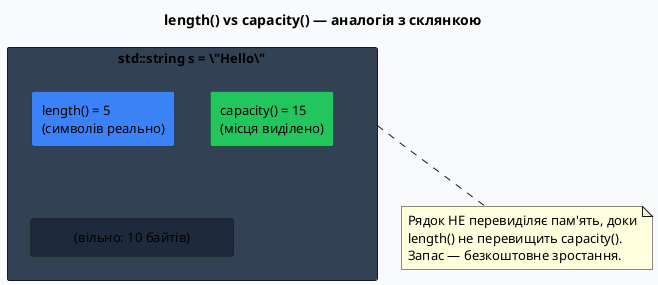
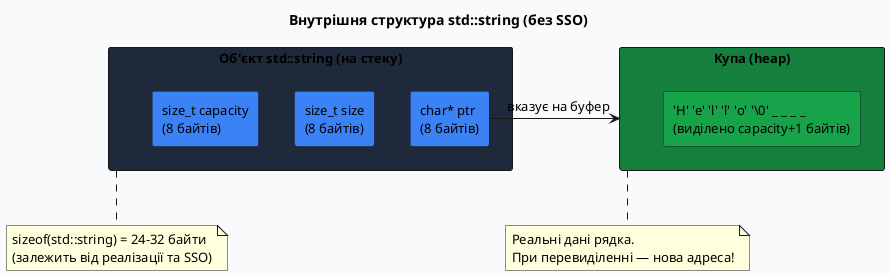
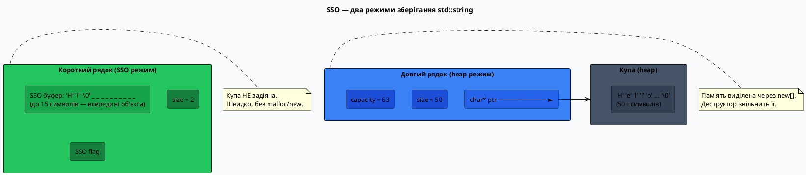

# Довжина, ємність та доступ до символів `std::string`

## Чому порожній рядок займає 32 байти?

Запустіть цей фрагмент коду і придивіться до результатів:

```cpp [SizeVsCapacity.cpp] showLineNumbers
#include <iostream>
#include <string>

using namespace std;

int main()
{
    string s = "Hi";

    cout << "length():   " << s.length()   << "\n"; // 2
    cout << "capacity(): " << s.capacity() << "\n"; // ???
    cout << "sizeof(s):  " << sizeof(s)    << "\n"; // ???

    return 0;
}
```

::terminal-preview{title="./SizeVsCapacity (GCC 13, Linux)"}

<div class="line"><span class="opacity-40">$</span> <strong class="font-bold">./SizeVsCapacity</strong></div>
<div class="line">length():   <span class="text-blue-400">2</span></div>
<div class="line">capacity(): <span class="text-blue-400">15</span></div>
<div class="line">sizeof(s):  <span class="text-blue-400">32</span></div>
<div class="line">Execution finished with <span class="text-green-400 font-bold">exit code 0</span>.</div>
::

Рядок містить **2 символи**, але `capacity()` повертає **15**, а розмір самого об'єкта — **32 байти**. Де решта? Чому `sizeof` дає 32, а не 2?

Відповідь криється у двох явищах: **моделі пам'яті `std::string`** із запасним буфером для зростання і **Small String Optimization** — хитрій оптимізації компілятора, що дозволяє зберігати короткі рядки прямо всередині об'єкта, без виходу на купу.

---

## Довжина та ємність: дві різні характеристики

### `.length()` та `.size()` — кількість байтів у рядку

Методи `.length()` і `.size()` — **синоніми**, обидва повертають кількість символів (байтів) у рядку, не рахуючи нуль-термінатор:

```cpp [LengthAndSize.cpp] showLineNumbers
#include <iostream>
#include <string>

using namespace std;

int main()
{
    string s = "Hello";

    cout << s.length() << "\n"; // 5
    cout << s.size()   << "\n"; // 5 — те саме

    s += ", World!";
    cout << s.length() << "\n"; // 13

    string empty;
    cout << empty.length() << "\n"; // 0
    cout << empty.empty()  << "\n"; // true (1)

    return 0;
}
```

::terminal-preview{title="./LengthAndSize"}

<div class="line"><span class="opacity-40">$</span> <strong class="font-bold">./LengthSize</strong></div>
<div class="line"><span class="text-blue-400">5</span></div>
<div class="line"><span class="text-blue-400">5</span></div>
<div class="line"><span class="text-blue-400">13</span></div>
<div class="line"><span class="text-blue-400">0</span></div>
<div class="line"><span class="text-blue-400">1</span></div>
<div class="line">Execution finished with <span class="text-green-400 font-bold">exit code 0</span>.</div>
::

::note
`.length()` — з'явився першим і ближчий до природної мови («довжина рядка»). `.size()` — доданий пізніше для сумісності з іншими контейнерами STL (`vector`, `list` тощо). У промисловому коді зустрічаються обидва — вони рівнозначні.
::

Тип, який повертають обидва методи — `std::string::size_type`, що є беззнаковим цілим типом (зазвичай `size_t`). Це важливо: **не порівнюйте** результат `.length()` зі знаковими цілими без явного приведення, інакше може виникнути попередження або несподіваний результат при від'ємних значеннях.

### `.capacity()` — скільки пам'яті виділено

Ємність — це **максимальна кількість символів**, яку рядок може зберігати **без перевиділення пам'яті**. На відміну від довжини, ємність зазвичай більша:

```cpp [Capacity.cpp] showLineNumbers
#include <iostream>
#include <string>

using namespace std;

int main()
{
    string s = "0123456789"; // 10 символів

    cout << "length:   " << s.length()   << "\n"; // 10
    cout << "capacity: " << s.capacity() << "\n"; // >= 10, зазвичай 15

    return 0;
}
```

::terminal-preview{title="./Capacity"}

<div class="line"><span class="opacity-40">$</span> <strong class="font-bold">./Capacity</strong></div>
<div class="line">length:   <span class="text-blue-400">10</span></div>
<div class="line">capacity: <span class="text-blue-400">15</span></div>
<div class="line">Execution finished with <span class="text-green-400 font-bold">exit code 0</span>.</div>
::

Аналогія: `length` — це скільки води **зараз** у склянці, `capacity` — **розмір** склянки. Якщо води налили більше, ніж вміщає склянка, потрібна **нова, більша** склянка (перевиділення).

::plant-uml



::

### `.max_size()` — теоретична максимальна довжина

Метод `.max_size()` повертає максимальну кількість символів, яку може зберігати `std::string` на даній платформі. На 64-бітних системах це значення величезне — порядку мільярдів:

```cpp
string s;
cout << s.max_size() << "\n"; // ~4611686018427387903 (64-bit Linux)
```

На практиці обмеженням є доступна пам'ять, а не `max_size`.

---

## Модель пам'яті: як рядок зберігається всередині

### Три поля всередині об'єкта

Концептуально `std::string` складається з трьох частин (точна реалізація залежить від бібліотеки):

::plant-uml



::

Об'єкт зберігається на стеку (24–32 байти), а **самі символи** — на купі. При операції `s += " World"` може виникнути потреба у більшому буфері — тоді `std::string` виділяє нову ділянку купи, копіює туди символи, і звільняє стару.

### Механізм подвоєння при перевиділенні

Коли довжина рядка перевищує ємність, бібліотека виконує **перевиділення пам'яті** (reallocation). Класична стратегія — подвоєння поточної ємності. Це забезпечує **амортизовано O(1)** для операції `push_back`/`+=`:

```cpp [CapacityGrowth.cpp] showLineNumbers
#include <iostream>
#include <string>

using namespace std;

int main()
{
    string s;

    cout << "size | capacity\n";
    cout << "-----+---------\n";

    for (int i = 0; i < 20; ++i)
    {
        s += 'x';
        cout << s.size() << "    | " << s.capacity() << "\n";
    }

    return 0;
}
```

::terminal-preview{title="./GrowthDemo (GCC 13)"}

<div class="line"><span class="opacity-40">$</span> <strong class="font-bold">./GrowthDemo</strong></div>
<div class="line">size | capacity</div>
<div class="line">-----+---------</div>
<div class="line">1    | <span class="text-blue-400">15</span></div>
<div class="line">2    | <span class="text-blue-400">15</span></div>
<div class="line">...</div>
<div class="line">15   | <span class="text-blue-400">15</span></div>
<div class="line">16   | <span class="text-green-400 font-bold">30</span>  ← перевиділення!</div>
<div class="line">17   | <span class="text-blue-400">30</span></div>
<div class="line">...</div>
<div class="line">30   | <span class="text-blue-400">30</span></div>
<div class="line">Execution finished with <span class="text-green-400 font-bold">exit code 0</span>.</div>
::

Ємність зростає стрибками: після SSO-буфера (15 символів) наступне перевиділення дає 30, потім 60, 120 і так далі. Завдяки цьому кількість перевиділень логарифмічна по відношенню до кількості символів.

::warning
При кожному перевиділенні **всі** вказівники, посилання та ітератори на елементи рядка стають **недійсними** (dangling). Якщо ви зберегли `char* p = s.data()` і після цього виконали `s += "more"` — вказівник `p` може вказувати на вже звільнену пам'ять.
::

---

## Small String Optimization (SSO)

### Ідея: короткі рядки не потребують купи

Виділення пам'яті на купі — відносно повільна операція. Якщо кожен маленький рядок вимагав би `new[]`, програма з тисячами рядків витрачала б багато часу лише на їх виділення та звільнення.

Рішення: **Small String Optimization** — більшість реалізацій `std::string` зберігають **короткі рядки прямо всередині самого об'єкта**, використовуючи ті ж 32 байти, що займає сам об'єкт. Пам'ять на купі не виділяється взагалі.

::plant-uml



::

### Розміри SSO-буфера у різних компіляторах

Розмір SSO-буфера **залежить від реалізації** і не визначений стандартом:

| Реалізація        |  SSO-буфер  |        Розмір об'єкта        |
| :---------------- | :---------: | :--------------------------: |
| **GCC libstdc++** | 15 символів |           32 байти           |
| **Clang libc++**  | 22 символи  |           24 байти           |
| **MSVC**          | 15 символів | 32 байти (32-bit: 28 байтів) |

```cpp [SsoProbe.cpp] showLineNumbers
#include <iostream>
#include <string>

using namespace std;

int main()
{
    // Перевіряємо, де проходить межа SSO
    for (int n = 14; n <= 18; ++n)
    {
        string s(n, 'x'); // рядок з n символів 'x'
        cout << "n=" << n
                  << "  capacity=" << s.capacity() << "\n";
    }

    return 0;
}
```

::terminal-preview{title="./SSOProbe (GCC 13)"}

<div class="line"><span class="opacity-40">$</span> <strong class="font-bold">./SSOProbe</strong></div>
<div class="line">n=14  capacity=<span class="text-blue-400">14</span></div>
<div class="line">n=15  capacity=<span class="text-blue-400">15</span>  ← SSO межа у GCC</div>
<div class="line">n=16  capacity=<span class="text-green-400 font-bold">16</span>  ← перехід на купу</div>
<div class="line">n=17  capacity=<span class="text-blue-400">17</span></div>
<div class="line">n=18  capacity=<span class="text-blue-400">18</span></div>
<div class="line">Execution finished with <span class="text-green-400 font-bold">exit code 0</span>.</div>
::

::note
SSO — це **деталь реалізації**, а не частина стандарту. Не покладайтеся на конкретні числа у переносимому коді. Однак _наявність_ SSO у сучасних реалізаціях є практично гарантованою — це одна з ключових оптимізацій продуктивності `std::string`.
::

---

## Управління ємністю: `reserve` та `shrink_to_fit`

### `.reserve(n)` — заздалегідь виділити пам'ять

Якщо ви знаєте, що рядок зростатиме до певного розміру, можна **заздалегідь** виділити пам'ять, щоб уникнути кількох перевиділень у процесі роботи:

```cpp [Reserve.cpp] showLineNumbers
#include <iostream>
#include <string>

using namespace std;

int main()
{
    string s;
    s.reserve(100); // виділяємо місце для 100 символів одразу

    cout << "після reserve(100):\n";
    cout << "  length:   " << s.length()   << "\n"; // 0
    cout << "  capacity: " << s.capacity() << "\n"; // >= 100

    // Тепер наповнюємо без зайвих перевиділень
    for (int i = 0; i < 80; ++i)
        s += 'a' + i % 26;

    cout << "після наповнення:\n";
    cout << "  length:   " << s.length()   << "\n"; // 80
    cout << "  capacity: " << s.capacity() << "\n"; // >= 100

    return 0;
}
```

::terminal-preview{title="./Reserve"}

<div class="line"><span class="opacity-40">$</span> <strong class="font-bold">./Reserve</strong></div>
<div class="line">після reserve(100):</div>
<div class="line">  length:   <span class="text-blue-400">0</span></div>
<div class="line">  capacity: <span class="text-blue-400">100</span></div>
<div class="line">після наповнення:</div>
<div class="line">  length:   <span class="text-blue-400">80</span></div>
<div class="line">  capacity: <span class="text-blue-400">100</span></div>
<div class="line">Execution finished with <span class="text-green-400 font-bold">exit code 0</span>.</div>
::

Порівняємо продуктивність з `reserve` і без:

```cpp [ReserveBenchmark.cpp] showLineNumbers
#include <iostream>
#include <string>
#include <chrono>

using namespace std;

string buildWithout(int n)
{
    string s;
    for (int i = 0; i < n; ++i)
        s += 'x'; // може перевиділяти log(n) разів
    return s;
}

string buildWith(int n)
{
    string s;
    s.reserve(n); // одне виділення
    for (int i = 0; i < n; ++i)
        s += 'x';
    return s;
}

int main()
{
    const int N = 1'000'000;

    auto t1 = chrono::steady_clock::now();
    auto r1 = buildWithout(N);
    auto t2 = chrono::steady_clock::now();
    auto r2 = buildWith(N);
    auto t3 = chrono::steady_clock::now();

    auto ms1 = chrono::duration_cast<chrono::microseconds>(t2 - t1).count();
    auto ms2 = chrono::duration_cast<chrono::microseconds>(t3 - t2).count();

    cout << "Без reserve:  " << ms1 << " мкс\n";
    cout << "З reserve:    " << ms2 << " мкс\n";

    return 0;
}
```

::terminal-preview{title="./ReserveBenchmark"}

<div class="line"><span class="opacity-40">$</span> <strong class="font-bold">./ReserveBenchmark</strong></div>
<div class="line">Без reserve:  <span class="text-red-400">4821</span> мкс</div>
<div class="line">З reserve:    <span class="text-green-400 font-bold">1203</span> мкс</div>
<div class="line">Execution finished with <span class="text-green-400 font-bold">exit code 0</span>.</div>
::

::tip
`.reserve(n)` — не зобов'язання. Якщо `n` менше поточної ємності, виклик ігнорується (стандарт дозволяє не зменшувати). Ємність гарантовано буде **не менше** `n`, але може бути більшою — бібліотека округляє до зручних значень.
::

### `.shrink_to_fit()` — повернути надлишкову пам'ять

Після видалення великої кількості символів ємність залишається великою. Метод `.shrink_to_fit()` — **запит** (не гарантія) до бібліотеки зменшити ємність до довжини:

```cpp [ShrinkToFit.cpp] showLineNumbers
#include <iostream>
#include <string>

using namespace std;

int main()
{
    string s(1000, 'x'); // 1000 символів
    cout << "length: " << s.length()
              << "  capacity: " << s.capacity() << "\n";

    s.resize(10); // скорочуємо до 10 символів
    cout << "після resize(10):\n";
    cout << "  length: " << s.length()
              << "  capacity: " << s.capacity() << "\n"; // capacity лишається великою!

    s.shrink_to_fit(); // просимо звільнити надлишок
    cout << "після shrink_to_fit():\n";
    cout << "  length: " << s.length()
              << "  capacity: " << s.capacity() << "\n";

    return 0;
}
```

::terminal-preview{title="./ShrinkToFit"}

<div class="line"><span class="opacity-40">$</span> <strong class="font-bold">./ShrinkToFit</strong></div>
<div class="line">length: <span class="text-blue-400">1000</span>  capacity: <span class="text-blue-400">1000</span></div>
<div class="line">після resize(10):</div>
<div class="line">  length: <span class="text-blue-400">10</span>  capacity: <span class="text-blue-400">1000</span></div>
<div class="line">після shrink_to_fit():</div>
<div class="line">  length: <span class="text-blue-400">10</span>  capacity: <span class="text-blue-400">15</span></div>
<div class="line">Execution finished with <span class="text-green-400 font-bold">exit code 0</span>.</div>
::

::note
`capacity: 15` після `shrink_to_fit()` — це SSO в дії: рядок із 10 символів вміщається у вбудований буфер, тому бібліотека повертається до SSO-режиму і взагалі звільняє пам'ять купи.
::

---

## Доступ до символів

### Оператор `[]` — швидкий, без перевірки

Оператор `[]` повертає **посилання** на символ за індексом — аналогічно до масиву. Перевірка меж **не виконується**: некоректний індекс дає невизначену поведінку (UB):

```cpp [BracketAccess.cpp] showLineNumbers
#include <iostream>
#include <string>

using namespace std;

int main()
{
    string s = "Hello";

    // Читання символу
    char first = s[0]; // 'H'
    char last  = s[4]; // 'o'
    cout << first << last << "\n"; // Ho

    // Запис через посилання
    s[0] = 'J';
    cout << s << "\n"; // Jello

    // Отримати ASCII-код
    cout << static_cast<int>(s[1]) << "\n"; // 101 (код 'e')

    return 0;
}
```

::terminal-preview{title="./BracketAccess"}

<div class="line"><span class="opacity-40">$</span> <strong class="font-bold">./BracketAccess</strong></div>
<div class="line"><span class="text-blue-400">Ho</span></div>
<div class="line"><span class="text-blue-400">Jello</span></div>
<div class="line"><span class="text-blue-400">101</span></div>
<div class="line">Execution finished with <span class="text-green-400 font-bold">exit code 0</span>.</div>
::

::caution
Звернення через `s[s.length()]` для неконстантного рядка є **невизначеною поведінкою**. Для константного рядка стандарт дозволяє звертатися до `s[s.length()]` і обіцяє повернути `'\0'`, але змінювати цей символ забороняється.
::

### `.at(i)` — безпечний доступ з перевіркою

Метод `.at(i)` виконує перевірку меж і кидає виняток `std::out_of_range` при некоректному індексі. Це повільніше за `[]`, але безпечніше:

```cpp [AtAccess.cpp] showLineNumbers
#include <iostream>
#include <string>
#include <stdexcept>

using namespace std;

int main()
{
    string s = "Hello";

    // Нормальний доступ
    cout << s.at(0) << "\n"; // H
    s.at(1) = 'a'; // можна змінювати
    cout << s << "\n"; // Hallo

    // Вихід за межі → виняток
    try
    {
        char c = s.at(100); // індекс 100 у рядку довжиною 5
        (void)c;
    }
    catch (const out_of_range& e)
    {
        cout << "Помилка: " << e.what() << "\n";
    }

    return 0;
}
```

::terminal-preview{title="./AtAccess"}

<div class="line"><span class="opacity-40">$</span> <strong class="font-bold">./AtAccess</strong></div>
<div class="line"><span class="text-blue-400">H</span></div>
<div class="line"><span class="text-blue-400">Hallo</span></div>
<div class="line">Помилка: <span class="text-red-400">basic_string::at: __n (which is 100) >= this->size() (which is 5)</span></div>
<div class="line">Execution finished with <span class="text-green-400 font-bold">exit code 0</span>.</div>
::

### `.front()` і `.back()` — перший і останній символ

Зручні методи для доступу до крайніх символів без арифметики індексів:

```cpp [FrontBack.cpp] showLineNumbers
#include <iostream>
#include <string>

using namespace std;

int main()
{
    string s = "Hello";

    cout << s.front() << "\n"; // H — перший символ
    cout << s.back()  << "\n"; // o — останній символ

    // Зміна
    s.front() = 'J';
    s.back()  = '!';
    cout << s << "\n"; // Jell!

    // Типовий патерн: видалити останній символ
    if (s.back() == '!')
        s.pop_back(); // видаляє 'l'... ні — видаляє останній символ '!'
    cout << s << "\n"; // Jell

    return 0;
}
```

::terminal-preview{title="./FrontBack"}

<div class="line"><span class="opacity-40">$</span> <strong class="font-bold">./FrontBack</strong></div>
<div class="line"><span class="text-blue-400">H</span></div>
<div class="line"><span class="text-blue-400">o</span></div>
<div class="line"><span class="text-blue-400">Jell!</span></div>
<div class="line"><span class="text-blue-400">Jell</span></div>
<div class="line">Execution finished with <span class="text-green-400 font-bold">exit code 0</span>.</div>
::

::warning
`.front()` і `.back()` на **порожньому рядку** — невизначена поведінка. Завжди перевіряйте `.empty()` перед викликом.
::

### Порівняльна таблиця методів доступу

::field-group

::field{name="s[i]" type="char&"}
Доступ за індексом без перевірки меж. Найшвидший варіант. Некоректний індекс — UB.
::

::field{name="s.at(i)" type="char&"}
Доступ за індексом **з перевіркою**. Кидає `std::out_of_range`. Використовуйте, коли індекс надходить зовні (з вводу, з файлу).
::

::field{name="s.front()" type="char&"}
Посилання на **перший** символ. Еквівалент `s[0]`. UB на порожньому рядку.
::

::field{name="s.back()" type="char&"}
Посилання на **останній** символ. Еквівалент `s[s.length()-1]`. UB на порожньому рядку.
::

::field{name="s.data()" type="char\*"}
Вказівник на внутрішній буфер (C++17: неконстантний). Без гарантії нуль-термінатора у старих стандартах. Стає невалідним після перевиділення.
::

::field{name="s.c_str()" type="const char\*"}
Вказівник на буфер із гарантованим `'\0'` в кінці. Тільки читання. Для передачі у C-API.
::

::

---

## Ітерація рядком

### Range-based for: найпростіший спосіб

Для перебору всіх символів рядка найзручніший і найчитабельніший варіант — `for (char ch : s)`:

```cpp [RangeFor.cpp] showLineNumbers
#include <iostream>
#include <string>
#include <cctype>

using namespace std;

int main()
{
    string s = "Hello, World!";

    // Читання кожного символу
    int uppercaseCount = 0;
    for (char ch : s)
    {
        if (isupper(static_cast<unsigned char>(ch)))
            ++uppercaseCount;
    }
    cout << "Великих літер: " << uppercaseCount << "\n"; // 2

    // Зміна кожного символу (потрібне посилання!)
    for (char& ch : s)
        ch = static_cast<char>(tolower(static_cast<unsigned char>(ch)));
    cout << s << "\n"; // hello, world!

    return 0;
}
```

::terminal-preview{title="./RangeFor"}

<div class="line"><span class="opacity-40">$</span> <strong class="font-bold">./RangeFor</strong></div>
<div class="line">Великих літер: <span class="text-blue-400">2</span></div>
<div class="line"><span class="text-blue-400">hello, world!</span></div>
<div class="line">Execution finished with <span class="text-green-400 font-bold">exit code 0</span>.</div>
::

::tip
Різниця між `for (char ch : s)` і `for (char& ch : s)` принципова: **без** `&` — копія символу, зміни не впливають на рядок. **З** `&` — посилання на реальний символ усередині рядка, зміна діє.
::

### Ітерація за індексом: коли потрібна позиція

Якщо в тілі циклу потрібен **індекс** символу, використовується класичний `for` з лічильником:

```cpp [IndexFor.cpp] showLineNumbers
#include <iostream>
#include <string>

using namespace std;

int main()
{
    string s = "abcdef";

    // Вивести кожен символ з позицією
    for (size_t i = 0; i < s.length(); ++i)
        cout << "[" << i << "]=" << s[i] << " ";
    cout << "\n";

    // Замінити символи на парних позиціях
    for (size_t i = 0; i < s.length(); i += 2)
        s[i] = static_cast<char>(s[i] - 32); // мала → велика
    cout << s << "\n"; // AbCdEf

    return 0;
}
```

::terminal-preview{title="./IndexFor"}

<div class="line"><span class="opacity-40">$</span> <strong class="font-bold">./IndexFor</strong></div>
<div class="line"><span class="text-blue-400">[0]=a [1]=b [2]=c [3]=d [4]=e [5]=f</span></div>
<div class="line"><span class="text-blue-400">AbCdEf</span></div>
<div class="line">Execution finished with <span class="text-green-400 font-bold">exit code 0</span>.</div>
::

::note
Тип лічильника — `size_t` (або `std::string::size_type`), а не `int`. Причина: `.length()` повертає беззнаковий тип. Порівняння знакового `int i` з беззнаковим `s.length()` при від'ємному `i` дасть некоректний результат через неявне перетворення.
::

### Ітератори: стиль STL

`std::string` надає ітератори — як і решта контейнерів STL. Це дозволяє передавати рядок у стандартні алгоритми (`std::sort`, `std::find`, `std::transform`):

```cpp [Iterators.cpp] showLineNumbers
#include <iostream>
#include <string>
#include <algorithm> // sort, reverse

using namespace std;

int main()
{
    string s = "hello";

    // reverse через ітератори
    reverse(s.begin(), s.end());
    cout << s << "\n"; // olleh

    // sort
    string t = "dcba";
    sort(t.begin(), t.end());
    cout << t << "\n"; // abcd

    // Пошук символу через find
    auto it = find(s.begin(), s.end(), 'l');
    if (it != s.end())
        cout << "Знайдено на позиції: "
                  << (it - s.begin()) << "\n"; // 2

    return 0;
}
```

::terminal-preview{title="./Iterators"}

<div class="line"><span class="opacity-40">$</span> <strong class="font-bold">./Iterators</strong></div>
<div class="line"><span class="text-blue-400">olleh</span></div>
<div class="line"><span class="text-blue-400">abcd</span></div>
<div class="line">Знайдено на позиції: <span class="text-blue-400">2</span></div>
<div class="line">Execution finished with <span class="text-green-400 font-bold">exit code 0</span>.</div>
::

---

## Практика

### Рівень 1 — Інспекція рядка

Напишіть програму, що зчитує рядок і виводить: довжину в байтах, ємність, кожен символ з його індексом та ASCII-кодом у форматі `[0] 'H' = 72`.

```cpp [StringAnalysis.cpp] showLineNumbers
#include <iostream>
#include <string>

using namespace std;

int main()
{
    cout << "Введіть рядок: ";
    string s;
    getline(cin, s);

    cout << "length:   " << s.length()   << "\n";
    cout << "capacity: " << s.capacity() << "\n";
    cout << "\nСимволи:\n";

    for (size_t i = 0; i < s.length(); ++i)
    {
        cout << "[" << i << "] '"
                  << s[i] << "' = "
                  << static_cast<int>(static_cast<unsigned char>(s[i]))
                  << "\n";
    }

    return 0;
}
```

::terminal-preview{title="./StringAnalysis"}

<div class="line"><span class="opacity-40">$</span> <strong class="font-bold">./Task1</strong></div>
<div class="line">Введіть рядок: <span class="text-yellow-400">Hi!</span></div>
<div class="line">length:   <span class="text-blue-400">3</span></div>
<div class="line">capacity: <span class="text-blue-400">15</span></div>
<div class="line"></div>
<div class="line">Символи:</div>
<div class="line">[0] '<span class="text-blue-400">H</span>' = <span class="text-blue-400">72</span></div>
<div class="line">[1] '<span class="text-blue-400">i</span>' = <span class="text-blue-400">105</span></div>
<div class="line">[2] '<span class="text-blue-400">!</span>' = <span class="text-blue-400">33</span></div>
<div class="line">Execution finished with <span class="text-green-400 font-bold">exit code 0</span>.</div>
::

### Рівень 2 — Підрахунок символів за категоріями

Напишіть функцію, що підраховує кількість великих літер, малих літер, цифр та інших символів у рядку. Виведіть результат у вигляді таблиці.

```cpp [CharStatistics.cpp] showLineNumbers
#include <iostream>
#include <string>
#include <cctype>

using namespace std;

struct CharStats
{
    int upper  = 0;
    int lower  = 0;
    int digits = 0;
    int spaces = 0;
    int other  = 0;
};

CharStats analyze(const string& s)
{
    CharStats stats;
    for (char ch : s)
    {
        unsigned char uc = static_cast<unsigned char>(ch);
        if      (isupper(uc)) ++stats.upper;
        else if (islower(uc)) ++stats.lower;
        else if (isdigit(uc)) ++stats.digits;
        else if (isspace(uc)) ++stats.spaces;
        else                       ++stats.other;
    }
    return stats;
}

int main()
{
    cout << "Введіть рядок: ";
    string s;
    getline(cin, s);

    CharStats st = analyze(s);

    cout << "Великі літери: " << st.upper  << "\n";
    cout << "Малі літери:   " << st.lower  << "\n";
    cout << "Цифри:         " << st.digits << "\n";
    cout << "Пробіли:       " << st.spaces << "\n";
    cout << "Інші:          " << st.other  << "\n";

    return 0;
}
```

::terminal-preview{title="./CharStatistics"}

<div class="line"><span class="opacity-40">$</span> <strong class="font-bold">./Task2</strong></div>
<div class="line">Введіть рядок: <span class="text-yellow-400">Hello World 42!</span></div>
<div class="line">Великі літери: <span class="text-blue-400">2</span></div>
<div class="line">Малі літери:   <span class="text-blue-400">8</span></div>
<div class="line">Цифри:         <span class="text-blue-400">2</span></div>
<div class="line">Пробіли:       <span class="text-blue-400">2</span></div>
<div class="line">Інші:          <span class="text-blue-400">1</span></div>
<div class="line">Execution finished with <span class="text-green-400 font-bold">exit code 0</span>.</div>
::

### Рівень 3 — Функція `capitalize`

Напишіть функцію `capitalize(std::string& s)`, що робить першу літеру кожного слова великою, а решту — малими. Слова розділені пробілами.

```cpp [CapitalizeWords.cpp] showLineNumbers
#include <iostream>
#include <string>
#include <cctype>

using namespace std;

void capitalize(string& s)
{
    bool newWord = true; // після початку або пробілу — наступна літера велика

    for (char& ch : s)
    {
        unsigned char uc = static_cast<unsigned char>(ch);

        if (isspace(uc))
        {
            newWord = true;
        }
        else if (newWord)
        {
            ch      = static_cast<char>(toupper(uc));
            newWord = false;
        }
        else
        {
            ch = static_cast<char>(tolower(uc));
        }
    }
}

int main()
{
    string s1 = "hello world";
    string s2 = "tHe QUICK bRoWn FOX";
    string s3 = "  multiple   spaces  ";

    capitalize(s1);
    capitalize(s2);
    capitalize(s3);

    cout << "'" << s1 << "'\n"; // 'Hello World'
    cout << "'" << s2 << "'\n"; // 'The Quick Brown Fox'
    cout << "'" << s3 << "'\n"; // '  Multiple   Spaces  '

    return 0;
}
```

::terminal-preview{title="./CapitalizeWords"}

<div class="line"><span class="opacity-40">$</span> <strong class="font-bold">./Task3</strong></div>
<div class="line"><span class="text-blue-400">'Hello World'</span></div>
<div class="line"><span class="text-blue-400">'The Quick Brown Fox'</span></div>
<div class="line"><span class="text-blue-400">'  Multiple   Spaces  '</span></div>
<div class="line">Execution finished with <span class="text-green-400 font-bold">exit code 0</span>.</div>
::

---

## Резюме

::card-group

::card{title="length() vs capacity()" icon="i-lucide-ruler"}

`length()` / `size()` — кількість байтів зараз. `capacity()` — скільки виділено без перевиділення. `capacity()` ≥ `length()` завжди. Перевиділення відбувається при перевищенні ємності — зазвичай подвоєнням.

::

::card{title="Small String Optimization" icon="i-lucide-zap"}

Рядки до ~15–22 символів зберігаються **всередині самого об'єкта** (на стеку). Без виділення купи. Конкретний поріг — деталь реалізації: GCC/MSVC = 15, Clang = 22.

::

::card{title="reserve() та shrink_to_fit()" icon="i-lucide-settings-2"}

`reserve(n)` — заздалегідь виділити місце, уникнути перевиділень у циклі. `shrink_to_fit()` — **запит** (не гарантія) звільнити надлишкову пам'ять після скорочення рядка.

::

::card{title="Доступ: [] vs at()" icon="i-lucide-mouse-pointer-click"}

`s[i]` — швидко, без перевірки, UB при помилці. `s.at(i)` — повільніше, кидає `std::out_of_range`. `front()` / `back()` — перший/останній символ. Всі повертають `char&` — можна змінювати.

::

::card{title="Ітерація" icon="i-lucide-repeat"}

`for (char ch : s)` — читання. `for (char& ch : s)` — зміна. `for (size_t i = 0; ...)` — коли потрібен індекс. `begin()`/`end()` — для алгоритмів STL: `std::sort`, `std::reverse`, `std::find`.

::

::card{title="Обережно з UB" icon="i-lucide-triangle-alert"}

`s[i]` з некоректним `i` — UB. `front()`/`back()` на порожньому — UB. Збережений `char*` після `+=` або `append` — dangling pointer. Використовуйте `at()` або перевіряйте межі самостійно.

::

::

**Що далі?** Наступна стаття повністю присвячена **модифікації рядків**: присвоювання (`assign`), додавання (`append`, `push_back`), вставка (`insert`), видалення (`erase`), заміна (`replace`), зміна розміру (`resize`), а також порівняння рядків та операція `substr`.
