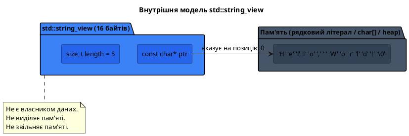
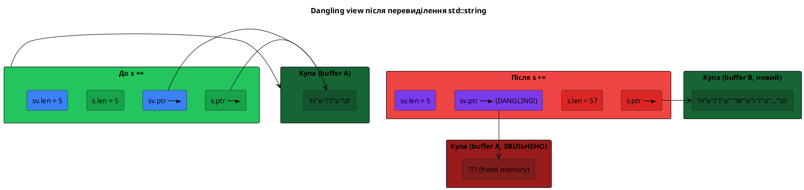

# `std::string_view`: погляд без копіювання

## Один невинний виклик функції — і три копії рядка

Розгляньте цю функцію та подумайте, скільки разів рядок `"Hello, World!"` буде скопійований під час одного виклику:

```cpp [CopyPuzzle.cpp] showLineNumbers
#include <iostream>
#include <string>

bool startsWith(const std::string& s, const std::string& prefix)
{
    return s.substr(0, prefix.length()) == prefix;
}

int main()
{
    std::cout << std::boolalpha;
    std::cout << startsWith("Hello, World!", "Hello") << "\n";

    return 0;
}
```

::terminal-preview{title="./CopyPuzzle"}

<div class="line"><span class="opacity-40">$</span> <strong class="font-bold">./CopyPuzzle</strong></div>
<div class="line"><span class="text-green-400 font-bold">true</span></div>
<div class="line">Execution finished with <span class="text-green-400 font-bold">exit code 0</span>.</div>
::

Відповідь: **щонайменше три копії**.

1. `"Hello, World!"` — C-рядковий літерал. Компілятор неявно конструює з нього тимчасовий об'єкт `std::string` для параметра `s`. Якщо довжина перевищує поріг SSO (~15 символів на GCC) — відбувається виділення пам'яті на купі.
2. `"Hello"` — аналогічно, тимчасовий `std::string` для параметра `prefix`.
3. `s.substr(0, prefix.length())` — ще один тимчасовий `std::string` з перших 5 символів.

Зрештою, три виділення пам'яті, три копіювання, три звільнення — лише щоб перевірити рівність двох незмінних рядків. Це є системною проблемою рядкових API у C++, і `std::string_view`, доданий у C++17, вирішує її елегантно та повністю.

---

## Проблема: незмінні рядки не потребують копіювання

Щоб краще зрозуміти мотивацію, розглянемо розгорнутий приклад із реальної практики:

```cpp [TheCopyCost.cpp] showLineNumbers
#include <iostream>
#include <string>

// Ця функція лише читає рядок — вона нічого не змінює.
// Але через const std::string& вона все одно змушує компілятор
// створювати тимчасовий об'єкт при передачі C-рядка.
bool isEmail(const std::string& s)
{
    size_t at  = s.find('@');
    size_t dot = s.rfind('.');

    return at != std::string::npos
        && dot != std::string::npos
        && at < dot
        && at > 0
        && dot < s.length() - 1;
}

int main()
{
    // Варіант 1: передаємо C-рядковий літерал
    // → компілятор створює тимчасовий std::string("user@example.com")
    // → виділення пам'яті на купі (17 символів > SSO 15)
    std::cout << isEmail("user@example.com") << "\n";  // true

    // Варіант 2: передаємо std::string — копіювання через & не відбувається, але
    // якщо б параметр був не посиланням, а значенням (std::string s) — копія неминуча
    std::string addr = "admin@company.org";
    std::cout << isEmail(addr) << "\n"; // true

    // Варіант 3: у нас є char* з зовнішнього API
    char buf[] = "noreply@mail.ua";
    std::cout << isEmail(buf) << "\n"; // true — ще одна тимчасова копія

    return 0;
}
```

У всіх трьох викликах функція `isEmail` лише **читає** рядок. Жодної модифікації. Але через те, що параметр оголошено як `const std::string&`, передача `const char*` або `char[]` вимагає неявної конструкції тимчасового об'єкта `std::string`. Цього накладного витрату можна повністю уникнути.

---

## Що таке `std::string_view`

`std::string_view` — це клас зі стандартної бібліотеки C++17, що зберігає **пару значень**:

```
{ const char* ptr,  size_t length }
```

Він не виділяє пам'яті. Він не копіює жодного символу. Він лише вказує на вже існуючий масив символів десь в пам'яті та запам'ятовує, скільки з них потрібно враховувати.

::plant-uml



::

Аналогія, яку варто запам'ятати: `std::string_view` — це **вікно** у чужу кімнату. Вікно дозволяє дивитись і описувати те, що бачиш, — але не дозволяє нічого переставити всередині. І якщо кімнату зруйнують, вікно стане оглядовим майданчиком в порожнечу.

---

## Підключення та основні властивості

`std::string_view` знаходиться у заголовку `<string_view>` (C++17):

```cpp [BasicView.cpp] showLineNumbers
#include <iostream>
#include <string>
#include <string_view>

int main()
{
    std::string_view sv1 = "Hello, World!"; // з рядкового літерала
    std::string       s  = "Hello, World!";
    std::string_view sv2 = s;              // з std::string

    // Базові запити — ті самі, що й у std::string
    std::cout << "length:  " << sv1.length()  << "\n"; // 13
    std::cout << "empty:   " << std::boolalpha << sv1.empty() << "\n"; // false
    std::cout << "front:   " << sv1.front()   << "\n"; // H
    std::cout << "back:    " << sv1.back()    << "\n"; // !
    std::cout << "sv1[4]:  " << sv1[4]        << "\n"; // o

    // Розмір самого об'єкта — лише ptr + length
    std::cout << "sizeof(sv1): " << sizeof(sv1) << "\n"; // 16 (на 64-bit)
    std::cout << "sizeof(s):   " << sizeof(s)   << "\n"; // 32

    return 0;
}
```

::terminal-preview{title="./BasicView"}

<div class="line"><span class="opacity-40">$</span> <strong class="font-bold">./BasicView</strong></div>
<div class="line">length:  <span class="text-blue-400">13</span></div>
<div class="line">empty:   <span class="text-blue-400">false</span></div>
<div class="line">front:   <span class="text-blue-400">H</span></div>
<div class="line">back:    <span class="text-blue-400">!</span></div>
<div class="line">sv1[4]:  <span class="text-blue-400">o</span></div>
<div class="line">sizeof(sv1): <span class="text-blue-400">16</span></div>
<div class="line">sizeof(s):   <span class="text-blue-400">32</span></div>
<div class="line">Execution finished with <span class="text-green-400 font-bold">exit code 0</span>.</div>
::

Об'єкт `std::string_view` займає рівно **16 байтів** (на 64-бітній системі): 8 байтів для вказівника та 8 байтів для довжини. Це незалежно від довжини рядка, на який він вказує.

---

## Способи створення `std::string_view`

`std::string_view` можна сконструювати з трьох джерел:

```cpp [Construction.cpp] showLineNumbers
#include <iostream>
#include <string>
#include <string_view>

int main()
{
    // 1. З рядкового літерала (найпоширеніше)
    std::string_view sv1 = "Hello";
    std::cout << sv1 << "\n"; // Hello

    // 2. З об'єкта std::string (неявна конвертація — дозволена)
    std::string str = "World";
    std::string_view sv2 = str;
    std::cout << sv2 << "\n"; // World

    // 3. З char* та явної довжини — для не-нуль-термінованих буферів
    char vowels[] = {'a', 'e', 'i', 'o', 'u'}; // немає '\0'!
    std::string_view sv3(vowels, 5);
    std::cout << sv3 << "\n"; // aeiou

    // 4. З char[] — вся довжина автоматично
    char buf[] = "C++ is great";
    std::string_view sv4 = buf;
    std::cout << sv4 << "\n"; // C++ is great

    // 5. Копіювання string_view — не копіює дані, лише ptr+length
    std::string_view sv5 = sv1; // sv5 вказує на той самий літерал "Hello"
    std::cout << sv5 << "\n"; // Hello

    return 0;
}
```

::terminal-preview{title="./Construction"}

<div class="line"><span class="opacity-40">$</span> <strong class="font-bold">./Construction</strong></div>
<div class="line"><span class="text-blue-400">Hello</span></div>
<div class="line"><span class="text-blue-400">World</span></div>
<div class="line"><span class="text-blue-400">aeiou</span></div>
<div class="line"><span class="text-blue-400">C++ is great</span></div>
<div class="line"><span class="text-blue-400">Hello</span></div>
<div class="line">Execution finished with <span class="text-green-400 font-bold">exit code 0</span>.</div>
::

::note
Варіант 3 — конструктор `string_view(ptr, length)` — є унікальною перевагою перед `std::string`. Він дозволяє «дивитись» на масив символів, що не має нуль-термінатора: бінарні дані, мережеві буфери, результати роботи парсерів.
::

Ключові правила конвертації:

| Напрям                             |  Дозволено   | Як                                            |
| :--------------------------------- | :----------: | :-------------------------------------------- |
| `std::string` → `std::string_view` |  ✅ неявно   | `std::string_view sv = myStr;`                |
| `const char*` → `std::string_view` |  ✅ неявно   | `std::string_view sv = "text";`               |
| `std::string_view` → `std::string` | ⚠️ лише явно | `std::string s(sv);` або `std::string s{sv};` |
| `std::string_view` → `const char*` |  ❌ напряму  | Потрібен `std::string` + `.c_str()`           |

---

## Функціональність read-only: що доступно

`std::string_view` підтримує майже весь «читаючий» API `std::string`. Пошукові методи, доступ за індексом, порівняння — все це є:

```cpp [ReadonlyAPI.cpp] showLineNumbers
#include <iostream>
#include <string_view>

int main()
{
    std::string_view sv = "Hello, World! 12345";

    // Доступ до символів
    std::cout << sv[0]     << "\n"; // H
    std::cout << sv.at(1)  << "\n"; // e
    std::cout << sv.front()<< "\n"; // H
    std::cout << sv.back() << "\n"; // 5

    // Метрики
    std::cout << sv.length() << "\n"; // 19
    std::cout << sv.empty()  << "\n"; // 0 (false)

    // Пошук — ті самі методи, що у std::string
    size_t comma = sv.find(',');
    std::cout << "Кома на позиції: " << comma << "\n"; // 5

    size_t firstDigit = sv.find_first_of("0123456789");
    std::cout << "Перша цифра на: " << firstDigit << "\n"; // 14

    // substr — повертає string_view (не std::string!), без копіювання
    std::string_view word = sv.substr(7, 5);
    std::cout << "Слово: " << word << "\n"; // World

    // Порівняння
    std::cout << std::boolalpha;
    std::cout << (sv == "Hello, World! 12345") << "\n"; // true
    std::cout << sv.starts_with("Hello")       << "\n"; // true (C++20)
    std::cout << sv.ends_with("12345")         << "\n"; // true (C++20)

    return 0;
}
```

::terminal-preview{title="./ReadonlyAPI"}

<div class="line"><span class="opacity-40">$</span> <strong class="font-bold">./ReadonlyAPI</strong></div>
<div class="line"><span class="text-blue-400">H</span></div>
<div class="line"><span class="text-blue-400">e</span></div>
<div class="line"><span class="text-blue-400">H</span></div>
<div class="line"><span class="text-blue-400">5</span></div>
<div class="line"><span class="text-blue-400">19</span></div>
<div class="line"><span class="text-blue-400">false</span></div>
<div class="line">Кома на позиції: <span class="text-blue-400">5</span></div>
<div class="line">Перша цифра на: <span class="text-blue-400">14</span></div>
<div class="line">Слово: <span class="text-blue-400">World</span></div>
<div class="line"><span class="text-green-400 font-bold">true</span></div>
<div class="line"><span class="text-green-400 font-bold">true</span></div>
<div class="line"><span class="text-green-400 font-bold">true</span></div>
<div class="line">Execution finished with <span class="text-green-400 font-bold">exit code 0</span>.</div>
::

Зверніть увагу на **критичну відмінність** у методі `.substr()`:

- `std::string::substr()` → повертає `std::string` (нову **копію**)
- `std::string_view::substr()` → повертає `std::string_view` (нове **вікно**, нуль копій)

Це означає, що ланцюжок операцій з `string_view::substr()` не виділяє пам'яті взагалі:

```cpp
std::string_view sv   = "  Hello, World!  ";
std::string_view word = sv.substr(2, 5); // "Hello" — без копіювання
```

---

## Звуження вікна: `remove_prefix` та `remove_suffix`

`std::string_view` надає два унікальні методи для **переміщення меж** вікна без зміни вихідних даних:

- `.remove_prefix(n)` — пересуває початок вікна на `n` символів вправо;
- `.remove_suffix(n)` — скорочує кінець вікна на `n` символів.

```cpp [RemovePrefixSuffix.cpp] showLineNumbers
#include <iostream>
#include <string_view>

int main()
{
    std::string_view sv = ">>>Hello<<<";
    std::cout << sv << "\n"; // >>>Hello<<<

    sv.remove_prefix(3); // відсунути початок на 3
    std::cout << sv << "\n"; // Hello<<<

    sv.remove_suffix(3); // скоротити кінець на 3
    std::cout << sv << "\n"; // Hello

    // Практичний приклад: trim без виділення пам'яті
    std::string_view padded = "   Hello, World!   ";

    size_t start = padded.find_first_not_of(" \t");
    size_t end   = padded.find_last_not_of(" \t");

    // Замість substr + копіювання — звужуємо вікно
    padded.remove_prefix(start);
    padded.remove_suffix(padded.length() - end - 1);

    std::cout << "'" << padded << "'\n"; // 'Hello, World!'

    return 0;
}
```

::terminal-preview{title="./RemovePrefixSuffix"}

<div class="line"><span class="opacity-40">$</span> <strong class="font-bold">./RemovePrefixSuffix</strong></div>
<div class="line"><span class="text-blue-400">&gt;&gt;&gt;Hello&lt;&lt;&lt;</span></div>
<div class="line"><span class="text-blue-400">Hello&lt;&lt;&lt;</span></div>
<div class="line"><span class="text-blue-400">Hello</span></div>
<div class="line">'<span class="text-blue-400">Hello, World!</span>'</div>
<div class="line">Execution finished with <span class="text-green-400 font-bold">exit code 0</span>.</div>
::

::caution
Операції `remove_prefix` та `remove_suffix` **незворотні**. Після виклику `sv.remove_prefix(3)` повернути перші 3 символи неможливо — вікно назад не відкривається. Якщо потрібна можливість повернення до початкового стану, збережіть копію `string_view` перед звуженням.
::

Порівняємо ефективність двох підходів до `trim`:

::plant-uml

```plantuml
@startuml
skinparam style plain
skinparam defaultFontName "JetBrains Mono"
skinparam backgroundColor transparent
skinparam defaultFontSize 13

title trim: std::string::substr() vs string_view

package "Через std::string::substr()" #ef4444 {
  rectangle "1. find_first_not_of → start" as s1 #dc2626
  rectangle "2. find_last_not_of → end" as s2 #dc2626
  rectangle "3. substr(start, end-start+1)" as s3 #dc2626
  rectangle "4. new char[n] — виділення купи" as s4 #dc2626
  rectangle "5. memcpy — копіювання n символів" as s5 #dc2626
  rectangle "6. Повернення std::string (власник)" as s6 #dc2626
  s1 --> s2 --> s3 --> s4 --> s5 --> s6
}

package "Через string_view" #22c55e {
  rectangle "1. find_first_not_of → start" as v1 #16a34a
  rectangle "2. find_last_not_of → end" as v2 #16a34a
  rectangle "3. remove_prefix + remove_suffix" as v3 #16a34a
  rectangle "4. Повернення string_view (ptr+len)" as v4 #16a34a
  v1 --> v2 --> v3 --> v4
}

note right of s4
  O(n) виділення + копіювання
end note

note right of v3
  O(1) — лише зміна ptr і len
end note

@enduml
```

::

---

## Що `std::string_view` НЕ вміє

`std::string_view` — виключно **читаючий** тип. Будь-яка операція, що вимагає зміни вмісту рядка, відсутня:

| Метод `std::string`                                 | Доступний у `string_view`? |
| :-------------------------------------------------- | :------------------------: |
| `operator[]`, `at()`, `front()`, `back()` (читання) |             ✅             |
| `length()`, `size()`, `empty()`                     |             ✅             |
| `find()`, `rfind()`, `find_first_of()` тощо         |             ✅             |
| `substr()` (повертає `string_view`)                 |             ✅             |
| `starts_with()`, `ends_with()` (C++20)              |             ✅             |
| `remove_prefix()`, `remove_suffix()`                |    ✅ (звужують вікно)     |
| `data()` (вказівник без гарантії `'\0'`)            |             ✅             |
| `append()`, `push_back()`, `+=`                     |     ❌ немодифікований     |
| `insert()`, `erase()`, `replace()`                  |             ❌             |
| `resize()`, `reserve()`, `clear()`                  |             ❌             |
| `c_str()` (з гарантією `'\0'`)                      |             ❌             |
| Конструювання з числа                               |             ❌             |

---

## Відсутність нуль-термінатора: пастка з `.data()`

`std::string_view` зберігає пару `{ptr, length}` і **не гарантує** наявності `'\0'` після останнього символу. Це має критичне значення при взаємодії з C-функціями, що очікують нуль-термінований рядок:

```cpp [DataPitfall.cpp] showLineNumbers
#include <iostream>
#include <string_view>
#include <cstring> // strlen

int main()
{
    // Безпечний випадок: sv вказує на літерал, який має '\0'
    std::string_view sv1 = "Hello";
    std::cout << std::strlen(sv1.data()) << "\n"; // 5 — ОК, бо '\0' є

    // Небезпечний випадок: після remove_prefix '\0' вже не на правильному місці
    std::string_view sv2 = "Hello, World!";
    sv2.remove_prefix(7); // sv2 = "World!" — але data() вказує на 'W', '\0' є в кінці
    std::cout << std::strlen(sv2.data()) << "\n"; // 6 — ОК в цьому конкретному випадку

    // СПРАВДІ небезпечний випадок: substr з масиву без '\0'
    char buf[] = {'H', 'e', 'l', 'l', 'o', 'X', 'Y', 'Z'};
    std::string_view sv3(buf, 5); // "Hello" — length=5, але НЕМАЄ '\0' після 'o'!
    // НЕБЕЗПЕЧНО: strlen читатиме 'X', 'Y', 'Z' і далі, поки не знайде '\0'
    // std::cout << std::strlen(sv3.data()); // UB — читання за межами

    std::cout << "sv3 через cout: " << sv3 << "\n"; // OK — cout знає length
    std::cout << "sv3 length:     " << sv3.length() << "\n"; // 5

    return 0;
}
```

::terminal-preview{title="./DataPitfall"}

<div class="line"><span class="opacity-40">$</span> <strong class="font-bold">./DataPitfall</strong></div>
<div class="line"><span class="text-blue-400">5</span></div>
<div class="line"><span class="text-blue-400">6</span></div>
<div class="line">sv3 через cout: <span class="text-blue-400">Hello</span></div>
<div class="line">sv3 length:     <span class="text-blue-400">5</span></div>
<div class="line">Execution finished with <span class="text-green-400 font-bold">exit code 0</span>.</div>
::

::warning
Ніколи не передавайте `sv.data()` у функції, що очікують нуль-термінований рядок (`strlen`, `printf`, `fopen`, будь-яке C API), якщо ви не **повністю впевнені**, що `'\0'` знаходиться одразу після `sv.length()` символів. Правильна процедура: `std::string tmp(sv); func(tmp.c_str());`
::

---

## Данглінг-вигляд: найнебезпечніша пастка

Найпідступніша помилка при роботі з `std::string_view` — **dangling view**: ситуація, коли вигляд продовжує існувати після знищення рядка, на який він вказував.

### Пастка 1: повернення вигляду з функції

```cpp [Dangling1.cpp] showLineNumbers
#include <iostream>
#include <string>
#include <string_view>

std::string_view dangerousFunction()
{
    std::string local = "I am local"; // об'єкт на стеку функції
    return local; // ПОМИЛКА: повертаємо string_view на локальний std::string,
                  // який буде знищений при виході з функції!
}

int main()
{
    std::string_view sv = dangerousFunction();
    // sv тепер вказує на звільнену пам'ять!
    // Будь-яке звернення до sv — невизначена поведінка (UB)
    std::cout << sv << "\n"; // UB: може вивести сміття, завершитись із помилкою, "спрацювати"
    return 0;
}
```

::terminal-preview{title="./Dangling1 (приклад UB)"}

<div class="line"><span class="opacity-40">$</span> <strong class="font-bold">./Dangling1</strong></div>
<div class="line"><span class="text-red-400">�P@�P@ (сміття — типовий прояв UB)</span></div>
<div class="line"><span class="text-opacity-40">або segmentation fault, або «правильний» вивід — непередбачувано</span></div>
::

### Пастка 2: тимчасовий об'єкт на одному рядку

```cpp [Dangling2.cpp] showLineNumbers
#include <iostream>
#include <string>
#include <string_view>

int main()
{
    // ПОМИЛКА: std::string("temporary") — тимчасовий об'єкт
    // Він буде знищений в кінці цього оператора присвоювання.
    // sv продовжить вказувати на звільнену пам'ять.
    std::string_view sv = std::string("temporary"); // UB!

    std::cout << sv << "\n"; // UB

    return 0;
}
```

### Пастка 3: модифікація рядка-власника

```cpp [Dangling3.cpp] showLineNumbers
#include <iostream>
#include <string>
#include <string_view>

int main()
{
    std::string s = "Hello";
    std::string_view sv = s; // sv вказує на внутрішній буфер s

    std::cout << sv << "\n"; // Hello — ОК

    // Модифікуємо рядок: якщо відбудеться перевиділення пам'яті,
    // sv стане dangling view!
    s += " World, this is a long string that exceeds SSO boundary!";
    // s перевиділила буфер — старий буфер звільнено.
    // sv.data() тепер вказує на звільнену пам'ять.

    std::cout << sv << "\n"; // UB: dangling view
    return 0;
}
```

::plant-uml



::

::caution
Три правила безпечного використання `std::string_view`:

1. **Не зберігайте** `string_view` у полях класів або глобальних змінних — важко гарантувати час життя.
2. **Не повертайте** `string_view` з функцій (крім випадку, коли він посилається на один зі своїх аргументів-`string_view`).
3. **Не створюйте** `string_view` від тимчасового `std::string` — тимчасовий об'єкт живе лише до кінця виразу.
   ::

---

## Перевизначення функцій: виправлення прикладу з початку статті

Повернемося до функції з hook і перепишемо її правильно:

```cpp [FixedStartsWith.cpp] showLineNumbers
#include <iostream>
#include <string>
#include <string_view>

// До C++17: дві потенційні копії при передачі C-рядків
bool startsWithOld(const std::string& s, const std::string& prefix)
{
    return s.substr(0, prefix.length()) == prefix; // + копія substr
}

// C++17: нуль копій, нуль виділень пам'яті
bool startsWith(std::string_view s, std::string_view prefix)
{
    if (prefix.length() > s.length()) return false;
    return s.substr(0, prefix.length()) == prefix; // substr повертає string_view!
}

// Або ще краще — через starts_with (C++20):
bool startsWithModern(std::string_view s, std::string_view prefix)
{
    return s.starts_with(prefix);
}

bool isEmail(std::string_view s)
{
    size_t at  = s.find('@');
    size_t dot = s.rfind('.');
    return at != std::string_view::npos
        && dot != std::string_view::npos
        && at < dot
        && at > 0
        && dot < s.length() - 1;
}

int main()
{
    std::cout << std::boolalpha;

    // Усі виклики — без будь-якого виділення пам'яті:
    std::cout << startsWith("Hello, World!", "Hello")   << "\n"; // true
    std::cout << startsWith("Hello, World!", "Goodbye") << "\n"; // false

    std::string s = "Hello, World!";
    std::cout << startsWith(s, "Hello")                 << "\n"; // true

    std::cout << isEmail("user@example.com")             << "\n"; // true
    std::cout << isEmail("notanemail")                   << "\n"; // false

    return 0;
}
```

::terminal-preview{title="./FixedStartsWith"}

<div class="line"><span class="opacity-40">$</span> <strong class="font-bold">./FixedStartsWith</strong></div>
<div class="line"><span class="text-green-400 font-bold">true</span></div>
<div class="line"><span class="text-red-400">false</span></div>
<div class="line"><span class="text-green-400 font-bold">true</span></div>
<div class="line"><span class="text-green-400 font-bold">true</span></div>
<div class="line"><span class="text-red-400">false</span></div>
<div class="line">Execution finished with <span class="text-green-400 font-bold">exit code 0</span>.</div>
::

Функція з параметром `std::string_view` приймає **без копіювання**:

- `const char*` та рядкові літерали
- `std::string` (через неявну конвертацію)
- інші `std::string_view`
- `char[]` будь-якої довжини

---

## Конвертація `string_view` → `std::string`

Коли потрібно отримати справжній `std::string` з `string_view` (наприклад, щоб зберегти, передати в C-API або модифікувати), конверсія виконується явно:

```cpp [Conversion.cpp] showLineNumbers
#include <iostream>
#include <string>
#include <string_view>
#include <cstring>

void legacyCFunction(const char* str)
{
    std::cout << "C func: " << str << " (len=" << std::strlen(str) << ")\n";
}

int main()
{
    std::string_view sv = "Hello, World!";

    // 1. Явний конструктор std::string
    std::string s1(sv);
    std::cout << s1 << "\n"; // Hello, World!

    // 2. static_cast
    std::string s2 = static_cast<std::string>(sv);
    std::cout << s2 << "\n"; // Hello, World!

    // 3. Передача в C API: спочатку → std::string, потім → c_str()
    std::string tmp(sv);
    legacyCFunction(tmp.c_str()); // безпечно, '\0' гарантований

    // НЕПРАВИЛЬНО: sv.data() не гарантує '\0'
    // legacyCFunction(sv.data()); // потенційно небезпечно

    // 4. Неявна конвертація — ЗАБОРОНЕНА
    // std::string s3 = sv; // помилка компіляції
    // void func(std::string) { ... }
    // func(sv); // помилка компіляції

    return 0;
}
```

::terminal-preview{title="./Conversion"}

<div class="line"><span class="opacity-40">$</span> <strong class="font-bold">./Conversion</strong></div>
<div class="line"><span class="text-blue-400">Hello, World!</span></div>
<div class="line"><span class="text-blue-400">Hello, World!</span></div>
<div class="line">C func: <span class="text-blue-400">Hello, World!</span> (len=<span class="text-blue-400">13</span>)</div>
<div class="line">Execution finished with <span class="text-green-400 font-bold">exit code 0</span>.</div>
::

::tip
Відсутність неявної конвертації `string_view` → `std::string` — це **навмисне рішення** стандарту. Якби конвертація відбувалась неявно, переваги від `string_view` могли б непомітно нівелюватись: компілятор мовчки створював би копії скрізь, де функції чекають `std::string`.
::

---

## Коли що використовувати: таблиця прийняття рішень

::field-group

::field{name="std::string_view" type="параметр функції"}
Функція **лише читає** рядок і не зберігає його після повернення. Приймає C-рядки, std::string та інші string_view без виділення пам'яті. Ідеальна заміна `const std::string&` для read-only функцій.
::

::field{name="const std::string&" type="параметр функції"}
Функція лише читає, але **передає далі** в API, що вимагає `const std::string&` (наприклад, зберігає у контейнер типу `std::map<std::string, ...>`). Або якщо гарантовано передаватимуть лише `std::string`.
::

::field{name="std::string" type="параметр функції (за значенням)"}
Функція **зберігає або модифікує** рядок. Семантика переміщення дозволяє ефективно передавати rvalue: `func(std::move(s))`.
::

::field{name="std::string_view" type="локальна змінна"}
Посилання на підрядок без копіювання (замість `substr()`). Або зменшення «вікна» через `remove_prefix`/`remove_suffix`. Переконайтеся, що оригінал живе довше.
::

::field{name="std::string_view" type="ЗАБОРОНЕНО як поле класу"}
Зберігання `string_view` у полях класу небезпечно: важко гарантувати, що рядок-власник проживе довше за об'єкт класу. Виняток — якщо клас задокументовано як невласницький view і гарантії надаються ззовні.
::

::field{name="std::string_view" type="ЗАБОРОНЕНО як return у більшості випадків"}
Повертати `string_view` безпечно лише якщо він посилається на один із параметрів-`string_view` функції або на константний статичний буфер. Повертати view на локальний `std::string` — завжди UB.
::

::

---

## Практика

### Рівень 1 — Рефакторинг функцій на `string_view`

Перепишіть наступні функції, замінивши `const std::string&` на `std::string_view` де це доречно, та поясніть у коментарях чому.

```cpp [Task1.cpp] showLineNumbers
#include <iostream>
#include <string>
#include <string_view>
#include <cctype>

// Перевірити, чи починається рядок з великої літери
bool startsWithUppercase(std::string_view s)
{
    return !s.empty()
        && std::isupper(static_cast<unsigned char>(s.front()));
}

// Підрахувати кількість голосних у рядку
int countVowels(std::string_view s)
{
    int count = 0;
    for (char ch : s)
    {
        char lower = static_cast<char>(
            std::tolower(static_cast<unsigned char>(ch)));
        if (lower == 'a' || lower == 'e' || lower == 'i'
         || lower == 'o' || lower == 'u')
            ++count;
    }
    return count;
}

// Перевірити, чи є рядок паліндромом
bool isPalindrome(std::string_view s)
{
    if (s.empty()) return true;
    size_t left  = 0;
    size_t right = s.length() - 1;
    while (left < right)
    {
        if (s[left] != s[right]) return false;
        ++left;
        --right;
    }
    return true;
}

int main()
{
    std::cout << std::boolalpha;

    // Усі три функції приймають і C-рядки, і std::string — без копій
    std::cout << startsWithUppercase("Hello")        << "\n"; // true
    std::cout << startsWithUppercase("hello")        << "\n"; // false

    std::string s = "beautiful";
    std::cout << countVowels(s)                      << "\n"; // 5
    std::cout << countVowels("Hello, World!")        << "\n"; // 3

    std::cout << isPalindrome("racecar")             << "\n"; // true
    std::cout << isPalindrome("hello")               << "\n"; // false

    return 0;
}
```

::terminal-preview{title="./Task1"}

<div class="line"><span class="opacity-40">$</span> <strong class="font-bold">./Task1</strong></div>
<div class="line"><span class="text-green-400 font-bold">true</span></div>
<div class="line"><span class="text-red-400">false</span></div>
<div class="line"><span class="text-blue-400">5</span></div>
<div class="line"><span class="text-blue-400">3</span></div>
<div class="line"><span class="text-green-400 font-bold">true</span></div>
<div class="line"><span class="text-red-400">false</span></div>
<div class="line">Execution finished with <span class="text-green-400 font-bold">exit code 0</span>.</div>
::

### Рівень 2 — `trimView` без копіювання

Реалізуйте функцію `trimView(std::string_view sv)`, що повертає `std::string_view` без пробільних символів на початку і в кінці, **не копіюючи жодного символу**. Потім напишіть функцію `splitView`, що розбиває `string_view` за роздільником і повертає вектор `string_view` (усі елементи вказують у вихідний рядок).

```cpp [Task2.cpp] showLineNumbers
#include <iostream>
#include <string_view>
#include <vector>

std::string_view trimView(std::string_view sv)
{
    const std::string_view ws = " \t\r\n";

    size_t start = sv.find_first_not_of(ws);
    if (start == std::string_view::npos)
        return {}; // порожній string_view

    size_t end = sv.find_last_not_of(ws);
    // Звужуємо вікно замість копіювання
    sv.remove_prefix(start);
    sv.remove_suffix(sv.length() - (end - start + 1));
    return sv;
}

std::vector<std::string_view> splitView(std::string_view sv, char delimiter)
{
    std::vector<std::string_view> tokens;
    size_t start = 0;
    size_t pos   = sv.find(delimiter);

    while (pos != std::string_view::npos)
    {
        tokens.push_back(sv.substr(start, pos - start)); // string_view!
        start = pos + 1;
        pos   = sv.find(delimiter, start);
    }
    tokens.push_back(sv.substr(start));

    return tokens;
    // Усі елементи вектора вказують у ОРИГІНАЛЬНИЙ sv — нуль копій
}

int main()
{
    std::string_view padded = "   Hello, World!   ";
    std::string_view trimmed = trimView(padded);
    std::cout << "'" << trimmed << "'\n"; // 'Hello, World!'

    // Усі токени — це вікна в csv, без malloc
    std::string_view csv = "Alice,30,Kyiv,Ukraine";
    auto fields = splitView(csv, ',');

    for (size_t i = 0; i < fields.size(); ++i)
        std::cout << "[" << i << "] = \"" << fields[i] << "\"\n";

    return 0;
}
```

::terminal-preview{title="./Task2"}

<div class="line"><span class="opacity-40">$</span> <strong class="font-bold">./Task2</strong></div>
<div class="line">'<span class="text-blue-400">Hello, World!</span>'</div>
<div class="line">[0] = "<span class="text-blue-400">Alice</span>"</div>
<div class="line">[1] = "<span class="text-blue-400">30</span>"</div>
<div class="line">[2] = "<span class="text-blue-400">Kyiv</span>"</div>
<div class="line">[3] = "<span class="text-blue-400">Ukraine</span>"</div>
<div class="line">Execution finished with <span class="text-green-400 font-bold">exit code 0</span>.</div>
::

### Рівень 3 — Парсер HTTP-запиту

Напишіть функцію `parseRequestLine`, що розбирає перший рядок HTTP-запиту (`"GET /index.html HTTP/1.1"`) на метод, шлях та версію — **виключно через `string_view`** без жодного виділення пам'яті. Результат — структура з трьома полями `string_view`.

```cpp [Task3.cpp] showLineNumbers
#include <iostream>
#include <string_view>
#include <optional>

struct RequestLine
{
    std::string_view method;
    std::string_view path;
    std::string_view version;
};

std::optional<RequestLine> parseRequestLine(std::string_view line)
{
    // Метод: до першого пробілу
    size_t sp1 = line.find(' ');
    if (sp1 == std::string_view::npos) return std::nullopt;

    // Шлях: між першим і другим пробілом
    size_t sp2 = line.find(' ', sp1 + 1);
    if (sp2 == std::string_view::npos) return std::nullopt;

    RequestLine result;
    result.method  = line.substr(0, sp1);
    result.path    = line.substr(sp1 + 1, sp2 - sp1 - 1);
    result.version = line.substr(sp2 + 1);

    return result;
    // Усі три поля — вікна у ОРИГІНАЛЬНИЙ рядок, нуль копій
}

int main()
{
    const std::string_view requests[] = {
        "GET /index.html HTTP/1.1",
        "POST /api/users HTTP/2.0",
        "DELETE /resource/42 HTTP/1.1",
        "INVALID_REQUEST", // некоректний
    };

    for (std::string_view req : requests)
    {
        auto parsed = parseRequestLine(req);
        if (parsed)
        {
            std::cout << "Метод:   " << parsed->method  << "\n";
            std::cout << "Шлях:    " << parsed->path    << "\n";
            std::cout << "Версія:  " << parsed->version << "\n";
            std::cout << "---\n";
        }
        else
        {
            std::cout << "Помилка: некоректний рядок запиту: \""
                      << req << "\"\n---\n";
        }
    }

    return 0;
}
```

::terminal-preview{title="./Task3"}

<div class="line"><span class="opacity-40">$</span> <strong class="font-bold">./Task3</strong></div>
<div class="line">Метод:   <span class="text-blue-400">GET</span></div>
<div class="line">Шлях:    <span class="text-blue-400">/index.html</span></div>
<div class="line">Версія:  <span class="text-blue-400">HTTP/1.1</span></div>
<div class="line text-opacity-40">---</div>
<div class="line">Метод:   <span class="text-blue-400">POST</span></div>
<div class="line">Шлях:    <span class="text-blue-400">/api/users</span></div>
<div class="line">Версія:  <span class="text-blue-400">HTTP/2.0</span></div>
<div class="line text-opacity-40">---</div>
<div class="line">Метод:   <span class="text-blue-400">DELETE</span></div>
<div class="line">Шлях:    <span class="text-blue-400">/resource/42</span></div>
<div class="line">Версія:  <span class="text-blue-400">HTTP/1.1</span></div>
<div class="line text-opacity-40">---</div>
<div class="line">Помилка: некоректний рядок запиту: "<span class="text-red-400">INVALID_REQUEST</span>"</div>
<div class="line text-opacity-40">---</div>
<div class="line">Execution finished with <span class="text-green-400 font-bold">exit code 0</span>.</div>
::

---

## Резюме

::card-group

::card{title="Що таке string_view" icon="i-lucide-eye"}

`std::string_view` (C++17) — це пара `{const char* ptr, size_t length}`. Об'єкт розміром 16 байтів, що не виділяє пам'яті і не копіює символів. Він лише вказує на вже існуючий масив і запам'ятовує, скільки символів враховувати.

::

::card{title="Переваги" icon="i-lucide-zap"}

Приймає `const char*`, `std::string`, `char[]`, інші `string_view` — **без копіювання**. `.substr()` повертає `string_view` (нуль копій). `remove_prefix`/`remove_suffix` звужують вікно за O(1). Ідеальний параметр для read-only функцій.

::

::card{title="Обмеження" icon="i-lucide-lock"}

Повністю read-only: немає `append`, `insert`, `erase`, `replace`, `resize`. Немає `c_str()` з гарантованим `'\0'`. Не конвертується неявно в `std::string`. Для передачі в C API потрібна проміжна `std::string`.

::

::card{title="Dangling view" icon="i-lucide-triangle-alert"}

Найнебезпечніша пастка: якщо рядок-власник знищено або перевиділив буфер — `string_view` стає висячим вказівником. Не зберігайте `string_view` у полях класів. Не повертайте `string_view` на локальний `std::string`. Не прив'язуйте до тимчасових об'єктів.

::

::card{title="Конвертація" icon="i-lucide-arrow-right-left"}

`std::string` → `string_view`: неявна, завжди безпечна. `string_view` → `std::string`: лише явно — `std::string s(sv)`. `string_view` → `const char*`: через проміжний `std::string` + `.c_str()`. Заборона неявної конвертації — захист від непомітного копіювання.

::

::card{title="Правило вибору" icon="i-lucide-git-branch"}

Функція **лише читає** рядок — параметр `std::string_view`. Функція **зберігає** рядок у структурі — `const std::string&` або `std::string`. Функція **модифікує** рядок — `std::string&` або `std::string`. Поле класу, що зберігає рядок — завжди `std::string`.

::

::

---

На цьому завершується модуль «Рядки у C++». За вісім статей ми пройшли шлях від `char` та ASCII-таблиці, через нуль-термінованість C-style рядків та їх небезпеки, до повного освоєння `std::string` — з моделлю пам'яті, SSO, управлінням ємністю, всіма методами модифікації та пошуку — і нарешті до `std::string_view`: інструмента, що дозволяє працювати з рядками в «режимі читання» без жодного копіювання.

**Що далі?** Наступний модуль — **`std::vector`**: динамічний масив загального призначення, що застосовує ті самі принципи управління пам'яттю (capacity, reserve, SSO-аналог для малих об'єктів), але для довільних типів даних, а не лише для символів.
