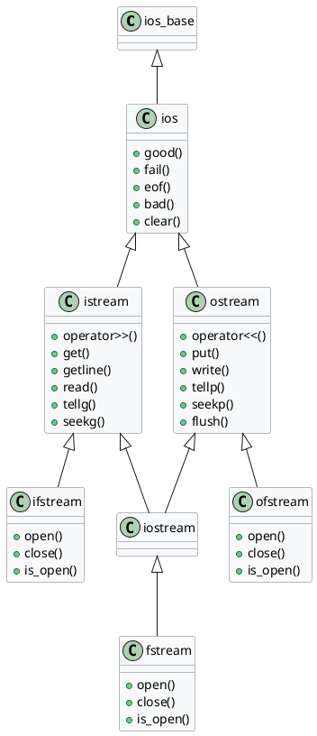
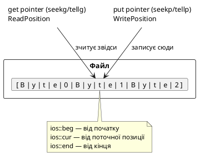

# Робота з файлами: C++-стиль (fstream)

## Від stdio.h до fstream: чому з'явився новий підхід

У попередньому розділі ми детально вивчили класичний C-підхід до роботи з файлами через бібліотеку `<cstdio>`. Він ефективний, переносний і повсюдно підтримуваний — але є суттєвим анахронізмом у контексті сучасного C++.

Найголовніший його недолік: **відсутність типобезпеки**. Функція `fscanf(file, "%d", &value)` приймає довільний вказівник і ніяк не гарантує, що тип змінної відповідає специфікатору формату. Помилка на кшталт `fscanf(file, "%f", &intVar)` — тихий UB (невизначена поведінка), яку компілятор не зловить.

C++ пропонує принципово інший підхід, побудований на тих самих концепціях **потоків** (streams), що й для консольного вводу/виводу. Ви вже знайомі з `std::cin` і `std::cout` — `ifstream`, `ofstream` і `fstream` є їхніми файловими аналогами, з тими самими операторами та методами.

::card-group

::card{title="Переваги C++-підходу" icon="i-lucide-shield-check"}

- **Типобезпека**: оператори `<<` і `>>` завжди знають тип даних під час компіляції
- **RAII**: деструктор автоматично закриває файл при виході зі scope
- **Єдиний синтаксис**: той самий `<<`/`>>`, що і з `cout`/`cin`
- **Обробка помилок**: стан потоку через `good()`, `fail()`, `eof()`, `bad()`

::

::card{title="Коли ще використовують C-стиль" icon="i-lucide-history"}

- Бінарні файли з точним контролем байтів (`fread`/`fwrite`)
- Взаємодія з legacy-кодом або C-бібліотеками
- Максимальна продуктивність (нижчий overhead)
- Платформно-специфічний код (POSIX API)

::

::

---

## Ієрархія класів файлового вводу/виводу

Бібліотека `<fstream>` побудована на вже знайомій вам ієрархії потокових класів:

<!-- IMAGE: Ієрархія класів потоків C++ ios istream ostream iostream ifstream ofstream fstream -->

::plant-uml



::

Ця ієрархія важлива: оскільки `ifstream` успадковує `istream`, він підтримує **всі** методи та оператори, доступні для `std::cin`. Аналогічно `ofstream` підтримує все, що є у `std::cout`. Це робить перехід між файловим і консольним вводом/виводом абсолютно прозорим.

Для підключення бібліотеки:

```cpp [Main.cpp] showLineNumbers
#include <fstream>  // ifstream, ofstream, fstream
// Додатково може знадобитися:
#include <string>   // std::string, std::getline
#include <sstream>  // std::istringstream, std::ostringstream
```

::note
На відміну від C-підходу, тут **не потрібно** підключати `<cstdio>`. Бібліотека `<fstream>` є самодостатньою і включає всю необхідну інфраструктуру потоків.
::

---

## Клас ofstream: запис у файл

Клас `std::ofstream` (**o**utput **f**ile **stream**) призначений для запису даних у файл. Він є точним файловим аналогом `std::cout`.

### Відкриття через конструктор

Найпростіший спосіб відкрити файл — передати його ім'я в конструктор:

```cpp
std::ofstream outputFile("filename.txt");
std::ofstream outputFile("filename.txt", mode);  // з режимом
```

Якщо файл не існує — він буде створений. Якщо існує — за замовчуванням **очищений** (режим `ios::out`).

### Запис через оператор <<

Як і `cout`, `ofstream` підтримує оператор вставки `<<` для запису будь-яких типів даних:

```cpp [WriteBasic.cpp] showLineNumbers
#include <fstream>
#include <string>

int main()
{
    std::ofstream outputFile("notes.txt");

    // Перевірка відкриття (метод is_open або неявне перетворення до bool)
    if (!outputFile)
    {
        return 1;
    }

    // Запис різних типів — синтаксис ідентичний cout
    outputFile << "Ім\'я: " << "Іван Петренко" << "\n";
    outputFile << "Вік: "   << 20               << "\n";
    outputFile << "GPA: "   << 4.75             << "\n";
    outputFile << "Активний: " << true          << "\n";

    // Файл закривається автоматично при виході зі scope (RAII)
    return 0;
}
```

::terminal-preview{title="cat notes.txt"}

<div class="line"><span class="opacity-40">$</span> <strong class="font-bold">g++ -std=c++17 WriteBasic.cpp -o WriteBasic && ./WriteBasic</strong></div>
<div class="line"></div>
<div class="line"><span class="opacity-40">$</span> <strong class="font-bold">cat notes.txt</strong></div>
<div class="line">Ім'я: Іван Петренко</div>
<div class="line">Вік: 20</div>
<div class="line">GPA: 4.75</div>
<div class="line">Активний: 1</div>
::

### Явне закриття: метод close()

Попри RAII, іноді потрібно закрити файл явно — наприклад, щоб одразу після закриття відкрити його для читання:

```cpp [CloseExplicit.cpp] showLineNumbers
#include <fstream>
#include <iostream>

int main()
{
    std::ofstream file("data.txt");

    if (!file.is_open())
    {
        std::cerr << "Помилка відкриття файлу\n";
        return 1;
    }

    file << "Hello, file!\n";

    // Явно закриваємо — RAII все одно спрацює при виході,
    // але явний close() дозволяє перевірити помилку запису
    file.close();

    if (file.fail())
    {
        std::cerr << "Помилка під час закриття файлу\n";
        return 1;
    }

    std::cout << "Файл успішно записано і закрито\n";
    return 0;
}
```

::tip
Метод `is_open()` повертає `true`, якщо потік зараз пов'язаний з відкритим файлом. Неявне перетворення `if (!file)` — скорочена перевірка стану: вона перевіряє **комбінацію** прапорців `failbit` і `badbit`, що ширше за `is_open()`. Рекомендується використовувати `is_open()` після відкриття і `if (!file)` після операцій вводу/виводу.
::

---

## Клас ifstream: читання з файлу

Клас `std::ifstream` (**i**nput **f**ile **stream**) призначений для читання даних із файлу. Він є файловим аналогом `std::cin`.

### Читання через оператор >>

Оператор `>>` читає форматовані дані, ігноруючи пробіли, табуляцію і символи нового рядка — рівно як і `std::cin`:

```cpp [ReadBasic.cpp] showLineNumbers
#include <fstream>
#include <iostream>
#include <string>

int main()
{
    // Спочатку запишемо тестовий файл
    {
        std::ofstream outFile("numbers.txt");
        outFile << "10 25 37 42 58\n";
    }

    // Відкриваємо для читання
    std::ifstream inputFile("numbers.txt");

    if (!inputFile.is_open())
    {
        std::cerr << "Файл не знайдено\n";
        return 1;
    }

    int value;
    int sum   = 0;
    int count = 0;

    // Читання у циклі — оператор >> повертає потік,
    // який неявно перетворюється до bool (false при EOF або помилці)
    while (inputFile >> value)
    {
        std::cout << "Прочитано: " << value << "\n";
        sum   += value;
        count++;
    }

    std::cout << "Сума: " << sum << ", Кількість: " << count << "\n";
    std::cout << "Середнє: " << static_cast<double>(sum) / count << "\n";

    return 0;
}
```

::terminal-preview{title="./ReadBasic"}

<div class="line"><span class="opacity-40">$</span> <strong class="font-bold">./ReadBasic</strong></div>
<div class="line">Прочитано: <span class="text-blue-400">10</span></div>
<div class="line">Прочитано: <span class="text-blue-400">25</span></div>
<div class="line">Прочитано: <span class="text-blue-400">37</span></div>
<div class="line">Прочитано: <span class="text-blue-400">42</span></div>
<div class="line">Прочитано: <span class="text-blue-400">58</span></div>
<div class="line">Сума: <span class="text-blue-400">172</span>, Кількість: <span class="text-blue-400">5</span></div>
<div class="line">Середнє: <span class="text-blue-400">34.4</span></div>
<div class="line">Execution finished with <span class="text-green-400 font-bold">exit code 0</span>.</div>
::

::note
Ключова перевага над `fscanf`: умова `while (inputFile >> value)` є типобезпечною і автоматично зупиняється при EOF або при помилці формату. Нема потреби перевіряти повернене значення вручну.
::

### Читання рядків: std::getline

Оператор `>>` зупиняється на пробілах. Для читання цілих рядків (включно з пробілами) використовується вільна функція `std::getline()`:

```cpp
bool getline(std::istream& input, std::string& line);
bool getline(std::istream& input, std::string& line, char delimiter);
```

Читає символи до `delimiter` (за замовчуванням — `'\n'`), зберігає в `line` **без** символу-роздільника. Повертає посилання на потік (перетворюється на `false` при EOF або помилці).

```cpp [ReadLines.cpp] showLineNumbers
#include <fstream>
#include <iostream>
#include <string>

int main()
{
    // Записуємо тестовий файл з реченнями
    {
        std::ofstream outFile("poem.txt");
        outFile << "Реве та стогне Дніпр широкий,\n";
        outFile << "Сердитий вітер завива,\n";
        outFile << "Додолу верби гне високі,\n";
        outFile << "Горами хвилю підійма.\n";
    }

    std::ifstream inputFile("poem.txt");
    if (!inputFile.is_open())
    {
        std::cerr << "Файл не знайдено\n";
        return 1;
    }

    std::string line;
    int         lineNum = 0;

    while (std::getline(inputFile, line))
    {
        lineNum++;
        std::cout << lineNum << ": " << line << "\n";
    }

    std::cout << "\nВсього рядків: " << lineNum << "\n";

    return 0;
}
```

::terminal-preview{title="./ReadLines"}

<div class="line"><span class="opacity-40">$</span> <strong class="font-bold">./ReadLines</strong></div>
<div class="line">1: Реве та стогне Дніпр широкий,</div>
<div class="line">2: Сердитий вітер завива,</div>
<div class="line">3: Додолу верби гне високі,</div>
<div class="line">4: Горами хвилю підійма.</div>
<div class="line"></div>
<div class="line">Всього рядків: <span class="text-blue-400">4</span></div>
<div class="line">Execution finished with <span class="text-green-400 font-bold">exit code 0</span>.</div>
::

---

## Режими відкриття файлів

На відміну від C-стилю (де режим задається рядком: `"r"`, `"wb"` і т.д.), у C++ режим задається через константи класу `std::ios`. Вони можуть комбінуватися побітовим АБО (`|`).

| Прапорець     | Значення                                                      |
| :------------ | :------------------------------------------------------------ |
| `ios::in`     | Відкрити для читання (за замовчуванням для `ifstream`)        |
| `ios::out`    | Відкрити для запису (за замовчуванням для `ofstream`)         |
| `ios::app`    | Дозапис у кінець файлу                                        |
| `ios::ate`    | Перейти в кінець після відкриття                              |
| `ios::trunc`  | Очистити файл при відкритті (за замовчуванням для `ios::out`) |
| `ios::binary` | Відкрити в бінарному режимі                                   |

### Режим дозапису: ios::app

```cpp [AppendMode.cpp] showLineNumbers
#include <fstream>
#include <iostream>

int main()
{
    // Перший запуск: створюємо файл
    {
        std::ofstream logFile("app.log");
        logFile << "[2024-01-01] Програма запущена\n";
    }

    // Другий запуск: ДОЗАПИСУЄМО, не перезаписуємо
    {
        std::ofstream logFile("app.log", std::ios::app);
        logFile << "[2024-01-01] Операція виконана\n";
        logFile << "[2024-01-01] Програма завершена\n";
    }

    // Читаємо весь файл
    std::ifstream inFile("app.log");
    std::string   line;
    while (std::getline(inFile, line))
    {
        std::cout << line << "\n";
    }

    return 0;
}
```

::terminal-preview{title="./AppendMode"}

<div class="line"><span class="opacity-40">$</span> <strong class="font-bold">./AppendMode</strong></div>
<div class="line">[2024-01-01] Програма запущена</div>
<div class="line">[2024-01-01] Операція виконана</div>
<div class="line">[2024-01-01] Програма завершена</div>
<div class="line">Execution finished with <span class="text-green-400 font-bold">exit code 0</span>.</div>
::

### Режим оновлення: ios::in | ios::out

`fstream` з комбінацією `ios::in | ios::out` відкриває існуючий файл для **одночасного** читання і запису, не очищаючи його:

```cpp [ReadWriteMode.cpp] showLineNumbers
#include <fstream>
#include <iostream>

int main()
{
    // Спочатку створюємо файл
    {
        std::ofstream outFile("data.txt");
        outFile << "Hello World\n";
        outFile << "C++ Files\n";
    }

    // Відкриваємо для читання і запису
    std::fstream rwFile("data.txt", std::ios::in | std::ios::out);

    if (!rwFile.is_open())
    {
        std::cerr << "Файл не знайдено\n";
        return 1;
    }

    // Читаємо перший рядок
    std::string firstLine;
    std::getline(rwFile, firstLine);
    std::cout << "Перший рядок: " << firstLine << "\n";

    // Файловий покажчик тепер після першого рядка
    // Записуємо в поточну позицію
    rwFile << "INSERTED LINE\n";

    // Перечитуємо весь файл
    rwFile.seekg(0);
    std::string line;
    std::cout << "\nВміст після модифікації:\n";
    while (std::getline(rwFile, line))
    {
        std::cout << line << "\n";
    }

    return 0;
}
```

::warning
При перемиканні між читанням і записом у `fstream` **обов\'язково** виконайте `seekg()` або `seekp()`. Стандарт C++ вимагає цього між будь-якими переходами від читання до запису і навпаки — інакше поведінка невизначена.
::

### Таблиця відповідності C-режимів і C++-режимів

| C-рядок | C++ прапорці                            |
| :------ | :-------------------------------------- |
| `"r"`   | `ios::in`                               |
| `"w"`   | `ios::out` або `ios::out \| ios::trunc` |
| `"a"`   | `ios::app`                              |
| `"r+"`  | `ios::in \| ios::out`                   |
| `"w+"`  | `ios::in \| ios::out \| ios::trunc`     |
| `"rb"`  | `ios::in \| ios::binary`                |
| `"wb"`  | `ios::out \| ios::binary`               |
| `"ab"`  | `ios::app \| ios::binary`               |
| `"r+b"` | `ios::in \| ios::out \| ios::binary`    |

---

## Метод open() та повторне відкриття файлів

Окрім конструктора, файл можна відкрити явно через метод `open()`. Це корисно, коли ім\'я файлу невідоме до виконання, або коли потрібно перевикористати об\'єкт потоку:

```cpp [OpenMethod.cpp] showLineNumbers
#include <fstream>
#include <iostream>
#include <string>

int main()
{
    std::ifstream inputFile;  // Поки не відкритий

    std::string fileName;
    std::cout << "Введіть ім'я файлу: ";
    std::cin >> fileName;

    // Відкриваємо пізніше
    inputFile.open(fileName);

    if (!inputFile.is_open())
    {
        std::cerr << "Файл '" << fileName << "' не знайдено\n";
        return 1;
    }

    std::string line;
    int         lineCount = 0;

    while (std::getline(inputFile, line))
    {
        lineCount++;
    }

    inputFile.close();  // Явно закриваємо

    std::cout << "Рядків у файлі: " << lineCount << "\n";

    // Повторно відкриваємо той самий об'єкт
    inputFile.open(fileName);
    if (inputFile.is_open())
    {
        std::cout << "Перший рядок: ";
        std::getline(inputFile, line);
        std::cout << line << "\n";
    }

    return 0;
}
```

::note
Якщо об\'єкт `ifstream` вже був відкритий і ви викликаєте `open()` без попереднього `close()`, операція **завершиться невдачею** і прапорець `failbit` буде встановлено. Завжди закривайте файл перед повторним відкриттям.
::

---

## Стан потоку та обробка помилок

Кожен потік має набір **прапорців стану** (state flags), що відображають його поточний стан:

::field-group
::field{name="goodbit" type="bool good()"}
Потік у нормальному стані. Усі прапорці помилок скинуті. Операції вводу/виводу виконуються коректно.
::
::field{name="eofbit" type="bool eof()"}
Досягнуто кінця файлу. Не є помилкою саме по собі, але подальше читання неможливе.
::
::field{name="failbit" type="bool fail()"}
Операція не вдалася (наприклад, неможливо прочитати ціле число через невірний формат або EOF). Дані залишаються у потоці.
::
::field{name="badbit" type="bool bad()"}
Критична помилка потоку (наприклад, фізична помилка читання з диска). Потік непридатний до використання.
::
::

### Перевірка і скидання стану

```cpp [StreamState.cpp] showLineNumbers
#include <fstream>
#include <iostream>
#include <string>

int main()
{
    // Підготуємо файл з числами і рядком
    {
        std::ofstream outFile("mixed.txt");
        outFile << "42 17 hello 99\n";
    }

    std::ifstream inFile("mixed.txt");
    int           value;

    // Читаємо числа, поки не помилка (рядок "hello" не є int)
    while (inFile >> value)
    {
        std::cout << "Прочитано: " << value << "\n";
    }

    // Аналізуємо стан
    std::cout << "\nСтан після читання:\n";
    std::cout << "  good(): " << inFile.good() << "\n";
    std::cout << "  eof():  " << inFile.eof()  << "\n";
    std::cout << "  fail(): " << inFile.fail() << "\n";
    std::cout << "  bad():  " << inFile.bad()  << "\n";

    // Скидаємо failbit — це дозволяє читати далі
    inFile.clear();

    // Читаємо невдале слово як рядок
    std::string word;
    inFile >> word;
    std::cout << "\nНевдале слово було: \"" << word << "\"\n";

    // Продовжуємо читання числа
    inFile >> value;
    std::cout << "Наступне число: " << value << "\n";

    return 0;
}
```

::terminal-preview{title="./StreamState"}

<div class="line"><span class="opacity-40">$</span> <strong class="font-bold">./StreamState</strong></div>
<div class="line">Прочитано: <span class="text-blue-400">42</span></div>
<div class="line">Прочитано: <span class="text-blue-400">17</span></div>
<div class="line"></div>
<div class="line">Стан після читання:</div>
<div class="line">  good(): <span class="text-red-400">0</span></div>
<div class="line">  eof():  <span class="text-red-400">0</span></div>
<div class="line">  fail(): <span class="text-red-400">1</span></div>
<div class="line">  bad():  <span class="text-red-400">0</span></div>
<div class="line"></div>
<div class="line">Невдале слово було: "<span class="text-yellow-400">hello</span>"</div>
<div class="line">Наступне число: <span class="text-blue-400">99</span></div>
<div class="line">Execution finished with <span class="text-green-400 font-bold">exit code 0</span>.</div>
::

### Виключення з потоків

За бажанням можна налаштувати потік так, щоб він **кидав виключення** замість встановлення прапорців. Це корисно у коді, де виключення вже є основним механізмом обробки помилок:

```cpp [StreamExceptions.cpp] showLineNumbers
#include <fstream>
#include <iostream>
#include <stdexcept>

int main()
{
    std::ifstream inFile;

    // Налаштовуємо: кидати виключення при failbit і badbit
    inFile.exceptions(std::ios::failbit | std::ios::badbit);

    try
    {
        inFile.open("nonexistent.txt");

        // До цього рядка ми не дійдемо — open() кине виключення
        std::string line;
        std::getline(inFile, line);
    }
    catch (const std::ios_base::failure& e)
    {
        std::cerr << "Помилка файлового потоку: " << e.what() << "\n";
    }

    return 0;
}
```

::caution
Виключення з потоків мають деякі нюанси: при досягненні EOF разом із `failbit` (якщо читання не вдалося через кінець файлу) також може бути кинуто виключення. Тому налаштування `exceptions()` рекомендується лише для відкриття файлів, а не для операцій читання в циклі.
::

---

## Робота зі структурами: читання і запис

Розглянемо повноцінний приклад: запис і читання масиву структур-студентів у текстовий файл.

```cpp [StudentIO.cpp] showLineNumbers
#include <fstream>
#include <iostream>
#include <string>
#include <vector>

struct Student
{
    std::string name;
    int         age;
    double      gpa;
};

// Записати вектор студентів у файл (формат CSV)
void saveStudents(const std::string& filename, const std::vector<Student>& students)
{
    std::ofstream outFile(filename);

    if (!outFile.is_open())
    {
        std::cerr << "Помилка: не вдалося відкрити файл для запису\n";
        return;
    }

    for (const auto& s : students)
    {
        // Формат: ім'я,вік,gpa
        outFile << s.name << "," << s.age << "," << s.gpa << "\n";
    }
}

// Зчитати студентів з CSV-файлу
std::vector<Student> loadStudents(const std::string& filename)
{
    std::vector<Student> result;
    std::ifstream        inFile(filename);

    if (!inFile.is_open())
    {
        std::cerr << "Помилка: файл не знайдено\n";
        return result;
    }

    std::string line;
    while (std::getline(inFile, line))
    {
        Student s;

        // Парсимо CSV-рядок через stringstream
        std::istringstream ss(line);
        std::string        ageStr;
        std::string        gpaStr;

        std::getline(ss, s.name,   ',');
        std::getline(ss, ageStr,   ',');
        std::getline(ss, gpaStr,   ',');

        s.age = std::stoi(ageStr);
        s.gpa = std::stod(gpaStr);

        result.push_back(s);
    }

    return result;
}

int main()
{
    std::vector<Student> students = {
        { "Іван Петренко",   20, 4.5 },
        { "Олена Коваль",    19, 4.8 },
        { "Михайло Бойко",   21, 3.9 },
        { "Анна Савченко",   20, 4.2 }
    };

    const std::string fileName = "students.csv";
    saveStudents(fileName, students);
    std::cout << "Збережено " << students.size() << " студентів у " << fileName << "\n";

    auto loaded = loadStudents(fileName);
    std::cout << "\nЗавантажено " << loaded.size() << " студентів:\n";

    for (const auto& s : loaded)
    {
        std::cout << "  " << s.name
                  << " | вік: " << s.age
                  << " | GPA: " << s.gpa << "\n";
    }

    return 0;
}
```

::terminal-preview{title="./StudentIO"}

<div class="line"><span class="opacity-40">$</span> <strong class="font-bold">./StudentIO</strong></div>
<div class="line">Збережено <span class="text-blue-400">4</span> студентів у students.csv</div>
<div class="line"></div>
<div class="line">Завантажено <span class="text-blue-400">4</span> студентів:</div>
<div class="line">  Іван Петренко | вік: <span class="text-blue-400">20</span> | GPA: <span class="text-blue-400">4.5</span></div>
<div class="line">  Олена Коваль | вік: <span class="text-blue-400">19</span> | GPA: <span class="text-blue-400">4.8</span></div>
<div class="line">  Михайло Бойко | вік: <span class="text-blue-400">21</span> | GPA: <span class="text-blue-400">3.9</span></div>
<div class="line">  Анна Савченко | вік: <span class="text-blue-400">20</span> | GPA: <span class="text-blue-400">4.2</span></div>
<div class="line">Execution finished with <span class="text-green-400 font-bold">exit code 0</span>.</div>
::

::note
Зверніть на включення `<sstream>` для `std::istringstream`. Це потоковий клас, що дозволяє читати дані зі звичайного рядка `std::string` так само, як з файлу або консолі. Це надзвичайно зручно для парсингу рядків, розділених роздільниками.
::

---

## Буферизований вивід та очищення буфера

Вивід у C++ є буферизованим за тими самими причинами, що й у C-стилі: побайтовий запис на диск був би катастрофічно повільним. Клас `ofstream` підтримує два способи очищення буфера:

```cpp
// Спосіб 1: Маніпулятор std::flush
file << "важливі дані" << std::flush;

// Спосіб 2: Метод flush()
file.flush();
```

::warning
**Небезпека `std::endl`**: маніпулятор `std::endl` еквівалентний `'\n' << std::flush`. Це означає, що кожен `std::endl` очищає буфер — а це може бути на порядок повільніше, ніж просто `'\n'`. У циклах, що виводять тисячі рядків, надлишковий `std::endl` суттєво знижує продуктивність. Завжди використовуйте `'\n'` для рядків, що не вимагають негайного запису.
::

### Приклад: лог-файл із гарантованим записом

```cpp [SafeLogger.cpp] showLineNumbers
#include <fstream>
#include <iostream>
#include <string>

class Logger
{
public:
    explicit Logger(const std::string& filename)
        : m_file(filename, std::ios::app)
    {
        if (!m_file.is_open())
        {
            throw std::runtime_error("Не вдалося відкрити лог-файл: " + filename);
        }
    }

    void log(const std::string& message)
    {
        m_file << message << "\n";
        m_file.flush();  // Гарантуємо запис на диск
    }

    // Деструктор автоматично закриє файл (RAII)

private:
    std::ofstream m_file;
};

int main()
{
    Logger logger("system.log");

    logger.log("[INFO] Програма запущена");
    logger.log("[INFO] Ініціалізація завершена");
    logger.log("[WARN] Низький рівень пам'яті");
    logger.log("[INFO] Програма завершена");

    std::cout << "Записи успішно збережено у system.log\n";
    return 0;
}
```

::tip
Клас `Logger` у прикладі вище є прикладом **RAII** (Resource Acquisition Is Initialization) — ідіоми, що є основою сучасного C++. Ресурс (файл) захоплюється в конструкторі і автоматично звільняється в деструкторі. Навіть якщо виникне виключення, деструктор гарантовано виконається і файл буде коректно закрито.
::

---

## Позиціонування у файлі: seekg, seekp, tellg, tellp

Клас `fstream` підтримує **довільний доступ** (random access) до файлу. На відміну від C-стилю (де є один покажчик позиції), у C++ для читання і запису є **окремі** покажчики:

- **`seekg` / `tellg`** — покажчик **читання** (від _get_)
- **`seekp` / `tellp`** — покажчик **запису** (від _put_)

Синтаксис аналогічний `fseek`/`ftell`:

```cpp
// Встановити покажчик
stream.seekg(offset, direction);   // для читання
stream.seekp(offset, direction);   // для запису

// Отримати поточну позицію
std::streampos posRead  = stream.tellg();
std::streampos posWrite = stream.tellp();
```

Напрямки: `std::ios::beg`, `std::ios::cur`, `std::ios::end`.

<!-- IMAGE: Схема роботи seekg seekp при одночасному читанні і записі у fstream -->

::plant-uml



::

### Визначення розміру файлу

```cpp [FileSize.cpp] showLineNumbers
#include <fstream>
#include <iostream>

std::streamsize getFileSize(const std::string& filename)
{
    std::ifstream file(filename, std::ios::binary | std::ios::ate);

    if (!file.is_open())
    {
        return -1;
    }

    // ios::ate вже перемістив покажчик у кінець
    // tellg() повертає поточну позицію = розмір файлу
    return file.tellg();
}

int main()
{
    std::streamsize size = getFileSize("students.csv");

    if (size == -1)
    {
        std::cerr << "Файл не знайдено\n";
        return 1;
    }

    std::cout << "Розмір students.csv: " << size << " байтів\n";
    return 0;
}
```

::terminal-preview{title="./FileSize"}

<div class="line"><span class="opacity-40">$</span> <strong class="font-bold">./FileSize</strong></div>
<div class="line">Розмір students.csv: <span class="text-blue-400">99</span> байтів</div>
<div class="line">Execution finished with <span class="text-green-400 font-bold">exit code 0</span>.</div>
::

### Читання всього файлу в рядок

Комбінація `seekg(0, ios::end)` + `tellg()` + `seekg(0, ios::beg)` — класичний прийом завантаження всього файлу в `std::string` одним рядком:

```cpp [ReadAll.cpp] showLineNumbers
#include <fstream>
#include <iostream>
#include <string>

std::string readFileToString(const std::string& filename)
{
    std::ifstream file(filename, std::ios::binary);

    if (!file.is_open())
    {
        return "";
    }

    // Визначаємо розмір
    file.seekg(0, std::ios::end);
    std::streamsize fileSize = file.tellg();
    file.seekg(0, std::ios::beg);

    // Читаємо весь файл одним блоком
    std::string content(static_cast<size_t>(fileSize), '\0');
    file.read(content.data(), fileSize);

    return content;
}

int main()
{
    std::string text = readFileToString("poem.txt");

    if (text.empty())
    {
        std::cerr << "Файл не знайдено або порожній\n";
        return 1;
    }

    std::cout << "=== Вміст файлу ===\n" << text;
    std::cout << "=== Розмір: " << text.size() << " байтів ===\n";

    return 0;
}
```

::terminal-preview{title="./ReadAll"}

<div class="line"><span class="opacity-40">$</span> <strong class="font-bold">./ReadAll</strong></div>
<div class="line">=== Вміст файлу ===</div>
<div class="line">Реве та стогне Дніпр широкий,</div>
<div class="line">Сердитий вітер завива,</div>
<div class="line">Додолу верби гне високі,</div>
<div class="line">Горами хвилю підійма.</div>
<div class="line">=== Розмір: <span class="text-blue-400">115</span> байтів ===</div>
<div class="line">Execution finished with <span class="text-green-400 font-bold">exit code 0</span>.</div>
::

::note
Метод `file.read(content.data(), fileSize)` читає рівно `fileSize` байтів у масив символів рядка. Це найшвидший спосіб завантажити файл: одна системна операція читання замість численних викликів `getline()`. Після цього `content.size()` дорівнює реальному розміру файлу.
::

---

## Бінарні файли: методи read() і write()

Клас `fstream` підтримує бінарне читання і запис через методи `read()` і `write()`, які є аналогами C-функцій `fread()` і `fwrite()`:

```cpp
// Запис n байтів із буфера
stream.write(reinterpret_cast<const char*>(ptr), n);

// Читання n байтів у буфер
stream.read(reinterpret_cast<char*>(ptr), n);
```

::warning
Зверніть на `reinterpret_cast<char*>`: методи `read()`/`write()` працюють із сирими байтами (`char*`). Для передачі вказівника на структуру або масив числових типів необхідний `reinterpret_cast`. Це нормально для бінарного вводу/виводу — ми свідомо інтерпретуємо пам\'ять як послідовність байтів.
::

### Запис і читання масиву чисел

```cpp [BinaryNumbers.cpp] showLineNumbers
#include <fstream>
#include <iostream>

int main()
{
    const int COUNT = 5;
    int writeData[COUNT] = { 100, 200, 300, 400, 500 };

    // --- Запис ---
    {
        std::ofstream outFile("numbers.bin", std::ios::binary);

        if (!outFile.is_open())
        {
            std::cerr << "Помилка запису\n";
            return 1;
        }

        // Записуємо весь масив одним блоком
        outFile.write(reinterpret_cast<const char*>(writeData),
                      COUNT * sizeof(int));
    }

    // --- Читання ---
    int readData[COUNT] = {};
    {
        std::ifstream inFile("numbers.bin", std::ios::binary);

        if (!inFile.is_open())
        {
            std::cerr << "Помилка читання\n";
            return 1;
        }

        inFile.read(reinterpret_cast<char*>(readData),
                    COUNT * sizeof(int));

        // Перевіряємо, скільки байтів реально прочитано
        std::streamsize bytesRead = inFile.gcount();
        std::cout << "Прочитано байтів: " << bytesRead << "\n";
    }

    // Виводимо прочитані дані
    std::cout << "Числа: ";
    for (int i = 0; i < COUNT; i++)
    {
        std::cout << readData[i] << " ";
    }
    std::cout << "\n";

    return 0;
}
```

::terminal-preview{title="./BinaryNumbers"}

<div class="line"><span class="opacity-40">$</span> <strong class="font-bold">./BinaryNumbers</strong></div>
<div class="line">Прочитано байтів: <span class="text-blue-400">20</span></div>
<div class="line">Числа: <span class="text-blue-400">100 200 300 400 500</span></div>
<div class="line">Execution finished with <span class="text-green-400 font-bold">exit code 0</span>.</div>
::

### Запис структур у бінарний файл

Найпотужніша особливість бінарного вводу/виводу — можливість зберегти структуру одним викликом:

```cpp [BinaryStruct.cpp] showLineNumbers
#include <fstream>
#include <iostream>
#include <cstring>

struct StudentRecord
{
    char   name[50];
    int    age;
    double gpa;
};

int main()
{
    StudentRecord writeRecords[3];

    std::strncpy(writeRecords[0].name, "Petrenko Ivan",  49);
    writeRecords[0].age = 20;  writeRecords[0].gpa = 4.5;

    std::strncpy(writeRecords[1].name, "Koval Olena",   49);
    writeRecords[1].age = 19;  writeRecords[1].gpa = 4.8;

    std::strncpy(writeRecords[2].name, "Boiko Mykhailo", 49);
    writeRecords[2].age = 21;  writeRecords[2].gpa = 3.9;

    // --- Запис ---
    {
        std::ofstream outFile("students.bin", std::ios::binary);
        outFile.write(reinterpret_cast<const char*>(writeRecords),
                      3 * sizeof(StudentRecord));
    }

    // --- Читання одного запису за індексом ---
    std::ifstream inFile("students.bin", std::ios::binary);

    int         targetIndex = 1;
    StudentRecord record;

    // Переходимо до потрібного запису
    inFile.seekg(targetIndex * sizeof(StudentRecord));

    inFile.read(reinterpret_cast<char*>(&record), sizeof(StudentRecord));

    if (inFile.gcount() == sizeof(StudentRecord))
    {
        std::cout << "Запис [" << targetIndex << "]: "
                  << record.name
                  << " | вік: " << record.age
                  << " | GPA: " << record.gpa << "\n";
    }

    return 0;
}
```

::terminal-preview{title="./BinaryStruct"}

<div class="line"><span class="opacity-40">$</span> <strong class="font-bold">./BinaryStruct</strong></div>
<div class="line">Запис [1]: <span class="text-blue-400">Koval Olena</span> | вік: <span class="text-blue-400">19</span> | GPA: <span class="text-blue-400">4.8</span></div>
<div class="line">Execution finished with <span class="text-green-400 font-bold">exit code 0</span>.</div>
::
