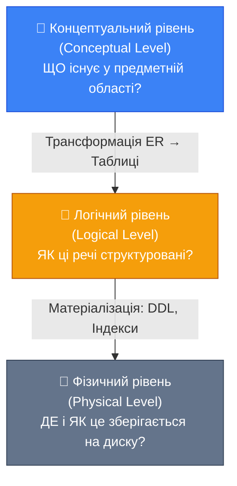
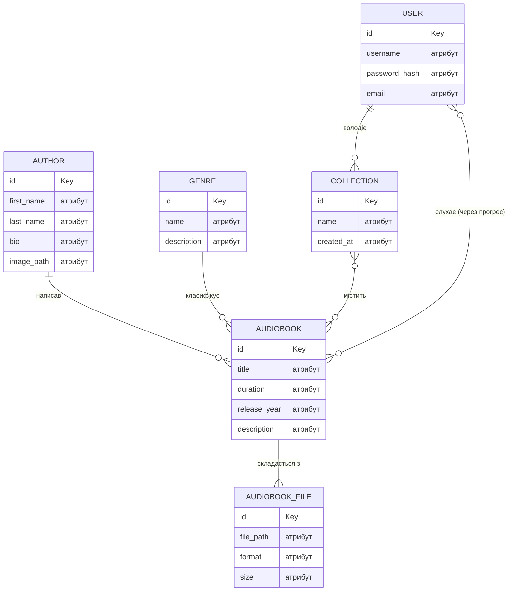

# Концептуальне моделювання: Мистецтво розуміння предметної області

## Вступ: Коли код — не перший крок

Уявіть: ви отримали технічне завдання. Замовник хоче платформу для прослуховування аудіокниг. Є користувачі, є книги, є автори, є якийсь «прогрес прослуховування» і «особисті колекції». Перший інстинкт більшості розробників — відкрити IDE та почати писати класи. Або, у кращому разі, відкрити pgAdmin і почати малювати таблиці.

Це помилка.

Не тому що код чи таблиці є чимось поганим. А тому, що занадто раннє занурення у деталі реалізації — це будівництво будинку, починаючи зі стін, без фундаменту і без архітектурного плану. Стіни може й встоять, але кімнати виявляться незручними, а перебудова згодом обійдеться значно дорожче.

Перше, що повинен зробити розробник або архітектор системи, — **зрозуміти предметну область**. Скласти «карту бізнесу»: що існує у цьому світі, як ці речі пов'язані між собою, які правила керують їх взаємодією. Лише після цього модель можна перенести на конкретні технології: реляційну базу даних, документо-орієнтовану, графову чи будь-яку іншу.

Цей процес і є **концептуальним моделюванням** (Conceptual Modeling) — темою цієї статті.

::note
**Мета статті.** До її кінця ви розумітимете, як перетворити нечіткий опис бізнес-вимог на чітку, зрозумілу і технологічно-незалежну концептуальну схему. Ми збудуємо повну концептуальну модель платформи аудіокниг, яка стане фундаментом для всіх наступних статей цього модуля.
::

### Три рівні абстракції: Загальна карта

Перш ніж заглибитись у деталі, варто окреслити загальну картину. Проектування бази даних відбувається на **трьох рівнях абстракції**, і розуміння різниці між ними є критично важливим.

::mermaid



::

**Концептуальний рівень** — найвища, найабстрактніша точка зору. На цьому рівні ми не думаємо про таблиці, стовпці чи типи даних. Ми думаємо про **сутності реального світу** (автор, аудіокнига, користувач) та **зв'язки між ними** (автор _написав_ аудіокнигу, користувач _слухає_ аудіокнигу). Концептуальна модель — це мова домену, однаково зрозуміла розробнику та бізнес-аналітику, який ніколи не писав SQL.

**Логічний рівень** — перехід від бізнес-концепцій до формальних структур даних обраної моделі (реляційної, документо-орієнтованої, графової). Тут з'являються таблиці, первинні та зовнішні ключі, процес нормалізації.

**Фізичний рівень** — конкретна реалізація: DDL-скрипти, індекси, типи даних конкретної СУБД, внутрішня організація зберігання на диску.

Цей модуль пройде **всі три рівні послідовно**, використовуючи платформу аудіокниг як наскрізний приклад. Ця стаття присвячена виключно першому рівню.

::tip
**Ключова ідея концептуального рівня.** Модель, яку ми побудуємо, не знатиме про PostgreSQL, MongoDB чи будь-яку іншу технологію. Вона описує _бізнес_, а не _базу даних_. Одна й та сама концептуальна модель може бути реалізована у реляційній, документо-орієнтованій або графовій базі — ми дослідимо це порівняння у фінальній статті модуля.
::

---

## Концептуальна модель: Агностична карта домену

Термін «концептуальна модель» (Conceptual Model, або Conceptual Schema) у контексті баз даних точніше за все описується так: це формальне представлення знань про предметну область, **незалежне від будь-якої технології зберігання**. Ключові слова тут — «формальне» та «незалежне».

«Формальне» означає, що модель не є вільним текстом чи набором розмитих понять. Вона описується за допомогою чіткого набору конструкцій з визначеною семантикою: сутностей, атрибутів та зв'язків. Це дозволяє перетворювати її на конкретні схеми алгоритмічно, без двозначностей.

«Незалежне» означає, що у концептуальній моделі немає жодних слідів технічних рішень. Немає `VARCHAR(64)`, немає `FOREIGN KEY`, немає `ON DELETE CASCADE`. Є лише бізнес-поняття та їхні зв'язки.

### Аналогія: Архітектурний план

Архітектор, проектуючи будинок, спочатку малює **концептуальний план** (ескіз): де кімнати, де коридори, де вхід, де вікна. Цей план зрозумілий замовнику і не містить деталей про марку цегли, тип бетону чи характеристики кабелів електропроводки.

Лише після затвердження концепції архітектор переходить до **технічних креслень**: конструктивних схем, специфікацій матеріалів, розрахунків навантажень. Це аналог логічного та фізичного рівнів.

Якщо замовник захоче змінити розташування стіни — це легко зробити на рівні ескізу. Але якщо будівництво вже почалося і несучу стіну вже зведено — переробка коштуватиме на порядок більше.

Те саме справедливо для баз даних.

::card-group

::card{title="Концептуальна модель" icon="i-heroicons-map"}

- Описує **предметну область**, а не технологію
- Зрозуміла бізнес-аналітикам без SQL
- Легко змінюється на ранніх стадіях
- Може бути реалізована у різних СУБД

::

::card{title="Що це не є" icon="i-heroicons-x-circle"}

- Не є схемою таблиць
- Не містить типів даних (`INT`, `VARCHAR`)
- Не містить SQL-конструкцій
- Не прив'язана до PostgreSQL, MongoDB або будь-якої іншої СУБД

::

::

### Найпоширеніший інструмент: ER-діаграми

Найвідомішим і найширше розповсюдженим методом концептуального моделювання є **діаграми «сутність-зв'язок»** (Entity-Relationship Diagrams, або ER-діаграми). Метод запропонований Пітером Ченом (Peter Chen) у 1976 році у статті «The Entity-Relationship Model — Toward a Unified View of Data» — одній із найбільш цитованих робіт в історії інформатики.

Метод ґрунтується на трьох ключових поняттях: **сутність** (Entity), **атрибут** (Attribute) та **зв'язок** (Relationship). Розглянемо кожен з них детально на прикладі нашої аудіоплатформи.

---

## Сутності: Об'єкти реального світу

**Сутність** (Entity) — це будь-який чітко ідентифікований об'єкт або явище реального світу, що має значення для системи, що розробляється. Кожна сутність може існувати у багатьох **екземплярах** (instances), і кожен екземпляр повинен бути відмінним від інших.

Зверніть увагу на слово «ідентифікований»: якщо не можна однозначно відрізнити один екземпляр від іншого — це не сутність у моделі ER. Наприклад, «літр води в океані» чи «кілограм пшениці з поля» не є сутностями в цьому розумінні, бо ми не можемо ідентифікувати конкретний літр або конкретний кілограм.

::tip
**Практичний критерій.** Якщо для поняття можна скласти список пронумерованих екземплярів — це, швидше за все, сутність. «Список авторів нашої платформи» — можна. «Список біографічних фактів» — не можна (вони описують автора, але не існують самостійно).
::

### Виявлення сутностей аудіоплатформи

Щоб виявити сутності, аналізують опис предметної області, документацію, інтерв'ю з замовником. Іменники у тексті вимог — перший орієнтир, хоча й не єдиний критерій.

Бізнес-вимоги нашої аудіоплатформи:
- Платформа надає **аудіокниги** у різних **форматах файлів**.
- У кожної аудіокниги є **автор** та **жанр**.
- **Користувачі** реєструються та можуть створювати особисті **колекції** аудіокниг.
- Платформа зберігає **прогрес прослуховування** кожного користувача для кожної аудіокниги.

Виділимо кандидатів у сутності:

| Кандидат | Чи є сутністю? | Обґрунтування |
|---|---|---|
| Аудіокнига | ✅ Так | Має унікальний ідентифікатор, назву, тривалість |
| Автор | ✅ Так | Має ім'я, біографію; існує незалежно від книг |
| Жанр | ✅ Так | Має назву та опис; до одного жанру належать багато книг |
| Користувач | ✅ Так | Унікальний логін, пароль, аватар |
| Колекція | ✅ Так | Має назву, дату створення; належить конкретному користувачу |
| Файл аудіокниги | ✅ Так | Різні формати (MP3, FLAC) одного запису — окремі файли |
| Прогрес прослуховування | ⚠️ Особливий | Пов'язує Користувача та Аудіокнигу, має власні атрибути |
| Назва аудіокниги | ❌ Ні | Це атрибут сутності «Аудіокнига» |
| Формат файлу | ❌ Ні | Атрибут сутності «Файл аудіокниги» (MP3, FLAC тощо) |

«Прогрес прослуховування» — цікавий випадок: це не просто зв'язок між двома сутностями, а зв'язок, що має власні дані (позиція та дата останнього прослуховування). У теорії ER це моделюється як **зв'язок з атрибутами** (Relationship with Attributes), що ми розглянемо у розділі про зв'язки.

### Сильні та слабкі сутності

В ER-моделі розрізняють **сильні** (Strong Entities) та **слабкі** (Weak Entities) сутності.

**Сильна сутність** (Strong Entity) — існує самостійно і може бути однозначно ідентифікована власними атрибутами. У нашій платформі сильними є: `Author`, `Genre`, `User`.

**Слабка сутність** (Weak Entity) — не може існувати без прив'язки до іншої сутності (її «власника») і не може бути однозначно ідентифікована без посилання на неї. Слабкі сутності нашої платформи:

- **`AudiobookFile`** — не може існувати без `Audiobook`. Якщо аудіокнигу видалено, усі її файли зникають разом з нею. Файл ідентифікується через комбінацію власного ідентифікатора та ідентифікатора батьківської аудіокниги.
- **`Collection`** — не може існувати без `User`. Колекція без власника позбавлена сенсу.

::note
На ER-діаграмах у нотації Пітера Чена слабкі сутності зображаються **подвійним прямокутником**, а зв'язок між слабкою та сильною сутністю — **подвійним ромбом**. У нотації Crow's Foot (яку ми детально розглянемо далі) ця відмінність передається через тип зв'язку.
::

Слабкість сутності має **пряме практичне значення**: при виборі стратегії каскадного видалення (`ON DELETE CASCADE`) ми спираємося саме на факт залежності слабкої сутності від сильної. Більш детально ця тема розкривається у статті про фізичну схему.

---

## Атрибути: Деталізація сутностей

**Атрибут** (Attribute) — це характеристика або властивість сутності, що описує або уточнює її. Кожен екземпляр сутності має конкретне значення кожного атрибуту (або спеціальне значення «невизначено» — `NULL`).

Класифікація атрибутів є важливою, оскільки різні типи атрибутів по-різному відображаються на наступних рівнях моделювання.

### Прості та складені атрибути

**Простий атрибут** (Simple Attribute) — неподільна одиниця: `duration` (тривалість аудіокниги в секундах), `release_year` (рік виходу).

**Складений атрибут** (Composite Attribute) — що складається з кількох компонентів, кожен з яких має самостійне значення. Класичний приклад — `Name` (повне ім'я), що складається з `FirstName` і `LastName`. У нашій аудіоплатформі автор (`Author`) має саме такий атрибут.

::note
Вибір між збереженням `Name` як єдиного рядка чи розбиттям на `first_name` + `last_name` — це архітектурне рішення. Якщо прізвище авторів буде використовуватися для сортування, пошуку або виведення в форматі «Доренко Іван» — розбивати обов'язково. Якщо ж ім'я завжди виводиться цілком і не аналізується — можна зберігати рядком. Концептуальна модель дозволяє позначити `Name` складеним, а на логічному рівні прийняти остаточне рішення.
::

### Ключові атрибути

**Ключовий атрибут** (Key Attribute) — атрибут або група атрибутів, що однозначно ідентифікує кожен екземпляр сутності. У нотації Пітера Чена ключові атрибути підкреслюються.

Для кожної сутності нашої платформи:

| Сутність | Ключовий атрибут | Обґрунтування |
|---|---|---|
| `Author` | `id` (UUID) | Сурогатний ключ; ім'я не є унікальним |
| `Genre` | `id` (UUID) | Назва жанру теж могла б бути ключем (вона унікальна), але UUID надійніший |
| `Audiobook` | `id` (UUID) | Назва неунікальна (можуть бути книги з однаковою назвою різних авторів) |
| `User` | `id` (UUID) | `username` також унікальний — альтернативний ключ |
| `Collection` | `id` (UUID) | Назва неунікальна навіть для одного користувача |
| `AudiobookFile` | `id` (UUID) | Один файл для однієї книги |

Вибір між природними (натуральними) та сурогатними ключами — тема, яка детально розкривається у статті про логічне моделювання. На концептуальному рівні достатньо позначити, що кожна сутність має механізм ідентифікації.

### Похідні та багатозначні атрибути

**Похідний атрибут** (Derived Attribute) — значення якого обчислюється з інших атрибутів. Наприклад, якщо знаємо `duration` (тривалість у секундах), то `duration_hours` (тривалість у годинах) є похідним атрибутом. Зберігати похідні атрибути в базі — зазвичай надмірність. На ER-діаграмі вони позначаються пунктирним овалом.

**Багатозначний атрибут** (Multivalued Attribute) — атрибут, що може мати кілька значень для одного екземпляру сутності. Наприклад, якби платформа підтримувала кілька мов озвучення однієї аудіокниги — `language` став би багатозначним атрибутом. У нашій поточній моделі це реалізовано через окрему сутність `AudiobookFile`, де кожен файл може мати свій формат.

### Повний перелік атрибутів сутностей аудіоплатформи

::accordion
::accordion-item{label="Author — Автор" icon="i-lucide-user"}
- `id` *(ключовий)* — унікальний ідентифікатор
- `Name` *(складений)* → `FirstName`, `LastName`
- `Bio` *(простий, допускає NULL)* — біографія
- `ImagePath` *(простий, допускає NULL)* — шлях до фото
::
::accordion-item{label="Genre — Жанр" icon="i-lucide-tag"}
- `id` *(ключовий)*
- `Name` *(простий, обов'язковий, унікальний)* — назва жанру
- `Description` *(простий, допускає NULL)* — опис жанру
::
::accordion-item{label="Audiobook — Аудіокнига" icon="i-lucide-book-audio"}
- `id` *(ключовий)*
- `Title` *(простий, обов'язковий)* — назва
- `Duration` *(простий, обов'язковий)* — тривалість у секундах
- `ReleaseYear` *(простий, обов'язковий)* — рік виходу
- `Description` *(простий, допускає NULL)* — опис
- `CoverImagePath` *(простий, допускає NULL)* — шлях до обкладинки
::
::accordion-item{label="User — Користувач" icon="i-lucide-circle-user"}
- `id` *(ключовий)*
- `Username` *(простий, обов'язковий, унікальний)* — логін
- `PasswordHash` *(простий, обов'язковий)* — хеш пароля
- `Email` *(простий, допускає NULL)*
- `AvatarPath` *(простий, допускає NULL)*
::
::accordion-item{label="Collection — Колекція" icon="i-lucide-library"}
- `id` *(ключовий)*
- `Name` *(простий, обов'язковий)* — назва колекції
- `CreatedAt` *(простий, обов'язковий)* — дата створення
::
::accordion-item{label="AudiobookFile — Файл" icon="i-lucide-file-audio"}
- `id` *(ключовий)*
- `FilePath` *(простий, обов'язковий)* — шлях до файлу
- `Format` *(простий, обов'язковий)* — mp3, flac, wav тощо
- `Size` *(простий, допускає NULL)* — розмір у байтах
::
::

---

## Зв'язки: Бізнес-правила між сутностями

**Зв'язок** (Relationship) — асоціація або залежність між двома чи більше сутностями, що відображає факти предметної області. Якщо сутності — це «іменники» бізнесу, то зв'язки — це «дієслова»: автор _написав_ книгу, користувач _слухає_ книгу, колекція _містить_ аудіокниги.

Кожен зв'язок характеризується двома ключовими параметрами: **кардинальністю** та **модальністю**.

### Кардинальність: Скільки до скількох?

**Кардинальність** (Cardinality) визначає кількісне співвідношення між екземплярами двох сутностей у зв'язку. Розрізняють три базові типи:

::card-group

::card{title="Один до одного (1:1)" icon="i-heroicons-arrows-right-left"}

Кожному екземпляру сутності A відповідає не більше одного екземпляра сутності B, і навпаки.

**Рідкісний тип**. Зазвичай свідчить про те, що дві сутності можна об'єднати в одну. Виправданий, коли потрібно логічно відокремити частини різної природи (наприклад, публічний профіль користувача та його приватні налаштування безпеки).

::

::card{title="Один до багатьох (1:N)" icon="i-heroicons-arrow-right"}

Одному екземпляру A відповідає нуль або більше екземплярів B. Один екземпляр B відповідає рівно одному A.

**Найпоширеніший тип**. Автор — Аудіокниги: один автор написав багато книг.

::

::card{title="Багато до багатьох (M:N)" icon="i-heroicons-arrows-pointing-out"}

Одному A відповідає нуль або більше B. Одному B відповідає нуль або більше A.

**Вимагає розв'язання** при переході на логічний рівень — через проміжну (junction) таблицю. Колекція — Аудіокниги: колекція містить багато книг, книга може бути в багатьох колекціях.

::

::

### Модальність: Обов'язково чи ні?

**Модальність** (Modality), або **участь** (Participation), визначає, чи є участь сутності у зв'язку обов'язковою. Розрізняють:

- **Повну участь** (Total Participation) — кожен екземпляр сутності обов'язково бере участь у зв'язку. Наприклад, кожна аудіокнига обов'язково має автора (не може існувати аудіокнига без автора).
- **Часткову участь** (Partial Participation) — деякі екземпляри можуть не брати участі у зв'язку. Наприклад, автор може не мати жодної аудіокниги на платформі (щойно зареєстрований або запрошений автор).

У нотації Crow's Foot модальність позначається символами на кінці лінії зв'язку:
- Обов'язковий кінець: вертикальна риска `|`
- Необов'язковий кінець: кружечок `o`

### Аналіз зв'язків аудіоплатформи

Розберемо кожен зв'язок докладно, формулюючи бізнес-правила:

**Author → Audiobook** (writes)
- Один автор написав **одну або більше** аудіокниг? Ні — автор може бути на платформі без книг (часткова участь з боку Author).
- Одна аудіокнига написана **рівно одним** автором? Так, і без автора існувати не може (повна участь з боку Audiobook).
- **Тип: 1:N** (один Author до багатьох Audiobook). FK розміщується на стороні Audiobook.

**Genre → Audiobook** (categorizes)
- Один жанр охоплює **нуль або більше** аудіокниг.
- Одна аудіокнига належить **рівно одному** жанру (повна участь).
- **Тип: 1:N**. FK розміщується на стороні Audiobook.

**User → Collection** (owns)
- Один користувач може мати **нуль або більше** колекцій (часткова участь з боку User).
- Одна колекція належить **рівно одному** користувачу (повна участь; слабка сутність).
- **Тип: 1:N**. FK розміщується на стороні Collection.

**Collection ↔ Audiobook** (includes)
- Одна колекція може містити **нуль або більше** аудіокниг.
- Одна аудіокнига може бути **у нуль або більше** колекціях.
- **Тип: M:N**. Вимагає проміжної таблиці `audiobook_collection`.

**Audiobook → AudiobookFile** (consists of)
- Одна аудіокнига має **один або більше** файлів (принаймні один файл обов'язковий; повна участь AudiobookFile).
- Один файл належить **рівно одній** аудіокнизі (слабка сутність).
- **Тип: 1:N**. FK розміщується на стороні AudiobookFile.

**User ↔ Audiobook через ListeningProgress** (listens to)
- Один користувач може мати прогрес для **нуль або більше** аудіокниг.
- Одна аудіокнига може мати прогреси для **нуль або більше** користувачів.
- **Тип: M:N з атрибутами** (`position`, `last_listened`). Цей зв'язок особливий — він є не просто проміжною таблицею, а повноцінною сутністю-зв'язком із власними даними.

::note
`ListeningProgress` — це **зв'язок-з-атрибутами** (Relationship with Attributes). На логічному рівні він стане окремою таблицею `listening_progresses`, що матиме власний первинний ключ та атрибути. Це дуже поширений патерн: коли M:N-зв'язок «обростає» власними даними, він фактично перетворюється на повноцінну сутність.
::

### Концептуальна ER-діаграма аудіоплатформи

Тепер ми можемо зобразити повну концептуальну модель. Використовуємо нотацію Crow's Foot як більш наочну для відображення кардинальності та модальності:

::mermaid



::

---

## Нотації ER-діаграм: Chen vs Crow's Foot

Концептуальні моделі можна зображати у різних **нотаціях** — стандартизованих системах позначень. Розглянемо дві найпоширеніші.

### Нотація Пітера Чена (Chen Notation, 1976)

Оригінальна нотація, запропонована у фундаментальній статті Пітера Чена. Є **академічним стандартом** і широко використовується у підручниках та наукових роботах.

**Основні позначення:**
- **Прямокутник** — сутність (подвійний прямокутник для слабкої сутності)
- **Ромб** — зв'язок (подвійний для ідентифікуючого зв'язку з слабкою сутністю)
- **Еліпс** — атрибут (підкреслений — ключовий; пунктирний — похідний; подвійний — багатозначний)
- **Лінії зі значками 1 та M** — кардинальність

Перевага: дуже виразна, показує атрибути сутностей і зв'язків безпосередньо на діаграмі. Недолік: займає значно більше місця, стає нечитабельною для великих схем.

### Нотація Crow's Foot (1976, Gordon Everest)

Запропонована Гордоном Евересом (Gordon Everest) під назвою «Inverted Arrow» («обернена стрілка»). Пізніше отримала назву **Crow's Foot** («вороняча лапка») або Fork («виделка») через вигляд символу множинності.

**Основні позначення:**
- **Прямокутник** — сутність (атрибути всередині)
- **Лінія** — зв'язок
- Символи на кінцях ліній для кардинальності та модальності:

| Символ | Значення |
|---|---|
| `\|` (одна риска) | Один |
| `{` (три риски / лапка) | Багато |
| `o` (кружечок) | Нуль (необов'язково) |
| `\|` (вертикальна риска) | Один (обов'язково) |

::tabs
::tabs-item{label="Chen: Автор → Аудіокнига"}

На діаграмі Чена зв'язок між Author та Audiobook виглядав би так:

```
[Author] —— <writes> —— [Audiobook]
   |                         ||
(Id)                       (Id)
(Name)                   (Title)
(Bio)                  (Duration)
```

Ромб `<writes>` позначає зв'язок, а лінії мають мітки `1` (з боку Author) і `M` (з боку Audiobook).

::
::tabs-item{label="Crow's Foot: Автор → Аудіокнига"}

У нотації Crow's Foot:

```
AUTHOR ||--o{ AUDIOBOOK : "написав"
```

Читається так: «Рівно один Author (||) до нуля або більше (o{) Audiobook».

Символ `||` — обов'язковий одиничний кінець (кожна книга має рівно одного автора).
Символ `o{` — необов'язковий множинний кінець (автор може мати нуль або більше книг).

::
::

::note
**Який стандарт використовуємо далі?** У подальших статтях цього модуля ми використовуємо **Crow's Foot** як основну нотацію — вона домінує в індустріальних інструментах (dbdiagram.io, DataGrip, MySQL Workbench, ERDPlus). Нотація Чена залишилася академічним мовою — цінним для розуміння теорії, але рідкісним у повсякденній практиці.
::

---

## Ієрархії та спеціалізація

ER-модель підтримує концепції **узагальнення** (Generalization) та **спеціалізації** (Specialization) — механізми, аналогічні успадкуванню в об'єктно-орієнтованому програмуванні.

**Супертип** (Supertype) — загальна сутність, що об'єднує спільні атрибути. **Підтип** (Subtype) — спеціалізована сутність, що успадковує атрибути супертипу та додає власні.

Уявімо, що наша платформа планує ввести **преміум-підписку**. Тоді `User` стає супертипом, а `FreeUser` та `PremiumUser` — підтипами:

- Обидва мають `id`, `username`, `email` (успадковані від `User`)
- `PremiumUser` додатково має `subscription_expires` (власний атрибут)
- `FreeUser` може мати обмежений доступ до каталогу

::warning
Ієрархії сутностей виглядають природно на концептуальному рівні, але на **реляційному рівні вимагають окремих архітектурних рішень**. Реляційна модель не має вбудованої підтримки успадкування. Існують три основні стратегії відображення ієрархій: Single Table Inheritance, Concrete Table Inheritance та Class Table Inheritance (Joined). Кожна має свої переваги та недоліки — це окрема тема логічного моделювання, що не входить до поточної статті.
::

У поточній схемі аудіоплатформи ієрархій немає, тому концептуальна модель залишається плоскою. Але знання про їх існування важливе: воно нагадує, чому концептуальний рівень агностичний — один і той же концепт (успадкування ролей) може реалізовуватися принципово по-різному залежно від обраної технології.

---

## Практичні завдання

::steps

### Рівень 1 — Базовий: Виявлення сутностей

Дано опис системи:
> «Університет проводить курси. Кожен курс веде один викладач. Студенти можуть записуватися на курси. За результатами курсу студент отримує оцінку.»

**Завдання:**
1. Визначте усі сутності (підказка: їх рівно чотири).
2. Для кожної сутності вкажіть 3–4 атрибути. Позначте ключові атрибути.
3. Яка з сутностей може виявитися слабкою? Обґрунтуйте.

### Рівень 2 — Логіка: Побудова ER-діаграми

Дано опис системи доставки їжі:
> «Ресторани пропонують страви у різних категоріях (піца, суші, бургери). Клієнти роблять замовлення. У кожному замовленні може бути кілька страв у різній кількості. Кожне замовлення доставляє один кур'єр.»

**Завдання:**
1. Знайдіть усі сутності та їхні атрибути.
2. Визначте всі зв'язки та їхню кардинальність.
3. Є зв'язок з атрибутами? Якщо так — визначте його та перерахуйте атрибути.
4. Намалюйте ER-діаграму у нотації Crow's Foot (текстово або у будь-якому інструменті).

### Рівень 3 — Архітектура: Концептуальне проектування з нуля

Ви отримали завдання побудувати систему управління проектами (спрощений аналог Jira):
- Є організації, в кожній — кілька проектів
- Проект містить задачі (Tasks)
- Задача має статус, пріоритет та виконавця
- Задача може мати підзадачі (ієрархія)
- Учасники проекту мають ролі (менеджер, розробник, тестувальник)

**Завдання:**
1. Побудуйте повну концептуальну модель (сутності, атрибути, зв'язки) з обґрунтуванням кожного рішення.
2. Визначте, де є ієрархії (підтипи/супертипи або рекурсивні зв'язки).
3. Чи є зв'язки з атрибутами? Яка їхня природа?
4. Вкажіть, які сутності є слабкими та чому.

::

---

## Підсумок

Концептуальне моделювання — це **перший і найважливіший крок** у проектуванні будь-якої системи зберігання даних. Його мета — побудувати чітку, технологічно-незалежну карту предметної області, зрозумілу усім учасникам проекту.

Ключові поняття, яких ми торкнулися:

- **Сутність** — ідентифікований об'єкт реального світу; сильні та слабкі сутності.
- **Атрибут** — характеристика сутності; прості, складені, ключові, похідні, багатозначні.
- **Зв'язок** — асоціація між сутностями; кардинальність (1:1, 1:N, M:N) та модальність (повна/часткова участь).
- **Зв'язок з атрибутами** — M:N-зв'язок із власними даними (`ListeningProgress`).
- **Нотації**: Chen (академічна) та Crow's Foot (індустріальна); далі використовуємо Crow's Foot.
- **Агностичність** — концептуальна модель не залежить від технологій реалізації.

У наступній статті ми перейдемо на **логічний рівень**: трансформуємо побудовану ER-модель аудіоплатформи у реляційну схему, розглянемо правила відображення зв'язків на таблиці та детально вивчимо вибір первинних ключів.
