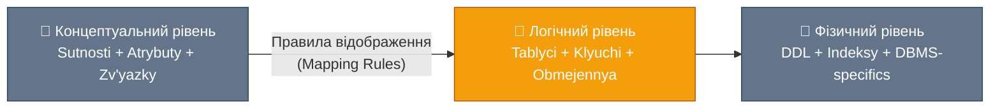
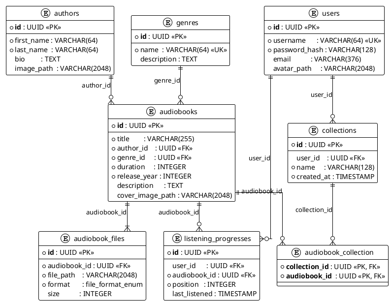

# Логічне моделювання: Від бізнес-ідей до структур даних

## Вступ: Між бізнесом та технологією

У попередній статті ми побудували концептуальну модель платформи аудіокниг — технологічно-незалежну карту домену, де фігурують автори, аудіокниги, користувачі та їхні колекції. Ця карта описує _що_ існує у нашій предметній області та _як_ ці речі пов'язані між собою.

Проте карта — це ще не будівля. Концептуальна модель вирішує питання «що?», але не відповідає на запитання «як структурувати?». Щойно ми обираємо технологію зберігання — реляційну базу даних — перед нами постає наступний рівень абстракції: **логічне моделювання** (Logical Modeling).

Логічна модель — це точна специфікація структури даних у термінах обраної моделі даних (у нашому випадку — реляційної). Вона відповідає на питання: скільки таблиць, як вони називаються, які стовпці мають, як пов'язані між собою? При цьому логічна модель ще не прив'язана до конкретної СУБД: вона не знає про специфіку H2, PostgreSQL або MariaDB — ці деталі з'являться лише на фізичному рівні.

::mermaid



::

Перехід від концептуального до логічного рівня здійснюється за формальними **правилами відображення** (Mapping Rules). Ці правила є алгоритмічними: маючи ER-діаграму, можна крок за кроком отримати реляційну схему. Власне, саме цим ми й займемося у цій статті — повністю і явно трансформуємо кожну сутність і кожен зв'язок нашої аудіоплатформи.

::note
**Мета статті.** Після опрацювання цього матеріалу ви зможете самостійно перетворити будь-яку ER-діаграму на логічну схему реляційної бази даних — з таблицями, первинними та зовнішніми ключами та обмеженнями цілісності. Як і в попередній статті, весь матеріал ілюструється на прикладі аудіоплатформи.
::

### Що таке реляційна модель

Перш ніж почати трансформацію, варто окреслити математичний фундамент, на якому стоїть реляційна модель даних.

Реляційна модель запропонована Едгаром Коддом (Edgar F. Codd) у 1970 році у фундаментальній роботі «A Relational Model of Data for Large Shared Data Banks». В її основі лежить поняття **відношення** (Relation) — математичного об'єкта теорії множин.

Відношення — це іменована множина **кортежів** (Tuples). Кожен кортеж — це впорядкований набір значень, по одному для кожного **атрибута** (Attribute) відношення. Атрибут описується іменем та **доменом** (Domain) — множиною допустимих значень.

Для практичних цілей: відношення — це таблиця, кортеж — рядок, атрибут — стовпець. Але ця аналогія є спрощеною — і ось чому: таблиця є коректним поданням відношення лише тоді, коли виконуються такі правила:

::card-group

::card{title="Атомарність значень" icon="i-heroicons-beaker"}
Кожне значення у клітинці є неподільним (атомарним). Не можна зберігати список чи структуру у одному полі.
::

::card{title="Унікальність рядків" icon="i-heroicons-finger-print"}
Два рядки не можуть бути повністю однаковими. Завжди існує спосіб відрізнити один рядок від іншого — первинний ключ.
::

::card{title="Фіксовані стовпці" icon="i-heroicons-table-cells"}
Кожен стовпець має ім'я та тип. Порядок стовпців і рядків не має значення — таблиця є _множиною_, а не _послідовністю_.
::

::card{title="Унікальність імен стовпців" icon="i-heroicons-tag"}
Усі стовпці в одній таблиці мають різні імена. Неможливо мати два стовпці `name` в одній таблиці.
::

::

Ці правила визначають межі того, що можна «покласти» у реляційну таблицю, і безпосередньо впливають на процес трансформації ER-моделі.

---

## Правила відображення: ER → Реляційна схема

Трансформація ER-діаграми у реляційну схему підпорядковується п'яти основним правилам. Розглянемо кожне на конкретних прикладах аудіоплатформи.

### Правило 1. Сутність → Таблиця

**Кожна сутність відображається в окрему таблицю.** Ключові атрибути стають первинним ключем (Primary Key, PK). Прості атрибути — стовпцями.

Кілька важливих наслідків цього правила:

- **Складені атрибути розкладаються.** Атрибут `Name` сутності `Author` стає двома стовпцями: `first_name` та `last_name`.
- **Похідні атрибути зазвичай не зберігаються** — вони обчислюються під час запиту: `duration / 3600` для тривалості у годинах.
- **Багатозначні атрибути** потребують окремої таблиці — один стовпець не може зберігати список (порушення атомарності).

Застосовуємо до аудіоплатформи. Шість сутностей → шість таблиць:

| Сутність (концепт) | Таблиця (логічна схема) |
|---|---|
| `Author` | `authors` |
| `Genre` | `genres` |
| `Audiobook` | `audiobooks` |
| `User` | `users` |
| `Collection` | `collections` |
| `AudiobookFile` | `audiobook_files` |

::tip
**Угода про іменування.** Таблиці — множина та `snake_case` (authors, audiobook_files). Стовпці — також `snake_case` (first_name, release_year). Ця конвенція відповідає еталонному [SQL Style Guide](https://www.sqlstyle.guide/) і буде дотримуватися протягом усього модуля.
::

### Правило 2. Зв'язок 1:N → Зовнішній ключ

**Зв'язок «один до багатьох» (1:N) відображається зовнішнім ключем (Foreign Key, FK), розміщеним у таблиці на стороні «багато».** Окрема таблиця для такого зв'язку не створюється.

Логіка проста: якщо один `Author` пов'язаний із багатьма `Audiobook`, то кожна аудіокнига «знає» свого автора — тому `author_id` розташовується у таблиці `audiobooks`. Зворотній варіант — помістити `audiobook_ids` до `authors` — неможливий без порушення атомарності.

Усі 1:N-зв'язки аудіоплатформи та результат відображення:

| Зв'язок | «Один» | «Багато» | FK у таблиці |
|---|---|---|---|
| Author writes Audiobook | `authors` | `audiobooks` | `audiobooks.author_id` |
| Genre categorizes Audiobook | `genres` | `audiobooks` | `audiobooks.genre_id` |
| User owns Collection | `users` | `collections` | `collections.user_id` |
| Audiobook consists of AudiobookFile | `audiobooks` | `audiobook_files` | `audiobook_files.audiobook_id` |

Таблиця `audiobooks` отримує одразу два FK — `author_id` та `genre_id`. Це нормально і дуже поширено.

**Модальність визначає NULL-ність FK.** Повна участь → `NOT NULL`. Часткова → може бути `NULL`:

- `audiobooks.author_id NOT NULL` — аудіокнига без автора неможлива.
- `audiobooks.genre_id NOT NULL` — аудіокнига без жанру неможлива.
- `collections.user_id` — допускає `NULL` (системні або спільні колекції — свідоме архітектурне рішення).

---

### Правило 3. Зв'язок M:N → Проміжна таблиця

**Зв'язок «багато до багатьох» (M:N) неможливо виразити через FK безпосередньо між двома таблицями.** Для його відображення створюється **проміжна таблиця** (Junction Table, або Associative Table, або Bridge Table).

Ця таблиця містить як мінімум два стовпці — зовнішні ключі до обох пов'язаних таблиць. Разом вони утворюють **складений первинний ключ** (Composite Primary Key).

У нашій аудіоплатформі є один класичний M:N-зв'язок: `Collection` ↔ `Audiobook` (колекція містить багато книг, книга може бути в багатьох колекціях). Він відображається у таблицю `audiobook_collection`:

```sql
-- audiobook_collection
-- collection_id (FK → collections.id)  ┐
-- audiobook_id  (FK → audiobooks.id)   ┘ → Складений PK
```

Складений ключ гарантує унікальність пар: одну й ту ж книгу не можна додати до однієї колекції двічі.

::note
**Сурогатний чи складений PK для junction-таблиці?** Існує два підходи. Класичний — складений PK з двох FK (як у нашій схемі). Альтернативний — додати окремий сурогатний `id` та зробити FK просто `UNIQUE`. Складений PK є семантично правильнішим і не потребує додаткового індексу для унікальності. Сурогатний — зручніший, якщо на цю таблицю посилаються інші таблиці (вказують на конкретну пару).
::

### Правило 4. Зв'язок 1:1 → FK з UNIQUE або злиття таблиць

**Зв'язок «один до одного» (1:1) може відображатися двома способами:**

1. **Злиття таблиць** — якщо сутності завжди існують разом і мають схожу природу, їх можна об'єднати в одну таблицю.
2. **FK з обмеженням UNIQUE** — FK розміщується у таблиці «залежної» сутності та позначається `UNIQUE`, що гарантує неможливість двох рядків з однаковим значенням FK.

У поточній схемі аудіоплатформи зв'язків 1:1 немає. Але якби, наприклад, у кожного `User` був окремий `SecurityProfile` (пароль, двофакторна автентифікація, токени) — доцільно було б розділити їх на дві таблиці через 1:1 з FK `security_profiles.user_id UNIQUE`.

### Правило 5. Зв'язок з атрибутами → Таблиця із власним PK

**Якщо зв'язок має власні атрибути, він відображається окремою таблицею, яка зберігає FK до обох учасників та стовпці для власних атрибутів зв'язку.**

Це правило стосується `ListeningProgress` з нашої моделі — зв'язку між `User` та `Audiobook`, що має атрибути `position` (позиція відтворення у секундах) та `last_listened` (дата і час останнього прослуховування).

Результат відображення — таблиця `listening_progresses`:

```sql
-- listening_progresses
-- id            (PK, сурогатний)
-- user_id       (FK → users.id)
-- audiobook_id  (FK → audiobooks.id)
-- position      (атрибут зв'язку)
-- last_listened (атрибут зв'язку)
```

::note
Зверніть увагу, що тут ми використали **сурогатний PK** (`id`) замість складеного. Чому? Бізнес-правило допускає існування декількох записів про прогрес для одного користувача та однієї книги (наприклад, прослуховування, перерване і відновлене пізніше). Якби пара `(user_id, audiobook_id)` завжди була унікальною — складений PK підійшов би краще.
::

---

## Первинні ключі: Натуральні чи Сурогатні?

Одне з найважливіших рішень при логічному моделюванні — вибір типу первинного ключа. Існують два принципово різних підходи, кожен зі своїми сильними сторонами та ризиками.

### Натуральні ключі

**Натуральний ключ** (Natural Key) — це атрибут, що вже існує у предметній області і є природним ідентифікатором сутності.

Приклади натуральних ключів:
- ISBN книги (унікальний номер видання)
- Email користувача (унікальний у межах системи)
- Код валюти (USD, EUR, UAH — стандарт ISO 4217)
- Номер паспорта

Привабливість натуральних ключів очевидна: вони несуть смисл, їх легко читати у відладці, і їх не потрібно окремо генерувати. Коли ми бачимо `audiobooks.isbn = '978-0-13-468599-1'` — ми одразу розуміємо, про яку книгу йдеться.

Але натуральні ключі мають серйозні ризики:

::warning
**Проблеми натуральних ключів:**
- **Мінливість.** Користувач може змінити email. Якщо email є PK — потрібно оновити його скрізь, де він використовується як FK. Це каскадне оновлення може бути дорогим і небезпечним.
- **Нестабільність вимог.** ISBN може виявитися неунікальним у певних виданнях. Бізнес-правила змінюються — і «природна» унікальність зникає.
- **Залежність від зовнішніх стандартів.** ISBN видається зовнішнім органом. Якщо формат стандарту зміниться — ключ потрібно буде мігрувати.
::

### Сурогатні ключі

**Сурогатний ключ** (Surrogate Key) — штучний ідентифікатор, що не має бізнес-смислу і генерується виключно для технічних потреб. Зовнішній світ його не знає і не повинен знати.

Два найпоширеніших типи:
- **AUTO_INCREMENT / SERIAL** — ціле число, що автоматично збільшується (1, 2, 3...). Просто, швидко, компактне.
- **UUID** (Universally Unique Identifier) — 128-бітний ідентифікатор у форматі `550e8400-e29b-41d4-a716-446655440001`. Глобально унікальний, незалежний від бази даних.

У нашій схемі аудіоплатформи **всі таблиці використовують UUID як PK**. Це не випадково:

::card-group

::card{title="UUID: Переваги" icon="i-heroicons-shield-check"}
- Глобальна унікальність — ідентифікатори можна генерувати на клієнті без звернення до БД
- Безпека — ID не є послідовним числом, яке легко перебрати
- Зручність для розподілених систем і реплікації
- Простота злиття даних із кількох джерел
::

::card{title="UUID: Недоліки" icon="i-heroicons-x-circle"}
- Займає більше місця (16 байт vs 4/8 байт для INT/BIGINT)
- Індекс за UUID менш ефективний через фрагментацію (особливо у InnoDB)
- Складніший для читання та відладки
- Підтримка залежить від СУБД (H2 і PostgreSQL підтримують добре, SQLite — через TEXT)
::

::

**Правило вибору.** Задайте собі одне питання: *«Чи може значення вашого ключа-кандидата змінитися з часом?»* Якщо так — він не підходить як первинний ключ. Використовуйте сурогатний.

::tabs
::tabs-item{label="Натуральний ключ (погано для email)"}

```sql
-- ПОГАНО: email як PK
CREATE TABLE users (
    email    VARCHAR(376) PRIMARY KEY,  -- а якщо змінить email?
    username VARCHAR(64)  NOT NULL
);

-- При зміні email — каскадне оновлення у всіх FK:
UPDATE users SET email = 'new@mail.com' WHERE email = 'old@mail.com';
-- Це оновить і всі collections.user_id, listening_progresses.user_id...
```

::
::tabs-item{label="Сурогатний ключ (UUID, правильно)"}

```sql
-- ДОБРЕ: UUID як PK, email — окремий UNIQUE атрибут
CREATE TABLE users (
    id           UUID         PRIMARY KEY,
    username     VARCHAR(64)  NOT NULL UNIQUE,
    email        VARCHAR(376) UNIQUE,     -- унікальний, але не PK
    password_hash VARCHAR(128) NOT NULL
);

-- Зміна email не впливає на жодну іншу таблицю
UPDATE users SET email = 'new@mail.com' WHERE id = '880e8400-...';
```

::
::

У другому варіанті `email` залишається унікальним (`UNIQUE`) — але PK — незмінний UUID. Будь-яка кількість атрибутів може бути позначена як **альтернативні ключі** (Alternate Keys) через `UNIQUE` обмеження, не стаючи первинними ключами.

---

## Зовнішні ключі та Посилальна цілісність

Зовнішній ключ — це не просто стовпець зі значенням, що збігається з іншою таблицею. Це **оголошена залежність** між двома таблицями, яку СУБД контролює автоматично. Саме завдяки FK реляційна база даних підтримує **посилальну цілісність** (Referential Integrity) — стан, при якому жоден FK не вказує на неіснуючий рядок.

Зрозуміти це найлегше через контрприклад. Уявіть: у таблиці `audiobooks` є рядок із `author_id = '550e8400-0001'`. Якщо цей автор буде видалений із таблиці `authors` без обробки залежних записів — у `audiobooks` залишиться «сирота» (Orphan Record): рядок, що посилається на автора, якого більше не існує. База даних у такому стані є **некоректною**.

FK-обмеження запобігає цьому двома способами:
1. **При вставці** — перевіряє, що значення `author_id` існує у `authors.id`.
2. **При видаленні батьківського запису** — виконує стратегію, визначену через `ON DELETE`.

### Каскадні дії (ON DELETE / ON UPDATE)

При визначенні FK обирається одна з чотирьох стратегій реакції на видалення або оновлення батьківського запису:

::card-group

::card{title="CASCADE" icon="i-heroicons-trash"}
**Каскадна дія.** При видаленні батьківського запису автоматично видаляються всі дочірні записи.

Використовуємо для: `audiobook_files` (видалення аудіокниги → видалення всіх її файлів), `collections` (видалення користувача → видалення його колекцій).
::

::card{title="SET NULL" icon="i-heroicons-minus-circle"}
**Обнулення.** FK у дочірньому записі встановлюється у `NULL`. FK-стовпець повинен допускати NULL.

Використовуємо коли: дочірня запис може існувати без батька (наприклад, колекція може стати «системною» після видалення власника).
::

::card{title="RESTRICT / NO ACTION" icon="i-heroicons-no-symbol"}
**Заборона.** Якщо існують дочірні записи — видалення батька забороняється з помилкою.

Використовуємо коли: потрібно змусити розробника явно обробити видалення (найбільш «суворий» варіант).
::

::card{title="SET DEFAULT" icon="i-heroicons-arrow-uturn-left"}
**Дефолт.** FK встановлюється у значення за замовчуванням. Рідко застосовується; підтримка залежить від СУБД.
::

::

### Стратегія каскадів аудіоплатформи

Розглянемо, яка стратегія обрана у нашій схемі (DDL з `ddl_h2.sql`) та чому:

| FK-зв'язок | Стратегія | Обґрунтування |
|---|---|---|
| `audiobooks.author_id` → `authors.id` | `ON DELETE CASCADE` | Видалення автора → видалення всіх його аудіокниг (авторський контент не існує без автора) |
| `audiobooks.genre_id` → `genres.id` | `ON DELETE CASCADE` | Видалення жанру → видалення аудіокниг цього жанру |
| `collections.user_id` → `users.id` | `ON DELETE CASCADE` | Видалення користувача → видалення його колекцій |
| `audiobook_collection.collection_id` → `collections.id` | `ON DELETE CASCADE` | Видалення колекції → видалення записів про вміст |
| `audiobook_collection.audiobook_id` → `audiobooks.id` | `ON DELETE CASCADE` | Видалення книги → прибрати її з усіх колекцій |
| `audiobook_files.audiobook_id` → `audiobooks.id` | `ON DELETE CASCADE` | Видалення аудіокниги → видалення фізичних файлів |
| `listening_progresses.user_id` → `users.id` | `ON DELETE CASCADE` | Видалення користувача → видалення його прогресу |
| `listening_progresses.audiobook_id` → `audiobooks.id` | `ON DELETE CASCADE` | Видалення книги → видалення прогресу по ній |

::caution
**«CASCADE скрізь» — небезпечний патерн.** Каскадне видалення вкрай зручне, але може призвести до ненавмисної втрати даних. Якщо адміністратор видалить запис з `authors` — автоматично зникнуть усі аудіокниги, колекції, в яких вони були, і прогрес всіх користувачів. У виробничих системах нерідко використовують **м'яке видалення** (Soft Delete) — додавання поля `deleted_at TIMESTAMP`, замість фізичного видалення рядка. Докладно про цей патерн — у статті про класифікацію таблиць.
::

---

## Обмеження цілісності: Три Лінії Оборони

Термін «цілісність бази даних» (Data Integrity) означає, що дані у будь-який момент часу відповідають бізнес-правилам і не суперечать одне одному. Реляційна модель визначає **три групи правил цілісності**, і кожна з них реалізується через конкретні SQL-конструкції.

### Сутнісна цілісність (Entity Integrity)

**Жоден атрибут первинного ключа не може приймати значення NULL, і значення PK є унікальним у таблиці.**

Це фундаментальне правило: якщо рядок не може бути однозначно ідентифікований — він не існує для реляційної системи. Реалізується через обмеження `PRIMARY KEY`, яке автоматично включає `NOT NULL` та `UNIQUE`.

```sql
-- Сутнісна цілісність: id не може бути NULL і дублюватись
CREATE TABLE authors (
    PRIMARY KEY (id),
    id UUID, -- завдяки PK автоматично NOT NULL + UNIQUE
    ...
);
```

### Посилальна цілісність (Referential Integrity)

**Значення зовнішнього ключа має або відповідати існуючому PK батьківської таблиці, або бути NULL (якщо FK дозволяє NULL).**

Реалізується через обмеження `FOREIGN KEY`, яке ми вже детально розглянули. Це — другий рівень оборони: після сутнісної цілісності окремих таблиць забезпечується коректність зв'язків між ними.

### Доменна цілісність (Domain Integrity)

**Значення атрибута повинне належати допустимому домену: перебувати у дозволеному діапазоні, відповідати формату або входити у перелік припустимих значень.**

Реалізується декількома механізмами:

- **`NOT NULL`** — поле не може бути порожнім.
- **`UNIQUE`** — значення унікальне у таблиці.
- **`CHECK`** — довільне логічне обмеження.
- **`DEFAULT`** — значення за замовчуванням.
- **Перечислення (ENUM)** — закритий набір можливих значень.

Розглянемо обмеження доменної цілісності на прикладі таблиці `audiobooks`:

```sql
CREATE TABLE audiobooks (
    PRIMARY KEY (id),
    id           UUID,

    -- NOT NULL: аудіокнига без назви неможлива
    title        VARCHAR(255) NOT NULL,

    -- CHECK: тривалість має бути позитивним числом
    duration     INTEGER NOT NULL,
                 CONSTRAINT audiobooks_duration_positive_check
                      CHECK (duration > 0),

    -- CHECK: рік не може бути раніше 1900 і пізніше наступного року
    release_year INTEGER NOT NULL,
                 CONSTRAINT audiobooks_release_year_check
                      CHECK (release_year >= 1900
                         AND release_year <= EXTRACT(YEAR FROM CURRENT_DATE) + 1),

    description      TEXT,       -- NULL дозволений: опис необов'язковий
    cover_image_path VARCHAR(2048) -- NULL дозволений: обкладинка необов'язкова
);
```

І таблиці `audiobook_files`, де формат файлу обмежений переліком:

```sql
-- ENUM: тільки ці формати є допустимими
CREATE TYPE file_format_enum AS ENUM ('mp3', 'ogg', 'wav', 'm4b', 'aac', 'flac');

CREATE TABLE audiobook_files (
    format file_format_enum NOT NULL,  -- тільки з переліку
    size   INTEGER,
           CONSTRAINT audiobook_files_size_positive_check
                CHECK (size IS NULL OR size > 0)  -- NULL або > 0
);
```

::note
**Де має жити бізнес-логіка — в БД чи в коді?** Обмеження типу `CHECK` і `NOT NULL` — це перша лінія оборони. Вони спрацьовують незалежно від того, хто звертається до бази: ваш Java-код, адміністратор через pgAdmin або скрипт міграції. Частина бізнес-логіки **повинна** жити на рівні БД — як страховка від некоректних даних, що могли б потрапити туди у обхід додатка.
::

---

## Повна логічна схема аудіоплатформи

Застосувавши всі п'ять правил відображення, ми отримуємо наступний склад реляційної схеми. Кожна таблиця, її стовпці, первинні та зовнішні ключі тепер визначені:

::plant-uml



::

Ця схема є повним результатом логічного моделювання: вона містить рівно стільки таблиць, скільки потрібно для коректного відображення концептуальної моделі, і не більше. Кожне рішення — кількість таблиць, розміщення FK, використання UNIQUE — обґрунтоване правилами, розглянутими вище.

::tip
**Як читати діаграму.** Жирний шрифт — первинний ключ (PK). `<<UK>>` — унікальний ключ. `<<FK>>` — зовнішній ключ. `*` перед назвою стовпця — обов'язкове поле (NOT NULL). Лінія `||--o{` читається: «один обов'язковий до нуля або більше».
::

---

## Практичні завдання

::steps

### Рівень 1 — Базовий: Трансформація за правилами

Дана ER-діаграма в нотації Crow's Foot:

```
DEPARTMENT ||--o{ EMPLOYEE : "works in"
EMPLOYEE   }o--o{ PROJECT  : "assigned to"
```

**Завдання:**
1. Скільки таблиць утвориться в результаті трансформації? Назвіть їх.
2. У якій таблиці з'явиться FK для зв'язку `DEPARTMENT → EMPLOYEE`?
3. Зв'язок `EMPLOYEE ↔ PROJECT` є M:N — яку структуру матиме проміжна таблиця?
4. Якщо `assigned_date` є атрибутом зв'язку (дата призначення на проєкт) — де він розміститься?

### Рівень 2 — Логіка: Визначення обмежень цілісності

Дана логічна схема таблиці `products` для інтернет-магазину:

```
products: id (PK), name, price, category_id (FK), stock_quantity, is_active
```

**Завдання:**
1. Визначте тип PK (натуральний чи сурогатний). Обґрунтуйте вибір.
2. Запишіть перелік усіх обмежень цілісності (NOT NULL, UNIQUE, CHECK, FK), що повинні бути застосовані до цієї таблиці, з обґрунтуванням кожного.
3. Яку стратегію `ON DELETE` обрати для FK `category_id`, якщо категорія не може бути видалена, поки у ній є товари? А якщо видалення категорії має переводити товари у «без категорії»?
4. `is_active` може приймати значення `true`/`false`. Чи є `false` еквівалентним `NULL`? Поясніть різницю.

### Рівень 3 — Архітектура: Повна логічна схема

Побудуйте логічну схему для системи онлайн-навчання з такими вимогами:
- Є **Courses** (курси) та **Lessons** (уроки, що входять до курсів).
- Є **Instructors** (викладачі), кожен може вести кілька курсів.
- **Students** (студенти) записуються на курси. При записі фіксується дата.
- Студент може **завершити** урок, і це фіксується з датою та результатом (_відсотком виконання_).
- У кожного курсу може бути декілька **тегів** (Tag) для пошуку, причому один тег може належати багатьом курсам.

**Завдання:**
1. Перелічіть усі таблиці з їхніми стовпцями та типами ключів.
2. Намалюйте логічну схему (текстово або у будь-якому інструменті).
3. Визначте всі FK та стратегії `ON DELETE` для кожного.
4. Які з таблиць є M:N-junction таблицями та які — зв'язками з атрибутами?

::

---

## Підсумок

На цьому занятті ми здійснили повний перехід від концептуальної моделі до логічної реляційної схеми аудіоплатформи. Ключові концепції, які варто засвоїти:

- **П'ять правил відображення** визначають, як сутності та зв'язки ER-моделі перетворюються на таблиці, FK та junction-таблиці.
- **Сурогатні ключі (UUID)** є надійнішим вибором для більшості систем через незмінність і глобальну унікальність. Натуральні ключі несуть ризики мінливості.
- **Зовнішній ключ** реалізує посилальну цілісність; стратегії `ON DELETE` (CASCADE, SET NULL, RESTRICT) визначають поведінку системи при видаленні пов'язаних записів.
- **Три типи цілісності** — сутнісна (PK), посилальна (FK), доменна (CHECK, NOT NULL, UNIQUE) — забезпечують коректність даних на рівні СУБД незалежно від додатка.

Логічна схема — це ще не SQL. Наступна стаття присвячена **фізичному рівню**: типам даних конкретних СУБД, повному синтаксису DDL, індексам і стратегіям наповнення таблиць тестовими даними.
