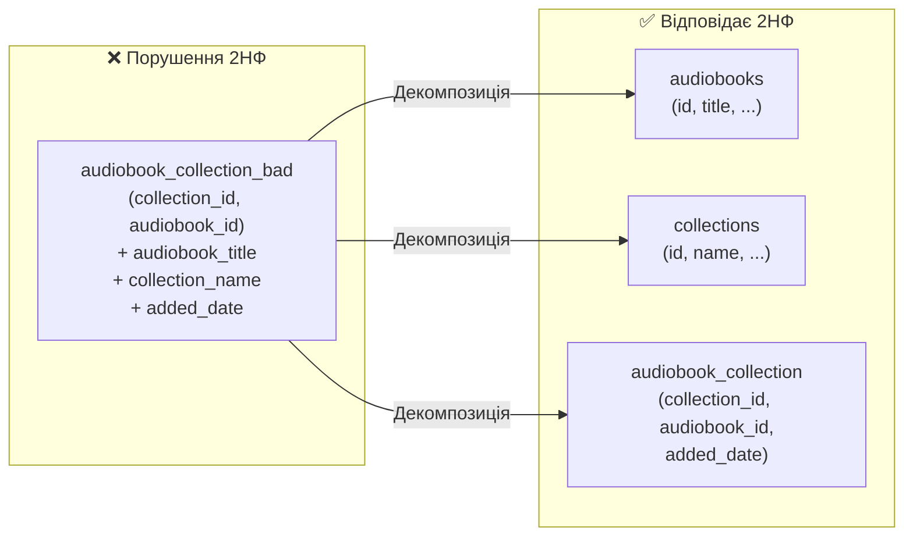

# Нормалізація: Гігієна даних та боротьба з аномаліями

## Вступ: Коли «це просто працює» — недостатньо

Уявіть таблицю, в якій зберігаються замовлення аудіокниг. Щоб не «бігати» в іншу таблицю за деталями, розробник вирішив покласти туди все одразу:

```sql
-- Антиприклад: «Денормалізована» таблиця
orders(
  order_id, user_id,
  audiobook_title, audiobook_duration, audiobook_release_year,
  author_first_name, author_last_name, author_bio,
  genre_name, genre_description,
  order_date, amount
)
```

На перший погляд — зручно: один запит і все є. Але що станеться, коли автор змінить прізвище? Доветься оновити **кожен рядок**, де фігурує цей автор. А якщо оновлення пройде частково — різні рядки міститимуть різні прізвища одного й того самого автора. Дані стали суперечливими.

Або ще гірше: якщо всі книги певного автора були видалені — разом з ними зникне і вся інформація про нього. Ми **ненавмисно позбулися** бізнес-критичних відомостей при видаленні транзакційних рядків.

Ці ситуації називаються **аномаліями даних** (Data Anomalies), і нормалізація є систематичним методом їх усунення.

::card-group

::card{title="Аномалія оновлення" icon="i-heroicons-pencil-square"}
Оновлення одного факту вимагає змін у багатьох рядках. Ризик часткового оновлення → дані стають суперечливими.

**Приклад:** зміна біографії автора в таблиці `orders` — потрібно знайти і оновити всі рядки з цим автором.
::

::card{title="Аномалія вставки" icon="i-heroicons-plus-circle"}
Неможливо вставити один факт без наявності іншого, хоча вони логічно незалежні.

**Приклад:** не можна додати нового автора без аудіокниги, якщо дані автора зберігаються лише в таблиці замовлень.
::

::card{title="Аномалія видалення" icon="i-heroicons-trash"}
Видалення одного факту ненавмисно знищує інший, незалежний.

**Приклад:** при видаленні останнього замовлення книги певного автора — разом з ним зникає вся інформація про жанр, автора тощо.
::

::

**Нормалізація** (Normalization) — це процес реструктуризації реляційної схеми відповідно до набору формальних правил — **нормальних форм** (Normal Forms). Кожна наступна форма є суворішою за попередню і усуває певний клас аномалій. На практиці переважна більшість реляційних схем доводиться до **третьої нормальної форми** (3НФ) або **нормальної форми Бойса-Кодда** (НФБК).

::note
**Нормалізація — це не самоціль.** Це інструмент для досягнення двох цілей: усунення надмірності (Redundancy) та захисту від аномалій. Як і будь-який інструмент, він має межі застосування — у деяких ситуаціях **свідома денормалізація** є правильним архітектурним рішенням. Але про це — ближче до кінця статті.
::

---

## Функціональні залежності: Математична основа Нормалізації

Нормальні форми визначаються через поняття **функціональної залежності** (Functional Dependency, FD). Це не метафора — це формальний математичний концепт, на якому стоїть уся теорія нормалізації.

**Визначення.** Кажуть, що атрибут (або група атрибутів) `Y` **функціонально залежить** від атрибута (або групи) `X`, і записують `X → Y`, якщо для кожного значення `X` існує рівно одне значення `Y`. Іншими словами: знаючи `X`, можна однозначно визначити `Y`.

Приклад із нашої платформи. В таблиці `audiobooks`:
- `id → title` — знаючи ідентифікатор аудіокниги, однозначно знаємо назву.
- `id → author_id` — знаючи ідентифікатор книги, знаємо її автора.
- `author_id → author_last_name` — якби прізвище автора зберігалося в `audiobooks`, воно функціонально залежало б від `author_id`.

### Повна та часткова залежність

Якщо первинний ключ є **складеним** (кілька стовпців), може виникнути ситуація, коли деякий атрибут залежить лише від **частини** ключа — але не від усього ключа цілком. Така залежність називається **частковою** (Partial Dependency).

Розглянемо гіпотетичну таблицю `audiobook_collection` з доданим атрибутом назви книги:

```
audiobook_collection(collection_id, audiobook_id, audiobook_title)
PK: (collection_id, audiobook_id)
```

Залежності:
- `(collection_id, audiobook_id) → audiobook_title` — повна? Ні.
- `audiobook_id → audiobook_title` — назва залежить **лише від частини** складеного ключа.

Це і є часткова залежність. Вона є причиною аномалій оновлення: якщо назву книги оновити у книзі, але забути оновити у junction-таблиці — виникає суперечність.

### Транзитивна залежність

**Транзитивна залежність** (Transitive Dependency) виникає, коли неключовий атрибут залежить від іншого неключового атрибута.

Уявімо, що в таблиці `audiobooks` зберігалися б `author_id`, `author_first_name` та `author_last_name`:

```
audiobooks(id, title, author_id, author_first_name, author_last_name, ...)
PK: id
```

Залежності:
- `id → author_id` — нормально, `author_id` є FK.
- `author_id → author_first_name` та `author_id → author_last_name` — ось вона, транзитивна залежність: ім'я автора залежить від `author_id`, а `author_id` залежить від `id`. Отже `id → author_first_name` — але через посередника.

Саме наявність транзитивних залежностей є причиною аномалій оновлення прізвища автора, описаних у вступі.

::note
Те, що ми вже зробили у попередній статті — виділивши `Author` в окрему таблицю і залишивши в `audiobooks` лише `author_id` — є точним виправленням транзитивної залежності. Нормалізація не дає нових знань; вона дає формальний інструмент для перевірки рішень, які інтуїтивно вже здаються правильними.
::

---

## Перша нормальна форма (1НФ): Атомарність

**Таблиця перебуває у першій нормальній формі (1НФ), якщо:**
1. Усі значення атрибутів є атомарними (неподільними).
2. Немає повторюваних груп атрибутів.
3. Усі рядки є унікальними (є первинний ключ).

Ці вимоги ми вже формулювали як «правила реляційної таблиці» у попередній статті. 1НФ — це мінімальна планка для того, щоб взагалі вважати таблицю реляційною.

### Порушення 1НФ: Неатомарні значення

Класичний антиприклад — зберігання списку значень в одному полі:

::tabs
::tabs-item{label="❌ Порушення 1НФ"}

```sql
-- ПОГАНО: кілька жанрів через кому
audiobooks(
  id, title, duration,
  genres  -- "Фантастика, Пригоди, Молодіжна"  ← не атомарно!
)
```

Проблеми:
- Пошук за жанром: `WHERE genres LIKE '%Фантастика%'` — повільно і ненадійно.
- Додавання жанру вимагає парсингу і конкатенації рядка.
- Підрахунок книг у жанрі — дуже складний запит.
::
::tabs-item{label="✅ Відповідає 1НФ"}

```sql
-- ДОБРЕ: окрема таблиця для зв'язку M:N з жанрами
-- (або FK на один жанр, як у нашій поточній схемі)

audiobooks(id, title, duration, genre_id) -- FK на один жанр
-- або
audiobook_genre(audiobook_id, genre_id)   -- junction-таблиця для M:N
```

Кожне значення тепер атомарне. Пошук, підрахунок і зміни — прості JOIN-запити.
::
::

### Порушення 1НФ: Повторювані групи

Інша форма порушення — кілька аналогічних стовпців для однотипних даних:

```sql
-- ПОГАНО: повторювані групи стовпців
audiobooks(
  id, title,
  file_path_1, format_1, size_1,  -- перший файл
  file_path_2, format_2, size_2,  -- другий файл
  file_path_3, format_3, size_3   -- третій файл
)
```

Що, якщо книга має 4 файла? 10? Рішення очевидне: окрема таблиця `audiobook_files` з FK `audiobook_id` — саме так і влаштована наша схема.

---

## Друга нормальна форма (2НФ): Усунення часткових залежностей

**Таблиця перебуває у другій нормальній формі (2НФ), якщо:**
1. Вона відповідає 1НФ.
2. Кожен неключовий атрибут **повністю** функціонально залежить від **усього** первинного ключа (а не від його частини).

Порушення 2НФ можливе лише у таблицях зі **складеним первинним ключем**. Таблиці зі сурогатним `UUID`-ключем автоматично відповідають 2НФ (адже у них нема «частини ключа», від якої міг би залежати атрибут).

### Приклад часткової залежності та декомпозиція

Розглянемо гіпотетичну таблицю — розширену junction-таблицю, де крім пари ключів також зберігається назва книги і назва колекції:

```
audiobook_collection_bad(collection_id, audiobook_id, audiobook_title, collection_name, added_date)
PK: (collection_id, audiobook_id)
```

Аналіз функціональних залежностей:
- `(collection_id, audiobook_id) → added_date` ✅ — залежить від повного PK.
- `audiobook_id → audiobook_title` ❌ — часткова залежність (лише від одного поля PK).
- `collection_id → collection_name` ❌ — часткова залежність.

**Декомпозиція** (розкладання на кілька таблиць з меншою кількістю залежностей):

```
audiobooks(id, title, ...)              -- audiobook_title залежить від audiobook_id
collections(id, name, ...)              -- collection_name залежить від collection_id
audiobook_collection(collection_id, audiobook_id, added_date)  -- лише added_date
```

Саме так виглядає наша поточна схема — і вона відповідає 2НФ.

::mermaid



::

---

## Третя нормальна форма (3НФ): Усунення транзитивних залежностей

**Таблиця перебуває у третій нормальній формі (3НФ), якщо:**
1. Вона відповідає 2НФ.
2. Жоден неключовий атрибут не залежить транзитивно від первинного ключа (тобто немає залежності від іншого неключового атрибута).

Формулювання Едгара Кодда, яке легше запам'ятати: «Кожен неключовий атрибут повинен залежати від ключа, всього ключа і нічого, крім ключа».

### Приклад транзитивної залежності та декомпозиція

Гіпотетична денормалізована таблиця `audiobooks`, де поруч із `author_id` зберігаються і дані автора:

```sql
-- ПОГАНО: транзитивна залежність через author_id
audiobooks_bad(
  id, title, duration, release_year,
  author_id,          -- FK
  author_first_name,  -- залежить від author_id → транзитив
  author_last_name,   -- залежить від author_id → транзитив
  author_bio          -- залежить від author_id → транзитив
)
```

Дерево залежностей:
```
id → author_id → author_first_name
id → author_id → author_last_name
id → author_id → author_bio
```

Це транзитивна залежність. Якщо автор змінить прізвище — треба оновити кожен рядок `audiobooks_bad`. Якщо у автора немає жодної книги — ми не можемо зберегти дані про нього (аномалія вставки).

**Декомпозиція** переносить дані автора в окрему таблицю:

```sql
-- ДОБРЕ: 3НФ
authors(id, first_name, last_name, bio)   -- author_id → author data
audiobooks(id, title, duration, release_year, author_id)  -- лише FK
```

Саме це і є у нашій схемі. `audiobooks` зберігає `author_id` як FK, а не дані автора безпосередньо.

---

## Нормальна форма Бойса-Кодда (НФБК)

**НФБК** (Boyce-Codd Normal Form, BCNF) — посилена версія 3НФ, сформульована Раймондом Бойсом (Raymond Boyce) та Едгаром Коддом у 1974 році.

**Таблиця відповідає НФБК, якщо** для кожної нетривіальної функціональної залежності `X → Y` атрибут `X` є **суперключем** (тобто однозначно визначає весь рядок).

Різниця між 3НФ і НФБК проявляється лише у таблицях, де:
- є **кілька складених кандидатних ключів**, і
- вони **перекриваються** (мають спільні атрибути).

Це досить рідкісна ситуація. Розглянемо класичний приклад:

```
Schedule(student, course, instructor)
-- Правила:
-- кожен студент на курсі призначається до одного викладача: (student, course) → instructor
-- кожен викладач веде лише один курс: instructor → course
-- Кандидатні ключі: (student, course) і (student, instructor)
```

Тут `instructor → course` — це залежність, де `instructor` не є суперключем. Це порушення НФБК, навіть якщо 3НФ виконана.

::note
**На практиці схема аудіоплатформи відповідає НФБК цілком.** Всі таблиці мають єдиний простий PK (UUID) без перекриваючихся кандидатних ключів. Більшість реальних схем, що відповідають 3НФ і спроектовані із сурогатними ключами, автоматично задовольняють і вимоги НФБК. Це ще одна перевага сурогатних ключів перед складеними натуральними.
::

---

## Свідома денормалізація: Виправданий Компроміс

Нормалізація — потужний інструмент, але вона має ціну. Нормалізована схема потребує `JOIN`-запитів для отримання пов'язаних даних, а `JOIN` — це операція, яка може бути дорогою при великих обсягах даних та високих навантаженнях.

Є ситуації, коли **навмисне» порушення нормальних форм виправдане і навіть необхідне** з точки зору продуктивності або зручності роботи. Такий прийом називається **денормалізацією** (Denormalization).

::warning
Денормалізація — це **свідомий, задокументований компроміс**, а не виправдання для ліні або поспіху при проектуванні. Вона повинна вводитися на основі вимірювань продуктивності (профайлінгу), а не припущень.
::

### Типові сценарії денормалізації

**1. Кешування агрегованих значень**

Уявімо, що сторінка профілю користувача показує кількість його колекцій і загальну кількість прослуханих аудіокниг. Нормалізована версія вимагає `COUNT(*)` з JOIN при кожному завантаженні сторінки.

Денормалізований підхід — додати стовпець `audiobook_count` до таблиці `collections`:

```sql
ALTER TABLE collections ADD COLUMN audiobook_count INTEGER DEFAULT 0;

-- При додаванні до колекції:
UPDATE collections SET audiobook_count = audiobook_count + 1
WHERE id = :collection_id;

-- При видаленні:
UPDATE collections SET audiobook_count = audiobook_count - 1
WHERE id = :collection_id;
```

Тепер читання кількості - миттєве. Але виникає нова відповідальність: повсюди, де змінюється вміст колекції, треба оновлювати і лічильник. Якщо десь пропустити — число стане некоректним.

**2. Матеріалізовані поля для пошуку**

Якщо на сторінці каталогу потрібно відображати «Автор: Іван Коваль» поруч з аудіокнигою — можна додати `author_display_name VARCHAR(130)` прямо в `audiobooks` і оновлювати його тригером або при зміні автора.

**3. Дублювання для аудиту / снепшотів**

У фінансових системах суму замовлення зберігають безпосередньо у рядку замовлення, навіть якщо ціна товару зберігається окремо. Це не аномалія — це навмисна фіксація факту: «на момент покупки ціна була такою». Дані змінюватимуться, але зафіксований знімок — ні.

::card-group

::card{title="Коли нормалізувати" icon="i-heroicons-check-circle"}
- На етапі проектування (завжди починайте нормалізованою)
- Коли цілісність даних важливіша за швидкість читання
- Коли дані часто оновлюються або видаляються
- OLTP-системи (Online Transaction Processing)
::

::card{title="Коли денормалізувати" icon="i-heroicons-bolt"}
- Після виміряної проблеми з продуктивністю
- Для даних, що переважно читаються (рідко оновлюються)
- Аналітичні запити, звіти (OLAP — Online Analytical Processing)
- Кешування агрегатів при стабільних правилах оновлення
::

::

---

## Аудит схеми аудіоплатформи

Перевіримо кожну таблицю нашої схеми на відповідність нормальним формам:

| Таблиця | 1НФ | 2НФ | 3НФ | Коментар |
|---|---|---|---|---|
| `authors` | ✅ | ✅ | ✅ | Простий UUID PK, всі атрибути атомарні й залежать лише від `id` |
| `genres` | ✅ | ✅ | ✅ | Аналогічно `authors` |
| `audiobooks` | ✅ | ✅ | ✅ | FK `author_id` та `genre_id` — лише посилання, не дані |
| `users` | ✅ | ✅ | ✅ | `email` — атомарне значення, немає транзитивних залежностей |
| `collections` | ✅ | ✅ | ✅ | `user_id` — FK, інші атрибути залежать лише від `id` |
| `audiobook_collection` | ✅ | ✅ | ✅ | Складений PK із двох FK, немає власних атрибутів |
| `audiobook_files` | ✅ | ✅ | ✅ | `format` — ENUM (атомарний), `audiobook_id` — FK |
| `listening_progresses` | ✅ | ✅ | ✅ | `position` та `last_listened` залежать від `id`, не один від одного |

**Висновок:** Схема аудіоплатформи відповідає 3НФ (і НФБК) цілком. Жодна таблиця не містить аномалій. Цей результат є прямим наслідком правильного логічного моделювання, виконаного у попередній статті: виділення окремих таблиць для кожної сутності є практичним вираженням вимог нормалізації.

---

## Практичні завдання

::steps

### Рівень 1 — Базовий: Визначення аномалій

Дана таблиця:

```
student_courses(student_id, student_name, student_email,
                course_id, course_title, instructor_name,
                grade, enrollment_date)
```

**Завдання:**
1. Визначте, яким нормальним формам відповідає ця таблиця (обґрунтуйте кожну).
2. Наведіть конкретний приклад аномалії оновлення.
3. Наведіть приклад аномалії видалення.

### Рівень 2 — Декомпозиція: Нормалізація до 3НФ

Задана ненормалізована таблиця інтернет-магазину:

```
orders(order_id, customer_id, customer_name, customer_email,
       product_id, product_name, product_category, category_description,
       quantity, unit_price, total_price, order_date)
```

**Завдання:**
1. Знайдіть усі функціональні залежності.
2. Виявте порушення 1НФ, 2НФ, 3НФ (якщо є).
3. Виконайте декомпозицію до 3НФ — перелічіть нові таблиці зі стовпцями.
4. Чи `total_price` є похідним атрибутом? Аргументуйте, чи варто його зберігати.

### Рівень 3 — Проектування: Нормалізація vs Денормалізація

Система аналітики платформи аудіокниг повинна відповідати на такі запити у реальному часі:
- «Скільки хвилин прослухав кожен користувач за останній місяць?»
- «Які 10 найпопулярніших аудіокниг за кількістю слухачів?»
- «Середній рейтинг кожного автора?»

**Завдання:**
1. Які таблиці та з'єднання (JOIN) потребують ці запити у нормалізованій схемі?
2. Де є сенс ввести денормалізацію? Запропонуйте конкретні стовпці/таблиці.
3. Які ризики несе кожна з ваших денормалізацій? Як їх мінімізувати?

::

---

## Підсумок

Нормалізація — це не бюрократія і не академічна формальність. Це систематичний метод, що захищає схему від трьох класів аномалій: оновлення, вставки та видалення.

- **1НФ** усуває неатомарні значення та повторювані групи.
- **2НФ** усуває часткові залежності від складеного ключа.
- **3НФ** усуває транзитивні залежності між неключовими атрибутами.
- **НФБК** закриває рідкісні випадки з перекриваючимися кандидатними ключами.

Схема аудіоплатформи відповідає 3НФ/НФБК — не тому, що ми спеціально «нормалізували», а тому, що правильне логічне моделювання природньо приводить до нормалізованої структури.

У наступній статті ми перейдемо до **фізичного рівня**: перетворимо логічну схему на реальний DDL-код, дослідимо специфіку типів даних H2, синтаксис обмежень та стратегії індексування.
