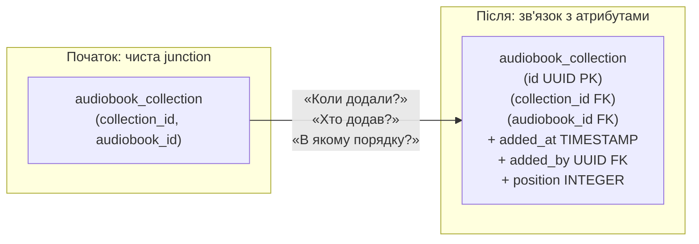

# Архітектурна класифікація таблиць

## Вступ: Не всі таблиці однакові

База даних із п'ятнадцяти таблиць. Розробник відкриває схему і бачить: `genres`, `authors`, `audiobooks`, `users`, `collections`, `audiobook_collection`, `audiobook_files`, `listening_progresses`... Чи можна ставитися до всіх однаково? Чи однакова стратегія індексування, кешування, архівації та видалення підходить для кожної з них?

Ні. І ця відмінність — не нюанс, а фундаментальна архітектурна концепція.

Таблиці в реляційній схемі виконують принципово різні ролі. Таблиця `genres` — майже незмінна колекція з десяти рядків. Таблиця `listening_progresses` — потік подій, що може зростати на мільйони записів на місяць. Обидві зберігають дані, обидві виглядають однаково у SQL — але потребують абсолютно різних підходів до проектування та операційного обслуговування.

**Класифікація таблиць** за їхньою роллю та характером змін дозволяє:
- обирати правильні стратегії **кешування** (на старті vs на запит vs не кешувати взагалі);
- ухвалювати обґрунтовані рішення про **індексування**;
- планувати **архівацію та розбиття** (partitioning) даних;
- раціонально застосовувати **м'яке видалення** (Soft Delete) та **аудит змін**.

У цій статті ми розглянемо чотири основних типи таблиць, що зустрічаються у реляційних схемах, і пов'яжемо кожен із конкретними прикладами аудіоплатформи.

::note
Класифікація, що наводиться далі, не є єдиним загальновизнаним стандартом — у різних джерелах терміни можуть відрізнятися. Але закладені за нею концепції є універсальними і застосовуються у будь-якій реляційній системі.
::

---

## Тип 1. Статичні довідники (Static Reference Tables)

**Статичний довідник** — таблиця, що зберігає обмежений і рідкозмінюваний набір значень, що визначають «словник» предметної області. Ці значення, як правило, задаються адміністратором при початковому налаштуванні системи і рідко змінюються протягом її життєвого циклу.

**Характеристики:**
- Невелика кількість рядків (зазвичай від одиниць до кількох сотень).
- Дані змінюються рідко або не змінюються взагалі.
- Є джерелом FK для інших таблиць.
- Не мають власних FK (або мають, але рідко).

**Приклад з аудіоплатформи:** `genres`.

Таблиця `genres` містить фіксований перелік літературних жанрів: «Фантастика», «Роман», «Дитяча literatura» тощо. Жанри задаються системним адміністратором при запуску платформи та вкрай рідко поповнюються новими. Кожна аудіокнига посилається на рядок цієї таблиці через `genre_id`.

```sql
-- Статичний довідник: genres
-- Типові характеристики: ~5-50 рядків, рідко оновлюється
SELECT id, name FROM genres;
-- Результат: 5 фіксованих жанрів
```

### Стратегії роботи зі статичними довідниками

**Кешування на старті (Startup Cache).** Оскільки дані довідника змінюються рідко, їх ефективно завантажити в пам'ять застосунку при старті та використовувати з кешу, не звертаючись до БД при кожному запиті:

```java
// Завантаження довідника при старті
public class GenreCache {
    private final Map<UUID, Genre> cache = new HashMap<>();

    public void initialize(GenreRepository repository) {
        repository.findAll().forEach(g -> cache.put(g.id(), g));
    }

    public Genre getById(UUID id) {
        return cache.get(id);  // O(1), без звернення до БД
    }
}
```

**Java Enum як дзеркало довідника.** Якщо перелік значень відомий на етапі компіляції та вкрай стабільний — можна продублювати їх у Java-перерахуванні:

```java
public enum Genre {
    FICTION("Фантастика"),
    NOVEL("Роман"),
    CHILDREN("Дитяча література"),
    HISTORICAL("Історичний роман"),
    DETECTIVE("Детектив");

    private final String displayName;
    // ...
}
```

::warning
**Ризик несинхронізації.** Якщо адміністратор додасть новий жанр до БД — Java Enum застаріє до наступного релізу. Тому Enum-підхід підходить лише для значень, що **ніколи** або **майже ніколи** не змінюватимуться (наприклад, формати файлів `mp3`, `flac` тощо). Для жанрів — краще динамічний кеш.
::

---

## Тип 2. Стрижневі таблиці / Master Data (Core Entities)

**Стрижнева таблиця** (Master Table, Core Entity) — таблиця, що зберігає основний масив бізнес-об'єктів системи. Це «центр ваги» схеми: на неї посилаються численні інші таблиці, вона активно росте та оновлюється, і саме вона несе в собі найважливіші доменні сутності.

**Характеристики:**
- Активне зростання (сотні, тисячі, мільйони рядків).
- Дані регулярно додаються, рідше оновлюються, ще рідше видаляються.
- Є джерелом FK для транзакційних і junction-таблиць.
- Часто потребують підтримки **м'якого видалення** (Soft Delete).
- Потребують повнотекстового пошуку та пагінації.

**Приклади з аудіоплатформи:** `authors`, `audiobooks`, `users`.

Ці три таблиці — «хребет» платформи. `audiobooks` зростатиме зі збільшенням каталогу. `users` — зі збільшенням аудиторії. `authors` — з появою нових авторів. Хтось посилається майже на всіх: `audiobooks.author_id`, `listening_progresses.user_id`, `collections.user_id` тощо.

### М'яке видалення (Soft Delete)

Для стрижневих таблиць **фізичне видалення рядка** часто є неприйнятним. Якщо видалити автора — зникнуть усі його книги (CASCADE), що може бути недопустимо з юридичної чи бізнес-точки зору (замовлення, оплати, статистика).

Замість фізичного видалення застосовують **м'яке видалення**: додається стовпець `deleted_at TIMESTAMP`, і рядок позначається як видалений без фактичного зникнення з таблиці:

```sql
-- Додаємо підтримку soft delete до authors
ALTER TABLE authors ADD COLUMN deleted_at TIMESTAMP;

-- Замість DELETE:
UPDATE authors SET deleted_at = CURRENT_TIMESTAMP WHERE id = :id;

-- Усі «активні» запити фільтрують видалені:
SELECT * FROM authors WHERE deleted_at IS NULL;

-- Перегляд видалених (адміністративний):
SELECT * FROM authors WHERE deleted_at IS NOT NULL;
```

::tip
Щоб не забувати про фільтр `WHERE deleted_at IS NULL` у кожному запиті, в Java зазвичай налаштовують **глобальний фільтр на рівні репозиторію**. Data Mapper, що розглядається у наступному модулі, може реалізувати це через базовий клас або декоратор.
::

### Пагінація та повнотекстовий пошук

Стрижневі таблиці потребують **пагінації** при відображенні каталогу:

```sql
-- Сторінка каталогу: 20 книг, починаючи з 41-ї
SELECT ab.id, ab.title, a.first_name, a.last_name
  FROM audiobooks ab
  JOIN authors a ON ab.author_id = a.id
 WHERE ab.deleted_at IS NULL
 ORDER BY ab.title
 LIMIT 20 OFFSET 40;
```

Для пошуку за назвою або автором використовуються або `LIKE '%query%'` (повільно, без індексу), або повнотекстовий пошук засобами СУБД (`tsvector`/`tsquery` у PostgreSQL, `FTS` у H2), або зовнішній рушій (Elasticsearch).

---

## Тип 3. Статично-динамічні довідники (Semi-Static Reference)

**Статично-динамічний довідник** — перехідний тип між статичним довідником і стрижневою таблицею. Дані змінюються рідше, ніж у master-таблиці, але частіше, ніж у статичному довіднику. Можуть мати власні FK та додаткові атрибути.

**Характеристики:**
- Середній обсяг (десятки або сотні рядків).
- Оновлюються інколи, частіше — адміністратором, не кінцевим користувачем.
- Можуть мати власні FK на інші довідники.
- Кешування можливе, але з TTL (час актуальності кешу).

**Гіпотетичний приклад для аудіоплатформи:** `subscription_plans` (плани підписки).

Якби платформа мала систему підписок із планами `free`, `basic`, `premium` — ці плани були б статично-динамічним довідником. Їх кілька штук, вони рідко змінюються (зміна ціни — це подія, а не регулярна операція), але адміністратор може оновлювати їх:

```sql
CREATE TABLE subscription_plans (
    PRIMARY KEY (id),
    id           UUID         NOT NULL,
    name         VARCHAR(64)  NOT NULL UNIQUE,  -- 'free', 'basic', 'premium'
    price_usd    DECIMAL(8,2) NOT NULL,
    max_devices  INTEGER,                       -- NULL = необмежено
    updated_at   TIMESTAMP    NOT NULL          -- аудит змін ціни
);
```

Кешування таких даних можливе з **TTL** (Time-To-Live): завантажуємо раз на годину (або на добу), а не на кожен запит і не раз назавжди при старті.

---

## Тип 4. Таблиці-зв'язки (Junction / Association Tables)

**Таблиця-зв'язка** (Junction Table, Bridge Table, Associative Table) — існує виключно для розв'язання зв'язку M:N між двома іншими таблицями. Вона не несе самостійного бізнес-смислу поза своєю роллю «посередника».

**Характеристики:**
- Містить лише FK до двох (або більше) пов'язаних таблиць.
- Складений PK з цих FK гарантує унікальність пар.
- Не має власного UUID-ідентифікатора (або має — але це вже «доросла» версія).
- Операції — переважно INSERT та DELETE (додавання/видалення зв'язків).

**Приклад з аудіоплатформи:** `audiobook_collection`.

Таблиця `audiobook_collection` не знає нічого про колекцію і нічого про аудіокнигу — вона лише фіксує факт їхнього зв'язку:

```sql
-- audiobook_collection: чиста junction-таблиця
-- Складений PK: (collection_id, audiobook_id) — uniq пара
SELECT collection_id, audiobook_id FROM audiobook_collection;
```

### Еволюція junction-таблиці: Коли вона «дорослішає»

Junction-таблиця часто починає своє існування як чистий посередник. Але бізнес-вимоги змінюються, і посередник «обростає» власними атрибутами. У цей момент він перестає бути чистою junction-таблицею і стає **зв'язком з атрибутами** (Relationship with Attributes) — повноцінною сутністю:

::mermaid



::

Щойно до таблиці-зв'язки додається хоча б один власний атрибут — рекомендується ввести сурогатний PK (`id UUID`) замість складеного, адже тепер на цей рядок може з'явитися необхідність посилатися з інших таблиць.

---

## Тип 5. Транзакційні / Подієві таблиці (Transaction / Event Tables)

**Транзакційна таблиця** фіксує **факти та події** — окремі дії, що відбулися у системі в певний момент часу. На відміну від master-даних (що описують сутності) або junction-таблиць (що описують зв'язки), транзакційна таблиця описує **що сталося і коли**.

**Характеристики:**
- **Інтенсивний запис** (INSERT): нові події генеруються постійно.
- Записи практично **ніколи не оновлюються** і рідко видаляються (факт минулого незмінний).
- Обсяг може зростати дуже швидко — до мільярдів рядків у великих системах.
- Запити часто обмежені часовим вікном: «за останній тиждень», «за сьогодні».
- Старі дані можуть бути **заархівовані або видалені** за TTL.

**Приклад з аудіоплатформи:** `listening_progresses`.

Таблиця `listening_progresses` фіксує, на якому місці користувач зупинився. При кожній паузі або завершенні сесії у неї пишеться новий рядок. Для активної платформи з тисячами користувачів — це сотні тисяч INSERT на день.

```sql
-- listening_progresses: транзакційна таблиця
-- Часовий зріз: прогрес за останній тиждень
SELECT lp.user_id, lp.audiobook_id, lp.position, lp.last_listened
  FROM listening_progresses lp
 WHERE lp.last_listened >= CURRENT_TIMESTAMP - INTERVAL '7 days'
 ORDER BY lp.last_listened DESC;
```

### Стратегії управління транзакційними таблицями

**Partitioning (Партиціонування).** Великі транзакційні таблиці розбивають на **розділи** за часовим критерієм (наприклад, окрема секція за місяць). Це дозволяє видалити застарілі дані, просто відкинувши старий розділ, а не виконуючи повільний масовий `DELETE`.

**TTL (Time-To-Live).** Для систем, де старий прогрес не цікавий (наприклад, прогрес старше 2 років), запускається фоновий процес очищення:

```sql
-- Видалення прогресів старше 2 років (архівна задача)
DELETE FROM listening_progresses
 WHERE last_listened < CURRENT_TIMESTAMP - INTERVAL '2 years';
```

**Агрегація у summary-таблиці.** Замість або на додаток до зберігання кожного окремого прогресу — підтримується агрегована таблиця зі статистикою: `user_statistics(user_id, total_listening_minutes, last_updated)`. Вона оновлюється асинхронно і дозволяє швидко відповідати на аналітичні запити.

::warning
**Транзакційна таблиця без стратегії архівації — це бомба уповільненої дії.** Через рік-два вона може стати найбільшою таблицею у схемі та причиною деградації продуктивності. Плануйте архівацію або TTL ще на етапі проектування, а не коли вже «горить».
::

---

## Зведена класифікація: Аудіоплатформа під мікроскопом

Тепер застосуємо класифікацію до усіх таблиць нашої схеми. Ця таблиця — практичний довідник, що показує, який тип має кожна таблиця, наскільки інтенсивно змінюється і яку стратегію рекомендовано:

| Таблиця | Тип | Частота змін | Кешування | Архівація | Soft Delete |
|---|---|---|---|---|---|
| `genres` | Статичний довідник | Дуже рідко | ✅ На старті | ❌ | ❌ |
| `authors` | Master Data | Рідко/помірно | ⚡ Per-request | ❌ | ✅ Рекомендовано |
| `audiobooks` | Master Data | Помірно | ⚡ Per-request | ❌ | ✅ Рекомендовано |
| `users` | Master Data | Помірно | ❌ (приватні дані) | ❌ | ✅ Рекомендовано |
| `collections` | Master Data | Помірно | ❌ | ❌ | ⚠️ Опціонально |
| `audiobook_collection` | Junction | Часто (add/remove) | ❌ | ❌ | ❌ |
| `audiobook_files` | Junction/Weak | Рідко | ⚡ Per-request | ❌ | ❌ |
| `listening_progresses` | Транзакційна | Дуже часто | ❌ | ✅ TTL / Partition | ❌ |

::card-group

::card{title="Статичний довідник" icon="i-heroicons-bookmark"}
**Genres, file_format_enum**
- Кеш на старті застосунку
- Java Enum для стабільних значень
- Рідко потребує індексів (мало рядків)
::

::card{title="Master Data" icon="i-heroicons-server-stack"}
**Authors, Audiobooks, Users**
- Пагінація + повнотекстовий пошук
- Soft Delete замість фізичного видалення
- Індекси на FK і пошукові поля
::

::card{title="Junction Table" icon="i-heroicons-arrows-right-left"}
**Audiobook_Collection**
- Складений PK або сурогатний ID
- Еволюція: може «дорослішати» з атрибутами
- Каскадне видалення при видаленні батьків
::

::card{title="Транзакційна" icon="i-heroicons-bolt"}
**Listening_Progresses**
- Інтенсивний INSERT, ніколи UPDATE
- TTL або партиціонування за датою
- Агрегація у summary-таблицях для аналітики
::

::

---

## Практичні завдання

::steps

### Рівень 1 — Базовий: Класифікація

Дана схема системи доставки їжі з такими таблицями:
`restaurants`, `menu_categories`, `menu_items`, `customers`, `orders`, `order_items`, `delivery_agents`, `delivery_events`

**Завдання:**
1. Визначте тип кожної таблиці (статичний довідник, master data, junction або транзакційна).
2. Для кожного типу вкажіть частоту очікуваних змін (рідко/помірно/часто).
3. Які таблиці потребують Soft Delete? Обґрунтуйте.

### Рівень 2 — Архітектура: Стратегії

Для таблиці `delivery_events` (фіксує кожен статус доставки: «прийнято», «готується», «у дорозі», «доставлено», «скасовано»):

**Завдання:**
1. Дайте їй DDL з усіма необхідними полями та обмеженнями.
2. Оцініть річний обсяг: якщо платформа обробляє 10 000 замовлень на добу і кожне має ~5 подій — скільки рядків за рік?
3. Запропонуйте стратегію архівації або партиціонування.
4. Чи варто кешувати статуси подій? Чому?

### Рівень 3 — Проектування: Еволюція junction-таблиці

У вашій схемі є junction-таблиця `student_courses(student_id, course_id)`. Приходять нові вимоги:
- Потрібно знати дату запису студента на курс.
- Студент може мати статус на курсі: «активний», «завершив», «відраховано».
- До кожного завершення прикріплюється фінальна оцінка.
- Потрібна можливість коментувати запис (внутрішня нотатка куратора).

**Завдання:**
1. Трансформуйте `student_courses` відповідно до нових вимог — яким типом вона стане після еволюції?
2. Напишіть оновлений DDL.
3. Чи варто зберегти складений PK або перейти на сурогатний? Аргументуйте.
4. На яку таблицю класифікації схожа ця «доросла» версія?

::

---

## Підсумок

Класифікація таблиць — це не академічна вправа, а практичний інструмент, що впливає на десятки конкретних рішень у ході розробки та підтримки системи:

- **Статичні довідники** кешуються на старті і майже не оновлюються — `genres` у нашій платформі.
- **Master Data** — серце системи: `authors`, `audiobooks`, `users`. Потребують Soft Delete, пагінації та повнотекстового пошуку.
- **Статично-динамічні довідники** — між довідником і master; кешуються з TTL.
- **Junction-таблиці** — чисті посередники для M:N, що з часом можуть «дорослішати».
- **Транзакційні таблиці** — `listening_progresses`: інтенсивний INSERT, потребують TTL або партиціонування.

Розуміючи тип таблиці, ви одразу знаєте, як її кешувати, як архівувати, чи потрібен soft delete і яку стратегію видалення обирати. Це перетворює проектування схеми з набору ізольованих рішень на системний архітектурний процес.

У наступній статті ми перейдемо від статичної схеми до **динамічної**: розглянемо версіонування схеми за допомогою **Flyway** — інструменту, що перетворює еволюцію бази даних на керований, відтворюваний процес.
