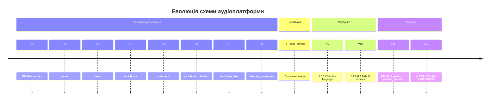

# Database Migrations: Версіонування схеми з Flyway

## Вступ: Схема — це не статичний артефакт

Уявіть команду, що розробляє аудіоплатформу. Три розробники. Перший додає таблицю `reviews`. Другий — стовпець `language` до `audiobooks`. Третій перейменовує `listening_progresses.position` на `position_seconds` для ясності.

Без системного підходу ці зміни потраплять до схеми хаотично: хтось виконає `ALTER TABLE` у консолі локального H2, хтось напише нотатку у чат, а хтось просто забуде синхронізувати розробницьке середовище з тестовим. Щойно проєкт виходить за межі одного розробника — ручне управління схемою стає джерелом нескінченних помилок.

**Міграція схеми** (Schema Migration) — це підхід, при якому кожна зміна структури бази даних оформлюється як **версіонований, атомарний скрипт**, що зберігається разом із кодом у системі контролю версій (Git) і виконується автоматично. Схема еволюціонує контрольовано, кожна зміна — відтворювана і зворотно сумісна з іншими середовищами.

**Flyway** — провідний інструмент міграцій для JVM-екосистеми. Він прозорий у роботі, легко підключається до будь-якого Java-проєкту через Maven, Gradle або напряму через API, і підтримує H2, PostgreSQL, MySQL, Oracle та ще десятки СУБД.

::card-group

::card{title="Без міграцій — хаос" icon="i-heroicons-x-circle"}
- Схема у кожного розробника різна
- Переведення на новий сервер — ручна робота
- Неможливо відтворити стан схеми місячної давнини
- `ALTER TABLE` в prod — виконується вручну, з ризиком помилки
::

::card{title="З Flyway — порядок" icon="i-heroicons-check-circle"}
- Кожна зміна схеми — SQL-файл у Git
- Flyway застосовує міграції автоматично при старті
- Стан схеми відтворюється на будь-якому середовищі
- Версія схеми синхронізована з версією коду
::

::

---

## Ключові концепції Flyway

### Таблиця версій (Schema History Table)

При першому запуску Flyway автоматично створює у вашій базі спеціальну таблицю — `flyway_schema_history`. Вона зберігає інформацію про кожну виконану міграцію:

```sql
-- Структура flyway_schema_history (спрощено)
flyway_schema_history(
    installed_rank INTEGER,   -- порядковий номер виконання
    version        VARCHAR,   -- версія: '1', '1.1', '2' тощо
    description    VARCHAR,   -- опис з назви файлу
    type           VARCHAR,   -- 'SQL' або 'JAVA'
    script         VARCHAR,   -- назва файлу міграції
    checksum       INTEGER,   -- контрольна сума файлу
    success        BOOLEAN    -- чи виконана успішно
)
```

Перш ніж виконати будь-яку міграцію, Flyway перевіряє цю таблицю і розуміє, які версії вже застосовані, а які — ні.

### Три типи міграцій

::note
Flyway розрізняє три принципово різні типи міграційних скриптів, кожен для своїх завдань.
::

**1. Versioned Migrations** (версіоновані) — основний тип. Виконуються рівно **один раз** у порядку зростання версії. Ідеальні для DDL-змін: `CREATE TABLE`, `ALTER TABLE`, `DROP TABLE`.

**2. Repeatable Migrations** (повторювані) — виконуються щоразу, коли змінюється їх вміст (контрольна сума). Ідеальні для Views, Stored Procedures, початкових даних-довідників.

**3. Undo Migrations** (відкочування) *(тільки у Flyway Teams/Enterprise)* — дозволяють скасувати попередню версіоновану міграцію. У безкоштовній версії скасування реалізується через нову «вперед» міграцію.

### Naming Convention: Найважливіше правило

Flyway розпізнає тип і версію міграції виключно за іменем файлу. Шаблон суворий:

```
V{version}__{description}.sql          ← Versioned
R__{description}.sql                   ← Repeatable
U{version}__{description}.sql          ← Undo (Teams)
```

**Правила:**
- `V` та `U` — великі латинські літери.
- Версія може бути цілим числом (`1`, `2`) або крапковим (`1.1`, `2.3.1`).
- Між версією та описом — **два підкреслення** (`__`). Не одне, не три — два.
- Опис у назві файлу може містити слова та одиночні підкреслення.
- Розширення файлу: `.sql` для SQL-міграцій.

Коректні приклади:
```
V1__initial_schema.sql
V2__add_reviews_table.sql
V2_1__add_language_to_audiobooks.sql
V3__rename_position_column.sql
R__seed_genres.sql
R__seed_subscription_plans.sql
```

::caution
**Забороняється змінювати вміст вже виконаної версіонованої міграції.** Flyway зберігає контрольну суму (checksum) кожного файлу. Якщо після виконання міграції `V2__...sql` її вміст змінити — Flyway виявить розбіжність і відмовиться стартувати. Це захист від «тихих» модифікацій схеми у виробництві.
::

---

## Підключення Flyway до Java-проєкту

Flyway підключається до проєкту як бібліотека і запускається програмно — при старті додатку або через Maven/Gradle плагін. Розглянемо підключення для чистого Java-проєкту (без Spring), що використовує H2.

### 1. Залежності

::tabs
::tabs-item{label="Maven (pom.xml)"}

```xml
<dependencies>
    <!-- Flyway core — обов'язкова -->
    <dependency>
        <groupId>org.flywaydb</groupId>
        <artifactId>flyway-core</artifactId>
        <version>10.15.0</version>
    </dependency>

    <!-- H2 — вбудована СУБД для розробки/тестування -->
    <dependency>
        <groupId>com.h2database</groupId>
        <artifactId>h2</artifactId>
        <version>2.3.232</version>
    </dependency>
</dependencies>
```

::
::tabs-item{label="Gradle (build.gradle.kts)"}

```kotlin
dependencies {
    implementation("org.flywaydb:flyway-core:10.15.0")
    implementation("com.h2database:h2:2.3.232")
}
```

::
::

### 2. Структура директорій

За замовчуванням Flyway шукає SQL-скрипти у директорії `classpath:db/migration`. У Maven/Gradle-проєкті це відповідає:

```
src/
└── main/
    ├── java/
    │   └── com/example/audiobook/
    │       └── Main.java
    └── resources/
        └── db/
            └── migration/              ← тут живуть всі міграції
                ├── V1__initial_schema.sql
                ├── V2__add_reviews.sql
                ├── V3__add_language_to_audiobooks.sql
                └── R__seed_genres.sql
```

::tip
Директорію можна змінити через конфігурацію (`locations`). Поширена практика для великих проєктів — використовувати кілька директорій: `db/migration` для DDL та `db/seed` для тестових даних.
::

### 3. Програмний запуск

Flyway запускається через builder API. Простий клас для ініціалізації БД:

```java
import org.flywaydb.core.Flyway;
import javax.sql.DataSource;
import org.h2.jdbcx.JdbcDataSource;

public class DatabaseConfig {

    public static DataSource createDataSource() {
        // H2 у файловому режимі (дані зберігаються між запусками)
        JdbcDataSource ds = new JdbcDataSource();
        ds.setURL("jdbc:h2:./data/audiobook_db;MODE=PostgreSQL");
        ds.setUser("sa");
        ds.setPassword("");
        return ds;
    }

    public static void runMigrations(DataSource dataSource) {
        Flyway flyway = Flyway.configure()
            .dataSource(dataSource)
            // Flyway шукатиме скрипти тут:
            .locations("classpath:db/migration")
            // Дозволити виконання міграцій на порожній БД (без baseline):
            .baselineOnMigrate(false)
            // Не дозволяти виконання міграцій з майбутніх версій:
            .outOfOrder(false)
            .load();

        // Виконати всі незастосовані міграції:
        var result = flyway.migrate();
        System.out.printf(
            "Flyway: applied %d migrations, current version: %s%n",
            result.migrationsExecuted,
            result.targetSchemaVersion
        );
    }

    public static DataSource initialize() {
        DataSource ds = createDataSource();
        runMigrations(ds);
        return ds;
    }
}
```

```java
// Main.java — точка входу
public class Main {
    public static void main(String[] args) {
        // 1. Ініціалізуємо БД і запускаємо міграції:
        DataSource dataSource = DatabaseConfig.initialize();

        // 2. Далі — бізнес-логіка додатку
        System.out.println("Application started. DB schema is up to date.");
    }
}
```

### 4. H2 — режими роботи

H2 підтримує кілька режимів, і вибір URL впливає на поведінку:

| URL | Режим | Дані після рестарту |
|---|---|---|
| `jdbc:h2:mem:testdb` | In-memory | ❌ Зникають |
| `jdbc:h2:./data/mydb` | File-based (embedded) | ✅ Зберігаються |
| `jdbc:h2:tcp://localhost/~/mydb` | Server mode | ✅ Зберігаються |

Для розробки і тестових запусків зручний файловий режим. Для unit-тестів — in-memory (кожен тест отримує чисту базу).

::note
Параметр `MODE=PostgreSQL` у рядку підключення H2 вмикає режим сумісності з PostgreSQL: підтримується ENUM через `CREATE TYPE`, інший синтаксис операцій тощо. Це дозволяє писати міграції один раз і виконувати їх як на H2 (розробка/тести), так і на PostgreSQL (production) з мінімальними відмінностями.
::

---

## Практика: Перетворення DDL аудіоплатформи на міграції

У попередній статті ([Фізична схема: Від абстракції до DDL](/java/pr2/physical-schema)) ми написали єдиний монолітний DDL-скрипт, що створює всі таблиці аудіоплатформи. З точки зору одноразового розгортання це прийнятно. Але уявіть: через місяць потрібно додати поле `language` до `audiobooks`, ще через тиждень — таблицю `reviews`, а потім — перейменувати стовпець `position` на `position_seconds` для ясності. Якщо всі ці зміни вносити в один монолітний файл, команда втрачає здатність відтворювати проміжні стани схеми, а production-сервер потребує ручного виконання `ALTER TABLE`.

Правильний підхід — **розбити початковий DDL на версійовані міграції** і надалі кожну зміну оформлювати як окремий файл. Перша міграція (`V1`) є «точкою відліку» — вона фіксує стан схеми на момент першого розгортання.

### Стратегія декомпозиції

При розбитті монолітного DDL на міграції Flyway важливо дотриматися двох принципів:

**Принцип 1: Кожна міграція — атомарна одиниця змін.** Ідеальна міграція стосується однієї таблиці або одного логічного кроку (створення ENUM, потім таблиці, потім індексів). Це спрощує повторне читання журналу (`flyway_schema_history`) і локалізацію проблем.

**Принцип 2: Порядок міграцій відповідає порядку залежностей FK.** Flyway виконує міграції у зростаючому порядку версій, тому `V1` (ENUM + `authors`) має передувати `V3` (`audiobooks`, яка посилається на `authors`).

Для нашої схеми декомпозиція виглядає так:

| Міграція | Файл | Зміст |
|---|---|---|
| V1 | `V1__create_enum_and_authors.sql` | ENUM `file_format_enum`, таблиця `authors` |
| V2 | `V2__create_genres.sql` | Таблиця `genres` |
| V3 | `V3__create_users.sql` | Таблиця `users`, індекс по `email` |
| V4 | `V4__create_audiobooks.sql` | Таблиця `audiobooks`, індекси по FK |
| V5 | `V5__create_collections.sql` | Таблиця `collections` |
| V6 | `V6__create_audiobook_collection.sql` | Junction-таблиця `audiobook_collection` |
| V7 | `V7__create_audiobook_files.sql` | Таблиця `audiobook_files`, індекс |
| V8 | `V8__create_listening_progresses.sql` | Таблиця `listening_progresses`, індекси |

::note
Поділ на 8 окремих файлів може здатися надмірним для початкової схеми. На практиці деякі команди об'єднують незалежні таблиці в одну першу міграцію (`V1__initial_schema.sql`). Обидва підходи правомірні. Детальна декомпозиція дає кращу читабельність журналу та простішу відладку конфліктів між версіями у великій команді.
::

### Структура директорій міграцій

::code-tree

```text [src/main/resources/db/migration/V1__create_enum_and_authors.sql]
-- Крок 1: ENUM-тип (має передувати audiobook_files)
-- Крок 2: Таблиця authors (незалежна сутність)
```

```text [src/main/resources/db/migration/V2__create_genres.sql]
-- Таблиця genres (незалежна сутність)
```

```text [src/main/resources/db/migration/V3__create_users.sql]
-- Таблиця users + індекс по email
```

```text [src/main/resources/db/migration/V4__create_audiobooks.sql]
-- Таблиця audiobooks (FK → authors, genres) + індекси
```

```text [src/main/resources/db/migration/V5__create_collections.sql]
-- Таблиця collections (FK → users)
```

```text [src/main/resources/db/migration/V6__create_audiobook_collection.sql]
-- Junction-таблиця audiobook_collection (FK → collections, audiobooks)
```

```text [src/main/resources/db/migration/V7__create_audiobook_files.sql]
-- Таблиця audiobook_files (FK → audiobooks) + індекс
```

```text [src/main/resources/db/migration/V8__create_listening_progresses.sql]
-- Таблиця listening_progresses (FK → users, audiobooks) + індекси
```

::

### Покрокове створення міграцій

Розглянемо зміст кожного файлу. Зверніть увагу: SQL-код у міграціях **ідентичний** вмісту монолітного DDL-скрипту — змінюється лише спосіб організації файлів.

::steps

### Крок 1: V1 — ENUM та таблиця `authors`

Перша міграція оголошує ENUM-тип і створює першу незалежну таблицю:

```sql
-- V1__create_enum_and_authors.sql

-- ENUM для форматів аудіофайлів.
-- Оголошуємо першим, бо audiobook_files.format залежатиме від нього.
CREATE TYPE file_format_enum AS ENUM ('mp3', 'ogg', 'wav', 'm4b', 'aac', 'flac');

-- Таблиця авторів. Немає жодних FK — незалежна сутність.
CREATE TABLE authors (
    PRIMARY KEY (id),
    id         UUID          NOT NULL,
    first_name VARCHAR(64)   NOT NULL,
    last_name  VARCHAR(64)   NOT NULL,
    bio        TEXT,
    image_path VARCHAR(2048)
);
```

### Крок 2: V2 — Таблиця `genres`

```sql
-- V2__create_genres.sql

CREATE TABLE genres (
    PRIMARY KEY (id),
    id          UUID        NOT NULL,
    name        VARCHAR(64) NOT NULL,
                CONSTRAINT genres_name_key UNIQUE (name),
    description TEXT
);
```

### Крок 3: V3 — Таблиця `users`

```sql
-- V3__create_users.sql

CREATE TABLE users (
    PRIMARY KEY (id),
    id            UUID         NOT NULL,
    username      VARCHAR(64)  NOT NULL,
                  CONSTRAINT users_username_key UNIQUE (username),
                  CONSTRAINT users_username_not_empty_check
                       CHECK (length(trim(username)) > 0),
    password_hash VARCHAR(128) NOT NULL,
    email         VARCHAR(376),
    avatar_path   VARCHAR(2048)
);

-- Індекс на email: пришвидшує пошук при вході за email
CREATE INDEX users_email_idx ON users(email);
```

### Крок 4: V4 — Таблиця `audiobooks`

Ця міграція залежить від `authors` (V1) та `genres` (V2). Flyway гарантує, що вони вже виконані перед V4.

```sql
-- V4__create_audiobooks.sql

CREATE TABLE audiobooks (
    PRIMARY KEY (id),
    id               UUID         NOT NULL,

    author_id        UUID         NOT NULL,
                      CONSTRAINT audiobooks_author_id_authors_id_fkey
                     FOREIGN KEY (author_id) REFERENCES authors(id) ON DELETE CASCADE,

    genre_id         UUID         NOT NULL,
                      CONSTRAINT audiobooks_genre_id_genres_id_fkey
                     FOREIGN KEY (genre_id)  REFERENCES genres(id)  ON DELETE CASCADE,

    title            VARCHAR(255) NOT NULL,
    duration         INTEGER      NOT NULL,
                     CONSTRAINT audiobooks_duration_positive_check
                          CHECK (duration > 0),
    release_year     INTEGER      NOT NULL,
                     CONSTRAINT audiobooks_release_year_check
                          CHECK (release_year >= 1900
                             AND release_year <= EXTRACT(YEAR FROM CURRENT_DATE) + 1),
    description      TEXT,
    cover_image_path VARCHAR(2048)
);

CREATE INDEX audiobooks_author_id_idx ON audiobooks(author_id);
CREATE INDEX audiobooks_genre_id_idx  ON audiobooks(genre_id);
```

### Крок 5: V5–V8 — Залежні таблиці

Решта міграцій використовують той самий підхід. Наведемо скорочено:

```sql
-- V5__create_collections.sql
CREATE TABLE collections (
    PRIMARY KEY (id),
    id         UUID         NOT NULL,
    user_id    UUID,
                CONSTRAINT collections_user_id_users_id_fkey
               FOREIGN KEY (user_id) REFERENCES users(id) ON DELETE CASCADE,
    name       VARCHAR(128) NOT NULL,
               CONSTRAINT collections_name_not_empty_check
                    CHECK (length(trim(name)) > 0),
    created_at TIMESTAMP
);

-- V6__create_audiobook_collection.sql
CREATE TABLE audiobook_collection (
    PRIMARY KEY (collection_id, audiobook_id),
    collection_id UUID NOT NULL,
                   FOREIGN KEY (collection_id) REFERENCES collections(id) ON DELETE CASCADE,
    audiobook_id  UUID NOT NULL,
                   FOREIGN KEY (audiobook_id)  REFERENCES audiobooks(id) ON DELETE CASCADE
);

-- V7__create_audiobook_files.sql
CREATE TABLE audiobook_files (
    PRIMARY KEY (id),
    id           UUID             NOT NULL,
    audiobook_id UUID             NOT NULL,
                  FOREIGN KEY (audiobook_id) REFERENCES audiobooks(id) ON DELETE CASCADE,
    file_path    VARCHAR(2048)    NOT NULL,
    format       file_format_enum NOT NULL,
    size         INTEGER,
                 CHECK (size IS NULL OR size > 0)
);
CREATE INDEX audiobook_files_audiobook_id_idx ON audiobook_files(audiobook_id);

-- V8__create_listening_progresses.sql
CREATE TABLE listening_progresses (
    PRIMARY KEY (id),
    id            UUID      NOT NULL,
    user_id       UUID,
                   FOREIGN KEY (user_id)      REFERENCES users(id)      ON DELETE CASCADE,
    audiobook_id  UUID      NOT NULL,
                   FOREIGN KEY (audiobook_id) REFERENCES audiobooks(id) ON DELETE CASCADE,
    position      INTEGER   NOT NULL,
                  CHECK (position > 0),
    last_listened TIMESTAMP
);
CREATE INDEX listening_progresses_user_id_idx      ON listening_progresses(user_id);
CREATE INDEX listening_progresses_audiobook_id_idx ON listening_progresses(audiobook_id);
```

::

Після першого запуску додатку Flyway застосує усі вісім міграцій послідовно і заповнить таблицю `flyway_schema_history` відповідними записами. Схема зафіксована у версії `8`.

---

## Seed Data: Міграції для початкових даних

Схема створена. Але порожня база не є повністю функціональною: аудіоплатформа без жодного жанру не дозволить додати жодну книгу, оскільки `audiobooks.genre_id` є обов'язковим зовнішнім ключем. Певні дані є **передумовою** правильної роботи системи, а не просто тестовими записами. Такі дані прийнято називати **seed data** (початкові, «насінні» дані).

### Коли INSERT є частиною міграції

Принциповим є питання: чи повинні `INSERT`-команди розміщуватись у файлах Flyway, чи за межами інструменту міграцій? Відповідь залежить від характеру даних.

::card-group

::card{title="✅ У міграції (Flyway)" icon="i-heroicons-check-circle"}

Дані є **частиною схеми** — без них система некоректна:
- Статичні довідники: `genres`, плани підписки, коди валют
- Системний адміністратор (перший обов'язковий запис у `users`)
- Перелічувані значення, що дублюють ENUM на рівні таблиці

::

::card{title="❌ Поза Flyway (окремий механізм)" icon="i-heroicons-x-circle"}

Дані потрібні **лише для розробки або тестування**:
- Тестові книги, автори, користувачі для ручного QA
- Демонстраційні записи для презентацій
- Fixtures для JUnit-тестів (вставляються через `@BeforeEach`)

::

::

Цей поділ є концептуально важливим: **Flyway-міграції є частиною коду і виконуються в production**. Тестові дані у production — це архітектурна помилка.

### Repeatable Migration: `R__seed_genres.sql`

Для початкових даних-довідників у Flyway існує спеціальний тип — **Repeatable Migration** (повторювана міграція). На відміну від версіонованих (`V`), повторювана міграція виконується знову щоразу, коли **змінюється вміст файлу** (контрольна сума). Це зручно для довідників: якщо додати новий жанр — достатньо оновити файл `R__seed_genres.sql`, і Flyway виконає його повторно при наступному старті.

::caution
Повторювана міграція виконується **після** всіх версіонованих. Якщо файл `R__seed_genres.sql` існує поруч із `V1`–`V8`, Flyway спочатку застосує усі `V*`, а тоді — `R*`. Крім того, для коректного повторного виконання `INSERT` слід використовувати `INSERT ... ON CONFLICT DO NOTHING` (PostgreSQL / H2 у режимі PostgreSQL), щоб уникнути порушення `UNIQUE`-обмежень при повторному запуску.
::

Для H2 у режимі сумісності з PostgreSQL (`MODE=PostgreSQL`) синтаксис `ON CONFLICT` підтримується:

```sql
-- R__seed_genres.sql
-- Повторювана міграція: виконується щоразу при зміні файлу.
-- INSERT ... ON CONFLICT DO NOTHING: безпечний повторний запуск.

INSERT INTO genres (id, name, description)
VALUES
    ('660e8400-e29b-41d4-a716-446655440001',
     'Фантастика',
     'Наукова фантастика, фентезі та альтернативна історія'),
    ('660e8400-e29b-41d4-a716-446655440002',
     'Роман',
     'Художня проза, що досліджує людські стосунки та суспільство'),
    ('660e8400-e29b-41d4-a716-446655440003',
     'Документальна',
     'Non-fiction: біографії, мемуари, журналістика'),
    ('660e8400-e29b-41d4-a716-446655440004',
     'Дитяча',
     'Казки, пригоди та освітні книги для дітей'),
    ('660e8400-e29b-41d4-a716-446655440005',
     'Бізнес',
     'Підприємництво, менеджмент, самовдосконалення')
ON CONFLICT (id) DO NOTHING;
```

Рядок `ON CONFLICT (id) DO NOTHING` є ключовим: якщо запис із таким `id` вже існує у таблиці (наприклад, міграція виконується вдруге після оновлення файлу), вставка для цього рядка пропускається без помилки. Це робить повторювану міграцію **ідемпотентною** — наслідок її виконання однаковий незалежно від того, скільки разів вона запущена.

::tip
UUID для seed-записів слід обирати **фіксованими**, а не генерованими (`RANDOM_UUID()`). Фіксований UUID дозволяє безпечно посилатися на ці записи в інших міграціях або тестах: `genre_id = '660e8400-...'`. UUID, що генерується при кожному запуску, унеможливлює передбачувані FK-посилання.
::

### Підсумок розрізнення типів даних

| Тип даних | Механізм | Приклад |
|---|---|---|
| Схема (DDL) | `V*__*.sql` (Versioned) | `CREATE TABLE genres` |
| Довідник (Seed) | `R__*.sql` (Repeatable) | `INSERT INTO genres ... ON CONFLICT DO NOTHING` |
| Тестові дані | JUnit `@BeforeEach`, Testcontainers | `INSERT INTO audiobooks VALUES (...)` |
| Демо-дані | Окремий Maven profile або скрипт | Клас `DataSeeder` з `main()` методом |

---

## Еволюція схеми: Типові сценарії

Після первинного розгортання схема не залишається незмінною. Будь-яка жива система еволюціонує: з'являються нові бізнес-вимоги, виявляються недоліки початкового проектування, зростає навантаження. У цьому розділі розглянемо найпоширеніші сценарії і те, як правильно оформити кожен із них як міграцію.

### Сценарій 1: Додавання нового стовпця

Це найбезпечніша і найпоширеніша операція. Платформа вирішує зберігати мову озвучення аудіокниги. Додаємо стовпець `language` до `audiobooks`.

```sql
-- V9__add_language_to_audiobooks.sql
-- Мотивація: підтримка мультимовного каталогу.
-- DEFAULT 'uk': наявні записи отримують значення 'uk' (українська) —
-- це безпечне припущення для поточного каталогу.

ALTER TABLE audiobooks
    ADD COLUMN language VARCHAR(10) NOT NULL DEFAULT 'uk';
```

Зверніть увагу на `DEFAULT 'uk'`. При додаванні `NOT NULL`-стовпця до таблиці з наявними рядками СУБД вимагає або `DEFAULT`, або явного оновлення всіх рядків. Без `DEFAULT` H2 та PostgreSQL повернуть помилку: існуючі рядки не мають значення для нового `NOT NULL`-стовпця. Значення за замовчуванням — архітектурне рішення: воно відображає найвірогідніший стан даних до введення нового поля.

::tip
Якщо значення за замовчуванням не є очевидним — краще зробити стовпець `NULL`-дозволеним (`NOT NULL` опустити), а після міграції заповнити значення через окрему `UPDATE`-команду в наступній міграції. Це дає більший контроль і не нав'язує «фіктивних» значень.
::

### Сценарій 2: Додавання нової таблиці

Платформа вводить систему рецензій. Нова таблиця `reviews` залежить від `users` та `audiobooks` — вони вже існують (V3 та V4), тому нова міграція може сміливо посилатись на них.

```sql
-- V10__create_reviews.sql
-- Таблиця рецензій: користувач оцінює аудіокнигу (rating 1–5)
-- та може залишити текстовий коментар.

CREATE TABLE reviews (
    PRIMARY KEY (id),
    id           UUID      NOT NULL,
    user_id      UUID      NOT NULL,
                  CONSTRAINT reviews_user_id_fkey
                 FOREIGN KEY (user_id)
                  REFERENCES users(id) ON DELETE CASCADE,
    audiobook_id UUID      NOT NULL,
                  CONSTRAINT reviews_audiobook_id_fkey
                 FOREIGN KEY (audiobook_id)
                  REFERENCES audiobooks(id) ON DELETE CASCADE,
    rating       INTEGER   NOT NULL,
                 CONSTRAINT reviews_rating_check
                      CHECK (rating >= 1 AND rating <= 5),
    comment      TEXT,           -- NULL: коментар необов'язковий
    created_at   TIMESTAMP NOT NULL
);

-- Одна рецензія від одного користувача на одну книгу:
CREATE UNIQUE INDEX reviews_user_audiobook_unique_idx
    ON reviews(user_id, audiobook_id);

-- Прискорення отримання всіх рецензій книги:
CREATE INDEX reviews_audiobook_id_idx ON reviews(audiobook_id);
```

Унікальний індекс `reviews_user_audiobook_unique_idx` реалізує бізнес-правило «один користувач — одна рецензія на одну книгу» на рівні СУБД. Це надійніше, ніж перевірка лише в Java-коді: навіть паралельні запити не зможуть створити два записи для тієї самої пари `(user_id, audiobook_id)`.

### Сценарій 3: Перейменування стовпця

Виявляється, що назва `position` у таблиці `listening_progresses` неоднозначна — незрозуміло, в яких одиницях виражена позиція. Команда вирішує перейменувати на `position_seconds`.

::tabs

::tabs-item{label="H2 / PostgreSQL (сучасний синтаксис)"}

```sql
-- V11__rename_position_to_position_seconds.sql
-- Перейменовуємо стовпець для ясності: position → position_seconds.
-- H2 (MODE=PostgreSQL) та PostgreSQL 9.6+ підтримують цей синтаксис.

ALTER TABLE listening_progresses
    RENAME COLUMN position TO position_seconds;
```

::

::tabs-item{label="Альтернатива (для старих СУБД)"}

```sql
-- Якщо СУБД не підтримує RENAME COLUMN:
-- 1. Додати новий стовпець
ALTER TABLE listening_progresses
    ADD COLUMN position_seconds INTEGER;

-- 2. Скопіювати дані
UPDATE listening_progresses
   SET position_seconds = position;

-- 3. Видалити старий стовпець
ALTER TABLE listening_progresses
    DROP COLUMN position;
```

::

::

::warning
**Перейменування стовпців — ризикована операція.** Будь-який Java-код, SQL-запит або View, що посилається на `position` за іменем, негайно зламається після виконання цієї міграції. Перед застосуванням переконайтеся, що всі посилання оновлені: DAO-класи, NamedQuery, звіти. У великих командах такі міграції супроводжуються окремим Pull Request, що оновлює весь відповідний код.
::

### Сценарій 4: Зміна типу стовпця

Найнебезпечніший сценарій. Наприклад, `listening_progresses.position_seconds` спочатку оголошений як `INTEGER` (до ~2.1 млрд секунд), але вирішено змінити на `BIGINT` для теоретичного запасу. Процедура:

```sql
-- V12__change_position_seconds_to_bigint.sql

-- PostgreSQL: безпечна зміна INTEGER → BIGINT (автоматичне розширення)
ALTER TABLE listening_progresses
    ALTER COLUMN position_seconds TYPE BIGINT;

-- H2: ідентичний синтаксис підтримується
```

Зміна `INTEGER → BIGINT` є **розширенням** (widening conversion) і безпечна: всі існуючі значення поміщаються у ширший тип. Зворотна зміна (`BIGINT → INTEGER`) є **звуженням** і потенційно руйнівна: значення, що перевищують межі `INTEGER`, будуть або відхилені, або усічені. Ніколи не виконуйте звужувальне перетворення без попередньої перевірки даних.

### Золоте правило: Міграція — append-only лог

Усі чотири сценарії поєднує одне правило, яке є фундаментом роботи з Flyway:

::caution
**НІКОЛИ не редагуйте вже застосовану версіоновану міграцію.** Flyway зберігає контрольну суму (checksum) кожного виконаного файлу. Якщо вміст `V4__create_audiobooks.sql` змінити після виконання — Flyway виявить розбіжність і відмовиться стартувати з помилкою `ERROR: Validate failed: Migration checksum mismatch for migration version 4`. Єдиний правомірний спосіб виправити помилку в застосованій міграції — **написати нову міграцію**, що виправляє наслідки.
::

Це правило забезпечує незмінність (immutability) лога міграцій — так само як комміти Git не редагуються після публікації. Весь стан схеми завжди відтворюється повторним виконанням міграцій від V1 до поточної версії включно.

### Мermaid: Timeline еволюції схеми аудіоплатформи

::mermaid



::


## Розширена конфігурація Flyway

У попередніх розділах ми використовували мінімальну конфігурацію Flyway з трьома параметрами: `dataSource`, `locations`, `baselineOnMigrate`. Для виробничих проєктів набір параметрів значно ширший. Розглянемо найважливіші з них.

### Ключові параметри конфігурації

::field-group

::field{name="locations" type="String[]" default="classpath:db/migration"}
Перелік шляхів, де Flyway шукає міграційні скрипти. Підтримуються `classpath:`, `filesystem:` та `s3:`. Можна вказати кілька директорій: `locations("classpath:db/migration", "classpath:db/seed")` — корисно для розділення DDL та seed-даних.
::

::field{name="baselineOnMigrate" type="boolean" default="false"}
Якщо `true` — при першому запуску на вже існуючій (не порожній) базі Flyway автоматично встановить «базову лінію» (baseline) без виконання попередніх міграцій. Потрібен при підключенні Flyway до проєкту, що вже існує і має схему без історії міграцій.
::

::field{name="outOfOrder" type="boolean" default="false"}
Якщо `true` — дозволяє виконання міграцій з «застарілими» версіями (наприклад, `V3` після того, як `V4` вже застосована). Корисно у великих командах, де кілька розробників паралельно готують міграції. У production краще залишати `false`.
::

::field{name="validateOnMigrate" type="boolean" default="true"}
При старті Flyway перевіряє контрольні суми всіх вже застосованих міграцій. Якщо файл змінено — Flyway відмовляється запускати програму. Це захист від «тихих» модифікацій схеми. Не вимикайте без вагомих причин.
::

::field{name="cleanDisabled" type="boolean" default="true"}
Команда `flyway.clean()` видаляє **всі** об'єкти схеми. Корисна лише для тестів (`@BeforeEach` у integration-тестах). У production завжди має бути `cleanDisabled = true`, щоб випадковий виклик не знищив базу.
::

::field{name="placeholders" type="Map<String, String>" default="{}"}
Дозволяє підставляти змінні у SQL-скриптах. Наприклад, `${schema}` у скрипті замінюється на значення з конфігурації. Зручно для параметризації схем між середовищами.
::

::

### Повна конфігурація: Production-Ready клас

Нижче наведено розширений варіант класу `DatabaseConfig`, що враховує типові вимоги production-середовища:

```java
import org.flywaydb.core.Flyway;
import org.flywaydb.core.api.output.MigrateResult;
import javax.sql.DataSource;
import org.h2.jdbcx.JdbcDataSource;

public class DatabaseConfig {

    // Параметри підключення беруться з конфігурації (у реальному проєкті —
    // з файлу properties або змінних середовища, не хардкодяться у коді).
    private static final String DB_URL  = "jdbc:h2:./data/audiobook_db;MODE=PostgreSQL";
    private static final String DB_USER = "sa";
    private static final String DB_PASS = "";

    public static DataSource createDataSource() {
        JdbcDataSource ds = new JdbcDataSource();
        ds.setURL(DB_URL);
        ds.setUser(DB_USER);
        ds.setPassword(DB_PASS);
        return ds;
    }

    public static void runMigrations(DataSource dataSource) {
        Flyway flyway = Flyway.configure()
            .dataSource(dataSource)

            // DDL-міграції та seed-дані у різних директоріях:
            .locations("classpath:db/migration", "classpath:db/seed")

            // Захист від зміни вже застосованих міграцій:
            .validateOnMigrate(true)

            // Заборона видалення схеми у production:
            .cleanDisabled(true)

            // Не дозволяти виконання міграцій поза порядком:
            .outOfOrder(false)

            // Не встановлювати baseline автоматично (чиста БД):
            .baselineOnMigrate(false)

            .load();

        MigrateResult result = flyway.migrate();

        if (result.migrationsExecuted > 0) {
            System.out.printf(
                "[Flyway] Applied %d migration(s). Current schema version: %s%n",
                result.migrationsExecuted,
                result.targetSchemaVersion
            );
        } else {
            System.out.println("[Flyway] Schema is up to date. No migrations applied.");
        }
    }

    public static DataSource initialize() {
        DataSource ds = createDataSource();
        runMigrations(ds);
        return ds;
    }
}
```

Зверніть увагу на `MigrateResult`: об'єкт результату повертає кількість виконаних міграцій (`migrationsExecuted`) та поточну версію схеми (`targetSchemaVersion`). Логування цих значень при старті є хорошою практикою — воно одразу показує, в якому стані перебуває схема.

### Використання у тестах: `cleanDisabled(false)` та `clean()`

Для інтеграційних тестів, де кожен тест потребує «чистої» бази, Flyway надає команду `clean()`, яка видаляє всі об'єкти схеми. Типова структура тестового хелпера:

```java
public class TestDatabaseConfig {

    private static DataSource dataSource;

    public static DataSource getTestDataSource() {
        if (dataSource == null) {
            // In-memory H2: дані зникають після закриття з'єднання
            JdbcDataSource ds = new JdbcDataSource();
            ds.setURL("jdbc:h2:mem:testdb;MODE=PostgreSQL;DB_CLOSE_DELAY=-1");
            ds.setUser("sa");
            ds.setPassword("");
            dataSource = ds;
        }
        return dataSource;
    }

    /**
     * Скидає та повторно застосовує всі міграції.
     * Викликається у @BeforeEach або @BeforeAll у JUnit-тестах.
     */
    public static void resetSchema() {
        Flyway flyway = Flyway.configure()
            .dataSource(getTestDataSource())
            .locations("classpath:db/migration")
            .cleanDisabled(false) // дозволено лише для тестів!
            .load();

        flyway.clean();    // видаляємо всі таблиці
        flyway.migrate();  // застосовуємо міграції з нуля
    }
}
```

::warning
Метод `clean()` знищує **всі** об'єкти схеми без підтвердження. Ніколи не викликайте його у production-коді. Якщо `cleanDisabled = true` (за замовчуванням з Flyway 9+), виклик `clean()` підніме виняток `FlywayException`. Це навмисний захист від катастрофічних помилок.
::

---

## Практичні завдання

::steps

### Рівень 1 — Базовий: Читання та аналіз міграцій

Дано такий файл міграції:

```sql
-- V13__add_is_public_to_collections.sql
ALTER TABLE collections
    ADD COLUMN is_public BOOLEAN NOT NULL DEFAULT FALSE;
```

**Завдання:**
1. Яка версія схеми буде після застосування цієї міграції (якщо до неї існували V1–V12)?
2. Що означає `DEFAULT FALSE`? Яке значення отримають усі наявні рядки таблиці `collections`?
3. Чи є це безпечною «зворотньо сумісною» зміною? Пояснити.
4. Як змінити цей скрипт, щоб поле `is_public` могло бути `NULL`?

### Рівень 2 — Проектування: Новий функціонал через міграції

Платформа додає систему **сповіщень** (Notification). Вимоги:
- Сповіщення прив'язане до користувача.
- Є два типи: `new_audiobook` (вийшла нова книга автора, якого слідкує користувач) та `progress_reminder` (нагадування продовжити слухання).
- Сповіщення може бути прочитаним або непрочитаним.
- Зберігається текст сповіщення та час його створення.

**Завдання:**
1. Спроектуйте таблицю `notifications`. Визначте типи даних і обмеження.
2. Напишіть міграцію `V14__create_notifications.sql` з повним DDL.
3. Для поля типу сповіщення використайте або `ENUM`, або `VARCHAR` із `CHECK`. Обґрунтуйте вибір.
4. Яких індексів потребує таблиця? Додайте їх до міграції.

### Рівень 3 — Архітектура: Повний міграційний цикл

Реалізуйте повний цикл міграцій для нового Java-проєкту аудіоплатформи:

1. Підключіть Flyway до проєкту (Maven або Gradle залежність).
2. Створіть клас `DatabaseConfig` з методом `initialize()`, що повертає `DataSource` з уже застосованими міграціями.
3. Напишіть міграції V1–V8 для базової схеми аудіоплатформи (використовуйте DDL із попередньої статті).
4. Додайте `R__seed_genres.sql` із п'ятьма жанрами.
5. Запустіть програму та перевірте стан `flyway_schema_history` через H2 Console або SQL-запит:
   ```sql
   SELECT version, description, success, installed_on
   FROM flyway_schema_history
   ORDER BY installed_rank;
   ```
6. Напишіть міграцію `V9__add_language_to_audiobooks.sql` та переконайтеся, що повторний запуск програми застосовує лише V9 (попередні 8 вже в журналі).

::

---

## Підсумок

Еволюція схеми бази даних — невід'ємна частина будь-якого живого проєкту. Ручне управління `ALTER TABLE` у production, синхронізація через чат або «я пам'ятаю, що треба зробити» — це підходи, які руйнуються під тиском реальних команд і реального часу.

Flyway розв'язує цю проблему, перетворюючи схему на **версіонований, відтворюваний артефакт**:

- Кожна зміна — окремий SQL-файл у Git, зі змістовною назвою та чіткою версією.
- `flyway_schema_history` — незмінний журнал, що завжди показує, в якому стані перебуває схема на будь-якому середовищі.
- Версіоновані міграції (`V*`) застосовуються рівно один раз і не редагуються після виконання.
- Повторювані міграції (`R*`) ідемпотентно оновлюють довідники при зміні їх вмісту.
- Програмний API Flyway дозволяє інтегрувати міграції у будь-який Java-проєкт без Spring та інших фреймворків.

::card-group

::card{title="Схема — це код" icon="i-heroicons-code-bracket"}
Міграційні файли живуть у Git поруч із Java-кодом. Версія схеми завжди синхронізована з версією додатку.
::

::card{title="Незмінність журналу" icon="i-heroicons-lock-closed"}
Застосована міграція — це незмінний факт. Помилку виправляють не редагуванням, а новою міграцією вперед.
::

::card{title="Відтворюваність" icon="i-heroicons-arrow-path"}
Будь-яке середовище (локальне, тестове, staging, production) отримує ідентичну схему через виконання тих самих файлів у тому самому порядку.
::

::

У наступній статті ми торкнемося фундаментальної проблеми, що виникає, щойно спроектована реляційна схема зустрічається зі світом об'єктно-орієнтованого коду: **об'єктно-реляційного розриву** (Impedance Mismatch) — і познайомимося з патернами, що дозволяють цей розрив подолати.
