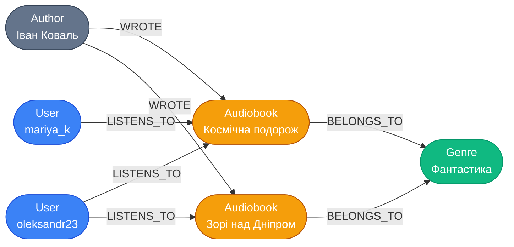
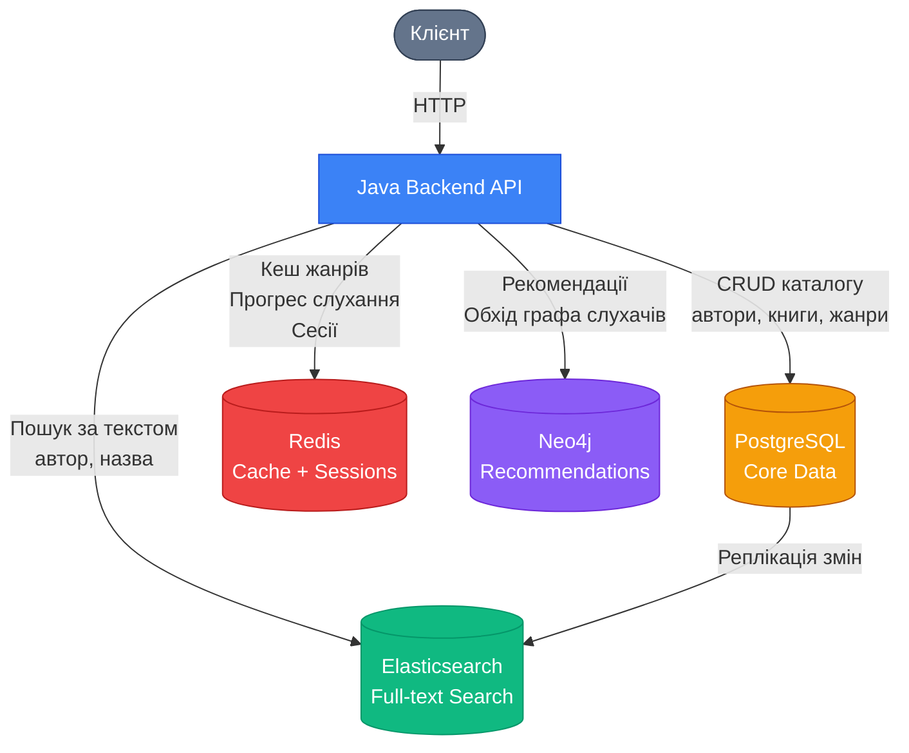

# А що, якби це була не реляційна БД?

## Вступ: Реляційна модель — не єдиний шлях

Ми розпочали цей модуль із концептуального моделювання — навмисно технологічно-агностичного. Ми виявляли сутності, зв'язки та атрибути аудіоплатформи, не прив'язуючись до жодної конкретної системи зберігання. Лише починаючи з другої статті ми обрали реляційну модель і послідовно рухалися до фізичної SQL-схеми та Flyway-міграцій.

Цей вибір був усвідомленим і обґрунтованим: реляційна модель з її суворими гарантіями цілісності, зрілою екосистемою та десятиліттями виробничого досвіду залишається найбезпечнішим вибором за замовчуванням для більшості бізнес-задач. Але чи є вона єдиним можливим вибором для нашої аудіоплатформи?

Відповідь — ні. І в цьому полягає ключова педагогічна мета фінальної статті модуля: **повернутися до концептуальної моделі і подивитися, як та сама предметна область могла б виглядати у принципово інших парадигмах зберігання**.

Такий погляд корисний з кількох причин. По-перше, він поглиблює розуміння реляційної моделі через контраст: коли бачиш, як те саме завдання вирішується по-іншому, починаєш краще розуміти, чому реляційна модель зробила саме такі вибори. По-друге, сучасні виробничі системи рідко є монолітними: вони поєднують кілька СУБД різних типів — концепція, відома як **Polyglot Persistence** (поліглотне зберігання). Архітектор, що знає лише SQL, опиниться в безпорадності перед задачею вибору між MongoDB та Cassandra.

::note
Ця стаття є **оглядовою**: вона не навчає синтаксису MongoDB, Cypher або Redis команд на глибокому рівні. Її мета — сформувати **архітектурне мислення**: розуміння того, які властивості предметної області роблять певну модель зберігання природним вибором, а які — протиприродним.
::

---

## Документо-орієнтований підхід: Аудіокнига як документ

### Основна ідея

У реляційній моделі аудіокнига «розкидана» по кількох таблицях: сама книга — в `audiobooks`, автор — в `authors`, жанр — в `genres`, файли — в `audiobook_files`. Щоб отримати повну картину, потрібен `JOIN` з чотирьох таблиць.

Документо-орієнтована модель (Document-Oriented Model), яку реалізують MongoDB, CouchDB та інші, пропонує протилежний підхід: **зберігати пов'язані дані разом, в одному документі**. Документ — це самодостатня одиниця даних, зазвичай у форматі JSON або BSON.

::tabs

::tabs-item{label="Реляційна модель (4 таблиці + JOIN)"}

```sql
SELECT
    a.title,
    a.duration,
    au.first_name || ' ' || au.last_name AS author,
    g.name AS genre,
    af.file_path,
    af.format
FROM audiobooks a
JOIN authors au ON a.author_id = au.id
JOIN genres  g  ON a.genre_id  = g.id
JOIN audiobook_files af ON af.audiobook_id = a.id
WHERE a.id = '770e8400-...';
```

::

::tabs-item{label="Документна модель (MongoDB, один запит)"}

```javascript
// db.audiobooks.findOne({ _id: ObjectId("770e8400...") })
// Результат — один документ, що містить усе:
{
  "_id": "770e8400-e29b-41d4-a716-446655440001",
  "title": "Космічна подорож",
  "duration": 7200,
  "releaseYear": 2023,
  "author": {
    "firstName": "Іван",
    "lastName": "Коваль",
    "bio": "Сучасний поет і прозаїк..."
  },
  "genre": {
    "name": "Фантастика",
    "description": "Наукова фантастика, фентезі..."
  },
  "files": [
    {
      "filePath": "/audio/kosmichna_podorozh.mp3",
      "format": "mp3",
      "size": 150000000
    }
  ]
}
```

::

::

Результат очевидний: для читання повної інформації про аудіокнигу документна модель потребує **одного звернення** до сховища. У реляційній моделі — мінімум чотирьох `JOIN`.

### Embedding vs Referencing

Проте не все так однозначно. У документній моделі існує фундаментальний вибір: **вбудовувати** (embed) пов'язані дані безпосередньо в документ чи **посилатися** (reference) на інші документи через ідентифікатор.

::card-group

::card{title="Embedding (вбудовування)" icon="i-heroicons-document-text"}

Дані фізично розміщуються всередині батьківського документа.

**Переваги:**
- Одне читання — повна картина
- Атомарна операція запису (транзакція не потрібна)

**Коли доцільно:**
- Дані завжди читаються разом
- Дочірні дані не існують самостійно
- Кількість дочірніх записів обмежена

**Приклад:** `audiobook.files[]` — файли книги не існують окремо від книги.

::

::card{title="Referencing (посилання)" icon="i-heroicons-link"}

Документ зберігає лише ідентифікатор пов'язаного документа.

**Переваги:**
- Уникнення дублювання даних
- Незалежне оновлення пов'язаних документів

**Коли доцільно:**
- Дані часто оновлюються незалежно
- Один об'єкт пов'язаний із багатьма іншими
- Дочірніх записів необмежена кількість

**Приклад:** `user.collectionIds[]` — користувач має багато колекцій.

::

::

::warning
**Вбудовування автора в кожну аудіокнигу — це денормалізація за замовчуванням.** Якщо Іван Коваль змінює прізвище, доведеться оновити **кожен** документ аудіокниги, де він вбудований. У реляційній моделі достатньо одного `UPDATE authors SET last_name = '...' WHERE id = '...'`. Документна модель торгує консистентністю заради швидкості читання.
::


## Графовий підхід: Аудіоплатформа як мережа зв'язків

### Коли зв'язки важливіші за дані

У реляційній та документній моделях первинними об'єктами є **сутності** — рядки або документи. Зв'язки між ними виражаються вторинно: через FK або масиви ідентифікаторів. Але існує клас задач, де саме **зв'язки між об'єктами є найціннішою інформацією**, а не властивості самих об'єктів.

Класичний приклад — рекомендаційні системи. «Користувачі, що слухали цю книгу, також слухали...» — це питання не про властивості книги, а про **мережу поведінки** користувачів. Реляційна БД відповідає на таке питання через серію `JOIN` зростаючої складності. Графова БД (Graph Database), наприклад **Neo4j**, відповідає на нього природно, бо зв'язки є першокласними об'єктами моделі.

### Вузли та ребра: Концептуальна модель у графовому форматі

Графова модель складається з двох базових елементів:

- **Вузол** (Node) — відповідає сутності: `Author`, `Audiobook`, `User`, `Genre`.
- **Ребро** (Edge / Relationship) — відповідає зв'язку: `WROTE`, `LISTENS_TO`, `BELONGS_TO`, `ADDED_TO`.

Помітьте, наскільки природно наша концептуальна ER-модель відображається на граф. Кожна сутність — вузол, кожен зв'язок — ребро. Ребра є **спрямованими** і мають **тип** (label), а також можуть нести власні **властивості** — так само як атрибути зв'язку в концептуальній моделі.

::mermaid



::

### Cypher: Мова запитів Neo4j

Neo4j використовує декларативну мову запитів **Cypher**. Її синтаксис навмисно нагадує ASCII-арт: вузли позначаються `()`, ребра — `-->` або `-[:TYPE]->`.

::code-group

```cypher [Книги автора]
-- Які книги написав Іван Коваль?
MATCH (auth:Author {lastName: "Коваль"})-[:WROTE]->(a:Audiobook)
RETURN a.title, a.duration
ORDER BY a.releaseYear DESC;
```

```cypher [Рекомендації]
-- Книги, що їх слухали люди зі схожим смаком:
MATCH (u:User {username: "oleksandr23"})-[:LISTENS_TO]->(a:Audiobook)
      <-[:LISTENS_TO]-(similar:User)-[:LISTENS_TO]->(rec:Audiobook)
WHERE NOT (u)-[:LISTENS_TO]->(rec)
RETURN rec.title, count(similar) AS commonListeners
ORDER BY commonListeners DESC
LIMIT 5;
```

```cypher [Жанри автора]
-- Через які жанри проходять книги автора?
MATCH (auth:Author)-[:WROTE]->(a:Audiobook)-[:BELONGS_TO]->(g:Genre)
WHERE auth.lastName = "Коваль"
RETURN auth.firstName, g.name, count(a) AS bookCount;
```

::

Зверніть на другий запит: реалізація рекомендаційного алгоритму «люди зі схожим смаком слухали також...» у Cypher займає п'ять рядків. Аналогічний запит у SQL вимагав би кількох рівнів вкладених підзапитів або `WITH`-виразів і був би значно складнішим для читання та оптимізації. Це і є природна перевага графових БД: **обхід зв'язків** є першокласною операцією, а не вторинним ефектом `JOIN`.

::note
**Помітьте: наша концептуальна модель природно відображається в графову.** Сутності `Author`, `Audiobook`, `User`, `Genre` стали вузлами. Зв'язки `writes`, `listens_to`, `belongs_to` стали ребрами. Атрибути зв'язку `Listening_Progress` (`position`, `last_listened`) стають властивостями ребра `LISTENS_TO`. Концептуальне моделювання є дійсно технологічно-агностичним — воно однаково добре відображається і на SQL, і на граф.
::

---

## Key-Value підхід: Redis та «гарячі» дані

### Найпростіша модель зберігання

Key-Value сховища (Key-Value Store) реалізують найпростішу можливу модель: **ключ → значення**. Немає таблиць, колекцій, вузлів, схем. Є лише словник, де за рядковим ключем можна зберегти й отримати значення.

**Redis** — найпопулярніше key-value сховище у світі. Воно зберігає дані **в оперативній пам'яті**, що забезпечує надзвичайно швидке читання і запис (мікросекунди). Redis підтримує різні типи значень: рядки, хеші, списки, множини, відсортовані множини.

### Де Redis природно вписується в аудіоплатформу

**1. Кешування прогресу слухання** — найгарячіші дані платформи.

Таблиця `listening_progresses` в PostgreSQL оновлюється щоразу, коли користувач слухає книгу — а це може бути кожні 10–30 секунд. Для 1000 одночасних слухачів це 33–100 записів у секунду. Redis поглинає таке навантаження без зусиль:

```
Ключ:    "progress:{user_id}:{audiobook_id}"
Значення: "3600"   ← позиція у секундах
TTL:      86400    ← автовидалення через 24 год, якщо не оновлено
```

Раз на хвилину (або при виході з сесії) додаток синхронізує Redis-дані назад у PostgreSQL. «Холодне» PostgreSQL не перевантажується частими `UPDATE`, а Redis обробляє «гарячі» оновлення.

**2. Кешування каталогу** — прискорення читання популярних даних.

Список жанрів змінюється рідко (статичний довідник), але читається при кожному завантаженні головної сторінки. Кешуємо в Redis із TTL 1 годину — база даних отримує запит щогодини замість щосекунди.

**3. Атомарні лічильники** — без блокувань та перегонів.

```
-- Атомарне збільшення лічильника відтворень:
INCR "plays:770e8400-e29b-41d4-a716-446655440001"
```

Команда `INCR` є **атомарною** — навіть при одночасних запитах від тисяч користувачів кожне збільшення зараховується коректно без транзакцій або блокувань рядків.

**4. Управління сесіями** — зберігання JWT або сесійних токенів.

```
SET "session:{token}" "{user_id}"
EXPIRE "session:{token}" 1800   ← 30 хвилин
```

::tip
**TTL (Time-To-Live)** — одна з найцінніших функцій Redis. Кожний ключ може мати час життя, після якого Redis автоматично його видаляє. Це дозволяє реалізувати кешування та управління сесіями без окремого фонового процесу очищення.
::


## Порівняльна таблиця: SQL vs Document vs Graph vs Key-Value

Чотири розглянуті моделі не є конкурентами — вони є **спеціалізованими інструментами** для різних класів задач. Таблиця нижче структурує ключові відмінності з точки зору архітектурного вибору:

| Критерій | Реляційна (PostgreSQL/H2) | Документна (MongoDB) | Графова (Neo4j) | Key-Value (Redis) |
|---|---|---|---|---|
| **Модель даних** | Таблиці, рядки, стовпці | JSON-документи | Вузли та ребра | Ключ → значення |
| **Схема** | Жорстка (DDL) | Гнучка (schema-less) | Гнучка | Немає схеми |
| **Зв'язки** | FK + JOIN | Embedding / Reference | Першокласні об'єкти | Немає |
| **Транзакції (ACID)** | ✅ Повна підтримка | ⚠️ Часткова (з v4.0) | ⚠️ Часткова | ❌ Лише базова |
| **Гнучкість схеми** | Низька (потрібні міграції) | Висока | Висока | Максимальна |
| **Швидкість читання** | Висока при індексах | Дуже висока (немає JOIN) | Висока для обходу графа | Екстремальна (in-memory) |
| **Швидкість запису** | Висока | Висока | Середня | Екстремальна |
| **Складні JOIN-запити** | ✅ Природні | ❌ Відсутні | ✅ Через обхід | ❌ Відсутні |
| **Рекомендації** | ⚠️ Складно | ⚠️ Складно | ✅ Природні | ❌ Не підходить |
| **Кешування** | ❌ Не призначена | ❌ Не призначена | ❌ Не призначена | ✅ Ідеальна |
| **Аудіоплатформа** | Core data (каталог, юзери) | Каталог з вбудованими даними | Рекомендації | Прогрес, кеш, сесії |

### Коли що обирати: Практичні сигнали

::accordion

::accordion-item{label="Обирайте реляційну БД, якщо..." icon="i-heroicons-check-circle"}
- Дані мають **чітку, стабільну структуру** з обмеженнями цілісності.
- Система потребує **ACID-транзакцій**: переказ коштів, бронювання, замовлення.
- Запити **різноманітні та непередбачувані**: SQL дозволяє писати довільні `SELECT`.
- Команда добре знає SQL та реляційне проектування.
- Приклади: фінансові системи, ERP, більшість бізнес-додатків.
::

::accordion-item{label="Обирайте документну БД, якщо..." icon="i-heroicons-document-text"}
- Дані мають **ієрархічну, вкладену структуру**, яка природно відображається в JSON.
- Схема **часто змінюється** або різниться між записами (різні атрибути у різних продуктів).
- Основний патерн доступу — **читання цілого об'єкта** (а не його частин через JOIN).
- Вам потрібне **горизонтальне масштабування** (MongoDB шардується простіше за PostgreSQL).
- Приклади: каталоги продуктів, CMS, профілі користувачів.
::

::accordion-item{label="Обирайте графову БД, якщо..." icon="i-heroicons-share"}
- Ключові запити — це **обхід мережі зв'язків** на довільну глибину.
- Предметна область природно є мережею: соціальні графи, дерева залежностей, знання.
- Потрібні **рекомендації** або аналіз впливу.
- Структура зв'язків **непередбачувано змінюється** — нові типи ребер додаються часто.
- Приклади: LinkedIn (мережа контактів), Netflix (рекомендації), npm (дерево залежностей).
::

::accordion-item{label="Обирайте Key-Value сховище, якщо..." icon="i-heroicons-bolt"}
- Потрібне **надшвидке читання/запис** з простою структурою «ключ → значення».
- Дані мають **природний термін дії** (TTL): сесії, кеш, одноразові токени.
- Задача — **розвантажити основну БД** від надмірно частих запитів.
- Потрібні **атомарні лічильники** або pub/sub без транзакцій.
- Приклади: кешування, управління сесіями, черги повідомлень, rate limiting.
::

::

---

## Polyglot Persistence: Найкращий із світів

### Ідея та мотивація

Жодна з розглянутих моделей не є «найкращою» у вакуумі — кожна є найкращою **для свого класу задач**. Сучасна архітектура не змушує обирати одну: замість цього вона поєднує кілька спеціалізованих сховищ, кожне з яких використовується там, де воно природно. Цей підхід отримав назву **Polyglot Persistence** (поліглотне зберігання) — термін, введений Мартіном Фаулером у 2011 році.

Аналогія: у кулінарії не існує одного «найкращого» ножа. Кухонний ніж для овочів, ніж для хліба, ніж для м'яса — кожен спроектований для своєї задачі. Досвідчений кухар знає, який ніж взяти, не намагаючись різати хліб ножем для м'яса.

### Polyglot Persistence для аудіоплатформи

Розглянемо, як виглядала б виробнича архітектура аудіоплатформи з використанням кількох сховищ:

::mermaid



::

У цій архітектурі кожне сховище виконує свою спеціалізовану роль:

- **PostgreSQL** — єдине джерело правди (Single Source of Truth) для структурованих бізнес-даних: каталог книг, автори, жанри, колекції, транзакційна цілісність.
- **Elasticsearch** — повнотекстовий пошук за назвами книг, іменами авторів та описами. PostgreSQL `LIKE '%keyword%'` не масштабується; Elasticsearch — так.
- **Redis** — кеш статичних довідників (жанри), «гарячий» прогрес слухання, сесійні токени. Розвантажує PostgreSQL від частих читань і надчастих записів.
- **Neo4j** — рекомендаційний рушій. Отримує дані про поведінку з PostgreSQL і будує граф для персоналізованих рекомендацій.

::warning
**Polyglot Persistence збільшує операційну складність.** Замість однієї СУБД команда підтримує чотири. Потрібна синхронізація даних між сховищами, моніторинг кожного з них, розуміння їх відказостійкості та резервного копіювання. Цей підхід виправданий при масштабах, де переваги спеціалізації переважають накладні витрати. Для невеликих проєктів PostgreSQL + Redis часто є достатнім і оптимальним вибором.
::

---

## Практичні завдання

::steps

### Рівень 1 — Базовий: Аналіз моделей

Дано сутність `Audiobook` з атрибутами: `id`, `title`, `duration`, `releaseYear`, `author` (вкладений об'єкт із `firstName`, `lastName`), `genres` (масив рядків), `files` (масив об'єктів із `filePath`, `format`).

**Завдання:**
1. Намалюйте (або опишіть словами), як ця сутність виглядатиме у реляційній моделі (скільки таблиць? які FK?).
2. Намалюйте, як вона виглядатиме як MongoDB-документ із повним embedding.
3. Порівняйте: яка модель простіша для **читання** повної аудіокниги? Яка — для **оновлення** імені автора в усьому каталозі?

### Рівень 2 — Проектування: Вибір сховища

Для кожного з наведених сценаріїв оберіть **найбільш відповідне сховище** (SQL, Document, Graph, або Key-Value) та обґрунтуйте вибір:

1. Зберігання налаштувань інтерфейсу користувача (тема, мова, розмір шрифту) — гнучкий набір параметрів, що може відрізнятися між версіями.
2. Підрахунок кількості унікальних слухачів для кожної книги за останні 24 години — потрібна швидкість, не потрібна точність до 100%.
3. Функція «Схожі автори» — автори, чиї книги слухають ті самі користувачі.
4. Повна транзакційна історія платежів за підписки з можливістю фінансового аудиту.

### Рівень 3 — Архітектура: Polyglot Persistence

Ви проектуєте архітектуру нової платформи для онлайн-курсів (`courses`, `lessons`, `instructors`, `students`, `progress`, `certificates`).

**Завдання:**
1. Визначте, які дані зберігатимуться в реляційній БД (PostgreSQL), і поясніть чому.
2. Визначте, які дані є кандидатами для кешування в Redis — з яким TTL і чому.
3. Чи є в предметній області запити, що природно виграли б від графової моделі? Якщо так — опишіть граф (вузли, ребра) та приклад Cypher-запиту.
4. Намалюйте (схематично) фінальну архітектуру Polyglot Persistence для цієї платформи з поясненням ролі кожного сховища.

::

---

## Підсумок

Ми розпочали цей модуль із концептуальної моделі, що не залежала від жодної технології зберігання. І повернулися до неї в кінці — щоб переконатися, що ця незалежність була не формальним прийомом, а відображенням реального факту: **одна й та сама предметна область може бути реалізована в принципово різних парадигмах**.

Реляційна модель залишається найуніверсальнішим і найбезпечнішим вибором за замовчуванням. Але усвідомлений вибір — це той, що зроблений з розумінням альтернатив. Архітектор, що знає лише SQL, вирішуватиме задачу рекомендацій через складні `JOIN`-запити, де Neo4j вирішив би її п'ятьма рядками Cypher. Той самий архітектор намагатиметься зберігати прогрес слухання у PostgreSQL, де Redis впорався б у тисячу разів швидше.

::card-group

::card{title="SQL — каркас системи" icon="i-heroicons-table-cells"}
Реляційна БД — єдине джерело правди для структурованих бізнес-даних. ACID, цілісність, гнучкість запитів.
::

::card{title="Document — зручна агрегація" icon="i-heroicons-document-duplicate"}
Документна БД природна там, де дані читаються цілісними агрегатами і схема гнучка.
::

::card{title="Graph — мережа зв'язків" icon="i-heroicons-share"}
Графова БД перевершує SQL там, де первинними об'єктами запитів є самі зв'язки.
::

::card{title="Key-Value — швидкість" icon="i-heroicons-bolt"}
Redis розвантажує основну БД, беручи на себе кеш, сесії та «гарячі» дані.
::

::

Цей модуль завершено. Ви пройшли повний шлях від концептуальної ER-моделі через нормалізацію, фізичну DDL-схему та Flyway-міграції — і тепер маєте як практичні навички реляційного проектування, так і архітектурне розуміння ширшого ландшафту технологій зберігання даних.
