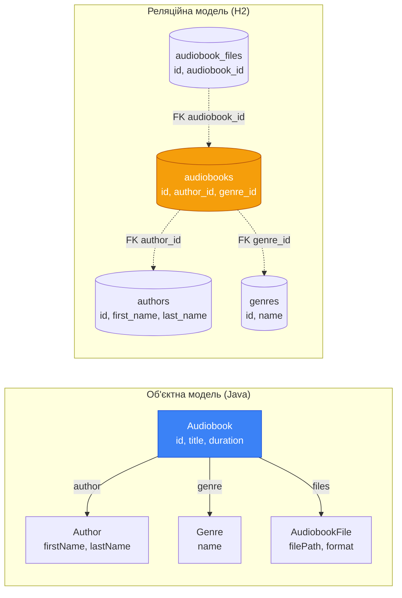
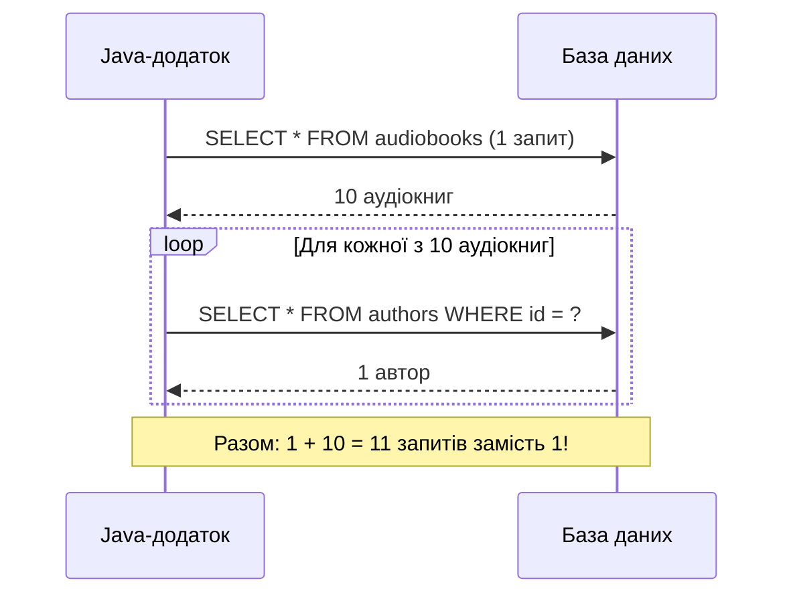

# Object-Relational Impedance Mismatch: Два світи, що не хочуть дружити

## Вступ: Зіткнення двох парадигм

У попередніх статтях цього модуля ми ретельно спроектували реляційну схему аудіоплатформи: визначили сутності, нормалізували таблиці, написали DDL-скрипти та організували версіоновані міграції через Flyway. Схема — стрункий, математично обґрунтований артефакт. Таблиця `audiobooks` містить рядки, кожен рядок — набір атомарних значень, пов'язаних із рядками інших таблиць через зовнішні ключі.

Тепер настає момент, коли ми повинні наповнити цю схему смислом з боку коду. У нашій Java-програмі аудіокнига — це не рядок таблиці. Це об'єкт:

```java showLineNumbers
public class Audiobook {
    private UUID id;
    private String title;
    private Author author;   // Не UUID — повноцінний об'єкт Author
    private Genre genre;     // Не UUID — повноцінний об'єкт Genre
    private int duration;
    private int releaseYear;
    private List<AudiobookFile> files; // Колекція пов'язаних файлів
}
```

Зверніть увагу на принципову різницю: у таблиці `audiobooks` зберігається `author_id UUID` — лише ідентифікатор. У Java-класі — поле `Author author`, повноцінний об'єкт зі своїми полями `firstName`, `lastName`, `bio`. У таблиці немає жодного `files` — є окрема таблиця `audiobook_files` зі зовнішнім ключем. У Java-класі — поле `List<AudiobookFile>` прямо всередині об'єкта.

Ця невідповідність між тим, як дані організовані у реляційній базі, і тим, як вони представлені у об'єктно-орієнтованій програмі, має власну назву. У 1990-х роках, коли розробники масово почали поєднувати об'єктні мови з реляційними СУБД, цей феномен отримав термін з електротехніки:

> **Object-Relational Impedance Mismatch** (Об'єктно-реляційна невідповідність імпедансів) — фундаментальна концептуальна різниця між об'єктно-орієнтованою моделлю програмування та реляційною моделлю зберігання даних, що призводить до постійного «тертя» при їх спільному використанні.

Термін **impedance** (імпеданс) запозичений з електротехніки, де він описує опір кола змінному струму. Коли два пристрої з різним імпедансом з'єднуються, виникають втрати енергії. Аналогічно, коли об'єктний код взаємодіє з реляційною БД, виникають «втрати»: додатковий код перетворення, потенційні помилки, зниження продуктивності.

Розуміння природи цієї невідповідності є **передумовою** для правильного використання будь-якого інструменту роботи з БД — від JDBC до Hibernate. Без цього розуміння розробник не здатен свідомо обирати між підходами та усвідомлювати компроміси кожного рішення.

## Дві парадигми: природа розбіжності

Перш ніж перейти до конкретних проблем, важливо зрозуміти, що обидві парадигми — об'єктна та реляційна — є самодостатніми і внутрішньо узгодженими. Кожна з них ефективно вирішує задачі, для яких була створена. Проблема виникає саме на межі їх взаємодії.

::card-group

::card{title="Об'єктно-орієнтована модель" icon="i-heroicons-cube"}

- Організована навколо **об'єктів** — структур, що поєднують стан (поля) та поведінку (методи)
- Підтримує **успадкування**, **поліморфізм**, **інкапсуляцію**
- Об'єкти пов'язані через **посилання** (references)
- Навігація — через **крапковий оператор**: `audiobook.getAuthor().getLastName()`
- Ідентичність визначається **адресою в пам'яті** (`==`) або `equals()`

::

::card{title="Реляційна модель" icon="i-heroicons-table-cells"}

- Організована навколо **відношень** (таблиць) — множин кортежів (рядків)
- Підтримує **декларативні запити** через SQL
- Відношення пов'язані через **зовнішні ключі** (значення, не посилання)
- Навігація — через **JOIN**: `SELECT ... FROM audiobooks JOIN authors ON ...`
- Ідентичність визначається **первинним ключем** (`id`)

::

::

Реляційна модель, запропонована Едгаром Коддом у 1970 році, ґрунтується на математиці множин та реляційній алгебрі. Об'єктна модель, що домінує у розробці з 1980-х, ґрунтується на концепції відображення реального світу через об'єкти. Ці дві математичні основи є різними — і саме тому виникають п'ять конкретних типів розбіжностей.

::mermaid



::

---

## П'ять ключових розбіжностей

### Розбіжність 1. Гранулярність (Granularity)

**Гранулярність** — це ступінь подрібнення моделі: скільки об'єктів/таблиць потрібно для представлення одного поняття предметної області.

Розглянемо ім'я автора. У нашій схемі таблиця `authors` містить два окремих стовпці:

```sql
first_name VARCHAR(64) NOT NULL,
last_name  VARCHAR(64) NOT NULL,
```

Це правильно з точки зору нормалізації: ім'я та прізвище — різні атрибути, по кожному можна шукати окремо. У Java-коді ж виникає питання: як моделювати ім'я? Перший варіант — два окремих поля у класі `Author`:

```java showLineNumbers
public class Author {
    private UUID id;
    private String firstName;  // Відповідає first_name
    private String lastName;   // Відповідає last_name
    private String bio;
}
```

Це пряме відображення таблиці. Але в об'єктно-орієнтованому дизайні ім'я може бути **Value Object** — самостійним об'єктом зі своєю поведінкою:

```java showLineNumbers
// Value Object — немає власного ID, визначається значенням
public record PersonName(String firstName, String lastName) {
    public String fullName() {
        return firstName + " " + lastName;
    }

    public String initialsName() {
        return firstName.charAt(0) + ". " + lastName;
    }
}

public class Author {
    private UUID id;
    private PersonName name;   // Один об'єкт, але два стовпці в БД
    private String bio;
}
```

Об'єктна модель каже: `PersonName` — самостійна концепція з поведінкою (`fullName()`, `initialsName()`). Реляційна модель каже: це просто два стовпці в таблиці `authors`. Один концептуальний об'єкт — два фізичних стовпці. Це і є **розбіжність гранулярності**.

::note
Ця розбіжність не є помилкою жодної зі сторін. Реляційна модель оптимізована для зберігання та пошуку; об'єктна — для моделювання поведінки. У Hibernate вона вирішується через `@Embeddable` / `@Embedded`. У нашому курсі ми вирішуватимемо її вручну при маппінгу.
::

---

### Розбіжність 2. Успадкування (Inheritance)

Успадкування — одна з фундаментальних концепцій ООП. Воно дозволяє визначити загальну поведінку в базовому класі та розширювати її у підкласах без дублювання коду. Реляційна модель жодної вбудованої підтримки успадкування не має — таблиця не може «успадкувати» стовпці іншої таблиці.

Уявімо гіпотетичне розширення нашої аудіоплатформи: з'являються два типи користувачів — звичайний `User` та `PremiumUser`, який має додаткове поле `subscriptionExpiresAt`. В об'єктній моделі це природна ієрархія:

```java showLineNumbers
public class User {
    private UUID id;
    private String username;
    private String passwordHash;
    private String email;
}

public class PremiumUser extends User {
    private LocalDateTime subscriptionExpiresAt;
    private String subscriptionTier; // "monthly", "yearly"
}
```

Клієнтський код може працювати з обома типами через посилання на базовий клас: `List<User> users` — у списку можуть бути і `User`, і `PremiumUser`. Поліморфізм — без жодного `instanceof`.

Як зберегти таку ієрархію у реляційній БД? Існує три класичних стратегії:

| Стратегія | Ідея | Переваги | Недоліки |
|:---|:---|:---|:---|
| **Single Table (STI)** | Одна таблиця + стовпець-дискримінатор `user_type` | Простота, без JOIN | NULL-поля, денормалізація |
| **Table Per Class (TPC)** | Кожен клас — своя таблиця з УСІМА полями | Без NULL | Дублювання стовпців, UNION |
| **Joined Table (TPH)** | Базова таблиця + розширення через FK | Нормалізація | JOIN при кожному запиті |

Жодна зі стратегій не є ідеальною — усі вони є способами «вкласти» ієрархічну концепцію в плоску табличну структуру.

---

### Розбіжність 3. Ідентичність (Identity)

Питання здається тривіальним: як визначити, чи є два об'єкти «тим самим»? Але в об'єктній та реляційній моделях відповіді принципово різні.

**У Java** існує два поняття рівності:
- `==` — **референтна рівність**: чи вказують два посилання на один і той самий об'єкт у пам'яті
- `.equals()` — **логічна рівність**: чи мають два об'єкти однаковий вміст

**У реляційній БД** ідентичність визначається виключно **первинним ключем**. Два рядки з однаковим `id` — це один і той самий запис. Третього варіанта немає.

Проблема виникає, коли ми завантажуємо одну й ту саму сутність двічі у рамках однієї програмної сесії:

```java showLineNumbers
// Два окремі виклики — два окремі SELECT-запити до БД
Author author1 = authorDao.findById(authorId);
Author author2 = authorDao.findById(authorId);

System.out.println(author1 == author2);         // false — різні об'єкти в пам'яті!
System.out.println(author1.equals(author2));    // true — якщо equals() визначений за id
System.out.println(author1.getId().equals(author2.getId())); // true — однаковий PK

// Небезпечна ситуація: зміна одного не відображається в іншому
author1.setLastName("Нове прізвище");
System.out.println(author2.getLastName()); // Стара назва — інконсистентність!
```

У БД існує рівно один запис автора. У пам'яті Java — два різних об'єкти, що представляють одні й ті самі дані, і вони можуть «розійтися» у стані.

::warning
Розбіжність ідентичності є джерелом **тонких, важко відтворюваних помилок**. Один метод завантажує об'єкт і змінює його стан. Інший метод незалежно завантажує «той самий» об'єкт — але отримує окремий екземпляр у пам'яті, якому зміни першого невидимі. Патерн **Identity Map** (стаття 15 цього модуля) вирішує цю проблему, гарантуючи єдиний екземпляр для кожного унікального PK у межах однієї сесії.
::

Для коректної роботи колекцій та логіки `equals()`/`hashCode()` для сутностей з БД слід ґрунтуватися виключно на первинному ключі:

```java showLineNumbers
@Override
public boolean equals(Object o) {
    if (this == o) return true;
    if (!(o instanceof Author other)) return false;
    // Ідентичність визначається PK — узгоджуємо з реляційною моделлю
    return id != null && id.equals(other.id);
}

@Override
public int hashCode() {
    // UUID стабільний — не змінюється після збереження
    return Objects.hashCode(id);
}
```


---

### Розбіжність 4. Зв'язки (Associations)

В об'єктній моделі зв'язок між об'єктами — це **пряме посилання** (reference): одна змінна зберігає адресу іншого об'єкта в пам'яті. У реляційній моделі зв'язок між таблицями — це **зовнішній ключ** (foreign key): стовпець зберігає значення первинного ключа пов'язаного рядка.

Ця різниця має глибокі наслідки. Розглянемо зв'язок між `Audiobook` та `Author`:

```java showLineNumbers
// Об'єктна модель: пряме посилання
public class Audiobook {
    private Author author; // Вказує безпосередньо на об'єкт Author у пам'яті
}

// Використання: без жодних запитів до БД
String authorName = audiobook.getAuthor().getLastName();
```

```sql
-- Реляційна модель: зовнішній ключ — лише значення
-- audiobooks.author_id = '550e8400-e29b-41d4-a716-446655440001'
-- Щоб отримати ім'я автора — потрібен окремий запит або JOIN:
SELECT a.last_name
FROM audiobooks ab
JOIN authors a ON ab.author_id = a.id
WHERE ab.id = ?;
```

Об'єктні зв'язки є **двонаправленими** за замовчуванням: якщо `Author` містить `List<Audiobook>`, а `Audiobook` містить `Author`, то обидва посилання можна traversувати. У реляційній моделі зовнішній ключ завжди розміщений на стороні «багато» і навігація «вгору» вимагає окремого запиту.

Особливо складна ситуація виникає зі зв'язками M:N. У Java: `Collection` містить `List<Audiobook>`, і `Audiobook` може бути в кількох `Collection` — це просто два списки посилань. У реляційній моделі цей зв'язок матеріалізований через окрему проміжну таблицю `audiobook_collection`, яка для Java-розробника є «невидимою» деталлю реалізації:

```java showLineNumbers
// Java: прозорий M:N зв'язок через колекцію
collection.getAudiobooks().add(audiobook);

// SQL: три таблиці та INSERT у проміжну
INSERT INTO audiobook_collection (collection_id, audiobook_id)
VALUES (?, ?);
```

---

### Розбіжність 5. Навігація та проблема N+1

П'ята розбіжність є **практичним наслідком** розбіжності зв'язків і має найбільший вплив на продуктивність. Вона пов'язана з тим, як ми переміщуємося між пов'язаними даними.

**В об'єктній моделі** навігація відбувається через **крапковий оператор**: кожен крок — звернення до поля в пам'яті, що виконується за О(1):

```java showLineNumbers
// Навігація в пам'яті: миттєво, без I/O
String genre = audiobook.getGenre().getName();
List<AudiobookFile> files = audiobook.getFiles();
String collectionOwner = files.get(0)
    // гіпотетично: audiobook.getCollections().get(0).getUser().getUsername()
```

**У реляційній моделі** навігація реалізується через **SQL-запити з JOIN**: кожен JOIN — потенційно дороге злиття множин:

```sql
SELECT ab.title, g.name, u.username
FROM audiobooks ab
JOIN genres g ON ab.genre_id = g.id
JOIN audiobook_collection ac ON ab.id = ac.audiobook_id
JOIN collections c ON ac.collection_id = c.id
JOIN users u ON c.user_id = u.id
WHERE ab.id = ?;
```

Ця різниця породжує знамениту **проблему N+1 запитів** (N+1 Query Problem) — одну з найпоширеніших проблем продуктивності в системах, що використовують ORM або ручний маппінг.

::mermaid



::

Розглянемо типовий код, що породжує N+1:

```java showLineNumbers
// Завантажуємо всі аудіокниги — 1 запит
List<Audiobook> audiobooks = audiobookDao.findAll();

// Для кожної книги завантажуємо автора — ще N запитів!
for (Audiobook book : audiobooks) {
    // Кожен виклик getAuthorName() виконує SELECT * FROM authors WHERE id = ?
    System.out.println(book.getTitle() + " — " + book.getAuthorName());
}
// Результат: 1 + N запитів для N аудіокниг
```

Замість одного JOIN-запиту ми виконуємо N+1 окремих запитів до БД. При N=100 це різниця між одним запитом і 101 запитом. При N=1000 — між одним і 1001.

::tip
Правильне рішення — завантажувати пов'язані дані через **JOIN** в одному запиті, або через **batch loading** (один запит з `WHERE author_id IN (id1, id2, ...)`). Обидва підходи ми детально розглянемо у наступних статтях.
::


---

## Ручний маппінг: як це виглядає на практиці

Усі п'ять розбіжностей проявляються безпосередньо у коді, що перетворює рядки `ResultSet` на Java-об'єкти. Розглянемо завантаження аудіокниги разом з автором та жанром — типова задача, яку доводиться вирішувати при роботі з JDBC.

### ResultSet → Java Object

Маппінг починається зі звичайного SQL-запиту з JOIN:

```java showLineNumbers
public Optional<Audiobook> findById(UUID id) throws SQLException {
    // JOIN вирішує проблему N+1: отримуємо все за один запит
    String sql = """
        SELECT
            ab.id          AS ab_id,
            ab.title       AS ab_title,
            ab.duration    AS ab_duration,
            ab.release_year AS ab_release_year,
            ab.description AS ab_description,
            a.id           AS author_id,
            a.first_name   AS author_first_name,
            a.last_name    AS author_last_name,
            a.bio          AS author_bio,
            g.id           AS genre_id,
            g.name         AS genre_name,
            g.description  AS genre_desc
        FROM audiobooks ab
        JOIN authors a ON ab.author_id = a.id
        JOIN genres  g ON ab.genre_id  = g.id
        WHERE ab.id = ?
        """;

    try (Connection conn = connectionManager.getConnection();
         PreparedStatement stmt = conn.prepareStatement(sql)) {

        stmt.setObject(1, id); // UUID передається як Object

        try (ResultSet rs = stmt.executeQuery()) {
            if (rs.next()) {
                return Optional.of(mapRow(rs));
            }
            return Optional.empty();
        }
    }
}
```

Метод `mapRow(ResultSet rs)` відповідає за перетворення рядка у граф об'єктів. Зверніть увагу: один рядок результату — три Java-об'єкти:

```java showLineNumbers
private Audiobook mapRow(ResultSet rs) throws SQLException {
    // Маппінг Author — вирішення розбіжності гранулярності:
    // два стовпці first_name + last_name → один об'єкт Author
    Author author = new Author(
        rs.getObject("author_id", UUID.class),    // UUID.class — типізований getObject
        rs.getString("author_first_name"),
        rs.getString("author_last_name"),
        rs.getString("author_bio")
    );

    // Маппінг Genre
    Genre genre = new Genre(
        rs.getObject("genre_id", UUID.class),
        rs.getString("genre_name"),
        rs.getString("genre_desc")
    );

    // Маппінг Audiobook з вже готовими author та genre
    // Вирішення розбіжності зв'язків: FK author_id → посилання на об'єкт Author
    return new Audiobook(
        rs.getObject("ab_id", UUID.class),
        rs.getString("ab_title"),
        author,            // Не UUID — повноцінний об'єкт!
        genre,             // Не UUID — повноцінний об'єкт!
        rs.getInt("ab_duration"),
        rs.getInt("ab_release_year"),
        rs.getString("ab_description")
    );
}
```

**Декомпозиція методу `mapRow`:**

- **Рядок 3–8**: Конструюємо `Author` з колонок з префіксом `author_`. Аліаси у SQL (`AS author_first_name`) є критично важливими — без них при JOIN кілька таблиць мають однакові назви стовпців (`id`, `description`), що призводить до помилок
- **Рядок 4**: `rs.getObject("author_id", UUID.class)` — типізований метод, що безпосередньо повертає `UUID` без ручного парсингу рядка
- **Рядок 16–18**: `Genre` маппиться аналогічно
- **Рядок 21–28**: `Audiobook` приймає в конструктор вже готові об'єкти `author` та `genre` — розбіжність зв'язків подолана вручну

### Java Object → PreparedStatement

Зворотній напрям маппінгу — збереження Java-об'єкта в БД — ще наочніше показує розбіжності:

```java showLineNumbers
public void insert(Audiobook audiobook) throws SQLException {
    String sql = """
        INSERT INTO audiobooks
            (id, author_id, genre_id, title, duration, release_year, description)
        VALUES (?, ?, ?, ?, ?, ?, ?)
        """;

    try (Connection conn = connectionManager.getConnection();
         PreparedStatement stmt = conn.prepareStatement(sql)) {

        // Розбіжність зв'язків у зворотному напрямку:
        // З об'єктного посилання audiobook.getAuthor() витягуємо лише UUID
        stmt.setObject(1, audiobook.getId());
        stmt.setObject(2, audiobook.getAuthor().getId()); // Author → author_id
        stmt.setObject(3, audiobook.getGenre().getId());  // Genre → genre_id
        stmt.setString(4, audiobook.getTitle());
        stmt.setInt(5, audiobook.getDuration());
        stmt.setInt(6, audiobook.getReleaseYear());
        stmt.setString(7, audiobook.getDescription());   // nullable — OK, setString приймає null

        stmt.executeUpdate();
    }
}
```

Зверніть увагу на рядки 13–14: з повноцінних об'єктів `Author` та `Genre` ми витягуємо лише їхній `getId()` — для зберігання у вигляді FK. Це обов'язковий ручний крок, який ORM виконує автоматично.


---

## Патерни подолання: дорожня карта рішень

Розробники давно усвідомили неминучість Impedance Mismatch і виробили декілька архітектурних підходів до його подолання. Кожен підхід — це компроміс між простотою, гнучкістю та рівнем абстракції.

::card-group

::card{title="Active Record" icon="i-heroicons-document"}

Об'єкт **сам себе** зберігає у БД. Доменна модель містить методи `save()`, `delete()`, `findById()`.

- **Переваги:** простота, мінімум коду, CRUD «з коробки»
- **Недоліки:** порушення SRP, тісне зв'язування доменної логіки з SQL, складне тестування
- **Де застосовується:** Ruby on Rails ActiveRecord, прості CRUD-додатки

::

::card{title="Data Mapper" icon="i-heroicons-arrows-right-left"}

Окремий об'єкт-**маппер** відповідає за переміщення даних між доменними об'єктами та БД. Доменна модель не знає нічого про SQL.

- **Переваги:** чіткий SRP, легке тестування домену, можна замінити сховище
- **Недоліки:** більше коду, потрібно підтримувати маппери окремо
- **Де застосовується:** наш підхід у цьому модулі, Hibernate (по суті)

::

::card{title="ORM (Object-Relational Mapping)" icon="i-heroicons-sparkles"}

**Автоматизований** Data Mapper. Бібліотека генерує SQL на основі метаданих (анотацій або XML).

- **Переваги:** мінімум boilerplate, підтримка Lazy Loading, кешування, транзакції
- **Недоліки:** «магія» приховує SQL, складне налаштування, overhead
- **Де застосовується:** Hibernate/JPA, EclipseLink, MyBatis (напів-автоматично)

::

::

### Чому ми починаємо з ручного JDBC?

Може виникнути закономірне питання: навіщо вивчати ручний маппінг, якщо існує Hibernate? Відповідь є як педагогічною, так і практичною.

**Педагогічна причина:** Hibernate — це автоматизований Data Mapper. Щоб розуміти, що робить Hibernate «під капотом», треба спочатку зробити це вручну. Розробник, який розуміє механізм маппінгу, здатен діагностувати проблеми N+1, правильно налаштовувати стратегії завантаження та розуміти, чому `LAZY` fetch часом кидає `LazyInitializationException`.

**Практична причина:** існують задачі, де JDBC ефективніший за ORM: батчеві операції з мільйонами рядків, складні аналітичні запити, системи з нетипової схемою БД. Знання JDBC — незамінна навичка.

---

## Дорожня карта: як ця серія статей вирішує Impedance Mismatch

Кожна наступна стаття вирішує конкретний аспект розбіжностей, будуючи шар за шаром повноцінний Data Access Layer:

::steps

### Стаття 10: JDBC Fundamentals

Перший робочий CRUD через JDBC. Виявляємо проблеми: витік ресурсів, SQL-ін'єкції, дублювання маппінгу. Вирішуємо через `PreparedStatement` та try-with-resources.

### Стаття 11: Connection Pool

Реалізуємо власний пул з'єднань з нуля (Object Pool патерн). Вирішуємо проблему дорогого створення `Connection`.

### Стаття 12: Row Data Gateway

Перший Fowler-патерн: об'єкт = рядок таблиці. Вбудований маппінг, але порушення SRP.

### Стаття 13: Table Data Gateway

Виділення SQL в окремий клас-шлюз. Доменна модель відокремлена. Проблема зв'язків залишається.

### Стаття 14: Repository + Data Mapper з JDBC

Шарова архітектура: інтерфейс Repository + JDBC-реалізація через Template Method. Повноцінний маппінг зі зв'язками через JOIN.

### Стаття 15: Identity Map

Вирішення розбіжності ідентичності: унікальний екземпляр для кожного PK у межах сесії.

### Стаття 16: Unit of Work

Відстеження змін та координація запису у рамках транзакції. Вирішення проблеми численних окремих запитів.

### Стаття 17: Strategy для SQL

Витягнення SQL у замінювані стратегії. Підтримка кількох діалектів (H2, PostgreSQL).

### Стаття 18: Proxy та Lazy Loading

Вирішення проблеми N+1 через ледаче завантаження пов'язаних колекцій.

### Стаття 19: GenericRepository через рефлексію

Автоматизація маппінгу через Java Reflection API та власні анотації — мініатюрний ORM.

::

---

## Підсумок

У цій статті ми дослідили фундаментальну проблему, з якою стикається кожен розробник при поєднанні Java та реляційної бази даних. П'ять ключових розбіжностей — гранулярність, успадкування, ідентичність, зв'язки та навігація — є не технічними багами, а **наслідком принципових відмінностей між двома математичними моделями**.

::card-group

::card{title="Гранулярність" icon="i-heroicons-viewfinder-circle"}
Один Java-об'єкт (`PersonName`) може відображатися на кілька стовпців БД.
::

::card{title="Успадкування" icon="i-heroicons-arrow-up-circle"}
Java-ієрархії класів не мають прямого аналога в реляційній моделі. Три стратегії — три компромісні.
::

::card{title="Ідентичність" icon="i-heroicons-identification"}
`==` vs `.equals()` vs PK. Один запис у БД може мати кілька екземплярів у пам'яті.
::

::card{title="Зв'язки" icon="i-heroicons-link"}
Посилання на об'єкт (Java) vs значення FK (SQL). Двонаправленість vs однонаправленість.
::

::

Усвідомлення цих розбіжностей перетворює роботу з БД із «чорної магії» у серію свідомих проектних рішень. Наступна стаття розпочинає практичну частину — перший прямий контакт із JDBC.

---

## Завдання для закріплення

::collapsible{title="Рівень 1: Аналіз розбіжностей"}

Для кожної з таблиць схеми аудіоплатформи (`authors`, `audiobooks`, `genres`, `users`, `collections`, `audiobook_files`, `listening_progresses`) визначте:

1. Яка розбіжність **гранулярності** виникає при маппінгу на Java-клас? (є поля, які варто об'єднати у Value Object?)
2. Яка розбіжність **зв'язків** виникає? (які FK потрібно перетворити на об'єктні посилання?)
3. Напишіть Java-клас для `Author` з правильним `equals()` та `hashCode()`.

::

::collapsible{title="Рівень 2: Аналіз N+1"}

Дано код:

```java
List<Collection> collections = collectionDao.findByUserId(userId);
for (Collection col : collections) {
    System.out.println(col.getName() + ": " + col.getAudiobookCount());
}
```

1. Скільки SQL-запитів виконається, якщо `getAudiobookCount()` виконує `SELECT COUNT(*) FROM audiobook_collection WHERE collection_id = ?`?
2. Напишіть один SQL-запит із JOIN/GROUP BY, що замінює N+1 запитів.
3. Поясніть, яка з п'яти розбіжностей є першопричиною цієї проблеми.

::

::collapsible{title="Рівень 3: Проектування стратегії успадкування"}

Аудіоплатформа розширюється: з'являється три типи контенту — `Audiobook`, `Podcast` (серія епізодів) та `ShortStory` (коротке оповідання). Всі три мають спільні поля (`id`, `title`, `author_id`, `genre_id`), але різні специфічні атрибути.

1. Спроектуйте Java-ієрархію класів.
2. Запропонуйте стратегію зберігання у реляційній БД (STI / TPC / TPH) з обґрунтуванням.
3. Напишіть DDL (H2) для обраної стратегії.
4. Опишіть, як зміниться маппінг `ResultSet → Java Object` для кожного типу.

::

