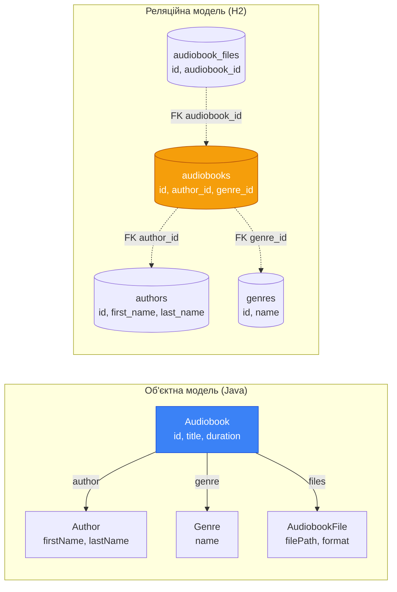

# Object-Relational Impedance Mismatch: Два світи, що не хочуть дружити

## Вступ: Зіткнення двох парадигм

У попередніх статтях цього модуля ми ретельно спроектували реляційну схему аудіоплатформи: визначили сутності, нормалізували таблиці, написали DDL-скрипти та організували версіоновані міграції через Flyway. Схема — стрункий, математично обґрунтований артефакт. Таблиця `audiobooks` містить рядки, кожен рядок — набір атомарних значень, пов'язаних із рядками інших таблиць через зовнішні ключі.

Тепер настає момент, коли ми повинні наповнити цю схему смислом з боку коду. У нашій Java-програмі аудіокнига — це не рядок таблиці. Це об'єкт:

```java showLineNumbers
public class Audiobook {
    private UUID id;
    private String title;
    private Author author;   // Не UUID — повноцінний об'єкт Author
    private Genre genre;     // Не UUID — повноцінний об'єкт Genre
    private int duration;
    private int releaseYear;
    private List<AudiobookFile> files; // Колекція пов'язаних файлів
}
```

Зверніть увагу на принципову різницю: у таблиці `audiobooks` зберігається `author_id UUID` — лише ідентифікатор. У Java-класі — поле `Author author`, повноцінний об'єкт зі своїми полями `firstName`, `lastName`, `bio`. У таблиці немає жодного `files` — є окрема таблиця `audiobook_files` зі зовнішнім ключем. У Java-класі — поле `List<AudiobookFile>` прямо всередині об'єкта.

Ця невідповідність між тим, як дані організовані у реляційній базі, і тим, як вони представлені у об'єктно-орієнтованій програмі, має власну назву. У 1990-х роках, коли розробники масово почали поєднувати об'єктні мови з реляційними СУБД, цей феномен отримав термін з електротехніки:

> **Object-Relational Impedance Mismatch** (Об'єктно-реляційна невідповідність імпедансів) — фундаментальна концептуальна різниця між об'єктно-орієнтованою моделлю програмування та реляційною моделлю зберігання даних, що призводить до постійного «тертя» при їх спільному використанні.

Термін **impedance** (імпеданс) запозичений з електротехніки, де він описує опір кола змінному струму. Коли два пристрої з різним імпедансом з'єднуються, виникають втрати енергії. Аналогічно, коли об'єктний код взаємодіє з реляційною БД, виникають «втрати»: додатковий код перетворення, потенційні помилки, зниження продуктивності.

Розуміння природи цієї невідповідності є **передумовою** для правильного використання будь-якого інструменту роботи з БД — від JDBC до Hibernate. Без цього розуміння розробник не здатен свідомо обирати між підходами та усвідомлювати компроміси кожного рішення.

## Дві парадигми: природа розбіжності

Перш ніж перейти до конкретних проблем, важливо зрозуміти, що обидві парадигми — об'єктна та реляційна — є самодостатніми і внутрішньо узгодженими. Кожна з них ефективно вирішує задачі, для яких була створена. Проблема виникає саме на межі їх взаємодії.

::card-group

::card{title="Об'єктно-орієнтована модель" icon="i-heroicons-cube"}

- Організована навколо **об'єктів** — структур, що поєднують стан (поля) та поведінку (методи)
- Підтримує **успадкування**, **поліморфізм**, **інкапсуляцію**
- Об'єкти пов'язані через **посилання** (references)
- Навігація — через **крапковий оператор**: `audiobook.getAuthor().getLastName()`
- Ідентичність визначається **адресою в пам'яті** (`==`) або `equals()`

::

::card{title="Реляційна модель" icon="i-heroicons-table-cells"}

- Організована навколо **відношень** (таблиць) — множин кортежів (рядків)
- Підтримує **декларативні запити** через SQL
- Відношення пов'язані через **зовнішні ключі** (значення, не посилання)
- Навігація — через **JOIN**: `SELECT ... FROM audiobooks JOIN authors ON ...`
- Ідентичність визначається **первинним ключем** (`id`)

::

::

Реляційна модель, запропонована Едгаром Коддом у 1970 році, ґрунтується на математиці множин та реляційній алгебрі. Об'єктна модель, що домінує у розробці з 1980-х, ґрунтується на концепції відображення реального світу через об'єкти. Ці дві математичні основи є різними — і саме тому виникають п'ять конкретних типів розбіжностей.

::mermaid



::

---

## П'ять ключових розбіжностей

### Розбіжність 1. Гранулярність (Granularity)

**Гранулярність** — це ступінь подрібнення моделі: скільки об'єктів/таблиць потрібно для представлення одного поняття предметної області.

Розглянемо ім'я автора. У нашій схемі таблиця `authors` містить два окремих стовпці:

```sql
first_name VARCHAR(64) NOT NULL,
last_name  VARCHAR(64) NOT NULL,
```

Це правильно з точки зору нормалізації: ім'я та прізвище — різні атрибути, по кожному можна шукати окремо. У Java-коді ж виникає питання: як моделювати ім'я? Перший варіант — два окремих поля у класі `Author`:

```java showLineNumbers
public class Author {
    private UUID id;
    private String firstName;  // Відповідає first_name
    private String lastName;   // Відповідає last_name
    private String bio;
}
```

Це пряме відображення таблиці. Але в об'єктно-орієнтованому дизайні ім'я може бути **Value Object** — самостійним об'єктом зі своєю поведінкою:

```java showLineNumbers
// Value Object — немає власного ID, визначається значенням
public record PersonName(String firstName, String lastName) {
    public String fullName() {
        return firstName + " " + lastName;
    }

    public String initialsName() {
        return firstName.charAt(0) + ". " + lastName;
    }
}

public class Author {
    private UUID id;
    private PersonName name;   // Один об'єкт, але два стовпці в БД
    private String bio;
}
```

Об'єктна модель каже: `PersonName` — самостійна концепція з поведінкою (`fullName()`, `initialsName()`). Реляційна модель каже: це просто два стовпці в таблиці `authors`. Один концептуальний об'єкт — два фізичних стовпці. Це і є **розбіжність гранулярності**.

::note
Ця розбіжність не є помилкою жодної зі сторін. Реляційна модель оптимізована для зберігання та пошуку; об'єктна — для моделювання поведінки. У Hibernate вона вирішується через `@Embeddable` / `@Embedded`. У нашому курсі ми вирішуватимемо її вручну при маппінгу.
::
