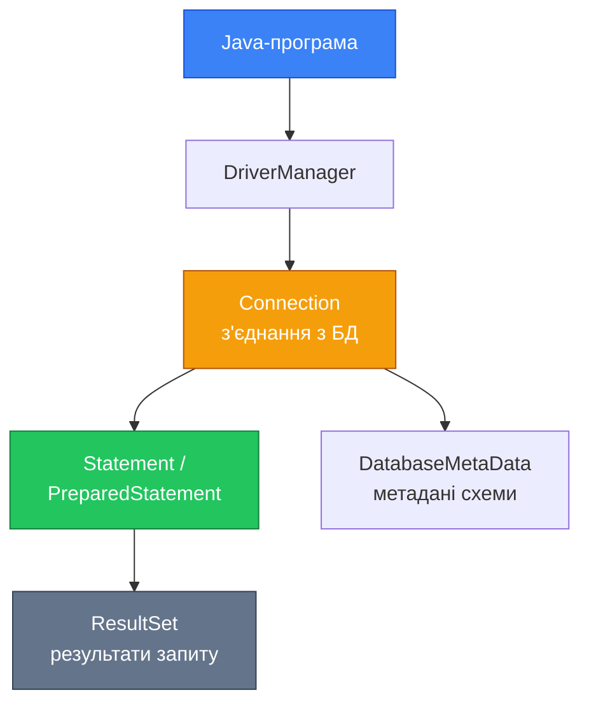

# JDBC: Перший контакт із базою даних

## Вступ: Найближчий шлях до SQL з Java

У попередній статті ми дослідили природу Impedance Mismatch — концептуального розриву між об'єктною та реляційною моделями. Тепер ми переходимо до практики: написати перший Java-код, що реально читає і записує дані у нашу H2-базу аудіоплатформи.

Найпряміший шлях від Java до SQL — це **JDBC** (Java Database Connectivity). JDBC — це не бібліотека, яку потрібно завантажити окремо, це **стандартний API**, що входить до складу Java SE з версії 1.1 (1997 рік). Саме на JDBC побудовані всі більш високорівневі абстракції: Hibernate використовує JDBC для фактичного виконання SQL, Spring JDBC Template обгортає JDBC у зручні утиліти, jOOQ генерує типобезпечні запити, але також виконує їх через JDBC.

> Розуміння JDBC — це розуміння фундаменту. Розробник, що знає JDBC, здатен прочитати будь-який стектрейс Hibernate, зрозуміти будь-яку проблему з підключенням і, за необхідності, обійти ORM там, де він заважає.

Ця стаття будується навколо простого але реального сценарію: ми реалізуємо перший CRUD для таблиці `authors` нашої аудіоплатформи. Почнемо з найпростішого можливого рішення, виявимо його критичні вади і покроково усунемо кожну з них.

## Архітектура JDBC: від DriverManager до ResultSet

Перш ніж писати код, важливо зрозуміти архітектуру JDBC. Вона складається з кількох ключових абстракцій, що утворюють чіткий ланцюг від програми до бази даних.

::mermaid



::

Розглянемо кожну ланку ланцюга:

**`DriverManager`** — статичний клас-фабрика, що керує зареєстрованими JDBC-драйверами. При виклику `DriverManager.getConnection(url, user, password)` він визначає потрібний драйвер за префіксом URL (`jdbc:h2:`, `jdbc:postgresql:`, `jdbc:mysql:`) і делегує йому створення з'єднання.

**`Connection`** — представляє одне фізичне з'єднання з базою даних. Це найдорожчий ресурс у JDBC: встановлення TCP-з'єднання, аутентифікація, узгодження параметрів сесії займають десятки мілісекунд. `Connection` є `AutoCloseable` і **обов'язково** має бути закритий після використання. Саме навколо ефективного управління `Connection` побудований патерн Connection Pool (стаття 11).

**`PreparedStatement`** — попередньо скомпільований SQL-запит із параметрами-заглушками (`?`). На відміну від `Statement`, він захищає від SQL-ін'єкцій та ефективніший при повторному виконанні одного і того ж запиту з різними параметрами.

**`ResultSet`** — курсор, що вказує на рядки результату запиту. Початково він позиціонується **перед** першим рядком. Методом `next()` ми переміщуємо курсор на наступний рядок і отримуємо `true`, доки рядки є. Читання відбувається через типізовані методи: `getString()`, `getInt()`, `getObject()`.

### Налаштування проєкту

Для роботи нам потрібні дві залежності Maven: H2 (вбудована база даних) та Flyway (для застосування міграцій, які ми написали у статті 06):

```xml
<dependencies>
    <!-- H2 — вбудована СУБД для розробки та навчання -->
    <dependency>
        <groupId>com.h2database</groupId>
        <artifactId>h2</artifactId>
        <version>2.3.232</version>
    </dependency>

    <!-- Flyway — автоматичне застосування міграцій при старті -->
    <dependency>
        <groupId>org.flywaydb</groupId>
        <artifactId>flyway-core</artifactId>
        <version>10.15.0</version>
    </dependency>
</dependencies>
```

Структура проєкту, з якою ми будемо працювати впродовж усієї серії:

::code-tree

```text [src/main/java/com/example/audiobook/domain/Author.java]
// Доменна модель
```

```text [src/main/java/com/example/audiobook/dao/AuthorNaiveDao.java]
// Перша, "наївна" реалізація DAO
```

```text [src/main/java/com/example/audiobook/db/ConnectionManager.java]
// Централізоване управління з'єднаннями
```

```text [src/main/resources/db/migration/V1__create_enum_and_authors.sql]
// Міграція з попередньої статті
```

```text [src/main/java/com/example/audiobook/Main.java]
// Точка входу
```

::

---

## Доменна модель: клас Author

Перед написанням DAO-коду визначимо доменну модель. Відповідно до таблиці `authors` у нашій схемі:

```sql
CREATE TABLE authors (
    id         UUID          PRIMARY KEY,
    first_name VARCHAR(64)   NOT NULL,
    last_name  VARCHAR(64)   NOT NULL,
    bio        TEXT,
    image_path VARCHAR(2048)
);
```

Java-клас `Author` — чиста доменна модель без жодних залежностей від JDBC:

```java showLineNumbers
package com.example.audiobook.domain;

import java.util.Objects;
import java.util.UUID;

/**
 * Доменна модель автора аудіокниги.
 * Клас не містить жодної залежності від JDBC, SQL або будь-якої
 * бібліотеки персистентності — це принципова вимога архітектури.
 */
public class Author {

    private final UUID id;
    private String firstName;
    private String lastName;
    private String bio;
    private String imagePath;

    /**
     * Конструктор для створення нового автора.
     * ID генерується автоматично — клієнтський код не повинен
     * піклуватися про генерацію ідентифікаторів.
     */
    public Author(String firstName, String lastName) {
        this.id = UUID.randomUUID();
        this.firstName = firstName;
        this.lastName = lastName;
    }

    /**
     * Конструктор для відновлення автора із сховища.
     * Використовується виключно DAO/Repository при читанні з БД.
     * ID передається явно — він вже існує у базі даних.
     */
    public Author(UUID id, String firstName, String lastName,
                  String bio, String imagePath) {
        this.id = id;
        this.firstName = firstName;
        this.lastName = lastName;
        this.bio = bio;
        this.imagePath = imagePath;
    }

    // --- Бізнес-методи ---

    /** Повертає повне ім'я автора у форматі "Прізвище Ім'я". */
    public String fullName() {
        return lastName + " " + firstName;
    }

    /** Перевіряє, чи заповнена біографія автора. */
    public boolean hasBio() {
        return bio != null && !bio.isBlank();
    }

    // --- Геттери та сеттери ---
    public UUID getId()          { return id; }
    public String getFirstName() { return firstName; }
    public String getLastName()  { return lastName; }
    public String getBio()       { return bio; }
    public String getImagePath() { return imagePath; }

    public void setFirstName(String firstName) { this.firstName = firstName; }
    public void setLastName(String lastName)   { this.lastName = lastName; }
    public void setBio(String bio)             { this.bio = bio; }
    public void setImagePath(String imagePath) { this.imagePath = imagePath; }

    /**
     * Рівність визначається виключно за первинним ключем —
     * узгодження з реляційною моделлю (стаття 09, Розбіжність 3).
     */
    @Override
    public boolean equals(Object o) {
        if (this == o) return true;
        if (!(o instanceof Author other)) return false;
        return id != null && id.equals(other.id);
    }

    @Override
    public int hashCode() {
        return Objects.hashCode(id);
    }

    @Override
    public String toString() {
        return "Author{id=" + id + ", name='" + fullName() + "'}";
    }
}
```

**Ключові архітектурні рішення:**

- **Рядок 24**: `id` оголошений як `final` — ідентифікатор незмінний після створення об'єкта
- **Рядки 23–27**: Конструктор для **нових** об'єктів генерує UUID автоматично; клієнт надає лише бізнес-дані
- **Рядки 34–41**: Конструктор для **відновлення** з БД приймає всі поля, включаючи `id` — цей конструктор використовуватиме виключно DAO-шар
- **Рядки 45–52**: Бізнес-методи `fullName()` та `hasBio()` — поведінка, що належить домену, а не DAO
- **Рядки 72–76**: `equals()` за PK — правильний підхід для сутностей з БД

---

## Перша реалізація: AuthorNaiveDao

Тепер напишемо найпростіший можливий DAO. Ми свідомо реалізуємо його «в лоб», без жодних абстракцій — щоб потім чітко побачити кожну з проблем.

```java showLineNumbers
package com.example.audiobook.dao;

import com.example.audiobook.domain.Author;

import java.sql.*;
import java.util.ArrayList;
import java.util.List;
import java.util.Optional;
import java.util.UUID;

/**
 * Найпростіша реалізація DAO для роботи з таблицею authors.
 * УВАГА: цей клас навмисно написаний "наївно" і містить
 * кілька критичних проблем, які будуть виявлені та виправлені далі.
 */
public class AuthorNaiveDao {

    // URL підключення до H2 у файловому режимі з PostgreSQL-сумісністю
    private static final String DB_URL =
        "jdbc:h2:./data/audiobook_db;MODE=PostgreSQL;DB_CLOSE_DELAY=-1";
    private static final String DB_USER = "sa";
    private static final String DB_PASS = "";

    /**
     * Зберігає нового автора у базі даних.
     * ПРОБЛЕМА: створює нове з'єднання при кожному виклику.
     */
    public void save(Author author) {
        // Проблема 1: рядок SQL конкатенується — небезпечно!
        String sql = "INSERT INTO authors (id, first_name, last_name, bio, image_path) " +
                     "VALUES ('" + author.getId() + "', '" +
                     author.getFirstName() + "', '" +
                     author.getLastName() + "', '" +
                     author.getBio() + "', '" +
                     author.getImagePath() + "')";
        try {
            // Проблема 2: Connection створюється і НЕ закривається
            Connection conn = DriverManager.getConnection(DB_URL, DB_USER, DB_PASS);
            Statement stmt = conn.createStatement();
            stmt.executeUpdate(sql);
            // Проблема 3: stmt і conn не закриваються → витік ресурсів
        } catch (SQLException e) {
            // Проблема 4: помилка "проковтується" — silent failure
            System.err.println("Помилка збереження: " + e.getMessage());
        }
    }

    /**
     * Знаходить автора за ідентифікатором.
     */
    public Optional<Author> findById(UUID id) {
        String sql = "SELECT id, first_name, last_name, bio, image_path " +
                     "FROM authors WHERE id = '" + id + "'"; // Проблема 1 знову
        try {
            Connection conn = DriverManager.getConnection(DB_URL, DB_USER, DB_PASS);
            Statement stmt = conn.createStatement();
            ResultSet rs = stmt.executeQuery(sql);

            if (rs.next()) {
                Author author = mapRow(rs);
                // Проблема 3: rs, stmt, conn не закриваються
                return Optional.of(author);
            }
        } catch (SQLException e) {
            System.err.println("Помилка пошуку: " + e.getMessage());
        }
        return Optional.empty();
    }

    /**
     * Повертає всіх авторів.
     */
    public List<Author> findAll() {
        String sql = "SELECT id, first_name, last_name, bio, image_path FROM authors";
        List<Author> authors = new ArrayList<>();
        try {
            Connection conn = DriverManager.getConnection(DB_URL, DB_USER, DB_PASS);
            Statement stmt = conn.createStatement();
            ResultSet rs = stmt.executeQuery(sql);
            while (rs.next()) {
                authors.add(mapRow(rs));
            }
        } catch (SQLException e) {
            System.err.println("Помилка отримання списку: " + e.getMessage());
        }
        return authors;
    }

    /**
     * Перетворює поточний рядок ResultSet на об'єкт Author.
     * Маппінг зібраний в одному місці — це єдине правильне рішення тут.
     */
    private Author mapRow(ResultSet rs) throws SQLException {
        return new Author(
            rs.getObject("id", UUID.class),     // UUID напряму з H2
            rs.getString("first_name"),
            rs.getString("last_name"),
            rs.getString("bio"),                 // може бути null — OK
            rs.getString("image_path")           // може бути null — OK
        );
    }
}
```

**Зверніть увагу:** метод `mapRow()` вже реалізований правильно — маппінг зібраний в одному місці, а не дублюється у кожному методі. Але решта коду містить чотири серйозних проблеми, що у production-системі призведуть до збоїв.


---

## Чотири критичні проблеми наївного підходу

### Проблема 1: SQL-ін'єкція через конкатенацію рядків

Подивимося на рядок побудови запиту у методі `save()`:

```java
String sql = "INSERT INTO authors ... VALUES ('" + author.getFirstName() + "', '" + ...
```

Що станеться, якщо `author.getFirstName()` містить значення `O'Brien`? У SQL-запиті з'явиться некоректна лапка:

```sql
INSERT INTO authors ... VALUES ('O'Brien', ...)
--                                 ^ Синтаксична помилка!
```

Але набагато гірше — зловмисний користувач може передати ім'я `'); DROP TABLE authors; --` і отримати:

```sql
INSERT INTO authors ... VALUES (''); DROP TABLE authors; --', ...)
-- Перший запит — порожній INSERT
-- Другий запит — видалення таблиці authors!
```

Це класична **SQL-ін'єкція** (SQL Injection) — одна з найнебезпечніших вразливостей у веб-застосунках, що входить до OWASP Top 10 вже понад 20 років поспіль.

::caution
SQL-ін'єкція через конкатенацію рядків — це не теоретична загроза. Це реальна вразливість, що дозволяє отримати несанкціонований доступ до даних, модифікувати або знищити базу даних. Ніколи не будуйте SQL-запити через конкатенацію з даними, що надходять ззовні.
::

**Рішення:** `PreparedStatement` з параметрами-заглушками (`?`):

```java showLineNumbers
// Безпечно: SQL компілюється окремо від даних
String sql = "INSERT INTO authors (id, first_name, last_name, bio, image_path) " +
             "VALUES (?, ?, ?, ?, ?)";
PreparedStatement stmt = conn.prepareStatement(sql);
stmt.setObject(1, author.getId());       // UUID передається як Object
stmt.setString(2, author.getFirstName()); // рядок — безпечно
stmt.setString(3, author.getLastName());
stmt.setString(4, author.getBio());      // може бути null — setString обробляє це
stmt.setString(5, author.getImagePath());
stmt.executeUpdate();
```

У `PreparedStatement` SQL-запит і дані **ніколи не поєднуються в одному рядку**. База даних компілює шаблон запиту один раз, а потім підставляє параметри безпечним чином на рівні протоколу. Ніякої конкатенації — ніякої ін'єкції.

---

### Проблема 2: Витік ресурсів

`Connection`, `Statement` та `ResultSet` є `AutoCloseable` — це ресурси, що утримують системні дескриптори: TCP-з'єднання, пам'ять сервера, файлові блокування. Якщо їх не закривати явно, відбувається **витік ресурсів** (resource leak).

У наївній реалізації при виникненні виключення між `getConnection()` та закриттям ресурси залишаються відкритими. Навіть без виключень ресурси закриваються лише тоді, коли збирач сміття знищить об'єкти — а це може статися значно пізніше або взагалі не статися до завершення програми.

**Наслідки:** вичерпання ліміту підключень до БД, витоки пам'яті, «зависання» таблиць через незакриті транзакції.

**Рішення:** конструкція `try-with-resources` (Java 7+), що гарантує закриття ресурсів незалежно від того, чи виникло виключення:

```java showLineNumbers
// try-with-resources: ресурси закриваються у зворотному порядку
// після виходу з блоку try — навіть при виключенні
try (Connection conn = DriverManager.getConnection(DB_URL, DB_USER, DB_PASS);
     PreparedStatement stmt = conn.prepareStatement(sql)) {

    stmt.setObject(1, author.getId());
    stmt.setString(2, author.getFirstName());
    // ...
    stmt.executeUpdate();

} // conn.close() та stmt.close() викликаються автоматично тут
```

Зверніть увагу: у `try-with-resources` можна оголосити кілька ресурсів через крапку з комою. Вони закриваються у **зворотному** порядку оголошення: спочатку `stmt`, потім `conn`. Це правильний порядок — Statement має бути закритий до Connection.

---

### Проблема 3: Дублювання рядка підключення

У наївній реалізації рядок підключення `DB_URL`, `DB_USER`, `DB_PASS` та виклик `DriverManager.getConnection()` повторюються у **кожному** методі. Якщо завтра потрібно змінити параметри підключення, доведеться виправляти кожен DAO окремо.

**Рішення:** клас `ConnectionManager`, що централізує управління підключеннями:

```java showLineNumbers
package com.example.audiobook.db;

import java.sql.Connection;
import java.sql.DriverManager;
import java.sql.SQLException;

/**
 * Централізований менеджер з'єднань з базою даних.
 * Єдине місце у проєкті, де знають URL та облікові дані БД.
 * У наступних статтях цей клас еволюціонує до повноцінного Connection Pool.
 */
public class ConnectionManager {

    private final String url;
    private final String user;
    private final String password;

    public ConnectionManager(String url, String user, String password) {
        this.url = url;
        this.user = user;
        this.password = password;
    }

    /**
     * Повертає нове з'єднання з базою даних.
     * Викликач зобов'язаний закрити з'єднання після використання
     * (найкраще — через try-with-resources).
     */
    public Connection getConnection() {
        try {
            return DriverManager.getConnection(url, user, password);
        } catch (SQLException e) {
            throw new DatabaseException("Неможливо встановити з'єднання з БД: " + url, e);
        }
    }

    /** Стандартний URL для H2 з PostgreSQL-сумісністю */
    public static ConnectionManager forH2(String dbPath) {
        String url = "jdbc:h2:" + dbPath + ";MODE=PostgreSQL;DB_CLOSE_DELAY=-1";
        return new ConnectionManager(url, "sa", "");
    }
}
```

```java showLineNumbers
package com.example.audiobook.db;

/**
 * Unchecked виняток для помилок рівня бази даних.
 * Обгортає checked SQLException, звільняючи клієнтський код
 * від обов'язкових try-catch блоків.
 */
public class DatabaseException extends RuntimeException {

    public DatabaseException(String message, Throwable cause) {
        super(message, cause);
    }
}
```

Використання `RuntimeException` замість перевірки кожного `SQLException` є свідомим архітектурним рішенням: помилки бази даних у більшості випадків є фатальними для поточної операції, і примусова обробка `checked` виключень лише засмічує код. DAO-шар перехоплює `SQLException` і перетворює її на `DatabaseException`.

---

### Проблема 4: «Мовчазний» збій

У наївній реалізації блок `catch` лише друкує повідомлення в `stderr` і продовжує виконання:

```java
} catch (SQLException e) {
    System.err.println("Помилка збереження: " + e.getMessage());
    // Метод повертає normally — але збереження не відбулося!
}
```

Клієнтський код при цьому вважає, що `save()` завершився успішно. Це **silent failure** — одна з найнебезпечніших ситуацій у програмуванні, оскільки помилка непомітно поширюється і виявляється значно пізніше, у неочікуваному місці.

**Рішення:** перетворення `SQLException` на `RuntimeException` і дозвіл їй поширюватися вверх по стеку:

```java showLineNumbers
public void save(Author author) {
    String sql = "INSERT INTO authors (id, first_name, last_name, bio, image_path) " +
                 "VALUES (?, ?, ?, ?, ?)";
    try (Connection conn = connectionManager.getConnection();
         PreparedStatement stmt = conn.prepareStatement(sql)) {

        stmt.setObject(1, author.getId());
        stmt.setString(2, author.getFirstName());
        stmt.setString(3, author.getLastName());
        stmt.setString(4, author.getBio());
        stmt.setString(5, author.getImagePath());
        stmt.executeUpdate();

    } catch (SQLException e) {
        // Перетворюємо checked на unchecked — збій не замовчується
        throw new DatabaseException("Помилка збереження автора: " + author, e);
    }
}
```


---

## Виправлена реалізація: AuthorDao

Тепер, розуміючи всі чотири проблеми, напишемо виправлену версію DAO. Вона використовує `PreparedStatement`, `try-with-resources`, `ConnectionManager` та `DatabaseException`:

```java showLineNumbers
package com.example.audiobook.dao;

import com.example.audiobook.db.ConnectionManager;
import com.example.audiobook.db.DatabaseException;
import com.example.audiobook.domain.Author;

import java.sql.*;
import java.util.ArrayList;
import java.util.List;
import java.util.Optional;
import java.util.UUID;

/**
 * DAO для роботи з таблицею authors.
 * Виправлена версія: PreparedStatement, try-with-resources,
 * централізоване підключення, правильна обробка помилок.
 */
public class AuthorDao {

    private final ConnectionManager connectionManager;

    public AuthorDao(ConnectionManager connectionManager) {
        this.connectionManager = connectionManager;
    }

    /**
     * Зберігає нового автора у таблиці authors.
     * Якщо автор з таким id вже існує — викидає виключення (порушення PK).
     */
    public void save(Author author) {
        String sql = """
            INSERT INTO authors (id, first_name, last_name, bio, image_path)
            VALUES (?, ?, ?, ?, ?)
            """;
        try (Connection conn = connectionManager.getConnection();
             PreparedStatement stmt = conn.prepareStatement(sql)) {

            stmt.setObject(1, author.getId());        // UUID → java.util.UUID
            stmt.setString(2, author.getFirstName());
            stmt.setString(3, author.getLastName());
            stmt.setString(4, author.getBio());       // null-safe: setString(i, null) → SQL NULL
            stmt.setString(5, author.getImagePath()); // null-safe

            int rowsAffected = stmt.executeUpdate();
            if (rowsAffected != 1) {
                throw new DatabaseException("Очікувався 1 рядок, вставлено: " + rowsAffected, null);
            }

        } catch (SQLException e) {
            throw new DatabaseException("Помилка збереження автора: " + author.getId(), e);
        }
    }

    /**
     * Знаходить автора за UUID-ідентифікатором.
     * Повертає Optional.empty() якщо автора не знайдено.
     */
    public Optional<Author> findById(UUID id) {
        String sql = """
            SELECT id, first_name, last_name, bio, image_path
            FROM authors
            WHERE id = ?
            """;
        try (Connection conn = connectionManager.getConnection();
             PreparedStatement stmt = conn.prepareStatement(sql)) {

            stmt.setObject(1, id);

            try (ResultSet rs = stmt.executeQuery()) {
                // ResultSet відкривається всередині try-with-resources stmt,
                // тому його закриваємо окремим вкладеним блоком
                if (rs.next()) {
                    return Optional.of(mapRow(rs));
                }
                return Optional.empty();
            }

        } catch (SQLException e) {
            throw new DatabaseException("Помилка пошуку автора за id=" + id, e);
        }
    }

    /**
     * Повертає всіх авторів, відсортованих за прізвищем та ім'ям.
     */
    public List<Author> findAll() {
        String sql = """
            SELECT id, first_name, last_name, bio, image_path
            FROM authors
            ORDER BY last_name, first_name
            """;
        List<Author> authors = new ArrayList<>();

        try (Connection conn = connectionManager.getConnection();
             PreparedStatement stmt = conn.prepareStatement(sql);
             ResultSet rs = stmt.executeQuery()) {
            // ResultSet без параметрів можна відкрити одразу у try-with-resources

            while (rs.next()) {
                authors.add(mapRow(rs));
            }

        } catch (SQLException e) {
            throw new DatabaseException("Помилка отримання списку авторів", e);
        }
        return authors;
    }

    /**
     * Знаходить авторів за частиною прізвища (регістр-незалежний пошук).
     */
    public List<Author> findByLastName(String lastNamePart) {
        String sql = """
            SELECT id, first_name, last_name, bio, image_path
            FROM authors
            WHERE LOWER(last_name) LIKE LOWER(?)
            ORDER BY last_name, first_name
            """;
        List<Author> authors = new ArrayList<>();

        try (Connection conn = connectionManager.getConnection();
             PreparedStatement stmt = conn.prepareStatement(sql)) {

            // % — SQL-шаблон "будь-яка кількість символів"
            stmt.setString(1, "%" + lastNamePart + "%");

            try (ResultSet rs = stmt.executeQuery()) {
                while (rs.next()) {
                    authors.add(mapRow(rs));
                }
            }

        } catch (SQLException e) {
            throw new DatabaseException("Помилка пошуку авторів за прізвищем: " + lastNamePart, e);
        }
        return authors;
    }

    /**
     * Оновлює дані існуючого автора.
     * Оновлює всі поля, крім незмінного id.
     */
    public void update(Author author) {
        String sql = """
            UPDATE authors
            SET first_name = ?,
                last_name  = ?,
                bio        = ?,
                image_path = ?
            WHERE id = ?
            """;
        try (Connection conn = connectionManager.getConnection();
             PreparedStatement stmt = conn.prepareStatement(sql)) {

            stmt.setString(1, author.getFirstName());
            stmt.setString(2, author.getLastName());
            stmt.setString(3, author.getBio());
            stmt.setString(4, author.getImagePath());
            stmt.setObject(5, author.getId()); // id — в умові WHERE, останній параметр

            int rowsAffected = stmt.executeUpdate();
            if (rowsAffected == 0) {
                // Автор з таким id не існує — це логічна помилка клієнтського коду
                throw new DatabaseException(
                    "Автора з id=" + author.getId() + " не знайдено для оновлення", null
                );
            }

        } catch (SQLException e) {
            throw new DatabaseException("Помилка оновлення автора: " + author.getId(), e);
        }
    }

    /**
     * Видаляє автора за ідентифікатором.
     * Завдяки ON DELETE CASCADE у схемі, всі пов'язані audiobooks
     * також будуть видалені автоматично.
     *
     * @return true — якщо автора було знайдено та видалено
     */
    public boolean deleteById(UUID id) {
        String sql = "DELETE FROM authors WHERE id = ?";

        try (Connection conn = connectionManager.getConnection();
             PreparedStatement stmt = conn.prepareStatement(sql)) {

            stmt.setObject(1, id);
            int rowsAffected = stmt.executeUpdate();
            return rowsAffected > 0; // false якщо автора з таким id не існувало

        } catch (SQLException e) {
            throw new DatabaseException("Помилка видалення автора з id=" + id, e);
        }
    }

    /**
     * Перевіряє існування автора за id без завантаження всіх даних.
     * Ефективніше за findById() + isPresent() — не передає дані по мережі.
     */
    public boolean existsById(UUID id) {
        String sql = "SELECT 1 FROM authors WHERE id = ? LIMIT 1";

        try (Connection conn = connectionManager.getConnection();
             PreparedStatement stmt = conn.prepareStatement(sql)) {

            stmt.setObject(1, id);
            try (ResultSet rs = stmt.executeQuery()) {
                return rs.next(); // true — якщо хоча б один рядок є
            }

        } catch (SQLException e) {
            throw new DatabaseException("Помилка перевірки існування автора: " + id, e);
        }
    }

    /**
     * Повертає кількість авторів у таблиці.
     * Використовує COUNT(*) — найефективніший спосіб підрахунку рядків.
     */
    public long count() {
        String sql = "SELECT COUNT(*) FROM authors";

        try (Connection conn = connectionManager.getConnection();
             PreparedStatement stmt = conn.prepareStatement(sql);
             ResultSet rs = stmt.executeQuery()) {

            rs.next();
            return rs.getLong(1); // Перший (і єдиний) стовпець результату

        } catch (SQLException e) {
            throw new DatabaseException("Помилка підрахунку авторів", e);
        }
    }

    /**
     * Приватний метод маппінгу ResultSet → Author.
     * Централізований у одному місці — зміна структури таблиці
     * вимагає зміни лише тут.
     */
    private Author mapRow(ResultSet rs) throws SQLException {
        return new Author(
            rs.getObject("id", UUID.class),  // Типізований getObject для UUID
            rs.getString("first_name"),
            rs.getString("last_name"),
            rs.getString("bio"),             // Повертає null якщо стовпець NULL
            rs.getString("image_path")       // Повертає null якщо стовпець NULL
        );
    }
}
```

**Декомпозиція ключових рішень:**

- **Рядок 18**: `ConnectionManager` передається через **конструктор** (Dependency Injection) — `AuthorDao` не знає, як саме отримати з'єднання; це визначає зовнішній код
- **Рядки 31–32**: Text Block (Java 15+) для SQL — читабельний, без конкатенацій
- **Рядок 43**: Перевірка `rowsAffected != 1` — захист від тихих збоїв при INSERT
- **Рядок 67**: Вкладений `try-with-resources` для `ResultSet` — він має бути закритий до `PreparedStatement`
- **Рядок 91**: `findAll()` відкриває `ResultSet` одразу в `try-with-resources`, оскільки запит без параметрів
- **Рядок 140**: `"SELECT 1 FROM authors WHERE id = ?"` — найефективніша перевірка існування: не передає дані, лише факт наявності рядка
- **Рядок 154**: `rs.getLong(1)` — звернення за номером стовпця (1-базований), а не за іменем; для `COUNT(*)` це прийнятно


---

## Демонстрація: зведення всього разом

Напишемо `Main`, що демонструє повний цикл CRUD через наш `AuthorDao`:

```java showLineNumbers
package com.example.audiobook;

import com.example.audiobook.dao.AuthorDao;
import com.example.audiobook.db.ConnectionManager;
import com.example.audiobook.domain.Author;

import java.util.List;
import java.util.Optional;
import java.util.UUID;

public class Main {

    public static void main(String[] args) {
        // 1. Ініціалізація ConnectionManager — єдиний екземпляр на весь додаток
        ConnectionManager connectionManager =
            ConnectionManager.forH2("./data/audiobook_db");

        // 2. DAO отримує ConnectionManager через конструктор
        AuthorDao authorDao = new AuthorDao(connectionManager);

        // === CREATE ===
        Author hesse = new Author("Герман", "Гессе");
        hesse.setBio("Нобелівський лауреат, автор «Степового вовка» та «Гри в бісер»");

        Author kafka = new Author("Франц", "Кафка");
        kafka.setBio("Майстер абсурду та екзистенційної прози");

        authorDao.save(hesse);
        authorDao.save(kafka);
        System.out.println("✓ Збережено: " + hesse.fullName() + ", " + kafka.fullName());

        // === READ ===
        Optional<Author> found = authorDao.findById(hesse.getId());
        found.ifPresent(a ->
            System.out.println("✓ Знайдено: " + a.fullName() + " | Bio: " + a.getBio())
        );

        List<Author> all = authorDao.findAll();
        System.out.println("✓ Всього авторів у БД: " + all.size());

        List<Author> byName = authorDao.findByLastName("ка");
        byName.forEach(a -> System.out.println("  → Пошук 'ка': " + a.fullName()));

        // === UPDATE ===
        hesse.setBio("Нобелівська премія з літератури 1946 року. Роман «Сіддхартха».");
        authorDao.update(hesse);
        System.out.println("✓ Оновлено біографію: " + hesse.fullName());

        // === EXISTS / COUNT ===
        System.out.println("✓ Гессе існує: " + authorDao.existsById(hesse.getId()));
        System.out.println("✓ Загальна кількість: " + authorDao.count());

        // === DELETE ===
        boolean deleted = authorDao.deleteById(kafka.getId());
        System.out.println("✓ Кафку видалено: " + deleted);
        System.out.println("✓ Кількість після видалення: " + authorDao.count());
    }
}
```

При запуску програма виведе:

```
✓ Збережено: Гессе Герман, Кафка Франц
✓ Знайдено: Гессе Герман | Bio: Нобелівський лауреат, автор «Степового вовка» та «Гри в бісер»
✓ Всього авторів у БД: 2
  → Пошук 'ка': Кафка Франц
✓ Оновлено біографію: Гессе Герман
✓ Гессе існує: true
✓ Загальна кількість: 2
✓ Кафку видалено: true
✓ Кількість після видалення: 1
```

---

## Підсумок: що ми здобули і чого ще бракує

Порівняємо наївний та виправлений підходи:

| Аспект | Наївний підхід | Виправлений підхід |
|:---|:---|:---|
| SQL-безпека | ❌ Конкатенація рядків | ✅ `PreparedStatement` з `?` |
| Ресурси | ❌ Витік `Connection`/`Statement` | ✅ `try-with-resources` |
| Підключення | ❌ URL дубльований у кожному методі | ✅ `ConnectionManager` |
| Помилки | ❌ Silent failure через `System.err` | ✅ `DatabaseException` |
| Маппінг | ✅ `mapRow()` централізований | ✅ `mapRow()` централізований |

Проте навіть виправлена реалізація має суттєві недоліки, що стануть очевидними при масштабуванні:

::card-group

::card{title="Дороге створення з'єднань" icon="i-heroicons-clock"}
Кожен метод викликає `connectionManager.getConnection()` — а це означає нове TCP-з'єднання з БД щоразу. При 100 одночасних запитах — 100 нових з'єднань.
**Рішення:** Connection Pool (стаття 11).
::

::card{title="Дублювання між DAO" icon="i-heroicons-document-duplicate"}
`GenreDao`, `UserDao`, `AudiobookDao` матимуть ідентичну структуру: ті самі методи `findById`, `findAll`, `deleteById`, `count`. Відрізняється лише SQL та `mapRow()`.
**Рішення:** Abstract Repository (стаття 14).
::

::card{title="Немає транзакцій" icon="i-heroicons-arrow-path"}
Операція "зберегти аудіокнигу + оновити лічильник жанру" складається з двох SQL-запитів. Якщо перший успішний, а другий — ні, дані стають інконсистентними.
**Рішення:** Unit of Work (стаття 16).
::

::card{title="Проблема N+1" icon="i-heroicons-signal"}
Завантаження 50 аудіокниг і потім автора кожної — 51 запит замість одного JOIN. Ручний маппінг не має механізму "ледачого" завантаження.
**Рішення:** Proxy + Lazy Loading (стаття 18).
::

::

---

## Завдання для закріплення

::collapsible{title="Рівень 1: GenreDao"}

Реалізуйте `GenreDao` за аналогією до `AuthorDao` для таблиці `genres`:

```sql
CREATE TABLE genres (
    id          UUID        PRIMARY KEY,
    name        VARCHAR(64) NOT NULL UNIQUE,
    description TEXT
);
```

1. Реалізуйте методи: `save()`, `findById()`, `findAll()`, `findByName()`, `update()`, `deleteById()`
2. Метод `findByName()` має шукати точний збіг (без `LIKE`), оскільки `name` має `UNIQUE` constraint
3. Поясніть, що станеться при спробі зберегти жанр з іменем, що вже існує у таблиці

::

::collapsible{title="Рівень 2: UserDao з nullable полями"}

Реалізуйте `UserDao` для таблиці `users`. Зверніть увагу: поля `email` та `avatar_path` є nullable:

```sql
CREATE TABLE users (
    id            UUID         PRIMARY KEY,
    username      VARCHAR(64)  NOT NULL UNIQUE,
    password_hash VARCHAR(128) NOT NULL,
    email         VARCHAR(376),      -- nullable
    avatar_path   VARCHAR(2048)      -- nullable
);
```

1. У методі `save()` переконайтеся, що `setString(i, null)` коректно передає SQL `NULL`
2. У `mapRow()` перевірте: `rs.getString("email")` повертає `null` коли значення NULL — переконайтеся, що клас `User` це коректно обробляє
3. Додайте метод `findByUsername(String username)` — пошук за унікальним полем
4. Додайте метод `findByEmail(String email)` з урахуванням, що email може бути null (запит повинен шукати лише серед не-NULL значень)

::

::collapsible{title="Рівень 3: Транзакційне збереження AudiobookDao"}

`AudiobookDao` складніший за `AuthorDao` — аудіокнига містить зовнішні ключі на `authors` та `genres`. Крім того, при збереженні аудіокниги часто потрібно зберегти й пов'язані `AudiobookFile`:

1. Реалізуйте `AudiobookDao.save(Audiobook audiobook)` — INSERT лише в `audiobooks`
2. Реалізуйте `AudiobookFileDao.save(AudiobookFile file)` — INSERT в `audiobook_files`
3. Напишіть метод `saveWithFiles(Audiobook audiobook, List<AudiobookFile> files)`, що виконує обидва збереження в одній транзакції:

```java
Connection conn = connectionManager.getConnection();
conn.setAutoCommit(false); // Починаємо транзакцію вручну
try {
    audiobookDao.save(conn, audiobook);   // Перевантажений метод, що приймає Connection
    for (AudiobookFile f : files) {
        fileDao.save(conn, f);
    }
    conn.commit();
} catch (Exception e) {
    conn.rollback();
    throw new DatabaseException("Збереження аудіокниги провалилось", e);
} finally {
    conn.setAutoCommit(true);
    conn.close();
}
```

Поясніть, чому передача `Connection` у метод (замість створення нового) є ключовою для транзакційності.

::

