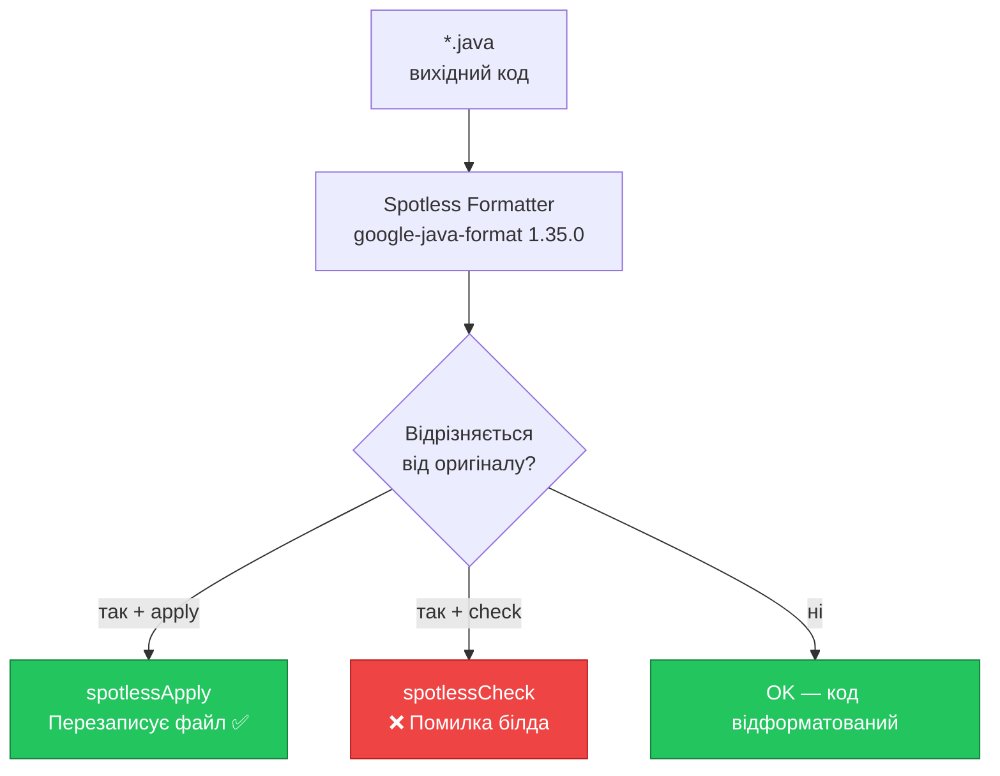
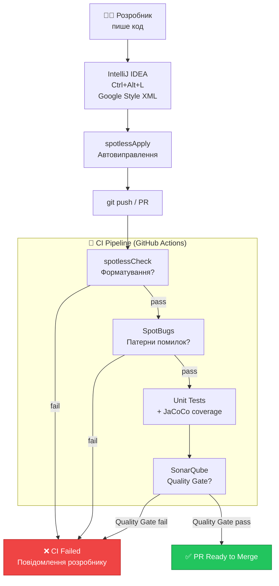

# Якість коду: Spotless, SpotBugs та SonarQube

## Вступ: Чому форматування — це не питання смаку

Уявіть типову ситуацію: три розробники працюють над одним проєктом. Перший використовує відступ у 4 пробіли, другий — 2, третій — табуляцію. Перший додає порожній рядок перед `return`, другий ні. Перший сортує imports вручну, другий покладається на IntelliJ, третій взагалі про це не думає.

Результат? Кожен commit містить десятки змін форматування, що «ховають» справжні логічні зміни. Code review перетворюється на полювання за справжніми правками серед шуму. Git history втрачає цінність. Merge conflicts виникають там, де не повинні.

Проблема фундаментальна: **домовленості між людьми ненадійні**. Навіть найдисциплінованіша команда забуде про правило під тиском дедлайну. Рішення — **автоматизація**: інструменти, що перевіряють і виправляють форматування механічно, без людської участі.

У Java-світі де-факто стандартом форматування є **Google Java Style Guide** — документ, що чітко визначає кожен аспект зовнішнього вигляду коду. Він використовується у Google, Android, Apache та більшості великих open-source проєктів.

Існує три рівні контролю якості коду, і кожен вирішує свою задачу:

::card-group

::card{title="Форматування" icon="i-heroicons-paint-brush"}

**Інструменти:** Spotless + google-java-format

Гарантує: код виглядає однаково незалежно від того, хто і в якій IDE його писав. Перевіряється автоматично при кожному білді.

::

::card{title="Аналіз патернів" icon="i-heroicons-bug-ant"}

**Інструмент:** SpotBugs

Знаходить: типові патерни помилок (null pointer, ігнорований результат, SQL-ін'єкція через конкатенацію). Без запуску коду.

::

::card{title="Архітектурний аналіз" icon="i-heroicons-chart-bar"}

**Інструмент:** SonarQube

Вимірює: складність, дублювання, покриття тестами, технічний борг. Відстежує тренди у часі.

::

::

У цій статті ми налаштуємо всі три рівні для нашого проєкту аудіоплатформи. Почнемо з найближчого до розробника — IDE — і підемо до повністю автоматизованого pipeline.

::note
**Актуальні версії (квітень 2026):** Spotless Gradle `8.4.0` / Maven `3.4.0`, google-java-format `1.35.0`, SpotBugs Gradle `6.5.1`, SonarQube Gradle `7.2.3.7755`.
::

---

## IntelliJ IDEA: Google Java Style як відправна точка

Перший крок — налаштувати IntelliJ IDEA так, щоб `Ctrl+Alt+L` форматував код відповідно до Google Java Style Guide. Google надає готовий XML-файл конфігурації, сумісний з IntelliJ.

### Де взяти та як встановити

Файл конфігурації доступний за адресою:
```
https://google.github.io/styleguide/intellij-java-google-style.xml
```

Завантажте файл та імпортуйте його:

::steps

### Відкрийте налаштування

`File → Settings` (Windows/Linux) або `IntelliJ IDEA → Settings` (macOS)

### Перейдіть до Code Style

`Editor → Code Style → Java`

### Імпортуйте схему

Натисніть іконку шестерні (⚙) праворуч від поля `Scheme` → `Import Scheme → IntelliJ IDEA code style XML`

### Оберіть файл

Вкажіть завантажений `intellij-java-google-style.xml` → `Apply` → `OK`

### Перевірте активацію

У полі `Scheme` має відображатися `GoogleStyle`

::

### Ключові параметри Google Java Style

Після імпорту IntelliJ знатиме такі правила форматування:

| Параметр | Значення | Причина |
|---|---|---|
| Відступ | **2 пробіли** | Менше горизонтального прокручування; код вміщується на split-screen |
| Ширина рядка | **100 символів** | Компроміс між читабельністю та щільністю |
| Дужки в `if/for/while` | **Обов'язкові** | Запобігає класу помилок типу [Apple SSL bug](https://www.imperialviolet.org/2014/02/22/applebug.html) |
| Порожні рядки між методами | **1** | Чіткі візуальні блоки без надлишкового пробілу |
| Imports | **Без wildcard** | `import java.util.*` ховає залежності |

::warning
IntelliJ-форматування вирішує лише частину проблеми. Воно спрацьовує **лише вручну** (або при збереженні, якщо налаштовано). Воно **не перевіряє** код у CI, **не блокує** commit з неправильним форматуванням, і **залежить** від того, чи у кожного члена команди однакові налаштування IDE. Наступний інструмент вирішує всі ці обмеження.
::

---

## Spotless: Форматування як частина білда

**Spotless** — це Gradle/Maven-плагін, що запускає форматування коду як частину процесу білду. Його ключова властивість: він не лише вміє **виправити** форматування (`apply`), а й **перевірити** відповідність і провалити білд при невідповідності (`check`). Саме `check`-режим використовується у CI.

### Як працює Spotless

::mermaid



::

Spotless виступає **детермінованим арбітром**: для одного і того ж вихідного файлу він завжди дасть однаковий результат, незалежно від ОС, версії JDK чи IDE розробника. Саме це робить його надійнішим за ручне форматування.

---
### Gradle — повна конфігурація

::tabs

::tabs-item{label="Groovy DSL (build.gradle)"}

```groovy
// build.gradle
plugins {
    id 'java'
    id 'com.diffplug.spotless' version '8.4.0'
}

spotless {
    // ratchetFrom 'origin/main'
    // Якщо є legacy-код з поганим форматуванням — увімкніть цю опцію.
    // Тоді Spotless перевірятиме лише файли, змінені відносно main-гілки.
    // Дозволяє поступово вводити форматування у великих проєктах.

    java {
        // Цільові файли: всі *.java у src/
        // За замовчуванням Spotless знаходить їх автоматично.
        target 'src/**/*.java'

        // ── Ядро форматування ─────────────────────────────────────────
        // Google Java Format 1.35.0
        // Дві стратегії відступу:
        //   .style('GOOGLE') → 2 пробіли (за замовчуванням, рекомендовано)
        //   .aosp()          → 4 пробіли (Android Open Source Project style)
        googleJavaFormat('1.35.0')
            .style('GOOGLE')
            .reflowLongStrings()   // переносити довгі рядкові літерали
            .formatJavadoc(true)   // форматувати Javadoc-коментарі
            .reorderImports(false) // imports-порядок контролюємо через importOrder

        // ── Imports ────────────────────────────────────────────────────
        // Групи: java/javax → org → com → все інше → static imports
        // '' означає "всі не вказані явно"
        // '\\#' — префікс для static imports (import static ...)
        importOrder('java', 'javax', 'org', 'com', '', '\\#')

        // Автоматично видалити невикористані imports
        removeUnusedImports()

        // Заборонити wildcard imports (import java.util.*)
        // Розкоментуйте за потреби:
        // forbidWildcardImports()

        // ── Type annotations ────────────────────────────────────────────
        // Виправляє форматування @NonNull, @Nullable та інших анотацій типів
        formatAnnotations()

        // ── Базові правила ──────────────────────────────────────────────
        trimTrailingWhitespace()  // видалити пробіли в кінці рядків
        endWithNewline()          // файл має завершуватися переносом рядка
    }

    // Форматування misc-файлів (не Java)
    format 'misc', {
        target '*.gradle', '*.md', '.gitignore', '.gitattributes'
        trimTrailingWhitespace()
        endWithNewline()
    }
}

// Автоматично запускати spotlessCheck при ./gradlew check або ./gradlew build
tasks.named('check').configure {
    dependsOn 'spotlessCheck'
}
```

::

::tabs-item{label="Kotlin DSL (build.gradle.kts)"}

```kotlin
// build.gradle.kts
plugins {
    java
    id("com.diffplug.spotless") version "8.4.0"
}

spotless {
    // ratchetFrom("origin/main") // для legacy-проєктів

    java {
        target("src/**/*.java")

        googleJavaFormat("1.35.0")
            .style("GOOGLE")
            .reflowLongStrings()
            .formatJavadoc(true)
            .reorderImports(false)

        importOrder("java", "javax", "org", "com", "", "\\#")
        removeUnusedImports()
        formatAnnotations()
        trimTrailingWhitespace()
        endWithNewline()
    }

    format("misc") {
        target("*.gradle.kts", "*.md", ".gitignore", ".gitattributes")
        trimTrailingWhitespace()
        endWithNewline()
    }
}

tasks.named("check") {
    dependsOn("spotlessCheck")
}
```

::

::

**Команди Gradle:**

```bash
# Перевірити відповідність (не змінює файли — для CI)
./gradlew spotlessCheck

# Виправити форматування in-place (для локальної розробки)
./gradlew spotlessApply

# Перевірити тільки Java-файли
./gradlew spotlessJavaCheck

# Виправити тільки Java-файли
./gradlew spotlessJavaApply
```

---

### Maven — повна конфігурація

```xml
<!-- pom.xml → <build> → <plugins> -->
<plugin>
    <groupId>com.diffplug.spotless</groupId>
    <artifactId>spotless-maven-plugin</artifactId>
    <version>3.4.0</version>

    <configuration>
        <!-- ratchetFrom: форматувати лише файли, змінені відносно origin/main -->
        <!-- <ratchetFrom>origin/main</ratchetFrom> -->

        <java>
            <!-- Цільові файли -->
            <includes>
                <include>src/main/java/**/*.java</include>
                <include>src/test/java/**/*.java</include>
            </includes>

            <!-- ── Google Java Format 1.35.0 ──────────────────────── -->
            <!-- style: GOOGLE (2-пробільний відступ, рядки до 100 символів) -->
            <!-- style: AOSP   (4-пробільний відступ, для Android-проєктів)  -->
            <googleJavaFormat>
                <version>1.35.0</version>
                <style>GOOGLE</style>
                <reflowLongStrings>true</reflowLongStrings>
                <formatJavadoc>true</formatJavadoc>
                <reorderImports>false</reorderImports>
            </googleJavaFormat>

            <!-- ── Imports ────────────────────────────────────────── -->
            <!-- '|' об'єднує групи без порожнього рядка між ними    -->
            <!-- '' — всі imports, не вказані явно                    -->
            <!-- \# — static imports                                  -->
            <importOrder>
                <order>java|javax,org,com,,\#</order>
            </importOrder>

            <!-- Видалити невикористані imports -->
            <removeUnusedImports/>

            <!-- Заборонити wildcard imports -->
            <!-- <forbidWildcardImports/> -->

            <!-- Виправити type annotations -->
            <formatAnnotations/>

            <trimTrailingWhitespace/>
            <endWithNewline/>
        </java>

        <!-- Форматування misc-файлів -->
        <formats>
            <format>
                <includes>
                    <include>pom.xml</include>
                    <include>*.md</include>
                    <include>.gitignore</include>
                    <include>.gitattributes</include>
                </includes>
                <trimTrailingWhitespace/>
                <endWithNewline/>
            </format>
        </formats>
    </configuration>

    <!-- Автоматично при mvn verify запускати spotless:check -->
    <executions>
        <execution>
            <id>spotless-check</id>
            <phase>verify</phase>
            <goals>
                <goal>check</goal>
            </goals>
        </execution>
    </executions>
</plugin>
```

**Команди Maven:**

```bash
# Перевірити (для CI — не змінює файли)
mvn spotless:check

# Виправити in-place
mvn spotless:apply

# Звичайний білд із автоматичною перевіркою (через фазу verify)
mvn verify

# Або одночасно з тестами і перевіркою форматування
mvn clean verify
```

---

### Інтеграція з CI (GitHub Actions)

Щоб PR з неформатованим кодом автоматично падав:

::tabs

::tabs-item{label="Gradle"}

```yaml
# .github/workflows/ci.yml
name: CI
on: [push, pull_request]

jobs:
  build:
    runs-on: ubuntu-latest
    steps:
      - uses: actions/checkout@v4
      - uses: actions/setup-java@v4
        with:
          java-version: '21'
          distribution: 'temurin'

      - name: Check code formatting (Spotless)
        run: ./gradlew spotlessCheck

      - name: Build and test
        run: ./gradlew build
```

::

::tabs-item{label="Maven"}

```yaml
# .github/workflows/ci.yml
name: CI
on: [push, pull_request]

jobs:
  build:
    runs-on: ubuntu-latest
    steps:
      - uses: actions/checkout@v4
      - uses: actions/setup-java@v4
        with:
          java-version: '21'
          distribution: 'temurin'

      - name: Check code formatting (Spotless)
        run: mvn spotless:check

      - name: Build and test
        run: mvn verify
```

::

::

::tip
**Workflow для розробника:** перед кожним commit виконайте `./gradlew spotlessApply` (або `mvn spotless:apply`), щоб автоматично виправити всі форматування. Після цього `spotlessCheck` у CI завжди буде зеленим.
::

---

### Анатомія конфігурації: ключові параметри

**`reflowLongStrings()`** — google-java-format за замовчуванням не розбиває довгі рядкові літерали (вони можуть виходити за межу 100 символів). Ця опція вмикає перенесення рядків і всередині `String`-констант.

**`formatJavadoc(true)`** — форматує Javadoc-коментарі: вирівнює теги `@param`, `@return`, усуває зайві пробіли. Це важливо для збереження узгодженого вигляду документації.

**`reorderImports(false)`** + явний `importOrder(...)` — google-java-format має вбудований механізм сортування imports, але він відрізняється від конфігурації, що склалася у нашому проєкті. Вимикаємо вбудований і налаштовуємо явно через Spotless: `java/javax` → `org` → `com` → решта → static imports.

**`ratchetFrom 'origin/main'`** — «тріщина» для legacy-проєктів. Якщо ввімкнено — Spotless перевіряє форматування лише у файлах, що змінилися відносно `main`. Дозволяє поступово впроваджувати стандарт без обов'язкового переформатування всього коду одночасно.

---

## Spotless: Довідник налаштувань

Цей розділ є повним довідником усіх параметрів Spotless для Java-проєктів. Він призначений для самостійного вивчення та використання як шпаргалка при налаштуванні нового проєкту.

### Глобальні параметри блоку `spotless {}`

Ці параметри задаються на рівні кореневого блоку `spotless {}` і впливають на всі підблоки форматів.

#### `ratchetFrom` — інкрементальна перевірка

```groovy
// Gradle
spotless {
    ratchetFrom 'origin/main'  // перевіряти тільки файли, змінені відносно main
    // ratchetFrom 'HEAD'       // тільки uncommitted changes
    // ratchetFrom 'origin/develop'
}
```

```xml
<!-- Maven -->
<configuration>
    <ratchetFrom>origin/main</ratchetFrom>
</configuration>
```

**Коли використовувати:** при додаванні Spotless до існуючого проєкту з великою кодовою базою, де переформатування всього коду одразу — неприйнятне. З увімкненим `ratchetFrom` кожен новий commit поступово «підтягує» стандарт форматування.

**Як це працює:** Spotless визначає список файлів, що змінилися відносно вказаного git-ref (наприклад `origin/main`), і перевіряє форматування лише для них.

::warning
`ratchetFrom` вимагає, щоб репозиторій мав git-history (не shallow clone). У CI може знадобитися `fetch-depth: 0` у кроці `actions/checkout`.
::

---

#### `encoding` — кодування файлів

```groovy
// Gradle (за замовчуванням UTF-8)
spotless {
    encoding 'UTF-8'
}
```

```xml
<!-- Maven -->
<configuration>
    <encoding>UTF-8</encoding>
</configuration>
```

**Зазвичай не потребує зміни.** Spotless за замовчуванням використовує `UTF-8`. Змінюйте лише якщо проєкт має legacy-файли у Windows-1251 або ISO-8859-1.

---

### Блок `java {}` — Java-форматування

#### `target` / `targetExclude` — вибір файлів

```groovy
// Gradle
spotless {
    java {
        // Явно вказати цільові файли (за замовчуванням Spotless знаходить їх автоматично)
        target 'src/**/*.java'
        target 'src/main/java/**/*.java', 'src/test/java/**/*.java'

        // Виключити файли або директорії
        targetExclude 'src/generated/**', '**/BuildConfig.java'
    }
}
```

```xml
<!-- Maven -->
<java>
    <includes>
        <include>src/main/java/**/*.java</include>
        <include>src/test/java/**/*.java</include>
    </includes>
    <excludes>
        <exclude>src/generated/**/*.java</exclude>
    </excludes>
</java>
```

---

### Форматери Java

Spotless підтримує кілька альтернативних форматерів. Одночасно може бути активований лише один основний форматер (хоча інші кроки — `importOrder`, `removeUnusedImports` тощо — поєднуються вільно).

#### `googleJavaFormat()` — рекомендований форматер

Найпопулярніший вибір для Java-проєктів. Використовує ті самі правила, що і внутрішні інструменти Google.

```groovy
// Gradle — повна сигнатура з усіма параметрами
spotless {
    java {
        googleJavaFormat()                 // остання підтримувана версія (1.35.0 у 2026)
        // або з явною версією:
        googleJavaFormat('1.35.0')
            // Стиль відступу:
            .style('GOOGLE')               // 2-пробільний відступ (за замовчуванням)
            // .aosp()                     // 4-пробільний відступ (Android Open Source Project)
            //
            // Перенесення довгих рядкових літералів:
            .reflowLongStrings()           // увімкнути (за замовчуванням вимкнено)
            //
            // Форматування Javadoc:
            .formatJavadoc(true)           // true = форматувати (за замовчуванням true)
            // .skipJavadocFormatting()    // еквівалент .formatJavadoc(false)
            //
            // Перегрупування imports:
            .reorderImports(false)         // false = керувати imports через importOrder()
            // .reorderImports(true)       // GJF перегруповує imports самостійно
    }
}
```

```xml
<!-- Maven — повна конфігурація -->
<googleJavaFormat>
    <version>1.35.0</version>
    <!-- GOOGLE (2 пробіли) або AOSP (4 пробіли) -->
    <style>GOOGLE</style>
    <!-- Переносити довгі рядкові літерали -->
    <reflowLongStrings>true</reflowLongStrings>
    <!-- Форматувати Javadoc (true за замовчуванням) -->
    <formatJavadoc>true</formatJavadoc>
    <!-- false = imports керуємо через <importOrder> -->
    <reorderImports>false</reorderImports>
    <!-- Власний groupArtifact (не потрібно у більшості випадків) -->
    <!-- <groupArtifact>com.google.googlejavaformat:google-java-format</groupArtifact> -->
</googleJavaFormat>
```

**Різниця GOOGLE vs AOSP:**

| Параметр | GOOGLE | AOSP |
|---|---|---|
| Відступ | 2 пробіли | 4 пробіли |
| Продовження рядка | 4 пробіли | 8 пробілів |
| Використання | Більшість Java-проєктів | Android-проєкти |

---

#### `eclipse()` — форматер Eclipse

Альтернативний форматер на основі Eclipse JDT. Дозволяє використовувати XML-файл конфігурації, аналогічний тому, що ви імпортували в IntelliJ:

```groovy
// Gradle
spotless {
    java {
        eclipse()                                     // Eclipse за замовчуванням
        eclipse('4.26')                               // конкретна версія Eclipse
        eclipse().configFile('eclipse-format.xml')   // із зовнішнього файлу
    }
}
```

```xml
<!-- Maven -->
<eclipse>
    <version>4.26</version>
    <configFile>eclipse-format.xml</configFile>
</eclipse>
```

**Коли використовувати:** якщо команда вже має налаштований Eclipse formatter XML і хоче використати ті самі правила через Spotless. Файл `intellij-java-google-style.xml` **не сумісний** з форматером Eclipse — це два різних формати.

---

#### `prettier()` — Prettier для Java (з Node.js)

```groovy
// Gradle (потребує Node.js)
spotless {
    java {
        prettier(['prettier': '3.2.5', 'prettier-plugin-java': '2.6.0'])
            .config(['tabWidth': 4, 'printWidth': 120])
    }
}
```

**Рідко використовується для Java.** Prettier — стандарт у JavaScript/TypeScript. Для Java-проєктів `googleJavaFormat` є кращим вибором.

---

### Управління imports

Кроки управління imports застосовуються **після** основного форматера і не конкурують між собою.

#### `importOrder()` — порядок груп imports

```groovy
// Gradle
spotless {
    java {
        // Варіант 1: стандартний порядок Eclipse (мінімальна конфігурація)
        importOrder()

        // Варіант 2: явний порядок груп (рекомендований)
        // Кожен рядок = окрема група з порожнім рядком між ними
        // '' (порожній рядок) = "всі imports, що не потрапили у жодну групу"
        // '\\#' = static imports (import static ...)
        importOrder('java', 'javax', 'org', 'com', '', '\\#')

        // Варіант 3: об'єднання груп БЕЗ порожнього рядка між ними (через '|')
        // java та javax будуть в одній групі без роздільника
        importOrder('java|javax', 'org', 'com', '', '\\#')

        // Варіант 4: з файлу (формат Eclipse .importorder)
        importOrderFile('config/eclipse.importorder')

        // Варіант 5: static imports першими (стиль деяких Google-команд)
        importOrder('\\#', 'java', 'javax', 'org', 'com', '')
    }
}
```

```xml
<!-- Maven -->
<importOrder>
    <!-- Роздільник груп — кома. '|' — без порожнього рядка між групами. -->
    <!-- '\#' — static imports -->
    <order>java|javax,org,com,,\#</order>

    <!-- Або з файлу: -->
    <!-- <file>config/eclipse.importorder</file> -->
</importOrder>
```

**Формат файлу `.importorder`** (для `importOrderFile()`):
```
# Порядок imports для Spotless / Eclipse
0=java
1=javax
2=org
3=com
4=
5=\#
```

---

#### `removeUnusedImports()` — видалення невикористаних imports

```groovy
// Gradle
spotless {
    java {
        // Стандартний движок (google-java-format)
        removeUnusedImports()

        // Альтернативний движок (підтримує ширший діапазон Java-версій)
        // Корисний якщо googleJavaFormat не підтримує вашу версію синтаксису
        removeUnusedImports('cleanthat-javaparser-unnecessaryimport')
    }
}
```

```xml
<!-- Maven -->
<removeUnusedImports/>
<!-- або з альтернативним движком: -->
<removeUnusedImports>
    <engine>cleanthat-javaparser-unnecessaryimport</engine>
</removeUnusedImports>
```

**Коли використовувати `cleanthat-javaparser-unnecessaryimport`:** якщо проєкт використовує Java 21+ pattern matching, records або sealed classes, а `googleJavaFormat` ще не підтримує новий синтаксис у своєму парсері.

---

#### `forbidWildcardImports()` — заборона wildcard imports

```groovy
// Gradle
spotless {
    java {
        forbidWildcardImports()    // провалити білд при знахідці import java.util.*
    }
}
```

```xml
<!-- Maven -->
<forbidWildcardImports/>
```

**Чому wildcard шкідливі:** `import java.util.*` не показує, які саме класи використовуються. При рефакторингу важко зрозуміти залежності. Сучасні IDE і Google Style забороняють їх.

---

#### `expandWildcardImports()` — розгортання wildcard у explicit

```groovy
// Gradle — автоматично розгорнути import java.util.* у конкретні imports
spotless {
    java {
        expandWildcardImports()
    }
}
```

```xml
<!-- Maven -->
<expandWildcardImports/>
```

**Корисний при міграції:** один раз запустіть `spotlessApply` з цією опцією, щоб розгорнути всі wildcard imports у проєкті, а потім замініть на `forbidWildcardImports()`.

---

#### `forbidModuleImports()` — заборона модульних imports (Java 25+)

```groovy
// Gradle (для проєктів на Java 25+)
spotless {
    java {
        forbidModuleImports()
    }
}
```

```xml
<!-- Maven -->
<forbidModuleImports/>
```

**Актуально з Java 25**, де з'явилися модульні imports (`import module java.base`). Забороняє їх використання для сумісності зі старшими версіями.

---

### Форматування анотацій

#### `formatAnnotations()` — коректне розміщення type annotations

```groovy
// Gradle
spotless {
    java {
        formatAnnotations()
    }
}
```

```xml
<!-- Maven -->
<formatAnnotations/>
```

**Яку проблему вирішує:** google-java-format іноді некоректно розміщує type annotations (`@NonNull`, `@Nullable`, `@NotNull`, `@Nonnull`). Крок `formatAnnotations()` виправляє їх позицію відповідно до специфікації JSR 308.

**Приклад виправлення:**
```java
// До formatAnnotations() — некоректно
@NonNull String
getTitle() { ... }

// Після formatAnnotations() — коректно
@NonNull
String getTitle() { ... }
```

---

### Базові кроки для всіх форматів

Ці кроки застосовуються до будь-якого типу файлів, не лише Java:

#### `trimTrailingWhitespace()` — видалення пробілів у кінці рядків

```groovy
spotless {
    java {
        trimTrailingWhitespace()   // видалити всі trailing spaces/tabs
    }
}
```

**Чому важливо:** trailing whitespace — класичне джерело diff-шуму. Git показує їх як зміни навіть якщо логічний вміст рядка не змінився.

---

#### `endWithNewline()` — файл завершується символом нового рядка

```groovy
spotless {
    java {
        endWithNewline()    // файл має закінчуватися '\n'
    }
}
```

**Стандарт POSIX:** кожен текстовий файл повинен завершуватися символом нового рядка. Без цього деякі UNIX-утиліти (`cat`, `tail`, `wc`) дають несподівані результати, а git показує «no newline at end of file».

---

#### `indent` — заміна відступів (рідко потрібно разом з GJF)

```groovy
spotless {
    format 'misc', {                 // зазвичай у misc, не у java
        leadingTabsToSpaces(2)       // замінити leading tabs на 2 пробіли
        // leadingSpacesToTabs()     // замінити leading spaces на tabs
        // leadingTabsToSpaces(4)    // замінити tabs на 4 пробіли
    }
}
```

**Не потрібно у блоці `java {}`** при використанні `googleJavaFormat()` — GJF вже встановлює правильні відступи. Корисно для `.gradle`, `.yaml`, `.xml` у блоці `misc`.

---

### Заголовки ліцензій

#### `licenseHeader` — автоматична вставка заголовку ліцензії

```groovy
// Gradle — рядковий literal
spotless {
    java {
        licenseHeader '/* Copyright (C) $YEAR Example Corp. All rights reserved. */'
        // $YEAR — автоматично підставляється рік (з git history або поточний)
    }
}

// Gradle — із зовнішнього файлу
spotless {
    java {
        licenseHeaderFile 'config/license-header.txt'
        // Або з явним роздільником (за замовчуванням Spotless визначає сам)
        licenseHeaderFile('config/license-header.txt', 'package ')
    }
}
```

```xml
<!-- Maven -->
<licenseHeader>
    <content>/* Copyright (C) $YEAR Example Corp. All rights reserved. */</content>
</licenseHeader>

<!-- або з файлу -->
<licenseHeader>
    <file>${project.basedir}/config/license-header.txt</file>
    <delimiter>package </delimiter>
</licenseHeader>
```

**Формат файлу `config/license-header.txt`:**
```
/*
 * Copyright (C) $YEAR Example Corp.
 *
 * Licensed under the Apache License, Version 2.0.
 */
```

**`$YEAR`** — Spotless підставляє рік першого commit файлу з git history (або поточний рік для нових файлів). Це означає, що заголовок у старих файлах матиме `2023`, а у нових — `2026`.

---

### Форматування інших типів файлів

#### `format 'misc', {}` — довільні формати

```groovy
// Gradle
spotless {
    format 'misc', {
        // Вибір файлів
        target '*.gradle', '*.md', '*.yml', '*.yaml',
               '.gitignore', '.gitattributes', '.editorconfig'

        // Виключення
        targetExclude 'build/**', '.gradle/**'

        // Кроки форматування (ті самі, що доступні у java {})
        trimTrailingWhitespace()
        endWithNewline()
        leadingTabsToSpaces(2)     // якщо yaml потребує пробілів
    }

    // Можна мати кілька форматів
    format 'xml', {
        target 'src/**/*.xml', 'config/**/*.xml'
        trimTrailingWhitespace()
        endWithNewline()
        // Для XML можна підключити prettier або eclipse XML formatter
    }
}
```

```xml
<!-- Maven -->
<formats>
    <format>
        <includes>
            <include>*.md</include>
            <include>*.yml</include>
            <include>.gitignore</include>
        </includes>
        <trimTrailingWhitespace/>
        <endWithNewline/>
    </format>
</formats>
```

---

### Очищення коду: `cleanthat`

**CleanThat** — крок, що виконує автоматичний рефакторинг Java-коду: замінює застарілі конструкції на сучасніші еквіваленти. Застосовується **до** основного форматера.

```groovy
// Gradle
spotless {
    java {
        cleanthat()
            // Конкретні мутатори (правила рефакторингу)
            .addMutator('UnnecessaryModifier')    // видалити зайві модифікатори
            .addMutator('StringReplaceAll')        // String.replaceAll → String.replace де можливо
            .addMutator('PrimitiveWrapperInstantiation') // new Integer(x) → Integer.valueOf(x)

        googleJavaFormat('1.35.0')  // CleanThat запускається першим, потім GJF
    }
}
```

```xml
<!-- Maven -->
<cleanthat>
    <mutators>
        <mutator>UnnecessaryModifier</mutator>
        <mutator>StringReplaceAll</mutator>
    </mutators>
</cleanthat>
<googleJavaFormat>
    <version>1.35.0</version>
</googleJavaFormat>
```

::tip
CleanThat може змінити логіку коду (наприклад, `replaceAll` з regex на `replace` без regex — різна семантика). Вмикайте мутатори обережно і завжди перевіряйте diff після першого `spotlessApply`.
::

---

### Довідкова таблиця: всі параметри `java {}` одним поглядом

| Крок | Gradle | Maven | Що робить |
|---|---|---|---|
| Форматер | `googleJavaFormat('1.35.0')` | `<googleJavaFormat>` | Основне форматування |
| Стиль GJF | `.style('GOOGLE')` / `.aosp()` | `<style>GOOGLE</style>` | 2 або 4 пробіли |
| Довгі рядки | `.reflowLongStrings()` | `<reflowLongStrings>true` | Перенос рядкових літералів |
| Javadoc | `.formatJavadoc(true)` | `<formatJavadoc>true` | Форматувати коментарі |
| Imports GJF | `.reorderImports(false)` | `<reorderImports>false` | Відключити вбудований sort |
| Порядок imports | `importOrder(...)` | `<importOrder><order>` | Групи imports |
| Файл порядку | `importOrderFile('file')` | `<importOrder><file>` | Порядок з файлу Eclipse |
| Видалення imports | `removeUnusedImports()` | `<removeUnusedImports/>` | Прибрати невикористані |
| Wildcard заборона | `forbidWildcardImports()` | `<forbidWildcardImports/>` | Блокувати `import java.util.*` |
| Wildcard розгортання | `expandWildcardImports()` | `<expandWildcardImports/>` | `java.util.*` → explicit |
| Module imports | `forbidModuleImports()` | `<forbidModuleImports/>` | Java 25+: заборона module import |
| Анотації | `formatAnnotations()` | `<formatAnnotations/>` | Коректне розміщення @NonNull тощо |
| Пробіли в кінці | `trimTrailingWhitespace()` | `<trimTrailingWhitespace/>` | Прибрати trailing spaces |
| Новий рядок | `endWithNewline()` | `<endWithNewline/>` | EOF newline |
| Заголовок ліцензії | `licenseHeader '...'` | `<licenseHeader><content>` | Вставити copyright |
| Рефакторинг | `cleanthat()` | `<cleanthat>` | Авто-рефакторинг конструкцій |
| Ціль | `target 'src/**/*.java'` | `<includes><include>` | Обрані файли |
| Виключення | `targetExclude 'src/gen/**'` | `<excludes><exclude>` | Файли поза перевіркою |

---

### Довідкова таблиця: Gradle tasks та Maven goals

::tabs

::tabs-item{label="Gradle tasks"}

| Task | Що робить |
|---|---|
| `spotlessApply` | Виправити форматування всіх налаштованих форматів |
| `spotlessCheck` | Перевірити всі формати (не змінює файли; для CI) |
| `spotlessJavaApply` | Виправити тільки Java-файли |
| `spotlessJavaCheck` | Перевірити тільки Java-файли |
| `spotlessMiscApply` | Виправити тільки `misc`-формат |
| `spotlessMiscCheck` | Перевірити тільки `misc`-формат |
| `spotlessDiagnose` | Показати детальну інформацію про конфігурацію |

```bash
# Перегляд всіх Spotless tasks
./gradlew tasks --group=spotless
```

::

::tabs-item{label="Maven goals"}

| Goal | Що робить |
|---|---|
| `spotless:apply` | Виправити форматування |
| `spotless:check` | Перевірити (для CI; не змінює файли) |
| `spotless:diagnose` | Показати деталі конфігурації |

```bash
# Повний білд із перевіркою (check запускається у фазі verify)
mvn clean verify

# Тільки перевірка форматування
mvn spotless:check

# Виправити і одразу перевірити
mvn spotless:apply spotless:check
```

::

::

---

## SpotBugs: Статичний аналіз патернів помилок

Spotless гарантує **зовнішній вигляд** коду. SpotBugs аналізує **семантику** — він шукає патерни, що статистично часто призводять до помилок у production, навіть якщо код синтаксично коректний і компілюється без попереджень.

SpotBugs є наступником FindBugs і аналізує скомпільований байт-код (`.class`), а не вихідний код. Це означає, що він бачить те, що компілятор вже обробив — без синтаксичного шуму.

### Які дефекти знаходить SpotBugs

| Категорія | Код | Приклад |
|---|---|---|
| Null pointer | `NP` | Звернення до результату методу, що може повернути `null` |
| Ignored return value | `RV` | `stmt.executeUpdate()` без збереження результату |
| Resource leak | `OBL` | `Connection` відкрита, але не закрита |
| SQL injection | `SQL` | `"SELECT * FROM t WHERE id = " + id` |
| Bad synchronization | `IS` | Змінна змінюється без синхронізації |
| Incorrect equals | `EC` | Порівняння `String` через `==` |

### Gradle конфігурація

```groovy
// build.gradle
plugins {
    id 'java'
    id 'com.github.spotbugs' version '6.5.1'
}

spotbugs {
    // Версія самого SpotBugs (не плагіна)
    toolVersion = '4.8.6'

    // Глибина аналізу: min, default, more, max
    // 'max' — найретельніший, але повільніший
    effort = 'max'

    // Мінімальна серйозність для повідомлення: low, medium, high
    // 'low' — показувати всі, включаючи незначні
    reportLevel = 'low'

    // false — провалити білд при знахідках (рекомендовано для CI)
    ignoreFailures = false

    // Файл виключень: паттерни помилок, які ігноруємо свідомо
    excludeFilter = file('config/spotbugs-exclude.xml')
}

// Генерувати HTML-звіт (зручніший за XML для ручного перегляду)
tasks.withType(com.github.spotbugs.snom.SpotBugsTask).configureEach {
    reports {
        html {
            required = true
            outputLocation = file("$buildDir/reports/spotbugs/${name}.html")
        }
        xml.required = false
    }
}

// Запускати SpotBugs при ./gradlew check
tasks.named('check') {
    dependsOn 'spotbugsMain'
    // dependsOn 'spotbugsTest' // за потреби аналізувати і тести
}
```

**Файл виключень `config/spotbugs-exclude.xml`:**

```xml
<?xml version="1.0" encoding="UTF-8"?>
<FindBugsFilter>
    <!-- Ігнорувати все у тест-класах -->
    <Match>
        <Class name="~.*Test" />
    </Match>
    <!-- Ігнорувати попередження стилю (залишаємо Spotless для цього) -->
    <Match>
        <Bug category="STYLE" />
    </Match>
    <!-- Ігнорувати конкретну помилку у конкретному класі -->
    <!--
    <Match>
        <Class name="com.example.audiobook.db.ConnectionManager" />
        <Bug pattern="OBL_UNSATISFIED_OBLIGATION" />
    </Match>
    -->
</FindBugsFilter>
```

### Maven конфігурація

```xml
<!-- pom.xml → <build> → <plugins> -->
<plugin>
    <groupId>com.github.spotbugs</groupId>
    <artifactId>spotbugs-maven-plugin</artifactId>
    <version>4.9.3.0</version>
    <configuration>
        <!-- Глибина аналізу -->
        <effort>Max</effort>
        <!-- Мінімальна серйозність: Low, Medium, High -->
        <threshold>Low</threshold>
        <!-- Генерувати XML звіт -->
        <xmlOutput>true</xmlOutput>
        <!-- Файл виключень -->
        <excludeFilterFile>config/spotbugs-exclude.xml</excludeFilterFile>
    </configuration>
    <executions>
        <execution>
            <goals>
                <!-- check провалює білд при знахідках -->
                <goal>check</goal>
            </goals>
        </execution>
    </executions>
</plugin>
```

**Команди:**

```bash
# Gradle
./gradlew spotbugsMain           # аналіз src/main/java
./gradlew spotbugsTest           # аналіз src/test/java
# Звіт: build/reports/spotbugs/main.html

# Maven
mvn spotbugs:check               # аналіз і провал при знахідках
mvn spotbugs:gui                 # відкрити GUI для перегляду результатів
mvn spotbugs:spotbugs            # лише генерація звіту без провалу
# Звіт: target/spotbugsXml.xml
```

---

## SonarQube: Архітектурний аналіз якості

SonarQube — це окрема платформа якості коду з веб-інтерфейсом, що дає цілісний погляд на стан проєкту. Якщо SpotBugs знаходить конкретні помилки, SonarQube відповідає на ширші питання: «Чи росте технічний борг?», «Яке покриття тестами?», «Де найбільше дублювання?»

### SpotBugs vs SonarQube: що вибрати

| Можливість | SpotBugs | SonarQube |
|---|---|---|
| Bug patterns | ✅ | ✅ |
| Code smells | ❌ | ✅ |
| Security vulnerabilities | обмежено | ✅ |
| Дублювання коду | ❌ | ✅ |
| Покриття тестами | ❌ | ✅ (через JaCoCo) |
| Технічний борг (час) | ❌ | ✅ |
| Quality Gate | ❌ | ✅ |
| Historical trends | ❌ | ✅ |
| Потребує окремого сервера | ❌ | ✅ |

Ці інструменти не конкурують — вони доповнюють одне одного. SpotBugs простіший у запуску, SonarQube дає глибший аналіз.

### Запуск SonarQube локально (Docker)

```bash
# Запуск контейнера з постійним зберіганням даних
docker run -d \
  --name sonarqube \
  -p 9000:9000 \
  -v sonarqube_data:/opt/sonarqube/data \
  -v sonarqube_logs:/opt/sonarqube/logs \
  sonarqube:community

# SonarQube запускається ~30-60 секунд
# Відкрийте: http://localhost:9000
# Логін: admin / admin → обов'язково змінити пароль
```

**Отримання токена аналізу:**
1. `My Account` → `Security` → `Generate Token`
2. Тип токена: `Project Analysis Token`
3. Збережіть як змінну середовища: `export SONAR_TOKEN=sqp_xxx...`

::note
Для публічних GitHub-репозиторіїв існує **SonarQube Cloud** (sonarcloud.io) — безкоштовна хмарна версія без необхідності підтримувати власний сервер. Підключення займає ~5 хвилин через GitHub OAuth.
::

### Gradle конфігурація

```groovy
// build.gradle
plugins {
    id 'java'
    id 'org.sonarqube' version '7.2.3.7755'
    id 'jacoco'           // для звіту покриття тестами
}

sonar {
    properties {
        property 'sonar.projectKey',  'audiobook-platform'
        property 'sonar.projectName', 'Audiobook Platform'
        property 'sonar.host.url',    'http://localhost:9000'

        // Токен береться зі змінної середовища SONAR_TOKEN
        // Ніколи не хардкодьте токен у build.gradle!
        property 'sonar.token', System.getenv('SONAR_TOKEN') ?: ''

        // Шлях до JaCoCo XML-звіту (для покриття тестами)
        property 'sonar.coverage.jacoco.xmlReportPaths',
                 "${buildDir}/reports/jacoco/test/jacocoTestReport.xml"

        // Виключити з аналізу генерований код
        property 'sonar.exclusions', '**/generated/**,**/*Test*.java'
    }
}

// JaCoCo: генерація звіту покриття
jacoco {
    toolVersion = '0.8.12'
}

jacocoTestReport {
    dependsOn test       // спочатку запустити тести
    reports {
        xml.required  = true   // SonarQube читає XML
        html.required = true   // для ручного перегляду
    }
}
```

**Команда аналізу:**

```bash
export SONAR_TOKEN=sqp_your_token_here

# Запустити тести → сформувати JaCoCo-звіт → надіслати у SonarQube
./gradlew test jacocoTestReport sonar
```

### Maven конфігурація

```xml
<!-- pom.xml → <properties> -->
<properties>
    <sonar.projectKey>audiobook-platform</sonar.projectKey>
    <sonar.projectName>Audiobook Platform</sonar.projectName>
    <sonar.host.url>http://localhost:9000</sonar.host.url>
    <!-- Токен зі змінної середовища -->
    <sonar.token>${env.SONAR_TOKEN}</sonar.token>
    <!-- Шлях до JaCoCo XML-звіту -->
    <sonar.coverage.jacoco.xmlReportPaths>
        ${project.build.directory}/site/jacoco/jacoco.xml
    </sonar.coverage.jacoco.xmlReportPaths>
    <sonar.exclusions>**/generated/**</sonar.exclusions>
</properties>

<!-- pom.xml → <build> → <plugins> -->
<!-- JaCoCo для генерації звіту покриття тестами -->
<plugin>
    <groupId>org.jacoco</groupId>
    <artifactId>jacoco-maven-plugin</artifactId>
    <version>0.8.12</version>
    <executions>
        <!-- Інструментує тести для збору даних покриття -->
        <execution>
            <goals><goal>prepare-agent</goal></goals>
        </execution>
        <!-- Генерує звіт після виконання тестів -->
        <execution>
            <id>report</id>
            <phase>test</phase>
            <goals><goal>report</goal></goals>
        </execution>
    </executions>
</plugin>
```

**Команда аналізу:**

```bash
export SONAR_TOKEN=sqp_your_token_here

# Зібрати → тести → JaCoCo → SonarQube
mvn clean verify sonar:sonar
```

### Quality Gate

**Quality Gate** — набір порогових значень, що визначає, чи є код «готовим до релізу». За замовчуванням SonarQube Community включає такі умови:

| Метрика | Стандартний поріг |
|---|---|
| Покриття нового коду тестами | ≥ 80% |
| Дублювання нового коду | ≤ 3% |
| Критичні баги | 0 |
| Security vulnerabilities | 0 |
| Code smells | ≤ A rating |

Якщо Quality Gate не пройдено — `sonar` task або `sonar:sonar` мета повертає ненульовий код завершення, і CI pipeline зупиняється. Це і є **архітектурний блокер**: не можна злити PR, якщо новий код знижує якість проєкту.

---

## Повна картина: Pipeline якості коду

::mermaid



::

---

## Підсумок

Три рівні контролю якості, що ми розглянули, утворюють **ешелонований захист**: кожен шар виявляє свій клас проблем, і жоден не дублює інший.

| Рівень | Інструмент | Виявляє | Коли спрацьовує |
|---|---|---|---|
| 1. Форматування | Spotless + GJF | Відступи, imports, пробіли | Кожен білд/commit |
| 2. Патерни помилок | SpotBugs | Null pointer, resource leak, SQL-ін'єкції | Кожен білд |
| 3. Архітектурна якість | SonarQube | Складність, дублювання, coverage, борг | При PR/commit |

Рекомендований мінімальний набір для навчального проєкту — **Spotless** (завжди) + **IntelliJ XML** (для зручності в IDE). SpotBugs і SonarQube доречні у командній розробці та production-проєктах.

Починаючи з наступної статті, весь код модуля дотримується Google Java Style: 2-пробільний відступ, 100-символьний рядок, відсортовані imports. `spotlessCheck` є обов'язковою умовою для будь-якого прикладу.

