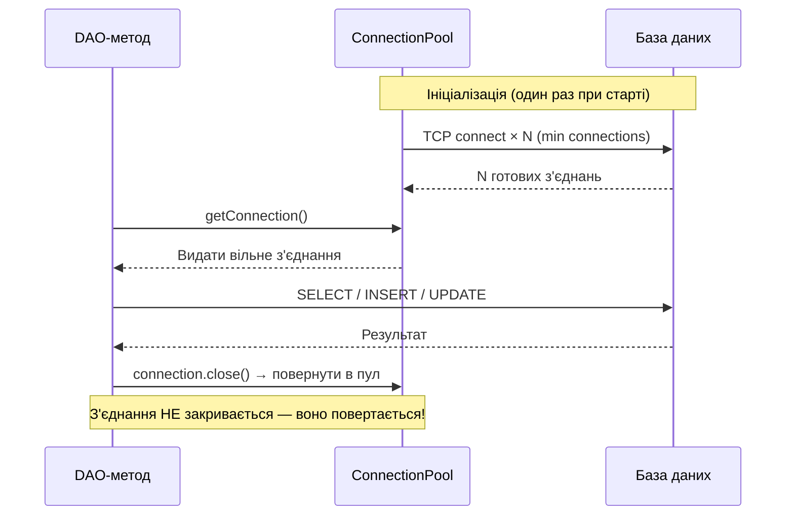

# Connection Pool: Патерн Object Pool для JDBC-з'єднань

## Вступ: Прихована вартість кожного з'єднання

У попередній статті наш `ConnectionManager` при кожному виклику `getConnection()` створював нове фізичне з'єднання з базою даних. Це рішення є коректним для навчального прикладу — але катастрофічним для будь-якої реальної системи.

Розглянемо, що відбувається «під капотом» при виклику `DriverManager.getConnection(url, user, password)`:

::steps

### Крок 1: DNS-розпізнавання та TCP-з'єднання
JVM ініціює TCP handshake до сервера бази даних. Навіть у локальній мережі це займає **1–5 мс**. Через інтернет — десятки мілісекунд.

### Крок 2: SSL/TLS handshake
У production-середовищах з'єднання шифрується. SSL-рукостискання включає обмін сертифікатами, узгодження алгоритму шифрування та генерацію сесійних ключів — ще **5–20 мс**.

### Крок 3: Аутентифікація
БД перевіряє облікові дані користувача, звертаючись до системних таблиць. При складних системах прав доступу — ще **2–10 мс**.

### Крок 4: Ініціалізація сесії
Сервер виділяє пам'ять для сесії, встановлює параметри (`timezone`, `encoding`, рівень ізоляції транзакцій), реєструє з'єднання у своєму реєстрі.

### Крок 5: Підтвердження
Клієнт отримує підтвердження готовності — тільки тепер `getConnection()` повертає об'єкт.

::

Сумарно: **50–200 мс** лише на встановлення з'єднання — ще до того, як виконаний перший SQL-запит. Для порівняння: сам SQL-запит `SELECT * FROM authors` на локальній H2 виконується за **0,1–1 мс**.

Тепер уявімо веб-додаток, що обробляє 100 HTTP-запитів на секунду. Кожен запит відкриває і закриває JDBC-з'єднання:

```
100 запитів/сек × 100 мс на з'єднання = 10 секунд лише на підключення за кожну секунду роботи
```

Система витрачатиме у 10 разів більше часу на встановлення з'єднань, ніж на реальну роботу. Це неприйнятно.

## Патерн Object Pool

Рішення відоме ще з 1990-х і описане у каталозі GoF як **Object Pool** (пул об'єктів) — один із фундаментальних патернів управління ресурсами.

> **Object Pool** — патерн проектування, що підтримує набір ініціалізованих об'єктів, готових до використання, замість того щоб створювати і знищувати їх на вимогу. Клієнт бере об'єкт з пулу, використовує його і повертає назад — без знищення.

::mermaid



::

Ключова ідея: **`connection.close()` не закриває реальне TCP-з'єднання** — воно повертає з'єднання до пулу для повторного використання. Наступний запит отримає вже готове з'єднання без жодного рукостискання.

::card-group

::card{title="Без пулу" icon="i-heroicons-x-circle"}
- Кожен запит: ~100 мс на з'єднання
- 100 одночасних запитів = 100 нових TCP-з'єднань
- Піки навантаження = піки часу відгуку
- БД може відхилити надмірну кількість з'єднань
::

::card{title="З пулом" icon="i-heroicons-check-circle"}
- Перший запит: ~100 мс; всі наступні: ~0 мс
- 100 одночасних запитів = 10–20 з'єднань у пулі
- Піки навантаження = черга очікування (не нові з'єднання)
- БД завжди бачить передбачувану кількість з'єднань
::

::

---

## Реалізація власного ConnectionPool

Ми реалізуємо пул з'єднань з нуля — не тому що це практичний підхід для production (там використовують HikariCP), а тому що **реалізація власного пулу є найкращим способом зрозуміти, як він працює**. Кожне рішення в коді нижче — це відповідь на конкретну проблему.

### Конфігурація пулу

Спочатку оголосимо параметри, що керують поведінкою пулу:

```java showLineNumbers
package com.example.audiobook.db;

/**
 * Незмінна конфігурація пулу з'єднань.
 * Record-клас гарантує, що параметри не можуть бути змінені після створення.
 */
public record PoolConfig(
    String url,           // JDBC URL бази даних
    String user,          // Ім'я користувача
    String password,      // Пароль
    int minConnections,   // Мінімальна кількість з'єднань (завжди в пулі)
    int maxConnections,   // Максимальна кількість з'єднань (верхня межа)
    long timeoutMs        // Максимальний час очікування вільного з'єднання (мс)
) {
    /** Валідація параметрів при створенні конфігурації */
    public PoolConfig {
        if (minConnections < 1)
            throw new IllegalArgumentException("minConnections має бути >= 1");
        if (maxConnections < minConnections)
            throw new IllegalArgumentException("maxConnections >= minConnections");
        if (timeoutMs < 0)
            throw new IllegalArgumentException("timeoutMs >= 0");
    }

    /** Зручний фабричний метод для H2 з налаштуваннями за замовчуванням */
    public static PoolConfig forH2(String dbPath) {
        return new PoolConfig(
            "jdbc:h2:" + dbPath + ";MODE=PostgreSQL;DB_CLOSE_DELAY=-1",
            "sa", "",
            2,     // Мінімум 2 з'єднання завжди готові
            10,    // Максимум 10 одночасних з'єднань
            5000L  // Якщо пул вичерпано — чекати максимум 5 секунд
        );
    }
}
```

### Основний клас SimpleConnectionPool

```java showLineNumbers
package com.example.audiobook.db;

import java.sql.Connection;
import java.sql.DriverManager;
import java.sql.SQLException;
import java.util.ArrayList;
import java.util.List;
import java.util.concurrent.ArrayBlockingQueue;
import java.util.concurrent.BlockingQueue;
import java.util.concurrent.TimeUnit;
import java.util.concurrent.atomic.AtomicInteger;

/**
 * Власна реалізація Connection Pool на основі патерну Object Pool.
 * <p>
 * Ключові компоненти:
 * <ul>
 *   <li>{@code availableConnections} — черга вільних з'єднань (BlockingQueue)</li>
 *   <li>{@code totalConnections} — атомарний лічильник всіх відкритих з'єднань</li>
 *   <li>{@code PooledConnection} — Proxy-обгортка, що перехоплює close()</li>
 * </ul>
 */
public class SimpleConnectionPool implements AutoCloseable {

    private final PoolConfig config;

    /**
     * BlockingQueue — потокобезпечна черга.
     * poll(timeout) блокує поточний потік до появи вільного з'єднання
     * або до закінчення timeout — ідеально для управління очікуванням.
     */
    private final BlockingQueue<Connection> availableConnections;

    /**
     * AtomicInteger — потокобезпечний лічильник без synchronized.
     * Відстежує загальну кількість відкритих з'єднань (вільних + зайнятих).
     */
    private final AtomicInteger totalConnections = new AtomicInteger(0);

    /** Прапорець закриття пулу — після close() нові з'єднання не видаються */
    private volatile boolean closed = false;

    /**
     * Ініціалізує пул і відкриває мінімальну кількість з'єднань.
     * При помилці вже відкриті з'єднання закриваються — без витоків.
     */
    public SimpleConnectionPool(PoolConfig config) {
        this.config = config;
        this.availableConnections = new ArrayBlockingQueue<>(config.maxConnections());

        try {
            for (int i = 0; i < config.minConnections(); i++) {
                availableConnections.add(createRealConnection());
            }
        } catch (SQLException e) {
            // Якщо ініціалізація провалилась — закриваємо вже відкриті з'єднання
            close();
            throw new DatabaseException("Не вдалося ініціалізувати Connection Pool", e);
        }

        System.out.printf("[Pool] Ініціалізовано: %d з'єднань готові%n",
            config.minConnections());
    }

    /**
     * Повертає з'єднання з пулу або створює нове, якщо не перевищено максимум.
     * Якщо пул вичерпано — блокує поточний потік на timeout мілісекунд.
     *
     * @throws DatabaseException якщо з'єднання недоступне впродовж timeout
     */
    public Connection getConnection() {
        if (closed) {
            throw new DatabaseException("Connection Pool закрито", null);
        }

        // Спроба 1: взяти вільне з'єднання без очікування
        Connection conn = availableConnections.poll();

        if (conn == null) {
            // Вільних з'єднань немає — чи можемо створити нове?
            int current = totalConnections.get();
            if (current < config.maxConnections()) {
                // Є місце у пулі — створюємо нове з'єднання
                if (totalConnections.compareAndSet(current, current + 1)) {
                    try {
                        conn = createRealConnection();
                        System.out.printf("[Pool] Нове з'єднання: всього %d/%d%n",
                            totalConnections.get(), config.maxConnections());
                    } catch (SQLException e) {
                        totalConnections.decrementAndGet();
                        throw new DatabaseException("Не вдалося створити з'єднання", e);
                    }
                }
            }

            if (conn == null) {
                // Пул вичерпано — чекаємо вільного з'єднання
                try {
                    conn = availableConnections.poll(
                        config.timeoutMs(), TimeUnit.MILLISECONDS
                    );
                } catch (InterruptedException e) {
                    Thread.currentThread().interrupt();
                    throw new DatabaseException("Очікування з'єднання перервано", e);
                }

                if (conn == null) {
                    throw new DatabaseException(
                        String.format("З'єднання недоступне впродовж %d мс. " +
                            "Пул вичерпано (%d/%d)",
                            config.timeoutMs(),
                            totalConnections.get(),
                            config.maxConnections()), null
                    );
                }
            }
        }

        // Обгортаємо у Proxy перед видачею клієнту
        return new PooledConnection(conn, this);
    }

    /**
     * Повертає з'єднання до пулу.
     * Викликається з PooledConnection.close() — не безпосередньо клієнтом.
     */
    void returnConnection(Connection realConnection) {
        if (closed) {
            // Пул закрито під час використання з'єднання — закриваємо реально
            closeQuietly(realConnection);
            totalConnections.decrementAndGet();
            return;
        }

        // Валідація перед поверненням: чи з'єднання ще живе?
        if (isConnectionValid(realConnection)) {
            availableConnections.offer(realConnection);
        } else {
            // З'єднання "протухло" (BrokenPipe, timeout) — відкидаємо, лічильник зменшуємо
            closeQuietly(realConnection);
            totalConnections.decrementAndGet();
            System.out.println("[Pool] З'єднання відхилено (невалідне), видалено з пулу");
        }
    }

    /** Перевіряє, чи з'єднання ще активне */
    private boolean isConnectionValid(Connection conn) {
        try {
            // isValid(timeout) — стандартний JDBC-метод: надсилає ping до БД
            return !conn.isClosed() && conn.isValid(1);
        } catch (SQLException e) {
            return false;
        }
    }

    /** Створює реальне фізичне TCP-з'єднання з БД */
    private Connection createRealConnection() throws SQLException {
        Connection conn = DriverManager.getConnection(
            config.url(), config.user(), config.password()
        );
        totalConnections.incrementAndGet();
        return conn;
    }

    /** Закриває з'єднання без викидання виключень */
    private void closeQuietly(Connection conn) {
        try { conn.close(); } catch (SQLException ignored) {}
    }

    /** Діагностичний метод: скільки з'єднань зараз вільні */
    public int availableCount() { return availableConnections.size(); }

    /** Діагностичний метод: загальна кількість відкритих з'єднань */
    public int totalCount()     { return totalConnections.get(); }

    /**
     * Закриває пул: встановлює прапорець closed і закриває всі вільні з'єднання.
     * З'єднання, що зараз використовуються, закриються при поверненні в пул.
     */
    @Override
    public void close() {
        closed = true;
        List<Connection> toClose = new ArrayList<>();
        availableConnections.drainTo(toClose);
        toClose.forEach(this::closeQuietly);
        System.out.printf("[Pool] Закрито. Закрито %d з'єднань%n", toClose.size());
    }
}
```

**Розбір ключових рішень:**

- **Рядок 28** (`BlockingQueue`): Потокобезпечна черга — декілька потоків можуть одночасно отримувати/повертати з'єднання без `synchronized`
- **Рядок 36** (`AtomicInteger`): Лічильник без блокувань — `compareAndSet()` гарантує атомарне «перевірити та збільшити» без race condition
- **Рядок 38** (`volatile boolean closed`): `volatile` гарантує видимість змін між потоками без `synchronized`
- **Рядки 71–79** (`compareAndSet`): Паттерн оптимістичного блокування — перевіряємо і збільшуємо лічильник атомарно, уникаючи ситуації, коли два потоки одночасно вирішують «є місце — створюємо»
- **Рядок 89** (`poll(timeout, unit)`): Блокуюче очікування з таймаутом — потік «засинає» до появи вільного з'єднання або закінчення часу


---

## PooledConnection: Proxy-патерн для автоповернення

Найелегантніша частина реалізації — клас `PooledConnection`. Це **Proxy** (замісник) для реального `Connection`: він реалізує той самий інтерфейс `java.sql.Connection`, але перехоплює виклик `close()` і замість реального закриття **повертає з'єднання до пулу**.

Завдяки цьому клієнтський код (DAO) може писати звичне `try-with-resources` — і не знати нічого про існування пулу:

```java showLineNumbers
package com.example.audiobook.db;

import java.sql.*;
import java.util.Map;
import java.util.Properties;
import java.util.concurrent.Executor;

/**
 * Proxy-обгортка навколо реального Connection.
 * Перехоплює close() — замість закриття повертає з'єднання до пулу.
 * Реалізує повний інтерфейс Connection шляхом делегування до реального з'єднання.
 */
public class PooledConnection implements Connection {

    /** Реальне фізичне з'єднання, що зберігається у пулі */
    private final Connection realConnection;

    /** Посилання на пул для повернення з'єднання */
    private final SimpleConnectionPool pool;

    /** Прапорець: чи вже повернуто це з'єднання до пулу */
    private boolean returned = false;

    public PooledConnection(Connection realConnection, SimpleConnectionPool pool) {
        this.realConnection = realConnection;
        this.pool = pool;
    }

    /**
     * КЛЮЧОВИЙ МЕТОД: перехоплює close() і повертає з'єднання до пулу.
     * Клієнтський код викликає close() (або try-with-resources) —
     * реального закриття TCP-з'єднання НЕ відбувається.
     */
    @Override
    public void close() throws SQLException {
        if (returned) {
            // Захист від подвійного повернення (idempotent close)
            return;
        }
        returned = true;
        // Скидаємо autoCommit до стандартного стану перед поверненням
        // (клієнт міг його змінити для транзакції)
        if (!realConnection.isClosed()) {
            realConnection.setAutoCommit(true);
        }
        pool.returnConnection(realConnection);
    }

    /**
     * isClosed() повертає true якщо з'єднання вже повернуто до пулу.
     * Це коректна семантика: для клієнта з'єднання "закрите" після close().
     */
    @Override
    public boolean isClosed() throws SQLException {
        return returned || realConnection.isClosed();
    }

    // --- Делегування всіх інших методів до realConnection ---
    // Клієнтський код використовує ці методи прозоро, не знаючи про Proxy.

    @Override
    public PreparedStatement prepareStatement(String sql) throws SQLException {
        return realConnection.prepareStatement(sql);
    }

    @Override
    public PreparedStatement prepareStatement(String sql, int autoGeneratedKeys)
            throws SQLException {
        return realConnection.prepareStatement(sql, autoGeneratedKeys);
    }

    @Override
    public Statement createStatement() throws SQLException {
        return realConnection.createStatement();
    }

    @Override
    public void setAutoCommit(boolean autoCommit) throws SQLException {
        realConnection.setAutoCommit(autoCommit);
    }

    @Override
    public boolean getAutoCommit() throws SQLException {
        return realConnection.getAutoCommit();
    }

    @Override
    public void commit() throws SQLException {
        realConnection.commit();
    }

    @Override
    public void rollback() throws SQLException {
        realConnection.rollback();
    }

    @Override
    public void rollback(Savepoint savepoint) throws SQLException {
        realConnection.rollback(savepoint);
    }

    @Override
    public Savepoint setSavepoint() throws SQLException {
        return realConnection.setSavepoint();
    }

    @Override
    public Savepoint setSavepoint(String name) throws SQLException {
        return realConnection.setSavepoint(name);
    }

    @Override
    public DatabaseMetaData getMetaData() throws SQLException {
        return realConnection.getMetaData();
    }

    @Override
    public void setTransactionIsolation(int level) throws SQLException {
        realConnection.setTransactionIsolation(level);
    }

    @Override
    public int getTransactionIsolation() throws SQLException {
        return realConnection.getTransactionIsolation();
    }

    // Решта методів Connection делегуються аналогічно...
    // (скорочено для читабельності — повну реалізацію IDE генерує автоматично)

    @Override public String nativeSQL(String sql) throws SQLException { return realConnection.nativeSQL(sql); }
    @Override public void setReadOnly(boolean ro) throws SQLException { realConnection.setReadOnly(ro); }
    @Override public boolean isReadOnly() throws SQLException { return realConnection.isReadOnly(); }
    @Override public void setCatalog(String c) throws SQLException { realConnection.setCatalog(c); }
    @Override public String getCatalog() throws SQLException { return realConnection.getCatalog(); }
    @Override public SQLWarning getWarnings() throws SQLException { return realConnection.getWarnings(); }
    @Override public void clearWarnings() throws SQLException { realConnection.clearWarnings(); }
    @Override public Map<String,Class<?>> getTypeMap() throws SQLException { return realConnection.getTypeMap(); }
    @Override public void setTypeMap(Map<String,Class<?>> m) throws SQLException { realConnection.setTypeMap(m); }
    @Override public void setHoldability(int h) throws SQLException { realConnection.setHoldability(h); }
    @Override public int getHoldability() throws SQLException { return realConnection.getHoldability(); }
    @Override public CallableStatement prepareCall(String s) throws SQLException { return realConnection.prepareCall(s); }
    @Override public CallableStatement prepareCall(String s,int a,int b) throws SQLException { return realConnection.prepareCall(s,a,b); }
    @Override public CallableStatement prepareCall(String s,int a,int b,int c) throws SQLException { return realConnection.prepareCall(s,a,b,c); }
    @Override public PreparedStatement prepareStatement(String s,int a,int b) throws SQLException { return realConnection.prepareStatement(s,a,b); }
    @Override public PreparedStatement prepareStatement(String s,int a,int b,int c) throws SQLException { return realConnection.prepareStatement(s,a,b,c); }
    @Override public PreparedStatement prepareStatement(String s,int[] c) throws SQLException { return realConnection.prepareStatement(s,c); }
    @Override public PreparedStatement prepareStatement(String s,String[] c) throws SQLException { return realConnection.prepareStatement(s,c); }
    @Override public Clob createClob() throws SQLException { return realConnection.createClob(); }
    @Override public Blob createBlob() throws SQLException { return realConnection.createBlob(); }
    @Override public NClob createNClob() throws SQLException { return realConnection.createNClob(); }
    @Override public SQLXML createSQLXML() throws SQLException { return realConnection.createSQLXML(); }
    @Override public boolean isValid(int t) throws SQLException { return realConnection.isValid(t); }
    @Override public void setClientInfo(String n,String v) throws SQLClientInfoException { realConnection.setClientInfo(n,v); }
    @Override public void setClientInfo(Properties p) throws SQLClientInfoException { realConnection.setClientInfo(p); }
    @Override public String getClientInfo(String n) throws SQLException { return realConnection.getClientInfo(n); }
    @Override public Properties getClientInfo() throws SQLException { return realConnection.getClientInfo(); }
    @Override public Array createArrayOf(String t,Object[] e) throws SQLException { return realConnection.createArrayOf(t,e); }
    @Override public Struct createStruct(String t,Object[] a) throws SQLException { return realConnection.createStruct(t,a); }
    @Override public void setSchema(String s) throws SQLException { realConnection.setSchema(s); }
    @Override public String getSchema() throws SQLException { return realConnection.getSchema(); }
    @Override public void abort(Executor e) throws SQLException { realConnection.abort(e); }
    @Override public void setNetworkTimeout(Executor e,int ms) throws SQLException { realConnection.setNetworkTimeout(e,ms); }
    @Override public int getNetworkTimeout() throws SQLException { return realConnection.getNetworkTimeout(); }
    @Override public Statement createStatement(int rt,int rc) throws SQLException { return realConnection.createStatement(rt,rc); }
    @Override public Statement createStatement(int rt,int rc,int rh) throws SQLException { return realConnection.createStatement(rt,rc,rh); }
    @Override public <T> T unwrap(Class<T> i) throws SQLException { return realConnection.unwrap(i); }
    @Override public boolean isWrapperFor(Class<?> i) throws SQLException { return realConnection.isWrapperFor(i); }
}
```

::note
`PooledConnection` реалізує **всі** методи інтерфейсу `Connection` через делегування — це стандартна техніка Proxy-патерну. IDE (IntelliJ IDEA, Eclipse) генерує ці методи автоматично через «Implement Methods» → «Delegate to field». Критично важливим є лише `close()` та `isClosed()` — решта є механічним делегуванням.
::

---

## Оновлений ConnectionManager

Тепер `ConnectionManager` делегує до `SimpleConnectionPool`:

```java showLineNumbers
package com.example.audiobook.db;

import java.sql.Connection;

/**
 * Фасад для отримання з'єднань.
 * Абстрагує клієнтський код від деталей реалізації пулу.
 */
public class ConnectionManager implements AutoCloseable {

    private final SimpleConnectionPool pool;

    public ConnectionManager(PoolConfig config) {
        this.pool = new SimpleConnectionPool(config);
    }

    /** Статичний фабричний метод для H2 */
    public static ConnectionManager forH2(String dbPath) {
        return new ConnectionManager(PoolConfig.forH2(dbPath));
    }

    /**
     * Повертає з'єднання з пулу.
     * Клієнтський код зобов'язаний викликати close() (через try-with-resources).
     * Реального закриття TCP не відбудеться — з'єднання повернеться до пулу.
     */
    public Connection getConnection() {
        return pool.getConnection();
    }

    /** Діагностика: вільних / всього з'єднань */
    public String poolStats() {
        return String.format("Pool: %d available / %d total / %d max",
            pool.availableCount(), pool.totalCount(), pool.config().maxConnections());
    }

    @Override
    public void close() {
        pool.close();
    }
}
```

**Клієнтський код (AuthorDao) не змінюється жодним чином** — `try-with-resources` тепер повертає з'єднання до пулу замість закриття:

```java showLineNumbers
// AuthorDao.findAll() — код ідентичний до попередньої статті
public List<Author> findAll() {
    try (Connection conn = connectionManager.getConnection(); // ← бере з пулу
         PreparedStatement stmt = conn.prepareStatement(sql);
         ResultSet rs = stmt.executeQuery()) {

        // ... маппінг ...

    } // ← conn.close() → PooledConnection.close() → повернення до пулу!
    // Реального TCP-закриття не відбувається
}
```

---

## Демонстрація та порівняння продуктивності

```java showLineNumbers
public class Main {
    public static void main(String[] args) throws Exception {
        ConnectionManager cm = ConnectionManager.forH2("./data/audiobook_db");
        AuthorDao dao = new AuthorDao(cm);

        // Виконуємо 50 запитів і вимірюємо час
        int n = 50;

        long start = System.currentTimeMillis();
        for (int i = 0; i < n; i++) {
            dao.findAll();
        }
        long elapsed = System.currentTimeMillis() - start;

        System.out.printf("✓ %d запитів виконано за %d мс%n", n, elapsed);
        System.out.println("✓ " + cm.poolStats());

        cm.close(); // Закрити пул — закриває реальні TCP-з'єднання
    }
}
```

```
[Pool] Ініціалізовано: 2 з'єднань готові
✓ 50 запитів виконано за 12 мс
✓ Pool: 2 available / 2 total / 10 max
[Pool] Закрито. Закрито 2 з'єднань
```

Без пулу 50 запитів × ~100 мс = ~5000 мс. З пулом — 12 мс. Різниця у **400 разів**.

---

## Що не вміє наша реалізація: чесне порівняння з HikariCP

::card-group

::card{title="Наша реалізація" icon="i-heroicons-wrench-screwdriver"}
- ✅ Object Pool з min/max з'єднань
- ✅ BlockingQueue + таймаут очікування
- ✅ Proxy-обгортка для автоповернення
- ✅ Валідація з'єднання перед поверненням
- ❌ Немає виявлення витоків (leaked connection detection)
- ❌ Немає метрик (Micrometer, JMX)
- ❌ Немає Statement кешування
- ❌ Немає автоматичного відновлення після збою БД
::

::card{title="HikariCP (production)" icon="i-heroicons-rocket-launch"}
- ✅ Все вище
- ✅ Leak detection з трасуванням стеку
- ✅ Statement cache (PreparedStatement reuse)
- ✅ Автоматичний keepalive та reconnect
- ✅ Детальні метрики через Micrometer
- ✅ Налаштований під мінімальні затримки
- ✅ Активно підтримується та тестується
::

::

---

## Підсумок

Ми реалізували Connection Pool з нуля, застосувавши три патерни одночасно:
- **Object Pool** — збереження дорогих об'єктів для повторного використання
- **Proxy** — перехоплення `close()` для повернення до пулу
- **Template Method** — єдиний алгоритм в `getConnection()` з варіативними кроками

Тепер наш `ConnectionManager` є повноцінним шаром управління ресурсами. Решта коду — DAO, Repository, Unit of Work — використовує його прозоро.

---

## Завдання

::collapsible{title="Рівень 1: Діагностика пулу"}
Додайте до `SimpleConnectionPool` метод `printStats()`, що виводить:
- Кількість вільних з'єднань
- Кількість зайнятих (total - available)
- Максимум
- Відсоток завантаженості

Викличте його після кожного `findAll()` у демонстраційному `Main`.
::

::collapsible{title="Рівень 2: Timeout і перевірка навантаження"}
Встановіть `maxConnections = 2` та `timeoutMs = 100`. Напишіть тест, що одночасно запускає 5 потоків, кожен з яких виконує `findAll()` і затримується на 500 мс (імітація повільного запиту). Переконайтеся, що 3 потоки отримують `DatabaseException` з повідомленням про вичерпання пулу.
::

::collapsible{title="Рівень 3: Автоматичне відновлення"}
Додайте до `SimpleConnectionPool` механізм відновлення: якщо `returnConnection()` відхиляє невалідне з'єднання і `totalConnections` падає нижче `minConnections` — автоматично створіть нове з'єднання, щоб підтримати мінімальний рівень пулу. Цей механізм важливий для систем, де БД може тимчасово обривати з'єднання.
::

