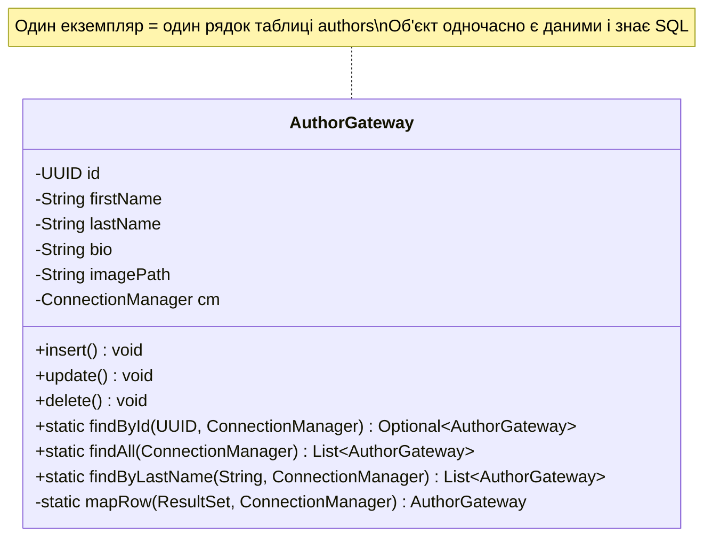
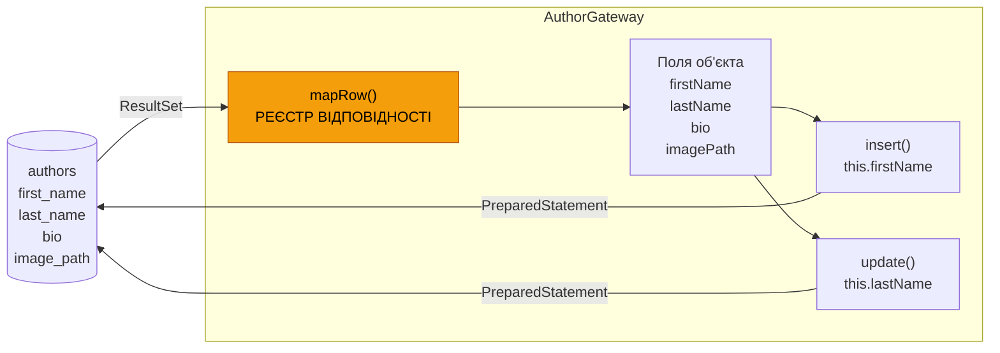
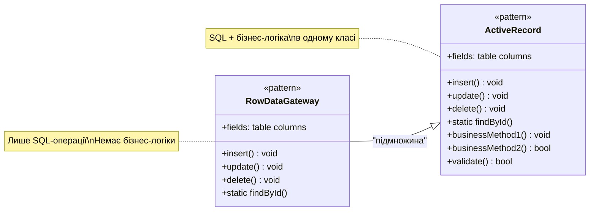

# Row Data Gateway: Об'єкт як обгортка рядка таблиці

## Вступ: Хаос у наївному DAO

У статті 10 ми написали наш перший `AuthorDao` і успішно усунули чотири критичні проблеми наївного підходу: SQL-ін'єкції, витоки ресурсів, дублювання рядка підключення та мовчазні збої. Код став коректним і безпечним — але він залишив одну архітектурну проблему нерозв'язаною.

Погляньмо на метод `save()` виправленого `AuthorDao`:

```java
public void save(Author author) {
    String sql = "INSERT INTO authors (id, first_name, last_name, bio, image_path) VALUES (?, ?, ?, ?, ?)";
    try (Connection conn = connectionManager.getConnection();
         PreparedStatement stmt = conn.prepareStatement(sql)) {
        stmt.setObject(1, author.getId());
        stmt.setString(2, author.getFirstName());
        stmt.setString(3, author.getLastName());
        stmt.setString(4, author.getBio());
        stmt.setString(5, author.getImagePath());
        stmt.executeUpdate();
    } catch (SQLException e) {
        throw new DatabaseException("Помилка збереження автора", e);
    }
}
```

А тепер на `update()`:

```java
public void update(Author author) {
    String sql = "UPDATE authors SET first_name=?, last_name=?, bio=?, image_path=? WHERE id=?";
    try (Connection conn = connectionManager.getConnection();
         PreparedStatement stmt = conn.prepareStatement(sql)) {
        stmt.setString(1, author.getFirstName());
        stmt.setString(2, author.getLastName());
        stmt.setString(3, author.getBio());
        stmt.setString(4, author.getImagePath());
        stmt.setObject(5, author.getId());
        stmt.executeUpdate();
    } catch (SQLException e) {
        throw new DatabaseException("Помилка оновлення автора", e);
    }
}
```

І на `mapRow()`:

```java
private Author mapRow(ResultSet rs) throws SQLException {
    return new Author(
        rs.getObject("id", UUID.class),
        rs.getString("first_name"),
        rs.getString("last_name"),
        rs.getString("bio"),
        rs.getString("image_path")
    );
}
```

Якщо уважно придивитися, помітна одна і та сама інформація, розпорошена у кількох методах: **перелік полів таблиці** (`id`, `first_name`, `last_name`, `bio`, `image_path`) і **відповідність між полем таблиці та геттером Java-об'єкта** виникають знову і знову — у `save()`, у `update()`, у `mapRow()`. Це дублювання схеми. Якщо у таблиці `authors` з'явиться новий стовпець `nationality`, доведеться внести зміни у трьох різних місцях одного класу.

Саме для усунення цього дублювання у 2002 році Мартін Фаулер описав перший із своїх патернів доступу до даних — **Row Data Gateway** (шлюз рядка даних).

::note
Row Data Gateway — перший у серії патернів Фаулера, що стоять між доменним кодом і базою даних. Ланцюжок еволюції у нашому модулі: **Row Data Gateway** → Table Data Gateway → Repository + Data Mapper. Кожен наступний патерн усуває конкретний недолік попереднього, але додає власну складність.
::

---

## Концепція Row Data Gateway

### Визначення за Мартіном Фаулером

У книзі «Patterns of Enterprise Application Architecture» (2002) Мартін Фаулер визначає Row Data Gateway так:

> *An object that acts as a Gateway to a single record in a data source. There is one instance per row.*

Переклад: **об'єкт, що виступає шлюзом до одного запису у джерелі даних. Один екземпляр відповідає одному рядку.**

Ключова ідея проста і елегантна: **об'єкт-шлюз сам є даними рядка**. Замість окремого DAO, що приймає доменний об'єкт і перекладає його у SQL, ми маємо один клас, що одночасно:
- містить поля, що відповідають стовпцям таблиці
- знає, як зберегти ці поля у базу (`insert()`, `update()`, `delete()`)
- знає, як завантажити себе з бази (статичні finder-методи)

::mermaid



::

Зверніть увагу: у `AuthorGateway` немає окремого `Author`-поля. Сам `AuthorGateway` **є** тим, що в наївному підході ми називали «автором» — але з вбудованою здатністю зберігати себе у базу.

### Порівняння з наївним DAO

Щоб відчути різницю, порівняємо два підходи для типового сценарію «оновити ім'я автора»:

::tabs

::tabs-item{label="Наївний DAO"}

```java
// Клієнт: знає і про Author, і про AuthorDao
Author author = authorDao.findById(id).orElseThrow();
author.setFirstName("Тарас"); // зміна доменного об'єкта
authorDao.update(author);     // окремий DAO виконує SQL

// Два об'єкти: Author (дані) + AuthorDao (SQL)
// SQL розпорошений між методами DAO
```

::

::tabs-item{label="Row Data Gateway"}

```java
// Клієнт: знає лише про AuthorGateway
AuthorGateway gateway = AuthorGateway.findById(id, cm).orElseThrow();
gateway.setFirstName("Тарас"); // зміна поля у шлюзі
gateway.update();              // шлюз сам знає SQL

// Один об'єкт: AuthorGateway (і дані, і SQL)
// SQL зосереджений у методах самого об'єкта
```

::

::

Якщо у наївному DAO SQL виконує зовнішній клас (`AuthorDao`), то у Row Data Gateway SQL виконує сам об'єкт. Це — принципова відмінність у відповідальності.

### Де маппінг? Тепер він в одному місці

Головна перевага Row Data Gateway над наївним DAO — **маппінг між стовпцями таблиці та полями об'єкта зосереджений в одному місці**. Як саме це досягається?

Статичний метод `mapRow(ResultSet rs, ConnectionManager cm)` є єдиним місцем, де ми «знаємо», що стовпець `first_name` відповідає полю `firstName`. Методи `insert()` та `update()` безпосередньо звертаються до полів об'єкта (`this.firstName`, `this.id`) — вони не дублюють маппінг, а просто використовують наявні поля.

::mermaid



::

`mapRow()` — це **єдине місце** де стовпці `first_name`, `last_name` тощо згадуються явно. Уся решта коду звертається до полів об'єкта. Зміна назви стовпця або додавання нового поля вимагає правки лише у `mapRow()`, `insert()` та `update()` — і всі вони знаходяться в одному класі.

---

## Реалізація AuthorGateway

Перейдемо до реалізації. `AuthorGateway` — це клас, що одночасно є зберігачем стану одного рядка таблиці `authors` і знає, як цей рядок зчитати, записати та видалити.

```java showLineNumbers
package com.example.audiobook.gateway;

import com.example.audiobook.db.ConnectionManager;
import com.example.audiobook.db.DatabaseException;

import java.sql.*;
import java.util.ArrayList;
import java.util.List;
import java.util.Optional;
import java.util.UUID;

/**
 * Row Data Gateway для таблиці authors.
 * <p>
 * Один екземпляр цього класу відповідає одному рядку таблиці authors.
 * Клас містить:
 * <ul>
 *   <li>Поля, що відповідають стовпцям таблиці (стан рядка)</li>
 *   <li>Методи збереження: {@code insert()}, {@code update()}, {@code delete()}</li>
 *   <li>Статичні finder-методи для пошуку рядків</li>
 * </ul>
 * <p>
 * Зверніть увагу: це НЕ доменна модель. Клас не містить бізнес-логіки.
 * Для бізнес-правил доменний шар повинен або використовувати Gateway напряму,
 * або конвертувати його в окремий доменний об'єкт.
 */
public class AuthorGateway {

    // --- Стан: поля, що відповідають стовпцям таблиці authors ---

    private UUID id;
    private String firstName;
    private String lastName;
    private String bio;
    private String imagePath;

    /**
     * ConnectionManager зберігається в кожному екземплярі —
     * він потрібен для виконання SQL у методах insert/update/delete.
     * Це принципова відмінність від наївного DAO, де CM був полем DAO.
     */
    private final ConnectionManager connectionManager;

    // --- SQL-константи для операцій із таблицею authors ---

    private static final String SQL_FIND_BY_ID = """
        SELECT id, first_name, last_name, bio, image_path
        FROM authors WHERE id = ?
        """;

    private static final String SQL_FIND_ALL = """
        SELECT id, first_name, last_name, bio, image_path
        FROM authors ORDER BY last_name, first_name
        """;

    private static final String SQL_FIND_BY_LAST_NAME = """
        SELECT id, first_name, last_name, bio, image_path
        FROM authors WHERE LOWER(last_name) LIKE LOWER(?)
        ORDER BY last_name, first_name
        """;

    private static final String SQL_INSERT = """
        INSERT INTO authors (id, first_name, last_name, bio, image_path)
        VALUES (?, ?, ?, ?, ?)
        """;

    private static final String SQL_UPDATE = """
        UPDATE authors
        SET first_name = ?, last_name = ?, bio = ?, image_path = ?
        WHERE id = ?
        """;

    private static final String SQL_DELETE = "DELETE FROM authors WHERE id = ?";

    // --- Конструктори ---

    /**
     * Конструктор для створення НОВОГО рядка.
     * ID генерується автоматично.
     * Після виклику {@code insert()} цей рядок з'явиться у БД.
     */
    public AuthorGateway(String firstName, String lastName,
                         ConnectionManager connectionManager) {
        this.id = UUID.randomUUID();
        this.firstName = firstName;
        this.lastName = lastName;
        this.connectionManager = connectionManager;
    }

    /**
     * Приватний конструктор для ВІДНОВЛЕННЯ рядка зі сховища.
     * Використовується виключно статичним методом {@code mapRow()}.
     * Зовнішній код не повинен створювати Gateway із заздалегідь відомим id.
     */
    private AuthorGateway(UUID id, String firstName, String lastName,
                          String bio, String imagePath,
                          ConnectionManager connectionManager) {
        this.id = id;
        this.firstName = firstName;
        this.lastName = lastName;
        this.bio = bio;
        this.imagePath = imagePath;
        this.connectionManager = connectionManager;
    }

    // --- Операції збереження (instance methods) ---

    /**
     * Вставляє поточний стан об'єкта у таблицю authors як новий рядок.
     * Якщо рядок з таким {@code id} вже існує — виключення PK violation.
     */
    public void insert() {
        try (Connection conn = connectionManager.getConnection();
             PreparedStatement stmt = conn.prepareStatement(SQL_INSERT)) {

            stmt.setObject(1, this.id);
            stmt.setString(2, this.firstName); // this — поля самого об'єкта
            stmt.setString(3, this.lastName);
            stmt.setString(4, this.bio);       // null → SQL NULL
            stmt.setString(5, this.imagePath); // null → SQL NULL

            int rows = stmt.executeUpdate();
            if (rows != 1) {
                throw new DatabaseException(
                    "Очікувався 1 вставлений рядок, отримано: " + rows, null);
            }

        } catch (SQLException e) {
            throw new DatabaseException("Помилка insert() для автора id=" + id, e);
        }
    }

    /**
     * Оновлює рядок у таблиці поточними значеннями полів об'єкта.
     * {@code id} не може бути змінений — він використовується в умові WHERE.
     *
     * @throws DatabaseException якщо рядка з таким id не існує у БД
     */
    public void update() {
        try (Connection conn = connectionManager.getConnection();
             PreparedStatement stmt = conn.prepareStatement(SQL_UPDATE)) {

            stmt.setString(1, this.firstName);
            stmt.setString(2, this.lastName);
            stmt.setString(3, this.bio);
            stmt.setString(4, this.imagePath);
            stmt.setObject(5, this.id); // id у WHERE — завжди останній

            int rows = stmt.executeUpdate();
            if (rows == 0) {
                throw new DatabaseException(
                    "Автора з id=" + id + " не знайдено для оновлення", null);
            }

        } catch (SQLException e) {
            throw new DatabaseException("Помилка update() для автора id=" + id, e);
        }
    }

    /**
     * Видаляє рядок із таблиці за {@code id} поточного об'єкта.
     *
     * @return {@code true} якщо рядок існував і був видалений
     */
    public boolean delete() {
        try (Connection conn = connectionManager.getConnection();
             PreparedStatement stmt = conn.prepareStatement(SQL_DELETE)) {

            stmt.setObject(1, this.id);
            return stmt.executeUpdate() > 0;

        } catch (SQLException e) {
            throw new DatabaseException("Помилка delete() для автора id=" + id, e);
        }
    }

    // --- Статичні finder-методи (фабрики) ---

    /**
     * Знаходить рядок у таблиці authors за первинним ключем.
     * Повертає {@code Optional.empty()} якщо рядка не існує.
     *
     * @param id               UUID первинного ключа
     * @param connectionManager менеджер з'єднань
     */
    public static Optional<AuthorGateway> findById(UUID id,
                                                    ConnectionManager connectionManager) {
        try (Connection conn = connectionManager.getConnection();
             PreparedStatement stmt = conn.prepareStatement(SQL_FIND_BY_ID)) {

            stmt.setObject(1, id);
            try (ResultSet rs = stmt.executeQuery()) {
                return rs.next()
                    ? Optional.of(mapRow(rs, connectionManager))
                    : Optional.empty();
            }

        } catch (SQLException e) {
            throw new DatabaseException("Помилка findById() для автора id=" + id, e);
        }
    }

    /**
     * Повертає всі рядки таблиці authors як список Gateway-об'єктів.
     *
     * @param connectionManager менеджер з'єднань
     */
    public static List<AuthorGateway> findAll(ConnectionManager connectionManager) {
        List<AuthorGateway> list = new ArrayList<>();

        try (Connection conn = connectionManager.getConnection();
             PreparedStatement stmt = conn.prepareStatement(SQL_FIND_ALL);
             ResultSet rs = stmt.executeQuery()) {

            while (rs.next()) {
                list.add(mapRow(rs, connectionManager));
            }

        } catch (SQLException e) {
            throw new DatabaseException("Помилка findAll() для authors", e);
        }
        return list;
    }

    /**
     * Знаходить рядки, де прізвище містить заданий підрядок
     * (регістр-незалежний пошук).
     *
     * @param lastNamePart     підрядок прізвища
     * @param connectionManager менеджер з'єднань
     */
    public static List<AuthorGateway> findByLastName(String lastNamePart,
                                                      ConnectionManager connectionManager) {
        List<AuthorGateway> list = new ArrayList<>();

        try (Connection conn = connectionManager.getConnection();
             PreparedStatement stmt = conn.prepareStatement(SQL_FIND_BY_LAST_NAME)) {

            stmt.setString(1, "%" + lastNamePart + "%");
            try (ResultSet rs = stmt.executeQuery()) {
                while (rs.next()) {
                    list.add(mapRow(rs, connectionManager));
                }
            }

        } catch (SQLException e) {
            throw new DatabaseException(
                "Помилка findByLastName() для прізвища: " + lastNamePart, e);
        }
        return list;
    }

    // --- Приватний маппінг: ЄДИНИЙ РЕЄСТР ВІДПОВІДНОСТІ полів і стовпців ---

    /**
     * Перетворює поточний рядок {@link ResultSet} на екземпляр AuthorGateway.
     * <p>
     * Це ЄДИНЕ місце у класі, де явно згадуються назви стовпців таблиці.
     * Решта методів (insert, update) звертаються до полів через {@code this},
     * а не через назви стовпців. Завдяки цьому: зміна назви стовпця
     * вимагає правки лише тут.
     */
    private static AuthorGateway mapRow(ResultSet rs,
                                         ConnectionManager cm) throws SQLException {
        return new AuthorGateway(
            rs.getObject("id", UUID.class),
            rs.getString("first_name"),
            rs.getString("last_name"),
            rs.getString("bio"),        // null → java null
            rs.getString("image_path"), // null → java null
            cm
        );
    }

    // --- Геттери та сеттери ---

    public UUID getId()          { return id; }
    public String getFirstName() { return firstName; }
    public String getLastName()  { return lastName; }
    public String getBio()       { return bio; }
    public String getImagePath() { return imagePath; }

    /** Повертає повне ім'я у форматі «Прізвище Ім'я». */
    public String fullName() { return lastName + " " + firstName; }

    public void setFirstName(String firstName) { this.firstName = firstName; }
    public void setLastName(String lastName)   { this.lastName = lastName; }
    public void setBio(String bio)             { this.bio = bio; }
    public void setImagePath(String imagePath) { this.imagePath = imagePath; }

    @Override
    public String toString() {
        return "AuthorGateway{id=" + id + ", name='" + fullName() + "'}";
    }
}
```

**Ключові архітектурні рішення та їх обґрунтування:**

- **Рядки 90–96** (два конструктори): публічний конструктор для нових об'єктів генерує UUID автоматично; приватний конструктор для відновлення зі сховища приймає всі поля. Клієнтський код **не може** створити Gateway із довільним id — лише через `findById()` або новий конструктор. Це запобігає несумісним станам між Java і БД.
- **Рядок 41** (`private final ConnectionManager`): кожен екземпляр Gateway зберігає посилання на менеджер з'єднань. Це принципова відмінність від DAO: Gateway є самодостатнім — він може виконати SQL без зовнішньої допомоги.
- **Рядок 109** (`this.firstName`): у методах `insert()` та `update()` параметри встановлюються через поля об'єкта (`this.firstName`, `this.lastName`), а не через аргументи методу. Це і є суть Row Data Gateway — об'єкт зберігає стан рядка і використовує його при збереженні.
- **Рядок 231** (`mapRow`): єдине місце, де використовуються назви стовпців (`"first_name"`, `"last_name"`). Перетворено на `private static` — статичний, бо викликається з статичних finder-методів; приватний, бо є деталлю реалізації.

---
## Реалізація GenreGateway

Для жанрів Gateway-клас виглядає аналогічно, але демонструє важливу деталь: поле `name` є унікальним, що потребує акуратної обробки помилок при вставці дублікату.

```java showLineNumbers
package com.example.audiobook.gateway;

import com.example.audiobook.db.ConnectionManager;
import com.example.audiobook.db.DatabaseException;

import java.sql.*;
import java.util.ArrayList;
import java.util.List;
import java.util.Optional;
import java.util.UUID;

/**
 * Row Data Gateway для таблиці genres.
 * <p>
 * Один екземпляр відповідає одному рядку таблиці genres.
 * Поле {@code name} є унікальним у БД — {@code insert()} може
 * кинути виключення при спробі додати жанр з назвою, що вже існує.
 */
public class GenreGateway {

    private UUID id;
    private String name;
    private String description;

    private final ConnectionManager connectionManager;

    private static final String SQL_FIND_BY_ID = """
        SELECT id, name, description FROM genres WHERE id = ?
        """;
    private static final String SQL_FIND_BY_NAME = """
        SELECT id, name, description FROM genres WHERE name = ?
        """;
    private static final String SQL_FIND_ALL = """
        SELECT id, name, description FROM genres ORDER BY name
        """;
    private static final String SQL_INSERT = """
        INSERT INTO genres (id, name, description) VALUES (?, ?, ?)
        """;
    private static final String SQL_UPDATE = """
        UPDATE genres SET name = ?, description = ? WHERE id = ?
        """;
    private static final String SQL_DELETE = "DELETE FROM genres WHERE id = ?";

    /** Конструктор для нового жанру — ID генерується автоматично. */
    public GenreGateway(String name, ConnectionManager connectionManager) {
        this.id = UUID.randomUUID();
        this.name = name;
        this.connectionManager = connectionManager;
    }

    /** Приватний конструктор відновлення — тільки через mapRow(). */
    private GenreGateway(UUID id, String name, String description,
                         ConnectionManager connectionManager) {
        this.id = id;
        this.name = name;
        this.description = description;
        this.connectionManager = connectionManager;
    }

    /**
     * Вставляє поточний жанр у таблицю genres.
     *
     * @throws DatabaseException з описовим повідомленням при порушенні UNIQUE
     */
    public void insert() {
        try (Connection conn = connectionManager.getConnection();
             PreparedStatement stmt = conn.prepareStatement(SQL_INSERT)) {

            stmt.setObject(1, this.id);
            stmt.setString(2, this.name);
            stmt.setString(3, this.description); // null → SQL NULL

            stmt.executeUpdate();

        } catch (SQLException e) {
            // SQLState 23* — клас порушень цілісності (UNIQUE, FK, NOT NULL)
            if (e.getSQLState() != null && e.getSQLState().startsWith("23")) {
                throw new DatabaseException(
                    "Жанр з назвою '" + name + "' вже існує у таблиці genres", e);
            }
            throw new DatabaseException("Помилка insert() для жанру '" + name + "'", e);
        }
    }

    /**
     * Оновлює назву та опис жанру у таблиці.
     *
     * @throws DatabaseException якщо жанру з таким id не знайдено
     */
    public void update() {
        try (Connection conn = connectionManager.getConnection();
             PreparedStatement stmt = conn.prepareStatement(SQL_UPDATE)) {

            stmt.setString(1, this.name);
            stmt.setString(2, this.description);
            stmt.setObject(3, this.id);

            int rows = stmt.executeUpdate();
            if (rows == 0) {
                throw new DatabaseException(
                    "Жанр з id=" + id + " не знайдено для оновлення", null);
            }

        } catch (SQLException e) {
            throw new DatabaseException("Помилка update() для жанру id=" + id, e);
        }
    }

    /**
     * Видаляє жанр із таблиці.
     * Якщо жанр використовується у таблиці audiobooks — FK constraint violation.
     *
     * @return {@code true} якщо жанр існував і видалений
     */
    public boolean delete() {
        try (Connection conn = connectionManager.getConnection();
             PreparedStatement stmt = conn.prepareStatement(SQL_DELETE)) {

            stmt.setObject(1, this.id);
            return stmt.executeUpdate() > 0;

        } catch (SQLException e) {
            // SQLState 23* — порушення FK: жанр використовується в audiobooks
            if (e.getSQLState() != null && e.getSQLState().startsWith("23")) {
                throw new DatabaseException(
                    "Не можна видалити жанр '" + name + "': він використовується у аудіокнигах", e);
            }
            throw new DatabaseException("Помилка delete() для жанру id=" + id, e);
        }
    }

    // --- Статичні finder-методи ---

    public static Optional<GenreGateway> findById(UUID id,
                                                   ConnectionManager cm) {
        try (Connection conn = cm.getConnection();
             PreparedStatement stmt = conn.prepareStatement(SQL_FIND_BY_ID)) {

            stmt.setObject(1, id);
            try (ResultSet rs = stmt.executeQuery()) {
                return rs.next() ? Optional.of(mapRow(rs, cm)) : Optional.empty();
            }

        } catch (SQLException e) {
            throw new DatabaseException("Помилка findById() жанру id=" + id, e);
        }
    }

    /**
     * Знаходить жанр за точною назвою.
     * Корисний для перевірки існування жанру перед вставкою.
     *
     * @param name точна назва жанру (чутливо до регістру)
     * @param cm   менеджер з'єднань
     */
    public static Optional<GenreGateway> findByName(String name,
                                                     ConnectionManager cm) {
        try (Connection conn = cm.getConnection();
             PreparedStatement stmt = conn.prepareStatement(SQL_FIND_BY_NAME)) {

            stmt.setString(1, name);
            try (ResultSet rs = stmt.executeQuery()) {
                return rs.next() ? Optional.of(mapRow(rs, cm)) : Optional.empty();
            }

        } catch (SQLException e) {
            throw new DatabaseException("Помилка findByName() жанру: " + name, e);
        }
    }

    public static List<GenreGateway> findAll(ConnectionManager cm) {
        List<GenreGateway> list = new ArrayList<>();

        try (Connection conn = cm.getConnection();
             PreparedStatement stmt = conn.prepareStatement(SQL_FIND_ALL);
             ResultSet rs = stmt.executeQuery()) {

            while (rs.next()) {
                list.add(mapRow(rs, cm));
            }

        } catch (SQLException e) {
            throw new DatabaseException("Помилка findAll() жанрів", e);
        }
        return list;
    }

    private static GenreGateway mapRow(ResultSet rs, ConnectionManager cm) throws SQLException {
        return new GenreGateway(
            rs.getObject("id", UUID.class),
            rs.getString("name"),
            rs.getString("description"), // null → java null
            cm
        );
    }

    // --- Геттери та сеттери ---

    public UUID getId()            { return id; }
    public String getName()        { return name; }
    public String getDescription() { return description; }

    public void setName(String name)               { this.name = name; }
    public void setDescription(String description) { this.description = description; }

    @Override
    public String toString() {
        return "GenreGateway{id=" + id + ", name='" + name + "'}";
    }
}
```

**Ключова особливість `GenreGateway`:** метод `delete()` також перевіряє `SQLState` на `23*`. Видалення жанру, що використовується в таблиці `audiobooks`, порушить зовнішній ключ `genre_id → genres.id`. Повідомлення «Не можна видалити жанр: він використовується у аудіокнигах» є зрозумілим для клієнтського коду, на відміну від технічного «Referential integrity constraint violation».

::note
**Патерн «Говорячих виключень»:** перетворення `SQLException` з технічним кодом помилки на бізнес-зрозуміле повідомлення — важлива практика. JDBC-рівень повинен «розмовляти» мовою предметної області, а не мовою SQL-стандарту. `SQLState` є стандартним і портативним між СУБД — `23*` означає порушення цілісності і у H2, і у PostgreSQL, і у MySQL.
::

---

## Демонстрація використання

Напишемо `Main`, що демонструє повний цикл роботи з `AuthorGateway` та `GenreGateway`:

```java showLineNumbers
package com.example.audiobook;

import com.example.audiobook.db.ConnectionManager;
import com.example.audiobook.gateway.AuthorGateway;
import com.example.audiobook.gateway.GenreGateway;

import java.util.List;
import java.util.Optional;
import java.util.UUID;

public class Main {

    public static void main(String[] args) {

        ConnectionManager cm = ConnectionManager.forH2("./data/audiobook_db");

        // --- 1. Створення та вставка авторів ---
        AuthorGateway shevchenko = new AuthorGateway("Тарас", "Шевченко", cm);
        shevchenko.insert();
        System.out.println("✓ Збережено: " + shevchenko);

        AuthorGateway franko = new AuthorGateway("Іван", "Франко", cm);
        franko.insert();
        System.out.println("✓ Збережено: " + franko);

        // --- 2. Зміна стану об'єкта і оновлення у БД ---
        shevchenko.setBio("Великий український поет, художник і мислитель.");
        shevchenko.update(); // запис зміненого стану у таблицю
        System.out.println("✓ Біографію оновлено для: " + shevchenko.fullName());

        // --- 3. Пошук за id ---
        UUID frankoId = franko.getId();
        Optional<AuthorGateway> found = AuthorGateway.findById(frankoId, cm);
        found.ifPresent(a -> System.out.println("✓ Знайдено: " + a.fullName()));

        // --- 4. Пошук за прізвищем ---
        List<AuthorGateway> results = AuthorGateway.findByLastName("шевч", cm);
        System.out.println("✓ Пошук 'шевч': " + results.size() + " результат(ів)");
        results.forEach(a -> System.out.println("   → " + a.fullName()));

        // --- 5. Список всіх авторів ---
        List<AuthorGateway> all = AuthorGateway.findAll(cm);
        System.out.println("✓ Всього авторів: " + all.size());

        // --- 6. Жанри: вставка та обробка дублікату ---
        GenreGateway poetry = new GenreGateway("Поезія", cm);
        poetry.setDescription("Ліричні та епічні твори у віршованій формі");
        poetry.insert();
        System.out.println("✓ Жанр збережено: " + poetry);

        try {
            // Спроба вставити дублікат — порушення UNIQUE constraint
            GenreGateway duplicate = new GenreGateway("Поезія", cm);
            duplicate.insert();
        } catch (Exception e) {
            System.out.println("✓ Перехоплено дублікат: " + e.getMessage());
        }

        // --- 7. Пошук жанру за назвою ---
        GenreGateway.findByName("Поезія", cm)
            .ifPresent(g -> System.out.println("✓ Знайдено жанр: " + g.getName()));

        // --- 8. Видалення автора ---
        boolean deleted = franko.delete();
        System.out.println("✓ Франко видалений: " + deleted);

        // Перевірка: авторів тепер 1
        System.out.println("✓ Залишилось авторів: " + AuthorGateway.findAll(cm).size());

        cm.close();
    }
}
```

Результат виконання:

::terminal-preview{title="java Main" :cursor="false"}
<div class="line"><span class="opacity-40">$</span> <strong class="font-bold">java -cp . com.example.audiobook.Main</strong></div>
<div class="line"><span class="text-blue-400 font-bold">[Pool]</span> Ініціалізовано: 2 з'єднань готові</div>
<div class="line"><span class="text-green-400 font-bold">✓</span> Збережено: AuthorGateway{id=..., name='Шевченко Тарас'}</div>
<div class="line"><span class="text-green-400 font-bold">✓</span> Збережено: AuthorGateway{id=..., name='Франко Іван'}</div>
<div class="line"><span class="text-green-400 font-bold">✓</span> Біографію оновлено для: Шевченко Тарас</div>
<div class="line"><span class="text-green-400 font-bold">✓</span> Знайдено: Франко Іван</div>
<div class="line"><span class="text-green-400 font-bold">✓</span> Пошук 'шевч': 1 результат(ів)</div>
<div class="line">   → Шевченко Тарас</div>
<div class="line"><span class="text-green-400 font-bold">✓</span> Всього авторів: 2</div>
<div class="line"><span class="text-green-400 font-bold">✓</span> Жанр збережено: GenreGateway{id=..., name='Поезія'}</div>
<div class="line"><span class="text-green-400 font-bold">✓</span> Перехоплено дублікат: Жанр з назвою 'Поезія' вже існує у таблиці genres</div>
<div class="line"><span class="text-green-400 font-bold">✓</span> Знайдено жанр: Поезія</div>
<div class="line"><span class="text-green-400 font-bold">✓</span> Франко видалений: true</div>
<div class="line"><span class="text-green-400 font-bold">✓</span> Залишилось авторів: 1</div>
<div class="line"><span class="text-blue-400 font-bold">[Pool]</span> Закрито. Закрито 2 з'єднань</div>
::

Зверніть увагу: клієнтський код у рядках 20–51 демонструє характерний стиль Row Data Gateway — об'єкт `shevchenko` сам викликає `insert()` та `update()`. Він є **активним об'єктом**, що управляє власним станом у базі даних, а не пасивним контейнером даних, яким маніпулює DAO.

---

## Глибокий аналіз: Порівняння з Active Record

Читач, знайомий із фреймворками на кшталт Ruby on Rails або Eloquent (Laravel), може помітити схожість Row Data Gateway з патерном **Active Record**. Справді, обидва патерни поєднують дані рядка і SQL-логіку в одному класі. Але між ними є принципова різниця.

::mermaid



::

**Row Data Gateway** — це **чистий шлюз**: він не містить жодної бізнес-логіки. `AuthorGateway` не знає, що є «дійсним» іменем автора, не перевіряє унікальність прізвища у бізнес-сенсі, не реалізує жодних доменних правил. Він знає лише одне: як синхронізувати свій стан з рядком таблиці.

**Active Record** — це розширена версія: він додає до Gateway **доменну поведінку**. Наприклад, метод `validate()` для перевірки бізнес-правил, `isPublished()` для перевірки стану, `archive()` для складної операції зміни стану. Саме цей патерн реалізує Hibernate (через `@Entity`-класи з методами) і Eloquent (у Laravel).

::card-group

::card{title="Row Data Gateway" icon="i-heroicons-circle-stack"}

**Відповідальність:** лише синхронізація стану з рядком таблиці.

- ✅ Чітке розділення: шлюз vs домен
- ✅ Доменний шар може еволюціонувати незалежно
- ✅ Легко тестувати шлюз ізольовано
- ❌ Потребує окремого доменного об'єкта або прямого використання Gateway

::

::card{title="Active Record" icon="i-heroicons-bolt"}

**Відповідальність:** і синхронізація з БД, і бізнес-логіка.

- ✅ Простіший для CRUD-додатків
- ✅ Менше класів у системі
- ❌ Порушення SRP при зростанні складності
- ❌ Важче тестувати без реальної БД

::

::

Вибір між ними залежить від складності домену. Для простих CRUD-систем (блог, каталог продуктів) Active Record цілком доречний. Для складних доменів із розгалуженою бізнес-логікою (фінансові системи, ERP) Row Data Gateway або Repository + Data Mapper забезпечують кращу ізоляцію.

---

## Проблеми Row Data Gateway

Row Data Gateway є значним кроком вперед у порівнянні з наївним DAO. Але у реальних проєктах він демонструє низку обмежень, що стають дедалі відчутнішими при зростанні складності.

### Проблема 1: Порушення принципу єдиної відповідальності

`AuthorGateway` має **дві незалежні причини для зміни**:

1. **Зміна бізнес-атрибутів автора:** наприклад, вирішили додати поле `nationalityCode`. Треба змінити клас Gateway.
2. **Зміна SQL-схеми:** перейменували стовпець `first_name` на `given_name`. Теж треба змінювати Gateway.

Відповідно до SRP, клас повинен мати лише одну причину для зміни. У Gateway їх дві — це означає, що два різних шари системи (бізнес-модель і схема БД) знаходяться в одному класі. При зростанні проєкту це стає джерелом конфліктів між командами і складнощів у рефакторингу.

### Проблема 2: ConnectionManager у кожному екземплярі

Кожен екземпляр `AuthorGateway` зберігає посилання на `ConnectionManager`. Якщо у колекції є 1000 авторів — у пам'яті буде 1000 посилань на один і той самий `ConnectionManager`. Це не критично з точки зору пам'яті, але семантично неелегантно: чи є справою **автора** знати, як підключитися до бази даних?

```java
// Кожен з 1000 об'єктів несе посилання на менеджер з'єднань
List<AuthorGateway> authors = AuthorGateway.findAll(cm); // 1000 авторів
// → 1000 × (поля + посилання на cm) в пам'яті
```

### Проблема 3: Складні зв'язки між таблицями

Найсерйозніша проблема проявляється при роботі з пов'язаними сутностями. Аудіокнига (`Audiobook`) пов'язана з автором і жанром:

```java
// Як отримати автора аудіокниги?
AudiobookGateway audiobook = AudiobookGateway.findById(id, cm).orElseThrow();

// Варіант 1: AudiobookGateway містить authorId як UUID
UUID authorId = audiobook.getAuthorId(); // лише FK, не об'єкт!
AuthorGateway author = AuthorGateway.findById(authorId, cm).orElseThrow();
// → Клієнт мусить виконувати навігацію вручну. Дублювання у кожному місці.

// Варіант 2: AudiobookGateway містить AuthorGateway author
// → AudiobookGateway залежить від AuthorGateway. Зв'язування шлюзів.
// Але тоді ми маємо N+1: 100 аудіокниг → 100 запитів для авторів.
```

Жоден з варіантів не є задовільним. Row Data Gateway не надає природного механізму для навігації між об'єктами — саме тому Фаулер описав Table Data Gateway як наступний крок еволюції.

### Проблема 4: Відсутність абстракції

Клієнтський код пише:

```java
AuthorGateway gateway = new AuthorGateway("Тарас", "Шевченко", cm);
gateway.insert();
```

Або:

```java
Optional<AuthorGateway> found = AuthorGateway.findById(id, cm);
```

Обидва варіанти жорстко прив'язані до конкретного класу `AuthorGateway`. Немає інтерфейсу — немає поліморфізму. Замінити H2-Gateway на PostgreSQL-Gateway або MockGateway для тестів **неможливо** без зміни клієнтського коду.

::warning
Row Data Gateway підходить для невеликих систем із простою схемою і мінімальними зв'язками між таблицями. Для складних доменів із багатьма зв'язками і розгалуженою бізнес-логікою цей патерн стає тягарем. Саме тому практично у всіх реальних enterprise-системах використовують або Table Data Gateway, або Repository + Data Mapper.
::

Підсумкова таблиця порівняння підходів:

| Характеристика | Наївний DAO | Row Data Gateway | Table Data Gateway |
|---|---|---|---|
| Маппінг в одному місці | ❌ | ✅ | ✅ |
| Доменний об'єкт без SQL | ✅ | ❌ | ✅ |
| SRP-відповідність | ❌ | ❌ | ✅ |
| Зв'язки між таблицями | ❌ | ❌ | ✅ |
| Абстракція (інтерфейс) | ❌ | ❌ | ❌ |
| Простота реалізації | ✅ | ✅ | ✅ |

Жодна колонка не є ідеальною навіть для Table Data Gateway — відсутність абстракції залишається і там. Вирішення приходить у статті 14 разом із патерном Repository.

---

## Підсумок

Row Data Gateway вирішив первинну проблему наївного DAO: **маппінг між стовпцями таблиці та полями Java-класу тепер зосереджений в одному місці** — в приватному статичному методі `mapRow()`. Завдяки цьому зміна схеми таблиці вимагає правки лише одного методу, а не кожного місця, де використовується SQL.

Патерн вводить чітку структуру: кожен рядок таблиці представлений одним екземпляром Gateway-класу, що самостійно виконує `insert()`, `update()` та `delete()`. Статичні finder-методи забезпечують пошук і повертають нові екземпляри Gateway.

Проте Row Data Gateway несе принципове обмеження: **він змішує дані і SQL в одному класі**, порушуючи SRP. Це прийнятно для простих систем, але стає архітектурною проблемою при зростанні складності.

У наступній статті ми зробимо наступний крок: виділимо SQL-логіку в окремий клас (один на таблицю), а доменну модель перетворимо на чисті POJO без жодних SQL-залежностей. Це і є **Table Data Gateway** — патерн, що дає відповідь на питання «як зберегти чистоту доменного об'єкта».

---

## Завдання

::collapsible{title="Рівень 1: UserGateway — базова реалізація"}

У схемі аудіоплатформи є таблиця:

```sql
CREATE TABLE users (
    id            UUID PRIMARY KEY,
    username      VARCHAR(64)  NOT NULL UNIQUE,
    email         VARCHAR(255) NOT NULL UNIQUE,
    password_hash VARCHAR(255) NOT NULL,
    created_at    TIMESTAMP DEFAULT CURRENT_TIMESTAMP
);
```

Реалізуйте `UserGateway` за зразком `AuthorGateway`:
1. Два конструктори: публічний (для нових) і приватний (для відновлення).
2. Методи: `insert()`, `update()`, `delete()`.
3. Статичні методи: `findById()`, `findAll()`, `findByUsername()`, `findByEmail()`.
4. У `insert()` розрізняйте порушення UNIQUE для `username` та `email` — але врахуйте, що JDBC повертає одне і те саме `SQLState 23*` для обох. Підказка: перевірте `e.getMessage()` на наявність назви стовпця або індексу.
::

::collapsible{title="Рівень 2: Збагачення Gateway бізнес-методом"}

Додайте до `AuthorGateway` метод `fullName()`, що повертає рядок у форматі «Прізвище Ім'я», та метод `hasBio()` — `true` якщо поле `bio` непорожнє.

Потім реалізуйте метод `public static List<AuthorGateway> findWithBio(ConnectionManager cm)`, що повертає лише авторів із заповненою біографією (SQL: `WHERE bio IS NOT NULL AND bio <> ''`).

Напишіть демонстрацію: збережіть трьох авторів, лише двом встановіть біографію, потім викличте `findWithBio()` і переконайтеся, що результат містить двох авторів.
::

::collapsible{title="Рівень 3: Порівняння підходів на практиці"}

Реалізуйте той самий сценарій двома способами та виміряйте обсяг коду:

**Сценарій:** «знайти всіх авторів, що мають книги у жанрі 'Поезія', і вивести їх повні імена».

**Варіант A (Row Data Gateway):**
```
AuthorGateway + GenreGateway + AudiobookGateway
```
Для `AudiobookGateway` зберігайте лише `UUID authorId` та `UUID genreId` (без JOIN).
Клієнт має сам виконати навігацію: знайти жанр → знайти книги жанру → знайти авторів книг.

**Варіант B (наївний запит):**
Напишіть один JOIN-запит напряму через `ConnectionManager`:
```sql
SELECT DISTINCT a.first_name, a.last_name
FROM authors a
JOIN audiobooks ab ON ab.author_id = a.id
JOIN genres g ON ab.genre_id = g.id
WHERE g.name = 'Поезія'
```

Порівняйте:
- Кількість рядків Java-коду у клієнті
- Кількість SQL-запитів до бази (Варіант A: 1 + N + N, Варіант B: 1)
- Читабельність клієнтського коду

Напишіть висновок: у яких ситуаціях Row Data Gateway є доречним, а коли краще використовувати JOIN-запит напряму?
::

