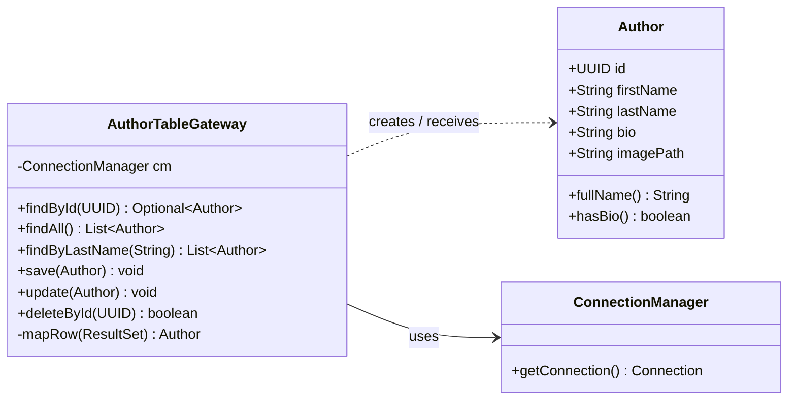
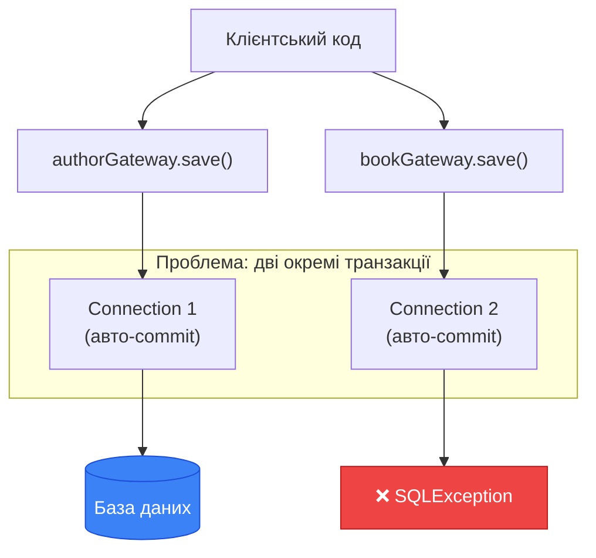

# Table Data Gateway: Фасад таблиці як архітектурний відступ

## Вступ: Що залишається після Row Data Gateway

У попередній статті ми реалізували патерн **Row Data Gateway** (шлюз рядка даних) — підхід, за якого кожен екземпляр класу-шлюзу відповідав за збереження і завантаження одного конкретного рядка таблиці. `AuthorGateway` містив поля `id`, `firstName`, `lastName`, методи `insert()`, `update()`, `delete()` та статичні finder-методи. Ця конструкція виглядала природно і дозволила позбутися дублювання маппінгу між методами.

Однак вона породила нову, більш тонку проблему. Об'єкт `AuthorGateway` виконував дві принципово різні функції: з одного боку, він **був** даними (зберігав `firstName`, `lastName`, `bio`), а з іншого — **знав**, як зберегти ці дані у базі. Відповідно до **принципу єдиної відповідальності** (Single Responsibility Principle, SRP) — першого принципу SOLID — клас повинен мати лише одну причину для зміни. У `AuthorGateway` таких причин було дві: зміна бізнес-атрибутів автора і зміна SQL-схеми таблиці.

Крім того, коли справа доходила до складніших сутностей — наприклад, `Audiobook`, що пов'язаний із `Author` і `Genre` — ставала очевидною ще одна слабкість: Row Data Gateway не надає зручного механізму роботи зі зв'язками між таблицями. Кожен `AudiobookGateway` міг знати лише про власний рядок, але не міг природно «навігувати» до пов'язаних об'єктів.

Саме у відповідь на ці обмеження Мартін Фаулер описав альтернативний патерн — **Table Data Gateway** (шлюз таблиці даних). Він вирішує зазначені проблеми через радикальний архітектурний крок: повне **розділення** доменної моделі та SQL-логіки на два незалежних рівні.

::note
Ця стаття є третьою в еволюційному ланцюжку: Наївний DAO → Row Data Gateway → **Table Data Gateway** → Repository + Data Mapper. Кожен патерн усуває конкретні недоліки попереднього, але привносить нові компроміси. Розуміння цієї еволюції критично важливе для того, щоб свідомо обирати між підходами у реальних проєктах.
::

---

## Концепція Table Data Gateway

### Визначення за Мартіном Фаулером

У книзі «Patterns of Enterprise Application Architecture» (2002) Мартін Фаулер дає таке визначення:

> *An object that acts as a Gateway to a database table. One instance handles all the rows in the table.*

Переклад: **об'єкт, що виступає шлюзом до таблиці бази даних. Один екземпляр обробляє всі рядки таблиці.**

Ключова відмінність від Row Data Gateway закладена у фразі «один екземпляр для всіх рядків». Замість того, щоб мати один `AuthorGateway` на кожного автора, у нас є **один** `AuthorTableGateway` для всієї таблиці `authors`. Це — клас-сервіс, а не клас-дані.

::mermaid



::

Зверніть увагу на стрілки: `AuthorTableGateway` **не є** `Author` і не **містить** `Author` як поле. Він лише **отримує** об'єкти `Author` як аргументи (при збереженні) і **створює** їх (при читанні). Доменна модель і SQL-логіка повністю розділені.

### Порівняння підходів

Щоб відчути принципову різницю між трьома підходами, розглянемо, як вони виглядають з точки зору клієнтського коду:

::tabs

::tabs-item{label="Наївний DAO"}

```java
// Клієнт сам будує і виконує SQL — немає жодної абстракції
Connection conn = DriverManager.getConnection(url, user, pass);
PreparedStatement stmt = conn.prepareStatement(
    "SELECT * FROM authors WHERE id = ?"
);
stmt.setObject(1, id);
ResultSet rs = stmt.executeQuery();
if (rs.next()) {
    Author author = new Author(
        rs.getObject("id", UUID.class),
        rs.getString("first_name"),
        rs.getString("last_name"),
        rs.getString("bio"),
        rs.getString("image_path")
    );
}
```

::

::tabs-item{label="Row Data Gateway"}

```java
// Об'єкт-рядок сам знає, як себе завантажити і зберегти
AuthorGateway gateway = AuthorGateway.findById(conn, id);
gateway.setFirstName("Тарас");
gateway.update(conn); // gateway сам знає SQL для UPDATE

// Але: gateway — це ОДНОЧАСНО і дані, і SQL-логіка
// Порушення SRP: дві причини для зміни
```

::

::tabs-item{label="Table Data Gateway"}

```java
// Чіткий розподіл: доменний об'єкт + окремий фасад-таблиці
AuthorTableGateway gateway = new AuthorTableGateway(connectionManager);

Optional<Author> result = gateway.findById(id); // SQL прихований у gateway
result.ifPresent(author -> {
    author.setFirstName("Тарас"); // зміна чистого POJO
    gateway.update(author);       // збереження через окремий шлюз
});
```

::

::

Якщо в Row Data Gateway об'єкт «знає, як себе зберегти», то в Table Data Gateway «шлюз знає, як зберегти будь-який об'єкт заданого типу». Це тонка, але принципова різниця.

::card-group

::card{title="Row Data Gateway" icon="i-heroicons-rectangle-stack"}

- Один екземпляр = один рядок таблиці
- Клас містить і дані, і SQL-методи
- Порушення SRP — дві причини для зміни
- Зручний для простих одиночних CRUD-операцій

::

::card{title="Table Data Gateway" icon="i-heroicons-table-cells"}

- Один екземпляр = вся таблиця
- Доменний об'єкт — чистий POJO без SQL
- Відповідає SRP — кожен клас має одну відповідальність
- Зручний для операцій над колекціями рядків

::

::

---

## Доменна модель: чисті POJO без SQL-залежностей

Першим кроком при переході до Table Data Gateway є формування **чистої доменної моделі** — класів, що описують бізнес-сутності без жодних залежностей від механізму персистентності. Такі класи у Java традиційно називають **POJO** (Plain Old Java Object) — «звичайний старий Java-об'єкт».

Клас `Author` ми вже сформували у попередніх статтях. Тут ми розширимо набір доменних класів до всіх ключових сутностей аудіоплатформи, що відповідають таблицям `authors`, `genres` та `audiobooks` у нашій схемі.

### Author

```java showLineNumbers
package com.example.audiobook.domain;

import java.util.Objects;
import java.util.UUID;

/**
 * Доменна модель автора аудіокниги.
 * <p>
 * Клас є чистим POJO — не містить жодних залежностей від JDBC,
 * SQL або будь-якої бібліотеки персистентності. Це принципова
 * архітектурна вимога патерну Table Data Gateway.
 */
public class Author {

    private final UUID id;
    private String firstName;
    private String lastName;
    private String bio;
    private String imagePath;

    /** Конструктор для створення нового автора — ID генерується автоматично. */
    public Author(String firstName, String lastName) {
        this.id = UUID.randomUUID();
        this.firstName = firstName;
        this.lastName = lastName;
    }

    /** Конструктор для відновлення автора зі сховища — ID передається явно. */
    public Author(UUID id, String firstName, String lastName,
                  String bio, String imagePath) {
        this.id = id;
        this.firstName = firstName;
        this.lastName = lastName;
        this.bio = bio;
        this.imagePath = imagePath;
    }

    public String fullName() {
        return lastName + " " + firstName;
    }

    public boolean hasBio() {
        return bio != null && !bio.isBlank();
    }

    public UUID getId()          { return id; }
    public String getFirstName() { return firstName; }
    public String getLastName()  { return lastName; }
    public String getBio()       { return bio; }
    public String getImagePath() { return imagePath; }

    public void setFirstName(String firstName) { this.firstName = firstName; }
    public void setLastName(String lastName)   { this.lastName = lastName; }
    public void setBio(String bio)             { this.bio = bio; }
    public void setImagePath(String imagePath) { this.imagePath = imagePath; }

    @Override
    public boolean equals(Object o) {
        if (this == o) return true;
        if (!(o instanceof Author other)) return false;
        return id != null && id.equals(other.id);
    }

    @Override
    public int hashCode() { return Objects.hashCode(id); }

    @Override
    public String toString() {
        return "Author{id=" + id + ", name='" + fullName() + "'}";
    }
}
```

### Genre

Жанр — більш проста сутність, але демонструє важливий принцип: навіть для таблиці з двома полями дотримується та сама архітектурна дисципліна.

```java showLineNumbers
package com.example.audiobook.domain;

import java.util.Objects;
import java.util.UUID;

/**
 * Доменна модель жанру аудіокниги.
 * <p>
 * Поле {@code name} має бути унікальним — обмеження UNIQUE
 * у схемі БД. Клас цього не знає і не повинен знати:
 * обмеження цілісності — відповідальність бази даних,
 * а не доменного об'єкта.
 */
public class Genre {

    private final UUID id;
    private String name;
    private String description;

    public Genre(String name) {
        this.id = UUID.randomUUID();
        this.name = name;
    }

    public Genre(UUID id, String name, String description) {
        this.id = id;
        this.name = name;
        this.description = description;
    }

    public UUID getId()            { return id; }
    public String getName()        { return name; }
    public String getDescription() { return description; }

    public void setName(String name)               { this.name = name; }
    public void setDescription(String description) { this.description = description; }

    @Override
    public boolean equals(Object o) {
        if (this == o) return true;
        if (!(o instanceof Genre other)) return false;
        return id != null && id.equals(other.id);
    }

    @Override
    public int hashCode() { return Objects.hashCode(id); }

    @Override
    public String toString() {
        return "Genre{id=" + id + ", name='" + name + "'}";
    }
}
```

### Audiobook

`Audiobook` — найскладніша сутність, оскільки вона пов'язана з `Author` і `Genre` через зовнішні ключі. Саме тут виникають найцікавіші архітектурні питання, до яких ми повернемося у розділі про реалізацію `AudiobookTableGateway`.

```java showLineNumbers
package com.example.audiobook.domain;

import java.math.BigDecimal;
import java.time.LocalDate;
import java.util.Objects;
import java.util.UUID;

/**
 * Доменна модель аудіокниги.
 * <p>
 * Містить посилання на об'єкти {@code Author} і {@code Genre} —
 * це об'єктна навігація, що є природною для Java, але вимагає
 * спеціальної обробки при маппінгу з реляційної моделі
 * (стаття 09, Розбіжність 4: «Зв'язки»).
 */
public class Audiobook {

    private final UUID id;
    private String title;
    private Author author;       // об'єктна навігація, у БД — author_id (UUID)
    private Genre genre;         // об'єктна навігація, у БД — genre_id (UUID)
    private Integer year;
    private String language;
    private BigDecimal price;
    private String description;
    private LocalDate createdAt;

    /** Конструктор для створення нової аудіокниги. */
    public Audiobook(String title, Author author, Genre genre) {
        this.id = UUID.randomUUID();
        this.title = title;
        this.author = author;
        this.genre = genre;
    }

    /** Конструктор для відновлення аудіокниги зі сховища (повний). */
    public Audiobook(UUID id, String title, Author author, Genre genre,
                     Integer year, String language, BigDecimal price,
                     String description, LocalDate createdAt) {
        this.id = id;
        this.title = title;
        this.author = author;
        this.genre = genre;
        this.year = year;
        this.language = language;
        this.price = price;
        this.description = description;
        this.createdAt = createdAt;
    }

    public UUID getId()           { return id; }
    public String getTitle()      { return title; }
    public Author getAuthor()     { return author; }
    public Genre getGenre()       { return genre; }
    public Integer getYear()      { return year; }
    public String getLanguage()   { return language; }
    public BigDecimal getPrice()  { return price; }
    public String getDescription(){ return description; }
    public LocalDate getCreatedAt(){ return createdAt; }

    public void setTitle(String title)           { this.title = title; }
    public void setAuthor(Author author)         { this.author = author; }
    public void setGenre(Genre genre)            { this.genre = genre; }
    public void setYear(Integer year)            { this.year = year; }
    public void setLanguage(String language)     { this.language = language; }
    public void setPrice(BigDecimal price)       { this.price = price; }
    public void setDescription(String description){ this.description = description; }

    @Override
    public boolean equals(Object o) {
        if (this == o) return true;
        if (!(o instanceof Audiobook other)) return false;
        return id != null && id.equals(other.id);
    }

    @Override
    public int hashCode() { return Objects.hashCode(id); }

    @Override
    public String toString() {
        return "Audiobook{id=" + id + ", title='" + title + "'}";
    }
}
```

**Ключові спостереження щодо доменної моделі:**

- Жоден з цих класів не імпортує `java.sql.*` — вони абсолютно незалежні від механізму збереження
- Клас `Audiobook` містить `Author author` і `Genre genre` як повноцінні об'єкти, а не просто `UUID authorId` — це об'єктна навігація, притаманна Java; перетворення між `author_id (FK)` і `Author-об'єктом` — завдання шлюзу
- Метод `equals()` та `hashCode()` визначені виключно через `id` — узгодження з реляційною семантикою первинного ключа (описано у статті 09)
- Два конструктори присутні у кожному класі: один для **створення** нових об'єктів (ID генерується), інший для **відновлення** з бази (ID передається)

---
## Реалізація AuthorTableGateway

Тепер реалізуємо перший шлюз таблиці — для `authors`. Це клас-сервіс: він не зберігає жодних даних про конкретних авторів, натомість інкапсулює **всю SQL-логіку** взаємодії з таблицею `authors`.

```java showLineNumbers
package com.example.audiobook.gateway;

import com.example.audiobook.db.ConnectionManager;
import com.example.audiobook.db.DatabaseException;
import com.example.audiobook.domain.Author;

import java.sql.*;
import java.util.ArrayList;
import java.util.List;
import java.util.Optional;
import java.util.UUID;

/**
 * Table Data Gateway для таблиці authors.
 * <p>
 * Один екземпляр обслуговує всі рядки таблиці authors.
 * Клас є єдиним місцем у програмі, де знаходиться SQL для цієї таблиці.
 * Доменна модель {@link Author} не знає про існування цього класу.
 */
public class AuthorTableGateway {

    private final ConnectionManager connectionManager;

    // SQL-запити визначені як константи — єдиний «реєстр SQL» для таблиці authors
    private static final String SQL_FIND_BY_ID = """
        SELECT id, first_name, last_name, bio, image_path
        FROM authors
        WHERE id = ?
        """;

    private static final String SQL_FIND_ALL = """
        SELECT id, first_name, last_name, bio, image_path
        FROM authors
        ORDER BY last_name, first_name
        """;

    private static final String SQL_FIND_BY_LAST_NAME = """
        SELECT id, first_name, last_name, bio, image_path
        FROM authors
        WHERE LOWER(last_name) LIKE LOWER(?)
        ORDER BY last_name, first_name
        """;

    private static final String SQL_INSERT = """
        INSERT INTO authors (id, first_name, last_name, bio, image_path)
        VALUES (?, ?, ?, ?, ?)
        """;

    private static final String SQL_UPDATE = """
        UPDATE authors
        SET first_name = ?,
            last_name  = ?,
            bio        = ?,
            image_path = ?
        WHERE id = ?
        """;

    private static final String SQL_DELETE = "DELETE FROM authors WHERE id = ?";
    private static final String SQL_COUNT  = "SELECT COUNT(*) FROM authors";
    private static final String SQL_EXISTS = "SELECT 1 FROM authors WHERE id = ? LIMIT 1";

    public AuthorTableGateway(ConnectionManager connectionManager) {
        this.connectionManager = connectionManager;
    }

    /**
     * Знаходить автора за первинним ключем.
     * Повертає {@link Optional#empty()} якщо автора не існує.
     */
    public Optional<Author> findById(UUID id) {
        try (Connection conn = connectionManager.getConnection();
             PreparedStatement stmt = conn.prepareStatement(SQL_FIND_BY_ID)) {

            stmt.setObject(1, id);

            try (ResultSet rs = stmt.executeQuery()) {
                return rs.next() ? Optional.of(mapRow(rs)) : Optional.empty();
            }

        } catch (SQLException e) {
            throw new DatabaseException("Помилка пошуку автора за id=" + id, e);
        }
    }

    /**
     * Повертає всіх авторів, відсортованих за прізвищем та ім'ям.
     */
    public List<Author> findAll() {
        List<Author> authors = new ArrayList<>();

        try (Connection conn = connectionManager.getConnection();
             PreparedStatement stmt = conn.prepareStatement(SQL_FIND_ALL);
             ResultSet rs = stmt.executeQuery()) {

            while (rs.next()) {
                authors.add(mapRow(rs));
            }

        } catch (SQLException e) {
            throw new DatabaseException("Помилка отримання списку авторів", e);
        }
        return authors;
    }

    /**
     * Знаходить авторів за частиною прізвища (регістр-незалежний пошук).
     *
     * @param lastNamePart підрядок прізвища для пошуку
     */
    public List<Author> findByLastName(String lastNamePart) {
        List<Author> authors = new ArrayList<>();

        try (Connection conn = connectionManager.getConnection();
             PreparedStatement stmt = conn.prepareStatement(SQL_FIND_BY_LAST_NAME)) {

            stmt.setString(1, "%" + lastNamePart + "%");

            try (ResultSet rs = stmt.executeQuery()) {
                while (rs.next()) {
                    authors.add(mapRow(rs));
                }
            }

        } catch (SQLException e) {
            throw new DatabaseException(
                "Помилка пошуку авторів за прізвищем: " + lastNamePart, e);
        }
        return authors;
    }

    /**
     * Зберігає нового автора у таблиці.
     * Якщо автор з таким id вже існує — викидає виключення (порушення PK).
     *
     * @param author доменний об'єкт для збереження
     */
    public void save(Author author) {
        try (Connection conn = connectionManager.getConnection();
             PreparedStatement stmt = conn.prepareStatement(SQL_INSERT)) {

            stmt.setObject(1, author.getId());
            stmt.setString(2, author.getFirstName());
            stmt.setString(3, author.getLastName());
            stmt.setString(4, author.getBio());       // null → SQL NULL
            stmt.setString(5, author.getImagePath()); // null → SQL NULL

            int rows = stmt.executeUpdate();
            if (rows != 1) {
                throw new DatabaseException(
                    "Очікувався 1 вставлений рядок, отримано: " + rows, null);
            }

        } catch (SQLException e) {
            throw new DatabaseException(
                "Помилка збереження автора: " + author.getId(), e);
        }
    }

    /**
     * Оновлює всі поля існуючого автора (крім незмінного id).
     *
     * @param author доменний об'єкт з оновленими даними
     * @throws DatabaseException якщо автора з таким id не знайдено
     */
    public void update(Author author) {
        try (Connection conn = connectionManager.getConnection();
             PreparedStatement stmt = conn.prepareStatement(SQL_UPDATE)) {

            stmt.setString(1, author.getFirstName());
            stmt.setString(2, author.getLastName());
            stmt.setString(3, author.getBio());
            stmt.setString(4, author.getImagePath());
            stmt.setObject(5, author.getId()); // id — в умові WHERE

            int rows = stmt.executeUpdate();
            if (rows == 0) {
                throw new DatabaseException(
                    "Автора з id=" + author.getId() + " не знайдено", null);
            }

        } catch (SQLException e) {
            throw new DatabaseException(
                "Помилка оновлення автора: " + author.getId(), e);
        }
    }

    /**
     * Видаляє автора за ідентифікатором.
     *
     * @return {@code true} якщо автора було знайдено та видалено
     */
    public boolean deleteById(UUID id) {
        try (Connection conn = connectionManager.getConnection();
             PreparedStatement stmt = conn.prepareStatement(SQL_DELETE)) {

            stmt.setObject(1, id);
            return stmt.executeUpdate() > 0;

        } catch (SQLException e) {
            throw new DatabaseException("Помилка видалення автора: " + id, e);
        }
    }

    /** Повертає загальну кількість авторів у таблиці. */
    public long count() {
        try (Connection conn = connectionManager.getConnection();
             PreparedStatement stmt = conn.prepareStatement(SQL_COUNT);
             ResultSet rs = stmt.executeQuery()) {

            rs.next();
            return rs.getLong(1);

        } catch (SQLException e) {
            throw new DatabaseException("Помилка підрахунку авторів", e);
        }
    }

    /** Перевіряє існування автора за id без завантаження даних. */
    public boolean existsById(UUID id) {
        try (Connection conn = connectionManager.getConnection();
             PreparedStatement stmt = conn.prepareStatement(SQL_EXISTS)) {

            stmt.setObject(1, id);
            try (ResultSet rs = stmt.executeQuery()) {
                return rs.next();
            }

        } catch (SQLException e) {
            throw new DatabaseException("Помилка перевірки існування автора: " + id, e);
        }
    }

    /**
     * Приватний метод маппінгу: ResultSet → Author.
     * Централізований в одному місці — зміна структури таблиці
     * вимагає правки лише тут.
     */
    private Author mapRow(ResultSet rs) throws SQLException {
        return new Author(
            rs.getObject("id", UUID.class),
            rs.getString("first_name"),
            rs.getString("last_name"),
            rs.getString("bio"),        // null → java null
            rs.getString("image_path") // null → java null
        );
    }
}
```

**Декомпозиція архітектурних рішень:**

- **Рядки 23–62** (SQL-константи): усі запити оголошені як `private static final String` у верхній частині класу. Це єдиний «реєстр SQL» для таблиці `authors` — зміна схеми (додавання стовпця, перейменування) вимагає правки лише тут, а не у кожному окремому методі
- **Рядок 67** (конструктор): `ConnectionManager` передається через конструктор (Dependency Injection) — Gateway не знає і не повинен знати, чи це пул з'єднань, чи пряме підключення
- **Рядок 80** (вкладений try-with-resources): `ResultSet` відкривається у власному `try-with-resources` всередині блоку `PreparedStatement` — це гарантує закриття саме у правильному порядку: спочатку `rs`, потім `stmt`, потім `conn`
- **Рядок 148** (`rows == 0`): перевірка кількості оновлених рядків дозволяє виявити спробу оновити неіснуючого автора і відразу сигналізувати про помилку — замість того, щоб повернути успіх при відсутній дії
- **Рядок 212** (`mapRow`): маппінг зосереджений в одному приватному методі — жоден інший метод класу не «знає» про назви стовпців `first_name`, `last_name` тощо

---

## Реалізація GenreTableGateway

Для жанрів шлюз виглядає аналогічно, але має два специфічних моменти: поле `name` є унікальним (обмеження `UNIQUE` у схемі), що потребує особливої обробки при збереженні, та метод `findByName()` для пошуку за назвою жанру.

```java showLineNumbers
package com.example.audiobook.gateway;

import com.example.audiobook.db.ConnectionManager;
import com.example.audiobook.db.DatabaseException;
import com.example.audiobook.domain.Genre;

import java.sql.*;
import java.util.ArrayList;
import java.util.List;
import java.util.Optional;
import java.util.UUID;

/**
 * Table Data Gateway для таблиці genres.
 */
public class GenreTableGateway {

    private final ConnectionManager connectionManager;

    private static final String SQL_FIND_BY_ID = """
        SELECT id, name, description FROM genres WHERE id = ?
        """;
    private static final String SQL_FIND_BY_NAME = """
        SELECT id, name, description FROM genres WHERE name = ?
        """;
    private static final String SQL_FIND_ALL = """
        SELECT id, name, description FROM genres ORDER BY name
        """;
    private static final String SQL_INSERT = """
        INSERT INTO genres (id, name, description) VALUES (?, ?, ?)
        """;
    private static final String SQL_UPDATE = """
        UPDATE genres SET name = ?, description = ? WHERE id = ?
        """;
    private static final String SQL_DELETE = "DELETE FROM genres WHERE id = ?";

    public GenreTableGateway(ConnectionManager connectionManager) {
        this.connectionManager = connectionManager;
    }

    public Optional<Genre> findById(UUID id) {
        try (Connection conn = connectionManager.getConnection();
             PreparedStatement stmt = conn.prepareStatement(SQL_FIND_BY_ID)) {

            stmt.setObject(1, id);
            try (ResultSet rs = stmt.executeQuery()) {
                return rs.next() ? Optional.of(mapRow(rs)) : Optional.empty();
            }

        } catch (SQLException e) {
            throw new DatabaseException("Помилка пошуку жанру за id=" + id, e);
        }
    }

    /**
     * Знаходить жанр за точним іменем (чутливо до регістру).
     * Повертає {@link Optional#empty()} якщо жанр не існує.
     *
     * @param name точна назва жанру
     */
    public Optional<Genre> findByName(String name) {
        try (Connection conn = connectionManager.getConnection();
             PreparedStatement stmt = conn.prepareStatement(SQL_FIND_BY_NAME)) {

            stmt.setString(1, name);
            try (ResultSet rs = stmt.executeQuery()) {
                return rs.next() ? Optional.of(mapRow(rs)) : Optional.empty();
            }

        } catch (SQLException e) {
            throw new DatabaseException("Помилка пошуку жанру за іменем: " + name, e);
        }
    }

    public List<Genre> findAll() {
        List<Genre> genres = new ArrayList<>();
        try (Connection conn = connectionManager.getConnection();
             PreparedStatement stmt = conn.prepareStatement(SQL_FIND_ALL);
             ResultSet rs = stmt.executeQuery()) {

            while (rs.next()) {
                genres.add(mapRow(rs));
            }

        } catch (SQLException e) {
            throw new DatabaseException("Помилка отримання списку жанрів", e);
        }
        return genres;
    }

    /**
     * Зберігає жанр. Якщо жанр з таким name вже існує —
     * БД поверне помилку порушення UNIQUE constraint.
     */
    public void save(Genre genre) {
        try (Connection conn = connectionManager.getConnection();
             PreparedStatement stmt = conn.prepareStatement(SQL_INSERT)) {

            stmt.setObject(1, genre.getId());
            stmt.setString(2, genre.getName());
            stmt.setString(3, genre.getDescription()); // null-safe

            stmt.executeUpdate();

        } catch (SQLException e) {
            // SQLState 23505/23000 — порушення UNIQUE constraint у H2/PostgreSQL
            if (e.getSQLState() != null && e.getSQLState().startsWith("23")) {
                throw new DatabaseException(
                    "Жанр з назвою '" + genre.getName() + "' вже існує", e);
            }
            throw new DatabaseException("Помилка збереження жанру", e);
        }
    }

    public void update(Genre genre) {
        try (Connection conn = connectionManager.getConnection();
             PreparedStatement stmt = conn.prepareStatement(SQL_UPDATE)) {

            stmt.setString(1, genre.getName());
            stmt.setString(2, genre.getDescription());
            stmt.setObject(3, genre.getId());

            int rows = stmt.executeUpdate();
            if (rows == 0) {
                throw new DatabaseException(
                    "Жанр з id=" + genre.getId() + " не знайдено", null);
            }

        } catch (SQLException e) {
            throw new DatabaseException("Помилка оновлення жанру", e);
        }
    }

    public boolean deleteById(UUID id) {
        try (Connection conn = connectionManager.getConnection();
             PreparedStatement stmt = conn.prepareStatement(SQL_DELETE)) {

            stmt.setObject(1, id);
            return stmt.executeUpdate() > 0;

        } catch (SQLException e) {
            throw new DatabaseException("Помилка видалення жанру: " + id, e);
        }
    }

    private Genre mapRow(ResultSet rs) throws SQLException {
        return new Genre(
            rs.getObject("id", UUID.class),
            rs.getString("name"),
            rs.getString("description") // може бути null
        );
    }
}
```

Особливої уваги заслуговує обробка помилки дублювання назви жанру (рядки 105–109). При порушенні обмеження `UNIQUE` база даних повертає `SQLException` зі специфічним `SQLState`, що починається з `23` (клас цілісності даних у стандарті SQL). Перехоплення цього стану і перетворення на зрозуміле повідомлення — приклад правильної **трансляції виключень**: технічна помилка БД стає бізнес-значущим повідомленням.

::tip
SQLState `23000` означає «порушення обмеження цілісності» у стандарті SQL. H2 використовує `23505` для UNIQUE violations, PostgreSQL — теж `23505`. Перевірка `startsWith("23")` охоплює обидва варіанти та є портативною між СУБД.
::

---

## AudiobookTableGateway: Проблема зв'язків

Якщо `AuthorTableGateway` і `GenreTableGateway` є відносно прямолінійними реалізаціями, то `AudiobookTableGateway` ставить нас перед принциповим питанням, яке є серцем **Impedance Mismatch**: як маппити зовнішні ключі на об'єктні посилання?

У реляційній схемі таблиця `audiobooks` містить стовпці `author_id UUID` та `genre_id UUID` — лише ідентифікатори. У Java-об'єкті `Audiobook` — поля `Author author` та `Genre genre` — повноцінні об'єкти. Між ними — прірва.

Розглянемо два принципово різні підходи до вирішення цієї проблеми і зрозуміємо компроміси кожного.

### Підхід 1: Повертати тільки ідентифікатори

Перший варіант — зберігати у `Audiobook` лише `UUID authorId` і `UUID genreId`, а не об'єкти. Тоді маппінг тривіальний: читаємо рядок з БД, копіюємо `author_id` в поле `authorId` — жодних додаткових запитів.

```java
// Спрощена доменна модель з ID замість об'єктів
public class AudiobookFlat {
    private final UUID id;
    private String title;
    private UUID authorId;   // тільки ID, не об'єкт
    private UUID genreId;    // тільки ID, не об'єкт
    // ...
}
```

Клієнтський код у цьому випадку виглядає так:

```java
// Клієнт зобов'язаний вручну «збирати» об'єктний граф
AudiobookFlat flat = audiobookGateway.findById(id);
Author author = authorGateway.findById(flat.getAuthorId()).orElseThrow();
Genre genre   = genreGateway.findById(flat.getGenreId()).orElseThrow();
// Тепер ми можемо «зібрати» повний об'єкт
```

Це простий підхід, але він **переносить відповідальність** за складання об'єктного графу на клієнтський код. Кожен виклик у системі, що хоче отримати `Audiobook` з автором і жанром, змушений повторювати ці три рядки. Дублювання коду повертається — але вже на рівні клієнтів, а не шлюзів.

### Підхід 2: JOIN у запиті, повний об'єкт у результаті

Другий варіант — виконати SQL-запит із `JOIN` і одразу повернути `Audiobook` з повноцінними об'єктами `Author` та `Genre`. Клієнтський код отримує готовий об'єктний граф без додаткових запитів.

::tabs

::tabs-item{label="Варіант 1: тільки ID"}

```java
// Маппінг без JOIN — тривіальний, але неповний
private AudiobookFlat mapRowFlat(ResultSet rs) throws SQLException {
    AudiobookFlat book = new AudiobookFlat();
    book.setId(rs.getObject("id", UUID.class));
    book.setTitle(rs.getString("title"));
    book.setAuthorId(rs.getObject("author_id", UUID.class)); // лише UUID
    book.setGenreId(rs.getObject("genre_id", UUID.class));   // лише UUID
    return book;
}
```

**Переваги:** простота, один запит, без JOIN.  
**Недоліки:** клієнт мусить збирати граф вручну.

::

::tabs-item{label="Варіант 2: JOIN + повний граф"}

```sql
SELECT ab.id, ab.title, ab.year, ab.language, ab.price,
       ab.description, ab.created_at,
       a.id   AS author_id,   a.first_name, a.last_name,
       a.bio, a.image_path,
       g.id   AS genre_id,    g.name,       g.description AS genre_desc
FROM audiobooks ab
JOIN authors a ON ab.author_id = a.id
JOIN genres  g ON ab.genre_id  = g.id
WHERE ab.id = ?
```

**Переваги:** клієнт отримує готовий граф.  
**Недоліки:** складніший маппінг, JOIN може бути надлишковим.

::

::

Ми реалізуємо **Варіант 2** — він є більш коректним з точки зору об'єктної моделі Java і демонструє ключову техніку маппінгу складних об'єктних графів.

```java showLineNumbers
package com.example.audiobook.gateway;

import com.example.audiobook.db.ConnectionManager;
import com.example.audiobook.db.DatabaseException;
import com.example.audiobook.domain.Author;
import com.example.audiobook.domain.Audiobook;
import com.example.audiobook.domain.Genre;

import java.math.BigDecimal;
import java.sql.*;
import java.time.LocalDate;
import java.util.ArrayList;
import java.util.List;
import java.util.Optional;
import java.util.UUID;

/**
 * Table Data Gateway для таблиці audiobooks.
 * <p>
 * Операції читання виконують JOIN із таблицями authors та genres,
 * щоб повертати повноцінний об'єктний граф Audiobook → Author → Genre.
 * Операції запису використовують лише author_id та genre_id як FK.
 */
public class AudiobookTableGateway {

    private final ConnectionManager connectionManager;

    /**
     * SQL для читання — з JOIN для отримання повного об'єктного графу.
     * Псевдоніми стовпців (a.id AS author_id, g.id AS genre_id) необхідні,
     * щоб уникнути конфлікту імен: усі три таблиці мають стовпець id.
     */
    private static final String SQL_SELECT_BASE = """
        SELECT ab.id,
               ab.title, ab.year, ab.language, ab.price,
               ab.description, ab.created_at,
               a.id         AS author_id,
               a.first_name, a.last_name, a.bio, a.image_path,
               g.id         AS genre_id,
               g.name       AS genre_name,
               g.description AS genre_description
        FROM audiobooks ab
        JOIN authors a ON ab.author_id = a.id
        JOIN genres  g ON ab.genre_id  = g.id
        """;

    private static final String SQL_FIND_BY_ID =
        SQL_SELECT_BASE + "WHERE ab.id = ?";

    private static final String SQL_FIND_ALL =
        SQL_SELECT_BASE + "ORDER BY ab.title";

    private static final String SQL_FIND_BY_GENRE =
        SQL_SELECT_BASE + "WHERE g.name = ? ORDER BY ab.title";

    private static final String SQL_FIND_BY_AUTHOR =
        SQL_SELECT_BASE + "WHERE a.id = ? ORDER BY ab.title";

    private static final String SQL_INSERT = """
        INSERT INTO audiobooks
          (id, title, author_id, genre_id, year, language, price, description)
        VALUES (?, ?, ?, ?, ?, ?, ?, ?)
        """;

    private static final String SQL_UPDATE = """
        UPDATE audiobooks
        SET title       = ?,
            author_id   = ?,
            genre_id    = ?,
            year        = ?,
            language    = ?,
            price       = ?,
            description = ?
        WHERE id = ?
        """;

    private static final String SQL_DELETE = "DELETE FROM audiobooks WHERE id = ?";

    public AudiobookTableGateway(ConnectionManager connectionManager) {
        this.connectionManager = connectionManager;
    }

    /**
     * Знаходить аудіокнигу за id.
     * Виконує JOIN із authors та genres — повертає повний об'єктний граф.
     */
    public Optional<Audiobook> findById(UUID id) {
        try (Connection conn = connectionManager.getConnection();
             PreparedStatement stmt = conn.prepareStatement(SQL_FIND_BY_ID)) {

            stmt.setObject(1, id);
            try (ResultSet rs = stmt.executeQuery()) {
                return rs.next() ? Optional.of(mapRow(rs)) : Optional.empty();
            }

        } catch (SQLException e) {
            throw new DatabaseException("Помилка пошуку аудіокниги за id=" + id, e);
        }
    }

    /**
     * Повертає всі аудіокниги, відсортовані за назвою.
     */
    public List<Audiobook> findAll() {
        List<Audiobook> books = new ArrayList<>();

        try (Connection conn = connectionManager.getConnection();
             PreparedStatement stmt = conn.prepareStatement(SQL_FIND_ALL);
             ResultSet rs = stmt.executeQuery()) {

            while (rs.next()) {
                books.add(mapRow(rs));
            }

        } catch (SQLException e) {
            throw new DatabaseException("Помилка отримання списку аудіокниг", e);
        }
        return books;
    }

    /**
     * Знаходить аудіокниги заданого жанру.
     *
     * @param genreName точна назва жанру
     */
    public List<Audiobook> findByGenre(String genreName) {
        List<Audiobook> books = new ArrayList<>();

        try (Connection conn = connectionManager.getConnection();
             PreparedStatement stmt = conn.prepareStatement(SQL_FIND_BY_GENRE)) {

            stmt.setString(1, genreName);
            try (ResultSet rs = stmt.executeQuery()) {
                while (rs.next()) {
                    books.add(mapRow(rs));
                }
            }

        } catch (SQLException e) {
            throw new DatabaseException("Помилка пошуку аудіокниг за жанром: " + genreName, e);
        }
        return books;
    }

    /**
     * Знаходить всі аудіокниги заданого автора.
     *
     * @param authorId UUID автора
     */
    public List<Audiobook> findByAuthor(UUID authorId) {
        List<Audiobook> books = new ArrayList<>();

        try (Connection conn = connectionManager.getConnection();
             PreparedStatement stmt = conn.prepareStatement(SQL_FIND_BY_AUTHOR)) {

            stmt.setObject(1, authorId);
            try (ResultSet rs = stmt.executeQuery()) {
                while (rs.next()) {
                    books.add(mapRow(rs));
                }
            }

        } catch (SQLException e) {
            throw new DatabaseException("Помилка пошуку аудіокниг автора: " + authorId, e);
        }
        return books;
    }

    /**
     * Зберігає нову аудіокнигу.
     * Використовує author.getId() та genre.getId() як зовнішні ключі.
     * Якщо Author або Genre не існують у БД — порушення FK constraint.
     */
    public void save(Audiobook book) {
        try (Connection conn = connectionManager.getConnection();
             PreparedStatement stmt = conn.prepareStatement(SQL_INSERT)) {

            stmt.setObject(1, book.getId());
            stmt.setString(2, book.getTitle());
            stmt.setObject(3, book.getAuthor().getId()); // FK: author_id
            stmt.setObject(4, book.getGenre().getId());  // FK: genre_id
            stmt.setObject(5, book.getYear());           // Integer, може бути null
            stmt.setString(6, book.getLanguage());
            stmt.setBigDecimal(7, book.getPrice());      // може бути null
            stmt.setString(8, book.getDescription());    // може бути null

            stmt.executeUpdate();

        } catch (SQLException e) {
            // SQLState 23* — порушення FK constraint (author або genre не існує)
            if (e.getSQLState() != null && e.getSQLState().startsWith("23")) {
                throw new DatabaseException(
                    "Порушення цілісності: автор або жанр не існує у БД", e);
            }
            throw new DatabaseException("Помилка збереження аудіокниги", e);
        }
    }

    /**
     * Оновлює всі поля аудіокниги.
     */
    public void update(Audiobook book) {
        try (Connection conn = connectionManager.getConnection();
             PreparedStatement stmt = conn.prepareStatement(SQL_UPDATE)) {

            stmt.setString(1, book.getTitle());
            stmt.setObject(2, book.getAuthor().getId()); // FK
            stmt.setObject(3, book.getGenre().getId());  // FK
            stmt.setObject(4, book.getYear());
            stmt.setString(5, book.getLanguage());
            stmt.setBigDecimal(6, book.getPrice());
            stmt.setString(7, book.getDescription());
            stmt.setObject(8, book.getId()); // WHERE id = ?

            int rows = stmt.executeUpdate();
            if (rows == 0) {
                throw new DatabaseException(
                    "Аудіокнигу з id=" + book.getId() + " не знайдено", null);
            }

        } catch (SQLException e) {
            throw new DatabaseException("Помилка оновлення аудіокниги", e);
        }
    }

    public boolean deleteById(UUID id) {
        try (Connection conn = connectionManager.getConnection();
             PreparedStatement stmt = conn.prepareStatement(SQL_DELETE)) {

            stmt.setObject(1, id);
            return stmt.executeUpdate() > 0;

        } catch (SQLException e) {
            throw new DatabaseException("Помилка видалення аудіокниги: " + id, e);
        }
    }

    /**
     * Маппінг рядка ResultSet → Audiobook з вкладеними Author та Genre.
     * <p>
     * Ключова техніка: псевдоніми стовпців у SQL (author_id, genre_id,
     * genre_name, genre_description) дозволяють уникнути конфлікту імен
     * між стовпцями різних таблиць.
     */
    private Audiobook mapRow(ResultSet rs) throws SQLException {
        // Спочатку відновлюємо вкладені об'єкти
        Author author = new Author(
            rs.getObject("author_id", UUID.class),
            rs.getString("first_name"),
            rs.getString("last_name"),
            rs.getString("bio"),
            rs.getString("image_path")
        );

        Genre genre = new Genre(
            rs.getObject("genre_id", UUID.class),
            rs.getString("genre_name"),
            rs.getString("genre_description")
        );

        // Потім збираємо кореневий об'єкт
        return new Audiobook(
            rs.getObject("id", UUID.class),
            rs.getString("title"),
            author,   // повноцінний об'єкт, а не UUID
            genre,    // повноцінний об'єкт, а не UUID
            rs.getObject("year", Integer.class),      // null-safe для Integer
            rs.getString("language"),
            rs.getBigDecimal("price"),                // null → java null
            rs.getString("description"),
            rs.getObject("created_at", LocalDate.class) // null-safe
        );
    }
}
```

**Анатомія методу `mapRow()` (рядки 210–234):**

Цей метод є серцем `AudiobookTableGateway`. Він демонструє принцип **вкладеного маппінгу**: щоб побудувати кореневий об'єкт `Audiobook`, спочатку потрібно побудувати вкладені об'єкти `Author` і `Genre`. Послідовність чітка:

1. З колонок `author_id`, `first_name`, `last_name`, `bio`, `image_path` будується `Author`
2. З колонок `genre_id`, `genre_name`, `genre_description` будується `Genre`
3. З решти колонок і щойно створених `Author`/`Genre` будується `Audiobook`

Псевдоніми у SQL (`a.id AS author_id`, `g.name AS genre_name`) є критично важливими — без них `rs.getString("id")` повернуло б значення якогось одного `id` (поведінка залежить від СУБД), а `rs.getString("description")` — першу знайдену колонку з цією назвою.

::note
Метод `rs.getObject("year", Integer.class)` повертає `null` якщо стовпець є `NULL` у БД — на відміну від `rs.getInt("year")`, який повертає `0`. Для nullable Integer-стовпців завжди використовуйте `getObject(name, Integer.class)`.
::

---

## Структура проєкту та демонстрація використання

Перш ніж перейти до аналізу проблем, розглянемо, як усі компоненти вписуються у структуру проєкту та як виглядає клієнтський код.

::code-tree

```text [src/main/java/com/example/audiobook/domain/Author.java]
// Чистий POJO — без JDBC-залежностей
```

```text [src/main/java/com/example/audiobook/domain/Genre.java]
// Чистий POJO — без JDBC-залежностей
```

```text [src/main/java/com/example/audiobook/domain/Audiobook.java]
// Чистий POJO — посилання на Author та Genre як об'єкти
```

```text [src/main/java/com/example/audiobook/gateway/AuthorTableGateway.java]
// Table Data Gateway для authors — весь SQL тут
```

```text [src/main/java/com/example/audiobook/gateway/GenreTableGateway.java]
// Table Data Gateway для genres — весь SQL тут
```

```text [src/main/java/com/example/audiobook/gateway/AudiobookTableGateway.java]
// Table Data Gateway для audiobooks — JOIN-запити
```

```text [src/main/java/com/example/audiobook/db/ConnectionManager.java]
// Фасад для отримання з'єднань (з пулу)
```

```text [src/main/java/com/example/audiobook/Main.java]
// Демонстрація використання
```

::

Тепер напишемо `Main`, що демонструє повний сценарій роботи аудіоплатформи через Table Data Gateway:

```java showLineNumbers
package com.example.audiobook;

import com.example.audiobook.db.ConnectionManager;
import com.example.audiobook.domain.Author;
import com.example.audiobook.domain.Audiobook;
import com.example.audiobook.domain.Genre;
import com.example.audiobook.gateway.AudiobookTableGateway;
import com.example.audiobook.gateway.AuthorTableGateway;
import com.example.audiobook.gateway.GenreTableGateway;

import java.math.BigDecimal;
import java.util.List;

public class Main {

    public static void main(String[] args) {

        // 1. Ініціалізація інфраструктури
        ConnectionManager cm = ConnectionManager.forH2("./data/audiobook_db");

        AuthorTableGateway  authorGateway   = new AuthorTableGateway(cm);
        GenreTableGateway   genreGateway    = new GenreTableGateway(cm);
        AudiobookTableGateway bookGateway   = new AudiobookTableGateway(cm);

        // 2. Створення та збереження авторів
        Author shevchenko = new Author("Тарас", "Шевченко");
        Author franko     = new Author("Іван", "Франко");

        authorGateway.save(shevchenko);
        authorGateway.save(franko);
        System.out.println("✓ Авторів збережено: " + authorGateway.count());

        // 3. Створення та збереження жанрів
        Genre poetry = new Genre("Поезія");
        Genre novel  = new Genre("Роман");

        genreGateway.save(poetry);
        genreGateway.save(novel);

        // 4. Спроба зберегти жанр з дублікатом назви
        try {
            genreGateway.save(new Genre("Поезія")); // UNIQUE constraint!
        } catch (Exception e) {
            System.out.println("✓ Перехоплено дублікат: " + e.getMessage());
        }

        // 5. Створення та збереження аудіокниг
        Audiobook kobzar = new Audiobook("Кобзар", shevchenko, poetry);
        kobzar.setYear(1840);
        kobzar.setLanguage("uk");
        kobzar.setPrice(new BigDecimal("99.99"));

        bookGateway.save(kobzar);

        Audiobook zakhar = new Audiobook("Захар Беркут", franko, novel);
        zakhar.setYear(1883);
        zakhar.setLanguage("uk");
        zakhar.setPrice(new BigDecimal("129.00"));

        bookGateway.save(zakhar);

        // 6. Читання з повним об'єктним графом
        List<Audiobook> allBooks = bookGateway.findAll();
        System.out.println("\n✓ Всі аудіокниги (" + allBooks.size() + "):");
        for (Audiobook book : allBooks) {
            System.out.printf("   «%s» — %s (%s)%n",
                book.getTitle(),
                book.getAuthor().fullName(), // доступ до Author-об'єкта
                book.getGenre().getName()    // доступ до Genre-об'єкта
            );
        }

        // 7. Пошук за жанром
        List<Audiobook> poems = bookGateway.findByGenre("Поезія");
        System.out.println("\n✓ Поезії (" + poems.size() + "):");
        poems.forEach(b -> System.out.println("   " + b.getTitle()));

        // 8. Пошук авторів за прізвищем
        List<Author> foundAuthors = authorGateway.findByLastName("шевч");
        System.out.println("\n✓ Пошук авторів 'шевч': " + foundAuthors.size());
        foundAuthors.forEach(a -> System.out.println("   " + a.fullName()));

        // 9. Оновлення об'єкта
        shevchenko.setBio("Великий український поет, художник, мислитель.");
        authorGateway.update(shevchenko);
        System.out.println("\n✓ Біографію оновлено");

        // 10. Перевірка оновлення
        authorGateway.findById(shevchenko.getId())
            .ifPresent(a -> System.out.println("✓ Збережена біо: " + a.getBio()));

        cm.close();
    }
}
```

Результат виконання:

::terminal-preview{title="java Main" :cursor="false"}
<div class="line"><span class="opacity-40">$</span> <strong class="font-bold">java -cp . com.example.audiobook.Main</strong></div>
<div class="line"><span class="text-blue-400 font-bold">[Pool]</span> Ініціалізовано: 2 з'єднань готові</div>
<div class="line"><span class="text-green-400 font-bold">✓</span> Авторів збережено: 2</div>
<div class="line"><span class="text-green-400 font-bold">✓</span> Перехоплено дублікат: Жанр з назвою 'Поезія' вже існує</div>
<div class="line"></div>
<div class="line"><span class="text-green-400 font-bold">✓</span> Всі аудіокниги (2):</div>
<div class="line">   «Захар Беркут» — Франко Іван (Роман)</div>
<div class="line">   «Кобзар» — Шевченко Тарас (Поезія)</div>
<div class="line"></div>
<div class="line"><span class="text-green-400 font-bold">✓</span> Поезії (1):</div>
<div class="line">   Кобзар</div>
<div class="line"></div>
<div class="line"><span class="text-green-400 font-bold">✓</span> Пошук авторів 'шевч': 1</div>
<div class="line">   Шевченко Тарас</div>
<div class="line"></div>
<div class="line"><span class="text-green-400 font-bold">✓</span> Біографію оновлено</div>
<div class="line"><span class="text-green-400 font-bold">✓</span> Збережена біо: Великий український поет, художник, мислитель.</div>
<div class="line"><span class="text-blue-400 font-bold">[Pool]</span> Закрито. Закрито 2 з'єднань</div>
::

Зверніть увагу на рядки 66–70 демонстраційного коду: `book.getAuthor().fullName()` та `book.getGenre().getName()` — клієнт працює з повноцінними об'єктами Java, не знаючи нічого про SQL, JOIN або зовнішні ключі. Це і є архітектурна цінність Table Data Gateway.

---

## Проблеми Table Data Gateway

Попри очевидний прогрес у порівнянні з наївним DAO і Row Data Gateway, патерн Table Data Gateway несе з собою ряд обмежень, які стають відчутними в міру зростання системи.

### Проблема 1: Дублювання SQL між шлюзами

Розглянемо два методи з різних шлюзів:

```java
// AuthorTableGateway
private static final String SQL_FIND_BY_ID = """
    SELECT id, first_name, last_name, bio, image_path
    FROM authors WHERE id = ?
    """;

// GenreTableGateway
private static final String SQL_FIND_BY_ID = """
    SELECT id, name, description FROM genres WHERE id = ?
    """;
```

Структура запитів ідентична — різниться лише набір стовпців і назва таблиці. Метод `findById()` у кожному шлюзі виглядає майже однаково: отримати з'єднання, підготувати запит, встановити параметр, виконати, перетворити ResultSet. Це — **структурне дублювання**, що порушує принцип DRY (Don't Repeat Yourself).

Чим більше таблиць, тим більше шаблонного коду. Якщо у системі 10 таблиць — матимемо 10 шлюзів, кожен із яким по 7–8 майже ідентичних методів. У статті 14 ми вирішимо цю проблему через **Template Method Pattern** у базовому абстрактному `AbstractJdbcRepository`.

### Проблема 2: Відсутність абстракції — клієнт залежить від конкретики

Поточний клієнтський код пише:

```java
AuthorTableGateway authorGateway = new AuthorTableGateway(cm);
```

Це — пряма залежність від конкретного класу. Якщо завтра ми захочемо замінити H2 на PostgreSQL, або написати mock-реалізацію для тестів, нам доведеться змінювати кожне місце у коді, де `AuthorTableGateway` використовується безпосередньо. **Немає інтерфейсу** — немає поліморфізму, немає тестованості.

### Проблема 3: Проблема зв'язків залишається відкритою

`AudiobookTableGateway` вирішив проблему зв'язків для одного рівня вкладеності (Audiobook → Author, Audiobook → Genre). Але що, якщо `Author` має поле `List<Audiobook> audiobooks`? Або `Audiobook` має `List<AudiobookFile> files`?

При поточному підході для таких зв'язків типу «один-до-багатьох» виникають два погані варіанти:
- Не завантажувати колекцію взагалі — клієнт отримує неповний об'єкт
- Завантажувати завжди — тягнемо 500 файлів для 100 книг, навіть якщо вони не потрібні

Це — зародок **проблеми N+1** та **Eager vs Lazy Loading**, яку ми детально розглянемо у статті 18 при вивченні патерну Proxy.

::warning
Table Data Gateway надає чітке розділення між доменною моделлю та SQL-логікою, але не вирішує фундаментальну проблему об'єктно-реляційного розриву. Кожен шлюз знає лише про «свою» таблицю і не може природно обробляти складні ієрархічні зв'язки. Це обмеження є архітектурним, а не технічним.
::

### Проблема 4: Транзакційність між шлюзами

Розглянемо сценарій: клієнт хоче зберегти нового автора і одразу зберегти його перший твір. Якщо збереження `Audiobook` провалиться — `Author` вже буде у базі:

```java
authorGateway.save(author);   // з'єднання 1 — автоматична транзакція
bookGateway.save(audiobook);  // з'єднання 2 — окрема транзакція
// Якщо тут виняток — author у БД є, audiobook — ні. Неузгодженість!
```

Кожен метод Gateway отримує власне з'єднання і виконується у власній транзакції. Скоординувати кілька Gateway в одній транзакції **неможливо** без передачі `Connection` між ними — а це зруйнує архітектурну чистоту патерну. Вирішення цієї проблеми — патерн **Unit of Work** (стаття 16).

::mermaid



::

Підсумкова таблиця проблем та їх рішень у наступних статтях:

| Проблема | Де вирішується |
|---|---|
| Дублювання SQL (шаблонний код) | Стаття 14: `AbstractJdbcRepository` + Template Method |
| Відсутність інтерфейсу/абстракції | Стаття 14: `Repository<T, ID>` інтерфейс |
| Проблема One-To-Many зв'язків | Стаття 18: Proxy + Lazy Loading |
| Транзакції між кількома операціями | Стаття 16: Unit of Work |
| SQL жорстко в коді (H2 vs PostgreSQL) | Стаття 17: Strategy Pattern |

---

## Підсумок

Table Data Gateway є важливим кроком в еволюції патернів доступу до даних. Він впроваджує чітке і принципове розділення між двома відповідальностями, які у попередніх підходах були змішані в одному місці:

- **Доменна модель** (`Author`, `Genre`, `Audiobook`) — описує бізнес-сутності, їхні властивості та поведінку. Не знає нічого про базу даних.
- **Table Data Gateway** (`AuthorTableGateway`, `GenreTableGateway`, `AudiobookTableGateway`) — інкапсулює всі SQL-операції для відповідної таблиці. Не зберігає доменних даних.

::card-group

::card{title="✅ Що Table Data Gateway вирішує" icon="i-heroicons-check-circle"}

- Доменна модель — чисті POJO без SQL-залежностей
- SQL зосереджений у шлюзі, а не розпорошений по системі
- Маппінг `ResultSet → Object` в одному місці (`mapRow`)
- Читабельний клієнтський код, що працює з доменними об'єктами
- JOIN-маппінг для складних об'єктних графів

::

::card{title="❌ Що залишається проблемою" icon="i-heroicons-x-circle"}

- Структурне дублювання між шлюзами (шаблонний JDBC-код)
- Відсутність інтерфейсу — клієнт залежить від конкретики
- Транзакційність між кількома шлюзами не підтримується
- One-To-Many зв'язки вимагають або N+1 запитів, або надлишкового завантаження

::

::

**Шлях далі:** у наступній статті ми введемо інтерфейс `Repository<T, ID>` та базовий абстрактний клас `AbstractJdbcRepository<T, ID>`, що усуне структурне дублювання між шлюзами і надасть типобезпечну абстракцію для клієнтського коду.

---

## Завдання

::collapsible{title="Рівень 1: UserTableGateway"}

У схемі аудіоплатформи є таблиця `users`:

```sql
CREATE TABLE users (
    id           UUID PRIMARY KEY,
    username     VARCHAR(64) NOT NULL UNIQUE,
    email        VARCHAR(255) NOT NULL UNIQUE,
    password_hash VARCHAR(255) NOT NULL,
    created_at   TIMESTAMP DEFAULT CURRENT_TIMESTAMP
);
```

**Завдання:**

1. Створіть клас `User` у пакеті `domain` з двома конструкторами (для нових і для відновлення зі сховища).
2. Реалізуйте `UserTableGateway` з методами: `findById()`, `findByUsername()`, `findByEmail()`, `save()`, `update()`, `deleteById()`.
3. У методі `save()` обробіть порушення UNIQUE constraint для `username` та `email` окремими повідомленнями (використайте перевірку `getSQLState()`).
4. Напишіть демонстраційний код у `Main`, що перевіряє всі сценарії.
::

::collapsible{title="Рівень 2: Пошук аудіокниг за роком та мовою"}

Розширте `AudiobookTableGateway` двома новими методами:

1. `findByYear(int year)` — знаходить усі аудіокниги заданого року видання.
2. `findByLanguageAndMinPrice(String language, BigDecimal minPrice)` — знаходить аудіокниги заданої мови з ціною не менше вказаної.

Для обох методів:
- Напишіть SQL-константи у верхній частині класу
- Реалізуйте методи з повним JOIN (щоб повертати об'єкти з Author і Genre)
- Перевірте роботу на тестових даних
::

::collapsible{title="Рівень 3: Транзакційний сервіс"}

Поточна архітектура не підтримує транзакції між шлюзами. Реалізуйте `AudiobookCreationService` — сервіс, що координує транзакційне збереження:

```java
public class AudiobookCreationService {
    // Зберігає автора (якщо не існує), жанр (якщо не існує)
    // та нову аудіокнигу — в одній JDBC-транзакції
    public Audiobook createWithNewAuthorAndGenre(
        String title,
        String authorFirstName, String authorLastName,
        String genreName,
        Integer year, String language, BigDecimal price
    );
}
```

Вимоги:
1. Усі три INSERT мають виконатися в одній транзакції (`setAutoCommit(false)`)
2. При будь-якій помилці — `rollback()`, жодних часткових записів у БД
3. Якщо автор або жанр вже існують за іменем — використати існуючий, не створювати новий
4. Сервіс отримує `ConnectionManager` через конструктор

*Підказка:* для виконання в одній транзакції Gateway-методи мають приймати `Connection` як параметр, або сервіс повинен передавати `Connection` всередині шлюзів. Оберіть підхід і обґрунтуйте вибір.
::

