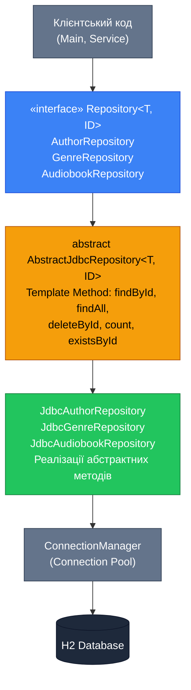
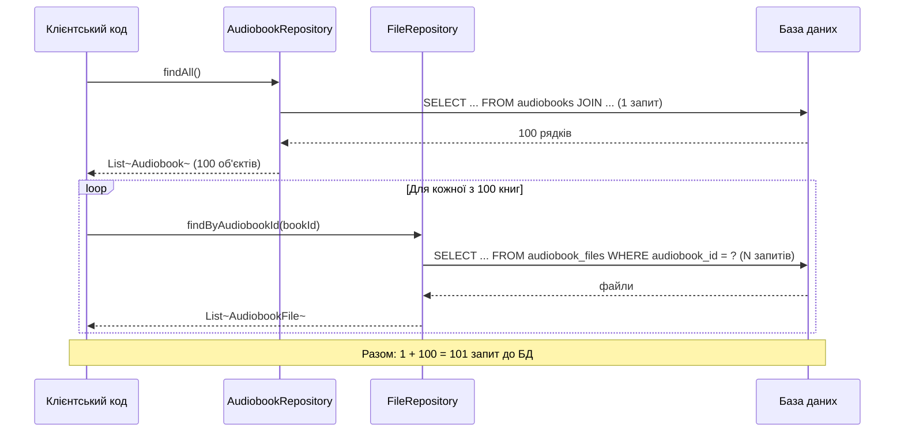

# Repository + Data Mapper: Правильна шарова архітектура з JDBC

## Вступ: Чого бракувало шлюзам

Пройдений нами шлях є показовим прикладом еволюційного проектування. Наївний DAO вирішив проблему безпосереднього SQL у клієнтському коді. Row Data Gateway зосередив маппінг в одному місці. Table Data Gateway розділив доменну модель і SQL-логіку на два незалежних класи.

Але навіть після Table Data Gateway у нашому коді залишаються три невирішені проблеми, що стають дедалі помітнішими при зростанні системи.

**По-перше, структурне дублювання.** Порівняємо методи `findById()` у `AuthorTableGateway` і `GenreTableGateway`:

```java
// AuthorTableGateway.findById()
public Optional<Author> findById(UUID id) {
    try (Connection conn = connectionManager.getConnection();
         PreparedStatement stmt = conn.prepareStatement(SQL_FIND_BY_ID)) {
        stmt.setObject(1, id);
        try (ResultSet rs = stmt.executeQuery()) {
            return rs.next() ? Optional.of(mapRow(rs)) : Optional.empty();
        }
    } catch (SQLException e) {
        throw new DatabaseException("...", e);
    }
}

// GenreTableGateway.findById() — ІДЕНТИЧНА структура
public Optional<Genre> findById(UUID id) {
    try (Connection conn = connectionManager.getConnection();
         PreparedStatement stmt = conn.prepareStatement(SQL_FIND_BY_ID)) {
        stmt.setObject(1, id);
        try (ResultSet rs = stmt.executeQuery()) {
            return rs.next() ? Optional.of(mapRow(rs)) : Optional.empty();
        }
    } catch (SQLException e) {
        throw new DatabaseException("...", e);
    }
}
```

Якщо у системі 10 сутностей — матимемо 10 однакових `findById()`, 10 однакових `findAll()`, 10 однакових `deleteById()`. Це порушення принципу DRY у промисловому масштабі.

**По-друге, відсутність інтерфейсу.** Клієнтський код залежить від конкретних класів: `AuthorTableGateway`, `GenreTableGateway`. Це унеможливлює заміну реалізації без зміни клієнтів — ані для тестування (mock), ані для міграції між СУБД.

**По-третє, транзакції між операціями.** Кожен метод Gateway відкриває власне з'єднання і автоматично комітить. Координувати кілька операцій у межах однієї транзакції неможливо.

Вирішення всіх трьох проблем — це **Repository + Data Mapper**, підхід, що став де-факто стандартом enterprise Java-розробки і лежить в основі Spring Data JPA.

::note
Якщо ви вивчали попередні статті серії (зокрема статті про патерни Data Mapper та Repository із JSON-сховищем), вам знайомий цей підхід концептуально. Тут ми адаптуємо його до JDBC і H2, демонструючи, як абстрактна архітектура проявляється у реальному коді з SQL-запитами.
::

---

## Архітектура рішення

Нова архітектура складається з чотирьох шарів. Кожен шар залежить лише від шару нижче і абсолютно не знає про шари вище:

::mermaid



::

**Ролі кожного шару:**

- **`Repository<T, ID>` (інтерфейс):** контракт, якому відповідають усі репозиторії. Клієнтський код залежить виключно від цього інтерфейсу. Завдяки цьому реалізацію можна замінити (JDBC → JPA, або JDBC → mock для тестів) без зміни жодного рядка клієнтського коду.
- **`AbstractJdbcRepository<T, ID>` (абстрактний клас):** спільна JDBC-логіка для всіх сутностей. Реалізує усі стандартні методи (`findById`, `findAll`, `deleteById`, `count`, `existsById`) через **Template Method Pattern** — алгоритм фіксований, варіативні частини (SQL-запити, маппінг) делегуються підкласам через абстрактні методи.
- **`JdbcAuthorRepository`, `JdbcGenreRepository`, `JdbcAudiobookRepository` (конкретні класи):** реалізують лише специфічні для сутності частини: SQL-запити, маппінг `ResultSet → Object`, встановлення параметрів `PreparedStatement`. Також містять специфічні методи (`findByLastName`, `findByGenre`).

---

## Інтерфейс Repository&lt;T, ID&gt;

Спочатку визначимо спільний контракт. Цей інтерфейс задає мінімальний набір операцій, обов'язковий для будь-якого репозиторію у системі:

```java showLineNumbers
package com.example.audiobook.repository;

import java.util.List;
import java.util.Optional;

/**
 * Базовий контракт репозиторію для роботи з сутностями типу {@code T}
 * з ідентифікатором типу {@code ID}.
 * <p>
 * Клієнтський код залежить лише від цього інтерфейсу — не від конкретних
 * JDBC-реалізацій. Це дозволяє:
 * <ul>
 *   <li>Замінювати реалізацію без змін у клієнтах (JDBC → JPA, JDBC → mock)</li>
 *   <li>Легко створювати тестові заглушки</li>
 *   <li>Дотримуватися принципу інверсії залежностей (DIP)</li>
 * </ul>
 *
 * @param <T>  тип доменної сутності (Author, Genre, Audiobook)
 * @param <ID> тип первинного ключа (зазвичай UUID)
 */
public interface Repository<T, ID> {

    /**
     * Знаходить сутність за первинним ключем.
     *
     * @param id первинний ключ
     * @return {@link Optional} зі знайденою сутністю або {@link Optional#empty()}
     */
    Optional<T> findById(ID id);

    /**
     * Повертає всі сутності.
     * Для великих таблиць рекомендується замість цього методу
     * використовувати пагіновані варіанти (реалізуються у підкласах).
     *
     * @return незмінний або змінний список сутностей
     */
    List<T> findAll();

    /**
     * Зберігає нову сутність.
     * Якщо сутність із таким id вже існує — поведінка залежить від реалізації
     * (зазвичай виключення порушення PK).
     *
     * @param entity сутність для збереження
     */
    void save(T entity);

    /**
     * Оновлює існуючу сутність.
     * ID сутності використовується для ідентифікації запису у сховищі.
     *
     * @param entity сутність з оновленими даними
     */
    void update(T entity);

    /**
     * Видаляє сутність за первинним ключем.
     *
     * @param id первинний ключ
     * @return {@code true} якщо сутність існувала і була видалена
     */
    boolean deleteById(ID id);

    /**
     * Повертає кількість сутностей у сховищі.
     */
    long count();

    /**
     * Перевіряє існування сутності за первинним ключем.
     * Ефективніше за {@code findById(id).isPresent()} — не завантажує дані.
     *
     * @param id первинний ключ
     * @return {@code true} якщо сутність існує
     */
    boolean existsById(ID id);
}
```

Специфічні інтерфейси для кожної сутності розширюють базовий контракт специфічними методами пошуку:

```java showLineNumbers
package com.example.audiobook.repository;

import com.example.audiobook.domain.Author;

import java.util.List;
import java.util.UUID;

/**
 * Специфічний інтерфейс репозиторію для сутності Author.
 * Розширює базовий контракт {@link Repository} методами,
 * специфічними для бізнес-логіки роботи з авторами.
 */
public interface AuthorRepository extends Repository<Author, UUID> {

    /**
     * Знаходить авторів, чиє прізвище містить заданий підрядок.
     * Пошук нечутливий до регістру.
     *
     * @param lastNamePart підрядок прізвища
     * @return список знайдених авторів (може бути порожній)
     */
    List<Author> findByLastName(String lastNamePart);

    /**
     * Знаходить автора за точним прізвищем та ім'ям.
     *
     * @param lastName  прізвище (точний збіг)
     * @param firstName ім'я (точний збіг)
     * @return Optional зі знайденим автором
     */
    java.util.Optional<Author> findByFullName(String lastName, String firstName);
}
```

```java showLineNumbers
package com.example.audiobook.repository;

import com.example.audiobook.domain.Genre;

import java.util.Optional;
import java.util.UUID;

/**
 * Специфічний інтерфейс репозиторію для сутності Genre.
 */
public interface GenreRepository extends Repository<Genre, UUID> {

    /**
     * Знаходить жанр за точною назвою.
     * Зручний для перевірки існування перед створенням нового жанру.
     *
     * @param name точна назва жанру
     */
    Optional<Genre> findByName(String name);
}
```

```java showLineNumbers
package com.example.audiobook.repository;

import com.example.audiobook.domain.Audiobook;

import java.util.List;
import java.util.UUID;

/**
 * Специфічний інтерфейс репозиторію для сутності Audiobook.
 */
public interface AudiobookRepository extends Repository<Audiobook, UUID> {

    /** Знаходить всі аудіокниги заданого автора. */
    List<Audiobook> findByAuthorId(UUID authorId);

    /** Знаходить всі аудіокниги заданого жанру за назвою. */
    List<Audiobook> findByGenreName(String genreName);

    /** Знаходить аудіокниги, ціна яких не перевищує задану суму. */
    List<Audiobook> findByMaxPrice(java.math.BigDecimal maxPrice);
}
```

**Чому три окремих інтерфейси, а не один?** Специфічні методи (`findByLastName`, `findByName`, `findByGenreName`) є сенсовими лише для конкретних сутностей. Якби ми додали їх до базового `Repository<T, ID>`, інтерфейс став би узагальненим до нечитабельності. Окремі інтерфейси дозволяють клієнтському коду декларувати точну залежність:

```java
// Клієнт, що шукає авторів за прізвищем, залежить від AuthorRepository
// — а не від «якогось репозиторію, де є findByLastName»
AuthorRepository authorRepo = new JdbcAuthorRepository(cm);
List<Author> authors = authorRepo.findByLastName("Шевч");
```

---

## AbstractJdbcRepository: Template Method Pattern

Серцем архітектури є абстрактний клас `AbstractJdbcRepository<T, ID>`. Він реалізує **Template Method Pattern** (патерн «Шаблонний метод» з каталогу GoF): алгоритм операції фіксований у базовому класі, а варіативні частини оголошені як `abstract` і реалізуються у підкласах.

Розглянемо, які частини алгоритму `findById()` є **спільними** для всіх сутностей, а які — **специфічними**:

```
findById(id):
  [СПІЛЬНЕ]  отримати Connection з ConnectionManager
  [СПІЛЬНЕ]  підготувати PreparedStatement
  [СПЕЦИФІЧНЕ] який SQL використати → getSelectByIdSql()
  [СПІЛЬНЕ]  встановити параметр id
  [СПІЛЬНЕ]  виконати запит → ResultSet
  [СПЕЦИФІЧНЕ] як перетворити рядок ResultSet на об'єкт → mapRow(rs)
  [СПІЛЬНЕ]  закрити ресурси (try-with-resources)
  [СПІЛЬНЕ]  обробити SQLException → DatabaseException
```

Саме це і реалізує `AbstractJdbcRepository`: спільні частини — у конкретних методах, специфічні — через `abstract`:

```java showLineNumbers
package com.example.audiobook.repository.jdbc;

import com.example.audiobook.db.ConnectionManager;
import com.example.audiobook.db.DatabaseException;
import com.example.audiobook.repository.Repository;

import java.sql.*;
import java.util.ArrayList;
import java.util.List;
import java.util.Optional;

/**
 * Абстрактний базовий клас для JDBC-репозиторіїв.
 * <p>
 * Реалізує патерн Template Method: стандартні CRUD-операції
 * визначені у цьому класі, варіативні частини (SQL, маппінг,
 * встановлення параметрів) делегуються підкласам через abstract-методи.
 * <p>
 * Підкласи зобов'язані реалізувати:
 * <ul>
 *   <li>{@link #mapRow(ResultSet)} — перетворення рядка ResultSet у доменний об'єкт</li>
 *   <li>{@link #getTableName()} — назва таблиці для SELECT COUNT та DELETE</li>
 *   <li>{@link #getSelectByIdSql()} — SQL для пошуку за id</li>
 *   <li>{@link #getSelectAllSql()} — SQL для вибірки всіх записів</li>
 *   <li>{@link #getInsertSql()} — SQL для INSERT</li>
 *   <li>{@link #getUpdateSql()} — SQL для UPDATE</li>
 *   <li>{@link #setInsertParams(PreparedStatement, T)} — параметри для INSERT</li>
 *   <li>{@link #setUpdateParams(PreparedStatement, T)} — параметри для UPDATE</li>
 *   <li>{@link #getId(T)} — отримати ID з сутності (для WHERE у DELETE/EXISTS)</li>
 * </ul>
 *
 * @param <T>  тип доменної сутності
 * @param <ID> тип первинного ключа
 */
public abstract class AbstractJdbcRepository<T, ID> implements Repository<T, ID> {

    /** Менеджер з'єднань — єдина залежність базового класу від інфраструктури. */
    protected final ConnectionManager connectionManager;

    protected AbstractJdbcRepository(ConnectionManager connectionManager) {
        this.connectionManager = connectionManager;
    }

    // =========================================================
    // Абстрактні методи — підкласи зобов'язані їх реалізувати
    // =========================================================

    /**
     * Перетворює поточний рядок ResultSet у доменний об'єкт типу T.
     * Цей метод є реалізацією патерну Data Mapper: він знає, які стовпці
     * ResultSet відповідають яким полям доменного об'єкта.
     *
     * @param rs ResultSet, що вже позиціонований на рядку (rs.next() = true)
     */
    protected abstract T mapRow(ResultSet rs) throws SQLException;

    /** Назва таблиці у БД (наприклад, "authors", "genres"). */
    protected abstract String getTableName();

    /** SQL-запит для пошуку одного запису за первинним ключем. */
    protected abstract String getSelectByIdSql();

    /** SQL-запит для вибірки всіх записів. */
    protected abstract String getSelectAllSql();

    /** SQL-запит для вставки нового запису. */
    protected abstract String getInsertSql();

    /** SQL-запит для оновлення існуючого запису. */
    protected abstract String getUpdateSql();

    /**
     * Встановлює параметри PreparedStatement для INSERT.
     * Метод знає порядок і типи параметрів у {@link #getInsertSql()}.
     *
     * @param stmt   підготовлений запит
     * @param entity сутність, з якої беруться значення параметрів
     */
    protected abstract void setInsertParams(PreparedStatement stmt, T entity)
        throws SQLException;

    /**
     * Встановлює параметри PreparedStatement для UPDATE.
     * Зазвичай id передається останнім параметром (для WHERE id = ?).
     *
     * @param stmt   підготовлений запит
     * @param entity сутність з оновленими даними
     */
    protected abstract void setUpdateParams(PreparedStatement stmt, T entity)
        throws SQLException;

    /**
     * Повертає первинний ключ сутності.
     * Використовується у {@link #deleteById} та {@link #existsById}.
     *
     * @param entity сутність
     * @return первинний ключ типу ID
     */
    protected abstract ID getId(T entity);

    // =========================================================
    // Конкретні реалізації Template Methods
    // =========================================================

    /**
     * Знаходить сутність за первинним ключем.
     * <p>
     * Template Method: алгоритм фіксований, варіативні частини —
     * {@link #getSelectByIdSql()} та {@link #mapRow(ResultSet)}.
     */
    @Override
    public Optional<T> findById(ID id) {
        try (Connection conn = connectionManager.getConnection();
             PreparedStatement stmt = conn.prepareStatement(getSelectByIdSql())) {

            stmt.setObject(1, id); // UUID або інший тип ID

            try (ResultSet rs = stmt.executeQuery()) {
                return rs.next() ? Optional.of(mapRow(rs)) : Optional.empty();
            }

        } catch (SQLException e) {
            throw new DatabaseException(
                "Помилка findById у таблиці " + getTableName() + " для id=" + id, e);
        }
    }

    /**
     * Повертає всі сутності.
     * <p>
     * Template Method: варіативна частина — {@link #getSelectAllSql()}.
     */
    @Override
    public List<T> findAll() {
        List<T> list = new ArrayList<>();

        try (Connection conn = connectionManager.getConnection();
             PreparedStatement stmt = conn.prepareStatement(getSelectAllSql());
             ResultSet rs = stmt.executeQuery()) {

            while (rs.next()) {
                list.add(mapRow(rs));
            }

        } catch (SQLException e) {
            throw new DatabaseException(
                "Помилка findAll у таблиці " + getTableName(), e);
        }
        return list;
    }

    /**
     * Зберігає нову сутність.
     * <p>
     * Template Method: варіативні частини — {@link #getInsertSql()}
     * та {@link #setInsertParams(PreparedStatement, T)}.
     */
    @Override
    public void save(T entity) {
        try (Connection conn = connectionManager.getConnection();
             PreparedStatement stmt = conn.prepareStatement(getInsertSql())) {

            setInsertParams(stmt, entity); // підклас встановлює параметри

            int rows = stmt.executeUpdate();
            if (rows != 1) {
                throw new DatabaseException(
                    "Очікувався 1 вставлений рядок у " + getTableName()
                    + ", отримано: " + rows, null);
            }

        } catch (SQLException e) {
            throw new DatabaseException(
                "Помилка save у таблиці " + getTableName(), e);
        }
    }

    /**
     * Оновлює існуючу сутність.
     * <p>
     * Template Method: варіативні частини — {@link #getUpdateSql()}
     * та {@link #setUpdateParams(PreparedStatement, T)}.
     */
    @Override
    public void update(T entity) {
        try (Connection conn = connectionManager.getConnection();
             PreparedStatement stmt = conn.prepareStatement(getUpdateSql())) {

            setUpdateParams(stmt, entity); // підклас встановлює параметри

            int rows = stmt.executeUpdate();
            if (rows == 0) {
                throw new DatabaseException(
                    "Сутність не знайдена у " + getTableName()
                    + " для оновлення: id=" + getId(entity), null);
            }

        } catch (SQLException e) {
            throw new DatabaseException(
                "Помилка update у таблиці " + getTableName(), e);
        }
    }

    /**
     * Видаляє сутність за первинним ключем.
     * Генерує SQL напряму з {@link #getTableName()} — однаковий для всіх таблиць.
     */
    @Override
    public boolean deleteById(ID id) {
        String sql = "DELETE FROM " + getTableName() + " WHERE id = ?";

        try (Connection conn = connectionManager.getConnection();
             PreparedStatement stmt = conn.prepareStatement(sql)) {

            stmt.setObject(1, id);
            return stmt.executeUpdate() > 0;

        } catch (SQLException e) {
            throw new DatabaseException(
                "Помилка deleteById у таблиці " + getTableName() + " для id=" + id, e);
        }
    }

    /**
     * Повертає кількість записів у таблиці.
     * Генерує SQL напряму з {@link #getTableName()}.
     */
    @Override
    public long count() {
        String sql = "SELECT COUNT(*) FROM " + getTableName();

        try (Connection conn = connectionManager.getConnection();
             PreparedStatement stmt = conn.prepareStatement(sql);
             ResultSet rs = stmt.executeQuery()) {

            rs.next();
            return rs.getLong(1);

        } catch (SQLException e) {
            throw new DatabaseException(
                "Помилка count() у таблиці " + getTableName(), e);
        }
    }

    /**
     * Перевіряє існування запису за id без завантаження даних.
     * «SELECT 1» — найефективніший спосіб перевірки існування.
     */
    @Override
    public boolean existsById(ID id) {
        String sql = "SELECT 1 FROM " + getTableName() + " WHERE id = ? LIMIT 1";

        try (Connection conn = connectionManager.getConnection();
             PreparedStatement stmt = conn.prepareStatement(sql)) {

            stmt.setObject(1, id);
            try (ResultSet rs = stmt.executeQuery()) {
                return rs.next();
            }

        } catch (SQLException e) {
            throw new DatabaseException(
                "Помилка existsById у таблиці " + getTableName() + " для id=" + id, e);
        }
    }
}
```

**Декомпозиція ключових рішень:**

- **Рядки 53–96** (абстрактні методи): вісім `abstract`-методів — це «точки варіації» Template Method. Кожен підклас реалізує лише їх. Загальний алгоритм CRUD (рядки 99–230) написаний один раз і більше ніколи не повторюється.
- **Рядок 49** (`protected final ConnectionManager`): `protected` дозволяє підкласам звертатися до `connectionManager` напряму — для своїх специфічних методів (`findByLastName` тощо), що не входять до базового алгоритму.
- **Рядки 196–198** (`deleteById` генерує SQL): оскільки `DELETE FROM x WHERE id = ?` є повністю однаковим для всіх таблиць (відрізняється лише назва), SQL генерується безпосередньо через `getTableName()`, а не оголошується як `abstract`. Це зменшує кількість методів, що підкласи зобов'язані реалізувати.
- **Рядок 134** (`setInsertParams`): цей метод є **серцем Data Mapper**: він знає, як перетворити об'єкт `T` у параметри SQL-запиту. Кожен підклас реалізує маппінг «поле об'єкта → параметр PreparedStatement» для своєї сутності.

---
## JdbcAuthorRepository: Перша конкретна реалізація

Тепер реалізуємо першу конкретну реалізацію — для сутності `Author`. Завдяки `AbstractJdbcRepository` клас `JdbcAuthorRepository` містить **лише те, що специфічне для авторів**: SQL-запити, маппінг і встановлення параметрів. Жодного шаблонного JDBC-коду.

```java showLineNumbers
package com.example.audiobook.repository.jdbc;

import com.example.audiobook.db.ConnectionManager;
import com.example.audiobook.db.DatabaseException;
import com.example.audiobook.domain.Author;
import com.example.audiobook.repository.AuthorRepository;

import java.sql.*;
import java.util.ArrayList;
import java.util.List;
import java.util.Optional;
import java.util.UUID;

/**
 * JDBC-реалізація {@link AuthorRepository}.
 * <p>
 * Клас реалізує лише специфічні для Author частини:
 * SQL-запити, маппінг ResultSet → Author, параметри PreparedStatement.
 * Стандартні CRUD-операції успадковані від {@link AbstractJdbcRepository}.
 */
public class JdbcAuthorRepository
    extends AbstractJdbcRepository<Author, UUID>
    implements AuthorRepository {

    // SQL-константи: єдиний реєстр SQL для таблиці authors
    private static final String SQL_SELECT_BY_ID = """
        SELECT id, first_name, last_name, bio, image_path
        FROM authors WHERE id = ?
        """;

    private static final String SQL_SELECT_ALL = """
        SELECT id, first_name, last_name, bio, image_path
        FROM authors ORDER BY last_name, first_name
        """;

    private static final String SQL_INSERT = """
        INSERT INTO authors (id, first_name, last_name, bio, image_path)
        VALUES (?, ?, ?, ?, ?)
        """;

    private static final String SQL_UPDATE = """
        UPDATE authors
        SET first_name = ?, last_name = ?, bio = ?, image_path = ?
        WHERE id = ?
        """;

    // Специфічні SQL для методів AuthorRepository
    private static final String SQL_FIND_BY_LAST_NAME = """
        SELECT id, first_name, last_name, bio, image_path
        FROM authors
        WHERE LOWER(last_name) LIKE LOWER(?)
        ORDER BY last_name, first_name
        """;

    private static final String SQL_FIND_BY_FULL_NAME = """
        SELECT id, first_name, last_name, bio, image_path
        FROM authors
        WHERE last_name = ? AND first_name = ?
        """;

    public JdbcAuthorRepository(ConnectionManager connectionManager) {
        super(connectionManager);
    }

    // === Реалізація абстрактних методів AbstractJdbcRepository ===

    /**
     * Data Mapper: ResultSet → Author.
     * Єдине місце у класі, де знаються назви стовпців таблиці authors.
     */
    @Override
    protected Author mapRow(ResultSet rs) throws SQLException {
        return new Author(
            rs.getObject("id", UUID.class),
            rs.getString("first_name"),
            rs.getString("last_name"),
            rs.getString("bio"),        // null → java null
            rs.getString("image_path")  // null → java null
        );
    }

    @Override
    protected String getTableName()     { return "authors"; }

    @Override
    protected String getSelectByIdSql() { return SQL_SELECT_BY_ID; }

    @Override
    protected String getSelectAllSql()  { return SQL_SELECT_ALL; }

    @Override
    protected String getInsertSql()     { return SQL_INSERT; }

    @Override
    protected String getUpdateSql()     { return SQL_UPDATE; }

    /**
     * Data Mapper: Author → параметри INSERT PreparedStatement.
     * Порядок параметрів відповідає {@link #SQL_INSERT}: id, first_name, last_name, bio, image_path.
     */
    @Override
    protected void setInsertParams(PreparedStatement stmt, Author author) throws SQLException {
        stmt.setObject(1, author.getId());
        stmt.setString(2, author.getFirstName());
        stmt.setString(3, author.getLastName());
        stmt.setString(4, author.getBio());       // null-safe: setString(i, null) → SQL NULL
        stmt.setString(5, author.getImagePath()); // null-safe
    }

    /**
     * Data Mapper: Author → параметри UPDATE PreparedStatement.
     * Порядок: first_name, last_name, bio, image_path, id (id — в умові WHERE, останній).
     */
    @Override
    protected void setUpdateParams(PreparedStatement stmt, Author author) throws SQLException {
        stmt.setString(1, author.getFirstName());
        stmt.setString(2, author.getLastName());
        stmt.setString(3, author.getBio());
        stmt.setString(4, author.getImagePath());
        stmt.setObject(5, author.getId()); // id — завжди останній (WHERE id = ?)
    }

    @Override
    protected UUID getId(Author author) { return author.getId(); }

    // === Специфічні методи AuthorRepository ===

    /**
     * Знаходить авторів за частиною прізвища (регістр-незалежний пошук).
     * Використовує SQL LIKE з підстановками % з обох боків.
     */
    @Override
    public List<Author> findByLastName(String lastNamePart) {
        List<Author> list = new ArrayList<>();

        try (Connection conn = connectionManager.getConnection();
             PreparedStatement stmt = conn.prepareStatement(SQL_FIND_BY_LAST_NAME)) {

            stmt.setString(1, "%" + lastNamePart + "%");
            try (ResultSet rs = stmt.executeQuery()) {
                while (rs.next()) {
                    list.add(mapRow(rs)); // повторне використання mapRow!
                }
            }

        } catch (SQLException e) {
            throw new DatabaseException(
                "Помилка findByLastName для: " + lastNamePart, e);
        }
        return list;
    }

    /**
     * Знаходить автора за точним прізвищем та ім'ям.
     * Якщо є кілька авторів з однаковим ім'ям — повертає першого.
     */
    @Override
    public Optional<Author> findByFullName(String lastName, String firstName) {
        try (Connection conn = connectionManager.getConnection();
             PreparedStatement stmt = conn.prepareStatement(SQL_FIND_BY_FULL_NAME)) {

            stmt.setString(1, lastName);
            stmt.setString(2, firstName);
            try (ResultSet rs = stmt.executeQuery()) {
                return rs.next() ? Optional.of(mapRow(rs)) : Optional.empty();
            }

        } catch (SQLException e) {
            throw new DatabaseException(
                "Помилка findByFullName для: " + lastName + " " + firstName, e);
        }
    }
}
```

**Ключові спостереження:**

- **Рядки 69–79** (`mapRow`): метод є реалізацією **Data Mapper Pattern** у чистому вигляді — він знає, що стовпець `first_name` відповідає полю `firstName`. Жоден інший метод класу не знає цього.
- **Рядки 98–104** (`setInsertParams`): симетричне відображення у зворотному напрямку — з поля `author.getFirstName()` у параметр `first_name`. Разом `mapRow` і `setInsertParams` утворюють повний двонаправлений Data Mapper.
- **Рядки 130–145** (`findByLastName`): специфічний метод повторно використовує `mapRow()` — єдину точку маппінгу. Це і є перевага `mapRow` як окремого методу: його можна викликати з будь-якого місця репозиторію.
- **Рядки 88–93** (однорядкові геттери): реалізація абстрактних методів, що повертають SQL-константи — суто декларативна, без логіки.

---

## JdbcGenreRepository

Репозиторій для жанрів є ще більш компактним — він демонструє, як мало коду потрібно для нової сутності завдяки `AbstractJdbcRepository`:

```java showLineNumbers
package com.example.audiobook.repository.jdbc;

import com.example.audiobook.db.ConnectionManager;
import com.example.audiobook.db.DatabaseException;
import com.example.audiobook.domain.Genre;
import com.example.audiobook.repository.GenreRepository;

import java.sql.*;
import java.util.Optional;
import java.util.UUID;

/**
 * JDBC-реалізація {@link GenreRepository}.
 */
public class JdbcGenreRepository
    extends AbstractJdbcRepository<Genre, UUID>
    implements GenreRepository {

    private static final String SQL_SELECT_BY_ID = """
        SELECT id, name, description FROM genres WHERE id = ?
        """;
    private static final String SQL_SELECT_ALL = """
        SELECT id, name, description FROM genres ORDER BY name
        """;
    private static final String SQL_INSERT = """
        INSERT INTO genres (id, name, description) VALUES (?, ?, ?)
        """;
    private static final String SQL_UPDATE = """
        UPDATE genres SET name = ?, description = ? WHERE id = ?
        """;
    private static final String SQL_FIND_BY_NAME = """
        SELECT id, name, description FROM genres WHERE name = ?
        """;

    public JdbcGenreRepository(ConnectionManager connectionManager) {
        super(connectionManager);
    }

    @Override
    protected Genre mapRow(ResultSet rs) throws SQLException {
        return new Genre(
            rs.getObject("id", UUID.class),
            rs.getString("name"),
            rs.getString("description") // null → java null
        );
    }

    @Override
    protected String getTableName()     { return "genres"; }

    @Override
    protected String getSelectByIdSql() { return SQL_SELECT_BY_ID; }

    @Override
    protected String getSelectAllSql()  { return SQL_SELECT_ALL; }

    @Override
    protected String getInsertSql()     { return SQL_INSERT; }

    @Override
    protected String getUpdateSql()     { return SQL_UPDATE; }

    @Override
    protected void setInsertParams(PreparedStatement stmt, Genre genre) throws SQLException {
        stmt.setObject(1, genre.getId());
        stmt.setString(2, genre.getName());
        stmt.setString(3, genre.getDescription()); // null-safe
    }

    @Override
    protected void setUpdateParams(PreparedStatement stmt, Genre genre) throws SQLException {
        stmt.setString(1, genre.getName());
        stmt.setString(2, genre.getDescription());
        stmt.setObject(3, genre.getId()); // id — останній (WHERE)
    }

    @Override
    protected UUID getId(Genre genre) { return genre.getId(); }

    /**
     * Специфічний метод: пошук жанру за точною назвою.
     * Корисний для перевірки існування перед вставкою нового жанру.
     */
    @Override
    public Optional<Genre> findByName(String name) {
        try (Connection conn = connectionManager.getConnection();
             PreparedStatement stmt = conn.prepareStatement(SQL_FIND_BY_NAME)) {

            stmt.setString(1, name);
            try (ResultSet rs = stmt.executeQuery()) {
                return rs.next() ? Optional.of(mapRow(rs)) : Optional.empty();
            }

        } catch (SQLException e) {
            // Обробляємо UNIQUE-виключення при спробі зберегти дублікат
            if (e.getSQLState() != null && e.getSQLState().startsWith("23")) {
                throw new DatabaseException(
                    "Жанр з назвою '" + name + "' вже існує", e);
            }
            throw new DatabaseException("Помилка findByName для жанру: " + name, e);
        }
    }
}
```

Зверніть, наскільки компактним є `JdbcGenreRepository`: приблизно **90 рядків** Java-коду для повноцінного репозиторію зі всіма CRUD-операціями плюс специфічний метод `findByName`. Для порівняння: аналогічний `GenreTableGateway` без успадкування займав понад 150 рядків. Абстрактний базовий клас усунув ~40% шаблонного коду.

---

## JdbcAudiobookRepository: JOIN-маппінг і N+1 Problem

`JdbcAudiobookRepository` є найцікавішою частиною реалізації, оскільки демонструє взаємодію Data Mapper із складними об'єктними зв'язками. Аудіокнига у Java-моделі містить `Author author` і `Genre genre` як повноцінні об'єкти, тоді як у базі — лише `author_id UUID` та `genre_id UUID`. Це і є той самий Impedance Mismatch зі статті 09, що проявляється на практиці.

Через наявність JOIN-запитів для читання `JdbcAudiobookRepository` не може повністю покладатися на `AbstractJdbcRepository` для всіх читаючих операцій: базовий `SELECT_ALL` у абстрактному класі не знає про JOIN. Тому ми перевизначаємо `getSelectAllSql()` і `getSelectByIdSql()` з JOIN-версіями, а `mapRow()` реалізуємо із вкладеним маппінгом.

```java showLineNumbers
package com.example.audiobook.repository.jdbc;

import com.example.audiobook.db.ConnectionManager;
import com.example.audiobook.db.DatabaseException;
import com.example.audiobook.domain.Author;
import com.example.audiobook.domain.Audiobook;
import com.example.audiobook.domain.Genre;
import com.example.audiobook.repository.AudiobookRepository;

import java.math.BigDecimal;
import java.sql.*;
import java.time.LocalDate;
import java.util.ArrayList;
import java.util.List;
import java.util.UUID;

/**
 * JDBC-реалізація {@link AudiobookRepository}.
 * <p>
 * Читаючі операції використовують JOIN для завантаження
 * пов'язаних об'єктів Author та Genre в одному запиті.
 * Записуючі операції зберігають лише id зв'язаних сутностей (FK).
 */
public class JdbcAudiobookRepository
    extends AbstractJdbcRepository<Audiobook, UUID>
    implements AudiobookRepository {

    /**
     * Базовий SELECT з JOIN до authors та genres.
     * Псевдоніми стовпців вирішують конфлікт назв:
     * усі три таблиці мають стовпець "id" та "description".
     */
    private static final String SQL_BASE_SELECT = """
        SELECT ab.id,
               ab.title, ab.year, ab.language, ab.price,
               ab.description   AS ab_description,
               ab.created_at,
               a.id             AS author_id,
               a.first_name,    a.last_name,
               a.bio,           a.image_path,
               g.id             AS genre_id,
               g.name           AS genre_name,
               g.description    AS genre_description
        FROM audiobooks ab
        JOIN authors a ON ab.author_id = a.id
        JOIN genres  g ON ab.genre_id  = g.id
        """;

    private static final String SQL_SELECT_BY_ID =
        SQL_BASE_SELECT + "WHERE ab.id = ?";

    private static final String SQL_SELECT_ALL =
        SQL_BASE_SELECT + "ORDER BY ab.title";

    private static final String SQL_FIND_BY_AUTHOR =
        SQL_BASE_SELECT + "WHERE a.id = ? ORDER BY ab.title";

    private static final String SQL_FIND_BY_GENRE_NAME =
        SQL_BASE_SELECT + "WHERE g.name = ? ORDER BY ab.title";

    private static final String SQL_FIND_BY_MAX_PRICE =
        SQL_BASE_SELECT + "WHERE ab.price <= ? ORDER BY ab.price, ab.title";

    private static final String SQL_INSERT = """
        INSERT INTO audiobooks
          (id, title, author_id, genre_id, year, language, price, description)
        VALUES (?, ?, ?, ?, ?, ?, ?, ?)
        """;

    private static final String SQL_UPDATE = """
        UPDATE audiobooks
        SET title       = ?,
            author_id   = ?,
            genre_id    = ?,
            year        = ?,
            language    = ?,
            price       = ?,
            description = ?
        WHERE id = ?
        """;

    public JdbcAudiobookRepository(ConnectionManager connectionManager) {
        super(connectionManager);
    }

    // === Реалізація абстрактних методів ===

    /**
     * Data Mapper: ResultSet → Audiobook з вкладеними Author та Genre.
     * <p>
     * Порядок маппінгу: спочатку будуємо вкладені об'єкти (Author, Genre),
     * потім збираємо кореневий об'єкт (Audiobook).
     * <p>
     * Псевдоніми стовпців (author_id, genre_id, genre_name, genre_description,
     * ab_description) критично важливі для уникнення конфліктів назв між таблицями.
     */
    @Override
    protected Audiobook mapRow(ResultSet rs) throws SQLException {

        // Крок 1: відновити вкладені об'єкти з JOIN-рядка
        Author author = new Author(
            rs.getObject("author_id", UUID.class),
            rs.getString("first_name"),
            rs.getString("last_name"),
            rs.getString("bio"),
            rs.getString("image_path")
        );

        Genre genre = new Genre(
            rs.getObject("genre_id", UUID.class),
            rs.getString("genre_name"),
            rs.getString("genre_description") // null → java null
        );

        // Крок 2: зібрати кореневий об'єкт
        return new Audiobook(
            rs.getObject("id", UUID.class),
            rs.getString("title"),
            author,   // повноцінний об'єкт, а не UUID
            genre,    // повноцінний об'єкт, а не UUID
            rs.getObject("year", Integer.class),       // null-safe Integer
            rs.getString("language"),
            rs.getBigDecimal("price"),                 // null → java null
            rs.getString("ab_description"),            // псевдонім!
            rs.getObject("created_at", LocalDate.class) // null-safe LocalDate
        );
    }

    @Override
    protected String getTableName()     { return "audiobooks"; }

    @Override
    protected String getSelectByIdSql() { return SQL_SELECT_BY_ID; }

    @Override
    protected String getSelectAllSql()  { return SQL_SELECT_ALL; }

    @Override
    protected String getInsertSql()     { return SQL_INSERT; }

    @Override
    protected String getUpdateSql()     { return SQL_UPDATE; }

    /**
     * Data Mapper (зворотній напрямок): Audiobook → параметри INSERT.
     * Зберігаємо лише ID пов'язаних сутностей (FK), не самі об'єкти.
     */
    @Override
    protected void setInsertParams(PreparedStatement stmt, Audiobook book) throws SQLException {
        stmt.setObject(1, book.getId());
        stmt.setString(2, book.getTitle());
        stmt.setObject(3, book.getAuthor().getId()); // author → author_id (FK)
        stmt.setObject(4, book.getGenre().getId());  // genre  → genre_id  (FK)
        stmt.setObject(5, book.getYear());           // Integer, null-safe через setObject
        stmt.setString(6, book.getLanguage());
        stmt.setBigDecimal(7, book.getPrice());      // null → SQL NULL
        stmt.setString(8, book.getDescription());    // null → SQL NULL
    }

    @Override
    protected void setUpdateParams(PreparedStatement stmt, Audiobook book) throws SQLException {
        stmt.setString(1, book.getTitle());
        stmt.setObject(2, book.getAuthor().getId()); // author_id
        stmt.setObject(3, book.getGenre().getId());  // genre_id
        stmt.setObject(4, book.getYear());
        stmt.setString(5, book.getLanguage());
        stmt.setBigDecimal(6, book.getPrice());
        stmt.setString(7, book.getDescription());
        stmt.setObject(8, book.getId());             // id — в умові WHERE
    }

    @Override
    protected UUID getId(Audiobook book) { return book.getId(); }

    // === Специфічні методи AudiobookRepository ===

    /**
     * Знаходить усі аудіокниги заданого автора.
     *
     * @param authorId UUID автора
     */
    @Override
    public List<Audiobook> findByAuthorId(UUID authorId) {
        List<Audiobook> list = new ArrayList<>();

        try (Connection conn = connectionManager.getConnection();
             PreparedStatement stmt = conn.prepareStatement(SQL_FIND_BY_AUTHOR)) {

            stmt.setObject(1, authorId);
            try (ResultSet rs = stmt.executeQuery()) {
                while (rs.next()) list.add(mapRow(rs));
            }

        } catch (SQLException e) {
            throw new DatabaseException(
                "Помилка findByAuthorId для authorId=" + authorId, e);
        }
        return list;
    }

    /**
     * Знаходить усі аудіокниги заданого жанру за назвою жанру.
     *
     * @param genreName точна назва жанру
     */
    @Override
    public List<Audiobook> findByGenreName(String genreName) {
        List<Audiobook> list = new ArrayList<>();

        try (Connection conn = connectionManager.getConnection();
             PreparedStatement stmt = conn.prepareStatement(SQL_FIND_BY_GENRE_NAME)) {

            stmt.setString(1, genreName);
            try (ResultSet rs = stmt.executeQuery()) {
                while (rs.next()) list.add(mapRow(rs));
            }

        } catch (SQLException e) {
            throw new DatabaseException(
                "Помилка findByGenreName для жанру: " + genreName, e);
        }
        return list;
    }

    /**
     * Знаходить аудіокниги з ціною, що не перевищує задану суму.
     *
     * @param maxPrice максимальна ціна включно
     */
    @Override
    public List<Audiobook> findByMaxPrice(BigDecimal maxPrice) {
        List<Audiobook> list = new ArrayList<>();

        try (Connection conn = connectionManager.getConnection();
             PreparedStatement stmt = conn.prepareStatement(SQL_FIND_BY_MAX_PRICE)) {

            stmt.setBigDecimal(1, maxPrice);
            try (ResultSet rs = stmt.executeQuery()) {
                while (rs.next()) list.add(mapRow(rs));
            }

        } catch (SQLException e) {
            throw new DatabaseException(
                "Помилка findByMaxPrice для ціни: " + maxPrice, e);
        }
        return list;
    }
}
```

### Анатомія методу `mapRow()` у JdbcAudiobookRepository

Метод `mapRow()` у рядках 91–121 є найскладнішим маппінгом у нашій системі. Він реалізує двохетапну стратегію:

**Етап 1 (рядки 93–107):** із JOIN-рядка відновлюємо вкладені доменні об'єкти. Колонки з псевдонімами `author_id`, `genre_name`, `genre_description` дозволяють однозначно ідентифікувати, яка колонка належить якій таблиці.

**Етап 2 (рядки 110–121):** збираємо кореневий об'єкт `Audiobook`, передаючи вже готові `author` і `genre` у конструктор. Клієнтський код отримує повноцінний об'єктний граф без будь-яких додаткових запитів.

::warning
Зверніть увагу на псевдонім `ab_description` (рядок 38 SQL). Без нього `rs.getString("description")` повернуло б значення залежно від того, яку колонку `description` JDBC-драйвер зустрів першою у рядку результату — поведінка залежить від реалізації драйвера. Псевдоніми для всіх неоднозначних стовпців є обов'язковими при JOIN-маппінгу.
::

### Проблема N+1: де вона у нашій реалізації?

Наш `JdbcAudiobookRepository` вирішує один рівень зв'язків (Audiobook → Author, Audiobook → Genre) через JOIN. Але що, якщо `Audiobook` має ще й `List<AudiobookFile> files`? Розглянемо наївний варіант:

```java
// Наївний підхід: N+1 queries
List<Audiobook> books = audiobookRepo.findAll(); // 1 запит

for (Audiobook book : books) {
    // Для кожної книги — окремий запит до audiobook_files
    List<AudiobookFile> files = fileRepo.findByAudiobookId(book.getId()); // N запитів
    book.setFiles(files);
}
// Разом: 1 + N запитів. При 100 книгах = 101 запит.
```

::mermaid



::

Ця проблема — **N+1** — є класичним патерном неефективності при роботі з колекціями пов'язаних об'єктів. Вирішення: патерн **Lazy Loading** (відкладене завантаження) через **Proxy**, який ми детально розглянемо у статті 18. Саме для вирішення N+1 ORM-фреймворки на кшталт Hibernate мають складні стратегії завантаження: EAGER, LAZY, BATCH, SUBSELECT.

---

## Демонстрація: Клієнтський код через інтерфейс

Найважливіша ознака правильної архітектури — клієнтський код **не знає про JDBC**. Він залежить лише від інтерфейсів `AuthorRepository`, `GenreRepository`, `AudiobookRepository`:

```java showLineNumbers
package com.example.audiobook;

import com.example.audiobook.db.ConnectionManager;
import com.example.audiobook.domain.Author;
import com.example.audiobook.domain.Audiobook;
import com.example.audiobook.domain.Genre;
import com.example.audiobook.repository.AudiobookRepository;
import com.example.audiobook.repository.AuthorRepository;
import com.example.audiobook.repository.GenreRepository;
import com.example.audiobook.repository.jdbc.JdbcAudiobookRepository;
import com.example.audiobook.repository.jdbc.JdbcAuthorRepository;
import com.example.audiobook.repository.jdbc.JdbcGenreRepository;

import java.math.BigDecimal;
import java.util.List;

public class Main {

    public static void main(String[] args) {

        // Ініціалізація інфраструктури — тільки тут згадується "Jdbc"
        ConnectionManager cm = ConnectionManager.forH2("./data/audiobook_db");

        // Залежності оголошені через ІНТЕРФЕЙСИ
        // Якщо завтра перейдемо на JPA — замінимо лише ці 3 рядки
        AuthorRepository    authorRepo = new JdbcAuthorRepository(cm);
        GenreRepository     genreRepo  = new JdbcGenreRepository(cm);
        AudiobookRepository bookRepo   = new JdbcAudiobookRepository(cm);

        // --- 1. Збереження авторів ---
        Author shevchenko = new Author("Тарас", "Шевченко");
        Author franko     = new Author("Іван", "Franко");
        Author lesia      = new Author("Леся", "Українка");

        authorRepo.save(shevchenko);
        authorRepo.save(franko);
        authorRepo.save(lesia);
        System.out.println("✓ Авторів збережено: " + authorRepo.count());

        // --- 2. Збереження жанрів ---
        Genre poetry = new Genre("Поезія");
        Genre drama  = new Genre("Драма");
        Genre prose  = new Genre("Проза");

        genreRepo.save(poetry);
        genreRepo.save(drama);
        genreRepo.save(prose);

        // --- 3. Збереження аудіокниг ---
        Audiobook kobzar = new Audiobook("Кобзар", shevchenko, poetry);
        kobzar.setYear(1840);
        kobzar.setLanguage("uk");
        kobzar.setPrice(new BigDecimal("149.99"));

        Audiobook lісоваpisnia = new Audiobook("Лісова пісня", lesia, drama);
        lісоваpisnia.setYear(1911);
        lісоваpisnia.setLanguage("uk");
        lісоваpisnia.setPrice(new BigDecimal("89.00"));

        Audiobook zakhar = new Audiobook("Захар Беркут", franko, prose);
        zakhar.setYear(1883);
        zakhar.setLanguage("uk");
        zakhar.setPrice(new BigDecimal("109.50"));

        bookRepo.save(kobzar);
        bookRepo.save(lісоваpisnia);
        bookRepo.save(zakhar);
        System.out.println("✓ Аудіокниг збережено: " + bookRepo.count());

        // --- 4. Читання з повним об'єктним графом ---
        System.out.println("\n✓ Всі аудіокниги:");
        bookRepo.findAll().forEach(b ->
            System.out.printf("   «%s» — %s [%s]%n",
                b.getTitle(),
                b.getAuthor().fullName(), // obj навігація!
                b.getGenre().getName()    // obj навігація!
            )
        );

        // --- 5. Специфічні запити через AuthorRepository ---
        System.out.println("\n✓ Пошук авторів 'Укр':");
        authorRepo.findByLastName("Укр").forEach(a ->
            System.out.println("   → " + a.fullName())
        );

        // --- 6. Специфічні запити через AudiobookRepository ---
        System.out.println("\n✓ Поезії:");
        bookRepo.findByGenreName("Поезія").forEach(b ->
            System.out.println("   → " + b.getTitle())
        );

        System.out.println("\n✓ Книги до 120 грн:");
        bookRepo.findByMaxPrice(new BigDecimal("120.00")).forEach(b ->
            System.out.printf("   → «%s» — %.2f грн%n", b.getTitle(), b.getPrice())
        );

        // --- 7. Оновлення через репозиторій ---
        shevchenko.setBio("Великий поет, художник і мислитель (1814–1861).");
        authorRepo.update(shevchenko);

        authorRepo.findById(shevchenko.getId())
            .ifPresent(a -> System.out.println("\n✓ Збережена біо: " + a.getBio()));

        // --- 8. Перевірка existsById та deleteById ---
        System.out.println("\n✓ Лесія існує: " + authorRepo.existsById(lesia.getId()));
        // Видалення неможливе через FK (lesia → lісоваpisnia) — перехоплюємо
        // Спочатку видалимо книгу
        bookRepo.deleteById(lісоваpisnia.getId());
        authorRepo.deleteById(lesia.getId());
        System.out.println("✓ Лесія після видалення: " + authorRepo.existsById(lesia.getId()));
        System.out.println("✓ Залишилось авторів: " + authorRepo.count());

        cm.close();
    }
}
```

Результат виконання:

::terminal-preview{title="java Main" :cursor="false"}
<div class="line"><span class="opacity-40">$</span> <strong class="font-bold">java -cp . com.example.audiobook.Main</strong></div>
<div class="line"><span class="text-blue-400 font-bold">[Pool]</span> Ініціалізовано: 2 з'єднань готові</div>
<div class="line"><span class="text-green-400 font-bold">✓</span> Авторів збережено: 3</div>
<div class="line"><span class="text-green-400 font-bold">✓</span> Аудіокниг збережено: 3</div>
<div class="line"></div>
<div class="line"><span class="text-green-400 font-bold">✓</span> Всі аудіокниги:</div>
<div class="line">   «Захар Беркут» — Franко Іван [Проза]</div>
<div class="line">   «Кобзар» — Шевченко Тарас [Поезія]</div>
<div class="line">   «Лісова пісня» — Українка Леся [Драма]</div>
<div class="line"></div>
<div class="line"><span class="text-green-400 font-bold">✓</span> Пошук авторів 'Укр':</div>
<div class="line">   → Українка Леся</div>
<div class="line"></div>
<div class="line"><span class="text-green-400 font-bold">✓</span> Поезії:</div>
<div class="line">   → Кобзар</div>
<div class="line"></div>
<div class="line"><span class="text-green-400 font-bold">✓</span> Книги до 120 грн:</div>
<div class="line">   → «Лісова пісня» — 89.00 грн</div>
<div class="line">   → «Захар Беркут» — 109.50 грн</div>
<div class="line"></div>
<div class="line"><span class="text-green-400 font-bold">✓</span> Збережена біо: Великий поет, художник і мислитель (1814–1861).</div>
<div class="line"></div>
<div class="line"><span class="text-green-400 font-bold">✓</span> Лесія існує: true</div>
<div class="line"><span class="text-green-400 font-bold">✓</span> Лесія після видалення: false</div>
<div class="line"><span class="text-green-400 font-bold">✓</span> Залишилось авторів: 2</div>
<div class="line"><span class="text-blue-400 font-bold">[Pool]</span> Закрито. Закрито 2 з'єднань</div>
::

Рядки 24–26 є архітектурно найважливішими: зміна `new JdbcAuthorRepository(cm)` на `new JpaAuthorRepository(em)` або `new InMemoryAuthorRepository()` — і жоден наступний рядок `Main` не потребує змін. Це і є **принцип інверсії залежностей (DIP)** у дії.

---

## Порівняння з попередніми підходами

Підсумуємо, що додав кожен патерн у нашій еволюції:

| Характеристика | Наївний DAO | Row Data Gateway | Table Data Gateway | Repository + Data Mapper |
|---|:---:|:---:|:---:|:---:|
| Маппінг в одному місці | ❌ | ✅ | ✅ | ✅ |
| Доменний об'єкт без SQL | ✅ | ❌ | ✅ | ✅ |
| SRP-відповідність | ❌ | ❌ | ✅ | ✅ |
| Без шаблонного дублювання | ❌ | ❌ | ❌ | ✅ |
| Інтерфейс / поліморфізм | ❌ | ❌ | ❌ | ✅ |
| Тестованість без БД (mock) | ❌ | ❌ | ❌ | ✅ |
| JOIN-маппінг зв'язків | ❌ | ❌ | ✅ | ✅ |

Repository + Data Mapper — перший підхід, що має всі «✅» у критичних рядках. Саме тому він є стандартом у Spring Data, Hibernate, Micronaut Data та інших enterprise-фреймворках Java.

::card-group

::card{title="Template Method у AbstractJdbcRepository" icon="i-heroicons-squares-2x2"}

Шаблонний метод фіксує алгоритм CRUD, делегуючи варіативні частини підкласам. Результат: нова сутність вимагає лише ~90 рядків специфічного коду замість ~200+ повного репозиторію.

::

::card{title="Data Mapper у mapRow + setParams" icon="i-heroicons-arrows-right-left"}

`mapRow()` і `setInsertParams()`/`setUpdateParams()` утворюють двонаправлений Data Mapper: `ResultSet → Object` і `Object → PreparedStatement`. Єдиний реєстр відповідності полів і стовпців.

::

::card{title="Repository Interface" icon="i-heroicons-shield-check"}

Інтерфейс `Repository<T,ID>` відокремлює контракт від реалізації. Клієнти залежать від інтерфейсу, реалізації — від JDBC. DIP у дії.

::

::

---

## Підсумок

У цій статті ми завершили побудову правильної шарової архітектури доступу до даних з JDBC. Три патерни разом дають синергетичний ефект:

- **Repository Pattern** забезпечує типобезпечний контракт між доменним і інфраструктурним шарами
- **Template Method** у `AbstractJdbcRepository` усуває структурне дублювання JDBC-коду
- **Data Mapper** у `mapRow()` і `setParams()` забезпечує чисте двонаправлене перетворення між об'єктами і рядками таблиць

Залишкові проблеми — N+1 для колекцій, транзакції між репозиторіями, жорстке кодування SQL — є предметом наступних статей серії:
- **Стаття 15:** Identity Map — кешування завантажених об'єктів у рамках сесії
- **Стаття 16:** Unit of Work — координація змін і транзакцій
- **Стаття 17:** Strategy Pattern — винесення SQL у замінювані стратегії
- **Стаття 18:** Proxy + Lazy Loading — вирішення проблеми N+1

---

## Завдання

::collapsible{title="Рівень 1: UserRepository — реалізація через AbstractJdbcRepository"}

Реалізуйте `JdbcUserRepository` для таблиці `users`:

```sql
CREATE TABLE users (
    id            UUID PRIMARY KEY,
    username      VARCHAR(64)  NOT NULL UNIQUE,
    email         VARCHAR(255) NOT NULL UNIQUE,
    password_hash VARCHAR(255) NOT NULL,
    created_at    TIMESTAMP DEFAULT CURRENT_TIMESTAMP
);
```

1. Створіть інтерфейс `UserRepository extends Repository<User, UUID>` з методами `findByUsername(String)` та `findByEmail(String)`.
2. Реалізуйте `JdbcUserRepository extends AbstractJdbcRepository<User, UUID>`.
3. `created_at` — тільки для читання (не передається в INSERT явно, генерується БД через `DEFAULT`). Як це відобразиться у `setInsertParams()`?
4. Переконайтеся, що `save()` обробляє порушення UNIQUE для `username` та `email`.
::

::collapsible{title="Рівень 2: Пагінація у AbstractJdbcRepository"}

Додайте підтримку пагінації до базового репозиторію:

1. Додайте до `Repository<T, ID>` метод `findAll(int page, int pageSize)`.
2. Реалізуйте його в `AbstractJdbcRepository` за допомогою SQL `LIMIT ? OFFSET ?` (H2 та PostgreSQL підтримують цей синтаксис).
3. `OFFSET = (page - 1) * pageSize` (нумерація сторінок з 1).
4. Переконайтеся, що підкласи успадковують пагінований `findAll()` без додаткового коду.
5. Перевірте на `JdbcAuthorRepository`: збережіть 10 авторів, виведіть по 3 на сторінку.
::

::collapsible{title="Рівень 3: InMemoryAuthorRepository для тестування"}

Продемонструйте цінність інтерфейсу `AuthorRepository` — реалізуйте його **без JDBC** для використання у тестах:

```java
public class InMemoryAuthorRepository implements AuthorRepository {
    private final Map<UUID, Author> store = new LinkedHashMap<>();
    // реалізація через Map — без жодного SQL
}
```

Вимоги:
1. `findById`, `findAll`, `save`, `update`, `deleteById`, `count`, `existsById` — через `Map<UUID, Author>`.
2. `findByLastName` — пошук у `store.values()` через `stream().filter()`.
3. `findByFullName` — аналогічно через stream.
4. Напишіть демонстрацію: використайте `InMemoryAuthorRepository` у `Main` замість `JdbcAuthorRepository` — **жоден інший рядок Main не повинен змінитися**. Це підтвердить, що інтерфейс дійсно забезпечує підставність реалізацій.
::

