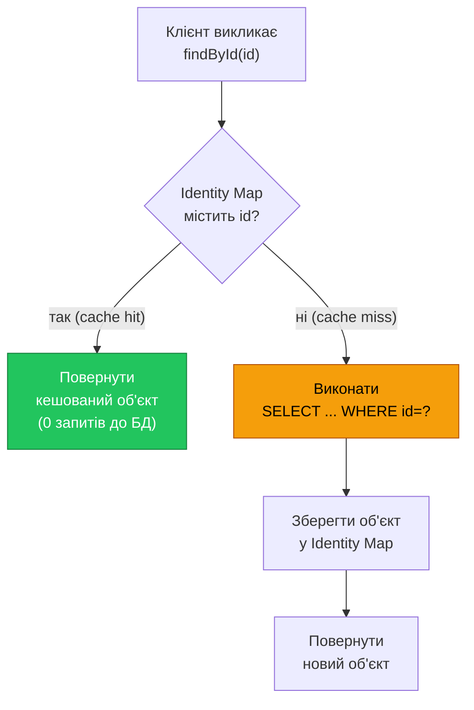
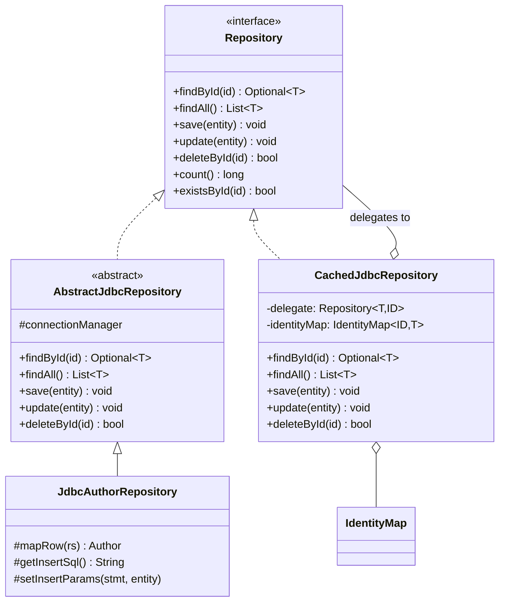
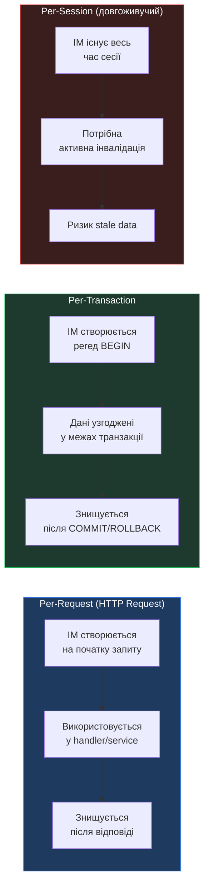

# Identity Map: Кешування сутностей у рамках сесії

## Вступ: Коли два об'єкти — це один і той самий автор

Розглянемо типовий сценарій у нашому репозиторії аудіоплатформи. Бізнес-логіка виконує дві операції в рамках однієї транзакції: отримати автора для побудови звіту і окремо — для перевірки прав доступу.

```java
AuthorRepository repo = new JdbcAuthorRepository(cm);

UUID tarasId = taras.getId();

// Перший виклик — SELECT з БД
Author author1 = repo.findById(tarasId).orElseThrow();

// ... кілька рядків бізнес-логіки ...

// Другий виклик — знову SELECT з БД
Author author2 = repo.findById(tarasId).orElseThrow();

// Здається, це один автор — але Java каже інакше
System.out.println(author1 == author2);           // false — різні об'єкти в пам'яті
System.out.println(author1.equals(author2));       // true — якщо equals через id

// Оновлюємо через перший об'єкт
author1.setFirstName("Тарас");
repo.update(author1);

// Другий об'єкт — застарілий! Він досі зберігає старе ім'я.
System.out.println(author2.getFirstName()); // ← старе значення
```

Ця ситуація демонструє три окремих проблеми, що поглиблюють одна одну:

**По-перше, надлишкові запити до бази даних.** Кожен виклик `findById()` виконує `SELECT`-запит, навіть якщо ми вже завантажили цей об'єкт секунду тому. При складному сценарії — збереження аудіокниги (що завантажує автора), перевірка рекомендацій (що знову завантажує того самого автора), побудова відповіді API (ще один `findById`) — кількість зайвих запитів може вимірюватися десятками за одну HTTP-сесію.

**По-друге, розбіжність стану.** Коли два різних фрагменти коду тримають посилання на «однакову» сутність, зміна через одне посилання не відображається в іншому. Система має суперечливий стан у пам'яті.

**По-третє, порушення семантики ідентичності.** У реляційній базі даних сутність **однозначно** визначається своїм первинним ключем — один `UUID` відповідає одному рядку. У Java-програмі без додаткових механізмів той самий рядок може бути представлений скількома завгодно різними об'єктами одночасно. Це і є той самий **Impedance Mismatch** у питанні ідентичності, що ми описували у статті 09.

Рішення — **Identity Map**.

---

## Концепція: Що таке Identity Map

**Identity Map** (Фаулер, *Patterns of Enterprise Application Architecture*, 2002):

> *«Ensures that each object gets loaded only once by keeping every loaded object in a map. Looks up objects using the map when referring to them.»*
>
> *«Гарантує, що кожен об'єкт завантажується лише один раз, зберігаючи кожен завантажений об'єкт у Map. При зверненні до об'єктів шукає їх у цьому Map.»*

Identity Map — це **реєстр** завантажених об'єктів, організований за первинним ключем. Перш ніж звертатися до бази даних, репозиторій перевіряє: «чи є цей об'єкт вже в пам'яті?». Якщо так — повертає його з кешу. Якщо ні — завантажує з БД і кладе у кеш для майбутніх звернень.

::mermaid



::

Ключова гарантія Identity Map: **для одного первинного ключа завжди існує не більше одного Java-об'єкта в пам'яті**. Це вирішує всі три проблеми одночасно:
- Зайвий `SELECT` не виконується при повторному `findById`
- Обидва посилання (`author1` і `author2`) вказують на **один і той самий об'єкт** у пам'яті
- Семантика ідентичності Java (`==`) збігається з семантикою БД (первинний ключ)

---

## Реалізація `IdentityMap<ID, T>`

Identity Map є самостійним компонентом з єдиною відповідальністю: зберігати і повертати об'єкти за їх ідентифікаторами. Він не знає ані про SQL, ані про конкретні сутності — це чистий кеш.

```java showLineNumbers
package com.example.audiobook.persistence;

import java.util.HashMap;
import java.util.Map;
import java.util.Optional;

/**
 * Identity Map — реєстр завантажених об'єктів, індексований за первинним ключем.
 * <p>
 * Гарантує, що для кожного значення ключа {@code ID} у пам'яті існує
 * не більше одного екземпляра типу {@code T}. При повторному запиті
 * з тим самим ключем повертає той самий об'єкт (не копію), що:
 * <ul>
 *   <li>усуває зайві SELECT-запити до БД;</li>
 *   <li>підтримує узгодженість стану у рамках сесії;</li>
 *   <li>вирівнює семантику ідентичності Java та реляційної БД.</li>
 * </ul>
 *
 * <p><b>Область видимості:</b> один екземпляр Identity Map повинен
 * існувати в межах однієї логічної одиниці роботи (запит, транзакція
 * або сесія). Він <em>не є</em> глобальним або thread-safe кешем.
 *
 * @param <ID> тип первинного ключа (наприклад, {@code UUID})
 * @param <T>  тип доменної сутності (наприклад, {@code Author})
 */
public class IdentityMap<ID, T> {

    /**
     * Внутрішнє сховище: первинний ключ → екземпляр сутності.
     * <p>
     * Використовуємо {@link HashMap} (не {@link java.util.concurrent.ConcurrentHashMap}),
     * оскільки Identity Map призначений для однопотокового використання
     * у рамках однієї сесії/транзакції.
     */
    private final Map<ID, T> store = new HashMap<>();

    /**
     * Шукає об'єкт у кеші за первинним ключем.
     *
     * @param id первинний ключ
     * @return {@link Optional} з об'єктом, якщо він раніше був завантажений;
     *         {@link Optional#empty()} якщо cache miss
     */
    public Optional<T> get(ID id) {
        return Optional.ofNullable(store.get(id));
    }

    /**
     * Реєструє об'єкт у кеші після завантаження з БД.
     * <p>
     * Якщо об'єкт з таким {@code id} вже зареєстрований — він буде замінений.
     * Зазвичай це не має відбуватися у нормальному потоці роботи.
     *
     * @param id     первинний ключ
     * @param entity завантажений об'єкт
     */
    public void put(ID id, T entity) {
        store.put(id, entity);
    }

    /**
     * Видаляє об'єкт із кешу.
     * <p>
     * Викликається після успішного {@code DELETE} або при явній інвалідації
     * (наприклад, у {@link com.example.audiobook.repository.CachedJdbcRepository#deleteById}).
     *
     * @param id первинний ключ
     */
    public void remove(ID id) {
        store.remove(id);
    }

    /**
     * Перевіряє, чи об'єкт з даним ключем зареєстрований у кеші.
     *
     * @param id первинний ключ
     * @return {@code true} якщо cache hit
     */
    public boolean contains(ID id) {
        return store.containsKey(id);
    }

    /**
     * Очищає весь кеш.
     * <p>
     * Викликається в кінці сесії або при явному скиданні стану.
     * Після виклику наступний {@code findById} знову звернеться до БД.
     */
    public void clear() {
        store.clear();
    }

    /**
     * Повертає кількість об'єктів у кеші.
     * Корисно для діагностики та тестів.
     */
    public int size() {
        return store.size();
    }
}
```

Клас навмисно мінімалістичний: **сім публічних методів**, жодного SQL, жодної залежності від конкретних доменних типів. Параметризація `<ID, T>` дозволяє створювати окремий `IdentityMap` для кожної сутності без дублювання коду.

---
## CachedJdbcRepository: Інтеграція Identity Map з Repository

Маючи готовий `IdentityMap<ID, T>`, наступний крок — інтегрувати його з існуючою архітектурою репозиторіїв зі статті 14. Ми могли б додати кеш прямо в `AbstractJdbcRepository`, але це порушило б **принцип єдиної відповідальності**: абстрактний репозиторій відповідає за JDBC-операції, а не за кешування.

Кращий підхід — **Decorator Pattern**: створити проміжний клас `CachedJdbcRepository<T, ID>`, що обгортає будь-який `Repository<T, ID>` і додає кешування, не змінюючи оригінального коду.

::mermaid



::

```java showLineNumbers
package com.example.audiobook.repository;

import com.example.audiobook.persistence.IdentityMap;

import java.util.List;
import java.util.Optional;

/**
 * Декоратор для будь-якого {@link Repository}, що додає кешування
 * через {@link IdentityMap}.
 * <p>
 * Реалізує патерн Decorator (GoF): делегує всі операції wrapped-репозиторію,
 * перехоплюючи {@code findById} і {@code save/update/delete} для підтримки
 * кешу в актуальному стані.
 * <p>
 * <b>Контракт:</b>
 * <ul>
 *   <li>{@code findById} — спочатку кеш, потім БД;</li>
 *   <li>{@code findAll} — завжди БД (наповнює кеш результатами);</li>
 *   <li>{@code save} — зберігає в БД і додає у кеш;</li>
 *   <li>{@code update} — оновлює в БД і інвалідує (оновлює) кеш;</li>
 *   <li>{@code deleteById} — видаляє з БД і з кешу.</li>
 * </ul>
 *
 * @param <T>  тип доменної сутності
 * @param <ID> тип первинного ключа
 */
public class CachedJdbcRepository<T, ID> implements Repository<T, ID> {

    /** Обгорнутий репозиторій: виконує реальні SQL-операції. */
    private final Repository<T, ID> delegate;

    /** Кеш завантажених об'єктів у межах поточної сесії. */
    private final IdentityMap<ID, T> identityMap;

    /** Функція отримання ID з сутності — потрібна для put/remove у кеш. */
    private final java.util.function.Function<T, ID> idExtractor;

    /**
     * @param delegate    реальний репозиторій (наприклад, JdbcAuthorRepository)
     * @param idExtractor функція для отримання ID з сутності (Author::getId)
     */
    public CachedJdbcRepository(
            Repository<T, ID> delegate,
            java.util.function.Function<T, ID> idExtractor) {
        this.delegate = delegate;
        this.idExtractor = idExtractor;
        this.identityMap = new IdentityMap<>();
    }

    /**
     * Знаходить сутність за ID.
     * <p>
     * <b>Логіка:</b>
     * <ol>
     *   <li>Перевірити Identity Map — cache hit? Повернути об'єкт.</li>
     *   <li>Cache miss → делегувати у wrapped repository (SQL SELECT).</li>
     *   <li>Зареєструвати знайдений об'єкт у Identity Map.</li>
     * </ol>
     */
    @Override
    public Optional<T> findById(ID id) {
        // Крок 1: перевірка кешу
        Optional<T> cached = identityMap.get(id);
        if (cached.isPresent()) {
            return cached;  // cache hit — SELECT не виконується
        }

        // Крок 2: cache miss — завантажити з БД
        Optional<T> fromDb = delegate.findById(id);

        // Крок 3: зареєструвати у кеші (якщо знайдено)
        fromDb.ifPresent(entity -> identityMap.put(id, entity));

        return fromDb;
    }

    /**
     * Повертає всі сутності.
     * <p>
     * <b>Стратегія:</b> завжди звертається до БД (не можна знати, чи кеш
     * є повним). Заповнює кеш усіма завантаженими об'єктами — наступні
     * {@code findById} будуть cache hit.
     */
    @Override
    public List<T> findAll() {
        // Завжди звертаємось до БД: не знаємо, чи всі записи вже у кеші
        List<T> all = delegate.findAll();

        // Наповнюємо кеш: наступний findById вже не піде в БД
        all.forEach(entity -> identityMap.put(idExtractor.apply(entity), entity));

        return all;
    }

    /**
     * Зберігає нову сутність.
     * <p>
     * Делегує в БД, потім реєструє сутність у кеші.
     */
    @Override
    public void save(T entity) {
        delegate.save(entity);
        // Після успішного INSERT реєструємо у кеші
        identityMap.put(idExtractor.apply(entity), entity);
    }

    /**
     * Оновлює існуючу сутність.
     * <p>
     * Делегує в БД, потім оновлює кеш — замінює старий об'єкт новим.
     * Це гарантує, що наступний {@code findById} поверне актуальний стан.
     */
    @Override
    public void update(T entity) {
        delegate.update(entity);
        // Інвалідуємо і оновлюємо кеш: кладемо новий об'єкт
        identityMap.put(idExtractor.apply(entity), entity);
    }

    /**
     * Видаляє сутність за ID.
     * <p>
     * Делегує в БД, потім видаляє з кешу.
     * Без цього кроку {@code findById} після видалення знайшов би
     * об'єкт у кеші і повернув би його — навіть якщо рядку вже немає у БД.
     */
    @Override
    public boolean deleteById(ID id) {
        boolean deleted = delegate.deleteById(id);
        if (deleted) {
            identityMap.remove(id);  // обов'язкова інвалідація
        }
        return deleted;
    }

    @Override
    public long count() {
        return delegate.count();  // делегуємо без кешування
    }

    @Override
    public boolean existsById(ID id) {
        // Якщо є у кеші — точно існує; якщо немає — запитуємо БД
        return identityMap.contains(id) || delegate.existsById(id);
    }

    /**
     * Повертає Identity Map для доступу до метаданих кешу.
     * Корисно для тестів та діагностики.
     */
    public IdentityMap<ID, T> getIdentityMap() {
        return identityMap;
    }
}
```

### Анатомія методу `findById()` (рядки 61–75)

Метод є серцем Identity Map і демонструє класичний **Cache-Aside** патерн у трьох рядках:

1. **Рядок 63** — `identityMap.get(id)`: перевірити кеш. Якщо знайдено — повернути негайно. Жодного SQL-запиту.
2. **Рядок 68** — `delegate.findById(id)`: кеш порожній — делегувати у реальний репозиторій. Виконується `SELECT ... WHERE id = ?`.
3. **Рядок 71** — `identityMap.put(id, entity)`: зареєструвати результат у кеші. Наступний `findById` для того самого `id` буде cache hit.

### Чому `findAll()` завжди йде в БД (рядки 83–90)

Цей вибір є свідомим архітектурним рішенням. Кеш не є «повним» — він містить лише ті об'єкти, що були раніше завантажені через `findById` або `save`. Якби ми повернули `identityMap.values()` замість запиту до БД, ми пропустили б нові записи, додані іншими транзакціями.

Натомість ми використовуємо `findAll` як **можливість наповнити кеш**: після його виконання всі завантажені об'єкти реєструються в `identityMap`, і наступні `findById` стають cache hit.

---

## Демонстрація: Ефект Identity Map

```java showLineNumbers
package com.example.audiobook;

import com.example.audiobook.db.ConnectionManager;
import com.example.audiobook.domain.Author;
import com.example.audiobook.repository.AuthorRepository;
import com.example.audiobook.repository.CachedJdbcRepository;
import com.example.audiobook.repository.jdbc.JdbcAuthorRepository;

import java.util.UUID;

public class Main {

    public static void main(String[] args) {

        ConnectionManager cm = ConnectionManager.forH2("./data/audiobook_db");

        // Підклад: реальний JDBC-репозиторій
        JdbcAuthorRepository jdbcRepo = new JdbcAuthorRepository(cm);

        // Обгортка: той самий AuthorRepository, але з Identity Map
        // Author::getId — функція вилучення ID для put/remove у кеш
        AuthorRepository repo = new CachedJdbcRepository<>(jdbcRepo, Author::getId);

        // Зберегти автора
        Author shevchenko = new Author("Тарас", "Шевченко");
        repo.save(shevchenko);
        UUID id = shevchenko.getId();

        System.out.println("=== Перший findById ===");
        Author a1 = repo.findById(id).orElseThrow();
        // → cache miss: виконується SELECT
        // → об'єкт кладеться у Identity Map

        System.out.println("=== Другий findById (той самий id) ===");
        Author a2 = repo.findById(id).orElseThrow();
        // → cache hit: SELECT НЕ виконується

        // Перевірка семантики ідентичності
        System.out.println("a1 == a2: " + (a1 == a2));   // true — ОДИН і той самий об'єкт
        System.out.println("a1 id:    " + System.identityHashCode(a1));
        System.out.println("a2 id:    " + System.identityHashCode(a2));
        // Обидва System.identityHashCode однакові — це буквально той самий об'єкт

        System.out.println("=== Зміна через a1, читання через a2 ===");
        a1.setFirstName("Тарасик");   // змінюємо через перше посилання
        System.out.println("a2.getFirstName() = " + a2.getFirstName());
        // "Тарасик" — бо a1 і a2 — це той самий об'єкт у пам'яті!

        System.out.println("=== Оновлення в БД та інвалідація кешу ===");
        a1.setFirstName("Тарас");      // повернули правильне ім'я
        repo.update(a1);               // UPDATE в БД + оновлення кешу

        System.out.println("=== Видалення та перевірка кешу ===");
        boolean deleted = repo.deleteById(id);
        System.out.println("Видалено: " + deleted);

        // Після deleteById об'єкт вилучений з кешу
        // Наступний findById знову піде в БД — і не знайде запис
        Author a3 = repo.findById(id).orElse(null);
        System.out.println("Знайдено після видалення: " + a3);  // null

        cm.close();
    }
}
```

Ключовий момент у рядках 38–42: `a1 == a2` повертає `true`. Це означає, що Java-оператор `==` (порівняння посилань, а не значень) дає `true` для двох об'єктів, отриманих двома окремими викликами `findById`. Identity Map зрівняв семантику **Java-ідентичності** (`==`) та **реляційної ідентичності** (первинний ключ).

::terminal-preview{title="java Main" :cursor="false"}
<div class="line"><span class="opacity-40">$</span> <strong>java -cp . com.example.audiobook.Main</strong></div>
<div class="line"><span class="text-blue-400 font-bold">[Pool]</span> Ініціалізовано: 2 з'єднань готові</div>
<div class="line"></div>
<div class="line"><span class="font-bold">=== Перший findById ===</span></div>
<div class="line"><span class="text-yellow-400">[SQL]</span> SELECT id, first_name, last_name, bio, image_path FROM authors WHERE id = ?</div>
<div class="line"><span class="text-green-400">✓</span> Завантажено з БД, кешовано</div>
<div class="line"></div>
<div class="line"><span class="font-bold">=== Другий findById (той самий id) ===</span></div>
<div class="line"><span class="text-green-400">✓</span> <em>Cache hit — SQL не виконується</em></div>
<div class="line"></div>
<div class="line">a1 == a2: <span class="text-green-400 font-bold">true</span></div>
<div class="line">a1 id:    <span class="text-blue-400">1923847562</span></div>
<div class="line">a2 id:    <span class="text-blue-400">1923847562</span></div>
<div class="line"></div>
<div class="line"><span class="font-bold">=== Зміна через a1, читання через a2 ===</span></div>
<div class="line">a2.getFirstName() = <span class="text-green-400">Тарасик</span></div>
<div class="line"></div>
<div class="line"><span class="font-bold">=== Видалення та перевірка кешу ===</span></div>
<div class="line"><span class="text-yellow-400">[SQL]</span> DELETE FROM authors WHERE id = ?</div>
<div class="line">Видалено: true</div>
<div class="line"><span class="text-yellow-400">[SQL]</span> SELECT id, first_name, last_name FROM authors WHERE id = ?</div>
<div class="line">Знайдено після видалення: <span class="text-red-400">null</span></div>
<div class="line"><span class="text-blue-400 font-bold">[Pool]</span> Закрито. Закрито 2 з'єднань</div>
::

## Область видимості Identity Map

Одне з найважливіших архітектурних рішень при впровадженні Identity Map — **визначити його область видимості**: скільки часу і для якого контексту він існує. Фаулер виділяє три основних рівні.

::mermaid



::

### Per-Request: Один кеш на один HTTP-запит

Найбезпечніший і найпоширеніший підхід у веб-застосунках. Identity Map живе рівно стільки, скільки виконується обробка одного запиту: створюється на початку та знищується разом із відповіддю.

```java
// Псевдокод HTTP-обробника (Spring-стиль без Spring)
public Response handleGetAudiobook(UUID audiobookId) {
    // Новий CachedJdbcRepository = новий IdentityMap для цього запиту
    AuthorRepository authorRepo =
        new CachedJdbcRepository<>(new JdbcAuthorRepository(cm), Author::getId);

    // Навіть якщо логіка тричі завантажує автора — SELECT виконається один раз
    Audiobook book = buildAudiobookResponse(audiobookId, authorRepo);
    return Response.ok(book);
    // CachedJdbcRepository виходить зі scope → Identity Map знищується
}
```

**Переваги:** Жодних проблем зі stale data між запитами. Жодних проблем із конкурентністю — кожен запит ізольований. **Недоліки:** Кеш не переживає між запитами — якщо той самий автор потрібен у двох різних HTTP-запитах, `SELECT` виконається двічі.

### Per-Transaction: Один кеш на одну JDBC-транзакцію

Identity Map є частиною транзакційного контексту. Це природна межа для JDBC-систем: усередині транзакції дані повинні бути узгодженими, тому кеш гарантовано актуальний.

```java
// Усі операції в межах однієї транзакції використовують один IM
try (Connection conn = cm.getConnection()) {
    conn.setAutoCommit(false);

    CachedJdbcRepository<Author, UUID> authorRepo =
        new CachedJdbcRepository<>(new JdbcAuthorRepository(cm), Author::getId);

    Author author = authorRepo.findById(id1).orElseThrow(); // SELECT
    Author same   = authorRepo.findById(id1).orElseThrow(); // cache hit!

    author.setBio("Оновлена біографія");
    authorRepo.update(author);

    conn.commit();
    // IdentityMap виходить зі scope разом із транзакцією
}
```

### Per-Session: Довгоживучий кеш

Identity Map живе протягом всієї сесії користувача (або application-context). Це те, що робить Hibernate `SessionFactory` з L2 Cache та JPA EntityManager.

::warning
Per-session Identity Map вимагає **активної інвалідації**: при оновленні або видаленні запису необхідно явно видалити його з кешу, інакше інший потік або наступний запит того самого користувача прочитає застарілі дані. Без правильної інвалідації система стає джерелом важковловимих багів.
::

---

## Проблеми Identity Map

Незважаючи на очевидні переваги, Identity Map вносить кілька нетривіальних проблем, що необхідно розуміти перед впровадженням.

### Проблема 1: Stale Data (застарілі дані)

Найнебезпечніший сценарій: два паралельних потоки або два HTTP-запити одночасно завантажують один і той самий об'єкт. Перший оновлює його у БД і у своєму кеші. Другий — досі тримає старий об'єкт у своєму кеші.

```
Потік A:  findById(42) → cache miss → SELECT → author{name="Тарас"} → кеш
Потік B:  findById(42) → cache miss → SELECT → author{name="Тарас"} → кеш

Потік A:  author.setName("Тарас Григорович") → update() → UPDATE у БД → кеш A оновлено
Потік B:  findById(42) → cache hit → повертає author{name="Тарас"} ← ЗАСТАРІЛІ ДАНІ!
```

Вирішення для per-request: кеш ізольований між потоками — кожен запит має власний `CachedJdbcRepository`. Stale data неможливі в межах одного запиту.

### Проблема 2: Витік пам'яті при per-session кеші

Якщо Identity Map живе довго, він накопичує об'єкти без звільнення. При роботі з великими колекціями (завантаження всіх аудіокниг через `findAll`) кеш може рости необмежено.

**Рішення:** обмежена місткість кешу з витісненням по LRU (Least Recently Used). Або стратегія `WeakHashMap` — Java автоматично видаляє записи, коли на об'єкт більше немає сильних посилань.

```java
// Варіант з WeakHashMap — автоматичне звільнення при GC
private final Map<ID, T> store = new java.util.WeakHashMap<>();
// Увага: не підходить якщо є тільки посилання через кеш — об'єкт може зникнути!
```

### Проблема 3: Відсутність thread-safety

`HashMap`, що використовується у нашій реалізації `IdentityMap`, **не є потокобезпечним**. При спільному доступі з кількох потоків необхідно або:

- Використовувати `ConcurrentHashMap` (але тоді треба carefully handle `get+put` atomicity)
- Або обмежити область видимості Identity Map одним потоком (per-request у thread-per-request моделі)

::note
У сучасних Java-фреймворках (Spring, Quarkus) кожен HTTP-запит обробляється в одному потоці протягом усієї обробки (virtual threads у Project Loom або bounded thread pool). Per-request Identity Map із `HashMap` є безпечним у цьому контексті — жодна зовнішня синхронізація не потрібна.
::

### Проблема 4: Неповнота кешу для `findAll`

Наша реалізація `findAll()` наповнює кеш, але не позначає кеш як «повний». Після виклику `findAll()` клієнтський код міг би теоретично пропустити `SELECT` і повернути `identityMap.values()`. Але ми цього не робимо — і правильно: між `findAll()` і наступним зверненням інші операції могли додати нові рядки.

```java
// Неправильна оптимізація (не робимо):
@Override
public List<T> findAll() {
    if (allLoaded) {
        return new ArrayList<>(identityMap.values()); // небезпечно!
    }
    // ...
}
// Чому небезпечно: інша транзакція могла додати запис після нашого findAll.
// Флаг allLoaded = true → ми пропустили новий запис.
```

Правильне рішення — ніколи не вважати кеш «повним» без явного механізму блокування нових вставок (що виходить за рамки Identity Map).

---

## Підсумок

::card-group

::card{title="Що вирішує Identity Map" icon="i-heroicons-check-circle"}

- Усуває зайві `SELECT`-запити при повторних `findById`
- Гарантує єдиний екземпляр об'єкта на ключ у рамках сесії
- Вирівнює семантику `==` Java з PK-ідентичністю реляційної моделі
- Реалізується через Decorator — без зміни існуючого коду

::

::card{title="Обмеження та застереження" icon="i-heroicons-exclamation-triangle"}

- Per-session кеш потребує активної інвалідації
- `findAll()` завжди звертається до БД
- `HashMap` не є thread-safe для спільного доступу
- Не усуває N+1 (це завдання Lazy Loading зі статті 18)

::

::

Identity Map є першим компонентом того, що Фаулер назвав **Session State**: механізмів підтримки узгодженого стану об'єктів протягом однієї одиниці роботи. У наступній статті ми розглянемо **Unit of Work** — компонент, що доповнює Identity Map: він не лише кешує завантажені об'єкти, а й відстежує їх зміни та координує збереження у правильному порядку.

---

## Завдання

::collapsible{title="Рівень 1: Замір ефекту кешування"}

Реалізуйте лічильник SQL-запитів у `ConnectionManager` або у `JdbcAuthorRepository` (наприклад, `AtomicInteger queryCount`). Потім виконайте два сценарії:

**Без кешу:**
```java
AuthorRepository repo = new JdbcAuthorRepository(cm);
for (int i = 0; i < 10; i++) {
    repo.findById(someId); // скільки разів SELECT?
}
```

**З кешем:**
```java
AuthorRepository repo = new CachedJdbcRepository<>(new JdbcAuthorRepository(cm), Author::getId);
for (int i = 0; i < 10; i++) {
    repo.findById(someId); // скільки разів SELECT?
}
```

Виведіть кількість запитів. Очікуваний результат: 10 vs 1. Перевірте також сценарій із `findAll()` → `findById()`: скільки `SELECT` виконається після `findAll()`?
::

::collapsible{title="Рівень 2: WeakHashMap і автоматична інвалідація"}

Модифікуйте `IdentityMap`, щоб він підтримував два режими зберігання:

```java
public enum CacheMode {
    STRONG,  // HashMap — стандартний режим
    WEAK     // WeakHashMap — об'єкти видаляються GC при відсутності зовнішніх посилань
}

public class IdentityMap<ID, T> {
    private final Map<ID, T> store;

    public IdentityMap(CacheMode mode) {
        this.store = mode == CacheMode.WEAK
            ? new java.util.WeakHashMap<>()
            : new HashMap<>();
    }
}
```

Напишіть демонстрацію: завантажте автора у `WEAK`-кеш, переведіть всі посилання у `null`, примусово запустіть GC (`System.gc()`). Перевірте, чи `identityMap.contains(id)` повертає `false`. Поясніть, чому `WeakHashMap` підходить для per-session кешу але не для per-transaction.
::

::collapsible{title="Рівень 3: Thread-safe Identity Map"}

Реалізуйте `ConcurrentIdentityMap<ID, T>` на основі `ConcurrentHashMap` із атомарними операціями `computeIfAbsent`:

```java
public Optional<T> getOrLoad(ID id, java.util.function.Function<ID, Optional<T>> loader) {
    // computeIfAbsent гарантує атомарність get + put
    // loader — лямбда, що виконує SELECT при cache miss
    T result = store.computeIfAbsent(id, key ->
        loader.apply(key).orElse(null)
    );
    return Optional.ofNullable(result);
}
```

Напишіть тест на конкурентність: 10 потоків одночасно викликають `getOrLoad()` для одного і того самого `id`. Переконайтеся, що `loader` викликається **рівно один раз** (за допомогою `AtomicInteger callCount`). Порівняйте результат з наївним `HashMap` без синхронізації — скільки разів `loader` викличеться у race condition?
::

