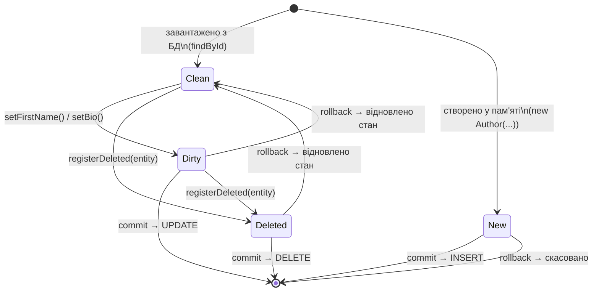
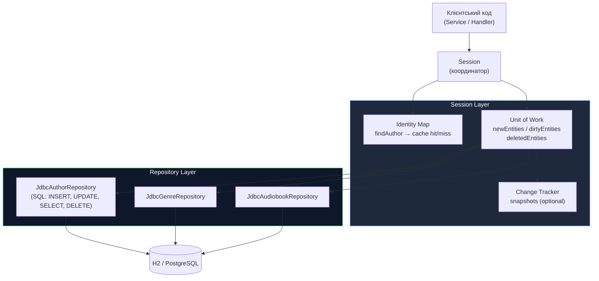

# Unit of Work: Відстеження змін і координація JDBC-транзакцій

## Вступ: Коли кожен `save()` — це окрема транзакція

Повернімося до репозиторіїв зі статті 14. Розглянемо типовий бізнес-сценарій: реєстрація нової аудіокниги з прив'язкою до автора і жанру, де і жанр, і автор можуть бути новими.

```java
AuthorRepository    authorRepo = new JdbcAuthorRepository(cm);
GenreRepository     genreRepo  = new JdbcGenreRepository(cm);
AudiobookRepository bookRepo   = new JdbcAudiobookRepository(cm);

Author author = new Author("Іван", "Франко");
Genre  genre  = new Genre("Проза");
Audiobook book = new Audiobook("Захар Беркут", author, genre);

// Три окремих INSERT — три окремих транзакції
authorRepo.save(author);  // BEGIN; INSERT INTO authors...; COMMIT
genreRepo.save(genre);    // BEGIN; INSERT INTO genres...;  COMMIT
bookRepo.save(book);      // BEGIN; INSERT INTO audiobooks...; COMMIT
```

Що станеться, якщо третій `save()` — `bookRepo.save(book)` — кине виключення? Наприклад, порушення зовнішнього ключа або мережева помилка?

```
✅ INSERT INTO authors   → COMMIT (автор існує у БД)
✅ INSERT INTO genres    → COMMIT (жанр існує у БД)
❌ INSERT INTO audiobooks → ROLLBACK (книга НЕ збережена)
```

База даних тепер містить **orphan-записи**: автора і жанр, що не пов'язані з жодною книгою. Для системи, що не має механізму відстеження незавершених операцій, очистити цей стан вручну — нетривіальне завдання.

Але навіть якщо помилки немає, три окремих `BEGIN/COMMIT` — це три окремих **roundtrip** до бази даних. Для складних операцій (наприклад, оновлення 20 сутностей у рамках одного бізнес-процесу) це 20 непотрібних network-операцій і 20 пар lock/unlock на рівні БД.

**Фундаментальна проблема:** репозиторії зі статті 14 не мають поняття «одиниця роботи». Кожен виклик `save()` або `update()` є самостійним і атомарним сам по собі. Але бізнес-операції рідко є атомарними на рівні однієї сутності — вони охоплюють кілька пов'язаних змін, що мають або всі разом зафіксуватися, або всі разом відкотитися.

---

## Концепція: Unit of Work за Фаулером

**Unit of Work** (Фаулер, *Patterns of Enterprise Application Architecture*, 2002):

> *«Maintains a list of objects affected by a business transaction and coordinates the writing out of changes and the resolution of concurrency problems.»*
>
> *«Підтримує список об'єктів, уражених бізнес-транзакцією, і координує запис змін та вирішення проблем конкурентності.»*

Unit of Work — це **реєстр змін**, що накопичує всі операції протягом бізнес-транзакції (не JDBC-транзакції!) і виконує їх всі разом в одній JDBC-транзакції при виклику `commit()`. Якщо будь-яка операція провалюється — `rollback()` відміняє всі зміни.

### Три категорії відстежуваних об'єктів

Фаулер визначає три списки, що Unit of Work підтримує одночасно:

::mermaid



::

- **New (нові):** об'єкти, що були створені у Java-пам'яті, але ще не збережені у БД. При `commit()` — `INSERT`.
- **Dirty (брудні):** об'єкти, що були завантажені з БД і змінені. При `commit()` — `UPDATE`.
- **Deleted (видалені):** об'єкти, що мають бути видалені з БД. При `commit()` — `DELETE`.

**Порядок виконання при `commit()`** є критично важливим. Unit of Work повинен виконати операції у правильній послідовності, щоб не порушити FK-обмеження:

```
INSERT authors     (перед INSERT audiobooks, що містить author_id FK)
INSERT genres      (перед INSERT audiobooks, що містить genre_id FK)
INSERT audiobooks  (після authors і genres)
UPDATE ...         (в будь-якому порядку)
DELETE audiobooks  (перед DELETE authors/genres через FK)
DELETE authors     (після DELETE audiobooks)
DELETE genres      (після DELETE audiobooks)
```

---

## Реалізація: Інтерфейс і стани

Перш ніж реалізовувати сам `UnitOfWork`, визначимо його публічний контракт. Unit of Work є суттєво більш складним компонентом, ніж `IdentityMap`, і потребує чіткого розмежування відповідальностей.

```java showLineNumbers
package com.example.audiobook.persistence;

/**
 * Контракт Unit of Work: реєстр змін бізнес-транзакції.
 * <p>
 * Unit of Work накопичує усі зміни, виконані протягом бізнес-операції,
 * і записує їх в БД в одній JDBC-транзакції при {@link #commit()}.
 * <p>
 * <b>Типовий цикл використання:</b>
 * <pre>{@code
 * UnitOfWork uow = new JdbcUnitOfWork(connectionManager);
 * try {
 *     Author author = new Author("Тарас", "Шевченко");
 *     uow.registerNew(author);
 *
 *     Genre genre = uow.load(genreId); // завантажити існуючий
 *     genre.setDescription("...");
 *     uow.registerDirty(genre);
 *
 *     uow.commit();
 * } catch (Exception e) {
 *     uow.rollback();
 *     throw e;
 * }
 * }</pre>
 */
public interface UnitOfWork {

    /**
     * Реєструє новий об'єкт для вставки до БД при {@link #commit()}.
     * Об'єкт не повинен мати запису у БД — при {@code commit()} буде виконано {@code INSERT}.
     *
     * @param entity новий об'єкт
     * @throws IllegalStateException якщо об'єкт вже зареєстрований в іншій категорії
     */
    void registerNew(Object entity);

    /**
     * Реєструє існуючий об'єкт як змінений (dirty).
     * При {@link #commit()} буде виконано {@code UPDATE}.
     * Повторний виклик для вже зареєстрованого «брудного» об'єкта ігнорується.
     *
     * @param entity змінений об'єкт
     */
    void registerDirty(Object entity);

    /**
     * Реєструє об'єкт для видалення з БД при {@link #commit()}.
     * При {@link #commit()} буде виконано {@code DELETE}.
     * Якщо об'єкт був у списку {@code new} — просто видаляється з нього (без SQL).
     *
     * @param entity об'єкт для видалення
     */
    void registerDeleted(Object entity);

    /**
     * Реєструє об'єкт як «чистий» (щойно завантажений з БД, незмінений).
     * Використовується Identity Map для реєстрації завантажених об'єктів.
     *
     * @param entity завантажений об'єкт
     */
    void registerClean(Object entity);

    /**
     * Фіксує всі зміни в одній JDBC-транзакції.
     * <p>
     * Порядок виконання: INSERT (new) → UPDATE (dirty) → DELETE (deleted).
     * Після успішного commit очищає всі списки.
     *
     * @throws com.example.audiobook.db.DatabaseException якщо виникає помилка SQL
     */
    void commit();

    /**
     * Відміняє всі зміни JDBC-транзакції та очищає всі списки.
     * Викликається в блоці {@code catch} при виникненні будь-якого виключення.
     */
    void rollback();
}
```

Тепер реалізуємо конкретний `JdbcUnitOfWork`. Він є складним класом і вимагає уважного читання:

```java showLineNumbers
package com.example.audiobook.persistence;

import com.example.audiobook.db.ConnectionManager;
import com.example.audiobook.db.DatabaseException;
import com.example.audiobook.domain.Author;
import com.example.audiobook.domain.Genre;
import com.example.audiobook.domain.Audiobook;
import com.example.audiobook.repository.AuthorRepository;
import com.example.audiobook.repository.AudiobookRepository;
import com.example.audiobook.repository.GenreRepository;

import java.sql.Connection;
import java.sql.SQLException;
import java.util.ArrayList;
import java.util.LinkedHashSet;
import java.util.List;
import java.util.SequencedSet;

/**
 * JDBC-реалізація {@link UnitOfWork}.
 * <p>
 * Підтримує три внутрішніх списки об'єктів (new, dirty, deleted)
 * і виконує усі зміни в одній JDBC-транзакції при {@link #commit()}.
 * <p>
 * <b>Архітектурне рішення щодо порядку списків:</b>
 * Використовуємо {@link LinkedHashSet} замість звичайного {@code Set} або {@code List}:
 * <ul>
 *   <li>Як {@code Set}: гарантує відсутність дублікатів (один об'єкт не може бути
 *       зареєстрований двічі у тому ж списку).</li>
 *   <li>Як {@code LinkedHash}: зберігає порядок вставки, що важливо для INSERT
 *       (батьківські сутності перед дочірніми).</li>
 * </ul>
 */
public class JdbcUnitOfWork implements UnitOfWork {

    private final ConnectionManager connectionManager;

    // Репозиторії для виконання SQL-операцій
    // Передаються ззовні — UoW не знає, як саме виконується SQL
    private final AuthorRepository    authorRepository;
    private final GenreRepository     genreRepository;
    private final AudiobookRepository audiobookRepository;

    // Три списки відстеження змін
    // LinkedHashSet: порядок вставки + без дублікатів
    private final SequencedSet<Object> newEntities     = new LinkedHashSet<>();
    private final SequencedSet<Object> dirtyEntities   = new LinkedHashSet<>();
    private final SequencedSet<Object> deletedEntities = new LinkedHashSet<>();

    public JdbcUnitOfWork(
            ConnectionManager connectionManager,
            AuthorRepository authorRepository,
            GenreRepository genreRepository,
            AudiobookRepository audiobookRepository) {
        this.connectionManager   = connectionManager;
        this.authorRepository    = authorRepository;
        this.genreRepository     = genreRepository;
        this.audiobookRepository = audiobookRepository;
    }

    @Override
    public void registerNew(Object entity) {
        // Об'єкт не може бути одночасно «новим» і «видаленим»
        if (deletedEntities.contains(entity)) {
            throw new IllegalStateException(
                "Неможливо зареєструвати як новий об'єкт, що вже позначений для видалення: "
                + entity);
        }
        // Якщо вже «брудний» — не додаємо, але й не кидаємо виключення
        if (dirtyEntities.contains(entity)) {
            return;
        }
        newEntities.add(entity);
    }

    @Override
    public void registerDirty(Object entity) {
        // Новий об'єкт може стати «брудним» тільки якщо він вже у БД
        if (newEntities.contains(entity)) {
            // Вже буде INSERT — окремий UPDATE не потрібен
            return;
        }
        if (deletedEntities.contains(entity)) {
            throw new IllegalStateException(
                "Неможливо оновити об'єкт, що вже позначений для видалення: " + entity);
        }
        dirtyEntities.add(entity);
    }

    @Override
    public void registerDeleted(Object entity) {
        // Якщо об'єкт був «новим» (ще не збережений у БД) — просто прибираємо
        if (newEntities.remove(entity)) {
            return; // Жодного SQL не потрібно
        }
        dirtyEntities.remove(entity); // Прибрати з dirty — видалення замінює оновлення
        deletedEntities.add(entity);
    }

    @Override
    public void registerClean(Object entity) {
        // Чисті об'єкти не потребують жодних SQL-операцій
        // Цей метод може використовуватись Identity Map для обліку
    }

    /**
     * Фіксує всі зміни в одній JDBC-транзакції.
     * <p>
     * <b>Порядок виконання строго визначений:</b>
     * <ol>
     *   <li>INSERT нових сутностей (authors → genres → audiobooks)</li>
     *   <li>UPDATE змінених сутностей</li>
     *   <li>DELETE видалених сутностей (audiobooks → genres → authors)</li>
     * </ol>
     * Цей порядок забезпечує дотримання FK-обмежень.
     */
    @Override
    public void commit() {
        Connection conn = null;
        try {
            conn = connectionManager.getConnection();
            conn.setAutoCommit(false); // починаємо транзакцію явно

            // Крок 1: INSERT нових об'єктів у правильному порядку
            insertAll(conn);

            // Крок 2: UPDATE змінених об'єктів
            updateAll(conn);

            // Крок 3: DELETE видалених об'єктів у зворотному порядку FK
            deleteAll(conn);

            conn.commit(); // ← єдиний COMMIT для всіх операцій
            clearAll();    // очистити реєстри після успішної фіксації

        } catch (SQLException e) {
            rollbackQuietly(conn);
            throw new DatabaseException("UnitOfWork.commit() failed: " + e.getMessage(), e);
        } catch (Exception e) {
            rollbackQuietly(conn);
            throw e;
        } finally {
            closeQuietly(conn);
        }
    }

    @Override
    public void rollback() {
        // Відміна всіх ще не записаних змін — просто очистити реєстри
        // JDBC-транзакція відкатується у commit() при виключенні
        clearAll();
    }

    // ─── Приватні методи виконання SQL ────────────────────────────────────────

    /**
     * Виконує INSERT для всіх нових об'єктів у порядку залежностей:
     * Author → Genre → Audiobook.
     * FK: audiobooks.author_id → authors.id, audiobooks.genre_id → genres.id.
     */
    private void insertAll(Connection conn) {
        // Спочатку батьківські таблиці
        for (Object entity : newEntities) {
            if (entity instanceof Author a)    authorRepository.save(a);
        }
        for (Object entity : newEntities) {
            if (entity instanceof Genre g)     genreRepository.save(g);
        }
        // Потім дочірні таблиці
        for (Object entity : newEntities) {
            if (entity instanceof Audiobook b) audiobookRepository.save(b);
        }
    }

    /**
     * Виконує UPDATE для всіх змінених об'єктів.
     * Порядок між UPDATE-операціями некритичний для FK.
     */
    private void updateAll(Connection conn) {
        for (Object entity : dirtyEntities) {
            if (entity instanceof Author a)    authorRepository.update(a);
            else if (entity instanceof Genre g)     genreRepository.update(g);
            else if (entity instanceof Audiobook b) audiobookRepository.update(b);
        }
    }

    /**
     * Виконує DELETE у зворотному порядку відносно INSERT:
     * Audiobook → Genre → Author.
     * Спочатку дочірні записи, що мають FK на батьківські.
     */
    private void deleteAll(Connection conn) {
        // Спочатку дочірні
        for (Object entity : deletedEntities) {
            if (entity instanceof Audiobook b) audiobookRepository.deleteById(b.getId());
        }
        // Потім батьківські
        for (Object entity : deletedEntities) {
            if (entity instanceof Genre g)     genreRepository.deleteById(g.getId());
        }
        for (Object entity : deletedEntities) {
            if (entity instanceof Author a)    authorRepository.deleteById(a.getId());
        }
    }

    /** Очищає всі три реєстри після commit або rollback. */
    private void clearAll() {
        newEntities.clear();
        dirtyEntities.clear();
        deletedEntities.clear();
    }

    /** Тихо виконує ROLLBACK, ігноруючи виключення (для блоків catch/finally). */
    private void rollbackQuietly(Connection conn) {
        if (conn != null) {
            try {
                conn.rollback();
            } catch (SQLException ignored) {
                // Логування, але не перекидати — маскує оригінальне виключення
            }
        }
    }

    /** Тихо закриває з'єднання у блоці finally. */
    private void closeQuietly(Connection conn) {
        if (conn != null) {
            try {
                conn.setAutoCommit(true); // відновити режим auto-commit
                conn.close();
            } catch (SQLException ignored) {}
        }
    }

    // ─── Доступ до стану для тестів та діагностики ───────────────────────────

    public int newCount()     { return newEntities.size(); }
    public int dirtyCount()   { return dirtyEntities.size(); }
    public int deletedCount() { return deletedEntities.size(); }
}
```

---
## Анатомія ключових методів

### `registerNew()` та `registerDeleted()`: Взаємозв'язок станів

Методи реєстрації реалізують чіткий **автомат станів**, що унеможливлює логічно суперечливі комбінації. Розглянемо, які комбінації допустимі:

| Поточний стан | registerNew | registerDirty | registerDeleted |
|---|---|---|---|
| Не зареєстрований | ✅ New | ✅ Dirty | ✅ Deleted |
| New | _(ігнор.)_ | _(ігнор. — INSERT покриє)_ | ✅ видаляє з New (без SQL!) |
| Dirty | _(виключення)_ | _(ігнор.)_ | ✅ переміщує до Deleted |
| Deleted | ❌ виключення | ❌ виключення | _(ігнор.)_ |

Найцікавіший рядок — «New → registerDeleted»: якщо ми створили об'єкт у пам'яті, зареєстрували як новий, і одразу ж вирішили його видалити **ще до commit** — жодного SQL не потрібно. Об'єкт просто прибирається з реєстру `newEntities`. База даних про нього ніколи не дізнається.

```java
// Приклад: створити і одразу відмовитися
Author tempAuthor = new Author("Тимчасовий", "Автор");
uow.registerNew(tempAuthor);

// Передумали
uow.registerDeleted(tempAuthor);
// tempAuthor видалений з newEntities — жодного INSERT не буде
```

### `commit()`: Транзакційний контекст

Серцем `JdbcUnitOfWork` є метод `commit()` (рядки 120–145). Він реалізує **Transaction Script** для всієї бізнес-операції:

```
conn.setAutoCommit(false) → BEGIN TRANSACTION
  INSERT all new entities     (у порядку FK: батьки до дітей)
  UPDATE all dirty entities   (порядок некритичний)
  DELETE all deleted entities (у зворотному порядку FK: діти до батьків)
conn.commit()                → COMMIT
clearAll()                   → очистити реєстри
```

Якщо будь-яке виключення виникає між `setAutoCommit(false)` і `commit()` — блок `catch` викликає `conn.rollback()`. Це гарантує **атомарність** всієї бізнес-операції: або всі зміни збережені, або жодна.

::note
**Чому `clearAll()` викликається після `commit()`, а не у `finally`?** Якщо `commit()` завершився успішно, але `clearAll()` ще не відпрацював і виникло виключення — реєстри залишаться у стані, що не відповідає БД. Тому `clearAll()` викликається виключно після підтвердження успішного `conn.commit()`. У блоці `rollback()` `clearAll()` також є правильним — операції не виконані, реєстри можна безпечно очистити.
::

### Порядок INSERT: Чому важлива послідовність

Розглянемо `insertAll()` детальніше. Він виконує три ітерації по `newEntities`:

```java
// Ітерація 1: тільки Author (батьківська таблиця)
for (Object entity : newEntities) {
    if (entity instanceof Author a) authorRepository.save(a);
}
// Ітерація 2: тільки Genre (батьківська таблиця)
for (Object entity : newEntities) {
    if (entity instanceof Genre g) genreRepository.save(g);
}
// Ітерація 3: тільки Audiobook (дочірня таблиця, має FK на author та genre)
for (Object entity : newEntities) {
    if (entity instanceof Audiobook b) audiobookRepository.save(b);
}
```

Якби ми виконали просто `for (Object entity : newEntities)` без розділення за типами — порядок об'єктів у `LinkedHashSet` визначав би порядок SQL. Якщо `Audiobook` потрапив у реєстр раніше за `Author` — виникло б FK-порушення.

Явна ітерація за типами **незалежно від порядку реєстрації** гарантує правильний порядок SQL. Це важливо, коли клієнтський код реєструє об'єкти у довільному порядку.

---

## Snapshot-Based Change Tracking

Наша поточна реалізація вимагає від клієнтського коду **явно** викликати `uow.registerDirty(entity)` після кожної зміни. Це необхідно пам'ятати, і це джерело помилок:

```java
Author author = loadedFromDb.get(0);
author.setFirstName("Новий");  // Змінили
// Якщо забути registerDirty — UPDATE не виконається!
uow.commit(); // → UPDATE для цього автора не буде
```

Більш досконалий підхід — **Snapshot-Based Change Tracking**: Unit of Work зберігає «знімок» (snapshot) кожного об'єкта на момент завантаження і автоматично виявляє зміни при `commit()`, порівнюючи поточний стан зі знімком.

```java showLineNumbers
package com.example.audiobook.persistence;

import com.example.audiobook.domain.Author;

import java.util.HashMap;
import java.util.Map;
import java.util.UUID;

/**
 * Snapshot-Based Change Tracker для сутності Author.
 * <p>
 * При завантаженні зберігає «знімок» полів об'єкта.
 * При {@link #findDirty()} порівнює поточний стан з знімком
 * і автоматично виявляє змінені об'єкти — без явного registerDirty().
 * <p>
 * У реальних ORM (Hibernate) цю роль виконує {@code EntityEntry}
 * із збереженим {@code Object[] loadedState}.
 */
public class AuthorChangeTracker {

    /**
     * Незмінний знімок стану автора на момент завантаження.
     * Зберігаємо лише поля, що змінюються (не id).
     */
    private record AuthorSnapshot(
        String firstName,
        String lastName,
        String bio,
        String imagePath
    ) {
        /** Створити знімок з поточного стану автора. */
        static AuthorSnapshot of(Author author) {
            return new AuthorSnapshot(
                author.getFirstName(),
                author.getLastName(),
                author.getBio(),
                author.getImagePath()
            );
        }

        /** Порівняти знімок з поточним станом автора. */
        boolean isDirty(Author author) {
            return !java.util.Objects.equals(firstName, author.getFirstName())
                || !java.util.Objects.equals(lastName, author.getLastName())
                || !java.util.Objects.equals(bio, author.getBio())
                || !java.util.Objects.equals(imagePath, author.getImagePath());
        }
    }

    /** Зберігаємо знімки: id → snapshot. */
    private final Map<UUID, AuthorSnapshot> snapshots = new HashMap<>();

    /** Зберігаємо відстежувані об'єкти: id → entity. */
    private final Map<UUID, Author> trackedEntities = new HashMap<>();

    /**
     * Починає відстежування об'єкта.
     * Викликається після {@code findById()} або {@code findAll()}.
     *
     * @param author завантажений об'єкт
     */
    public void track(Author author) {
        snapshots.put(author.getId(), AuthorSnapshot.of(author));
        trackedEntities.put(author.getId(), author);
    }

    /**
     * Автоматично знаходить об'єкти, що змінилися відносно знімка.
     * Не потребує явного registerDirty() від клієнтського коду.
     *
     * @return список авторів, чий стан відрізняється від знімка
     */
    public java.util.List<Author> findDirty() {
        return trackedEntities.values().stream()
            .filter(author -> {
                AuthorSnapshot snapshot = snapshots.get(author.getId());
                return snapshot != null && snapshot.isDirty(author);
            })
            .toList();
    }

    /**
     * Оновлює знімок після успішного UPDATE.
     * Після цього об'єкт вважається «чистим» до наступної зміни.
     *
     * @param author автор, що щойно був збережений
     */
    public void updateSnapshot(Author author) {
        snapshots.put(author.getId(), AuthorSnapshot.of(author));
    }

    /** Припиняє відстежування об'єкта (після DELETE або в кінці сесії). */
    public void untrack(UUID authorId) {
        snapshots.remove(authorId);
        trackedEntities.remove(authorId);
    }

    /** Очищує всі знімки (в кінці UoW-сесії). */
    public void clear() {
        snapshots.clear();
        trackedEntities.clear();
    }
}
```

**Як це інтегрується з Unit of Work:**

```java
// Розширений UnitOfWork зі snapshot-tracking (спрощено)
public class SnapshotUnitOfWork {

    private final AuthorChangeTracker tracker = new AuthorChangeTracker();
    private final AuthorRepository repo;

    // При завантаженні — автоматично починаємо відстежування
    public Author loadAuthor(UUID id) {
        Author author = repo.findById(id).orElseThrow();
        tracker.track(author); // запам'ятовуємо знімок
        return author;
    }

    public void commit() {
        // Автоматично знаходимо "брудні" об'єкти — БЕЗ registerDirty()!
        List<Author> dirty = tracker.findDirty();
        // Виконуємо UPDATE для кожного
        for (Author author : dirty) {
            repo.update(author);
            tracker.updateSnapshot(author); // оновлюємо знімок
        }
        // ... і решта операцій (insert, delete)
    }
}
```

**Клієнтський код стає значно простішим:**

```java
// З snapshot tracking — НЕ ПОТРІБЕН registerDirty()
Author author = uow.loadAuthor(id);
author.setFirstName("Нове ім'я");    // просто міняємо поле
author.setBio("Нова біографія");     // ще одна зміна

uow.commit(); // UoW сам знайде, що author змінився → UPDATE
```

::tip
Саме цей механізм реалізує Hibernate: при `session.load()` або `session.get()` Hibernate зберігає `Object[] loadedState` — масив значень всіх полів на момент завантаження. При `session.flush()` (аналог `commit()`) Hibernate порівнює поточний стан з `loadedState` і виконує UPDATE лише для змінених об'єктів. Технічно це називається **Dirty Checking** (перевірка брудності).
::

---

## Координація з Identity Map

Unit of Work і Identity Map є природними партнерами — разом вони формують **Session Layer**:

- **Identity Map** гарантує: один ID → один екземпляр об'єкта в пам'яті
- **Unit of Work** гарантує: всі зміни фіксуються атомарно

```java showLineNumbers
package com.example.audiobook.persistence;

import com.example.audiobook.db.ConnectionManager;
import com.example.audiobook.domain.Author;
import com.example.audiobook.domain.Genre;
import com.example.audiobook.domain.Audiobook;
import com.example.audiobook.repository.*;

import java.util.Optional;
import java.util.UUID;

/**
 * Session — координатор Identity Map і Unit of Work.
 * <p>
 * Об'єднує кешування (Identity Map) і відстеження змін (Unit of Work)
 * в єдину «сесію роботи з БД».
 * <p>
 * Цей клас є спрощеною аналогією {@code EntityManager} у JPA
 * або {@code Session} у Hibernate.
 */
public class Session {

    private final JdbcUnitOfWork  unitOfWork;
    private final IdentityMap<UUID, Author>    authorMap    = new IdentityMap<>();
    private final IdentityMap<UUID, Genre>     genreMap     = new IdentityMap<>();
    private final IdentityMap<UUID, Audiobook> audiobookMap = new IdentityMap<>();

    private final AuthorRepository    authorRepo;
    private final GenreRepository     genreRepo;
    private final AudiobookRepository audiobookRepo;

    public Session(ConnectionManager cm,
                   AuthorRepository authorRepo,
                   GenreRepository genreRepo,
                   AudiobookRepository audiobookRepo) {
        this.authorRepo    = authorRepo;
        this.genreRepo     = genreRepo;
        this.audiobookRepo = audiobookRepo;
        this.unitOfWork = new JdbcUnitOfWork(cm, authorRepo, genreRepo, audiobookRepo);
    }

    // ─── Author ──────────────────────────────────────────────────────────────

    /**
     * Завантажує автора з БД або повертає з Identity Map.
     * Завантажений об'єкт реєструється як «чистий» у Unit of Work.
     */
    public Optional<Author> findAuthor(UUID id) {
        Optional<Author> cached = authorMap.get(id);
        if (cached.isPresent()) {
            return cached;           // Identity Map: cache hit
        }
        Optional<Author> fromDb = authorRepo.findById(id);
        fromDb.ifPresent(author -> {
            authorMap.put(id, author);     // Identity Map: реєструємо
            unitOfWork.registerClean(author); // UoW: позначаємо як чистий
        });
        return fromDb;
    }

    /**
     * Реєструє нового автора для збереження.
     * Автор додається до Identity Map (щоб findAuthor вже знаходив його)
     * і до Unit of Work (щоб при commit виконався INSERT).
     */
    public void persistAuthor(Author author) {
        authorMap.put(author.getId(), author);  // Identity Map
        unitOfWork.registerNew(author);          // Unit of Work
    }

    /**
     * Позначає автора як змінений.
     * Клієнт зобов'язаний викликати після кожної зміни полів
     * (або використовуйте snapshot tracking для автоматичного виявлення).
     */
    public void updateAuthor(Author author) {
        // Identity Map вже містить посилання на той самий об'єкт
        // (завдяки тому, що findAuthor повертає кешований екземпляр)
        unitOfWork.registerDirty(author);
    }

    /**
     * Позначає автора для видалення.
     */
    public void removeAuthor(Author author) {
        authorMap.remove(author.getId());    // видаляємо з Identity Map
        unitOfWork.registerDeleted(author);  // Unit of Work виконає DELETE при commit
    }

    // ─── Аналогічні методи для Genre та Audiobook (скорочено) ────────────────

    public Optional<Genre> findGenre(UUID id) {
        return genreMap.get(id).or(() -> genreRepo.findById(id).map(g -> {
            genreMap.put(id, g);
            unitOfWork.registerClean(g);
            return g;
        }));
    }

    public void persistGenre(Genre genre) {
        genreMap.put(genre.getId(), genre);
        unitOfWork.registerNew(genre);
    }

    // ─── Транзакційні операції ────────────────────────────────────────────────

    /**
     * Фіксує всі зміни в одній JDBC-транзакції.
     * Після успіху очищає UoW-реєстри (але НЕ Identity Map — кеш залишається).
     */
    public void commit() {
        unitOfWork.commit();
        // Identity Map залишається — після commit об'єкти ті самі,
        // і findAuthor/findGenre і далі повертатимуть кешовані об'єкти
    }

    /**
     * Відміняє всі незафіксовані зміни.
     * Очищає UoW-реєстри, але НЕ Identity Map (кеш залишається валідним).
     */
    public void rollback() {
        unitOfWork.rollback();
        // Увага: після rollback об'єкти у Identity Map можуть мати
        // зміни, що не потрапили у БД. Для повної коректності —
        // очистити і Identity Map теж, або перевантажити змінені об'єкти.
    }

    /**
     * Повністю закриває сесію: очищає UoW і Identity Map.
     */
    public void close() {
        unitOfWork.rollback();
        authorMap.clear();
        genreMap.clear();
        audiobookMap.clear();
    }
}
```

Клас `Session` є спрощеним аналогом `EntityManager` у JPA. Він координує Identity Map і Unit of Work так, щоб клієнтський код взаємодіяв лише з одним об'єктом:

```java
// Клієнтський код використовує тільки Session
Session session = new Session(cm, authorRepo, genreRepo, audiobookRepo);
try {
    Author author = session.findAuthor(id).orElseThrow();
    author.setFirstName("Оновлене ім'я");
    session.updateAuthor(author);

    Genre newGenre = new Genre("Нова поезія");
    session.persistGenre(newGenre);

    session.commit(); // один COMMIT для обох операцій
} catch (Exception e) {
    session.rollback();
} finally {
    session.close();
}
```

## Демонстрація: Атомарна бізнес-операція

Тепер продемонструємо саме той сценарій, що провалювався на початку статті: реєстрація нової аудіокниги з новим автором і жанром — але тепер атомарно.

```java showLineNumbers
package com.example.audiobook;

import com.example.audiobook.db.ConnectionManager;
import com.example.audiobook.db.DatabaseException;
import com.example.audiobook.domain.Author;
import com.example.audiobook.domain.Audiobook;
import com.example.audiobook.domain.Genre;
import com.example.audiobook.persistence.JdbcUnitOfWork;
import com.example.audiobook.repository.jdbc.*;

import java.math.BigDecimal;

public class Main {

    public static void main(String[] args) {
        ConnectionManager cm = ConnectionManager.forH2("./data/audiobook_db");

        JdbcAuthorRepository    authorRepo = new JdbcAuthorRepository(cm);
        JdbcGenreRepository     genreRepo  = new JdbcGenreRepository(cm);
        JdbcAudiobookRepository bookRepo   = new JdbcAudiobookRepository(cm);

        JdbcUnitOfWork uow = new JdbcUnitOfWork(cm, authorRepo, genreRepo, bookRepo);

        // ── Сценарій 1: Успішна атомарна реєстрація ─────────────────────────
        System.out.println("=== Сценарій 1: Успішна транзакція ===");

        Author  franko = new Author("Іван", "Франко");
        Genre   proza  = new Genre("Проза");
        Audiobook zakhar = new Audiobook("Захар Беркут", franko, proza);
        zakhar.setPrice(new BigDecimal("109.50"));
        zakhar.setYear(1883);

        // Реєструємо всі три об'єкти — нічого не записується у БД
        uow.registerNew(franko);
        uow.registerNew(proza);
        uow.registerNew(zakhar);

        System.out.println("Зареєстровано: new=" + uow.newCount()
            + ", dirty=" + uow.dirtyCount()
            + ", deleted=" + uow.deletedCount());
        // Зареєстровано: new=3, dirty=0, deleted=0

        try {
            uow.commit(); // ← один BEGIN/COMMIT для трьох INSERT
            System.out.println("✓ Всі три сутності збережено атомарно");
        } catch (DatabaseException e) {
            uow.rollback();
            System.err.println("❌ Помилка: " + e.getMessage());
        }

        // ── Сценарій 2: Часткові зміни — UPDATE + DELETE ─────────────────────
        System.out.println("\n=== Сценарій 2: UPDATE + DELETE у одній транзакції ===");

        // Завантажуємо існуючі об'єкти
        Author loadedFranko   = authorRepo.findById(franko.getId()).orElseThrow();
        Audiobook loadedZakhar = bookRepo.findById(zakhar.getId()).orElseThrow();

        // Оновлюємо автора
        loadedFranko.setBio("Видатний письменник, поет і мислитель (1856–1916).");
        uow.registerDirty(loadedFranko);

        // Видаляємо книгу (для прикладу)
        uow.registerDeleted(loadedZakhar);

        System.out.println("Зареєстровано: new=" + uow.newCount()
            + ", dirty=" + uow.dirtyCount()
            + ", deleted=" + uow.deletedCount());
        // Зареєстровано: new=0, dirty=1, deleted=1

        try {
            uow.commit(); // UPDATE authors + DELETE audiobooks — один COMMIT
            System.out.println("✓ UPDATE і DELETE виконані атомарно");
        } catch (DatabaseException e) {
            uow.rollback();
            System.err.println("❌ Помилка: " + e.getMessage());
        }

        // ── Сценарій 3: Демонстрація rollback ───────────────────────────────
        System.out.println("\n=== Сценарій 3: Rollback при помилці ===");

        Author  lesia    = new Author("Леся", "Українка");
        Genre   drama    = new Genre("Драма");
        // Навмисно зіпсований об'єкт — NULL-поле, що порушує NOT NULL у схемі
        Audiobook broken = new Audiobook(null, lesia, drama); // title=null → помилка

        uow.registerNew(lesia);
        uow.registerNew(drama);
        uow.registerNew(broken);

        try {
            uow.commit();
        } catch (DatabaseException e) {
            System.out.println("✓ Перехоплено виключення — автоматичний rollback");
            System.out.println("  Причина: " + e.getMessage());
            // Ні Леся, ні Драма, ні книга не потрапили у БД — повний rollback!
        }

        // Перевірка: Леся не збережена (FK на неіснуючий батьківський запис відкочено)
        boolean lesiaExists = authorRepo.existsById(lesia.getId());
        System.out.println("  Леся у БД: " + lesiaExists); // false

        // ── Сценарій 4: New → Deleted без SQL ────────────────────────────────
        System.out.println("\n=== Сценарій 4: Відмова від нового об'єкта без SQL ===");

        Author tempAuthor = new Author("Тимчасовий", "Автор");
        uow.registerNew(tempAuthor);
        System.out.println("Зареєстровано як new: " + uow.newCount()); // 1

        uow.registerDeleted(tempAuthor); // видаляємо ще до commit
        System.out.println("Після registerDeleted, new: " + uow.newCount()); // 0

        uow.commit(); // порожній commit — нічого не робить
        System.out.println("✓ Commit без SQL-запитів (об'єкт скасований до збереження)");

        cm.close();
    }
}
```

::terminal-preview{title="java Main" :cursor="false"}
<div class="line"><span class="opacity-40">$</span> <strong>java -cp . com.example.audiobook.Main</strong></div>
<div class="line"><span class="text-blue-400 font-bold">[Pool]</span> Ініціалізовано: 2 з'єднань готові</div>
<div class="line"></div>
<div class="line"><span class="font-bold">=== Сценарій 1: Успішна транзакція ===</span></div>
<div class="line">Зареєстровано: new=3, dirty=0, deleted=0</div>
<div class="line"><span class="text-yellow-400">[SQL]</span> BEGIN TRANSACTION</div>
<div class="line"><span class="text-yellow-400">[SQL]</span> INSERT INTO authors (id, first_name, last_name, bio, image_path) VALUES (?, ?, ?, ?, ?)</div>
<div class="line"><span class="text-yellow-400">[SQL]</span> INSERT INTO genres (id, name, description) VALUES (?, ?, ?)</div>
<div class="line"><span class="text-yellow-400">[SQL]</span> INSERT INTO audiobooks (id, title, author_id, genre_id, year, ...) VALUES (...)</div>
<div class="line"><span class="text-yellow-400">[SQL]</span> COMMIT</div>
<div class="line"><span class="text-green-400">✓</span> Всі три сутності збережено атомарно</div>
<div class="line"></div>
<div class="line"><span class="font-bold">=== Сценарій 2: UPDATE + DELETE у одній транзакції ===</span></div>
<div class="line">Зареєстровано: new=0, dirty=1, deleted=1</div>
<div class="line"><span class="text-yellow-400">[SQL]</span> BEGIN TRANSACTION</div>
<div class="line"><span class="text-yellow-400">[SQL]</span> UPDATE authors SET first_name=?, last_name=?, bio=?, image_path=? WHERE id=?</div>
<div class="line"><span class="text-yellow-400">[SQL]</span> DELETE FROM audiobooks WHERE id=?</div>
<div class="line"><span class="text-yellow-400">[SQL]</span> COMMIT</div>
<div class="line"><span class="text-green-400">✓</span> UPDATE і DELETE виконані атомарно</div>
<div class="line"></div>
<div class="line"><span class="font-bold">=== Сценарій 3: Rollback при помилці ===</span></div>
<div class="line"><span class="text-yellow-400">[SQL]</span> BEGIN TRANSACTION</div>
<div class="line"><span class="text-yellow-400">[SQL]</span> INSERT INTO authors ... ← OK</div>
<div class="line"><span class="text-yellow-400">[SQL]</span> INSERT INTO genres ...  ← OK</div>
<div class="line"><span class="text-red-400">[SQL]</span> INSERT INTO audiobooks (title=NULL) ← NOT NULL CONSTRAINT VIOLATION</div>
<div class="line"><span class="text-yellow-400">[SQL]</span> ROLLBACK</div>
<div class="line"><span class="text-green-400">✓</span> Перехоплено виключення — автоматичний rollback</div>
<div class="line">  Причина: UnitOfWork.commit() failed: NULL not allowed for column "TITLE"</div>
<div class="line">  Леся у БД: <span class="text-red-400">false</span></div>
<div class="line"></div>
<div class="line"><span class="font-bold">=== Сценарій 4: Відмова від нового об'єкта без SQL ===</span></div>
<div class="line">Зареєстровано як new: 1</div>
<div class="line">Після registerDeleted, new: 0</div>
<div class="line"><span class="text-green-400">✓</span> Commit без SQL-запитів (об'єкт скасований до збереження)</div>
<div class="line"><span class="text-blue-400 font-bold">[Pool]</span> Закрито. Закрито 2 з'єднань</div>
::

---

## Проблеми та обмеження

Unit of Work вирішує фундаментальну проблему атомарності, але сам по собі вносить нові складнощі, що слід розуміти.

### Проблема 1: Явна реєстрація як джерело помилок

Наша реалізація вимагає, щоб клієнтський код явно викликав `registerDirty()` після кожної зміни. Якщо забути — `UPDATE` не відбудеться, і помилки не буде. Система мовчки «проковтне» зміну.

```java
Author author = authorRepo.findById(id).orElseThrow();
author.setBio("Нова біографія");
// Забули: uow.registerDirty(author);
uow.commit(); // UPDATE не виконається — зміна втрачена!
```

**Рішення:** snapshot-based change tracking (описаний вище) або клас `Session`, що завжди повертає об'єкти через метод `findAuthor()` і відстежує доступ.

### Проблема 2: Порядок операцій залежить від схеми

Поточна реалізація `insertAll()` жорстко прошита для трьох типів: `Author → Genre → Audiobook`. При додаванні нової сутності (наприклад, `User`, `AudiobookFile`) необхідно редагувати `JdbcUnitOfWork`. Це порушує **Open/Closed Principle**.

Рішення: топологічне сортування залежностей за FK-графом. Кожна сутність декларує свої залежності, а `insertAll()` динамічно обчислює правильний порядок.

### Проблема 3: Вплив на Connection Pool

`JdbcUnitOfWork.commit()` відкриває одне `Connection` на весь час виконання всіх SQL-операцій. При великій кількості операцій або при повільних запитах це з'єднання блокується надовго, що може виснажити пул з'єднань у конкурентному середовищі.

```
commit():
  getConnection()           ← з'єднання вилучено з пулу
  INSERT × N                ← займає час
  UPDATE × M                ← займає час
  DELETE × K                ← займає час
  conn.commit()
  conn.close()              ← з'єднання повернуто у пул
  ↑ Все цей час інші потоки можуть чекати на вільне з'єднання!
```

**Рішення:** мінімізувати кількість операцій у `commit()`, використовувати `BatchStatement` для групових вставок, оптимізувати запити.

### Проблема 4: Відсутність Optimistic Locking

Якщо два паралельних Unit of Work завантажили один і той самий об'єкт і обидва спробують `commit()` зі змінами — останній commit перезапише зміни першого без попередження. Це класична проблема **Lost Update** (втрачене оновлення).

Рішення — **Optimistic Locking** через версіонний стовпець:

```java
// Схема з версіонуванням
// ALTER TABLE authors ADD COLUMN version INTEGER DEFAULT 0

// UPDATE з перевіркою версії:
UPDATE authors
SET first_name = ?, last_name = ?, bio = ?, version = version + 1
WHERE id = ? AND version = ?  -- перевірка: чи не змінив хтось інший?
-- Якщо affected rows = 0 → хтось встиг змінити першим → OptimisticLockException
```

Цей механізм реалізує Hibernate через анотацію `@Version`.

---

## Підсумкова архітектура: Session Layer

::mermaid



::

---

## Підсумок

::card-group

::card{title="Що вирішує Unit of Work" icon="i-heroicons-check-circle"}

- **Атомарність:** N бізнес-операцій → 1 JDBC-транзакція
- **Узгодженість:** правильний порядок INSERT/UPDATE/DELETE (FK)
- **Розділення:** накопичення змін відокремлене від їх запису
- **Rollback:** автоматичне скасування при будь-якому виключенні

::

::card{title="Обмеження та проблеми" icon="i-heroicons-exclamation-triangle"}

- Потребує явного `registerDirty()` (або snapshot tracking)
- Порядок операцій залежить від схеми БД (FK-залежності)
- Блокує Connection весь час `commit()`
- Не вирішує Optimistic Locking (потребує `@Version`)

::

::

Разом Identity Map (стаття 15) і Unit of Work (ця стаття) формують **Session Layer** — шар, що реалізує поняття «одиниці роботи» у Java-коді, аналогічне тому, що `EntityManager` надає у JPA. Саме ці два патерни є фундаментом, на якому побудовані Hibernate, Spring Data JPA та інші ORM-фреймворки Java-екосистеми.

У наступній статті ми розглянемо **Strategy Pattern**: як винести SQL-запити з репозиторіїв у замінювані стратегії, що дозволить підтримувати різні СУБД (H2, PostgreSQL, MySQL) без зміни коду репозиторіїв.

---

## Завдання

::collapsible{title="Рівень 1: Лічильник SQL у єдиній транзакції"}

Додайте до `JdbcUnitOfWork` механізм логування SQL-операцій у межах `commit()`. Реалізуйте клас `SqlOperationLog`:

```java
public class SqlOperationLog {
    private final List<String> operations = new ArrayList<>();
    public void log(String operation) { operations.add(operation); }
    public void print() { operations.forEach(System.out::println); }
    public int count() { return operations.size(); }
}
```

Передайте `SqlOperationLog` у `JdbcUnitOfWork` і логуйте кожну SQL-операцію (тип + entity type). Після `commit()` виведіть лог і переконайтеся, що:
- 3 нових об'єкти → 3 INSERT-операції в одній транзакції
- 1 dirty + 1 deleted → 1 UPDATE + 1 DELETE
- New → Deleted → 0 операцій
::

::collapsible{title="Рівень 2: Snapshot-Based Change Tracking для Genre"}

Реалізуйте `GenreChangeTracker` за зразком `AuthorChangeTracker`:

```java
public class GenreChangeTracker {
    private record GenreSnapshot(String name, String description) {
        static GenreSnapshot of(Genre g) { ... }
        boolean isDirty(Genre g) { ... }
    }
    public void track(Genre genre) { ... }
    public List<Genre> findDirty() { ... }
    public void updateSnapshot(Genre genre) { ... }
}
```

Інтегруйте `GenreChangeTracker` у `Session.commit()`:

```java
public void commit() {
    // Автоматично знаходимо dirty genres — без registerDirty()
    genreTracker.findDirty().forEach(g -> {
        genreRepo.update(g);
        genreTracker.updateSnapshot(g);
    });
    unitOfWork.commit(); // решта: new, deleted
}
```

Напишіть демонстрацію: змінити поле `description` у трьох жанрів, не викликаючи `registerDirty()`, і переконатися, що `commit()` автоматично виконає три `UPDATE`.
::

::collapsible{title="Рівень 3: Topological Sort для порядку INSERT"}

Поточна реалізація `insertAll()` жорстко прошита для трьох типів. Реалізуйте загальний механізм:

1. Визначте анотацію `@DependsOn`:
```java
@Target(ElementType.TYPE)
@Retention(RetentionPolicy.RUNTIME)
public @interface DependsOn {
    Class<?>[] value();
}
// Використання:
@DependsOn({Author.class, Genre.class})
public class Audiobook { ... }
```

2. Реалізуйте `EntityOrderResolver`, що:
   - Зчитує `@DependsOn` через рефлексію
   - Будує граф залежностей
   - Виконує топологічне сортування (алгоритм Кана або DFS)
   - Повертає впорядкований список класів

3. Замініть три ітерації у `insertAll()` на один упорядкований прохід:
```java
List<Class<?>> insertOrder = resolver.resolve(newEntities);
for (Class<?> type : insertOrder) {
    newEntities.stream()
        .filter(e -> e.getClass() == type)
        .forEach(this::insertEntity);
}
```

Перевірте на прикладі: `Audiobook` залежить від `Author` і `Genre`, `Author` ні від чого не залежить — `EntityOrderResolver` повинен автоматично визначити правильний порядок без жодного хардкоду.
::

