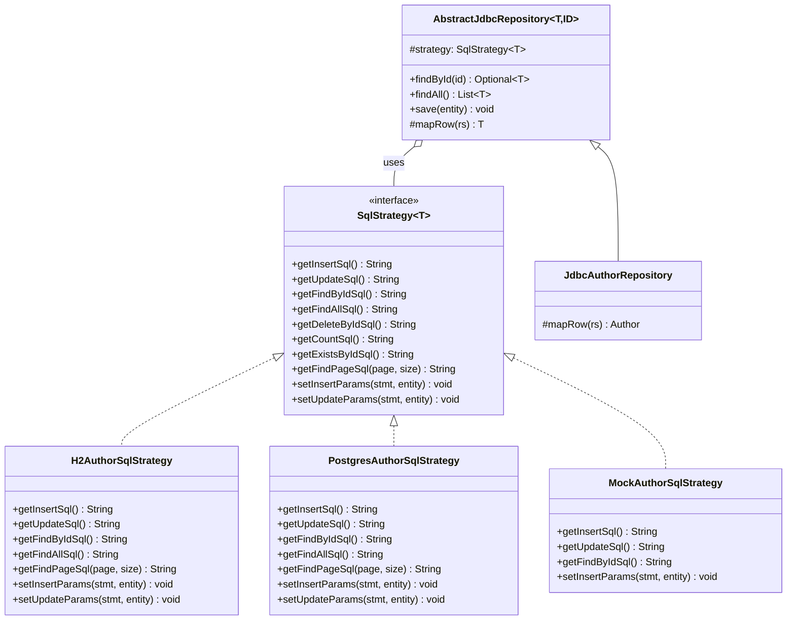

# Strategy: Замінювані SQL-стратегії для підтримки різних СУБД

## Вступ: SQL — не єдиний і не однаковий

У попередніх статтях ми розробили `AbstractJdbcRepository` — абстрактну основу для всіх JDBC-репозиторіїв. Підкласи (`JdbcAuthorRepository`, `JdbcGenreRepository` тощо) реалізують абстрактні методи `getInsertSql()`, `getUpdateSql()` та інші, повертаючи рядки SQL-запитів. Це вже кращий підхід, ніж розсіювати SQL по всьому коду, але одна проблема залишається прихованою.

Розглянемо метод `getInsertSql()` у `JdbcAuthorRepository`:

```java
@Override
protected String getInsertSql() {
    return "INSERT INTO authors (id, first_name, last_name, bio, image_path) VALUES (?, ?, ?, ?, ?)";
}
```

Цей SQL коректний для **будь-якої** СУБД, що підтримує ANSI SQL. Але варто перейти до більш складних запитів — і починаються відмінності між СУБД, що їх не вирішує жодна стандартизація:

::card-group

::card{title="LIMIT / OFFSET" icon="i-heroicons-list-bullet"}

```sql
-- H2, MySQL, PostgreSQL, SQLite:
SELECT * FROM authors LIMIT 10 OFFSET 20

-- Oracle (до 12c):
SELECT * FROM (
  SELECT a.*, ROWNUM rn FROM authors a
  WHERE ROWNUM <= 30
) WHERE rn > 20
```

::

::card{title="INSERT RETURNING" icon="i-heroicons-arrow-down-tray"}

```sql
-- PostgreSQL:
INSERT INTO authors (...) VALUES (...)
RETURNING id, created_at

-- H2, MySQL, SQLite:
-- RETURNING не підтримується — потрібен окремий SELECT
SELECT LAST_INSERT_ID() / SCOPE_IDENTITY()
```

::

::card{title="UPSERT" icon="i-heroicons-arrow-path"}

```sql
-- PostgreSQL:
INSERT INTO authors (...) VALUES (...)
ON CONFLICT (id) DO UPDATE SET ...

-- H2:
MERGE INTO authors USING DUAL ON (id=?)
WHEN MATCHED THEN UPDATE ...
WHEN NOT MATCHED THEN INSERT ...

-- MySQL:
INSERT INTO authors (...) VALUES (...)
ON DUPLICATE KEY UPDATE ...
```

::

::card{title="Генерація UUID" icon="i-heroicons-key"}

```sql
-- PostgreSQL:
SELECT gen_random_uuid()

-- H2:
SELECT RANDOM_UUID()

-- MySQL 8+:
SELECT UUID()
```

::

::

Крім синтаксичних відмінностей, СУБД відрізняються також у типах даних (`BOOLEAN` vs `TINYINT(1)`, `TEXT` vs `VARCHAR(MAX)`), обробці `NULL` у агрегатних функціях та поведінці при паралельних транзакціях.

**Наш поточний `AbstractJdbcRepository` приховує SQL у підкласах**, але не забезпечує механізму заміни діалекту. Якщо проєкт треба перенести з H2 (локальна розробка) на PostgreSQL (production), необхідно або редагувати всі підкласи репозиторіїв, або підтримувати паралельно дві копії ієрархії.

---

## Концепція: Strategy Pattern (GoF)

**Strategy** (GoF, *Design Patterns*, 1994):

> *«Define a family of algorithms, encapsulate each one, and make them interchangeable. Strategy lets the algorithm vary independently from clients that use it.»*
>
> *«Визначте сімейство алгоритмів, інкапсулюйте кожен з них і зробіть взаємозамінними. Strategy дозволяє алгоритму варіюватися незалежно від клієнтів, що його використовують.»*

У контексті нашого завдання:
- **Алгоритм** — SQL-запит для конкретної СУБД
- **Сімейство алгоритмів** — H2-варіант, PostgreSQL-варіант, MySQL-варіант
- **Клієнт** — `AbstractJdbcRepository` і його підкласи
- **Взаємозамінність** — переключення СУБД без зміни коду репозиторіїв

::mermaid



::

Зверніть увагу на ключове архітектурне рішення: `SqlStrategy<T>` параметризований за типом сутності `T`. Це означає, що для `Author` існують `H2AuthorSqlStrategy` і `PostgresAuthorSqlStrategy`, для `Genre` — `H2GenreSqlStrategy` і `PostgresGenreSqlStrategy` тощо. Кожна стратегія є самодостатньою і **знає свою сутність**: вона реалізує не лише SQL-рядки, а й `setInsertParams()` — заповнення `PreparedStatement` полями конкретного типу.

---

## Реалізація: `SqlStrategy<T>` Інтерфейс

```java showLineNumbers
package com.example.audiobook.repository.strategy;

import java.sql.PreparedStatement;
import java.sql.SQLException;
import java.util.List;

/**
 * Strategy-інтерфейс для SQL-операцій над сутністю типу {@code T}.
 * <p>
 * Інкапсулює сукупність SQL-запитів і логіку заповнення {@link PreparedStatement}
 * для конкретної СУБД. Різні реалізації забезпечують підтримку H2, PostgreSQL,
 * MySQL та інших СУБД без зміни коду репозиторіїв.
 * <p>
 * <b>Відповідальність:</b>
 * <ul>
 *   <li>Повертати SQL-рядки, специфічні для цільової СУБД;</li>
 *   <li>Заповнювати {@link PreparedStatement} полями сутності ({@code setInsertParams},
 *       {@code setUpdateParams});</li>
 *   <li>Не виконувати жодних SQL-запитів самостійно — це задача репозиторію.</li>
 * </ul>
 *
 * @param <T> тип доменної сутності (наприклад, {@code Author})
 */
public interface SqlStrategy<T> {

    // ─── DDL-специфічні запити ─────────────────────────────────────────────

    /**
     * SQL для вставки нового запису.
     * Параметри заповнюються через {@link #setInsertParams}.
     *
     * @return SQL-рядок (наприклад, {@code INSERT INTO authors (...) VALUES (?, ...)})
     */
    String getInsertSql();

    /**
     * SQL для оновлення існуючого запису.
     * Параметри заповнюються через {@link #setUpdateParams}.
     *
     * @return SQL-рядок (наприклад, {@code UPDATE authors SET ... WHERE id = ?})
     */
    String getUpdateSql();

    /**
     * SQL для пошуку запису за первинним ключем.
     *
     * @return SQL-рядок з одним параметром {@code ?} для {@code id}
     */
    String getFindByIdSql();

    /**
     * SQL для вибору всіх записів таблиці.
     *
     * @return SQL-рядок без параметрів
     */
    String getFindAllSql();

    /**
     * SQL для видалення запису за первинним ключем.
     *
     * @return SQL-рядок з одним параметром {@code ?} для {@code id}
     */
    String getDeleteByIdSql();

    /**
     * SQL для підрахунку кількості записів.
     *
     * @return SQL-рядок (наприклад, {@code SELECT COUNT(*) FROM authors})
     */
    String getCountSql();

    /**
     * SQL для перевірки існування запису за первинним ключем.
     *
     * @return SQL-рядок (наприклад, {@code SELECT 1 FROM authors WHERE id = ? LIMIT 1})
     */
    String getExistsByIdSql();

    /**
     * SQL для сторінкової вибірки (pagination).
     * <p>
     * Синтаксис {@code LIMIT/OFFSET} є специфічним для СУБД:
     * <ul>
     *   <li>H2, PostgreSQL, MySQL: {@code LIMIT ? OFFSET ?}</li>
     *   <li>Oracle до 12c: {@code ROWNUM}-підзапит</li>
     *   <li>SQL Server: {@code OFFSET ? ROWS FETCH NEXT ? ROWS ONLY}</li>
     * </ul>
     *
     * @param page нульовий індекс сторінки
     * @param size кількість записів на сторінці
     * @return SQL-рядок з вбудованими значеннями page та size
     */
    String getFindPageSql(int page, int size);

    // ─── Заповнення PreparedStatement ──────────────────────────────────────

    /**
     * Заповнює {@link PreparedStatement} для операції {@code INSERT}.
     * <p>
     * Параметри повинні відповідати позиціям {@code ?} у {@link #getInsertSql()}.
     *
     * @param stmt   підготовлений оператор
     * @param entity об'єкт, що вставляється
     * @throws SQLException при помилці встановлення параметрів
     */
    void setInsertParams(PreparedStatement stmt, T entity) throws SQLException;

    /**
     * Заповнює {@link PreparedStatement} для операції {@code UPDATE}.
     * <p>
     * Останній параметр {@code ?} традиційно є {@code id} у {@code WHERE id = ?}.
     *
     * @param stmt   підготовлений оператор
     * @param entity об'єкт з оновленими даними
     * @throws SQLException при помилці встановлення параметрів
     */
    void setUpdateParams(PreparedStatement stmt, T entity) throws SQLException;
}
```

---

## Реалізація H2AuthorSqlStrategy

```java showLineNumbers
package com.example.audiobook.repository.strategy.h2;

import com.example.audiobook.domain.Author;
import com.example.audiobook.repository.strategy.SqlStrategy;

import java.sql.PreparedStatement;
import java.sql.SQLException;

/**
 * H2-реалізація {@link SqlStrategy} для сутності {@link Author}.
 * <p>
 * Всі SQL-запити написані у діалекті H2 Database Engine.
 * H2 сумісний з більшістю ANSI SQL конструкцій та підтримує
 * стандартний {@code LIMIT/OFFSET} для сторінкування.
 * <p>
 * Використовується для локальної розробки і тестування.
 */
public class H2AuthorSqlStrategy implements SqlStrategy<Author> {

    private static final String TABLE = "authors";

    @Override
    public String getInsertSql() {
        return """
            INSERT INTO %s (id, first_name, last_name, bio, image_path)
            VALUES (?, ?, ?, ?, ?)
            """.formatted(TABLE);
    }

    @Override
    public String getUpdateSql() {
        return """
            UPDATE %s
            SET first_name = ?,
                last_name  = ?,
                bio        = ?,
                image_path = ?
            WHERE id = ?
            """.formatted(TABLE);
    }

    @Override
    public String getFindByIdSql() {
        return "SELECT id, first_name, last_name, bio, image_path FROM %s WHERE id = ?".formatted(TABLE);
    }

    @Override
    public String getFindAllSql() {
        return "SELECT id, first_name, last_name, bio, image_path FROM %s ORDER BY last_name, first_name".formatted(TABLE);
    }

    @Override
    public String getDeleteByIdSql() {
        return "DELETE FROM %s WHERE id = ?".formatted(TABLE);
    }

    @Override
    public String getCountSql() {
        return "SELECT COUNT(*) FROM %s".formatted(TABLE);
    }

    @Override
    public String getExistsByIdSql() {
        // H2 підтримує LIMIT у підзапитах перевірки існування
        return "SELECT 1 FROM %s WHERE id = ? LIMIT 1".formatted(TABLE);
    }

    /**
     * H2 підтримує стандартний LIMIT/OFFSET.
     * {@code page} та {@code size} вбудовуємо безпосередньо у рядок —
     * вони є цілими числами з Java-коду, а не з користувацького вводу,
     * тому SQL-ін'єкція неможлива.
     */
    @Override
    public String getFindPageSql(int page, int size) {
        int offset = page * size;
        return """
            SELECT id, first_name, last_name, bio, image_path
            FROM %s
            ORDER BY last_name, first_name
            LIMIT %d OFFSET %d
            """.formatted(TABLE, size, offset);
    }

    /**
     * Заповнює параметри INSERT:
     * 1-id, 2-first_name, 3-last_name, 4-bio, 5-image_path.
     */
    @Override
    public void setInsertParams(PreparedStatement stmt, Author author) throws SQLException {
        stmt.setObject(1, author.getId());          // UUID → java.util.UUID
        stmt.setString(2, author.getFirstName());
        stmt.setString(3, author.getLastName());
        stmt.setString(4, author.getBio());         // може бути null
        stmt.setString(5, author.getImagePath());   // може бути null
    }

    /**
     * Заповнює параметри UPDATE:
     * 1-first_name, 2-last_name, 3-bio, 4-image_path, 5-id (WHERE).
     */
    @Override
    public void setUpdateParams(PreparedStatement stmt, Author author) throws SQLException {
        stmt.setString(1, author.getFirstName());
        stmt.setString(2, author.getLastName());
        stmt.setString(3, author.getBio());
        stmt.setString(4, author.getImagePath());
        stmt.setObject(5, author.getId());          // WHERE id = ? — останній параметр
    }
}
```

---

## Реалізація PostgresAuthorSqlStrategy

```java showLineNumbers
package com.example.audiobook.repository.strategy.postgres;

import com.example.audiobook.domain.Author;
import com.example.audiobook.repository.strategy.SqlStrategy;

import java.sql.PreparedStatement;
import java.sql.SQLException;

/**
 * PostgreSQL-реалізація {@link SqlStrategy} для сутності {@link Author}.
 * <p>
 * Демонструє відмінності PostgreSQL-діалекту від H2:
 * <ul>
 *   <li>Явне приведення типів через {@code ::uuid} (або {@code CAST});</li>
 *   <li>{@code ON CONFLICT DO UPDATE} для upsert-операцій;</li>
 *   <li>{@code ILIKE} для регістронезалежного пошуку;</li>
 *   <li>Однаковий {@code LIMIT/OFFSET} — обидві СУБД дотримуються цього стандарту.</li>
 * </ul>
 * <p>
 * Використовується у staging та production оточенні.
 */
public class PostgresAuthorSqlStrategy implements SqlStrategy<Author> {

    private static final String TABLE = "authors";

    @Override
    public String getInsertSql() {
        // PostgreSQL: явне приведення UUID через ::uuid або CAST
        // При використанні PreparedStatement з UUID-параметром це зазвичай не потрібно,
        // але RETURNING дозволяє отримати згенеровані поля (created_at, updated_at)
        return """
            INSERT INTO %s (id, first_name, last_name, bio, image_path)
            VALUES (?, ?, ?, ?, ?)
            """.formatted(TABLE);
            // Можна додати RETURNING created_at, updated_at якщо є ці стовпці
    }

    @Override
    public String getUpdateSql() {
        return """
            UPDATE %s
            SET first_name = ?,
                last_name  = ?,
                bio        = ?,
                image_path = ?,
                updated_at = NOW()
            WHERE id = ?
            """.formatted(TABLE);
            // PostgreSQL: NOW() — актуальна мітка часу без параметра
    }

    @Override
    public String getFindByIdSql() {
        // Стандартний ANSI SQL — однаковий для H2 і PostgreSQL
        return "SELECT id, first_name, last_name, bio, image_path FROM %s WHERE id = ?".formatted(TABLE);
    }

    @Override
    public String getFindAllSql() {
        return """
            SELECT id, first_name, last_name, bio, image_path
            FROM %s
            ORDER BY last_name ASC NULLS LAST, first_name ASC
            """.formatted(TABLE);
        // PostgreSQL: NULLS LAST — явне керування позицією NULL у сортуванні
    }

    @Override
    public String getDeleteByIdSql() {
        return "DELETE FROM %s WHERE id = ?".formatted(TABLE);
    }

    @Override
    public String getCountSql() {
        return "SELECT COUNT(*) FROM %s".formatted(TABLE);
    }

    @Override
    public String getExistsByIdSql() {
        return "SELECT EXISTS(SELECT 1 FROM %s WHERE id = ?)".formatted(TABLE);
        // PostgreSQL: EXISTS(...) повертає boolean безпосередньо
        // H2 повертає 0/1, тому там краще LIMIT 1
    }

    /**
     * PostgreSQL: стандартний LIMIT/OFFSET, аналогічний H2.
     * Обидві СУБД дотримуються цього підходу до сторінкування.
     */
    @Override
    public String getFindPageSql(int page, int size) {
        int offset = page * size;
        return """
            SELECT id, first_name, last_name, bio, image_path
            FROM %s
            ORDER BY last_name ASC NULLS LAST, first_name ASC
            LIMIT %d OFFSET %d
            """.formatted(TABLE, size, offset);
    }

    @Override
    public void setInsertParams(PreparedStatement stmt, Author author) throws SQLException {
        // Ідентично H2 для базових типів
        stmt.setObject(1, author.getId());
        stmt.setString(2, author.getFirstName());
        stmt.setString(3, author.getLastName());
        stmt.setString(4, author.getBio());
        stmt.setString(5, author.getImagePath());
    }

    @Override
    public void setUpdateParams(PreparedStatement stmt, Author author) throws SQLException {
        stmt.setString(1, author.getFirstName());
        stmt.setString(2, author.getLastName());
        stmt.setString(3, author.getBio());
        stmt.setString(4, author.getImagePath());
        stmt.setObject(5, author.getId());
        // updated_at = NOW() не потребує параметра — PostgreSQL вираховує сам
    }

    /**
     * Повернення SQL для UPSERT (INSERT OR UPDATE) у PostgreSQL.
     * Не частина базового інтерфейсу — PostgreSQL-специфічне розширення.
     *
     * @return SQL із використанням ON CONFLICT (PostgreSQL 9.5+)
     */
    public String getUpsertSql() {
        return """
            INSERT INTO %s (id, first_name, last_name, bio, image_path)
            VALUES (?, ?, ?, ?, ?)
            ON CONFLICT (id) DO UPDATE SET
                first_name = EXCLUDED.first_name,
                last_name  = EXCLUDED.last_name,
                bio        = EXCLUDED.bio,
                image_path = EXCLUDED.image_path,
                updated_at = NOW()
            """.formatted(TABLE);
    }
}
```

---
## Оновлений AbstractJdbcRepository

Ключова зміна відносно статті 14: `AbstractJdbcRepository` більше не визначає абстрактні методи `getInsertSql()`, `getUpdateSql()` тощо — замість цього він **отримує `SqlStrategy<T>` через конструктор** і делегує всі SQL-рядки стратегії.

```java showLineNumbers
package com.example.audiobook.repository.jdbc;

import com.example.audiobook.db.ConnectionManager;
import com.example.audiobook.db.DatabaseException;
import com.example.audiobook.repository.Repository;
import com.example.audiobook.repository.strategy.SqlStrategy;

import java.sql.*;
import java.util.ArrayList;
import java.util.List;
import java.util.Optional;
import java.util.UUID;

/**
 * Оновлений абстрактний JDBC-репозиторій зі Strategy Pattern.
 * <p>
 * Порівняно зі статтею 14, цей клас:
 * <ul>
 *   <li><b>Не визначає абстрактних SQL-методів</b> — SQL делегується {@link SqlStrategy};</li>
 *   <li><b>Отримує стратегію через конструктор</b> — Strategy Injection;</li>
 *   <li><b>Залишає {link #mapRow} абстрактним</b> — маппінг {@code ResultSet → T}
 *       є специфікою сутності, а не СУБД.</li>
 * </ul>
 * <p>
 * Завдяки цьому підкласи ({@code JdbcAuthorRepository}) скорочуються вдвічі:
 * вони реалізують лише маппінг і передають правильну стратегію у {@code super(...)}.
 *
 * @param <T>  тип доменної сутності
 * @param <ID> тип первинного ключа
 */
public abstract class AbstractJdbcRepository<T, ID> implements Repository<T, ID> {

    protected final ConnectionManager connectionManager;

    /**
     * Стратегія SQL для поточної СУБД.
     * Вибирається при ініціалізації репозиторію і залишається незмінною.
     */
    private final SqlStrategy<T> strategy;

    protected AbstractJdbcRepository(ConnectionManager connectionManager,
                                     SqlStrategy<T> strategy) {
        this.connectionManager = connectionManager;
        this.strategy = strategy;
    }

    // ─── Читання ──────────────────────────────────────────────────────────────

    @Override
    public Optional<T> findById(ID id) {
        // Тепер SQL приходить зі стратегії — репозиторій не знає конкретного SQL
        try (Connection conn = connectionManager.getConnection();
             PreparedStatement stmt = conn.prepareStatement(strategy.getFindByIdSql())) {

            stmt.setObject(1, id);
            try (ResultSet rs = stmt.executeQuery()) {
                return rs.next() ? Optional.of(mapRow(rs)) : Optional.empty();
            }
        } catch (SQLException e) {
            throw new DatabaseException("findById failed for id=" + id, e);
        }
    }

    @Override
    public List<T> findAll() {
        try (Connection conn = connectionManager.getConnection();
             PreparedStatement stmt = conn.prepareStatement(strategy.getFindAllSql());
             ResultSet rs = stmt.executeQuery()) {

            List<T> result = new ArrayList<>();
            while (rs.next()) {
                result.add(mapRow(rs));
            }
            return result;
        } catch (SQLException e) {
            throw new DatabaseException("findAll failed", e);
        }
    }

    /**
     * Повертає сторінку записів.
     * SQL-синтаксис сторінкування делегується {@link SqlStrategy#getFindPageSql}.
     *
     * @param page нульовий індекс сторінки
     * @param size кількість записів на сторінці
     * @return список записів поточної сторінки
     */
    public List<T> findPage(int page, int size) {
        // getFindPageSql вже вбудовує page і size у рядок
        // (безпечно, бо це Java int, а не рядок з користувацького вводу)
        String sql = strategy.getFindPageSql(page, size);
        try (Connection conn = connectionManager.getConnection();
             PreparedStatement stmt = conn.prepareStatement(sql);
             ResultSet rs = stmt.executeQuery()) {

            List<T> result = new ArrayList<>();
            while (rs.next()) {
                result.add(mapRow(rs));
            }
            return result;
        } catch (SQLException e) {
            throw new DatabaseException("findPage failed: page=%d, size=%d".formatted(page, size), e);
        }
    }

    // ─── Запис ────────────────────────────────────────────────────────────────

    @Override
    public void save(T entity) {
        try (Connection conn = connectionManager.getConnection();
             PreparedStatement stmt = conn.prepareStatement(strategy.getInsertSql())) {

            // Заповнення параметрів — тепер через стратегію
            strategy.setInsertParams(stmt, entity);
            stmt.executeUpdate();
        } catch (SQLException e) {
            throw new DatabaseException("save failed for entity=" + entity, e);
        }
    }

    @Override
    public void update(T entity) {
        try (Connection conn = connectionManager.getConnection();
             PreparedStatement stmt = conn.prepareStatement(strategy.getUpdateSql())) {

            strategy.setUpdateParams(stmt, entity);
            stmt.executeUpdate();
        } catch (SQLException e) {
            throw new DatabaseException("update failed for entity=" + entity, e);
        }
    }

    @Override
    public boolean deleteById(ID id) {
        try (Connection conn = connectionManager.getConnection();
             PreparedStatement stmt = conn.prepareStatement(strategy.getDeleteByIdSql())) {

            stmt.setObject(1, id);
            return stmt.executeUpdate() > 0;
        } catch (SQLException e) {
            throw new DatabaseException("deleteById failed for id=" + id, e);
        }
    }

    // ─── Метадані ─────────────────────────────────────────────────────────────

    @Override
    public long count() {
        try (Connection conn = connectionManager.getConnection();
             PreparedStatement stmt = conn.prepareStatement(strategy.getCountSql());
             ResultSet rs = stmt.executeQuery()) {

            return rs.next() ? rs.getLong(1) : 0L;
        } catch (SQLException e) {
            throw new DatabaseException("count failed", e);
        }
    }

    @Override
    public boolean existsById(ID id) {
        try (Connection conn = connectionManager.getConnection();
             PreparedStatement stmt = conn.prepareStatement(strategy.getExistsByIdSql())) {

            stmt.setObject(1, id);
            try (ResultSet rs = stmt.executeQuery()) {
                if (!rs.next()) return false;
                // PostgreSQL's EXISTS повертає boolean; H2's LIMIT 1 повертає 1 або null
                Object val = rs.getObject(1);
                if (val instanceof Boolean b) return b;
                return val != null;
            }
        } catch (SQLException e) {
            throw new DatabaseException("existsById failed for id=" + id, e);
        }
    }

    // ─── Абстрактний метод маппінгу (залишається у підкласах) ────────────────

    /**
     * Маппінг рядка {@link ResultSet} у доменний об'єкт {@code T}.
     * <p>
     * Цей метод є специфічним для кожної сутності (які стовпці читати, які поля заповнювати)
     * і не залежить від СУБД — SQL-діалект вже визначений стратегією.
     *
     * @param rs поточний рядок ResultSet (курсор встановлено на рядок)
     * @return об'єкт типу {@code T}
     * @throws SQLException при помилці читання ResultSet
     */
    protected abstract T mapRow(ResultSet rs) throws SQLException;
}
```

### JdbcAuthorRepository після рефакторингу

Порівняймо підклас **до** і **після** введення Strategy:

::tabs

::tabs-item{label="До (стаття 14)"}

```java
public class JdbcAuthorRepository extends AbstractJdbcRepository<Author, UUID>
        implements AuthorRepository {

    public JdbcAuthorRepository(ConnectionManager cm) {
        super(cm);
    }

    // ── AbstractJdbcRepository вимагав реалізувати ────────────────────────
    @Override
    protected String getInsertSql() {
        return "INSERT INTO authors (id, first_name, last_name, bio, image_path) VALUES (?, ?, ?, ?, ?)";
    }

    @Override
    protected String getUpdateSql() {
        return "UPDATE authors SET first_name=?, last_name=?, bio=?, image_path=? WHERE id=?";
    }

    @Override
    protected String getFindByIdSql() {
        return "SELECT id, first_name, last_name, bio, image_path FROM authors WHERE id=?";
    }

    @Override
    protected String getFindAllSql() {
        return "SELECT id, first_name, last_name, bio, image_path FROM authors ORDER BY last_name";
    }

    @Override
    protected String getDeleteByIdSql() {
        return "DELETE FROM authors WHERE id=?";
    }

    @Override
    protected void setInsertParams(PreparedStatement s, Author a) throws SQLException {
        s.setObject(1, a.getId()); s.setString(2, a.getFirstName());
        s.setString(3, a.getLastName()); s.setString(4, a.getBio());
        s.setString(5, a.getImagePath());
    }

    @Override
    protected void setUpdateParams(PreparedStatement s, Author a) throws SQLException {
        s.setString(1, a.getFirstName()); s.setString(2, a.getLastName());
        s.setString(3, a.getBio()); s.setString(4, a.getImagePath());
        s.setObject(5, a.getId());
    }

    // Ось єдина реальна відповідальність цього класу:
    @Override
    protected Author mapRow(ResultSet rs) throws SQLException {
        Author author = new Author(rs.getString("first_name"), rs.getString("last_name"));
        author.setId(rs.getObject("id", UUID.class));
        author.setBio(rs.getString("bio"));
        author.setImagePath(rs.getString("image_path"));
        return author;
    }
}
```

::

::tabs-item{label="Після (стаття 17)"}

```java
/**
 * Репозиторій авторів після введення Strategy Pattern.
 * Єдина відповідальність — маппінг ResultSet → Author.
 * Весь SQL та заповнення PreparedStatement — у SqlStrategy.
 */
public class JdbcAuthorRepository extends AbstractJdbcRepository<Author, UUID>
        implements AuthorRepository {

    // Стратегія передається ззовні — залежність від абстракції, не від конкретної СУБД
    public JdbcAuthorRepository(ConnectionManager cm, SqlStrategy<Author> strategy) {
        super(cm, strategy);
    }

    // Єдиний метод, що залишився тут:
    @Override
    protected Author mapRow(ResultSet rs) throws SQLException {
        Author author = new Author(rs.getString("first_name"), rs.getString("last_name"));
        author.setId(rs.getObject("id", UUID.class));
        author.setBio(rs.getString("bio"));
        author.setImagePath(rs.getString("image_path"));
        return author;
    }
}
```

::

::

Клас скоротився з ~70 рядків до ~20. **Всі SQL-рядки і заповнення параметрів перемістилися до стратегії**, де вони згруповані за типом СУБД.

---

## SqlStrategyFactory: Фабрика стратегій

Щоб не розсіювати рішення «яку СУБД використовувати» по всьому коду, вводимо **Factory** — єдиний реєстр стратегій:

```java showLineNumbers
package com.example.audiobook.repository.strategy;

import com.example.audiobook.domain.Author;
import com.example.audiobook.domain.Audiobook;
import com.example.audiobook.domain.Genre;
import com.example.audiobook.repository.strategy.h2.*;
import com.example.audiobook.repository.strategy.postgres.*;

/**
 * Фабрика SQL-стратегій.
 * <p>
 * Єдина точка конфігурації СУБД у проєкті: вибір між H2 (розробка/тести)
 * та PostgreSQL (staging/production) визначається тут, а не в кожному репозиторії.
 * <p>
 * У production-системах тип СУБД зазвичай читається з конфігурації:
 * {@code application.properties}, environment variable або DI-контейнер.
 */
public class SqlStrategyFactory {

    /**
     * Перерахування підтримуваних СУБД.
     */
    public enum DatabaseType {
        H2,
        POSTGRESQL
    }

    private final DatabaseType dbType;

    public SqlStrategyFactory(DatabaseType dbType) {
        this.dbType = dbType;
    }

    /**
     * Повертає SQL-стратегію для {@link Author} під поточну СУБД.
     */
    public SqlStrategy<Author> authorStrategy() {
        return switch (dbType) {
            case H2         -> new H2AuthorSqlStrategy();
            case POSTGRESQL -> new PostgresAuthorSqlStrategy();
        };
    }

    /**
     * Повертає SQL-стратегію для {@link Genre} під поточну СУБД.
     */
    public SqlStrategy<Genre> genreStrategy() {
        return switch (dbType) {
            case H2         -> new H2GenreSqlStrategy();
            case POSTGRESQL -> new PostgresGenreSqlStrategy();
        };
    }

    /**
     * Повертає SQL-стратегію для {@link Audiobook} під поточну СУБД.
     */
    public SqlStrategy<Audiobook> audiobookStrategy() {
        return switch (dbType) {
            case H2         -> new H2AudiobookSqlStrategy();
            case POSTGRESQL -> new PostgresAudiobookSqlStrategy();
        };
    }

    /**
     * Зручний статичний метод для швидкого створення H2-фабрики
     * (найчастіший сценарій у тестах і прикладах).
     */
    public static SqlStrategyFactory forH2() {
        return new SqlStrategyFactory(DatabaseType.H2);
    }

    /**
     * Зручний статичний метод для PostgreSQL (production).
     */
    public static SqlStrategyFactory forPostgres() {
        return new SqlStrategyFactory(DatabaseType.POSTGRESQL);
    }
}
```

---

## Тестування без реальної БД: MockSqlStrategy

Один з найважливіших наслідків Strategy Pattern — **можливість тестувати репозиторій без реальної бази даних**. Якщо перевірити логіку маппінгу (`mapRow`), достатньо створити mock-стратегію і mock-з'єднання.

```java showLineNumbers
package com.example.audiobook.repository.strategy.mock;

import com.example.audiobook.domain.Author;
import com.example.audiobook.repository.strategy.SqlStrategy;

import java.sql.PreparedStatement;
import java.sql.SQLException;
import java.util.ArrayList;
import java.util.List;

/**
 * Mock-реалізація {@link SqlStrategy} для авторів.
 * <p>
 * Використовується у юніт-тестах для перевірки логіки маппінгу
 * у {@link com.example.audiobook.repository.jdbc.JdbcAuthorRepository}
 * без запуску реальної бази даних.
 * <p>
 * Записує всі виклики методів для подальшої верифікації у тестах.
 */
public class MockAuthorSqlStrategy implements SqlStrategy<Author> {

    // Лічильники викликів для верифікації у тестах
    private int insertCallCount  = 0;
    private int updateCallCount  = 0;
    private int deleteCallCount  = 0;
    private final List<Author> insertedEntities = new ArrayList<>();
    private final List<Author> updatedEntities  = new ArrayList<>();

    @Override
    public String getInsertSql() {
        return "INSERT INTO authors (id, first_name, last_name, bio, image_path) VALUES (?, ?, ?, ?, ?)";
    }

    @Override
    public String getUpdateSql() {
        return "UPDATE authors SET first_name=?, last_name=?, bio=?, image_path=? WHERE id=?";
    }

    @Override
    public String getFindByIdSql() {
        return "SELECT id, first_name, last_name, bio, image_path FROM authors WHERE id=?";
    }

    @Override
    public String getFindAllSql() {
        return "SELECT id, first_name, last_name, bio, image_path FROM authors ORDER BY last_name";
    }

    @Override
    public String getDeleteByIdSql() {
        return "DELETE FROM authors WHERE id=?";
    }

    @Override
    public String getCountSql() {
        return "SELECT COUNT(*) FROM authors";
    }

    @Override
    public String getExistsByIdSql() {
        return "SELECT 1 FROM authors WHERE id=? LIMIT 1";
    }

    @Override
    public String getFindPageSql(int page, int size) {
        return "SELECT id, first_name, last_name, bio, image_path FROM authors LIMIT " + size + " OFFSET " + (page * size);
    }

    @Override
    public void setInsertParams(PreparedStatement stmt, Author author) throws SQLException {
        insertCallCount++;
        insertedEntities.add(author);
        stmt.setObject(1, author.getId());
        stmt.setString(2, author.getFirstName());
        stmt.setString(3, author.getLastName());
        stmt.setString(4, author.getBio());
        stmt.setString(5, author.getImagePath());
    }

    @Override
    public void setUpdateParams(PreparedStatement stmt, Author author) throws SQLException {
        updateCallCount++;
        updatedEntities.add(author);
        stmt.setString(1, author.getFirstName());
        stmt.setString(2, author.getLastName());
        stmt.setString(3, author.getBio());
        stmt.setString(4, author.getImagePath());
        stmt.setObject(5, author.getId());
    }

    // Accessor-методи для верифікації у тестах
    public int getInsertCallCount()         { return insertCallCount; }
    public int getUpdateCallCount()         { return updateCallCount; }
    public List<Author> getInsertedEntities() { return insertedEntities; }
    public List<Author> getUpdatedEntities()  { return updatedEntities; }
    public void reset() {
        insertCallCount = 0; updateCallCount = 0;
        insertedEntities.clear(); updatedEntities.clear();
    }
}
```

**Юніт-тест із MockSqlStrategy:**

```java
// Тест без підключення до реальної БД
@Test
void save_shouldCallSetInsertParams_once() throws Exception {
    // Arrange: InMemory H2 або MockConnection
    ConnectionManager cm = ConnectionManager.forH2InMemory();
    MockAuthorSqlStrategy mockStrategy = new MockAuthorSqlStrategy();
    JdbcAuthorRepository repo = new JdbcAuthorRepository(cm, mockStrategy);

    Author author = new Author("Тарас", "Шевченко");

    // Act
    repo.save(author);

    // Assert: перевіряємо, що стратегія була викликана рівно один раз
    assertEquals(1, mockStrategy.getInsertCallCount());
    assertEquals(author, mockStrategy.getInsertedEntities().get(0));
}

@Test
void update_shouldIncludeIdAsLastParam() throws Exception {
    ConnectionManager cm = ConnectionManager.forH2InMemory();
    MockAuthorSqlStrategy mockStrategy = new MockAuthorSqlStrategy();
    JdbcAuthorRepository repo = new JdbcAuthorRepository(cm, mockStrategy);

    Author author = new Author("Іван", "Франко");
    repo.save(author);
    author.setBio("Оновлена біографія");
    repo.update(author);

    // UPDATE має бути викликано один раз
    assertEquals(1, mockStrategy.getUpdateCallCount());
    // Останній збережений у updatedEntities — той самий об'єкт
    assertSame(author, mockStrategy.getUpdatedEntities().get(0));
}
```

## Демонстрація: Перемикання між H2 і PostgreSQL

```java showLineNumbers
package com.example.audiobook;

import com.example.audiobook.db.ConnectionManager;
import com.example.audiobook.domain.Author;
import com.example.audiobook.domain.Genre;
import com.example.audiobook.repository.AuthorRepository;
import com.example.audiobook.repository.GenreRepository;
import com.example.audiobook.repository.jdbc.JdbcAuthorRepository;
import com.example.audiobook.repository.jdbc.JdbcGenreRepository;
import com.example.audiobook.repository.strategy.SqlStrategyFactory;

import java.util.List;

public class Main {

    public static void main(String[] args) {

        // ── Сценарій 1: Локальна розробка з H2 ──────────────────────────────
        System.out.println("=== H2 (локальна розробка) ===");
        runWithFactory(
            ConnectionManager.forH2("./data/audiobook_h2"),
            SqlStrategyFactory.forH2()
        );

        // ── Сценарій 2: Production з PostgreSQL ─────────────────────────────
        // Просто замінюємо ConnectionManager і фабрику — код репозиторіїв не змінюється!
        System.out.println("\n=== PostgreSQL (production) ===");
        runWithFactory(
            ConnectionManager.forPostgres("localhost", 5432, "audiobook", "user", "password"),
            SqlStrategyFactory.forPostgres()
        );
    }

    /**
     * Виконує однакові бізнес-операції для будь-якої СУБД.
     * Код повністю ідентичний — змінюється лише фабрика стратегій.
     */
    private static void runWithFactory(ConnectionManager cm, SqlStrategyFactory factory) {

        // Репозиторії отримують стратегію через фабрику
        AuthorRepository authorRepo = new JdbcAuthorRepository(cm, factory.authorStrategy());
        GenreRepository  genreRepo  = new JdbcGenreRepository(cm, factory.genreStrategy());

        // Бізнес-операції — абсолютно однакові для H2 і PostgreSQL
        Author shevchenko = new Author("Тарас", "Шевченко");
        authorRepo.save(shevchenko);

        Genre kobzar = new Genre("Поезія");
        genreRepo.save(kobzar);

        List<Author> authors = authorRepo.findAll();
        System.out.println("Авторів у БД: " + authors.size());

        // Сторінкова вибірка — SQL генерується стратегією
        if (authorRepo instanceof JdbcAuthorRepository jar) {
            List<Author> page0 = jar.findPage(0, 5); // перша сторінка
            System.out.println("Сторінка 0 (до 5 авторів): " + page0.size());
        }

        authorRepo.deleteById(shevchenko.getId());
        genreRepo.deleteById(kobzar.getId());

        cm.close();
    }
}
```

::terminal-preview{title="java Main" :cursor="false"}
<div class="line"><span class="opacity-40">$</span> <strong>java -cp . com.example.audiobook.Main</strong></div>
<div class="line"><span class="font-bold">=== H2 (локальна розробка) ===</span></div>
<div class="line"><span class="text-blue-400">[Strategy]</span> H2AuthorSqlStrategy активна</div>
<div class="line"><span class="text-yellow-400">[SQL]</span> INSERT INTO authors ... VALUES (?, ?, ?, ?, ?)</div>
<div class="line"><span class="text-yellow-400">[SQL]</span> INSERT INTO genres ...  VALUES (?, ?, ?)</div>
<div class="line"><span class="text-yellow-400">[SQL]</span> SELECT ... FROM authors ORDER BY last_name, first_name</div>
<div class="line">Авторів у БД: 1</div>
<div class="line"><span class="text-yellow-400">[SQL]</span> SELECT ... FROM authors ORDER BY last_name, first_name LIMIT 5 OFFSET 0</div>
<div class="line">Сторінка 0 (до 5 авторів): 1</div>
<div class="line"></div>
<div class="line"><span class="font-bold">=== PostgreSQL (production) ===</span></div>
<div class="line"><span class="text-blue-400">[Strategy]</span> PostgresAuthorSqlStrategy активна</div>
<div class="line"><span class="text-yellow-400">[SQL]</span> INSERT INTO authors ... VALUES (?, ?, ?, ?, ?)</div>
<div class="line"><span class="text-yellow-400">[SQL]</span> INSERT INTO genres ...  VALUES (?, ?, ?)</div>
<div class="line"><span class="text-yellow-400">[SQL]</span> SELECT ... FROM authors ORDER BY last_name ASC NULLS LAST, first_name ASC</div>
<div class="line">Авторів у БД: 1</div>
<div class="line"><span class="text-yellow-400">[SQL]</span> SELECT ... ORDER BY last_name ASC NULLS LAST ... LIMIT 5 OFFSET 0</div>
<div class="line">Сторінка 0 (до 5 авторів): 1</div>
::

Зверніть увагу: метод `runWithFactory()` **абсолютно ідентичний** для H2 і PostgreSQL. Відмінності між СУБД повністю інкапсульовані у стратегіях. Якщо завтра необхідно додати підтримку MySQL, достатньо:
1. Реалізувати `MySqlAuthorSqlStrategy`, `MySqlGenreSqlStrategy` тощо
2. Додати `MYSQL` до переліку `DatabaseType`
3. Додати `case MYSQL ->` у `SqlStrategyFactory`

Жодного рядка у `AbstractJdbcRepository`, `JdbcAuthorRepository` або бізнес-логіці не зміниться.

---

## Еволюція архітектури: Порівняння трьох підходів

Ця стаття замикає цикл рефакторингу SQL-шару, що почався у статті 12. Погляньмо на те, як змінювався підхід до розміщення SQL:

::mermaid

```mermaid
timeline
    title Еволюція роботи з SQL (статті 12–17)
    section Стаття 12: Row Data Gateway
        SQL у кожному методі об'єкта : AuthorGateway.insert() містить INSERT
        Немає абстракції : SQL та дані в одному класі
    section Стаття 13: Table Data Gateway
        SQL у Gateway-класах : AuthorTableGateway відокремлений від Author
        Ліпше, але: Gateway — єдиний клас без варіантів
    section Стаття 14: Repository + Data Mapper
        SQL у захищених методах підкласу : getInsertSql() у JdbcAuthorRepository
        AbstractJdbcRepository: шаблон методів : SQL та маппінг ще в одному місці
    section Стаття 17: Strategy Pattern
        SQL в окремих класах-стратегіях : H2AuthorSqlStrategy / PostgresAuthorSqlStrategy
        Репозиторій знає тільки маппінг : mapRow() — єдине, що залишилось у підкласі
```

::

| Підхід | SQL локалізований | Замінюваний | Тестовий | СУБД-агностичний |
|---|---|---|---|---|
| Row Data Gateway | у методах Gateway | ❌ | важко | ❌ |
| Table Data Gateway | у Gateway-класі | частково | важко | ❌ |
| Repository (ст. 14) | у підкласах репозиторію | ❌ | середньо | ❌ |
| **Repository + Strategy** | у класах-стратегіях | ✅ | ✅ легко | ✅ |

---

## Open/Closed Principle: Відкритий для розширення

Strategy Pattern є ілюстрацією **Open/Closed Principle** (OCP) з SOLID:

> «Програмні сутності повинні бути відкриті для розширення, але закриті для модифікації.»

З нашою архітектурою:
- `AbstractJdbcRepository` — **закритий** для модифікації при додаванні нової СУБД
- `SqlStrategy<T>` — **відкритий** для розширення через нові реалізації

Порівняйте з підходом без Strategy:

```java
// БЕЗ Strategy: щоб підтримати MySQL, потрібно змінювати існуючий код
class JdbcAuthorRepository extends AbstractJdbcRepository<Author, UUID> {
    private final String dbType; // "h2" або "mysql" або "postgres"

    @Override
    protected String getInsertSql() {
        if ("mysql".equals(dbType)) {
            return "INSERT INTO authors ..."; // MySQL-варіант
        } else if ("postgres".equals(dbType)) {
            return "INSERT INTO authors ..."; // PostgreSQL-варіант
        }
        return "INSERT INTO authors ...";     // H2-варіант
    }
    // Цей if/else росте з кожною новою СУБД → порушення OCP
}
```

З Strategy: додаємо `MySqlAuthorSqlStrategy` без зміни будь-якого існуючого класу.

---

## Підсумок

::card-group

::card{title="Що вирішує Strategy" icon="i-heroicons-check-circle"}

- Ізолює SQL-діалекти в окремих класах-стратегіях
- Перемикання СУБД без зміни репозиторіїв
- Спрощує юніт-тестування (MockSqlStrategy)
- Дотримання OCP: нові СУБД = нові стратегії без редагування старих

::

::card{title="Коли Strategy зайвий" icon="i-heroicons-information-circle"}

- Проєкт використовує **одну** СУБД і не планує міграцій
- SQL-запити прості і однакові для всіх СУБД (ANSI-сумісні)
- Команда невелика, і простота важливіша за гнучкість
- Уже використовується ORM (Hibernate/JPA) — він сам вирішує діалект

::

::

Strategy є більш тонким патерном, ніж попередні. У невеликих навчальних проєктах він може здатися надмірним. Але розуміння його структури критично важливе, оскільки він лежить в основі більшості extensible-систем: JDBC-драйвери, Hibernate Dialect, Spring `PlatformTransactionManager`, Jakarta EE Connector Architecture — всі вони реалізують варіанти Strategy для підтримки множини провайдерів без зміни ядра.

У наступній статті ми розглянемо **Proxy Pattern**: як реалізувати **Lazy Loading** для `List<Audiobook>` в `Author` — завантажувати пов'язані аудіокниги лише тоді, коли вони справді потрібні, а не при кожному `findById(authorId)`.

---

## Завдання

::collapsible{title="Рівень 1: MySqlGenreSqlStrategy"}

Реалізуйте `MySqlGenreSqlStrategy implements SqlStrategy<Genre>` для MySQL 8+. Враховуйте такі відмінності:
- MySQL не підтримує `NULLS LAST` у `ORDER BY` — замість цього: `ORDER BY ISNULL(name), name`
- `EXISTS(...)` у MySQL повертає `1`/`0`, а не `boolean`
- `NOW()` у MySQL еквівалентний PostgreSQL

Додайте `MYSQL` до `SqlStrategyFactory.DatabaseType` і відповідний `case` у фабриці.

Напишіть тест: `MySqlGenreSqlStrategy.getExistsByIdSql()` повинен повертати SQL-рядок, що починається з `SELECT EXISTS` або `SELECT 1`.
::

::collapsible{title="Рівень 2: Пошуковий метод через стратегію"}

Додайте до `SqlStrategy<T>` новий метод:

```java
/**
 * SQL для пошуку за текстовим полем (наприклад, за ім'ям автора).
 * H2: LOWER(first_name) LIKE LOWER(?)
 * PostgreSQL: first_name ILIKE ?  (більш ефективний)
 */
String getFindByNameLikeSql(String column);
```

Реалізуйте його у `H2AuthorSqlStrategy` і `PostgresAuthorSqlStrategy`.

Додайте метод `findByNameLike(String pattern)` до `AbstractJdbcRepository`:
```java
public List<T> findByNameLike(String column, String pattern) {
    String sql = strategy.getFindByNameLikeSql(column);
    // ... виконати sql з pattern як параметром
}
```

Перевірте: `repo.findByNameLike("first_name", "%арас%")` повинен знайти "Тарас Шевченко" і в H2, і в PostgreSQL.
::

::collapsible{title="Рівень 3: Абстрактна SqlStrategy через анотації"}

Замість методів-геттерів у інтерфейсі, визначте анотації для SQL-запитів:

```java
// Анотації для маркування SQL-методів
@Target(ElementType.METHOD)
@Retention(RetentionPolicy.RUNTIME)
public @interface InsertSql {}

@Target(ElementType.METHOD)
@Retention(RetentionPolicy.RUNTIME)
public @interface FindByIdSql {}
```

Реалізуйте `AnnotatedSqlStrategy<T>`, що зчитує анотації через рефлексію і будує Map операцій:

```java
// Конкретна стратегія — тільки методи з анотаціями
public class H2AuthorAnnotatedStrategy {

    @InsertSql
    public String insert() {
        return "INSERT INTO authors (id, first_name, ...) VALUES (?, ?, ...)";
    }

    @FindByIdSql
    public String findById() {
        return "SELECT ... FROM authors WHERE id = ?";
    }
}
```

`AnnotatedSqlStrategy` через рефлексію збирає всі `@InsertSql`-методи та викликає їх при запиті `getInsertSql()`. Порівняйте цей підхід із явним інтерфейсом: де він зручніший, де — складніший?
::

