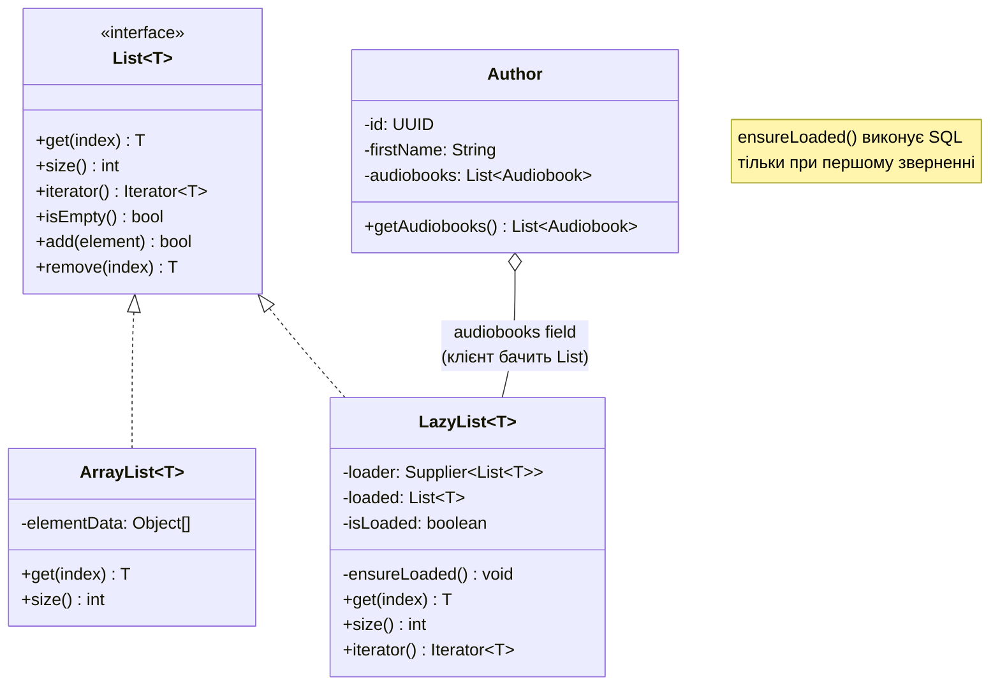
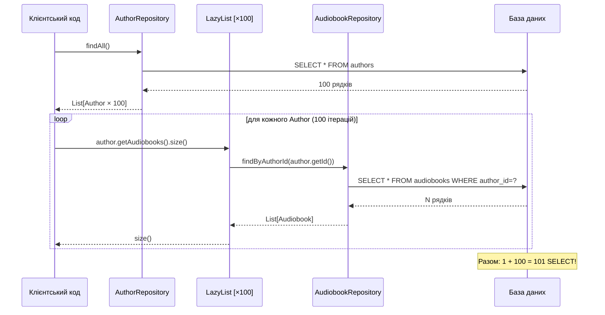
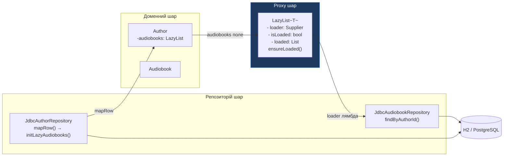

# Proxy: Lazy Loading для One-To-Many колекцій

## Вступ: Ціна доступу до пов'язаних даних

У нашому репозиторії аудіоплатформи між `Author` і `Audiobook` існує зв'язок **One-To-Many**: один автор може мати написати багато аудіокниг. У реляційній базі даних цей зв'язок виражається через зовнішній ключ:

```sql
-- Таблиця аудіокниг зберігає посилання на автора
audiobooks.author_id → authors.id
```

У Java-моделі цей зв'язок природно виражається через колекцію:

```java
public class Author {
    private UUID id;
    private String firstName;
    private String lastName;
    private List<Audiobook> audiobooks; // One-To-Many
}
```

Питання, що негайно постає перед будь-яким розробником: **коли завантажувати ці аудіокниги?**

### Варіант 1: Eager Loading (завантаження одразу)

Завантажити всі аудіокниги автора разом із самим автором в одному запиті:

```java
// У JdbcAuthorRepository.findById():
Author author = mapAuthorRow(rs);
List<Audiobook> books = audiobookRepo.findByAuthorId(author.getId()); // другий SELECT
author.setAudiobooks(books);
return author;
```

**Проблема Eager Loading:** якщо ви завантажуєте список авторів (`findAll()`) для побудови сторінки каталогу, де показуються лише `firstName` і `lastName`, — ви все одно виконуєте N+1 запити:

```
SELECT * FROM authors                     -- 1 запит: повертає 100 авторів
SELECT * FROM audiobooks WHERE author_id=?  -- запит для автора 1
SELECT * FROM audiobooks WHERE author_id=?  -- запит для автора 2
...
SELECT * FROM audiobooks WHERE author_id=?  -- запит для автора 100
                                          -- = 101 SELECT загалом!
```

Це і є класична **N+1 Query Problem**: 1 запит для завантаження батьківських сутностей + N запитів для дочірніх, де N — кількість батьківських.

### Варіант 2: Lazy Loading (відкладене завантаження)

Завантажувати аудіокниги лише тоді, коли клієнтський код **фактично звертається** до `author.getAudiobooks()`:

```java
// Перший виклик: SELECT * FROM audiobooks WHERE author_id=?
List<Audiobook> books = author.getAudiobooks();

// Другий виклик: жодного SQL — повертає вже завантажений список
List<Audiobook> sameBooks = author.getAudiobooks();
```

Lazy Loading вирішує проблему **передчасного завантаження**: якщо сторінка каталогу авторів не відображає їх книги — SQL для книг не виконується взагалі.

::warning
Lazy Loading **переміщує** N+1 Problem, а не вирішує її. Якщо ви ітеруєте по списку авторів і для кожного викликаєте `getAudiobooks()` — ви отримаєте ті самі 101 запити, але тепер у циклі, а не в `findAll()`. Рішення — **JOIN-запит** (Eager з одним запитом) або **batch loading** (завантаження всіх книг для всіх авторів одним SELECT). Обидва варіанти розглянуті наприкінці статті.
::

---

## Концепція: Proxy Pattern (GoF)

**Proxy** (GoF, *Design Patterns*, 1994):

> *«Provide a surrogate or placeholder for another object to control access to it.»*
>
> *«Надає замінник або заповнювач для іншого об'єкта для контролю доступу до нього.»*

GoF визначає три основні варіанти Proxy:

::card-group

::card{title="Virtual Proxy" icon="i-heroicons-clock"}

Відкладає створення або завантаження дорогого ресурсу до першого звернення.

**Наш випадок:** `LazyList<Audiobook>` не виконує SQL до першого виклику `get()`, `size()`, `iterator()` тощо.

::

::card{title="Remote Proxy" icon="i-heroicons-globe-alt"}

Приховує мережеву комунікацію з віддаленим об'єктом. Клієнт думає, що спілкується з локальним об'єктом.

**Приклад:** Java RMI stub, gRPC-клієнт.

::

::card{title="Protection Proxy" icon="i-heroicons-shield-check"}

Контролює доступ до методів на основі прав. Перевіряє авторизацію перед делегуванням.

**Приклад:** Spring Security's `@PreAuthorize`, read-only proxy для незмінних колекцій.

::

::

Для Lazy Loading ми реалізуємо **Virtual Proxy**: клас `LazyList<T>`, що реалізує `List<T>` і є **прозорим замінником** для звичайного `ArrayList<T>`. Клієнтський код (поле `author.getAudiobooks()`) не знає, чи він отримав вже завантажений список чи Proxy — інтерфейс `List<T>` однаковий.

::mermaid



::

---

## Реалізація `LazyList<T>`

`LazyList<T>` є серцем нашого Lazy Loading. Він делегує всі операції справжньому `List<T>`, але затримує виклик завантажувача (`loader`) до першого звернення до вмісту.

```java showLineNumbers
package com.example.audiobook.persistence;

import java.util.AbstractList;
import java.util.ArrayList;
import java.util.Iterator;
import java.util.List;
import java.util.ListIterator;
import java.util.function.Supplier;

/**
 * Virtual Proxy для відкладеного завантаження колекцій.
 * <p>
 * Реалізує {@link List} (через {@link AbstractList}) і веде себе як
 * звичайний список, але фактично завантажує дані лише при першому
 * зверненні до будь-якого методу, що потребує вмісту колекції
 * ({@link #get}, {@link #size}, {@link #iterator} тощо).
 * <p>
 * <b>Принцип роботи:</b>
 * <ol>
 *   <li>Створюється з {@link Supplier} — лямбдою, що виконує SQL.</li>
 *   <li>Перше звернення до вмісту → викликається {@link #ensureLoaded()} → SQL.</li>
 *   <li>Результат кешується у {@code loaded} → наступні звернення без SQL.</li>
 * </ol>
 * <p>
 * <b>Прозорість:</b> клієнтський код отримує {@code List<Audiobook>}
 * і не знає, що це {@code LazyList} — інтерфейс однаковий.
 *
 * @param <T> тип елементів колекції (наприклад, {@code Audiobook})
 */
public class LazyList<T> extends AbstractList<T> {

    /**
     * Постачальник даних: лямбда, що виконує SQL і повертає завантажені об'єкти.
     * Викликається лише один раз — при першому зверненні до вмісту.
     */
    private final Supplier<List<T>> loader;

    /**
     * Кешований результат після першого завантаження.
     * {@code null} до першого виклику {@link #ensureLoaded()}.
     */
    private List<T> loaded;

    /**
     * Прапор: {@code true} після першого завантаження.
     * Використовуємо окремий булевий флаг замість {@code loaded != null},
     * оскільки {@code loader} може повернути порожній список (не null).
     */
    private boolean isLoaded = false;

    /**
     * Створює LazyList з постачальником даних.
     *
     * @param loader лямбда, що повертає дані при першому зверненні.
     *               Наприклад: {@code () -> audiobookRepo.findByAuthorId(authorId)}
     */
    public LazyList(Supplier<List<T>> loader) {
        this.loader = loader;
    }

    /**
     * Внутрішній метод ініціалізації: виконує завантаження при першому зверненні.
     * <p>
     * Всі публічні методи, що потребують вмісту, делегують через цей метод.
     * Це єдине місце, де відбувається SQL-виконання.
     */
    private void ensureLoaded() {
        if (!isLoaded) {
            loaded = new ArrayList<>(loader.get()); // виконати SQL і кешувати результат
            isLoaded = true;
        }
    }

    /**
     * Повертає елемент за індексом.
     * При першому виклику виконує SQL через {@link #ensureLoaded()}.
     */
    @Override
    public T get(int index) {
        ensureLoaded();
        return loaded.get(index);
    }

    /**
     * Повертає кількість елементів.
     * При першому виклику виконує SQL.
     * <p>
     * Це важливий момент: навіть {@code size()} ініціює завантаження,
     * оскільки кількість елементів невідома без SQL.
     */
    @Override
    public int size() {
        ensureLoaded();
        return loaded.size();
    }

    /**
     * Перевіряє, чи список порожній.
     * При першому виклику виконує SQL.
     */
    @Override
    public boolean isEmpty() {
        ensureLoaded();
        return loaded.isEmpty();
    }

    /**
     * Повертає ітератор.
     * Ініціює завантаження при першому зверненні.
     * Використовується у for-each циклах.
     */
    @Override
    public Iterator<T> iterator() {
        ensureLoaded();
        return loaded.iterator();
    }

    @Override
    public ListIterator<T> listIterator() {
        ensureLoaded();
        return loaded.listIterator();
    }

    @Override
    public ListIterator<T> listIterator(int index) {
        ensureLoaded();
        return loaded.listIterator(index);
    }

    /**
     * Перевіряє, чи список вже завантажений.
     * Корисно для тестів і логування — дозволяє перевірити,
     * чи був виконаний SQL.
     *
     * @return {@code true} якщо вміст вже завантажений з БД
     */
    public boolean isLoaded() {
        return isLoaded;
    }

    /**
     * Скидає кеш, змушуючи наступне звернення знову виконати SQL.
     * <p>
     * Викликається при інвалідації кешу: наприклад, після додавання
     * або видалення аудіокниги у репозиторії.
     */
    public void invalidate() {
        loaded = null;
        isLoaded = false;
    }

    /**
     * Повертає рядкове представлення.
     * <b>Увага:</b> цей метод ініціює завантаження!
     * Не використовуйте у логах, якщо хочете уникнути SQL.
     */
    @Override
    public String toString() {
        ensureLoaded();
        return loaded.toString();
    }
}
```

### Чому `AbstractList<T>`, а не пряма реалізація `List<T>`?

`List<T>` має 25 методів. Пряма реалізація всіх через `ensureLoaded() + loaded.method()` — це ~150 рядків механічного коду. `AbstractList<T>` є скелетною реалізацією, що реалізує більшість методів через лише два **абстрактні**: `get(int index)` і `size()`. Решта (contains, indexOf, subList, equals, hashCode тощо) реалізовані через ці два у `AbstractList`.

Ми перевизначаємо лише `iterator()` і `listIterator()` для кращої продуктивності (щоб уникнути зайвих викликів через `get()`).

---

## Інтеграція з `Author`

Після реалізації `LazyList<T>` підключимо його до доменного класу `Author`:

```java showLineNumbers
package com.example.audiobook.domain;

import com.example.audiobook.persistence.LazyList;

import java.util.List;
import java.util.UUID;
import java.util.function.Supplier;

/**
 * Доменна сутність Автор із підтримкою Lazy Loading для колекції аудіокниг.
 * <p>
 * Поле {@code audiobooks} є {@link LazyList} — Virtual Proxy,
 * що завантажує аудіокниги з БД при першому зверненні.
 * Клієнтський код працює з {@code List<Audiobook>} і не знає
 * про наявність Proxy.
 */
public class Author {

    private UUID   id;
    private String firstName;
    private String lastName;
    private String bio;
    private String imagePath;

    /**
     * Колекція аудіокниг цього автора.
     * <p>
     * За замовчуванням — {@code null} (не ініціалізовано).
     * Ініціалізується репозиторієм через {@link #initLazyAudiobooks(Supplier)}.
     * При зверненні до {@code getAudiobooks()} виконується SQL лише якщо
     * {@code audiobooks} — це {@link LazyList} і він ще не завантажений.
     */
    private List<Audiobook> audiobooks;

    public Author(String firstName, String lastName) {
        this.id = UUID.randomUUID();
        this.firstName = firstName;
        this.lastName = lastName;
    }

    /**
     * Ініціалізує lazy-завантаження аудіокниг.
     * <p>
     * Викликається репозиторієм після маппінгу основних полів автора.
     * Передається лямбда ({@link Supplier}), що виконає SQL при першому
     * зверненні до {@link #getAudiobooks()}.
     *
     * @param loader лямбда-завантажувач: {@code () -> audiobookRepo.findByAuthorId(id)}
     */
    public void initLazyAudiobooks(Supplier<List<Audiobook>> loader) {
        this.audiobooks = new LazyList<>(loader);
    }

    /**
     * Повертає колекцію аудіокниг.
     * <p>
     * Якщо {@code audiobooks} — це {@link LazyList}, перше звернення
     * виконає {@code SELECT * FROM audiobooks WHERE author_id = ?}.
     * Наступні звернення повертають кешований результат.
     * <p>
     * Якщо {@code audiobooks} не ініціалізовано ({@code null}),
     * повертає порожній незмінний список — безпечний default.
     *
     * @return список аудіокниг; ніколи не повертає {@code null}
     */
    public List<Audiobook> getAudiobooks() {
        if (audiobooks == null) {
            return List.of(); // ще не підключено lazy-loader
        }
        return audiobooks; // LazyList виконає SQL при першому зверненні
    }

    /**
     * Встановлює конкретний список (замість lazy-завантаження).
     * Використовується при:
     * - JOIN-завантаженні (всі дані прийшли в одному запиті)
     * - Тестах (фіксована колекція без SQL)
     * - Після збереження нової аудіокниги (інвалідація lazy-кешу)
     */
    public void setAudiobooks(List<Audiobook> audiobooks) {
        this.audiobooks = audiobooks;
    }

    /**
     * Перевіряє, чи аудіокниги вже завантажені з БД.
     * Корисно для діагностики та тестування.
     */
    public boolean isAudiobooksLoaded() {
        return audiobooks instanceof LazyList<Audiobook> lazy
            ? lazy.isLoaded()
            : audiobooks != null;
    }

    // ─── Стандартні getter/setter ─────────────────────────────────────────────

    public UUID   getId()        { return id; }
    public void   setId(UUID id) { this.id = id; }
    public String getFirstName() { return firstName; }
    public void   setFirstName(String firstName) { this.firstName = firstName; }
    public String getLastName()  { return lastName; }
    public void   setLastName(String lastName)   { this.lastName = lastName; }
    public String getBio()       { return bio; }
    public void   setBio(String bio) { this.bio = bio; }
    public String getImagePath() { return imagePath; }
    public void   setImagePath(String imagePath) { this.imagePath = imagePath; }
}
```

---

## Оновлений `JdbcAuthorRepository`: Підключення LazyList

Репозиторій встановлює lazy-loader одразу після маппінгу основних полів автора:

```java showLineNumbers
package com.example.audiobook.repository.jdbc;

import com.example.audiobook.db.ConnectionManager;
import com.example.audiobook.domain.Author;
import com.example.audiobook.domain.Audiobook;
import com.example.audiobook.repository.AudiobookRepository;

import java.sql.ResultSet;
import java.sql.SQLException;
import java.util.UUID;

/**
 * JDBC-репозиторій авторів із підтримкою Lazy Loading для аудіокниг.
 * <p>
 * Після завантаження основних полів {@link Author} ініціалізує
 * lazy-завантаження через {@link Author#initLazyAudiobooks}.
 * SQL для аудіокниг виконується лише при зверненні до
 * {@link Author#getAudiobooks()}.
 */
public class JdbcAuthorRepository extends AbstractJdbcRepository<Author, UUID>
        implements com.example.audiobook.repository.AuthorRepository {

    /**
     * Репозиторій аудіокниг — потрібен для lazy-завантаження пов'язаних книг.
     * Передається через конструктор для дотримання DIP.
     */
    private final AudiobookRepository audiobookRepository;

    public JdbcAuthorRepository(
            ConnectionManager cm,
            com.example.audiobook.repository.strategy.SqlStrategy<Author> strategy,
            AudiobookRepository audiobookRepository) {
        super(cm, strategy);
        this.audiobookRepository = audiobookRepository;
    }

    /**
     * Маппінг рядка ResultSet у Author із підключенням lazy-loader.
     * <p>
     * <b>Критично важлива деталь:</b> ми захоплюємо {@code authorId}
     * в локальну final-змінну перед передачею в лямбду. Це необхідно,
     * оскільки лямбда може виконатися пізніше ніж {@code mapRow()},
     * і локальна змінна повинна бути effectively final.
     */
    @Override
    protected Author mapRow(ResultSet rs) throws SQLException {
        // Крок 1: Завантажити основні поля автора (без аудіокниг)
        Author author = new Author(
            rs.getString("first_name"),
            rs.getString("last_name")
        );
        author.setId(rs.getObject("id", UUID.class));
        author.setBio(rs.getString("bio"));
        author.setImagePath(rs.getString("image_path"));

        // Крок 2: Захопити ID у effectively final-змінну для лямбди
        UUID authorId = author.getId();

        // Крок 3: Підключити lazy-loader — SQL не виконується зараз!
        // Лямбда () -> ... буде викликана лише при author.getAudiobooks()
        author.initLazyAudiobooks(
            () -> audiobookRepository.findByAuthorId(authorId)
        );

        return author;
        // В цей момент: 1 SELECT (автор) виконано, 0 SELECT для аудіокниг
    }
}
```

**Ключова деталь** у рядку `UUID authorId = author.getId()`: лямбда `() -> audiobookRepository.findByAuthorId(authorId)` захоплює `authorId` зі стеку методу `mapRow()`. Якби ми написали `() -> audiobookRepository.findByAuthorId(author.getId())` — це теж спрацювало б, але `author` мусить бути effectively final. Явна `authorId`-змінна є більш читабельним і явним рішенням.

---
## `AudiobookRepository`: Метод `findByAuthorId`

Для роботи lazy-loader необхідно реалізувати метод `findByAuthorId` у `JdbcAudiobookRepository`:

```java showLineNumbers
package com.example.audiobook.repository.jdbc;

import com.example.audiobook.db.ConnectionManager;
import com.example.audiobook.db.DatabaseException;
import com.example.audiobook.domain.Audiobook;
import com.example.audiobook.domain.Author;
import com.example.audiobook.domain.Genre;
import com.example.audiobook.repository.AudiobookRepository;

import java.sql.*;
import java.util.ArrayList;
import java.util.List;
import java.util.UUID;

/**
 * JDBC-репозиторій аудіокниг.
 * Реалізує {@link #findByAuthorId} — запит, необхідний для Lazy Loading
 * у {@link com.example.audiobook.domain.Author#getAudiobooks()}.
 */
public class JdbcAudiobookRepository
        extends AbstractJdbcRepository<Audiobook, UUID>
        implements AudiobookRepository {

    public JdbcAudiobookRepository(
            ConnectionManager cm,
            com.example.audiobook.repository.strategy.SqlStrategy<Audiobook> strategy) {
        super(cm, strategy);
    }

    /**
     * Завантажує всі аудіокниги зазначеного автора.
     * <p>
     * Це метод, що викликається lazy-loader'ом при першому зверненні
     * до {@link com.example.audiobook.domain.Author#getAudiobooks()}.
     *
     * @param authorId UUID автора
     * @return список аудіокниг; порожній список якщо немає жодної
     */
    @Override
    public List<Audiobook> findByAuthorId(UUID authorId) {
        String sql = """
            SELECT ab.id,
                   ab.title,
                   ab.year,
                   ab.price,
                   ab.description,
                   ab.cover_path,
                   a.id           AS author_id,
                   a.first_name,
                   a.last_name,
                   g.id           AS genre_id,
                   g.name         AS genre_name
            FROM audiobooks ab
            JOIN authors a ON ab.author_id = a.id
            JOIN genres  g ON ab.genre_id  = g.id
            WHERE ab.author_id = ?
            ORDER BY ab.year DESC, ab.title ASC
            """;

        try (Connection conn = connectionManager.getConnection();
             PreparedStatement stmt = conn.prepareStatement(sql)) {

            stmt.setObject(1, authorId);
            try (ResultSet rs = stmt.executeQuery()) {
                List<Audiobook> result = new ArrayList<>();
                while (rs.next()) {
                    result.add(mapRow(rs));
                }
                return result;
            }
        } catch (SQLException e) {
            throw new DatabaseException("findByAuthorId failed for authorId=" + authorId, e);
        }
    }

    /**
     * Маппінг рядка ResultSet у Audiobook.
     * <p>
     * У запиті {@link #findByAuthorId} вже є JOIN з авторами і жанрами,
     * тому маппінг одразу включає ці дані — без додаткових SELECT.
     */
    @Override
    protected Audiobook mapRow(ResultSet rs) throws SQLException {
        // Маппінг автора (скорочений — тільки для відображення)
        Author author = new Author(
            rs.getString("first_name"),
            rs.getString("last_name")
        );
        author.setId(rs.getObject("author_id", UUID.class));

        // Маппінг жанру
        Genre genre = new Genre(rs.getString("genre_name"));
        genre.setId(rs.getObject("genre_id", UUID.class));

        // Маппінг книги
        Audiobook book = new Audiobook(
            rs.getString("title"),
            author,
            genre
        );
        book.setId(rs.getObject("id", UUID.class));
        book.setYear(rs.getInt("year"));
        book.setDescription(rs.getString("description"));
        book.setCoverPath(rs.getString("cover_path"));

        // price може бути null (безкоштовна книга)
        java.math.BigDecimal price = rs.getBigDecimal("price");
        if (price != null) {
            book.setPrice(price);
        }

        return book;
    }
}
```

---

## Демонстрація: Lazy Loading у дії

```java showLineNumbers
package com.example.audiobook;

import com.example.audiobook.db.ConnectionManager;
import com.example.audiobook.domain.Author;
import com.example.audiobook.domain.Audiobook;
import com.example.audiobook.domain.Genre;
import com.example.audiobook.persistence.LazyList;
import com.example.audiobook.repository.jdbc.*;
import com.example.audiobook.repository.strategy.SqlStrategyFactory;

import java.util.List;
import java.util.UUID;

public class Main {

    public static void main(String[] args) {
        ConnectionManager cm = ConnectionManager.forH2("./data/audiobook_db");
        var factory = SqlStrategyFactory.forH2();

        var audiobookRepo = new JdbcAudiobookRepository(cm, factory.audiobookStrategy());
        var authorRepo    = new JdbcAuthorRepository(cm, factory.authorStrategy(), audiobookRepo);
        var genreRepo     = new JdbcGenreRepository(cm, factory.genreStrategy());

        // ── Підготовка тестових даних ─────────────────────────────────────
        Author franko = new Author("Іван", "Франко");
        authorRepo.save(franko);
        UUID frankoId = franko.getId();

        Genre proza = new Genre("Проза");
        genreRepo.save(proza);

        Audiobook zakhar  = new Audiobook("Захар Беркут",     franko, proza);
        Audiobook boryslav = new Audiobook("Борислав сміється", franko, proza);
        audiobookRepo.save(zakhar);
        audiobookRepo.save(boryslav);

        // ── Сценарій 1: Lazy Loading ──────────────────────────────────────
        System.out.println("=== Завантаження автора (без книг) ===");
        // findById виконує: SELECT ... FROM authors WHERE id = ?
        // Книги НЕ завантажуються
        Author loaded = authorRepo.findById(frankoId).orElseThrow();

        // Перевірка: LazyList ще не завантажений
        System.out.println("isAudiobooksLoaded: " + loaded.isAudiobooksLoaded()); // false

        System.out.println("\n=== Перший доступ до getAudiobooks() ===");
        // ТУТ виконується SELECT * FROM audiobooks WHERE author_id = ?
        List<Audiobook> books = loaded.getAudiobooks(); // ← SQL виконується!
        System.out.println("Книг завантажено: " + books.size()); // 2
        System.out.println("isAudiobooksLoaded: " + loaded.isAudiobooksLoaded()); // true

        System.out.println("\n=== Повторний доступ до getAudiobooks() ===");
        List<Audiobook> sameBooks = loaded.getAudiobooks(); // ← SQL НЕ виконується
        System.out.println("Книг у кеші: " + sameBooks.size()); // 2

        // ── Сценарій 2: For-each із lazy-колекцією ───────────────────────
        System.out.println("\n=== Ітерація по книгах ===");
        for (Audiobook book : loaded.getAudiobooks()) {
            System.out.println("  ✓ " + book.getTitle()
                + " (" + book.getYear() + ")");
        }

        // ── Сценарій 3: Автор без книг ───────────────────────────────────
        System.out.println("\n=== Автор без книг ===");
        Author lesya = new Author("Леся", "Українка");
        authorRepo.save(lesya);

        Author loadedLesya = authorRepo.findById(lesya.getId()).orElseThrow();
        List<Audiobook> lesyaBooks = loadedLesya.getAudiobooks(); // SQL виконується
        System.out.println("Книг у Лесі: " + lesyaBooks.size()); // 0
        System.out.println("isEmpty: " + lesyaBooks.isEmpty()); // true

        // ── Сценарій 4: Інвалідація після додавання нової книги ──────────
        System.out.println("\n=== Додавання нової книги та інвалідація кешу ===");
        Audiobook moisey = new Audiobook("Мойсей", franko, proza);
        audiobookRepo.save(moisey);

        // LazyList вже завантажений — не знає про нову книгу
        System.out.println("Книг ПЕРЕД інвалідацією: " + loaded.getAudiobooks().size()); // 2

        // Інвалідуємо кеш
        if (loaded.getAudiobooks() instanceof LazyList<Audiobook> lazy) {
            lazy.invalidate();
        }
        // Наступний getAudiobooks() знову виконає SQL
        System.out.println("Книг ПІСЛЯ інвалідації:  " + loaded.getAudiobooks().size()); // 3

        cm.close();
    }
}
```

::terminal-preview{title="java Main" :cursor="false"}
<div class="line"><span class="opacity-40">$</span> <strong>java -cp . com.example.audiobook.Main</strong></div>
<div class="line"><span class="text-blue-400 font-bold">[Pool]</span> Ініціалізовано: 2 з'єднань готові</div>
<div class="line"></div>
<div class="line"><span class="font-bold">=== Завантаження автора (без книг) ===</span></div>
<div class="line"><span class="text-yellow-400">[SQL]</span> SELECT id, first_name, last_name, bio, image_path FROM authors WHERE id = ?</div>
<div class="line">isAudiobooksLoaded: <span class="text-red-400">false</span></div>
<div class="line"></div>
<div class="line"><span class="font-bold">=== Перший доступ до getAudiobooks() ===</span></div>
<div class="line"><span class="text-yellow-400">[SQL]</span> SELECT ab.id, ab.title, ... FROM audiobooks ab JOIN authors a ... WHERE ab.author_id = ?</div>
<div class="line">Книг завантажено: 2</div>
<div class="line">isAudiobooksLoaded: <span class="text-green-400">true</span></div>
<div class="line"></div>
<div class="line"><span class="font-bold">=== Повторний доступ до getAudiobooks() ===</span></div>
<div class="line"><span class="text-green-400">✓</span> <em>Cache hit — SQL не виконується</em></div>
<div class="line">Книг у кеші: 2</div>
<div class="line"></div>
<div class="line"><span class="font-bold">=== Ітерація по книгах ===</span></div>
<div class="line">  ✓ Борислав сміється (1881)</div>
<div class="line">  ✓ Захар Беркут (1883)</div>
<div class="line"></div>
<div class="line"><span class="font-bold">=== Автор без книг ===</span></div>
<div class="line"><span class="text-yellow-400">[SQL]</span> SELECT id, first_name, last_name, bio, image_path FROM authors WHERE id = ?</div>
<div class="line"><span class="text-yellow-400">[SQL]</span> SELECT ab.id, ... FROM audiobooks ab ... WHERE ab.author_id = ?</div>
<div class="line">Книг у Лесі: 0</div>
<div class="line">isEmpty: <span class="text-green-400">true</span></div>
<div class="line"></div>
<div class="line"><span class="font-bold">=== Додавання нової книги та інвалідація кешу ===</span></div>
<div class="line">Книг ПЕРЕД інвалідацією: 2</div>
<div class="line"><span class="text-green-400">✓</span> LazyList інвалідовано</div>
<div class="line"><span class="text-yellow-400">[SQL]</span> SELECT ab.id, ... FROM audiobooks ab ... WHERE ab.author_id = ?</div>
<div class="line">Книг ПІСЛЯ інвалідації: 3</div>
<div class="line"><span class="text-blue-400 font-bold">[Pool]</span> Закрито. Закрито 2 з'єднань</div>
::

## N+1 Query Problem: Аналіз і Рішення

Як було згадано на початку статті, Lazy Loading **переміщує** N+1 проблему, але не вирішує її. Розглянемо конкретний сценарій:

```java
// Сценарій: відображення каталогу авторів з кількістю книг
List<Author> authors = authorRepo.findAll(); // 1 SELECT → 100 авторів

for (Author author : authors) {
    // getAudiobooks() → LazyList.ensureLoaded() → findByAuthorId() → SELECT
    int bookCount = author.getAudiobooks().size();
    System.out.println(author.getLastName() + ": " + bookCount + " книг");
}
// Разом: 1 + 100 = 101 SELECT
```

::mermaid



::

### Рішення 1: JOIN (Eager зі одним запитом)

Завантажити авторів разом з кількістю книг в **одному** запиті:

```java
/**
 * Завантажує авторів з кількістю аудіокниг — один JOIN-запит замість N+1.
 * Підходить коли потрібна лише агрегована інформація (count),
 * а не повна колекція аудіокниг.
 */
public List<AuthorWithBookCount> findAllWithBookCount() {
    String sql = """
        SELECT a.id,
               a.first_name,
               a.last_name,
               COUNT(ab.id) AS book_count
        FROM authors a
        LEFT JOIN audiobooks ab ON a.id = ab.author_id
        GROUP BY a.id, a.first_name, a.last_name
        ORDER BY a.last_name
        """;
    // ... виконати і змапити у List<AuthorWithBookCount>
}
```

Результат: **1 SELECT** замість 101, незалежно від кількості авторів.

### Рішення 2: Batch Loading (завантаження усіх книг для усіх авторів)

Якщо потрібні повні колекції (а не лише count), Batch Loading завантажує всі аудіокниги для всіх авторів **одним запитом** через `IN (...)`:

```java showLineNumbers
/**
 * Завантажує авторів і підтягує їх аудіокниги одним додатковим SELECT.
 * Разом: 2 запити замість N+1.
 * <p>
 * Алгоритм:
 * 1. SELECT * FROM authors                             → 1 запит
 * 2. SELECT * FROM audiobooks WHERE author_id IN (?, ?, ...) → 1 запит
 * 3. Розподілити книги по авторах у Java
 */
public List<Author> findAllWithAudiobooks() {
    // Крок 1: Завантажити всіх авторів (без книг)
    List<Author> authors = findAll();
    if (authors.isEmpty()) return authors;

    // Крок 2: Зібрати всі ID авторів
    List<UUID> authorIds = authors.stream()
        .map(Author::getId)
        .toList();

    // Крок 3: Завантажити всі книги для всіх авторів — один запит з IN (...)
    Map<UUID, List<Audiobook>> booksByAuthor = audiobookRepository.findByAuthorIds(authorIds);

    // Крок 4: Розподілити книги по авторах у Java (без SQL)
    for (Author author : authors) {
        List<Audiobook> books = booksByAuthor.getOrDefault(author.getId(), List.of());
        author.setAudiobooks(books); // встановити завантажений список (не LazyList)
    }

    return authors;
    // Разом: 2 SELECT незалежно від кількості авторів!
}
```

```java
// AudiobookRepository: метод для batch loading
public Map<UUID, List<Audiobook>> findByAuthorIds(List<UUID> authorIds) {
    // Генеруємо IN (?, ?, ?, ...) динамічно
    String placeholders = authorIds.stream()
        .map(id -> "?")
        .collect(java.util.stream.Collectors.joining(", "));

    String sql = """
        SELECT ab.*, a.first_name, a.last_name, g.id AS genre_id, g.name AS genre_name
        FROM audiobooks ab
        JOIN authors a ON ab.author_id = a.id
        JOIN genres  g ON ab.genre_id  = g.id
        WHERE ab.author_id IN (%s)
        ORDER BY ab.author_id, ab.year DESC
        """.formatted(placeholders);

    Map<UUID, List<Audiobook>> result = new java.util.LinkedHashMap<>();
    try (Connection conn = connectionManager.getConnection();
         PreparedStatement stmt = conn.prepareStatement(sql)) {

        // Встановити всі ID як параметри
        for (int i = 0; i < authorIds.size(); i++) {
            stmt.setObject(i + 1, authorIds.get(i));
        }

        try (ResultSet rs = stmt.executeQuery()) {
            while (rs.next()) {
                UUID authorId = rs.getObject("author_id", UUID.class);
                Audiobook book = mapRow(rs);
                result.computeIfAbsent(authorId, k -> new ArrayList<>()).add(book);
            }
        }
    } catch (SQLException e) {
        throw new DatabaseException("findByAuthorIds failed", e);
    }
    return result;
}
```

### Порівняння стратегій завантаження

| Стратегія | Кількість SELECT | Коли підходить |
|---|---|---|
| **Eager (завжди)** | 1 (JOIN) | Колекція майже завжди потрібна |
| **Lazy Loading** | 1 + N (по запиту) | Колекція часто не потрібна, поодинокі завантаження |
| **Batch Loading** | 2 | Список авторів + всі їх колекції разом |
| **JOIN з агрегацією** | 1 | Потрібна лише статистика (count, sum) |

::note
У Hibernate це вирішується через `@OneToMany(fetch = FetchType.LAZY)` (Lazy, за замовчуванням) та `JOIN FETCH` у JPQL (Eager з одним запитом для конкретного запиту). Batch Loading керується через `@BatchSize` або `hibernate.default_batch_fetch_size`. Наша ручна реалізація демонструє **саме ті механізми**, що ORM автоматизує.
::

---

## Проблеми Lazy Loading

### Проблема 1: LazyInitializationException (аналог Hibernate)

У Hibernate є класична помилка `LazyInitializationException`: спроба звернутися до lazy-колекції після закриття `Session` (коли `Connection` вже повернено у пул).

У нашій реалізації аналогічна проблема: якщо `ConnectionManager` закрито (`cm.close()`), а потім викликається `author.getAudiobooks()` — `LazyList` спробує взяти з'єднання з уже закритого пулу і отримає виключення:

```java
cm.close(); // З'єднання повернуті в пул, пул закрито

// ← LazyList ще не завантажений
Author author = loadedAuthor; // об'єкт залишився у пам'яті
List<Audiobook> books = author.getAudiobooks(); // ← DatabaseException!
// LazyList.ensureLoaded() → findByAuthorId() → cm.getConnection() → помилка
```

**Рішення:** завжди завантажувати lazy-колекції в межах активної сесії (поки `ConnectionManager` відкритий). Це вимагає дисципліни від клієнтського коду.

### Проблема 2: Циклічні залежності при серіалізації

Якщо `Author` серіалізується у JSON (наприклад, для REST API) і `getAudiobooks()` повертає `LazyList`, що ще не завантажений — JSON-серіалізатор (Jackson) викличе `size()` або `iterator()`, що ініціює SQL. Це **непомітне виконання SQL** в контексті HTTP-відповіді.

```java
// REST-контролер (псевдокод):
@GetMapping("/authors/{id}")
public Author getAuthor(@PathVariable UUID id) {
    Author author = authorRepo.findById(id).orElseThrow();
    return author; // Jackson серіалізує всі поля, включаючи getAudiobooks()!
    // → LazyList.ensureLoaded() → SELECT → Series of SQL
}
```

**Рішення:** використовувати DTO (Data Transfer Object) замість прямої серіалізації доменних об'єктів. DTO не містить `LazyList` — тільки те, що явно додав розробник.

### Проблема 3: thread-safety

`LazyList` не є потокобезпечним. Якщо два потоки одночасно викликають `ensureLoaded()`:

```
Потік A: isLoaded = false → заходить у if
Потік B: isLoaded = false → заходить у if
Потік A: loaded = loader.get() ← виконує SQL
Потік B: loaded = loader.get() ← теж виконує SQL (race condition!)
Потік A: isLoaded = true
Потік B: isLoaded = true
```

Результат: `loader.get()` викликається двічі — два SQL-запити замість одного.

**Рішення:** `synchronized ensureLoaded()` або double-checked locking:

```java
private void ensureLoaded() {
    if (!isLoaded) {
        synchronized (this) {
            if (!isLoaded) { // double-check після отримання монітора
                loaded = new ArrayList<>(loader.get());
                isLoaded = true;
            }
        }
    }
}
```

Для per-request контексту (один HTTP-запит = один потік) ця проблема неактуальна.

---

## Підсумкова архітектура

::mermaid



::

---

## Підсумок

::card-group

::card{title="Що вирішує Proxy/Lazy Loading" icon="i-heroicons-check-circle"}

- Уникає завантаження пов'язаних даних, коли вони не потрібні
- `LazyList<T>` прозорий для клієнтів — інтерфейс `List<T>` однаковий
- Зменшує кількість SQL-запитів при поодиноких завантаженнях
- `invalidate()` дозволяє оновити кеш після змін у БД

::

::card{title="Обмеження та застереження" icon="i-heroicons-exclamation-triangle"}

- Переміщує N+1 Problem, а не вирішує (для списків — Batch Loading)
- Не є thread-safe без синхронізації
- SQL виконується у неочікуваних місцях (серіалізація, toString)
- Вимагає активного `ConnectionManager` при ініціалізації

::

::

Наша реалізація `LazyList<T>` є спрощеною версією того, що Hibernate реалізує через `PersistentBag`, `PersistentList`, `PersistentSet`. Hibernate-колекції також є Proxy-об'єктами: вони відслідковують зміни (add/remove), підтримують dirty-флаг для `Unit of Work` і реалізують Batch Loading через `@BatchSize`. Різниця лише в тому, що Hibernate робить це прозоро через байт-кодову інструментацію, тоді як наш `LazyList` потребує явної ініціалізації через `initLazyAudiobooks()`.

У наступній та завершальній статті ми розглянемо **Generic Repository через рефлексію**: як позбутися дублювання між `JdbcAuthorRepository`, `JdbcGenreRepository` та `JdbcAudiobookRepository`, використавши анотації та Java Reflection API.

---

## Завдання

::collapsible{title="Рівень 1: LazyList для Genre"}

Доданий зв'язок `Genre → List<Audiobook>` (один жанр — багато аудіокниг). Реалізуйте аналогічне до `Author` lazy-завантаження:

1. Додайте поле `private List<Audiobook> audiobooks` та метод `initLazyAudiobooks(Supplier<List<Audiobook>>)` до `Genre`.
2. У `JdbcGenreRepository.mapRow()` викликайте `genre.initLazyAudiobooks(() -> audiobookRepo.findByGenreId(genreId))`.
3. Додайте метод `findByGenreId(UUID genreId)` до `JdbcAudiobookRepository`.

Напишіть демонстрацію: завантажте 3 жанри, перевірте, що `isAudiobooksLoaded()` повертає `false` до і `true` після першого виклику `getAudiobooks()`.
::

::collapsible{title="Рівень 2: Thread-Safe LazyList"}

Модифікуйте `LazyList<T>` для безпечної роботи у багатопотоковому середовищі:

```java
// Варіант 1: Double-Checked Locking
private volatile boolean isLoaded = false; // volatile необхідний!
private void ensureLoaded() {
    if (!isLoaded) {
        synchronized (this) {
            if (!isLoaded) {
                loaded = new ArrayList<>(loader.get());
                isLoaded = true;
            }
        }
    }
}
```

Напишіть тест на конкурентність: 10 потоків одночасно викликають `size()` на одному LazyList. Підрахуйте кількість викликів `loader.get()` через `AtomicInteger`. З double-checked locking — має бути рівно 1. Без синхронізації — може бути більше.

Порівняйте також варіант із `AtomicBoolean` і `compareAndSet` — чи є він більш ефективним?
::

::collapsible{title="Рівень 3: Batch Loading через findAllWithAudiobooks"}

Реалізуйте повний метод `findAllWithAudiobooks()` в `JdbcAuthorRepository`:

```java
public List<Author> findAllWithAudiobooks() {
    // Крок 1: Завантажити всіх авторів
    List<Author> authors = findAll();

    // Крок 2: Зібрати всі ID у список
    List<UUID> ids = authors.stream().map(Author::getId).toList();

    // Крок 3: Один batch SELECT із IN (...)
    Map<UUID, List<Audiobook>> books = audiobookRepo.findByAuthorIds(ids);

    // Крок 4: Розподілити книги по авторах і встановити (не LazyList)
    authors.forEach(a -> a.setAudiobooks(books.getOrDefault(a.getId(), List.of())));

    return authors;
}
```

Реалізуйте також `findByAuthorIds(List<UUID>)` у `JdbcAudiobookRepository` з динамічним `IN (...)`.

Порівняйте кількість SQL-запитів у трьох сценаріях для 50 авторів:
1. `findAll()` + `author.getAudiobooks()` у циклі (Lazy N+1)
2. `findAll()` без доступу до книг (0 книг-запитів)
3. `findAllWithAudiobooks()` (Batch Loading, 2 запити)

Виведіть таблицю з кількістю SELECT для кожного сценарію.
::

