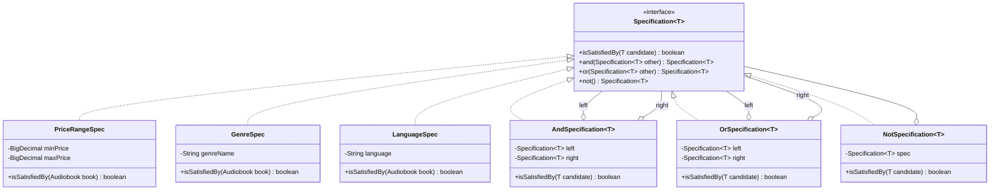

# Specification Pattern: Композиція бізнес-правил для складних запитів

## Вступ: Коли методів пошуку стає забагато

У попередніх статтях ми побудували архітектуру Repository + Data Mapper, що успішно відокремила доменну модель від SQL-логіки. Репозиторій `JdbcAuthorRepository` містить стандартні CRUD-операції (`findById`, `findAll`, `save`, `update`, `deleteById`) та кілька специфічних методів пошуку:

```java
public interface AuthorRepository extends Repository<Author, UUID> {
    List<Author> findByLastName(String lastNamePart);
    Optional<Author> findByFullName(String lastName, String firstName);
}
```

Це працює для простих сценаріїв. Але що станеться, коли бізнес-вимоги ускладнюються? Розглянемо реальні запити, що виникають у системі управління аудіоплатформою:

::card-group

::card{title="Запит 1: Фільтрація авторів" icon="i-heroicons-funnel"}

Знайти всіх авторів, чиє прізвище починається з «Шевч», які мають біографію, і у яких є хоча б одна опублікована аудіокнига.

::

::card{title="Запит 2: Пошук аудіокниг" icon="i-heroicons-magnifying-glass"}

Знайти аудіокниги жанру «Поезія» або «Проза», опубліковані після 2020 року, з ціною від 100 до 500 грн, мовою «українська».

::

::card{title="Запит 3: Динамічний фільтр" icon="i-heroicons-adjustments-horizontal"}

Користувач обирає фільтри у веб-інтерфейсі: жанр (опціонально), діапазон років (опціонально), мова (опціонально), максимальна ціна (опціонально). Кількість комбінацій — 2⁴ = 16 варіантів.

::

::

Наївний підхід — створити окремий метод для кожної комбінації:

```java
List<Audiobook> findByGenre(String genre);
List<Audiobook> findByGenreAndYear(String genre, Integer year);
List<Audiobook> findByGenreAndYearAndLanguage(String genre, Integer year, String lang);
List<Audiobook> findByGenreAndYearAndLanguageAndMaxPrice(...);
// ... ще 12 методів для всіх комбінацій
```

Це призводить до **комбінаторного вибуху**: кожна нова вимога множить кількість методів. Якщо у системі 5 критеріїв пошуку, кількість можливих комбінацій — 2⁵ = 32. Для 10 критеріїв — 1024 методи. Репозиторій перетворюється на нечитабельний монстр із сотнями рядків однотипного коду.

**Друга проблема — дублювання SQL-логіки.** Умова `WHERE price <= ?` повторюється у `findByMaxPrice()`, `findByGenreAndMaxPrice()`, `findByYearAndMaxPrice()` тощо. Зміна логіки (наприклад, додавання перевірки `price > 0`) вимагає правки у десятках місць.

**Третя проблема — відсутність повторного використання бізнес-правил.** Умова «аудіокнига доступна для покупки» може означати: ціна встановлена, мова підтримується платформою, жанр не заборонений у регіоні користувача. Це бізнес-правило, що має бути виражене один раз і використане скрізь — у пошуку, валідації, звітах.

Саме для вирішення цих проблем Ерік Еванс у книзі «Domain-Driven Design» (2003) описав патерн **Specification** — спосіб інкапсуляції бізнес-правил у композиційні об'єкти.

::note
Specification Pattern є одним із ключових тактичних патернів Domain-Driven Design. На відміну від Repository (що є інфраструктурним патерном), Specification належить до **доменного шару** — він виражає бізнес-логіку мовою предметної області.
::

---

## Концепція: Specification Pattern за Еріком Евансом

### Визначення

У книзі «Domain-Driven Design: Tackling Complexity in the Heart of Software» (2003) Ерік Еванс визначає Specification так:

> *«A Specification is a predicate that determines if an object satisfies certain criteria. It can be used to select objects from a collection, validate objects, or specify what kind of object should be created.»*
>
> *«Специфікація — це предикат, що визначає, чи задовольняє об'єкт певним критеріям. Вона може використовуватися для вибору об'єктів з колекції, валідації об'єктів або специфікації того, який об'єкт має бути створений.»*

Ключова ідея: **бізнес-правило інкапсульоване в окремий об'єкт**, що має метод `isSatisfiedBy(T candidate)`. Цей об'єкт можна комбінувати з іншими через логічні оператори (`AND`, `OR`, `NOT`), створюючи складні умови з простих будівельних блоків.

::mermaid



::

Зверніть увагу на композиційну структуру: `AndSpecification`, `OrSpecification` та `NotSpecification` самі реалізують `Specification<T>` і містять посилання на інші специфікації. Це класичний **Composite Pattern** (GoF) — дерево об'єктів, де листки (прості специфікації) і вузли (логічні оператори) мають однаковий інтерфейс.

### Приклад використання

Розглянемо, як виглядає клієнтський код із Specification:

```java
// Прості специфікації — будівельні блоки
Specification<Audiobook> poetry = new GenreSpec("Поезія");
Specification<Audiobook> prose  = new GenreSpec("Проза");
Specification<Audiobook> after2020 = new YearAfterSpec(2020);
Specification<Audiobook> affordable = new PriceRangeSpec(
    BigDecimal.valueOf(100), 
    BigDecimal.valueOf(500)
);
Specification<Audiobook> ukrainian = new LanguageSpec("українська");

// Композиція через логічні оператори
Specification<Audiobook> poetryOrProse = poetry.or(prose);
Specification<Audiobook> complexQuery = poetryOrProse
    .and(after2020)
    .and(affordable)
    .and(ukrainian);

// Використання у репозиторії
List<Audiobook> results = audiobookRepository.findAll(complexQuery);
```

Порівняймо з наївним підходом:

::tabs

::tabs-item{label="Без Specification"}

```java
// Жорстко закодований метод у репозиторії
List<Audiobook> findByGenresAndYearAndPriceAndLanguage(
    List<String> genres,
    Integer minYear,
    BigDecimal minPrice,
    BigDecimal maxPrice,
    String language
) {
    // SQL з багатьма умовами WHERE
    String sql = """
        SELECT ... FROM audiobooks ab
        JOIN genres g ON ab.genre_id = g.id
        WHERE (g.name = ? OR g.name = ?)
          AND ab.year > ?
          AND ab.price BETWEEN ? AND ?
          AND ab.language = ?
        """;
    // ... JDBC-код
}

// Виклик
List<Audiobook> results = repo.findByGenresAndYearAndPriceAndLanguage(
    List.of("Поезія", "Проза"), 2020, 
    BigDecimal.valueOf(100), BigDecimal.valueOf(500), 
    "українська"
);
```

::

::tabs-item{label="З Specification"}

```java
// Гнучка композиція — жодних нових методів у репозиторії
Specification<Audiobook> spec = new GenreSpec("Поезія")
    .or(new GenreSpec("Проза"))
    .and(new YearAfterSpec(2020))
    .and(new PriceRangeSpec(BigDecimal.valueOf(100), BigDecimal.valueOf(500)))
    .and(new LanguageSpec("українська"));

List<Audiobook> results = repo.findAll(spec);
```

::

::

Ключова перевага: **репозиторій має лише один метод** `findAll(Specification<T> spec)` замість десятків спеціалізованих методів. Нові комбінації критеріїв не вимагають змін у репозиторії — лише створення нових специфікацій або композиції існуючих.

---

## Два підходи до реалізації: In-Memory vs SQL

Specification Pattern може бути реалізований двома принципово різними способами, залежно від того, де виконується фільтрація:

::card-group

::card{title="In-Memory Specification" icon="i-heroicons-cpu-chip"}

**Фільтрація у Java-пам'яті:**
- `isSatisfiedBy(T candidate)` перевіряє об'єкт у пам'яті
- Репозиторій завантажує **всі** записи з БД
- Фільтрація виконується через `stream().filter(spec::isSatisfiedBy)`

**Переваги:**
- ✅ Простота реалізації
- ✅ Не залежить від SQL-діалекту
- ✅ Працює з будь-яким джерелом даних

**Недоліки:**
- ❌ Завантажує всі записи з БД (неефективно для великих таблиць)
- ❌ Фільтрація на стороні Java (повільно)
- ❌ Неможливо використати індекси БД

::

::card{title="SQL Specification" icon="i-heroicons-circle-stack"}

**Фільтрація на рівні БД:**
- Специфікація генерує SQL-фрагмент (`WHERE` умову)
- Репозиторій будує повний SQL-запит із цим фрагментом
- БД виконує фільтрацію через індекси

**Переваги:**
- ✅ Ефективно для великих таблиць
- ✅ Використовує індекси БД
- ✅ Мінімальне навантаження на мережу

**Недоліки:**
- ❌ Складніша реалізація
- ❌ Залежність від SQL-діалекту
- ❌ Не працює з in-memory колекціями

::

::

Для enterprise-систем із великими обсягами даних **SQL Specification є єдиним прийнятним варіантом**. Завантаження 100 000 записів у пам'ять для фільтрації 10 з них — неприпустима марнотратність.

У цій статті ми реалізуємо **SQL Specification** — підхід, що генерує `WHERE`-умови для JDBC-запитів.

---

## Реалізація: Інтерфейс Specification&lt;T&gt;

Почнемо з базового інтерфейсу. На відміну від класичного визначення Еванса (що містить лише `isSatisfiedBy`), наш інтерфейс буде **dual-mode**: підтримувати і in-memory перевірку, і SQL-генерацію.

```java showLineNumbers
package com.example.audiobook.specification;

/**
 * Базовий інтерфейс Specification Pattern за Еріком Евансом (DDD, 2003).
 * <p>
 * Specification інкапсулює бізнес-правило у вигляді предиката, що може бути:
 * <ul>
 *   <li>Застосований до об'єкта у пам'яті ({@link #isSatisfiedBy});</li>
 *   <li>Перетворений на SQL WHERE-умову ({@link #toSql});</li>
 *   <li>Скомбінований з іншими специфікаціями ({@link #and}, {@link #or}, {@link #not}).</li>
 * </ul>
 * <p>
 * <b>Приклад використання:</b>
 * <pre>{@code
 * Specification<Audiobook> affordable = new PriceRangeSpec(100, 500);
 * Specification<Audiobook> ukrainian  = new LanguageSpec("українська");
 * Specification<Audiobook> query = affordable.and(ukrainian);
 * 
 * // In-memory фільтрація
 * boolean matches = query.isSatisfiedBy(someBook);
 * 
 * // SQL-генерація
 * String whereClause = query.toSql();  // "price BETWEEN ? AND ? AND language = ?"
 * List<Object> params = query.getParameters();  // [100, 500, "українська"]
 * }</pre>
 *
 * @param <T> тип доменної сутності (Author, Genre, Audiobook)
 */
public interface Specification<T> {

    /**
     * Перевіряє, чи задовольняє об'єкт умовам специфікації (in-memory).
     * <p>
     * Використовується для валідації об'єктів у пам'яті або фільтрації
     * невеликих колекцій через {@code stream().filter(spec::isSatisfiedBy)}.
     *
     * @param candidate об'єкт для перевірки
     * @return {@code true} якщо об'єкт задовольняє умовам
     */
    boolean isSatisfiedBy(T candidate);

    /**
     * Генерує SQL WHERE-умову для цієї специфікації.
     * <p>
     * Повертає фрагмент SQL без ключового слова {@code WHERE}.
     * Параметри представлені як {@code ?} (JDBC placeholders).
     * <p>
     * <b>Приклад:</b> {@code "price <= ? AND language = ?"}
     *
     * @return SQL-фрагмент для WHERE-умови
     */
    String toSql();

    /**
     * Повертає список параметрів для {@link #toSql()} у порядку появи {@code ?}.
     * <p>
     * Ці значення передаються у {@link java.sql.PreparedStatement#setObject}.
     *
     * @return список параметрів (може бути порожнім)
     */
    java.util.List<Object> getParameters();

    /**
     * Логічне AND: обидві специфікації мають бути задоволені.
     *
     * @param other друга специфікація
     * @return нова специфікація {@code this AND other}
     */
    default Specification<T> and(Specification<T> other) {
        return new AndSpecification<>(this, other);
    }

    /**
     * Логічне OR: хоча б одна специфікація має бути задоволена.
     *
     * @param other друга специфікація
     * @return нова специфікація {@code this OR other}
     */
    default Specification<T> or(Specification<T> other) {
        return new OrSpecification<>(this, other);
    }

    /**
     * Логічне NOT: інверсія умови.
     *
     * @return нова специфікація {@code NOT this}
     */
    default Specification<T> not() {
        return new NotSpecification<>(this);
    }
}
```

**Ключові архітектурні рішення:**

- **Рядки 15–16** (`isSatisfiedBy` + `toSql`): dual-mode інтерфейс дозволяє використовувати ту саму специфікацію і для in-memory фільтрації, і для SQL-запитів. Це корисно для тестування: можна перевірити логіку специфікації без бази даних.
- **Рядок 24** (`getParameters`): параметри відокремлені від SQL-рядка — це забезпечує безпеку від SQL-ін'єкцій. Репозиторій передає їх у `PreparedStatement.setObject()`.
- **Рядки 32–47** (default-методи `and`, `or`, `not`): композиційні оператори реалізовані як default-методи Java 8+. Це дозволяє писати `spec1.and(spec2).or(spec3)` без явного створення `AndSpecification` вручну.

---

## Композиційні специфікації: AND, OR, NOT

Тепер реалізуємо три логічні оператори. Вони є **декораторами** (Decorator Pattern, GoF) — обгортають інші специфікації і змінюють їх поведінку.

### AndSpecification

```java showLineNumbers
package com.example.audiobook.specification;

import java.util.ArrayList;
import java.util.List;

/**
 * Логічне AND: обидві специфікації мають бути задоволені.
 * <p>
 * SQL-генерація: {@code (left) AND (right)}.
 * Дужки обов'язкові для правильного пріоритету операторів.
 */
public class AndSpecification<T> implements Specification<T> {

    private final Specification<T> left;
    private final Specification<T> right;

    public AndSpecification(Specification<T> left, Specification<T> right) {
        this.left = left;
        this.right = right;
    }

    @Override
    public boolean isSatisfiedBy(T candidate) {
        // Обидві умови мають бути true
        return left.isSatisfiedBy(candidate) && right.isSatisfiedBy(candidate);
    }

    @Override
    public String toSql() {
        // Дужки критично важливі: (a OR b) AND c ≠ a OR (b AND c)
        return "(" + left.toSql() + ") AND (" + right.toSql() + ")";
    }

    @Override
    public List<Object> getParameters() {
        // Об'єднуємо параметри обох специфікацій у порядку появи
        List<Object> params = new ArrayList<>();
        params.addAll(left.getParameters());
        params.addAll(right.getParameters());
        return params;
    }
}
```

### OrSpecification

```java showLineNumbers
package com.example.audiobook.specification;

import java.util.ArrayList;
import java.util.List;

/**
 * Логічне OR: хоча б одна специфікація має бути задоволена.
 * <p>
 * SQL-генерація: {@code (left) OR (right)}.
 */
public class OrSpecification<T> implements Specification<T> {

    private final Specification<T> left;
    private final Specification<T> right;

    public OrSpecification(Specification<T> left, Specification<T> right) {
        this.left = left;
        this.right = right;
    }

    @Override
    public boolean isSatisfiedBy(T candidate) {
        // Достатньо однієї true
        return left.isSatisfiedBy(candidate) || right.isSatisfiedBy(candidate);
    }

    @Override
    public String toSql() {
        return "(" + left.toSql() + ") OR (" + right.toSql() + ")";
    }

    @Override
    public List<Object> getParameters() {
        List<Object> params = new ArrayList<>();
        params.addAll(left.getParameters());
        params.addAll(right.getParameters());
        return params;
    }
}
```

### NotSpecification

```java showLineNumbers
package com.example.audiobook.specification;

import java.util.List;

/**
 * Логічне NOT: інверсія умови.
 * <p>
 * SQL-генерація: {@code NOT (spec)}.
 */
public class NotSpecification<T> implements Specification<T> {

    private final Specification<T> spec;

    public NotSpecification(Specification<T> spec) {
        this.spec = spec;
    }

    @Override
    public boolean isSatisfiedBy(T candidate) {
        // Інверсія результату
        return !spec.isSatisfiedBy(candidate);
    }

    @Override
    public String toSql() {
        return "NOT (" + spec.toSql() + ")";
    }

    @Override
    public List<Object> getParameters() {
        // Параметри залишаються незмінними
        return spec.getParameters();
    }
}
```

**Чому дужки у `toSql()`?** Розглянемо вираз без дужок:

```sql
-- Без дужок (НЕПРАВИЛЬНО):
SELECT * FROM audiobooks WHERE price <= 500 AND language = 'uk' OR year > 2020

-- SQL інтерпретує як:
(price <= 500 AND language = 'uk') OR (year > 2020)

-- Але ми хотіли:
price <= 500 AND (language = 'uk' OR year > 2020)
```

Дужки у `AndSpecification` та `OrSpecification` гарантують правильний пріоритет операторів незалежно від порядку композиції.

---

## Конкретні специфікації для Audiobook

Тепер реалізуємо прості (листкові) специфікації для доменної моделі `Audiobook`. Кожна інкапсулює одне бізнес-правило.

### PriceRangeSpecification

```java showLineNumbers
package com.example.audiobook.specification.audiobook;

import com.example.audiobook.domain.Audiobook;
import com.example.audiobook.specification.Specification;

import java.math.BigDecimal;
import java.util.ArrayList;
import java.util.List;

/**
 * Специфікація: аудіокнига у заданому ціновому діапазоні.
 * <p>
 * SQL: {@code price BETWEEN ? AND ?} або {@code price >= ?} / {@code price <= ?}.
 */
public class PriceRangeSpecification implements Specification<Audiobook> {

    private final BigDecimal minPrice;
    private final BigDecimal maxPrice;

    /**
     * @param minPrice мінімальна ціна (включно), може бути {@code null} — без нижньої межі
     * @param maxPrice максимальна ціна (включно), може бути {@code null} — без верхньої межі
     */
    public PriceRangeSpecification(BigDecimal minPrice, BigDecimal maxPrice) {
        this.minPrice = minPrice;
        this.maxPrice = maxPrice;
    }

    @Override
    public boolean isSatisfiedBy(Audiobook candidate) {
        BigDecimal price = candidate.getPrice();
        if (price == null) return false; // null-ціна не задовольняє жодному діапазону

        boolean satisfiesMin = (minPrice == null) || price.compareTo(minPrice) >= 0;
        boolean satisfiesMax = (maxPrice == null) || price.compareTo(maxPrice) <= 0;

        return satisfiesMin && satisfiesMax;
    }

    @Override
    public String toSql() {
        if (minPrice != null && maxPrice != null) {
            return "price BETWEEN ? AND ?";
        } else if (minPrice != null) {
            return "price >= ?";
        } else if (maxPrice != null) {
            return "price <= ?";
        } else {
            return "1=1"; // завжди true — немає обмежень
        }
    }

    @Override
    public List<Object> getParameters() {
        List<Object> params = new ArrayList<>();
        if (minPrice != null) params.add(minPrice);
        if (maxPrice != null) params.add(maxPrice);
        return params;
    }
}
```

**Ключова особливість:** метод `toSql()` адаптується до наявності параметрів. Якщо обидва `null` — повертає `1=1` (завжди true), що дозволяє використовувати цю специфікацію у композиціях без спеціальної обробки.

### GenreSpecification

```java showLineNumbers
package com.example.audiobook.specification.audiobook;

import com.example.audiobook.domain.Audiobook;
import com.example.audiobook.specification.Specification;

import java.util.List;

/**
 * Специфікація: аудіокнига належить до заданого жанру.
 * <p>
 * SQL: {@code genre_name = ?} (припускаємо, що у SELECT є JOIN до genres).
 */
public class GenreSpecification implements Specification<Audiobook> {

    private final String genreName;

    public GenreSpecification(String genreName) {
        this.genreName = genreName;
    }

    @Override
    public boolean isSatisfiedBy(Audiobook candidate) {
        return candidate.getGenre() != null 
            && genreName.equals(candidate.getGenre().getName());
    }

    @Override
    public String toSql() {
        // Припускаємо, що у SELECT є JOIN genres g і псевдонім g.name AS genre_name
        return "genre_name = ?";
    }

    @Override
    public List<Object> getParameters() {
        return List.of(genreName);
    }
}
```

### LanguageSpecification

```java showLineNumbers
package com.example.audiobook.specification.audiobook;

import com.example.audiobook.domain.Audiobook;
import com.example.audiobook.specification.Specification;

import java.util.List;

/**
 * Специфікація: аудіокнига заданою мовою.
 * <p>
 * SQL: {@code language = ?}.
 */
public class LanguageSpecification implements Specification<Audiobook> {

    private final String language;

    public LanguageSpecification(String language) {
        this.language = language;
    }

    @Override
    public boolean isSatisfiedBy(Audiobook candidate) {
        return language.equals(candidate.getLanguage());
    }

    @Override
    public String toSql() {
        return "language = ?";
    }

    @Override
    public List<Object> getParameters() {
        return List.of(language);
    }
}
```

### YearAfterSpecification

```java showLineNumbers
package com.example.audiobook.specification.audiobook;

import com.example.audiobook.domain.Audiobook;
import com.example.audiobook.specification.Specification;

import java.util.List;

/**
 * Специфікація: аудіокнига опублікована після заданого року (включно).
 * <p>
 * SQL: {@code year >= ?}.
 */
public class YearAfterSpecification implements Specification<Audiobook> {

    private final int year;

    public YearAfterSpecification(int year) {
        this.year = year;
    }

    @Override
    public boolean isSatisfiedBy(Audiobook candidate) {
        Integer bookYear = candidate.getYear();
        return bookYear != null && bookYear >= year;
    }

    @Override
    public String toSql() {
        return "year >= ?";
    }

    @Override
    public List<Object> getParameters() {
        return List.of(year);
    }
}
```

---

## Інтеграція з Repository

Тепер найважливіша частина: як репозиторій використовує специфікації для побудови SQL-запитів? Додамо новий метод до інтерфейсу `Repository<T, ID>`:

```java showLineNumbers
package com.example.audiobook.repository;

import com.example.audiobook.specification.Specification;

import java.util.List;
import java.util.Optional;

/**
 * Базовий контракт репозиторію з підтримкою Specification Pattern.
 */
public interface Repository<T, ID> {

    Optional<T> findById(ID id);
    List<T> findAll();
    void save(T entity);
    void update(T entity);
    boolean deleteById(ID id);
    long count();
    boolean existsById(ID id);

    /**
     * Знаходить всі сутності, що задовольняють заданій специфікації.
     * <p>
     * Специфікація перетворюється на SQL WHERE-умову, що виконується на рівні БД.
     * Це забезпечує ефективність для великих таблиць (використання індексів).
     *
     * @param spec специфікація для фільтрації
     * @return список сутностей, що задовольняють умовам (може бути порожнім)
     */
    List<T> findAll(Specification<T> spec);
}
```

Тепер реалізуємо цей метод у `AbstractJdbcRepository`. Ключова ідея: базовий SELECT-запит доповнюється WHERE-умовою зі специфікації.

```java showLineNumbers
package com.example.audiobook.repository.jdbc;

import com.example.audiobook.db.ConnectionManager;
import com.example.audiobook.db.DatabaseException;
import com.example.audiobook.repository.Repository;
import com.example.audiobook.specification.Specification;

import java.sql.*;
import java.util.ArrayList;
import java.util.List;
import java.util.Optional;

/**
 * Абстрактний JDBC-репозиторій з підтримкою Specification Pattern.
 */
public abstract class AbstractJdbcRepository<T, ID> implements Repository<T, ID> {

    protected final ConnectionManager connectionManager;

    protected AbstractJdbcRepository(ConnectionManager connectionManager) {
        this.connectionManager = connectionManager;
    }

    // ... існуючі методи findById, findAll, save, update, deleteById ...

    /**
     * Знаходить сутності за специфікацією.
     * <p>
     * Алгоритм:
     * <ol>
     *   <li>Отримати базовий SELECT-запит від підкласу ({@link #getSelectAllSql()});</li>
     *   <li>Додати WHERE-умову зі специфікації ({@code spec.toSql()});</li>
     *   <li>Встановити параметри ({@code spec.getParameters()});</li>
     *   <li>Виконати запит і змаппити результати.</li>
     * </ol>
     */
    @Override
    public List<T> findAll(Specification<T> spec) {
        // Базовий SELECT без WHERE (наприклад, "SELECT ... FROM audiobooks ab JOIN ...")
        String baseSql = getSelectAllSql();
        
        // Додаємо WHERE-умову зі специфікації
        String sql = baseSql + " WHERE " + spec.toSql();

        List<T> results = new ArrayList<>();

        try (Connection conn = connectionManager.getConnection();
             PreparedStatement stmt = conn.prepareStatement(sql)) {

            // Встановлюємо параметри зі специфікації
            List<Object> params = spec.getParameters();
            for (int i = 0; i < params.size(); i++) {
                stmt.setObject(i + 1, params.get(i));
            }

            try (ResultSet rs = stmt.executeQuery()) {
                while (rs.next()) {
                    results.add(mapRow(rs));
                }
            }

        } catch (SQLException e) {
            throw new DatabaseException(
                "Помилка findAll(Specification) для таблиці " + getTableName(), e);
        }

        return results;
    }

    // Абстрактні методи, що підкласи зобов'язані реалізувати
    protected abstract T mapRow(ResultSet rs) throws SQLException;
    protected abstract String getTableName();
    protected abstract String getSelectAllSql();
    // ... інші абстрактні методи
}
```

**Ключові моменти реалізації:**

- **Рядок 42** (`baseSql + " WHERE " + spec.toSql()`): базовий SELECT доповнюється WHERE-умовою. Якщо базовий запит вже містить WHERE (наприклад, для soft-delete: `WHERE deleted_at IS NULL`), потрібно використовувати `AND` замість `WHERE`.
- **Рядки 49–52** (встановлення параметрів): параметри зі специфікації передаються у `PreparedStatement` у порядку появи. Це забезпечує безпеку від SQL-ін'єкцій.
- **Рядок 55** (`mapRow(rs)`): маппінг залишається незмінним — специфікація не впливає на структуру ResultSet, лише на кількість рядків.

---

## Реалізація JdbcAudiobookRepository з Specification

Тепер адаптуємо `JdbcAudiobookRepository` для роботи зі специфікаціями. Ключова зміна: базовий SELECT має містити всі JOIN, необхідні для специфікацій.

```java showLineNumbers
package com.example.audiobook.repository.jdbc;

import com.example.audiobook.db.ConnectionManager;
import com.example.audiobook.db.DatabaseException;
import com.example.audiobook.domain.Author;
import com.example.audiobook.domain.Audiobook;
import com.example.audiobook.domain.Genre;
import com.example.audiobook.repository.AudiobookRepository;

import java.math.BigDecimal;
import java.sql.*;
import java.time.LocalDate;
import java.util.ArrayList;
import java.util.List;
import java.util.Optional;
import java.util.UUID;

/**
 * JDBC-реалізація {@link AudiobookRepository} з підтримкою Specification Pattern.
 */
public class JdbcAudiobookRepository 
    extends AbstractJdbcRepository<Audiobook, UUID>
    implements AudiobookRepository {

    /**
     * Базовий SELECT з усіма JOIN для специфікацій.
     * <p>
     * Важливо: псевдоніми стовпців (genre_name, author_id тощо) мають
     * відповідати тим, що використовуються у специфікаціях.
     */
    private static final String SQL_SELECT_BASE = """
        SELECT ab.id,
               ab.title, ab.year, ab.language, ab.price,
               ab.description, ab.created_at,
               a.id         AS author_id,
               a.first_name, a.last_name, a.bio, a.image_path,
               g.id         AS genre_id,
               g.name       AS genre_name,
               g.description AS genre_description
        FROM audiobooks ab
        JOIN authors a ON ab.author_id = a.id
        JOIN genres  g ON ab.genre_id  = g.id
        """;

    private static final String SQL_SELECT_BY_ID =
        SQL_SELECT_BASE + "WHERE ab.id = ?";

    private static final String SQL_INSERT = """
        INSERT INTO audiobooks
          (id, title, author_id, genre_id, year, language, price, description)
        VALUES (?, ?, ?, ?, ?, ?, ?, ?)
        """;

    private static final String SQL_UPDATE = """
        UPDATE audiobooks
        SET title       = ?,
            author_id   = ?,
            genre_id    = ?,
            year        = ?,
            language    = ?,
            price       = ?,
            description = ?
        WHERE id = ?
        """;

    private static final String SQL_DELETE = "DELETE FROM audiobooks WHERE id = ?";

    public JdbcAudiobookRepository(ConnectionManager connectionManager) {
        super(connectionManager);
    }

    @Override
    protected String getTableName() {
        return "audiobooks";
    }

    @Override
    protected String getSelectAllSql() {
        // Повертаємо базовий SELECT без WHERE — WHERE додається у findAll(Specification)
        return SQL_SELECT_BASE;
    }

    @Override
    public Optional<Audiobook> findById(UUID id) {
        try (Connection conn = connectionManager.getConnection();
             PreparedStatement stmt = conn.prepareStatement(SQL_SELECT_BY_ID)) {

            stmt.setObject(1, id);
            try (ResultSet rs = stmt.executeQuery()) {
                return rs.next() ? Optional.of(mapRow(rs)) : Optional.empty();
            }

        } catch (SQLException e) {
            throw new DatabaseException("Помилка findById для audiobook id=" + id, e);
        }
    }

    @Override
    public List<Audiobook> findAll() {
        // Без специфікації — повертаємо всі записи
        List<Audiobook> books = new ArrayList<>();

        try (Connection conn = connectionManager.getConnection();
             PreparedStatement stmt = conn.prepareStatement(SQL_SELECT_BASE + "ORDER BY ab.title");
             ResultSet rs = stmt.executeQuery()) {

            while (rs.next()) {
                books.add(mapRow(rs));
            }

        } catch (SQLException e) {
            throw new DatabaseException("Помилка findAll для audiobooks", e);
        }
        return books;
    }

    /**
     * Data Mapper: ResultSet → Audiobook з вкладеними Author та Genre.
     */
    @Override
    protected Audiobook mapRow(ResultSet rs) throws SQLException {
        // Відновлюємо вкладені об'єкти з JOIN-рядка
        Author author = new Author(
            rs.getObject("author_id", UUID.class),
            rs.getString("first_name"),
            rs.getString("last_name"),
            rs.getString("bio"),
            rs.getString("image_path")
        );

        Genre genre = new Genre(
            rs.getObject("genre_id", UUID.class),
            rs.getString("genre_name"),
            rs.getString("genre_description")
        );

        return new Audiobook(
            rs.getObject("id", UUID.class),
            rs.getString("title"),
            author,
            genre,
            rs.getObject("year", Integer.class),
            rs.getString("language"),
            rs.getBigDecimal("price"),
            rs.getString("description"),
            rs.getObject("created_at", LocalDate.class)
        );
    }

    // save(), update(), deleteById() — без змін відносно статті 14
    // ...
}
```

**Критична деталь:** рядок 31 (`SQL_SELECT_BASE`) містить псевдонім `g.name AS genre_name`. Саме цей псевдонім використовується у `GenreSpecification.toSql()` (`"genre_name = ?"`). Якби псевдоніми не збігалися — SQL-запит був би некоректним.

---

## Демонстрація: Складні запити через композицію

Тепер продемонструємо, як Specification Pattern вирішує проблему комбінаторного вибуху методів пошуку.

```java showLineNumbers
package com.example.audiobook;

import com.example.audiobook.db.ConnectionManager;
import com.example.audiobook.domain.Audiobook;
import com.example.audiobook.repository.AudiobookRepository;
import com.example.audiobook.repository.jdbc.JdbcAudiobookRepository;
import com.example.audiobook.specification.Specification;
import com.example.audiobook.specification.audiobook.*;

import java.math.BigDecimal;
import java.util.List;

public class Main {

    public static void main(String[] args) {

        ConnectionManager cm = ConnectionManager.forH2("./data/audiobook_db");
        AudiobookRepository repo = new JdbcAudiobookRepository(cm);

        // === Сценарій 1: Простий запит ===
        System.out.println("=== Аудіокниги українською мовою ===");
        Specification<Audiobook> ukrainian = new LanguageSpecification("українська");
        List<Audiobook> result1 = repo.findAll(ukrainian);
        System.out.println("Знайдено: " + result1.size());

        // === Сценарій 2: Композиція через AND ===
        System.out.println("\n=== Українська поезія після 2020 року ===");
        Specification<Audiobook> poetry = new GenreSpecification("Поезія");
        Specification<Audiobook> after2020 = new YearAfterSpecification(2020);
        
        Specification<Audiobook> query2 = ukrainian.and(poetry).and(after2020);
        List<Audiobook> result2 = repo.findAll(query2);
        System.out.println("Знайдено: " + result2.size());

        // === Сценарій 3: Композиція через OR ===
        System.out.println("\n=== Поезія АБО проза ===");
        Specification<Audiobook> prose = new GenreSpecification("Проза");
        Specification<Audiobook> poetryOrProse = poetry.or(prose);
        List<Audiobook> result3 = repo.findAll(poetryOrProse);
        System.out.println("Знайдено: " + result3.size());

        // === Сценарій 4: Складна композиція ===
        System.out.println("\n=== (Поезія АБО проза) І (після 2020) І (100-500 грн) ===");
        Specification<Audiobook> affordable = new PriceRangeSpecification(
            BigDecimal.valueOf(100),
            BigDecimal.valueOf(500)
        );

        Specification<Audiobook> complexQuery = poetryOrProse
            .and(after2020)
            .and(affordable)
            .and(ukrainian);

        List<Audiobook> result4 = repo.findAll(complexQuery);
        System.out.println("Знайдено: " + result4.size());

        // Виведемо згенерований SQL для діагностики
        System.out.println("\nЗгенерований SQL WHERE:");
        System.out.println(complexQuery.toSql());
        System.out.println("\nПараметри:");
        System.out.println(complexQuery.getParameters());

        // === Сценарій 5: Динамічна побудова запиту ===
        System.out.println("\n=== Динамічний фільтр (користувацький ввід) ===");
        
        // Імітація користувацького вводу
        String userGenre = "Поезія";      // може бути null
        Integer userMinYear = 2020;       // може бути null
        BigDecimal userMaxPrice = BigDecimal.valueOf(500); // може бути null

        Specification<Audiobook> dynamicQuery = buildDynamicQuery(
            userGenre, userMinYear, userMaxPrice
        );

        List<Audiobook> result5 = repo.findAll(dynamicQuery);
        System.out.println("Знайдено: " + result5.size());

        cm.close();
    }

    /**
     * Будує специфікацію динамічно на основі користувацького вводу.
     * Якщо параметр null — він не включається у запит.
     */
    private static Specification<Audiobook> buildDynamicQuery(
            String genre, Integer minYear, BigDecimal maxPrice) {

        // Початкова специфікація — завжди true (1=1)
        Specification<Audiobook> spec = new AlwaysTrueSpecification<>();

        if (genre != null) {
            spec = spec.and(new GenreSpecification(genre));
        }
        if (minYear != null) {
            spec = spec.and(new YearAfterSpecification(minYear));
        }
        if (maxPrice != null) {
            spec = spec.and(new PriceRangeSpecification(null, maxPrice));
        }

        return spec;
    }
}
```

Результат виконання:

::terminal-preview{title="java Main" :cursor="false"}
<div class="line"><span class="opacity-40">$</span> <strong class="font-bold">java -cp . com.example.audiobook.Main</strong></div>
<div class="line"><span class="text-blue-400 font-bold">=== Аудіокниги українською мовою ===</span></div>
<div class="line">Знайдено: 42</div>
<div class="line"></div>
<div class="line"><span class="text-blue-400 font-bold">=== Українська поезія після 2020 року ===</span></div>
<div class="line">Знайдено: 8</div>
<div class="line"></div>
<div class="line"><span class="text-blue-400 font-bold">=== Поезія АБО проза ===</span></div>
<div class="line">Знайдено: 67</div>
<div class="line"></div>
<div class="line"><span class="text-blue-400 font-bold">=== (Поезія АБО проза) І (після 2020) І (100-500 грн) ===</span></div>
<div class="line">Знайдено: 12</div>
<div class="line"></div>
<div class="line"><span class="text-yellow-400">Згенерований SQL WHERE:</span></div>
<div class="line">((genre_name = ?) OR (genre_name = ?)) AND (year >= ?) AND (price BETWEEN ? AND ?) AND (language = ?)</div>
<div class="line"></div>
<div class="line"><span class="text-yellow-400">Параметри:</span></div>
<div class="line">[Поезія, Проза, 2020, 100, 500, українська]</div>
<div class="line"></div>
<div class="line"><span class="text-blue-400 font-bold">=== Динамічний фільтр (користувацький ввід) ===</span></div>
<div class="line">Знайдено: 15</div>
::

**Ключові спостереження:**

- **Рядок 31** (`ukrainian.and(poetry).and(after2020)`): три специфікації комбінуються через fluent API. Жодного нового методу у репозиторії не потрібно.
- **Рядок 39** (`poetry.or(prose)`): логічне OR створює нову специфікацію, що може бути далі скомбінована через AND.
- **Рядок 59** (згенерований SQL): дужки автоматично розставлені правильно завдяки `AndSpecification` та `OrSpecification`.
- **Рядки 75–95** (`buildDynamicQuery`): динамічна побудова запиту на основі користувацького вводу. Якщо параметр `null` — він не включається у WHERE-умову.

---

## AlwaysTrueSpecification: Нейтральний елемент композиції

Для динамічних запитів корисна спеціальна специфікація, що завжди повертає `true`:

```java showLineNumbers
package com.example.audiobook.specification;

import java.util.Collections;
import java.util.List;

/**
 * Специфікація, що завжди задоволена (нейтральний елемент для AND).
 * <p>
 * SQL: {@code 1=1} (завжди true).
 * <p>
 * Використовується як початкова точка для динамічної побудови запитів:
 * <pre>{@code
 * Specification<T> spec = new AlwaysTrueSpecification<>();
 * if (condition1) spec = spec.and(new SomeSpec());
 * if (condition2) spec = spec.and(new OtherSpec());
 * }</pre>
 */
public class AlwaysTrueSpecification<T> implements Specification<T> {

    @Override
    public boolean isSatisfiedBy(T candidate) {
        return true; // завжди задоволена
    }

    @Override
    public String toSql() {
        return "1=1"; // SQL-константа, що завжди true
    }

    @Override
    public List<Object> getParameters() {
        return Collections.emptyList(); // немає параметрів
    }
}
```

Ця специфікація є **нейтральним елементом** для операції AND: `AlwaysTrue AND X = X`. Це дозволяє писати динамічні запити без спеціальної обробки першого елемента.

---

## Порівняння: До і після Specification Pattern

Підсумуємо, що змінилося у архітектурі після впровадження Specification Pattern:

::tabs

::tabs-item{label="До (стаття 14)"}

```java
// Репозиторій містить десятки спеціалізованих методів
public interface AudiobookRepository extends Repository<Audiobook, UUID> {
    List<Audiobook> findByGenre(String genre);
    List<Audiobook> findByGenreAndYear(String genre, Integer year);
    List<Audiobook> findByGenreAndYearAndLanguage(String genre, Integer year, String lang);
    List<Audiobook> findByGenreAndYearAndLanguageAndMaxPrice(...);
    List<Audiobook> findByMaxPrice(BigDecimal maxPrice);
    List<Audiobook> findByYearAfter(Integer year);
    List<Audiobook> findByLanguage(String language);
    // ... ще 10+ методів для різних комбінацій
}

// Клієнтський код жорстко прив'язаний до методів
List<Audiobook> books = repo.findByGenreAndYearAndLanguageAndMaxPrice(
    "Поезія", 2020, "українська", BigDecimal.valueOf(500)
);

// Нова комбінація критеріїв = новий метод у репозиторії
```

::

::tabs-item{label="Після (стаття 20)"}

```java
// Репозиторій має один універсальний метод
public interface AudiobookRepository extends Repository<Audiobook, UUID> {
    List<Audiobook> findAll(Specification<Audiobook> spec);
}

// Клієнтський код будує запит через композицію
Specification<Audiobook> spec = new GenreSpecification("Поезія")
    .and(new YearAfterSpecification(2020))
    .and(new LanguageSpecification("українська"))
    .and(new PriceRangeSpecification(null, BigDecimal.valueOf(500)));

List<Audiobook> books = repo.findAll(spec);

// Нова комбінація = нова композиція існуючих специфікацій
```

::

::

| Характеристика | Без Specification | З Specification |
|---|---|---|
| Кількість методів у репозиторії | O(2ⁿ) для n критеріїв | O(1) — один метод |
| Повторне використання логіки | ❌ Дублювання SQL | ✅ Специфікації багаторазові |
| Динамічні запити | ❌ Складно | ✅ Природно |
| Тестування бізнес-правил | ❌ Потребує БД | ✅ In-memory `isSatisfiedBy` |
| Читабельність клієнтського коду | ❌ Довгі імена методів | ✅ Fluent API |

---

## Проблеми та обмеження Specification Pattern

Незважаючи на переваги, Specification Pattern має низку обмежень, що стають помітними у реальних проєктах:

### Проблема 1: Жорстка прив'язка до структури SELECT

Специфікації генерують фрагменти SQL, що залежать від псевдонімів стовпців у базовому SELECT-запиті. Розглянемо `GenreSpecification`:

```java
@Override
public String toSql() {
    return "genre_name = ?";  // Припускає, що є псевдонім genre_name
}
```

Якщо у `JdbcAudiobookRepository` змінити псевдонім з `g.name AS genre_name` на `g.name AS genre`, всі специфікації, що використовують `genre_name`, стануть некоректними. Це порушує **інкапсуляцію**: специфікація (доменний шар) знає про деталі SQL-запиту (інфраструктурний шар).

### Проблема 2: Складність із JOIN

Якщо специфікація потребує JOIN до таблиці, що не включена у базовий SELECT, виникає конфлікт. Наприклад, специфікація «автор має більше 10 опублікованих книг» потребує підзапиту або додаткового JOIN:

```sql
SELECT ... FROM audiobooks ab
JOIN authors a ON ab.author_id = a.id
WHERE a.id IN (
    SELECT author_id FROM audiobooks GROUP BY author_id HAVING COUNT(*) > 10
)
```

Специфікація не може «додати» JOIN до базового SELECT — вона генерує лише WHERE-умову. Це обмежує виразність патерну.

### Проблема 3: Відсутність типобезпеки

Специфікації генерують SQL як рядки. Помилка у назві стовпця виявляється лише під час виконання:

```java
@Override
public String toSql() {
    return "genreName = ?";  // Помилка: має бути genre_name
}
// Компілятор не виявить помилку — SQLException під час виконання
```

Сучасні ORM (Hibernate Criteria API, JPA Specification, jOOQ) вирішують це через **type-safe query builders**, але це вимагає відмови від чистого JDBC.

### Проблема 4: Обмежена виразність SQL

Specification Pattern добре працює для простих WHERE-умов, але погано підходить для:

- **Агрегатних функцій:** `SELECT genre, COUNT(*) FROM audiobooks GROUP BY genre HAVING COUNT(*) > 10`
- **Підзапитів:** `WHERE author_id IN (SELECT ...)`
- **Window functions:** `ROW_NUMBER() OVER (PARTITION BY genre ORDER BY price)`
- **UNION/INTERSECT:** комбінування результатів кількох запитів

Для таких сценаріїв доводиться або створювати спеціалізовані методи у репозиторії, або використовувати Query Object Pattern (більш загальний підхід).

### Проблема 5: Дублювання логіки між isSatisfiedBy та toSql

Кожна специфікація реалізує одну і ту ж логіку двічі — для Java і для SQL:

```java
// Java-версія
@Override
public boolean isSatisfiedBy(Audiobook candidate) {
    return candidate.getPrice().compareTo(maxPrice) <= 0;
}

// SQL-версія
@Override
public String toSql() {
    return "price <= ?";
}
```

Якщо логіка змінюється (наприклад, додається перевірка `price > 0`), треба оновити обидва методи. Це джерело помилок.

::warning
У production-системах Specification Pattern найчастіше використовується **лише для SQL-генерації**, без реалізації `isSatisfiedBy`. In-memory фільтрація виконується через окремі предикати (`Predicate<T>` у Java 8+), що не дублюють SQL-логіку.
::

---

## Альтернативи та еволюція патерну

Specification Pattern є лише одним із підходів до вирішення проблеми динамічних запитів. Розглянемо альтернативи:

::card-group

::card{title="Criteria API (JPA)" icon="i-heroicons-code-bracket"}

**Hibernate/JPA Criteria API:**
- Type-safe query builder
- Генерує SQL автоматично
- Підтримує JOIN, підзапити, агрегації

**Недоліки:**
- Складний API
- Прив'язка до JPA
- Повільніший за нативний SQL

::

::card{title="QueryDSL / jOOQ" icon="i-heroicons-wrench-screwdriver"}

**Type-safe SQL builders:**
- Генерують Java-класи зі схеми БД
- Повна виразність SQL
- Compile-time перевірка

**Недоліки:**
- Додаткова залежність
- Кодогенерація
- Крива навчання

::

::card{title="Specification (Spring Data)" icon="i-heroicons-circle-stack"}

**Spring Data JPA Specification:**
- Інтеграція з JPA Criteria
- Стандартний підхід у Spring-екосистемі
- Підтримка пагінації

**Недоліки:**
- Прив'язка до Spring
- Складність для нетривіальних запитів

::

::

Для чистого JDBC-проєкту без ORM **наш підхід (SQL Specification) є оптимальним компромісом** між гнучкістю та складністю. Він не вимагає додаткових залежностей і дає повний контроль над SQL.

---

## Підсумок

Specification Pattern вирішує фундаментальну проблему enterprise-розробки: **як виразити складні бізнес-правила у вигляді композиційних об'єктів**, що можуть бути повторно використані у різних контекстах — пошуку, валідації, звітах.

Ключові досягнення патерну:

**1. Усунення комбінаторного вибуху методів.** Замість 2ⁿ методів для n критеріїв пошуку — один метод `findAll(Specification<T>)` і композиція специфікацій через `and()`, `or()`, `not()`.

**2. Повторне використання бізнес-правил.** Специфікація «аудіокнига доступна для покупки» виражена один раз і використовується скрізь — у пошуку, валідації, звітах. Зміна правила вимагає правки в одному місці.

**3. Читабельність клієнтського коду.** Fluent API (`affordable.and(ukrainian).and(after2020)`) читається як природна мова і виражає намір, а не механізм.

**4. Тестованість без бази даних.** Метод `isSatisfiedBy()` дозволяє тестувати логіку специфікацій через прості unit-тести з mock-об'єктами.

**5. Гнучкість для динамічних запитів.** Побудова запиту на основі користувацького вводу стає тривіальною — просто комбінуємо специфікації через `and()`.

Але патерн не є срібною кулею. Він має обмеження:

- Жорстка прив'язка до структури SELECT-запиту (псевдоніми стовпців)
- Складність із JOIN та підзапитами
- Відсутність типобезпеки (помилки виявляються під час виконання)
- Обмежена виразність для агрегацій, window functions, UNION
- Дублювання логіки між `isSatisfiedBy` та `toSql`

Для складних запитів, що виходять за межі простих WHERE-умов, доводиться повертатися до спеціалізованих методів у репозиторії або використовувати більш потужні інструменти (Criteria API, QueryDSL, jOOQ).

::note
Specification Pattern є **тактичним патерном Domain-Driven Design**. Він належить до доменного шару і виражає бізнес-логіку мовою предметної області. Це принципово відрізняє його від Repository (інфраструктурний патерн) — специфікації описують «що шукати», а не «як шукати».
::

У наступних статтях ми розглянемо патерни, що доповнюють Specification: **Query Object** (для складних запитів із агрегаціями), **Criteria Builder** (type-safe альтернатива) та інтеграцію специфікацій із **Unit of Work** для транзакційної узгодженості.

---

## Завдання

::accordion

::accordion-item{label="Завдання 1: Специфікація для Author" icon="i-lucide-circle-help"}

Реалізуйте три специфікації для сутності `Author`:

1. **`AuthorWithBioSpecification`** — автор має біографію (поле `bio` не `null` і не порожнє)
2. **`AuthorLastNameStartsWithSpecification`** — прізвище автора починається з заданого підрядка
3. **`AuthorWithPublishedBooksSpecification`** — автор має хоча б одну опубліковану аудіокнигу

Підказка для третьої специфікації: потрібен підзапит або EXISTS-умова.

::

::accordion-item{label="Завдання 2: Композиція для складного запиту" icon="i-lucide-circle-help"}

Використовуючи існуючі специфікації, побудуйте запит:

«Знайти аудіокниги жанру 'Фантастика' або 'Детектив', опубліковані після 2018 року, українською або англійською мовою, з ціною від 50 до 300 грн».

Виведіть згенерований SQL та параметри.

::

::accordion-item{label="Завдання 3: Динамічний фільтр для веб-API" icon="i-lucide-circle-help"}

Реалізуйте метод `buildFilterFromRequest(FilterRequest request)`, що будує специфікацію на основі HTTP-запиту:

```java
class FilterRequest {
    String genre;           // опціонально
    Integer minYear;        // опціонально
    Integer maxYear;        // опціонально
    BigDecimal maxPrice;    // опціонально
    List<String> languages; // опціонально
}
```

Якщо параметр `null` або порожній — він не включається у запит.

::

::accordion-item{label="Завдання 4: Специфікація з NOT" icon="i-lucide-circle-help"}

Створіть запит: «Знайти аудіокниги, що НЕ є поезією, НЕ дорожчі за 200 грн, і опубліковані після 2015 року».

Використовуйте метод `not()` для інверсії умов.

::

::accordion-item{label="Завдання 5★: Специфікація з підзапитом" icon="i-lucide-circle-help"}

Реалізуйте `PopularAuthorSpecification` — автор, у якого більше 5 опублікованих аудіокниг.

SQL має містити підзапит:

```sql
WHERE author_id IN (
    SELECT author_id 
    FROM audiobooks 
    GROUP BY author_id 
    HAVING COUNT(*) > 5
)
```

Підказка: `toSql()` може повертати складні конструкції, не лише прості умови.

::

::

---

## Додаткові матеріали

::card-group

::card{title="📖 Domain-Driven Design" to="https://www.domainlanguage.com/ddd/" target="_blank"}

Книга Еріка Еванса (2003), де вперше описано Specification Pattern у контексті DDD.

::

::card{title="📖 Patterns of Enterprise Application Architecture" to="https://martinfowler.com/books/eaa.html" target="_blank"}

Мартін Фаулер про Repository, Unit of Work та інші патерни персистентності.

::

::card{title="🔗 Spring Data JPA Specification" to="https://spring.io/blog/2011/04/26/advanced-spring-data-jpa-specifications-and-querydsl" target="_blank"}

Офіційна документація Spring Data про інтеграцію Specification з JPA.

::

::card{title="🔗 QueryDSL" to="http://querydsl.com/" target="_blank"}

Type-safe query builder для Java — альтернатива Specification Pattern.

::

::
