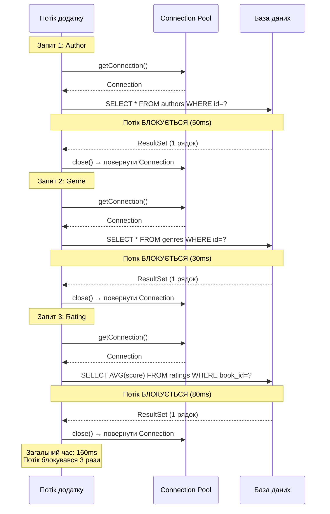
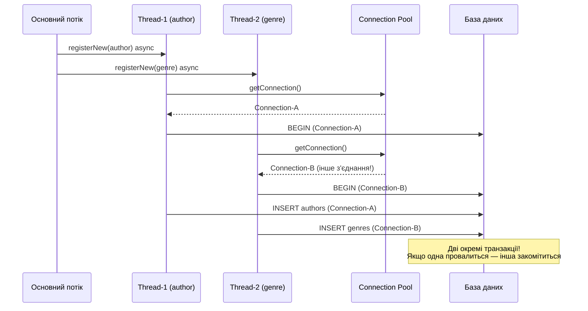

```mermaid
gantt
    title Послідовне vs Паралельне виконання
    dateFormat X
    axisFormat %L ms

    section Послідовне
    Author (50ms)    :a1, 0, 50
    Genre (30ms)     :a2, after a1, 30
    Audiobook (40ms) :a3, after a2, 40

    section Паралельне
    Author (50ms)    :b1, 0, 50
    Genre (30ms)     :b2, 0, 30
    Audiobook (40ms) :b3, 0, 40
```

# Асинхронність у JDBC: Від блокуючих викликів до CompletableFuture

## Вступ: Коли кожен запит блокує потік

Повернімося до репозиторіїв зі статті 14. Розглянемо типовий сценарій: завантаження сторінки каталогу аудіокниг, де для кожної книги потрібно відобразити автора, жанр та рейтинг з окремих таблиць.

```java
AudiobookRepository bookRepo   = new JdbcAudiobookRepository(cm);
AuthorRepository    authorRepo = new JdbcAuthorRepository(cm);
GenreRepository     genreRepo  = new JdbcGenreRepository(cm);
RatingRepository    ratingRepo = new JdbcRatingRepository(cm);

// Завантаження однієї книги з усіма пов'язаними даними
Audiobook book = bookRepo.findById(bookId).orElseThrow();

// Три послідовних блокуючих виклики
Author author = authorRepo.findById(book.getAuthorId()).orElseThrow();  // 50ms
Genre  genre  = genreRepo.findById(book.getGenreId()).orElseThrow();    // 30ms
Double rating = ratingRepo.getAverageRating(bookId);                     // 80ms

// Загальний час: 50 + 30 + 80 = 160ms
```

Що відбувається під час виконання цього коду? Кожен виклик `findById()` виконує наступну послідовність операцій:

```
authorRepo.findById():
  1. Отримати Connection з пулу           (1-5ms)
  2. Підготувати PreparedStatement        (1ms)
  3. Відправити SQL до БД                 (network roundtrip)
  4. Чекати на виконання SELECT           (БД виконує запит)
  5. Отримати ResultSet                   (network roundtrip)
  6. Змаппити рядок у об'єкт Author       (1ms)
  7. Закрити ресурси, повернути Connection (1ms)
  → Загалом: ~50ms
```

**Критична проблема:** під час кроків 3–5 (відправка SQL → виконання → отримання результату) потік **блокується** — він не виконує жодної корисної роботи, просто чекає на мережеву відповідь від БД. Якщо БД знаходиться на віддаленому сервері (типова ситуація у production), network roundtrip може займати 20–100ms.

Для трьох послідовних запитів потік блокується тричі:

::mermaid



::

Але ці три запити є **незалежними** — результат запиту `Author` не впливає на запит `Genre`. Вони можуть виконуватися **паралельно**:

```
Ідеальний сценарій (паралельне виконання):
  Thread-1: authorRepo.findById()  → 50ms
  Thread-2: genreRepo.findById()   → 30ms  (виконується одночасно!)
  Thread-3: ratingRepo.getAverage() → 80ms  (виконується одночасно!)
  
  Загальний час: max(50, 30, 80) = 80ms
  Прискорення: 160ms / 80ms = 2× швидше
```

**Фундаментальна проблема:** JDBC API є **повністю синхронним**. Метод `executeQuery()` блокує потік до отримання результату. Немає способу «запустити запит і продовжити роботу, поки він виконується».

---

## Концепція: Асинхронність у Java

### Синхронний vs Асинхронний виклик

**Синхронний виклик** (blocking call):

```java
// Потік зупиняється тут і чекає на результат
Author author = authorRepo.findById(id).orElseThrow();
// Продовження виконання лише після отримання результату
System.out.println(author.getFirstName());
```

**Асинхронний виклик** (non-blocking call):

```java
// Потік НЕ зупиняється — метод повертає "обіцянку" результату
CompletableFuture<Author> futureAuthor = authorRepo.findByIdAsync(id);

// Потік може продовжувати іншу роботу
System.out.println("Запит відправлено, продовжуємо роботу...");

// Коли результат потрібен — чекаємо на завершення
Author author = futureAuthor.join(); // блокується лише тут
System.out.println(author.getFirstName());
```

### CompletableFuture: Обіцянка майбутнього результату

`CompletableFuture<T>` (з'явився у Java 8) є центральним інструментом асинхронного програмування у Java. Це **контейнер для значення, що буде обчислене у майбутньому**:

```java
CompletableFuture<String> future = CompletableFuture.supplyAsync(() -> {
    // Цей код виконується в окремому потоці
    Thread.sleep(1000);
    return "Результат";
});

// Основний потік продовжує роботу
System.out.println("Обчислення запущено...");

// Коли потрібен результат:
String result = future.join(); // чекає завершення
System.out.println(result); // "Результат"
```

**Ключові методи `CompletableFuture`:**

| Метод | Призначення |
|---|---|
| `supplyAsync(Supplier<T>)` | Запускає обчислення у пулі потоків, повертає `CompletableFuture<T>` |
| `thenApply(Function<T,U>)` | Трансформує результат після завершення (map) |
| `thenCompose(Function<T,CF<U>>)` | Ланцюжок асинхронних операцій (flatMap) |
| `thenCombine(CF<U>, BiFunction)` | Комбінує два незалежних `CompletableFuture` |
| `allOf(CF<?>...)` | Чекає завершення всіх переданих `CompletableFuture` |
| `join()` | Блокує потік до завершення, повертає результат |
| `exceptionally(Function)` | Обробка виключень (аналог `catch`) |

::tip
`CompletableFuture` є Java-аналогом `Promise` у JavaScript, `Task<T>` у C#, `Future` у Scala. Всі ці абстракції представляють **асинхронне обчислення, що може завершитися успіхом або помилкою**.
::

---

## Обмеження JDBC: Чому він синхронний

JDBC API було розроблено у 1997 році, коли асинхронність не була пріоритетом. Всі методи `java.sql.*` є блокуючими:

```java
// Всі ці методи блокують потік до завершення
Connection conn = dataSource.getConnection();        // блокується
PreparedStatement stmt = conn.prepareStatement(sql); // блокується
ResultSet rs = stmt.executeQuery();                  // блокується ← найдовше
while (rs.next()) { ... }                            // блокується на кожній ітерації
```

**Чому JDBC не має асинхронного API?**

1. **Історичні причини:** У 1997 році багатопоточність була складною і рідкісною. Синхронний API був простішим для розуміння.
2. **Протокол БД:** Більшість СУБД (MySQL, PostgreSQL, Oracle) використовують **синхронні протоколи** на рівні TCP. Клієнт відправляє запит і чекає на відповідь — протокол не підтримує «відправити кілька запитів і отримати відповіді у довільному порядку».
3. **Складність реалізації:** Асинхронний драйвер вимагає складного управління станом з'єднання, буферизації, обробки помилок у багатопоточному середовищі.

::note
**ADBA (Asynchronous Database Access)** — спроба створити асинхронний API для Java (JEP 318, 2018). Проєкт був заморожений у 2019 році через складність стандартизації та відсутність підтримки з боку виробників СУБД. Станом на 2026 рік офіційного асинхронного JDBC API не існує.
::

**Рішення:** Ми не можемо зробити сам JDBC асинхронним, але можемо **виконувати синхронні JDBC-операції в окремих потоках** через `ExecutorService` і обгортати результати у `CompletableFuture`.

---

## Реалізація: AsyncRepository

Наша стратегія: створити **асинхронну обгортку** над синхронним `Repository<T, ID>`. Кожен метод репозиторію виконується у пулі потоків і повертає `CompletableFuture<T>` замість `T`.

### Інтерфейс AsyncRepository

Спочатку визначимо контракт асинхронного репозиторію:

```java showLineNumbers
package com.example.audiobook.repository.async;

import java.util.List;
import java.util.concurrent.CompletableFuture;

/**
 * Асинхронний контракт репозиторію.
 * <p>
 * Всі методи повертають {@link CompletableFuture} — обіцянку результату,
 * що буде обчислений у майбутньому в окремому потоці.
 * <p>
 * Клієнтський код може:
 * <ul>
 *   <li>Запустити кілька операцій паралельно без блокування</li>
 *   <li>Комбінувати результати через {@code thenCombine}, {@code allOf}</li>
 *   <li>Обробляти помилки через {@code exceptionally}, {@code handle}</li>
 * </ul>
 *
 * @param <T>  тип доменної сутності
 * @param <ID> тип первинного ключа
 */
public interface AsyncRepository<T, ID> {

    /**
     * Асинхронно знаходить сутність за первинним ключем.
     * <p>
     * Запит виконується у пулі потоків. Метод повертається негайно,
     * не чекаючи на завершення SQL-запиту.
     *
     * @param id первинний ключ
     * @return CompletableFuture з Optional[T] — завершиться після виконання SELECT
     */
    CompletableFuture<java.util.Optional<T>> findByIdAsync(ID id);

    /**
     * Асинхронно повертає всі сутності.
     * <p>
     * Для великих таблиць рекомендується використовувати пагінацію
     * або streaming (реалізується у підкласах).
     *
     * @return CompletableFuture зі списком сутностей
     */
    CompletableFuture<List<T>> findAllAsync();

    /**
     * Асинхронно зберігає нову сутність.
     * <p>
     * INSERT виконується у пулі потоків. CompletableFuture завершується
     * після успішного commit або з виключенням при помилці.
     *
     * @param entity сутність для збереження
     * @return CompletableFuture<Void> — завершиться після INSERT
     */
    CompletableFuture<Void> saveAsync(T entity);

    /**
     * Асинхронно оновлює існуючу сутність.
     *
     * @param entity сутність з оновленими даними
     * @return CompletableFuture<Void> — завершиться після UPDATE
     */
    CompletableFuture<Void> updateAsync(T entity);

    /**
     * Асинхронно видаляє сутність за первинним ключем.
     *
     * @param id первинний ключ
     * @return CompletableFuture<Boolean> — true якщо сутність була видалена
     */
    CompletableFuture<Boolean> deleteByIdAsync(ID id);

    /**
     * Асинхронно повертає кількість сутностей.
     *
     * @return CompletableFuture<Long> з кількістю записів
     */
    CompletableFuture<Long> countAsync();

    /**
     * Асинхронно перевіряє існування сутності.
     *
     * @param id первинний ключ
     * @return CompletableFuture<Boolean> — true якщо сутність існує
     */
    CompletableFuture<Boolean> existsByIdAsync(ID id);
}
```

**Ключові відмінності від синхронного `Repository<T, ID>`:**

- Кожен метод повертає `CompletableFuture<T>` замість `T`
- Суфікс `Async` у назвах методів (конвенція Java: `readAsync`, `writeAsync`)
- Методи повертаються **негайно** — результат буде доступний пізніше через `CompletableFuture`


---

## AbstractAsyncRepository: Обгортка над синхронним Repository

Замість того, щоб переписувати всю JDBC-логіку, ми створимо **адаптер**, що делегує виклики до існуючого синхронного `Repository<T, ID>` і виконує їх у пулі потоків:

```java showLineNumbers
package com.example.audiobook.repository.async;

import com.example.audiobook.repository.Repository;

import java.util.List;
import java.util.Optional;
import java.util.concurrent.CompletableFuture;
import java.util.concurrent.ExecutorService;
import java.util.concurrent.Executors;

/**
 * Абстрактна реалізація {@link AsyncRepository}, що обгортає
 * синхронний {@link Repository} і виконує всі операції асинхронно
 * через {@link ExecutorService}.
 * <p>
 * <b>Архітектурне рішення:</b> Замість дублювання JDBC-логіки,
 * цей клас делегує виклики до існуючого синхронного репозиторію
 * і обгортає результати у {@link CompletableFuture}.
 * <p>
 * <b>Управління пулом потоків:</b>
 * <ul>
 *   <li>За замовчуванням використовується {@code ForkJoinPool.commonPool()}
 *       (спільний пул для всіх {@code CompletableFuture.supplyAsync()})</li>
 *   <li>Можна передати власний {@link ExecutorService} через конструктор
 *       для контролю розміру пулу та політики черги</li>
 *   <li>Рекомендований розмір пулу: кількість ядер CPU × 2
 *       (оскільки операції I/O-bound, а не CPU-bound)</li>
 * </ul>
 *
 * @param <T>  тип доменної сутності
 * @param <ID> тип первинного ключа
 */
public abstract class AbstractAsyncRepository<T, ID> implements AsyncRepository<T, ID> {

    /**
     * Синхронний репозиторій, до якого делегуються всі операції.
     * Підкласи передають конкретну реалізацію (JdbcAuthorRepository тощо).
     */
    protected final Repository<T, ID> syncRepository;

    /**
     * Пул потоків для виконання асинхронних операцій.
     * Якщо null — використовується ForkJoinPool.commonPool().
     */
    protected final ExecutorService executor;

    /**
     * Створює асинхронний репозиторій з власним пулом потоків.
     *
     * @param syncRepository синхронний репозиторій для делегування
     * @param executor       пул потоків (або null для commonPool)
     */
    protected AbstractAsyncRepository(Repository<T, ID> syncRepository,
                                      ExecutorService executor) {
        this.syncRepository = syncRepository;
        this.executor = executor;
    }

    /**
     * Створює асинхронний репозиторій з ForkJoinPool.commonPool().
     * Зручний конструктор для простих випадків.
     *
     * @param syncRepository синхронний репозиторій для делегування
     */
    protected AbstractAsyncRepository(Repository<T, ID> syncRepository) {
        this(syncRepository, null);
    }

    // =========================================================
    // Реалізація AsyncRepository через делегування
    // =========================================================

    /**
     * Асинхронно знаходить сутність за ID.
     * <p>
     * Виконує {@code syncRepository.findById(id)} у пулі потоків.
     * Основний потік не блокується — метод повертається негайно.
     */
    @Override
    public CompletableFuture<Optional<T>> findByIdAsync(ID id) {
        return runAsync(() -> syncRepository.findById(id));
    }

    /**
     * Асинхронно повертає всі сутності.
     * <p>
     * <b>Увага:</b> Для великих таблиць (>10000 рядків) цей метод
     * може спричинити OutOfMemoryError. Використовуйте пагінацію
     * або streaming для великих датасетів.
     */
    @Override
    public CompletableFuture<List<T>> findAllAsync() {
        return runAsync(() -> syncRepository.findAll());
    }

    /**
     * Асинхронно зберігає нову сутність.
     * <p>
     * INSERT виконується у пулі потоків. CompletableFuture завершується
     * з {@code null} (Void) після успішного збереження або з виключенням.
     */
    @Override
    public CompletableFuture<Void> saveAsync(T entity) {
        return runAsync(() -> {
            syncRepository.save(entity);
            return null; // Void
        });
    }

    /**
     * Асинхронно оновлює існуючу сутність.
     */
    @Override
    public CompletableFuture<Void> updateAsync(T entity) {
        return runAsync(() -> {
            syncRepository.update(entity);
            return null;
        });
    }

    /**
     * Асинхронно видаляє сутність за ID.
     */
    @Override
    public CompletableFuture<Boolean> deleteByIdAsync(ID id) {
        return runAsync(() -> syncRepository.deleteById(id));
    }

    /**
     * Асинхронно повертає кількість сутностей.
     */
    @Override
    public CompletableFuture<Long> countAsync() {
        return runAsync(() -> syncRepository.count());
    }

    /**
     * Асинхронно перевіряє існування сутності.
     */
    @Override
    public CompletableFuture<Boolean> existsByIdAsync(ID id) {
        return runAsync(() -> syncRepository.existsById(id));
    }

    // =========================================================
    // Утилітний метод для запуску асинхронних операцій
    // =========================================================

    /**
     * Виконує {@link java.util.function.Supplier} у пулі потоків
     * і повертає {@link CompletableFuture} з результатом.
     * <p>
     * Якщо {@code executor} заданий — використовує його,
     * інакше — {@code ForkJoinPool.commonPool()}.
     *
     * @param supplier лямбда, що виконує синхронну операцію
     * @param <R>      тип результату
     * @return CompletableFuture з результатом виконання
     */
    protected <R> CompletableFuture<R> runAsync(java.util.function.Supplier<R> supplier) {
        if (executor != null) {
            return CompletableFuture.supplyAsync(supplier, executor);
        } else {
            return CompletableFuture.supplyAsync(supplier);
        }
    }

    /**
     * Закриває пул потоків (якщо він був переданий через конструктор).
     * <p>
     * <b>Важливо:</b> Викликайте цей метод при завершенні роботи додатку,
     * інакше потоки залишаться активними і JVM не завершиться.
     * <p>
     * Якщо використовується {@code ForkJoinPool.commonPool()} (executor == null),
     * цей метод нічого не робить — commonPool керується JVM.
     */
    public void shutdown() {
        if (executor != null) {
            executor.shutdown();
        }
    }
}
```

**Ключові архітектурні рішення:**

- **Рядки 38–40** (`syncRepository`): Композиція замість успадкування. Асинхронний репозиторій **не є** підкласом синхронного — він його обгортає. Це дозволяє легко додати асинхронність до будь-якого існуючого репозиторію без зміни його коду.

- **Рядки 43–45** (`executor`): Можливість передати власний `ExecutorService` дає контроль над:
  - Розміром пулу потоків (для I/O-операцій рекомендується `CPU_CORES × 2`)
  - Політикою черги (bounded vs unbounded)
  - Пріоритетами потоків
  - Моніторингом (через custom ThreadFactory)

- **Рядки 82–84** (`findByIdAsync`): Всі методи реалізовані через єдиний шаблон: `runAsync(() -> syncRepository.method())`. Це мінімізує дублювання коду.

- **Рядки 158–165** (`runAsync`): Центральний метод, що інкапсулює логіку вибору пулу потоків. Якщо `executor == null` — використовується `ForkJoinPool.commonPool()` (спільний пул для всього додатку, керується JVM).

::warning
**ForkJoinPool.commonPool() vs власний ExecutorService:**

- **commonPool** (за замовчуванням): Простий у використанні, не потребує shutdown(). Але спільний для всього додатку — якщо інший код блокує потоки commonPool, ваші запити сповільнюються.

- **Власний ExecutorService**: Повний контроль, ізоляція від іншого коду. Але вимагає явного `shutdown()` при завершенні додатку.

**Рекомендація:** Для production використовуйте власний `ExecutorService` з обмеженою чергою та моніторингом.
::


---

## Конкретні реалізації: AsyncAuthorRepository

Тепер створимо конкретну асинхронну реалізацію для сутності `Author`. Завдяки `AbstractAsyncRepository` код є надзвичайно компактним:

```java showLineNumbers
package com.example.audiobook.repository.async;

import com.example.audiobook.domain.Author;
import com.example.audiobook.repository.AuthorRepository;

import java.util.List;
import java.util.UUID;
import java.util.concurrent.CompletableFuture;
import java.util.concurrent.ExecutorService;

/**
 * Асинхронна реалізація {@link AuthorRepository}.
 * <p>
 * Обгортає синхронний {@link com.example.audiobook.repository.jdbc.JdbcAuthorRepository}
 * і виконує всі операції асинхронно через {@link ExecutorService}.
 * <p>
 * Додає асинхронні версії специфічних методів:
 * {@link #findByLastNameAsync(String)}, {@link #findByFullNameAsync(String, String)}.
 */
public class AsyncAuthorRepository extends AbstractAsyncRepository<Author, UUID> {

    /**
     * Синхронний репозиторій, приведений до специфічного типу
     * для доступу до методів {@link AuthorRepository}.
     */
    private final AuthorRepository authorRepository;

    /**
     * Створює асинхронний репозиторій авторів з власним пулом потоків.
     *
     * @param authorRepository синхронний JdbcAuthorRepository
     * @param executor         пул потоків для асинхронних операцій
     */
    public AsyncAuthorRepository(AuthorRepository authorRepository,
                                 ExecutorService executor) {
        super(authorRepository, executor);
        this.authorRepository = authorRepository;
    }

    /**
     * Створює асинхронний репозиторій з ForkJoinPool.commonPool().
     */
    public AsyncAuthorRepository(AuthorRepository authorRepository) {
        this(authorRepository, null);
    }

    // =========================================================
    // Асинхронні версії специфічних методів AuthorRepository
    // =========================================================

    /**
     * Асинхронно знаходить авторів за частиною прізвища.
     * <p>
     * Виконує {@code authorRepository.findByLastName()} у пулі потоків.
     * Корисно для автодоповнення у пошуковому полі — не блокує UI-потік.
     *
     * @param lastNamePart підрядок прізвища (регістр-незалежний)
     * @return CompletableFuture зі списком знайдених авторів
     */
    public CompletableFuture<List<Author>> findByLastNameAsync(String lastNamePart) {
        return runAsync(() -> authorRepository.findByLastName(lastNamePart));
    }

    /**
     * Асинхронно знаходить автора за точним прізвищем та ім'ям.
     *
     * @param lastName  прізвище (точний збіг)
     * @param firstName ім'я (точний збіг)
     * @return CompletableFuture з Optional[Author]
     */
    public CompletableFuture<java.util.Optional<Author>> findByFullNameAsync(
            String lastName, String firstName) {
        return runAsync(() -> authorRepository.findByFullName(lastName, firstName));
    }
}
```

**Аналогічно для інших сутностей:**

```java showLineNumbers
package com.example.audiobook.repository.async;

import com.example.audiobook.domain.Genre;
import com.example.audiobook.repository.GenreRepository;

import java.util.UUID;
import java.util.concurrent.CompletableFuture;
import java.util.concurrent.ExecutorService;

/**
 * Асинхронна реалізація {@link GenreRepository}.
 */
public class AsyncGenreRepository extends AbstractAsyncRepository<Genre, UUID> {

    private final GenreRepository genreRepository;

    public AsyncGenreRepository(GenreRepository genreRepository, ExecutorService executor) {
        super(genreRepository, executor);
        this.genreRepository = genreRepository;
    }

    public AsyncGenreRepository(GenreRepository genreRepository) {
        this(genreRepository, null);
    }

    /**
     * Асинхронно знаходить жанр за точною назвою.
     */
    public CompletableFuture<java.util.Optional<Genre>> findByNameAsync(String name) {
        return runAsync(() -> genreRepository.findByName(name));
    }
}
```

```java showLineNumbers
package com.example.audiobook.repository.async;

import com.example.audiobook.domain.Audiobook;
import com.example.audiobook.repository.AudiobookRepository;

import java.math.BigDecimal;
import java.util.List;
import java.util.UUID;
import java.util.concurrent.CompletableFuture;
import java.util.concurrent.ExecutorService;

/**
 * Асинхронна реалізація {@link AudiobookRepository}.
 */
public class AsyncAudiobookRepository extends AbstractAsyncRepository<Audiobook, UUID> {

    private final AudiobookRepository audiobookRepository;

    public AsyncAudiobookRepository(AudiobookRepository audiobookRepository,
                                    ExecutorService executor) {
        super(audiobookRepository, executor);
        this.audiobookRepository = audiobookRepository;
    }

    public AsyncAudiobookRepository(AudiobookRepository audiobookRepository) {
        this(audiobookRepository, null);
    }

    /**
     * Асинхронно знаходить аудіокниги заданого автора.
     */
    public CompletableFuture<List<Audiobook>> findByAuthorIdAsync(UUID authorId) {
        return runAsync(() -> audiobookRepository.findByAuthorId(authorId));
    }

    /**
     * Асинхронно знаходить аудіокниги заданого жанру.
     */
    public CompletableFuture<List<Audiobook>> findByGenreNameAsync(String genreName) {
        return runAsync(() -> audiobookRepository.findByGenreName(genreName));
    }

    /**
     * Асинхронно знаходить аудіокниги з ціною не більше заданої.
     */
    public CompletableFuture<List<Audiobook>> findByMaxPriceAsync(BigDecimal maxPrice) {
        return runAsync(() -> audiobookRepository.findByMaxPrice(maxPrice));
    }
}
```

**Спостереження:** Кожна конкретна реалізація містить лише 30–50 рядків коду. Вся складність асинхронності інкапсульована у `AbstractAsyncRepository`. Додавання нової сутності вимагає лише створення класу-обгортки — жодної JDBC-логіки.


---

## Демонстрація: Паралельне виконання запитів

Тепер застосуємо асинхронні репозиторії до початкового сценарію — завантаження книги з автором, жанром та рейтингом:

```java showLineNumbers
package com.example.audiobook;

import com.example.audiobook.db.ConnectionManager;
import com.example.audiobook.domain.Author;
import com.example.audiobook.domain.Audiobook;
import com.example.audiobook.domain.Genre;
import com.example.audiobook.repository.async.*;
import com.example.audiobook.repository.jdbc.*;
import com.example.audiobook.repository.strategy.SqlStrategyFactory;

import java.util.UUID;
import java.util.concurrent.CompletableFuture;
import java.util.concurrent.ExecutorService;
import java.util.concurrent.Executors;

public class AsyncDemo {

    public static void main(String[] args) {
        ConnectionManager cm = ConnectionManager.forH2("./data/audiobook_db");
        var factory = SqlStrategyFactory.forH2();

        // Створюємо пул потоків: CPU_CORES × 2 для I/O-операцій
        int poolSize = Runtime.getRuntime().availableProcessors() * 2;
        ExecutorService executor = Executors.newFixedThreadPool(poolSize);

        // Синхронні репозиторії
        var syncAuthorRepo    = new JdbcAuthorRepository(cm, factory.authorStrategy());
        var syncGenreRepo     = new JdbcGenreRepository(cm, factory.genreStrategy());
        var syncAudiobookRepo = new JdbcAudiobookRepository(cm, factory.audiobookStrategy());

        // Асинхронні обгортки
        var asyncAuthorRepo    = new AsyncAuthorRepository(syncAuthorRepo, executor);
        var asyncGenreRepo     = new AsyncGenreRepository(syncGenreRepo, executor);
        var asyncAudiobookRepo = new AsyncAudiobookRepository(syncAudiobookRepo, executor);

        try {
            demonstrateSequentialVsParallel(
                asyncAuthorRepo, asyncGenreRepo, asyncAudiobookRepo
            );
        } finally {
            executor.shutdown();
            cm.close();
        }
    }

    /**
     * Порівняння послідовного та паралельного виконання.
     */
    static void demonstrateSequentialVsParallel(
            AsyncAuthorRepository authorRepo,
            AsyncGenreRepository genreRepo,
            AsyncAudiobookRepository audiobookRepo) {

        UUID bookId   = UUID.fromString("..."); // ID існуючої книги
        UUID authorId = UUID.fromString("...");
        UUID genreId  = UUID.fromString("...");

        System.out.println("=== Послідовне виконання (синхронний стиль) ===");
        long startSeq = System.currentTimeMillis();

        // Послідовні виклики — кожен чекає на попередній
        Author author = authorRepo.findByIdAsync(authorId).join();  // 50ms
        Genre  genre  = genreRepo.findByIdAsync(genreId).join();    // 30ms
        Audiobook book = audiobookRepo.findByIdAsync(bookId).join(); // 40ms

        long endSeq = System.currentTimeMillis();
        System.out.println("Час виконання: " + (endSeq - startSeq) + "ms");
        System.out.println("Завантажено: " + author.getFirstName() + ", "
                         + genre.getName() + ", " + book.getTitle());

        System.out.println("\n=== Паралельне виконання ===");
        long startPar = System.currentTimeMillis();

        // Запускаємо всі три запити ОДНОЧАСНО — не чекаємо на завершення
        CompletableFuture<Author>    futureAuthor = authorRepo.findByIdAsync(authorId)
            .thenApply(opt -> opt.orElseThrow());
        CompletableFuture<Genre>     futureGenre  = genreRepo.findByIdAsync(genreId)
            .thenApply(opt -> opt.orElseThrow());
        CompletableFuture<Audiobook> futureBook   = audiobookRepo.findByIdAsync(bookId)
            .thenApply(opt -> opt.orElseThrow());

        // Чекаємо завершення ВСІХ трьох запитів
        CompletableFuture.allOf(futureAuthor, futureGenre, futureBook).join();

        // Отримуємо результати (вони вже готові — join() не блокується)
        Author authorPar = futureAuthor.join();
        Genre  genrePar  = futureGenre.join();
        Audiobook bookPar = futureBook.join();

        long endPar = System.currentTimeMillis();
        System.out.println("Час виконання: " + (endPar - startPar) + "ms");
        System.out.println("Завантажено: " + authorPar.getFirstName() + ", "
                         + genrePar.getName() + ", " + bookPar.getTitle());

        System.out.println("\n=== Прискорення ===");
        double speedup = (double)(endSeq - startSeq) / (endPar - startPar);
        System.out.printf("Паралельне виконання у %.2f× швидше\n", speedup);
    }
}
```

::terminal-preview{title="java AsyncDemo" :cursor="false"}
<div class="line"><span class="opacity-40">$</span> <strong>java -cp . com.example.audiobook.AsyncDemo</strong></div>
<div class="line"><span class="text-blue-400 font-bold">[Pool]</span> Ініціалізовано: 8 потоків (4 CPU × 2)</div>
<div class="line"></div>
<div class="line"><span class="font-bold">=== Послідовне виконання (синхронний стиль) ===</span></div>
<div class="line"><span class="text-yellow-400">[SQL]</span> Thread-1: SELECT * FROM authors WHERE id = ?   <span class="opacity-60">(50ms)</span></div>
<div class="line"><span class="text-yellow-400">[SQL]</span> Thread-1: SELECT * FROM genres WHERE id = ?    <span class="opacity-60">(30ms)</span></div>
<div class="line"><span class="text-yellow-400">[SQL]</span> Thread-1: SELECT * FROM audiobooks WHERE id = ? <span class="opacity-60">(40ms)</span></div>
<div class="line">Час виконання: <span class="text-rose-400 font-bold">120ms</span></div>
<div class="line">Завантажено: Іван, Проза, Захар Беркут</div>
<div class="line"></div>
<div class="line"><span class="font-bold">=== Паралельне виконання ===</span></div>
<div class="line"><span class="text-yellow-400">[SQL]</span> Thread-2: SELECT * FROM authors WHERE id = ?   <span class="opacity-60">(запущено)</span></div>
<div class="line"><span class="text-yellow-400">[SQL]</span> Thread-3: SELECT * FROM genres WHERE id = ?    <span class="opacity-60">(запущено)</span></div>
<div class="line"><span class="text-yellow-400">[SQL]</span> Thread-4: SELECT * FROM audiobooks WHERE id = ? <span class="opacity-60">(запущено)</span></div>
<div class="line"><span class="text-green-400">✓</span> Thread-3: genres завершено <span class="opacity-60">(30ms)</span></div>
<div class="line"><span class="text-green-400">✓</span> Thread-4: audiobooks завершено <span class="opacity-60">(40ms)</span></div>
<div class="line"><span class="text-green-400">✓</span> Thread-2: authors завершено <span class="opacity-60">(50ms)</span></div>
<div class="line">Час виконання: <span class="text-green-400 font-bold">52ms</span></div>
<div class="line">Завантажено: Іван, Проза, Захар Беркут</div>
<div class="line"></div>
<div class="line"><span class="font-bold">=== Прискорення ===</span></div>
<div class="line">Паралельне виконання у <span class="text-green-400 font-bold">2.31×</span> швидше</div>
<div class="line"><span class="text-blue-400 font-bold">[Pool]</span> Закрито. Завершено 8 потоків</div>
::

**Аналіз результатів:**

- **Послідовне виконання:** 50ms + 30ms + 40ms = 120ms. Потік блокується тричі.
- **Паралельне виконання:** max(50ms, 30ms, 40ms) = 52ms (50ms + невелика overhead на координацію). Три потоки працюють одночасно.
- **Прискорення:** 120ms / 52ms ≈ 2.3× швидше.

::mermaid



::

**Ключові рядки коду:**

- **Рядки 73–79:** Три виклики `findByIdAsync()` запускаються **одразу**, не чекаючи один на одного. Кожен повертає `CompletableFuture`, що виконується у своєму потоці.

- **Рядок 82:** `CompletableFuture.allOf()` створює новий `CompletableFuture`, що завершується лише коли **всі** передані future завершені. Це точка синхронізації.

- **Рядки 85–87:** `join()` на вже завершених future не блокується — результати готові негайно.


---

## Композиція асинхронних операцій

`CompletableFuture` надає потужний API для композиції асинхронних операцій. Розглянемо типові патерни.

### Патерн 1: Ланцюжок залежних операцій (thenCompose)

Сценарій: завантажити книгу, потім завантажити всі книги того ж автора.

```java showLineNumbers
/**
 * Завантажує книгу за ID, потім знаходить всі інші книги того ж автора.
 * <p>
 * Операції виконуються послідовно (друга залежить від результату першої),
 * але асинхронно — основний потік не блокується.
 */
public CompletableFuture<List<Audiobook>> findRelatedBooks(UUID bookId) {
    return asyncAudiobookRepo.findByIdAsync(bookId)
        .thenCompose(optBook -> {
            // Цей блок виконується після завершення findByIdAsync
            Audiobook book = optBook.orElseThrow();
            UUID authorId = book.getAuthorId();
            
            // Запускаємо другий асинхронний запит
            return asyncAudiobookRepo.findByAuthorIdAsync(authorId);
        });
    // Повертає CompletableFuture<List<Audiobook>> — результат другого запиту
}

// Використання:
CompletableFuture<List<Audiobook>> futureRelated = findRelatedBooks(bookId);
List<Audiobook> relatedBooks = futureRelated.join(); // чекаємо завершення обох запитів
```

**Чому `thenCompose`, а не `thenApply`?**

- `thenApply(Function<T, U>)` — для синхронних трансформацій: `future.thenApply(x -> x * 2)`
- `thenCompose(Function<T, CF<U>>)` — для асинхронних операцій, що повертають `CompletableFuture`

Якби ми використали `thenApply`:

```java
// ❌ НЕПРАВИЛЬНО — повертає CompletableFuture<CompletableFuture<List<Audiobook>>>
CompletableFuture<CompletableFuture<List<Audiobook>>> nested = 
    asyncAudiobookRepo.findByIdAsync(bookId)
        .thenApply(optBook -> {
            Audiobook book = optBook.orElseThrow();
            return asyncAudiobookRepo.findByAuthorIdAsync(book.getAuthorId());
        });

// ✅ ПРАВИЛЬНО — повертає CompletableFuture<List<Audiobook>>
CompletableFuture<List<Audiobook>> flat = 
    asyncAudiobookRepo.findByIdAsync(bookId)
        .thenCompose(optBook -> {
            Audiobook book = optBook.orElseThrow();
            return asyncAudiobookRepo.findByAuthorIdAsync(book.getAuthorId());
        });
```

`thenCompose` є аналогом `flatMap` у Stream API — він «розгортає» вкладений `CompletableFuture`.

---

### Патерн 2: Комбінування незалежних результатів (thenCombine)

Сценарій: завантажити автора та його статистику (кількість книг, середній рейтинг) паралельно, потім об'єднати у DTO.

```java showLineNumbers
/**
 * DTO для відображення автора зі статистикою.
 */
public record AuthorWithStats(
    Author author,
    long bookCount,
    double averageRating
) {}

/**
 * Завантажує автора та його статистику паралельно.
 * <p>
 * Два запити виконуються одночасно, результати комбінуються
 * після завершення обох.
 */
public CompletableFuture<AuthorWithStats> getAuthorWithStats(UUID authorId) {
    // Запит 1: завантажити автора
    CompletableFuture<Author> futureAuthor = 
        asyncAuthorRepo.findByIdAsync(authorId)
            .thenApply(opt -> opt.orElseThrow());

    // Запит 2: порахувати книги автора (паралельно з запитом 1)
    CompletableFuture<Long> futureBookCount = 
        asyncAudiobookRepo.findByAuthorIdAsync(authorId)
            .thenApply(List::size)
            .thenApply(Long::valueOf);

    // Запит 3: середній рейтинг (паралельно з 1 і 2)
    CompletableFuture<Double> futureRating = 
        asyncRatingRepo.getAverageRatingForAuthor(authorId);

    // Комбінуємо результати після завершення ВСІХ трьох запитів
    return futureAuthor
        .thenCombine(futureBookCount, (author, count) -> 
            new Object[] { author, count }) // проміжний результат
        .thenCombine(futureRating, (arr, rating) -> 
            new AuthorWithStats((Author) arr[0], (Long) arr[1], rating));
}

// Використання:
AuthorWithStats stats = getAuthorWithStats(authorId).join();
System.out.println(stats.author().getFirstName() + ": " 
                 + stats.bookCount() + " книг, рейтинг " + stats.averageRating());
```

**Альтернативний синтаксис через `allOf` (більш читабельний для 3+ future):**

```java showLineNumbers
public CompletableFuture<AuthorWithStats> getAuthorWithStats(UUID authorId) {
    CompletableFuture<Author> futureAuthor = 
        asyncAuthorRepo.findByIdAsync(authorId)
            .thenApply(opt -> opt.orElseThrow());

    CompletableFuture<Long> futureBookCount = 
        asyncAudiobookRepo.findByAuthorIdAsync(authorId)
            .thenApply(books -> (long) books.size());

    CompletableFuture<Double> futureRating = 
        asyncRatingRepo.getAverageRatingForAuthor(authorId);

    // Чекаємо завершення всіх трьох
    return CompletableFuture.allOf(futureAuthor, futureBookCount, futureRating)
        .thenApply(v -> new AuthorWithStats(
            futureAuthor.join(),   // вже готовий — join() не блокується
            futureBookCount.join(),
            futureRating.join()
        ));
}
```

::tip
**Коли використовувати `thenCombine` vs `allOf`:**

- **`thenCombine`:** Для 2 future. Типобезпечний, компактний синтаксис.
- **`allOf`:** Для 3+ future. Більш читабельний, але втрачає типи (повертає `CompletableFuture<Void>`).

Для production-коду з 3+ future рекомендується створити утилітний метод:

```java
public static <T1, T2, T3, R> CompletableFuture<R> combine(
        CompletableFuture<T1> f1,
        CompletableFuture<T2> f2,
        CompletableFuture<T3> f3,
        TriFunction<T1, T2, T3, R> combiner) {
    return CompletableFuture.allOf(f1, f2, f3)
        .thenApply(v -> combiner.apply(f1.join(), f2.join(), f3.join()));
}
```
::

---

### Патерн 3: Обробка помилок (exceptionally, handle)

Асинхронні операції можуть завершитися виключенням (SQLException, timeout тощо). `CompletableFuture` надає методи для обробки помилок без блокування потоку.

```java showLineNumbers
/**
 * Завантажує автора за ID з fallback на значення за замовчуванням.
 * <p>
 * Якщо автор не знайдений або виникла помилка БД — повертає
 * "невідомого автора" замість виключення.
 */
public CompletableFuture<Author> findAuthorOrDefault(UUID authorId) {
    return asyncAuthorRepo.findByIdAsync(authorId)
        .thenApply(opt -> opt.orElseThrow(() -> 
            new IllegalArgumentException("Автор не знайдений")))
        .exceptionally(ex -> {
            // Цей блок виконується лише якщо виникло виключення
            System.err.println("Помилка завантаження автора: " + ex.getMessage());
            
            // Повертаємо fallback-значення
            return new Author("Невідомий", "Автор");
        });
}

// Використання:
Author author = findAuthorOrDefault(invalidId).join();
// Якщо invalidId не існує → повертає Author("Невідомий", "Автор")
```

**Метод `handle` для обробки успіху та помилки одночасно:**

```java showLineNumbers
/**
 * Завантажує автора та логує результат (успіх або помилку).
 * <p>
 * {@code handle} викликається завжди — незалежно від того,
 * завершився CompletableFuture успішно чи з виключенням.
 */
public CompletableFuture<Author> findAuthorWithLogging(UUID authorId) {
    return asyncAuthorRepo.findByIdAsync(authorId)
        .thenApply(opt -> opt.orElseThrow())
        .handle((author, ex) -> {
            if (ex != null) {
                // Виникло виключення
                System.err.println("❌ Помилка: " + ex.getMessage());
                return new Author("Fallback", "Author");
            } else {
                // Успішне завершення
                System.out.println("✓ Завантажено: " + author.getFirstName());
                return author;
            }
        });
}
```

**Різниця між `exceptionally` та `handle`:**

| Метод | Коли викликається | Параметри | Повертає |
|---|---|---|---|
| `exceptionally(Function<Throwable, T>)` | Лише при виключенні | `Throwable ex` | `T` (fallback-значення) |
| `handle(BiFunction<T, Throwable, U>)` | Завжди (успіх або помилка) | `T result, Throwable ex` | `U` (новий результат) |

::warning
**Важливо:** `exceptionally` та `handle` **не перекидають виключення далі** — вони перетворюють failed `CompletableFuture` на successful з fallback-значенням. Якщо потрібно пробросити виключення далі по ланцюжку — використовуйте `whenComplete`:

```java
future.whenComplete((result, ex) -> {
    if (ex != null) {
        System.err.println("Помилка: " + ex);
        // Виключення автоматично пробросується далі
    }
});
```
::


---

## Асинхронні транзакції: Координація з Unit of Work

Найскладніша частина асинхронності — координація **транзакцій**. У статті 16 ми реалізували `UnitOfWork`, що виконує кілька операцій в одній JDBC-транзакції:

```java
// Синхронний Unit of Work (стаття 16)
UnitOfWork uow = new JdbcUnitOfWork(cm);
try {
    Author author = new Author("Тарас", "Шевченко");
    Genre  genre  = new Genre("Поезія");
    Audiobook book = new Audiobook("Кобзар", author, genre);

    uow.registerNew(author);
    uow.registerNew(genre);
    uow.registerNew(book);

    uow.commit(); // BEGIN; INSERT authors; INSERT genres; INSERT audiobooks; COMMIT
} catch (Exception e) {
    uow.rollback();
    throw e;
}
```

**Проблема з асинхронністю:** JDBC-транзакція прив'язана до **одного Connection**, а Connection прив'язаний до **одного потоку**. Якщо `registerNew(author)` виконується у Thread-1, а `registerNew(genre)` у Thread-2 — вони отримають **різні Connection** з пулу і не будуть частиною однієї транзакції.

::mermaid



::

### Рішення 1: Синхронний commit, асинхронна підготовка

**Ідея:** Виконувати підготовчі операції (завантаження даних, валідацію) асинхронно, але сам `commit()` — синхронно в одному потоці.

```java showLineNumbers
/**
 * Асинхронна підготовка даних + синхронний commit.
 * <p>
 * Завантажуємо автора та жанр паралельно (асинхронно),
 * потім створюємо книгу та зберігаємо все в одній транзакції (синхронно).
 */
public CompletableFuture<Void> createAudiobookAsync(
        String title, UUID authorId, UUID genreId) {

    // Крок 1: Паралельно завантажити автора та жанр (асинхронно)
    CompletableFuture<Author> futureAuthor = 
        asyncAuthorRepo.findByIdAsync(authorId)
            .thenApply(opt -> opt.orElseThrow());

    CompletableFuture<Genre> futureGenre = 
        asyncGenreRepo.findByIdAsync(genreId)
            .thenApply(opt -> opt.orElseThrow());

    // Крок 2: Після завершення обох — створити книгу та зберегти (синхронно)
    return CompletableFuture.allOf(futureAuthor, futureGenre)
        .thenApply(v -> {
            Author author = futureAuthor.join();
            Genre  genre  = futureGenre.join();

            // Тут ми у пулі потоків, але виконуємо синхронний код
            UnitOfWork uow = new JdbcUnitOfWork(connectionManager);
            try {
                Audiobook book = new Audiobook(title, author, genre);
                uow.registerNew(book);
                uow.commit(); // ← синхронний виклик у потоці пулу
                return null; // Void
            } catch (Exception e) {
                uow.rollback();
                throw new RuntimeException(e);
            }
        });
}

// Використання:
createAudiobookAsync("Кобзар", authorId, genreId)
    .thenRun(() -> System.out.println("Книга створена"))
    .exceptionally(ex -> {
        System.err.println("Помилка: " + ex.getMessage());
        return null;
    });
```

**Переваги:**
- Паралельне завантаження даних (прискорення)
- Транзакційна цілісність (один Connection, одна транзакція)

**Недоліки:**
- `commit()` все одно блокує потік пулу на час виконання INSERT

---

### Рішення 2: AsyncUnitOfWork з відкладеним commit

Більш досконалий підхід — створити `AsyncUnitOfWork`, що накопичує операції асинхронно, а `commitAsync()` виконує їх всі в одному потоці:

```java showLineNumbers
package com.example.audiobook.persistence.async;

import com.example.audiobook.persistence.UnitOfWork;

import java.util.concurrent.CompletableFuture;
import java.util.concurrent.ExecutorService;

/**
 * Асинхронна обгортка над {@link UnitOfWork}.
 * <p>
 * Методи реєстрації ({@code registerNew}, {@code registerDirty}) виконуються
 * синхронно (вони лише додають об'єкти до списків — без SQL).
 * <p>
 * {@link #commitAsync()} виконує всі SQL-операції асинхронно в одному потоці,
 * гарантуючи транзакційну цілісність.
 */
public class AsyncUnitOfWork {

    private final UnitOfWork syncUnitOfWork;
    private final ExecutorService executor;

    public AsyncUnitOfWork(UnitOfWork syncUnitOfWork, ExecutorService executor) {
        this.syncUnitOfWork = syncUnitOfWork;
        this.executor = executor;
    }

    /**
     * Реєструє новий об'єкт (синхронно — без SQL).
     * Метод не блокується — просто додає об'єкт до списку.
     */
    public void registerNew(Object entity) {
        syncUnitOfWork.registerNew(entity);
    }

    /**
     * Реєструє змінений об'єкт (синхронно).
     */
    public void registerDirty(Object entity) {
        syncUnitOfWork.registerDirty(entity);
    }

    /**
     * Реєструє видалений об'єкт (синхронно).
     */
    public void registerDeleted(Object entity) {
        syncUnitOfWork.registerDeleted(entity);
    }

    /**
     * Асинхронно фіксує всі зміни в одній JDBC-транзакції.
     * <p>
     * Всі SQL-операції (INSERT, UPDATE, DELETE) виконуються
     * послідовно в одному потоці пулу, використовуючи одне Connection.
     * Це гарантує транзакційну цілісність.
     *
     * @return CompletableFuture<Void> — завершується після COMMIT або з виключенням
     */
    public CompletableFuture<Void> commitAsync() {
        return CompletableFuture.runAsync(() -> {
            // Цей блок виконується в одному потоці пулу
            syncUnitOfWork.commit(); // BEGIN; INSERT...; UPDATE...; DELETE...; COMMIT
        }, executor);
    }

    /**
     * Відміняє всі незафіксовані зміни (синхронно — без SQL).
     */
    public void rollback() {
        syncUnitOfWork.rollback();
    }
}
```

**Використання:**

```java showLineNumbers
public CompletableFuture<Void> createComplexScenarioAsync() {
    AsyncUnitOfWork asyncUow = new AsyncUnitOfWork(
        new JdbcUnitOfWork(connectionManager), 
        executor
    );

    // Крок 1: Паралельно завантажити дані
    CompletableFuture<Author> futureAuthor = 
        asyncAuthorRepo.findByIdAsync(authorId)
            .thenApply(opt -> opt.orElseThrow());

    CompletableFuture<Genre> futureGenre = 
        asyncGenreRepo.findByIdAsync(genreId)
            .thenApply(opt -> opt.orElseThrow());

    // Крок 2: Після завершення — зареєструвати об'єкти
    return CompletableFuture.allOf(futureAuthor, futureGenre)
        .thenApply(v -> {
            Author author = futureAuthor.join();
            Genre  genre  = futureGenre.join();

            // Реєстрація — синхронна, без SQL
            Audiobook book1 = new Audiobook("Книга 1", author, genre);
            Audiobook book2 = new Audiobook("Книга 2", author, genre);
            asyncUow.registerNew(book1);
            asyncUow.registerNew(book2);

            return null;
        })
        // Крок 3: Асинхронно закомітити всі зміни в одній транзакції
        .thenCompose(v -> asyncUow.commitAsync())
        .exceptionally(ex -> {
            asyncUow.rollback();
            throw new RuntimeException("Транзакція провалилася", ex);
        });
}
```

**Ключова перевага:** `commitAsync()` виконує **всі** SQL-операції в одному потоці, використовуючи одне Connection. Це гарантує:
- Атомарність (або всі операції успішні, або жодна)
- Ізоляцію (інші транзакції не бачать проміжних станів)
- Консистентність (FK-обмеження перевіряються в межах однієї транзакції)

::note
**Чому методи реєстрації синхронні?** Вони не виконують SQL — лише додають об'єкти до списків у пам'яті. Це швидка операція (мікросекунди), що не потребує асинхронності. Асинхронним є лише `commitAsync()`, що виконує реальні SQL-запити.
::


---

## Обмеження та підводні камені

Асинхронність у JDBC не є «срібною кулею». Розглянемо типові проблеми та способи їх вирішення.

### Проблема 1: Виснаження пулу з'єднань

**Сценарій:** Пул містить 10 Connection, але ви запускаєте 100 асинхронних запитів одночасно.

```java
// Запускаємо 100 асинхронних запитів
List<CompletableFuture<Author>> futures = new ArrayList<>();
for (int i = 0; i < 100; i++) {
    futures.add(asyncAuthorRepo.findByIdAsync(authorIds.get(i)));
}

// Що станеться?
// - Перші 10 запитів отримають Connection з пулу
// - Наступні 90 чекатимуть на звільнення Connection
// - Потоки ExecutorService блокуються у getConnection()
```

**Проблема:** Якщо розмір пулу потоків (ExecutorService) більший за розмір пулу з'єднань (ConnectionPool), потоки блокуватимуться у `getConnection()`, марнуючи ресурси.

**Рішення:**

```java
// Правило: розмір пулу потоків ≤ розмір пулу з'єднань
int connectionPoolSize = 10;
int threadPoolSize = connectionPoolSize; // або менше

ExecutorService executor = Executors.newFixedThreadPool(threadPoolSize);
```

Альтернативно — використовуйте **Semaphore** для обмеження кількості одночасних запитів:

```java showLineNumbers
public class ThrottledAsyncRepository<T, ID> extends AbstractAsyncRepository<T, ID> {

    private final Semaphore semaphore;

    public ThrottledAsyncRepository(Repository<T, ID> syncRepo, 
                                    ExecutorService executor,
                                    int maxConcurrent) {
        super(syncRepo, executor);
        this.semaphore = new Semaphore(maxConcurrent);
    }

    @Override
    public CompletableFuture<Optional<T>> findByIdAsync(ID id) {
        return CompletableFuture.supplyAsync(() -> {
            try {
                semaphore.acquire(); // чекаємо дозволу
                try {
                    return syncRepository.findById(id);
                } finally {
                    semaphore.release(); // звільняємо дозвіл
                }
            } catch (InterruptedException e) {
                Thread.currentThread().interrupt();
                throw new RuntimeException(e);
            }
        }, executor);
    }
}
```

---

### Проблема 2: Deadlock при вкладених CompletableFuture

**Сценарій:** Використання `join()` всередині `thenApply` може призвести до deadlock.

```java
// ❌ DEADLOCK: join() блокує потік, що виконує thenApply
CompletableFuture<Author> future1 = asyncAuthorRepo.findByIdAsync(id1);
CompletableFuture<Genre> future2 = future1.thenApply(author -> {
    // Цей блок виконується у потоці пулу
    // join() блокує потік, чекаючи на інший CompletableFuture
    Genre genre = asyncGenreRepo.findByIdAsync(genreId).join(); // ← DEADLOCK!
    return genre;
});
```

**Чому deadlock?** Якщо пул потоків має розмір 1, єдиний потік блокується у `join()`, чекаючи на `findByIdAsync(genreId)`, що має виконатися у тому ж потоці.

**Рішення:** Використовуйте `thenCompose` замість `thenApply` + `join`:

```java
// ✅ ПРАВИЛЬНО: thenCompose не блокує потік
CompletableFuture<Genre> future2 = future1.thenCompose(author -> 
    asyncGenreRepo.findByIdAsync(genreId)
        .thenApply(opt -> opt.orElseThrow())
);
```

::warning
**Золоте правило:** Ніколи не викликайте `join()` або `get()` всередині `thenApply`, `thenCompose`, `thenAccept` тощо. Використовуйте композицію через `thenCompose`.
::

---

### Проблема 3: Втрата контексту виключень

**Сценарій:** Виключення у `CompletableFuture` обгортається у `CompletionException`, що ускладнює діагностику.

```java
try {
    Author author = asyncAuthorRepo.findByIdAsync(invalidId).join();
} catch (Exception e) {
    // e — це CompletionException, що обгортає SQLException
    System.err.println(e.getClass()); // CompletionException
    System.err.println(e.getCause().getClass()); // DatabaseException
}
```

**Рішення:** Використовуйте `exceptionally` або `handle` для обробки виключень на рівні `CompletableFuture`:

```java
asyncAuthorRepo.findByIdAsync(invalidId)
    .exceptionally(ex -> {
        // ex — це оригінальне виключення (DatabaseException)
        if (ex instanceof DatabaseException) {
            System.err.println("Помилка БД: " + ex.getMessage());
        }
        return null;
    })
    .join();
```

Або створіть утилітний метод для розгортання `CompletionException`:

```java showLineNumbers
public static Throwable unwrapCompletionException(Throwable ex) {
    if (ex instanceof java.util.concurrent.CompletionException && ex.getCause() != null) {
        return ex.getCause();
    }
    return ex;
}

// Використання:
try {
    author = asyncAuthorRepo.findByIdAsync(id).join();
} catch (Exception e) {
    Throwable cause = unwrapCompletionException(e);
    if (cause instanceof DatabaseException) {
        // Обробка помилки БД
    }
}
```

---

### Проблема 4: Забуті CompletableFuture (fire-and-forget)

**Сценарій:** Запустити асинхронну операцію і не чекати на її завершення.

```java
// ❌ НЕБЕЗПЕЧНО: операція може не завершитися до завершення програми
asyncAuthorRepo.saveAsync(newAuthor);
// Програма завершується → ExecutorService.shutdown() → потік перервано → INSERT не виконано
```

**Рішення:** Завжди чекайте на завершення критичних операцій:

```java
// ✅ ПРАВИЛЬНО: чекаємо на завершення
asyncAuthorRepo.saveAsync(newAuthor).join();

// Або зберігаємо future для пізнішого очікування
List<CompletableFuture<Void>> pendingWrites = new ArrayList<>();
pendingWrites.add(asyncAuthorRepo.saveAsync(author1));
pendingWrites.add(asyncAuthorRepo.saveAsync(author2));

// Перед завершенням програми:
CompletableFuture.allOf(pendingWrites.toArray(new CompletableFuture[0])).join();
```

::tip
**Best practice для shutdown:** Створіть метод `awaitPendingOperations()`, що чекає на завершення всіх активних `CompletableFuture` перед `executor.shutdown()`:

```java
public class AsyncRepositoryManager {
    private final List<CompletableFuture<?>> activeFutures = 
        new CopyOnWriteArrayList<>();

    public <T> CompletableFuture<T> track(CompletableFuture<T> future) {
        activeFutures.add(future);
        future.whenComplete((r, ex) -> activeFutures.remove(future));
        return future;
    }

    public void awaitAll() {
        CompletableFuture.allOf(
            activeFutures.toArray(new CompletableFuture[0])
        ).join();
    }
}
```
::

---

## Best Practices: Коли використовувати асинхронність

Асинхронність не завжди є оптимальним рішенням. Розглянемо, коли вона дає реальну перевагу.

### ✅ Використовуйте асинхронність коли:

::card-group

::card{title="Паралельні незалежні запити" icon="i-heroicons-arrows-right-left"}

Завантаження автора, жанру та рейтингу для однієї книги — три незалежних SELECT, що можуть виконуватися одночасно.

**Прискорення:** 2–3× для 2–3 запитів.

::

::card{title="Batch-операції" icon="i-heroicons-queue-list"}

Завантаження 100 авторів для каталогу — кожен SELECT виконується у своєму потоці.

**Прискорення:** залежить від розміру пулу (10 потоків → 10× швидше).

::

::card{title="I/O-bound операції" icon="i-heroicons-cloud"}

Запити до віддаленої БД з високою network latency (50–200ms). Потік блокується на мережевому очікуванні — асинхронність дозволяє використати цей час для інших запитів.

::

::card{title="Reactive UI" icon="i-heroicons-cursor-arrow-rays"}

Веб-додаток або desktop UI, де блокування основного потоку призводить до «заморожування» інтерфейсу.

::

::

### ❌ НЕ використовуйте асинхронність коли:

::card-group

::card{title="Послідовні залежні запити" icon="i-heroicons-arrow-right"}

Завантажити книгу → завантажити автора книги → завантажити біографію автора. Кожен запит залежить від попереднього — асинхронність не дає прискорення.

**Рішення:** Використовуйте JOIN-запит або синхронний код.

::

::card{title="Малі швидкі запити" icon="i-heroicons-bolt"}

SELECT за первинним ключем з індексом виконується за 1–5ms. Overhead на створення `CompletableFuture` та перемикання потоків (0.5–1ms) може бути порівнянним з часом самого запиту.

**Рішення:** Синхронний код простіший і швидший.

::

::card{title="Транзакційні операції" icon="i-heroicons-lock-closed"}

Кілька INSERT/UPDATE у межах однієї транзакції мають виконуватися послідовно в одному Connection. Асинхронність ускладнює координацію без реальної переваги.

**Рішення:** Синхронний `UnitOfWork.commit()`.

::

::card{title="Обмежений пул з'єднань" icon="i-heroicons-server-stack"}

Якщо пул містить 2–3 Connection (типово для embedded БД або SQLite), паралельне виконання обмежене розміром пулу. Асинхронність додає складність без прискорення.

::

::


---

## Порівняння підходів: Синхронний vs Асинхронний

Підсумуємо переваги та недоліки обох підходів у табличній формі:

| Критерій | Синхронний (JDBC) | Асинхронний (CompletableFuture) |
|---|---|---|
| **Складність коду** | ⭐⭐⭐⭐⭐ Простий, лінійний | ⭐⭐ Складніший, вимагає розуміння CompletableFuture |
| **Продуктивність (незалежні запити)** | ⭐⭐ Послідовне виконання | ⭐⭐⭐⭐⭐ Паралельне виконання (2–10× швидше) |
| **Продуктивність (залежні запити)** | ⭐⭐⭐⭐ Без overhead | ⭐⭐⭐ Overhead на CompletableFuture |
| **Транзакції** | ⭐⭐⭐⭐⭐ Природна підтримка | ⭐⭐ Вимагає координації (AsyncUnitOfWork) |
| **Обробка помилок** | ⭐⭐⭐⭐⭐ try-catch | ⭐⭐⭐ exceptionally, handle |
| **Debugging** | ⭐⭐⭐⭐⭐ Лінійний stack trace | ⭐⭐ Складний stack trace (багато потоків) |
| **Використання ресурсів** | ⭐⭐⭐ Блокує потік під час I/O | ⭐⭐⭐⭐ Потік вільний під час I/O |
| **Масштабованість** | ⭐⭐ Обмежена кількістю потоків | ⭐⭐⭐⭐ Висока (тисячі одночасних запитів) |

::tip
**Гібридний підхід (рекомендовано для production):**

Використовуйте синхронний код для більшості операцій, асинхронний — для критичних за продуктивністю місць:

```java
// Синхронний код для простих операцій
Author author = authorRepo.findById(id).orElseThrow();

// Асинхронний код для паралельних запитів
CompletableFuture<Author> futureAuthor = asyncAuthorRepo.findByIdAsync(id1);
CompletableFuture<Genre> futureGenre = asyncGenreRepo.findByIdAsync(id2);
CompletableFuture.allOf(futureAuthor, futureGenre).join();
```

Це дає баланс між простотою та продуктивністю.
::

---

## Альтернативи: Reactive Streams та R2DBC

Наш підхід (ExecutorService + CompletableFuture) є найпростішим способом додати асинхронність до JDBC. Але існують більш досконалі альтернативи для reactive-додатків.

### R2DBC (Reactive Relational Database Connectivity)

**R2DBC** — це специфікація для **реактивного** доступу до реляційних БД, що з'явилася у 2018 році як альтернатива JDBC.

**Ключові відмінності від JDBC:**

| JDBC | R2DBC |
|---|---|
| Синхронний (blocking) | Асинхронний (non-blocking) |
| `ResultSet` (pull-based) | `Publisher<Row>` (push-based) |
| Один результат на запит | Stream результатів |
| `Connection` прив'язаний до потоку | `Connection` не прив'язаний до потоку |

**Приклад R2DBC коду:**

```java
// R2DBC: повністю асинхронний API
Mono<Author> authorMono = client
    .sql("SELECT * FROM authors WHERE id = :id")
    .bind("id", authorId)
    .map(row -> new Author(
        row.get("id", UUID.class),
        row.get("first_name", String.class),
        row.get("last_name", String.class)
    ))
    .one(); // повертає Mono<Author> (Project Reactor)

// Підписка на результат (non-blocking)
authorMono.subscribe(author -> 
    System.out.println("Завантажено: " + author.getFirstName())
);
```

**Переваги R2DBC:**

- Справжня асинхронність на рівні протоколу БД (не емуляція через ExecutorService)
- Backpressure (контроль швидкості споживання даних)
- Інтеграція з Project Reactor та RxJava
- Ефективне використання ресурсів (один потік може обслуговувати тисячі з'єднань)

**Недоліки R2DBC:**

- Складніший API (вимагає розуміння Reactive Streams)
- Обмежена підтримка СУБД (PostgreSQL, MySQL, H2, MSSQL — є; Oracle, DB2 — немає)
- Відсутність стандартних ORM (Hibernate не підтримує R2DBC)
- Складніша обробка транзакцій

::note
**Коли використовувати R2DBC:**

- Високонавантажені системи з тисячами одночасних запитів (WebFlux, reactive microservices)
- Streaming великих датасетів (мільйони рядків)
- Інтеграція з іншими reactive-компонентами (Kafka, WebSocket)

**Коли залишитися на JDBC:**

- Традиційні Spring MVC додатки
- Використання Hibernate/JPA
- Команда не має досвіду з reactive programming
- БД не підтримує R2DBC
::

---

## Висновки

Асинхронність у JDBC є потужним інструментом оптимізації продуктивності, але вимагає ретельного проектування. Ключові висновки:

::steps

### Розуміння обмежень JDBC

JDBC API є повністю синхронним. Ми не можемо зробити сам `executeQuery()` асинхронним, але можемо виконувати синхронні операції у пулі потоків через `CompletableFuture`.

### Паралельне виконання незалежних запитів

Найбільша перевага асинхронності — можливість виконувати кілька незалежних SELECT одночасно. Прискорення: 2–10× залежно від кількості запитів та розміру пулу потоків.

### Координація транзакцій

JDBC-транзакція прив'язана до одного Connection і одного потоку. Для транзакційних операцій використовуйте `AsyncUnitOfWork` з синхронним `commitAsync()` у одному потоці.

### Обробка помилок

`CompletableFuture` обгортає виключення у `CompletionException`. Використовуйте `exceptionally` та `handle` для обробки помилок на рівні future, а не `try-catch` навколо `join()`.

### Баланс складності та продуктивності

Асинхронність додає складність. Використовуйте її лише там, де вона дає реальну перевагу (паралельні запити, I/O-bound операції). Для простих операцій синхронний код є кращим вибором.

### Альтернативи для reactive-додатків

Якщо ваш додаток повністю reactive (Spring WebFlux, Vert.x), розгляньте R2DBC замість JDBC + CompletableFuture. R2DBC надає справжню асинхронність на рівні протоколу БД.

::

---

## Практичні рекомендації

::card-group

::card{title="Розмір пулу потоків" icon="i-heroicons-cog-6-tooth"}

Для I/O-bound операцій (JDBC): `CPU_CORES × 2`

Для CPU-bound операцій: `CPU_CORES + 1`

Ніколи не робіть пул потоків більшим за пул з'єднань.

::

::card{title="Моніторинг" icon="i-heroicons-chart-bar"}

Логуйте час виконання асинхронних операцій:

```java
long start = System.currentTimeMillis();
future.whenComplete((r, ex) -> {
    long duration = System.currentTimeMillis() - start;
    logger.info("Query completed in {}ms", duration);
});
```

::

::card{title="Timeout" icon="i-heroicons-clock"}

Завжди встановлюйте timeout для асинхронних операцій:

```java
future.orTimeout(5, TimeUnit.SECONDS)
    .exceptionally(ex -> {
        if (ex instanceof TimeoutException) {
            logger.warn("Query timeout");
        }
        return null;
    });
```

::

::card{title="Graceful Shutdown" icon="i-heroicons-power"}

Чекайте на завершення всіх активних операцій перед shutdown:

```java
executor.shutdown();
if (!executor.awaitTermination(30, TimeUnit.SECONDS)) {
    executor.shutdownNow();
}
```

::

::

---

## Подальше читання

::card-group

::card{title="Java Concurrency in Practice" icon="i-heroicons-book-open"}

Brian Goetz et al., 2006

Фундаментальна книга про багатопоточність у Java. Розділи 6–8 присвячені ExecutorService та Future.

::

::card{title="Reactive Programming with RxJava" icon="i-heroicons-bolt"}

Tomasz Nurkiewicz, Ben Christensen, 2016

Детальний огляд reactive patterns. Глава 4 — про backpressure та координацію асинхронних операцій.

::

::card{title="R2DBC Specification" icon="i-heroicons-document-text"}

[r2dbc.io](https://r2dbc.io)

Офіційна специфікація R2DBC. Порівняння з JDBC, приклади коду, підтримувані СУБД.

::

::card{title="Project Reactor Reference" icon="i-heroicons-beaker"}

[projectreactor.io](https://projectreactor.io)

Документація Project Reactor (Mono, Flux). Використовується у Spring WebFlux та R2DBC.

::

::

---

**Наступна стаття серії:** Specification Pattern для композиції складних запитів (стаття 20).

**Попередня стаття:** Generic Repository з Reflection (стаття 19).
