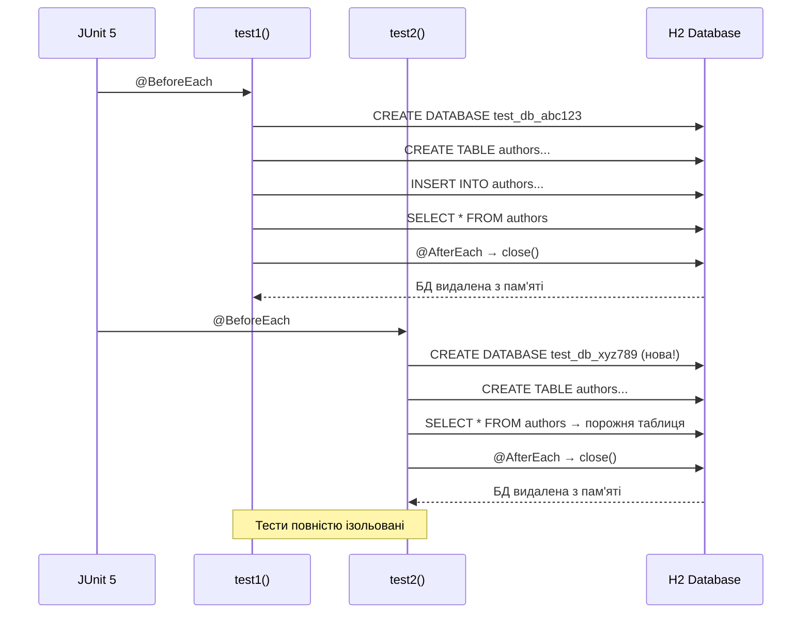

# Інтеграційне тестування JDBC-репозиторіїв: Embedded H2 та патерн AAA

## Вступ: Чому unit-тести недостатні

Повернімося до репозиторіїв зі статті 14. Ми реалізували `JdbcAuthorRepository` з методами `save()`, `findById()`, `update()`, `deleteById()`. Як переконатися, що ці методи працюють коректно?

**Наївний підхід — unit-тести з mock-об'єктами:**

```java
@Test
void save_shouldInsertAuthor() {
    // Arrange
    Connection mockConn = mock(Connection.class);
    PreparedStatement mockStmt = mock(PreparedStatement.class);
    when(mockConn.prepareStatement(anyString())).thenReturn(mockStmt);
    when(mockStmt.executeUpdate()).thenReturn(1);

    ConnectionManager mockCm = mock(ConnectionManager.class);
    when(mockCm.getConnection()).thenReturn(mockConn);

    AuthorRepository repo = new JdbcAuthorRepository(mockCm);
    Author author = new Author("Іван", "Франко");

    // Act
    repo.save(author);

    // Assert
    verify(mockStmt).executeUpdate();
}
```

**Що перевіряє цей тест?** Він перевіряє, що метод `save()` викликає `executeUpdate()` на `PreparedStatement`. Але він **не перевіряє**:

- Чи правильний SQL-запит (синтаксис, назви стовпців)
- Чи коректно встановлені параметри `PreparedStatement`
- Чи дані дійсно збережені у БД
- Чи працюють FK-обмеження
- Чи коректно обробляються SQL-виключення

::warning
**Проблема mock-тестів:** Вони перевіряють **взаємодію з API**, а не **коректність роботи з БД**. Якщо у SQL-запиті помилка (`INSER INTO` замість `INSERT INTO`) — mock-тест пройде успішно, але код не працюватиме у production.
::

**Інтеграційний тест** вирішує цю проблему: він виконує реальний SQL на реальній БД і перевіряє реальний результат.

```java
@Test
void save_shouldInsertNewAuthor_whenValidData() {
    // Arrange: створити реальну БД, виконати DDL
    ConnectionManager cm = ConnectionManager.forH2InMemory();
    executeDdlScript(cm, "ddl_h2.sql");
    AuthorRepository repo = new JdbcAuthorRepository(cm);
    
    Author author = new Author("Іван", "Франко");
    author.setBio("Український письменник");

    // Act: виконати реальний INSERT
    repo.save(author);

    // Assert: перевірити, що дані у БД
    Author loaded = repo.findById(author.getId()).orElseThrow();
    assertThat(loaded.getFirstName()).isEqualTo("Іван");
    assertThat(loaded.getLastName()).isEqualTo("Франко");
    assertThat(loaded.getBio()).isEqualTo("Український письменник");
}
```

**Що перевіряє цей тест?**

- ✅ SQL-запит синтаксично коректний
- ✅ Параметри встановлені правильно
- ✅ Дані збережені у БД
- ✅ Маппінг `ResultSet → Author` працює
- ✅ UUID генерується коректно

---

## Різниця між Unit та Integration тестами

| Критерій | Unit Test | Integration Test |
|---|---|---|
| **Що тестується** | Окремий метод/клас ізольовано | Взаємодія кількох компонентів |
| **Залежності** | Mock-об'єкти (Mockito) | Реальні залежності (БД, файли) |
| **Швидкість** | ⚡ Дуже швидкі (мілісекунди) | 🐢 Повільніші (секунди) |
| **Складність налаштування** | Проста (без зовнішніх ресурсів) | Складніша (потрібна БД) |
| **Що виявляють** | Логічні помилки у коді | Помилки інтеграції (SQL, схема БД) |
| **Коли запускати** | При кожному збереженні файлу | Перед commit, у CI/CD |

::tip
**Піраміда тестування** (Mike Cohn, 2009):

```
        /\
       /  \  E2E Tests (UI, API)
      /____\
     /      \
    / Integr \  Integration Tests
   /__________\
  /            \
 /  Unit Tests  \  Unit Tests
/________________\

70% Unit | 20% Integration | 10% E2E
```

Більшість тестів мають бути unit-тестами (швидкі, ізольовані). Integration тести покривають критичні шляхи взаємодії з БД. E2E тести перевіряють систему цілком.
::

**Для JDBC-репозиторіїв integration тести є критично важливими**, оскільки основна логіка — це SQL-запити, що не можуть бути адекватно протестовані через mock.

---

## Архітектура тестового оточення

Для інтеграційних тестів нам потрібна **реальна БД**. Але використовувати production БД для тестів — небезпечно (можна випадково видалити дані). Рішення — **Embedded H2 Database**.

### Що таке Embedded H2?

**H2** — це легковагова Java-БД, що може працювати у трьох режимах:

1. **Server mode:** Окремий процес, до якого підключаються клієнти (як PostgreSQL)
2. **Embedded mode:** БД працює у тому ж JVM-процесі, що й додаток
3. **In-memory mode:** БД існує лише у RAM, видаляється після завершення JVM

Для тестів ми використовуємо **in-memory mode**:

```java
// Кожен тест отримує нову порожню БД у пам'яті
String url = "jdbc:h2:mem:test_db_" + UUID.randomUUID() + ";DB_CLOSE_DELAY=-1";
Connection conn = DriverManager.getConnection(url);
```

**Переваги in-memory H2 для тестів:**

- ⚡ **Швидкість:** БД у RAM — INSERT/SELECT виконуються за мікросекунди
- 🔒 **Ізоляція:** Кожен тест отримує нову БД — тести не впливають один на одного
- 🧹 **Автоочищення:** БД видаляється після завершення тесту — не потрібно cleanup
- 📦 **Без установки:** H2 — це JAR-файл, додається як Maven-залежність

**Недоліки H2:**

- ⚠️ **Діалектні відмінності:** H2 SQL не на 100% сумісний з PostgreSQL/MySQL
- ⚠️ **Обмежені типи:** Немає ENUM (у H2 2.x є, але з обмеженнями), JSON, масивів
- ⚠️ **Інша продуктивність:** Оптимізатор запитів відрізняється від production СУБД

::note
У наступній статті (23) ми розглянемо **Testcontainers** — підхід, що запускає реальну PostgreSQL у Docker-контейнері для тестів. Це усуває діалектні відмінності, але повільніше за H2.

**Рекомендація:** Використовуйте H2 для швидких тестів базової функціональності, Testcontainers — для тестування PostgreSQL-специфічних функцій (ENUM, JSON, full-text search).
::

---

## Ізоляція тестів: Кожен тест = нова БД

**Золоте правило інтеграційних тестів:** Тести мають бути **незалежними** — порядок виконання не повинен впливати на результат.

**Антипатерн — спільна БД для всіх тестів:**

```java
// ❌ ПОГАНО: всі тести використовують одну БД
static Connection sharedConnection;

@BeforeAll
static void setupDatabase() {
    sharedConnection = DriverManager.getConnection("jdbc:h2:mem:shared_db");
    executeDdl(sharedConnection);
}

@Test
void test1() {
    repo.save(new Author("Автор 1", "Прізвище 1"));
    // БД тепер містить 1 автора
}

@Test
void test2() {
    List<Author> all = repo.findAll();
    // Скільки авторів? Залежить від того, чи виконався test1 перед test2!
    assertThat(all).hasSize(???); // Непередбачувано
}
```

**Правильний підхід — нова БД для кожного тесту:**

```java
// ✅ ДОБРЕ: кожен тест отримує нову порожню БД
ConnectionManager cm;

@BeforeEach
void setupFreshDatabase() {
    // Унікальна назва БД для кожного тесту
    String dbName = "test_db_" + UUID.randomUUID();
    cm = ConnectionManager.forH2InMemory(dbName);
    
    // Виконати DDL (створити таблиці)
    executeDdlScript(cm, "ddl_h2.sql");
}

@AfterEach
void tearDown() {
    cm.close(); // БД видаляється з пам'яті
}

@Test
void test1() {
    repo.save(new Author("Автор 1", "Прізвище 1"));
    // Ця БД існує лише для test1
}

@Test
void test2() {
    List<Author> all = repo.findAll();
    assertThat(all).isEmpty(); // Завжди порожня — нова БД!
}
```

::mermaid



::

