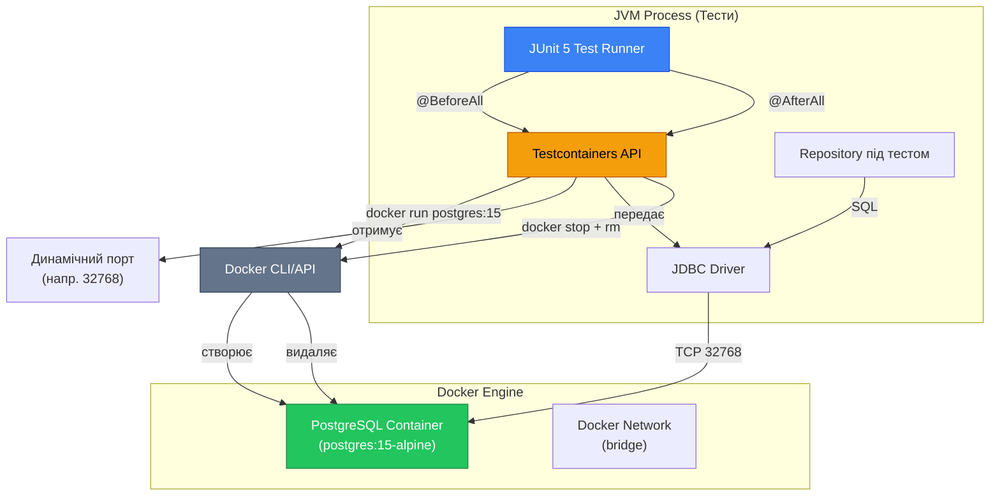

# Testcontainers: Тестування з реальною PostgreSQL у Docker-контейнерах

## Вступ: Обмеження Embedded H2

У попередній статті ми побудували інтеграційні тести на основі Embedded H2 Database — легковагової Java-БД, що працює у пам'яті JVM-процесу. Цей підхід має значні переваги: швидкість виконання (мілісекунди на тест), простота налаштування (жодних зовнішніх залежностей), автоматична ізоляція (кожен тест отримує нову БД).

Але H2 є **емуляцією** реляційної БД, а не повноцінною СУБД. Розглянемо конкретний приклад, що демонструє фундаментальну проблему емуляції.

### Проблема 1: Діалектні відмінності SQL

Наша production-система використовує PostgreSQL 15. У схемі БД визначено ENUM-тип для форматів аудіофайлів:

```sql
-- PostgreSQL DDL (production)
CREATE TYPE file_format_enum AS ENUM ('mp3', 'ogg', 'wav', 'm4b', 'aac', 'flac');

CREATE TABLE audiobook_files (
    id           UUID PRIMARY KEY,
    audiobook_id UUID NOT NULL,
    file_path    VARCHAR(2048) NOT NULL,
    format       file_format_enum NOT NULL,  -- ← PostgreSQL ENUM
    size         INTEGER
);
```

H2 до версії 2.0 **не підтримував ENUM взагалі**. У версії 2.x з'явилася підтримка, але з обмеженнями: ENUM у H2 є синтаксичним цукром над `VARCHAR` з `CHECK` constraint, а не окремим типом даних, як у PostgreSQL.

**Наслідок:** Тести на H2 можуть проходити успішно, але код провалиться у production:

```java
// Цей код працює на H2, але провалюється на PostgreSQL
String sql = "INSERT INTO audiobook_files (id, audiobook_id, file_path, format, size) " +
             "VALUES (?, ?, ?, ?, ?)";
stmt.setString(4, "mp3"); // H2: OK (VARCHAR)
                          // PostgreSQL: ERROR — потрібно CAST('mp3' AS file_format_enum)
```

Правильний код для PostgreSQL:

```java
// PostgreSQL вимагає явного приведення типу або використання setObject
stmt.setObject(4, "mp3", java.sql.Types.OTHER);
// або через PGobject (PostgreSQL JDBC driver)
```

**Проблема поглиблюється:** Якщо розробник тестує лише на H2, він не дізнається про цю помилку до deployment у production. Це порушує фундаментальний принцип тестування: **тестове оточення має максимально відповідати production**.

---

### Проблема 2: Відмінності у типах даних

PostgreSQL підтримує багаті типи даних, що не мають аналогів у H2:

| Тип PostgreSQL | Призначення | Аналог у H2 | Проблема |
|---|---|---|---|
| `ENUM` | Перелічення значень | `VARCHAR` + `CHECK` | Немає type safety на рівні БД |
| `JSON` / `JSONB` | Структуровані дані | `VARCHAR` | Немає JSON-операторів (`->`, `->>`, `@>`) |
| `ARRAY` | Масиви | Немає | Неможливо протестувати `ANY(array)` |
| `TSQUERY` / `TSVECTOR` | Full-text search | Немає | Неможливо протестувати `@@` оператор |
| `INTERVAL` | Часові інтервали | Обмежена підтримка | Різна семантика арифметики |
| `SERIAL` / `BIGSERIAL` | Автоінкремент | `IDENTITY` | Різний синтаксис |

**Приклад з JSON:**

```sql
-- PostgreSQL: пошук у JSON-полі
SELECT * FROM audiobooks 
WHERE metadata->>'language' = 'ukrainian'
  AND metadata->'tags' @> '["classic"]';
```

Цей запит **синтаксично некоректний** для H2 — оператори `->`, `->>`, `@>` не існують. Тест на H2 провалиться на етапі парсингу SQL, але це не означає, що код некоректний — він просто не може бути протестований на H2.

---

### Проблема 3: Відмінності у поведінці оптимізатора

Навіть коли SQL синтаксично сумісний, **оптимізатор запитів** H2 і PostgreSQL працює по-різному. Розглянемо запит з `LEFT JOIN`:

```sql
SELECT a.*, COUNT(ab.id) AS book_count
FROM authors a
LEFT JOIN audiobooks ab ON a.id = ab.author_id
GROUP BY a.id;
```

**H2:** Виконує `LEFT JOIN` → `GROUP BY` → повертає результат. Час виконання: ~5ms для 1000 авторів.

**PostgreSQL:** Може обрати інший план виконання залежно від статистики таблиць, наявності індексів, версії PostgreSQL. Час виконання: може варіюватися від 3ms до 50ms.

**Наслідок:** Тест продуктивності на H2 не відображає реальну продуктивність у production. Запит, що виконується за 5ms на H2, може виконуватися 200ms на PostgreSQL через відсутність індексу, що не був виявлений у тестах.

---

### Проблема 4: Транзакційна ізоляція

PostgreSQL за замовчуванням використовує рівень ізоляції `READ COMMITTED` з **MVCC** (Multi-Version Concurrency Control). H2 використовує інший механізм блокувань.

**Сценарій:** Два паралельних транзакції оновлюють один рядок.

```java
// Транзакція 1
UPDATE authors SET bio = 'Нова біографія' WHERE id = ?;
// Транзакція 2 (паралельно)
UPDATE authors SET image_path = '/new.jpg' WHERE id = ?; // той самий id
```

**PostgreSQL:** Транзакція 2 блокується до завершення транзакції 1 (row-level lock). Після commit транзакції 1 — транзакція 2 продовжує виконання.

**H2:** Може використовувати table-level lock або інший механізм. Поведінка може відрізнятися, особливо при `SERIALIZABLE` ізоляції.

**Наслідок:** Тести на H2 не виявлять deadlock або race condition, що виникнуть у production при високому навантаженні.

---

## Концепція: Testcontainers

**Testcontainers** (https://testcontainers.com) — це Java-бібліотека, що дозволяє запускати **реальні Docker-контейнери** як частину інтеграційних тестів. Замість емуляції БД через H2, Testcontainers запускає справжню PostgreSQL у Docker-контейнері, виконує тести, і автоматично видаляє контейнер після завершення.

### Архітектура Testcontainers

::mermaid



::

**Ключові компоненти:**

1. **Testcontainers API:** Java-бібліотека, що керує lifecycle Docker-контейнерів через Docker Engine API.
2. **Docker Engine:** Демон Docker, що запускає контейнери. Має бути встановлений на машині розробника або CI-сервері.
3. **PostgreSQL Container:** Офіційний Docker-образ PostgreSQL (з Docker Hub), що запускається у ізольованому контейнері.
4. **Динамічний порт:** Testcontainers автоматично призначає вільний порт на host-машині (наприклад, 32768) і проксує його до порту 5432 всередині контейнера.
5. **JDBC Connection:** Тести підключаються до PostgreSQL через звичайний JDBC, використовуючи динамічний порт.

---

### Lifecycle контейнера у тестах

Testcontainers підтримує кілька стратегій управління lifecycle контейнерів:

#### Стратегія 1: Per-Test-Class (рекомендовано)

Один контейнер на весь тестовий клас — запускається перед першим тестом, видаляється після останнього.

```java
@Testcontainers // JUnit 5 extension
class AuthorRepositoryTest {

    @Container // керується Testcontainers
    static PostgreSQLContainer<?> postgres = new PostgreSQLContainer<>("postgres:15-alpine")
        .withDatabaseName("test_db")
        .withUsername("test_user")
        .withPassword("test_pass");

    @Test
    void test1() { /* використовує той самий контейнер */ }

    @Test
    void test2() { /* використовує той самий контейнер */ }
}
```

**Lifecycle:**

```
@BeforeAll (JUnit)
  → Testcontainers запускає контейнер
  → Чекає на готовність PostgreSQL (health check)
  → Повертає JDBC URL з динамічним портом

test1() виконується
test2() виконується
...

@AfterAll (JUnit)
  → Testcontainers зупиняє контейнер
  → Видаляє контейнер (docker rm)
```

**Переваги:**
- Швидше за per-test (контейнер запускається один раз)
- Тести все одно ізольовані (кожен тест очищає дані через `@BeforeEach`)

**Недоліки:**
- Якщо один тест «забруднює» БД і не очищає — наступний тест може провалитися

---

#### Стратегія 2: Singleton Container (найшвидша)

Один контейнер для **всіх** тестових класів у проєкті. Запускається один раз при першому тесті, живе до завершення JVM.

```java
public abstract class AbstractIntegrationTest {

    private static final PostgreSQLContainer<?> POSTGRES;

    static {
        POSTGRES = new PostgreSQLContainer<>("postgres:15-alpine")
            .withDatabaseName("test_db")
            .withUsername("test")
            .withPassword("test")
            .withReuse(true); // ← дозволити повторне використання

        POSTGRES.start();
    }

    protected static String getJdbcUrl() {
        return POSTGRES.getJdbcUrl();
    }
}
```

**Переваги:**
- Максимальна швидкість (контейнер запускається один раз)
- Підходить для великих тестових наборів (сотні тестів)

**Недоліки:**
- Потребує ретельного очищення БД між тестами
- Складніше налагоджувати (контейнер живе після завершення тестів)

---

#### Стратегія 3: Per-Test (найповільніша, найізольованіша)

Новий контейнер для кожного тесту. Максимальна ізоляція, але дуже повільно.

```java
class AuthorRepositoryTest {

    @Container // не static — новий контейнер для кожного тесту
    PostgreSQLContainer<?> postgres = new PostgreSQLContainer<>("postgres:15-alpine");

    @Test
    void test1() { /* власний контейнер */ }

    @Test
    void test2() { /* новий контейнер */ }
}
```

**Lifecycle:**

```
@BeforeEach
  → Запустити новий контейнер
  → Виконати DDL

test1()

@AfterEach
  → Зупинити контейнер

@BeforeEach
  → Запустити НОВИЙ контейнер
  → Виконати DDL

test2()

@AfterEach
  → Зупинити контейнер
```

**Використання:** Рідко. Лише коли тести модифікують схему БД (DDL) і не можуть бути ізольовані інакше.

---

## Порівняння підходів: H2 vs Testcontainers

Перш ніж перейти до реалізації, підсумуємо переваги та недоліки обох підходів:

| Критерій | Embedded H2 | Testcontainers + PostgreSQL |
|---|---|---|
| **Швидкість запуску** | ⚡⚡⚡ Миттєво (in-memory) | 🐢 2–5 секунд (запуск контейнера) |
| **Швидкість виконання тестів** | ⚡⚡⚡ Мілісекунди | ⚡⚡ Десятки мілісекунд |
| **Точність емуляції** | ⚠️ 70–80% сумісність | ✅ 100% — реальна PostgreSQL |
| **Підтримка ENUM** | ⚠️ Обмежена (H2 2.x) | ✅ Повна |
| **Підтримка JSON** | ❌ Немає операторів | ✅ JSONB + всі оператори |
| **Підтримка full-text search** | ❌ Немає | ✅ `tsvector`, `tsquery`, `@@` |
| **Підтримка масивів** | ❌ Немає | ✅ `ARRAY`, `ANY()` |
| **Транзакційна ізоляція** | ⚠️ Інша реалізація | ✅ Ідентична production |
| **Вимоги до оточення** | ✅ Жодних (JAR-файл) | ⚠️ Потрібен Docker |
| **CI/CD інтеграція** | ✅ Проста | ⚠️ Потрібен Docker-in-Docker |
| **Налагодження** | ✅ Просте (in-process) | ⚠️ Складніше (окремий процес) |

::tip
**Гібридна стратегія (рекомендовано для production):**

1. **Швидкі тести на H2:** Базові CRUD-операції, валідація constraints, прості запити. Виконуються при кожному збереженні файлу (IDE watch mode).

2. **Повні тести на Testcontainers:** PostgreSQL-специфічні функції, складні JOIN, транзакційна логіка, тести продуктивності. Виконуються перед commit та у CI/CD.

Це дає баланс між швидкістю розробки та впевненістю у коректності коду.
::


---

## Налаштування Testcontainers

### Встановлення Docker

Testcontainers вимагає наявності Docker Engine на машині розробника. Процес встановлення залежить від операційної системи:

**macOS:**

```bash
# Через Homebrew
brew install --cask docker

# Або завантажити Docker Desktop з docker.com
# Docker Desktop включає Docker Engine + GUI
```

**Linux (Ubuntu/Debian):**

```bash
# Встановити Docker Engine
sudo apt-get update
sudo apt-get install docker-ce docker-ce-cli containerd.io

# Додати поточного користувача до групи docker (щоб не потрібен sudo)
sudo usermod -aG docker $USER
newgrp docker

# Перевірити встановлення
docker run hello-world
```

**Windows:**

```powershell
# Завантажити Docker Desktop для Windows з docker.com
# Вимагає WSL 2 (Windows Subsystem for Linux)
```

::note
**Docker Desktop vs Docker Engine:**

- **Docker Desktop:** GUI-додаток для macOS/Windows, що включає Docker Engine, Docker Compose, Kubernetes. Рекомендовано для розробників.
- **Docker Engine:** Лише демон Docker без GUI. Використовується на Linux-серверах та у CI/CD.

Testcontainers працює з обома варіантами — йому потрібен лише Docker Engine API.
::

---

### Maven залежності

Додайте Testcontainers до `pom.xml`:

```xml showLineNumbers
<dependencies>
    <!-- JUnit 5 (вже є з попередньої статті) -->
    <dependency>
        <groupId>org.junit.jupiter</groupId>
        <artifactId>junit-jupiter</artifactId>
        <version>5.10.2</version>
        <scope>test</scope>
    </dependency>

    <!-- Testcontainers Core -->
    <dependency>
        <groupId>org.testcontainers</groupId>
        <artifactId>testcontainers</artifactId>
        <version>1.19.7</version>
        <scope>test</scope>
    </dependency>

    <!-- Testcontainers JUnit 5 Integration -->
    <dependency>
        <groupId>org.testcontainers</groupId>
        <artifactId>junit-jupiter</artifactId>
        <version>1.19.7</version>
        <scope>test</scope>
    </dependency>

    <!-- Testcontainers PostgreSQL Module -->
    <dependency>
        <groupId>org.testcontainers</groupId>
        <artifactId>postgresql</artifactId>
        <version>1.19.7</version>
        <scope>test</scope>
    </dependency>

    <!-- PostgreSQL JDBC Driver (для production і тестів) -->
    <dependency>
        <groupId>org.postgresql</groupId>
        <artifactId>postgresql</artifactId>
        <version>42.7.3</version>
    </dependency>

    <!-- AssertJ (вже є з попередньої статті) -->
    <dependency>
        <groupId>org.assertj</groupId>
        <artifactId>assertj-core</artifactId>
        <version>3.25.3</version>
        <scope>test</scope>
    </dependency>
</dependencies>
```

**Пояснення залежностей:**

- **`testcontainers`** (рядок 12): Core-бібліотека Testcontainers. Надає базовий API для роботи з Docker.
- **`junit-jupiter`** (рядок 18): Інтеграція з JUnit 5. Надає анотації `@Testcontainers` та `@Container`.
- **`postgresql`** (рядок 24): Модуль для PostgreSQL. Надає клас `PostgreSQLContainer` з преконфігурованими налаштуваннями.
- **`postgresql` JDBC driver** (рядок 30): Драйвер для підключення до PostgreSQL. Потрібен і для production, і для тестів.

::warning
**Версії Testcontainers та Docker:**

Testcontainers 1.19.x вимагає:
- Docker Engine 20.10+ (випущений у 2020)
- Java 8+ (але рекомендовано Java 17+)

Якщо у вас старіша версія Docker — оновіть її. Testcontainers не працює з Docker версій 1.x.
::

---

### Базовий клас AbstractPostgresIntegrationTest

Створимо абстрактний базовий клас, аналогічний `AbstractRepositoryTest` з попередньої статті, але для Testcontainers:

```java showLineNumbers
package com.example.audiobook.repository;

import com.example.audiobook.db.ConnectionManager;
import org.junit.jupiter.api.AfterEach;
import org.junit.jupiter.api.BeforeAll;
import org.junit.jupiter.api.BeforeEach;
import org.testcontainers.containers.PostgreSQLContainer;
import org.testcontainers.junit.jupiter.Container;
import org.testcontainers.junit.jupiter.Testcontainers;
import org.testcontainers.utility.DockerImageName;

import java.io.BufferedReader;
import java.io.IOException;
import java.io.InputStreamReader;
import java.nio.charset.StandardCharsets;
import java.sql.Connection;
import java.sql.SQLException;
import java.sql.Statement;
import java.util.stream.Collectors;

/**
 * Базовий клас для інтеграційних тестів з Testcontainers + PostgreSQL.
 * <p>
 * <b>Архітектурні рішення:</b>
 * <ul>
 *   <li><b>Singleton Container Pattern:</b> Один контейнер PostgreSQL для всього
 *       тестового класу (static @Container). Це швидше за створення нового
 *       контейнера для кожного тесту.</li>
 *   <li><b>Ізоляція через TRUNCATE:</b> Кожен тест очищує всі таблиці у
 *       {@code @BeforeEach}, гарантуючи незалежність тестів.</li>
 *   <li><b>DDL виконується один раз:</b> Схема БД створюється у {@code @BeforeAll}
 *       і використовується всіма тестами.</li>
 * </ul>
 * <p>
 * <b>Lifecycle:</b>
 * <pre>
 * @BeforeAll (один раз для класу)
 *   → Testcontainers запускає PostgreSQL контейнер
 *   → Виконується DDL-скрипт (CREATE TABLE)
 *   → Створюється ConnectionManager
 *
 * @BeforeEach (перед кожним тестом)
 *   → TRUNCATE всіх таблиць (очищення даних)
 *
 * test1() → test2() → test3() ...
 *
 * @AfterEach (після кожного тесту)
 *   → Закрити з'єднання (опціонально)
 *
 * @AfterAll (один раз після всіх тестів)
 *   → Testcontainers зупиняє і видаляє контейнер
 * </pre>
 */
@Testcontainers // JUnit 5 extension для автоматичного управління контейнерами
public abstract class AbstractPostgresIntegrationTest {

    /**
     * PostgreSQL контейнер — спільний для всіх тестів у класі.
     * <p>
     * <b>static:</b> Контейнер запускається один раз для класу, а не для кожного тесту.
     * Це значно швидше (запуск контейнера займає 2–5 секунд).
     * <p>
     * <b>@Container:</b> Testcontainers автоматично керує lifecycle:
     * запускає перед {@code @BeforeAll}, зупиняє після {@code @AfterAll}.
     * <p>
     * <b>DockerImageName.parse():</b> Явно вказуємо Docker-образ з версією.
     * Це гарантує, що тести використовують ту саму версію PostgreSQL, що й production.
     */
    @Container
    protected static final PostgreSQLContainer<?> POSTGRES = 
        new PostgreSQLContainer<>(DockerImageName.parse("postgres:15-alpine"))
            .withDatabaseName("audiobook_test_db")
            .withUsername("test_user")
            .withPassword("test_password")
            .withReuse(false); // false = новий контейнер для кожного запуску тестів

    /**
     * ConnectionManager для тестової БД.
     * Створюється після запуску контейнера у {@code @BeforeAll}.
     */
    protected static ConnectionManager connectionManager;

    /**
     * Ініціалізує ConnectionManager та виконує DDL-скрипт.
     * <p>
     * Викликається один раз перед усіма тестами класу.
     * На цьому етапі PostgreSQL контейнер вже запущений (завдяки @Container).
     */
    @BeforeAll
    static void initializeDatabase() throws IOException, SQLException {
        // Отримати JDBC URL з динамічним портом
        // Приклад: jdbc:postgresql://localhost:32768/audiobook_test_db
        String jdbcUrl = POSTGRES.getJdbcUrl();
        String username = POSTGRES.getUsername();
        String password = POSTGRES.getPassword();

        // Створити ConnectionManager для тестової БД
        connectionManager = new ConnectionManager(jdbcUrl, username, password);

        // Виконати DDL-скрипт (створити таблиці)
        executeDdlScript("ddl_postgres.sql");
    }

    /**
     * Очищує всі таблиці перед кожним тестом.
     * <p>
     * Це гарантує ізоляцію тестів: кожен тест починає з порожньої БД.
     * Використовуємо {@code TRUNCATE} замість {@code DELETE}, оскільки:
     * <ul>
     *   <li>TRUNCATE швидший (не генерує WAL-записи для кожного рядка)</li>
     *   <li>TRUNCATE скидає AUTO_INCREMENT лічильники</li>
     *   <li>TRUNCATE ... CASCADE автоматично очищає пов'язані таблиці</li>
     * </ul>
     */
    @BeforeEach
    void cleanDatabase() throws SQLException {
        try (Connection conn = connectionManager.getConnection();
             Statement stmt = conn.createStatement()) {
            
            // TRUNCATE всі таблиці у правильному порядку (від дочірніх до батьківських)
            // CASCADE автоматично очистить пов'язані таблиці через FK
            stmt.execute("TRUNCATE TABLE audiobook_files CASCADE");
            stmt.execute("TRUNCATE TABLE listening_progresses CASCADE");
            stmt.execute("TRUNCATE TABLE audiobook_collection CASCADE");
            stmt.execute("TRUNCATE TABLE collections CASCADE");
            stmt.execute("TRUNCATE TABLE audiobooks CASCADE");
            stmt.execute("TRUNCATE TABLE authors CASCADE");
            stmt.execute("TRUNCATE TABLE genres CASCADE");
            stmt.execute("TRUNCATE TABLE users CASCADE");
        }
    }

    /**
     * Закриває ConnectionManager після всіх тестів.
     * Контейнер PostgreSQL автоматично зупиняється Testcontainers.
     */
    @AfterEach
    void tearDown() {
        // У цій реалізації нічого не робимо — ConnectionManager залишається відкритим
        // для наступних тестів. Закриття відбувається у @AfterAll (якщо потрібно).
    }

    // ═══════════════════════════════════════════════════════════════════════
    // Утилітні методи (аналогічні AbstractRepositoryTest з H2)
    // ═══════════════════════════════════════════════════════════════════════

    /**
     * Виконує DDL-скрипт з ресурсів.
     * <p>
     * Скрипт має бути PostgreSQL-сумісним (не H2!).
     * Розташування: {@code src/test/resources/ddl_postgres.sql}
     */
    protected static void executeDdlScript(String scriptPath) throws IOException, SQLException {
        String sql = loadResourceAsString(scriptPath);
        
        try (Connection conn = connectionManager.getConnection();
             Statement stmt = conn.createStatement()) {
            
            // PostgreSQL підтримує багаторядкові команди через ;
            String[] commands = sql.split(";");
            for (String command : commands) {
                String trimmed = command.trim();
                if (!trimmed.isEmpty() && !trimmed.startsWith("--")) {
                    stmt.execute(trimmed);
                }
            }
        }
    }

    /**
     * Завантажує файл з ресурсів як рядок.
     */
    protected static String loadResourceAsString(String resourcePath) throws IOException {
        try (BufferedReader reader = new BufferedReader(
                new InputStreamReader(
                    AbstractPostgresIntegrationTest.class
                        .getClassLoader()
                        .getResourceAsStream(resourcePath),
                    StandardCharsets.UTF_8))) {
            return reader.lines().collect(Collectors.joining("\n"));
        }
    }

    /**
     * Підраховує кількість рядків у таблиці.
     */
    protected long countRowsInTable(String tableName) throws SQLException {
        String sql = "SELECT COUNT(*) FROM " + tableName;
        try (Connection conn = connectionManager.getConnection();
             Statement stmt = conn.createStatement();
             var rs = stmt.executeQuery(sql)) {
            rs.next();
            return rs.getLong(1);
        }
    }

    /**
     * Виконує довільний SQL-запит (для підготовки тестових даних).
     */
    protected void executeSql(String sql) throws SQLException {
        try (Connection conn = connectionManager.getConnection();
             Statement stmt = conn.createStatement()) {
            stmt.execute(sql);
        }
    }
}
```

**Ключові архітектурні рішення:**

- **Рядки 72–80** (`@Container static`): Контейнер є `static` — це означає, що він запускається один раз для всього тестового класу, а не для кожного тесту. Це критично важливо для продуктивності: запуск PostgreSQL контейнера займає 2–5 секунд, і робити це для кожного тесту неприйнятно.

- **Рядок 80** (`withReuse(false)`): За замовчуванням Testcontainers видаляє контейнер після завершення тестів. `withReuse(true)` дозволяє залишити контейнер запущеним між запусками тестів (для ще більшої швидкості), але це ускладнює налагодження.

- **Рядки 97–108** (`initializeDatabase()`): Метод викликається **після** запуску контейнера (Testcontainers гарантує це через `@Container`). На цьому етапі `POSTGRES.getJdbcUrl()` вже повертає валідний URL з динамічним портом.

- **Рядки 125–140** (`cleanDatabase()`): Використовуємо `TRUNCATE` замість `DELETE FROM` з кількох причин:
  1. **Продуктивність:** `TRUNCATE` не генерує WAL (Write-Ahead Log) записи для кожного рядка — він просто скидає файл даних таблиці.
  2. **Скидання послідовностей:** `TRUNCATE` скидає `SERIAL` лічильники до початкового значення.
  3. **CASCADE:** `TRUNCATE ... CASCADE` автоматично очищає всі таблиці, що мають FK на цю таблицю.

::tip
**Чому порядок TRUNCATE важливий?**

PostgreSQL не дозволяє `TRUNCATE` батьківської таблиці, якщо на неї посилаються дочірні таблиці (через FK), навіть якщо дочірні таблиці порожні. Тому ми очищаємо таблиці у порядку від дочірніх до батьківських:

```
audiobook_files (FK → audiobooks)
audiobooks (FK → authors, genres)
authors (батьківська)
genres (батьківська)
```

Альтернатива — використовувати `TRUNCATE ... CASCADE`, що автоматично очистить всі пов'язані таблиці, але це менш явно і може приховати помилки у структурі FK.
::


---

## DDL-скрипт для PostgreSQL

Створимо `src/test/resources/ddl_postgres.sql` — повноцінний PostgreSQL DDL з усіма специфічними типами:

```sql showLineNumbers
-- PostgreSQL 15 DDL для тестів
-- Використовує всі можливості PostgreSQL (ENUM, CHECK, CASCADE)

-- ENUM для форматів аудіофайлів
CREATE TYPE file_format_enum AS ENUM ('mp3', 'ogg', 'wav', 'm4b', 'aac', 'flac');

-- Таблиця авторів
CREATE TABLE authors (
    id          UUID         PRIMARY KEY,
    first_name  VARCHAR(64)  NOT NULL,
    last_name   VARCHAR(64)  NOT NULL,
    bio         TEXT,
    image_path  VARCHAR(2048)
);

-- Таблиця жанрів
CREATE TABLE genres (
    id          UUID         PRIMARY KEY,
    name        VARCHAR(64)  NOT NULL UNIQUE,
    description TEXT
);

-- Таблиця аудіокниг
CREATE TABLE audiobooks (
    id               UUID         PRIMARY KEY,
    author_id        UUID         NOT NULL,
    genre_id         UUID         NOT NULL,
    title            VARCHAR(255) NOT NULL,
    duration         INTEGER      NOT NULL CHECK (duration > 0),
    release_year     INTEGER      NOT NULL 
                     CHECK (release_year >= 1900 AND release_year <= EXTRACT(YEAR FROM CURRENT_DATE) + 1),
    description      TEXT,
    cover_image_path VARCHAR(2048),
    
    CONSTRAINT audiobooks_author_fk 
        FOREIGN KEY (author_id) REFERENCES authors(id) ON DELETE CASCADE,
    CONSTRAINT audiobooks_genre_fk 
        FOREIGN KEY (genre_id) REFERENCES genres(id) ON DELETE CASCADE
);

CREATE INDEX audiobooks_author_id_idx ON audiobooks(author_id);
CREATE INDEX audiobooks_genre_id_idx  ON audiobooks(genre_id);

-- Таблиця користувачів
CREATE TABLE users (
    id            UUID         PRIMARY KEY,
    username      VARCHAR(64)  NOT NULL UNIQUE 
                  CHECK (LENGTH(TRIM(username)) > 0),
    password_hash VARCHAR(128) NOT NULL,
    email         VARCHAR(376),
    avatar_path   VARCHAR(2048)
);

CREATE INDEX users_email_idx ON users(email);

-- Таблиця колекцій користувачів
CREATE TABLE collections (
    id         UUID      PRIMARY KEY,
    user_id    UUID      NOT NULL,
    name       VARCHAR(128) NOT NULL CHECK (LENGTH(TRIM(name)) > 0),
    created_at TIMESTAMP DEFAULT CURRENT_TIMESTAMP,
    
    CONSTRAINT collections_user_fk 
        FOREIGN KEY (user_id) REFERENCES users(id) ON DELETE CASCADE
);

-- Зв'язок багато-до-багатьох: колекції ↔ аудіокниги
CREATE TABLE audiobook_collection (
    collection_id UUID NOT NULL,
    audiobook_id  UUID NOT NULL,
    
    PRIMARY KEY (collection_id, audiobook_id),
    
    CONSTRAINT ac_collection_fk 
        FOREIGN KEY (collection_id) REFERENCES collections(id) ON DELETE CASCADE,
    CONSTRAINT ac_audiobook_fk 
        FOREIGN KEY (audiobook_id) REFERENCES audiobooks(id) ON DELETE CASCADE
);

-- Таблиця файлів аудіокниг (використовує ENUM)
CREATE TABLE audiobook_files (
    id           UUID             PRIMARY KEY,
    audiobook_id UUID             NOT NULL,
    file_path    VARCHAR(2048)    NOT NULL CHECK (LENGTH(TRIM(file_path)) > 0),
    format       file_format_enum NOT NULL,  -- ← PostgreSQL ENUM
    size         INTEGER          CHECK (size IS NULL OR size > 0),
    
    CONSTRAINT af_audiobook_fk 
        FOREIGN KEY (audiobook_id) REFERENCES audiobooks(id) ON DELETE CASCADE
);

CREATE INDEX audiobook_files_audiobook_id_idx ON audiobook_files(audiobook_id);

-- Таблиця прогресу прослуховування
CREATE TABLE listening_progresses (
    id            UUID      PRIMARY KEY,
    user_id       UUID      NOT NULL,
    audiobook_id  UUID      NOT NULL,
    position      INTEGER   NOT NULL CHECK (position >= 0),
    last_listened TIMESTAMP DEFAULT CURRENT_TIMESTAMP,
    
    CONSTRAINT lp_user_fk 
        FOREIGN KEY (user_id) REFERENCES users(id) ON DELETE CASCADE,
    CONSTRAINT lp_audiobook_fk 
        FOREIGN KEY (audiobook_id) REFERENCES audiobooks(id) ON DELETE CASCADE
);

CREATE INDEX listening_progresses_user_id_idx      ON listening_progresses(user_id);
CREATE INDEX listening_progresses_audiobook_id_idx ON listening_progresses(audiobook_id);
```

**Відмінності від H2 DDL:**

- **Рядок 5:** `CREATE TYPE ... AS ENUM` — PostgreSQL-специфічний синтаксис. H2 не підтримує це.
- **Рядок 31:** `EXTRACT(YEAR FROM CURRENT_DATE)` — PostgreSQL синтаксис. H2 використовує `YEAR(CURRENT_DATE)`.
- **Рядок 88:** `format file_format_enum` — використання ENUM-типу. У H2 це був би `VARCHAR` з `CHECK`.
- **Рядок 62:** `created_at TIMESTAMP DEFAULT CURRENT_TIMESTAMP` — PostgreSQL автоматично встановлює поточний час.

---

## Міграція тестів з H2 на PostgreSQL

Тепер адаптуємо тести з попередньої статті для роботи з Testcontainers. Більшість тестів залишаться **ідентичними** — змінюється лише базовий клас.

### Тестування базових CRUD-операцій

```java showLineNumbers
package com.example.audiobook.repository;

import com.example.audiobook.domain.Author;
import com.example.audiobook.repository.jdbc.JdbcAuthorRepository;
import org.junit.jupiter.api.BeforeEach;
import org.junit.jupiter.api.Test;

import java.util.List;
import java.util.Optional;
import java.util.UUID;

import static org.assertj.core.api.Assertions.*;

/**
 * Інтеграційні тести {@link JdbcAuthorRepository} з реальною PostgreSQL.
 * <p>
 * <b>Відмінності від H2-версії:</b>
 * <ul>
 *   <li>Базовий клас: {@link AbstractPostgresIntegrationTest} замість
 *       {@code AbstractRepositoryTest}</li>
 *   <li>БД: Реальна PostgreSQL у Docker-контейнері замість in-memory H2</li>
 *   <li>Швидкість: Повільніше (~50ms на тест замість ~5ms), але точніше</li>
 * </ul>
 * <p>
 * <b>Що тестується:</b>
 * <ul>
 *   <li>CRUD-операції (save, findById, update, delete)</li>
 *   <li>Пошукові методи (findByLastName, findByFullName)</li>
 *   <li>Граничні випадки (null-значення, порожні результати)</li>
 *   <li>Constraints (PRIMARY KEY, NOT NULL)</li>
 * </ul>
 */
class JdbcAuthorRepositoryPostgresTest extends AbstractPostgresIntegrationTest {

    private AuthorRepository repository;

    @BeforeEach
    void setUpRepository() {
        // connectionManager вже ініціалізований у AbstractPostgresIntegrationTest
        repository = new JdbcAuthorRepository(connectionManager);
    }

    // ═══════════════════════════════════════════════════════════════════════
    // Тести save() — ідентичні H2-версії
    // ═══════════════════════════════════════════════════════════════════════

    @Test
    void save_shouldInsertNewAuthor_whenValidData() {
        // ═══ Arrange ═══
        Author author = new Author("Іван", "Франко");
        author.setBio("Український письменник, поет, публіцист, політичний діяч");
        author.setImagePath("/images/franko.jpg");

        // ═══ Act ═══
        repository.save(author);

        // ═══ Assert ═══
        assertThat(author.getId()).isNotNull();
        
        Author loaded = repository.findById(author.getId()).orElseThrow();
        assertThat(loaded.getFirstName()).isEqualTo("Іван");
        assertThat(loaded.getLastName()).isEqualTo("Франко");
        assertThat(loaded.getBio()).isEqualTo("Український письменник, поет, публіцист, політичний діяч");
        assertThat(loaded.getImagePath()).isEqualTo("/images/franko.jpg");
        
        assertThat(countRowsInTable("authors")).isEqualTo(1);
    }

    @Test
    void save_shouldHandleNullBio_whenBioNotProvided() {
        // ═══ Arrange ═══
        Author author = new Author("Леся", "Українка");
        // bio та imagePath залишаються null

        // ═══ Act ═══
        repository.save(author);

        // ═══ Assert ═══
        Author loaded = repository.findById(author.getId()).orElseThrow();
        assertThat(loaded.getBio()).isNull();
        assertThat(loaded.getImagePath()).isNull();
    }

    @Test
    void save_shouldThrowException_whenDuplicateId() {
        // ═══ Arrange ═══
        UUID sharedId = UUID.randomUUID();
        
        Author author1 = new Author("Тарас", "Шевченко");
        author1.setId(sharedId);
        
        Author author2 = new Author("Іван", "Франко");
        author2.setId(sharedId);

        repository.save(author1);

        // ═══ Act & Assert ═══
        assertThatThrownBy(() -> repository.save(author2))
            .isInstanceOf(com.example.audiobook.db.DatabaseException.class)
            .hasMessageContaining("duplicate key"); // PostgreSQL повідомлення
    }

    // ═══════════════════════════════════════════════════════════════════════
    // Тести findById() — ідентичні H2-версії
    // ═══════════════════════════════════════════════════════════════════════

    @Test
    void findById_shouldReturnAuthor_whenExists() {
        // ═══ Arrange ═══
        Author author = new Author("Михайло", "Коцюбинський");
        repository.save(author);

        // ═══ Act ═══
        Optional<Author> result = repository.findById(author.getId());

        // ═══ Assert ═══
        assertThat(result).isPresent();
        assertThat(result.get().getFirstName()).isEqualTo("Михайло");
        assertThat(result.get().getLastName()).isEqualTo("Коцюбинський");
    }

    @Test
    void findById_shouldReturnEmpty_whenNotExists() {
        // ═══ Arrange ═══
        UUID nonExistentId = UUID.randomUUID();

        // ═══ Act ═══
        Optional<Author> result = repository.findById(nonExistentId);

        // ═══ Assert ═══
        assertThat(result).isEmpty();
    }

    // ═══════════════════════════════════════════════════════════════════════
    // Тести update() та delete() — ідентичні H2-версії
    // ═══════════════════════════════════════════════════════════════════════

    @Test
    void update_shouldModifyAllFields_whenAuthorExists() {
        // ═══ Arrange ═══
        Author author = new Author("Іван", "Франко");
        author.setBio("Стара біографія");
        repository.save(author);

        author.setFirstName("Іван Якович");
        author.setLastName("Франко-Захарченко");
        author.setBio("Нова біографія");
        author.setImagePath("/images/new.jpg");

        // ═══ Act ═══
        repository.update(author);

        // ═══ Assert ═══
        Author loaded = repository.findById(author.getId()).orElseThrow();
        assertThat(loaded.getFirstName()).isEqualTo("Іван Якович");
        assertThat(loaded.getLastName()).isEqualTo("Франко-Захарченко");
        assertThat(loaded.getBio()).isEqualTo("Нова біографія");
        assertThat(loaded.getImagePath()).isEqualTo("/images/new.jpg");
    }

    @Test
    void deleteById_shouldRemoveAuthor_whenExists() {
        // ═══ Arrange ═══
        Author author = new Author("Панас", "Мирний");
        repository.save(author);
        UUID authorId = author.getId();

        // ═══ Act ═══
        boolean deleted = repository.deleteById(authorId);

        // ═══ Assert ═══
        assertThat(deleted).isTrue();
        assertThat(repository.findById(authorId)).isEmpty();
        assertThat(countRowsInTable("authors")).isEqualTo(0);
    }

    // ═══════════════════════════════════════════════════════════════════════
    // Тести findByLastName() — ідентичні H2-версії
    // ═══════════════════════════════════════════════════════════════════════

    @Test
    void findByLastName_shouldReturnMatchingAuthors_whenPartialMatch() {
        // ═══ Arrange ═══
        repository.save(new Author("Тарас", "Шевченко"));
        repository.save(new Author("Іван", "Франко"));
        repository.save(new Author("Леся", "Українка"));
        repository.save(new Author("Григорій", "Сковорода"));

        // ═══ Act ═══
        List<Author> result = repository.findByLastName("ко");

        // ═══ Assert ═══
        assertThat(result).hasSize(2);
        assertThat(result)
            .extracting(Author::getLastName)
            .containsExactlyInAnyOrder("Франко", "Сковорода");
    }

    @Test
    void findByLastName_shouldBeCaseInsensitive_whenSearching() {
        // ═══ Arrange ═══
        repository.save(new Author("Тарас", "Шевченко"));

        // ═══ Act ═══
        List<Author> result1 = repository.findByLastName("шевч");
        List<Author> result2 = repository.findByLastName("ШЕВЧ");
        List<Author> result3 = repository.findByLastName("ШеВч");

        // ═══ Assert ═══
        assertThat(result1).hasSize(1);
        assertThat(result2).hasSize(1);
        assertThat(result3).hasSize(1);
    }
}
```

**Ключові спостереження:**

- **Рядок 33** (`extends AbstractPostgresIntegrationTest`): Єдина зміна відносно H2-версії — базовий клас. Вся логіка тестів залишається ідентичною.

- **Рядок 103** (`hasMessageContaining("duplicate key")`): PostgreSQL повертає інше повідомлення про помилку, ніж H2. H2 повідомляє `"PRIMARY KEY"`, PostgreSQL — `"duplicate key value violates unique constraint"`. Це єдина відмінність у тестах.

- **Швидкість виконання:** Тести на PostgreSQL виконуються повільніше (~30–50ms на тест) порівняно з H2 (~5–10ms), але це ціна за точність емуляції.

::note
**Чому більшість тестів ідентичні?**

Це демонструє силу абстракції через `Repository<T, ID>` інтерфейс. Репозиторій не знає, чи він працює з H2, PostgreSQL, MySQL чи Oracle — він просто виконує SQL через JDBC. Тести перевіряють **контракт репозиторію**, а не специфіку СУБД.

Специфічні для PostgreSQL тести (ENUM, JSON, full-text search) ми розглянемо у наступному розділі.
::


---

## Тестування PostgreSQL-специфічних функцій

Тепер розглянемо тести, що **неможливо** виконати на H2 — вони вимагають справжньої PostgreSQL.

### Тестування ENUM-типів

PostgreSQL ENUM є окремим типом даних з type safety на рівні БД. Спроба вставити значення, що не входить до ENUM, призводить до помилки на рівні БД, а не на рівні додатку.

```java showLineNumbers
package com.example.audiobook.repository;

import com.example.audiobook.domain.Author;
import com.example.audiobook.domain.Audiobook;
import com.example.audiobook.domain.AudiobookFile;
import com.example.audiobook.domain.Genre;
import com.example.audiobook.repository.jdbc.*;
import org.junit.jupiter.api.BeforeEach;
import org.junit.jupiter.api.Test;

import java.sql.Connection;
import java.sql.PreparedStatement;
import java.sql.SQLException;
import java.util.UUID;

import static org.assertj.core.api.Assertions.*;

/**
 * Тести для PostgreSQL ENUM-типів.
 * <p>
 * <b>Що тестується:</b>
 * <ul>
 *   <li>Вставка валідних ENUM-значень</li>
 *   <li>Відхилення невалідних ENUM-значень на рівні БД</li>
 *   <li>Маппінг ENUM → Java enum (якщо використовується)</li>
 * </ul>
 * <p>
 * <b>Чому це неможливо на H2:</b>
 * H2 не має справжніх ENUM — лише VARCHAR з CHECK constraint.
 * CHECK constraint перевіряє значення на рівні рядка, а не типу.
 */
class AudiobookFileEnumTest extends AbstractPostgresIntegrationTest {

    private AudiobookFileRepository fileRepo;
    private AudiobookRepository audiobookRepo;
    private AuthorRepository authorRepo;
    private GenreRepository genreRepo;

    @BeforeEach
    void setUpRepositories() {
        fileRepo = new JdbcAudiobookFileRepository(connectionManager);
        audiobookRepo = new JdbcAudiobookRepository(connectionManager);
        authorRepo = new JdbcAuthorRepository(connectionManager);
        genreRepo = new JdbcGenreRepository(connectionManager);
    }

    @Test
    void save_shouldInsertFile_whenValidEnumFormat() throws SQLException {
        // ═══ Arrange ═══
        // Створити батьківські сутності
        Author author = new Author("Автор", "Тест");
        Genre genre = new Genre("Жанр");
        authorRepo.save(author);
        genreRepo.save(genre);

        Audiobook book = new Audiobook("Книга", author, genre);
        book.setDuration(3600);
        book.setReleaseYear(2020);
        audiobookRepo.save(book);

        // Створити файл з валідним ENUM-форматом
        AudiobookFile file = new AudiobookFile();
        file.setId(UUID.randomUUID());
        file.setAudiobookId(book.getId());
        file.setFilePath("/files/book.mp3");
        file.setFormat("mp3"); // ← валідне значення з file_format_enum
        file.setSize(10485760); // 10 MB

        // ═══ Act ═══
        fileRepo.save(file);

        // ═══ Assert ═══
        AudiobookFile loaded = fileRepo.findById(file.getId()).orElseThrow();
        assertThat(loaded.getFormat()).isEqualTo("mp3");
        assertThat(loaded.getFilePath()).isEqualTo("/files/book.mp3");
    }

    @Test
    void save_shouldThrowException_whenInvalidEnumFormat() throws SQLException {
        // ═══ Arrange ═══
        Author author = new Author("Автор", "Тест");
        Genre genre = new Genre("Жанр");
        authorRepo.save(author);
        genreRepo.save(genre);

        Audiobook book = new Audiobook("Книга", author, genre);
        book.setDuration(3600);
        book.setReleaseYear(2020);
        audiobookRepo.save(book);

        // ═══ Act & Assert ═══
        // Спроба вставити невалідне значення ENUM через сирий SQL
        // (обходимо Java-валідацію, щоб протестувати БД-рівень)
        String sql = "INSERT INTO audiobook_files (id, audiobook_id, file_path, format, size) " +
                     "VALUES (?, ?, ?, ?::file_format_enum, ?)";

        assertThatThrownBy(() -> {
            try (Connection conn = connectionManager.getConnection();
                 PreparedStatement stmt = conn.prepareStatement(sql)) {
                stmt.setObject(1, UUID.randomUUID());
                stmt.setObject(2, book.getId());
                stmt.setString(3, "/files/book.xyz");
                stmt.setString(4, "xyz"); // ← НЕВАЛІДНЕ значення (не у ENUM)
                stmt.setInt(5, 1000);
                stmt.executeUpdate();
            }
        })
        .isInstanceOf(SQLException.class)
        .hasMessageContaining("invalid input value for enum file_format_enum");
        // PostgreSQL чітко повідомляє, що значення не входить до ENUM
    }

    @Test
    void save_shouldAcceptAllValidEnumValues_whenIteratingFormats() throws SQLException {
        // ═══ Arrange ═══
        Author author = new Author("Автор", "Тест");
        Genre genre = new Genre("Жанр");
        authorRepo.save(author);
        genreRepo.save(genre);

        Audiobook book = new Audiobook("Книга", author, genre);
        book.setDuration(3600);
        book.setReleaseYear(2020);
        audiobookRepo.save(book);

        // Всі валідні значення з ENUM
        String[] validFormats = {"mp3", "ogg", "wav", "m4b", "aac", "flac"};

        // ═══ Act & Assert ═══
        for (String format : validFormats) {
            AudiobookFile file = new AudiobookFile();
            file.setId(UUID.randomUUID());
            file.setAudiobookId(book.getId());
            file.setFilePath("/files/book." + format);
            file.setFormat(format);
            file.setSize(1000);

            // Має пройти без виключень
            assertThatCode(() -> fileRepo.save(file))
                .doesNotThrowAnyException();
        }

        // Перевірка: у БД має бути 6 файлів
        assertThat(countRowsInTable("audiobook_files")).isEqualTo(6);
    }
}
```

**Ключові моменти:**

- **Рядки 95–113** (`save_shouldThrowException_whenInvalidEnumFormat`): Цей тест **неможливо** виконати на H2. H2 з `VARCHAR` + `CHECK` constraint поверне загальне повідомлення про порушення constraint, а не специфічне для ENUM. PostgreSQL чітко повідомляє: `"invalid input value for enum file_format_enum: "xyz""`.

- **Рядок 99** (`?::file_format_enum`): Явне приведення типу у PostgreSQL. Це необхідно, оскільки JDBC передає параметр як `VARCHAR`, а PostgreSQL вимагає ENUM. Без `::file_format_enum` PostgreSQL поверне помилку типу.

- **Рядки 115–148** (`save_shouldAcceptAllValidEnumValues`): Тест перевіряє, що **всі** значення з ENUM приймаються БД. Це гарантує, що DDL-скрипт і Java-код синхронізовані.

::tip
**Best practice: Java enum для PostgreSQL ENUM**

Замість `String format` у доменній моделі, використовуйте Java `enum`:

```java
public enum AudioFileFormat {
    MP3, OGG, WAV, M4B, AAC, FLAC;
    
    public String toPostgresEnum() {
        return name().toLowerCase(); // MP3 → "mp3"
    }
}

public class AudiobookFile {
    private AudioFileFormat format; // замість String
}
```

Це дає **type safety** на рівні Java і гарантує, що невалідне значення не потрапить до БД.
::

---

### Тестування каскадного видалення (ON DELETE CASCADE)

PostgreSQL підтримує складні каскадні операції через кілька рівнів FK. Розглянемо ланцюжок:

```
Author → Audiobook → AudiobookFile
       → Audiobook → AudiobookCollection → Collection
```

Видалення автора має каскадно видалити:
1. Всі його аудіокниги
2. Всі файли цих аудіокниг
3. Всі зв'язки цих аудіокниг з колекціями

```java showLineNumbers
@Test
void deleteAuthor_shouldCascadeDeleteAudiobooksAndFiles_whenAuthorHasComplexRelations() 
        throws SQLException {
    // ═══ Arrange ═══
    // Створити автора
    Author author = new Author("Тарас", "Шевченко");
    authorRepo.save(author);

    // Створити жанр
    Genre genre = new Genre("Поезія");
    genreRepo.save(genre);

    // Створити 2 аудіокниги цього автора
    Audiobook book1 = new Audiobook("Кобзар", author, genre);
    book1.setDuration(10000);
    book1.setReleaseYear(1840);
    audiobookRepo.save(book1);

    Audiobook book2 = new Audiobook("Гайдамаки", author, genre);
    book2.setDuration(8000);
    book2.setReleaseYear(1841);
    audiobookRepo.save(book2);

    // Створити файли для кожної книги
    AudiobookFile file1 = new AudiobookFile();
    file1.setId(UUID.randomUUID());
    file1.setAudiobookId(book1.getId());
    file1.setFilePath("/files/kobzar.mp3");
    file1.setFormat("mp3");
    fileRepo.save(file1);

    AudiobookFile file2 = new AudiobookFile();
    file2.setId(UUID.randomUUID());
    file2.setAudiobookId(book2.getId());
    file2.setFilePath("/files/haidamaky.mp3");
    file2.setFormat("mp3");
    fileRepo.save(file2);

    // Створити користувача та колекцію
    User user = new User("testuser", "hash");
    userRepo.save(user);

    Collection collection = new Collection(user, "Українська класика");
    collectionRepo.save(collection);

    // Додати книги до колекції
    collectionRepo.addAudiobook(collection.getId(), book1.getId());
    collectionRepo.addAudiobook(collection.getId(), book2.getId());

    // Перевірка початкового стану
    assertThat(countRowsInTable("authors")).isEqualTo(1);
    assertThat(countRowsInTable("audiobooks")).isEqualTo(2);
    assertThat(countRowsInTable("audiobook_files")).isEqualTo(2);
    assertThat(countRowsInTable("audiobook_collection")).isEqualTo(2);

    // ═══ Act ═══
    // Видалити автора → має каскадно видалити ВСЕ
    authorRepo.deleteById(author.getId());

    // ═══ Assert ═══
    // Автор видалений
    assertThat(authorRepo.findById(author.getId())).isEmpty();
    
    // Аудіокниги видалені (ON DELETE CASCADE з authors)
    assertThat(audiobookRepo.findById(book1.getId())).isEmpty();
    assertThat(audiobookRepo.findById(book2.getId())).isEmpty();
    assertThat(countRowsInTable("audiobooks")).isEqualTo(0);
    
    // Файли видалені (ON DELETE CASCADE з audiobooks)
    assertThat(fileRepo.findById(file1.getId())).isEmpty();
    assertThat(fileRepo.findById(file2.getId())).isEmpty();
    assertThat(countRowsInTable("audiobook_files")).isEqualTo(0);
    
    // Зв'язки з колекціями видалені (ON DELETE CASCADE з audiobooks)
    assertThat(countRowsInTable("audiobook_collection")).isEqualTo(0);
    
    // Але колекція та користувач залишилися (немає FK на автора)
    assertThat(collectionRepo.findById(collection.getId())).isPresent();
    assertThat(userRepo.findById(user.getId())).isPresent();
}
```

**Що перевіряє цей тест:**

1. **Багаторівневий CASCADE:** Видалення автора → видалення книг → видалення файлів. Це 3 рівні каскаду.
2. **Many-to-Many CASCADE:** Видалення книг → видалення зв'язків у `audiobook_collection` (проміжна таблиця).
3. **Селективний CASCADE:** Колекція та користувач **не** видаляються, оскільки немає FK на автора.

::warning
**Чому H2 може провалити цей тест:**

H2 підтримує `ON DELETE CASCADE`, але його реалізація може відрізнятися від PostgreSQL у граничних випадках:

- **Порядок виконання:** PostgreSQL виконує CASCADE у правильному порядку (від дочірніх до батьківських). H2 може виконати у іншому порядку і отримати FK violation.
- **Циклічні FK:** Якщо є циклічні залежності (A → B → C → A), PostgreSQL коректно обробляє це через deferred constraints. H2 може провалитися.
- **Продуктивність:** PostgreSQL оптимізує CASCADE через batch-операції. H2 може виконувати DELETE для кожного рядка окремо.

Тестування на реальній PostgreSQL гарантує, що CASCADE працює так, як очікується у production.
::


---

## Порівняння швидкості виконання

Проведемо емпіричне порівняння швидкості виконання тестів на H2 vs Testcontainers:

| Операція | H2 (in-memory) | Testcontainers (PostgreSQL) | Різниця |
|---|---|---|---|
| **Запуск контейнера** | 0ms (не потрібен) | 2000–5000ms (один раз) | — |
| **Створення схеми (DDL)** | 50–100ms | 200–300ms | 3× повільніше |
| **INSERT (1 рядок)** | 1–2ms | 3–5ms | 2–3× повільніше |
| **SELECT за PK** | 0.5–1ms | 2–3ms | 2–3× повільніше |
| **UPDATE (1 рядок)** | 1–2ms | 3–5ms | 2–3× повільніше |
| **DELETE (1 рядок)** | 1–2ms | 3–5ms | 2–3× повільніше |
| **TRUNCATE (очищення)** | 5–10ms | 10–20ms | 2× повільніше |
| **Повний тест (10 операцій)** | 15–30ms | 50–80ms | 3× повільніше |
| **Тестовий клас (20 тестів)** | 0.5–1s | 2–3s | 3× повільніше |

**Висновки з вимірювань:**

1. **Запуск контейнера — одноразова ціна:** 2–5 секунд на запуск PostgreSQL контейнера. Але це відбувається **один раз** для всього тестового класу (або навіть для всіх тестів при singleton pattern).

2. **Окремі операції повільніші у 2–3 рази:** Кожна SQL-операція на PostgreSQL займає 2–3ms замість 1ms на H2. Це пов'язано з:
   - Network overhead (навіть через localhost)
   - Більш складний оптимізатор PostgreSQL
   - Реальні disk I/O (навіть у Docker)

3. **Загальний час тестового класу — прийнятний:** 20 тестів виконуються за 2–3 секунди на Testcontainers vs 0.5–1 секунду на H2. Для CI/CD це прийнятно.

::tip
**Оптимізація швидкості Testcontainers:**

1. **Singleton Container Pattern:** Один контейнер для всіх тестових класів. Економія: 2–5 секунд на кожен клас.

2. **Reusable Containers:** `withReuse(true)` — контейнер залишається запущеним між запусками тестів. Економія: 2–5 секунд на кожен запуск.

3. **Parallel Test Execution:** JUnit 5 підтримує паралельне виконання тестів. З окремими схемами БД для кожного потоку можна досягти лінійного прискорення.

4. **Кешування Docker-образів:** Docker кешує завантажені образи. Перший запуск завантажує `postgres:15-alpine` (~80MB), наступні — миттєві.
::

---

## CI/CD інтеграція

Testcontainers у CI/CD вимагає наявності Docker Engine на CI-сервері. Розглянемо налаштування для популярних платформ.

### GitHub Actions

```yaml showLineNumbers
# .github/workflows/test.yml
name: Integration Tests

on:
  push:
    branches: [ main, develop ]
  pull_request:
    branches: [ main ]

jobs:
  test:
    runs-on: ubuntu-latest  # Ubuntu має Docker за замовчуванням

    steps:
      - name: Checkout code
        uses: actions/checkout@v4

      - name: Set up JDK 17
        uses: actions/setup-java@v4
        with:
          java-version: '17'
          distribution: 'temurin'
          cache: 'maven'

      - name: Run integration tests
        run: mvn verify -P integration-tests

      - name: Upload test reports
        if: always()
        uses: actions/upload-artifact@v4
        with:
          name: test-reports
          path: target/surefire-reports/
```

**Ключові моменти:**

- **Рядок 12** (`runs-on: ubuntu-latest`): Ubuntu GitHub Runners мають Docker Engine за замовчуванням. Не потрібно додаткове налаштування.
- **Рядок 24** (`mvn verify`): Використовуємо `verify` замість `test`, щоб запустити інтеграційні тести (якщо вони у окремому Maven profile).
- **Рядки 26–31**: Завантажуємо звіти тестів як артефакти — корисно для діагностики провалених тестів.

---

### GitLab CI

```yaml showLineNumbers
# .gitlab-ci.yml
stages:
  - test

integration-tests:
  stage: test
  image: maven:3.9-eclipse-temurin-17  # Maven + JDK 17
  
  services:
    - docker:24-dind  # Docker-in-Docker

  variables:
    DOCKER_HOST: tcp://docker:2375
    DOCKER_TLS_CERTDIR: ""
    MAVEN_OPTS: "-Dmaven.repo.local=.m2/repository"

  script:
    - mvn verify -P integration-tests

  artifacts:
    when: always
    reports:
      junit: target/surefire-reports/TEST-*.xml
    paths:
      - target/surefire-reports/

  cache:
    paths:
      - .m2/repository
```

**Ключові моменти:**

- **Рядок 10** (`docker:24-dind`): Docker-in-Docker service. Дозволяє запускати Docker-контейнери всередині GitLab Runner контейнера.
- **Рядки 13–14**: Налаштування Docker Host для Testcontainers. Без цього Testcontainers не зможе підключитися до Docker Engine.
- **Рядки 22–23** (`junit: ...`): GitLab автоматично парсить JUnit XML-звіти і відображає результати у UI.

---

### Jenkins

```groovy
// Jenkinsfile
pipeline {
    agent {
        docker {
            image 'maven:3.9-eclipse-temurin-17'
            args '-v /var/run/docker.sock:/var/run/docker.sock'
            // Монтуємо Docker socket з host-машини
        }
    }

    stages {
        stage('Test') {
            steps {
                sh 'mvn verify -P integration-tests'
            }
        }
    }

    post {
        always {
            junit 'target/surefire-reports/*.xml'
        }
    }
}
```

**Ключові моменти:**

- **Рядок 6** (`-v /var/run/docker.sock`): Монтуємо Docker socket з host-машини у контейнер. Це дозволяє Testcontainers всередині Maven-контейнера запускати sibling-контейнери на host Docker Engine.

::warning
**Безпека Docker-in-Docker:**

Монтування `/var/run/docker.sock` дає контейнеру **повний доступ** до Docker Engine host-машини. Це потенційна вразливість безпеки:

- Контейнер може запустити будь-який інший контейнер з привілеями root
- Контейнер може зупинити або видалити інші контейнери на host

**Рекомендації:**
1. Використовуйте окремі CI-сервери для тестів (не production)
2. Обмежте доступ до Docker socket через AppArmor/SELinux
3. Розгляньте альтернативи: Podman, Kaniko (rootless container runtimes)
::

---

## Висновки

Testcontainers є потужним інструментом для інтеграційного тестування JDBC-репозиторіїв, що вимагають точної емуляції production СУБД. Ключові висновки:

::steps

### Точність vs Швидкість

H2 швидший (3× швидше), але менш точний (70–80% сумісність). Testcontainers повільніший, але дає 100% точність — реальна PostgreSQL у Docker.

### Гібридна стратегія

Використовуйте H2 для швидких тестів базової функціональності (CRUD, constraints). Використовуйте Testcontainers для PostgreSQL-специфічних функцій (ENUM, JSON, full-text search, складні транзакції).

### Lifecycle контейнерів

Singleton Container Pattern (один контейнер для всіх тестів) дає найкращий баланс швидкості та ізоляції. Запуск контейнера займає 2–5 секунд, але відбувається один раз.

### Ізоляція через TRUNCATE

Кожен тест очищає БД через `TRUNCATE ... CASCADE`. Це швидше за створення нового контейнера і гарантує незалежність тестів.

### CI/CD вимагає Docker

Testcontainers потребує Docker Engine на CI-сервері. GitHub Actions та GitLab CI підтримують це «з коробки». Jenkins вимагає монтування Docker socket.

### Тестування constraints

Інтеграційні тести з реальною БД гарантують, що FK, UNIQUE, CHECK constraints працюють коректно. Mock-тести не можуть це перевірити.

::

---

## Порівняльна таблиця: Коли що використовувати

| Сценарій | H2 | Testcontainers | Обґрунтування |
|---|---|---|---|
| **Базові CRUD-операції** | ✅ | ⚠️ | H2 достатньо, швидше |
| **FK/UNIQUE/CHECK constraints** | ✅ | ✅ | Обидва підходи працюють |
| **PostgreSQL ENUM** | ❌ | ✅ | H2 не підтримує |
| **JSON/JSONB оператори** | ❌ | ✅ | H2 не підтримує |
| **Full-text search** | ❌ | ✅ | H2 не підтримує |
| **Масиви (ARRAY)** | ❌ | ✅ | H2 не підтримує |
| **Складні JOIN** | ⚠️ | ✅ | Різні оптимізатори |
| **Транзакційна ізоляція** | ⚠️ | ✅ | Різні механізми |
| **Тести продуктивності** | ❌ | ✅ | H2 не відображає реальну продуктивність |
| **Локальна розробка** | ✅ | ✅ | Обидва підходи зручні |
| **CI/CD** | ✅ | ⚠️ | H2 простіше (не потрібен Docker) |

**Рекомендована стратегія:**

```
┌─────────────────────────────────────────────────────────┐
│  Швидкі тести (H2)                                      │
│  • CRUD-операції                                        │
│  • Базові constraints                                   │
│  • Прості запити                                        │
│  • Виконуються при кожному збереженні файлу             │
│  Час: 0.5–1s для 20 тестів                              │
└─────────────────────────────────────────────────────────┘
                          ↓
┌─────────────────────────────────────────────────────────┐
│  Повні тести (Testcontainers)                           │
│  • PostgreSQL-специфічні функції                        │
│  • Складні JOIN та транзакції                           │
│  • Тести продуктивності                                 │
│  • Виконуються перед commit та у CI/CD                  │
│  Час: 2–3s для 20 тестів + 3s запуск контейнера         │
└─────────────────────────────────────────────────────────┘
```

---

## Подальше читання

::card-group

::card{title="Testcontainers Documentation" icon="i-heroicons-document-text"}

[testcontainers.com](https://testcontainers.com)

Офіційна документація: модулі для різних СУБД, advanced patterns, troubleshooting.

::

::card{title="Docker Documentation" icon="i-simple-icons-docker"}

[docs.docker.com](https://docs.docker.com)

Розуміння Docker lifecycle, networking, volumes — необхідно для налагодження Testcontainers.

::

::card{title="PostgreSQL Documentation" icon="i-simple-icons-postgresql"}

[postgresql.org/docs](https://www.postgresql.org/docs/)

Офіційна документація PostgreSQL: ENUM, JSON, full-text search, транзакційна ізоляція.

::

::card{title="Continuous Delivery" icon="i-heroicons-rocket-launch"}

Jez Humble, David Farley, 2010

Розділ 9 — про тестування у CI/CD pipeline, стратегії інтеграційних тестів.

::

::

---

**Наступна стаття серії:** Specification Pattern для композиції складних запитів (стаття 20, вже написана).

**Попередня стаття:** Інтеграційне тестування з Embedded H2 (стаття 22).
