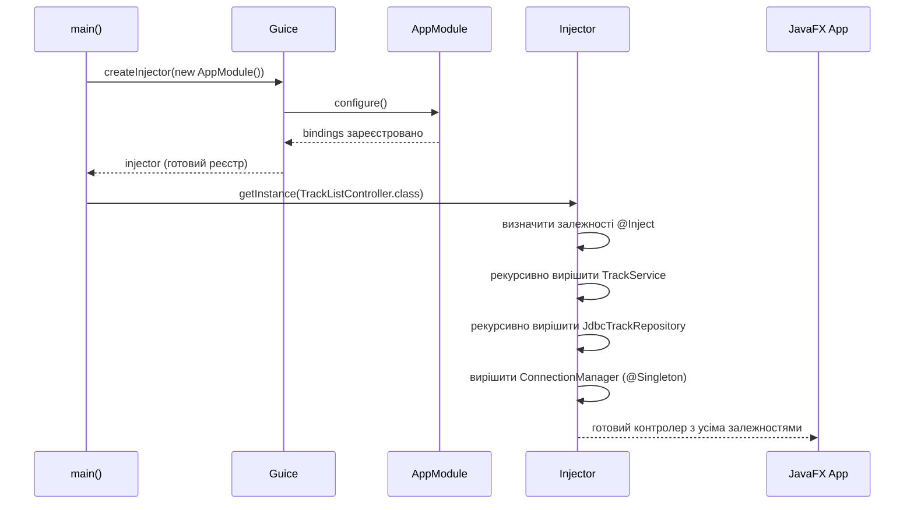

# Google Guice: Впровадження залежностей у JavaFX-проєкті

## Вступ: Коли граф залежностей стає лабіринтом

Уявіть типову сцену розробки. Ви відкриваєте контролер JavaFX, що відповідає за список треків аудіоплатформи. Там, всередині конструктора або методу `initialize()`, ховається ось такий код:

```java
public class TrackListController {

    private final TrackService trackService;

    public TrackListController() {
        ConnectionManager connectionManager = new ConnectionManager(
            "jdbc:h2:./data/audiobook;MODE=PostgreSQL",
            "sa", ""
        );
        TrackRepository trackRepository = new JdbcTrackRepository(connectionManager);
        TrackValidator validator = new TrackValidator();
        AudioFileProcessor processor = new AudioFileProcessor("/tmp/uploads");
        this.trackService = new TrackService(trackRepository, validator, processor);
    }
}
```

З першого погляду — нічого катастрофічного. Але подивіться уважніше: контролер **сам вирішує**, як саме побудувати весь граф своїх залежностей. Він знає про `ConnectionManager`, про шлях до файлів завантаження, про `TrackValidator`. Він прив'язаний до конкретних реалізацій усіх своїх залежностей так міцно, наче виготовлений разом з ними на одному заводі.

Проблема не в тому, що цей код не працює. Він працює. Проблема в тому, що відбувається далі.

**Перший симптом — неможливість тестування.** Щоб написати unit-тест для `TrackListController`, вам доведеться або підіймати реальну базу даних H2 (це вже інтеграційний тест), або вдаватись до складних маніпуляцій з рефлексією. Підмінити `TrackRepository` на mock-об'єкт неможливо: він жорстко закодований усередині конструктора.

**Другий симптом — жорсткість при зміні реалізацій.** Вирішили замінити H2 на PostgreSQL? Або `AudioFileProcessor` на хмарне сховище? Вам потрібно знайти кожне місце, де ці класи інстанціюються через `new`, і оновити їх вручну. У великому проєкті таких місць можуть бути десятки.

**Третій симптом — дублювання ініціалізації.** `ConnectionManager` зі своїм URL та обліковими даними створюється у кожному DAO-класі, у кожному тесті, у кожному місці, де потрібен доступ до бази. Жодної гарантії узгодженості.

Це не погані розробники — це **природний наслідок** відсутності систематичного підходу до управління залежностями. І саме цю проблему вирішує патерн **Dependency Injection (Впровадження залежностей)** та бібліотека **Google Guice**, яку ми вивчатимемо у цій статті.

::note
**Google Guice** (вимовляється «джус») — легковагий фреймворк для впровадження залежностей у Java, розроблений командою Google у 2006 році. Він є основою для внутрішньої інфраструктури Google та використовується у тисячах відкритих і закритих проєктів. [Офіційна документація](https://github.com/google/guice/wiki)
::

::card-group

::card{title="Ручне зв'язування" icon="i-heroicons-wrench-screwdriver"}

**Підхід:** `new ServiceA(new RepoA(new ConnMgr(...)))`

Кожен клас сам створює залежності. Швидко для маленьких проєктів, але стає некерованим при зростанні. Тестування — лише інтеграційне.

::

::card{title="Фабрики та Сервіс-локатор" icon="i-heroicons-building-storefront"}

**Підхід:** `ServiceFactory.create("trackService")`

Централізоване створення об'єктів, але клієнт сам шукає залежності. Залежність від фабрики — прихована зв'язаність.

::

::card{title="IoC-контейнер (Guice)" icon="i-heroicons-cube-transparent"}

**Підхід:** `@Inject TrackService trackService`

Контейнер будує весь граф залежностей автоматично. Клас лише декларує потреби — хто і як їх задовольнить, вирішує зовні.

::

::

---

## Фундаментальні концепції: IoC, DI та принцип інверсії залежностей

### Інверсія управління (Inversion of Control)

**Інверсія управління (IoC)** — це архітектурний принцип, згідно з яким управління потоком виконання програми передається від самого коду до зовнішнього фреймворку або контейнера. Термін систематизований Мартіном Фаулером у 2004 році, хоча сам принцип існував значно раніше.

Щоб зрозуміти «інверсію», необхідно спочатку усвідомити те, що саме інвертується. У традиційній програмі **ваш код** контролює все: він викликає бібліотечні функції, вирішує, коли і що створювати, сам організовує порядок дій. У IoC-підході **фреймворк** контролює загальний потік виконання, а ваш код лише реагує на події та надає конкретні реалізації через інтерфейси або анотації.

Голлівудський принцип (Hollywood Principle) — влучна метафора для IoC: _«Не телефонуйте нам, ми самі зателефонуємо вам»_. Ваш код не «шукає» залежності — контейнер сам «передзвонює» й надає їх.

**Dependency Injection (Впровадження залежностей)** — це конкретний механізм реалізації IoC. Замість того щоб клас самостійно створював свої залежності через `new`, він **декларує** їх через конструктор, сеттери або поля, а зовнішній код (контейнер) **впроваджує** їх ззовні.

### Принцип інверсії залежностей (DIP)

**Принцип інверсії залежностей** (Dependency Inversion Principle, DIP) — п'ятий принцип SOLID — формулюється так:

1. Модулі верхнього рівня **не повинні залежати** від модулів нижнього рівня. Обидва повинні залежати від **абстракцій**.
2. Абстракції **не повинні залежати** від деталей. Деталі повинні залежати від абстракцій.

На практиці це означає: `TrackService` (бізнес-логіка, верхній рівень) не повинен залежати від `JdbcTrackRepository` (деталь реалізації, нижній рівень). Обидва мають залежати від інтерфейсу `TrackRepository`. Це та «абстракція», що дозволяє замінити реалізацію без зміни споживача.

Рис. 1 ілюструє трансформацію архітектури:
  <text x="645" y="24" style="text-anchor: middle;" font-size="12" font-weight="bold" fill="#34d399">✅ Після DI: IoC-контейнер</text>
  <line x1="430" y1="10" x2="430" y2="280" stroke="#6b7280" stroke-width="1" stroke-dasharray="6,4"/>
  <rect x="10" y="38" width="200" height="56" rx="10" fill="rgba(239,68,68,0.08)" stroke="#f87171" stroke-width="1.5"/>
  <text x="110" y="58" style="text-anchor: middle;" font-size="11" font-weight="bold" fill="#f87171">TrackListController</text>
  <text x="110" y="74" style="text-anchor: middle;" font-size="9" fill="#9ca3af">new TrackService(...)</text>
  <text x="110" y="87" style="text-anchor: middle;" font-size="9" fill="#9ca3af">new JdbcTrackRepository(...)</text>
  <rect x="250" y="42" width="170" height="28" rx="7" fill="rgba(239,68,68,0.06)" stroke="rgba(239,68,68,0.4)" stroke-width="1"/>
  <text x="335" y="61" style="text-anchor: middle;" font-size="10" fill="#fca5a5">TrackService</text>
  <line x1="210" y1="64" x2="250" y2="56" stroke="#f87171" stroke-width="1.2" marker-end="url(#arr-red)"/>
  <rect x="250" y="82" width="170" height="28" rx="7" fill="rgba(239,68,68,0.06)" stroke="rgba(239,68,68,0.4)" stroke-width="1"/>
  <text x="335" y="101" style="text-anchor: middle;" font-size="10" fill="#fca5a5">JdbcTrackRepository</text>
  <line x1="210" y1="70" x2="250" y2="91" stroke="#f87171" stroke-width="1.2" marker-end="url(#arr-red)"/>
  <rect x="250" y="122" width="170" height="28" rx="7" fill="rgba(239,68,68,0.06)" stroke="rgba(239,68,68,0.4)" stroke-width="1"/>
  <text x="335" y="141" style="text-anchor: middle;" font-size="10" fill="#fca5a5">ConnectionManager</text>
  <line x1="335" y1="110" x2="335" y2="122" stroke="#f87171" stroke-width="1.2" marker-end="url(#arr-red)"/>
  <rect x="250" y="162" width="170" height="28" rx="7" fill="rgba(239,68,68,0.06)" stroke="rgba(239,68,68,0.4)" stroke-width="1"/>
  <text x="335" y="181" style="text-anchor: middle;" font-size="10" fill="#fca5a5">AudioFileProcessor</text>
  <line x1="210" y1="78" x2="250" y2="171" stroke="#f87171" stroke-width="1.2" marker-end="url(#arr-red)"/>
  <text x="215" y="225" style="text-anchor: middle;" font-size="9" fill="#f87171">Контролер знає ВСЕ про реалізації</text>
  <rect x="440" y="38" width="170" height="56" rx="10" fill="rgba(96,165,250,0.08)" stroke="#60a5fa" stroke-width="2"/>
  <text x="525" y="60" style="text-anchor: middle;" font-size="11" font-weight="bold" fill="#60a5fa">Guice Injector</text>
  <text x="525" y="76" style="text-anchor: middle;" font-size="9" fill="#9ca3af">Module + Bindings</text>
  <text x="525" y="88" style="text-anchor: middle;" font-size="9" fill="#9ca3af">будує граф автоматично</text>
  <rect x="650" y="42" width="200" height="28" rx="7" fill="rgba(52,211,153,0.08)" stroke="rgba(52,211,153,0.4)" stroke-width="1.5"/>
  <text x="750" y="61" style="text-anchor: middle;" font-size="10" fill="#34d399">TrackListController</text>
  <line x1="610" y1="60" x2="650" y2="56" stroke="#34d399" stroke-width="1.5" marker-end="url(#arr-green)"/>
  <rect x="650" y="82" width="200" height="28" rx="7" fill="rgba(52,211,153,0.08)" stroke="rgba(52,211,153,0.4)" stroke-width="1.5"/>
  <text x="750" y="101" style="text-anchor: middle;" font-size="10" fill="#34d399">TrackService</text>
  <line x1="610" y1="65" x2="650" y2="91" stroke="#34d399" stroke-width="1.5" marker-end="url(#arr-green)"/>
  <rect x="650" y="122" width="200" height="28" rx="7" fill="rgba(52,211,153,0.08)" stroke="rgba(52,211,153,0.4)" stroke-width="1.5"/>
  <text x="750" y="141" style="text-anchor: middle;" font-size="10" fill="#34d399">JdbcTrackRepository</text>
  <line x1="610" y1="67" x2="650" y2="131" stroke="#34d399" stroke-width="1.5" marker-end="url(#arr-green)"/>
  <rect x="650" y="162" width="200" height="28" rx="7" fill="rgba(52,211,153,0.08)" stroke="rgba(52,211,153,0.4)" stroke-width="1.5"/>
  <text x="750" y="181" style="text-anchor: middle;" font-size="10" fill="#34d399">ConnectionManager</text>
  <line x1="610" y1="69" x2="650" y2="171" stroke="#34d399" stroke-width="1.5" marker-end="url(#arr-green)"/>
  <text x="645" y="225" style="text-anchor: middle;" font-size="9" fill="#34d399">Контролер знає лише інтерфейси</text>
</svg>
::

### Три типи впровадження залежностей

Специфікація Jakarta Inject (колишня `javax.inject`) визначає три місця, де можуть впроваджуватись залежності. Guice підтримує всі три, але надає різні рекомендації щодо їх застосування.

::tabs

::tabs-item{label="Constructor Injection (рекомендований)"}

```java
public class TrackService {

    private final TrackRepository repository;
    private final TrackValidator validator;

    @Inject
    public TrackService(TrackRepository repository, TrackValidator validator) {
        this.repository = repository;
        this.validator  = validator;
    }
}
```

Guice бачить анотацію `@Inject` на конструкторі та автоматично передає всі параметри. Поля оголошені `final` — залежності незмінні після ініціалізації. Клас **неможливо** створити без усіх залежностей: це унеможливлює часткову ініціалізацію. Для тестування достатньо передати mock у конструктор напряму, без жодних фреймворків.

::

::tabs-item{label="Field Injection (зручний, але з нюансами)"}

```java
public class TrackService {

    @Inject
    private TrackRepository repository;  // Guice встановлює через рефлексію

    @Inject
    private TrackValidator validator;
}
```

Синтаксично коротший, але має суттєві недоліки: поля не можуть бути `final`, залежності невидимі в публічному API класу, а для тестування без Guice потрібна рефлексія або `@InjectMocks` від Mockito. Guice-документація **не рекомендує** цей підхід для нових проєктів.

::

::tabs-item{label="Method Injection (для опціональних залежностей)"}

```java
public class TrackService {

    private TrackEventListener listener;

    @Inject(optional = true)
    public void setEventListener(TrackEventListener listener) {
        this.listener = listener;
    }
}
```

Атрибут `optional = true` дозволяє Guice пропустити впровадження, якщо прив'язки для `TrackEventListener` не знайдено у жодному модулі. Доречний для залежностей, що підключаються лише в окремих конфігураціях — наприклад, listener для метрик у production, відсутній у тестах.

::

::

::tip
**Рекомендація Guice:** завжди надавайте перевагу **Constructor Injection**. Він є найексплікитнішим, найбезпечнішим і найзручнішим для тестування. Field Injection виправданий лише для ситуацій, коли конструктор недоступний (наприклад, при успадкуванні від класу без `@Inject` конструктора).
::

---

## Архітектура Google Guice: ключові компоненти

Перш ніж писати перший код з Guice, необхідно зрозуміти концептуальну модель бібліотеки. Guice побудований навколо чотирьох фундаментальних абстракцій, що взаємодіють у суворо визначеному порядку.

**`Module` (Модуль)** — це декларативний опис зв'язувань (bindings). Модуль — це місце, де ви як розробник кажете Guice: «якщо хтось попросить `TrackRepository`, надай йому `JdbcTrackRepository`». Модуль реалізується через успадкування від `AbstractModule` та перевизначення методу `configure()`.

**`Injector` (Інжектор)** — центральний реєстр усіх прив'язок і фабрика об'єктів. Він створюється один раз, на старті застосунку, через `Guice.createInjector(module)`. Після цього `Injector` є єдиним джерелом правди щодо того, які об'єкти і як створювати. У JavaFX-застосунку він живе протягом усього часу роботи програми.

**`Binding` (Прив'язка)** — зв'язок між ключем (зазвичай інтерфейсом або класом) та способом його задоволення (реалізацією, провайдером або екземпляром). Bindings описуються у Module і реєструються в Injector.

**`@Inject`** — анотація з пакету `jakarta.inject` (або `com.google.inject`), що позначає точки впровадження: конструктори, поля або методи. Це єдиний маркер, якого потребує клас; він не прив'язує клас до Guice як до фреймворку.

**`Provider<T>`** — функціональний інтерфейс для ліниво або параметризовано створюваних об'єктів. Guice може впроваджувати `Provider<TrackService>` замість `TrackService` — це дає отримувачу контроль над часом та кількістю створення екземплярів.

<svg viewBox="0 0 860 300" class="w-full h-auto block" xmlns="http://www.w3.org/2000/svg">
  <defs>
    <marker id="arr-b2" markerWidth="8" markerHeight="8" refX="6" refY="3" orient="auto"><path d="M0,0 L0,6 L8,3 z" fill="#60a5fa"/></marker>
    <marker id="arr-g2" markerWidth="8" markerHeight="8" refX="6" refY="3" orient="auto"><path d="M0,0 L0,6 L8,3 z" fill="#34d399"/></marker>
    <marker id="arr-a2" markerWidth="8" markerHeight="8" refX="6" refY="3" orient="auto"><path d="M0,0 L0,6 L8,3 z" fill="#f59e0b"/></marker>
  </defs>
  <rect x="10" y="30" width="260" height="200" rx="12" fill="rgba(96,165,250,0.06)" stroke="#60a5fa" stroke-width="1.5"/>
  <text x="140" y="52" style="text-anchor: middle;" font-size="12" font-weight="bold" fill="#60a5fa">AppModule</text>
  <text x="140" y="68" style="text-anchor: middle;" font-size="9" fill="#9ca3af">extends AbstractModule</text>
  <rect x="25" y="78" width="230" height="24" rx="5" fill="rgba(96,165,250,0.1)" stroke="rgba(96,165,250,0.3)" stroke-width="1"/>
  <text x="140" y="94" style="text-anchor: middle;" font-size="9" fill="#93c5fd">TrackRepository → JdbcTrackRepository</text>
  <rect x="25" y="110" width="230" height="24" rx="5" fill="rgba(96,165,250,0.1)" stroke="rgba(96,165,250,0.3)" stroke-width="1"/>
  <text x="140" y="126" style="text-anchor: middle;" font-size="9" fill="#93c5fd">AuthorRepository → JdbcAuthorRepository</text>
  <rect x="25" y="142" width="230" height="24" rx="5" fill="rgba(96,165,250,0.1)" stroke="rgba(96,165,250,0.3)" stroke-width="1"/>
  <text x="140" y="158" style="text-anchor: middle;" font-size="9" fill="#93c5fd">"dbUrl" → "jdbc:h2:./data/..."</text>
  <rect x="25" y="174" width="230" height="24" rx="5" fill="rgba(96,165,250,0.1)" stroke="rgba(96,165,250,0.3)" stroke-width="1"/>
  <text x="140" y="190" style="text-anchor: middle;" font-size="9" fill="#93c5fd">ConnectionManager → @Singleton</text>
  <rect x="330" y="80" width="170" height="100" rx="14" fill="rgba(245,158,11,0.08)" stroke="#f59e0b" stroke-width="2"/>
  <text x="415" y="108" style="text-anchor: middle;" font-size="13" font-weight="bold" fill="#f59e0b">Injector</text>
  <text x="415" y="126" style="text-anchor: middle;" font-size="9" fill="#9ca3af">Guice.createInjector</text>
  <text x="415" y="140" style="text-anchor: middle;" font-size="9" fill="#9ca3af">(new AppModule())</text>
  <text x="415" y="158" style="text-anchor: middle;" font-size="9" fill="#fbbf24">реєстр + фабрика</text>
  <line x1="270" y1="130" x2="330" y2="130" stroke="#60a5fa" stroke-width="1.5" marker-end="url(#arr-b2)"/>
  <text x="300" y="122" style="text-anchor: middle;" font-size="8" fill="#60a5fa">configure()</text>
  <rect x="620" y="40" width="210" height="30" rx="7" fill="rgba(52,211,153,0.08)" stroke="rgba(52,211,153,0.4)" stroke-width="1.5"/>
  <text x="725" y="60" style="text-anchor: middle;" font-size="10" fill="#34d399">TrackListController</text>
  <rect x="620" y="82" width="210" height="30" rx="7" fill="rgba(52,211,153,0.08)" stroke="rgba(52,211,153,0.4)" stroke-width="1.5"/>
  <text x="725" y="102" style="text-anchor: middle;" font-size="10" fill="#34d399">TrackService</text>
  <rect x="620" y="124" width="210" height="30" rx="7" fill="rgba(52,211,153,0.08)" stroke="rgba(52,211,153,0.4)" stroke-width="1.5"/>
  <text x="725" y="144" style="text-anchor: middle;" font-size="10" fill="#34d399">JdbcTrackRepository</text>
  <rect x="620" y="166" width="210" height="30" rx="7" fill="rgba(52,211,153,0.08)" stroke="rgba(52,211,153,0.4)" stroke-width="1.5"/>
  <text x="725" y="186" style="text-anchor: middle;" font-size="10" fill="#34d399">ConnectionManager</text>
  <rect x="620" y="208" width="210" height="30" rx="7" fill="rgba(52,211,153,0.08)" stroke="rgba(52,211,153,0.4)" stroke-width="1.5"/>
  <text x="725" y="228" style="text-anchor: middle;" font-size="10" fill="#34d399">JdbcAuthorRepository</text>
  <line x1="500" y1="110" x2="620" y2="55" stroke="#34d399" stroke-width="1.3" marker-end="url(#arr-g2)"/>
  <line x1="500" y1="120" x2="620" y2="97" stroke="#34d399" stroke-width="1.3" marker-end="url(#arr-g2)"/>
  <line x1="500" y1="130" x2="620" y2="139" stroke="#34d399" stroke-width="1.3" marker-end="url(#arr-g2)"/>
  <line x1="500" y1="140" x2="620" y2="181" stroke="#34d399" stroke-width="1.3" marker-end="url(#arr-g2)"/>
  <line x1="500" y1="148" x2="620" y2="223" stroke="#34d399" stroke-width="1.3" marker-end="url(#arr-g2)"/>
  <text x="560" y="78" style="text-anchor: middle;" font-size="8" fill="#34d399">getInstance() / @Inject</text>
</svg>
::

### Послідовність роботи Guice

Розуміння порядку, в якому Guice виконує свою роботу, є критично важливим для правильного проєктування застосунку. Цей порядок незмінний і не залежить від того, скільки модулів та прив'язок ви визначаєте.

::mermaid



::

Зверніть увагу на рекурсивне вирішення: щоб створити `TrackListController`, Guice спочатку створює `TrackService`; щоб створити `TrackService` — `JdbcTrackRepository`; щоб створити `JdbcTrackRepository` — `ConnectionManager`. Весь цей граф вирішується **автоматично**, на основі анотацій `@Inject` у конструкторах та прив'язок у `AppModule`. Розробнику не потрібно описувати порядок ініціалізації — Guice визначає його сам.

---

## Налаштування проєкту: від нуля до першого Injector

Перейдемо від теорії до практики. У цьому розділі ми налаштуємо Google Guice у JavaFX-проєкті аудіоплатформи та побудуємо фундамент: підключимо залежності, опишемо перший модуль та отримаємо перший об'єкт через `Injector`.

::steps

### Крок 1: Додати залежності до системи збірки

Guice доступний через Maven Central. Нам потрібні два артефакти: сам `guice` та `jakarta.inject-api` — специфікація анотацій `@Inject`, `@Singleton`.

::code-group

```xml [pom.xml (Maven)]
<dependencies>
    <!-- Google Guice — IoC-контейнер -->
    <dependency>
        <groupId>com.google.inject</groupId>
        <artifactId>guice</artifactId>
        <version>7.0.0</version>
    </dependency>
    <!-- JavaFX FXML-підтримка -->
    <dependency>
        <groupId>org.openjfx</groupId>
        <artifactId>javafx-fxml</artifactId>
        <version>21.0.3</version>
    </dependency>
</dependencies>
```

```groovy [build.gradle (Groovy DSL)]
dependencies {
    implementation 'com.google.inject:guice:7.0.0'
    implementation 'org.openjfx:javafx-fxml:21.0.3'
}
```

::

::note
**Версія Guice 7.x:** починаючи з версії 7.0, Guice перейшов з пакету `javax.inject` на `jakarta.inject`. Якщо ваш проєкт залежить від старих бібліотек зі `javax.inject`, використовуйте Guice 6.x, що підтримує обидва простори імен.
::

### Крок 2: Налаштувати `module-info.java`

Якщо проєкт використовує Java Platform Module System (JPMS), необхідно відкрити пакети для Guice-рефлексії:

```java [module-info.java]
module com.example.audiobook {
    requires javafx.controls;
    requires javafx.fxml;
    requires com.google.guice;
    requires jakarta.inject;

    // opens — глибокий рефлексивний доступ у runtime (потрібен Guice)
    opens com.example.audiobook.controller to javafx.fxml, com.google.guice;
    opens com.example.audiobook.service    to com.google.guice;
    opens com.example.audiobook.repository to com.google.guice;
    exports com.example.audiobook;
}
```

Ключове слово `opens` (на відміну від `exports`) дозволяє саме глибокий рефлексивний доступ у runtime — це необхідно Guice для впровадження залежностей. Якщо пакет не відкрито, Guice викине `InaccessibleObjectException` при спробі створити об'єкт.

### Крок 3: Описати перший Module

```java [AppModule.java]
package com.example.audiobook;

import com.example.audiobook.repository.*;
import com.google.inject.AbstractModule;
import com.google.inject.name.Names;

public class AppModule extends AbstractModule {

    @Override
    protected void configure() {
        bind(TrackRepository.class).to(JdbcTrackRepository.class);
        bind(AuthorRepository.class).to(JdbcAuthorRepository.class);

        bindConstant().annotatedWith(Names.named("dbUrl"))
            .to("jdbc:h2:./data/audiobook;MODE=PostgreSQL;DB_CLOSE_DELAY=-1");
        bindConstant().annotatedWith(Names.named("dbUser")).to("sa");
        bindConstant().annotatedWith(Names.named("dbPassword")).to("");
    }
}
```

Кожен виклик `bind(...).to(...)` — одна прив'язка. `bindConstant().annotatedWith(Names.named(...)).to(...)` дозволяє впроваджувати прості значення (рядки, числа) через анотацію `@Named` на параметрах конструктора.

### Крок 4: Впровадити залежності у клас

```java [ConnectionManager.java]
import com.google.inject.Inject;
import com.google.inject.Singleton;
import com.google.inject.name.Named;

@Singleton
public class ConnectionManager {

    private final String url;
    private final String user;
    private final String password;

    @Inject
    public ConnectionManager(
        @Named("dbUrl")      String url,
        @Named("dbUser")     String user,
        @Named("dbPassword") String password
    ) {
        this.url      = url;
        this.user     = user;
        this.password = password;
    }

    public Connection getConnection() throws SQLException {
        return DriverManager.getConnection(url, user, password);
    }
}
```

`@Singleton` на класі декларує єдиний екземпляр на весь `Injector`. Анотації `@Named(...)` на параметрах вказують Guice знайти саме ту константу, що зв'язана у модулі через `Names.named(...)` з відповідним ім'ям.

### Крок 5: Створити Injector і отримати перший об'єкт

```java [Main.java]
import com.google.inject.Guice;
import com.google.inject.Injector;

public class Main {
    public static void main(String[] args) {
        // Єдина точка створення Injector у всьому застосунку
        Injector injector = Guice.createInjector(new AppModule());

        // Guice рекурсивно вирішує весь граф залежностей
        TrackService trackService = injector.getInstance(TrackService.class);
        trackService.listAll().forEach(System.out::println);
    }
}
```

::

Структура проєкту після налаштування:

::code-tree

```text [src/main/java/com/example/audiobook/AppModule.java]
// Guice-модуль: всі прив'язки
```

```text [src/main/java/com/example/audiobook/Main.java]
// Точка входу: Injector
```

```text [src/main/java/com/example/audiobook/db/ConnectionManager.java]
// @Singleton
```

```text [src/main/java/com/example/audiobook/repository/TrackRepository.java]
// Інтерфейс
```

```text [src/main/java/com/example/audiobook/repository/JdbcTrackRepository.java]
// Реалізація
```

```text [src/main/java/com/example/audiobook/service/TrackService.java]
// Бізнес-логіка
```

```text [src/main/java/com/example/audiobook/controller/TrackListController.java]
// JavaFX-контролер (@Inject)
```

```text [src/main/resources/fxml/track-list.fxml]
// FXML-розмітка
```

```text [module-info.java]
// JPMS: opens для Guice
```

::

::warning
Ніколи не зберігайте `Injector` у статичному полі та не передавайте його класам як залежність — це антипатерн Service Locator. Клас, що отримує `Injector`, сам витягує залежності й унеможливлює тестування. Правильна практика: `Injector` живе лише у `Main.java` та `App.java`.
::

---

## Типи прив'язок (Bindings) та анотації Guice

Метод `configure()` у `AbstractModule` — це не просто перелік рядків коду. Це повноцінна декларативна мова опису залежностей. Guice підтримує кілька типів прив'язок, кожен з яких вирішує конкретний сценарій.

### Linked Binding — зв'язування інтерфейсу з реалізацією

Найпоширеніший тип. Дозволяє замінити реалізацію без зміни жодного класу-споживача.

```java
// Коли хтось запросить TrackRepository — отримає JdbcTrackRepository
bind(TrackRepository.class).to(JdbcTrackRepository.class);

// З явним Scope: лише один JdbcTrackRepository на весь Injector
bind(TrackRepository.class).to(JdbcTrackRepository.class).in(Singleton.class);
```

Зверніть увагу: `JdbcTrackRepository` сам також може мати `@Inject`-конструктор і власні залежності — Guice рекурсивно вирішить їх автоматично.

### Instance Binding — впровадження готового екземпляра

Коли об'єкт уже створений (або не може бути створений Guice) — передайте його напряму:

```java
// Передаємо готовий об'єкт — Guice не створює його сам
ConnectionManager manager = ConnectionManager.forH2("./data/audiobook");
bind(ConnectionManager.class).toInstance(manager);

// Або через статичну фабрику
bind(DataSource.class).toInstance(createHikariDataSource());
```

`toInstance()` автоматично реєструє переданий об'єкт як Singleton — він завжди повертає той самий екземпляр.

### Provider Binding — відкладене або параметризоване створення

`Provider<T>` — це фабрика, що викликається Guice щоразу, коли потрібен новий об'єкт. Використовується, коли логіка створення складніша за простий `new`.

```java
// Клас-провайдер для DataSource (наприклад, HikariCP)
public class HikariDataSourceProvider implements Provider<DataSource> {

    private final String url;
    private final String user;

    @Inject
    public HikariDataSourceProvider(
        @Named("dbUrl")  String url,
        @Named("dbUser") String user
    ) {
        this.url  = url;
        this.user = user;
    }

    @Override
    public DataSource get() {
        HikariConfig config = new HikariConfig();
        config.setJdbcUrl(url);
        config.setUsername(user);
        config.setMaximumPoolSize(10);
        return new HikariDataSource(config);
    }
}

// У модулі:
bind(DataSource.class).toProvider(HikariDataSourceProvider.class).in(Singleton.class);
```

`HikariDataSourceProvider` сам також отримує `@Inject`-залежності. Поєднання з `in(Singleton.class)` гарантує, що пул з'єднань створюється рівно один раз.

### `@Named` та кастомні кваліфікатори

Коли один інтерфейс має кілька реалізацій — Guice потребує підказки, яку саме надавати. Для цього існують **кваліфікатори** (qualifiers).

**Варіант 1 — `@Named`** (найпростіший):

```java
// У модулі — дві реалізації одного інтерфейсу
bind(TrackRepository.class)
    .annotatedWith(Names.named("jdbc"))
    .to(JdbcTrackRepository.class);

bind(TrackRepository.class)
    .annotatedWith(Names.named("cache"))
    .to(InMemoryCacheTrackRepository.class);

// У споживачі — явно вказуємо, яка потрібна
@Inject
public TrackService(
    @Named("jdbc")  TrackRepository primary,
    @Named("cache") TrackRepository cache
) { ... }
```

**Варіант 2 — кастомний кваліфікатор** (`@BindingAnnotation`):

```java
// Оголошення кваліфікатора — окрема анотація
@Retention(RetentionPolicy.RUNTIME)
@Target({ElementType.FIELD, ElementType.PARAMETER})
@BindingAnnotation
public @interface ReadOnly {}

// У модулі
bind(TrackRepository.class)
    .annotatedWith(ReadOnly.class)
    .to(ReadOnlyJdbcTrackRepository.class);

// У споживачі
@Inject
public AnalyticsService(@ReadOnly TrackRepository repo) { ... }
```

Кастомні кваліфікатори кращі за `@Named` у великих проєктах: вони рефакторяться разом з кодом (компілятор перевірить назву анотації, але не перевірить рядок у `@Named`).

<svg viewBox="0 0 860 300" class="w-full h-auto block" xmlns="http://www.w3.org/2000/svg">
  <defs>
    <marker id="arr-b3" markerWidth="8" markerHeight="8" refX="6" refY="3" orient="auto"><path d="M0,0 L0,6 L8,3 z" fill="#60a5fa"/></marker>
  </defs>
  <text x="430" y="22" style="text-anchor: middle;" font-size="13" font-weight="bold" fill="#f59e0b">Типи Bindings у Guice</text>
  <rect x="20" y="40" width="190" height="100" rx="10" fill="rgba(96,165,250,0.07)" stroke="#60a5fa" stroke-width="1.5"/>
  <text x="115" y="62" style="text-anchor: middle;" font-size="11" font-weight="bold" fill="#60a5fa">Linked Binding</text>
  <text x="115" y="80" style="text-anchor: middle;" font-size="9" fill="#9ca3af">bind(Interface.class)</text>
  <text x="115" y="94" style="text-anchor: middle;" font-size="9" fill="#9ca3af">.to(Implementation.class)</text>
  <text x="115" y="115" style="text-anchor: middle;" font-size="8" fill="#6b7280">Заміна реалізації без зміни</text>
  <text x="115" y="128" style="text-anchor: middle;" font-size="8" fill="#6b7280">споживачів. Найпоширеніший.</text>
  <rect x="235" y="40" width="190" height="100" rx="10" fill="rgba(52,211,153,0.07)" stroke="#34d399" stroke-width="1.5"/>
  <text x="330" y="62" style="text-anchor: middle;" font-size="11" font-weight="bold" fill="#34d399">Instance Binding</text>
  <text x="330" y="80" style="text-anchor: middle;" font-size="9" fill="#9ca3af">bind(Cls.class)</text>
  <text x="330" y="94" style="text-anchor: middle;" font-size="9" fill="#9ca3af">.toInstance(obj)</text>
  <text x="330" y="115" style="text-anchor: middle;" font-size="8" fill="#6b7280">Готовий об'єкт. Автоматично</text>
  <text x="330" y="128" style="text-anchor: middle;" font-size="8" fill="#6b7280">є Singleton.</text>
  <rect x="450" y="40" width="190" height="100" rx="10" fill="rgba(245,158,11,0.07)" stroke="#f59e0b" stroke-width="1.5"/>
  <text x="545" y="62" style="text-anchor: middle;" font-size="11" font-weight="bold" fill="#f59e0b">Provider Binding</text>
  <text x="545" y="80" style="text-anchor: middle;" font-size="9" fill="#9ca3af">bind(Cls.class)</text>
  <text x="545" y="94" style="text-anchor: middle;" font-size="9" fill="#9ca3af">.toProvider(Provider.class)</text>
  <text x="545" y="115" style="text-anchor: middle;" font-size="8" fill="#6b7280">Складна логіка створення.</text>
  <text x="545" y="128" style="text-anchor: middle;" font-size="8" fill="#6b7280">HikariCP, кешування.</text>
  <rect x="665" y="40" width="175" height="100" rx="10" fill="rgba(167,139,250,0.07)" stroke="#a78bfa" stroke-width="1.5"/>
  <text x="752" y="62" style="text-anchor: middle;" font-size="11" font-weight="bold" fill="#a78bfa">Constant Binding</text>
  <text x="752" y="80" style="text-anchor: middle;" font-size="9" fill="#9ca3af">bindConstant()</text>
  <text x="752" y="94" style="text-anchor: middle;" font-size="9" fill="#9ca3af">.annotatedWith(@Named)</text>
  <text x="752" y="115" style="text-anchor: middle;" font-size="8" fill="#6b7280">Рядки, числа, enum-значення.</text>
  <text x="752" y="128" style="text-anchor: middle;" font-size="8" fill="#6b7280">URL, порти, ліміти.</text>
  <rect x="20" y="168" width="390" height="110" rx="10" fill="rgba(239,68,68,0.05)" stroke="rgba(239,68,68,0.3)" stroke-width="1.5"/>
  <text x="215" y="188" style="text-anchor: middle;" font-size="11" font-weight="bold" fill="#f87171">@Named (рядковий кваліфікатор)</text>
  <text x="215" y="206" style="text-anchor: middle;" font-size="9" fill="#9ca3af">bind(Repo.class).annotatedWith(Names.named("jdbc")).to(...)</text>
  <text x="215" y="224" style="text-anchor: middle;" font-size="9" fill="#9ca3af">bind(Repo.class).annotatedWith(Names.named("cache")).to(...)</text>
  <text x="215" y="248" style="text-anchor: middle;" font-size="8" fill="#6b7280">Швидко, але refactoring-небезпечно: рядок не перевіряє компілятор</text>
  <rect x="450" y="168" width="390" height="110" rx="10" fill="rgba(52,211,153,0.05)" stroke="rgba(52,211,153,0.3)" stroke-width="1.5"/>
  <text x="645" y="188" style="text-anchor: middle;" font-size="11" font-weight="bold" fill="#34d399">@BindingAnnotation (кастомний кваліфікатор)</text>
  <text x="645" y="206" style="text-anchor: middle;" font-size="9" fill="#9ca3af">@Retention(RUNTIME) @BindingAnnotation</text>
  <text x="645" y="220" style="text-anchor: middle;" font-size="9" fill="#9ca3af">public @interface ReadOnly {}</text>
  <text x="645" y="248" style="text-anchor: middle;" font-size="8" fill="#6b7280">Compile-time безпека. Рекомендовано для великих проєктів.</text>
</svg>
::

::field-group

::field{name="@Inject" type="annotation"}
Позначає конструктор, поле або метод як точку впровадження. Guice автоматично надає значення при створенні об'єкта. Є у пакеті `jakarta.inject` (стандарт) та `com.google.inject` (Guice-специфічний).
::

::field{name="@Singleton" type="annotation"}
Декларує, що Guice повинен створити рівно один екземпляр класу на весь `Injector`. Можна застосувати до класу або у виклику `bind(...).in(Singleton.class)`. Потоко-безпечний: Guice гарантує атомарність створення.
::

::field{name="@Named" type="annotation"}
Кваліфікатор для розрізнення кількох прив'язок одного типу. Використовується разом з `Names.named(...)` у `configure()`. Доступний з `com.google.inject.name` та `jakarta.inject`.
::

::field{name="@BindingAnnotation" type="annotation"}
Мета-анотація для створення кастомних кваліфікаторів. Оголошена на вашій анотації дає Guice знати, що вона є кваліфікатором. Перевіряється компілятором — безпечніша за `@Named`.
::

::field{name="@Provides" type="annotation"}
Альтернатива класу-провайдеру: метод у Module з анотацією `@Provides` стає фабрикою. Зручніше для простих випадків.
::

::

### Метод `@Provides` як зручна альтернатива Provider-класу

Замість окремого класу, що реалізує `Provider<T>`, можна написати метод прямо у Module:

```java
public class AppModule extends AbstractModule {

    @Override
    protected void configure() {
        bind(TrackRepository.class).to(JdbcTrackRepository.class);
    }

    // Guice автоматично визнає цей метод як провайдер для DataSource
    @Provides
    @Singleton
    DataSource provideDataSource(
        @Named("dbUrl")  String url,
        @Named("dbUser") String user
    ) {
        HikariConfig config = new HikariConfig();
        config.setJdbcUrl(url);
        config.setUsername(user);
        config.setMaximumPoolSize(10);
        return new HikariDataSource(config);
    }
}
```

Параметри методу `@Provides` автоматично впроваджуються Guice — він вирішує їх так само, як і параметри `@Inject`-конструкторів. Поєднання `@Provides` + `@Singleton` гарантує, що HikariCP-пул буде створено рівно один раз.

::tip
**Коли обирати `@Provides` vs клас-провайдер:** якщо логіка провайдера проста та умістилась в один метод — використовуйте `@Provides`. Якщо провайдер складний, потребує стану або хочеться тестувати його окремо — винесіть у власний клас, що реалізує `Provider<T>`.
::

---

## Інтеграція з JavaFX: вирішення ключової суперечності

Переходимо до центрального практичного питання цієї статті: як поєднати Guice з JavaFX? На перший погляд завдання виглядає тривіально — просто додайте `@Inject` до контролерів. Але реальність складніша.

### Проблема: FXMLLoader — прихований конкурент

JavaFX використовує `FXMLLoader` для завантаження `.fxml`-файлів та автоматичного створення контролерів, описаних у `fx:controller`. Цей механізм **сам інстанціює контролери** через рефлексію, викликаючи конструктор за замовчуванням (без параметрів). Guice при цьому не задіяний — він нічого не знає про ці об'єкти, і всі `@Inject`-поля залишаються `null`.

Якщо у контролері написати:

```java
public class TrackListController {
    @Inject
    private TrackService trackService; // завжди null при стандартному FXMLLoader!
}
```

Метод `initialize()` викличеться, `trackService` буде `null`, і застосунок впаде з `NullPointerException`. Це класична пастка, у яку потрапляє кожен, хто вперше намагається поєднати JavaFX та DI.

### Рішення: `setControllerFactory()`

`FXMLLoader` передбачає цю ситуацію. Метод `setControllerFactory(Callback<Class<?>, Object> factory)` дозволяє замінити стандартний механізм створення контролерів на довільну фабрику. І саме тут з'являється Guice:

```java
FXMLLoader loader = new FXMLLoader(getClass().getResource("/fxml/track-list.fxml"));

// Передаємо Injector як фабрику контролерів
// injector::getInstance — це method reference на Injector.getInstance(Class)
loader.setControllerFactory(injector::getInstance);

Parent root = loader.load();
```

Тепер, коли `FXMLLoader` зустрічає `fx:controller="...TrackListController"`, він не викликає `new TrackListController()`, а передає клас у `injector.getInstance(TrackListController.class)`. Guice будує контролер зі всіма залежностями через `@Inject`-конструктор.

<svg viewBox="0 0 860 330" class="w-full h-auto block" xmlns="http://www.w3.org/2000/svg">
  <defs>
    <marker id="arr-b4" markerWidth="8" markerHeight="8" refX="6" refY="3" orient="auto"><path d="M0,0 L0,6 L8,3 z" fill="#60a5fa"/></marker>
    <marker id="arr-g4" markerWidth="8" markerHeight="8" refX="6" refY="3" orient="auto"><path d="M0,0 L0,6 L8,3 z" fill="#34d399"/></marker>
    <marker id="arr-a4" markerWidth="8" markerHeight="8" refX="6" refY="3" orient="auto"><path d="M0,0 L0,6 L8,3 z" fill="#f59e0b"/></marker>
  </defs>
  <rect x="20" y="20" width="120" height="40" rx="8" fill="rgba(96,165,250,0.1)" stroke="#60a5fa" stroke-width="1.5"/>
  <text x="80" y="37" style="text-anchor: middle;" font-size="10" font-weight="bold" fill="#60a5fa">main()</text>
  <text x="80" y="52" style="text-anchor: middle;" font-size="8" fill="#9ca3af">Application.launch()</text>
  <line x1="140" y1="40" x2="180" y2="40" stroke="#60a5fa" stroke-width="1.5" marker-end="url(#arr-b4)"/>
  <rect x="180" y="20" width="140" height="40" rx="8" fill="rgba(96,165,250,0.1)" stroke="#60a5fa" stroke-width="1.5"/>
  <text x="250" y="37" style="text-anchor: middle;" font-size="10" font-weight="bold" fill="#60a5fa">App.start()</text>
  <text x="250" y="52" style="text-anchor: middle;" font-size="8" fill="#9ca3af">extends Application</text>
  <line x1="250" y1="60" x2="250" y2="100" stroke="#f59e0b" stroke-width="1.5" marker-end="url(#arr-a4)"/>
  <rect x="160" y="100" width="180" height="44" rx="8" fill="rgba(245,158,11,0.08)" stroke="#f59e0b" stroke-width="2"/>
  <text x="250" y="118" style="text-anchor: middle;" font-size="10" font-weight="bold" fill="#f59e0b">Guice.createInjector</text>
  <text x="250" y="133" style="text-anchor: middle;" font-size="9" fill="#9ca3af">(new AppModule())</text>
  <line x1="250" y1="144" x2="250" y2="184" stroke="#f59e0b" stroke-width="1.5" marker-end="url(#arr-a4)"/>
  <rect x="145" y="184" width="210" height="40" rx="8" fill="rgba(245,158,11,0.06)" stroke="#f59e0b" stroke-width="1.5"/>
  <text x="250" y="200" style="text-anchor: middle;" font-size="9" font-weight="bold" fill="#f59e0b">FXMLLoader</text>
  <text x="250" y="215" style="text-anchor: middle;" font-size="8" fill="#9ca3af">.setControllerFactory(injector::getInstance)</text>
  <line x1="355" y1="204" x2="440" y2="204" stroke="#34d399" stroke-width="1.5" marker-end="url(#arr-g4)"/>
  <text x="397" y="196" style="text-anchor: middle;" font-size="8" fill="#34d399">fx:controller=</text>
  <text x="397" y="208" style="text-anchor: middle;" font-size="8" fill="#34d399">"TrackListCtrl"</text>
  <rect x="440" y="174" width="220" height="60" rx="8" fill="rgba(52,211,153,0.08)" stroke="#34d399" stroke-width="2"/>
  <text x="550" y="196" style="text-anchor: middle;" font-size="10" font-weight="bold" fill="#34d399">Injector.getInstance</text>
  <text x="550" y="212" style="text-anchor: middle;" font-size="8" fill="#9ca3af">(TrackListController.class)</text>
  <text x="550" y="226" style="text-anchor: middle;" font-size="8" fill="#9ca3af">@Inject → вирішення залежностей</text>
  <line x1="550" y1="234" x2="550" y2="270" stroke="#34d399" stroke-width="1.5" marker-end="url(#arr-g4)"/>
  <rect x="430" y="270" width="240" height="44" rx="8" fill="rgba(52,211,153,0.1)" stroke="#34d399" stroke-width="1.5"/>
  <text x="550" y="288" style="text-anchor: middle;" font-size="10" font-weight="bold" fill="#34d399">TrackListController</text>
  <text x="550" y="304" style="text-anchor: middle;" font-size="8" fill="#9ca3af">з TrackService, NavigationService…</text>
  <line x1="250" y1="224" x2="250" y2="270" stroke="#60a5fa" stroke-width="1.5" marker-end="url(#arr-b4)"/>
  <rect x="140" y="270" width="180" height="44" rx="8" fill="rgba(96,165,250,0.08)" stroke="#60a5fa" stroke-width="1.5"/>
  <text x="230" y="288" style="text-anchor: middle;" font-size="10" font-weight="bold" fill="#60a5fa">Scene / Stage</text>
  <text x="230" y="304" style="text-anchor: middle;" font-size="8" fill="#9ca3af">primaryStage.setScene(...)</text>
  <text x="40" y="120" font-size="8" fill="#6b7280">① createInjector</text>
  <text x="40" y="134" font-size="8" fill="#6b7280">② setControllerFactory</text>
  <text x="40" y="148" font-size="8" fill="#6b7280">③ loader.load()</text>
  <text x="40" y="162" font-size="8" fill="#6b7280">④ getInstance(ctrl)</text>
  <text x="40" y="176" font-size="8" fill="#6b7280">⑤ @Inject вирішено</text>
  <text x="40" y="190" font-size="8" fill="#6b7280">⑥ show()</text>
</svg>
::

### Повна реалізація: App + GuiceModule + контролер

Розглянемо повний, робочий приклад для нашої аудіоплатформи.

::code-group

```java [App.java]
package com.example.audiobook;

import com.google.inject.Guice;
import com.google.inject.Injector;
import javafx.application.Application;
import javafx.fxml.FXMLLoader;
import javafx.scene.Parent;
import javafx.scene.Scene;
import javafx.stage.Stage;

public class App extends Application {

    // Injector доступний у межах App — і нікуди далі
    private Injector injector;

    @Override
    public void init() {
        // init() — правильне місце для Guice. Викликається до start(),
        // у окремому потоці JavaFX Launcher Thread, до JavaFX Application Thread.
        injector = Guice.createInjector(new AppModule());
    }

    @Override
    public void start(Stage primaryStage) throws Exception {
        FXMLLoader loader = new FXMLLoader(
            getClass().getResource("/fxml/track-list.fxml")
        );
        // Підключаємо Guice як фабрику контролерів
        loader.setControllerFactory(injector::getInstance);

        Parent root = loader.load();
        primaryStage.setTitle("Аудіоплатформа");
        primaryStage.setScene(new Scene(root, 900, 600));
        primaryStage.show();
    }

    public static void main(String[] args) {
        launch(args);
    }
}
```

```java [TrackListController.java]
package com.example.audiobook.controller;

import com.example.audiobook.service.TrackService;
import com.example.audiobook.service.NavigationService;
import com.google.inject.Inject;
import javafx.fxml.FXML;
import javafx.fxml.Initializable;
import javafx.scene.control.ListView;

import java.net.URL;
import java.util.ResourceBundle;

public class TrackListController implements Initializable {

    // Залежності впроваджуються через конструктор — не через поля!
    private final TrackService trackService;
    private final NavigationService navigationService;

    @FXML
    private ListView<String> trackListView;

    @Inject
    public TrackListController(
        TrackService trackService,
        NavigationService navigationService
    ) {
        this.trackService     = trackService;
        this.navigationService = navigationService;
    }

    @Override
    public void initialize(URL location, ResourceBundle resources) {
        // trackService вже ін'єктований — NullPointerException неможливий
        trackService.listAll()
            .stream()
            .map(t -> t.getTitle() + " — " + t.getArtist())
            .forEach(trackListView.getItems()::add);
    }

    @FXML
    private void onAddTrack() {
        navigationService.openAddTrackDialog();
    }
}
```

```java [NavigationService.java]
package com.example.audiobook.service;

import com.google.inject.Inject;
import com.google.inject.Injector;
import com.google.inject.Singleton;
import javafx.fxml.FXMLLoader;
import javafx.scene.Parent;
import javafx.scene.Scene;
import javafx.stage.Stage;

@Singleton
public class NavigationService {

    // NavigationService сам отримує Injector для створення нових сцен
    // Це ЄДИНИЙ клас у проєкті, що може зберігати Injector
    private final Injector injector;

    @Inject
    public NavigationService(Injector injector) {
        this.injector = injector;
    }

    public void openAddTrackDialog() {
        try {
            FXMLLoader loader = new FXMLLoader(
                getClass().getResource("/fxml/add-track.fxml")
            );
            loader.setControllerFactory(injector::getInstance);

            Stage dialog = new Stage();
            dialog.setScene(new Scene(loader.load(), 600, 400));
            dialog.setTitle("Додати трек");
            dialog.show();
        } catch (Exception e) {
            throw new RuntimeException("Неможливо відкрити діалог", e);
        }
    }
}
```

```xml [track-list.fxml]
<?xml version="1.0" encoding="UTF-8"?>

<?import javafx.scene.control.*?>
<?import javafx.scene.layout.*?>

<!-- fx:controller вказує клас контролера.
     FXMLLoader передасть його у setControllerFactory → Guice -->
<BorderPane
    xmlns="http://javafx.com/javafx"
    xmlns:fx="http://javafx.com/fxml"
    fx:controller="com.example.audiobook.controller.TrackListController">

    <center>
        <ListView fx:id="trackListView" />
    </center>

    <bottom>
        <Button text="Додати трек" onAction="#onAddTrack" />
    </bottom>
</BorderPane>
```

::

Розберемо ключові архітектурні рішення у прикладі вище.

**`init()` замість `start()`:** метод `init()` класу `Application` викликається до відображення будь-якого UI і є правильним місцем для ініціалізації важких ресурсів (бази даних, пулів, Guice-контейнера). Якщо ініціалізація `Injector` займає час (наприклад, перевіряє з'єднання з БД), вона не блокує JavaFX Application Thread.

**`NavigationService` з `Injector`:** це єдиний виправданий випадок, коли клас зберігає посилання на `Injector`. `NavigationService` виступає централізованим сервісом навігації — він відкриває нові вікна/діалоги, завантажуючи FXML і передаючи `injector::getInstance` як фабрику. Всі інші класи отримують залежності виключно через конструктор.

**Constructor Injection у контролері:** незважаючи на те, що `FXMLLoader` традиційно очікує конструктор без параметрів, після підключення `setControllerFactory` Guice передає повністю сформований об'єкт. Поля `@FXML` заповнює сам `FXMLLoader` після отримання контролера від Guice, тому `initialize()` отримує і залежності (`@Inject`), і UI-компоненти (`@FXML`).

::warning
Не впроваджуйте `Stage`, `Scene` або `Parent` через Guice `@Inject`. Ці об'єкти мають бути створені у JavaFX Application Thread, але Guice може будувати граф залежностей у будь-якому потоці. Передавайте UI-об'єкти явно через параметри методів або через `NavigationService`.
::

::terminal-preview{title="App startup — Guice initialization log"}
<div class="line"><span class="opacity-40">$</span> <strong>mvn javafx:run</strong></div>
<div class="line"><span class="text-blue-400 font-bold">[INFO]</span> Building audiobook-platform 1.0-SNAPSHOT</div>
<div class="line"><span class="text-green-400 font-bold">[Guice]</span> Stage 1: Module configuration started</div>
<div class="line"><span class="text-green-400">[Guice]</span>   Binding: TrackRepository → JdbcTrackRepository</div>
<div class="line"><span class="text-green-400">[Guice]</span>   Binding: AuthorRepository → JdbcAuthorRepository</div>
<div class="line"><span class="text-green-400">[Guice]</span>   Binding: @Named("dbUrl") → "jdbc:h2:./data/audiobook..."</div>
<div class="line"><span class="text-green-400 font-bold">[Guice]</span> Stage 2: Injector created (12 bindings registered)</div>
<div class="line"><span class="text-yellow-400">[H2]</span>   Connection established: jdbc:h2:./data/audiobook</div>
<div class="line"><span class="text-blue-400">[JavaFX]</span> Loading FXML: /fxml/track-list.fxml</div>
<div class="line"><span class="text-green-400">[Guice]</span>   getInstance(TrackListController) — resolved in 3ms</div>
<div class="line"><span class="text-blue-400 font-bold">[JavaFX]</span> Stage shown — application ready ✓</div>
::

---

## Скопи (Scopes) та час життя об'єктів

Одне з найважливіших рішень при проєктуванні DI-архітектури — **скільки екземплярів** певного класу повинно існувати у системі та **як довго**. Guice вирішує цю задачу через механізм скопів (Scopes).

### Prototype — скоп за замовчуванням

Якщо жодного скопу не вказано, Guice поводиться як **фабрика без пам'яті**: кожен виклик `getInstance()` або кожне впровадження `@Inject` отримує **новий** екземпляр. Цей режим називається Prototype або No Scope.

```java
// Guice створює новий TrackValidator при кожному впровадженні
public class TrackService {
    @Inject
    public TrackService(TrackValidator validator) { ... }
}

public class AudioProcessor {
    @Inject
    public AudioProcessor(TrackValidator validator) { ... }
}
// TrackService та AudioProcessor отримають РІЗНІ екземпляри TrackValidator
```

Prototype ідеально підходить для **stateful** об'єктів, де кожен споживач повинен мати власний, незалежний стан: form-objects, команди (Command pattern), тимчасові обчислювальні об'єкти.

### `@Singleton` — один на весь Injector

`@Singleton` гарантує, що Guice створить клас **рівно один раз** протягом усього часу життя `Injector`. Усі, хто залежать від цього класу, отримають той самий екземпляр.

```java
@Singleton
public class ConnectionManager {
    // Конструктор викликається один раз — при першому запиті
    @Inject
    public ConnectionManager(@Named("dbUrl") String url, ...) { ... }
}
```

Альтернативний спосіб — вказати скоп у модулі, не чіпаючи клас:

```java
// У AppModule.configure() — корисно, коли клас з бібліотеки
bind(ConnectionManager.class).in(Singleton.class);
// або через статичний імпорт:
bind(ConnectionManager.class).in(Scopes.SINGLETON);
```

`@Singleton` ідеальний для: репозиторіїв, сервісів, пулів з'єднань, кешів, `NavigationService`.

### Eager vs Lazy Singleton

За замовчуванням `@Singleton` є **lazy** (ліниво створюваним): Guice створює екземпляр лише при першому зверненні. Якщо потрібно створити його при старті застосунку (наприклад, щоб перевірити з'єднання з БД негайно), використовуйте `asEagerSingleton()`:

```java
// У AppModule.configure()
bind(ConnectionManager.class).asEagerSingleton();
// Guice створить ConnectionManager відразу при Guice.createInjector()
// Якщо ініціалізація провалиться — застосунок не запуститься
```

`asEagerSingleton()` підходить для критичних ресурсів, відсутність яких є фатальною для застосунку: бази даних, черги повідомлень, ліцензійні перевірки.

<svg viewBox="0 0 860 310" class="w-full h-auto block" xmlns="http://www.w3.org/2000/svg">
  <defs>
    <marker id="arr-b5" markerWidth="8" markerHeight="8" refX="6" refY="3" orient="auto"><path d="M0,0 L0,6 L8,3 z" fill="#60a5fa"/></marker>
    <marker id="arr-g5" markerWidth="8" markerHeight="8" refX="6" refY="3" orient="auto"><path d="M0,0 L0,6 L8,3 z" fill="#34d399"/></marker>
    <marker id="arr-a5" markerWidth="8" markerHeight="8" refX="6" refY="3" orient="auto"><path d="M0,0 L0,6 L8,3 z" fill="#f59e0b"/></marker>
  </defs>
  <text x="430" y="22" style="text-anchor: middle;" font-size="12" font-weight="bold" fill="#f59e0b">Lifecycle об'єктів у Guice</text>
  <line x1="60" y1="50" x2="820" y2="50" stroke="#374151" stroke-width="1.5"/>
  <text x="440" y="44" style="text-anchor: middle;" font-size="9" fill="#6b7280">час виконання застосунку →</text>
  <rect x="60" y="55" width="12" height="12" rx="2" fill="#f59e0b"/>
  <text x="78" y="65" font-size="9" fill="#f59e0b">Injector.createInjector()</text>
  <rect x="280" y="55" width="12" height="12" rx="2" fill="#60a5fa"/>
  <text x="298" y="65" font-size="9" fill="#60a5fa">Запит 1</text>
  <rect x="480" y="55" width="12" height="12" rx="2" fill="#60a5fa"/>
  <text x="498" y="65" font-size="9" fill="#60a5fa">Запит 2</text>
  <rect x="680" y="55" width="12" height="12" rx="2" fill="#60a5fa"/>
  <text x="698" y="65" font-size="9" fill="#60a5fa">Запит 3</text>
  <text x="30" y="115" style="text-anchor: middle;" font-size="10" font-weight="bold" fill="#a78bfa" transform="rotate(-90, 30, 115)">Prototype</text>
  <line x1="60" y1="100" x2="820" y2="100" stroke="#4b5563" stroke-width="1" stroke-dasharray="4,3"/>
  <rect x="280" y="82" width="80" height="22" rx="5" fill="rgba(96,165,250,0.15)" stroke="#60a5fa" stroke-width="1.5"/>
  <text x="320" y="97" style="text-anchor: middle;" font-size="9" fill="#93c5fd">new Instance #1</text>
  <rect x="480" y="82" width="80" height="22" rx="5" fill="rgba(96,165,250,0.15)" stroke="#60a5fa" stroke-width="1.5"/>
  <text x="520" y="97" style="text-anchor: middle;" font-size="9" fill="#93c5fd">new Instance #2</text>
  <rect x="680" y="82" width="80" height="22" rx="5" fill="rgba(96,165,250,0.15)" stroke="#60a5fa" stroke-width="1.5"/>
  <text x="720" y="97" style="text-anchor: middle;" font-size="9" fill="#93c5fd">new Instance #3</text>
  <text x="440" y="118" style="text-anchor: middle;" font-size="8" fill="#6b7280">Кожен запит отримує новий об'єкт. Немає спільного стану.</text>
  <text x="30" y="180" style="text-anchor: middle;" font-size="10" font-weight="bold" fill="#34d399" transform="rotate(-90, 30, 180)">Singleton</text>
  <line x1="60" y1="165" x2="820" y2="165" stroke="#4b5563" stroke-width="1" stroke-dasharray="4,3"/>
  <rect x="60" y="148" width="90" height="22" rx="5" fill="rgba(52,211,153,0.12)" stroke="#34d399" stroke-width="1.5"/>
  <text x="105" y="163" style="text-anchor: middle;" font-size="9" fill="#6ee7b7">Lazy: перший запит</text>
  <rect x="280" y="148" width="500" height="22" rx="5" fill="rgba(52,211,153,0.1)" stroke="#34d399" stroke-width="1.5" stroke-dasharray="5,3"/>
  <text x="530" y="163" style="text-anchor: middle;" font-size="9" fill="#6ee7b7">той самий екземпляр — завжди</text>
  <text x="440" y="183" style="text-anchor: middle;" font-size="8" fill="#6b7280">Один екземпляр на весь Injector. Потоко-безпечний.</text>
  <text x="30" y="245" style="text-anchor: middle;" font-size="10" font-weight="bold" fill="#f59e0b" transform="rotate(-90, 30, 245)">Eager</text>
  <line x1="60" y1="230" x2="820" y2="230" stroke="#4b5563" stroke-width="1" stroke-dasharray="4,3"/>
  <rect x="60" y="213" width="740" height="22" rx="5" fill="rgba(245,158,11,0.1)" stroke="#f59e0b" stroke-width="1.5"/>
  <text x="60" y="228" font-size="9" fill="#fbbf24">↑ створено при createInjector()</text>
  <text x="530" y="228" style="text-anchor: middle;" font-size="9" fill="#fbbf24">той самий екземпляр — завжди</text>
  <text x="440" y="248" style="text-anchor: middle;" font-size="8" fill="#6b7280">asEagerSingleton(): ініціалізація при старті. Збій = застосунок не запуститься.</text>
  <text x="130" y="290" style="text-anchor: middle;" font-size="9" fill="#9ca3af">💡 Repository, Service, Pool → @Singleton</text>
  <text x="530" y="290" style="text-anchor: middle;" font-size="9" fill="#9ca3af">💡 FormObject, Command, DTO → Prototype</text>
</svg>
::

### Thread Safety у Singleton

`@Singleton` у Guice є потоко-безпечним з точки зору **створення**: Guice гарантує, що конструктор викличеться рівно один раз, навіть при одночасних запитах з кількох потоків. Але **стан** синглтона — ваша відповідальність. Якщо `@Singleton`-клас зберігає змінні поля, вони повинні бути синхронізовані або використовуватись лише з JavaFX Application Thread.

::warning
JavaFX-контролери **не повинні** бути `@Singleton`. Кожне відкриття FXML-сцени створює новий контролер — і Guice повинен мати можливість це зробити. Якщо контролер є Singleton, другий виклик `loader.load()` поверне той самий об'єкт зі старим UI-станом, що спричинить непередбачувану поведінку.
::

::accordion

::accordion-item{label="Коли обирати @Singleton?" icon="i-lucide-circle-help"}
Використовуйте `@Singleton` для класів, що: (1) містять дорогу ініціалізацію (пул з'єднань, кеш); (2) зберігають спільний стан між різними частинами застосунку (NavigationService, EventBus); (3) є stateless — не мають змінних полів, лише методи. Сервіси і репозиторії зазвичай є Singleton.
::

::accordion-item{label="Чому Prototype за замовчуванням?" icon="i-lucide-circle-help"}
Singleton — небезпечний за замовчуванням, бо розробник може забути про thread safety або ненавмисно зберегти стан між запитами. Prototype безпечніший: кожен споживач ізольований. Guice обирає обережніший варіант, залишаючи оголошення Singleton явним рішенням.
::

::accordion-item{label="Чи може Singleton залежати від Prototype?" icon="i-lucide-circle-help"}
Так, але з застереженням. Якщо `@Singleton TrackService` залежить від `TrackValidator` (Prototype), то при створенні Singleton отримає один екземпляр `TrackValidator` і зберігатиме його назавжди — фактично перетворюючи його на Singleton. Це «Scope Widening» — небезпечний антипатерн. Якщо потрібно щоразу отримувати новий Prototype — впроваджуйте `Provider<TrackValidator>` замість `TrackValidator` напряму.
::

::

---

## Тестування з Google Guice

Одна з головних переваг DI — **тестованість**. Guice надає елегантний механізм підміни залежностей у тестах без зміни продуктивного коду.

### Проблема без DI

Уявімо, що `TrackService` без Guice сам створює свій репозиторій:

```java
public class TrackService {
    // Жорстка залежність — підмінити неможливо без рефлексії
    private final TrackRepository repo = new JdbcTrackRepository(
        new ConnectionManager("jdbc:h2:./data/test", "sa", "")
    );
}
```

Щоб протестувати `TrackService.getTopRatedTracks()`, ми **змушені** підняти H2-базу, наповнити її тестовими даними, і виконати реальний SQL-запит. Це інтеграційний тест, а не unit-тест — він повільніший, нестабільніший і залежить від середовища.

### `Modules.override()` — хірургічна підміна

Guice надає метод `Modules.override(base).with(override)`, що дозволяє замінити **конкретні** прив'язки базового модуля тестовими, не змінюючи жодного рядка продуктивного коду:

```java
// Тестовий модуль — лише ті прив'язки, що потрібно замінити
public class TestAppModule extends AbstractModule {
    @Override
    protected void configure() {
        // Замінюємо JDBC-репозиторій на in-memory заглушку
        bind(TrackRepository.class).to(InMemoryTrackRepository.class);
        // Замінюємо реальний URL на тестовий (H2 in-memory)
        bindConstant()
            .annotatedWith(Names.named("dbUrl"))
            .to("jdbc:h2:mem:testdb;DB_CLOSE_DELAY=-1");
    }
}
```

```java
// Тест сервісу — без реальної бази даних
class TrackServiceTest {

    private TrackService trackService;
    private InMemoryTrackRepository fakeRepository;

    @BeforeEach
    void setUp() {
        // Базовий модуль + тестові override
        Injector injector = Guice.createInjector(
            Modules.override(new AppModule()).with(new TestAppModule())
        );
        trackService   = injector.getInstance(TrackService.class);
        fakeRepository = (InMemoryTrackRepository)
            injector.getInstance(TrackRepository.class);
    }

    @Test
    void shouldReturnTopRatedTracks() {
        // Arrange: наповнюємо in-memory сховище тестовими даними
        fakeRepository.save(new Track("Beethoven - Symphony No.9", 5.0));
        fakeRepository.save(new Track("Mozart - Requiem",          4.8));
        fakeRepository.save(new Track("Bach - Goldberg Variations", 3.2));

        // Act
        List<Track> top = trackService.getTopRatedTracks(2);

        // Assert
        assertThat(top).hasSize(2);
        assertThat(top.get(0).getTitle()).contains("Beethoven");
    }
}
```

Метод `Modules.override(base).with(override)` будує новий об'єднаний модуль. Усі прив'язки з `override` мають вищий пріоритет і перекривають відповідні прив'язки з `base`. Решта прив'язок з `AppModule` залишаються незмінними — наприклад, `TrackService`, `TrackValidator` та всі інші класи, що не потребують підміни у тесті.

### Тестування з Mockito без TestModule

Якщо ви використовуєте Mockito, можна не писати `TestModule` взагалі — використайте `toInstance()` з mock-об'єктом:

```java
@ExtendWith(MockitoExtension.class)
class TrackServiceTest {

    @Mock
    private TrackRepository mockRepository;

    private TrackService trackService;

    @BeforeEach
    void setUp() {
        // Передаємо Mockito-mock напряму через toInstance()
        Injector injector = Guice.createInjector(binder ->
            binder.bind(TrackRepository.class).toInstance(mockRepository)
        );
        trackService = injector.getInstance(TrackService.class);
    }

    @Test
    void shouldDelegateToRepository() {
        // Arrange
        when(mockRepository.findAll()).thenReturn(List.of(
            new Track("Test Track", 4.0)
        ));

        // Act
        List<Track> result = trackService.listAll();

        // Assert
        assertThat(result).hasSize(1);
        verify(mockRepository, times(1)).findAll();
    }
}
```

Зверніть увагу: `binder -> binder.bind(...).toInstance(...)` — це лямбда, що реалізує інтерфейс `Module`. Guice підтримує цей скорочений синтаксис, що робить тестові конфігурації надзвичайно компактними.

::tip
**Золоте правило тестування з Guice:** тест повинен перевіряти **один** клас у ізоляції. Підміняйте через `Modules.override()` або `toInstance()` лише ті залежності, що є зовнішніми по відношенню до тестованого класу (БД, файлова система, HTTP-клієнти). Внутрішні залежності (валідатори, маппери, утиліти) залишайте реальними — вони є частиною контракту тестованого класу.
::

---

## Практичні завдання

Завдання розбиті на три рівні складності. Рівні 1 і 2 є самостійними, рівень 3 утворює міні-проєкт — повноцінну JavaFX-сцену з Guice від нуля до готового застосунку.

### Рівень 1 — Базовий: Синтаксис та анотації

**Завдання 1.1 — Перший Module.** Напишіть клас `AudioModule`, що розширює `AbstractModule`. У методі `configure()` зв'яжіть:
- `AuthorRepository` → `JdbcAuthorRepository`
- Константу `@Named("maxPoolSize")` → значення `10` (тип `int`)
- Константу `@Named("uploadPath")` → рядок `"/var/audiobook/uploads"`

Перевірте, що Guice може створити `Injector` без помилок.

**Завдання 1.2 — Впровадження через конструктор.** Візьміть клас `AuthorService` з попередньої статті, що має поля `authorRepository` та `validator`. Перепишіть його так, щоб обидві залежності впроваджувались через `@Inject`-конструктор із `final` полями. Переконайтесь, що клас неможливо інстанціювати без Guice без явної передачі залежностей у конструктор.

**Завдання 1.3 — Виправлення антипатерну.** Знайдіть помилку у такому коді та поясніть, чому вона є проблемою:

```java
@Singleton
public class PlaybackService {

    @Inject
    private Injector injector; // впроваджуємо сам контейнер

    public TrackPlayer createPlayer() {
        return injector.getInstance(TrackPlayer.class); // Service Locator!
    }
}
```

Перепишіть клас правильно — через `Provider<TrackPlayer>`.

---

### Рівень 2 — Логіка: Провайдери та тестування

**Завдання 2.1 — Provider для пулу з'єднань.** Реалізуйте клас `HikariConnectionPoolProvider implements Provider<DataSource>`. Він повинен отримувати через `@Inject` такі параметри: `@Named("dbUrl") String url`, `@Named("dbUser") String user`, `@Named("dbPassword") String password`, `@Named("maxPoolSize") int maxPoolSize`. У методі `get()` створюйте і налаштовуйте `HikariDataSource`. Зареєструйте провайдер у `AudioModule` через `bind(DataSource.class).toProvider(HikariConnectionPoolProvider.class).in(Singleton.class)`.

**Завдання 2.2 — Тест з `Modules.override()`.** Напишіть клас `AudioServiceTest` з JUnit 5. У методі `setUp()` створіть `Injector` через `Modules.override(new AudioModule()).with(testModule)`, де `testModule` підміняє `AuthorRepository` на `InMemoryAuthorRepository` (проста реалізація у пам'яті на основі `HashMap`). Напишіть тест `shouldFindAuthorByName()`, що перевіряє логіку пошуку без жодного підключення до бази даних.

**Завдання 2.3 — Кастомний кваліфікатор.** Створіть анотацію `@Primary` (`@BindingAnnotation`, `@Retention(RUNTIME)`, `@Target(FIELD, PARAMETER)`). Зареєструйте у модулі дві реалізації `TrackRepository`:
- `@Primary TrackRepository` → `JdbcTrackRepository` (основна)
- `TrackRepository` без кваліфікатора → `InMemoryCacheTrackRepository` (кеш)

Впровадьте обидві у `TrackService` і реалізуйте метод `findById(UUID id)`, що спочатку перевіряє кеш, і лише якщо запис не знайдено — звертається до `@Primary`-репозиторію.

---

### Рівень 3 — Архітектура: JavaFX-застосунок з Guice

Ці завдання є послідовними кроками до реалізації повноцінного JavaFX-застосунку аудіоплатформи з Guice.

**Завдання 3.1 — Базова інтеграція.** Налаштуйте JavaFX-застосунок з Guice за схемою, описаною у цій статті:
- Створіть клас `App extends Application` з методом `init()`, де ініціалізується `Injector`.
- Реалізуйте головну сцену `main-view.fxml` з контролером `MainController`, що має `@Inject`-конструктор з `TrackService` та `AuthorService`.
- Підключіть `setControllerFactory(injector::getInstance)` і переконайтесь, що сцена відображається без `NullPointerException`.
- Додайте лог-повідомлення в конструктор `MainController` та всіх сервісів — переконайтесь у правильному порядку ініціалізації.

**Завдання 3.2 — NavigationService.** Реалізуйте `NavigationService @Singleton`, що підтримує такі операції:
- `showTrackList()` — відкрити сцену зі списком треків
- `showAuthorList()` — відкрити сцену зі списком авторів
- `openAddTrackDialog()` — відкрити модальний діалог додавання треку
- `goBack()` — повернутись до попередньої сцени (зберігайте стек `Deque<Stage>`)

Впровадьте `NavigationService` у три різних контролери. Переконайтесь, що всі три отримують **той самий** екземпляр (`@Singleton`), і навігація між сценами працює коректно.

**Завдання 3.3 — Кастомний Scope `@PerWindow`.** Реалізуйте власний Guice Scope, що гарантує: кожне нове вікно JavaFX отримує свій екземпляр певного сервісу (наприклад, `TrackEditState`, що зберігає стан форми редагування), але в межах одного вікна — завжди той самий. Для цього:
- Оголосіть анотацію `@PerWindow` (`@ScopeAnnotation`).
- Реалізуйте клас `WindowScope implements Scope` з методами `enter()` та `exit()`.
- Зареєструйте scope у модулі: `bindScope(PerWindow.class, windowScope)`.
- Протестуйте: відкрийте два вікна редагування і переконайтесь, що кожне має власний `TrackEditState`.

---

## Підсумок

У цій статті ми пройшли шлях від ручного зв'язування залежностей через `new` до повноцінного IoC-контейнера, інтегрованого у JavaFX-застосунок. Ключові ідеї, які варто зафіксувати:

::card-group

::card{title="Що вивчили" icon="i-heroicons-academic-cap"}

- **DI/IoC/DIP** — три концепції, що доповнюють одна одну
- **Guice Module** — декларативний опис залежностей
- **Injector** — центральна фабрика об'єктів
- **setControllerFactory** — ключ до JavaFX-інтеграції
- **Scopes** — управління lifecycle об'єктів

::

::card{title="Ключові анотації" icon="i-heroicons-at-symbol"}

- `@Inject` — точка впровадження (конструктор!)
- `@Singleton` — один екземпляр на Injector
- `@Named` — рядковий кваліфікатор
- `@BindingAnnotation` — кастомний кваліфікатор
- `@Provides` — метод-фабрика у Module

::

::card{title="Типові помилки" icon="i-heroicons-exclamation-triangle"}

- Зберігати `Injector` поза `App` / `NavigationService`
- `@Singleton` на JavaFX-контролерах
- Field Injection замість Constructor Injection
- Впроваджувати `Stage`/`Scene` через Guice
- Не відкривати пакети у `module-info.java`

::

::card{title="Що далі" icon="i-heroicons-arrow-right-circle"}

- [Connection Pool →](/04.java/pr2/11.connection-pool) — `@Provides DataSource` з HikariCP
- [Repository Pattern →](/04.java/pr2/14.repository-data-mapper) — інтерфейси для `bind().to()`
- [Integration Testing →](/04.java/pr2/22.integration-testing-h2) — `Modules.override()` на практиці

::

::

::note
**Офіційні ресурси:**
- [Google Guice Wiki](https://github.com/google/guice/wiki) — повна документація
- [Guice Best Practices](https://github.com/google/guice/wiki/BestPractices) — рекомендовані патерни
- [Jakarta Inject API](https://jakarta.ee/specifications/dependency-injection/) — стандарт анотацій `@Inject`, `@Singleton`, `@Named`
::
