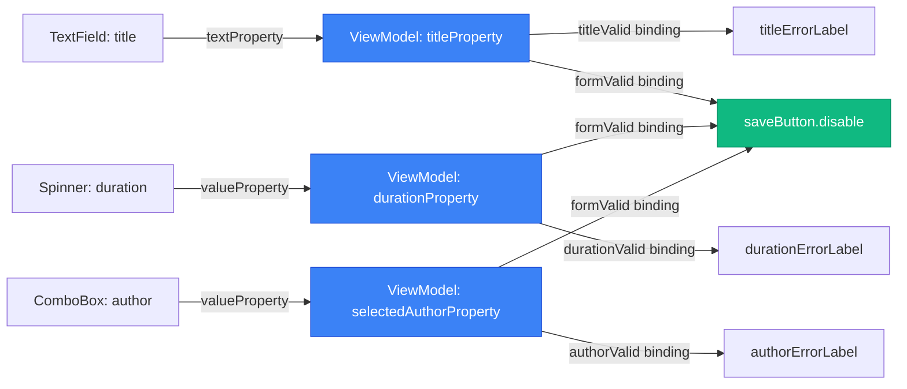

# Properties та Bindings: Реактивність у JavaFX

## Вступ: Проблема синхронізації стану

Уявіть типову ситуацію у розробці UI. Користувач вводить назву аудіокниги у `TextField`. Ви хочете, щоб:

1. **Label з попереднім переглядом** автоматично оновлювався при кожній зміні тексту.
2. **Кнопка "Save"** ставала активною лише коли назва не порожня та довжина не перевищує 255 символів.
3. **Лічильник символів** показував, скільки символів залишилося до ліміту.

Як би ви реалізували це без спеціальних інструментів? Найімовірніше, через **ручне оновлення** у обробнику подій:

```java
TextField titleField = new TextField();
Label previewLabel = new Label();
Button saveButton = new Button("Save");
Label counterLabel = new Label("255 characters remaining");

titleField.textProperty().addListener((observable, oldValue, newValue) -> {
    // Оновлення preview
    previewLabel.setText("Preview: " + newValue);
    
    // Оновлення стану кнопки
    boolean isValid = newValue != null && !newValue.isEmpty() && newValue.length() <= 255;
    saveButton.setDisable(!isValid);
    
    // Оновлення лічильника
    int remaining = 255 - (newValue == null ? 0 : newValue.length());
    counterLabel.setText(remaining + " characters remaining");
    
    // Зміна кольору при перевищенні ліміту
    if (newValue != null && newValue.length() > 255) {
        titleField.setStyle("-fx-border-color: red;");
    } else {
        titleField.setStyle("");
    }
});
```

Цей код працює, але має кілька фундаментальних проблем:

**Проблема 1: Спагетті-код.** Вся логіка синхронізації зосереджена в одному listener. При додаванні нових елементів (наприклад, ще одного Label або іконки валідації) цей метод розростається до сотень рядків.

**Проблема 2: Дублювання логіки.** Якщо у вас є кілька полів з подібною валідацією, ви копіюєте цей код знову і знову, змінюючи лише назви змінних.

**Проблема 3: Важко тестувати.** Логіка валідації змішана з логікою оновлення UI. Щоб протестувати правило "назва не порожня", вам потрібно створити `TextField`, `Button` та запустити JavaFX Application Thread.

**Проблема 4: Неявні залежності.** Читаючи код, неможливо швидко зрозуміти, що `saveButton` залежить від `titleField`. Ця залежність прихована всередині listener.

JavaFX вирішує ці проблеми через **Properties** та **Bindings** — реактивну систему, що дозволяє **декларативно** описувати залежності між даними та UI. Замість того, щоб писати "коли текст змінюється, оновити Label", ви пишете "Label завжди відображає текст з TextField". Система сама стежить за змінами та оновлює UI автоматично.

::note
**Реактивне програмування** (Reactive Programming) — це парадигма, де програма реагує на зміни даних автоматично, без явних викликів методів оновлення. JavaFX Properties — це одна з перших реалізацій цієї парадигми у Java, що з'явилася задовго до популяризації RxJava та Project Reactor.
::

---

## JavaFX Properties: Обгортки над значеннями

**Property** у JavaFX — це обгортка над звичайним значенням (String, Integer, Boolean, Object), що додає можливість **спостереження за змінами**. Коли значення Property змінюється, всі підписані слухачі отримують сповіщення.

### Відмінність від звичайних полів

Порівняємо звичайне поле та Property:

::tabs

::tabs-item{label="Звичайне поле" icon="i-heroicons-variable"}

```java
public class Audiobook {
    private String title;
    
    public String getTitle() {
        return title;
    }
    
    public void setTitle(String title) {
        this.title = title;
    }
}
```

**Проблема:** Ніхто не знає, коли `title` змінюється. Щоб відстежити зміни, потрібно вручну викликати метод оновлення після кожного `setTitle()`.

::

::tabs-item{label="JavaFX Property" icon="i-heroicons-bolt"}

```java
public class Audiobook {
    private final StringProperty title = new SimpleStringProperty();
    
    public StringProperty titleProperty() {
        return title;
    }
    
    public String getTitle() {
        return title.get();
    }
    
    public void setTitle(String value) {
        title.set(value);
    }
}
```

**Перевага:** Будь-хто може підписатися на зміни через `titleProperty().addListener()`. При виклику `setTitle()` всі слухачі автоматично отримають сповіщення.

::

::

### Типи Properties

JavaFX надає Property для всіх базових типів та об'єктів:

| Тип даних       | Property клас           | Приклад використання                          |
|-----------------|-------------------------|-----------------------------------------------|
| `String`        | `StringProperty`        | Назва, опис, email                            |
| `int`           | `IntegerProperty`       | Вік, кількість, індекс                        |
| `long`          | `LongProperty`          | Timestamp, ID                                 |
| `double`        | `DoubleProperty`        | Ціна, рейтинг, прогрес                        |
| `boolean`       | `BooleanProperty`       | Прапорці стану (isValid, isLoading)          |
| `Object<T>`     | `ObjectProperty<T>`     | Складні об'єкти (Author, Genre)               |
| `List<T>`       | `ListProperty<T>`       | Колекції (список аудіокниг)                   |

**Створення Property:**

```java
// Прості типи
StringProperty title = new SimpleStringProperty("Unknown");
IntegerProperty duration = new SimpleIntegerProperty(0);
BooleanProperty isPlaying = new SimpleBooleanProperty(false);

// Об'єкти
ObjectProperty<Author> author = new SimpleObjectProperty<>();
author.set(new Author("George", "Orwell"));

// З початковим значенням
StringProperty genre = new SimpleStringProperty("Fiction");
```

### Робота з Property: get, set, bind

**Отримання значення:**

```java
String currentTitle = title.get();
int currentDuration = duration.get();
```

**Встановлення значення:**

```java
title.set("1984");
duration.set(360);
```

**Прив'язка до іншої Property (Binding):**

```java
Label label = new Label();
label.textProperty().bind(title); // Label завжди показує значення title

title.set("Animal Farm"); // Label автоматично оновиться
```

### ReadOnlyProperty: Незмінні властивості

Іноді потрібно надати доступ до Property лише для читання, щоб зовнішній код не міг змінити значення. Для цього використовуються **ReadOnly** варіанти:

```java
public class AudiobookPlayer {
    private final IntegerProperty currentPosition = new SimpleIntegerProperty(0);
    private final ReadOnlyIntegerWrapper currentPositionReadOnly = 
        new ReadOnlyIntegerWrapper(this, "currentPosition", 0);
    
    public ReadOnlyIntegerProperty currentPositionProperty() {
        return currentPositionReadOnly.getReadOnlyProperty();
    }
    
    public int getCurrentPosition() {
        return currentPositionReadOnly.get();
    }
    
    // Лише внутрішні методи можуть змінювати позицію
    private void updatePosition(int newPosition) {
        currentPositionReadOnly.set(newPosition);
    }
}
```

**Використання:**

```java
AudiobookPlayer player = new AudiobookPlayer();

// Можна читати та підписуватися
player.currentPositionProperty().addListener((obs, old, newVal) -> {
    System.out.println("Position: " + newVal);
});

// НЕ можна змінювати (метод set() недоступний)
// player.currentPositionProperty().set(100); // Compilation error
```

---

## Change Listeners: Реакція на зміни

**ChangeListener** — це інтерфейс, що дозволяє виконати код при зміні значення Property. Це найпростіший спосіб відстежити зміни.

### Базовий синтаксис

```java
StringProperty title = new SimpleStringProperty("Initial");

title.addListener((observable, oldValue, newValue) -> {
    System.out.println("Title changed from '" + oldValue + "' to '" + newValue + "'");
});

title.set("New Title"); // Виведе: Title changed from 'Initial' to 'New Title'
```

**Параметри лямбда-виразу:**
- **`observable`** — сама Property, що змінилася (тип `ObservableValue<String>`).
- **`oldValue`** — попереднє значення.
- **`newValue`** — нове значення.

### Практичний приклад: Валідація у реальному часі

Створимо форму з валідацією, що показує помилки одразу при введенні:

```java
TextField titleField = new TextField();
Label errorLabel = new Label();
errorLabel.setStyle("-fx-text-fill: red;");

titleField.textProperty().addListener((observable, oldValue, newValue) -> {
    if (newValue == null || newValue.trim().isEmpty()) {
        errorLabel.setText("Title is required");
        titleField.setStyle("-fx-border-color: red;");
    } else if (newValue.length() > 255) {
        errorLabel.setText("Title is too long (max 255 characters)");
        titleField.setStyle("-fx-border-color: red;");
    } else {
        errorLabel.setText("");
        titleField.setStyle("");
    }
});
```

**Результат:** При введенні тексту у `titleField` автоматично оновлюється `errorLabel` та колір рамки поля.

### InvalidationListener: Альтернатива для продуктивності

Якщо вам не потрібні старе та нове значення, а лише факт зміни, використовуйте `InvalidationListener` — він трохи швидший:

```java
title.addListener(observable -> {
    System.out.println("Title changed to: " + title.get());
});
```

**Відмінність:** `InvalidationListener` викликається одразу при зміні, навіть якщо нове значення ще не обчислене (для lazy properties). `ChangeListener` викликається лише коли значення реально змінилося.

::warning
**Listener спрацьовує при кожній зміні** — уникайте важких операцій всередині listener (JDBC-запити, читання файлів). Для тривалих операцій використовуйте debouncing (затримка перед виконанням) або виконуйте їх асинхронно через `Task`.
::

### Відписка від Listener

Listener залишається активним, поки Property існує. Якщо ви створюєте тимчасові об'єкти з listener, це може призвести до **memory leak**. Завжди відписуйтесь, коли listener більше не потрібен:

```java
ChangeListener<String> listener = (obs, old, newVal) -> {
    System.out.println("Changed: " + newVal);
};

title.addListener(listener);

// Пізніше, коли listener більше не потрібен
title.removeListener(listener);
```

---

## Bindings: Декларативна синхронізація

**Binding** — це автоматичний зв'язок між двома Properties, де одна Property **автоматично оновлюється** при зміні іншої. Це ключова концепція реактивності у JavaFX.

### Unidirectional Binding: Однонаправлена прив'язка

**Однонаправлена прив'язка** означає, що одна Property **слідує** за іншою, але не навпаки.

```java
StringProperty source = new SimpleStringProperty("Source");
StringProperty target = new SimpleStringProperty();

target.bind(source); // target завжди дорівнює source

System.out.println(target.get()); // "Source"

source.set("New Value");
System.out.println(target.get()); // "New Value"

// target.set("Manual"); // IllegalStateException: A bound value cannot be set
```

**Важливо:** Після виклику `bind()` ви **не можете** вручну встановити значення `target` через `set()`. Property стає "зв'язаною" (bound) і керується лише джерелом.

**Відв'язування:**

```java
target.unbind(); // Тепер target знову незалежна
target.set("Manual Value"); // Працює
```

### Приклад: Синхронізація TextField та Label

```java
TextField inputField = new TextField();
Label outputLabel = new Label();

outputLabel.textProperty().bind(inputField.textProperty());

// Тепер outputLabel завжди показує те, що введено у inputField
```

**Результат:** Користувач вводить текст у `inputField` → `outputLabel` автоматично оновлюється. Жодного listener, жодного ручного оновлення.

### Bidirectional Binding: Двонаправлена прив'язка

**Двонаправлена прив'язка** означає, що дві Properties **синхронізуються в обидва боки**: зміна однієї оновлює іншу, і навпаки.

```java
StringProperty property1 = new SimpleStringProperty("A");
StringProperty property2 = new SimpleStringProperty("B");

property1.bindBidirectional(property2);

System.out.println(property1.get()); // "B" (property1 синхронізувалася з property2)

property1.set("C");
System.out.println(property2.get()); // "C" (property2 оновилася)

property2.set("D");
System.out.println(property1.get()); // "D" (property1 оновилася)
```

**Використання:** Синхронізація між Model та ViewModel, або між двома UI-елементами.

Приклад: Два `TextField` завжди показують однаковий текст:

```java
TextField field1 = new TextField();
TextField field2 = new TextField();

field1.textProperty().bindBidirectional(field2.textProperty());

// Введення у field1 оновлює field2, і навпаки
```

**Відв'язування:**

```java
property1.unbindBidirectional(property2);
```

::tip
**Коли використовувати Unidirectional vs Bidirectional?**
- **Unidirectional:** Коли одна Property — "джерело істини", а інша — лише відображення (TextField → Label).
- **Bidirectional:** Коли обидві Properties рівноправні та мають синхронізуватися (Model ↔ ViewModel).
::

---

## Computed Bindings: Обчислювані прив'язки

Часто потрібно створити Property, значення якої **обчислюється** на основі інших Properties. Наприклад, повне ім'я автора складається з імені та прізвища, або кнопка активна лише коли всі поля валідні.

### Bindings Utility Class

JavaFX надає клас `javafx.beans.binding.Bindings` з методами для створення обчислюваних прив'язок.

**Конкатенація рядків:**

```java
StringProperty firstName = new SimpleStringProperty("George");
StringProperty lastName = new SimpleStringProperty("Orwell");

StringBinding fullName = Bindings.concat(firstName, " ", lastName);

System.out.println(fullName.get()); // "George Orwell"

firstName.set("Aldous");
lastName.set("Huxley");
System.out.println(fullName.get()); // "Aldous Huxley"
```

**Арифметичні операції:**

```java
IntegerProperty hours = new SimpleIntegerProperty(2);
IntegerProperty minutes = new SimpleIntegerProperty(30);

IntegerBinding totalMinutes = hours.multiply(60).add(minutes);

System.out.println(totalMinutes.get()); // 150

hours.set(3);
System.out.println(totalMinutes.get()); // 210
```

**Умовні вирази (Ternary):**

```java
IntegerProperty duration = new SimpleIntegerProperty(45);

StringBinding durationLabel = Bindings.when(duration.greaterThan(60))
    .then(Bindings.concat(duration.divide(60), " hours"))
    .otherwise(Bindings.concat(duration, " minutes"));

System.out.println(durationLabel.get()); // "45 minutes"

duration.set(120);
System.out.println(durationLabel.get()); // "2 hours"
```

### Fluent API: Ланцюжки операцій

Кожна Property має методи для створення обчислюваних прив'язок через **fluent API**:

```java
IntegerProperty price = new SimpleIntegerProperty(100);
DoubleProperty discount = new SimpleDoubleProperty(0.2);

// Ціна зі знижкою: price * (1 - discount)
NumberBinding finalPrice = price.multiply(Bindings.subtract(1, discount));

System.out.println(finalPrice.getValue()); // 80.0

discount.set(0.5);
System.out.println(finalPrice.getValue()); // 50.0
```

**Порівняння:**

```java
IntegerProperty age = new SimpleIntegerProperty(17);

BooleanBinding isAdult = age.greaterThanOrEqualTo(18);
BooleanBinding isChild = age.lessThan(12);

System.out.println(isAdult.get()); // false
System.out.println(isChild.get()); // false

age.set(25);
System.out.println(isAdult.get()); // true
```

**Перевірка на null та порожність:**

```java
StringProperty username = new SimpleStringProperty();

BooleanBinding isUsernameEmpty = username.isNull().or(username.isEmpty());

System.out.println(isUsernameEmpty.get()); // true

username.set("john_doe");
System.out.println(isUsernameEmpty.get()); // false
```

### Custom Bindings: Складна логіка

Для складних обчислень, що не покриваються стандартними методами, використовуйте `Bindings.createStringBinding()`, `createBooleanBinding()`, тощо:

```java
StringProperty title = new SimpleStringProperty("The Great Gatsby");
IntegerProperty duration = new SimpleIntegerProperty(240);

StringBinding summary = Bindings.createStringBinding(() -> {
    String t = title.get();
    int d = duration.get();
    int hours = d / 60;
    int minutes = d % 60;
    return String.format("%s (%dh %dm)", t, hours, minutes);
}, title, duration);

System.out.println(summary.get()); // "The Great Gatsby (4h 0m)"

duration.set(195);
System.out.println(summary.get()); // "The Great Gatsby (3h 15m)"
```

**Важливо:** У другому параметрі `createStringBinding()` вказуються всі Properties, від яких залежить обчислення. Якщо забути вказати Property, binding не оновиться при її зміні.

---

## Практичний приклад: Форма з валідацією через Bindings

Створимо форму додавання аудіокниги з повною валідацією через Bindings, без жодного ручного оновлення UI.

### Вимоги до валідації

1. **Title:** Не порожній, не більше 255 символів.
2. **Duration:** Більше 0 хвилин.
3. **Author:** Обраний зі списку (не null).
4. **Кнопка "Save":** Активна лише коли всі поля валідні.

### Код форми

```java
public class AudiobookFormViewModel {
    
    // Properties для полів форми
    private final StringProperty title = new SimpleStringProperty("");
    private final IntegerProperty duration = new SimpleIntegerProperty(0);
    private final ObjectProperty<Author> selectedAuthor = new SimpleObjectProperty<>();
    
    // Properties для помилок валідації
    private final StringProperty titleError = new SimpleStringProperty();
    private final StringProperty durationError = new SimpleStringProperty();
    private final StringProperty authorError = new SimpleStringProperty();
    
    // Bindings для валідності кожного поля
    private final BooleanBinding titleValid;
    private final BooleanBinding durationValid;
    private final BooleanBinding authorValid;
    
    // Загальна валідність форми
    private final BooleanBinding formValid;
    
    public AudiobookFormViewModel() {
        // Валідація Title
        titleValid = Bindings.createBooleanBinding(() -> {
            String t = title.get();
            if (t == null || t.trim().isEmpty()) {
                titleError.set("Title is required");
                return false;
            } else if (t.length() > 255) {
                titleError.set("Title is too long (max 255 characters)");
                return false;
            } else {
                titleError.set(null);
                return true;
            }
        }, title);
        
        // Валідація Duration
        durationValid = Bindings.createBooleanBinding(() -> {
            int d = duration.get();
            if (d <= 0) {
                durationError.set("Duration must be greater than 0");
                return false;
            } else {
                durationError.set(null);
                return true;
            }
        }, duration);
        
        // Валідація Author
        authorValid = Bindings.createBooleanBinding(() -> {
            Author a = selectedAuthor.get();
            if (a == null) {
                authorError.set("Please select an author");
                return false;
            } else {
                authorError.set(null);
                return true;
            }
        }, selectedAuthor);
        
        // Форма валідна, якщо всі поля валідні
        formValid = titleValid.and(durationValid).and(authorValid);
    }
    
    // Getters для Properties
    public StringProperty titleProperty() { return title; }
    public IntegerProperty durationProperty() { return duration; }
    public ObjectProperty<Author> selectedAuthorProperty() { return selectedAuthor; }
    
    public StringProperty titleErrorProperty() { return titleError; }
    public StringProperty durationErrorProperty() { return durationError; }
    public StringProperty authorErrorProperty() { return authorError; }
    
    public BooleanBinding formValidProperty() { return formValid; }
    
    public void saveAudiobook() {
        if (formValid.get()) {
            System.out.println("Saving: " + title.get() + ", " + duration.get() + " min, by " + selectedAuthor.get());
            // Тут буде виклик Repository
        }
    }
}
```

### UI з Bindings

```java
public class AudiobookFormController {
    
    @FXML private TextField titleField;
    @FXML private Label titleErrorLabel;
    
    @FXML private Spinner<Integer> durationSpinner;
    @FXML private Label durationErrorLabel;
    
    @FXML private ComboBox<Author> authorComboBox;
    @FXML private Label authorErrorLabel;
    
    @FXML private Button saveButton;
    
    private AudiobookFormViewModel viewModel;
    
    @FXML
    public void initialize() {
        viewModel = new AudiobookFormViewModel();
        
        // Bidirectional bindings: UI ↔ ViewModel
        titleField.textProperty().bindBidirectional(viewModel.titleProperty());
        durationSpinner.getValueFactory().valueProperty().bindBidirectional(viewModel.durationProperty().asObject());
        authorComboBox.valueProperty().bindBidirectional(viewModel.selectedAuthorProperty());
        
        // Unidirectional bindings: ViewModel → UI (помилки)
        titleErrorLabel.textProperty().bind(viewModel.titleErrorProperty());
        durationErrorLabel.textProperty().bind(viewModel.durationErrorProperty());
        authorErrorLabel.textProperty().bind(viewModel.authorErrorProperty());
        
        // Кнопка Save активна лише коли форма валідна
        saveButton.disableProperty().bind(viewModel.formValidProperty().not());
        
        // Завантаження авторів у ComboBox
        authorComboBox.getItems().addAll(
            new Author("George", "Orwell"),
            new Author("Aldous", "Huxley"),
            new Author("Ray", "Bradbury")
        );
    }
    
    @FXML
    private void onSaveClicked() {
        viewModel.saveAudiobook();
    }
}
```

**Результат:** Форма з повною валідацією у реальному часі. При введенні тексту автоматично оновлюються повідомлення про помилки. Кнопка "Save" стає активною лише коли всі поля валідні. **Жодного ручного оновлення UI** — все через Bindings.

::mermaid

::

---

## ObservableList та ObservableMap: Реактивні колекції

Properties чудово працюють для окремих значень, але що робити з **колекціями**? Якщо у вас є список аудіокниг, і ви додаєте новий елемент, як UI дізнається про це?

JavaFX надає **ObservableList** та **ObservableMap** — колекції, що сповіщають слухачів про зміни (додавання, видалення, заміна елементів).

### ObservableList: Список з сповіщеннями

**ObservableList** — це розширення `java.util.List`, що генерує події при зміні вмісту.

**Створення:**

```java
ObservableList<String> tracks = FXCollections.observableArrayList();

// Або з початковими даними
ObservableList<String> genres = FXCollections.observableArrayList("Fiction", "Non-Fiction", "Science");
```

**Операції:**

```java
tracks.add("Track 1.mp3");
tracks.add("Track 2.mp3");
tracks.remove(0); // Видалити перший елемент
tracks.set(0, "Track 2 (edited).mp3"); // Замінити елемент
tracks.clear(); // Очистити список
```

**Підписка на зміни:**

```java
tracks.addListener((ListChangeListener<String>) change -> {
    while (change.next()) {
        if (change.wasAdded()) {
            System.out.println("Added: " + change.getAddedSubList());
        }
        if (change.wasRemoved()) {
            System.out.println("Removed: " + change.getRemoved());
        }
        if (change.wasReplaced()) {
            System.out.println("Replaced");
        }
    }
});

tracks.add("New Track"); // Виведе: Added: [New Track]
```

### Інтеграція з ListView та TableView

Найпотужніша можливість `ObservableList` — автоматична синхронізація з UI-компонентами.

**ListView:**

```java
ObservableList<String> items = FXCollections.observableArrayList("Item 1", "Item 2");
ListView<String> listView = new ListView<>(items);

// Додавання елемента → ListView автоматично оновлюється
items.add("Item 3");
```

**TableView:**

```java
ObservableList<Audiobook> audiobooks = FXCollections.observableArrayList();
TableView<Audiobook> tableView = new TableView<>(audiobooks);

// Налаштування колонок (як у попередній статті)
// ...

// Додавання аудіокниги → TableView автоматично оновлюється
audiobooks.add(new Audiobook("1984", author, genre, 360));
```

**Це ключова перевага MVVM:** ViewModel містить `ObservableList`, View підключається до нього через `tableView.setItems()`. Коли ViewModel додає/видаляє елементи, UI оновлюється автоматично, без явних викликів `refresh()`.

### FilteredList: Фільтрація без зміни оригіналу

**FilteredList** — це обгортка над `ObservableList`, що показує лише елементи, які відповідають предикату.

```java
ObservableList<Audiobook> allAudiobooks = FXCollections.observableArrayList(
    new Audiobook("1984", orwell, dystopian, 360),
    new Audiobook("Sapiens", harari, nonFiction, 900),
    new Audiobook("Foundation", asimov, sciFi, 480)
);

FilteredList<Audiobook> filteredAudiobooks = new FilteredList<>(allAudiobooks);

// Показати лише аудіокниги довше 400 хвилин
filteredAudiobooks.setPredicate(audiobook -> audiobook.getDuration() > 400);

System.out.println(filteredAudiobooks.size()); // 2 (Sapiens, Foundation)

// Підключення до TableView
tableView.setItems(filteredAudiobooks);
```

**Динамічна фільтрація через TextField:**

```java
TextField searchField = new TextField();
FilteredList<Audiobook> filteredList = new FilteredList<>(allAudiobooks, p -> true);

searchField.textProperty().addListener((observable, oldValue, newValue) -> {
    filteredList.setPredicate(audiobook -> {
        if (newValue == null || newValue.isEmpty()) {
            return true; // Показати всі
        }
        
        String lowerCaseFilter = newValue.toLowerCase();
        
        // Пошук за назвою або автором
        return audiobook.getTitle().toLowerCase().contains(lowerCaseFilter)
            || audiobook.getAuthor().getFullName().toLowerCase().contains(lowerCaseFilter);
    });
});

tableView.setItems(filteredList);
```

**Результат:** Користувач вводить текст у `searchField` → `TableView` автоматично показує лише відповідні аудіокниги.

### SortedList: Сортування

**SortedList** — обгортка, що автоматично сортує елементи.

```java
ObservableList<Audiobook> audiobooks = FXCollections.observableArrayList(...);
SortedList<Audiobook> sortedList = new SortedList<>(audiobooks);

// Прив'язка до TableView для сортування при кліку на заголовок колонки
sortedList.comparatorProperty().bind(tableView.comparatorProperty());

tableView.setItems(sortedList);
```

**Комбінування FilteredList та SortedList:**

```java
FilteredList<Audiobook> filteredList = new FilteredList<>(allAudiobooks);
SortedList<Audiobook> sortedList = new SortedList<>(filteredList);

sortedList.comparatorProperty().bind(tableView.comparatorProperty());
tableView.setItems(sortedList);

// Тепер TableView підтримує і фільтрацію, і сортування
```

### ObservableMap: Реактивні словники

**ObservableMap** — аналог `Map`, що сповіщає про зміни.

```java
ObservableMap<String, Integer> genreCount = FXCollections.observableHashMap();

genreCount.addListener((MapChangeListener<String, Integer>) change -> {
    if (change.wasAdded()) {
        System.out.println("Added: " + change.getKey() + " = " + change.getValueAdded());
    }
    if (change.wasRemoved()) {
        System.out.println("Removed: " + change.getKey());
    }
});

genreCount.put("Fiction", 10); // Виведе: Added: Fiction = 10
genreCount.put("Fiction", 15); // Виведе: Removed: Fiction, Added: Fiction = 15
```

---

## Практичний приклад: Пошук та фільтрація аудіокниг

Створимо повноцінний екран зі списком аудіокниг, пошуком та фільтрацією за жанром — все через Properties та Bindings.

### ViewModel

```java
public class AudiobookListViewModel {
    
    private final ObservableList<Audiobook> allAudiobooks = FXCollections.observableArrayList();
    private final FilteredList<Audiobook> filteredAudiobooks;
    private final SortedList<Audiobook> sortedAudiobooks;
    
    private final StringProperty searchQuery = new SimpleStringProperty("");
    private final ObjectProperty<Genre> selectedGenre = new SimpleObjectProperty<>();
    
    private final IntegerProperty totalCount = new SimpleIntegerProperty();
    private final IntegerProperty filteredCount = new SimpleIntegerProperty();
    
    public AudiobookListViewModel() {
        // Фільтрація
        filteredAudiobooks = new FilteredList<>(allAudiobooks, p -> true);
        
        // Оновлення предикату при зміні пошукового запиту або жанру
        searchQuery.addListener((obs, old, newVal) -> updatePredicate());
        selectedGenre.addListener((obs, old, newVal) -> updatePredicate());
        
        // Сортування
        sortedAudiobooks = new SortedList<>(filteredAudiobooks);
        
        // Bindings для лічильників
        totalCount.bind(Bindings.size(allAudiobooks));
        filteredCount.bind(Bindings.size(filteredAudiobooks));
    }
    
    private void updatePredicate() {
        filteredAudiobooks.setPredicate(audiobook -> {
            // Фільтр за жанром
            if (selectedGenre.get() != null && !audiobook.getGenre().equals(selectedGenre.get())) {
                return false;
            }
            
            // Фільтр за пошуковим запитом
            String query = searchQuery.get();
            if (query == null || query.isEmpty()) {
                return true;
            }
            
            String lowerCaseQuery = query.toLowerCase();
            return audiobook.getTitle().toLowerCase().contains(lowerCaseQuery)
                || audiobook.getAuthor().getFullName().toLowerCase().contains(lowerCaseQuery);
        });
    }
    
    public void loadAudiobooks() {
        // Тут буде виклик Repository
        allAudiobooks.addAll(
            new Audiobook("1984", orwell, dystopian, 360),
            new Audiobook("Sapiens", harari, nonFiction, 900),
            new Audiobook("Foundation", asimov, sciFi, 480)
        );
    }
    
    // Getters
    public SortedList<Audiobook> getSortedAudiobooks() { return sortedAudiobooks; }
    public StringProperty searchQueryProperty() { return searchQuery; }
    public ObjectProperty<Genre> selectedGenreProperty() { return selectedGenre; }
    public IntegerProperty totalCountProperty() { return totalCount; }
    public IntegerProperty filteredCountProperty() { return filteredCount; }
}
```

### Controller

```java
public class AudiobookListController {
    
    @FXML private TextField searchField;
    @FXML private ComboBox<Genre> genreComboBox;
    @FXML private TableView<Audiobook> audiobookTable;
    @FXML private Label statusLabel;
    
    private AudiobookListViewModel viewModel;
    
    @FXML
    public void initialize() {
        viewModel = new AudiobookListViewModel();
        
        // Bindings
        searchField.textProperty().bindBidirectional(viewModel.searchQueryProperty());
        genreComboBox.valueProperty().bindBidirectional(viewModel.selectedGenreProperty());
        
        audiobookTable.setItems(viewModel.getSortedAudiobooks());
        viewModel.getSortedAudiobooks().comparatorProperty().bind(audiobookTable.comparatorProperty());
        
        // Статус-бар: "Showing X of Y audiobooks"
        statusLabel.textProperty().bind(
            Bindings.concat("Showing ", viewModel.filteredCountProperty(), " of ", viewModel.totalCountProperty(), " audiobooks")
        );
        
        // Завантаження даних
        viewModel.loadAudiobooks();
    }
}
```

**Результат:** Повноцінний екран з пошуком та фільтрацією. Користувач вводить текст або обирає жанр → таблиця автоматично оновлюється. Статус-бар показує кількість відфільтрованих записів. **Жодного ручного оновлення** — все через реактивні Properties та Bindings.

---

## Практичні завдання

### Рівень 1: Базові операції з Properties

**Завдання 1.1: Синхронізація TextField та Label**

Створіть `TextField` та `Label`. Зв'яжіть їх так, щоб Label завжди показував текст з TextField у верхньому регістрі (UPPERCASE).

**Підказка:** Використовуйте `Bindings.createStringBinding()` з `toUpperCase()`.

**Завдання 1.2: Лічильник символів**

Створіть `TextArea` з обмеженням у 500 символів. Додайте `Label`, що показує "X / 500 characters". При перевищенні ліміту Label має ставати червоним.

**Завдання 1.3: Калькулятор**

Створіть два `TextField` для чисел та `Label` для результату. При зміні будь-якого поля Label має показувати їх суму. Якщо введено не число — показати "Invalid input".

### Рівень 2: Валідація та складні Bindings

**Завдання 2.1: Форма реєстрації з валідацією**

Створіть форму реєстрації:
- Username (мін. 3 символи, макс. 20)
- Email (має містити @)
- Password (мін. 8 символів)
- Confirm Password (має співпадати з Password)

Кнопка "Register" активна лише коли всі поля валідні. Під кожним полем — Label з повідомленням про помилку (червоний текст).

**Завдання 2.2: Динамічна ціна з знижкою**

Створіть форму:
- `TextField` для базової ціни
- `Slider` для знижки (0-100%)
- `Label` для фінальної ціни (базова ціна - знижка)
- `Label` для суми знижки

Всі Label мають оновлюватися автоматично при зміні ціни або знижки.

**Завдання 2.3: Конвертер одиниць виміру**

Створіть конвертер хвилин у години:
- `Spinner<Integer>` для хвилин
- `Label` для годин та хвилин (формат: "Xh Ym")
- `Label` для днів (якщо більше 1440 хвилин)

Приклад: 195 хвилин → "3h 15m" → "0 days"

### Рівень 3: ObservableList та фільтрація

**Завдання 3.1: TODO-список з фільтрацією**

Створіть TODO-додаток:
- `ListView` зі списком завдань
- `TextField` для додавання нового завдання
- `ComboBox` з фільтрами: "All", "Completed", "Active"
- Кнопка "Mark as Done" (активна лише коли щось обрано)

Кожне завдання має `CheckBox` для позначення як виконане. При зміні фільтра список оновлюється.

**Завдання 3.2: Таблиця з пошуком та сортуванням**

Створіть таблицю студентів (ім'я, прізвище, оцінка):
- `TextField` для пошуку за ім'ям або прізвищем
- `ComboBox` для фільтрації за оцінкою (A, B, C, D, F, All)
- Сортування при кліку на заголовок колонки
- Статус-бар: "Showing X of Y students"

**Завдання 3.3: Кошик покупок**

Створіть інтерфейс інтернет-магазину:
- **Ліва панель:** `ListView` з товарами (назва, ціна)
- **Права панель:** Кошик (`TableView` з колонками: товар, кількість, сума)
- Кнопка "Add to Cart" (додає обраний товар у кошик)
- Кнопка "Remove" (видаляє товар з кошика)
- `Label` "Total: $X.XX" (загальна сума, оновлюється автоматично)

При зміні кількості у кошику — сума автоматично перераховується.

---

## Підсумок

У цій статті ми відкрили **реактивну парадигму** JavaFX — спосіб побудови UI, де дані та інтерфейс синхронізуються автоматично, без ручного оновлення.

**JavaFX Properties** — це обгортки над значеннями, що дозволяють підписуватися на зміни. Ми вивчили різні типи Properties (`StringProperty`, `IntegerProperty`, `BooleanProperty`, `ObjectProperty`) та навчилися працювати з ними через `get()`, `set()` та `addListener()`.

**Change Listeners** дозволяють виконувати код при зміні Property. Ми побачили, як використовувати їх для валідації у реальному часі, але також зрозуміли їхні обмеження: спагетті-код при складній логіці та важкість тестування.

**Bindings** — це декларативний спосіб зв'язування Properties. Ми вивчили:
- **Unidirectional Binding** (`target.bind(source)`) — одна Property слідує за іншою.
- **Bidirectional Binding** (`property1.bindBidirectional(property2)`) — дві Properties синхронізуються в обидва боки.
- **Computed Bindings** через `Bindings` utility class — обчислювані значення на основі інших Properties.
- **Fluent API** — ланцюжки операцій для створення складних виразів (`age.greaterThanOrEqualTo(18)`).

**ObservableList та ObservableMap** — реактивні колекції, що сповіщають про зміни вмісту. Ми дізналися, як інтегрувати їх з `ListView` та `TableView` для автоматичного оновлення UI, та як використовувати `FilteredList` і `SortedList` для фільтрації та сортування без зміни оригінальних даних.

**Практичні приклади** показали, як побудувати форму з повною валідацією та екран зі списком аудіокниг, пошуком та фільтрацією — все через Properties та Bindings, без жодного рядка коду для ручного оновлення UI.

Але це лише інструменти. Справжня сила Properties та Bindings розкривається у поєднанні з **архітектурним патерном MVVM**, який ми вивчатимемо у наступних статтях. Там ми побачимо, як ViewModel експонує Properties для View, як автоматично синхронізувати Domain Model з UI, та як тестувати всю цю логіку без запуску JavaFX Application Thread.

Properties та Bindings — це фундамент реактивності у JavaFX. Розуміння їхньої роботи критично важливе для побудови масштабованих, тестованих та підтримуваних desktop-додатків. У наступній статті ми розглянемо еволюцію архітектурних патернів UI — від MVC через MVP до MVVM — та зрозуміємо, чому саме MVVM є природним вибором для JavaFX.

::tip
**Корисні ресурси:**
- [JavaFX Properties and Binding Tutorial](https://docs.oracle.com/javase/8/javafx/properties-binding-tutorial/binding.htm) — офіційна документація Oracle.
- [JavaFX Bindings API](https://openjfx.io/javadoc/21/javafx.base/javafx/beans/binding/Bindings.html) — повний список методів класу `Bindings`.
- [Understanding JavaFX Properties](https://www.baeldung.com/javafx-properties) — стаття на Baeldung з прикладами.
- [ReactiveX](http://reactivex.io/) — якщо вас зацікавила реактивна парадигма, вивчіть RxJava для більш потужних можливостей (ми розглянемо це у опціональній статті 36).
::
