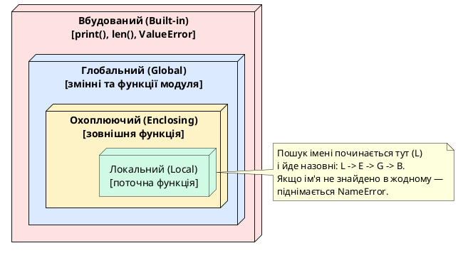
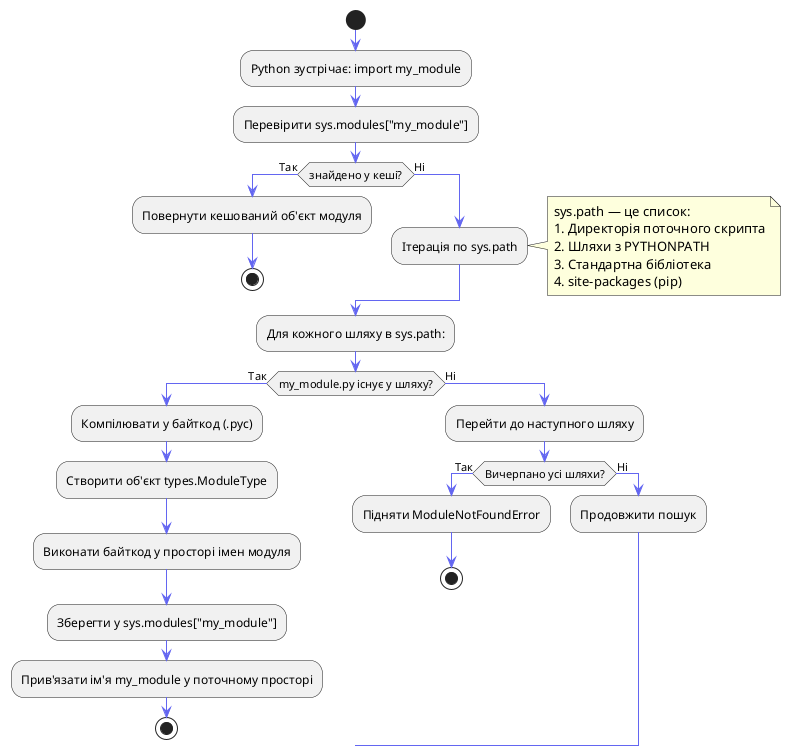
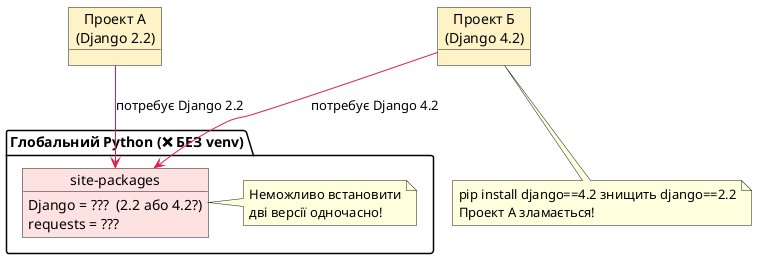
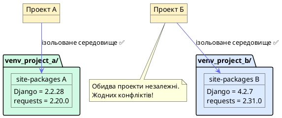

# Модулі, Пакети та Віртуальні Середовища

## Проблема монолітного коду: навіщо взагалі ділити програму

Уявіть, що ви розробляєте платформу для онлайн-торгівлі. Перші кілька тижнів все ідеально: один файл `main.py`, кілька функцій, чотири змінні. Але проходить місяць — і цей файл розростається до 2000 рядків. У ньому перемішані логіка авторизації, робота з базою даних, бізнес-правила знижок, генерація PDF-звітів та обробка платежів.

Це явище має назву — **монолітний антипатерн**. Він не є проблемою теоретичною: він реально гальмує розробку, ламає командну роботу та перетворює підтримку коду на катування.

::card-group

::card{title="Низька читабельність" icon="i-heroicons-eye-slash"}

Знайти функцію `calculate_vat` серед 2000 рядків — це пригода. IDE допомагає, але лише до певної межі. Після неї — лише `Ctrl+F` і терпіння.

::

::card{title="Конфлікти у команді" icon="i-heroicons-users"}

Двоє розробників одночасно редагують один файл — це гарантований merge conflict у Git. Один файл = один потік змін.

::

::card{title="Неможливість перевикористання" icon="i-heroicons-arrow-path"}

Ваша функція `send_email` з `main.py` потрібна у новому проекті? Доведеться або копіювати, або тягнути весь монолітний файл разом із зайвим кодом.

::

::card{title="Неможливість тестування" icon="i-heroicons-beaker"}

Як написати unit-тест для функції, що має десятки прихованих залежностей від глобального стану у тому ж файлі? Майже ніяк.

::

::

Рішення, що пропонує Python, — це чотирирівнева система організації коду: **вирази → функції → модулі → пакети**. Ця стаття присвячена двом верхнім рівням і тому, як забезпечити їхню ізоляцію між проектами через **віртуальні середовища**.

---

## Частина I: Модулі

### Що таке модуль: від файлу до об'єкта

З практичної точки зору, **модуль** — це будь-який файл з розширенням `.py`. Але це спрощення. З точки зору Python-рантайму, модуль — це **об'єкт типу `types.ModuleType`**, що має власний простір імен (`namespace`) і зберігається у кеші `sys.modules`.

Коли Python виконує `import calculator`, він не просто «підключає файл». Він:

1. Знаходить файл `calculator.py` (за алгоритмом `sys.path`)
2. Компілює його у байткод (`calculator.pyc`)
3. Створює новий об'єкт типу `module`
4. Виконує байткод у просторі імен цього об'єкта
5. Зберігає об'єкт у словнику `sys.modules['calculator']`
6. Прив'язує ім'я `calculator` у поточному просторі імен

Розглянемо цей процес на практичному прикладі. Побудуємо структуру реального mini-проекту:

::code-tree

```python [calculator.py]
# Модуль для математичних операцій

PI = 3.1415926535  # Константа — публічний атрибут модуля

def add(a: float, b: float) -> float:
    """Повертає суму двох чисел."""
    return a + b

def subtract(a: float, b: float) -> float:
    """Повертає різницю двох чисел."""
    return a - b

def multiply(a: float, b: float) -> float:
    """Повертає добуток двох чисел."""
    return a * b

def circle_area(radius: float) -> float:
    """Обчислює площу кола через внутрішню константу PI."""
    return PI * radius ** 2

def _validate_numbers(*args) -> bool:
    """
    Приватна функція за конвенцією (_prefix).
    Не призначена для використання ззовні модуля.
    """
    return all(isinstance(x, (int, float)) for x in args)
```

```python [main.py]
# Головний скрипт, що використовує модуль calculator

import calculator  # Імпортуємо весь модуль

# Доступ до атрибутів через ім'я модуля (крапкова нотація)
result = calculator.add(10, 5)
area = calculator.circle_area(7.0)

print(f"Сума: {result}")              # 15
print(f"Площа кола R=7: {area:.2f}") # 153.94
print(f"PI з модуля: {calculator.PI}")
```

::

::terminal-preview{title="python main.py"}

<div class="line"><span class="opacity-40">$</span> <strong>python main.py</strong></div>
<div class="line">Сума: <span class="text-green-400">15</span></div>
<div class="line">Площа кола R=7: <span class="text-green-400">153.94</span></div>
<div class="line">PI з модуля: <span class="text-blue-400">3.1415926535</span></div>

::

### Простір імен модуля: захист від конфліктів

Коли ви пишете `import calculator`, Python не «вливає» імена `add`, `subtract`, `PI` у поточний простір імен. Замість цього він створює *одне* ім'я `calculator`, що вказує на об'єкт модуля. Доступ до вмісту — лише через крапку. Це і є **простір імен** (namespace) — ізольований контейнер для імен.

```python
# main.py
import calculator

# Наша власна функція add — для роботи з рядками
def add(text1: str, text2: str) -> str:
    return text1 + " " + text2

# Жодного конфлікту! Два різних простори імен:
my_text = add("Привіт", "Світ")          # наша функція
calc_sum = calculator.add(2, 2)           # функція з модуля

print(my_text)    # "Привіт Світ"
print(calc_sum)   # 4
```

Якби Python не використовував простори імен і замість `import calculator` вставляв усі імена безпосередньо, виникала б катастрофа: будь-яка функція з будь-якого модуля могла б перезаписати будь-яку іншу. Саме тому `import module` вважається більш безпечним підходом порівняно з `from module import *`.

### Поглиблене розуміння просторів імен (Namespaces) та LEGB-правило

Щоб зрозуміти, як працює система імпорту та як уникнути помилок, пов'язаних із видимістю змінних, потрібно розібратися, що таке **простір імен (namespace)** на низькому рівні.

У Python простір імен — це **звичайний словник (`dict`)**, де ключами є імена змінних (ідентифікатори), а значеннями — самі об'єкти, на які ці змінні посилаються. Коли ви пишете `x = 42`, Python просто додає запис `{"x": 42}` у відповідний словник простору імен.

#### Чотири рівні просторів імен та LEGB-правило

Коли ви звертаєтеся до змінної, Python шукає її не скрізь, а в чітко визначеному порядку. Цей порядок описується **LEGB-правилом**:

::steps

### Local (Локальний)
Змінні, визначені всередині поточної функції (через `def` або `lambda`). Вони створюються при виклику функції і знищуються при її завершенні.

### Enclosing (Охоплюючий)
Змінні у зовнішніх функціях (використовується при вкладених функціях або замиканнях).

### Global (Глобальний)
Змінні, визначені на рівні модуля (файлу). Всі функції цього модуля мають доступ до цих змінних.

### Built-in (Вбудований)
Назви, які автоматично завантажуються інтерпретатором при старті. Сюди входять вбудовані функції (`print()`, `len()`, `range()`, `dict`) та виключення (`ValueError`, `KeyError`).

::

Схематично ієрархію пошуку імен можна зобразити у вигляді вкладених областей:

::plant-uml



::

#### Практичний експеримент: дослідження просторів імен

Ми можемо дослідити поточні простори імен за допомогою вбудованих функцій `locals()` та `globals()`, які повертають відповідні словники простору імен.

```python
# namespace_demo.py
import math

global_var = "Я глобальна змінна"

def outer_function():
    enclosing_var = "Я охоплююча змінна"
    
    def inner_function():
        local_var = "Я локальна змінна"
        
        # Дивимося на локальний простір імен внутрішньої функції
        print("--- Local Namespace inside inner_function() ---")
        print(locals())  # Виведе тільки {'local_var': 'Я локальна змінна'}
        
        # Спробуємо знайти global_var та print (built-in)
        # Python пройде шлях: inner_local -> outer_enclosing -> global -> built-in
        
    inner_function()

outer_function()

# Глобальний простір імен модуля
print("\n--- Global Namespace of module ---")
# globals() містить імпортований 'math', 'global_var', 'outer_function' та службові атрибути
print(list(globals().keys())[:10])  # покажемо перші 10 ключів
```

::terminal-preview{title="python namespace_demo.py"}

<div class="line"><span class="opacity-40">$</span> <strong>python namespace_demo.py</strong></div>
<div class="line">--- Local Namespace inside inner_function() ---</div>
<div class="line">{'local_var': <span class="text-green-400">'Я локальна змінна'</span>}</div>
<div class="line"></div>
<div class="line">--- Global Namespace of module ---</div>
<div class="line">[<span class="text-blue-400">'__name__'</span>, <span class="text-blue-400">'__doc__'</span>, <span class="text-blue-400">'__package__'</span>, <span class="text-blue-400">'math'</span>, <span class="text-blue-400">'global_var'</span>, <span class="text-blue-400">'outer_function'</span>]</div>

::

#### Модуль як об'єкт та його атрибут `__dict__`

Оскільки кожен модуль після імпорту стає об'єктом типу `module`, його простір імен зберігається в спеціальному атрибуті `__dict__`. Це звичайний словник.

Коли ви пишете `calculator.add(5, 5)`, Python під капотом виконує:
`calculator.__dict__['add'](5, 5)`

Це означає, що ми можемо динамічно маніпулювати простором імен модуля навіть після його імпорту (хоча цим не варто зловживати):

```python
import calculator

# Динамічно додаємо нове ім'я в простір імен модуля calculator
calculator.new_constant = 9.99

# Тепер це ім'я доступне звичайним шляхом!
print(calculator.new_constant)  # 9.99
```

Цей динамізм показує, що простір імен модулів у Python є відкритим і гнучким, на відміну від статичних просторів імен у таких мовах, як C++ або C#.

### Синтаксис імпорту: вичерпний огляд

Python надає кілька синтаксичних форм для імпорту, кожна з яких має власну область застосування та компроміси.

::tabs

::tabs-item{label="import module"}

```python
import calculator
import os
import sys

# Доступ лише через ім'я модуля — жодних конфліктів
result = calculator.add(10, 5)
cwd = os.getcwd()
paths = sys.path
```

**Коли використовувати:** у більшості випадків. Максимальна чіткість: завжди видно, звідки прийшло ім'я.

::

::tabs-item{label="from module import name"}

```python
from calculator import add, PI
from os.path import join, exists

# Доступ безпосередньо
result = add(10, 5)
full_path = join("/home", "user", "project")
```

**Коли використовувати:** якщо з великого модуля потрібні 1-3 конкретних об'єкти, і імена не конфліктують з локальними.

::

::tabs-item{label="import module as alias"}

```python
import calculator as calc
import numpy as np          # галузева конвенція
import matplotlib.pyplot as plt  # галузева конвенція
import pandas as pd

result = calc.add(2, 3)
array = np.array([1, 2, 3])
```

**Коли використовувати:** якщо ім'я модуля довге або є загальноприйнятий псевдонім у спільноті.

::

::tabs-item{label="⚠️ from module import *"}

```python
# ❌ НІКОЛИ НЕ РОБІТЬ ТАК У PRODUCTION-КОДІ
from calculator import *

# Тепер у просторі імен є: add, subtract, multiply, circle_area, PI
# Але звідки вони взялися? Невідомо без читання calculator.py
result = add(5, 5)  # яка це функція? наша? із calculator? з іншого модуля?
```

**Чому це погано:**
- Забруднює простір імен непередбачуваною кількістю імен
- Гарантовані приховані конфлікти: якщо `calculator` і ваш код мають функцію `add`, одна мовчки перезапише іншу
- IDE та статичні аналізатори не можуть розібратися у таких імпортах

::

::

### Конвенція `_private`: приватні атрибути модуля

У Python немає ключових слів `private` або `protected`. Натомість існує конвенція: **ім'я, що починається з одного підкреслення (`_name`), є сигналом «не призначене для публічного використання»**.

```python
# calculator.py
PI = 3.14159          # публічний атрибут ✅
_precision = 10       # «приватний» атрибут — для внутрішнього використання

def add(a, b):        # публічна функція ✅
    return a + b

def _validate(x):     # «приватна» функція — деталь реалізації
    return isinstance(x, (int, float))
```

Технічно `calculator._validate(5)` спрацює без помилок — Python лише сигналізує, але не забороняє. Проте конвенція дотримується всією екосистемою: IDE підсвічують такий виклик, linter-и видають попередження, а рецензенти коду запитають: «Навіщо ти лізеш у внутрішності чужого модуля?»

Ця конвенція також впливає на `from module import *`: якщо ваш модуль не визначає `__all__`, зірковий імпорт **пропускає** всі імена з підкресленням — це одна з небагатьох корисних властивостей `import *`.

---

## Система пошуку модулів: `sys.path` зсередини

### Алгоритм пошуку `import`

Коли Python зустрічає `import my_module`, він не шукає файл одразу по всій файловій системі. Він послідовно перевіряє **ієрархічний список директорій**, що зберігається у `sys.path` — списку рядків, де кожен рядок є абсолютним шляхом до директорії.

::plant-uml



::

### Анатомія `sys.path`: що там насправді

```python
import sys

print(f"Тип sys.path: {type(sys.path)}")  # <class 'list'>
print(f"Кількість шляхів: {len(sys.path)}")

for i, path in enumerate(sys.path):
    print(f"  [{i}] {path}")
```

::terminal-preview{title="python inspect_path.py"}

<div class="line"><span class="opacity-40">$</span> <strong>python inspect_path.py</strong></div>
<div class="line">Тип sys.path: <span class="text-blue-400">&lt;class 'list'&gt;</span></div>
<div class="line">Кількість шляхів: <span class="text-yellow-400">6</span></div>
<div class="line">  [0] <span class="text-green-400">/home/user/myproject</span>  <span class="text-gray-400"># директорія запущеного скрипта</span></div>
<div class="line">  [1] <span class="text-gray-400">/usr/lib/python312.zip</span></div>
<div class="line">  [2] <span class="text-blue-400">/usr/lib/python3.12</span>  <span class="text-gray-400"># стандартна бібліотека</span></div>
<div class="line">  [3] <span class="text-blue-400">/usr/lib/python3.12/lib-dynload</span></div>
<div class="line">  [4] <span class="text-green-400">/home/user/.venv/lib/python3.12/site-packages</span>  <span class="text-gray-400"># pip-пакети</span></div>
<div class="line">  [5] <span class="text-blue-400">/usr/lib/python3/dist-packages</span></div>

::

**Звідки формується `sys.path`?** Це не магія — список складається з кількох джерел у визначеному порядку пріоритету:

::field-group

::field{name="sys.path[0] — директорія скрипта" type="string"}
При запуску `python /home/user/project/main.py` Python автоматично ставить на перше місце `/home/user/project/`. Саме тому `import calculator` працює, якщо `calculator.py` лежить поруч з `main.py`. При запуску через `-m` або в інтерактивному режимі `sys.path[0]` дорівнює `''` (порожній рядок = поточна директорія shell).
::

::field{name="PYTHONPATH — змінна середовища" type="list[str]"}
Якщо встановлена змінна середовища `PYTHONPATH=/my/libs:/other/libs`, Python вставляє ці шляхи після `sys.path[0]`. Це спосіб глобально зареєструвати власні бібліотеки без встановлення через pip. Рідко потрібен у сучасних проектах з venv.
::

::field{name="Стандартна бібліотека" type="list[str]"}
Шляхи до вбудованих модулів Python: `os`, `sys`, `json`, `datetime` тощо. Їхнє точне розташування залежить від ОС та версії Python, але вони завжди присутні у `sys.path`.
::

::field{name="site-packages — pip-пакети" type="list[str]"}
Директорія, куди `pip install` встановлює сторонні пакети. Зазвичай знаходиться у `~/.local/lib/pythonX.Y/site-packages/` (глобально) або `venv/lib/pythonX.Y/site-packages/` (у venv). Саме тут лежать ваші `requests`, `Django`, `numpy`.
::

::

### Маніпуляції з `sys.path`: коли і як

`sys.path` — це звичайний Python-список, тому його можна змінювати в рантаймі. Це дає потужні (і небезпечні) можливості:

```python
import sys

# Додати власний шлях перед усіма іншими (найвищий пріоритет)
sys.path.insert(0, '/path/to/my/custom/libs')

# Або в кінець (найнижчий пріоритет)
sys.path.append('/path/to/fallback/libs')

# Тепер Python шукатиме модулі і там
import my_custom_module  # знайде у /path/to/my/custom/libs
```

::warning
**Маніпуляції з `sys.path` у production-коді — антипатерн.** Якщо ви додаєте шлях до `sys.path` у своєму коді, це означає, що ваша структура проекту або система встановлення пакетів налаштована неправильно. Правильне рішення — використовувати `pip install -e .` для локальної розробки або коректно структурований пакет. `sys.path.append(...)` допустимий лише у тимчасових скриптах та скриптах налагодження.
::

Альтернатива — файл `.pth` у директорії `site-packages`: Python автоматично читає всі `.pth`-файли при запуску та додає зазначені в них шляхи до `sys.path`. Команда `pip install -e .` (editable install) використовує саме цей механізм.

#### Як влаштований імпорт під капотом: Finder та Loader

Багато розробників думають, що `import` — це просто пошук файлу на диску. Насправді Python використовує складну, але дуже гнучку двохетапну систему імпорту, що базується на **пошуковцях (Finders)** та **завантажувачах (Loaders)**. Ця система повністю документована у PEP 302.

Коли ви викликаєте `import my_module`, виконуються такі кроки:

1. **Пошук модуля (Find Phase)**:
   Python проходить по списку пошуковців, що зберігаються в `sys.meta_path`. Типово там містяться:
   - `BuiltinImporter` (для вбудованих модулів, наприклад, `sys`).
   - `FrozenImporter` (для "заморожених" модулів, написаних на C і скомпільованих у двійковий файл інтерпретатора).
   - `PathFinder` (шукає файли на диску за шляхами із `sys.path`).

   Кожен пошуковець намагається знайти модуль. Якщо знаходить, він повертає спеціальний об'єкт — специфікацію модуля (`ModuleSpec`), яка містить метадані: ім'я модуля, посилання на завантажувач та шлях до файлу.

2. **Завантаження модуля (Load Phase)**:
   Отримавши `ModuleSpec`, Python викликає відповідний завантажувач (`Loader`). Завантажувач:
   - Створює порожній об'єкт модуля.
   - Записує його в `sys.modules`.
   - Виконує код файлу модуля в контексті цього об'єкта.

Цей механізм дозволяє розробникам писати власні імпортери (import hooks). Наприклад, можна написати Finder/Loader, який імпортує модулі безпосередньо з ZIP-архівів, бази даних або навіть завантажує їх через HTTP з віддаленого сервера!

#### Що таке `.pth`-файли

Файли з розширенням `.pth` (path configuration files) — це дуже простий і зручний спосіб додавання шляхів до `sys.path` без ручного редагування коду або налаштування змінної `PYTHONPATH`.

Якщо покласти файл `my_paths.pth` у директорію `site-packages` вашого віртуального середовища, Python під час ініціалізації прочитає його рядки і додасть усі вказані там шляхи до `sys.path`.

Кожен рядок у `.pth`-файлі має містити один абсолютний або відносний шлях. Якщо рядок починається з `import `, Python навіть виконає цей код (це використовується деякими складними бібліотеками для автоналаштування).

Саме цей механізм використовується при встановленні локального пакета в "режимі редагування":
`pip install -e .`
Замість того, щоб копіювати файли вашого проекту в `site-packages`, `pip` просто створює там `.pth`-файл, який містить шлях до вашої робочої директорії. Це дозволяє вам редагувати код, і зміни будуть миттєво видимі без повторного встановлення пакета.

---

## Кешування імпортів: `sys.modules` та Singleton-поведінка

### Чому модуль завантажується лише один раз

Python є мовою, де один і той самий модуль (`os`, `json`, `datetime`) може бути імпортований у десятках різних файлів одного проекту. Якби кожен `import os` перечитував файл з диска та виконував байткод заново — продуктивність була б катастрофічною.

Рішення — **кеш модулів**: словник `sys.modules`, що зберігає всі вже завантажені модулі.

```python
# main.py — демонстрація кешування
import sys

print("=== Перший імпорт ===")
import calculator  # <— тут: файл читається, байткод виконується

print("\n=== Другий імпорт ===")
import calculator  # <— тут: Python бачить 'calculator' у sys.modules → пропускає

print("\n=== Третій імпорт ===")
import calculator  # <— те саме: кеш-хіт, нульова вартість

print(f"\n'calculator' у кеші? {'calculator' in sys.modules}")

# Отримати об'єкт модуля з кешу напряму
cached = sys.modules['calculator']
print(f"Той самий об'єкт? {calculator is cached}")   # True
print(f"Виклик через кеш: {cached.add(1, 2)}")        # 3
```

::terminal-preview{title="Кешування: модуль завантажується лише раз"}

<div class="line"><span class="opacity-40">$</span> <strong>python main.py</strong></div>
<div class="line">=== Перший імпорт ===</div>
<div class="line"><span class="text-blue-400">Модуль calculator завантажено!</span>  <span class="text-gray-400"># виводиться лише раз</span></div>
<div class="line"></div>
<div class="line">=== Другий імпорт ===</div>
<div class="line"><span class="text-gray-400"># нічого — кеш-хіт</span></div>
<div class="line"></div>
<div class="line">=== Третій імпорт ===</div>
<div class="line"><span class="text-gray-400"># нічого — кеш-хіт</span></div>
<div class="line"></div>
<div class="line">'calculator' у кеші? <span class="text-green-400">True</span></div>
<div class="line">Той самий об'єкт? <span class="text-green-400">True</span></div>
<div class="line">Виклик через кеш: <span class="text-yellow-400">3</span></div>

::

#### Експеримент: ручне керування кешем у `sys.modules`

Щоб краще зрозуміти роль `sys.modules`, ми можемо втрутитися в його роботу безпосередньо. Якщо ми видалимо модуль із цього словника, Python "забуде", що він його колись імпортував, і при наступному `import` виконає код заново (так, ніби це перший імпорт).

```python
# sys_modules_experiment.py
import sys

print("--- Крок 1: Перший імпорт ---")
import calculator  # Виведе повідомлення про завантаження

print("\n--- Крок 2: Другий імпорт (кешований) ---")
import calculator  # Нічого не виведе, оскільки calculator вже у sys.modules

# Перевіряємо наявність у кеші
print(f"\ncalculator у sys.modules? {'calculator' in sys.modules}")

print("\n--- Крок 3: Видалення з sys.modules та повторний імпорт ---")
# Ручне видалення запису з кешу
del sys.modules['calculator']

print(f"calculator у sys.modules після видалення? {'calculator' in sys.modules}")

import calculator  # Python знову завантажує та виконує код модуля!
```

::terminal-preview{title="python sys_modules_experiment.py"}

<div class="line"><span class="opacity-40">$</span> <strong>python sys_modules_experiment.py</strong></div>
<div class="line">--- Крок 1: Перший імпорт ---</div>
<div class="line"><span class="text-blue-400">Модуль calculator завантажено!</span></div>
<div class="line"></div>
<div class="line">--- Крок 2: Другий імпорт (кешований) ---</div>
<div class="line"><span class="text-gray-400"># Кеш-хіт: повторного виводу немає</span></div>
<div class="line"></div>
<div class="line">calculator у sys.modules? <span class="text-green-400">True</span></div>
<div class="line"></div>
<div class="line">--- Крок 3: Видалення з sys.modules та повторний імпорт ---</div>
<div class="line">calculator у sys.modules після видалення? <span class="text-rose-400">False</span></div>
<div class="line"><span class="text-blue-400">Модуль calculator завантажено!</span>  <span class="text-gray-400"># Код виконався знову!</span></div>

::

::warning
Хоча цей трюк демонструє роботу `sys.modules`, **ніколи не видаляйте модулі з `sys.modules` вручну в реальних проектах**. Це може зламати зв'язки між модулями та спричинити непередбачувані побічні ефекти (наприклад, якщо інші частини коду вже мають посилання на старий об'єкт модуля).
::

### `sys.modules` як Singleton-реєстр: спільний стан

Той факт, що Python повертає **один і той самий об'єкт модуля** всім імпортерам, породжує важливий архітектурний наслідок: **модуль з глобальними змінними веде себе як Singleton**.

```python
# state.py — модуль зі спільним станом
print("Ініціалізація state.py")
request_count = 0
active_connections = []

# module_a.py — реєструє запити
import state

def handle_request(url: str) -> None:
    state.request_count += 1
    state.active_connections.append(url)
    print(f"[A] Запит #{state.request_count} до {url}")

# module_b.py — читає статистику
import state

def get_stats() -> dict:
    return {
        "total": state.request_count,
        "active": len(state.active_connections)
    }

# main.py
import module_a
import module_b

module_a.handle_request("/api/users")
module_a.handle_request("/api/products")

stats = module_b.get_stats()
print(f"Статистика: {stats}")
# {'total': 2, 'active': 2}
# module_b бачить зміни, зроблені module_a!
```

Обидва модулі отримали **одне й те саме посилання** на об'єкт `state` з `sys.modules`. Зміни від `module_a` одразу видимі у `module_b`. Це потужний механізм для глобальної конфігурації та стану, але він вимагає свідомого підходу — ненавмисні зміни глобальних змінних модуля є поширеним джерелом важко відтворюваних багів.

### Перезавантаження модуля: `importlib.reload`

У нормальному виробничому коді кеш `sys.modules` є бажаною поведінкою. Але при інтерактивній розробці (Jupyter Notebook, REPL) виникає ситуація: ви змінили файл модуля, але Python все одно використовує стару закешовану версію.

```python
import importlib
import calculator

# Поточна версія
print(calculator.add(1, 2))   # 3

# ... ви зміни код calculator.py: add тепер повертає a + b + 100 ...

# Звичайний import нічого не зробить:
import calculator
print(calculator.add(1, 2))   # все одно 3!

# Примусово перезавантажити:
importlib.reload(calculator)
print(calculator.add(1, 2))   # тепер 103 ✅
```

`importlib.reload` **не видаляє** об'єкт модуля з `sys.modules` — він повторно виконує код файлу в **тому ж самому** об'єкті модуля, оновлюючи його атрибути. Це має важливе обмеження: якщо ви зробили `from calculator import add` (імпорт із прив'язкою до локального імені), `reload(calculator)` оновить модуль, але ваша локальна змінна `add` все одно вказуватиме на стару функцію.

::caution
`importlib.reload` — виключно **інструмент для розробки**. У production-коді перезавантаження модулів у рантаймі є джерелом важко передбачуваних помилок, пов'язаних із невідповідністю об'єктів, що були створені до і після reload. Не використовуйте його у фінальному коді.
::

---

## Подвійне призначення файлу: `if __name__ == "__main__"`

### Як Python визначає «хто головний»

Кожен модуль Python несе атрибут `__name__`. Його значення залежить від того, в якому контексті виконується файл:

- Якщо файл **запускається напряму** (`python calculator.py`): `__name__ == "__main__"`
- Якщо файл **імпортується** в інший модуль: `__name__ == "calculator"` (ім'я без `.py`)

Це розмежування дозволяє одному файлу виконувати **дві різні ролі** залежно від контексту: як самостійний скрипт із власною логікою запуску, і як бібліотека для інших модулів.

```python
# calculator.py
PI = 3.14159

def add(a, b):
    return a + b

def subtract(a, b):
    return a - b

def _run_tests():
    """Вбудовані smoke-тести."""
    assert add(2, 3) == 5, "add(2, 3) має дорівнювати 5"
    assert subtract(10, 3) == 7, "subtract(10, 3) має дорівнювати 7"
    print("✅ Всі smoke-тести пройдено!")

# Цей блок виконується ЛИШЕ при запуску: python calculator.py
# При import calculator — він повністю ігнорується
if __name__ == "__main__":
    print(f"Запуск calculator.py як головного скрипта.")
    print(f"Поточне __name__: {__name__}")
    _run_tests()
```

::terminal-preview{title="Два контексти одного файлу"}

<div class="line"><span class="opacity-40">$</span> <strong>python calculator.py</strong>  <span class="text-gray-400"># запуск напряму</span></div>
<div class="line">Запуск calculator.py як головного скрипта.</div>
<div class="line">Поточне __name__: <span class="text-green-400">__main__</span></div>
<div class="line"><span class="text-green-400">✅ Всі smoke-тести пройдено!</span></div>
<div class="line"></div>
<div class="line"><span class="opacity-40">$</span> <strong>python main.py</strong>  <span class="text-gray-400"># main.py робить: import calculator</span></div>
<div class="line"><span class="text-gray-400"># Нічого з if-блоку не виконується!</span></div>
<div class="line">calculator.__name__ == <span class="text-blue-400">'calculator'</span>  <span class="text-gray-400"># не __main__</span></div>

::

### Патерн `main()`: структурований точок входу

Поєднання `if __name__ == "__main__"` зі спеціальною функцією `main()` є галузевим стандартом для скриптів, що мають власну логіку виконання:

```python
# data_processor.py
import sys
import json

def load_data(filepath: str) -> dict:
    """Завантажує JSON з файлу."""
    with open(filepath) as f:
        return json.load(f)

def process(data: dict) -> list:
    """Бізнес-логіка обробки даних."""
    return [item for item in data.get("items", []) if item.get("active")]

def save_results(results: list, output_path: str) -> None:
    """Зберігає результати."""
    with open(output_path, "w") as f:
        json.dump(results, f, indent=2)

def main() -> int:
    """
    Точка входу програми.
    Повертає код завершення: 0 = успіх, 1 = помилка.
    """
    if len(sys.argv) != 3:
        print(f"Використання: python {sys.argv[0]} <input.json> <output.json>")
        return 1

    input_path = sys.argv[1]
    output_path = sys.argv[2]

    try:
        data = load_data(input_path)
        results = process(data)
        save_results(results, output_path)
        print(f"✅ Оброблено {len(results)} записів → {output_path}")
        return 0
    except FileNotFoundError as e:
        print(f"❌ Файл не знайдено: {e}")
        return 1
    except json.JSONDecodeError as e:
        print(f"❌ Невалідний JSON: {e}")
        return 1


if __name__ == "__main__":
    sys.exit(main())  # sys.exit передає код завершення в оболонку
```

Цей підхід дає три переваги: `main()` є звичайною функцією, яку можна легко тестувати; `return 1` / `return 0` дозволяє коректно сигналізувати про помилки в bash-скриптах; модуль залишається повністю придатним для `import`.

### `python -m`: запуск модуля як скрипта

Окрім `python script.py`, Python підтримує синтаксис `python -m module_name`. Різниця тонка, але важлива:

| Команда | `sys.path[0]` | Для чого |
| --- | --- | --- |
| `python path/to/script.py` | директорія скрипта | прості скрипти |
| `python -m package.module` | **коренева** директорія проекту | модулі всередині пакетів |
| `python -m venv .venv` | — | вбудовані інструменти |

Прапорець `-m` каже Python знайти модуль за `sys.path` і запустити його з `__name__ = "__main__"`. Це критично для пакетів, де відносні імпорти (`from .utils import helper`) не працюють при прямому `python package/module.py`, але коректно розв'язуються при `python -m package.module`.

---

## Циклічні імпорти: архітектурний антипатерн

### Як виникає циклічний імпорт

Циклічний імпорт виникає, коли модуль A імпортує модуль B, а модуль B імпортує модуль A (прямо чи через ланцюг інших модулів). Python обробляє цей сценарій, але результат часто несподіваний.

```python
# a.py
print("Завантаження a.py...")
import b  # Python призупиняє a.py і завантажує b.py

def func_a():
    b.func_b()
    print("func_a виконана")

print("a.py завантажено.")

# b.py
print("Завантаження b.py...")
import a  # Python бачить: a вже є у sys.modules (частково!)

def func_b():
    print("func_b виконана")

print("b.py завантажено.")

# main.py
import a
a.func_a()  # AttributeError: partially initialized module 'b'...
```

**Що відбувається покроково:**

::steps

### Python починає виконувати `a.py`

Виводить `Завантаження a.py...`. Бачить `import b` — призупиняється.

### Python починає виконувати `b.py`

Виводить `Завантаження b.py...`. Бачить `import a`.

### Python виявляє `a` у `sys.modules`

Але `a` ще **не повністю завантажений** — він призупинений на рядку `import b`. Python не падає в рекурсію, а повертає **частковий** об'єкт `a`. На момент повернення у `a.__dict__` ще немає `func_a` (оголошення `def func_a()` ще не виконане!).

### `b.py` успішно завантажується

Визначає `func_b`, виводить `b.py завантажено.`

### Виконання повертається до `a.py`

`a.py` продовжує: визначає `func_a`, виводить `a.py завантажено.`

### Виклик `a.func_a()` → `b.func_b()`

Якщо `b.py` намагається використати щось з `a` на рівні модуля (не всередині функції), воно буде недоступне.

::

::plant-uml

```plantuml
@startuml
skinparam style plain
skinparam backgroundColor #ffffff
skinparam ArrowColor #6366f1

participant "Python" as PY #f3f4f6
participant "a.py\n(частково завантажений)" as A #fef3c7
participant "b.py" as B #d1fae5
participant "sys.modules" as SM #e0e7ff

PY -> A : Виконати a.py
A -> SM : Зареєструвати a (частково)
note right of SM
  sys.modules['a'] = <module a>
  (але func_a ще не визначена!)
end note

A -> B : import b → виконати b.py
B -> SM : Перевірити: 'a' у sys.modules?
SM --> B : Так! Повернути частковий об'єкт a
note right of B
  b.py отримує модуль a,
  але у ньому немає func_a!
end note

B -> SM : Зареєструвати b (повністю)
B --> A : import b завершено
A -> SM : Оновити a (додати func_a)

note bottom of SM
  Тепер a повний.
  Але якщо b.py використовував a.func_a
  на рівні модуля — вже пізно!
end note
@enduml
```

::

### Правильні рішення

**Рішення 1 (найкраще): Рефакторинг — виділення спільного коду у третій модуль.**

Циклічний імпорт майже завжди є симптомом поганої архітектури: два модулі мають взаємні залежності, що означає, що вони не є незалежними одиницями. Правильне рішення — знайти спільний код і винести його у незалежний модуль.

```
❌ Погана архітектура:          ✅ Правильна архітектура:
  a.py ←→ b.py                   shared.py (незалежний)
                                  a.py → shared.py
                                  b.py → shared.py, a.py
```

**Рішення 2 (тимчасове): Локальний імпорт всередині функції.**

```python
# a.py
def func_a():
    import b  # ← імпорт всередині функції, відкладений до виклику
    b.func_b()
    print("func_a виконана")
```

Коли `func_a()` буде викликана, обидва модулі вже будуть повністю завантажені, тому `b.func_b` буде доступна. Але це «милиця» — вона ховає архітектурну проблему і уповільнює виклик функції (перевірка `sys.modules` при кожному виклику).


---

## Частина II: Пакети

### Від модулів до ієрархії: навіщо потрібні пакети

Коли проект виростає за межі кількох модулів, виникає нова проблема організації: навіть правильно розділений на модулі код перетворюється на хаотичний набір файлів, якщо всі вони лежать в одній директорії.

```
❌ Хаос без пакетів:          ✅ Структура з пакетами:
myproject/                    myproject/
  main.py                       main.py
  users.py                      users/
  user_auth.py                    __init__.py
  user_profile.py                 auth.py
  products.py                     profile.py
  product_catalog.py            products/
  product_pricing.py              __init__.py
  orders.py                       catalog.py
  order_processing.py             pricing.py
  order_notifications.py        orders/
  database.py                     __init__.py
  api_client.py                   processing.py
  utils.py                        notifications.py
                                database.py
                                utils.py
```

**Пакет** — це директорія, що містить спеціальний файл `__init__.py`. Наявність цього файлу є сигналом для Python: «ця директорія — не просто папка, це модульна одиниця».

### Анатомія пакета: реальний проект e-shop

Побудуємо повноцінний пакет для інтернет-магазину та дослідимо кожен його елемент:

::code-tree

```python [shop/__init__.py]
"""
Пакет 'shop' — ядро платформи інтернет-магазину.
Цей файл виконується при першому import shop або import shop.anything.
"""
print("Ініціалізація пакета shop...")

# Версія пакета — доступна як shop.__version__
__version__ = "1.0.0"

# Публічний API пакета: що буде доступно при 'from shop import *'
__all__ = ["get_product", "list_products", "get_customer"]

# "Фасад": імпортуємо ключові функції на рівень пакета
# Тепер можна писати: import shop; shop.list_products()
# замість: import shop.products; shop.products.list_products()
from .products import list_products, get_product
from .customers import get_customer
```

```python [shop/products.py]
"""Модуль для управління товарами."""

_products_db = [
    {"id": 1, "name": "Ноутбук", "price": 35000, "active": True},
    {"id": 2, "name": "Миша", "price": 850, "active": True},
    {"id": 3, "name": "Клавіатура", "price": 2100, "active": False},
]

def list_products(active_only: bool = True) -> list:
    """Повертає список товарів. За замовчуванням — тільки активні."""
    if active_only:
        return [p for p in _products_db if p["active"]]
    return list(_products_db)

def get_product(product_id: int) -> dict | None:
    """Знаходить товар за ID або повертає None."""
    for product in _products_db:
        if product["id"] == product_id:
            return product
    return None

def calculate_price_with_vat(product_id: int, vat_rate: float = 0.20) -> float:
    """Розраховує ціну з ПДВ."""
    product = get_product(product_id)
    if product is None:
        raise ValueError(f"Товар {product_id} не знайдено")
    return product["price"] * (1 + vat_rate)
```

```python [shop/customers.py]
"""Модуль для управління клієнтами."""

_customers_db = {
    "CUST-001": {"name": "Олена Ковальчук", "email": "olena@example.com"},
    "CUST-002": {"name": "Іван Мельник",    "email": "ivan@example.com"},
}

def get_customer(customer_id: str) -> dict | None:
    """Повертає дані клієнта або None."""
    return _customers_db.get(customer_id)

def register_customer(customer_id: str, name: str, email: str) -> dict:
    """Реєструє нового клієнта."""
    if customer_id in _customers_db:
        raise ValueError(f"Клієнт {customer_id} вже існує")
    customer = {"name": name, "email": email}
    _customers_db[customer_id] = customer
    return customer
```

```python [shop/orders/__init__.py]
"""Підпакет для управління замовленнями."""
from .processing import create_order, get_order_status
```

```python [shop/orders/processing.py]
"""Модуль обробки замовлень."""

_orders = {}

def create_order(customer_id: str, product_ids: list) -> dict:
    """Створює нове замовлення."""
    order_id = f"ORD-{len(_orders) + 1:04d}"
    order = {
        "id": order_id,
        "customer_id": customer_id,
        "product_ids": product_ids,
        "status": "pending"
    }
    _orders[order_id] = order
    return order

def get_order_status(order_id: str) -> str | None:
    order = _orders.get(order_id)
    return order["status"] if order else None
```

```python [main.py]
# main.py — використання пакета shop

# Спосіб 1: через "фасад" __init__.py
import shop
print(f"Версія: {shop.__version__}")
products = shop.list_products()
print(f"Активних товарів: {len(products)}")

# Спосіб 2: прямий імпорт підмодуля
from shop.products import calculate_price_with_vat
price = calculate_price_with_vat(1)
print(f"Ноутбук з ПДВ: {price:.0f} грн")

# Спосіб 3: підпакет
from shop.orders import create_order
order = create_order("CUST-001", [1, 2])
print(f"Замовлення: {order['id']}")
```

::

### Роль `__init__.py`: ворота пакета

Файл `__init__.py` виконує три ключові функції.

**Функція 1: Позначення директорії як пакета.** Без `__init__.py` Python 3 усе одно *може* знайти пакет (завдяки механізму «namespace packages»), але поведінка буде непередбачуваною. Явний `__init__.py` є гарантією.

**Функція 2: Ініціалізаційний код.** Все, що у `__init__.py`, виконується при першому `import shop` або `import shop.products` — але лише один раз (кеш `sys.modules`). Тут доречно: підключення до БД, завантаження конфігурації, ініціалізація глобального стану.

**Функція 3: «Фасад» публічного API.** Це найважливіша архітектурна роль. Ре-експортуючи функції у `__init__.py`, ви:
- Спрощуєте зовнішній API: `shop.list_products()` замість `shop.products.list_products()`
- Дозволяєте змінювати внутрішню структуру пакета без зламу зовнішнього коду

```python
# До рефакторингу: shop/products.py
# Після рефакторингу: shop/catalog/products.py

# Але __init__.py залишається незмінним:
from .catalog.products import list_products  # ← просто змінили шлях
# Зовнішній код 'shop.list_products()' не сломається!
```

---

## Абсолютний та відносний імпорт

### Абсолютний імпорт: повний шлях від кореня

**Абсолютний імпорт** вказує повний шлях від кореня проекту (або від директорії у `sys.path`):

```python
# Де б не знаходився цей файл у структурі проекту:
import shop.products                        # весь модуль
from shop.products import list_products     # конкретна функція
from shop.orders.processing import create_order  # з підпакета
```

Абсолютні імпорти є однозначними: завжди зрозуміло, звідки береться модуль. **PEP 8 рекомендує абсолютний імпорт як основний** для міжпакетних залежностей.

### Відносний імпорт: шлях відносно поточного модуля

**Відносний імпорт** використовує крапкову нотацію для вказівки шляху відносно поточного модуля:

```python
# Всередині shop/orders/processing.py:
from . import notifications       # . = поточний пакет (shop/orders/)
from .notifications import send   # конкретна функція з сусіднього модуля
from .. import products           # .. = батьківський пакет (shop/)
from ..customers import get_customer  # конкретна функція з батька
```

Відносні імпорти мають суттєве обмеження: вони **не працюють** у файлі, що виконується як головний скрипт (`__name__ == "__main__"`). Тому не використовуйте відносні імпорти у `main.py` або в будь-якому файлі, що планується запускати напряму.

::tip
**Коли використовувати відносний vs абсолютний імпорт:**

- **Абсолютний** — для імпорту між різними пакетами: `from shop.products import ...`
- **Відносний** — для зв'язків усередині одного пакета: `from .utils import helper` — гарантує, що пакет використовує свій власний `utils`, а не однойменний модуль з іншого місця у `sys.path`
::

### `__all__`: контракт публічного API

Змінна `__all__` у `__init__.py` або у будь-якому модулі — це список рядків, що визначає, **які імена є публічним API** цього модуля/пакета:

```python
# shop/products.py

__all__ = ["list_products", "get_product", "calculate_price_with_vat"]
# _products_db та будь-які внутрішні допоміжні функції
# не включені в __all__ і не будуть імпортовані через 'from shop.products import *'

def list_products(active_only=True): ...
def get_product(product_id): ...
def calculate_price_with_vat(product_id, vat_rate=0.20): ...
def _validate_product(data): ...  # внутрішня, не у __all__

_products_db = [...]              # приватні дані, не у __all__
```

`__all__` виконує дві функції:
1. **Документація**: чітко сигналізує, які об'єкти є стабільним публічним API
2. **Контроль `import *`**: тільки імена з `__all__` потрапляють у простір імен при `from module import *`


---

## Частина III: Віртуальні Середовища

### Проблема глобального Python: «пекло залежностей»

Уявіть типову ситуацію: у вас на комп'ютері два Python-проекти.

- **Проект А** (2019 рік): використовує `Django 2.2` та `requests 2.20`
- **Проект Б** (2024 рік): потребує `Django 4.2` та `requests 2.31`

Якщо встановити обидва проекти у **глобальний** Python (без ізоляції), виникає конфлікт: `pip install Django==4.2` замінить `Django==2.2` — і Проект А зламається. Встановити обидві версії одночасно у глобальний Python неможливо.

Це явище називається **«пекло залежностей» (dependency hell)**.

::plant-uml



::

::plant-uml



::

### Що таке `venv`: ізольований Python від стандартної бібліотеки

**`venv`** — це стандартний модуль Python (доступний без встановлення з Python 3.3+), що створює **ізольоване середовище виконання**. Технічно це директорія з окремою копією інтерпретатора Python та власною директорією `site-packages`.

При **активації** venv оболонка перенаправляє команди `python` та `pip` на копії у середовищі. Будь-яка встановлена бібліотека потрапляє у `site-packages` цього середовища — повністю ізольовано від глобального Python та інших середовищ.

#### Як venv працює під капотом

Багато хто вважає, що віртуальне середовище — це повна копія інтерпретатора Python. Насправді це дуже легка структура, яка працює завдяки кільком системним конфігураціям та логіці пошуку шляхів самого Python.

Ключовим елементом будь-якого `venv` є файл **`pyvenv.cfg`**, який лежить у корені папки середовища. Його вміст виглядає приблизно так:

```ini
home = /usr/bin
include-system-site-packages = false
version = 3.12.2
executable = /usr/bin/python3.12
command = /usr/bin/python3 -m venv /home/user/myproject/.venv
```

Коли ви запускаєте файл `.venv/bin/python` (або `.venv/Scripts/python.exe` на Windows), відбувається такий алгоритм:

1. **Пошук конфігурації**:
   Інтерпретатор шукає файл `pyvenv.cfg` у своїй директорії або директорії на рівень вище.
   
2. **Встановлення префіксів**:
   - Якщо файл `pyvenv.cfg` знайдено, Python розуміє, що він запущений всередині віртуального середовища.
   - Змінна **`sys.base_prefix`** встановлюється на шлях із параметра `home` (це глобальна установка Python, де лежить реальний виконуваний файл і стандартна бібліотека).
   - Змінна **`sys.prefix`** встановлюється на директорію, де лежить `pyvenv.cfg` (тобто на ваше віртуальне середовище).

3. **Формування `sys.path`**:
   При формуванні шляхів пошуку модулів Python використовує значення `sys.prefix`. Завдяки цьому він підключає `site-packages` із папки `.venv/lib/python3.X/site-packages/` замість глобального `site-packages`.

Скрипт активації (`source .venv/bin/activate`) насправді є дуже простим оболонковим (shell) скриптом, який робить лише дві речі:
1. Додає шлях до `.venv/bin/` на самий початок змінної середовища вашої системи `PATH`. Завдяки цьому, коли ви вводите `python` або `pip`, викликаються саме файли з вашого середовища, а не глобальні.
2. Тимчасово змінює промпт вашого терміналу, додаючи `(.venv) `.

::note
Активація через `source` — це зручність для терміналу. Програми та IDE можуть працювати з venv без будь-якої активації — їм просто достатньо запускати інтерпретатор безпосередньо за шляхом `.venv/bin/python`.
::

### Повний цикл роботи з venv

**Крок 1: Створення середовища**

```bash
# python -m venv <назва_директорії>
# Конвенція: називати середовище 'venv' або '.venv'

python -m venv venv        # звичайне середовище
python -m venv .venv       # приховане (починається з крапки)
python3.12 -m venv .venv   # явна версія Python
```

Після виконання команди Python створює таку структуру:

```
.venv/
├── bin/                    # (Linux/macOS)
│   ├── python              # символічне посилання на інтерпретатор
│   ├── python3
│   ├── pip
│   └── activate            # скрипт активації!
├── lib/
│   └── python3.12/
│       └── site-packages/  # сюди pip встановлює пакети
└── pyvenv.cfg              # конфігурація середовища
```

**Крок 2: Активація середовища**

Активація — це зміна змінних середовища оболонки (`PATH`, `VIRTUAL_ENV`) так, щоб команди `python` та `pip` вели до venv.

::tabs

::tabs-item{label="macOS / Linux (bash/zsh)"}

```bash
source .venv/bin/activate

# Підтвердження активації: у промпті з'явиться назва середовища
# (.venv) user@host:~/myproject$

which python  # /home/user/myproject/.venv/bin/python
which pip     # /home/user/myproject/.venv/bin/pip
```

::

::tabs-item{label="Windows (CMD)"}

```bat
.venv\Scripts\activate.bat

:: Або в PowerShell:
.venv\Scripts\Activate.ps1

:: Підтвердження: (.venv) C:\myproject>
where python
:: C:\myproject\.venv\Scripts\python.exe
```

::

::tabs-item{label="Fish Shell"}

```fish
source .venv/bin/activate.fish
```

::

::

**Крок 3: Встановлення пакетів**

Після активації `pip install` встановлює пакети ізольовано у `.venv/lib/python3.X/site-packages/`:

```bash
# Встановлення з PyPI
pip install requests                   # остання версія
pip install requests==2.31.0           # конкретна версія
pip install "requests>=2.28,<3.0"      # діапазон версій
pip install django djangorestframework  # кілька одразу

# Список встановлених пакетів
pip list

# Детальна інформація про пакет
pip show requests
```

::terminal-preview{title="Процес встановлення пакета у venv"}

<div class="line"><span class="text-green-400">(.venv)</span> <span class="opacity-40">$</span> <strong>pip install requests</strong></div>
<div class="line">Collecting requests</div>
<div class="line">  Downloading requests-2.31.0-py3-none-any.whl (62 kB)</div>
<div class="line">     ━━━━━━━━━━━━━━━━━━━━━━ 62.6/62.6 kB 1.2 MB/s eta 0:00:00</div>
<div class="line">Collecting charset-normalizer&lt;4,&gt;=2 (from requests)</div>
<div class="line">Collecting idna&lt;4,&gt;=2.5 (from requests)</div>
<div class="line">Collecting urllib3&lt;3,&gt;=1.21.1 (from requests)</div>
<div class="line">Collecting certifi&gt;=2017.4.17 (from requests)</div>
<div class="line">Installing collected packages: urllib3, idna, certifi, charset-normalizer, requests</div>
<div class="line">Successfully installed certifi-2024.2.2 charset-normalizer-3.3.2 idna-3.7 <span class="text-green-400">requests-2.31.0</span> urllib3-2.2.1</div>

::

**Крок 4: Деактивація**

```bash
deactivate

# Промпт повернувся до нормального вигляду:
# user@host:~/myproject$

which python  # /usr/bin/python3  ← глобальний Python
```

### `requirements.txt`: заморожування залежностей

Файл `requirements.txt` — це текстовий маніфест точних версій усіх пакетів, потрібних вашому проекту. Він є стандартом відтворюваності Python-проектів.

**Генерація `requirements.txt` з активного середовища:**

```bash
# pip freeze виводить всі встановлені пакети з точними версіями
pip freeze > requirements.txt

cat requirements.txt
```

::terminal-preview{title="requirements.txt: зафіксовані залежності"}

<div class="line"><span class="text-green-400">(.venv)</span> <span class="opacity-40">$</span> <strong>pip freeze > requirements.txt</strong></div>
<div class="line"><span class="opacity-40">$</span> <strong>cat requirements.txt</strong></div>
<div class="line">certifi==2024.2.2</div>
<div class="line">charset-normalizer==3.3.2</div>
<div class="line">idna==3.7</div>
<div class="line"><span class="text-blue-400">requests==2.31.0</span></div>
<div class="line">urllib3==2.2.1</div>

::

**Відтворення середовища з `requirements.txt`:**

```bash
# На іншій машині або у CI/CD:
python -m venv .venv
source .venv/bin/activate

pip install -r requirements.txt
# pip встановить точно ті ж версії, що зафіксовані у файлі
```

::tip
**Сучасна альтернатива:** Сьогодні у нових проектах часто використовують `pyproject.toml` (стандарт PEP 517/518) замість `requirements.txt`. Менеджери пакетів `poetry`, `uv`, `pdm` — надають більш потужне управління залежностями. Але `requirements.txt` + `venv` залишаються базовим стандартом, який потрібно знати.
::

---

## Частина IV: Стандартна бібліотека — «Батарейки у комплекті»

### Філософія "Batteries Included"

Одна з найсильніших сторін Python — філософія **"batteries included" (батарейки у комплекті)**. Це означає, що разом з інтерпретатором ви отримуєте величезний набір готових, оптимізованих та протестованих модулів стандартної бібліотеки. Вони покривають більшість повсякденних завдань розробника: від математичних обчислень до мережевої взаємодії та роботи з файловою системою.

Використання стандартної бібліотеки гарантує:
- **Портативність**: ваш код працюватиме на будь-якому комп'ютері, де встановлено Python, без необхідності встановлювати сторонні залежності.
- **Стабільність**: ці модулі підтримуються та оновлюються ядром команди розробників Python.
- **Швидкість**: багато критичних частин стандартної бібліотеки написані на мові C для максимальної продуктивності.

Розглянемо ключові модулі, які формують основу розробки на Python.

---

### Математичні обчислення: модуль `math`

Модуль `math` надає доступ до математичних функцій та констант, визначених стандартом мови C. Він працює виключно з дійсними числами (для комплексних чисел існує окремий модуль `cmath`).

#### Константи та округлення
```python
import math

# Ключові константи
print(f"pi: {math.pi}")      # 3.141592653589793
print(f"e: {math.e}")        # 2.718281828459045
print(f"inf: {math.inf}")    # Позитивна нескінченність
print(f"nan: {math.nan}")    # Not a Number (не число)

# Стратегії округлення
value = 5.67
print(f"Округлення вгору (ceil): {math.ceil(value)}")      # 6
print(f"Округлення вниз (floor): {math.floor(value)}")     # 5
print(f"Відкидання дробової частини (trunc): {math.trunc(value)}")  # 5
```

#### Степені, корені та логарифми
```python
# Квадратний корінь
print(math.sqrt(25))  # 5.0 (завжди повертає float)

# Найбільший спільний дільник (НСД) та найменше спільне кратне (НСК)
print(math.gcd(48, 64))  # 16
print(math.lcm(48, 64))  # 192 (доступно в Python 3.9+)

# Логарифми
print(math.log(math.e))  # 1.0 (натуральний логарифм)
print(math.log2(1024))   # 10.0
print(math.log10(1000))  # 3.0
```

::note
Для звичайного округлення до найближчого цілого використовуйте вбудовану функцію `round()`, яка не потребує імпорту `math`. Але пам'ятайте, що `round()` у Python використовує **банківське округлення** (округлює до найближчого парного числа при закінченні на `.5`, наприклад `round(2.5)` буде `2`, а `round(3.5)` буде `4`).
::

---

### Псевдовипадковість: модуль `random`

Модуль `random` генерує псевдовипадкові числа за допомогою алгоритму **Вихру Мерсенна (Mersenne Twister)**. Він підходить для моделювання, симуляцій та ігор, але **не є безпечним для криптографії** (для безпечних токенів або паролів використовуйте модуль `secrets`).

#### Генерація значень
```python
import random

# Дійсне число від 0.0 до 1.0
print(f"random(): {random.random()}")

# Ціле число в діапазоні [1, 10] включно
print(f"randint(1, 10): {random.randint(1, 10)}")

# Дійсне число в діапазоні [1.5, 9.5]
print(f"uniform(1.5, 9.5): {random.uniform(1.5, 9.5)}")

# Випадкове парне число від 0 до 100
print(f"randrange(0, 101, 2): {random.randrange(0, 101, 2)}")
```

#### Робота з послідовностями
```python
cards = ["Туз", "Король", "Дама", "Валет", "10"]

# Вибір одного випадкового елемента
print(f"Випадкова карта: {random.choice(cards)}")

# Вибір кількох унікальних елементів (без повторень)
print(f"Роздача на двох: {random.sample(cards, 2)}")

# Перемішування списку на місці (модифікує оригінал!)
random.shuffle(cards)
print(f"Перемішана колода: {cards}")
```

#### Концепція відтворюваності: `random.seed()`
Алгоритм генерації є математичним, тому якщо задати початкову точку (seed), послідовність "випадкових" чисел буде абсолютно ідентичною при кожному запуску.

```python
random.seed(100)
print(random.randint(1, 100))  # Завжди виведе 19
print(random.randint(1, 100))  # Завжди виведе 59

random.seed(100)  # Скидаємо в ту саму початкову точку
print(random.randint(1, 100))  # Знову 19!
```

::tip
Використовуйте `random.seed()` у модульних тестах, коли вам потрібно протестувати логіку, яка залежить від випадкових факторів, щоб забезпечити стабільні та передбачувані результати тестів.
::

---

### Робота з часом: модуль `datetime`

Час є однією з найскладніших концепцій у програмуванні через високосні роки, часові пояси та переходи на літній час. Модуль `datetime` надає класи для обробки дат і часу.

#### Основні класи
- `datetime.date`: представлення дати (рік, місяць, день).
- `datetime.time`: представлення часу (година, хвилина, секунда, мікросекунда).
- `datetime.datetime`: комбінація дати та часу.
- `datetime.timedelta`: тривалість або різниця між двома датами/часом.

#### Створення та арифметика
```python
import datetime

# Поточні значення
now = datetime.datetime.now()
today = datetime.date.today()
print(f"Зараз: {now}")
print(f"Сьогодні: {today}")

# Створення конкретної дати
deadline = datetime.datetime(2026, 12, 31, 23, 59, 0)

# Розрахунок різниці (timedelta)
time_left = deadline - now
print(f"До дедлайну залишилося: {time_left.days} днів та {time_left.seconds // 3600} годин")

# Додавання інтервалу часу
future_date = today + datetime.timedelta(weeks=4)
print(f"Через 4 тижні буде: {future_date}")
```

#### Форматування та парсинг
Для перетворення часу в рядок використовується метод `strftime` (format time), а для зворотного парсингу з рядка — `strptime` (parse time).

::code-group

```python [Форматування (Time to String)]
import datetime
now = datetime.datetime.now()

# Використовуємо спеціальні директиви (специфікатори)
formatted = now.strftime("%Y-%m-%d %H:%M:%S")
print(formatted)  # "2026-06-13 20:30:15"

human_friendly = now.strftime("%d %B %Y, (%A)")
print(human_friendly)  # "13 June 2026, (Saturday)"
```

```python [Парсинг (String to Time)]
import datetime

date_str = "15/09/2025 18:45"
# Шаблон MUST точно збігатися з форматом рядка
parsed = datetime.datetime.strptime(date_str, "%d/%m/%Y %H:%M")
print(parsed)  # 2025-09-15 18:45:00
print(type(parsed))  # <class 'datetime.datetime'>
```

::

#### Naive vs Aware об'єкти часу
За замовчуванням об'єкти `datetime` є **naive (наївними)** — вони не містять інформації про часовий пояс. Це небезпечно для серверних систем, де клієнти можуть бути з різних куточків світу. Об'єкти з інформацією про часовий пояс називаються **aware (усвідомленими)**.

З Python 3.9 вбудовано модуль `zoneinfo` для зручної роботи з базою даних часових поясів IANA:

```python
from datetime import datetime
from zoneinfo import ZoneInfo

# Створення часу в часовому поясі Києва
kyiv_time = datetime.now(ZoneInfo("Europe/Kyiv"))
print(f"Київ: {kyiv_time}")  # Наприкінці з'явиться зміщення UTC: +03:00 (або +02:00)

# Конвертація в часовий пояс Нью-Йорка
ny_time = kyiv_time.astimezone(ZoneInfo("America/New_York"))
print(f"Нью-Йорк: {ny_time}")  # Час автоматично перераховується
```

---

### Системна взаємодія: `os` vs `sys` vs `pathlib`

Ці модулі забезпечують взаємодію з операційною системою та інтерпретатором Python.

#### Порівняння призначення `os` та `sys`
- **`os`**: відповідає за роботу з операційною системою (робота з файлами на диску, створення папок, змінні оточення ОС, системні виклики).
- **`sys`**: відповідає за взаємодію з самим інтерпретатором Python (параметри запуску скрипта, керування шляхами імпорту `sys.path`, внутрішні налаштування пам'яті та лімітів рекурсії).

#### `pathlib` — сучасний стандарт для роботи зі шляхами
Раніше для роботи зі шляхами використовувався модуль `os.path`. Сьогодні рекомендованим є модуль `pathlib`, який надає об'єктно-орієнтований підхід до шляхів.

::code-group

```python [Сучасний підхід (pathlib)]
from pathlib import Path

# Створення об'єкта шляху
project_dir = Path("/home/user/project")

# Об'єднання шляхів через оператор '/' (дуже зручно!)
file_path = project_dir / "src" / "config.json"
print(file_path)  # /home/user/project/src/config.json

# Перевірки та операції
print(f"Чи існує? {file_path.exists()}")
print(f"Розширення: {file_path.suffix}")
print(f"Ім'я файлу: {file_path.name}")

# Створення папки разом із батьківськими
Path("new_folder/sub_folder").mkdir(parents=True, exist_ok=True)
```

```python [Старий підхід (os.path)]
import os

project_dir = "/home/user/project"

# Об'єднання шляхів через os.path.join
file_path = os.path.join(project_dir, "src", "config.json")
print(file_path)  # /home/user/project/src/config.json

# Перевірки та операції
print(f"Чи існує? {os.path.exists(file_path)}")
print(f"Розширення: {os.path.splitext(file_path)[1]}")
print(f"Ім'я файлу: {os.path.basename(file_path)}")

# Створення папки
os.makedirs("new_folder/sub_folder", exist_ok=True)
```

::

#### Ключові можливості `sys`
```python
import sys

# Аргументи командного рядка (наприклад: python main.py data.txt)
# sys.argv[0] — це завжди ім'я самого скрипта
print(f"Аргументи запуску: {sys.argv}")

# Платформа та версія
print(sys.platform)  # 'darwin' (macOS), 'win32' (Windows), 'linux' (Linux)
print(sys.version)   # Детальна версія інтерпретатора

# Безпечне завершення роботи скрипта з кодом виходу
# 0 = успіх, будь-яке інше число = помилка
sys.exit(0)
```

---

### Спеціалізовані контейнери: модуль `collections`

Стандартні типи `dict`, `list`, `set` та `tuple` чудово підходять для більшості завдань, але модуль `collections` надає альтернативні контейнери з розширеною поведінкою.

#### `namedtuple` — кортеж з іменованими полями
Коли вам потрібен легковажний, незмінний об'єкт (наприклад, для представлення точки на карті чи запису користувача), писати повноцінний клас занадто довго. Звичайний кортеж `Point = (50.45, 30.52)` змушує звертатися за індексами `Point[0]`, що шкодить читабельності.

```python
from collections import namedtuple

# Створюємо тип (фабрику) Geopoint з полями latitude та longitude
Geopoint = namedtuple("Geopoint", ["latitude", "longitude"])

# Створюємо екземпляр
kyiv = Geopoint(latitude=50.4501, longitude=30.5234)

# Звернення за іменами полів!
print(f"Широта: {kyiv.latitude}, Довгота: {kyiv.longitude}")

# Але це все ще кортеж (сумісність збережена)
print(f"Індекс 0: {kyiv[0]}")
lat, lon = kyiv  # Розпакування працює
```

#### `defaultdict` — словник зі значенням за замовчуванням
При роботі зі звичайним `dict` звернення до неіснуючого ключа викликає `KeyError`. `defaultdict` автоматично створює значення за замовчуванням при першому зверненні до нового ключа.

```python
from collections import defaultdict

# Словник, який за замовчуванням створює порожній список (list) для нових ключів
grouped_students = defaultdict(list)

# Нам не потрібно перевіряти, чи є ключ "Python" у словнику!
grouped_students["Python"].append("Олег")
grouped_students["Python"].append("Марія")
grouped_students["Go"].append("Іван")

print(grouped_students)
# defaultdict(<class 'list'>, {'Python': ['Олег', 'Марія'], 'Go': ['Іван']})
```

#### `Counter` — зручний лічильник елементів
Клас `Counter` призначений для швидкого підрахунку кількості об'єктів. Він є підкласом `dict`, тому успадковує всі його методи.

```python
from collections import Counter

words = ["яблуко", "банан", "яблуко", "апельсин", "банан", "яблуко"]
counter = Counter(words)

print(counter)  # Counter({'яблуко': 3, 'банан': 2, 'апельсин': 1})
print(f"Кількість бананів: {counter['банан']}")
print(f"Кількість неіснуючих елементів: {counter['груша']}")  # Повертає 0 замість KeyError!

# Отримання топ-N найпопулярніших елементів
print(f"Найпопулярніші: {counter.most_common(2)}")  # [('яблуко', 3), ('банан', 2)]
```

#### `deque` — оптимізована двостороння черга
Звичайний список Python `list` оптимізований для операцій у кінці структури. Додавання або видалення елемента з початку списку (`list.insert(0, val)` або `list.pop(0)`) має складність **$O(N)$**, оскільки всі інші елементи в пам'яті мають зсунутися на один крок.

`deque` (double-ended queue) реалізований як двобічно зв'язаний список, що робить додавання та видалення елементів з обох кінців надзвичайно швидким — за **$O(1)$**.

```python
from collections import deque

queue = deque(["Користувач 1", "Користувач 2"])

# Швидке додавання в кінець
queue.append("Користувач 3")

# Швидке додавання на початок
queue.appendleft("VIP Користувач")
print(queue)  # deque(['VIP Користувач', 'Користувач 1', ...])

# Видалення з обох кінців
first_in = queue.popleft()  # 'VIP Користувач'
last_in = queue.pop()       # 'Користувач 3'
```

::tip
Використовуйте `deque` для реалізації стеків, черг завдань (FIFO/LIFO) або для зберігання логів фіксованого розміру (задавши параметр `maxlen` при створенні, наприклад `deque(maxlen=100)` — при додаванні 101-го елемента перший автоматично видалиться).
::

---

## Повний цикл роботи: від нуля до готового проекту

Це стандартна послідовність дій при створенні нового Python-проекту:

```bash
# 1. Створити директорію проекту
mkdir my-awesome-project
cd my-awesome-project

# 2. Ініціалізувати git-репозиторій (опціонально, але рекомендується)
git init

# 3. Створити файл .gitignore — ОДРАЗУ, до будь-яких комітів
cat > .gitignore << 'EOF'
# Віртуальне середовище — ніколи не комітимо!
.venv/
venv/

# Байткод Python
__pycache__/
*.pyc
*.pyo

# Середовища та IDE
.env
.DS_Store
.idea/
.vscode/
EOF

# 4. Створити та активувати venv
python -m venv .venv
source .venv/bin/activate  # (.venv) з'явиться у промпті

# 5. Встановити залежності проекту
pip install requests django pytest

# 6. Зафіксувати залежності
pip freeze > requirements.txt

# 7. Написати код...

# 8. Перед завершенням — оновити requirements.txt
pip freeze > requirements.txt
git add requirements.txt
git commit -m "chore: update dependencies"
```

::warning
**Критично важливо:** ніколи не комітьте директорію `.venv/` у Git-репозиторій. Вона містить сотні файлів і повністю залежить від конкретної машини та версії Python. Замість цього комітьте `requirements.txt` — це єдине, що потрібно колезі або CI/CD для відтворення вашого середовища.
::

---

## Практичний приклад від А до Я: CLI-інструмент завантаження та оптимізації зображень

Щоб об'єднати всі вивчені концепції (модулі, пакети, `venv`, `sys.path`, `sys.modules`, `sys.argv`, `Counter` та `pathlib`) в єдине ціле, створимо реальний виробничий інструмент командного рядка — **Image Processor CLI**.

### Постановка задачі

Нам потрібно написати утиліту, яка:
1. Приймає текстовий файл зі списком URL-адрес зображень.
2. Створює ізольовану вихідну директорію для збереження результатів.
3. Завантажує зображення з мережі (потребує стороннього пакета `requests`).
4. Змінює розмір зображень до заданої ширини та конвертує їх у сучасний оптимізований формат **WebP** (потребує стороннього пакета `Pillow`).
5. Збирає детальну статистику про хід виконання (успіх, помилка мережі, помилка обробки) за допомогою `collections.Counter` та повертає відповідний код виходу в систему.

### Архітектура проекту

Проект буде організований як повноцінний пакет Python з такою структурою директорій:

::code-tree

```python [image_processor/__init__.py]
# Фасад пакета. Визначає версію та експортує головну функцію процесу.
__version__ = "1.0.0"
__all__ = ["process_images"]

from .core.downloader import download_image
from .core.converter import optimize_image

def process_images(urls: list, output_dir: str, width: int) -> dict:
    """Високорівнева функція-фасад для оркестрації завантаження та обробки."""
    from collections import Counter
    from pathlib import Path
    
    stats = Counter()
    out_path = Path(output_dir)
    out_path.mkdir(parents=True, exist_ok=True)
    
    for i, url in enumerate(urls, 1):
        try:
            # Завантаження
            img_bytes = download_image(url)
            # Конвертація
            dest_file = out_path / f"image_{i}.webp"
            optimize_image(img_bytes, dest_file, width)
            stats["success"] += 1
        except ConnectionError:
            stats["network_error"] += 1
        except Exception:
            stats["processing_error"] += 1
            
    return dict(stats)
```

```python [image_processor/core/__init__.py]
# Ініціалізація підпакета core
```

```python [image_processor/core/downloader.py]
import requests

def download_image(url: str) -> bytes:
    """Завантажує зображення за посиланням і повертає сирі байти."""
    try:
        response = requests.get(url, timeout=10)
        response.raise_for_status()  # підніме HTTPError при статус-кодах 4xx/5xx
        return response.content
    except requests.RequestException as e:
        # Логуємо помилку для налагодження
        print(f"Помилка мережі при завантаженні {url}: {e}")
        raise ConnectionError(f"Не вдалося завантажити зображення: {e}")
```

```python [image_processor/core/converter.py]
import io
from PIL import Image
from pathlib import Path

def optimize_image(image_bytes: bytes, output_path: Path, target_width: int) -> None:
    """Змінює розмір зображення (зберігаючи пропорції) та конвертує в WebP."""
    try:
        # Читаємо зображення з байтового потоку в пам'яті
        with Image.open(io.BytesIO(image_bytes)) as img:
            # Розрахунок нової висоти зі збереженням пропорцій
            width_percent = target_width / float(img.size[0])
            target_height = int(float(img.size[1]) * float(width_percent))
            
            # Зміна розміру
            resized_img = img.resize((target_width, target_height), Image.Resampling.LANCZOS)
            
            # Збереження у форматі WebP з оптимізацією якості
            resized_img.save(output_path, format="WEBP", quality=85)
            print(f"Збережено оптимізоване зображення: {output_path}")
    except Exception as e:
        print(f"Помилка обробки зображення: {e}")
        raise RuntimeError(f"Не вдалося обробити зображення: {e}")
```

```python [image_processor/utils/__init__.py]
# Ініціалізація підпакета utils
```

```python [image_processor/utils/helpers.py]
from pathlib import Path

def load_urls_from_file(file_path: str) -> list:
    """Читає список URL-адрес із текстового файлу, очищаючи порожні рядки."""
    path = Path(file_path)
    if not path.is_file():
        raise FileNotFoundError(f"Файл конфігурації не знайдено за шляхом: {file_path}")
        
    with open(path, "r", encoding="utf-8") as f:
        # Читаємо рядки, прибираємо пробіли та фільтруємо порожні
        return [line.strip() for line in f if line.strip() and not line.startswith("#")]
```

```python [image_processor/main.py]
import sys
from pathlib import Path
from image_processor.utils.helpers import load_urls_from_file
from image_processor import process_images

def main() -> int:
    """
    Головна точка входу.
    Використання: python -m image_processor.main <urls.txt> <output_dir> [width]
    Повертає 0 при успіху, 1 при загальній помилці конфігурації.
    """
    if len(sys.argv) < 3:
        print("Помилка: Недостатньо аргументів!")
        print(f"Використання: python -m {__package__}.main <urls.txt> <output_dir> [width]")
        return 1
        
    urls_file = sys.argv[1]
    output_dir = sys.argv[2]
    # Опціональний параметр ширини, за замовчуванням 800px
    target_width = int(sys.argv[3]) if len(sys.argv) > 3 else 800
    
    try:
        # Завантаження лінків через хелпер
        urls = load_urls_from_file(urls_file)
        if not urls:
            print(f"Попередження: Файл {urls_file} не містить URL для обробки.")
            return 0
            
        print(f"Знайдено {len(urls)} посилань. Починаємо обробку...")
        
        # Запуск оркестратора з фасаду
        stats = process_images(urls, output_dir, target_width)
        
        print("\n=== Статистика обробки ===")
        print(f"  Успішно оброблено: {stats.get('success', 0)}")
        print(f"  Помилок мережі:    {stats.get('network_error', 0)}")
        print(f"  Помилок обробки:   {stats.get('processing_error', 0)}")
        
        return 0
        
    except FileNotFoundError as e:
        print(f"Помилка конфігурації: {e}")
        return 1
    except ValueError:
        print("Помилка: Параметр ширини має бути цілим числом!")
        return 1

if __name__ == "__main__":
    # Повертаємо статус-код оболонці
    sys.exit(main())
```

::

---

### Пакетна реалізація проекту крок за кроком

::steps

### Налаштування директорії та ізоляції (venv)

Створимо структуру папок та ініціалізуємо ізольоване віртуальне середовище, щоб сторонні пакети `requests` та `Pillow` не конфліктували з іншими версіями у глобальній системі.

::terminal-preview{title="Ініціалізація оточення"}

<div class="line"><span class="opacity-40">$</span> <strong>mkdir -p my_project/image_processor/core my_project/image_processor/utils</strong></div>
<div class="line"><span class="opacity-40">$</span> <strong>cd my_project</strong></div>
<div class="line"><span class="opacity-40">$</span> <strong>python3.12 -m venv .venv</strong></div>
<div class="line"><span class="opacity-40">$</span> <strong>source .venv/bin/activate</strong></div>
<div class="line"><span class="text-green-400">(.venv)</span> <span class="opacity-40">$</span> <strong>which python</strong></div>
<div class="line">/Users/user/my_project/.venv/bin/python</div>

::

### Встановлення та фіксація залежностей

Встановимо необхідні сторонні бібліотеки через `pip` та запишемо їх у `requirements.txt`.

::terminal-preview{title="Встановлення залежностей через pip"}

<div class="line"><span class="text-green-400">(.venv)</span> <span class="opacity-40">$</span> <strong>pip install requests Pillow</strong></div>
<div class="line">Collecting requests...</div>
<div class="line">Collecting Pillow...</div>
<div class="line">Successfully installed requests-2.31.0 Pillow-10.2.0 ...</div>
<div class="line"><span class="text-green-400">(.venv)</span> <span class="opacity-40">$</span> <strong>pip freeze > requirements.txt</strong></div>

::

### Створення вихідних файлів коду

Запишіть код для кожного з файлів структури проекту `image_processor` відповідно до архітектурного опису, наведеного вище.

::note
Зверніть увагу на відносні імпорти у файлі `image_processor/__init__.py`:
`from .core.downloader import download_image`
Це гарантує локальну цілісність пакета. Натомість у файлі `main.py`, який виступає точкою запуску, використовуються абсолютні імпорти:
`from image_processor import process_images`
оскільки при запуску через `python -m` точка входу має викликатися з кореня `sys.path`.
::

### Підготовка тестових даних

Створимо файл `urls.txt` в корені проекту `my_project/` зі списком реальних тестових зображень для завантаження:

```text
# urls.txt
# Список зображень для оптимізації
https://images.unsplash.com/photo-1579783900882-c0d3dad7b119?w=1200
https://images.unsplash.com/photo-1541701494587-cb58502866ab?w=1200
# Невалідний URL для тестування стійкості до помилок:
https://non-existent-domain-xyz.com/image.jpg
```

### Запуск та аналіз роботи CLI

Запустимо наш пакет із кореневої папки проекту за допомогою прапорця інтерпретатора `-m`. Ми вкажемо вхідний файл `urls.txt`, папку збереження `optimized_images` та бажану ширину `600` пікселів.

::terminal-preview{title="Запуск утиліти"}

<div class="line"><span class="text-green-400">(.venv)</span> <span class="opacity-40">$</span> <strong>python -m image_processor.main urls.txt ./optimized_images 600</strong></div>
<div class="line">Знайдено 2 посилань. Починаємо обробку...</div>
<div class="line">Збережено оптимізоване зображення: optimized_images/image_1.webp</div>
<div class="line">Збережено оптимізоване зображення: optimized_images/image_2.webp</div>
<div class="line">Помилка мережі при завантаженні https://non-existent-domain-xyz.com/image.jpg...</div>
<div class="line"></div>
<div class="line">=== Статистика обробки ===</div>
<div class="line">  Успішно оброблено: <span class="text-green-400">2</span></div>
<div class="line">  Помилок мережі:    <span class="text-rose-400">1</span></div>
<div class="line">  Помилок обробки:   <span class="text-rose-400">0</span></div>

::

### Перевірка результатів на диску

Перевіримо вміст автоматично створеної директорії `optimized_images` за допомогою `pathlib`-подібних команд або звичайної утиліти перегляду.

::terminal-preview{title="Перевірка результатів"}

<div class="line"><span class="text-green-400">(.venv)</span> <span class="opacity-40">$</span> <strong>ls -l optimized_images/</strong></div>
<div class="line">-rw-r--r--  1 user  staff  42104 Jun 13 20:45 image_1.webp</div>
<div class="line">-rw-r--r--  1 user  staff  38942 Jun 13 20:45 image_2.webp</div>
<div class="line"><span class="text-green-400 opacity-60">← Зображення успішно стиснені, зменшені та збережені у форматі WebP!</span></div>

::

::

---

## Порівняльна таблиця: стратегії імпорту

| Синтаксис | Простір імен | Ризик конфлікту | Читабельність | Рекомендація |
| --- | --- | --- | --- | --- |
| `import module` | ізольований | ❌ мінімальний | ✅ висока | ✅ основний підхід |
| `from module import name` | поточний | ⚠️ є | ⚠️ середня | ✅ для 1-3 об'єктів |
| `import module as alias` | ізольований | ❌ мінімальний | ✅ висока (якщо alias відомий) | ✅ для довгих імен |
| `from module import *` | поточний | ❌❌ гарантований | ❌ низька | ❌ уникати завжди |

---

## Підсумки та найкращі практики

::card-group

::card{title="Модулі" icon="i-heroicons-document-text"}
Кожен `.py`-файл — модуль. Ділить код на логічні одиниці. Завантажується один раз, кешується у `sys.modules`. Пишіть `if __name__ == "__main__"` для двоїстих файлів.
::

::card{title="sys.path і sys.modules" icon="i-heroicons-magnifying-glass"}
`sys.path` — список директорій для пошуку. `sys.modules` — кеш завантажених модулів. Розуміння цих двох структур пояснює більшість «магії» імпорту.
::

::card{title="Пакети" icon="i-heroicons-folder-open"}
Директорія з `__init__.py`. Організує модулі ієрархічно. `__init__.py` слугує фасадом публічного API. `__all__` документує контракт модуля.
::

::card{title="venv" icon="i-heroicons-cube"}
Ізолює залежності проекту. Одна команда для створення, одна для активації. Завжди у `.gitignore`. `requirements.txt` для відтворення — обов'язковий.
::

::

**Золоті правила, що варто запам'ятати:**

1. ✅ **Завжди** використовуйте `venv` для кожного нового проекту
2. ✅ **Завжди** додавайте `.venv/` у `.gitignore`
3. ✅ **Завжди** фіксуйте залежності через `pip freeze > requirements.txt`
4. ✅ Використовуйте `import module` або `from module import name`, **уникайте** `from module import *`
5. ✅ Пишіть `if __name__ == "__main__":` у кожному файлі, що може запускатися напряму
6. ✅ Структуруйте код у пакети при наявності більш ніж 5-7 модулів
7. ✅ Використовуйте абсолютні імпорти між пакетами, відносні — всередині одного пакета

