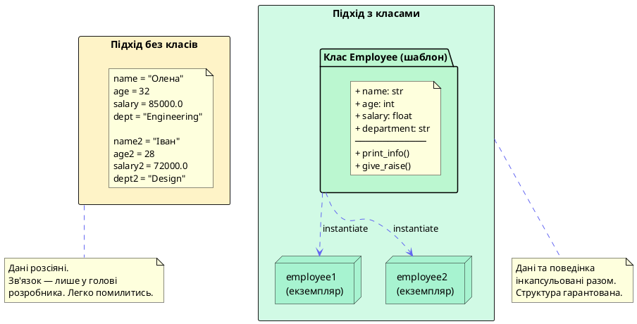
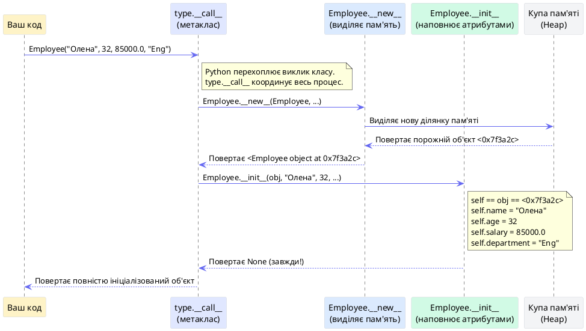
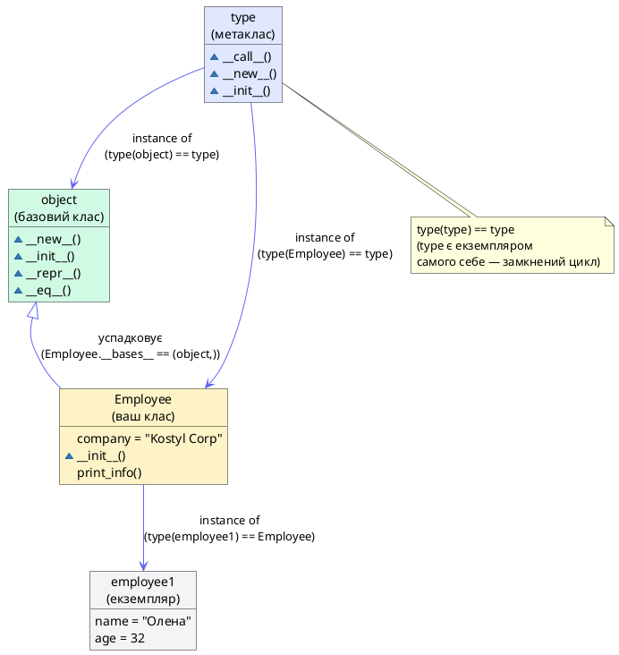
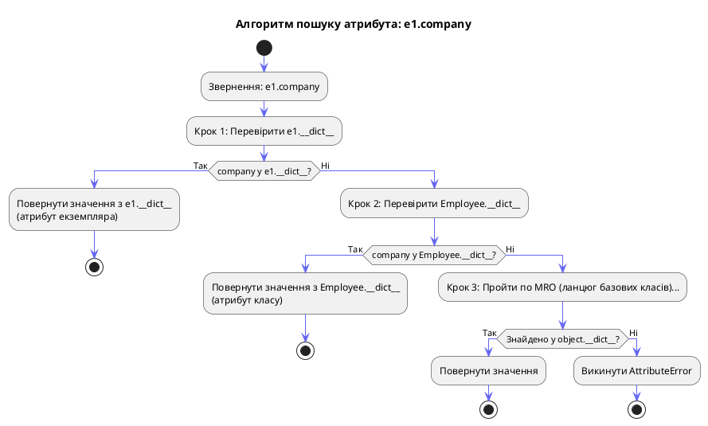
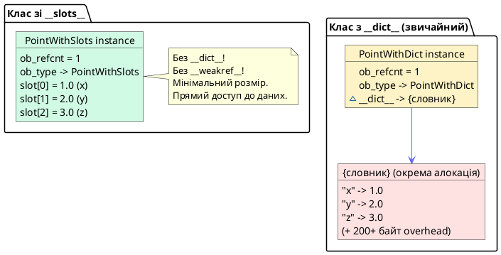

# Класи та Об'єкти

## Базова термінологія: атрибути, методи та магічні імена

Перш ніж розглядати класи та об'єкти, необхідно зафіксувати три фундаментальні поняття, що використовуватимуться протягом усього курсу. Їхнє нечітке розуміння є джерелом найбільшої плутанини у початківців.

### Атрибути: дані об'єкта

**Атрибут** — це іменована змінна, що прив'язана до конкретного об'єкта. Доступ до атрибута здійснюється через **оператор крапки** (`.`). У Python *будь-яка* прив'язка імені до значення через крапку є атрибутом — будь то число, рядок, список, функція чи інший об'єкт.

```python
class Point:
    x = 0.0   # атрибут класу
    y = 0.0   # атрибут класу

p = Point()
p.x = 3.14   # атрибут екземпляра (зберігається у p.__dict__)
p.label = "origin"  # атрибут екземпляра (доданий динамічно!)

print(p.x)       # 3.14  — читання атрибута
print(p.label)   # "origin"
print(Point.x)   # 0.0   — атрибут класу незмінний
```

На відміну від Java чи C#, де перелік полів є фіксованим і визначеним у класі, Python дозволяє **додавати атрибути до будь-якого об'єкта у будь-який момент** — для цього досить просто присвоїти значення через крапку. Саме цю динамічну природу забезпечує словник `__dict__`, про який йтиметься далі.

### Методи: поведінка об'єкта

**Метод** — це функція, оголошена всередині класу, що описує *поведінку* об'єктів цього класу. Ключова відмінність методу від звичайної функції: при виклику через екземпляр перший аргумент (`self`) підставляється автоматично — він містить посилання на сам об'єкт, що дозволяє методу отримувати доступ до атрибутів екземпляра та змінювати їх.

```python
class Circle:
    def __init__(self, radius: float):  # метод-ініціалізатор
        self.radius = radius            # атрибут екземпляра

    def area(self) -> float:            # метод екземпляра
        return 3.14159 * self.radius ** 2

    def scale(self, factor: float) -> None:  # метод, що змінює стан
        self.radius *= factor

c = Circle(5.0)
print(c.area())   # 78.53...  — виклик методу
c.scale(2)        # radius стає 10.0
print(c.area())   # 314.15...
```

::field-group

::field{name="Атрибут екземпляра" type="будь-який тип"}
Прив'язаний до конкретного об'єкта. Зберігається у `instance.__dict__`. Кожен екземпляр має власну копію. Найчастіше ініціалізується у `__init__` через `self.name = value`.
::

::field{name="Атрибут класу" type="будь-який тип"}
Прив'язаний до самого класу, спільний для всіх екземплярів. Зберігається у `ClassName.__dict__`. Оголошується безпосередньо у тілі класу, поза методами.
::

::field{name="Метод екземпляра" type="function → method"}
Функція, оголошена у класі, перший аргумент якої — `self`. При зверненні через екземпляр автоматично перетворюється на зв'язаний метод (bound method), де `self` вже підставлений.
::

::

### Dunder-імена: `__X__` — мова Python з самим собою

**Dunder** (від *double underscore* — «подвійне підкреслення») — це угода про іменування спеціальних атрибутів і методів, що має форму `__назва__`. Такі імена не є ключовими словами мови, але вони є **частиною офіційного протоколу Python**: інтерпретатор автоматично викликає їх у визначених ситуаціях.

Ідея полягає в тому, щоб надати розробникам можливість **перевизначити вбудовану поведінку** для своїх класів, залишивши синтаксис Python незмінним:

```python
class Vector:
    def __init__(self, x, y):        # викликається при Vector(x, y)
        self.x = x
        self.y = y

    def __repr__(self):              # викликається при print(v) або repr(v)
        return f"Vector({self.x}, {self.y})"

    def __add__(self, other):        # викликається при v1 + v2
        return Vector(self.x + other.x, self.y + other.y)

    def __len__(self):               # викликається при len(v)
        return 2

v1 = Vector(1, 2)
v2 = Vector(3, 4)

print(v1)        # Vector(1, 2)       — через __repr__
print(v1 + v2)   # Vector(4, 6)       — через __add__
print(len(v1))   # 2                  — через __len__
```

::note
**Чому саме подвійне підкреслення?** Це захисний механізм від випадкових конфліктів імен. Якби спеціальний метод називався просто `repr` або `add`, будь-яке поле або метод користувача з таким іменем зламав би вбудовану поведінку. Подвійне підкреслення з обох боків робить такий конфлікт практично неможливим. Не варто вигадувати власні `__custom__` — ця конвенція зарезервована за Python.
::

Dunder-методи охоплюють майже всі операції, що ви виконуєте з об'єктами:

| Ситуація | Dunder-метод | Приклад виклику |
| --- | --- | --- |
| Створення об'єкта | `__new__` | `MyClass(...)` |
| Ініціалізація | `__init__` | `MyClass(...)` |
| Рядкове представлення | `__repr__`, `__str__` | `print(obj)`, `repr(obj)` |
| Арифметика | `__add__`, `__mul__`, ... | `obj + other` |
| Порівняння | `__eq__`, `__lt__`, ... | `obj == other` |
| Довжина | `__len__` | `len(obj)` |
| Ітерація | `__iter__`, `__next__` | `for x in obj` |
| Контекстний менеджер | `__enter__`, `__exit__` | `with obj as x` |
| Знищення об'єкта | `__del__` | (автоматично GC) |

Ці методи детально розглядаються у наступних статтях курсу в контексті їхнього практичного застосування.

---

## Проблема неструктурованих даних: мотивація до класів

Уявіть задачу, з якою стикається кожна команда розробників на початку проекту: необхідність змоделювати реальний світ у програмному коді. Розглянемо конкретний приклад — систему обліку співробітників. Перший, інтуїтивний підхід виглядає так:

```python
# Підхід без класів: кожен атрибут — окрема змінна
employee_name = "Олена Ковальчук"
employee_age = 32
employee_salary = 85000.0
employee_department = "Engineering"

# Функція для виведення інформації
def print_employee_info(name, age, salary, department):
    print(f"Ім'я: {name}, Вік: {age}, Відділ: {department}")
    print(f"Зарплата: {salary:.2f} грн")

print_employee_info(employee_name, employee_age, employee_salary, employee_department)
```

На перший погляд, цей код виглядає цілком прийнятно. Але варто нам спробувати розширити систему до реального масштабу — скажімо, до 500 співробітників — як негайно проявляються три фундаментальні проблеми.

**Перша проблема: зв'язаність даних.** Чотири змінні `employee_name`, `employee_age`, `employee_salary` та `employee_department` є логічно пов'язаними — вони описують один і той самий об'єкт реального світу. Проте в коді вони є незалежними сутностями. Ніщо не заважає випадково передати `employee_name` другого співробітника разом із `employee_salary` першого. Компілятор чи інтерпретатор не побачить жодної помилки.

**Друга проблема: масштабування.** При 500 співробітниках вам доведеться або мати 2000 окремих змінних (і щасти їх не переплутати), або використовувати паралельні списки — `names[i]`, `ages[i]`, `salaries[i]` — що є антипатерном, відомим як «паралельні масиви».

**Третя проблема: поведінка.** Функція `print_employee_info` концептуально належить до співробітника — вона оперує його даними. Проте в цьому підході зв'язок між даними та операціями над ними існує лише в голові розробника, але не в архітектурі коду.

Саме ці три проблеми вирішує **об'єктно-орієнтоване програмування** через концепцію **класу** — шаблону, що об'єднує дані (атрибути) та поведінку (методи) в одну зв'язану сутність.

::plant-uml



::

---

## Анатомія класу у Python

### Оголошення класу та перший екземпляр

Клас оголошується за допомогою ключового слова `class`, за яким слідує ім'я класу (за угодою — у форматі `PascalCase`) та двокрапка:

```python
class Employee:
    """Клас для представлення співробітника компанії."""

    # Атрибут класу — спільний для всіх екземплярів
    company_name = "Kostyl Corp"

    def __init__(self, name: str, age: int, salary: float, department: str):
        # Атрибути екземпляра — унікальні для кожного об'єкта
        self.name = name
        self.age = age
        self.salary = salary
        self.department = department

    def print_info(self) -> None:
        """Виводить інформацію про співробітника."""
        print(f"[{self.company_name}] {self.name}, {self.age} р., {self.department}")
        print(f"  Зарплата: {self.salary:,.0f} грн")

    def give_raise(self, percent: float) -> None:
        """Підвищує зарплату на вказаний відсоток."""
        self.salary *= (1 + percent / 100)
        print(f"  Нова зарплата {self.name}: {self.salary:,.0f} грн")


# Створення екземплярів
employee1 = Employee("Олена Ковальчук", 32, 85000.0, "Engineering")
employee2 = Employee("Іван Мельник", 28, 72000.0, "Design")

employee1.print_info()
employee2.print_info()
employee1.give_raise(15)
```

::terminal-preview{title="Виконання Employee"}

<div class="line"><span class="opacity-40">$</span> <strong>python employee.py</strong></div>
<div class="line"><span class="text-blue-400">[Kostyl Corp]</span> Олена Ковальчук, 32 р., Engineering</div>
<div class="line">  Зарплата: <span class="text-green-400">85,000</span> грн</div>
<div class="line"><span class="text-blue-400">[Kostyl Corp]</span> Іван Мельник, 28 р., Design</div>
<div class="line">  Зарплата: <span class="text-green-400">72,000</span> грн</div>
<div class="line">  Нова зарплата Олена Ковальчук: <span class="text-green-400">97,750</span> грн</div>

::

Зверніть увагу на кілька ключових елементів синтаксису, кожен з яких несе важливе семантичне навантаження.

### Метод `__init__`: ініціалізація, а не створення

Метод `__init__` — це, мабуть, перше, що вивчає кожен розробник Python. Проте його назва та роль часто сприймаються хибно. Метод `__init__` **не є конструктором** у класичному розумінні цього терміна. Він не *створює* об'єкт — він лише *ініціалізує* вже створений об'єкт, наповнюючи його атрибутами.

Справжнє створення об'єкта відбувається у методі `__new__`, про що детально йтиметься далі. Поки ж закріпимо фундаментальне розмежування:

::card-group

::card{title="__new__: Творець" icon="i-heroicons-cube"}

- Викликається **першим** при зверненні до `Employee(...)`
- Приймає клас (`cls`) як перший аргумент
- **Виділяє пам'ять** та повертає новий порожній об'єкт
- Рідко перевизначається у звичайному коді

::

::card{title="__init__: Ініціалізатор" icon="i-heroicons-wrench-screwdriver"}

- Викликається **другим**, одразу після `__new__`
- Приймає вже створений об'єкт (`self`) як перший аргумент
- **Заповнює атрибутами** вже існуючий об'єкт
- Перевизначається майже у кожному класі

::

::


---

## Під капотом CPython: що відбувається при виклику `Employee(...)`

### Повна послідовність створення об'єкта

Кожен раз, коли ви пишете `employee1 = Employee("Олена", 32, 85000.0, "Engineering")`, Python виконує не один, а цілу серію кроків, більшість з яких прихована від очей розробника. Розглянемо цей процес детально.

::plant-uml



::

Ця послідовність розкриває кілька нетривіальних деталей реалізації Python, що мають практичне значення.

**Метод `__new__` завжди отримує клас, а не екземпляр.** Це принципово відрізняє його від `__init__`. Оскільки в момент виклику `__new__` екземпляр ще не існує, передати його неможливо. Натомість передається сам клас (за конвенцією — `cls`), щоб `__new__` знав, об'єкт якого саме типу потрібно створити.

**Метод `__init__` завжди повертає `None`.** Це жорстка вимога Python. Якщо ваш `__init__` поверне будь-яке інше значення, інтерпретатор видасть помилку `TypeError: __init__() should return None`. Ця вимога є наслідком того, що реально `Employee(...)` повертає значення з `__new__`, а не з `__init__`.

**Оркестратором усього процесу є `type.__call__`.** Саме цей метод метакласу вирішує, в якому порядку та з якими аргументами викликати `__new__` та `__init__`. Метакласи розглядаються у окремій статті цього курсу.

### Три кити системи типів Python: `cls`, `type` та `object`

Перш ніж заглиблюватися у практичні сценарії `__new__`, необхідно чітко визначити три сутності, що постійно зустрічатимуться у цій статті та всьому курсі. Їх часто згадують побіжно, що породжує плутанину.

#### Конвенція `cls`: «я» для методів класу

У методах екземпляра перший аргумент традиційно іменується `self` і містить посилання на конкретний об'єкт. Однак `__new__` — це не метод екземпляра, а **метод класу**: він викликається на самому класі ще до того, як будь-який екземпляр існує. Тому його перший аргумент — це сам клас, і за усталеною конвенцією він іменується `cls` (скорочення від «class»).

```python
class Animal:
    def __new__(cls):          # cls == Animal (сам клас, не екземпляр!)
        print(f"__new__: cls = {cls}")
        print(f"__new__: cls is Animal = {cls is Animal}")
        return super().__new__(cls)  # Передаємо cls далі — object.__new__ знатиме, який об'єкт створити

    def __init__(self):        # self — вже готовий об'єкт типу Animal
        print(f"__init__: self = {self}")
        print(f"__init__: type(self) = {type(self)}")

a = Animal()
```

::terminal-preview{title="cls vs self: різниця наочно"}

<div class="line"><span class="opacity-40">$</span> <strong>python animal.py</strong></div>
<div class="line">__new__: cls = <span class="text-blue-400">&lt;class '__main__.Animal'&gt;</span></div>
<div class="line">__new__: cls is Animal = <span class="text-green-400">True</span></div>
<div class="line">__init__: self = <span class="text-yellow-400">&lt;__main__.Animal object at 0x7f...&gt;</span></div>
<div class="line">__init__: type(self) = <span class="text-blue-400">&lt;class '__main__.Animal'&gt;</span></div>

::

`cls`, як і `self`, є **лише конвенцією**, а не ключовим словом. Технічно перший аргумент `__new__` можна назвати як завгодно. Проте відступ від цієї конвенції вважається грубим порушенням стилю Python-коду. Важливо розуміти: коли при спадкуванні дочірній клас викликає `Animal.__new__`, аргумент `cls` буде вказувати на дочірній клас, а не на `Animal` — саме тому `cls` є критично важливим для коректного поліморфного створення об'єктів.

#### Базовий клас `object`: прабатько всіх класів

У Python **кожен клас** — явно чи неявно — успадковується від вбудованого класу `object`. Це є фундаментом єдиної ієрархії типів (unified type hierarchy), введеної у Python 2.2 і остаточно закріпленої у Python 3, де «класи старого стилю» (old-style classes) були повністю скасовані.

```python
class MyClass:      # Те саме, що class MyClass(object):
    pass

print(MyClass.__bases__)    # (<class 'object'>,)
print(MyClass.__mro__)      # (<class 'MyClass'>, <class 'object'>)
print(issubclass(MyClass, object))  # True — завжди!
print(issubclass(int, object))      # True
print(issubclass(str, object))      # True
```

Клас `object` надає всім об'єктам Python базовий набір поведінки «за замовчуванням» — реалізацію dunder-методів, без яких жоден об'єкт не міг би існувати у мові:

::field-group

::field{name="object.__new__(cls)" type="classmethod"}
Базова реалізація виділення пам'яті. Саме її ми викликаємо через `super().__new__(cls)` у своїх перевизначеннях — це і є реальний акт народження об'єкта на рівні CPython (виклик `tp_alloc` у C-коді).
::

::field{name="object.__init__(self)" type="method"}
Порожня реалізація, що нічого не робить. Гарантує, що виклик `super().__init__()` завжди є безпечним у будь-якому місці ієрархії класів.
::

::field{name="object.__repr__(self)" type="method"}
Повертає рядок виду `<__main__.MyClass object at 0x7f3a2c>` — адресу об'єкта у пам'яті. Саме цей рядок ви бачите у REPL, якщо не перевизначили `__repr__` у своєму класі.
::

::field{name="object.__eq__(self, other)" type="method"}
За замовчуванням порівнює об'єкти **за ідентичністю** (тобто `is`), а не за значенням. Тому два різних екземпляри вашого класу з однаковими даними не будуть рівними, поки ви не перевизначите `__eq__`.
::

::

#### Метаклас `type`: клас, що створює класи

Якщо `object` є базою для всіх **екземплярів**, то `type` є основою для всіх **класів**. Метаклас — це клас, екземплярами якого є самі класи. Коли Python зустрічає оголошення `class Employee: ...`, він фактично виконує `Employee = type('Employee', (object,), {...})`.

```python
# Ці два записи — еквівалентні:

# Варіант 1: звичайне оголошення класу
class Point:
    def __init__(self, x, y):
        self.x = x
        self.y = y

# Варіант 2: динамічне створення через type() напряму
Point2 = type('Point2', (object,), {
    '__init__': lambda self, x, y: setattr(self, 'x', x) or setattr(self, 'y', y)
})

p1 = Point(1, 2)
p2 = Point2(3, 4)
print(type(p1))   # <class '__main__.Point'>
print(type(p2))   # <class '__main__.Point2'>
print(type(Point))   # <class 'type'>  ← клас — це екземпляр type
print(type(type))    # <class 'type'>  ← type є екземпляром самого себе
```

::plant-uml



::

::note
**Навіщо знати про `type` зараз?** У повсякденному коді ви рідко працюєте з `type` напряму. Але розуміння того, що виклик `Employee(...)` насправді є викликом `type.__call__(Employee, ...)`, пояснює, чому `__new__` і `__init__` викликаються саме у такому порядку і чому `cls` — це не просто «ще один self». Детальний розбір метакласів та їхнього практичного застосування (реєстрація плагінів, ORM-поля, автоматична валідація) розглядається у статті «Метакласи».
::

### Заглиблення в `__new__`: коли і навіщо його перевизначати

У абсолютній більшості випадків `__new__` залишають без змін — Python автоматично використовує реалізацію з базового класу `object`. Проте є кілька специфічних сценаріїв, де перевизначення `__new__` стає незамінним.

**Сценарій 1: Реалізація патерну Singleton.** Singleton — це патерн проектування, що гарантує існування лише одного екземпляра класу протягом усього часу роботи програми. Класичний приклад — з'єднання з базою даних або конфігурація застосунку:

```python
class DatabaseConnection:
    """
    Singleton: клас, що гарантує єдине з'єднання з БД.
    Перевизначення __new__ контролює сам акт створення.
    """
    _instance = None  # Атрибут класу для зберігання єдиного екземпляра

    def __new__(cls, *args, **kwargs):
        if cls._instance is None:
            print(f"[__new__] Створення нового екземпляра {cls.__name__}")
            cls._instance = super().__new__(cls)
        else:
            print(f"[__new__] Повернення існуючого екземпляра (Singleton)")
        return cls._instance

    def __init__(self, host: str, port: int):
        if not hasattr(self, '_initialized'):
            print(f"[__init__] Ініціалізація з'єднання: {host}:{port}")
            self.host = host
            self.port = port
            self._initialized = True
        else:
            print(f"[__init__] Екземпляр вже ініціалізовано, пропуск")


conn1 = DatabaseConnection("localhost", 5432)
conn2 = DatabaseConnection("prod-server", 5432)

print(f"\nВсі об'єкти однакові? {conn1 is conn2}")
print(f"conn1.host = {conn1.host}")
print(f"conn2.host = {conn2.host}")  # Теж "localhost"!
```

::terminal-preview{title="Singleton через __new__"}

<div class="line"><span class="opacity-40">$</span> <strong>python singleton.py</strong></div>
<div class="line"><span class="text-blue-400">[__new__]</span> Створення нового екземпляра DatabaseConnection</div>
<div class="line"><span class="text-green-400">[__init__]</span> Ініціалізація з'єднання: localhost:5432</div>
<div class="line"><span class="text-yellow-400">[__new__]</span> Повернення існуючого екземпляра (Singleton)</div>
<div class="line"><span class="text-yellow-400">[__init__]</span> Екземпляр вже ініціалізовано, пропуск</div>
<div class="line"></div>
<div class="line">Всі об'єкти однакові? <span class="text-green-400">True</span></div>
<div class="line">conn2.host = <span class="text-blue-400">localhost</span> <span class="text-gray-400"># не "prod-server"!</span></div>

::

::warning
**Singleton та повторний виклик `__init__`.** Метод `__init__` викликається щоразу при `DatabaseConnection(...)`, навіть якщо `__new__` повернув існуючий екземпляр. Без перевірки `hasattr(self, '_initialized')` кожен наступний виклик перезаписував би атрибути `host` та `port`.
::

**Сценарій 2: Незмінні (immutable) типи.** Вбудовані типи `int`, `str`, `tuple` є незмінними. Оскільки `__init__` викликається *після* того, як об'єкт вже існує, він не може визначити *значення* незмінного типу — лише `__new__` може це зробити:

```python
class PositiveInt(int):
    """Цілочисельний тип, що гарантовано є позитивним."""

    def __new__(cls, value: int):
        if value <= 0:
            raise ValueError(
                f"PositiveInt вимагає значення > 0, отримано: {value}"
            )
        return super().__new__(cls, value)


n = PositiveInt(42)
print(n + 8)    # 50 — поводиться як звичайний int

try:
    bad = PositiveInt(-5)
except ValueError as e:
    print(f"Помилка: {e}")
```

::terminal-preview{title="PositiveInt: незмінний підтип int"}

<div class="line"><span class="opacity-40">$</span> <strong>python positive_int.py</strong></div>
<div class="line"><span class="text-green-400">50</span></div>
<div class="line">Помилка: <span class="text-rose-400">PositiveInt вимагає значення > 0, отримано: -5</span></div>

::


---

## Природа `self`: чому Python вимагає явного першого аргументу

Розробники, що мають досвід роботи з Java чи C++, нерідко дивуються: чому Python змушує явно вказувати `self` у кожному методі? Адже в Java `this` є ключовим словом і не вимагається у сигнатурі методу. Відповідь криється у самій архітектурі Python та концепції **дескрипторів**.

### Зв'язані та незв'язані методи

У Python функції, оголошені всередині класу, є звичайними об'єктами-функціями (функція є об'єктом першого класу). Вони зберігаються у `__dict__` класу так само, як і будь-який інший атрибут. Але коли ви звертаєтеся до методу через екземпляр, Python виконує особливе перетворення:

```python
class Counter:
    def __init__(self, start: int = 0):
        self.value = start

    def increment(self, by: int = 1) -> None:
        self.value += by

    def reset(self) -> None:
        self.value = 0


c = Counter(10)

# Два способи звернення до одного і того ж методу:
print(type(Counter.increment))  # <class 'function'>
print(type(c.increment))        # <class 'method'>

# Незв'язаний метод (через клас) — потрібно передати self вручну
Counter.increment(c, by=5)
print(c.value)  # 15

# Зв'язаний метод (через екземпляр) — self підставляється автоматично
c.increment(by=3)
print(c.value)  # 18
```

::terminal-preview{title="Зв'язані та незв'язані методи"}

<div class="line"><span class="opacity-40">$</span> <strong>python methods.py</strong></div>
<div class="line">type(Counter.increment) = <span class="text-blue-400">&lt;class 'function'&gt;</span></div>
<div class="line">type(c.increment) = <span class="text-green-400">&lt;class 'method'&gt;</span></div>
<div class="line">c.value після Counter.increment(c, 5): <span class="text-yellow-400">15</span></div>
<div class="line">c.value після c.increment(3): <span class="text-yellow-400">18</span></div>

::

Коли ви пишете `c.increment(by=3)`, Python за лаштунками виконує `Counter.increment(c, by=3)`. Механізм, що відповідає за це перетворення — протокол **дескрипторів** (detально розглянутий у статті «Дескриптори»). Фактично, функції у Python є **нон-дата дескрипторами**: при зверненні через екземпляр вони повертають об'єкт `method`, що «запам'ятав» екземпляр і автоматично підставляє його як перший аргумент.

::tip
**`self` — це лише конвенція, а не ключове слово.** Технічно першому аргументу методу можна дати будь-яке ім'я: `this`, `me`, `instance`, `s`. Проте PEP 8 та весь Python-екосистема жорстко дотримуються конвенції `self`, і відхилення від неї є грубим порушенням стилю, яке відразу привертає увагу рецензентів коду.
::

### Схема пошуку атрибутів: клас vs екземпляр

Розуміння того, де саме Python шукає атрибут — в екземплярі чи в класі — є ключовим для усунення цілого класу помилок. Розглянемо конкретну ієрархію пошуку на прикладі:

```python
class Employee:
    # Атрибут КЛАСУ: спільний для всіх екземплярів
    company = "Kostyl Corp"
    headcount = 0

    def __init__(self, name: str):
        # Атрибут ЕКЗЕМПЛЯРА: унікальний для кожного об'єкта
        self.name = name
        Employee.headcount += 1  # Змінюємо атрибут класу!


e1 = Employee("Олена")
e2 = Employee("Іван")

# Атрибут класу доступний через екземпляр...
print(e1.company)      # "Kostyl Corp"
print(e2.company)      # "Kostyl Corp"

# ...але є СПІЛЬНИМ і відображає зміни для всіх:
print(Employee.headcount)  # 2
print(e1.headcount)        # 2

# Небезпечна помилка: "тіньовий" атрибут екземпляра
e1.company = "Individual Ltd"   # Створює НОВИЙ атрибут ЕКЗЕМПЛЯРА e1!
print(e1.company)               # "Individual Ltd"  — атрибут екземпляра
print(e2.company)               # "Kostyl Corp"     — атрибут класу (незмінний)
print(Employee.company)         # "Kostyl Corp"     — атрибут класу (незмінний)
```

Присвоєння `e1.company = "Individual Ltd"` **не змінює** атрибут класу. Воно створює новий атрибут `company` безпосередньо у `__dict__` екземпляра `e1`. Надалі при зверненні `e1.company` Python знайде цей атрибут в екземплярі раніше, ніж дійде до атрибуту класу. Це явище називається **«затінення» (shadowing)** і є поширеною причиною важко відловлюваних помилок.

::plant-uml



::

::field-group

::field{name="__dict__ екземпляра" type="dict"}
Словник, що зберігає атрибути, унікальні для конкретного екземпляра. Заповнюється у `__init__` через присвоєння `self.attr = value`. Перевіряється **першим** при пошуку атрибута.
::

::field{name="__dict__ класу" type="mappingproxy"}
Словник, що зберігає атрибути, спільні для всіх екземплярів: методи, атрибути класу, `__doc__`. Доступний через `ClassName.__dict__`. Перевіряється **після** `__dict__` екземпляра.
::

::field{name="MRO (Method Resolution Order)" type="tuple[type, ...]"}
Впорядкована послідовність класів для пошуку атрибутів при спадкуванні. Доступна через `ClassName.__mro__`. Детально розглядається у статті «Спадкування та MRO».
::

::


---

## Оптимізація пам'яті: `__slots__`

### Проблема масштабу: мільйон об'єктів

У типовій production-системі кількість екземплярів одного класу може вимірюватися мільйонами. Ігровий рушій, що зберігає частинки, фінансова система з тиками біржових котирувань, обробник мережевих пакетів — усі вони стикаються з задачею ефективного зберігання великої кількості однотипних об'єктів.

За замовчуванням кожен екземпляр Python-класу несе значний накладний тягар. Причина — той самий `__dict__`, що забезпечує динамічну природу Python: можливість додавати нові атрибути до будь-якого об'єкта у будь-який момент.

```python
import sys
import tracemalloc

class PointWithDict:
    """Звичайний клас — кожен екземпляр має __dict__."""
    def __init__(self, x: float, y: float, z: float):
        self.x = x
        self.y = y
        self.z = z


class PointWithSlots:
    """Клас зі __slots__ — без __dict__, фіксовані атрибути."""
    __slots__ = ('x', 'y', 'z')

    def __init__(self, x: float, y: float, z: float):
        self.x = x
        self.y = y
        self.z = z


# Вимірюємо розмір одного екземпляра
p_dict = PointWithDict(1.0, 2.0, 3.0)
p_slots = PointWithSlots(1.0, 2.0, 3.0)

print(f"Розмір з __dict__:  {sys.getsizeof(p_dict)} байтів")
print(f"Розмір зі __slots__: {sys.getsizeof(p_slots)} байтів")
print(f"Розмір __dict__:    {sys.getsizeof(p_dict.__dict__)} байтів")

# Вимірюємо пам'ять для 1 000 000 екземплярів
tracemalloc.start()
points_dict = [PointWithDict(i, i*2, i*3) for i in range(1_000_000)]
_, peak_dict = tracemalloc.get_traced_memory()
tracemalloc.stop()

tracemalloc.start()
points_slots = [PointWithSlots(i, i*2, i*3) for i in range(1_000_000)]
_, peak_slots = tracemalloc.get_traced_memory()
tracemalloc.stop()

print(f"\n1 000 000 екземплярів:")
print(f"  з __dict__:  {peak_dict / 1024 / 1024:.1f} МБ")
print(f"  зі __slots__: {peak_slots / 1024 / 1024:.1f} МБ")
print(f"  Економія: {(1 - peak_slots/peak_dict)*100:.0f}%")
```

::terminal-preview{title="Порівняння пам'яті: __dict__ vs __slots__"}

<div class="line"><span class="opacity-40">$</span> <strong>python memory_benchmark.py</strong></div>
<div class="line">Розмір з __dict__:  <span class="text-rose-400">48 байтів</span> (сам об'єкт)</div>
<div class="line">Розмір зі __slots__: <span class="text-green-400">56 байтів</span> (дескриптори включені)</div>
<div class="line">Розмір __dict__:    <span class="text-rose-400">232 байтів</span> (порожній словник!)</div>
<div class="line"></div>
<div class="line">1 000 000 екземплярів:</div>
<div class="line">  з __dict__:   <span class="text-rose-400">~220.5 МБ</span></div>
<div class="line">  зі __slots__:  <span class="text-green-400">~56.0 МБ</span></div>
<div class="line">  Економія: <span class="text-green-400">~75%</span></div>

::

Результати наочно ілюструють фундаментальний компроміс: **динамічність коштує пам'яті**. Кожен порожній `dict` займає щонайменше 232 байти на 64-бітній системі — і це до того, як у нього додано хоч один ключ.

### Механізм роботи `__slots__`

При оголошенні `__slots__ = ('x', 'y', 'z')` Python замість `__dict__` створює для кожного атрибута окремий **дескриптор** на рівні класу — спеціальний об'єкт, що напряму контролює доступ до фіксованого слоту пам'яті в екземплярі. Фактично, атрибути екземпляра перетворюються на щось більш подібне до полів у C-структурах: фіксовані зміщення у блоці пам'яті об'єкта.

::plant-uml



::

### Обмеження та підводні камені `__slots__`

Незважаючи на значну перевагу у споживанні пам'яті, `__slots__` вносить низку обмежень, ігнорування яких призводить до неочевидних помилок.

**Обмеження 1: Неможливо додати нові атрибути динамічно.** Однією з «суперсил» Python є можливість додавати атрибути до будь-якого об'єкта у runtime. Зі `__slots__` ця можливість зникає:

```python
p = PointWithSlots(1.0, 2.0, 3.0)
p.w = 4.0  # AttributeError: 'PointWithSlots' object has no attribute 'w'
```

**Обмеження 2: Потрібно оголосити `__slots__` у КОЖНОМУ класі ієрархії.** Якщо батьківський клас не має `__slots__`, дочірній клас все одно матиме `__dict__` — від батька. Весь ефект оптимізації втрачається:

```python
class Base:
    # Немає __slots__ → Base має __dict__
    pass

class Child(Base):
    __slots__ = ('x', 'y')
    # Child також матиме __dict__ (успадкований від Base)!
    # Оголошення __slots__ тут марне з точки зору економії пам'яті.
```

**Обмеження 3: Складнощі з множинним спадкуванням.** Якщо два батьківські класи мають непорожні `__slots__`, їхнє поєднання вимагає ретельного проектування.

::tip
**Правило застосування `__slots__`.** Використовуйте `__slots__` виключно у двох сценаріях: (1) клас є «value object» або структурою даних (Data Transfer Object), що не планується розширювати динамічно; (2) система обробляє велику кількість (від 100 000+) однотипних екземплярів, і профайлер підтвердив, що пам'ять є вузьким місцем. У всіх інших випадках краща читабельність та передбачуваність звичайного підходу переважає маргінальну економію пам'яті.
::


---

## Клас як об'єкт: що Python думає про ваш `class`

Один з найбільш парадоксальних фактів Python: **клас сам є об'єктом**. Це не метафора — в Python клас є повноцінним об'єктом типу `type`. Ця особливість є наслідком єдиної системи типів та відкриває двері до метапрограмування.

```python
class Employee:
    company = "Kostyl Corp"

    def __init__(self, name: str):
        self.name = name


# Клас є об'єктом типу type
print(type(Employee))          # <class 'type'>
print(type(42))                # <class 'int'>
print(type("hello"))           # <class 'str'>

# type — це метаклас: клас, що створює класи
print(type(type))              # <class 'type'>  (type є своїм власним типом!)

# У класу є свій __dict__, як і у будь-якого об'єкта
print(Employee.__dict__.keys())
# dict_keys(['__module__', '__dict__', '__weakref__', '__doc__', 'company', '__init__'])

# Атрибути класу можна читати та змінювати у runtime
print(Employee.company)        # "Kostyl Corp"
Employee.company = "New Corp"  # Змінюємо для ВСІХ екземплярів!
print(Employee.company)        # "New Corp"

# Методи — це просто функції в __dict__ класу
print(Employee.__dict__['__init__'])  # <function Employee.__init__ at 0x...>
```

::debugger-view{title="Клас Employee у пам'яті Python" :variables='[{"name": "Employee", "type": "type", "value": "<class __main__.Employee>"}, {"name": "type(Employee)", "type": "type", "value": "<class type>"}, {"name": "Employee.__dict__", "type": "mappingproxy", "value": "{company: Kostyl Corp, __init__: <function ...>}"}, {"name": "Employee.__mro__", "type": "tuple", "value": "(<class Employee>, <class object>)"}]'}
::

---

## Порівняльна таблиця: атрибути класу vs атрибути екземпляра

| Характеристика | Атрибут класу | Атрибут екземпляра |
| --- | --- | --- |
| **Де оголошується** | Безпосередньо в тілі класу | У методах через `self.attr = ...` |
| **Де зберігається** | `ClassName.__dict__` | `instance.__dict__` |
| **Спільність** | Спільний для ВСІХ екземплярів | Унікальний для кожного екземпляра |
| **Пріоритет пошуку** | Нижчий (перевіряється після екземпляра) | Вищий (перевіряється першим) |
| **Мутабельні типи** | ⚠️ Небезпечно (спільний список) | ✅ Безпечно |
| **Типове використання** | Константи, лічильники, конфігурація | Дані, що є унікальними для об'єкта |

::warning
**Найпоширеніша помилка з мутабельними атрибутами класу.** Ніколи не оголошуйте мутабельні об'єкти (списки, словники) як атрибути класу, якщо вони мали б бути унікальними для кожного екземпляра:

```python
class BrokenTeam:
    members = []  # ❌ ОДИН список для ВСІХ екземплярів!

    def add_member(self, name):
        self.members.append(name)

class CorrectTeam:
    def __init__(self):
        self.members = []  # ✅ Кожен екземпляр має ВЛАСНИЙ список

    def add_member(self, name):
        self.members.append(name)

t1 = BrokenTeam()
t2 = BrokenTeam()
t1.add_member("Олена")
print(t2.members)  # ["Олена"] — !!! t2 теж бачить члена t1
```
::

---

## Практичні завдання

### Рівень 1 — Базовий

Оголосіть клас `Rectangle` з атрибутами `width` та `height`. Додайте методи `area()`, `perimeter()` та `is_square()`. Створіть три різні прямокутники та виведіть їхні характеристики.

### Рівень 2 — Середній

Реалізуйте клас `BankAccount` для банківського рахунку:
- Атрибут класу `interest_rate = 0.05` (відсоток річних).
- Атрибути екземпляра: `owner`, `balance`, `_transaction_history`.
- Методи: `deposit(amount)`, `withdraw(amount)` (з перевіркою балансу), `apply_interest()`, `get_statement()` (виводить всі транзакції).
- Використайте `__slots__` для оптимізації, якщо клас планується масштабувати до мільйонів рахунків.

### Рівень 3 — Advanced

Реалізуйте `ConnectionPool` — пул з'єднань до бази даних. Клас має бути Singleton (через `__new__`), що зберігає фіксований пул з'єднань (наприклад, 5 штук, реалізованих як словники з `{'id': N, 'in_use': False}`). Методи: `acquire()` — повертає вільне з'єднання та позначає його як зайняте; `release(conn_id)` — звільняє з'єднання; `status()` — повертає кількість вільних/зайнятих з'єднань. Переконайтеся, що `acquire()` повертає `None`, якщо всі з'єднання зайняті.

---

## Резюме

Клас у Python — це значно більше, ніж простий шаблон для створення об'єктів. Він є повноцінним об'єктом типу `type`, що відкриває можливості для динамічного генерування та модифікації класів у runtime.

::card-group

::card{title="Інстанціювання" icon="i-heroicons-plus-circle"}

`type.__call__` оркеструє `__new__` (виділення пам'яті) та `__init__` (ініціалізацію). Перевизначення `__new__` дає контроль над самим актом створення об'єкта.

::

::card{title="Природа self" icon="i-heroicons-link"}

`self` — це не ключове слово, а перший аргумент методу. Функції в класі є нон-дата дескрипторами, що при зверненні через екземпляр повертають зв'язаний метод із підставленим `self`.

::

::card{title="Атрибути та __dict__" icon="i-heroicons-rectangle-stack"}

Пошук атрибута: `instance.__dict__` → `class.__dict__` → MRO. Присвоєння через `self.attr = val` завжди пише до `__dict__` екземпляра, ніколи — до класу.

::

::card{title="__slots__ та пам'ять" icon="i-heroicons-cpu-chip"}

`__slots__` замінює `__dict__` фіксованими C-рівневими дескрипторами, економлячи до 75% пам'яті при масовому створенні однотипних об'єктів. Ціна — втрата динамічності.

::

::

