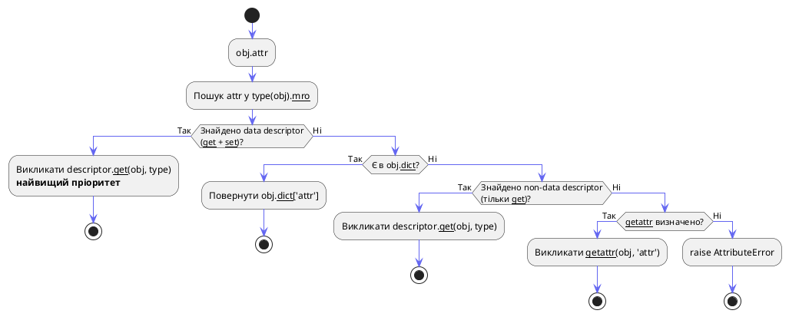
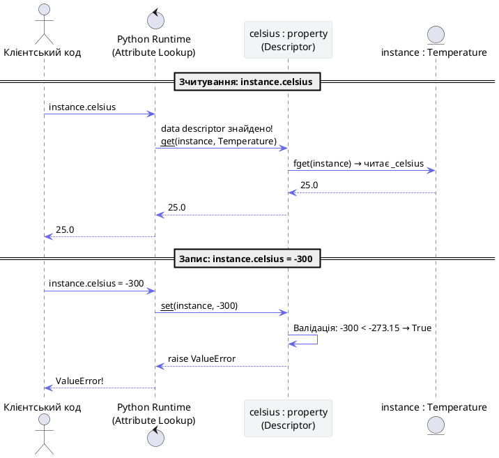
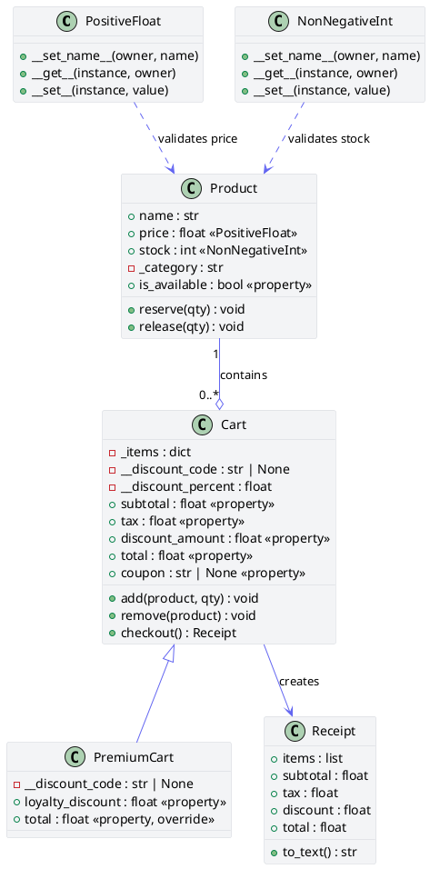

# Інкапсуляція та керування доступом

## Вступ: коли «відкритий» клас стає небезпечним

Уявіть банківський сервіс. Клас `Account` зберігає баланс у публічному атрибуті `balance`. Перший день у production:

```python
# ❌ Катастрофа в production
account = Account("Олена", 50_000.0)

# Хтось з команди вирішив «швидко» виправити баг:
account.balance = -999_999.0   # від'ємний баланс — фінансовий крах
account.balance = "заморожено"  # str замість float — AttributeError о 3 ночі

# Або підрядник отримав доступ до внутрішнього кешу:
account._cache["approved_limit"] = 10_000_000  # обхід перевірок!
```

Жодного з цих сценаріїв не було б, якби клас **контролював доступ до своїх даних**. Саме це і вирішує інкапсуляція.

::card-group

::card{title="Захист даних" icon="i-heroicons-shield-check"}
Публічний інтерфейс (методи та властивості) контролює всі зміни внутрішнього стану. Невалідні значення відхиляються до того, як вони потраплять у пам'ять.
::

::card{title="Стабільний API" icon="i-heroicons-arrow-path"}
Внутрішня реалізація може змінюватися — переїзд з `float` до `Decimal`, зміна структури кешу. Зовнішній код цього не відчує, бо взаємодіє лише через публічний інтерфейс.
::

::card{title="Менше зв'язності" icon="i-heroicons-link-slash"}
Коли код взаємодіє через чітко визначений API — зміна одного класу не ламає десятки інших. Зв'язність (coupling) мінімальна.
::

::card{title="Самодокументованість" icon="i-heroicons-document-text"}
Один погляд на публічний інтерфейс класу — і зрозуміло, що він вміє. Приватні деталі приховані і не захаращують API.
::

::

---

## Частина I: Філософія доступу в Python

### «Ми всі тут дорослі люди»

У C++, Java, C# компілятор фізично забороняє доступ до `private`-членів — код просто не скомпілюється. Python обрав інший шлях. Творець мови Гвідо ван Россум сформулював принцип:

> **«We are all consenting adults here»**
> *(«Ми всі тут дорослі люди, що діють за згодою»)*

Мова не ставить жорстких бар'єрів. Якщо розробник хоче залізти у внутрішні деталі класу — він може. Але відповідальність за зламаний код повністю на ньому. Замість заборон Python використовує **угоди про іменування (naming conventions)**.

::plant-uml

```plantuml
@startuml
skinparam style plain
skinparam backgroundColor #ffffff
skinparam ArrowColor #6366f1

package "Об'єкт класу (Екземпляр)" #f3f4f6 {
    rectangle "Внутрішній стан\n[_balance, __secret, _cache]\n(Деталі реалізації)" as Internal #fee2e2
    rectangle "Публічний інтерфейс (API)\n[deposit(), withdraw(), balance]" as Public #d1fae5

    Public -down-> Internal : "безпечно модифікує\nта зчитує"
}

actor "Зовнішній код" as Client

Client -right-> Public : "1. Викликає методи ✅"
Client --x Internal : "2. Прямий доступ ❌\n(порушення угоди)"
@enduml
```

::

---

## Частина II: Публічні, захищені та приватні атрибути

### `public` — за замовчуванням

Усі імена в класі без підкреслень є **публічними**. Вони є частиною стабільного публічного API і можуть змінюватись ззовні.

```python
class Point:
    def __init__(self, x: float, y: float):
        self.x = x  # публічний — змінювати можна і потрібно
        self.y = y  # публічний

p = Point(3.0, 4.0)
p.x = 10.0  # ✅ цілком нормально
```

### `_protected` — угода про внутрішнє використання

Один символ підкреслення перед іменем — **сигнал**: «це деталь реалізації, не призначена для прямого використання ззовні». Python це **не забороняє**, але весь інструментарій — IDE, linters, рецензенти коду — реагує на це попередженням.

```python
# bank_account.py

class BankAccount:
    def __init__(self, owner: str, initial_balance: float):
        self.owner = owner               # публічний ✅
        self._balance = initial_balance  # захищений — для внутрішнього використання
        self._transaction_log: list = [] # захищений — деталь реалізації

    def deposit(self, amount: float) -> None:
        if amount <= 0:
            raise ValueError("Сума депозиту має бути додатною")
        self._balance += amount
        self._transaction_log.append(f"+{amount}")

    def withdraw(self, amount: float) -> None:
        if amount > self._balance:
            raise ValueError("Недостатньо коштів")
        self._balance -= amount
        self._transaction_log.append(f"-{amount}")

    def get_balance(self) -> float:
        return self._balance
```

```python
account = BankAccount("Денис", 1000.0)

# ⚠️ Технічно працює, але порушує угоду!
print(account._balance)       # 1000.0 — IDE покаже попередження
account._balance = -9999.0    # Баланс зламано — без жодних перевірок!
```

::terminal-preview{title="pylint bank_account.py"}

<div class="line"><span class="opacity-40">$</span> <strong>pylint --disable=all --enable=W0212 main.py</strong></div>
<div class="line">main.py:8:6: <span class="text-yellow-400">W0212</span>: Access to a protected member _balance of a client class <span class="text-gray-400">(protected-access)</span></div>
<div class="line">main.py:9:0: <span class="text-yellow-400">W0212</span>: Access to a protected member _balance of a client class <span class="text-gray-400">(protected-access)</span></div>

::

::card-group

::card{title="Підтримка IDE" icon="i-heroicons-code-bracket-square"}
VS Code і PyCharm приховують `_protected` атрибути в автодоповненні або виділяють їх попередженням при зверненні ззовні класу.
::

::card{title="Статичні лінтери" icon="i-heroicons-shield-exclamation"}
`pylint` (W0212), `flake8-bugbear` та інші видають попередження при доступі до захищених членів ззовні їхньої ієрархії.
::

::card{title="Нестабільний API" icon="i-heroicons-arrow-path"}
Атрибут з `_` може бути перейменований або видалений у будь-якому мінорному релізі бібліотеки. Використовуючи його — ви приймаєте ризик поломки при оновленні.
::

::

---

### `__private` — Name Mangling

Два підкреслення перед іменем активують механізм **викривлення імен (Name Mangling)**. Компілятор Python автоматично перейменовує такий атрибут за шаблоном:

::math-formula
\_ClassName\_\_attribute
::

Це **не шифрування** і **не справжня приватність** — це лише захист від випадкових колізій імен.

```python
# secure_wallet.py

class SecureWallet:
    def __init__(self, owner: str, initial_funds: float):
        self.owner = owner
        self.__funds = initial_funds  # → _SecureWallet__funds у пам'яті

    def add_funds(self, amount: float) -> None:
        if amount > 0:
            self.__funds += amount

    def get_funds(self) -> float:
        return self.__funds


wallet = SecureWallet("Марія", 500.0)

# Прямий доступ — AttributeError
try:
    print(wallet.__funds)
except AttributeError as e:
    print(f"AttributeError: {e}")

# Досліджуємо __dict__ — бачимо викривлене ім'я
print(wallet.__dict__)

# Доступ через викривлене ім'я — все ще можливий!
print(wallet._SecureWallet__funds)
wallet._SecureWallet__funds = -1000.0
print(wallet.get_funds())
```

::terminal-preview{title="python secure_wallet.py"}

<div class="line"><span class="opacity-40">$</span> <strong>python secure_wallet.py</strong></div>
<div class="line">AttributeError: <span class="text-rose-400">'SecureWallet' object has no attribute '__funds'</span></div>
<div class="line">{'owner': <span class="text-green-400">'Марія'</span>, '<span class="text-yellow-400">_SecureWallet__funds</span>': <span class="text-green-400">500.0</span>}</div>
<div class="line"><span class="text-blue-400">500.0</span>  <span class="text-gray-400"># доступ через викривлене ім'я — все ще працює!</span></div>
<div class="line"><span class="text-rose-400">-1000.0</span>  <span class="text-gray-400"># успішно перезаписано через mangled name</span></div>

::

::warning
**Name Mangling — це не засіб безпеки.** Він не шифрує дані і не захищає їх у пам'яті. `wallet._SecureWallet__funds` є абсолютно легальним Python-кодом. Механізм призначений виключно для **запобігання випадковим колізіям імен** у ієрархіях наслідування, а не для захисту від навмисного злому.
::

---

### Справжнє призначення Name Mangling: захист від колізій при наслідуванні

Ось реальна проблема, яку вирішує подвійне підкреслення. Без Name Mangling підклас міг би випадково перезаписати внутрішній атрибут батьківського класу:

```python
# collision_demo.py

class BaseConnector:
    def __init__(self):
        self.__timeout = 30  # → _BaseConnector__timeout

    def connect(self):
        print(f"Базовий таймаут: {self.__timeout}с")


class CustomConnector(BaseConnector):
    def __init__(self):
        super().__init__()
        self.__timeout = 90  # → _CustomConnector__timeout (інше поле!)

    def show_custom(self):
        print(f"Кастомний таймаут: {self.__timeout}с")


conn = CustomConnector()
conn.connect()      # Базовий таймаут: 30с  ✅ НЕ перезаписано!
conn.show_custom()  # Кастомний таймаут: 90с ✅

# Два окремих поля у __dict__:
print(conn.__dict__)
# {'_BaseConnector__timeout': 30, '_CustomConnector__timeout': 90}
```

::terminal-preview{title="python collision_demo.py"}

<div class="line"><span class="opacity-40">$</span> <strong>python collision_demo.py</strong></div>
<div class="line">Базовий таймаут: <span class="text-green-400">30</span>с  <span class="text-gray-400"># НЕ перезаписано підкласом!</span></div>
<div class="line">Кастомний таймаут: <span class="text-blue-400">90</span>с</div>
<div class="line">{<span class="text-yellow-400">'_BaseConnector__timeout'</span>: 30, <span class="text-yellow-400">'_CustomConnector__timeout'</span>: 90}</div>

::

::tip
Використовуйте `__private` (подвійне підкреслення) **тільки** коли проектуєте базовий клас бібліотеки і хочете захистити критичні внутрішні атрибути від випадкового перезапису у підкласах. Для всіх інших ситуацій — `_protected` (одне підкреслення) є достатнім і кращим вибором.
::

---

### Порівняльна таблиця рівнів доступу

| Конвенція | Приклад | Значення | Доступ ззовні | Name Mangling |
|---|---|---|---|---|
| Без підкреслення | `self.name` | Публічний API | ✅ Заохочується | ❌ |
| Одне підкреслення | `self._balance` | Деталь реалізації | ⚠️ Угода (не заборонено) | ❌ |
| Два підкреслення | `self.__secret` | Захист від колізій | 🔒 Лише через `_Class__secret` | ✅ |
| Dunder | `self.__init__` | Магічний метод | ✅ Частина протоколу | ❌ (виняток) |

---

## Частина III: `@property` — Pythonic-шлях до валідації

### Проблема Java-style геттерів/сеттерів

Розробники, що прийшли з Java або C#, часто несуть звичку обгортати кожне поле парою `getX()` / `setX()`:

```python
# ❌ Антипатерн: Java-style у Python
class UnpythonicAccount:
    def __init__(self, balance: float):
        self._balance = balance

    def get_balance(self) -> float:       # зайвий шум
        return self._balance

    def set_balance(self, value: float):  # зайвий шум
        if value < 0:
            raise ValueError("Баланс не може бути від'ємним")
        self._balance = value

account = UnpythonicAccount(1000.0)
account.set_balance(account.get_balance() + 500)  # некрасиво!
```

**Pythonic-підхід:** починайте з простого публічного атрибута. Якщо пізніше знадобиться валідація — перетворіть його на `@property`. Зовнішній код при цьому **не потребує змін**:

```python
# ✅ Правильно: починаємо просто
class PythonicAccount:
    def __init__(self, balance: float):
        self.balance = balance  # просто публічний атрибут

# Якщо згодом потрібна валідація — перетворюємо на @property.
# account.balance = 1500 — цей зовнішній код НЕ ЗМІНИТЬСЯ!
```

---

### Декоратор `@property`: обчислювальні властивості (read-only)

`@property` перетворює метод на атрибут — зчитування відбувається без дужок `()`. За замовчуванням властивість є лише для читання.

```python
# circle.py
import math

class Circle:
    def __init__(self, radius: float):
        if radius <= 0:
            raise ValueError("Радіус має бути додатним")
        self.radius = radius

    @property
    def area(self) -> float:
        """Площа кола — обчислюється з radius при кожному зверненні."""
        return math.pi * self.radius ** 2

    @property
    def circumference(self) -> float:
        """Довжина кола."""
        return 2 * math.pi * self.radius

    @property
    def diameter(self) -> float:
        """Діаметр — обчислюється з radius."""
        return self.radius * 2


c = Circle(5.0)

# Звертаємось як до атрибута — БЕЗ дужок!
print(f"Площа:    {c.area:.4f}")
print(f"Периметр: {c.circumference:.4f}")
print(f"Діаметр:  {c.diameter:.4f}")

# Можна змінити radius — всі властивості автоматично оновляться
c.radius = 10.0
print(f"Нова площа: {c.area:.4f}")

# Спроба записати у read-only властивість:
try:
    c.area = 999.0
except AttributeError as e:
    print(f"AttributeError: {e}")
```

::terminal-preview{title="python circle.py"}

<div class="line"><span class="opacity-40">$</span> <strong>python circle.py</strong></div>
<div class="line">Площа:    <span class="text-green-400">78.5398</span></div>
<div class="line">Периметр: <span class="text-green-400">31.4159</span></div>
<div class="line">Діаметр:  <span class="text-green-400">10.0000</span></div>
<div class="line">Нова площа: <span class="text-blue-400">314.1593</span></div>
<div class="line">AttributeError: <span class="text-rose-400">property 'area' of 'Circle' object has no setter</span></div>

::

---

### Геттери, Сеттери та Делітери

Для запису та видалення використовуються декоратори `.setter` та `.deleter`. Ім'я методу **завжди збігається** з іменем властивості.

```python
# temperature.py

class Temperature:
    """
    Зберігає температуру в Цельсіях, але дозволяє
    читати/писати через Фаренгейти з автоматичною конвертацією.
    """

    def __init__(self, celsius: float):
        self.celsius = celsius  # ← виклик сеттера (валідація вже тут!)

    # ── Цельсій ───────────────────────────────────────────────────────────────

    @property
    def celsius(self) -> float:
        """Геттер: повертає температуру в Цельсіях."""
        return self._celsius

    @celsius.setter
    def celsius(self, value: float) -> None:
        """Сеттер: валідує діапазон перед збереженням."""
        if not isinstance(value, (int, float)):
            raise TypeError(f"Очікується число, отримано: {type(value).__name__}")
        if value < -273.15:
            raise ValueError(f"Температура {value}°C нижча за абсолютний нуль (-273.15°C)!")
        self._celsius = float(value)

    # ── Фаренгейт ─────────────────────────────────────────────────────────────

    @property
    def fahrenheit(self) -> float:
        """Геттер: конвертує Цельсій у Фаренгейт."""
        return (self._celsius * 9 / 5) + 32

    @fahrenheit.setter
    def fahrenheit(self, value: float) -> None:
        """Сеттер: конвертує Фаренгейт у Цельсій і записує через celsius.setter."""
        self.celsius = (value - 32) * 5 / 9  # ← делегуємо валідацію celsius.setter!

    @fahrenheit.deleter
    def fahrenheit(self) -> None:
        """Делітер: очищає внутрішній стан."""
        print("Видалення температурних даних...")
        del self._celsius

    # ── Кельвін (read-only) ───────────────────────────────────────────────────

    @property
    def kelvin(self) -> float:
        """Кельвін — лише читання, конвертується з Цельсія."""
        return self._celsius + 273.15
```

```python
# Демонстрація
t = Temperature(25.0)
print(f"Цельсій:    {t.celsius}°C")
print(f"Фаренгейт: {t.fahrenheit}°F")
print(f"Кельвін:   {t.kelvin}K")

# Зміна через Фаренгейт — автоматична конвертація
t.fahrenheit = 32.0
print(f"\nПісля t.fahrenheit = 32.0:")
print(f"Цельсій:    {t.celsius}°C")

# Валідація — нижче абсолютного нуля
try:
    t.celsius = -300.0
except ValueError as e:
    print(f"\nValueError: {e}")

# Валідація типу
try:
    t.celsius = "гаряче"
except TypeError as e:
    print(f"TypeError: {e}")

# Делітер
del t.fahrenheit
try:
    _ = t.celsius
except AttributeError as e:
    print(f"\nAttributeError після del: {e}")
```

::terminal-preview{title="python temperature.py"}

<div class="line"><span class="opacity-40">$</span> <strong>python temperature.py</strong></div>
<div class="line">Цельсій:    <span class="text-green-400">25.0</span>°C</div>
<div class="line">Фаренгейт: <span class="text-green-400">77.0</span>°F</div>
<div class="line">Кельвін:   <span class="text-green-400">298.15</span>K</div>
<div class="line"></div>
<div class="line">Після t.fahrenheit = 32.0:</div>
<div class="line">Цельсій:    <span class="text-blue-400">0.0</span>°C</div>
<div class="line"></div>
<div class="line">ValueError: <span class="text-rose-400">Температура -300.0°C нижча за абсолютний нуль (-273.15°C)!</span></div>
<div class="line">TypeError: <span class="text-rose-400">Очікується число, отримано: str</span></div>
<div class="line"></div>
<div class="line">Видалення температурних даних...</div>
<div class="line">AttributeError після del: <span class="text-rose-400">'Temperature' object has no attribute '_celsius'</span></div>

::

---

### Критична пастка: нескінченна рекурсія

Найпоширеніша помилка при написанні властивостей — збіг імені атрибута та назви сеттера:

```python
# ❌ НІКОЛИ ТАК НЕ РОБІТЬ
class BadTemperature:
    def __init__(self, celsius):
        self.celsius = celsius   # викликає setter

    @property
    def celsius(self):
        return self.celsius      # ← рекурсія! викликає сам себе

    @celsius.setter
    def celsius(self, value):
        self.celsius = value     # ← рекурсія! викликає сам себе
```

::terminal-preview{title="Що станеться при запуску"}

<div class="line"><span class="opacity-40">$</span> <strong>python bad_temperature.py</strong></div>
<div class="line"><span class="text-rose-400">RecursionError: maximum recursion depth exceeded while calling a Python object</span></div>
<div class="line"><span class="text-gray-400"># Python вийде з ладу через ~1000 вкладених викликів</span></div>

::

**Правило:** внутрішній атрибут для зберігання даних **завжди** відрізняється від імені властивості префіксом `_`:

```python
# ✅ Правильно: властивість celsius, сховище _celsius
@property
def celsius(self) -> float:
    return self._celsius        # читаємо з _celsius

@celsius.setter
def celsius(self, value: float) -> None:
    self._celsius = value       # пишемо у _celsius
```

---

### Декоратори vs функція `property()`

::tabs

::tabs-item{label="Через декоратори (сучасний стиль)"}

```python
class ModernAccount:
    def __init__(self, balance: float):
        self._balance = balance

    @property
    def balance(self) -> float:
        """Поточний баланс."""
        return self._balance

    @balance.setter
    def balance(self, value: float) -> None:
        if value < 0:
            raise ValueError("Баланс не може бути від'ємним")
        self._balance = value
```

::

::tabs-item{label="Через функцію property() (класичний)"}

```python
class ClassicAccount:
    def __init__(self, balance: float):
        self._balance = balance

    def _get_balance(self) -> float:
        return self._balance

    def _set_balance(self, value: float) -> None:
        if value < 0:
            raise ValueError("Баланс не може бути від'ємним")
        self._balance = value

    # Зайві методи залишаються у просторі імен класу!
    balance = property(fget=_get_balance, fset=_set_balance,
                       doc="Поточний баланс.")
```

::

::

::field-group

::field{name="fget" type="callable | None = None"}
Функція-геттер. Приймає лише `self`, повертає значення властивості.
::

::field{name="fset" type="callable | None = None"}
Функція-сеттер. Приймає `self` та нове значення. Якщо не вказано — властивість є read-only.
::

::field{name="fdel" type="callable | None = None"}
Функція-делітер. Приймає лише `self`. Викликається при `del obj.prop`.
::

::field{name="doc" type="str | None = None"}
Документаційний рядок. Якщо не вказано — береться з `fget.__doc__`.
::

::

**Чому декоратори кращі:**
1. `_get_balance` та `_set_balance` не засмічують публічний інтерфейс класу
2. Геттер і сеттер розташовані поряд — одразу зрозуміло, що вони пов'язані
3. Документаційний рядок природно прикріплений до `@property`-методу

---

## Частина IV: Під капотом — Протокол Дескрипторів

### Що таке дескриптор

`@property` — це **не магія**. Це об'єкт класу `property`, що реалізує **протокол дескрипторів** — набір спеціальних методів для перехоплення доступу до атрибутів.

::field-group

::field{name="__get__(self, instance, owner)" type="descriptor method"}
Викликається при **зчитуванні** атрибута. `instance` — об'єкт-власник (або `None` при зверненні через клас). `owner` — клас-власник.
::

::field{name="__set__(self, instance, value)" type="descriptor method"}
Викликається при **записі** значення в атрибут. Наявність цього методу робить дескриптор «data descriptor».
::

::field{name="__delete__(self, instance)" type="descriptor method"}
Викликається при **видаленні** атрибута через `del`.
::

::field{name="__set_name__(self, owner, name)" type="descriptor method (Python 3.6+)"}
Викликається **один раз** під час парсингу класу. Дозволяє дескриптору дізнатися ім'я атрибута, якому він призначений. Замінює необхідність вручну передавати ім'я у конструктор.
::

::

### Алгоритм пошуку атрибутів (Attribute Lookup)

Коли Python виконує `obj.attr`, він **не просто шукає у `obj.__dict__`**. Алгоритм суворо визначений:

::steps

### Крок 1: Пошук у класі та MRO
Python шукає `attr` у `type(obj).__dict__` та класах по ланцюжку MRO.

### Крок 2: Data Descriptor має найвищий пріоритет
Якщо знайдено атрибут, що реалізує `__get__` **та** `__set__` (або `__delete__`) — це **data descriptor**. Викликається `descriptor.__get__(obj, type(obj))`. Значення в `obj.__dict__` повністю ігнорується.

### Крок 3: Пошук у `obj.__dict__`
Якщо data descriptor не знайдено — шукаємо у власному словнику екземпляра `obj.__dict__`.

### Крок 4: Non-data Descriptor або атрибут класу
Якщо знайдено атрибут з `__get__` але без `__set__` — це **non-data descriptor** (наприклад, звичайна функція). Викликається `__get__`. Якщо `__get__` немає — повертається атрибут класу.

### Крок 5: `__getattr__`
Якщо нічого не знайдено — викликається `__getattr__`, якщо він визначений.

::

::plant-uml



::

Саме тому `obj.area = 100` на read-only `@property` кидає `AttributeError` — `property` є data descriptor (має `__set__`, що кидає помилку без сеттера), і він перехоплює запис **до** того, як Python дивиться у `obj.__dict__`.

### Sequence Diagram: читання та запис через дескриптор

::plant-uml



::

### Симуляція `property` на чистому Python

Щоб остаточно демістифікувати `@property`, напишемо власну реалізацію:

```python
class SimplifiedProperty:
    """
    Спрощена реалізація вбудованого property на чистому Python.
    Демонструє протокол дескрипторів у дії.
    """

    def __init__(self, fget=None, fset=None, fdel=None, doc=None):
        self.fget = fget
        self.fset = fset
        self.fdel = fdel
        self.__doc__ = doc or (fget.__doc__ if fget else None)

    def __get__(self, instance, owner):
        # Звернення через клас (наприклад, Temperature.celsius)
        if instance is None:
            return self
        if self.fget is None:
            raise AttributeError("Не можна зчитати: геттер не визначено")
        return self.fget(instance)

    def __set__(self, instance, value):
        if self.fset is None:
            raise AttributeError("Не можна записати: це read-only властивість")
        self.fset(instance, value)

    def __delete__(self, instance):
        if self.fdel is None:
            raise AttributeError("Не можна видалити: делітер не визначений")
        self.fdel(instance)

    # Методи для підтримки синтаксису @prop.setter / @prop.deleter
    def setter(self, fset):
        """Повертає НОВИЙ об'єкт property з доданим сеттером."""
        return SimplifiedProperty(self.fget, fset, self.fdel, self.__doc__)

    def deleter(self, fdel):
        """Повертає НОВИЙ об'єкт property з доданим делітером."""
        return SimplifiedProperty(self.fget, self.fset, fdel, self.__doc__)


# Тест: використання нашого SimplifiedProperty замість вбудованого
class TemperatureCustom:
    def __init__(self, celsius: float):
        self._celsius = celsius

    @SimplifiedProperty
    def celsius(self) -> float:
        """Температура в Цельсіях."""
        return self._celsius

    @celsius.setter
    def celsius(self, value: float) -> None:
        if value < -273.15:
            raise ValueError("Нижче абсолютного нуля!")
        self._celsius = value


t = TemperatureCustom(100.0)
print(t.celsius)    # 100.0 ✅
t.celsius = 25.0
print(t.celsius)    # 25.0 ✅

try:
    t.celsius = -300
except ValueError as e:
    print(f"ValueError: {e}")  # ✅ валідація спрацювала
```

::terminal-preview{title="python simplified_property_demo.py"}

<div class="line"><span class="opacity-40">$</span> <strong>python simplified_property_demo.py</strong></div>
<div class="line"><span class="text-green-400">100.0</span></div>
<div class="line"><span class="text-green-400">25.0</span></div>
<div class="line">ValueError: <span class="text-rose-400">Нижче абсолютного нуля!</span></div>

::

### Незмінність об'єктів `property`: чому `.setter` створює новий об'єкт

Об'єкт `property` є **immutable-like**: виклик `.setter(func)` не модифікує існуючий об'єкт, а повертає **новий** з скопійованими `fget` та `fdel` і доданим `fset`. Доведемо практично:

```python
class Demo:
    @property
    def value(self) -> int:
        return self._value

    print(f"Після @property: id={id(value)}")   # id об'єкта 1

    @value.setter
    def value(self, v: int) -> None:
        self._value = v

    print(f"Після @value.setter: id={id(value)}")  # id об'єкта 2 — інший!
```

::terminal-preview{title="python property_immutability.py"}

<div class="line"><span class="opacity-40">$</span> <strong>python property_immutability.py</strong></div>
<div class="line">Після @property:       id=<span class="text-blue-400">4373777600</span>  <span class="text-gray-400"># перший об'єкт</span></div>
<div class="line">Після @value.setter:  id=<span class="text-green-400">4373777680</span>  <span class="text-gray-400"># новий об'єкт! адреса відрізняється</span></div>

::

::tip
Ця незмінність є навмисним дизайнерським рішенням. Якщо б `.setter` мутував існуючий об'єкт — можна було б випадково «зіпсувати» геттер, що вже використовується де-інде у коді. Immutability гарантує безпечне ланцюгування.
::

---

## Частина V: Кастомні дескриптори для перевикористання валідації

### Проблема: десятки однакових `@property`

Уявіть ігровий клас з десятком числових атрибутів, кожен з яким потребує валідації діапазону:

```python
# ❌ Антипатерн: дублювання логіки у кожному @property
class Character:
    @property
    def health(self) -> int:
        return self._health

    @health.setter
    def health(self, v: int) -> None:
        if not isinstance(v, int): raise TypeError(...)
        if not 0 <= v <= 100: raise ValueError(...)
        self._health = v

    @property
    def mana(self) -> int:       # ← та сама логіка
        return self._mana

    @mana.setter
    def mana(self, v: int) -> None:   # ← та сама логіка
        if not isinstance(v, int): raise TypeError(...)
        if not 0 <= v <= 50: raise ValueError(...)
        self._mana = v

    # ... ще 8 атрибутів з тією ж логікою
```

**Рішення:** власний клас-дескриптор, що реалізує логіку один раз і перевикористовується для всіх атрибутів.

### `__set_name__`: автоматичне отримання імені атрибута (Python 3.6+)

До Python 3.6 дескриптор не знав, під яким ім'ям його збережено в класі. Треба було передавати ім'я вручну:

::tabs

::tabs-item{label="До Python 3.6 (застарілий)"}

```python
class LegacyIntegerRange:
    def __init__(self, storage_name: str, min_val: int, max_val: int):
        self.storage_name = storage_name  # дублювання!
        self.min_val = min_val
        self.max_val = max_val

class LegacyCharacter:
    # Жахливе дублювання: ім'я вказується двічі
    health = LegacyIntegerRange("_health", 0, 100)
    mana   = LegacyIntegerRange("_mana",   0, 50)
```

::

::tabs-item{label="Python 3.6+ з __set_name__"}

```python
class IntegerRange:
    def __init__(self, min_val: int, max_val: int):
        self.min_val = min_val
        self.max_val = max_val

    def __set_name__(self, owner, name):
        # Python сам повідомляє дескриптору його ім'я!
        # owner = Character, name = "health"
        self.public_name  = name          # "health"
        self.private_name = f"_{name}"    # "_health"

class Character:
    # Жодного дублювання!
    health = IntegerRange(0, 100)
    mana   = IntegerRange(0, 50)
```

::

::

### Повна реалізація `IntegerRange` дескриптора

```python
# descriptors_validation.py

class IntegerRange:
    """
    Data Descriptor для валідації цілочислових атрибутів у діапазоні.
    Автоматично отримує ім'я атрибута через __set_name__ (Python 3.6+).
    """

    def __init__(self, min_value: int, max_value: int):
        self.min_value = min_value
        self.max_value = max_value
        # Ці поля будуть заповнені __set_name__
        self.public_name  = None
        self.private_name = None

    def __set_name__(self, owner: type, name: str) -> None:
        """Викликається Python при парсингу класу-власника."""
        self.public_name  = name
        self.private_name = f"_{name}"

    def __get__(self, instance, owner: type):
        if instance is None:
            return self   # доступ через клас → повертаємо дескриптор
        return getattr(instance, self.private_name, 0)

    def __set__(self, instance, value: int) -> None:
        # 1. Перевірка типу
        if not isinstance(value, int):
            raise TypeError(
                f"'{self.public_name}' має бути int, "
                f"отримано {type(value).__name__!r}"
            )
        # 2. Перевірка діапазону
        if not (self.min_value <= value <= self.max_value):
            raise ValueError(
                f"'{self.public_name}' має бути у [{self.min_value}, {self.max_value}], "
                f"отримано {value}"
            )
        # 3. Запис у захищений атрибут екземпляра
        setattr(instance, self.private_name, value)

    def __repr__(self) -> str:
        return (
            f"IntegerRange({self.min_value!r}, {self.max_value!r}) "
            f"→ '{self.public_name}'"
        )


class Character:
    """Ігровий персонаж з валідованими атрибутами через дескриптори."""

    health = IntegerRange(0, 100)
    mana   = IntegerRange(0, 50)
    level  = IntegerRange(1, 80)
    armor  = IntegerRange(0, 500)

    def __init__(self, name: str, health: int, mana: int, level: int, armor: int = 0):
        self.name   = name
        self.health = health   # → IntegerRange.__set__ з валідацією
        self.mana   = mana
        self.level  = level
        self.armor  = armor

    def __repr__(self) -> str:
        return (
            f"Character({self.name!r}, HP={self.health}, "
            f"MP={self.mana}, LVL={self.level}, ARM={self.armor})"
        )


# ── Тести ─────────────────────────────────────────────────────────────────────
hero = Character("Арагорн", 100, 30, 5)
print(hero)

hero.health = 75
print(f"HP після удару: {hero.health}")

# Дескриптори у __dict__ класу — не у __dict__ екземпляра!
print(f"\nCharacter.__dict__ keys: {[k for k in Character.__dict__ if not k.startswith('__')]}")
print(f"hero.__dict__: {hero.__dict__}")

# Метаінформація дескриптора
print(f"\nОпис health: {Character.health}")

# Помилки
tests = [
    (lambda: setattr(hero, 'health', 150),  "health=150 (>100)"),
    (lambda: setattr(hero, 'mana', -1),     "mana=-1 (<0)"),
    (lambda: setattr(hero, 'level', "max"), "level='max' (не int)"),
]

for fn, label in tests:
    try:
        fn()
    except (ValueError, TypeError) as e:
        print(f"[{label}] {type(e).__name__}: {e}")
```

::terminal-preview{title="python descriptors_validation.py"}

<div class="line"><span class="opacity-40">$</span> <strong>python descriptors_validation.py</strong></div>
<div class="line">Character('Арагорн', HP=<span class="text-green-400">100</span>, MP=<span class="text-green-400">30</span>, LVL=<span class="text-green-400">5</span>, ARM=<span class="text-green-400">0</span>)</div>
<div class="line">HP після удару: <span class="text-yellow-400">75</span></div>
<div class="line"></div>
<div class="line">Character.__dict__ keys: <span class="text-blue-400">['health', 'mana', 'level', 'armor']</span>  <span class="text-gray-400"># дескриптори тут!</span></div>
<div class="line">hero.__dict__: <span class="text-blue-400">{'name': 'Арагорн', '_health': 75, '_mana': 30, '_level': 5, '_armor': 0}</span></div>
<div class="line"></div>
<div class="line">Опис health: <span class="text-gray-400">IntegerRange(0, 100) → 'health'</span></div>
<div class="line"></div>
<div class="line">[health=150 (>100)] <span class="text-rose-400">ValueError: 'health' має бути у [0, 100], отримано 150</span></div>
<div class="line">[mana=-1 (&lt;0)]     <span class="text-rose-400">ValueError: 'mana' має бути у [0, 50], отримано -1</span></div>
<div class="line">[level='max']       <span class="text-rose-400">TypeError: 'level' має бути int, отримано 'str'</span></div>

::

::tip
Зверніть увагу на `hero.__dict__`: значення зберігаються з префіксом `_` (`_health`, `_mana`), а не під іменем дескриптора. Самі дескриптори (`health`, `mana`, `level`, `armor`) зберігаються у `Character.__dict__` — на рівні **класу**, а не екземпляра.
::

---

## Частина VI: Практичні завдання

### Рівень 1 (Базовий): Прямокутник з властивостями

Закріпіть синтаксис `@property`, `.setter` та захищених атрибутів.

```python
# rectangle.py
class Rectangle:
    """
    Прямокутник з валідацією розмірів через @property.
    Площа та периметр — обчислювальні властивості (read-only).
    """

    def __init__(self, width: float, height: float):
        # Ці виклики проходять через сеттери — валідація відбувається вже тут
        self.width  = width
        self.height = height

    @property
    def width(self) -> float:
        return self._width

    @width.setter
    def width(self, value: float) -> None:
        if not isinstance(value, (int, float)):
            raise TypeError(f"width: очікується число, отримано {type(value).__name__}")
        if value <= 0:
            raise ValueError(f"width має бути > 0, отримано {value}")
        self._width = float(value)

    @property
    def height(self) -> float:
        return self._height

    @height.setter
    def height(self, value: float) -> None:
        if not isinstance(value, (int, float)):
            raise TypeError(f"height: очікується число, отримано {type(value).__name__}")
        if value <= 0:
            raise ValueError(f"height має бути > 0, отримано {value}")
        self._height = float(value)

    @property
    def area(self) -> float:
        """Площа (read-only, обчислюється)."""
        return self._width * self._height

    @property
    def perimeter(self) -> float:
        """Периметр (read-only, обчислюється)."""
        return 2 * (self._width + self._height)

    @property
    def is_square(self) -> bool:
        """Чи є прямокутник квадратом."""
        return self._width == self._height

    def __repr__(self) -> str:
        return f"Rectangle(width={self._width}, height={self._height})"


# Тести
r = Rectangle(4, 6)
print(r)
print(f"Площа:    {r.area}")
print(f"Периметр: {r.perimeter}")
print(f"Квадрат:  {r.is_square}")

r.width = 6.0
print(f"\nПісля width=6: {r}")
print(f"Квадрат тепер: {r.is_square}")

for bad_value, label in [(-1, "від'ємна"), (0, "нуль"), ("широко", "рядок")]:
    try:
        r.width = bad_value
    except (ValueError, TypeError) as e:
        print(f"[{label}] {type(e).__name__}: {e}")
```

::terminal-preview{title="python rectangle.py"}

<div class="line"><span class="opacity-40">$</span> <strong>python rectangle.py</strong></div>
<div class="line">Rectangle(width=<span class="text-green-400">4.0</span>, height=<span class="text-green-400">6.0</span>)</div>
<div class="line">Площа:    <span class="text-green-400">24.0</span></div>
<div class="line">Периметр: <span class="text-green-400">20.0</span></div>
<div class="line">Квадрат:  <span class="text-rose-400">False</span></div>
<div class="line"></div>
<div class="line">Після width=6: Rectangle(width=<span class="text-green-400">6.0</span>, height=<span class="text-green-400">6.0</span>)</div>
<div class="line">Квадрат тепер: <span class="text-green-400">True</span></div>
<div class="line"></div>
<div class="line">[від'ємна] <span class="text-rose-400">ValueError: width має бути > 0, отримано -1</span></div>
<div class="line">[нуль]     <span class="text-rose-400">ValueError: width має бути > 0, отримано 0</span></div>
<div class="line">[рядок]    <span class="text-rose-400">TypeError: width: очікується число, отримано str</span></div>

::

---

### Рівень 2 (Середній): Система профілів користувачів

Production-сценарій: комбінація `@property` та перевикористовуваних дескрипторів.

::code-tree

```python [validators.py]
# Перевикористовувані дескриптори-валідатори

class NonEmptyString:
    """Дескриптор: непорожній рядок з автоматичним trim."""

    def __set_name__(self, owner: type, name: str) -> None:
        self.public_name  = name
        self.private_name = f"_{name}"

    def __get__(self, instance, owner):
        if instance is None:
            return self
        return getattr(instance, self.private_name, "")

    def __set__(self, instance, value: str) -> None:
        if not isinstance(value, str):
            raise TypeError(
                f"'{self.public_name}' має бути str, "
                f"отримано {type(value).__name__!r}"
            )
        cleaned = value.strip()
        if not cleaned:
            raise ValueError(f"'{self.public_name}' не може бути порожнім")
        setattr(instance, self.private_name, cleaned)


class EmailAttribute:
    """Дескриптор: валідний email-адрес (normalize to lowercase)."""

    def __set_name__(self, owner: type, name: str) -> None:
        self.public_name  = name
        self.private_name = f"_{name}"

    def __get__(self, instance, owner):
        if instance is None:
            return self
        return getattr(instance, self.private_name, "")

    def __set__(self, instance, value: str) -> None:
        if not isinstance(value, str):
            raise TypeError(f"'{self.public_name}' має бути str")
        normalized = value.strip().lower()
        if normalized.count("@") != 1:
            raise ValueError(
                f"'{self.public_name}': email має містити рівно один '@'"
            )
        local, domain = normalized.split("@")
        if not local:
            raise ValueError(f"'{self.public_name}': локальна частина порожня")
        if "." not in domain or domain.startswith(".") or domain.endswith("."):
            raise ValueError(
                f"'{self.public_name}': невалідна доменна частина '{domain}'"
            )
        setattr(instance, self.private_name, normalized)


class PhoneNumber:
    """Дескриптор: номер телефону у форматі +XXXXXXXXXXX (10-15 цифр після +)."""

    def __set_name__(self, owner: type, name: str) -> None:
        self.public_name  = name
        self.private_name = f"_{name}"

    def __get__(self, instance, owner):
        if instance is None:
            return self
        return getattr(instance, self.private_name, None)

    def __set__(self, instance, value: str | None) -> None:
        if value is None:
            setattr(instance, self.private_name, None)
            return
        if not isinstance(value, str):
            raise TypeError(f"'{self.public_name}' має бути str або None")
        stripped = value.strip()
        if not stripped.startswith("+"):
            raise ValueError(f"'{self.public_name}': має починатися з '+'")
        digits = stripped[1:]
        if not digits.isdigit():
            raise ValueError(f"'{self.public_name}': після '+' лише цифри")
        if not (10 <= len(digits) <= 15):
            raise ValueError(
                f"'{self.public_name}': кількість цифр має бути 10–15, "
                f"отримано {len(digits)}"
            )
        setattr(instance, self.private_name, stripped)
```

```python [user_profile.py]
from validators import NonEmptyString, EmailAttribute, PhoneNumber

class UserProfile:
    """
    Профіль користувача з декларативною валідацією через дескриптори
    та @property для обчислювальних полів.
    """

    # Дескриптори (валідація автоматична при присвоєнні)
    username   = NonEmptyString()
    first_name = NonEmptyString()
    last_name  = NonEmptyString()
    email      = EmailAttribute()
    phone      = PhoneNumber()   # може бути None

    def __init__(
        self,
        username:   str,
        first_name: str,
        last_name:  str,
        email:      str,
        phone:      str | None = None,
        balance:    float = 0.0,
    ):
        self.username   = username
        self.first_name = first_name
        self.last_name  = last_name
        self.email      = email
        self.phone      = phone
        self.balance    = balance  # через @property.setter

    # ── @property: баланс з валідацією ───────────────────────────────────────

    @property
    def balance(self) -> float:
        return self._balance

    @balance.setter
    def balance(self, value: float) -> None:
        if not isinstance(value, (int, float)):
            raise TypeError("balance має бути числом")
        if value < 0:
            raise ValueError(f"balance не може бути від'ємним, отримано {value}")
        self._balance = float(value)

    # ── Обчислювальні властивості (read-only) ────────────────────────────────

    @property
    def full_name(self) -> str:
        """Повне ім'я: first_name + last_name."""
        return f"{self.first_name} {self.last_name}"

    @property
    def display_name(self) -> str:
        """Відображуване ім'я: 'First Last (@username)'."""
        return f"{self.full_name} (@{self.username})"

    @property
    def is_verified(self) -> bool:
        """Верифікований якщо є і email, і phone."""
        return bool(self.email and self.phone)

    def __repr__(self) -> str:
        return (
            f"UserProfile(username={self.username!r}, "
            f"email={self.email!r}, balance={self._balance})"
        )
```

```python [main.py]
from user_profile import UserProfile

print("=== Створення валідного профілю ===")
user = UserProfile(
    username="arakviel",
    first_name="  Денис  ",   # зайві пробіли — автоматично прибираються
    last_name="Арквіель",
    email="Denys@Example.COM", # нормалізується до lowercase
    phone="+380671234567",
    balance=150.50,
)
print(user)
print(f"display_name: {user.display_name}")
print(f"is_verified:  {user.is_verified}")
print(f"first_name (trimmed): {user.first_name!r}")
print(f"email (normalized):   {user.email!r}")

print("\n=== Перевірка валідації ===")
tests = [
    (lambda: setattr(user, 'username', "  "),      "username=пробіли"),
    (lambda: setattr(user, 'email', "not-an-email"),"email=невалідний"),
    (lambda: setattr(user, 'phone', "0671234567"), "phone без '+'"),
    (lambda: setattr(user, 'balance', -10.0),      "balance=-10"),
]
for fn, label in tests:
    try:
        fn()
    except (ValueError, TypeError) as e:
        print(f"[{label}] {type(e).__name__}: {e}")
```

::

::terminal-preview{title="python main.py"}

<div class="line"><span class="opacity-40">$</span> <strong>python main.py</strong></div>
<div class="line">=== Створення валідного профілю ===</div>
<div class="line">UserProfile(username=<span class="text-green-400">'arakviel'</span>, email=<span class="text-green-400">'denys@example.com'</span>, balance=<span class="text-green-400">150.5</span>)</div>
<div class="line">display_name: <span class="text-blue-400">Денис Арквіель (@arakviel)</span></div>
<div class="line">is_verified:  <span class="text-green-400">True</span></div>
<div class="line">first_name (trimmed): <span class="text-green-400">'Денис'</span>  <span class="text-gray-400"># пробіли прибрані!</span></div>
<div class="line">email (normalized):   <span class="text-green-400">'denys@example.com'</span>  <span class="text-gray-400"># lowercase!</span></div>
<div class="line"></div>
<div class="line">=== Перевірка валідації ===</div>
<div class="line">[username=пробіли]    <span class="text-rose-400">ValueError: 'username' не може бути порожнім</span></div>
<div class="line">[email=невалідний]    <span class="text-rose-400">ValueError: 'email': email має містити рівно один '@'</span></div>
<div class="line">[phone без '+']      <span class="text-rose-400">ValueError: 'phone': має починатися з '+'</span></div>
<div class="line">[balance=-10]        <span class="text-rose-400">ValueError: balance не може бути від'ємним, отримано -10.0</span></div>

::

---

### Рівень 3 (Advanced): Універсальний дескриптор з декларативними правилами

Реалізуйте `ValidatedField` — дескриптор загального призначення, що приймає список функцій-валідаторів. Це архітектура, що використовується у спрощених ORM-системах (Django fields, SQLAlchemy columns).

```python
# validated_field.py
from typing import Any, Callable


# Тип: функція-валідатор повертає None (успіх) або рядок (повідомлення про помилку)
Validator = Callable[[Any], str | None]


def min_value(minimum: float) -> Validator:
    def validate(value) -> str | None:
        if value < minimum:
            return f"Значення {value} менше мінімуму {minimum}"
    return validate

def max_value(maximum: float) -> Validator:
    def validate(value) -> str | None:
        if value > maximum:
            return f"Значення {value} перевищує максимум {maximum}"
    return validate

def is_type(*types) -> Validator:
    def validate(value) -> str | None:
        if not isinstance(value, types):
            names = " | ".join(t.__name__ for t in types)
            return f"Очікується {names}, отримано {type(value).__name__}"
    return validate

def not_empty() -> Validator:
    def validate(value) -> str | None:
        if hasattr(value, '__len__') and len(value) == 0:
            return "Значення не може бути порожнім"
        if isinstance(value, str) and not value.strip():
            return "Рядок не може складатися лише з пробілів"
    return validate

def regex_match(pattern: str) -> Validator:
    import re
    compiled = re.compile(pattern)
    def validate(value) -> str | None:
        if not compiled.match(str(value)):
            return f"Значення '{value}' не відповідає шаблону '{pattern}'"
    return validate


class ValidatedField:
    """
    Універсальний дескриптор з декларативними правилами валідації.
    Приймає довільну кількість функцій-валідаторів.
    """

    def __init__(self, *validators: Validator, default=None):
        self.validators   = validators
        self.default      = default
        self.public_name  = None
        self.private_name = None

    def __set_name__(self, owner: type, name: str) -> None:
        self.public_name  = name
        self.private_name = f"_{name}"

    def __get__(self, instance, owner):
        if instance is None:
            return self
        return getattr(instance, self.private_name, self.default)

    def __set__(self, instance, value) -> None:
        errors = []
        for validator in self.validators:
            error = validator(value)
            if error is not None:
                errors.append(error)
        if errors:
            raise ValueError(
                f"Поле '{self.public_name}': " + "; ".join(errors)
            )
        setattr(instance, self.private_name, value)

    def __repr__(self) -> str:
        return (
            f"ValidatedField({len(self.validators)} validators"
            f"{', default=' + repr(self.default) if self.default is not None else ''})"
        )


# ── Застосування: декларативна модель продукту ────────────────────────────────

class Product:
    name = ValidatedField(
        is_type(str),
        not_empty(),
    )
    price = ValidatedField(
        is_type(int, float),
        min_value(0.01),
        max_value(1_000_000),
    )
    sku = ValidatedField(
        is_type(str),
        regex_match(r"^[A-Z]{2,4}-\d{4,8}$"),
    )
    stock = ValidatedField(
        is_type(int),
        min_value(0),
        default=0,
    )

    def __init__(self, name: str, price: float, sku: str, stock: int = 0):
        self.name  = name
        self.price = price
        self.sku   = sku
        self.stock = stock

    def __repr__(self) -> str:
        return f"Product({self.name!r}, price={self.price}, sku={self.sku!r})"


# Тести
print("=== Валідний продукт ===")
p = Product("MacBook Pro", 89999.0, "MBP-20242", stock=5)
print(p)
print(f"stock (default worked): {p.stock}")

print("\n=== Тести валідації ===")
errors_tests = [
    (lambda: setattr(p, 'price', -1),      "price=-1"),
    (lambda: setattr(p, 'price', 2_000_000),"price=2M (>max)"),
    (lambda: setattr(p, 'sku', "invalid"), "sku='invalid'"),
    (lambda: setattr(p, 'stock', -5),      "stock=-5"),
    (lambda: setattr(p, 'name', ""),       "name=''"),
]
for fn, label in errors_tests:
    try:
        fn()
    except ValueError as e:
        print(f"[{label}]\n  {e}")
```

::terminal-preview{title="python validated_field.py"}

<div class="line"><span class="opacity-40">$</span> <strong>python validated_field.py</strong></div>
<div class="line">=== Валідний продукт ===</div>
<div class="line">Product(<span class="text-green-400">'MacBook Pro'</span>, price=<span class="text-green-400">89999.0</span>, sku=<span class="text-green-400">'MBP-20242'</span>)</div>
<div class="line">stock (default worked): <span class="text-green-400">5</span></div>
<div class="line"></div>
<div class="line">=== Тести валідації ===</div>
<div class="line">[price=-1]</div>
<div class="line">  <span class="text-rose-400">Поле 'price': Значення -1 менше мінімуму 0.01</span></div>
<div class="line">[price=2M (&gt;max)]</div>
<div class="line">  <span class="text-rose-400">Поле 'price': Значення 2000000 перевищує максимум 1000000</span></div>
<div class="line">[sku='invalid']</div>
<div class="line">  <span class="text-rose-400">Поле 'sku': Значення 'invalid' не відповідає шаблону '^[A-Z]{2,4}-\d{4,8}$'</span></div>
<div class="line">[stock=-5]</div>
<div class="line">  <span class="text-rose-400">Поле 'stock': Значення -5 менше мінімуму 0</span></div>
<div class="line">[name='']</div>
<div class="line">  <span class="text-rose-400">Поле 'name': Рядок не може складатися лише з пробілів</span></div>

::

---

## Практична лабораторія: E-Commerce кошик від А до Я

Це комплексний приклад, що поєднує **всі концепції статті** в одній системі:

| Концепція | Де застосовано |
|---|---|
| `_protected` | `Product._stock`, `Cart._items` — внутрішні деталі |
| `__private` (Name Mangling) | `Cart.__discount_code` — захист від колізій у підкласах |
| `@property` (геттер) | `Cart.total`, `Cart.tax`, `Cart.final_price` — обчислювальні |
| `@property` (сеттер + валідація) | `Product.price`, `Product.stock` — захищений запис |
| `@property` (делітер) | `Cart.coupon` — очищення знижки |
| Кастомний дескриптор | `PositiveFloat`, `NonNegativeInt` — перевикористання валідації |
| Name Mangling при наслідуванні | `PremiumCart` — `__discount_code` не конфліктує |

### Архітектура системи

::plant-uml



::

### Реалізація

::code-tree

```python [descriptors.py]
# Перевикористовувані дескриптори для числової валідації

class PositiveFloat:
    """Дескриптор: додатне дійсне число (> 0)."""

    def __set_name__(self, owner: type, name: str) -> None:
        self.public_name  = name
        self.private_name = f"_{name}"

    def __get__(self, instance, owner):
        if instance is None:
            return self
        return getattr(instance, self.private_name)

    def __set__(self, instance, value) -> None:
        if not isinstance(value, (int, float)):
            raise TypeError(
                f"'{self.public_name}' має бути числом, "
                f"отримано {type(value).__name__!r}"
            )
        if value <= 0:
            raise ValueError(
                f"'{self.public_name}' має бути > 0, отримано {value}"
            )
        setattr(instance, self.private_name, float(value))


class NonNegativeInt:
    """Дескриптор: ціле невід'ємне число (>= 0)."""

    def __set_name__(self, owner: type, name: str) -> None:
        self.public_name  = name
        self.private_name = f"_{name}"

    def __get__(self, instance, owner):
        if instance is None:
            return self
        return getattr(instance, self.private_name, 0)

    def __set__(self, instance, value) -> None:
        if not isinstance(value, int):
            raise TypeError(
                f"'{self.public_name}' має бути int, "
                f"отримано {type(value).__name__!r}"
            )
        if value < 0:
            raise ValueError(
                f"'{self.public_name}' має бути >= 0, отримано {value}"
            )
        setattr(instance, self.private_name, value)
```

```python [product.py]
from descriptors import PositiveFloat, NonNegativeInt

class Product:
    """
    Товар інтернет-магазину.

    Публічний інтерфейс:
        name, price, stock — доступ через дескриптори/property
        is_available        — обчислювана read-only властивість
        reserve(qty)        — резервує stock
        release(qty)        — повертає stock

    Деталі реалізації (захищені):
        _category           — категорія (рядок), може змінитися
    """

    # Дескриптори — валідація при кожному присвоєнні
    price = PositiveFloat()
    stock = NonNegativeInt()

    def __init__(
        self,
        name:     str,
        price:    float,
        stock:    int,
        category: str = "Загальне",
    ):
        if not name.strip():
            raise ValueError("Назва продукту не може бути порожньою")
        self.name      = name.strip()
        self.price     = price    # → PositiveFloat.__set__ (валідація)
        self.stock     = stock    # → NonNegativeInt.__set__ (валідація)
        self._category = category # захищений: деталь реалізації

    # ── Обчислювальні властивості (read-only) ─────────────────────────────────

    @property
    def is_available(self) -> bool:
        """True, якщо товар є у наявності."""
        return self.stock > 0

    @property
    def category(self) -> str:
        """Категорія товару (лише читання ззовні)."""
        return self._category

    # ── Методи бізнес-логіки ──────────────────────────────────────────────────

    def reserve(self, qty: int) -> None:
        """Резервує qty одиниць товару (зменшує stock)."""
        if not isinstance(qty, int) or qty <= 0:
            raise ValueError(f"qty має бути додатним int, отримано {qty!r}")
        if qty > self.stock:
            raise ValueError(
                f"Недостатньо '{self.name}': потрібно {qty}, "
                f"доступно {self.stock}"
            )
        self.stock -= qty

    def release(self, qty: int) -> None:
        """Повертає qty одиниць товару (збільшує stock)."""
        if not isinstance(qty, int) or qty <= 0:
            raise ValueError(f"qty має бути додатним int")
        self.stock += qty

    def __repr__(self) -> str:
        status = "✅" if self.is_available else "❌"
        return (
            f"Product({self.name!r}, price={self.price:.2f} грн, "
            f"stock={self.stock} {status})"
        )
```

```python [cart.py]
from __future__ import annotations
from dataclasses import dataclass, field
from product import Product

TAX_RATE = 0.20  # ПДВ 20%

# Словник активних купонів {код: відсоток_знижки}
VALID_COUPONS: dict[str, float] = {
    "SALE10": 10.0,
    "VIP20":  20.0,
    "WELCOME5": 5.0,
}


@dataclass
class Receipt:
    """Чек замовлення — незмінний запис після checkout."""
    items:        list[tuple[str, int, float]]  # (назва, qty, ціна)
    subtotal:     float
    tax:          float
    discount:     float
    total:        float
    coupon_code:  str | None = None

    def to_text(self) -> str:
        lines = ["=" * 42, "        ЧАРТЕР ЗАМОВЛЕННЯ", "=" * 42]
        for name, qty, price in self.items:
            lines.append(f"  {name:<20} {qty} × {price:>7.2f} грн")
        lines += [
            "-" * 42,
            f"  Сума без ПДВ:    {self.subtotal - self.tax:>10.2f} грн",
            f"  ПДВ (20%):       {self.tax:>10.2f} грн",
            f"  Знижка{(' (' + self.coupon_code + ')') if self.coupon_code else '':>9}: {self.discount:>10.2f} грн",
            "=" * 42,
            f"  РАЗОМ:           {self.total:>10.2f} грн",
            "=" * 42,
        ]
        return "\n".join(lines)


class Cart:
    """
    Кошик покупця.

    Публічний інтерфейс:
        add(product, qty)    — додає товар
        remove(product_name) — видаляє рядок
        coupon               — геттер/сеттер/делітер купона
        subtotal, tax, discount_amount, final_price — обчислювальні
        checkout()           — оформляє замовлення, повертає Receipt

    Захищені деталі:
        _items               — внутрішній словник рядків кошика

    Приватні (Name Mangling):
        __discount_code      → _Cart__discount_code
        __discount_percent   → _Cart__discount_percent
        Захищені від перезапису підкласами!
    """

    def __init__(self, owner_name: str):
        self.owner_name        = owner_name
        self._items: dict[str, dict] = {}     # {product.name: {product, qty}}
        self.__discount_code:    str | None = None  # → _Cart__discount_code
        self.__discount_percent: float      = 0.0   # → _Cart__discount_percent

    # ── Купон — геттер + сеттер + делітер ────────────────────────────────────

    @property
    def coupon(self) -> str | None:
        """Поточний активний купон (або None)."""
        return self.__discount_code

    @coupon.setter
    def coupon(self, code: str) -> None:
        """Активує купон після перевірки його валідності."""
        if not isinstance(code, str):
            raise TypeError("Код купона має бути рядком")
        code = code.strip().upper()
        if code not in VALID_COUPONS:
            raise ValueError(
                f"Купон {code!r} не знайдено або вже не діє. "
                f"Доступні: {list(VALID_COUPONS.keys())}"
            )
        self.__discount_code    = code
        self.__discount_percent = VALID_COUPONS[code]
        print(f"✅ Купон {code!r} активовано: знижка {self.__discount_percent:.0f}%")

    @coupon.deleter
    def coupon(self) -> None:
        """Скасовує активний купон."""
        if self.__discount_code is None:
            print("ℹ️  Активний купон відсутній")
            return
        removed = self.__discount_code
        self.__discount_code    = None
        self.__discount_percent = 0.0
        print(f"🗑️  Купон {removed!r} скасовано")

    # ── Обчислювальні властивості (read-only) ─────────────────────────────────

    @property
    def subtotal(self) -> float:
        """Сума всіх товарів з ПДВ (до знижки)."""
        return sum(
            row["product"].price * row["qty"]
            for row in self._items.values()
        )

    @property
    def tax(self) -> float:
        """Сума ПДВ (20% від subtotal)."""
        return round(self.subtotal * TAX_RATE / (1 + TAX_RATE), 2)

    @property
    def discount_amount(self) -> float:
        """Сума знижки в гривнях."""
        return round(self.subtotal * self.__discount_percent / 100, 2)

    @property
    def final_price(self) -> float:
        """Підсумкова сума до оплати."""
        return round(self.subtotal - self.discount_amount, 2)

    @property
    def item_count(self) -> int:
        """Загальна кількість одиниць товарів."""
        return sum(row["qty"] for row in self._items.values())

    # ── Методи бізнес-логіки ──────────────────────────────────────────────────

    def add(self, product: Product, qty: int = 1) -> None:
        """Додає qty одиниць product у кошик і резервує stock."""
        if not isinstance(qty, int) or qty <= 0:
            raise ValueError(f"qty має бути додатним int")
        if not product.is_available:
            raise ValueError(f"Товар '{product.name}' недоступний")

        product.reserve(qty)   # зменшує stock та валідує наявність

        if product.name in self._items:
            self._items[product.name]["qty"] += qty
        else:
            self._items[product.name] = {"product": product, "qty": qty}

        print(f"  + {product.name} × {qty}  ({product.price:.2f} грн/шт)")

    def remove(self, product_name: str) -> None:
        """Видаляє товар з кошика та повертає stock."""
        if product_name not in self._items:
            raise KeyError(f"'{product_name}' немає у кошику")
        row = self._items.pop(product_name)
        row["product"].release(row["qty"])
        print(f"  - {product_name} видалено з кошика")

    def checkout(self) -> Receipt:
        """Оформлює замовлення: повертає Receipt та очищає кошик."""
        if not self._items:
            raise ValueError("Кошик порожній — нічого оформляти")

        receipt = Receipt(
            items=[
                (row["product"].name, row["qty"], row["product"].price)
                for row in self._items.values()
            ],
            subtotal=self.subtotal,
            tax=self.tax,
            discount=self.discount_amount,
            total=self.final_price,
            coupon_code=self.__discount_code,
        )
        self._items.clear()
        del self.coupon   # скидаємо купон після checkout
        return receipt

    def __repr__(self) -> str:
        return (
            f"Cart({self.owner_name!r}, "
            f"items={self.item_count}, "
            f"total={self.final_price:.2f} грн)"
        )


class PremiumCart(Cart):
    """
    Кошик преміум-клієнта: додаткова знижка за лояльністю.

    Демонстрація Name Mangling:
        self.__discount_code → _PremiumCart__discount_code (РІЗНЕ поле!)
        super().__discount_code залишається _Cart__discount_code (НЕ перезаписано)
    """

    LOYALTY_DISCOUNT = 5.0  # 5% додатково для VIP-клієнтів

    def __init__(self, owner_name: str, loyalty_years: int = 1):
        super().__init__(owner_name)
        self.__discount_code = "LOYALTY"  # → _PremiumCart__discount_code
        self._loyalty_years  = loyalty_years

    @property
    def loyalty_discount(self) -> float:
        """Знижка за лояльністю: 5% × кількість років."""
        return min(self.LOYALTY_DISCOUNT * self._loyalty_years, 25.0)

    @property
    def final_price(self) -> float:
        """
        Перевизначена властивість: знижка купона + знижка за лояльністю.
        super().final_price використовує _Cart__discount_code (купон),
        а self.loyalty_discount — з _PremiumCart__discount_code.
        """
        base = super().final_price
        loyalty_saving = round(base * self.loyalty_discount / 100, 2)
        return round(base - loyalty_saving, 2)

    def __repr__(self) -> str:
        return (
            f"PremiumCart({self.owner_name!r}, "
            f"loyalty={self.loyalty_discount:.0f}%, "
            f"total={self.final_price:.2f} грн)"
        )
```

```python [main.py]
from product import Product
from cart import Cart, PremiumCart

print("=" * 50)
print("  E-COMMERCE СИСТЕМА: ПОВНА ДЕМОНСТРАЦІЯ")
print("=" * 50)

# ── 1. Каталог товарів ────────────────────────────────────────────────────────
print("\n📦 Каталог товарів:")
laptop  = Product("MacBook Pro 14", price=89_999.0, stock=3, category="Ноутбуки")
phone   = Product("iPhone 15 Pro",  price=44_999.0, stock=10, category="Смартфони")
earbuds = Product("AirPods Pro",    price=9_999.0,  stock=25, category="Аксесуари")
cable   = Product("USB-C кабель",   price=499.0,   stock=0,  category="Аксесуари")

for p in [laptop, phone, earbuds, cable]:
    print(f"  {p}")

# ── 2. Валідація Product ──────────────────────────────────────────────────────
print("\n🔒 Валідація Product:")
for bad, label in [
    (lambda: setattr(laptop, 'price', -1),    "price=-1"),
    (lambda: setattr(laptop, 'stock', -5),    "stock=-5 (int)"),
    (lambda: setattr(laptop, 'stock', 1.5),   "stock=1.5 (float)"),
]:
    try:
        bad()
    except (ValueError, TypeError) as e:
        print(f"  [{label}] {type(e).__name__}: {e}")

# ── 3. Звичайний Cart ─────────────────────────────────────────────────────────
print("\n🛒 Звичайний кошик:")
cart = Cart("Іван Петренко")
cart.add(laptop, qty=1)
cart.add(phone,  qty=2)
cart.add(earbuds, qty=3)

print(f"\n  {cart}")
print(f"  subtotal:  {cart.subtotal:>10.2f} грн")
print(f"  ПДВ:       {cart.tax:>10.2f} грн")

# Купон
print("\n🎟️  Купони:")
try:
    cart.coupon = "FAKE99"     # невалідний
except ValueError as e:
    print(f"  ❌ {e}")

cart.coupon = "SALE10"        # валідний — 10%
print(f"  Знижка: {cart.discount_amount:.2f} грн")
print(f"  До оплати: {cart.final_price:.2f} грн")

del cart.coupon                # скасувати купон
print(f"  Після скасування: {cart.final_price:.2f} грн")

# Checkout
cart.coupon = "VIP20"
print(f"\n💳 Checkout (VIP20 — 20%):")
receipt = cart.checkout()
print(receipt.to_text())

# ── 4. Name Mangling: PremiumCart vs Cart ────────────────────────────────────
print("\n👑 PremiumCart (Name Mangling демонстрація):")
premium = PremiumCart("Олена VIP", loyalty_years=3)
premium.add(laptop, qty=1)
premium.add(earbuds, qty=2)
premium.coupon = "WELCOME5"   # 5% купон (в _Cart__discount_code)

print(f"\n  {premium}")
print(f"  subtotal:           {premium.subtotal:.2f} грн")
print(f"  Купон (5%):        -{premium.discount_amount:.2f} грн")
print(f"  Лояльність (15%): після купона")
print(f"  final_price:        {premium.final_price:.2f} грн")

# Доводимо, що __discount_code різний у Cart та PremiumCart
print(f"\n  _Cart__discount_code:        "
      f"{premium.__dict__.get('_Cart__discount_code')!r}")
print(f"  _PremiumCart__discount_code: "
      f"{premium.__dict__.get('_PremiumCart__discount_code')!r}")
print(f"  (два різних поля — Name Mangling захищає від колізій!)")

# ── 5. Спроба замовити недоступний товар ────────────────────────────────────
print("\n❌ Недоступний товар:")
try:
    Cart("Тест").add(cable)
except ValueError as e:
    print(f"  ValueError: {e}")
```

::

::terminal-preview{title="python main.py"}

<div class="line"><span class="opacity-40">$</span> <strong>python main.py</strong></div>
<div class="line">==================================================</div>
<div class="line">  E-COMMERCE СИСТЕМА: ПОВНА ДЕМОНСТРАЦІЯ</div>
<div class="line">==================================================</div>
<div class="line"></div>
<div class="line">📦 Каталог товарів:</div>
<div class="line">  Product(<span class="text-green-400">'MacBook Pro 14'</span>, price=<span class="text-green-400">89999.00</span> грн, stock=<span class="text-green-400">3</span> ✅)</div>
<div class="line">  Product(<span class="text-green-400">'iPhone 15 Pro'</span>,  price=<span class="text-green-400">44999.00</span> грн, stock=<span class="text-green-400">10</span> ✅)</div>
<div class="line">  Product(<span class="text-green-400">'AirPods Pro'</span>,    price=<span class="text-green-400">9999.00</span>  грн, stock=<span class="text-green-400">25</span> ✅)</div>
<div class="line">  Product(<span class="text-green-400">'USB-C кабель'</span>,   price=<span class="text-green-400">499.00</span>  грн, stock=<span class="text-rose-400">0</span>  ❌)</div>
<div class="line"></div>
<div class="line">🔒 Валідація Product:</div>
<div class="line">  [price=-1]   <span class="text-rose-400">ValueError: 'price' має бути > 0, отримано -1</span></div>
<div class="line">  [stock=-5]   <span class="text-rose-400">ValueError: 'stock' має бути >= 0, отримано -5</span></div>
<div class="line">  [stock=1.5]  <span class="text-rose-400">TypeError: 'stock' має бути int, отримано 'float'</span></div>
<div class="line"></div>
<div class="line">🛒 Звичайний кошик:</div>
<div class="line">  + MacBook Pro 14 × 1  (<span class="text-green-400">89999.00</span> грн/шт)</div>
<div class="line">  + iPhone 15 Pro  × 2  (<span class="text-green-400">44999.00</span> грн/шт)</div>
<div class="line">  + AirPods Pro    × 3  (<span class="text-green-400">9999.00</span>  грн/шт)</div>
<div class="line">  Cart('Іван Петренко', items=6, total=<span class="text-blue-400">209993.00</span> грн)</div>
<div class="line">  subtotal:   <span class="text-green-400">209993.00</span> грн</div>
<div class="line">  ПДВ:         <span class="text-yellow-400">34998.83</span> грн</div>
<div class="line"></div>
<div class="line">🎟️  Купони:</div>
<div class="line">  ❌ <span class="text-rose-400">Купон 'FAKE99' не знайдено або вже не діє.</span></div>
<div class="line">  ✅ Купон <span class="text-green-400">'SALE10'</span> активовано: знижка <span class="text-green-400">10</span>%</div>
<div class="line">  Знижка:      <span class="text-green-400">20999.30</span> грн</div>
<div class="line">  До оплати:  <span class="text-green-400">188993.70</span> грн</div>
<div class="line">  🗑️  Купон 'SALE10' скасовано</div>
<div class="line"></div>
<div class="line">💳 Checkout (VIP20 — 20%):</div>
<div class="line">==========================================</div>
<div class="line">        ЧАРТЕР ЗАМОВЛЕННЯ</div>
<div class="line">==========================================</div>
<div class="line">  MacBook Pro 14       1 ×  <span class="text-green-400">89999.00</span> грн</div>
<div class="line">  iPhone 15 Pro        2 ×  <span class="text-green-400">44999.00</span> грн</div>
<div class="line">  AirPods Pro          3 ×   <span class="text-green-400">9999.00</span> грн</div>
<div class="line">------------------------------------------</div>
<div class="line">  Сума без ПДВ:      <span class="text-blue-400">174994.17</span> грн</div>
<div class="line">  ПДВ (20%):          <span class="text-yellow-400">34998.83</span> грн</div>
<div class="line">  Знижка (VIP20):    <span class="text-green-400">-41998.60</span> грн</div>
<div class="line">==========================================</div>
<div class="line">  РАЗОМ:             <span class="text-green-400">167994.40</span> грн</div>
<div class="line">==========================================</div>
<div class="line"></div>
<div class="line">👑 PremiumCart (Name Mangling демонстрація):</div>
<div class="line">  ✅ Купон <span class="text-green-400">'WELCOME5'</span> активовано: знижка 5%</div>
<div class="line">  PremiumCart('Олена VIP', loyalty=<span class="text-blue-400">15</span>%, total=<span class="text-green-400">93894.37</span> грн)</div>
<div class="line"></div>
<div class="line">  _Cart__discount_code:        <span class="text-yellow-400">'WELCOME5'</span>  <span class="text-gray-400"># купон (з Cart)</span></div>
<div class="line">  _PremiumCart__discount_code: <span class="text-blue-400">'LOYALTY'</span>   <span class="text-gray-400"># loyalty (з PremiumCart)</span></div>
<div class="line">  <span class="text-green-400">(два різних поля — Name Mangling захищає від колізій!)</span></div>
<div class="line"></div>
<div class="line">❌ Недоступний товар:</div>
<div class="line">  ValueError: <span class="text-rose-400">Товар 'USB-C кабель' недоступний</span></div>

::

---

## Підсумки та найкращі практики

::card-group

::card{title="Починайте просто" icon="i-heroicons-arrow-trending-up"}
Починайте з публічних атрибутів. Переходьте до `@property` лише коли з'являється реальна потреба в валідації або обчисленні. Рання оптимізація — корінь усього зла.
::

::card{title="Угода _protected" icon="i-heroicons-shield-check"}
Для більшості випадків `_single_underscore` є достатнім. `__double_underscore` (Name Mangling) застосовуйте виключно у базових класах бібліотек для захисту від колізій у підкласах.
::

::card{title="Pythonic @property" icon="i-heroicons-check-circle"}
Не пишіть `get_balance()` та `set_balance()`. Використовуйте `@property` — зовнішній код буде мати синтаксис `account.balance = 1000` замість `account.set_balance(1000)`.
::

::card{title="DRY з дескрипторами" icon="i-heroicons-squares-2x2"}
Якщо одна й та сама валідаційна логіка потрібна у 3+ атрибутах — виносьте у дескриптор. Один раз написати `IntegerRange` або `NonEmptyString` і використовувати декларативно.
::

::card{title="Продуктивність" icon="i-heroicons-bolt"}
`@property` додає незначний overhead (~50–100 нс). Не варто оптимізувати передчасно. Але якщо властивість виконує важкий запит — оформіть її як метод `get_data()`, щоб виклик був явним.
::

::card{title="Consenting Adults" icon="i-heroicons-user-group"}
Python не забороняє доступ до `_private` та `__mangled`. Поважайте чужі угоди та не лізьте під капот сторонніх об'єктів без крайньої потреби. Кожне порушення — ваш технічний борг.
::

::
