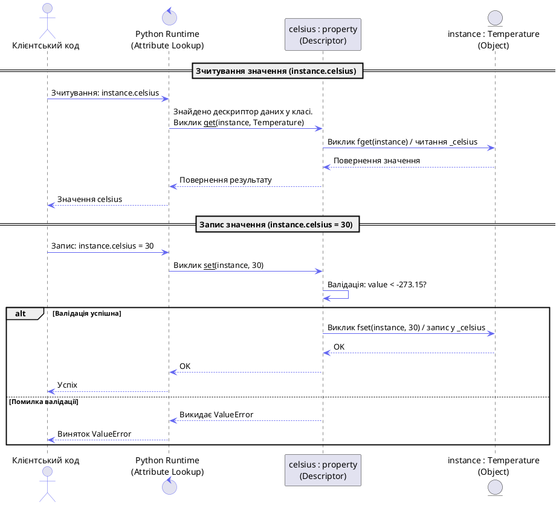

# Інкапсуляція та керування доступом

## Що таке інкапсуляція: більше ніж приховування даних

У класичній теорії об'єктно-орієнтованого проектування **інкапсуляція** є одним із трьох фундаментальних стовпів (разом із спадкуванням та поліморфізмом). Вона вирішує два ключових завдання:

1. **Об'єднання даних та методів**, які з ними працюють, в один логічний контейнер (клас).
2. **Керування доступом** до цих даних, тобто встановлення кордону між публічним інтерфейсом об'єкта (API) та його внутрішніми деталями реалізації.

::note
Часто інкапсуляцію ототожнюють виключно з *приховуванням даних (data hiding)*. Проте приховування — це лише інструмент. Справжня мета інкапсуляції — зменшити зв'язність (coupling) коду: зробити так, щоб зміна внутрішньої логіки одного класу не призводила до лавиноподібного зламу всієї програми.
::

Візуалізувати концепцію інкапсуляції об'єкта можна як захисну оболонку (капсулу):

::plant-uml

```plantuml
@startuml
skinparam style plain
skinparam backgroundColor #ffffff
skinparam ArrowColor #6366f1

package "Об'єкт класу (Екземпляр)" #f3f4f6 {
    rectangle "Внутрішній стан (Деталі реалізації)\n[Приватні дані, службові методи]" as Internal #fee2e2
    rectangle "Публічний інтерфейс (API)\n[Методи та властивості]" as Public #d1fae5
    
    Public -down-> Internal : "безпечно модифікує\nта зчитує"
}

actor "Зовнішній клієнт\n(Інший код)" as Client

Client -right-> Public : "1. Викликає методи\n(дозволено)"
Client --x Internal : "2. Прямий доступ\n(НЕ рекомендовано / обмежено)"
@enduml
```

::

---

## Філософія доступу в Python: «Ми всі тут дорослі люди»

У мовах на кшталт C++, Java або C# керування доступом контролюється компілятором за допомогою жорстких ключових слів `public`, `protected` та `private`. Якщо ви спробуєте звернутися до `private` змінної класу Java ззовні, код просто не скомпілюється.

У Python все інакше. Творець мови Гвідо ван Россум сформулював відомий принцип:

> **"We are all consenting adults here"**
> *(«Ми всі тут дорослі люди, що діють за згодою»)*

Це означає, що мова не повинна створювати штучних бар'єрів або заважати програмісту робити те, що він вважає за потрібне. Якщо розробник хоче залізти у приватні тельбухи класу — він може це зробити. Але вся відповідальність за зламаний у майбутньому код лягає на нього.

Замість жорстких обмежень на рівні синтаксису Python покладається на **угоди про іменування (naming conventions)**.

---

## Публічні та захищені атрибути: угода про одне підкреслення

Усі імена в класі за замовчуванням є **публічними (public)**. Якщо ви хочете вказати, що атрибут або метод є внутрішньою деталлю реалізації і його не слід використовувати ззовні, перед його ім'ям ставиться **одне підкреслення (`_`)**.

### Угода про `_protected`

Атрибут, названий з одним підкресленням (наприклад, `_balance` або `_connect_to_db`), називається **захищеним (protected)**.

```python
# bank_account.py

class BankAccount:
    def __init__(self, owner: str, initial_balance: float):
        self.owner = owner            # Публічний атрибут
        self._balance = initial_balance  # Захищений атрибут (за угодою)
        
    def deposit(self, amount: float) -> None:
        if amount <= 0:
            raise ValueError("Сума депозиту має бути додатною")
        self._balance += amount
        
    def get_balance(self) -> float:
        return self._balance
```

Технічно Python не забороняє пряме читання чи запис цієї змінної:

```python
account = BankAccount("Денис", 1000.0)

# ⚠️ Технічно працює, але порушує угоду!
print(account._balance)  # 1000.0
account._balance = -9999.0  # Рахунок зламано, баланс від'ємний!
```

Чому ж тоді розробники не роблять так у реальних проектах?

::card-group

::card{title="Підтримка IDE" icon="i-heroicons-code-bracket-square"}
Сучасні редактори (VS Code, PyCharm) при автодоповненні коду приховують атрибути з підкресленням або підсвічують їх попередженням, якщо ви намагаєтеся викликати їх ззовні класу.
::

::card{title="Статичні лінтери" icon="i-heroicons-shield-exclamation"}
Інструменти на кшталт `pylint` або `flake8` видадуть попередження (warning) про доступ до захищеного члена класу ззовні його ієрархії.
::

::card{title="Стабільність API" icon="i-heroicons-arrow-path"}
Будь-який атрибут з префіксом `_` може змінитися, бути видалений або перейменований розробником бібліотеки у будь-якому мінорному оновленні. Використовуючи його, ви прирікаєте свій код на нестабільність.
::

::

---

## Приватні атрибути: два підкреслення та Name Mangling

Коли розробникам потрібен більш жорсткий ступінь ізоляції, вони використовують **два підкреслення на початку імені (наприклад, `__balance`)**. Такі атрибути часто називають **приватними (private)**.

Присутність подвійного підкреслення змушує інтерпретатор Python активувати механізм **викривлення імен (Name Mangling)**.

### Як працює Name Mangling

Коли Python компілює клас, що містить ідентифікатори з подвійним підкресленням (які при цьому не мають подвійного підкреслення в кінці, як dunder-методи), він автоматично перейменовує їх за шаблоном:

$$\text{\_ClassName\_\_attribute}$$

Давайте розберемо це на практичному прикладі:

```python
# secure_wallet.py

class SecureWallet:
    def __init__(self, owner: str, initial_funds: float):
        self.owner = owner
        self.__funds = initial_funds  # Приватний атрибут
        
    def add_funds(self, amount: float) -> None:
        if amount > 0:
            self.__funds += amount
            
    def get_funds(self) -> float:
        return self.__funds
```

Якщо ми спробуємо звернутися до атрибута `__funds` напряму, ми отримаємо помилку:

```python
wallet = SecureWallet("Марія", 500.0)

# Спроба прямого доступу:
print(wallet.__funds)  # ❌ AttributeError: 'SecureWallet' object has no attribute '__funds'
```

Здається, що ми отримали справжню приватність! Але давайте зазирнемо у внутрішній простір імен об'єкта за допомогою атрибута `__dict__` або вбудованої функції `dir()`:

```python
# Досліджуємо словник об'єкта wallet
print(wallet.__dict__)
# Виведе: {'owner': 'Марія', '_SecureWallet__funds': 500.0}
```

Бачите ключ `_SecureWallet__funds`? Python просто підмінив ім'я атрибута під час ініціалізації класу!
Це означає, що за бажання ми все одно можемо прочитати або змінити значення, використавши викривлене ім'я:

```python
# Прямий доступ через викривлене ім'я працює!
print(wallet._SecureWallet__funds)  # 500.0

wallet._SecureWallet__funds = -1000.0
print(wallet.get_funds())  # -1000.0 (успішно перезаписано)
```

::warning
Name Mangling — це **не засіб безпеки**. Він не шифрує дані і не захищає їх у пам'яті. Це виключно захист від випадкових помилок розробника та колізій імен.
::

---

### Справжнє призначення Name Mangling: уникнення колізій при спадкуванні

Багато хто вважає, що подвійне підкреслення було створене для імітації `private` членів класу в інших мовах. Проте справжня причина появи Name Mangling — **запобігання конфліктам імен атрибутів у класах-спадкоємцях**.

Уявіть ситуацію: ви створюєте базовий клас `DatabaseConnector`, який використовує внутрішню змінну `__timeout` для конфігурації підключення. Інший розробник успадковує ваш клас у `MyCustomConnector` і також вирішує створити змінну `__timeout` для власних потреб.

Якби не Name Mangling, дочірній клас мовчки переписав би значення батьківського класу, що призвело б до серйозних багів у роботі коннектора:

```python
# collision_demo.py

class BaseConnector:
    def __init__(self):
        self.__timeout = 30  # Буде перетворено на _BaseConnector__timeout
        
    def show_timeout(self):
        print(f"Базовий таймаут: {self.__timeout}")

class CustomConnector(BaseConnector):
    def __init__(self):
        super().__init__()
        self.__timeout = 90  # Буде перетворено на _CustomConnector__timeout
        
    def show_custom_timeout(self):
        print(f"Кастомний таймаут: {self.__timeout}")

conn = CustomConnector()
conn.show_timeout()         # Виведе: Базовий таймаут: 30
conn.show_custom_timeout()  # Виведе: Кастомний таймаут: 90
```

Завдяки Name Mangling обидва класи зберегли свої змінні ізольованими, оскільки в пам'яті об'єкта `conn` існують два окремих поля: `_BaseConnector__timeout` та `_CustomConnector__timeout`.

::tip
Використовуйте подвійне підкреслення `__` **тільки тоді**, коли ви проектуєте складний базовий клас для бібліотеки і хочете застрахувати його внутрішні атрибути від випадкового перезапису в майбутніх підкласах. Для всіх інших звичайних ситуацій приховування деталей реалізації використовуйте угоду про одне підкреслення `_`.
::


---

## Проблема класичних геттерів/сеттерів та Pythonic-шлях

У таких мовах як Java розробники з першого дня привчаються писати приватні змінні та обгортати їх методами `getX()` та `setX()`:

```java
// Java-стиль
private double balance;
public double getBalance() { return balance; }
public void setBalance(double b) { this.balance = b; }
```

Якщо перенести цей підхід у Python буквально, код виглядатиме так:

```python
# Unpythonic (не-пітонічний) стиль
class UnpythonicAccount:
    def __init__(self, balance):
        self._balance = balance
        
    def get_balance(self):
        return self._balance
        
    def set_balance(self, value):
        if value < 0:
            raise ValueError("Баланс не може бути від'ємним")
        self._balance = value
```

Це працює, але це вважається **антипатерном (unpythonic)**. У Python прямий доступ до публічних атрибутів заохочується. Замість написання геттерів та сеттерів «про всяк випадок» для кожного поля, ми починаємо з простих публічних атрибутів:

```python
class PythonicAccount:
    def __init__(self, balance):
        self.balance = balance  # Звичайний публічний атрибут
```

Якщо в майбутньому виникне потреба додати логіку валідації при зміні балансу, ми можемо перетворити публічний атрибут на **властивість (property)** за допомогою декоратора **`@property`**. При цьому зовнішній інтерфейс класу не зміниться, і весь клієнтський код продовжить працювати без змін!

### Декоратор `@property`: обчислювальні властивості

Декоратор `@property` дозволяє обернути метод класу так, щоб звернення до нього виглядало як звичайне зчитування атрибута (без дужок `()`).

Розглянемо приклад створення обчислювальної властивості (read-only за замовчуванням):

```python
# circle.py
import math

class Circle:
    def __init__(self, radius: float):
        self.radius = radius
        
    @property
    def area(self) -> float:
        """Обчислювальна властивість. Read-only за замовчуванням."""
        return math.pi * (self.radius ** 2)
```

Зовнішній код використовує властивість так, ніби це звичайна константа або змінна:

```python
circle = Circle(5.0)

# Звернення до area відбувається БЕЗ виклику дужок ():
print(f"Площа: {circle.area:.2f}")  # 78.54

# Спроба записати значення у read-only властивість викличе помилку:
circle.area = 100.0  # ❌ AttributeError: can't set attribute 'area'
```

---

### Геттери, Сеттери та Делітери

Для того, щоб зробити властивість доступною для запису та видалення, використовуються однойменні декоратори з префіксами `.setter` та `.deleter`.

Створимо клас `Temperature`, який зберігає значення в градусах Цельсія, але дозволяє працювати з ним через Фаренгейти, автоматично виконуючи конвертацію та перевірку валідності даних:

```python
# temperature.py

class Temperature:
    def __init__(self, celsius: float):
        # Виклик сеттера для первинної перевірки
        self.celsius = celsius

    @property
    def celsius(self) -> float:
        """Геттер для температури в Цельсіях."""
        print("Зчитування значення Цельсія...")
        return self._celsius

    @celsius.setter
    def celsius(self, value: float) -> None:
        """Сеттер для температури в Цельсіях з валідацією."""
        print(f"Запис значення Цельсія: {value}")
        if value < -273.15:
            raise ValueError("Температура нижча за абсолютний нуль!")
        self._celsius = value

    @property
    def fahrenheit(self) -> float:
        """Обчислювальний геттер для Фаренгейтів."""
        print("Конвертація Цельсія у Фаренгейт...")
        return (self.celsius * 9/5) + 32

    @fahrenheit.setter
    def fahrenheit(self, value: float) -> None:
        """Сеттер для Фаренгейтів, що змінює внутрішній стан у Цельсіях."""
        print(f"Запис Фаренгейта: {value}. Перерахунок у Цельсії...")
        celsius_value = (value - 32) * 5/9
        self.celsius = celsius_value  # це викликає сеттер celsius

    @fahrenheit.deleter
    def fahrenheit(self) -> None:
        """Делітер для очищення стану."""
        print("Видалення температурних даних...")
        del self._celsius
```

Дослідимо роботу нашого класу в інтерактивному режимі:

```python
t = Temperature(25.0)
# Виведе: Запис значення Цельсія: 25.0

print(t.fahrenheit)
# Виведе:
#   Конвертація Цельсія у Фаренгейт...
#   Зчитування значення Цельсія...
#   77.0

t.fahrenheit = 32.0
# Виведе:
#   Запис Фаренгейта: 32.0. Перерахунок у Цельсії...
#   Запис значення Цельсія: 0.0

print(t.celsius)
# Виведе:
#   Зчитування значення Цельсія...
#   0.0

# Спроба задати невалідну температуру:
t.celsius = -300.0  # ❌ ValueError: Температура нижча за абсолютний нуль!
```

Що сталося при видаленні?

```python
del t.fahrenheit
# Виведе: Видалення температурних даних...

# Спроба зчитати призведе до помилки, оскільки внутрішня змінна видалена:
print(t.celsius)  # ❌ AttributeError: 'Temperature' object has no attribute '_celsius'
```


::warning{title="Критична пастка: нескінченна рекурсія та RecursionError"}
Найпоширеніша помилка новачків при написанні властивостей — це збіг імен захищеного атрибута та самої властивості. 

Уявіть, що ви написали такий код:

```python
class BadTemperature:
    def __init__(self, celsius):
        self.celsius = celsius  # викликає сеттер

    @property
    def celsius(self):
        return self.celsius  # ❌ Помилка: викликає сам себе!

    @celsius.setter
    def celsius(self, value):
        self.celsius = value  # ❌ Помилка: викликає сам себе!
```

**Що відбувається при виконанні `t = BadTemperature(25)`:**
1. Конструктор виконує `self.celsius = 25`. Оскільки у класі визначено властивість `celsius` з `@celsius.setter`, Python перенаправляє запис у цей сеттер.
2. Сеттер намагається виконати `self.celsius = value`. Оскільки зліва стоїть `self.celsius`, Python знову викликає цей самий сеттер!
3. Програма потрапляє в нескінченний цикл викликів функції, поки стек викликів не переповниться, і Python не викине виняток:
   `RecursionError: maximum recursion depth exceeded while calling a Python object`

**Як це виправити:**
Для збереження реального стану об'єкта завжди використовуйте внутрішнє (захищене) ім'я з одним підкресленням на початку (наприклад, `self._celsius` або `self._balance`), яке відрізняється від імені самої властивості (`self.celsius`):

* Ззовні клас надає публічний інтерфейс через властивість `celsius`.
* Зсередини клас зберігає значення у захищеному полі `_celsius`.
::

---


## Декоратори `@property` проти класичної функції `property()`

Декоратори в Python з'явилися в PEP 318 (Python 2.4). До цього властивості також існували, але налаштовувалися за допомогою вбудованої функції **`property()`**.

Декоратор `@property` — це просто синтаксичний цукор для виклику цієї функції.

### Створення властивості через `property()`

Вбудована функція `property()` має таку сигнатуру:

::field-group

::field{name="fget" type="callable" default="None"}
Функція для зчитування значення атрибута (геттер).
::

::field{name="fset" type="callable" default="None"}
Функція для запису значення атрибута (сеттер).
::

::field{name="fdel" type="callable" default="None"}
Функція для видалення атрибута (делітер).
::

::field{name="doc" type="string" default="None"}
Документаційний рядок властивості.
::

::

Порівняємо обидва підходи:

::tabs

::tabs-item{label="Через декоратори (сучасний)"}

```python
class ModernAccount:
    def __init__(self, balance):
        self._balance = balance

    @property
    def balance(self):
        return self._balance

    @balance.setter
    def balance(self, value):
        self._balance = value
```

::

::tabs-item{label="Через функцію property() (класичний)"}

```python
class ClassicAccount:
    def __init__(self, balance):
        self._balance = balance

    def _get_balance(self):
        return self._balance

    def _set_balance(self, value):
        self._balance = value

    # Створюємо властивість класу
    balance = property(fget=_get_balance, fset=_set_balance)
```

::

::

### Чому декоратори кращі?

Хоча обидва підходи створюють абсолютно однакові об'єкти властивості в рантаймі, декоратори мають кілька важливих переваг:

1. **Чистота простору імен класу**: При використанні `property()` вам доводиться оголошувати допоміжні методи на кшталт `_get_balance` та `_set_balance`. Вони залишаються видимими в інтерфейсі об'єкта, хоча призначені виключно для налаштування властивості.
2. **Читабельність**: Коли ви дивитеся на метод `@property def balance(self):`, ви одразу бачите, що це властивість. У випадку з `property()` опис властивості знаходиться в самому кінці класу, далеко від визначення методів.


---

## Під капотом: Декоратори, Властивості та Протокол Дескрипторів

Щоб зрозуміти, як магічний декоратор `@property` перехоплює доступ до атрибутів об'єкта, необхідно зазирнути під капот самого механізму декораторів та зрозуміти, у що саме перетворюється синтаксичний цукор `@`.

### 1. Анатомія декораторів у Python

В основі декораторів лежать дві концепції: **функції як об'єкти першого класу (First-Class Citizens)** та **замикання (Closures)**.

#### Функції як об'єкти першого класу

У Python функції є такими ж об'єктами, як і числа, рядки чи списки. Це означає, що їх можна:
- Зберігати у змінних або структурах даних.
- Передавати як аргументи в інші функції.
- Повертати з інших функцій.

```python
def greet(name):
    return f"Привіт, {name}!"

# Функція присвоюється змінній
say_hello = greet
print(say_hello("Олексій"))  # Виведе: Привіт, Олексій!
```

#### Замикання (Closures)

**Замикання** — це функція, яка зберігає посилання на змінні зі своєї зовнішньої області видимості (лексичного оточення), навіть після того, як зовнішня функція завершила своє виконання.

```python
def multiplier(factor):
    # Зовнішня функція приймає 'factor'
    def multiply(number):
        # Внутрішня функція використовує 'factor' з батьківського простору імен
        return number * factor
    return multiply  # Повертаємо внутрішню функцію

double = multiplier(2)  # double тепер посилається на multiply, де factor = 2
print(double(5))  # Виведе: 10 (5 * 2)
```

#### Що таке декоратор?

**Декоратор** — це функція, яка приймає іншу функцію як аргумент, розширює або змінює її поведінку без безпосередньої модифікації її коду, та повертає нову функцію (або об'єкт).

Синтаксичний цукор `@` є просто альтернативним записом переприсвоєння імені:

::tabs

::tabs-item{label="З синтаксичним цукром @"}
```python
@my_decorator
def my_function():
    pass
```
::

::tabs-item{label="Еквівалентний класичний запис"}
```python
def my_function():
    pass

my_function = my_decorator(my_function)
```
::

::

Давайте напишемо простий декоратор для логування, щоб побачити це в дії:

```python
def log_execution(func):
    def wrapper(*args, **kwargs):
        print(f"[LOG] Викликаємо функцію: {func.__name__}")
        result = func(*args, **kwargs)
        print(f"[LOG] Функція {func.__name__} завершила виконання")
        return result
    return wrapper

@log_execution
def calculate_sum(a, b):
    return a + b

# Виклик:
print(calculate_sum(10, 20))
# Виведе:
# [LOG] Викликаємо функцію: calculate_sum
# [LOG] Функція calculate_sum завершила виконання
# 30
```

Коли ми викликали `calculate_sum(10, 20)`, ми насправді викликали функцію `wrapper` всередині `log_execution`, яка зберегла посилання на оригінальну `calculate_sum` завдяки замиканню.

Проте `@property` працює трохи інакше. Замість того, щоб повертати просту функцію `wrapper`, він повертає спеціальний об'єкт класу `property`. Для розуміння цього нам потрібно розібрати **протокол дескрипторів**.

### 2. Дескриптори та протокол дескрипторів під капотом `@property`

Коли ми прикрашаємо метод декоратором `@property`, ми не просто обгортаємо функцію в іншу функцію. Насправді ми створюємо екземпляр класу `property`. 

Клас `property` в Python є вбудованою реалізацією **дескриптора (Descriptor)**.

#### Що таке дескриптор?

**Дескриптор** — це об'єкт класу, що реалізує спеціальні dunder-методи для керування доступом до атрибутів інших об'єктів. Цей набір методів називається **протоколом дескрипторів**:

- `__get__(self, instance, owner)` — викликається при зчитуванні атрибута.
- `__set__(self, instance, value)` — викликається при записі значення в атрибут.
- `__delete__(self, instance)` — викликається при видаленні атрибута через оператор `del`.

#### Розшифровка сигнатури протоколу дескрипторів

Оскільки дескриптори визначаються на рівні класу, але взаємодіють з екземплярами цього класу, у методах протоколу є кілька специфічних аргументів, які часто плутають початківці:

* **`self`**: Посилання на сам **об'єкт дескриптора** (екземпляр класу-дескриптора, наприклад, `celsius` або `IntegerRange`).
* **`instance`**: Посилання на **об'єкт-власник** (конкретний екземпляр класу, у якому оголошено дескриптор, наприклад, `t` класу `Temperature` або `hero` класу `Character`).
  > Якщо доступ до дескриптора здійснюється безпосередньо через клас (наприклад, `Temperature.celsius`), параметр `instance` набуде значення `None`.
* **`owner`**: Посилання на **клас-власник**, у якому оголошено дескриптор (наприклад, `Temperature` або `Character`).

Розглянемо це на схемі взаємодії об'єктів у пам'яті:

```text
       [ Temperature (Клас-власник / owner) ]
                  |
                  v має атрибут 'celsius'
       [ celsius (Дескриптор / self) ]
                  |
                  |  __get__(self, instance, owner)
                  v  перехоплює читання з
       [ t = Temperature() (Екземпляр-власник / instance) ]
```

::note{title="Чому instance може бути None?"}
Коли ви викликаєте `Temperature.celsius` (звернення через сам клас), Python не має конкретного екземпляра для передачі. Тому `instance` дорівнює `None`.
У вашому власному дескрипторі завжди варто додавати перевірку:
```python
def __get__(self, instance, owner):
    if instance is None:
        return self  # повертає сам об'єкт дескриптора при зверненні через клас
    return getattr(instance, self.private_name)
```
Це стандартний патерн проектування в Python.
::


::note
Дескриптори бувають двох типів:
1. **Data Descriptors (дескриптори даних)** — класи, які реалізують як `__get__`, так і `__set__` (або `__delete__`). Об'єкти типу `property` належать саме до цього типу.
2. **Non-data Descriptors (дескриптори не-даних)** — класи, які реалізують лише `__get__` (наприклад, звичайні методи класу чи статичні методи `@staticmethod`).
::

#### Алгоритм пошуку атрибутів у Python (Attribute Lookup)

Коли ви звертаєтеся до атрибута об'єкта як `obj.attribute`, Python не просто шукає його у словнику `obj.__dict__`. Інтерпретатор слідує чітко визначеному пріоритету:

1. Спочатку Python шукає атрибут з ім'ям `attribute` у просторі імен класу об'єкта `obj` (тобто в `type(obj).__dict__` та його базових класах).
2. Якщо такий атрибут знайдено і він є **Data Descriptor** (як `property`), то Python ігнорує значення в локальному словнику об'єкта `obj.__dict__` і викликає метод дескриптора `__get__`.
3. Якщо атрибут не є дескриптором даних (або взагалі відсутній у класі), Python шукає його в локальному словнику екземпляра `obj.__dict__`.
4. Якщо його немає і там, але у класі є **Non-data Descriptor**, викликається його `__get__`.
5. Якщо нічого не знайдено, викликається метод `__getattr__` (якщо він визначений).

Це фундаментальне правило пояснює, чому ми не можемо «переписати» властивість, просто присвоївши їй значення `circle.area = 100` — оскільки `area` є дескриптором даних, спроба запису перехоплюється його методом `__set__` (який за замовчуванням викидає `AttributeError`, якщо сеттер не визначено).

#### Проста симуляція `property` на чистому Python

Щоб зрозуміти, як вбудований клас `property` реалізує цей протокол, давайте напишемо спрощену версію дескриптора нашого власного класу `SimplifiedProperty`:

```python
class SimplifiedProperty:
    def __init__(self, fget=None, fset=None, fdel=None):
        self.fget = fget
        self.fset = fset
        self.fdel = fdel

    def __get__(self, instance, owner):
        # Якщо звернення йде від самого класу (наприклад, Temperature.celsius)
        if instance is None:
            return self
        
        # Якщо геттер не задано
        if self.fget is None:
            raise AttributeError("Немає геттера для цього атрибута")
            
        # Викликаємо збережену функцію-геттер, передаючи їй об'єкт-власник (self)
        return self.fget(instance)

    def __set__(self, instance, value):
        if self.fset is None:
            raise AttributeError("Не можу встановити значення (read-only властивість)")
        self.fset(instance, value)

    def __delete__(self, instance):
        if self.fdel is None:
            raise AttributeError("Не можу видалити атрибут")
        self.fdel(instance)
```

Тепер, якщо ми замінимо вбудований `@property` на `@SimplifiedProperty`, наша обгортка працюватиме аналогічно вбудованій властивості!

### 3. Зв'язування геттера, сеттера та делітера (Chaining & Immutability)

Тепер розберемо одну з найбільш заплутаних речей для новачків: чому ми пишемо `@celsius.setter`, а не просто додаємо до декоратора якісь аргументи, і як працює цей ланцюжок.

#### Механізм роботи декоратора `.setter`

Коли ми оголошуємо геттер:

```python
class Temperature:
    @property
    def celsius(self) -> float:
        return self._celsius
```

У цей момент у просторі імен класу `Temperature` створюється об'єкт типу `property` під назвою `celsius`.

Далі ми пишемо:

```python
    @celsius.setter
    def celsius(self, value: float) -> None:
        self._celsius = value
```

Тут `@celsius.setter` — це виклик методу `.setter()` вже створеного об'єкта `celsius`, який використовується як декоратор для наступного методу. Цей запис повністю еквівалентний такому:

```python
celsius = celsius.setter(celsius_setter_function)
```

#### Чому об'єкти `property` є незмінними (immutable-like)

У Python об'єкти `property` розроблені так, щоб бути незмінними після створення. Коли ви викликаєте метод `.setter(func)`, оригінальний об'єкт `property` **не змінюється**. Замість цього метод `.setter()` створює і повертає **новий об'єкт `property`**, у який копіюються посилання на оригінальний геттер (`fget`), делітер (`fdel`), а як сеттер (`fset`) встановлюється нова передана функція.

Оскільки декоратор повертає цей новий об'єкт, він перезаписує ім'я `celsius` у просторі імен класу.

Давайте доведемо це практичним експериментом, вивівши унікальні ідентифікатори об'єктів (`id`) на етапі конструювання класу:

```python
class Demo:
    def __init__(self):
        self._value = 0

    # 1. Створюємо первинну властивість (лише геттер)
    @property
    def value(self):
        return self._value
    
    print(f"[STAGE 1] Створено перший об'єкт property: {value} з id={id(value)}")

    # 2. Обертаємо сеттер
    @value.setter
    def value(self, val):
        self._value = val

    # Оскільки на цьому етапі локальна змінна 'value' вже перезаписана декоратором @value.setter:
    # Зверніть увагу: ми використовуємо локальне ім'я 'value' безпосередньо у тілі класу!
    print(f"[STAGE 2] Створено другий об'єкт property: {value} з id={id(value)}")
```

Якщо ми запустимо цей код, ми отримаємо приблизно такий вивід:

```text
[STAGE 1] Створено перший об'єкт property: <property object at 0x104b28cc0> з id=4373777600
[STAGE 2] Створено другий об'єкт property: <property object at 0x104b28d10> з id=4373777680
```

::tip
Зверніть увагу, що адреси пам'яті (`0x104b28cc0` та `0x104b28d10`), а також їхні `id` відрізняються! Це наочно доводить, що при кожному виклику `.setter` чи `.deleter` створюється абсолютно новий об'єкт властивості, що заміщує попередній.
::

### 4. Діаграма послідовності та кастомні дескриптори

Для візуалізації того, як саме інтерпретатор перенаправляє запити через протокол дескрипторів, розглянемо діаграму послідовності (Sequence Diagram) при зчитуванні та записі значення:

::plant-uml



::

#### Практичний приклад від А до Я: Кастомний дескриптор для валідації

Коли у вас в класі є багато атрибутів, які вимагають однакової валідації (наприклад, перевірки на діапазон цілих чисел), написання десятків окремих `@property` призведе до величезної кількості дубльованого коду (boilerplate code).

У таких випадках Pythonic-шлях полягає у створенні **власного класу-дескриптора**.

Створимо дескриптор `IntegerRange`, який автоматично перевірятиме тип та межі значень, та застосуємо його для полів ігрового персонажа.

#### Проблема зв'язування імен атрибутів та еволюція `__set_name__`

До версії Python 3.6 написання дескрипторів було дещо незручним. Дескриптор не знав, під яким ім'ям його було присвоєно в класі. Наприклад, коли ви писали `health = IntegerRange()`, сам об'єкт `IntegerRange` не мав доступу до назви рядка `"health"`. 

Через це розробникам доводилося вручну передавати назву змінної (або назву внутрішнього приватного поля) у конструктор дескриптора:

::tabs

::tabs-item{label="Застарілий стиль (до Python 3.6)"}
```python
class LegacyIntegerRange:
    def __init__(self, storage_name, min_value, max_value):
        self.storage_name = storage_name  # Доводилося дублювати ім'я атрибута
        self.min_value = min_value
        self.max_value = max_value

class LegacyCharacter:
    # Жахливе дублювання: ім'я вказується і як назва змінної, і як рядок
    health = LegacyIntegerRange("_health", 0, 100)
    mana = LegacyIntegerRange("_mana", 0, 50)
```
::

::tabs-item{label="Сучасний стиль (з Python 3.6+)"}
```python
class ModernIntegerRange:
    def __init__(self, min_value, max_value):
        self.min_value = min_value
        self.max_value = max_value

    def __set_name__(self, owner, name):
        # Викликається автоматично при парсингу класу!
        # owner = Character, name = "health" (або "mana")
        self.private_name = f"_{name}"

class ModernCharacter:
    # Ніякого дублювання! Python сам скаже дескриптору його ім'я
    health = ModernIntegerRange(0, 100)
    mana = ModernIntegerRange(0, 50)
```
::

::

Тепер перейдемо до повного лістингу реалізації сучасного дескриптора для перевірки діапазонів числових значень:

```python

# descriptors_validation.py

class IntegerRange:
    def __init__(self, min_value: int, max_value: int):
        self.min_value = min_value
        self.max_value = max_value

    def __set_name__(self, owner, name):
        """
        Метод викликається автоматично в момент створення класу-власника (Python 3.6+).
        Він дозволяє дескриптору дізнатися ім'я змінної, якій його присвоєно.
        """
        self.private_name = f"_{name}"

    def __get__(self, instance, owner):
        if instance is None:
            # Якщо звернення йде від класу (наприклад, Character.health)
            return self
        # Повертаємо внутрішнє значення з об'єкта
        return getattr(instance, self.private_name, 0)

    def __set__(self, instance, value):
        # 1. Перевірка типу
        if not isinstance(value, int):
            raise TypeError("Значення має бути цілим числом (int)")
        
        # 2. Перевірка діапазону
        if not (self.min_value <= value <= self.max_value):
            raise ValueError(
                f"Значення має бути у діапазоні [{self.min_value}, {self.max_value}]"
            )
        
        # 3. Запис у внутрішній атрибут об'єкта
        setattr(instance, self.private_name, value)


class Character:
    # Застосовуємо дескриптори замість property!
    health = IntegerRange(0, 100)
    mana = IntegerRange(0, 50)
    level = IntegerRange(1, 80)

    def __init__(self, name: str, health: int, mana: int, level: int):
        self.name = name
        # Звернення до дескрипторів ініціює валідацію
        self.health = health
        self.mana = mana
        self.level = level
```

Давайте протестуємо цей підхід:

```python
hero = Character("Арагорн", 100, 30, 5)

print(f"Герой: {hero.name}, Здоров'я: {hero.health}, Мана: {hero.mana}, Рівень: {hero.level}")
# Виведе: Герой: Арагорн, Здоров'я: 100, Мана: 30, Рівень: 5

# Зміна значень працює чудово:
hero.health = 50
print(hero.health)  # 50

# Спроба вийти за межі діапазону:
try:
    hero.health = 150  # ❌ Викличе ValueError
except ValueError as e:
    print(f"Помилка: {e}")  # Виведе: Помилка: Значення має бути у діапазоні [0, 100]

# Спроба передати невалідний тип:
try:
    hero.level = "десятий"  # ❌ Викличе TypeError
except TypeError as e:
    print(f"Помилка: {e}")  # Виведе: Помилка: Значення має бути цілим числом (int)
```

::tip
Кастомні дескриптори дозволяють винести складну логіку інкапсуляції та валідації в окремі класи, що перевикористовуються. Це робить код основних бізнес-класів (таких як `Character`) максимально чистим, декларативним та легким для супроводу.
::

## Практична лабораторія: Система профілів користувачів із валідацією гаманця

Для закріплення матеріалу на практиці реалізуємо систему керування профілями користувачів у веб-додатку. Цей приклад покаже, як поєднувати звичайні властивості (для простих перевірок одного поля) та перевикористовувані дескриптори (для бізнес-правил валідації).

### Технічні вимоги до системи

1. **Клас-дескриптор `NonEmptyString`**:
   - Має перевіряти, що значення є рядком (`str`).
   - Рядок не повинен бути порожнім або складатися лише з пробілів.
   - Має автоматично прибирати зайві пробіли на початку та в кінці значення (`strip()`).

2. **Клас-дескриптор `EmailAttribute`**:
   - Має перевіряти, що значення є валідним email-адресом (повинно містити рівно один символ `@` та хоча б одну крапку після нього).

3. **Клас `UserProfile`**:
   - Використовує дескриптори `NonEmptyString` для атрибутів `username` та `first_name`.
   - Використовує дескриптор `EmailAttribute` для атрибута `email`.
   - Має властивість `balance` (геттер та сеттер). Сеттер повинен перевіряти, що баланс є числом (`int` або `float`) та не є від'ємним. При ініціалізації за замовчуванням баланс дорівнює `0.0`.

### Покрокове вирішення та лістинг коду

::tabs

::tabs-item{label="Реалізація валідаторів та профілю"}
```python
# user_profile.py

class NonEmptyString:
    def __set_name__(self, owner, name):
        self.private_name = f"_{name}"

    def __get__(self, instance, owner):
        if instance is None:
            return self
        return getattr(instance, self.private_name, "")

    def __set__(self, instance, value):
        if not isinstance(value, str):
            raise TypeError("Значення атрибута має бути рядком (str)")
        cleaned_value = value.strip()
        if not cleaned_value:
            raise ValueError("Рядок не може бути порожнім")
        setattr(instance, self.private_name, cleaned_value)


class EmailAttribute:
    def __set_name__(self, owner, name):
        self.private_name = f"_{name}"

    def __get__(self, instance, owner):
        if instance is None:
            return self
        return getattr(instance, self.private_name, "")

    def __set__(self, instance, value):
        if not isinstance(value, str):
            raise TypeError("Email має бути рядком (str)")
        value = value.strip().lower()
        if "@" not in value or value.count("@") != 1:
            raise ValueError("Невалідний email: має містити один символ '@'")
        
        parts = value.split("@")
        if "." not in parts[1]:
            raise ValueError("Невалідний email: доменна частина має містити крапку")
            
        setattr(instance, self.private_name, value)


class UserProfile:
    # Застосовуємо кастомні дескриптори
    username = NonEmptyString()
    first_name = NonEmptyString()
    email = EmailAttribute()

    def __init__(self, username: str, first_name: str, email: str, balance: float = 0.0):
        self.username = username
        self.first_name = first_name
        self.email = email
        self.balance = balance  # ініціює виклик сеттера balance

    @property
    def balance(self) -> float:
        return self._balance

    @balance.setter
    def balance(self, value: float) -> None:
        if not isinstance(value, (int, float)):
            raise TypeError("Баланс має бути числом")
        if value < 0:
            raise ValueError("Баланс не може бути від'ємним")
        self._balance = float(value)
```
::

::tabs-item{label="Сценарій тестування"}
```python
# main.py
from user_profile import UserProfile

# 1. Створення валідного профілю
user = UserProfile("arakviel", "Денис", "denys@example.com", 150.50)
print(f"Користувач: {user.username}, Email: {user.email}, Баланс: ${user.balance}")

# Перевірка очищення пробілів (strip)
user.first_name = "  Іван  "
print(f"Ім'я після очищення: '{user.first_name}'")  # Виведе: 'Іван'

# 2. Перевірка помилок валідації імені
try:
    user.username = "   "  # Лише пробіли
except ValueError as e:
    print(f"Помилка username: {e}")  # Рядок не може бути порожнім

# 3. Перевірка помилок валідації email
try:
    user.email = "bademail.com"
except ValueError as e:
    print(f"Помилка email: {e}")  # Невалідний email...

# 4. Перевірка помилок балансу
try:
    user.balance = -10.0
except ValueError as e:
    print(f"Помилка балансу: {e}")  # Баланс не може бути від'ємним
```
::

::

### Домашнє завдання (Самостійна робота)

Спробуйте самостійно розширити систему профілів користувачів:
1. Додайте дескриптор `PhoneNumber` для перевірки телефонного номера (має починатися з `+` та містити лише цифри після цього, довжиною від 10 до 15 символів).
2. Створіть властивість-геттер `display_name` у класі `UserProfile`, яка повертає рядок у форматі `"{first_name} ({username})"`. Оскільки це обчислювальна властивість, зробіть її доступною лише для зчитування (read-only).

---


## Підсумки та найкращі практики інкапсуляції

::card-group

::card{title="Стиль іменування" icon="i-heroicons-pencil-square"}
Використовуйте `_protected` (одне підкреслення) для приховування деталей реалізації. Використовуйте `__private` (два підкреслення) виключно для захисту від колізій імен при спадкуванні.
::

::card{title="Consenting Adults" icon="i-heroicons-user-group"}
Пам'ятайте, що Python не блокує доступ фізично. Будь-який «приватний» атрибут можна дістати через `_ClassName__attribute`. Поважайте чужі угоди та не лізьте під капот сторонніх об'єктів.
::

::card{title="Pythonic Властивості" icon="i-heroicons-check-circle"}
Не пишіть класичні `get_*` та `set_*` методи. Починайте з публічних атрибутів. Якщо потрібна валідація або обчислення — перетворюйте їх на властивості через `@property`.
::

::card{title="Продуктивність" icon="i-heroicons-bolt"}
Не робіть властивості занадто "важкими". Зчитування властивості (`obj.value`) має виглядати швидким. Якщо властивість робить запит до бази даних або важкі розрахунки — оформіть її як звичайний метод `obj.calculate_value()`.
::

::
