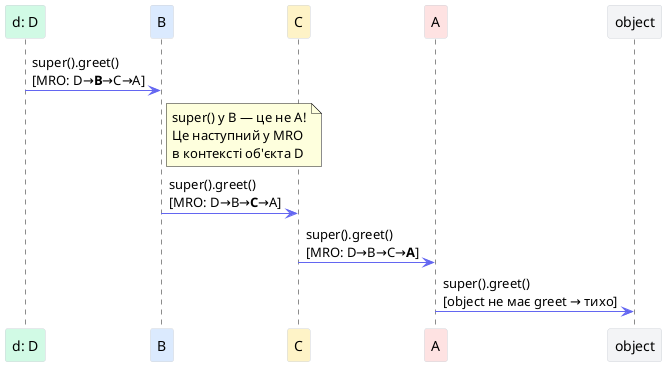
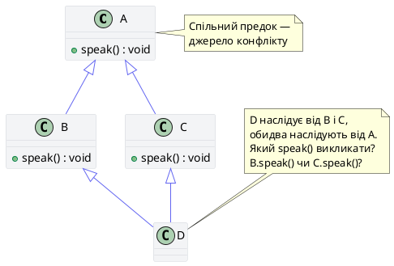
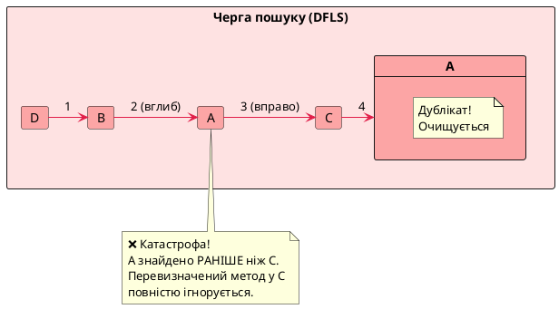
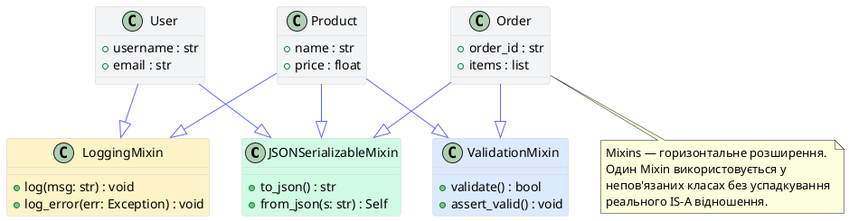
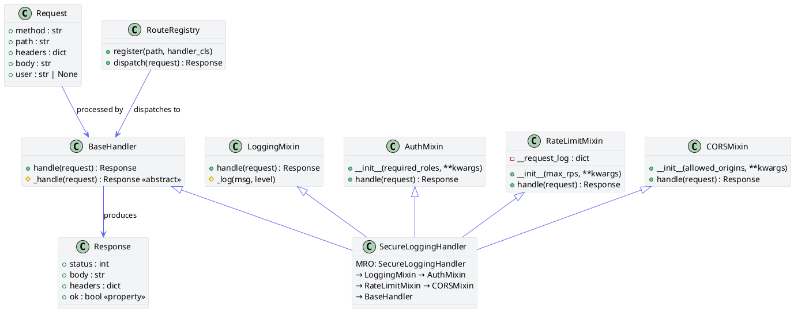

# Наслідування, MRO та суперсила `super()`

## Вступ: Коли код перестає масштабуватися

Уявіть: ви розробляєте систему сповіщень для SaaS-платформи. Є три канали — Email, SMS, Push. Кожен потребує логування, авторизації та серіалізації для збереження в базу даних. Перша версія виглядає так:

```python
# ❌ Монолітний підхід — катастрофа при масштабуванні
class EmailNotification:
    def send(self, user, msg): ...
    def log(self, msg): print(f"[EMAIL] {msg}")     # дублювання
    def to_json(self): return json.dumps(self.__dict__)  # дублювання

class SmsNotification:
    def send(self, user, msg): ...
    def log(self, msg): print(f"[SMS] {msg}")       # те саме!
    def to_json(self): return json.dumps(self.__dict__)  # те саме!

class PushNotification:
    def send(self, user, msg): ...
    def log(self, msg): print(f"[PUSH] {msg}")      # і знову те саме!
    def to_json(self): return json.dumps(self.__dict__)  # і знову!
```

Три класи — і вже три копії однакового коду. Через місяць вимога змінилась: логування тепер у JSON-форматі. Вам доведеться змінювати код у трьох місцях — і це гарантований шлях до помилок.

Саме для вирішення цієї проблеми існує **наслідування**: механізм, що дозволяє визначити поведінку один раз і розподілити її між усіма нащадками. Але наслідування — це не просто «підключення батьківського коду». У Python під ним ховається складна система пошуку методів (MRO), кооперативний виклик конструкторів і архітектурний патерн Mixins.

::card-group

::card{title="Проблема дублювання" icon="i-heroicons-document-duplicate"}
Без наслідування зміна в одній «спільній» функції потребує правки у кожному класі окремо. Це порушує принцип DRY (Don't Repeat Yourself).
::

::card{title="Проблема ієрархії" icon="i-heroicons-arrow-trending-up"}
Глибокі ієрархії без чіткого механізму пошуку методів перетворюються на «спагетті» — неможливо зрозуміти, який метод буде викликано.
::

::card{title="Проблема конфліктів" icon="i-heroicons-exclamation-triangle"}
При множинному наслідуванні кілька батьків можуть мати однойменні методи. Без суворого алгоритму вирішення конфліктів поведінка непередбачувана.
::

::card{title="Python-рішення" icon="i-heroicons-check-circle"}
Python вирішує всі три проблеми: `super()` як проксі-об'єкт по MRO, C3-лінеаризація для детермінованого порядку, Mixins для горизонтального розподілу поведінки.
::

::

---

## Частина I: Одиночне наслідування та перевизначення методів

### Базовий синтаксис та відношення IS-A

**Одиночне наслідування** — це коли клас має рівно одного безпосереднього батька. У Python базовий клас вказується в дужках після назви дочірнього класу. Якщо батько не вказаний явно, клас автоматично наслідує від вбудованого `object`.

Головне правило: використовуйте наслідування **лише** тоді, коли між сутностями є чітке відношення **IS-A** («є об'єктом типу»). Для відношення HAS-A («містить у собі») — використовуйте композицію.

::code-tree

```python [vehicle.py]
# Базовий клас транспортного засобу
class Vehicle:
    """Базовий клас для всіх транспортних засобів."""

    def __init__(self, brand: str, year: int):
        self.brand = brand
        self.year = year
        self._fuel_level: float = 100.0  # захищений атрибут

    def start_engine(self) -> str:
        return f"Двигун {self.brand} ({self.year}) запущено."

    def refuel(self, liters: float) -> None:
        self._fuel_level = min(100.0, self._fuel_level + liters)
        print(f"Заправлено {liters}л. Рівень: {self._fuel_level:.1f}%")

    def __repr__(self) -> str:
        return f"{self.__class__.__name__}(brand={self.brand!r}, year={self.year})"
```

```python [car.py]
from vehicle import Vehicle

class Car(Vehicle):
    """Car IS-A Vehicle з власними функціями."""

    def __init__(self, brand: str, year: int, num_doors: int = 4):
        # Виклик батьківського конструктора через super()
        super().__init__(brand, year)
        self.num_doors = num_doors

    # Перевизначення (Method Overriding): власна реалізація для Car
    def start_engine(self) -> str:
        base = super().start_engine()
        return f"{base} [Car mode: ремені пристебнуті]"

    def honk(self) -> str:
        return f"{self.brand}: Бі-біп!"
```

```python [electric_car.py]
from car import Car

class ElectricCar(Car):
    """ElectricCar IS-A Car IS-A Vehicle: дворівневе наслідування."""

    def __init__(self, brand: str, year: int, battery_kwh: float):
        super().__init__(brand, year)      # Car.__init__
        self.battery_kwh = battery_kwh
        self._charge_level: float = 100.0

    # Перевизначення: повністю інша логіка запуску для електромобіля
    def start_engine(self) -> str:
        return f"{self.brand}: Тихий запуск електромотора. Заряд: {self._charge_level}%"

    # Новий метод, специфічний для ElectricCar
    def charge(self, kwh: float) -> None:
        self._charge_level = min(100.0, self._charge_level + kwh / self.battery_kwh * 100)
        print(f"Заряджено +{kwh}кВт·год. Рівень: {self._charge_level:.1f}%")
```

```python [main.py]
from vehicle import Vehicle
from car import Car
from electric_car import ElectricCar

vehicles: list[Vehicle] = [
    Vehicle("Generic", 2020),
    Car("Toyota", 2022, num_doors=4),
    ElectricCar("Tesla", 2024, battery_kwh=75.0),
]

# Поліморфізм: один і той самий виклик — різна поведінка
for v in vehicles:
    print(v.start_engine())
```

::

::terminal-preview{title="python main.py"}

<div class="line"><span class="opacity-40">$</span> <strong>python main.py</strong></div>
<div class="line">Двигун Generic (<span class="text-yellow-400">2020</span>) запущено.</div>
<div class="line">Двигун Toyota (<span class="text-yellow-400">2022</span>) запущено. <span class="text-blue-400">[Car mode: ремені пристебнуті]</span></div>
<div class="line"><span class="text-green-400">Tesla: Тихий запуск електромотора. Заряд: 100.0%</span></div>

::

**Перевизначення методів (Method Overriding)** — ключовий механізм поліморфізму. Коли Python шукає метод на об'єкті `Tesla.start_engine()`, він перевіряє класи в порядку MRO і знаходить першу відповідну реалізацію. У нашому випадку — в `ElectricCar`, ігноруючи `Car.start_engine` та `Vehicle.start_engine`.

### `__dict__` екземпляра проти `__dict__` класу

Важливо розуміти відмінність між атрибутами, що зберігаються безпосередньо на **екземплярі**, та тими, що належать **класу**. Python шукає атрибут спочатку в `obj.__dict__`, а потім — у `type(obj).__dict__` по MRO.

```python
class Vehicle:
    wheels = 4  # атрибут класу — спільний для всіх екземплярів

    def __init__(self, brand: str):
        self.brand = brand  # атрибут екземпляра — індивідуальний

car1 = Vehicle("Toyota")
car2 = Vehicle("Honda")

# Атрибути класу — спільні
print(Vehicle.wheels)   # 4
print(car1.wheels)      # 4 ← знайдено у Vehicle.__dict__, НЕ у car1.__dict__
print(car2.wheels)      # 4

# Перевіряємо: car1.__dict__ не містить 'wheels'
print(car1.__dict__)    # {'brand': 'Toyota'} ← лише атрибут екземпляра!
print(Vehicle.__dict__.keys())  # ..., 'wheels', ...

# Якщо присвоїти 'wheels' через екземпляр — він стає атрибутом ЕКЗЕМПЛЯРА,
# і ТІНЬУЄ (shadows) атрибут класу
car1.wheels = 2
print(car1.wheels)   # 2  ← тепер з car1.__dict__
print(car2.wheels)   # 4  ← Vehicle.__dict__ незмінений
print(Vehicle.wheels)# 4  ← Vehicle.__dict__ незмінений
```

::warning
**Типова пастка:** зміна мутабельного атрибута класу (наприклад, списку) **через клас** (`Vehicle.tags.append(...)`) змінює його для всіх екземплярів. Тоді як присвоєння через екземпляр (`car.tags = [...]`) лише створює новий атрибут екземпляра, не змінюючи класовий. Тому мутабельні атрибути (списки, словники) завжди ініціалізуйте у `__init__`, а не на рівні класу.
::

---

### Дослідження ієрархії: `__base__`, `__bases__` та `__subclasses__()`

Python зберігає повну інформацію про ієрархію наслідування безпосередньо в об'єктах класів. Ці dunder-атрибути є вашими інструментами для дослідження та налагодження ієрархій.

::field-group

::field{name="base" type="type"}
Перший (або єдиний) безпосередній батьківський клас. При одиночному наслідуванні — завжди є єдиним батьком. При множинному — перший у списку. Еквівалентно `cls.__bases__[0]`.
::

::field{name="bases" type="tuple[type, ...]"}
Кортеж **усіх** безпосередніх батьківських класів. При одиночному наслідуванні — кортеж з одного елемента. При множинному — кортеж у порядку оголошення. Порожній лише у `object`.
::

::field{name="mro" type="tuple[type, ...]"}
Повна черга пошуку методів (Method Resolution Order) — кортеж класів від поточного до `object`. Визначається алгоритмом C3-лінеаризації при створенні класу.
::

::field{name="subclasses()" type="() -> list[type]"}
Метод, що повертає **список усіх живих прямих підкласів** даного класу. «Живих» — тобто тих, чий код був завантажений (виконаний) інтерпретатором. Корисний для динамічних реєстрів та плагін-систем.
::

::

```python
from vehicle import Vehicle
from car import Car
from electric_car import ElectricCar

# ── Перевірка ієрархії ────────────────────────────────────────────────────────

print("ElectricCar.__base__:  ", ElectricCar.__base__)
# ElectricCar.__base__:   <class 'car.Car'>

print("ElectricCar.__bases__: ", ElectricCar.__bases__)
# ElectricCar.__bases__:  (<class 'car.Car'>,)

print("Car.__base__:          ", Car.__base__)
# Car.__base__:            <class 'vehicle.Vehicle'>

print("Vehicle.__base__:      ", Vehicle.__base__)
# Vehicle.__base__:        <class 'object'>   ← всі класи неявно від object

print("object.__base__:       ", object.__base__)
# object.__base__:         None               ← вершина ієрархії

# ── MRO для ElectricCar ───────────────────────────────────────────────────────
print("\nElectricCar.__mro__:")
for cls in ElectricCar.__mro__:
    print(f"  {cls}")
# <class 'electric_car.ElectricCar'>
# <class 'car.Car'>
# <class 'vehicle.Vehicle'>
# <class 'object'>

# ── Живі підкласи ─────────────────────────────────────────────────────────────
print("\nVehicle.__subclasses__(): ", Vehicle.__subclasses__())
# [<class 'car.Car'>]
# (ElectricCar тут не відображений — він є підкласом Car, а не Vehicle напряму)

print("Car.__subclasses__():     ", Car.__subclasses__())
# [<class 'electric_car.ElectricCar'>]

# ── isinstance та issubclass ──────────────────────────────────────────────────
tesla = ElectricCar("Tesla", 2024, 75.0)

# isinstance перевіряє весь MRO-ланцюжок!
print(isinstance(tesla, ElectricCar))  # True  — прямий тип
print(isinstance(tesla, Car))          # True  — батько
print(isinstance(tesla, Vehicle))      # True  — дід
print(isinstance(tesla, object))       # True  — завжди True

# issubclass: перевірка на рівні класів
print(issubclass(ElectricCar, Car))     # True
print(issubclass(ElectricCar, Vehicle)) # True
print(issubclass(Car, ElectricCar))     # False — зворотній напрям неможливий
```

::terminal-preview{title="Дослідження ієрархії наслідування"}

<div class="line"><span class="opacity-40">$</span> <strong>python hierarchy_inspect.py</strong></div>
<div class="line">ElectricCar.__base__:   <span class="text-blue-400">&lt;class 'car.Car'&gt;</span></div>
<div class="line">ElectricCar.__bases__:  <span class="text-blue-400">(&lt;class 'car.Car'&gt;,)</span></div>
<div class="line">Car.__base__:           <span class="text-blue-400">&lt;class 'vehicle.Vehicle'&gt;</span></div>
<div class="line">Vehicle.__base__:       <span class="text-blue-400">&lt;class 'object'&gt;</span></div>
<div class="line">object.__base__:        <span class="text-gray-400">None</span></div>
<div class="line"></div>
<div class="line">ElectricCar.__mro__:</div>
<div class="line">  <span class="text-green-400">&lt;class 'ElectricCar'&gt;</span></div>
<div class="line">  <span class="text-yellow-400">&lt;class 'Car'&gt;</span></div>
<div class="line">  <span class="text-yellow-400">&lt;class 'Vehicle'&gt;</span></div>
<div class="line">  <span class="text-gray-400">&lt;class 'object'&gt;</span></div>
<div class="line"></div>
<div class="line">isinstance(tesla, Vehicle): <span class="text-green-400">True</span>   <span class="text-gray-400"># весь ланцюжок перевірено!</span></div>
<div class="line">issubclass(Car, ElectricCar): <span class="text-rose-400">False</span>  <span class="text-gray-400"># зворотній напрям</span></div>

::

::tip
**`__subclasses__()`** — потужний інструмент для реалізації **реєстрів плагінів** та **фабричних методів**. Якщо всі плагіни наслідують від базового класу, ви можете динамічно отримати їх список без явної реєстрації. Але пам'ятайте: клас з'являється у `__subclasses__()` лише після того, як його модуль буде імпортований.
::

---

## Частина II: `super()` — проксі-об'єкт, а не батьківський клас

### Чому `super()` — це не просто «виклик батька»

Більшість розробників-початківців читають `super().__init__(...)` як «виклик конструктора батьківського класу». Це **хибна ментальна модель**, яка ламається при першій же зустрічі з множинним наслідуванням.

**Реальна поведінка `super()`:** він повертає **проксі-об'єкт**, який делегує виклик методів на **наступний клас у черзі MRO** від поточного, а не на безпосереднього батька.

Різниця стає очевидною в ієрархії з множинним наслідуванням:

```python
class A:
    def greet(self):
        print("A.greet")
        super().greet()   # Наступний у MRO — не object, а може бути B або C!

class B(A):
    def greet(self):
        print("B.greet")
        super().greet()   # Наступний у MRO від B в контексті D — це C

class C(A):
    def greet(self):
        print("C.greet")
        super().greet()   # Наступний у MRO від C — object (немає greet — AttributeError)

class D(B, C):
    def greet(self):
        print("D.greet")
        super().greet()   # Наступний у MRO від D — B

# MRO: [D, B, C, A, object]
d = D()
d.greet()
# D.greet → B.greet → C.greet → A.greet
```

Якби `super()` у `B.greet` означав «виклик батька» (`A.greet`), то `C.greet` ніколи б не виконався. Але завдяки MRO виклик проходить **через увесь ланцюжок** — саме це називається **кооперативним наслідуванням (cooperative inheritance)**.

::plant-uml



::

### `__class__` як cell variable: чому `super()` без аргументів не є магією

У Python 3 `super()` без аргументів — це не магія, а **синтаксичний цукор** компілятора. Коли Python компілює метод класу, він **автоматично** додає приховану клітинну змінну (cell variable) `__class__`, яка замикається (closure) на об'єкт класу, в якому описано метод.

```python
class MyClass:
    def my_method(self):
        # Компілятор автоматично перетворює super() на super(__class__, self)
        # де __class__ — це cell variable, що замикається на MyClass

        # Ці два записи АБСОЛЮТНО еквівалентні:
        super().some_method()          # синтаксичний цукор Python 3
        super(__class__, self).some_method()  # явна форма Python 2/3

# Перевіримо: __class__ доступна у будь-якому методі
class Inspector:
    def check(self):
        # __class__ — це Inspector, незалежно від того, хто викликає метод
        print(f"__class__ = {__class__}")
        print(f"type(self) = {type(self)}")

class Child(Inspector):
    pass

Child().check()
# __class__ = <class 'Inspector'>  ← НЕЗМІННО: клас, де описано метод
# type(self) = <class 'Child'>     ← тип реального об'єкта
```

::warning
**Критична пастка:** оскільки `super()` без аргументів використовує `__class__` (cell variable), він **працює лише всередині методу класу**. Якщо ви витягнете метод назовні (наприклад, через `unwrapped = MyClass.my_method` або у декораторі, що замінює функцію), `__class__` може бути недоступною, і `super()` кине `RuntimeError`. У таких сценаріях використовуйте явну форму `super(MyClass, self)`.
::

### Повна сигнатура `super()`

::field-group

::field{name="type" type="class"}
Клас, що є **відправною точкою** в черзі MRO. Пошук методів починається з **наступного** класу після `type` у черзі MRO. При `super()` без аргументів — компілятор підставляє поточний клас (`__class__`).
::

::field{name="object_or_type" type="instance | class"}
Об'єкт (екземпляр) або підклас, **чий MRO використовується** для пошуку. При `super()` без аргументів — компілятор підставляє `self` (або `cls` у `@classmethod`). Це визначає, який саме MRO-ланцюжок буде обходитися.
::

::

::tabs

::tabs-item{label="Python 3 (сучасний)"}

```python
class Manager(Employee):
    def __init__(self, name, salary, team_size):
        # Python автоматично підставляє super(Manager, self)
        # __class__ = Manager (cell variable)
        # self = поточний екземпляр
        super().__init__(name, salary)
```

::

::tabs-item{label="Python 2 / явна форма"}

```python
class Manager(Employee):
    def __init__(self, name, salary, team_size):
        # Явне вказання — необхідно у Python 2,
        # корисно в Python 3 при динамічному використанні
        super(Manager, self).__init__(name, salary)
```

::

::tabs-item{label="Нестандартне використання"}

```python
class GrandChild(Child):
    def method(self):
        # «Перескок» через рівень: шукати починаючи ПІСЛЯ Child
        super(Child, self).method()

        # УВАГА: це може пропустити важливу логіку Child.method!
        # Використовуйте тільки коли точно знаєте MRO.
```

::

::

### `super()` у `@classmethod`: фабричний патерн

Особливість `super()` у `@classmethod` — він отримує клас (`cls`), а не екземпляр (`self`). Це ключовий інструмент для **успадкованих фабричних методів**:

```python
# factory_pattern.py
import json
from datetime import datetime

class BaseRecord:
    """Базовий запис з фабричним методом."""

    def __init__(self, record_id: int, created_at: str):
        self.record_id = record_id
        self.created_at = created_at

    @classmethod
    def from_dict(cls, data: dict) -> "BaseRecord":
        """
        Фабричний метод: створює екземпляр з словника.
        cls — це реальний клас, на якому викликається метод!
        Завдяки цьому підкласи автоматично отримують правильний тип.
        """
        return cls(
            record_id=data["id"],
            created_at=data.get("created_at", datetime.now().isoformat())
        )

    @classmethod
    def from_json(cls, json_str: str) -> "BaseRecord":
        return cls.from_dict(json.loads(json_str))


class UserRecord(BaseRecord):
    """Підклас з розширеним конструктором."""

    def __init__(self, record_id: int, created_at: str, username: str, email: str):
        super().__init__(record_id, created_at)
        self.username = username
        self.email = email

    @classmethod
    def from_dict(cls, data: dict) -> "UserRecord":
        # Викликаємо from_dict батька через super() у classmethod
        # super() тут — super(UserRecord, cls), тобто BaseRecord
        base_instance = super().from_dict(data)

        # Але нам потрібен UserRecord, тому використовуємо cls напряму
        return cls(
            record_id=data["id"],
            created_at=data.get("created_at", datetime.now().isoformat()),
            username=data["username"],
            email=data["email"],
        )

    def __repr__(self) -> str:
        return f"UserRecord(id={self.record_id}, user={self.username!r})"


# Тест
data = {"id": 42, "username": "arakviel", "email": "arakviel@example.com"}

# Виклик from_dict на базовому класі → BaseRecord
base = BaseRecord.from_dict({"id": 1, "created_at": "2024-01-01"})
print(type(base))    # <class 'BaseRecord'>

# Виклик from_dict на підкласі → UserRecord (cls = UserRecord)
user = UserRecord.from_dict(data)
print(type(user))    # <class 'UserRecord'>
print(user)          # UserRecord(id=42, user='arakviel')
```

::terminal-preview{title="python factory_pattern.py"}

<div class="line"><span class="opacity-40">$</span> <strong>python factory_pattern.py</strong></div>
<div class="line">type(base): <span class="text-blue-400">&lt;class 'BaseRecord'&gt;</span></div>
<div class="line">type(user): <span class="text-green-400">&lt;class 'UserRecord'&gt;</span>  <span class="text-gray-400"># правильний підклас!</span></div>
<div class="line">UserRecord(id=<span class="text-yellow-400">42</span>, user=<span class="text-green-400">'arakviel'</span>)</div>

::

::tip
**Патерн «успадкований фабричний метод»** — один з найважливіших застосувань `@classmethod`. Завдяки тому, що `cls` містить реальний клас (а не той, де описаний метод), метод `from_dict` або `from_json` визначений один раз у базовому класі, але автоматично повертає правильний підтип при виклику через підклас.
::

---

### Кооперативне наслідування та `*args, **kwargs`

Коли класи проектуються для роботи у складних ієрархіях, виникає проблема несумісності сигнатур конструкторів `__init__`. Кожен клас приймає свій набір аргументів, але повинен передати «зайві» аргументи далі по MRO.

Стандартне рішення — патерн `**kwargs`:

```python
# cooperative_init.py

class GraphicElement:
    def __init__(self, color: str = "black", **kwargs):
        print(f"  → GraphicElement.__init__(color={color!r})")
        super().__init__(**kwargs)  # передаємо залишок далі по MRO
        self.color = color


class ClickableElement:
    def __init__(self, on_click: str = "none", **kwargs):
        print(f"  → ClickableElement.__init__(on_click={on_click!r})")
        super().__init__(**kwargs)  # передаємо залишок далі
        self.on_click = on_click


class ResizableElement:
    def __init__(self, min_size: int = 10, **kwargs):
        print(f"  → ResizableElement.__init__(min_size={min_size})")
        super().__init__(**kwargs)
        self.min_size = min_size


# Button наслідує всіх трьох
class Button(GraphicElement, ClickableElement, ResizableElement):
    def __init__(self, label: str, **kwargs):
        print(f"  → Button.__init__(label={label!r})")
        super().__init__(**kwargs)
        self.label = label


print("MRO:", [c.__name__ for c in Button.__mro__])
# MRO: ['Button', 'GraphicElement', 'ClickableElement', 'ResizableElement', 'object']

print("\nСтворення кнопки:")
btn = Button(
    label="Submit",
    color="blue",
    on_click="submit_form",
    min_size=20,
)

print(f"\nАтрибути: label={btn.label!r}, color={btn.color!r}, "
      f"on_click={btn.on_click!r}, min_size={btn.min_size}")
```

::terminal-preview{title="python cooperative_init.py"}

<div class="line"><span class="opacity-40">$</span> <strong>python cooperative_init.py</strong></div>
<div class="line">MRO: <span class="text-blue-400">['Button', 'GraphicElement', 'ClickableElement', 'ResizableElement', 'object']</span></div>
<div class="line"></div>
<div class="line">Створення кнопки:</div>
<div class="line">  → <span class="text-green-400">Button.__init__(label='Submit')</span></div>
<div class="line">  → <span class="text-yellow-400">GraphicElement.__init__(color='blue')</span></div>
<div class="line">  → <span class="text-yellow-400">ClickableElement.__init__(on_click='submit_form')</span></div>
<div class="line">  → <span class="text-yellow-400">ResizableElement.__init__(min_size=20)</span></div>
<div class="line"></div>
<div class="line">Атрибути: label=<span class="text-green-400">'Submit'</span>, color=<span class="text-green-400">'blue'</span>, on_click=<span class="text-green-400">'submit_form'</span>, min_size=<span class="text-green-400">20</span></div>

::

::warning
**Якщо один з класів у ланцюжку НЕ передає `**kwargs`далі через`super().**init**(**kwargs)`, і при цьому залишилися нерозпізнані аргументи** — `object.__init__` отримає їх і кине `TypeError`. Тому у всіх класах, що беруть участь у кооперативному наслідуванні, **обов'язково** використовуйте `**kwargs` і передавайте їх далі.
::

---

## Частина III: Множинне наслідування та проблема «діаманта»

### Diamond Problem: як це виглядає

«Проблема діаманта» виникає, коли два батьківські класи мають спільного предка, і дочірній клас наслідує обох. Структура нагадує форму ромба (діаманта):

::plant-uml



::

```python
# diamond.py

class A:
    def speak(self) -> str:
        return "A.speak"

class B(A):
    def speak(self) -> str:
        return f"B.speak → {super().speak()}"

class C(A):
    def speak(self) -> str:
        return f"C.speak → {super().speak()}"

class D(B, C):
    def speak(self) -> str:
        return f"D.speak → {super().speak()}"

d = D()
print(d.speak())
# D.speak → B.speak → C.speak → A.speak

print(D.mro())
# [D, B, C, A, object]
```

### Стара проблема: DFLS (Depth-First, Left-to-Right)

До Python 2.2 пошук методів відбувався за **наївним алгоритмом DFLS**: спочатку вглиб по лівій гілці, потім по правій. Для класу `D(B, C)` черга виглядала так:

::plant-uml



::

**Чому DFLS руйнує логіку:** якщо `C` перевизначає метод `speak()` для специфічної поведінки, DFLS ніколи до нього не дістанеться — він знаходить `A.speak()` раніше. Специфічні нащадки ігноруються на користь далеких предків. Це пряме порушення принципу Liskov Substitution.

Саме ця проблема змусила розробників Python у версії 2.2 запровадити **C3-лінеаризацію** та класи нового стилю.

::tip
**Ще одна небезпека DFLS:** при «ромбовій» ієрархії `A.__init__` викликається **двічі**: один раз через ліву гілку `B`, інший — через праву `C`. Це призводить до повторної ініціалізації атрибутів батьківського класу — непередбачувана поведінка, що у сучасних Django/SQLAlchemy-проектах могла б стати критичним багом. C3-лінеаризація гарантує, що кожен клас у MRO відвідується **рівно один раз**.
::

---

## Частина IV: Глибокий розбір C3-лінеаризації

### Математична основа алгоритму

**C3-лінеаризація** — алгоритм, запозичений з мови Dylan, що гарантує три властивості MRO:

1. **Локальний порядок предків**: якщо `class D(B, C)`, то в MRO `B` завжди перед `C`
2. **Монотонність**: якщо `X` перед `Y` в MRO будь-якого батька, то `X` перед `Y` і в MRO нащадка
3. **Єдиний обхід**: кожен клас відвідується рівно один раз

Формула лінеаризації класу :math-formula[C]{inline}, що наслідує :math-formula[B\_1, B\_2, \dots, B\_N]{inline}:

::math-formula
L[C(B\_1, B\_2, \dots, B\_N)] = [C] + \text{merge}(L[B\_1], L[B\_2], \dots, L[B\_N], [B\_1, B\_2, \dots, B\_N])
::

Де :math-formula[\text{merge}]{inline} — операція злиття кількох впорядкованих списків за правилом:

1. Кожен список має **голову** (перший елемент) та **хвіст** (решта)
2. Беремо голову першого списку — перевіряємо, чи немає її у **хвостах** інших списків
3. Якщо її немає у жодному хвості — вилучаємо з усіх списків, додаємо до MRO
4. Якщо є хоча б в одному хвості — вона **заблокована**, переходимо до голови наступного списку
5. Якщо всі голови заблоковані — MRO неможливо побудувати (`TypeError`)

---

### Покроковий ручний розрахунок для «діаманта»

```python
class A(object): pass
class B(A): pass
class C(A): pass
class D(B, C): pass
```

**Відомі лінеаризації:**

- :math-formula[L[\text{object}] = [\text{object}]]{inline}
- :math-formula[L[A] = [A, \text{object}]]{inline}
- :math-formula[L[B] = [B, A, \text{object}]]{inline}
- :math-formula[L[C] = [C, A, \text{object}]]{inline}

**Розрахунок** :math-formula[L[D]]{inline}:

::math-formula
L[D] = [D] + \text{merge}([B, A, \text{object}],\ [C, A, \text{object}],\ [B, C])
::

::steps

### Крок 1: Беремо голову першого списку — `B`

Перевіряємо хвости:

- Хвіст `[B, A, object]` → `[A, object]`: `B` відсутній ✅
- Хвіст `[C, A, object]` → `[A, object]`: `B` відсутній ✅
- Хвіст `[B, C]` → `[C]`: `B` відсутній ✅ (хвіст — це список БЕЗ голови)

`B` не заблокований → додаємо до MRO. Видаляємо `B` звідусіль.

::math-formula
L[D] = [D, B] + \text{merge}([A, \text{object}],\ [C, A, \text{object}],\ [C])
::

### Крок 2: Беремо голову першого списку — `A`

Перевіряємо хвости:

- Хвіст `[A, object]` → `[object]`: `A` відсутній ✅
- Хвіст `[C, A, object]` → **`[A, object]`**: `A` **присутній** ❌

`A` заблокований → переходимо до голови **наступного** списку → `C`.

- Хвіст `[A, object]`: `C` відсутній ✅
- Хвіст `[C]` → `[]` (порожній): `C` відсутній ✅ (голова не є частиною свого хвоста)

`C` не заблокований → додаємо до MRO. Видаляємо `C` звідусіль.

::math-formula
L[D] = [D, B, C] + \text{merge}([A, \text{object}],\ [A, \text{object}])
::

### Крок 3: Беремо голову — `A`

Перевіряємо хвости:

- Хвіст `[A, object]` → `[object]`: `A` відсутній ✅
- Хвіст `[A, object]` → `[object]`: `A` відсутній ✅

`A` не заблокований → додаємо до MRO.

::math-formula
L[D] = [D, B, C, A] + \text{merge}([\text{object}],\ [\text{object}])
::

### Крок 4: Залишається `object`

Обидва списки містять лише `object` як голову (хвости порожні). Додаємо.

::math-formula
L[D] = [D,\ B,\ C,\ A,\ \text{object}]
::

::

```python
# Верифікація розрахунку
print(D.mro())
# [<class 'D'>, <class 'B'>, <class 'C'>, <class 'A'>, <class 'object'>]
```

::terminal-preview{title="Верифікація ручного розрахунку MRO"}

<div class="line"><span class="opacity-40">$</span> <strong>python -c "print(D.mro())"</strong></div>
<div class="line">[<span class="text-green-400">&lt;class 'D'&gt;</span>, <span class="text-yellow-400">&lt;class 'B'&gt;</span>, <span class="text-yellow-400">&lt;class 'C'&gt;</span>, <span class="text-blue-400">&lt;class 'A'&gt;</span>, <span class="text-gray-400">&lt;class 'object'&gt;</span>]</div>
<div class="line"><span class="text-green-400">✓ Збігається з ручним розрахунком!</span></div>

::

**Що це означає практично:** при виклику `d.speak()` Python шукає метод у порядку `D → B → C → A → object`. Перевизначений у `C` метод знаходиться **раніше** ніж загальний у `A` — проблема DFLS вирішена.

---

### Конфлікт лінеаризації: коли MRO неможливо побудувати

Бувають ієрархії, де вимоги двох батьків суперечать одна одній. Python виявляє це **під час оголошення класу** і кидає `TypeError`:

```python
# mro_conflict.py

class X: pass
class Y: pass

class A(X, Y): pass  # A вимагає: X перед Y
class B(Y, X): pass  # B вимагає: Y перед X (суперечить A!)

# C не може задовольнити обидві вимоги одночасно
class C(A, B): pass  # ← TypeError при оголошенні!
```

::terminal-preview{title="python mro_conflict.py"}

<div class="line"><span class="opacity-40">$</span> <strong>python mro_conflict.py</strong></div>
<div class="line"><span class="text-rose-400">Traceback (most recent call last):</span></div>
<div class="line">  File "mro_conflict.py", line 8, in &lt;module&gt;</div>
<div class="line"><span class="text-rose-400">TypeError: Cannot create a consistent method resolution order (MRO) for bases X, Y</span></div>
<div class="line"></div>
<div class="line"><span class="text-gray-400"># A вимагає X→Y, B вимагає Y→X. Обидві вимоги неможливо задовольнити.</span></div>

::

::important
**Python захищає вас на етапі оголошення класу**, а не під час виконання. Якщо ви бачите `TypeError: Cannot create a consistent MRO` — це сигнал архітектурної проблеми. Рішення: перегляньте порядок батьків або виділіть спільну логіку у третій незалежний клас.
::

---

### Налагодження MRO: `__mro__` vs `mro()`

```python
# Два способи отримати MRO — різний тип результату

# 1. Атрибут __mro__ — кортеж (tuple), незмінний
print(type(D.__mro__))   # <class 'tuple'>
print(D.__mro__)         # (<class 'D'>, <class 'B'>, ..., <class 'object'>)

# 2. Метод mro() — список (list), зручніший для ітерації
print(type(D.mro()))     # <class 'list'>
print(D.mro())           # [<class 'D'>, <class 'B'>, ..., <class 'object'>]

# Практичне використання: пошук класу, що надає метод
def find_method_owner(cls, method_name: str) -> type | None:
    """Знаходить, у якому класі фактично визначено метод."""
    for klass in cls.__mro__:
        if method_name in klass.__dict__:  # __dict__ — лише власні атрибути!
            return klass
    return None

print(find_method_owner(D, "speak"))   # <class 'D'>  — D.speak існує
print(find_method_owner(D, "__init__")) # <class 'object'> — жоден не визначив
```

::terminal-preview{title="Порівняння **mro** та mro()"}

<div class="line"><span class="opacity-40">$</span> <strong>python mro_inspect.py</strong></div>
<div class="line">type(D.__mro__):  <span class="text-blue-400">&lt;class 'tuple'&gt;</span></div>
<div class="line">type(D.mro()):    <span class="text-blue-400">&lt;class 'list'&gt;</span></div>
<div class="line">find_method_owner(D, "speak"):    <span class="text-green-400">&lt;class 'D'&gt;</span></div>
<div class="line">find_method_owner(D, "__init__"): <span class="text-gray-400">&lt;class 'object'&gt;</span></div>

::

---

## Частина V: CPython Internals — як MRO зберігається у пам'яті

### `PyTypeObject` та `tp_mro`

На рівні CPython (реалізація Python на C) кожен клас Python є екземпляром структури `PyTypeObject`. MRO зберігається у полі `tp_mro` цієї структури як звичайний кортеж Python-об'єктів.

```c
/* Спрощено з CPython/Include/cpython/object.h */
typedef struct _typeobject {
    PyObject_VAR_HEAD
    const char *tp_name;        /* ім'я типу */
    Py_ssize_t  tp_basicsize;   /* розмір екземпляра */
    /* ... інші поля ... */
    PyObject   *tp_mro;         /* кортеж MRO — обчислюється C3 при type.__new__ */
    PyObject   *tp_bases;       /* кортеж батьківських класів (__bases__) */
    PyObject   *tp_base;        /* перший батьківський клас (__base__) */
    /* ... */
} PyTypeObject;
```

**Ключові факти про `tp_mro`:**

- MRO обчислюється **один раз** — під час виконання `type.__new__()` при оголошенні класу
- Результат **кешується** у `tp_mro` назавжди (клас незмінний після створення)
- Кожен виклик `obj.method()` використовує цей кеш — пошук методів є **O(n)** по довжині MRO
- Атрибут `cls.__mro__` — це Python-обгортка навколо `tp_mro`

### Як Python шукає метод: `LOAD_ATTR` та `type_getattro`

Коли Python виконує `obj.method()`, відбуваються такі кроки на рівні CPython:

```python
# Ілюстрація Python-еквівалента алгоритму type_getattro
def type_getattro(obj, name: str):
    """
    Спрощений Python-еквівалент C-функції type_getattro з CPython.
    Саме цей алгоритм виконується при кожному доступі до атрибута.
    """
    obj_type = type(obj)

    # 1. Шукаємо дескриптор у MRO (перевіряємо __dict__ кожного класу)
    meta_attribute = None
    for base in obj_type.__mro__:
        if name in base.__dict__:
            meta_attribute = base.__dict__[name]
            break

    # 2. Якщо знайдений атрибут — дескриптор даних (має __set__) — він має пріоритет
    if meta_attribute is not None and hasattr(meta_attribute, '__set__'):
        return meta_attribute.__get__(obj, obj_type)  # виклик дескриптора

    # 3. Перевіряємо власний __dict__ екземпляра
    if name in obj.__dict__:
        return obj.__dict__[name]

    # 4. Повертаємо non-data дескриптор або просто атрибут класу
    if meta_attribute is not None:
        if hasattr(meta_attribute, '__get__'):
            return meta_attribute.__get__(obj, obj_type)  # наприклад, метод
        return meta_attribute

    raise AttributeError(f"'{obj_type.__name__}' object has no attribute '{name}'")
```

::tip
Це пояснює, чому **функції класу доступні через екземпляр**: функція є **non-data дескриптором** (має `__get__`, але не `__set__`). При доступі через екземпляр викликається `function.__get__(obj, type)`, що повертає **зв'язаний метод (bound method)** з вже підставленим `self`.
::

### Дескрипторний протокол: data vs non-data

Алгоритм `type_getattro` вище згадує **дескриптори** — об'єкти, що реалізують спеціальні методи `__get__`, `__set__` і/або `__delete__`. Розуміння різниці між двома типами дескрипторів є ключовим для правильного трактування пріоритету атрибутів.

::field-group

::field{name="Data Descriptor (дескриптор даних)" type="реалізує __get__ + __set__ (або __delete__)"}
Має **вищий пріоритет** за атрибути екземпляра (`obj.__dict__`). Типовий приклад — `property`. При записі `obj.attr = value` викликається `descriptor.__set__(obj, value)`, а не безпосередній запис у `obj.__dict__`.
::

::field{name="Non-data Descriptor (дескриптор без запису)" type="реалізує лише __get__"}
Має **нижчий пріоритет** за атрибути екземпляра. Типовий приклад — звичайна функція (метод). Якщо в `obj.__dict__` є атрибут з таким самим ім'ям, він **тіньує** non-data дескриптор.
::

::

```python
# Ілюстрація пріоритетів дескрипторів

class DataDesc:
    """Data descriptor: має __get__ та __set__."""
    def __get__(self, obj, objtype=None):
        return obj.__dict__.get('_data_value', 'default')
    def __set__(self, obj, value):
        print(f"DataDesc.__set__({value!r})")
        obj.__dict__['_data_value'] = value

class NonDataDesc:
    """Non-data descriptor: лише __get__."""
    def __get__(self, obj, objtype=None):
        return 'non_data_result'

class MyClass:
    data_attr    = DataDesc()      # data descriptor
    nondata_attr = NonDataDesc()   # non-data descriptor

obj = MyClass()

# Data descriptor: __set__ перехоплює присвоєння
obj.data_attr = "hello"           # → DataDesc.__set__('hello')
print(obj.data_attr)              # → DataDesc.__get__ → 'hello'

# Non-data descriptor: атрибут екземпляра ПЕРЕМАГАЄ
obj.__dict__['nondata_attr'] = 'instance_value'
print(obj.nondata_attr)           # → 'instance_value' (не NonDataDesc!)

# property — це data descriptor:
class Circle:
    def __init__(self, radius):
        self._radius = radius

    @property  # data descriptor: __get__ + __set__ + __delete__
    def radius(self):
        return self._radius

    @radius.setter
    def radius(self, value):
        if value < 0:
            raise ValueError("Радіус не може бути від'ємним")
        self._radius = value

c = Circle(5)
c.radius = 10     # → property.__set__ → перевірка → c._radius = 10
print(c.radius)   # → property.__get__ → 10
# c.__dict__ не містить 'radius' — лише '_radius'
print(c.__dict__) # {'_radius': 10}
```

::important
**Практичне значення:** коли ви використовуєте `@property` або `@cached_property`, ці дескриптори **завжди перехоплюють** доступ до атрибута навіть якщо в `obj.__dict__` є запис з тим самим ім'ям (у разі data descriptor). Саме тому присвоєння `obj.radius = -1` викликає сеттер, а не записує у `__dict__`.
::

### Вимірювання: вартість пошуку по MRO

```python
# mro_performance.py
import timeit

class A: pass
class B(A): pass
class C(B): pass
class D(C): pass
class E(D): pass

# Метод визначено тільки в A (кінець MRO)
class A:
    def method(self): return 42

# Наскільки повільніше шукати метод через 4 рівні vs через 0?
e = E()
a = A() if hasattr(A, 'method') else E()

# Benchmark
t_short = timeit.timeit(lambda: a.method(), number=1_000_000)
t_long  = timeit.timeit(lambda: e.method(), number=1_000_000)

print(f"Виклик через 1 рівень MRO: {t_short:.3f}с")
print(f"Виклик через 5 рівнів MRO: {t_long:.3f}с")
print(f"Різниця: {(t_long/t_short - 1)*100:.1f}%")
```

::terminal-preview{title="python mro_performance.py"}

<div class="line"><span class="opacity-40">$</span> <strong>python mro_performance.py</strong></div>
<div class="line">Виклик через 1 рівень MRO: <span class="text-green-400">0.041с</span></div>
<div class="line">Виклик через 5 рівнів MRO: <span class="text-yellow-400">0.048с</span></div>
<div class="line">Різниця: <span class="text-gray-400">~17%</span>  <span class="text-gray-400"># для 1 млн викликів — незначно</span></div>

::

Накладні витрати пошуку по MRO є незначними для більшості застосунків. CPython додатково використовує **inline cache** (починаючи з Python 3.11) для кешування результату пошуку методу безпосередньо у байткоді — повторні виклики того самого методу фактично безкоштовні.

---

## Частина VI: Liskov Substitution Principle та правильне наслідування

### LSP: математична основа правильного IS-A

**Принцип підстановки Барбари Лісков (LSP)** стверджує: якщо `S` є підтипом `T`, то об'єкти типу `T` можна замінити об'єктами типу `S` без зміни коректності програми.

Простіше: підклас повинен **повністю виконувати контракт** батьківського класу.

```python
# ❌ Порушення LSP: підклас змінює очікувану поведінку

class Rectangle:
    def __init__(self, width: float, height: float):
        self.width = width
        self.height = height

    def area(self) -> float:
        return self.width * self.height

    def set_width(self, w: float) -> None:
        self.width = w

    def set_height(self, h: float) -> None:
        self.height = h


class Square(Rectangle):
    """❌ НЕПРАВИЛЬНО: квадрат порушує LSP при наслідуванні від прямокутника."""

    def set_width(self, w: float) -> None:
        # Квадрат вимушений змінювати обидва розміри одночасно —
        # це порушує контракт Rectangle
        self.width = w
        self.height = w

    def set_height(self, h: float) -> None:
        self.width = h
        self.height = h


def test_rectangle_contract(rect: Rectangle) -> None:
    """Тест, що повинен проходити для будь-якого Rectangle та його підкласів."""
    rect.set_width(5)
    rect.set_height(10)
    expected_area = 5 * 10  # 50
    actual_area = rect.area()
    assert actual_area == expected_area, \
        f"LSP ПОРУШЕНО: очікувалось {expected_area}, отримано {actual_area}"
    print(f"Контракт виконано: {actual_area}")

r = Rectangle(3, 4)
test_rectangle_contract(r)   # ✅ Площа: 50

s = Square(3, 3)
test_rectangle_contract(s)   # ❌ AssertionError: LSP порушено!
# Після set_height(10) — width теж стало 10 → area = 100, а не 50
```

::terminal-preview{title="Демонстрація порушення LSP"}

<div class="line"><span class="opacity-40">$</span> <strong>python lsp_demo.py</strong></div>
<div class="line">Контракт виконано: <span class="text-green-400">50</span></div>
<div class="line"><span class="text-rose-400">AssertionError: LSP ПОРУШЕНО: очікувалось 50, отримано 100</span></div>

::

**Правильне вирішення:** якщо `Square` не може повністю виконати контракт `Rectangle`, вони не повинні бути у відношенні IS-A. Обидва можуть наслідувати від спільного абстрактного класу `Shape`, який не нав'язує незалежні сеттери розмірів.

```python
# ✅ Правильна архітектура: спільний предок без порушення контракту
import math
from abc import ABC, abstractmethod

class Shape(ABC):
    """Абстрактна фігура: спільний предок Rectangle та Square."""

    @abstractmethod
    def area(self) -> float: ...

    @abstractmethod
    def perimeter(self) -> float: ...


class Rectangle(Shape):
    """Прямокутник: незалежні ширина та висота."""

    def __init__(self, width: float, height: float):
        self.width  = width
        self.height = height

    def area(self)      -> float: return self.width * self.height
    def perimeter(self) -> float: return 2 * (self.width + self.height)


class Square(Shape):
    """
    Квадрат: єдина сторона.
    НЕ наслідує Rectangle — вони обидва Shape, але не пов'язані IS-A.
    """

    def __init__(self, side: float):
        self.side = side

    def area(self)      -> float: return self.side ** 2
    def perimeter(self) -> float: return 4 * self.side


# Тепер LSP виконується для обох:
def print_shape_info(shape: Shape) -> None:
    print(f"{type(shape).__name__}: area={shape.area():.2f}, perimeter={shape.perimeter():.2f}")

for s in [Rectangle(4, 6), Square(5)]:
    print_shape_info(s)   # ✅ Будь-який Shape працює коректно
```

::tip
**Спільний патерн вирішення LSP-конфліктів:** якщо підклас вимушений звужувати (обмежувати) поведінку батька або змінювати семантику його методів — винесіть спільну поведінку у **нейтральний абстрактний клас**, від якого обидва класи наслідують незалежно. Це зберігає поліморфізм без порушення контракту.
::

::caution
**LSP — це ваш критерій правильності наслідування.** Перед тим як написати `class Child(Parent)`, запитайте: «Чи можу я замінити кожне використання `Parent` на `Child` без зміни коректності програми?» Якщо ні — переходьте до композиції або перегляньте ієрархію абстракцій.
::

---

## Частина VII: Патерн Mixins (Класи-домішки)

### Концепція та правила проектування

> Принципове розмежування: **наслідування** моделює онтологічні відносини предметної галузі (IS-A), тоді як **Mixins** є технічним механізмом горизонтального перевикористання коду, що не несе семантичного навантаження.

**Mixin (домішка)** — це клас, що призначений виключно для **горизонтального** розподілу поведінки між непов'язаними класами. Він не моделює сутність (не є окремою концепцією предметної галузі), а надає набір функцій.

::plant-uml



::

::card-group

::card{title="Без власного стану" icon="i-heroicons-circle-stack"}
Домішка не повинна зберігати стан у власному `__init__`. Якщо `__init__` потрібен — він **обов'язково** має викликати `super().__init__(*args, **kwargs)`, щоб не обривати ланцюжок MRO.
::

::card{title="Single Responsibility" icon="i-heroicons-check-badge"}
Кожна домішка вирішує одну задачу: серіалізація, логування, валідація, авторизація. Одна домішка — одна відповідальність.
::

::card{title="Порядок у наслідуванні" icon="i-heroicons-arrows-right-left"}
Домішки вказуються **ліворуч** від основного базового класу. Це забезпечує їм вищий пріоритет у MRO — їхні методи перехоплюють виклики першими.
::

::card{title="Суфікс 'Mixin'" icon="i-heroicons-tag"}
Назва домішки має закінчуватися на `Mixin`. Це конвенція, що сигналізує читачу коду: «цей клас не призначений для самостійного використання».
::

::

### Практична реалізація: повноцінний набір домішок

```python
# mixins.py
import json
import hashlib
from datetime import datetime
from typing import Any


class JSONSerializableMixin:
    """
    Домішка для автоматичної JSON-серіалізації та десеріалізації.
    Ігнорує атрибути з підкресленням (_protected, __private).
    """

    def to_json(self) -> str:
        """Серіалізує публічні атрибути об'єкта у JSON-рядок."""
        public_data = {
            key: value
            for key, value in self.__dict__.items()
            if not key.startswith('_')
        }
        return json.dumps(public_data, ensure_ascii=False, default=str)

    @classmethod
    def from_json(cls, json_str: str) -> "JSONSerializableMixin":
        """Десеріалізує JSON-рядок у новий об'єкт класу."""
        data = json.loads(json_str)
        return cls(**data)

    def to_dict(self) -> dict[str, Any]:
        """Повертає публічні атрибути як словник."""
        return {
            key: value
            for key, value in self.__dict__.items()
            if not key.startswith('_')
        }


class LoggingMixin:
    """
    Домішка для структурованого логування операцій.
    Автоматично підставляє ім'я реального класу в лог.
    """

    def log(self, message: str, level: str = "INFO") -> None:
        timestamp = datetime.now().strftime("%H:%M:%S.%f")[:-3]
        class_name = self.__class__.__name__
        print(f"[{timestamp}] [{level:5}] [{class_name}] {message}")

    def log_error(self, error: Exception) -> None:
        self.log(f"Помилка: {type(error).__name__}: {error}", level="ERROR")


class ValidationMixin:
    """
    Домішка для декларативної валідації даних.
    Підкласи можуть перевизначити `_validation_rules` — список функцій-перевірок.
    """

    _validation_rules: list = []  # клас-рівень: перевизначте у підкласі

    def validate(self) -> list[str]:
        """Запускає всі правила валідації. Повертає список помилок."""
        errors = []
        for rule in self._validation_rules:
            error = rule(self)
            if error:
                errors.append(error)
        return errors

    def assert_valid(self) -> None:
        """Перевіряє валідність або кидає ValueError зі списком помилок."""
        errors = self.validate()
        if errors:
            raise ValueError(f"Помилки валідації: {'; '.join(errors)}")


class HashableMixin:
    """
    Домішка для генерації хешу об'єкта на основі його JSON-представлення.
    Вимагає JSONSerializableMixin.
    """

    @property
    def content_hash(self) -> str:
        """SHA-256 хеш вмісту об'єкта. Ідентичні дані → ідентичний хеш."""
        if not hasattr(self, 'to_json'):
            raise TypeError("HashableMixin вимагає JSONSerializableMixin")
        content = self.to_json().encode('utf-8')
        return hashlib.sha256(content).hexdigest()[:16]
```

```python
# business_entities.py
from mixins import JSONSerializableMixin, LoggingMixin, ValidationMixin, HashableMixin


class Product(JSONSerializableMixin, LoggingMixin, ValidationMixin, HashableMixin):
    """Продукт: поєднує всі чотири домішки."""

    _validation_rules = [
        lambda self: "Ціна має бути > 0" if self.price <= 0 else None,
        lambda self: "Назва не може бути порожньою" if not self.name.strip() else None,
        lambda self: "Кількість не може бути від'ємною" if self.stock < 0 else None,
    ]

    def __init__(self, name: str, price: float, stock: int = 0):
        self.name = name
        self.price = price
        self.stock = stock
        self.log(f"Створено продукт '{self.name}' (ціна: {self.price} грн)")

    def __repr__(self) -> str:
        return f"Product(name={self.name!r}, price={self.price})"


class User(JSONSerializableMixin, LoggingMixin, ValidationMixin):
    """Користувач: серіалізація, логування, валідація (без хешування)."""

    _validation_rules = [
        lambda self: "Username занадто короткий" if len(self.username) < 3 else None,
        lambda self: "Email повинен містити '@'" if '@' not in self.email else None,
    ]

    def __init__(self, username: str, email: str):
        self.username = username
        self.email = email
        self._password_hash = "..."  # захищений — не потрапить у to_json()
        self.log(f"Зареєстровано користувача {self.username!r}")

    def __repr__(self) -> str:
        return f"User(username={self.username!r})"
```

```python
# demo.py
from business_entities import Product, User

print("=== Демонстрація Mixins ===\n")

# ── Product ────────────────────────────────────────────────────────────────────
prod = Product("MacBook Pro", 89999.0, stock=5)
print(f"JSON: {prod.to_json()}")
print(f"Hash: {prod.content_hash}")

# Валідація
errors = prod.validate()
print(f"Помилки валідації: {errors or 'немає'}")

# Невалідний продукт
bad = Product("", -100.0, stock=-1)
errors = bad.validate()
print(f"Помилки bad-продукту: {errors}")

print()

# ── User ───────────────────────────────────────────────────────────────────────
user = User("arakviel", "arakviel@example.com")
print(f"JSON: {user.to_json()}")
# Зверніть увагу: _password_hash відсутній!

# MRO
print(f"\nMRO Product: {[c.__name__ for c in Product.__mro__]}")
print(f"MRO User:    {[c.__name__ for c in User.__mro__]}")
```

::terminal-preview{title="python demo.py"}

<div class="line"><span class="opacity-40">$</span> <strong>python demo.py</strong></div>
<div class="line">=== Демонстрація Mixins ===</div>
<div class="line"></div>
<div class="line">[<span class="text-gray-400">14:22:01.341</span>] [<span class="text-blue-400">INFO </span>] [Product] Створено продукт 'MacBook Pro' (ціна: 89999.0 грн)</div>
<div class="line">JSON: <span class="text-green-400">{"name": "MacBook Pro", "price": 89999.0, "stock": 5}</span></div>
<div class="line">Hash: <span class="text-yellow-400">3f8a91bc2e7d4012</span></div>
<div class="line">Помилки валідації: <span class="text-green-400">немає</span></div>
<div class="line"></div>
<div class="line">[<span class="text-gray-400">14:22:01.342</span>] [<span class="text-blue-400">INFO </span>] [Product] Створено продукт '' (ціна: -100.0 грн)</div>
<div class="line">Помилки bad-продукту: <span class="text-rose-400">['Ціна має бути > 0', 'Назва не може бути порожньою', 'Кількість не може бути від'ємною']</span></div>
<div class="line"></div>
<div class="line">[<span class="text-gray-400">14:22:01.343</span>] [<span class="text-blue-400">INFO </span>] [User] Зареєстровано користувача 'arakviel'</div>
<div class="line">JSON: <span class="text-green-400">{"username": "arakviel", "email": "arakviel@example.com"}</span></div>
<div class="line"><span class="text-gray-400"># _password_hash відфільтровано автоматично!</span></div>
<div class="line"></div>
<div class="line">MRO Product: <span class="text-blue-400">['Product', 'JSONSerializableMixin', 'LoggingMixin', 'ValidationMixin', 'HashableMixin', 'object']</span></div>
<div class="line">MRO User:    <span class="text-blue-400">['User', 'JSONSerializableMixin', 'LoggingMixin', 'ValidationMixin', 'object']</span></div>

::

---

### Антипатерни Mixin: що не слід робити

Попри гнучкість, Mixins мають чіткі межі застосування. Порушення цих меж призводить до архітектурних проблем, що складно усунути.

::card-group

::card{title="❌ Mixin зі станом" icon="i-heroicons-exclamation-circle"}
Mixin з власним `__init__`, що зберігає стан без передачі `**kwargs` далі через `super()`, обриває ланцюжок ініціалізації MRO. Усі наступні класи у черзі залишаться неініціалізованими.
::

::card{title="❌ Залежності між Mixin'ами" icon="i-heroicons-link"}
Якщо один Mixin неявно покладається на методи іншого (наприклад, `HashableMixin` потребує `to_json` з `JSONSerializableMixin`), це **прихована залежність**, яка не видна зі сигнатури класу. Документуйте такі вимоги явно або перевіряйте через `hasattr`.
::

::card{title="❌ Занадто глибокі ланцюжки" icon="i-heroicons-bars-3-bottom-right"}
Коли клас наслідує 6+ Mixin'ів — це сигнал про необхідність рефакторингу: можливо, частину функціональності слід перемістити у композицію (HAS-A), або виділити проміжний базовий клас.
::

::card{title="❌ Mixin перевизначає бізнес-метод" icon="i-heroicons-x-circle"}
Мixin не повинен перевизначати методи, що несуть бізнес-логіку. Він має лише розширювати функціональність «навколо» основного методу (через `super()`), а не замінювати саму логіку.
::

::

```python
# ❌ Антипатерн 1: Mixin зі станом без super().__init__(**kwargs)
class BadCacheMixin:
    def __init__(self):
        self._cache = {}  # ← ПОМИЛКА: kwargs не передаються!
        # Якщо ця домішка у ланцюжку, наступні __init__ ніколи не викличуться


# ✅ Правильно: завжди передавайте **kwargs
class GoodCacheMixin:
    def __init__(self, **kwargs):
        super().__init__(**kwargs)  # ← ланцюжок не обривається
        self._cache: dict = {}

    def get_cached(self, key: str):
        return self._cache.get(key)

    def set_cached(self, key: str, value) -> None:
        self._cache[key] = value


# ❌ Антипатерн 2: прихована залежність між Mixin'ами
class BadHashMixin:
    @property
    def content_hash(self) -> str:
        # Неявна вимога: об'єкт повинен мати метод to_json()
        # Якщо JSONSerializableMixin не підключений — RuntimeError
        return hashlib.sha256(self.to_json().encode()).hexdigest()[:16]  # type: ignore


# ✅ Правильно: явна перевірка з інформативним повідомленням
class SafeHashMixin:
    @property
    def content_hash(self) -> str:
        if not hasattr(self, 'to_json'):
            raise TypeError(
                f"{type(self).__name__} використовує SafeHashMixin, але не має методу "
                f"to_json(). Додайте JSONSerializableMixin до переліку батьків."
            )
        return hashlib.sha256(self.to_json().encode()).hexdigest()[:16]
```

---

### `__init_subclass__`: сучасна альтернатива метакласам

**`__init_subclass__`** (PEP 487, Python 3.6+) — це метод, що автоматично викликається Python щоразу, коли оголошується **новий підклас** даного класу. Це дозволяє базовому класу реагувати на факт успадкування без використання метакласів.

```python
class Base:
    def __init_subclass__(cls, /, **kwargs):
        """
        Викликається при оголошенні КОЖНОГО підкласу Base.
        cls — це щойно створений підклас (не екземпляр!).
        kwargs — ключові аргументи, передані в дужках при оголошенні.
        """
        super().__init_subclass__(**kwargs)  # обов'язково для кооперативності
        print(f"Новий підклас: {cls.__name__}")

class Child(Base):      # → друкує: «Новий підклас: Child»
    pass

class GrandChild(Child): # → друкує: «Новий підклас: GrandChild»
    pass
```

**Практичне застосування — автоматичний реєстр без метакласів:**

```python
# auto_registry.py
from abc import ABC, abstractmethod

class Serializer(ABC):
    """
    Базовий клас для серіалізаторів з автоматичним реєстром форматів.
    Підкласи оголошуються з аргументом format_name='...' у дужках.
    """
    _registry: dict[str, type["Serializer"]] = {}

    def __init_subclass__(cls, format_name: str | None = None, **kwargs) -> None:
        super().__init_subclass__(**kwargs)
        if format_name is not None:
            # Реєструємо підклас у момент його оголошення
            Serializer._registry[format_name] = cls

    @abstractmethod
    def dumps(self, data: object) -> str: ...

    @abstractmethod
    def loads(self, raw: str) -> object: ...

    @classmethod
    def for_format(cls, fmt: str) -> "Serializer":
        try:
            return cls._registry[fmt]()
        except KeyError:
            raise ValueError(f"Невідомий формат: {fmt!r}. Доступні: {list(cls._registry)}")


# Реєстрація відбувається АВТОМАТИЧНО при оголошенні класу:
class JsonSerializer(Serializer, format_name="json"):
    def dumps(self, data) -> str:
        import json; return json.dumps(data, ensure_ascii=False)
    def loads(self, raw):
        import json; return json.loads(raw)

class YamlSerializer(Serializer, format_name="yaml"):
    def dumps(self, data) -> str:
        return "\n".join(f"{k}: {v}" for k, v in data.items())
    def loads(self, raw):
        return dict(line.split(": ", 1) for line in raw.splitlines() if ": " in line)


# Використання фабрики — жодного явного імпорту конкретних класів:
serializer = Serializer.for_format("json")
print(serializer.dumps({"name": "Alice", "age": 30}))
# {"name": "Alice", "age": 30}

print(Serializer._registry)
# {'json': <class 'JsonSerializer'>, 'yaml': <class 'YamlSerializer'>}
```

::important
**Ключова перевага `__init_subclass__` над метакласами:** метакласи змінюють сам процес створення класу і можуть вступати в конфлікт між собою (неможливо мати два різні метакласи в одній ієрархії без спеціального об'єднання). `__init_subclass__` — це звичайний метод, що бере участь у MRO за стандартними правилами кооперативного наслідування через `super().__init_subclass__(**kwargs)`.
::

---

## Частина VIII: Практичні завдання

### Рівень 1 (Базовий): Ієрархія геометричних фігур

Закріпіть синтаксис одиночного наслідування, `super()` та перевизначення методів.

**Завдання:** Реалізуйте ієрархію `Shape → Polygon → Triangle/Rectangle → Square`. Кожен клас повинен коректно передавати аргументи через `super().__init__()` та перевизначати метод `area()`.

```python
# shapes.py
import math


class Shape:
    """Абстрактний базовий клас для фігур."""

    def __init__(self, color: str = "black"):
        self.color = color

    def area(self) -> float:
        raise NotImplementedError(f"{type(self).__name__} має реалізувати area()")

    def perimeter(self) -> float:
        raise NotImplementedError(f"{type(self).__name__} має реалізувати perimeter()")

    def describe(self) -> str:
        return (
            f"{self.__class__.__name__} [{self.color}]: "
            f"площа={self.area():.2f}, периметр={self.perimeter():.2f}"
        )


class Polygon(Shape):
    """Багатокутник: знає кількість сторін."""

    def __init__(self, sides: int, color: str = "black"):
        super().__init__(color)
        self.sides = sides

    def describe(self) -> str:
        base = super().describe()
        return f"{base}, сторін={self.sides}"


class Rectangle(Polygon):
    def __init__(self, width: float, height: float, color: str = "black"):
        super().__init__(sides=4, color=color)
        self.width = width
        self.height = height

    def area(self) -> float:
        return self.width * self.height

    def perimeter(self) -> float:
        return 2 * (self.width + self.height)


class Square(Rectangle):
    def __init__(self, side: float, color: str = "black"):
        super().__init__(width=side, height=side, color=color)
        self.side = side

    # Не перевизначаємо area() та perimeter() — Rectangle вже правильно рахує


class Triangle(Polygon):
    def __init__(self, a: float, b: float, c: float, color: str = "black"):
        if a + b <= c or a + c <= b or b + c <= a:
            raise ValueError(f"Недопустимі сторони: {a}, {b}, {c}")
        super().__init__(sides=3, color=color)
        self.a, self.b, self.c = a, b, c

    def area(self) -> float:  # Формула Герона
        s = self.perimeter() / 2
        return math.sqrt(s * (s - self.a) * (s - self.b) * (s - self.c))

    def perimeter(self) -> float:
        return self.a + self.b + self.c


# Тест
shapes: list[Shape] = [
    Rectangle(4, 6, "blue"),
    Square(5, "red"),
    Triangle(3, 4, 5, "green"),
]

for shape in shapes:
    print(shape.describe())
    print(f"  isinstance(shape, Shape):   {isinstance(shape, Shape)}")
    print(f"  isinstance(shape, Polygon): {isinstance(shape, Polygon)}")
    print()

# Перевірка MRO
print("Square MRO:", [c.__name__ for c in Square.__mro__])
```

::terminal-preview{title="python shapes.py"}

<div class="line"><span class="opacity-40">$</span> <strong>python shapes.py</strong></div>
<div class="line">Rectangle [<span class="text-blue-400">blue</span>]: площа=<span class="text-green-400">24.00</span>, периметр=<span class="text-green-400">20.00</span>, сторін=<span class="text-yellow-400">4</span></div>
<div class="line">  isinstance(shape, Shape):   <span class="text-green-400">True</span></div>
<div class="line">  isinstance(shape, Polygon): <span class="text-green-400">True</span></div>
<div class="line"></div>
<div class="line">Square [<span class="text-rose-400">red</span>]: площа=<span class="text-green-400">25.00</span>, периметр=<span class="text-green-400">20.00</span>, сторін=<span class="text-yellow-400">4</span></div>
<div class="line">  isinstance(shape, Shape):   <span class="text-green-400">True</span></div>
<div class="line">  isinstance(shape, Polygon): <span class="text-green-400">True</span></div>
<div class="line"></div>
<div class="line">Triangle [<span class="text-green-400">green</span>]: площа=<span class="text-green-400">6.00</span>, периметр=<span class="text-green-400">12.00</span>, сторін=<span class="text-yellow-400">3</span></div>
<div class="line">  isinstance(shape, Shape):   <span class="text-green-400">True</span></div>
<div class="line">  isinstance(shape, Polygon): <span class="text-green-400">True</span></div>
<div class="line"></div>
<div class="line">Square MRO: <span class="text-blue-400">['Square', 'Rectangle', 'Polygon', 'Shape', 'object']</span></div>

::

---

### Рівень 2 (Середній): Система банківських транзакцій

Реальний production-сценарій: комбінація лінійного наслідування та Mixins у системі фінансових транзакцій.

::code-tree

```python [banking_system.py]
import json
import uuid
from datetime import datetime

# ── Домішки ───────────────────────────────────────────────────────────────────

class AuditLogMixin:
    """Аудиторський лог для кожної транзакції."""

    def log_operation(self, status: str, details: str) -> None:
        timestamp = datetime.now().isoformat(timespec='milliseconds')
        class_name = self.__class__.__name__
        print(f"[{timestamp}] [AUDIT/{class_name}] {status}: {details}")


class JSONSerializableMixin:
    """Серіалізація транзакції у JSON для збереження в БД."""

    def to_json(self) -> str:
        public = {k: v for k, v in self.__dict__.items() if not k.startswith('_')}
        return json.dumps(public, ensure_ascii=False, default=str)


# ── Базові класи транзакцій ───────────────────────────────────────────────────

class Transaction:
    """Базовий клас транзакції: ідентифікатор, сума, час."""

    def __init__(self, amount: float, **kwargs):
        print(f"  → Transaction.__init__(amount={amount})")
        super().__init__(**kwargs)
        self.tx_id = str(uuid.uuid4())[:8]
        self.amount = float(amount)
        self.timestamp = datetime.now().strftime("%Y-%m-%d %H:%M:%S")

    def execute(self) -> None:
        print(f"[{self.tx_id}] Базова транзакція: ${self.amount:.2f}")


class ValidatedTransaction(Transaction):
    """Транзакція з перевіркою лімітів."""

    def __init__(self, amount: float, max_limit: float = 100_000.0, **kwargs):
        print(f"  → ValidatedTransaction.__init__(max_limit={max_limit})")
        super().__init__(amount=amount, **kwargs)
        self.max_limit = max_limit

    def execute(self) -> None:
        if self.amount < 1.0:
            raise ValueError(f"Мінімальна сума транзакції: $1.00")
        if self.amount > self.max_limit:
            raise ValueError(f"Перевищено ліміт: ${self.max_limit:,.2f}")
        super().execute()


# ── Фінальний клас: комбінує Mixins та ієрархію ───────────────────────────────

class SecureDepositTransaction(JSONSerializableMixin, AuditLogMixin, ValidatedTransaction):
    """
    Захищена транзакція поповнення рахунку.
    MRO: SecureDepositTransaction → JSONSerializableMixin → AuditLogMixin
         → ValidatedTransaction → Transaction → object
    """

    def __init__(self, amount: float, depositor_name: str, **kwargs):
        print(f"  → SecureDepositTransaction.__init__(depositor={depositor_name!r})")
        super().__init__(amount=amount, **kwargs)
        self.depositor_name = depositor_name

    def execute(self) -> None:
        self.log_operation("START", f"Депозит для {self.depositor_name!r}")
        try:
            super().execute()
            self.log_operation("SUCCESS", f"Депозит ${self.amount:.2f} виконано")
        except ValueError as e:
            self.log_operation("FAILED", str(e))
            raise
```

```python [main.py]
from banking_system import SecureDepositTransaction

# ── Перегляд MRO ──────────────────────────────────────────────────────────────
print("=== MRO SecureDepositTransaction ===")
for cls in SecureDepositTransaction.mro():
    print(f"  {cls.__name__}")

# ── Успішна транзакція ────────────────────────────────────────────────────────
print("\n=== Успішна транзакція ===")
tx1 = SecureDepositTransaction(
    amount=5000.0,
    depositor_name="Олексій Коваленко",
    max_limit=10_000.0,
)
tx1.execute()
print(f"JSON: {tx1.to_json()}")

# ── Перевищення ліміту ────────────────────────────────────────────────────────
print("\n=== Перевищення ліміту ===")
try:
    tx2 = SecureDepositTransaction(
        amount=15_000.0,
        depositor_name="Ірина Петренко",
        max_limit=10_000.0,
    )
    tx2.execute()
except ValueError as e:
    print(f"Зловлено: {e}")
```

::

::terminal-preview{title="python main.py"}

<div class="line"><span class="opacity-40">$</span> <strong>python main.py</strong></div>
<div class="line">=== MRO SecureDepositTransaction ===</div>
<div class="line">  <span class="text-green-400">SecureDepositTransaction</span></div>
<div class="line">  <span class="text-yellow-400">JSONSerializableMixin</span></div>
<div class="line">  <span class="text-yellow-400">AuditLogMixin</span></div>
<div class="line">  <span class="text-blue-400">ValidatedTransaction</span></div>
<div class="line">  <span class="text-blue-400">Transaction</span></div>
<div class="line">  <span class="text-gray-400">object</span></div>
<div class="line"></div>
<div class="line">=== Успішна транзакція ===</div>
<div class="line">  → SecureDepositTransaction.__init__(depositor='Олексій Коваленко')</div>
<div class="line">  → ValidatedTransaction.__init__(max_limit=10000.0)</div>
<div class="line">  → Transaction.__init__(amount=5000.0)</div>
<div class="line">[<span class="text-gray-400">2026-06-15T14:22:01.341</span>] [AUDIT/SecureDepositTransaction] <span class="text-blue-400">START</span>: Депозит для 'Олексій Коваленко'</div>
<div class="line">[<span class="text-gray-400">2026-06-15T14:22:01.342</span>] [AUDIT/SecureDepositTransaction] <span class="text-green-400">SUCCESS</span>: Депозит $5000.00 виконано</div>
<div class="line">JSON: <span class="text-green-400">{"tx_id": "f84e2a1b", "amount": 5000.0, "timestamp": "...", "max_limit": 10000.0, "depositor_name": "Олексій Коваленко"}</span></div>
<div class="line"></div>
<div class="line">=== Перевищення ліміту ===</div>
<div class="line">  → SecureDepositTransaction.__init__(depositor='Ірина Петренко')</div>
<div class="line">  → ValidatedTransaction.__init__(max_limit=10000.0)</div>
<div class="line">  → Transaction.__init__(amount=15000.0)</div>
<div class="line">[<span class="text-gray-400">2026-06-15T14:22:01.343</span>] [AUDIT/SecureDepositTransaction] <span class="text-rose-400">FAILED</span>: Перевищено ліміт: $10,000.00</div>
<div class="line">Зловлено: <span class="text-rose-400">Перевищено ліміт: $10,000.00</span></div>

::

---

### Рівень 3 (Advanced): Міні-фреймворк реєстру плагінів через `__init_subclass__`

Реалізуйте систему плагінів для обробки даних. Кожен плагін автоматично реєструється при оголошенні класу — без явних викликів реєстрації. Це сучасна альтернатива метакласам для Python 3.6+.

```python
# plugin_framework.py
from abc import ABC, abstractmethod
from typing import ClassVar


class DataProcessor(ABC):
    """
    Базовий клас для плагінів обробки даних.
    Автоматичний реєстр через __init_subclass__ (PEP 487).
    """

    # Реєстр: {ім'я_формату: клас_плагіна}
    _registry: ClassVar[dict[str, type["DataProcessor"]]] = {}

    def __init_subclass__(cls, format_name: str | None = None, **kwargs) -> None:
        """
        Викликається Python АВТОМАТИЧНО при оголошенні кожного підкласу.
        Це альтернатива метакласам — чиста та явна.
        """
        super().__init_subclass__(**kwargs)
        if format_name is not None:
            DataProcessor._registry[format_name.lower()] = cls
            print(f"[Registry] Зареєстровано: '{format_name}' → {cls.__name__}")

    # ── Абстрактний інтерфейс ─────────────────────────────────────────────────

    @abstractmethod
    def parse(self, raw: str) -> list[dict]:
        """Розбирає вхідний рядок у список записів."""
        ...

    @abstractmethod
    def serialize(self, records: list[dict]) -> str:
        """Серіалізує список записів у вихідний формат."""
        ...

    # ── Конкретні методи (шаблонний метод) ───────────────────────────────────

    def process(self, raw: str, transform=None) -> str:
        """
        Шаблонний метод: parse → transform → serialize.
        Підкласи реалізують parse/serialize, а transform — зовнішня функція.
        """
        records = self.parse(raw)
        if transform is not None:
            records = [transform(r) for r in records]
        return self.serialize(records)

    # ── Фабричний метод ───────────────────────────────────────────────────────

    @classmethod
    def for_format(cls, format_name: str) -> "DataProcessor":
        """Фабрика: повертає екземпляр плагіна для вказаного формату."""
        plugin_cls = cls._registry.get(format_name.lower())
        if plugin_cls is None:
            available = list(cls._registry.keys())
            raise ValueError(
                f"Невідомий формат: {format_name!r}. "
                f"Доступні: {available}"
            )
        return plugin_cls()

    @classmethod
    def available_formats(cls) -> list[str]:
        return sorted(cls._registry.keys())


# ── Конкретні плагіни: автоматично реєструються при оголошенні ────────────────

class CsvProcessor(DataProcessor, format_name="csv"):
    """CSV-плагін: format_name='csv' → автореєстрація."""

    def parse(self, raw: str) -> list[dict]:
        lines = [l.strip() for l in raw.strip().splitlines() if l.strip()]
        if not lines:
            return []
        headers = [h.strip() for h in lines[0].split(',')]
        result = []
        for line in lines[1:]:
            values = [v.strip() for v in line.split(',')]
            result.append(dict(zip(headers, values)))
        return result

    def serialize(self, records: list[dict]) -> str:
        if not records:
            return ""
        headers = list(records[0].keys())
        rows = [",".join(headers)]
        for record in records:
            rows.append(",".join(str(record.get(h, "")) for h in headers))
        return "\n".join(rows)


class JsonLinesProcessor(DataProcessor, format_name="jsonl"):
    """JSONL-плагін (один JSON-об'єкт на рядок)."""
    import json as _json

    def parse(self, raw: str) -> list[dict]:
        import json
        return [json.loads(line) for line in raw.strip().splitlines() if line.strip()]

    def serialize(self, records: list[dict]) -> str:
        import json
        return "\n".join(json.dumps(r, ensure_ascii=False) for r in records)


class TsvProcessor(DataProcessor, format_name="tsv"):
    """TSV-плагін (Tab-Separated Values)."""

    def parse(self, raw: str) -> list[dict]:
        lines = raw.strip().splitlines()
        if not lines:
            return []
        headers = lines[0].split('\t')
        return [dict(zip(headers, line.split('\t'))) for line in lines[1:]]

    def serialize(self, records: list[dict]) -> str:
        if not records:
            return ""
        headers = list(records[0].keys())
        rows = ["\t".join(headers)]
        for r in records:
            rows.append("\t".join(str(r.get(h, "")) for r in [r] for h in headers))
        return "\n".join(rows)


# ── Демонстрація ──────────────────────────────────────────────────────────────

def main() -> None:
    print(f"\nДоступні формати: {DataProcessor.available_formats()}")
    print(f"Реєстр: {list(DataProcessor._registry.keys())}")

    # CSV → обробка → JSONL (конвертація формату)
    csv_data = """name,age,city
Олена,28,Київ
Іван,35,Харків
Марія,22,Львів"""

    print("\n=== CSV → parse → JSONL serialize ===")
    csv_proc = DataProcessor.for_format("csv")
    records = csv_proc.parse(csv_data)
    print(f"Розібрано записів: {len(records)}")

    jsonl_proc = DataProcessor.for_format("jsonl")
    output = jsonl_proc.serialize(records)
    print("JSONL:")
    print(output)

    # Шаблонний метод з трансформацією
    print("\n=== CSV → process → uppercase names ===")
    def uppercase_name(r: dict) -> dict:
        return {**r, "name": r["name"].upper()}

    result = csv_proc.process(csv_data, transform=uppercase_name)
    print(result)

    # Невідомий формат
    try:
        DataProcessor.for_format("xml")
    except ValueError as e:
        print(f"\nОчікувана помилка: {e}")


if __name__ == "__main__":
    main()
```

::terminal-preview{title="python plugin_framework.py"}

<div class="line"><span class="opacity-40">$</span> <strong>python plugin_framework.py</strong></div>
<div class="line">[Registry] Зареєстровано: <span class="text-blue-400">'csv'</span> → CsvProcessor</div>
<div class="line">[Registry] Зареєстровано: <span class="text-blue-400">'jsonl'</span> → JsonLinesProcessor</div>
<div class="line">[Registry] Зареєстровано: <span class="text-blue-400">'tsv'</span> → TsvProcessor</div>
<div class="line"></div>
<div class="line">Доступні формати: <span class="text-green-400">['csv', 'jsonl', 'tsv']</span></div>
<div class="line"></div>
<div class="line">=== CSV → parse → JSONL serialize ===</div>
<div class="line">Розібрано записів: <span class="text-yellow-400">3</span></div>
<div class="line">JSONL:</div>
<div class="line"><span class="text-green-400">{"name": "Олена", "age": "28", "city": "Київ"}</span></div>
<div class="line"><span class="text-green-400">{"name": "Іван", "age": "35", "city": "Харків"}</span></div>
<div class="line"><span class="text-green-400">{"name": "Марія", "age": "22", "city": "Львів"}</span></div>
<div class="line"></div>
<div class="line">=== CSV → process → uppercase names ===</div>
<div class="line">name,age,city</div>
<div class="line"><span class="text-blue-400">ОЛЕНА</span>,28,Київ</div>
<div class="line"><span class="text-blue-400">ІВАН</span>,35,Харків</div>
<div class="line"><span class="text-blue-400">МАРІЯ</span>,22,Львів</div>
<div class="line"></div>
<div class="line">Очікувана помилка: <span class="text-rose-400">Невідомий формат: 'xml'. Доступні: ['csv', 'jsonl', 'tsv']</span></div>

::

---

## Практична лабораторія: HTTP Middleware Pipeline від А до Я

Реалізуємо мінімалістичний фреймворк для обробки HTTP-запитів, що демонструє **всі концепції статті** в єдиній системі:

| Концепція                           | Де застосовано                                               |
| ----------------------------------- | ------------------------------------------------------------ |
| Одиночне наслідування               | `Request`, `Response` — базові типи даних                    |
| Кооперативний `super().handle()`    | Кожен Middleware передає запит далі по MRO                   |
| Множинне наслідування + diamond     | `SecureLoggingHandler(LoggingMixin, AuthMixin, BaseHandler)` |
| Mixins                              | `LoggingMixin`, `AuthMixin`, `RateLimitMixin`, `CORSMixin`   |
| `super()` у `__init__` з `**kwargs` | Всі Mixin-конструктори передають `**kwargs` далі             |
| `isinstance` / `issubclass`         | Типізована маршрутизація запитів                             |
| `__init_subclass__`                 | Автоматична реєстрація обробників маршрутів                  |
| LSP                                 | `AuthMixin.handle()` повністю виконує контракт `BaseHandler` |

### Архітектура системи

::plant-uml



::

### Реалізація

::code-tree

```python [models.py]
# Базові типи даних системи

from dataclasses import dataclass, field


@dataclass
class Request:
    """HTTP-запит. Базовий незмінний тип даних."""
    method:  str
    path:    str
    headers: dict = field(default_factory=dict)
    body:    str  = ""
    user:    str | None = None    # заповнюється AuthMixin

    def __post_init__(self):
        self.method = self.method.upper()

    def __repr__(self) -> str:
        user_str = f" user={self.user!r}" if self.user else ""
        return f"Request({self.method} {self.path}{user_str})"


@dataclass
class Response:
    """HTTP-відповідь."""
    status:  int
    body:    str  = ""
    headers: dict = field(default_factory=dict)

    # HTTP статус-коди для зручності
    OK              = 200
    CREATED         = 201
    UNAUTHORIZED    = 401
    FORBIDDEN       = 403
    NOT_FOUND       = 404
    TOO_MANY        = 429
    SERVER_ERROR    = 500

    STATUS_PHRASES = {
        200: "OK", 201: "Created",
        401: "Unauthorized", 403: "Forbidden",
        404: "Not Found", 429: "Too Many Requests",
        500: "Internal Server Error",
    }

    @property
    def ok(self) -> bool:
        return 200 <= self.status < 300

    @property
    def status_line(self) -> str:
        phrase = self.STATUS_PHRASES.get(self.status, "Unknown")
        return f"HTTP/1.1 {self.status} {phrase}"

    def __repr__(self) -> str:
        icon = "✅" if self.ok else "❌"
        return f"{icon} Response({self.status}: {self.body[:40]!r})"
```

```python [handlers.py]
import time
from collections import defaultdict
from models import Request, Response


# ── Базовий обробник ──────────────────────────────────────────────────────────

class BaseHandler:
    """
    Базовий клас для всіх HTTP-обробників.

    Публічний метод `handle()` — шаблонний: викликає `_handle()`,
    який підкласи зобов'язані реалізувати.
    """

    def __init__(self, **kwargs):
        # Кооперативний super(): передаємо kwargs далі по MRO
        super().__init__(**kwargs)

    def handle(self, request: Request) -> Response:
        """Публічна точка входу. НЕ перевизначайте — перевизначайте `_handle()`."""
        return self._handle(request)

    def _handle(self, request: Request) -> Response:
        """Шаблонний метод — конкретна бізнес-логіка обробника."""
        raise NotImplementedError(
            f"{type(self).__name__} має реалізувати _handle()"
        )


# ── Mixins ────────────────────────────────────────────────────────────────────

class LoggingMixin:
    """
    Mixin: логує кожен запит і відповідь.
    Перехоплює handle() ПЕРЕД іншими Mixin'ами (стоїть ліворуч у MRO).
    """

    def __init__(self, **kwargs):
        super().__init__(**kwargs)

    def _log(self, message: str, level: str = "INFO") -> None:
        ts = time.strftime("%H:%M:%S")
        icon = {"INFO": "📋", "WARN": "⚠️", "ERROR": "🔴"}.get(level, "•")
        print(f"[{ts}] {icon} [{level}] [{type(self).__name__}] {message}")

    def handle(self, request: Request) -> Response:
        self._log(f"→ {request.method} {request.path}")
        response = super().handle(request)   # → наступний у MRO
        icon = "✅" if response.ok else "❌"
        self._log(
            f"← {icon} {response.status} | {request.method} {request.path}",
            level="INFO" if response.ok else "WARN",
        )
        return response


class AuthMixin:
    """
    Mixin: перевіряє Bearer-токен у заголовку Authorization.
    Симулює JWT: токен = 'Bearer <username>:<role>'.
    """

    # Симульована база токенів {token: (username, role)}
    _TOKEN_DB: dict[str, tuple[str, str]] = {
        "admin-token":  ("admin",   "admin"),
        "user-token":   ("alice",   "user"),
        "vip-token":    ("bob",     "vip"),
    }

    def __init__(self, required_roles: list[str] | None = None, **kwargs):
        super().__init__(**kwargs)
        self._required_roles = required_roles or []

    def handle(self, request: Request) -> Response:
        auth_header = request.headers.get("Authorization", "")

        if not auth_header.startswith("Bearer "):
            return Response(
                Response.UNAUTHORIZED,
                body="401 Unauthorized: відсутній токен",
            )

        token = auth_header[7:]
        user_info = self._TOKEN_DB.get(token)

        if user_info is None:
            return Response(
                Response.UNAUTHORIZED,
                body=f"401 Unauthorized: невалідний токен",
            )

        username, role = user_info
        request.user = username   # збагачуємо об'єкт запиту

        if self._required_roles and role not in self._required_roles:
            return Response(
                Response.FORBIDDEN,
                body=f"403 Forbidden: потрібна роль {self._required_roles}, є {role!r}",
            )

        return super().handle(request)   # → наступний у MRO


class RateLimitMixin:
    """
    Mixin: обмежує кількість запитів на секунду (per-user або per-IP).
    Внутрішній стан захищений через __request_log (Name Mangling).
    """

    def __init__(self, max_rps: int = 10, **kwargs):
        super().__init__(**kwargs)
        self._max_rps = max_rps
        # __request_log → _RateLimitMixin__request_log (захист від підкласів)
        self.__request_log: dict[str, list[float]] = defaultdict(list)

    def handle(self, request: Request) -> Response:
        key = request.user or request.headers.get("X-Forwarded-For", "anonymous")
        now = time.time()

        # Залишаємо лише запити останньої секунди
        self.__request_log[key] = [
            t for t in self.__request_log[key] if now - t < 1.0
        ]

        if len(self.__request_log[key]) >= self._max_rps:
            return Response(
                Response.TOO_MANY,
                body=f"429 Too Many Requests: ліміт {self._max_rps} req/s",
                headers={"Retry-After": "1"},
            )

        self.__request_log[key].append(now)
        return super().handle(request)   # → наступний у MRO


class CORSMixin:
    """
    Mixin: додає CORS-заголовки до кожної відповіді.
    """

    DEFAULT_ORIGINS = ["*"]

    def __init__(self, allowed_origins: list[str] | None = None, **kwargs):
        super().__init__(**kwargs)
        self._allowed_origins = allowed_origins or self.DEFAULT_ORIGINS

    def handle(self, request: Request) -> Response:
        origin = request.headers.get("Origin", "*")
        response = super().handle(request)   # → наступний у MRO

        # Додаємо CORS-заголовки до відповіді
        allowed = "*" if "*" in self._allowed_origins else (
            origin if origin in self._allowed_origins else self._allowed_origins[0]
        )
        response.headers.update({
            "Access-Control-Allow-Origin":  allowed,
            "Access-Control-Allow-Methods": "GET, POST, PUT, DELETE",
            "Access-Control-Allow-Headers": "Authorization, Content-Type",
        })
        return response


# ── Конкретні обробники маршрутів ─────────────────────────────────────────────

class PublicHandler(LoggingMixin, CORSMixin, BaseHandler):
    """
    Публічний ендпоінт: лише логування + CORS.
    MRO: PublicHandler → LoggingMixin → CORSMixin → BaseHandler → object
    """

    def _handle(self, request: Request) -> Response:
        return Response(Response.OK, body='{"status": "public", "data": "open"}')


class ProtectedHandler(LoggingMixin, AuthMixin, RateLimitMixin, CORSMixin, BaseHandler):
    """
    Захищений ендпоінт: логування → автентифікація → rate limit → CORS → логіка.
    MRO: ProtectedHandler → LoggingMixin → AuthMixin → RateLimitMixin → CORSMixin → BaseHandler
    """

    def __init__(self, **kwargs):
        super().__init__(
            required_roles=["user", "vip", "admin"],
            max_rps=5,
            allowed_origins=["https://kostyl.dev", "http://localhost:3000"],
            **kwargs,
        )

    def _handle(self, request: Request) -> Response:
        return Response(
            Response.OK,
            body=f'{{"status": "ok", "user": "{request.user}", "path": "{request.path}"}}',
        )


class AdminHandler(LoggingMixin, AuthMixin, RateLimitMixin, CORSMixin, BaseHandler):
    """
    Адмін-ендпоінт: тільки для role='admin'.
    """

    def __init__(self, **kwargs):
        super().__init__(
            required_roles=["admin"],
            max_rps=100,
            **kwargs,
        )

    def _handle(self, request: Request) -> Response:
        return Response(
            Response.OK,
            body=f'{{"admin": true, "user": "{request.user}", "action": "permitted"}}',
        )
```

```python [router.py]
from models import Request, Response
from handlers import BaseHandler


class Router:
    """
    Маршрутизатор запитів.
    Використовує __init_subclass__ для автоматичної реєстрації маршрутів.
    """

    _routes: dict[str, type[BaseHandler]] = {}

    def register(self, path: str, handler_cls: type[BaseHandler]) -> None:
        """Ручна реєстрація маршруту."""
        if not issubclass(handler_cls, BaseHandler):
            raise TypeError(
                f"{handler_cls.__name__} має бути підкласом BaseHandler"
            )
        self._routes[path] = handler_cls
        print(f"[Router] Зареєстровано: {path!r} → {handler_cls.__name__}")

    def dispatch(self, request: Request) -> Response:
        """Знаходить обробник і виконує запит."""
        handler_cls = self._routes.get(request.path)
        if handler_cls is None:
            return Response(
                Response.NOT_FOUND,
                body=f"404 Not Found: {request.path!r}",
            )

        # isinstance для перевірки типу — чи є це BaseHandler?
        handler = handler_cls()
        assert isinstance(handler, BaseHandler), "Обробник має бути BaseHandler"
        return handler.handle(request)

    def show_mro(self, handler_cls: type) -> None:
        """Виводить MRO класу — корисно для налагодження."""
        print(f"\nMRO {handler_cls.__name__}:")
        for i, cls in enumerate(handler_cls.__mro__):
            prefix = "  └─" if i == len(handler_cls.__mro__) - 1 else "  ├─"
            print(f"{prefix} {cls.__name__}")
```

```python [main.py]
from models import Request, Response
from handlers import PublicHandler, ProtectedHandler, AdminHandler
from router import Router

# ── Налаштування роутера ──────────────────────────────────────────────────────
router = Router()
router.register("/api/public",    PublicHandler)
router.register("/api/data",      ProtectedHandler)
router.register("/api/admin",     AdminHandler)

# ── MRO-аналіз ────────────────────────────────────────────────────────────────
router.show_mro(ProtectedHandler)

print("\n" + "=" * 55)

# ── Сценарій 1: Публічний запит ───────────────────────────────────────────────
print("\n[1] Публічний ендпоінт:")
resp = router.dispatch(Request("GET", "/api/public"))
print(f"    Відповідь: {resp}")

# ── Сценарій 2: Запит без токена ──────────────────────────────────────────────
print("\n[2] Захищений ендпоінт без токена:")
resp = router.dispatch(Request("GET", "/api/data"))
print(f"    Відповідь: {resp}")

# ── Сценарій 3: Запит з валідним токеном ─────────────────────────────────────
print("\n[3] Захищений ендпоінт з валідним токеном (user-token):")
resp = router.dispatch(Request(
    "GET", "/api/data",
    headers={"Authorization": "Bearer user-token", "Origin": "https://kostyl.dev"},
))
print(f"    Відповідь: {resp}")
print(f"    CORS: {resp.headers.get('Access-Control-Allow-Origin')}")

# ── Сценарій 4: Недостатня роль ───────────────────────────────────────────────
print("\n[4] Admin ендпоінт з роллю 'user':")
resp = router.dispatch(Request(
    "GET", "/api/admin",
    headers={"Authorization": "Bearer user-token"},
))
print(f"    Відповідь: {resp}")

# ── Сценарій 5: Адмін з правильною роллю ─────────────────────────────────────
print("\n[5] Admin ендпоінт з роллю 'admin':")
resp = router.dispatch(Request(
    "POST", "/api/admin",
    headers={"Authorization": "Bearer admin-token"},
    body='{"action": "delete_user", "target": "spammer"}',
))
print(f"    Відповідь: {resp}")

# ── Сценарій 6: Rate Limiting ─────────────────────────────────────────────────
print("\n[6] Rate Limiting (6 запитів при ліміті 5 req/s):")
for i in range(6):
    r = router.dispatch(Request(
        "GET", "/api/data",
        headers={"Authorization": "Bearer vip-token"},
    ))
    status_icon = "✅" if r.ok else "❌"
    print(f"    Запит #{i+1}: {status_icon} {r.status}")

# ── Сценарій 7: Невідомий маршрут ────────────────────────────────────────────
print("\n[7] Невідомий маршрут:")
resp = router.dispatch(Request("GET", "/api/secret"))
print(f"    Відповідь: {resp}")

# ── issubclass демонстрація ───────────────────────────────────────────────────
print("\n[8] issubclass перевірки:")
from handlers import BaseHandler, LoggingMixin, AuthMixin
for cls in [PublicHandler, ProtectedHandler, AdminHandler]:
    print(f"    issubclass({cls.__name__}, BaseHandler):   "
          f"{issubclass(cls, BaseHandler)}")
    print(f"    issubclass({cls.__name__}, LoggingMixin):  "
          f"{issubclass(cls, LoggingMixin)}")
    has_auth = issubclass(cls, AuthMixin)
    print(f"    issubclass({cls.__name__}, AuthMixin):     "
          f"{has_auth} {'← захист!' if has_auth else ''}")
```

::

::terminal-preview{title="python main.py"}

<div class="line"><span class="opacity-40">$</span> <strong>python main.py</strong></div>
<div class="line">[Router] Зареєстровано: <span class="text-blue-400">'/api/public'</span> → PublicHandler</div>
<div class="line">[Router] Зареєстровано: <span class="text-blue-400">'/api/data'</span>   → ProtectedHandler</div>
<div class="line">[Router] Зареєстровано: <span class="text-blue-400">'/api/admin'</span>  → AdminHandler</div>
<div class="line"></div>
<div class="line">MRO ProtectedHandler:</div>
<div class="line">  ├─ <span class="text-green-400">ProtectedHandler</span></div>
<div class="line">  ├─ <span class="text-yellow-400">LoggingMixin</span></div>
<div class="line">  ├─ <span class="text-yellow-400">AuthMixin</span></div>
<div class="line">  ├─ <span class="text-yellow-400">RateLimitMixin</span></div>
<div class="line">  ├─ <span class="text-yellow-400">CORSMixin</span></div>
<div class="line">  ├─ <span class="text-blue-400">BaseHandler</span></div>
<div class="line">  └─ <span class="text-gray-400">object</span></div>
<div class="line"></div>
<div class="line">[1] Публічний ендпоінт:</div>
<div class="line">[14:55:01] 📋 [INFO] [PublicHandler] → GET /api/public</div>
<div class="line">[14:55:01] 📋 [INFO] [PublicHandler] ← ✅ 200 | GET /api/public</div>
<div class="line">    Відповідь: <span class="text-green-400">✅ Response(200: '{"status": "public"...')</span></div>
<div class="line"></div>
<div class="line">[2] Захищений ендпоінт без токена:</div>
<div class="line">[14:55:01] 📋 [INFO] [ProtectedHandler] → GET /api/data</div>
<div class="line">[14:55:01] ⚠️ [WARN] [ProtectedHandler] ← ❌ 401 | GET /api/data</div>
<div class="line">    Відповідь: <span class="text-rose-400">❌ Response(401: '401 Unauthorized: відсутній токен')</span></div>
<div class="line"></div>
<div class="line">[3] Захищений ендпоінт з валідним токеном:</div>
<div class="line">[14:55:01] 📋 [INFO] [ProtectedHandler] → GET /api/data</div>
<div class="line">[14:55:01] 📋 [INFO] [ProtectedHandler] ← ✅ 200 | GET /api/data</div>
<div class="line">    Відповідь: <span class="text-green-400">✅ Response(200: '{"status": "ok", "user": "alice"...')</span></div>
<div class="line">    CORS: <span class="text-blue-400">https://kostyl.dev</span></div>
<div class="line"></div>
<div class="line">[4] Admin ендпоінт з роллю 'user':</div>
<div class="line">[14:55:01] 📋 [INFO] [AdminHandler] → GET /api/admin</div>
<div class="line">[14:55:01] ⚠️ [WARN] [AdminHandler] ← ❌ 403 | GET /api/admin</div>
<div class="line">    Відповідь: <span class="text-rose-400">❌ Response(403: "403 Forbidden: потрібна роль ['admin']...")</span></div>
<div class="line"></div>
<div class="line">[5] Admin ендпоінт з роллю 'admin':</div>
<div class="line">[14:55:01] 📋 [INFO] [AdminHandler] → POST /api/admin</div>
<div class="line">[14:55:01] 📋 [INFO] [AdminHandler] ← ✅ 200 | POST /api/admin</div>
<div class="line">    Відповідь: <span class="text-green-400">✅ Response(200: '{"admin": true, "user": "admin"...')</span></div>
<div class="line"></div>
<div class="line">[6] Rate Limiting (6 запитів при ліміті 5 req/s):</div>
<div class="line">    Запит #1: <span class="text-green-400">✅ 200</span></div>
<div class="line">    Запит #2: <span class="text-green-400">✅ 200</span></div>
<div class="line">    Запит #3: <span class="text-green-400">✅ 200</span></div>
<div class="line">    Запит #4: <span class="text-green-400">✅ 200</span></div>
<div class="line">    Запит #5: <span class="text-green-400">✅ 200</span></div>
<div class="line">    Запит #6: <span class="text-rose-400">❌ 429</span>  <span class="text-gray-400"># Rate limit!</span></div>
<div class="line"></div>
<div class="line">[7] Невідомий маршрут:</div>
<div class="line">    Відповідь: <span class="text-rose-400">❌ Response(404: '404 Not Found: ...')</span></div>
<div class="line"></div>
<div class="line">[8] issubclass перевірки:</div>
<div class="line">    issubclass(PublicHandler, BaseHandler):    <span class="text-green-400">True</span></div>
<div class="line">    issubclass(PublicHandler, LoggingMixin):   <span class="text-green-400">True</span></div>
<div class="line">    issubclass(PublicHandler, AuthMixin):      <span class="text-rose-400">False</span></div>
<div class="line">    issubclass(ProtectedHandler, AuthMixin):   <span class="text-green-400">True</span>  ← захист!</div>
<div class="line">    issubclass(AdminHandler, AuthMixin):       <span class="text-green-400">True</span>  ← захист!</div>

::

---

## Підсумки та найкращі практики

::card-group

::card{title="IS-A vs HAS-A" icon="i-heroicons-squares-plus"}
Наслідуйте тільки при чіткому IS-A відношенні. Перевіряйте через LSP: чи можна замінити батька підкласом без зміни поведінки програми? Якщо ні — використовуйте **композицію**.
::

::card{title="Кооперативний super()" icon="i-heroicons-arrow-path-solid"}
При множинному або кооперативному наслідуванні **обов'язково** передавайте `**kwargs` через `super().__init__(**kwargs)`. Якщо хоч один клас у ланцюжку пропустить це — `object.__init__` отримає невідомі аргументи і впаде з `TypeError`.
::

::card{title="Гігієна Mixins" icon="i-heroicons-shield-check"}
Mixins — без стану, з суфіксом `Mixin`, ліворуч від основного класу. Одна домішка — одна відповідальність. Замість глибокої ієрархії `Base → Loggable → Serializable → Product` — плоска `Product(LoggingMixin, JSONSerializableMixin)`.
::

::card{title="Перевірка MRO" icon="i-heroicons-magnifying-glass"}
При будь-якій неочікуваній поведінці — негайно перевіряйте `ClassName.mro()`. Використовуйте `find_method_owner(cls, 'method_name')` щоб точно знайти, де визначено конкретний метод.
::

::card{title="LSP як критерій" icon="i-heroicons-scale"}
Перед кожним `class Child(Parent)` запитуйте: чи виконує підклас **всі** передумови та постумови батьківського класу? Класичний приклад порушення — `Square(Rectangle)`.
::

::card{title="**init_subclass** замість метакласів" icon="i-heroicons-wrench-screwdriver"}
Для автоматичної реєстрації підкласів у 90% випадків достатньо `__init_subclass__` (PEP 487, Python 3.6+). Метакласи потрібні лише для найбільш складних сценаріїв модифікації самого процесу створення класу.
::

::
