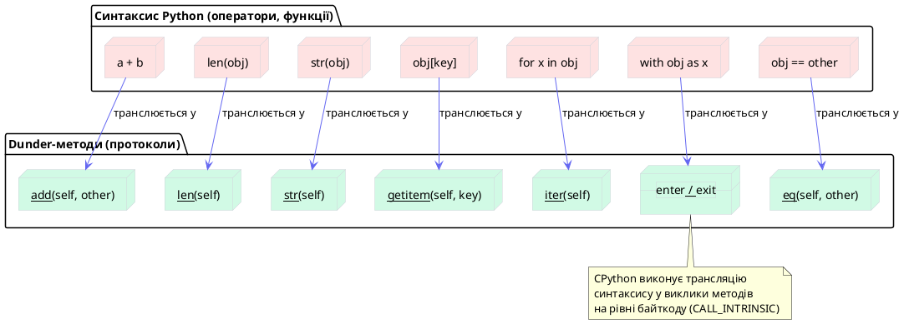
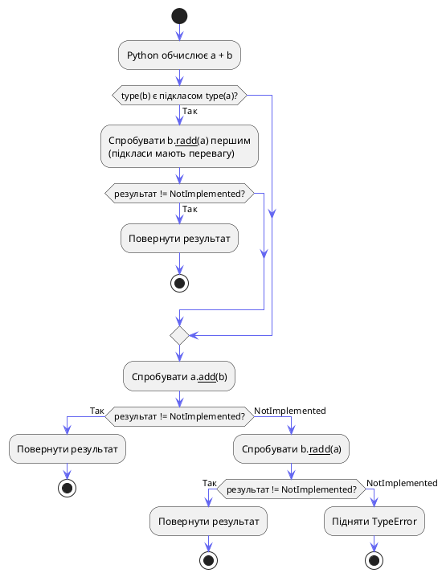
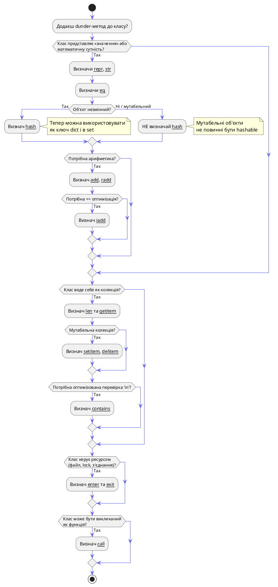

# Магічні методи (Dunder) та Емуляція протоколів

## Проблема: чому `+` працює і з числами, і з рядками?

Подивіться на ці три рядки коду і спробуйте відповісти на просте запитання: чому вони взагалі працюють?

```python
result = 42 + 8          # int + int
text   = "Hello" + " World"  # str + str
path   = Path("/usr") / "bin" / "python"  # Path / str
```

Оператор `+` додає числа. Той самий оператор зклеює рядки. Оператор `/` ділить числа, але у `pathlib.Path` він конструює шляхи файлової системи. Як один і той самий синтаксичний символ може означати абсолютно різні операції залежно від типу об'єкта?

Відповідь: **протоколи через dunder-методи**. Усе, що ви вважаєте «вбудованою магією» Python — `len([1, 2, 3])`, `for x in obj`, `with open(...) as f`, `obj[0]`, `str(obj)` — насправді є **викликами спеціальних методів** на об'єктах. Python просто перекладає синтаксичний цукор у методи.

Коли ви пишете `a + b`, Python виконує `a.__add__(b)`. Коли ви пишете `len(obj)`, Python виконує `obj.__len__()`. Коли ви пишете `with obj as x`, Python виконує `obj.__enter__()` і потім `obj.__exit__(...)`.

Це означає, що **будь-який ваш клас може брати участь у будь-якому синтаксисі Python** — варто лише реалізувати відповідний протокол. Ваш клас `Vector` може складатися через `+`. Ваш клас `Database` може використовуватись у `with`. Ваш клас `Grid` може індексуватись через `grid[x][y]`.

Саме ця система і є темою цієї статті.

::card-group

::card{title="Прозорий синтаксис" icon="i-heroicons-eye"}
Оператори, вбудовані функції та конструкції мови — все це виклики методів. Знаючи протоколи, ви точно розумієте, що відбувається за будь-яким синтаксисом Python.
::

::card{title="Розширюваність" icon="i-heroicons-puzzle-piece"}
Ваші класи стають «першокласними громадянами» мови. `Path`, `Decimal`, `datetime` — усе це звичайні класи, що реалізують dunder-методи.
::

::card{title="Інтеграція з екосистемою" icon="i-heroicons-arrow-path"}
Будь-яка бібліотека, що очікує «iterable» або «context manager», автоматично працює з вашим класом, якщо він реалізує відповідний протокол.
::

::card{title="Читабельний API" icon="i-heroicons-document-text"}
Замість `vector.add(other)` — `vector + other`. Замість `collection.length()` — `len(collection)`. Ваш код читається як природна мова.
::

::

---

## Частина I: Природа dunder-методів

### Що таке «протокол» у Python

У мовах зі статичною типізацією (Java, C#) інтерфейси є формальними контрактами: клас **зобов'язаний** оголосити, що він реалізує `Iterable<T>`, інакше компілятор відмовить. Python обирає інший шлях — **структурна типізація** (duck typing).

Якщо об'єкт має метод `__iter__`, він є ітерабельним — незалежно від того, чи успадковує він щось від `collections.abc.Iterable`. Якщо об'єкт має `__len__` і `__getitem__`, він є послідовністю. Набір таких методів, що разом реалізують певну поведінку, і є **протоколом**.

::plant-uml



::

### Як Python знаходить dunder-методи: обхід через тип, а не екземпляр

Ось критично важлива деталь, яку більшість розробників не знає. При виклику вбудованих операторів Python **не** шукає dunder-метод в `__dict__` екземпляра — він шукає його безпосередньо у **класі** (типі) об'єкта.

```python
class Weird:
    pass

obj = Weird()

# Динамічно додаємо __len__ на екземпляр (не в клас)
obj.__len__ = lambda: 42

# Інтуїтивно здається, що len(obj) поверне 42...
print(len(obj))   # TypeError: object of type 'Weird' has no len()
```

::warning
`len(obj)` викликає `type(obj).__len__(obj)` — тобто шукає метод у класі та передає екземпляр явно. Dunder-методи, визначені на рівні **екземпляра**, ігноруються при використанні через оператори та вбудовані функції. Це зроблено навмисно — для безпеки та передбачуваності (і для прискорення CPython через спеціальні слоти типу `tp_len` у C-структурі `PyTypeObject`).
::

Але якщо ви визначаєте метод у класі — все працює:

```python
class Weird:
    def __len__(self):
        return 42

obj = Weird()
print(len(obj))   # 42 ✅
```

Саме тому dunder-методи завжди визначаються у тілі класу, а не динамічно на екземплярах.

### Повна таблиця протоколів

Перш ніж зануритись у деталі, корисно побачити повну картину. Dunder-методи згруповані у **протоколи** — кожен протокол відповідає певному синтаксису або вбудованій функції.

::field-group

::field{name="Протокол представлення" type="__str__, __repr__, __format__, __bytes__"}
Перетворення об'єкта на рядок. `str(obj)` → `__str__`, `repr(obj)` → `__repr__`, f-рядки з форматом → `__format__`.
::

::field{name="Протокол порівняння" type="__eq__, __ne__, __lt__, __le__, __gt__, __ge__"}
Оператори `==`, `!=`, `<`, `<=`, `>`, `>=`. Декоратор `@functools.total_ordering` дозволяє визначити лише `__eq__` і один порядковий метод.
::

::field{name="Протокол хешування" type="__hash__"}
Використання об'єкта як ключа `dict` або елемента `set`. Нерозривно пов'язаний з `__eq__`.
::

::field{name="Арифметичний протокол" type="__add__, __sub__, __mul__, __truediv__, __floordiv__, __mod__, __pow__, __radd__, __iadd__, ..."}
Бінарні арифметичні оператори. `r`-варіанти (`__radd__`) — для правого операнда. `i`-варіанти (`__iadd__`) — для операторів присвоєння (`+=`).
::

::field{name="Унарний протокол" type="__neg__, __pos__, __abs__, __invert__, __bool__, __int__, __float__, __complex__"}
Унарні оператори (`-obj`, `+obj`, `~obj`) та перетворення типів (`bool(obj)`, `int(obj)`).
::

::field{name="Контейнерний протокол" type="__len__, __getitem__, __setitem__, __delitem__, __contains__, __iter__, __next__, __reversed__"}
Послідовності, відображення, ітератори. Основа для власних колекцій.
::

::field{name="Протокол виклику" type="__call__"}
`obj(args)` — перетворення екземпляра на callable. Основа для декораторів-класів та функторів.
::

::field{name="Протокол контекстного менеджера" type="__enter__, __exit__"}
Конструкція `with obj as x`. Гарантоване виконання коду при вході та виході з блоку.
::

::field{name="Протокол атрибутів" type="__getattr__, __setattr__, __delattr__, __getattribute__"}
Перехоплення читання, запису та видалення атрибутів. Основа для ORM-полів та проксі-об'єктів.
::

::field{name="Протокол дескриптора" type="__get__, __set__, __delete__, __set_name__"}
Детально розглянуто в окремій статті про дескриптори.
::

::

---

## Частина II: Протокол представлення

### `__repr__` проти `__str__`: два різних призначення

Це найчастіше джерело плутанини серед початківців. Обидва методи повертають рядкове представлення об'єкта, але мають **різну аудиторію та контракт**.

| Метод | Аудиторія | Призначення | Виклик |
|---|---|---|---|
| `__repr__` | Розробник | Однозначне, детальне представлення для налагодження. В ідеалі: `eval(repr(obj)) == obj` | `repr(obj)`, REPL, логи |
| `__str__` | Кінцевий користувач | Читабельне, «красиве» представлення | `str(obj)`, `print(obj)`, f-рядки |

**Правило резерву:** якщо `__str__` не визначено, Python використовує `__repr__` як резервний. Тому якщо ви визначаєте лише один метод — визначайте `__repr__`.

```python
from datetime import datetime

class LogEntry:
    """Запис у журналі подій системи."""
    
    def __init__(self, level: str, message: str, timestamp: datetime | None = None):
        self.level = level
        self.message = message
        self.timestamp = timestamp or datetime.now()
    
    def __repr__(self) -> str:
        # Для розробника: точна інформація, з якої можна відновити об'єкт
        # Мета: eval(repr(entry)) == entry (якщо реалізовано __eq__)
        return (
            f"LogEntry("
            f"level={self.level!r}, "
            f"message={self.message!r}, "
            f"timestamp={self.timestamp!r}"
            f")"
        )
    
    def __str__(self) -> str:
        # Для користувача: читабельний однорядковий формат логу
        ts = self.timestamp.strftime("%Y-%m-%d %H:%M:%S")
        return f"[{ts}] {self.level:8s} | {self.message}"


entry = LogEntry("ERROR", "Зʼєднання з базою даних втрачено")

print(str(entry))
# [2024-03-15 14:22:10] ERROR    | Зʼєднання з базою даних втрачено

print(repr(entry))
# LogEntry(level='ERROR', message='Зʼєднання з базою даних втрачено', timestamp=datetime.datetime(2024, 3, 15, 14, 22, 10, 451233))

# В REPL (інтерактивному режимі) Python автоматично показує repr():
# >>> entry
# LogEntry(level='ERROR', ...)
```

::tip
Зверніть увагу на `!r` у f-рядку всередині `__repr__`: `{self.level!r}` еквівалентно `{repr(self.level)}`. Це гарантує, що рядкові поля будуть оточені лапками у виводі, а сам вивід залишатиметься валідним Python-виразом.
::

### Метод `__format__`: власний форматний рядок

Є ще третій метод представлення, про який часто забувають: `__format__`. Він викликається, коли об'єкт використовується у f-рядку або функції `format()` зі специфікатором формату.

```python
class Temperature:
    """Температура з підтримкою форматування у різних шкалах."""
    
    def __init__(self, celsius: float):
        self.celsius = celsius
    
    @property
    def fahrenheit(self) -> float:
        return self.celsius * 9/5 + 32
    
    @property
    def kelvin(self) -> float:
        return self.celsius + 273.15
    
    def __repr__(self) -> str:
        return f"Temperature({self.celsius})"
    
    def __str__(self) -> str:
        return f"{self.celsius:.1f}°C"
    
    def __format__(self, spec: str) -> str:
        """
        Підтримувані специфікатори:
        - 'C' або '' → Цельсій
        - 'F'        → Фаренгейт
        - 'K'        → Кельвін
        """
        if spec == 'F':
            return f"{self.fahrenheit:.1f}°F"
        elif spec == 'K':
            return f"{self.kelvin:.2f}K"
        else:
            return str(self)  # Цельсій за замовчуванням


t = Temperature(100)

print(f"Вода кипить при {t}")      # Вода кипить при 100.0°C
print(f"Вода кипить при {t:F}")    # Вода кипить при 212.0°F
print(f"Вода кипить при {t:K}")    # Вода кипить при 373.15K
print(f"Вода кипить при {t:C}")    # Вода кипить при 100.0°C
```

::terminal-preview{title="python temperature.py"}

<div class="line"><span class="opacity-40">$</span> <strong>python temperature.py</strong></div>
<div class="line">Вода кипить при <span class="text-yellow-400">100.0°C</span></div>
<div class="line">Вода кипить при <span class="text-orange-400">212.0°F</span></div>
<div class="line">Вода кипить при <span class="text-blue-400">373.15K</span></div>
<div class="line">Вода кипить при <span class="text-yellow-400">100.0°C</span></div>

::

---

## Частина III: Протокол порівняння та хешування

### Оператори порівняння: шість методів

Python транслює кожен оператор порівняння у відповідний dunder-метод:

| Оператор | Метод | Назва |
|---|---|---|
| `a == b` | `a.__eq__(b)` | Рівність |
| `a != b` | `a.__ne__(b)` | Нерівність |
| `a < b` | `a.__lt__(b)` | Менше |
| `a <= b` | `a.__le__(b)` | Менше або рівне |
| `a > b` | `a.__gt__(b)` | Більше |
| `a >= b` | `a.__ge__(b)` | Більше або рівне |

Розглянемо практичний приклад: клас `Version` для семантичного версіонування.

```python
from __future__ import annotations

class Version:
    """Семантична версія у форматі MAJOR.MINOR.PATCH (SemVer)."""
    
    def __init__(self, major: int, minor: int, patch: int):
        self.major = major
        self.minor = minor
        self.patch = patch
    
    def __repr__(self) -> str:
        return f"Version({self.major}, {self.minor}, {self.patch})"
    
    def __str__(self) -> str:
        return f"{self.major}.{self.minor}.{self.patch}"
    
    def _as_tuple(self) -> tuple[int, int, int]:
        """Допоміжний метод: представлення як tuple для порівнянь."""
        return (self.major, self.minor, self.patch)
    
    def __eq__(self, other: object) -> bool:
        if not isinstance(other, Version):
            return NotImplemented  # не False! — важлива відмінність
        return self._as_tuple() == other._as_tuple()
    
    def __lt__(self, other: Version) -> bool:
        if not isinstance(other, Version):
            return NotImplemented
        return self._as_tuple() < other._as_tuple()
    
    def __le__(self, other: Version) -> bool:
        if not isinstance(other, Version):
            return NotImplemented
        return self._as_tuple() <= other._as_tuple()
    
    # __gt__ і __ge__ Python може вивести сам через @total_ordering,
    # але явне визначення краще для продуктивності та читабельності
    def __gt__(self, other: Version) -> bool:
        if not isinstance(other, Version):
            return NotImplemented
        return self._as_tuple() > other._as_tuple()
    
    def __ge__(self, other: Version) -> bool:
        if not isinstance(other, Version):
            return NotImplemented
        return self._as_tuple() >= other._as_tuple()


v1 = Version(1, 2, 3)
v2 = Version(1, 10, 0)
v3 = Version(1, 2, 3)

print(v1 == v3)   # True
print(v1 < v2)    # True  (1.2.3 < 1.10.0)
print(v2 > v1)    # True
print(v1 >= v3)   # True

# Тепер можна сортувати список версій!
versions = [Version(2, 0, 0), Version(1, 9, 1), Version(1, 2, 3)]
print(sorted(versions))
# [Version(1, 2, 3), Version(1, 9, 1), Version(2, 0, 0)]
```

::terminal-preview{title="python version.py"}

<div class="line"><span class="opacity-40">$</span> <strong>python version.py</strong></div>
<div class="line">v1 == v3: <span class="text-green-400">True</span></div>
<div class="line">v1 &lt; v2: <span class="text-green-400">True</span></div>
<div class="line">v2 &gt; v1: <span class="text-green-400">True</span></div>
<div class="line">v1 &gt;= v3: <span class="text-green-400">True</span></div>
<div class="line">sorted: <span class="text-blue-400">[Version(1, 2, 3), Version(1, 9, 1), Version(2, 0, 0)]</span></div>

::

### `NotImplemented` vs `False`: критична різниця

Зверніть увагу: при невідповідному типі методи повертають `NotImplemented`, а не `False`. Це **не** синтаксична помилка — це спеціальний синглтон CPython, який сигналізує інтерпретатору: «я не знаю, як порівнювати з цим типом, спробуй спитати іншу сторону».

Коли `a.__eq__(b)` повертає `NotImplemented`, Python автоматично спробує `b.__eq__(a)` — це механізм **відображення операторів** (reflected operators). Якщо обидва повертають `NotImplemented`, Python вдається до порівняння по ідентичності (`is`).

```python
v = Version(1, 0, 0)

# Повертає NotImplemented → Python спробує "42".__eq__(v) → теж NotImplemented
# → Python використовує identity comparison → False
print(v == "1.0.0")   # False (без помилки!)
print(v == 42)        # False (без помилки!)

# Якби ми повернули False замість NotImplemented:
# Порівняння "1.0.0" == v теж спрацювало б неправильно
```

### `@functools.total_ordering`: мінімальна реалізація

Якщо вам потрібно лише визначити порядок, але не хочеться писати всі шість методів, `functools.total_ordering` дозволяє визначити лише `__eq__` і **один** з `__lt__`, `__le__`, `__gt__`, `__ge__` — решту Python виведе автоматично.

```python
from functools import total_ordering

@total_ordering
class Priority:
    """Пріоритет завдання: LOW < MEDIUM < HIGH < CRITICAL."""
    
    _LEVELS = {"LOW": 0, "MEDIUM": 1, "HIGH": 2, "CRITICAL": 3}
    
    def __init__(self, level: str):
        if level not in self._LEVELS:
            raise ValueError(f"Невідомий рівень: {level}")
        self.level = level
    
    def __repr__(self) -> str:
        return f"Priority({self.level!r})"
    
    def __eq__(self, other: object) -> bool:
        if not isinstance(other, Priority):
            return NotImplemented
        return self._LEVELS[self.level] == self._LEVELS[other.level]
    
    def __lt__(self, other: Priority) -> bool:
        if not isinstance(other, Priority):
            return NotImplemented
        return self._LEVELS[self.level] < self._LEVELS[other.level]
    
    # __le__, __gt__, __ge__ — total_ordering виведе сам!


p1 = Priority("LOW")
p2 = Priority("HIGH")

print(p1 < p2)   # True  ← наш __lt__
print(p1 > p2)   # False ← виведено total_ordering через __lt__ та __eq__
print(p2 >= p1)  # True  ← виведено total_ordering
```

::warning
`@total_ordering` зручний, але **повільніший** за явне визначення всіх методів: кожен виведений метод виконує додаткові виклики. Для класів, що порівнюються дуже часто (наприклад, ключі у великих структурах даних), краще визначити всі методи явно.
::

### `__hash__` та контракт рівності

Ось одне з найважливіших правил Python, порушення якого породжує важко відтворювані баги:

> **Якщо `a == b`, то `hash(a) == hash(b)` — обов'язково.**
> Зворотне не вимагається: різні об'єкти можуть мати однаковий хеш (колізія).

Ця вимога необхідна тому, що словники (`dict`) та множини (`set`) використовують хеш як індекс для швидкого пошуку. Якщо два «рівних» об'єкти мають різні хеші, `dict` просто не знайде один через інший.

**Що відбувається при перевизначенні `__eq__`:**

CPython слідкує за цим контрактом автоматично: якщо ви визначаєте `__eq__` у класі, Python **автоматично встановлює `__hash__ = None`**, роблячи об'єкти нехешованими (тобто їх не можна використовувати як ключ словника або елемент множини).

```python
class BadPoint:
    def __init__(self, x, y):
        self.x = x
        self.y = y
    
    def __eq__(self, other):
        return isinstance(other, BadPoint) and self.x == other.x and self.y == other.y
    # __hash__ не визначено → автоматично None

p = BadPoint(1, 2)
print(hash(p))          # TypeError: unhashable type: 'BadPoint'
s = {p}                 # TypeError: unhashable type: 'BadPoint'
d = {p: "value"}        # TypeError: unhashable type: 'BadPoint'
```

Щоб об'єкт залишався хешованим після перевизначення `__eq__`, потрібно **явно** визначити `__hash__`:

```python
class Point:
    """Незмінна точка у 2D просторі."""
    
    def __init__(self, x: float, y: float):
        self.x = x
        self.y = y
    
    def __repr__(self) -> str:
        return f"Point({self.x}, {self.y})"
    
    def __eq__(self, other: object) -> bool:
        if not isinstance(other, Point):
            return NotImplemented
        return self.x == other.x and self.y == other.y
    
    def __hash__(self) -> int:
        # hash() від tuple гарантує сумісність з контрактом:
        # якщо self == other, то self._as_tuple() == other._as_tuple()
        # тому hash(self._as_tuple()) == hash(other._as_tuple())
        return hash((self.x, self.y))


p1 = Point(1.0, 2.0)
p2 = Point(1.0, 2.0)  # інший об'єкт, але рівний p1

print(p1 == p2)           # True
print(hash(p1) == hash(p2))  # True ✅ контракт виконано

# Тепер Point можна використовувати як ключ словника і в множині
visited = {p1, p2}
print(len(visited))   # 1 — Python розпізнав їх як рівні

cache = {p1: "result"}
print(cache[p2])      # "result" — знайдено через p2, хоча додавали через p1
```

::terminal-preview{title="python point_hash.py"}

<div class="line"><span class="opacity-40">$</span> <strong>python point_hash.py</strong></div>
<div class="line">p1 == p2: <span class="text-green-400">True</span></div>
<div class="line">hash(p1) == hash(p2): <span class="text-green-400">True</span></div>
<div class="line">len(visited): <span class="text-yellow-400">1</span>  <span class="text-gray-400"># два однакових об'єкти злилися в один елемент set</span></div>
<div class="line">cache[p2]: <span class="text-blue-400">'result'</span></div>

::

::important
**Хешування та мутабельність.** Мутабельні об'єкти, як правило, **не повинні** бути хешованими. Уявіть: ви додали `p` у `set`, потім змінили `p.x` — хеш змінився, але множина не знає про це. Тепер `p` «загублено» всередині множини. Саме тому `list` не є хешованим, а `tuple` — є. Якщо ваш клас мутабельний і ви хочете `__eq__` — не визначайте `__hash__` і приймайте, що об'єкти будуть нехешованими.
::

---

## Частина IV: Арифметичний протокол

### Бінарні оператори: ліві, праві та in-place варіанти

Арифметичний протокол Python містить три рівні для кожного оператора:

::field-group

::field{name="__add__(self, other)" type="Лівий оператор"}
Викликається для лівого операнда: `a + b` → `a.__add__(b)`. Якщо повертає `NotImplemented`, Python пробує правий варіант.
::

::field{name="__radd__(self, other)" type="Правий (reflected) оператор"}
Викликається для правого операнда, якщо лівий повернув `NotImplemented`: `a + b` → `b.__radd__(a)`. Необхідний для сумісності з вбудованими типами (наприклад, `5 + my_obj`).
::

::field{name="__iadd__(self, other)" type="In-place оператор"}
Викликається для `a += b`. Якщо не визначено — Python використовує `__add__` та перепризначає змінну. Для мутабельних об'єктів варто визначати явно, щоб уникнути створення нового об'єкта.
::

::

Побудуємо клас `Vector` для двовимірного вектора — класичний приклад, що добре ілюструє всі три рівні:

```python
from __future__ import annotations
import math

class Vector:
    """Двовимірний вектор з підтримкою арифметики."""
    
    def __init__(self, x: float, y: float):
        self.x = x
        self.y = y
    
    def __repr__(self) -> str:
        return f"Vector({self.x}, {self.y})"
    
    def __str__(self) -> str:
        return f"({self.x}, {self.y})"
    
    # --- Лівий оператор + ---
    def __add__(self, other: Vector) -> Vector:
        if not isinstance(other, Vector):
            return NotImplemented
        return Vector(self.x + other.x, self.y + other.y)
    
    # --- Правий оператор + (для: scalar + Vector — не підходить,
    #     але для Vector + Vector з іншого класу) ---
    def __radd__(self, other: object) -> Vector:
        # Тут можна підтримати sum([v1, v2, v3]):
        # sum() починає з 0 + v1 → 0.__add__(v1) → NotImplemented
        # → v1.__radd__(0) → тут ми обробляємо int(0)
        if other == 0:
            return self  # нейтральний елемент для sum()
        return NotImplemented
    
    # --- In-place += ---
    def __iadd__(self, other: Vector) -> Vector:
        if not isinstance(other, Vector):
            return NotImplemented
        # Мутуємо self, повертаємо self — не створюємо новий об'єкт
        self.x += other.x
        self.y += other.y
        return self
    
    # --- Субтракція ---
    def __sub__(self, other: Vector) -> Vector:
        if not isinstance(other, Vector):
            return NotImplemented
        return Vector(self.x - other.x, self.y - other.y)
    
    # --- Множення: вектор * скаляр ---
    def __mul__(self, scalar: float) -> Vector:
        if not isinstance(scalar, (int, float)):
            return NotImplemented
        return Vector(self.x * scalar, self.y * scalar)
    
    # --- Множення: скаляр * вектор (2.0 * v) ---
    def __rmul__(self, scalar: float) -> Vector:
        return self.__mul__(scalar)  # комутативна операція
    
    # --- Унарний мінус: -v ---
    def __neg__(self) -> Vector:
        return Vector(-self.x, -self.y)
    
    # --- Абсолютне значення: довжина вектора ---
    def __abs__(self) -> float:
        return math.sqrt(self.x ** 2 + self.y ** 2)
    
    # --- bool: ненульовий вектор ---
    def __bool__(self) -> bool:
        return bool(self.x or self.y)
    
    def __eq__(self, other: object) -> bool:
        if not isinstance(other, Vector):
            return NotImplemented
        return self.x == other.x and self.y == other.y


# Демонстрація
v1 = Vector(1, 2)
v2 = Vector(3, 4)

print(v1 + v2)          # (4, 6)
print(v2 - v1)          # (2, 2)
print(v1 * 3.0)         # (3.0, 6.0)
print(2.0 * v1)         # (2.0, 4.0)  ← __rmul__ у дії
print(-v1)              # (-1, -2)
print(abs(v2))          # 5.0 (теорема Піфагора: √(9+16))
print(bool(Vector(0,0)))  # False
print(bool(v1))           # True

# Магія __radd__: sum() тепер працює зі списком векторів!
vectors = [Vector(1, 0), Vector(0, 2), Vector(3, 1)]
total = sum(vectors)    # sum(iterable, start=0): 0 + v1 + v2 + v3
print(total)            # (4, 3)

# In-place оператор: мутує v1, не створює новий об'єкт
original_id = id(v1)
v1 += Vector(10, 10)
print(v1)               # (11, 12)
print(id(v1) == original_id)  # True — той самий об'єкт!
```

::terminal-preview{title="python vector.py"}

<div class="line"><span class="opacity-40">$</span> <strong>python vector.py</strong></div>
<div class="line">v1 + v2: <span class="text-blue-400">(4, 6)</span></div>
<div class="line">v2 - v1: <span class="text-blue-400">(2, 2)</span></div>
<div class="line">v1 * 3.0: <span class="text-blue-400">(3.0, 6.0)</span></div>
<div class="line">2.0 * v1: <span class="text-blue-400">(2.0, 4.0)</span>  <span class="text-gray-400"># __rmul__</span></div>
<div class="line">-v1: <span class="text-blue-400">(-1, -2)</span></div>
<div class="line">abs(v2): <span class="text-green-400">5.0</span></div>
<div class="line">bool(Vector(0,0)): <span class="text-rose-400">False</span></div>
<div class="line">bool(v1): <span class="text-green-400">True</span></div>
<div class="line">sum(vectors): <span class="text-blue-400">(4, 3)</span></div>
<div class="line">v1 після +=: <span class="text-blue-400">(11, 12)</span></div>
<div class="line">той самий об'єкт: <span class="text-green-400">True</span></div>

::

### Алгоритм вирішення бінарного оператора

Щоб остаточно зрозуміти, як Python вибирає між `__add__` та `__radd__`, розглянемо повний алгоритм:

::plant-uml



::

Ця поведінка пояснює, чому `5 + Vector(1, 2)` працює: `int.__add__(Vector)` → `NotImplemented`, тоді Python пробує `Vector.__radd__(5)` → успіх (якщо реалізовано).

### Протокол матричного множення: `__matmul__`

Python 3.5 (PEP 465) додав спеціальний оператор `@` для матричного множення, щоб бібліотеки на кшталт NumPy могли писати `A @ B` замість `np.dot(A, B)`. Він слідує тій самій схемі:

```python
class Matrix:
    """Спрощена матриця 2x2 для демонстрації @ оператора."""
    
    def __init__(self, data: list[list[float]]):
        self.data = data
    
    def __repr__(self) -> str:
        return f"Matrix({self.data})"
    
    def __matmul__(self, other: Matrix) -> Matrix:
        """Матричне множення через оператор @."""
        if not isinstance(other, Matrix):
            return NotImplemented
        a, b = self.data, other.data
        return Matrix([
            [a[0][0]*b[0][0] + a[0][1]*b[1][0],  a[0][0]*b[0][1] + a[0][1]*b[1][1]],
            [a[1][0]*b[0][0] + a[1][1]*b[1][0],  a[1][0]*b[0][1] + a[1][1]*b[1][1]],
        ])


A = Matrix([[1, 2], [3, 4]])
B = Matrix([[5, 6], [7, 8]])
C = A @ B   # __matmul__ у дії
print(C)    # Matrix([[19, 22], [43, 50]])
```

---

## Частина V: Контейнерний протокол

### Емуляція колекцій: повний набір методів

Контейнерний протокол дозволяє вашому класу поводитись як вбудована колекція — список, словник або множина. Ключові методи:

::field-group

::field{name="__len__(self) -> int" type="Довжина"}
Викликається `len(obj)`. Повинен повертати невід'ємне ціле число. Також неявно використовується у `bool(obj)` якщо `__bool__` не визначено: `len == 0` → `False`.
::

::field{name="__getitem__(self, key)" type="Читання елемента"}
Викликається `obj[key]`. Для послідовностей `key` — цілочисельний індекс або `slice`. Для відображень — довільний hashable ключ. При виході за межі повинен підіймати `IndexError` (послідовності) або `KeyError` (відображення).
::

::field{name="__setitem__(self, key, value)" type="Запис елемента"}
Викликається `obj[key] = value`. Робить колекцію мутабельною.
::

::field{name="__delitem__(self, key)" type="Видалення елемента"}
Викликається `del obj[key]`.
::

::field{name="__contains__(self, item) -> bool" type="Перевірка належності"}
Викликається оператором `in`: `item in obj`. Якщо не визначено — Python ітерує по всьому об'єкту через `__iter__` (O(n)), тому для словників та множин важливо визначати явно (O(1)).
::

::field{name="__iter__(self)" type="Ітерація"}
Викликається `for x in obj`, `list(obj)`, `*unpacking`. Повинен повертати **ітератор** — об'єкт з методом `__next__`.
::

::field{name="__next__(self)" type="Наступний елемент ітератора"}
Повертає наступний елемент або підіймає `StopIteration` коли елементи вичерпано.
::

::field{name="__reversed__(self)" type="Зворотня ітерація"}
Викликається `reversed(obj)`. Якщо не визначено — Python намагається використати `__len__` та `__getitem__` для зворотньої ітерації.
::

::

### Практика: власна кільцева черга

Побудуємо `RingBuffer` — кільцеву буферну структуру даних фіксованого розміру. Коли буфер повний, нові елементи перезаписують найстаріші. Це класична структура для обробки потоків даних у реальному часі.

```python
from __future__ import annotations
from typing import Iterator, TypeVar, Generic

T = TypeVar('T')


class RingBuffer(Generic[T]):
    """
    Кільцева черга фіксованого розміру.
    
    При переповненні найстаріші елементи автоматично
    витісняються новими — без виключень, без збоїв.
    Ефективне використання пам'яті: фіксований розмір назавжди.
    """
    
    def __init__(self, capacity: int):
        if capacity <= 0:
            raise ValueError("Ємність буфера повинна бути > 0")
        self._capacity = capacity
        self._buffer: list[T | None] = [None] * capacity
        self._head = 0   # індекс для читання (найстаріший елемент)
        self._tail = 0   # індекс для запису (наступна вільна позиція)
        self._size = 0   # кількість актуальних елементів
    
    # --- Протокол представлення ---
    
    def __repr__(self) -> str:
        items = list(self)  # використовує __iter__
        return f"RingBuffer(capacity={self._capacity}, items={items})"
    
    def __str__(self) -> str:
        items = list(self)
        return f"RingBuffer[{', '.join(str(x) for x in items)}]"
    
    # --- Контейнерний протокол ---
    
    def __len__(self) -> int:
        """Кількість актуальних елементів у буфері."""
        return self._size
    
    def __bool__(self) -> bool:
        """True якщо буфер не порожній."""
        return self._size > 0
    
    def __contains__(self, item: object) -> bool:
        """Перевірка наявності елемента: O(n)."""
        for element in self:
            if element == item:
                return True
        return False
    
    def __getitem__(self, index: int) -> T:
        """
        Читання за індексом від голови (0 = найстаріший).
        Підтримує від'ємні індекси: -1 = найновіший.
        """
        if not (-self._size <= index < self._size):
            raise IndexError(
                f"Індекс {index} виходить за межі буфера розміром {self._size}"
            )
        if index < 0:
            index += self._size
        real_index = (self._head + index) % self._capacity
        return self._buffer[real_index]  # type: ignore[return-value]
    
    def __iter__(self) -> Iterator[T]:
        """Ітерація від найстарішого до найновішого елемента."""
        for i in range(self._size):
            yield self._buffer[(self._head + i) % self._capacity]  # type: ignore[misc]
    
    def __reversed__(self) -> Iterator[T]:
        """Зворотня ітерація: від найновішого до найстарішого."""
        for i in range(self._size - 1, -1, -1):
            yield self._buffer[(self._head + i) % self._capacity]  # type: ignore[misc]
    
    # --- Мутуючі операції ---
    
    def append(self, item: T) -> None:
        """
        Додає елемент у кінець буфера.
        Якщо буфер повний — витісняє найстаріший елемент.
        """
        self._buffer[self._tail] = item
        self._tail = (self._tail + 1) % self._capacity
        
        if self._size < self._capacity:
            self._size += 1
        else:
            # Буфер повний: голова теж рухається вперед (витіснення)
            self._head = (self._head + 1) % self._capacity
    
    def popleft(self) -> T:
        """Вилучає та повертає найстаріший елемент."""
        if self._size == 0:
            raise IndexError("popleft() з порожнього буфера")
        item = self._buffer[self._head]
        self._buffer[self._head] = None  # звільняємо посилання (GC)
        self._head = (self._head + 1) % self._capacity
        self._size -= 1
        return item  # type: ignore[return-value]


# --- Демонстрація ---

buf: RingBuffer[int] = RingBuffer(capacity=4)

# Наповнюємо буфер
for i in range(1, 5):
    buf.append(i)

print(buf)          # RingBuffer[1, 2, 3, 4]
print(len(buf))     # 4
print(buf[0])       # 1  (найстаріший)
print(buf[-1])      # 4  (найновіший)
print(3 in buf)     # True

# Витіснення: додаємо при повному буфері
buf.append(5)       # витісняє 1
buf.append(6)       # витісняє 2
print(buf)          # RingBuffer[3, 4, 5, 6]

# Зворотня ітерація
print(list(reversed(buf)))  # [6, 5, 4, 3]

# for-цикл через __iter__
print([x * 2 for x in buf])  # [6, 8, 10, 12]

# popleft
oldest = buf.popleft()
print(f"Вилучено: {oldest}, залишок: {buf}")
# Вилучено: 3, залишок: RingBuffer[4, 5, 6]
```

::terminal-preview{title="python ring_buffer.py"}

<div class="line"><span class="opacity-40">$</span> <strong>python ring_buffer.py</strong></div>
<div class="line">RingBuffer[<span class="text-blue-400">1, 2, 3, 4</span>]</div>
<div class="line">len: <span class="text-yellow-400">4</span></div>
<div class="line">buf[0]: <span class="text-yellow-400">1</span></div>
<div class="line">buf[-1]: <span class="text-yellow-400">4</span></div>
<div class="line">3 in buf: <span class="text-green-400">True</span></div>
<div class="line">після витіснення: RingBuffer[<span class="text-blue-400">3, 4, 5, 6</span>]</div>
<div class="line">reversed: [<span class="text-blue-400">6, 5, 4, 3</span>]</div>
<div class="line">x*2: [<span class="text-blue-400">6, 8, 10, 12</span>]</div>
<div class="line">Вилучено: <span class="text-yellow-400">3</span>, залишок: RingBuffer[<span class="text-blue-400">4, 5, 6</span>]</div>

::

### Ітератор як окремий об'єкт: `__iter__` + `__next__`

У прикладі вище `RingBuffer` використовує `yield` всередині `__iter__` — це генераторна функція, яка автоматично повертає ітератор. Але важливо розуміти, що Python розрізняє два поняття:

- **Ітерабельний об'єкт** (iterable): має `__iter__`, що повертає ітератор. Може ітеруватись багаторазово.
- **Ітератор** (iterator): має `__next__`, що повертає наступний елемент або підіймає `StopIteration`. Ітерується лише один раз.

```python
class CountDown:
    """Ітерабельний об'єкт: від n до 1."""
    
    def __init__(self, start: int):
        self.start = start
    
    def __iter__(self) -> CountDownIterator:
        # Кожного разу повертаємо НОВИЙ ітератор → можна ітерувати багаторазово
        return CountDownIterator(self.start)


class CountDownIterator:
    """Ітератор для CountDown: зберігає поточний стан обходу."""
    
    def __init__(self, current: int):
        self._current = current
    
    def __iter__(self) -> CountDownIterator:
        # Ітератор теж має __iter__ (повертає себе) — вимога протоколу
        return self
    
    def __next__(self) -> int:
        if self._current <= 0:
            raise StopIteration
        value = self._current
        self._current -= 1
        return value


countdown = CountDown(3)

# Перша ітерація
print(list(countdown))   # [3, 2, 1]

# Друга ітерація — повний обхід знову, бо __iter__ повертає новий об'єкт
print(list(countdown))   # [3, 2, 1]   ← не порожній!

# Але безпосередньо ітератор — одноразовий
it = iter(countdown)     # iter(obj) викликає obj.__iter__()
print(next(it))          # 3
print(next(it))          # 2
print(list(it))          # [1]  ← залишок
print(list(it))          # []   ← вичерпано
```

::tip
`for x in obj` під капотом виконує: `_iter = iter(obj)` (виклик `obj.__iter__()`), потім у циклі `x = next(_iter)` до `StopIteration`. Вбудована функція `iter()` перевіряє також наявність `__getitem__` — для зворотньої сумісності зі старими класами, що не мають `__iter__`.
::

---

## Частина VI: Протокол виклику — `__call__`

### Об'єкти як функції

Метод `__call__` перетворює екземпляр класу на **callable** — об'єкт, який можна викликати з дужками, як функцію. Це відкриває архітектурний простір між функціями та класами: callable-об'єкт може зберігати стан між викликами, на відміну від звичайної функції.

```python
class Multiplier:
    """Callable-об'єкт: множить вхідне значення на фіксований коефіцієнт."""
    
    def __init__(self, factor: float):
        self.factor = factor
    
    def __repr__(self) -> str:
        return f"Multiplier(factor={self.factor})"
    
    def __call__(self, value: float) -> float:
        """Викликається як: multiplier(value)"""
        return value * self.factor


double = Multiplier(2)
triple = Multiplier(3)

print(double(5))    # 10.0
print(triple(5))    # 15.0
print(double(triple(4)))  # double(12) = 24.0

# Перевірка callable
import inspect
print(callable(double))            # True
print(inspect.isfunction(double))  # False — це не функція, а callable об'єкт
```

### Практичний сценарій: LRU-кеш як callable-клас

Найпоширеніший виробничий сценарій для `__call__` — **декоратори у вигляді класів**. Клас-декоратор може зберігати стан (наприклад, кеш результатів, лічильник викликів, дані авторизації) між викликами.

```python
from __future__ import annotations
from collections import OrderedDict
from typing import Callable, TypeVar, ParamSpec
import functools

P = ParamSpec('P')
R = TypeVar('R')


class LRUCache:
    """
    Декоратор-клас: кешує результати функції з витісненням
    найменш нещодавно використаних (Least Recently Used) записів.
    
    Використання:
        @LRUCache(maxsize=128)
        def expensive_function(x): ...
    """
    
    def __init__(self, maxsize: int = 128):
        self.maxsize = maxsize
        self._cache: OrderedDict = OrderedDict()
        self._hits = 0
        self._misses = 0
        self._func: Callable | None = None
    
    def __call__(self, *args, **kwargs):
        """
        Два режими роботи:
        1. Якщо func ще не встановлено (@LRUCache(128)) → отримуємо функцію
        2. Якщо func встановлено → виконуємо з кешуванням
        """
        if self._func is None:
            # Перший виклик: args[0] — це декорована функція
            func = args[0]
            self._func = func
            functools.update_wrapper(self, func)
            return self
        
        # Другий+ виклики: args — це аргументи декорованої функції
        key = (args, tuple(sorted(kwargs.items())))
        
        if key in self._cache:
            # Cache hit: переміщуємо на кінець (нещодавно використаний)
            self._cache.move_to_end(key)
            self._hits += 1
            return self._cache[key]
        
        # Cache miss: обчислюємо результат
        result = self._func(*args, **kwargs)
        self._cache[key] = result
        self._misses += 1
        
        # Витіснення найстарішого запису при переповненні
        if len(self._cache) > self.maxsize:
            self._cache.popitem(last=False)
        
        return result
    
    @property
    def cache_info(self) -> dict:
        return {
            "hits": self._hits,
            "misses": self._misses,
            "maxsize": self.maxsize,
            "currsize": len(self._cache),
        }
    
    def cache_clear(self) -> None:
        self._cache.clear()
        self._hits = 0
        self._misses = 0


# Декорування: @LRUCache(maxsize=4) → LRUCache(4).__call__(fibonacci)
@LRUCache(maxsize=4)
def fibonacci(n: int) -> int:
    """Класичний рекурсивний Fibonacci — без кешу дуже повільний."""
    if n <= 1:
        return n
    return fibonacci(n - 1) + fibonacci(n - 2)


print(fibonacci(10))   # 55
print(fibonacci(10))   # 55 (з кешу)
print(fibonacci(8))    # 21
print(fibonacci.cache_info)
# {'hits': ..., 'misses': ..., 'maxsize': 4, 'currsize': 4}
```

::terminal-preview{title="python lru_cache.py"}

<div class="line"><span class="opacity-40">$</span> <strong>python lru_cache.py</strong></div>
<div class="line">fibonacci(10): <span class="text-green-400">55</span></div>
<div class="line">fibonacci(10) [cache]: <span class="text-green-400">55</span></div>
<div class="line">fibonacci(8): <span class="text-green-400">21</span></div>
<div class="line">cache_info: <span class="text-blue-400">{'hits': 1, 'misses': 11, 'maxsize': 4, 'currsize': 4}</span></div>

::

### `__call__` та перевірка callable

Вбудована функція `callable(obj)` повертає `True`, якщо об'єкт має `__call__`. Це дозволяє писати код, що однаково працює і з функціями, і з callable-класами:

```python
def apply_twice(func_or_callable, value):
    """Застосовує callable двічі до значення."""
    if not callable(func_or_callable):
        raise TypeError(f"Очікується callable, отримано {type(func_or_callable)}")
    return func_or_callable(func_or_callable(value))


# Звичайна функція
print(apply_twice(lambda x: x + 1, 5))   # 7

# Callable-об'єкт
doubler = Multiplier(2)
print(apply_twice(doubler, 3))            # 12  (3*2*2)
```

---

## Частина VII: Протокол контекстного менеджера

### `with` під капотом: `__enter__` та `__exit__`

Конструкція `with` — одна з найелегантніших в Python. Вона гарантує виконання коду очищення (закриття файлів, звільнення lock'ів, відкат транзакцій) навіть при виникненні виключення. За цим стоять два методи:

::field-group

::field{name="__enter__(self)" type="() -> Any"}
Викликається на початку блоку `with`. Повернене значення прив'язується до змінної після `as` (якщо вона є). Може повертати `self` або будь-який інший об'єкт.
::

::field{name="__exit__(self, exc_type, exc_val, exc_tb)" type="(type | None, Exception | None, TracebackType | None) -> bool | None"}
Викликається при виході з блоку `with` — завжди, навіть при виключенні. Якщо виключення сталося, отримує його тип, значення та трасування стека. Якщо повертає `True` — виключення пригнічується (не поширюється далі). Якщо `False` або `None` — виключення продовжує розповсюджуватись.
::

::

```python
# Що відбувається при виконанні:
with some_obj as x:
    do_something(x)

# Еквівалентно:
_mgr = some_obj
x = _mgr.__enter__()
_exc = True
try:
    try:
        do_something(x)
    except:
        _exc = False
        if not _mgr.__exit__(*sys.exc_info()):
            raise
finally:
    if _exc:
        _mgr.__exit__(None, None, None)
```

### Побудова власного контекстного менеджера

Реалізуємо `ManagedTransaction` — спрощений аналог транзакції бази даних:

```python
from __future__ import annotations
import logging
from types import TracebackType
from typing import Type

logger = logging.getLogger(__name__)


class ManagedTransaction:
    """
    Контекстний менеджер для транзакцій бази даних.
    
    Використання:
        with ManagedTransaction(connection) as tx:
            tx.execute("INSERT INTO ...")
            tx.execute("UPDATE ...")
        # При виході без виключення — COMMIT
        # При виключенні — автоматичний ROLLBACK
    """
    
    def __init__(self, connection):
        self._conn = connection
        self._operations: list[str] = []
        self._committed = False
    
    def __enter__(self) -> ManagedTransaction:
        """
        Починає транзакцію.
        Повертає self — щоб блок `as tx` отримав об'єкт транзакції.
        """
        logger.debug("Транзакція розпочата")
        self._conn.begin()
        return self
    
    def __exit__(
        self,
        exc_type: Type[BaseException] | None,
        exc_val: BaseException | None,
        exc_tb: TracebackType | None,
    ) -> bool:
        """
        Завершує транзакцію.
        
        exc_type is None → виконання пройшло успішно → COMMIT
        exc_type is not None → виникло виключення → ROLLBACK
        
        Повертаємо False → не пригнічуємо виключення.
        """
        if exc_type is None:
            # Нормальний вихід: зберігаємо зміни
            self._conn.commit()
            self._committed = True
            logger.info(f"Транзакція закомічена ({len(self._operations)} операцій)")
        else:
            # Виключення: відкатуємо всі зміни
            self._conn.rollback()
            logger.error(
                f"Транзакція відкочена через {exc_type.__name__}: {exc_val}"
            )
        
        return False  # не пригнічуємо виключення
    
    def execute(self, sql: str, params: tuple = ()) -> None:
        """Виконує SQL-запит у рамках транзакції."""
        self._operations.append(sql)
        self._conn.execute(sql, params)


# --- Симуляція з'єднання ---

class FakeConnection:
    def begin(self):    print("  [DB] BEGIN TRANSACTION")
    def commit(self):   print("  [DB] COMMIT")
    def rollback(self): print("  [DB] ROLLBACK")
    def execute(self, sql, params=()):
        print(f"  [DB] EXECUTE: {sql} | params={params}")


conn = FakeConnection()

# Сценарій 1: успішна транзакція
print("=== Сценарій 1: успіх ===")
with ManagedTransaction(conn) as tx:
    tx.execute("INSERT INTO orders (user_id) VALUES (?)", (42,))
    tx.execute("UPDATE inventory SET qty = qty - 1 WHERE id = ?", (7,))
# → автоматичний COMMIT

print()

# Сценарій 2: виключення всередині → автоматичний ROLLBACK
print("=== Сценарій 2: помилка ===")
try:
    with ManagedTransaction(conn) as tx:
        tx.execute("INSERT INTO orders (user_id) VALUES (?)", (99,))
        raise ValueError("Недостатньо коштів на рахунку")
        tx.execute("UPDATE inventory SET qty = qty - 1 WHERE id = ?", (3,))
except ValueError as e:
    print(f"Перехоплено: {e}")
# → автоматичний ROLLBACK, виключення продовжило розповсюджуватись
```

::terminal-preview{title="python transaction.py"}

<div class="line"><span class="opacity-40">$</span> <strong>python transaction.py</strong></div>
<div class="line">=== Сценарій 1: успіх ===</div>
<div class="line">  [DB] <span class="text-blue-400">BEGIN TRANSACTION</span></div>
<div class="line">  [DB] EXECUTE: INSERT INTO orders (user_id) VALUES (?) | params=(42,)</div>
<div class="line">  [DB] EXECUTE: UPDATE inventory SET qty = qty - 1 WHERE id = ? | params=(7,)</div>
<div class="line">  [DB] <span class="text-green-400">COMMIT</span></div>
<div class="line"></div>
<div class="line">=== Сценарій 2: помилка ===</div>
<div class="line">  [DB] <span class="text-blue-400">BEGIN TRANSACTION</span></div>
<div class="line">  [DB] EXECUTE: INSERT INTO orders (user_id) VALUES (?) | params=(99,)</div>
<div class="line">  [DB] <span class="text-rose-400">ROLLBACK</span></div>
<div class="line">Перехоплено: <span class="text-rose-400">Недостатньо коштів на рахунку</span></div>

::

### Пригнічення виключень: коли `__exit__` повертає `True`

Є сценарії, де ви хочете **поглинути** виключення всередині `with` — наприклад, клас `suppress` з модуля `contextlib`:

```python
class Suppress:
    """
    Контекстний менеджер: пригнічує вказані типи виключень.
    Аналог contextlib.suppress з stdlib.
    
    Використання:
        with Suppress(FileNotFoundError, PermissionError):
            os.remove("/tmp/maybe_exists.txt")
        # Якщо файл не існує — виключення просто ігнорується
    """
    
    def __init__(self, *exception_types: type[BaseException]):
        self._types = exception_types
    
    def __enter__(self) -> Suppress:
        return self
    
    def __exit__(
        self,
        exc_type: type[BaseException] | None,
        exc_val: BaseException | None,
        exc_tb,
    ) -> bool:
        # Якщо виключення є і воно одного з вказаних типів — пригнічуємо
        if exc_type is not None and issubclass(exc_type, self._types):
            return True   # ← True = виключення пригнічено
        return False      # ← False = пропускаємо виключення далі


import os

with Suppress(FileNotFoundError):
    os.remove("/tmp/file_that_does_not_exist.txt")

print("Продовжуємо роботу без зупинки")  # виконається
```

### `contextlib.contextmanager`: декораторний спосіб

Для простих випадків писати клас із `__enter__`/`__exit__` — зайво. `contextlib.contextmanager` дозволяє створити контекстний менеджер з генераторної функції:

```python
from contextlib import contextmanager
import time

@contextmanager
def timer(label: str):
    """
    Контекстний менеджер для вимірювання часу виконання блоку.
    
    yield розділяє __enter__ (код до yield) та __exit__ (код після yield).
    Значення після yield — це те, що прив'язується до 'as'.
    """
    start = time.perf_counter()
    results = {}
    try:
        yield results          # __enter__: передаємо словник для результатів
    finally:
        elapsed = time.perf_counter() - start
        results['elapsed'] = elapsed
        print(f"[{label}] виконано за {elapsed:.4f}с")


with timer("Сортування") as info:
    data = list(range(100_000, 0, -1))
    data.sort()

print(f"Деталі: {info}")
# [Сортування] виконано за 0.0089с
# Деталі: {'elapsed': 0.0089...}
```

::tip
Код **до** `yield` у `contextmanager`-генераторі виконується як `__enter__`. Код **після** `yield` — як `__exit__`. Блок `try/finally` навколо `yield` гарантує виконання коду очищення навіть при виключенні всередині `with`-блоку.
::

---

## Частина VIII: Протокол атрибутів

### Перехоплення доступу до атрибутів

Python надає чотири методи для перехоплення операцій з атрибутами:

::field-group

::field{name="__getattribute__(self, name: str)" type="Перехоплення БУДЬ-ЯКОГО читання"}
Викликається при кожному зверненні до атрибута: `obj.attr`. Перехоплює навіть атрибути, що існують. Перевизначення вимагає обережності — необхідно звертатись до `super().__getattribute__(name)`, щоб не потрапити у нескінченну рекурсію. Використовується рідко.
::

::field{name="__getattr__(self, name: str)" type="Перехоплення ВІДСУТНЬОГО атрибута"}
Викликається **лише** якщо атрибут не знайдено стандартним способом (не в `__dict__` та не в класі). Ідеальний для lazy-завантаження, проксі-об'єктів та динамічних API.
::

::field{name="__setattr__(self, name: str, value)" type="Перехоплення запису"}
Викликається при кожному `obj.attr = value`. Для збереження значення потрібно звертатись до `object.__setattr__(self, name, value)` або `self.__dict__[name] = value`, щоб уникнути рекурсії.
::

::field{name="__delattr__(self, name: str)" type="Перехоплення видалення"}
Викликається при `del obj.attr`.
::

::

### Практичний сценарій: Frozen об'єкт (незмінний після ініціалізації)

```python
class FrozenObject:
    """
    Об'єкт, атрибути якого можна встановити лише в __init__.
    Після завершення ініціалізації будь-яка спроба змінити
    або додати атрибут піднімає AttributeError.
    
    Досягається перехопленням __setattr__.
    """
    
    _is_initialized = False  # атрибут класу — не блокується __setattr__
    
    def __init__(self, **kwargs):
        # Тимчасово дозволяємо запис для ініціалізації
        for key, value in kwargs.items():
            # Звертаємось до базового __setattr__ щоб уникнути рекурсії
            object.__setattr__(self, key, value)
        # Позначаємо: ініціалізація завершена
        object.__setattr__(self, '_is_initialized', True)
    
    def __setattr__(self, name: str, value) -> None:
        if self._is_initialized:
            raise AttributeError(
                f"Об'єкт {type(self).__name__!r} є незмінним. "
                f"Неможливо встановити '{name}'"
            )
        object.__setattr__(self, name, value)
    
    def __delattr__(self, name: str) -> None:
        raise AttributeError(
            f"Об'єкт {type(self).__name__!r} є незмінним. "
            f"Неможливо видалити '{name}'"
        )
    
    def __repr__(self) -> str:
        attrs = {k: v for k, v in self.__dict__.items() if not k.startswith('_')}
        params = ', '.join(f"{k}={v!r}" for k, v in attrs.items())
        return f"{type(self).__name__}({params})"


config = FrozenObject(host="localhost", port=5432, db="myapp")
print(config)           # FrozenObject(host='localhost', port=5432, db='myapp')
print(config.host)      # localhost

try:
    config.host = "production.db"   # AttributeError!
except AttributeError as e:
    print(f"Помилка: {e}")

try:
    config.new_field = "oops"       # AttributeError!
except AttributeError as e:
    print(f"Помилка: {e}")
```

::terminal-preview{title="python frozen.py"}

<div class="line"><span class="opacity-40">$</span> <strong>python frozen.py</strong></div>
<div class="line">FrozenObject(<span class="text-blue-400">host='localhost', port=5432, db='myapp'</span>)</div>
<div class="line">config.host: <span class="text-green-400">localhost</span></div>
<div class="line">Помилка: <span class="text-rose-400">Об'єкт 'FrozenObject' є незмінним. Неможливо встановити 'host'</span></div>
<div class="line">Помилка: <span class="text-rose-400">Об'єкт 'FrozenObject' є незмінним. Неможливо встановити 'new_field'</span></div>

::

### `__getattr__` для динамічних проксі

`__getattr__` є ідеальним для побудови проксі-об'єктів та динамічних делегаторів:

```python
class LazyLoader:
    """
    Проксі-об'єкт, що ліниво завантажує важкі атрибути
    лише при першому зверненні до них.
    """
    
    def __init__(self):
        self._cache: dict = {}
    
    def __getattr__(self, name: str):
        # Цей метод викликається ЛИШЕ якщо 'name' не знайдено звичайним шляхом
        if name in self._cache:
            return self._cache[name]
        
        # Симуляція важкого обчислення
        print(f"[LazyLoader] Завантаження '{name}'...")
        import time; time.sleep(0.01)  # у реальності: читання файлу, запит до БД
        
        value = f"<значення для {name}>"
        self._cache[name] = value
        # Зберігаємо в __dict__, щоб наступного разу __getattr__ не викликався
        object.__setattr__(self, name, value)
        return value


loader = LazyLoader()
print(loader.config)    # [LazyLoader] Завантаження 'config'...  → <значення для config>
print(loader.config)    # <значення для config>  ← кеш, без завантаження
print(loader.schema)    # [LazyLoader] Завантаження 'schema'...  → <значення для schema>
```

---

## Частина IX: Схема прийняття рішень та підводні камені

### Коли що визначати: алгоритм вибору

Перш ніж реалізовувати dunder-метод, варто відповісти на кілька запитань:

::plant-uml



::

### Топ-5 підводних каменів

::warning
**Підводний камінь 1: Рекурсія у `__setattr__`**

```python
class Bad:
    def __setattr__(self, name, value):
        self.name = value  # ← НЕСКІНЧЕННА РЕКУРСІЯ! self.name → __setattr__

class Good:
    def __setattr__(self, name, value):
        self.__dict__[name] = value  # ← пряма робота зі словником
        # або: object.__setattr__(self, name, value)
```
::

::warning
**Підводний камінь 2: `__eq__` без `__hash__` → нехешований об'єкт**

Якщо визначили `__eq__` — Python автоматично обнулює `__hash__`. Якщо об'єкт має бути хешованим (ключ dict, елемент set), завжди визначайте `__hash__` разом із `__eq__`.
::

::warning
**Підводний камінь 3: Повернення `False` замість `NotImplemented`**

```python
# Погано:
def __add__(self, other):
    if not isinstance(other, MyClass):
        return False  # Зламає reflected operators!

# Правильно:
def __add__(self, other):
    if not isinstance(other, MyClass):
        return NotImplemented  # Python спробує other.__radd__(self)
```
::

::warning
**Підводний камінь 4: `__exit__` повертає `True` без умови**

```python
# Погано: пригнічує ВСІ виключення, включно з SystemExit і KeyboardInterrupt
def __exit__(self, exc_type, exc_val, exc_tb):
    self.cleanup()
    return True  # ← НІКОЛИ не робіть це без перевірки exc_type!

# Правильно:
def __exit__(self, exc_type, exc_val, exc_tb):
    self.cleanup()
    return False  # дозволяємо виключенню поширюватись
```
::

::warning
**Підводний камінь 5: `__repr__` спричиняє виключення**

`__repr__` часто викликається у відлагоджувачі та при логуванні — у контексті, де вже сталась помилка. Якщо `__repr__` сам підіймає виключення, ви отримаєте безвихідну ситуацію. Завжди робіть `__repr__` максимально захищеним:

```python
def __repr__(self) -> str:
    try:
        return f"MyClass(x={self.x!r}, y={self.y!r})"
    except Exception:
        return f"<MyClass: помилка представлення>"
```
::

---

## Практичний блок

### Рівень 1 (Базовий): Клас `Money`

Реалізуйте клас для роботи з грошовими сумами з підтримкою протоколів:

```python
from decimal import Decimal

class Money:
    """
    Грошова сума з валютою.
    
    Вимоги:
    - __repr__: Money(amount=Decimal('100.50'), currency='UAH')
    - __str__: 100.50 UAH
    - __add__, __sub__: складання/віднімання одної валюти
    - __mul__: множення на число (Money * 1.2)
    - __eq__, __lt__, __le__: порівняння (лише однакова валюта)
    - __hash__: хешування (Money є незмінним)
    - __bool__: False якщо amount == 0
    - При різних валютах підіймати ValueError
    """
    
    def __init__(self, amount: str | Decimal, currency: str):
        self.amount = Decimal(str(amount))
        self.currency = currency.upper()
    
    # ... ваша реалізація
```

### Рівень 2 (Середній): Клас `TimeSeries`

Реалізуйте клас `TimeSeries` — контейнер для часових рядів (наприклад, ціни активів):

```python
from datetime import date
from typing import Iterator

class TimeSeries:
    """
    Часовий ряд: відображення дата → значення.
    
    Вимоги контейнерного протоколу:
    - __len__: кількість точок
    - __getitem__: доступ за датою (KeyError якщо немає) або за int-індексом
    - __setitem__: додавання/оновлення точки
    - __delitem__: видалення точки
    - __contains__: перевірка наявності дати
    - __iter__: ітерація по датах у хронологічному порядку
    - __repr__, __str__
    
    Додаткові методи:
    - .values() → ітератор значень у хронологічному порядку
    - .items() → ітератор (дата, значення) у хронологічному порядку
    - .between(start, end) → новий TimeSeries зі зрізом
    - __add__(other: TimeSeries) → поелементне додавання (однакові дати)
    """
    pass
```

### Рівень 3 (Advanced): Валідуючий дескриптор через `__set_name__`

Реалізуйте клас `ValidatedModel` — базовий клас для валідованих моделей даних, що використовує `__setattr__` для перехоплення запису та реєстру валідаторів:

```python
from typing import Any, Callable

class ValidatedModel:
    """
    Базовий клас для моделей із декларативною валідацією.
    
    Використання:
        class User(ValidatedModel):
            name: str
            age: int
        
        user = User(name="Олена", age=25)
        user.age = -5   # ValueError: age must be >= 0
        user.name = 123 # TypeError: name must be str
    
    Вимоги:
    - __init_subclass__: при успадкуванні збирає type hints
      і реєструє базові валідатори за типом
    - __setattr__: перед записом виконує валідатори для цього поля
    - classmethod validate_field(name, validator): реєструє кастомний валідатор
    - Валідатори — callable(value) → None або ValueError
    - __repr__: автоматично генерується з полів
    - __eq__: порівняння за значеннями всіх полів
    """
    pass
```

---

## Практичний приклад від А до Я: Кошик покупок

Щоб об'єднати всі вивчені протоколи в єдину картину, побудуємо повноцінний клас `ShoppingCart` — кошик покупок інтернет-магазину. Кожен dunder-метод тут вирішує конкретну реальну задачу, а не існує заради демонстрації.

### Постановка задачі

Нам потрібен клас, який:

1. Зберігає товари з кількістю та ціною.
2. Підтримує зручний синтаксис доступу: `cart["Ноутбук"]`, `del cart["Миша"]`, `"Ноутбук" in cart`.
3. Виводиться як красива таблиця для користувача та як детальний рядок для логів/налагодження.
4. Дозволяє об'єднувати два кошики через `+`.
5. Підтримує застосування знижки через виклик: `cart(0.1)` — знижка 10%.
6. Може використовуватись як контекстний менеджер: при вході фіксує стан, при виключенні — відкатує до нього.

### Архітектура проекту

```
shop/
  __init__.py
  models.py      ← клас CartItem (один товар)
  cart.py        ← клас ShoppingCart (весь кошик)
  main.py        ← демонстрація роботи
```

::code-tree

```python [shop/models.py]
from __future__ import annotations
from dataclasses import dataclass


@dataclass
class CartItem:
    """
    Один рядок у кошику: товар із ціною та кількістю.
    
    dataclass автоматично генерує __init__, __repr__ та __eq__.
    frozen=True робить об'єкт незмінним та автоматично додає __hash__.
    """
    name: str
    price: float      # ціна за одиницю, грн
    quantity: int = 1

    @property
    def total(self) -> float:
        """Загальна вартість позиції."""
        return self.price * self.quantity

    def with_quantity(self, qty: int) -> CartItem:
        """Повертає новий CartItem з оновленою кількістю (незмінний патерн)."""
        return CartItem(name=self.name, price=self.price, quantity=qty)

    def with_price(self, new_price: float) -> CartItem:
        """Повертає новий CartItem з оновленою ціною."""
        return CartItem(name=self.name, price=new_price, quantity=self.quantity)
```

```python [shop/cart.py]
from __future__ import annotations
from types import TracebackType
from typing import Iterator
from .models import CartItem


class ShoppingCart:
    """
    Кошик покупок із повною підтримкою протоколів Python.

    Протоколи:
      Представлення  → __repr__, __str__
      Контейнер      → __len__, __bool__, __contains__,
                       __getitem__, __setitem__, __delitem__, __iter__
      Арифметика     → __add__, __iadd__
      Порівняння     → __eq__
      Виклик         → __call__  (застосувати знижку)
      Контекст       → __enter__, __exit__  (транзакційне редагування)
    """

    def __init__(self, owner: str = "Гість"):
        self._owner = owner
        # Внутрішнє сховище: ім'я товару → CartItem
        self._items: dict[str, CartItem] = {}
        # Збережений стан для відкату у __exit__
        self._snapshot: dict[str, CartItem] | None = None

    # ------------------------------------------------------------------ #
    #  Протокол представлення                                              #
    # ------------------------------------------------------------------ #

    def __repr__(self) -> str:
        """Детальне представлення для розробника / логів."""
        items_repr = ", ".join(repr(item) for item in self._items.values())
        return f"ShoppingCart(owner={self._owner!r}, items=[{items_repr}])"

    def __str__(self) -> str:
        """Форматована таблиця для відображення користувачу."""
        if not self._items:
            return f"Кошик [{self._owner}] порожній"

        lines = [f"Кошик покупок: {self._owner}", "─" * 44]
        for item in self._items.values():
            lines.append(
                f"  {item.name:<20} {item.quantity:>3} шт × "
                f"{item.price:>7.2f} = {item.total:>9.2f} грн"
            )
        lines.append("─" * 44)
        lines.append(f"  {'РАЗОМ:':<34} {self.total:>9.2f} грн")
        return "\n".join(lines)

    # ------------------------------------------------------------------ #
    #  Контейнерний протокол                                               #
    # ------------------------------------------------------------------ #

    def __len__(self) -> int:
        """Кількість унікальних позицій у кошику."""
        return len(self._items)

    def __bool__(self) -> bool:
        """True якщо кошик не порожній."""
        return bool(self._items)

    def __contains__(self, name: object) -> bool:
        """Перевірка наявності товару: 'Ноутбук' in cart."""
        return name in self._items

    def __getitem__(self, name: str) -> CartItem:
        """
        Доступ до позиції за назвою: cart['Ноутбук'].
        Підіймає KeyError якщо товару немає.
        """
        if name not in self._items:
            raise KeyError(f"Товар {name!r} відсутній у кошику")
        return self._items[name]

    def __setitem__(self, name: str, item: CartItem) -> None:
        """
        Додавання або оновлення позиції: cart['Ноутбук'] = CartItem(...).
        Якщо товар вже є — кількості підсумовуються.
        """
        if name in self._items:
            existing = self._items[name]
            self._items[name] = existing.with_quantity(
                existing.quantity + item.quantity
            )
        else:
            self._items[name] = item

    def __delitem__(self, name: str) -> None:
        """Видалення позиції: del cart['Миша']."""
        if name not in self._items:
            raise KeyError(f"Товар {name!r} відсутній у кошику")
        del self._items[name]

    def __iter__(self) -> Iterator[CartItem]:
        """Ітерація по позиціях: for item in cart."""
        return iter(self._items.values())

    # ------------------------------------------------------------------ #
    #  Арифметичний протокол                                               #
    # ------------------------------------------------------------------ #

    def __add__(self, other: ShoppingCart) -> ShoppingCart:
        """
        Об'єднання двох кошиків: merged = cart1 + cart2.
        Повертає НОВИЙ кошик — cart1 і cart2 не змінюються.
        При збігу назв — кількості підсумовуються.
        """
        if not isinstance(other, ShoppingCart):
            return NotImplemented
        merged = ShoppingCart(owner=f"{self._owner}+{other._owner}")
        for item in self:
            merged[item.name] = item
        for item in other:
            merged[item.name] = item
        return merged

    def __iadd__(self, other: ShoppingCart) -> ShoppingCart:
        """
        In-place об'єднання: cart1 += cart2.
        Мутує cart1, не створює новий об'єкт.
        """
        if not isinstance(other, ShoppingCart):
            return NotImplemented
        for item in other:
            self[item.name] = item
        return self

    # ------------------------------------------------------------------ #
    #  Протокол порівняння                                                 #
    # ------------------------------------------------------------------ #

    def __eq__(self, other: object) -> bool:
        """
        Два кошики рівні якщо містять однакові позиції
        (незалежно від власника).
        """
        if not isinstance(other, ShoppingCart):
            return NotImplemented
        return self._items == other._items

    # ------------------------------------------------------------------ #
    #  Протокол виклику                                                    #
    # ------------------------------------------------------------------ #

    def __call__(self, discount: float) -> ShoppingCart:
        """
        Застосовує відсоткову знижку до всіх позицій.
        
        cart(0.1)  → знижка 10%
        cart(0.25) → знижка 25%
        
        Повертає self для можливості ланцюгового виклику.
        """
        if not (0 < discount < 1):
            raise ValueError(f"Знижка має бути у діапазоні (0, 1), отримано: {discount}")
        factor = 1 - discount
        self._items = {
            name: item.with_price(round(item.price * factor, 2))
            for name, item in self._items.items()
        }
        return self

    # ------------------------------------------------------------------ #
    #  Протокол контекстного менеджера                                     #
    # ------------------------------------------------------------------ #

    def __enter__(self) -> ShoppingCart:
        """
        Фіксує поточний стан кошика як знімок (snapshot).
        При виключенні всередині блоку — стан буде відновлено.
        """
        import copy
        self._snapshot = copy.deepcopy(self._items)
        return self

    def __exit__(
        self,
        exc_type: type[BaseException] | None,
        exc_val: BaseException | None,
        exc_tb: TracebackType | None,
    ) -> bool:
        if exc_type is not None and self._snapshot is not None:
            # Відновлюємо стан до моменту входу в блок with
            self._items = self._snapshot
        self._snapshot = None
        return False  # не пригнічуємо виключення

    # ------------------------------------------------------------------ #
    #  Допоміжні властивості                                               #
    # ------------------------------------------------------------------ #

    @property
    def total(self) -> float:
        """Загальна вартість усіх позицій у кошику."""
        return sum(item.total for item in self._items.values())

    @property
    def item_count(self) -> int:
        """Загальна кількість одиниць товару (не позицій)."""
        return sum(item.quantity for item in self._items.values())
```

```python [shop/__init__.py]
"""Пакет shop: демонстраційний інтернет-магазин."""
from .models import CartItem
from .cart import ShoppingCart

__all__ = ["CartItem", "ShoppingCart"]
```

```python [shop/main.py]
import sys
from shop import CartItem, ShoppingCart


def demonstrate_repr_str(cart: ShoppingCart) -> None:
    print("=== __repr__ (для розробника / логів) ===")
    print(repr(cart))
    print()
    print("=== __str__ (для користувача) ===")
    print(str(cart))


def demonstrate_container(cart: ShoppingCart) -> None:
    print("\n=== Контейнерний протокол ===")
    print(f"len(cart)              → {len(cart)}")
    print(f"bool(cart)             → {bool(cart)}")
    print(f"'Ноутбук' in cart      → {'Ноутбук' in cart}")
    print(f"'Планшет' in cart      → {'Планшет' in cart}")
    print(f"cart['Миша']           → {cart['Миша']}")

    print("\n[for item in cart]")
    for item in cart:
        print(f"  {item.name}: {item.quantity} шт × {item.price} грн")

    print("\n[del cart['Кабель']]")
    del cart["Кабель"]
    print(f"Після видалення: {len(cart)} позицій")


def demonstrate_arithmetic(cart: ShoppingCart) -> None:
    print("\n=== Арифметичний протокол ===")

    cart2 = ShoppingCart(owner="Іван")
    cart2["Монітор"] = CartItem("Монітор", price=12000.00, quantity=1)
    cart2["Миша"]    = CartItem("Миша",    price=850.00,   quantity=1)

    merged = cart + cart2
    print(f"cart + cart2 → новий кошик {merged._owner!r} з {len(merged)} позиціями")
    print(f"Миша у merged: кількість = {merged['Миша'].quantity}")  # 1+1=2

    cart += cart2   # in-place: cart мутується
    print(f"cart після +=: {len(cart)} позицій (той самий об'єкт? → не перевіряємо)")


def demonstrate_call(cart: ShoppingCart) -> None:
    print("\n=== Протокол виклику: cart(0.1) — знижка 10% ===")
    total_before = cart.total
    cart(0.1)
    total_after = cart.total
    print(f"До знижки:     {total_before:,.2f} грн")
    print(f"Після знижки:  {total_after:,.2f} грн")
    print(f"Зекономлено:   {total_before - total_after:,.2f} грн")


def demonstrate_context_manager(cart: ShoppingCart) -> None:
    print("\n=== Контекстний менеджер: відкат при помилці ===")
    total_before = cart.total
    print(f"Стан ДО блоку with: {len(cart)} позицій, {total_before:,.2f} грн")

    try:
        with cart:
            cart["Принтер"] = CartItem("Принтер", price=5000.00, quantity=1)
            print(f"  Всередині блоку: {len(cart)} позицій")
            raise RuntimeError("Платіж відхилено — недостатньо коштів")
    except RuntimeError as e:
        print(f"  Перехоплено: {e}")

    print(f"Стан ПІСЛЯ відкату: {len(cart)} позицій, {cart.total:,.2f} грн")
    print(f"'Принтер' in cart → {'Принтер' in cart}  (відкочено!)")


def main() -> int:
    # Наповнюємо кошик
    cart = ShoppingCart(owner="Олена")
    cart["Ноутбук"] = CartItem("Ноутбук", price=35000.00, quantity=1)
    cart["Миша"]    = CartItem("Миша",    price=850.00,   quantity=2)
    cart["Кабель"]  = CartItem("Кабель",  price=120.00,   quantity=3)

    demonstrate_repr_str(cart)
    demonstrate_container(cart)
    demonstrate_arithmetic(cart)
    demonstrate_call(cart)
    demonstrate_context_manager(cart)

    print("\n=== Фінальний стан кошика ===")
    print(cart)
    return 0


if __name__ == "__main__":
    sys.exit(main())
```

::

---

### Покрокова реалізація

::steps

### Створення структури проекту

Створимо директорії та порожні файли пакету:

::terminal-preview{title="Ініціалізація структури"}

<div class="line"><span class="opacity-40">$</span> <strong>mkdir -p my_shop/shop</strong></div>
<div class="line"><span class="opacity-40">$</span> <strong>touch my_shop/shop/__init__.py my_shop/shop/models.py</strong></div>
<div class="line"><span class="opacity-40">$</span> <strong>touch my_shop/shop/cart.py my_shop/shop/main.py</strong></div>
<div class="line"><span class="opacity-40">$</span> <strong>cd my_shop</strong></div>

::

### Реалізація файлів

Запишіть код кожного файлу відповідно до архітектури вище. Порядок важливий: спочатку `models.py` (від нього залежить `cart.py`), потім `cart.py`, потім `__init__.py`, потім `main.py`.

### Запуск та перевірка

::terminal-preview{title="python -m shop.main"}

<div class="line"><span class="opacity-40">$</span> <strong>python -m shop.main</strong></div>
<div class="line">=== __repr__ (для розробника / логів) ===</div>
<div class="line"><span class="text-blue-400">ShoppingCart(owner='Олена', items=[CartItem(name='Ноутбук', price=35000.0, quantity=1), ...])</span></div>
<div class="line"></div>
<div class="line">=== __str__ (для користувача) ===</div>
<div class="line">Кошик покупок: Олена</div>
<div class="line">────────────────────────────────────────────</div>
<div class="line">  Ноутбук                 <span class="text-yellow-400">1</span> шт × <span class="text-green-400">35000.00</span> = <span class="text-green-400"> 35000.00</span> грн</div>
<div class="line">  Миша                    <span class="text-yellow-400">2</span> шт ×   <span class="text-green-400">850.00</span> =  <span class="text-green-400"> 1700.00</span> грн</div>
<div class="line">  Кабель                  <span class="text-yellow-400">3</span> шт ×   <span class="text-green-400">120.00</span> =    <span class="text-green-400">360.00</span> грн</div>
<div class="line">────────────────────────────────────────────</div>
<div class="line">  РАЗОМ:                                 <span class="text-green-400"> 37060.00</span> грн</div>
<div class="line"></div>
<div class="line">=== Контейнерний протокол ===</div>
<div class="line">len(cart)              → <span class="text-yellow-400">3</span></div>
<div class="line">bool(cart)             → <span class="text-green-400">True</span></div>
<div class="line">'Ноутбук' in cart      → <span class="text-green-400">True</span></div>
<div class="line">'Планшет' in cart      → <span class="text-rose-400">False</span></div>
<div class="line">cart['Миша']           → <span class="text-blue-400">CartItem(name='Миша', price=850.0, quantity=2)</span></div>
<div class="line"></div>
<div class="line">[for item in cart]</div>
<div class="line">  Ноутбук: 1 шт × 35000.0 грн</div>
<div class="line">  Миша: 2 шт × 850.0 грн</div>
<div class="line">  Кабель: 3 шт × 120.0 грн</div>
<div class="line"></div>
<div class="line">[del cart['Кабель']]</div>
<div class="line">Після видалення: <span class="text-yellow-400">2</span> позицій</div>
<div class="line"></div>
<div class="line">=== Арифметичний протокол ===</div>
<div class="line">cart + cart2 → новий кошик <span class="text-blue-400">'Олена+Іван'</span> з <span class="text-yellow-400">3</span> позиціями</div>
<div class="line">Миша у merged: кількість = <span class="text-yellow-400">2</span>  <span class="text-gray-400"># 1 (Олена) + 1 (Іван)</span></div>
<div class="line">cart після +=: <span class="text-yellow-400">3</span> позицій</div>
<div class="line"></div>
<div class="line">=== Протокол виклику: cart(0.1) — знижка 10% ===</div>
<div class="line">До знижки:     <span class="text-yellow-400">49,060.00</span> грн</div>
<div class="line">Після знижки:  <span class="text-green-400">44,154.00</span> грн</div>
<div class="line">Зекономлено:   <span class="text-green-400">4,906.00</span> грн</div>
<div class="line"></div>
<div class="line">=== Контекстний менеджер: відкат при помилці ===</div>
<div class="line">Стан ДО блоку with: 3 позицій, <span class="text-yellow-400">44,154.00</span> грн</div>
<div class="line">  Всередині блоку: <span class="text-yellow-400">4</span> позицій</div>
<div class="line">  Перехоплено: <span class="text-rose-400">Платіж відхилено — недостатньо коштів</span></div>
<div class="line">Стан ПІСЛЯ відкату: <span class="text-yellow-400">3</span> позицій, <span class="text-green-400">44,154.00</span> грн</div>
<div class="line">'Принтер' in cart → <span class="text-rose-400">False</span>  <span class="text-gray-400">(відкочено!)</span></div>

::

::

---

### Зведена таблиця: який протокол де застосовується

| Dunder-метод | Синтаксис | Що робить у `ShoppingCart` |
|---|---|---|
| `__repr__` | `repr(cart)` | Повний рядок для логів з усіма полями |
| `__str__` | `print(cart)` | Форматована таблиця товарів для користувача |
| `__len__` | `len(cart)` | Кількість унікальних позицій |
| `__bool__` | `if cart:` | `False` якщо кошик порожній |
| `__contains__` | `"Ноутбук" in cart` | O(1) перевірка через `dict` |
| `__getitem__` | `cart["Ноутбук"]` | Повертає `CartItem` або `KeyError` |
| `__setitem__` | `cart["Ноутбук"] = item` | Додає або накопичує кількість |
| `__delitem__` | `del cart["Миша"]` | Видаляє позицію або `KeyError` |
| `__iter__` | `for item in cart` | Ітерація по `CartItem` у порядку додавання |
| `__add__` | `cart1 + cart2` | Новий кошик зі злитими позиціями |
| `__iadd__` | `cart1 += cart2` | Мутує `cart1`, не створює новий об'єкт |
| `__eq__` | `cart1 == cart2` | Порівняння позицій (без урахування власника) |
| `__call__` | `cart(0.1)` | Застосовує знижку 10% до всіх цін |
| `__enter__` | `with cart:` | Зберігає знімок стану |
| `__exit__` | кінець `with` | Відкатує стан при виключенні |

---

## Підсумок

Dunder-методи — це не магія. Це **точно визначені протоколи**: набори методів, реалізація яких дозволяє вашому класу брати участь у синтаксисі мови. CPython транслює кожен оператор, вбудовану функцію та конструкцію у виклики конкретних методів на конкретних об'єктах.

Ключові висновки цієї статті:

- `__repr__` і `__str__` мають різну аудиторію: розробник vs кінцевий користувач. `__repr__` — резервний варіант, якщо `__str__` відсутній.
- `__eq__` і `__hash__` завжди йдуть разом. Мутабельні об'єкти не повинні бути хешованими.
- Повертайте `NotImplemented` (не `False`) при невідповідному типі — це дозволяє Python спробувати reflected operator на іншому операнді.
- In-place оператори (`__iadd__`) повинні мутувати `self` і повертати `self`, а не новий об'єкт.
- `__exit__` з поверненням `True` — виняток із суворою умовою. За замовчуванням повертайте `False`.
- `__setattr__` перехоплює **всі** записи, включно з `__init__`. Для виклику оригінального запису використовуйте `object.__setattr__`.

Наступна стаття розглядає **декоратори та керування життєвим циклом методів**: `@staticmethod`, `@classmethod` та клас-декоратори — тобто ще один рівень кастомізації поведінки Python-об'єктів.
