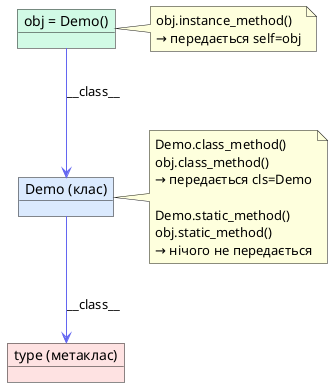

# Декоратори та Керування життєвим циклом методів

## Проблема: як змінити поведінку функції, не змінюючи її код

Уявіть реальну ситуацію. У вашому API є десятки методів. Ви хочете до кожного з них додати:
- перевірку прав доступу
- логування часу виконання
- кешування результатів

Наївне рішення — вставити відповідний код у початок і кінець кожного методу. Для десяти методів це ще терпимо. Для ста — вже катастрофа: дублювання коду, забуті оновлення, тести для кожного методу окремо.

```python
# ❌ Наївний підхід: дублювання скрізь
class UserService:
    def get_user(self, user_id: int):
        if not current_user.has_role("admin"):   # скрізь
            raise PermissionError("Доступ заборонено")
        start = time.time()                       # скрізь
        result = db.query(...)
        log(f"get_user: {time.time() - start}s") # скрізь
        return result

    def delete_user(self, user_id: int):
        if not current_user.has_role("admin"):   # знову
            raise PermissionError("Доступ заборонено")
        start = time.time()                       # знову
        db.delete(...)
        log(f"delete_user: {time.time() - start}s") # знову
```

Декоратори вирішують цю проблему елегантно: **ви описуєте наскрізну логіку один раз** і застосовуєте її оголошенням над функцією. Код методу залишається чистим — він робить лише свою справу.

```python
# ✅ З декораторами: логіка відокремлена
class UserService:
    @require_role("admin")
    @timed
    def get_user(self, user_id: int):
        return db.query(...)

    @require_role("admin")
    @timed
    def delete_user(self, user_id: int):
        db.delete(...)
```

Але перш ніж писати власні декоратори, Python пропонує три вбудованих, які вирішують фундаментальніше питання: **яке відношення метод має до свого класу**.

::card-group

::card{title="@staticmethod" icon="i-heroicons-cube-transparent"}
Метод не потребує ні екземпляра, ні класу. Звичайна функція, що живе у просторі імен класу для логічної організації коду.
::

::card{title="@classmethod" icon="i-heroicons-rectangle-stack"}
Метод отримує **клас** як перший аргумент (`cls`). Ідеальний для альтернативних конструкторів та фабричних методів.
::

::card{title="Функція-декоратор" icon="i-heroicons-arrow-path-rounded-square"}
Обгортка навколо функції або методу. Додає поведінку до і після виклику без зміни оригінального коду.
::

::card{title="Клас-декоратор" icon="i-heroicons-squares-plus"}
Декоратор у вигляді класу зі `__call__`. Може зберігати стан між викликами — кеш, лічильники, з'єднання.
::

::

---

## Частина I: Як Python бачить методи

### Три типи методів: instance, class, static

Перш ніж перейти до синтаксису, важливо зрозуміти фундаментальне питання: **що саме передається першим аргументом у метод?**

У Python виклик `obj.method(arg)` не є прямим викликом функції. Він проходить через механізм дескрипторів (детально розглядається у статті 7), який перетворює функцію на **зв'язаний метод** (bound method) — автоматично передає `self` чи `cls`.

```python
class Demo:
    class_var = "Я атрибут класу"

    def instance_method(self):
        # self → екземпляр. Доступ до self.attr та type(self)
        return f"instance method, self={self}"

    @classmethod
    def class_method(cls):
        # cls → сам клас (не екземпляр). Доступ до cls.attr
        return f"class method, cls={cls}"

    @staticmethod
    def static_method():
        # нічого не передається автоматично
        return "static method — звичайна функція"


obj = Demo()

# Три різних способи виклику — три різних перших аргументи
print(obj.instance_method())   # self = <Demo object>
print(obj.class_method())      # cls = <class 'Demo'>
print(obj.static_method())     # (нічого)

# Виклик класовий/статичний — через клас і через об'єкт однаковий
print(Demo.class_method())     # cls = <class 'Demo'>
print(Demo.static_method())    # (нічого)
```

::plant-uml



::

### Що відбувається без декораторів: дескриптори функцій

Щоб зрозуміти різницю між трьома типами методів, корисно знати: звичайна функція у класі є **non-data дескриптором**. Коли ви звертаєтесь до неї через `obj.method`, Python викликає `function.__get__(obj, type(obj))` — і отримує **зв'язаний метод** з автоматично підставленим `self`.

```python
class Plain:
    def greet(self, name: str) -> str:
        return f"Привіт, {name}! Я {self}"

obj = Plain()

# Звернення через клас → незв'язана функція
unbound = Plain.greet
print(type(unbound))          # <class 'function'>
print(unbound(obj, "Олена"))  # Привіт, Олена! Я <Plain object>

# Звернення через екземпляр → зв'язаний метод (self підставлений)
bound = obj.greet
print(type(bound))            # <class 'method'>
print(bound("Олена"))         # Привіт, Олена! Я <Plain object>
```

`@staticmethod` та `@classmethod` змінюють поведінку цього дескриптора: перший повертає саму функцію без прив'язки, другий — прив'язує до класу замість екземпляра.

---

## Частина II: `@staticmethod` — функція у просторі імен класу

### Коли метод не потребує `self` і не потребує `cls`

`@staticmethod` використовується, коли функція **логічно належить** до класу (вона пов'язана з його концепцією), але не потребує доступу ні до стану екземпляра, ні до атрибутів класу. По суті — звичайна функція, що «живе» у просторі імен класу для кращої організації.

```python
class PasswordValidator:
    """Валідатор паролів — набір статичних утиліт."""

    MIN_LENGTH = 8
    SPECIAL_CHARS = "!@#$%^&*"

    @staticmethod
    def has_uppercase(password: str) -> bool:
        return any(c.isupper() for c in password)

    @staticmethod
    def has_digit(password: str) -> bool:
        return any(c.isdigit() for c in password)

    @staticmethod
    def has_special(password: str) -> bool:
        return any(c in PasswordValidator.SPECIAL_CHARS for c in password)

    @staticmethod
    def is_strong(password: str) -> tuple[bool, list[str]]:
        """
        Перевіряє пароль на відповідність усім правилам.
        Повертає (passed: bool, errors: list[str]).
        """
        errors = []
        if len(password) < PasswordValidator.MIN_LENGTH:
            errors.append(f"Мінімум {PasswordValidator.MIN_LENGTH} символів")
        if not PasswordValidator.has_uppercase(password):
            errors.append("Потрібна хоча б одна велика літера")
        if not PasswordValidator.has_digit(password):
            errors.append("Потрібна хоча б одна цифра")
        if not PasswordValidator.has_special(password):
            errors.append("Потрібен хоча б один спеціальний символ")
        return len(errors) == 0, errors


# Виклик через клас — жодного екземпляра не потрібно
ok, errors = PasswordValidator.is_strong("qwerty")
print(f"Пройшов: {ok}")
print(f"Помилки: {errors}")

ok, errors = PasswordValidator.is_strong("MyP@ssw0rd")
print(f"Пройшов: {ok}")
```

::terminal-preview{title="python password_validator.py"}

<div class="line"><span class="opacity-40">$</span> <strong>python password_validator.py</strong></div>
<div class="line">Пройшов: <span class="text-rose-400">False</span></div>
<div class="line">Помилки: <span class="text-rose-400">['Мінімум 8 символів', 'Потрібна хоча б одна велика літера', 'Потрібна хоча б одна цифра', 'Потрібен хоча б один спеціальний символ']</span></div>
<div class="line">Пройшов: <span class="text-green-400">True</span></div>

::

::tip
Якщо ви пишете статичний метод, але він звертається до атрибутів класу через жорстко задане ім'я (`PasswordValidator.MIN_LENGTH`), подумайте: можливо, вам потрібен `@classmethod` — тоді при успадкуванні підклас отримає свої значення через `cls.MIN_LENGTH`, а не батьківські.
::

---

## Частина III: `@classmethod` — альтернативні конструктори

### Чому `cls` потужніший за жорстко задану назву класу

`@classmethod` отримує **сам клас** як перший аргумент (`cls`). Це ключова різниця від `@staticmethod`: при успадкуванні `cls` вказуватиме на підклас, а не на батьківський клас. Це робить `@classmethod` незамінним для **поліморфних фабричних методів**.

Найпоширеніший і найважливіший патерн використання — **альтернативні конструктори**: методи, що створюють екземпляр класу з різних вхідних форматів.

```python
from __future__ import annotations
from datetime import date, datetime


class Employee:
    """Працівник компанії."""

    def __init__(self, name: str, department: str, salary: float, start_date: date):
        self.name = name
        self.department = department
        self.salary = salary
        self.start_date = start_date

    def __repr__(self) -> str:
        return (
            f"Employee(name={self.name!r}, department={self.department!r}, "
            f"salary={self.salary}, start_date={self.start_date})"
        )

    # --- Альтернативний конструктор №1: з рядка CSV ---
    @classmethod
    def from_csv(cls, csv_line: str) -> Employee:
        """
        Створює Employee з CSV-рядка формату:
        'Іван Петренко,Engineering,75000,2022-03-15'
        """
        parts = csv_line.strip().split(",")
        if len(parts) != 4:
            raise ValueError(f"Очікується 4 поля, отримано {len(parts)}: {csv_line!r}")
        name, department, salary_str, date_str = parts
        return cls(
            name=name.strip(),
            department=department.strip(),
            salary=float(salary_str.strip()),
            start_date=date.fromisoformat(date_str.strip()),
        )
        # cls(...) замість Employee(...) → при успадкуванні створить підклас!

    # --- Альтернативний конструктор №2: зі словника ---
    @classmethod
    def from_dict(cls, data: dict) -> Employee:
        """Створює Employee зі словника (наприклад, з JSON-відповіді API)."""
        return cls(
            name=data["name"],
            department=data.get("department", "General"),
            salary=float(data["salary"]),
            start_date=date.fromisoformat(data["start_date"]),
        )

    # --- Альтернативний конструктор №3: новий працівник сьогодні ---
    @classmethod
    def new_hire(cls, name: str, department: str, salary: float) -> Employee:
        """Зручний конструктор для нових працівників з датою початку = сьогодні."""
        return cls(name=name, department=department, salary=salary, start_date=date.today())

    # --- Фабричний метод ---
    @classmethod
    def from_any(cls, source) -> Employee:
        """Універсальний метод: визначає формат автоматично."""
        if isinstance(source, str):
            return cls.from_csv(source)
        elif isinstance(source, dict):
            return cls.from_dict(source)
        raise TypeError(f"Непідтримуваний тип джерела: {type(source)}")


# Три різних способи створення Employee
e1 = Employee.from_csv("Олена Коваль,Design,68000,2021-09-01")
e2 = Employee.from_dict({
    "name": "Микола Бондар",
    "department": "Engineering",
    "salary": "95000",
    "start_date": "2020-01-15",
})
e3 = Employee.new_hire("Аліна Шевченко", "Marketing", 55000)

print(e1)
print(e2)
print(e3)
```

::terminal-preview{title="python employee.py"}

<div class="line"><span class="opacity-40">$</span> <strong>python employee.py</strong></div>
<div class="line"><span class="text-blue-400">Employee(name='Олена Коваль', department='Design', salary=68000.0, start_date=2021-09-01)</span></div>
<div class="line"><span class="text-blue-400">Employee(name='Микола Бондар', department='Engineering', salary=95000.0, start_date=2020-01-15)</span></div>
<div class="line"><span class="text-blue-400">Employee(name='Аліна Шевченко', department='Marketing', salary=55000.0, start_date=2024-06-18)</span></div>

::

### Поліморфізм конструкторів: чому `cls`, а не `Employee`

Ключова перевага `cls` над жорстко заданою назвою класу проявляється при успадкуванні:

```python
class Manager(Employee):
    """Менеджер — розширений Employee з додатковим атрибутом."""

    def __init__(self, name, department, salary, start_date, team_size: int = 0):
        super().__init__(name, department, salary, start_date)
        self.team_size = team_size

    def __repr__(self) -> str:
        return (
            f"Manager(name={self.name!r}, department={self.department!r}, "
            f"salary={self.salary}, team_size={self.team_size})"
        )


# from_csv визначено у Employee, але cls тут = Manager
mgr = Manager.from_csv("Тарас Гончар,Engineering,120000,2018-05-20")

print(type(mgr))   # <class 'Manager'>  ← правильно!
print(mgr)         # Manager(name='Тарас Гончар', ...)

# Якби у from_csv було Employee(...) замість cls(...):
# print(type(mgr))  # <class 'Employee'>  ← неправильно!
```

::important
Це і є сутність поліморфізму `@classmethod`: метод `from_csv` написаний один раз у `Employee`, але **знає, який клас створювати**, — той, через який його викликали. `cls` динамічно прив'язується до конкретного класу в момент виклику.
::

---

## Частина IV: Функції-декоратори

### Механіка декораторів: синтаксичний цукор

Декоратор у Python — це **callable, що приймає функцію і повертає функцію**. Синтаксис `@decorator` — це лише скорочення:

```python
@decorator
def func():
    pass

# Еквівалентно:
def func():
    pass
func = decorator(func)
```

Тобто після оголошення `func` Python одразу передає її об'єкт у `decorator` і замінює ім'я `func` на результат.

Розглянемо спочатку найпростіший базовий приклад декоратора, який просто логує виклик функції:

```python
def logger(func):
    def wrapper(*args, **kwargs):
        print(f"[LOG] Викликається '{func.__name__}' з args={args}, kwargs={kwargs}")
        result = func(*args, **kwargs)
        print(f"[LOG] '{func.__name__}' завершила виконання")
        return result
    return wrapper


@logger
def greet(name: str, greeting: str = "Привіт") -> str:
    return f"{greeting}, {name}!"


# Виклик декорованої функції
res = greet("Олексій", greeting="Вітаю")
print(f"Результат: {res}")
```

::terminal-preview{title="python simple_decorator.py"}

<div class="line"><span class="opacity-40">$</span> <strong>python simple_decorator.py</strong></div>
<div class="line">[LOG] Викликається 'greet' з args=('Олексій',), kwargs={'greeting': 'Вітаю'}</div>
<div class="line">[LOG] 'greet' завершила виконання</div>
<div class="line">Результат: <span class="text-green-400">Вітаю, Олексій!</span></div>

::

Коли інтерпретатор бачить `@logger` над `greet`, він виконує:
`greet = logger(greet)`

Відтепер ім'я `greet` посилається на внутрішню функцію `wrapper`. При виклику `greet("Олексій", greeting="Вітаю")` ми фактично викликаємо `wrapper`, який робить логування, викликає оригінальну функцію через `func(*args, **kwargs)` та повертає результат.

---

### Чому саме wrapper? Розбираємо на гвинтики

Якщо ви вперше бачите декоратори, конструкція «функція всередині функції, яка повертає функцію» може здатися дивною і переускладненою. Навіщо писати цей `wrapper`?

Давайте розберемо крок за кроком три найголовніших питання:
1. Чому не можна обійтися без `wrapper`?
2. Як працює замикання (closure)?
3. Чому обов'язкові `*args`, `**kwargs` та `return`?

#### 1. Декорування vs Виклик (Різниця в часі виконання)

Головне непорозуміння з декораторами: **функція-декоратор (наприклад, `logger`) викликається лише один раз — під час імпорту/завантаження скрипта.**

Уявімо, що ми спробували написати декоратор **без** `wrapper`:

```python
# ❌ НЕПРАВИЛЬНО: без wrapper
def bad_logger(func):
    print(f"[LOG] Декоруємо функцію {func.__name__}")
    # Ми викликаємо функцію прямо тут:
    result = func() 
    # Що повертати? Якщо ми хочемо замінити оригінальну функцію,
    # нам треба повернути щось викликане (callable).
    # Але в нас є лише результат виконання (наприклад, рядок).
    return result

@bad_logger
def greet():
    return "Привіт!"
```

Що відбудеться, коли Python прочитає цей код?
1. В момент визначення `greet` інтерпретатор автоматично запустить `bad_logger(greet)`.
2. На екрані з'явиться `[LOG] Декоруємо функцію greet`.
3. Викличеться `func()` (тобто `greet()`), і її результат `"Привіт!"` запишеться у змінну.
4. Декоратор поверне рядок `"Привіт!"`.
5. Змінна `greet` тепер зберігає не функцію, а **рядок `"Привіт!"`**.

Якщо ми потім спробуємо викликати `greet()`:
```python
greet()  # ❌ TypeError: 'str' object is not callable!
```

**Висновок:** Декоратор має повернути **нову функцію-замінник**. Цю функцію-замінник ми і називаємо `wrapper` (обгортка). Вона не виконується в момент декорування — вона просто чекає, коли користувач вирішить викликати `greet()`.

---

#### 2. Як `wrapper` «пам'ятає» оригінальну функцію? (Замикання)

Коли `logger` повертає `wrapper`, функція `logger` завершує свою роботу. Локальна змінна `func` (яка зберігає оригінальну функцію) мала б видалитися з пам'яті. 

Але завдяки механізму **замикання (closure)** у Python, внутрішня функція `wrapper` «захоплює» і «заморожує» у своєму оточенні всі змінні із зовнішньої функції, які вона використовує. Зокрема, вона назавжди запам'ятовує посилання на оригінальну `func`.

Ви можете це перевірити за допомогою атрибута `__closure__`:
```python
# greet — це вже wrapper, який повернув logger
print(greet.__closure__)  # Поверне кортеж з клітинками пам'яті
# У першій клітинці зберігається посилання на оригінальну greet
print(greet.__closure__[0].cell_contents) 
```

---

#### 3. Навіщо потрібні `*args`, `**kwargs` та `return`?

`wrapper` має бути універсальним «дублером». Він не знає заздалегідь, яку саме функцію він буде обгортати:
- `greet(name)` приймає один аргумент.
- `sum_three_numbers(a, b, c)` приймає три аргументи.
- `fetch_data()` взагалі не приймає аргументів.

Якщо ми напишемо `def wrapper():` без параметрів, то наш декоратор зможе працювати лише з функціями без аргументів. Будь-який виклик на кшталт `greet("Олексій")` викличе `TypeError`, оскільки `wrapper` не очікує параметрів.

Саме тому ми пишемо `def wrapper(*args, **kwargs):`:
* `*args` збирає всі позиційні аргументи в кортеж (tuple).
* `**kwargs` збирає всі іменовані аргументи в словник (dict).
* `func(*args, **kwargs)` розпаковує їх назад та передає оригінальній функції.

А `return result` потрібен для того, щоб передати результат оригінальної функції назад тому, хто її викликав. Без `return` наша обгортка завжди повертала б `None`.

---

### Ще більше прикладів «розжованих» декораторів

#### Приклад 1: Декоратор подвоєння результату (`double`)
Цей декоратор змінює результат математичних функцій, множачи його на 2.

```python
from functools import wraps

def double(func):
    @wraps(func)
    def wrapper(*args, **kwargs):
        # 1. Отримуємо оригінальний результат від функції
        original_result = func(*args, **kwargs)
        # 2. Модифікуємо його
        new_result = original_result * 2
        # 3. Повертаємо змінене значення
        return new_result
    return wrapper

@double
def add(a: int, b: int) -> int:
    return a + b

print(add(2, 3))  # Очікуємо 5, але отримаємо 10!
```

---

#### Приклад 2: Декоратор перевірки типів (`require_strings`)
Цей декоратор перевіряє, чи є всі передані аргументи рядками. Якщо ні — викидає помилку.

```python
from functools import wraps

def require_strings(func):
    @wraps(func)
    def wrapper(*args, **kwargs):
        # Перевіряємо всі позиційні аргументи
        for arg in args:
            if not isinstance(arg, str):
                raise TypeError(f"Аргумент {arg} має бути рядком (str)!")
        
        # Перевіряємо всі іменовані аргументи
        for key, value in kwargs.items():
            if not isinstance(value, str):
                raise TypeError(f"Аргумент {key}={value} має бути рядком (str)!")
        
        # Якщо все ок, викликаємо функцію
        return func(*args, **kwargs)
    return wrapper

@require_strings
def concat_words(a: str, b: str) -> str:
    return a + b

print(concat_words("Привіт, ", "Світ"))  # Працює: "Привіт, Світ"
# concat_words("Привіт, ", 42)          # Викине TypeError: Аргумент 42 має бути рядком (str)!
```

---

#### Приклад 3: Декоратор кешування результатів (`memoize`)
Цей декоратор зберігає результати обчислень у словнику. Якщо функція викликається з тими самими аргументами знову, вона не рахує заново, а одразу віддає значення з кешу.

```python
from functools import wraps

def memoize(func):
    cache = {}  # Словник для збереження результатів (живе в замиканні)

    @wraps(func)
    def wrapper(*args, **kwargs):
        # Створюємо ключ для кешу на основі аргументів
        # Оскільки kwargs може бути невпорядкованим, перетворюємо його на кортеж пар
        key = (args, tuple(sorted(kwargs.items())))
        
        if key not in cache:
            print(f"[CACHE] Обчислюємо результат для аргументів: {args} {kwargs}")
            cache[key] = func(*args, **kwargs)
        else:
            print(f"[CACHE] Беремо готове значення з кешу для: {args} {kwargs}")
            
        return cache[key]
    return wrapper

@memoize
def heavy_calculation(x: int) -> int:
    return x * x * x

print(heavy_calculation(5))  # Перший раз: обчислить
print(heavy_calculation(5))  # Другий раз: візьме з кешу
```

---

### Збереження метаданих: `@functools.wraps`

Оскільки декоратор замінює оригінальну функцію на `wrapper`, виникає проблема: втрачаються метадані оригінальної функції (її назва `__name__`, документація `__doc__` тощо).

```python
print(greet.__name__)  # Виведе "wrapper" замість "greet"!
print(greet.__doc__)   # Виведе None
```

Щоб цього уникнути, Python надає вбудований декоратор `@functools.wraps` (який сам є декоратором для нашого `wrapper`):

```python
from functools import wraps

def logger(func):
    @wraps(func)
    def wrapper(*args, **kwargs):
        print(f"[LOG] Виклик {func.__name__}")
        return func(*args, **kwargs)
    return wrapper
```

::warning
**Завжди використовуйте `@functools.wraps(func)` у декораторах.** Без нього обгортка `wrapper` замінює оригінальну функцію повністю — включно з `__name__`, `__doc__`, `__annotations__`. Це ламає інтроспекцію, логування, документацію та системи тестування (pytest, наприклад, показуватиме `wrapper` замість назви тесту).
::

---

### Статична типізація декораторів: Generics (`ParamSpec` та `TypeVar`)

Якщо типізувати декоратор просто як `Callable` (наприклад, `def timed(func: Callable) -> Callable:`), статичні аналізатори (MyPy, Pyright) та сучасні IDE втратять інформацію про сигнатуру оригінальної функції. Для них декорована функція перетвориться на абстрактний `Callable` з невідомими аргументами та типом повернення.

Щоб зберегти типи параметрів і поверненого значення, використовуються **дженеріки (generics)** з модуля `typing`:
1. **`TypeVar`** (змінна типу) — позначає тип поверненого значення. Назвемо її `R` (від *Return*).
2. **`ParamSpec`** (специфікація параметрів, додана в Python 3.10) — фіксує всі параметри оригінальної функції (їх імена, типи, порядок, обов'язковість). Назвемо її `P` (від *Parameters*).

#### Що саме можна описати за допомогою Generics?

Завдяки дженерікам ми можемо чітко задекларувати зв'язок між вхідною функцією та результатом декоратора:
- `Callable[P, R]` описує функцію, яка приймає довільні параметри `P` і повертає значення типу `R`.
- `*args: P.args` та `**kwargs: P.kwargs` вказують, що `wrapper` приймає рівно ті самі позиційні та іменовані аргументи, що й оригінальна функція.
- Повернення `R` з `wrapper` гарантує, що тип результату не зміниться після декорування.

Тепер подивимося на правильну типізацію нашого декоратора `timed`:

```python
import time
from functools import wraps
from typing import Callable, TypeVar, ParamSpec

P = ParamSpec('P')
R = TypeVar('R')


def timed(func: Callable[P, R]) -> Callable[P, R]:
    """Декоратор: вимірює та виводить час виконання функції."""
    @wraps(func)
    def wrapper(*args: P.args, **kwargs: P.kwargs) -> R:
        start = time.perf_counter()
        try:
            result = func(*args, **kwargs)
            return result
        finally:
            elapsed = time.perf_counter() - start
            print(f"[timed] {func.__qualname__} → {elapsed:.4f}с")
    return wrapper


@timed
def slow_calculation(n: int) -> int:
    """Симуляція важкого обчислення."""
    total = 0
    for i in range(n):
        total += i * i
    return total


result = slow_calculation(1_000_000)
print(f"Результат: {result}")
print(f"Ім'я функції збережено: {slow_calculation.__name__}")
print(f"Документація: {slow_calculation.__doc__}")
```

::terminal-preview{title="python timed_decorator.py"}

<div class="line"><span class="opacity-40">$</span> <strong>python timed_decorator.py</strong></div>
<div class="line">[timed] slow_calculation → <span class="text-yellow-400">0.0621с</span></div>
<div class="line">Результат: <span class="text-green-400">333332833333500000</span></div>
<div class="line">Ім'я функції збережено: <span class="text-blue-400">slow_calculation</span></div>
<div class="line">Документація: <span class="text-blue-400">Симуляція важкого обчислення.</span></div>

::

### Декоратори з параметрами: фабрика декораторів

Іноді декоратор потребує налаштування. Тоді потрібна **фабрика декораторів** — функція, що повертає декоратор:

```python
from functools import wraps


def retry(max_attempts: int = 3, exceptions: tuple = (Exception,), delay: float = 0.0):
    """
    Декоратор з параметрами: повторює виклик при виключенні.
    
    @retry(max_attempts=3, exceptions=(ConnectionError, TimeoutError))
    def fetch_data(url: str): ...
    
    Три рівні вкладеності:
      retry(3)     → повертає декоратор
      декоратор(func) → повертає wrapper
      wrapper(...)    → виконує логіку
    """
    def decorator(func: Callable) -> Callable:
        @wraps(func)
        def wrapper(*args, **kwargs):
            last_error: Exception | None = None
            for attempt in range(1, max_attempts + 1):
                try:
                    return func(*args, **kwargs)
                except exceptions as e:
                    last_error = e
                    print(f"[retry] Спроба {attempt}/{max_attempts} не вдалась: {e}")
                    if attempt < max_attempts and delay > 0:
                        import time; time.sleep(delay)
            raise RuntimeError(
                f"Всі {max_attempts} спроб вичерпано"
            ) from last_error
        return wrapper
    return decorator


# Симуляція нестабільного мережевого виклику
_call_count = 0

@retry(max_attempts=3, exceptions=(ConnectionError,))
def unstable_request(url: str) -> str:
    global _call_count
    _call_count += 1
    if _call_count < 3:
        raise ConnectionError(f"Мережева помилка (спроба {_call_count})")
    return f"200 OK: {url}"


print(unstable_request("https://api.example.com/data"))
```

::terminal-preview{title="python retry_decorator.py"}

<div class="line"><span class="opacity-40">$</span> <strong>python retry_decorator.py</strong></div>
<div class="line">[retry] Спроба 1/3 не вдалась: <span class="text-rose-400">Мережева помилка (спроба 1)</span></div>
<div class="line">[retry] Спроба 2/3 не вдалась: <span class="text-rose-400">Мережева помилка (спроба 2)</span></div>
<div class="line"><span class="text-green-400">200 OK: https://api.example.com/data</span></div>

::

### Стекування декораторів: порядок застосування

Декоратори можна стекувати. Важливо розуміти порядок: застосовуються **знизу вгору**, виконуються **зверху вниз**:

```python
@decorator_A   # застосовується другим: A(B(func))
@decorator_B   # застосовується першим: B(func)
def func(): ...

# Еквівалентно:
func = decorator_A(decorator_B(func))

# При виклику func():
# → wrapper_A() запускається першим
#   → wrapper_B() запускається другим
#     → оригінальний func()
```

```python
@timed
@retry(max_attempts=2, exceptions=(ValueError,))
def parse_number(text: str) -> int:
    """Парсить число з рядка — може впасти при невалідному вводі."""
    if not text.strip().lstrip('-').isdigit():
        raise ValueError(f"Не число: {text!r}")
    return int(text)


# Порядок виконання: timed → retry → parse_number
# timed вимірює загальний час, включно з повторними спробами
print(parse_number("42"))
```

---

## Частина V: Декоратори методів класу

### Особливість декорування методів: передача `self`

Декоратор, написаний для звичайних функцій, здебільшого **вже працює** з методами класу — `*args` першим аргументом автоматично захопить `self`. Але є нюанс: якщо декоратор потребує доступу до екземпляра чи класу — потрібно передавати його явно.

```python
from functools import wraps
import logging

logging.basicConfig(level=logging.INFO, format="%(levelname)s: %(message)s")
logger = logging.getLogger(__name__)


def log_call(func: Callable) -> Callable:
    """
    Декоратор для методів класу: логує виклик з ім'ям класу, методу та аргументами.
    self передається через *args[0].
    """
    @wraps(func)
    def wrapper(self, *args, **kwargs):
        class_name = type(self).__name__
        logger.info(
            f"{class_name}.{func.__name__}("
            f"args={args!r}, kwargs={kwargs!r})"
        )
        result = func(self, *args, **kwargs)
        logger.info(f"{class_name}.{func.__name__} → {result!r}")
        return result
    return wrapper


class BankAccount:
    """Банківський рахунок із логуванням операцій."""

    def __init__(self, owner: str, balance: float = 0.0):
        self.owner = owner
        self._balance = balance

    @log_call
    def deposit(self, amount: float) -> float:
        if amount <= 0:
            raise ValueError("Сума поповнення має бути > 0")
        self._balance += amount
        return self._balance

    @log_call
    def withdraw(self, amount: float) -> float:
        if amount > self._balance:
            raise ValueError(f"Недостатньо коштів: маємо {self._balance}, потрібно {amount}")
        self._balance -= amount
        return self._balance

    @property
    def balance(self) -> float:
        return self._balance


account = BankAccount("Олена", 1000.0)
account.deposit(500.0)
account.withdraw(200.0)
print(f"Баланс: {account.balance}")
```

::terminal-preview{title="python bank_account.py"}

<div class="line"><span class="opacity-40">$</span> <strong>python bank_account.py</strong></div>
<div class="line">INFO: <span class="text-blue-400">BankAccount.deposit(args=(500.0,), kwargs={})</span></div>
<div class="line">INFO: <span class="text-blue-400">BankAccount.deposit → 1500.0</span></div>
<div class="line">INFO: <span class="text-blue-400">BankAccount.withdraw(args=(200.0,), kwargs={})</span></div>
<div class="line">INFO: <span class="text-blue-400">BankAccount.withdraw → 1300.0</span></div>
<div class="line">Баланс: <span class="text-green-400">1300.0</span></div>

::

---

## Частина VI: Декоратори класів

### Клас як ціль декоратора

До цього моменту ми декорували функції та методи. Але `@decorator` можна застосувати і до **цілого класу**. У цьому випадку декоратор отримує об'єкт класу і може модифікувати його атрибути, методи або замінити клас повністю.

```python
def singleton(cls):
    """
    Декоратор класу: перетворює клас на Singleton.
    Перший виклик cls() створює екземпляр і зберігає його.
    Всі наступні виклики повертають той самий об'єкт.
    """
    instances: dict = {}

    @wraps(cls)
    def get_instance(*args, **kwargs):
        if cls not in instances:
            instances[cls] = cls(*args, **kwargs)
        return instances[cls]

    return get_instance


@singleton
class DatabaseConnection:
    """З'єднання з базою даних — має існувати лише в одному екземплярі."""

    def __init__(self, host: str = "localhost", port: int = 5432):
        self.host = host
        self.port = port
        print(f"[DB] З'єднання встановлено: {self.host}:{self.port}")

    def query(self, sql: str) -> str:
        return f"[DB] Результат: {sql}"


# Перший виклик — створює з'єднання
conn1 = DatabaseConnection("production.db", 5432)

# Другий виклик — повертає той самий об'єкт (з'єднання не встановлюється знову)
conn2 = DatabaseConnection()

print(f"conn1 is conn2: {conn1 is conn2}")  # True
print(conn1.query("SELECT 1"))
```

::terminal-preview{title="python singleton.py"}

<div class="line"><span class="opacity-40">$</span> <strong>python singleton.py</strong></div>
<div class="line">[DB] З'єднання встановлено: <span class="text-green-400">production.db:5432</span></div>
<div class="line"><span class="text-gray-400"># Друге DatabaseConnection() — мовчки повертає існуючий об'єкт</span></div>
<div class="line">conn1 is conn2: <span class="text-green-400">True</span></div>
<div class="line">[DB] Результат: SELECT 1</div>

::

### Декоратор класу для автоматичного додавання методів

Декоратор класу може **автоматично доповнювати** клас методами при оголошенні — без успадкування і без метакласів:

```python
def add_repr(cls):
    """
    Декоратор класу: автоматично генерує __repr__ на основі
    анотацій типів (type hints) класу.
    Не перезаписує __repr__ якщо він вже визначений явно.
    """
    if '__repr__' not in cls.__dict__:  # тільки якщо не визначено явно
        def auto_repr(self) -> str:
            attrs = {
                name: getattr(self, name)
                for name in cls.__annotations__
                if not name.startswith('_') and hasattr(self, name)
            }
            params = ', '.join(f"{k}={v!r}" for k, v in attrs.items())
            return f"{cls.__name__}({params})"
        cls.__repr__ = auto_repr
    return cls


def add_eq(cls):
    """
    Декоратор класу: генерує __eq__ та __hash__ на основі
    анотацій типів.
    """
    if '__eq__' not in cls.__dict__:
        def auto_eq(self, other: object) -> bool:
            if type(self) is not type(other):
                return NotImplemented
            return all(
                getattr(self, name) == getattr(other, name)
                for name in cls.__annotations__
                if not name.startswith('_')
            )
        cls.__eq__ = auto_eq
        cls.__hash__ = None  # після __eq__ клас стає нехешованим
    return cls


@add_repr
@add_eq
class Point:
    x: float
    y: float

    def __init__(self, x: float, y: float):
        self.x = x
        self.y = y


p1 = Point(1.0, 2.0)
p2 = Point(1.0, 2.0)
p3 = Point(3.0, 4.0)

print(p1)           # Point(x=1.0, y=2.0)  ← auto_repr
print(p1 == p2)     # True                  ← auto_eq
print(p1 == p3)     # False
```

---

## Частина VII: Класи як декоратори

### `__call__` + стан = потужний декоратор

Коли декоратор потребує **збереження стану між викликами** (лічильник, кеш, час останнього виклику), клас зі `__call__` є природнішим рішенням, ніж функція з замиканням:

```python
from functools import wraps, update_wrapper
import time


class RateLimiter:
    """
    Декоратор-клас: обмежує частоту виклику функції.
    
    @RateLimiter(calls=3, period=10.0)
    def expensive_api_call(query: str): ...
    
    Якщо за останні `period` секунд функцію викликали вже `calls` разів —
    підіймає RuntimeError замість виконання.
    """

    def __init__(self, calls: int = 5, period: float = 60.0):
        self.max_calls = calls
        self.period = period
        self._call_times: list[float] = []
        self._func: Callable | None = None

    def __call__(self, *args, **kwargs):
        if self._func is None:
            # Перший виклик: отримуємо декоровану функцію
            func = args[0]
            self._func = func
            update_wrapper(self, func)
            return self

        # Наступні виклики: виконуємо з rate limiting
        now = time.monotonic()
        # Видаляємо старі записи за межами вікна
        self._call_times = [t for t in self._call_times if now - t < self.period]

        if len(self._call_times) >= self.max_calls:
            oldest = self._call_times[0]
            wait_time = self.period - (now - oldest)
            raise RuntimeError(
                f"Перевищено ліміт {self.max_calls} викликів за "
                f"{self.period}с. Зачекайте {wait_time:.1f}с."
            )

        self._call_times.append(now)
        return self._func(*args, **kwargs)

    def __repr__(self) -> str:
        name = self._func.__name__ if self._func else "?"
        return (
            f"RateLimiter({name!r}, "
            f"calls={self.max_calls}, period={self.period}s, "
            f"used={len(self._call_times)})"
        )


@RateLimiter(calls=3, period=60.0)
def send_notification(user_id: int, message: str) -> str:
    """Надсилає push-сповіщення користувачу."""
    return f"Надіслано [{user_id}]: {message}"


# Перші три виклики — успішні
print(send_notification(1, "Ваше замовлення підтверджено"))
print(send_notification(1, "Товар відправлено"))
print(send_notification(1, "Очікується доставка"))

# Четвертий виклик — перевищено ліміт
try:
    send_notification(1, "Ще одне повідомлення")
except RuntimeError as e:
    print(f"Помилка: {e}")

print(send_notification)  # __repr__ показує стан
```

::terminal-preview{title="python rate_limiter.py"}

<div class="line"><span class="opacity-40">$</span> <strong>python rate_limiter.py</strong></div>
<div class="line"><span class="text-green-400">Надіслано [1]: Ваше замовлення підтверджено</span></div>
<div class="line"><span class="text-green-400">Надіслано [1]: Товар відправлено</span></div>
<div class="line"><span class="text-green-400">Надіслано [1]: Очікується доставка</span></div>
<div class="line">Помилка: <span class="text-rose-400">Перевищено ліміт 3 викликів за 60.0с. Зачекайте 59.9с.</span></div>
<div class="line"><span class="text-blue-400">RateLimiter('send_notification', calls=3, period=60.0s, used=3)</span></div>

::

### Порівняння: функція-декоратор vs клас-декоратор

| Критерій | Функція-декоратор | Клас-декоратор |
|---|---|---|
| Збереження стану | Замикання (`nonlocal`) | Атрибути `self` — природніше |
| Читабельність стану | Важко інтроспектувати | `repr()` може показати поточний стан |
| Успадкування | Неможливе | Можна успадкувати та перевизначити поведінку |
| Складність реалізації | Простіше для без-стану | Складніше, але чистіше зі станом |
| `@wraps` | `@wraps(func)` | `functools.update_wrapper(self, func)` |
| Використання | 90% випадків | Коли потрібен стан або ієрархія |

---

## Частина VIII: Практичний приклад від А до Я — Система авторизації на основі ролей

### Постановка задачі

Побудуємо систему авторизації для API сервісу керування користувачами. Вимоги:

1. Методи класу мають бути захищені декораторами, що перевіряють роль поточного користувача.
2. Рівні доступу: `viewer` (читання), `editor` (читання + редагування), `admin` (усе).
3. Авторизація не повинна забруднювати код методів — лише `@require_role("admin")` над методом.
4. Клас `UserRepository` створюється через `@classmethod` з різних джерел.
5. Загальна статистика викликів збирається декоратором-класом `CallCounter`.

### Архітектура проекту

```
auth_system/
  __init__.py
  roles.py       ← ролі та поточний контекст авторизації
  decorators.py  ← @require_role, CallCounter
  repository.py  ← UserRepository з @classmethod та @staticmethod
  main.py        ← демонстрація
```

::code-tree

```python [auth_system/roles.py]
from __future__ import annotations
from enum import IntEnum
from contextlib import contextmanager
from threading import local

# IntEnum дозволяє порівнювати ролі: Role.VIEWER < Role.ADMIN
class Role(IntEnum):
    VIEWER = 1
    EDITOR = 2
    ADMIN  = 3

    def __str__(self) -> str:
        return self.name.lower()


# Thread-local сховище поточного авторизованого користувача
# (у реальному застосунку це був би JWT-токен або сесія)
_context = local()


def get_current_role() -> Role | None:
    """Повертає роль поточного авторизованого користувача."""
    return getattr(_context, 'role', None)


def get_current_user() -> str:
    """Повертає ім'я поточного авторизованого користувача."""
    return getattr(_context, 'user', 'anonymous')


@contextmanager
def auth_as(user: str, role: Role):
    """
    Контекстний менеджер для тестів та демонстрації:
    тимчасово встановлює авторизованого користувача.
    
    with auth_as("Олена", Role.ADMIN):
        repository.delete_user(42)
    """
    _context.user = user
    _context.role = role
    try:
        yield
    finally:
        _context.user = 'anonymous'
        _context.role = None
```

```python [auth_system/decorators.py]
from __future__ import annotations
from functools import wraps, update_wrapper
from typing import Callable
from .roles import Role, get_current_role, get_current_user


def require_role(minimum_role: Role | str):
    """
    Декоратор-фабрика: захищає метод перевіркою ролі.
    
    @require_role(Role.ADMIN)
    def delete_user(self, user_id: int): ...
    
    При виклику перевіряє get_current_role() >= minimum_role.
    Якщо ролі недостатньо — підіймає PermissionError.
    Якщо користувач не авторизований — підіймає PermissionError.
    """
    # Дозволяємо передавати рядок: @require_role("admin")
    if isinstance(minimum_role, str):
        minimum_role = Role[minimum_role.upper()]

    def decorator(func: Callable) -> Callable:
        @wraps(func)
        def wrapper(*args, **kwargs):
            current_role = get_current_role()
            current_user = get_current_user()

            if current_role is None:
                raise PermissionError(
                    f"Доступ до '{func.__name__}' заборонено: "
                    f"користувач не авторизований."
                )
            if current_role < minimum_role:
                raise PermissionError(
                    f"Доступ до '{func.__name__}' заборонено: "
                    f"роль '{current_role}' недостатня, потрібна '{minimum_role}'."
                )
            return func(*args, **kwargs)

        # Зберігаємо метадані декоратора для інтроспекції
        wrapper._required_role = minimum_role  # type: ignore[attr-defined]
        return wrapper
    return decorator


class CallCounter:
    """
    Декоратор-клас: підраховує виклики кожного методу
    та зберігає глобальну статистику у словнику класу.
    
    CallCounter.stats  → словник {ім'я_методу: кількість}
    CallCounter.reset() → скидання лічильників
    """

    stats: dict[str, int] = {}   # статистика — спільна для всіх екземплярів

    def __init__(self, func: Callable):
        self._func = func
        update_wrapper(self, func)
        # Реєструємо метод у статистиці при декоруванні
        CallCounter.stats.setdefault(func.__qualname__, 0)

    def __call__(self, *args, **kwargs):
        CallCounter.stats[self._func.__qualname__] += 1
        return self._func(*args, **kwargs)

    def __get__(self, obj, objtype=None):
        """
        Протокол дескриптора: дозволяє CallCounter коректно
        працювати як метод класу (прив'язує self до виклику).
        Без цього методу obj.method() не передавав би self.
        """
        if obj is None:
            return self
        from functools import partial
        return partial(self.__call__, obj)

    @classmethod
    def reset(cls) -> None:
        """Скидає всі лічильники."""
        cls.stats.clear()
```

```python [auth_system/repository.py]
from __future__ import annotations
import json
from .decorators import require_role, CallCounter
from .roles import Role


class UserRepository:
    """
    Репозиторій користувачів із захистом методів на основі ролей.
    
    Демонструє:
    - @classmethod для альтернативних конструкторів
    - @staticmethod для утилітарних функцій
    - @require_role для захисту методів
    - @CallCounter для збору статистики
    """

    def __init__(self, users: dict[int, dict] | None = None):
        self._users: dict[int, dict] = users or {}
        self._next_id: int = max(self._users.keys(), default=0) + 1

    # ------------------------------------------------------------------ #
    #  Альтернативні конструктори (@classmethod)                           #
    # ------------------------------------------------------------------ #

    @classmethod
    def empty(cls) -> UserRepository:
        """Створює порожній репозиторій."""
        return cls()

    @classmethod
    def from_dict_list(cls, data: list[dict]) -> UserRepository:
        """Створює репозиторій зі списку словників (наприклад, з JSON API)."""
        users = {}
        for i, user_data in enumerate(data, start=1):
            users[i] = {
                "id": i,
                "name": user_data["name"],
                "email": user_data["email"],
                "role": user_data.get("role", "viewer"),
            }
        return cls(users)

    @classmethod
    def from_json(cls, json_str: str) -> UserRepository:
        """Десеріалізує репозиторій з JSON-рядка."""
        data = json.loads(json_str)
        users = {int(k): v for k, v in data.items()}
        return cls(users)

    # ------------------------------------------------------------------ #
    #  Утилітарні методи (@staticmethod)                                   #
    # ------------------------------------------------------------------ #

    @staticmethod
    def validate_email(email: str) -> bool:
        """Проста перевірка формату email — не потребує стану."""
        return "@" in email and "." in email.split("@")[-1]

    @staticmethod
    def normalize_name(name: str) -> str:
        """Нормалізує ім'я: обрізає пробіли, заголовний регістр."""
        return " ".join(part.capitalize() for part in name.strip().split())

    # ------------------------------------------------------------------ #
    #  Захищені методи (@require_role + @CallCounter)                      #
    # ------------------------------------------------------------------ #

    @CallCounter
    @require_role(Role.VIEWER)
    def get_user(self, user_id: int) -> dict | None:
        """Читання даних користувача. Дозволено всім авторизованим."""
        return self._users.get(user_id)

    @CallCounter
    @require_role(Role.VIEWER)
    def list_users(self) -> list[dict]:
        """Список усіх користувачів. Дозволено всім авторизованим."""
        return list(self._users.values())

    @CallCounter
    @require_role(Role.EDITOR)
    def create_user(self, name: str, email: str) -> dict:
        """Створення нового користувача. Потребує ролі editor або вище."""
        if not self.validate_email(email):
            raise ValueError(f"Невалідний email: {email!r}")
        user = {
            "id": self._next_id,
            "name": self.normalize_name(name),
            "email": email.lower(),
            "role": "viewer",
        }
        self._users[self._next_id] = user
        self._next_id += 1
        return user

    @CallCounter
    @require_role(Role.EDITOR)
    def update_user(self, user_id: int, **fields) -> dict:
        """Оновлення даних користувача. Потребує ролі editor або вище."""
        if user_id not in self._users:
            raise KeyError(f"Користувача {user_id} не знайдено")
        self._users[user_id].update(fields)
        return self._users[user_id]

    @CallCounter
    @require_role(Role.ADMIN)
    def delete_user(self, user_id: int) -> bool:
        """Видалення користувача. Тільки для адміністраторів."""
        if user_id not in self._users:
            return False
        del self._users[user_id]
        return True

    @CallCounter
    @require_role(Role.ADMIN)
    def to_json(self) -> str:
        """Серіалізація в JSON. Тільки для адміністраторів."""
        return json.dumps(self._users, ensure_ascii=False, indent=2)

    def __repr__(self) -> str:
        return f"UserRepository({len(self._users)} users)"

    def __len__(self) -> int:
        return len(self._users)
```

```python [auth_system/__init__.py]
"""Пакет auth_system: RBAC-авторизація для репозиторію."""
from .roles import Role, auth_as
from .repository import UserRepository
from .decorators import CallCounter

__all__ = ["Role", "auth_as", "UserRepository", "CallCounter"]
```

```python [auth_system/main.py]
import sys
from auth_system import Role, auth_as, UserRepository, CallCounter


def demo_classmethods() -> UserRepository:
    print("=== @classmethod: альтернативні конструктори ===\n")

    # Конструктор 1: зі списку словників
    repo = UserRepository.from_dict_list([
        {"name": "олена коваль",  "email": "olena@example.com"},
        {"name": "микола бондар", "email": "mykola@example.com"},
        {"name": "аліна шевченко","email": "alina@example.com"},
    ])
    print(f"from_dict_list → {repo}")

    # Конструктор 2: з JSON
    import json
    data = json.dumps({
        "10": {"id": 10, "name": "Тест", "email": "test@example.com", "role": "editor"}
    })
    repo2 = UserRepository.from_json(data)
    print(f"from_json      → {repo2}")

    return repo


def demo_staticmethods() -> None:
    print("\n=== @staticmethod: утилітарні функції ===\n")
    # Виклик без екземпляра
    tests = [
        ("user@example.com", True),
        ("not-an-email",     False),
        ("a@b.co",           True),
    ]
    for email, expected in tests:
        result = UserRepository.validate_email(email)
        status = "✅" if result == expected else "❌"
        print(f"  {status} validate_email({email!r}) → {result}")

    names = ["  іван  петренко ", "ОЛЕНА КОВАЛЬ", "микола"]
    for name in names:
        print(f"  normalize_name({name!r}) → {UserRepository.normalize_name(name)!r}")


def demo_authorization(repo: UserRepository) -> None:
    print("\n=== @require_role: захист методів ===\n")

    # Viewer: може читати, не може редагувати
    with auth_as("Глядач", Role.VIEWER):
        users = repo.list_users()
        print(f"[VIEWER] list_users → {len(users)} записів ✅")

        try:
            repo.create_user("Новий", "new@example.com")
        except PermissionError as e:
            print(f"[VIEWER] create_user → PermissionError ✅ ({e})")

    # Editor: може читати і редагувати, не може видаляти
    with auth_as("Редактор", Role.EDITOR):
        new_user = repo.create_user("Новий Користувач", "new@example.com")
        print(f"[EDITOR] create_user → {new_user['name']} (id={new_user['id']}) ✅")

        updated = repo.update_user(new_user["id"], email="updated@example.com")
        print(f"[EDITOR] update_user → email={updated['email']} ✅")

        try:
            repo.delete_user(new_user["id"])
        except PermissionError as e:
            print(f"[EDITOR] delete_user → PermissionError ✅")

    # Admin: може все
    with auth_as("Адмін", Role.ADMIN):
        deleted = repo.delete_user(new_user["id"])
        print(f"[ADMIN]  delete_user → {deleted} ✅")

    # Без авторизації
    try:
        repo.list_users()
    except PermissionError as e:
        print(f"[ANON]   list_users  → PermissionError ✅")


def demo_call_counter() -> None:
    print("\n=== @CallCounter: статистика викликів ===\n")
    for method_name, count in sorted(CallCounter.stats.items()):
        print(f"  {method_name:<45} → {count} виклик(ів)")


def main() -> int:
    repo = demo_classmethods()
    demo_staticmethods()
    demo_authorization(repo)
    demo_call_counter()
    return 0


if __name__ == "__main__":
    sys.exit(main())
```

::

---

### Покрокова реалізація

::steps

### Створення структури проекту

::terminal-preview{title="Ініціалізація структури"}

<div class="line"><span class="opacity-40">$</span> <strong>mkdir -p my_auth/auth_system</strong></div>
<div class="line"><span class="opacity-40">$</span> <strong>touch my_auth/auth_system/__init__.py my_auth/auth_system/roles.py</strong></div>
<div class="line"><span class="opacity-40">$</span> <strong>touch my_auth/auth_system/decorators.py my_auth/auth_system/repository.py</strong></div>
<div class="line"><span class="opacity-40">$</span> <strong>touch my_auth/auth_system/main.py</strong></div>
<div class="line"><span class="opacity-40">$</span> <strong>cd my_auth</strong></div>

::

### Реалізація файлів

Записуйте файли у такому порядку: `roles.py` → `decorators.py` → `repository.py` → `__init__.py` → `main.py`. Порядок важливий: `decorators.py` імпортує `roles.py`, `repository.py` імпортує обидва.

### Запуск та перевірка

::terminal-preview{title="python -m auth_system.main"}

<div class="line"><span class="opacity-40">$</span> <strong>python -m auth_system.main</strong></div>
<div class="line">=== @classmethod: альтернативні конструктори ===</div>
<div class="line"></div>
<div class="line">from_dict_list → <span class="text-blue-400">UserRepository(3 users)</span></div>
<div class="line">from_json      → <span class="text-blue-400">UserRepository(1 users)</span></div>
<div class="line"></div>
<div class="line">=== @staticmethod: утилітарні функції ===</div>
<div class="line"></div>
<div class="line">  ✅ validate_email('user@example.com') → <span class="text-green-400">True</span></div>
<div class="line">  ✅ validate_email('not-an-email') → <span class="text-rose-400">False</span></div>
<div class="line">  ✅ validate_email('a@b.co') → <span class="text-green-400">True</span></div>
<div class="line">  normalize_name('  іван  петренко ') → <span class="text-blue-400">'Іван Петренко'</span></div>
<div class="line">  normalize_name('ОЛЕНА КОВАЛЬ') → <span class="text-blue-400">'Олена Коваль'</span></div>
<div class="line">  normalize_name('микола') → <span class="text-blue-400">'Микола'</span></div>
<div class="line"></div>
<div class="line">=== @require_role: захист методів ===</div>
<div class="line"></div>
<div class="line">[VIEWER] list_users → <span class="text-green-400">3 записів ✅</span></div>
<div class="line">[VIEWER] create_user → <span class="text-rose-400">PermissionError ✅</span></div>
<div class="line">[EDITOR] create_user → <span class="text-green-400">Новий Користувач (id=4) ✅</span></div>
<div class="line">[EDITOR] update_user → <span class="text-green-400">email=updated@example.com ✅</span></div>
<div class="line">[EDITOR] delete_user → <span class="text-rose-400">PermissionError ✅</span></div>
<div class="line">[ADMIN]  delete_user → <span class="text-green-400">True ✅</span></div>
<div class="line">[ANON]   list_users  → <span class="text-rose-400">PermissionError ✅</span></div>
<div class="line"></div>
<div class="line">=== @CallCounter: статистика викликів ===</div>
<div class="line"></div>
<div class="line">  UserRepository.create_user  → <span class="text-yellow-400">1</span> виклик(ів)</div>
<div class="line">  UserRepository.delete_user  → <span class="text-yellow-400">1</span> виклик(ів)</div>
<div class="line">  UserRepository.list_users   → <span class="text-yellow-400">1</span> виклик(ів)</div>
<div class="line">  UserRepository.update_user  → <span class="text-yellow-400">1</span> виклик(ів)</div>

::

::

---

### Зведена таблиця: що де застосовується

| Концепція | Де в проекті | Що вирішує |
|---|---|---|
| `@staticmethod` | `validate_email`, `normalize_name` | Утиліти без стану — не потребують `self` або `cls` |
| `@classmethod` | `from_dict_list`, `from_json`, `empty` | Альтернативні конструктори — `cls(...)` замість `UserRepository(...)` |
| Функція-декоратор з параметрами | `require_role(Role.ADMIN)` | Захист методів з конфігурованим мінімальним рівнем доступу |
| Клас-декоратор | `CallCounter` | Збір статистики зі збереженням стану між викликами |
| `@wraps` / `update_wrapper` | В обох декораторах | Збереження `__name__`, `__doc__` оригінальної функції |
| `__get__` у класі-декораторі | `CallCounter.__get__` | Коректна передача `self` при використанні як метод класу |
| `IntEnum` + `Role` | `roles.py` | Порядкове порівняння ролей: `VIEWER < EDITOR < ADMIN` |
| `@contextmanager` | `auth_as` | Тестова заміна авторизованого користувача без глобальних змін |

---

## Підсумок

Декоратори — це **не магія**. За синтаксисом `@decorator` стоїть проста підстановка: `func = decorator(func)`. Розуміння цього відкриває широкий архітектурний простір.

Ключові висновки:

- `@staticmethod` — функція у просторі імен класу без прив'язки до екземпляра чи класу. Для утиліт, що не потребують `self`.
- `@classmethod` — отримує `cls` замість `self`. Ідеальний для альтернативних конструкторів: `cls(...)` поліморфно враховує спадкування.
- Якщо у `@staticmethod` ви звертаєтесь до атрибутів класу по жорсткому імені — розгляньте заміну на `@classmethod`.
- `@functools.wraps(func)` є обов'язковим у кожному декораторі — він зберігає метадані оригінальної функції.
- Клас зі `__call__` як декоратор — природне рішення, коли декоратор потребує стану (лічильники, кеш, ліміти). Але потрібен `__get__` для коректної роботи як метод класу.
- Стекування декораторів застосовується **знизу вгору**, виконується **зверху вниз**.

Наступна стаття досліджує **дескриптори** — механізм, що лежить в основі `@property`, `@classmethod` та `@staticmethod`. Ви побачите, що всі ці декоратори — лише зручний синтаксис над протоколом `__get__`/`__set__`/`__delete__`.
