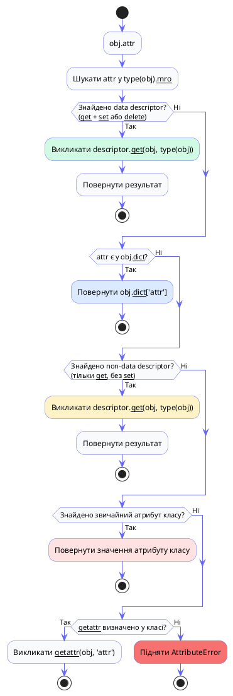

# Дескриптори — Магія доступу до атрибутів

## Проблема: атрибути поводяться не так, як ви очікуєте

Уявіть, що ви розробляєте систему для зберігання даних фізичних вимірювань. У вас є клас `Sensor`, що зберігає показники температури. Все просто на перший погляд: встановив атрибут `temperature` — і готово.

```python
class Sensor:
    def __init__(self, name: str):
        self.name = name
        self.temperature = 0.0

s = Sensor("Кімнатний")
s.temperature = 22.5   # нормально
s.temperature = -500   # фізично неможливо, але Python мовчить
s.temperature = "дуже гаряче"  # взагалі рядок — і знову тиша
```

Атрибут `temperature` є звичайним «слотом для зберігання» — Python нічого не перевіряє і нічого не знає про фізичну природу вашого поля. Щоб додати валідацію, починаючий розробник інстинктивно сягає за `@property`:

```python
class Sensor:
    def __init__(self, name: str):
        self.name = name
        self._temperature = 0.0

    @property
    def temperature(self) -> float:
        return self._temperature

    @temperature.setter
    def temperature(self, value: float) -> None:
        if not isinstance(value, (int, float)):
            raise TypeError(f"Температура має бути числом, отримано {type(value).__name__}")
        if value < -273.15:
            raise ValueError(f"Температура {value}°C нижча за абсолютний нуль")
        self._temperature = float(value)
```

Чудово! Але тепер задача ускладнюється: у вас з'являються класи `Thermometer`, `Barometer`, `Hygrometer` — і кожен з них має схожі поля з обмеженнями. Копіювати `@property` у кожен клас? Це антипатерн.

::card-group

::card{title="Дублювання @property" icon="i-heroicons-document-duplicate"}
Кожен клас з валідованим полем потребує власної пари геттер/сеттер. При зміні логіки валідації — редагуємо десятки місць.
::

::card{title="Неможливість переналаштування" icon="i-heroicons-lock-closed"}
`@property` жорстко прив'язаний до одного класу. Не можна легко отримати «поле з валідацією числа в діапазоні» як перевикористовуваний артефакт.
::

::card{title="Немасштабованість" icon="i-heroicons-chart-bar"}
Якщо у класі 20 числових полів з різними діапазонами — 20 пар геттер/сеттер. Клас перетворюється на монстра з сотнями рядків шаблонного коду.
::

::card{title="Рішення: дескриптори" icon="i-heroicons-sparkles"}
Дескриптор дозволяє описати логіку доступу до атрибуту один раз у вигляді окремого класу й перевикористовувати її в будь-якій кількості класів.
::

::

Саме для вирішення цієї проблеми в Python існує **протокол дескрипторів** — один із найпотужніших і найменш вивчених механізмів мови.

---

## Частина I: Протокол дескрипторів

### Що таке дескриптор

**Дескриптор** — це будь-який об'єкт, клас якого визначає хоча б один із спеціальних методів: `__get__`, `__set__` або `__delete__`. Якщо такий об'єкт присвоїти як **атрибут класу** (не екземпляра!), Python автоматично делегує операції читання, запису і видалення цього атрибуту відповідним методам дескриптора.

Це фундаментальне визначення варто запам'ятати:

::important
Дескриптор — це **атрибут класу**, чий тип визначає методи `__get__`, `__set__` або `__delete__`. При зверненні до такого атрибуту Python не просто повертає чи зберігає значення — він викликає відповідний метод дескриптора.
::

Саме завдяки протоколу дескрипторів у Python реалізовані:
- `@property` — вбудований дескриптор, що об'єднує геттер, сеттер і делетер
- `@classmethod` — дескриптор, що підставляє клас замість екземпляра
- `@staticmethod` — дескриптор, що повертає функцію без жодного прив'язування
- Звичайні методи — функції є non-data дескрипторами, що автоматично підставляють `self`

Тобто дескриптори — це не екзотична «темна магія». Це **фундамент об'єктної системи Python**, яким ви користуєтесь щодня, навіть не підозрюючи про це.

### Три методи протоколу

Протокол дескрипторів складається з трьох методів та одного допоміжного:

::field-group

::field{name="__get__(self, obj, objtype=None)" type="метод читання"}
Викликається при **читанні** атрибуту. `self` — сам дескриптор, `obj` — екземпляр, через який відбувається доступ (або `None`, якщо доступ через клас), `objtype` — клас екземпляра (або сам клас при доступі через клас).
::

::field{name="__set__(self, obj, value)" type="метод запису"}
Викликається при **записі** значення в атрибут (`obj.attr = value`). `self` — дескриптор, `obj` — екземпляр, `value` — нове значення. Якщо цей метод визначений — дескриптор є **data descriptor**.
::

::field{name="__delete__(self, obj)" type="метод видалення"}
Викликається при виконанні `del obj.attr`. Рідко потрібен у практиці, але необхідний для повного контролю над атрибутом.
::

::field{name="__set_name__(self, owner, name)" type="ініціалізація (Python 3.6+)"}
Спеціальний метод, що викликається **одразу при створенні класу** — ще до будь-яких екземплярів. `owner` — клас, у якому оголошено дескриптор, `name` — ім'я атрибуту, якому присвоєно дескриптор. Усуває необхідність передавати ім'я вручну через конструктор.
::

::

### Перший дескриптор: покроковий розбір

Побудуємо найпростіший можливий дескриптор — логер доступу, що фіксує кожне читання і запис атрибуту:

```python
# descriptors_intro.py

class LoggedAttribute:
    """
    Найпростіший дескриптор: логує кожен read та write до атрибуту.
    Зберігає значення у словнику __dict__ самого екземпляра,
    використовуючи своє ім'я як ключ.
    """

    def __set_name__(self, owner: type, name: str) -> None:
        # Викликається при оголошенні класу.
        # owner = клас, де оголошено дескриптор (наприклад, Person)
        # name  = ім'я атрибуту класу (наприклад, 'age')
        self.public_name = name           # 'age'
        self.private_name = f"_{name}"   # '_age' — для зберігання у __dict__ екземпляра

    def __get__(self, obj, objtype=None):
        # obj = None, якщо доступ через клас: Person.age
        if obj is None:
            return self  # повертаємо сам дескриптор
        value = getattr(obj, self.private_name, None)
        print(f"[GET] {type(obj).__name__}.{self.public_name} → {value!r}")
        return value

    def __set__(self, obj, value) -> None:
        print(f"[SET] {type(obj).__name__}.{self.public_name} = {value!r}")
        setattr(obj, self.private_name, value)


class Person:
    # LoggedAttribute() — це екземпляр класу-дескриптора,
    # присвоєний як атрибут КЛАСУ (не __init__)
    name = LoggedAttribute()
    age  = LoggedAttribute()

    def __init__(self, name: str, age: int) -> None:
        self.name = name  # → викличе LoggedAttribute.__set__
        self.age  = age   # → викличе LoggedAttribute.__set__

    def __repr__(self) -> str:
        return f"Person({self.name!r}, {self.age})"  # → викличе __get__ двічі


p = Person("Олена", 28)
print(p)
print(f"\nРоки через 5 років: {p.age + 5}")

# Доступ через клас — повертає сам дескриптор
print(f"\nДескриптор через клас: {Person.age}")
```

::terminal-preview{title="python descriptors_intro.py"}

<div class="line"><span class="opacity-40">$</span> <strong>python descriptors_intro.py</strong></div>
<div class="line">[SET] Person.name = <span class="text-blue-400">'Олена'</span></div>
<div class="line">[SET] Person.age = <span class="text-blue-400">28</span></div>
<div class="line">[GET] Person.name → <span class="text-green-400">'Олена'</span></div>
<div class="line">[GET] Person.age → <span class="text-green-400">28</span></div>
<div class="line">Person('Олена', 28)</div>
<div class="line"></div>
<div class="line">[GET] Person.age → <span class="text-green-400">28</span></div>
<div class="line">Роки через 5 років: <span class="text-yellow-400">33</span></div>
<div class="line"></div>
<div class="line">Дескриптор через клас: <span class="text-gray-400">&lt;LoggedAttribute object at 0x...&gt;</span></div>

::

Розберемо ключові моменти цього прикладу:

**Чому `setattr(obj, self.private_name, value)`, а не `obj.__dict__[self.public_name] = value`?**

Якби ми зберігали значення за тим самим ім'ям, що й дескриптор (`self.public_name = 'age'`), виник би нескінченний рекурсивний виклик: `self.age = 28` → `LoggedAttribute.__set__` → `obj.__dict__['age'] = 28` — але запис у `__dict__` за іменем, яким є дескриптор, знову перехоплюється дескриптором. Тому ми зберігаємо значення під «приватним» ім'ям `_age`, яке не є дескриптором.

**Чому `obj is None` у `__get__`?**

Коли ви звертаєтесь до атрибуту через **клас** (`Person.age`), Python викликає `__get__(None, Person)`. Конвенційна відповідь — повернути сам об'єкт дескриптора (`return self`). Це дозволяє отримати доступ до дескриптора для інтроспекції.

**Роль `__set_name__`:**

До Python 3.6 дескриптор не знав свого імені у класі — його треба було передавати вручну через конструктор: `age = LoggedAttribute('age')`. Метод `__set_name__` (PEP 487) усунув цю незручність: Python сам викликає його одразу після оголошення класу, передаючи ім'я атрибуту.

---

## Частина II: Алгоритм пошуку атрибутів (Attribute Lookup Chain)

### Як Python вирішує `obj.attr`: повна картина

Коли ви пишете `obj.attr`, Python не просто «шукає атрибут». Він виконує складний алгоритм із чітко визначеним пріоритетом. Розуміння цього алгоритму — ключ до того, щоб передбачити поведінку дескрипторів, `@property`, `__dict__` та звичайних атрибутів у будь-якій ситуації.

Алгоритм реалізований у вбудованому методі `object.__getattribute__`. Саме він викликається кожного разу, коли ви звертаєтесь до атрибуту через крапку. Спрощено його логіку можна описати так:

::steps

### Крок 1: Пошук у типі (класі) та його MRO
Python шукає `attr` у `type(obj).__mro__` — ланцюжку успадкування. Якщо знаходить **data descriptor** (клас атрибуту визначає `__get__` **і** `__set__` або `__delete__`), то **негайно** викликає його `__get__`. Data descriptor має найвищий пріоритет — він перемагає навіть `__dict__` екземпляра.

### Крок 2: Пошук у `__dict__` екземпляра
Якщо на кроці 1 data descriptor не знайдено, Python перевіряє `obj.__dict__`. Якщо ключ `attr` там є — повертає відповідне значення. Звичайні атрибути, встановлені через `self.x = ...` в `__init__`, живуть саме тут.

### Крок 3: Non-data descriptor або атрибут класу
Якщо ключ не знайдено у `__dict__` екземпляра, Python повертається до того, що знайшов у типі на кроці 1. Якщо це **non-data descriptor** (є `__get__`, але немає `__set__`/`__delete__`) — викликає його `__get__`. Якщо це просто атрибут класу (не дескриптор) — повертає його значення напряму.

### Крок 4: `__getattr__` як запасний варіант
Якщо атрибут не знайдено жодним із попередніх кроків, Python шукає метод `__getattr__` у класі. Якщо він є — викликає його. Якщо ні — підіймає `AttributeError`.

::

::plant-uml



::

### Data descriptor vs Non-data descriptor: критична різниця

Найважливіше розмежування у протоколі дескрипторів — це поділ на два типи:

| Характеристика | Data Descriptor | Non-data Descriptor |
|---|---|---|
| Визначені методи | `__get__` + (`__set__` або `__delete__`) | лише `__get__` |
| Пріоритет | **Вищий** за `__dict__` екземпляра | **Нижчий** за `__dict__` екземпляра |
| Типові приклади | `@property`, `IntegerField` | Звичайні функції/методи |
| Поведінка при `obj.attr = value` | Викликає `__set__` дескриптора | Записує у `obj.__dict__`, **затіняючи** дескриптор |

Ця різниця має принципове значення. Розберемо її на прикладі:

```python
# data_vs_nondata.py

class DataDescriptor:
    """Data descriptor — має і __get__, і __set__."""

    def __get__(self, obj, objtype=None):
        if obj is None:
            return self
        return obj.__dict__.get(f"_dd_val", "значення не встановлено")

    def __set__(self, obj, value):
        print(f"  [DataDescriptor.__set__] value={value!r}")
        obj.__dict__["_dd_val"] = value


class NonDataDescriptor:
    """Non-data descriptor — лише __get__, без __set__."""

    def __get__(self, obj, objtype=None):
        if obj is None:
            return self
        print(f"  [NonDataDescriptor.__get__] повертаю 'дескриптор'")
        return "значення від дескриптора"


class MyClass:
    data_attr     = DataDescriptor()
    nondata_attr  = NonDataDescriptor()


obj = MyClass()

# === Experiment 1: Data Descriptor ===
print("=== Data Descriptor ===")
print(f"До запису: {obj.data_attr}")      # виклик __get__, значення відсутнє

obj.data_attr = 42                         # → DataDescriptor.__set__
print(f"Після запису: {obj.data_attr}")   # → DataDescriptor.__get__

# Спроба "обійти" дескриптор — записати у __dict__ напряму
obj.__dict__["data_attr"] = 9999
print(f"Після __dict__['data_attr']=9999: {obj.data_attr}")
# Data descriptor ігнорує __dict__ і все одно викликає __get__!

# === Experiment 2: Non-data Descriptor ===
print("\n=== Non-data Descriptor ===")
print(f"До запису: {obj.nondata_attr}")   # → NonDataDescriptor.__get__

# Запис через звичайне присвоєння — обходить дескриптор!
obj.nondata_attr = "моє власне значення"
print(f"Після запису: {obj.nondata_attr}") # тепер читаємо з __dict__ екземпляра!

print(f"obj.__dict__: {obj.__dict__}")
```

::terminal-preview{title="python data_vs_nondata.py"}

<div class="line"><span class="opacity-40">$</span> <strong>python data_vs_nondata.py</strong></div>
<div class="line">=== Data Descriptor ===</div>
<div class="line">До запису: <span class="text-gray-400">значення не встановлено</span></div>
<div class="line">  [DataDescriptor.__set__] value=<span class="text-blue-400">42</span></div>
<div class="line">Після запису: <span class="text-green-400">42</span></div>
<div class="line">Після __dict__['data_attr']=9999: <span class="text-green-400">42</span>  <span class="text-gray-400"># дескриптор перемагає!</span></div>
<div class="line"></div>
<div class="line">=== Non-data Descriptor ===</div>
<div class="line">  [NonDataDescriptor.__get__] повертаю 'дескриптор'</div>
<div class="line">До запису: <span class="text-blue-400">значення від дескриптора</span></div>
<div class="line">Після запису: <span class="text-green-400">моє власне значення</span>  <span class="text-gray-400"># __dict__ затінив дескриптор!</span></div>
<div class="line">obj.__dict__: <span class="text-yellow-400">{'nondata_attr': 'моє власне значення', '_dd_val': 42}</span></div>

::

Результат демонструє принципову відмінність: **data descriptor перехоплює навіть пряме звернення до `__dict__`**, тоді як non-data descriptor легко «затінюється» записом в `__dict__` екземпляра.

### Чому звичайні методи є non-data дескрипторами

Функція у Python — це об'єкт, і клас `function` визначає метод `__get__`. Отже, функція є **non-data дескриптором**. Саме тому Python автоматично підставляє `self`:

```python
class Dog:
    def bark(self) -> str:
        return f"{self.name} гавкає!"

    def __init__(self, name: str):
        self.name = name

d = Dog("Рекс")

# Що відбувається при d.bark()?
# 1. Python шукає 'bark' у type(d).__mro__ → знаходить функцію Dog.bark
# 2. Dog.bark — non-data descriptor (є __get__, немає __set__)
# 3. Перевіряє d.__dict__ — там 'bark' немає
# 4. Викликає Dog.bark.__get__(d, Dog) → отримує "зв'язаний метод"
# 5. Викликає зв'язаний метод → self автоматично = d

# Доведемо це явно:
raw_function = Dog.__dict__['bark']    # сама функція, без дескрипторної магії
print(type(raw_function))              # <class 'function'>
print(type(d.bark))                    # <class 'method'> ← результат __get__

# Вони еквівалентні:
print(d.bark())                        # Рекс гавкає!
print(raw_function(d))                 # Рекс гавкає! (self передаємо вручну)

# Дескриптор можна викликати явно:
bound_method = raw_function.__get__(d, Dog)
print(bound_method())                  # Рекс гавкає!
```

::tip
Розуміння того, що **методи — це non-data дескриптори**, пояснює, чому `obj.method = lambda: "перевизначено"` працює: ви просто записуєте нове значення в `obj.__dict__['method']`, яке затіняє дескриптор із класу. Data descriptor (наприклад, `@property`) так обійти неможливо.
::

### Підтвердження: `@property` як data descriptor

`@property` — це вбудований клас Python. Подивимось, що він визначає:

```python
# property — це data descriptor: має __get__, __set__ і __delete__
print(hasattr(property, '__get__'))     # True
print(hasattr(property, '__set__'))     # True  ← саме тому це data descriptor
print(hasattr(property, '__delete__'))  # True

class Circle:
    def __init__(self, radius: float):
        self._radius = radius

    @property
    def radius(self) -> float:
        return self._radius

    @radius.setter
    def radius(self, value: float) -> None:
        if value < 0:
            raise ValueError("Радіус не може бути від'ємним")
        self._radius = value


c = Circle(5.0)

# Спроба обійти @property через __dict__:
c.__dict__['radius'] = -100  # записуємо напряму у словник екземпляра

# Але @property (data descriptor) ігнорує __dict__!
print(c.radius)          # 5.0 — повертає self._radius, а не -100
print(c.__dict__)        # {'_radius': 5.0, 'radius': -100} — запис є, але ігнорується
```

Саме тому `@property` не можна «перезаписати» через присвоєння `obj.attr = value` без сеттера — дескриптор перехоплює запис і або делегує сеттеру, або (якщо сеттер не визначений) підіймає `AttributeError: can't set attribute`.

---

## Частина III: Практичний сценарій 1 — Валідація типів та діапазонів

### Проблема: повторювана валідація полів

Повернімося до задачі, з якої ми починали. Тепер ми маємо повний інструментарій, щоб вирішити її елегантно. Побудуємо ієрархію дескрипторів-валідаторів, яку можна перевикористовувати у довільній кількості класів.

Почнемо з абстрактного базового класу для всіх валідаторів:

```python
# validators.py
from abc import ABC, abstractmethod


class Validator(ABC):
    """
    Абстрактний базовий клас для дескрипторів-валідаторів.
    Реалізує загальний протокол __get__/__set__/__set_name__,
    делегуючи специфічну логіку перевірки методу validate().
    """

    def __set_name__(self, owner: type, name: str) -> None:
        self.public_name  = name
        self.private_name = f"_{name}"

    def __get__(self, obj, objtype=None):
        if obj is None:
            return self
        return getattr(obj, self.private_name, None)

    def __set__(self, obj, value) -> None:
        # Спочатку валідуємо, потім зберігаємо
        self.validate(value)
        setattr(obj, self.private_name, value)

    @abstractmethod
    def validate(self, value) -> None:
        """
        Перевіряє значення. Має підняти TypeError або ValueError
        при невалідному вводі.
        """
        ...
```

Маючи базовий клас, будуємо конкретні валідатори через успадкування — кожен реалізує лише `validate()`:

```python
# validators.py (продовження)

class TypedField(Validator):
    """
    Дескриптор: перевіряє тип значення.
    
    name = TypedField(str)         # лише рядки
    count = TypedField((int, float))  # int або float
    """

    def __init__(self, expected_type: type | tuple):
        self.expected_type = expected_type

    def validate(self, value) -> None:
        if not isinstance(value, self.expected_type):
            type_name = (
                self.expected_type.__name__
                if isinstance(self.expected_type, type)
                else " | ".join(t.__name__ for t in self.expected_type)
            )
            raise TypeError(
                f"Атрибут '{self.public_name}' очікує тип {type_name}, "
                f"отримано {type(value).__name__!r}: {value!r}"
            )


class RangedField(Validator):
    """
    Дескриптор: перевіряє числове значення на входження в діапазон [min_val, max_val].
    None означає «без обмеження» з відповідного боку.
    
    temperature = RangedField(-273.15, 1_000_000)
    percentage  = RangedField(0.0, 100.0)
    """

    def __init__(
        self,
        min_val: float | None = None,
        max_val: float | None = None,
        *,
        inclusive: bool = True,
    ):
        self.min_val   = min_val
        self.max_val   = max_val
        self.inclusive = inclusive

    def validate(self, value) -> None:
        if not isinstance(value, (int, float)):
            raise TypeError(
                f"Атрибут '{self.public_name}' має бути числом, "
                f"отримано {type(value).__name__!r}"
            )
        too_low  = (self.min_val is not None and
                    (value < self.min_val if self.inclusive else value <= self.min_val))
        too_high = (self.max_val is not None and
                    (value > self.max_val if self.inclusive else value >= self.max_val))
        if too_low or too_high:
            bound = f"[{self.min_val}, {self.max_val}]" if self.inclusive else f"({self.min_val}, {self.max_val})"
            raise ValueError(
                f"Атрибут '{self.public_name}' = {value} виходить за межі {bound}"
            )


class NonEmptyString(Validator):
    """
    Дескриптор: гарантує, що рядок непустий після strip().
    Опціонально обмежує максимальну довжину.
    
    title       = NonEmptyString()
    description = NonEmptyString(max_length=500)
    """

    def __init__(self, max_length: int | None = None):
        self.max_length = max_length

    def validate(self, value) -> None:
        if not isinstance(value, str):
            raise TypeError(
                f"Атрибут '{self.public_name}' має бути рядком, "
                f"отримано {type(value).__name__!r}"
            )
        stripped = value.strip()
        if not stripped:
            raise ValueError(
                f"Атрибут '{self.public_name}' не може бути порожнім рядком"
            )
        if self.max_length is not None and len(stripped) > self.max_length:
            raise ValueError(
                f"Атрибут '{self.public_name}' перевищує максимальну довжину "
                f"{self.max_length} символів (фактично: {len(stripped)})"
            )
```

### Застосування валідаторів у доменних класах

Тепер подивимось, як ці валідатори застосовуються у реальних класах — і наскільки декларативним стає код:

```python
# domain_classes.py
from validators import TypedField, RangedField, NonEmptyString


class PhysicalSensor:
    """
    Датчик фізичних вимірювань.
    Всі поля з автоматичною валідацією — жодного @property, жодного дублювання.
    """
    name        = NonEmptyString(max_length=100)
    temperature = RangedField(-273.15, 1_000_000.0)   # в Цельсіях
    humidity    = RangedField(0.0, 100.0)              # у відсотках
    pressure    = RangedField(0.0, None)               # тиск ≥ 0, верхньої межі немає

    def __init__(
        self,
        name: str,
        temperature: float,
        humidity: float,
        pressure: float,
    ) -> None:
        self.name        = name
        self.temperature = temperature
        self.humidity    = humidity
        self.pressure    = pressure

    def __repr__(self) -> str:
        return (
            f"PhysicalSensor({self.name!r}, "
            f"T={self.temperature}°C, "
            f"H={self.humidity}%, "
            f"P={self.pressure} hPa)"
        )


class Product:
    """Товар в інтернет-магазині."""
    title    = NonEmptyString(max_length=200)
    price    = RangedField(0.01, None)                 # ціна > 0
    quantity = RangedField(0, None)                    # кількість ≥ 0
    sku      = NonEmptyString()

    def __init__(self, title: str, price: float, quantity: int, sku: str) -> None:
        self.title    = title
        self.price    = price
        self.quantity = quantity
        self.sku      = sku


# --- Тестування ---
sensor = PhysicalSensor("Кімнатний #1", temperature=22.5, humidity=55.0, pressure=1013.25)
print(sensor)

# Валідні зміни
sensor.temperature = 25.0
sensor.humidity    = 60.0

# Невалідні зміни — кожна підіймає виключення
try:
    sensor.temperature = -300  # нижче абсолютного нуля
except ValueError as e:
    print(f"ValueError: {e}")

try:
    sensor.humidity = 150      # вологість > 100%
except ValueError as e:
    print(f"ValueError: {e}")

try:
    sensor.name = ""           # порожній рядок
except ValueError as e:
    print(f"ValueError: {e}")

try:
    sensor.pressure = "висока"  # рядок замість числа
except TypeError as e:
    print(f"TypeError: {e}")
```

::terminal-preview{title="python domain_classes.py"}

<div class="line"><span class="opacity-40">$</span> <strong>python domain_classes.py</strong></div>
<div class="line">PhysicalSensor('Кімнатний #1', T=<span class="text-green-400">22.5</span>°C, H=<span class="text-green-400">55.0</span>%, P=<span class="text-green-400">1013.25</span> hPa)</div>
<div class="line">ValueError: <span class="text-rose-400">Атрибут 'temperature' = -300 виходить за межі [-273.15, 1000000.0]</span></div>
<div class="line">ValueError: <span class="text-rose-400">Атрибут 'humidity' = 150 виходить за межі [0.0, 100.0]</span></div>
<div class="line">ValueError: <span class="text-rose-400">Атрибут 'name' не може бути порожнім рядком</span></div>
<div class="line">TypeError: <span class="text-rose-400">Атрибут 'pressure' має бути числом, отримано 'str'</span></div>

::

### Ключові переваги підходу

Порівняємо кількість коду. У класі `PhysicalSensor` з 4 валідованими полями:

- **З `@property`:** ~40 рядків геттерів/сеттерів + дублювання в кожному новому класі
- **З дескрипторами:** 4 рядки декларацій (`name = NonEmptyString(...)` тощо) + один раз написані класи у `validators.py`

Але ще важливіша **семантична виразність**: рядок `temperature = RangedField(-273.15, 1_000_000.0)` читається як документація. Він відразу каже: «temperature — це числове поле в діапазоні від абсолютного нуля до мільйона». Ніякого `@property` з умовами всередині не потрібно читати.

::tip
Такий підхід — основа того, як влаштовані ORM-поля у Django (`models.CharField(max_length=200)`, `models.FloatField()`) і поля у Pydantic (`Field(ge=0, le=100)`). Ці бібліотеки реалізують значно складніші версії саме цього патерну.
::

---

## Частина IV: Практичний сценарій 2 — Ледаче обчислення (Lazy / Cached Property)

### Проблема дорогих обчислень

Уявіть клас, що представляє документ із текстом. Є кілька «похідних» атрибутів, які обчислюються на основі тексту: кількість слів, індекс читабельності, граматичний розбір, хеш для пошуку дублікатів. Ці обчислення — **дорогі**: займають десятки мілісекунд і потребують зовнішніх бібліотек.

Наївний підхід — обчислювати все в `__init__`. Але це катастрофа: завантажили 10 000 документів — заплатили повну вартість обчислень навіть для тих, до яких ніхто ніколи не зверниться.

Правильне рішення — **ледаче обчислення (lazy evaluation)**: атрибут обчислюється лише при першому зверненні та кешується для подальших. Це класичний патерн «обчисли один раз — зберігай назавжди».

::card-group

::card{title="Звичайний @property" icon="i-heroicons-arrow-path"}
Обчислює значення при кожному зверненні. Гарно, але дороговартісно якщо операція не безкоштовна — наприклад, розбір тексту або запит до БД.
::

::card{title="Обчислення у __init__" icon="i-heroicons-bolt"}
Розраховує все наперед. Дуже швидкий доступ, але повна вартість сплачується одразу — навіть якщо атрибут не знадобиться ніколи.
::

::card{title="Lazy / Cached Property" icon="i-heroicons-cpu-chip"}
Обчислює при першому зверненні, кешує результат у `__dict__` екземпляра. Подальші звернення — миттєві. Ідеальний баланс між першими двома.
::

::

### Реалізація через non-data descriptor

Ключ до реалізації `cached_property` — використати **non-data descriptor** навмисно. Пригадаємо алгоритм пошуку: non-data descriptor (є `__get__`, немає `__set__`) має нижчий пріоритет, ніж `__dict__` екземпляра. Це саме те, що нам потрібно:

1. При першому зверненні: `obj.__dict__` порожній за цим ключем → викликається `__get__` → обчислюємо значення → **зберігаємо у `obj.__dict__`** за тим самим іменем
2. При наступних зверненнях: Python знаходить значення у `obj.__dict__` **раніше**, ніж дійде до дескриптора → `__get__` більше не викликається

Таким чином дескриптор сам себе «відключає» після першого спрацювання:

```python
# lazy_property.py
import time
from typing import Callable, TypeVar, Any

T = TypeVar("T")


class lazy_property:
    """
    Non-data descriptor для ледачого обчислення атрибутів.
    
    При першому зверненні до атрибуту викликає обгорнуту функцію,
    зберігає результат у obj.__dict__ під тим самим ім'ям і повертає його.
    Усі наступні звернення отримують значення напряму з __dict__,
    оминаючи дескриптор повністю.
    
    Використання:
        class MyClass:
            @lazy_property
            def expensive_value(self) -> int:
                return heavy_computation()
    """

    def __init__(self, func: Callable) -> None:
        self.func      = func
        self.attr_name = None           # заповниться у __set_name__
        self.__doc__   = func.__doc__   # зберігаємо документацію

    def __set_name__(self, owner: type, name: str) -> None:
        self.attr_name = name

    def __get__(self, obj, objtype=None) -> Any:
        if obj is None:
            return self  # доступ через клас → повертаємо сам дескриптор

        if self.attr_name is None:
            raise TypeError(
                "lazy_property не можна використовувати без __set_name__. "
                "Переконайтесь, що він оголошений як атрибут класу."
            )

        # Обчислюємо значення і одразу записуємо у __dict__ екземпляра.
        # Наступного разу Python знайде його там і не дійде до нас (non-data!).
        print(f"  [lazy_property] Обчислюємо '{self.attr_name}' для {type(obj).__name__}...")
        value = self.func(obj)
        obj.__dict__[self.attr_name] = value
        return value

    # Немає __set__ → це non-data descriptor → __dict__ екземпляра має пріоритет


class Document:
    """
    Документ із текстовим вмістом.
    Всі похідні атрибути обчислюються ледаче — лише при першому зверненні.
    """

    def __init__(self, text: str) -> None:
        self.text = text

    @lazy_property
    def word_count(self) -> int:
        """Кількість слів у документі."""
        time.sleep(0.05)  # симуляція важкого NLP-аналізу
        return len(self.text.split())

    @lazy_property
    def unique_words(self) -> set[str]:
        """Множина унікальних слів (у нижньому регістрі)."""
        time.sleep(0.05)
        return {w.lower().strip(".,!?;:") for w in self.text.split()}

    @lazy_property
    def char_frequency(self) -> dict[str, int]:
        """Частота кожного символу (без пробілів)."""
        time.sleep(0.05)
        freq: dict[str, int] = {}
        for ch in self.text.replace(" ", ""):
            freq[ch] = freq.get(ch, 0) + 1
        return dict(sorted(freq.items(), key=lambda x: x[1], reverse=True))

    @lazy_property
    def reading_time_minutes(self) -> float:
        """Приблизний час читання (200 слів/хв — середня швидкість)."""
        return round(self.word_count / 200, 2)

    def __repr__(self) -> str:
        return f"Document({len(self.text)} chars)"
```

::terminal-preview{title="Демонстрація lazy_property"}

<div class="line"><span class="opacity-40">$</span> <strong>python lazy_property.py</strong></div>
<div class="line"><span class="text-gray-400"># Створення документа — миттєво, нічого не обчислюється</span></div>
<div class="line">doc = Document(<span class="text-green-400">"Python дескриптори — потужний механізм мови..."</span>)</div>
<div class="line"></div>
<div class="line"><span class="text-gray-400"># Перше звернення — обчислення відбувається</span></div>
<div class="line">  [lazy_property] Обчислюємо <span class="text-yellow-400">'word_count'</span> для Document...</div>
<div class="line">Кількість слів: <span class="text-green-400">6</span></div>
<div class="line"></div>
<div class="line"><span class="text-gray-400"># Друге звернення — миттєво, з __dict__</span></div>
<div class="line">Знову word_count: <span class="text-green-400">6</span>  <span class="text-gray-400"># __get__ не викликався!</span></div>
<div class="line"></div>
<div class="line"><span class="text-gray-400"># Перевіряємо __dict__</span></div>
<div class="line">doc.__dict__: <span class="text-blue-400">{'text': '...', 'word_count': 6}</span></div>

::

```python
# Повна демонстрація використання
import time

doc = Document(
    "Python дескриптори — потужний механізм мови. "
    "Вони лежать в основі @property, методів та ORM-полів. "
    "Розуміння дескрипторів відкриває глибину Python."
)

print(f"Документ створено: {doc}")
print(f"__dict__ одразу після створення: {doc.__dict__}\n")

# Перший доступ до word_count — обчислення
t0 = time.perf_counter()
wc = doc.word_count
t1 = time.perf_counter()
print(f"word_count = {wc}  (час: {(t1 - t0) * 1000:.1f}мс)")

# Другий доступ — миттєво, з __dict__
t0 = time.perf_counter()
wc2 = doc.word_count
t1 = time.perf_counter()
print(f"word_count = {wc2}  (час: {(t1 - t0) * 1000:.3f}мс)  ← з кешу\n")

# unique_words — обчислюється вперше
print(f"unique_words: {doc.unique_words}\n")

# reading_time використовує word_count — той вже в __dict__, тому lazy обчислення
# word_count не запускається заново
print(f"Час читання: {doc.reading_time_minutes} хв")

# __dict__ після всіх звернень
print(f"\nОстаточний __dict__: {list(doc.__dict__.keys())}")
```

::terminal-preview{title="python lazy_full_demo.py"}

<div class="line"><span class="opacity-40">$</span> <strong>python lazy_full_demo.py</strong></div>
<div class="line">Документ створено: Document(<span class="text-blue-400">127</span> chars)</div>
<div class="line">__dict__ одразу після створення: <span class="text-gray-400">{'text': '...'}</span></div>
<div class="line"></div>
<div class="line">  [lazy_property] Обчислюємо <span class="text-yellow-400">'word_count'</span> для Document...</div>
<div class="line">word_count = <span class="text-green-400">21</span>  (час: <span class="text-yellow-400">51.3</span>мс)</div>
<div class="line">word_count = <span class="text-green-400">21</span>  (час: <span class="text-blue-400">0.001</span>мс)  ← з кешу</div>
<div class="line"></div>
<div class="line">  [lazy_property] Обчислюємо <span class="text-yellow-400">'unique_words'</span> для Document...</div>
<div class="line">unique_words: <span class="text-green-400">{'python', 'дескриптори', 'потужний', ...}</span></div>
<div class="line"></div>
<div class="line">  [lazy_property] Обчислюємо <span class="text-yellow-400">'reading_time_minutes'</span> для Document...</div>
<div class="line">Час читання: <span class="text-green-400">0.1</span> хв</div>
<div class="line"></div>
<div class="line">Остаточний __dict__: <span class="text-blue-400">['text', 'word_count', 'unique_words', 'reading_time_minutes']</span></div>
<div class="line"><span class="text-gray-400"># char_frequency так і не обчислився — він не знадобився</span></div>

::

### Порівняння з `functools.cached_property`

Python 3.8 ввів `functools.cached_property` — вбудовану реалізацію рівно цього патерну. Наша власна реалізація `lazy_property` дидактична і показує механіку зсередини, але у production-коді слід використовувати стандартну:

```python
from functools import cached_property


class HeavyModel:
    """
    Модель з дорогими обчисленнями — використовує вбудований cached_property.
    """

    def __init__(self, data: list[int]) -> None:
        self.data = data

    @cached_property
    def mean(self) -> float:
        """Середнє значення (обчислюється один раз)."""
        return sum(self.data) / len(self.data)

    @cached_property
    def variance(self) -> float:
        """Дисперсія (залежить від mean — також обчислюється один раз)."""
        m = self.mean
        return sum((x - m) ** 2 for x in self.data) / len(self.data)

    @cached_property
    def std_deviation(self) -> float:
        """Стандартне відхилення."""
        return self.variance ** 0.5


model = HeavyModel([2, 4, 4, 4, 5, 5, 7, 9])

print(f"Середнє:             {model.mean:.2f}")        # обчислюється
print(f"Дисперсія:           {model.variance:.2f}")    # обчислюється (mean — з кешу)
print(f"Стандартне відхил.: {model.std_deviation:.2f}") # обчислюється (variance — з кешу)
print(f"Середнє знову:       {model.mean:.2f}")        # миттєво з __dict__
```

::warning
`functools.cached_property` **не є потокобезпечним** за замовчуванням. Якщо кілька потоків одночасно звернуться до некешованого атрибуту — обчислення може відбутись кілька разів. Для потокобезпечного кешування слід використовувати блокування (`threading.Lock`) або `functools.lru_cache` на звичайному методі з `@property`.
::

### Скидання кешу: коли ледаче значення застаріває

Оскільки `cached_property` (і наша `lazy_property`) зберігають значення у `obj.__dict__`, скинути кеш можна простим видаленням:

```python
doc = Document("Початковий текст документа")
print(doc.word_count)        # обчислюється: 3

# Змінюємо базові дані — кеш застарів!
doc.text = "Новий набагато довший текст із великою кількістю слів у цьому документі"

# Старий кеш досі у __dict__:
print(doc.word_count)        # 3 — НЕПРАВИЛЬНО! читає застарілий кеш

# Скидаємо кеш вручну:
del doc.__dict__['word_count']

# Тепер обчислюється заново:
print(doc.word_count)        # 14 — правильно
```

::important
Це відкриває важливе архітектурне питання: якщо базові дані об'єкта можуть змінюватись, `cached_property` потребує ручного скидання кешу або замінюється на звичайний `@property`. `cached_property` найбільш підходить для **незмінних об'єктів** або об'єктів, де кешовані атрибути залежать лише від даних, що задаються при ініціалізації і більше не змінюються.
::

---

## Частина V: Практичний сценарій 3 — Емуляція ORM-полів

### Декларативне визначення схеми даних

Одна з найпотужніших демонстрацій дескрипторів — реалізація спрощеного ORM (Object-Relational Mapper) у стилі Django. Ідея: клас Python описує таблицю бази даних декларативно, а кожне поле — це дескриптор, що несе метадані (тип колонки, обмеження, значення за замовчуванням).

Побудуємо мінімальну, але повнофункціональну систему таких полів:

```python
# mini_orm.py
from __future__ import annotations
from typing import Any


# ─── Базовий клас поля ───────────────────────────────────────────────────────

class Field:
    """
    Базовий дескриптор для ORM-полів.
    Зберігає метадані колонки: тип, обов'язковість, значення за замовчуванням.
    При присвоєнні перевіряє тип і обов'язковість.
    """

    # Глобальний лічильник для збереження порядку оголошення полів
    _creation_counter: int = 0

    def __init__(
        self,
        *,
        null: bool = False,
        default: Any = ...,    # Ellipsis означає «значення за замовчуванням відсутнє»
        primary_key: bool = False,
        db_column: str | None = None,
    ) -> None:
        self.null        = null
        self.default     = default
        self.primary_key = primary_key
        self.db_column   = db_column    # ім'я колонки у БД (якщо відрізняється від атрибуту)

        # Запам'ятовуємо порядок оголошення (як у Django)
        Field._creation_counter += 1
        self._order = Field._creation_counter

        self.attr_name: str = ""        # встановлюється у __set_name__

    def __set_name__(self, owner: type, name: str) -> None:
        self.attr_name = name
        if self.db_column is None:
            self.db_column = name       # за замовчуванням ім'я колонки = ім'я атрибуту

    def __get__(self, obj, objtype=None) -> Any:
        if obj is None:
            return self
        # Повертаємо значення зі сховища екземпляра, або default
        value = obj.__dict__.get(f"_field_{self.attr_name}", ...)
        if value is ...:
            if self.default is not ...:
                return self.default() if callable(self.default) else self.default
            return None
        return value

    def __set__(self, obj, value) -> None:
        if value is None:
            if not self.null:
                raise ValueError(
                    f"Поле '{self.attr_name}' не може бути NULL "
                    f"(встановіть null=True щоб дозволити)"
                )
        else:
            self.validate(value)
        obj.__dict__[f"_field_{self.attr_name}"] = value

    def validate(self, value: Any) -> None:
        """Перевірка, специфічна для типу поля. Перевизначається у підкласах."""
        pass

    def to_sql_type(self) -> str:
        """SQL-тип колонки. Перевизначається у підкласах."""
        return "TEXT"

    def __repr__(self) -> str:
        return (
            f"{type(self).__name__}("
            f"null={self.null}, "
            f"default={self.default!r}, "
            f"db_column={self.db_column!r})"
        )


# ─── Конкретні типи полів ─────────────────────────────────────────────────────

class IntegerField(Field):
    """Цілочисельна колонка. Відповідає INTEGER у SQL."""

    def __init__(self, *, min_value: int | None = None, max_value: int | None = None, **kwargs):
        super().__init__(**kwargs)
        self.min_value = min_value
        self.max_value = max_value

    def validate(self, value: Any) -> None:
        if not isinstance(value, int) or isinstance(value, bool):
            raise TypeError(
                f"Поле '{self.attr_name}' очікує int, отримано {type(value).__name__!r}"
            )
        if self.min_value is not None and value < self.min_value:
            raise ValueError(f"Поле '{self.attr_name}': {value} < мінімум {self.min_value}")
        if self.max_value is not None and value > self.max_value:
            raise ValueError(f"Поле '{self.attr_name}': {value} > максимум {self.max_value}")

    def to_sql_type(self) -> str:
        return "INTEGER"


class CharField(Field):
    """Рядкова колонка з обмеженням довжини. Відповідає VARCHAR(n) у SQL."""

    def __init__(self, max_length: int = 255, **kwargs):
        super().__init__(**kwargs)
        self.max_length = max_length

    def validate(self, value: Any) -> None:
        if not isinstance(value, str):
            raise TypeError(
                f"Поле '{self.attr_name}' очікує str, отримано {type(value).__name__!r}"
            )
        if len(value) > self.max_length:
            raise ValueError(
                f"Поле '{self.attr_name}': рядок завдовжки {len(value)} "
                f"перевищує max_length={self.max_length}"
            )

    def to_sql_type(self) -> str:
        return f"VARCHAR({self.max_length})"


class FloatField(Field):
    """Поле з плаваючою крапкою. Відповідає REAL / DOUBLE у SQL."""

    def validate(self, value: Any) -> None:
        if not isinstance(value, (int, float)) or isinstance(value, bool):
            raise TypeError(
                f"Поле '{self.attr_name}' очікує число, отримано {type(value).__name__!r}"
            )

    def to_sql_type(self) -> str:
        return "REAL"


class BooleanField(Field):
    """Булеве поле. Відповідає BOOLEAN / INTEGER(0/1) у SQLite."""

    def validate(self, value: Any) -> None:
        if not isinstance(value, bool):
            raise TypeError(
                f"Поле '{self.attr_name}' очікує bool, отримано {type(value).__name__!r}"
            )

    def to_sql_type(self) -> str:
        return "BOOLEAN"
```

### Метаклас для збору метаданих схеми

Щоб клас-модель «знав» про всі свої поля (для генерації SQL, серіалізації тощо), потрібно зібрати їх при оголошенні класу. Це природна задача для **метакласу**:

```python
# mini_orm.py (продовження)

class ModelMeta(type):
    """
    Метаклас для ORM-моделей.
    При створенні класу збирає всі Field-атрибути у впорядкований словник _fields.
    """

    def __new__(mcs, name: str, bases: tuple, namespace: dict) -> type:
        fields: dict[str, Field] = {}

        # Збираємо поля з батьківських класів (успадкування моделей)
        for base in bases:
            if hasattr(base, "_fields"):
                fields.update(base._fields)

        # Збираємо поля поточного класу (у порядку оголошення)
        for attr_name, value in namespace.items():
            if isinstance(value, Field):
                fields[attr_name] = value

        # Сортуємо за порядком оголошення (через _creation_counter)
        namespace["_fields"] = dict(
            sorted(fields.items(), key=lambda item: item[1]._order)
        )

        return super().__new__(mcs, name, bases, namespace)


class Model(metaclass=ModelMeta):
    """
    Базовий клас для всіх ORM-моделей.
    Надає загальний __init__, __repr__, to_dict() та generate_sql().
    """

    def __init__(self, **kwargs: Any) -> None:
        # Встановлюємо значення полів через дескриптори (з валідацією)
        for field_name, field in self._fields.items():
            if field_name in kwargs:
                setattr(self, field_name, kwargs[field_name])
            elif field.default is not ...:
                pass    # __get__ поверне default автоматично
            elif not field.null:
                raise ValueError(
                    f"Обов'язкове поле '{field_name}' не передано у конструктор"
                )

    def __repr__(self) -> str:
        parts = []
        for name in self._fields:
            val = getattr(self, name)
            parts.append(f"{name}={val!r}")
        return f"{type(self).__name__}({', '.join(parts)})"

    def to_dict(self) -> dict[str, Any]:
        """Серіалізація у словник (для JSON, API-відповідей тощо)."""
        return {name: getattr(self, name) for name in self._fields}

    @classmethod
    def generate_create_table_sql(cls) -> str:
        """Генерує SQL-запит CREATE TABLE на основі оголошених полів."""
        table_name = cls.__name__.lower() + "s"  # проста конвенція: User → users
        columns: list[str] = []
        for field_name, field in cls._fields.items():
            col  = f"    {field.db_column} {field.to_sql_type()}"
            if field.primary_key:
                col += " PRIMARY KEY AUTOINCREMENT"
            if not field.null and not field.primary_key:
                col += " NOT NULL"
            if field.default is not ... and not callable(field.default):
                default_val = (
                    f"'{field.default}'" if isinstance(field.default, str)
                    else str(field.default).upper() if isinstance(field.default, bool)
                    else str(field.default)
                )
                col += f" DEFAULT {default_val}"
            columns.append(col)
        cols_sql = ",\n".join(columns)
        return f"CREATE TABLE IF NOT EXISTS {table_name} (\n{cols_sql}\n);"
```

### Оголошення моделей і демонстрація

```python
# models.py
from mini_orm import Model, IntegerField, CharField, FloatField, BooleanField


class User(Model):
    """Модель користувача — відповідає таблиці users у БД."""
    id         = IntegerField(primary_key=True, null=True)
    username   = CharField(max_length=50)
    email      = CharField(max_length=200)
    age        = IntegerField(min_value=0, max_value=150, null=True)
    is_active  = BooleanField(default=True)
    score      = FloatField(default=0.0, null=True)


class Article(Model):
    """Модель статті — відповідає таблиці articles у БД."""
    id         = IntegerField(primary_key=True, null=True)
    title      = CharField(max_length=255)
    content    = CharField(max_length=10_000)
    views      = IntegerField(default=0)
    published  = BooleanField(default=False)


# ─── Використання ─────────────────────────────────────────────────────────────

# Створення екземплярів — повна валідація при ініціалізації
user = User(username="arakviel", email="arakviel@example.com", age=30)
print(user)
print(f"to_dict: {user.to_dict()}\n")

# Генерація SQL
print(User.generate_create_table_sql())
print()
print(Article.generate_create_table_sql())

# Валідація при зміні полів
try:
    user.age = 200          # перевищує max_value=150
except ValueError as e:
    print(f"\nValueError: {e}")

try:
    user.username = "a" * 100  # перевищує max_length=50
except ValueError as e:
    print(f"ValueError: {e}")

try:
    user.is_active = 1      # int замість bool
except TypeError as e:
    print(f"TypeError: {e}")
```

::terminal-preview{title="python models.py"}

<div class="line"><span class="opacity-40">$</span> <strong>python models.py</strong></div>
<div class="line">User(id=<span class="text-gray-400">None</span>, username=<span class="text-green-400">'arakviel'</span>, email=<span class="text-green-400">'arakviel@example.com'</span>, age=<span class="text-green-400">30</span>, is_active=<span class="text-green-400">True</span>, score=<span class="text-green-400">0.0</span>)</div>
<div class="line">to_dict: <span class="text-blue-400">{'id': None, 'username': 'arakviel', 'email': 'arakviel@example.com', 'age': 30, 'is_active': True, 'score': 0.0}</span></div>
<div class="line"></div>
<div class="line"><span class="text-yellow-400">CREATE TABLE IF NOT EXISTS users (</span></div>
<div class="line">    id <span class="text-blue-400">INTEGER PRIMARY KEY AUTOINCREMENT</span>,</div>
<div class="line">    username <span class="text-blue-400">VARCHAR(50) NOT NULL</span>,</div>
<div class="line">    email <span class="text-blue-400">VARCHAR(200) NOT NULL</span>,</div>
<div class="line">    age <span class="text-blue-400">INTEGER</span>,</div>
<div class="line">    is_active <span class="text-blue-400">BOOLEAN NOT NULL DEFAULT TRUE</span>,</div>
<div class="line">    score <span class="text-blue-400">REAL DEFAULT 0.0</span></div>
<div class="line"><span class="text-yellow-400">);</span></div>
<div class="line"></div>
<div class="line">ValueError: <span class="text-rose-400">Поле 'age': 200 > максимум 150</span></div>
<div class="line">ValueError: <span class="text-rose-400">Поле 'username': рядок завдовжки 100 перевищує max_length=50</span></div>
<div class="line">TypeError: <span class="text-rose-400">Поле 'is_active' очікує bool, отримано 'int'</span></div>

::

### Що стоїть за Django ORM

Ця реалізація — спрощена модель того, як насправді влаштований Django ORM. Реальний Django робить значно більше:

- Метаклас `ModelBase` збирає поля, валідатори, індекси та зовнішні ключі
- Кожне поле (`CharField`, `IntegerField` тощо) є дескриптором, що підтримує `contribute_to_class()` для реєстрації у моделі
- `QuerySet` та менеджери також реалізовані як дескриптори (`objects = Manager()` у кожній моделі)
- `ForeignKey` через дескриптор повертає пов'язаний об'єкт, виконуючи SQL-запит при першому зверненні — ледаче завантаження (lazy loading)

Тобто весь Django ORM — це, по суті, велика і складна система дескрипторів і метакласів, побудована на тих самих принципах, що ми щойно реалізували вручну.

---

## Підсумок: коли і навіщо використовувати дескриптори

Дескриптори — це інструмент конкретних задач. Вони не є «кращим способом» написання будь-якого коду, але незамінні у специфічних сценаріях:

::card-group

::card{title="✅ Перевикористовувана валідація" icon="i-heroicons-shield-check"}
Якщо одна і та сама логіка перевірки потрібна в кількох класах — виносьте її в дескриптор. Класичний приклад: `RangedField`, `NonEmptyString`, `EmailField`.
::

::card{title="✅ Ледаче кешування" icon="i-heroicons-cpu-chip"}
Атрибут, що дорого обчислюється, але потрібен не завжди — ідеальний кандидат для `cached_property`. Використовуйте `functools.cached_property` у production.
::

::card{title="✅ Декларативні API" icon="i-heroicons-code-bracket-square"}
ORM-поля, поля форм, конфігурація через атрибути класу — будь-яка декларативна система, де «оголошення атрибуту = опис поведінки».
::

::card{title="❌ Проста валідація в одному класі" icon="i-heroicons-x-mark"}
Якщо перевірка потрібна лише для одного атрибуту одного класу — `@property` достатньо. Дескриптор тут надмірний.
::

::

### Ключові принципи, які варто пам'ятати

| Принцип | Деталь |
|---|---|
| Розміщення | Дескриптор — атрибут **класу**, не екземпляра |
| Data vs Non-data | `__set__` / `__delete__` → data (пріоритет вищий за `__dict__`) |
| Зберігання значень | У `obj.__dict__` під «приватним» іменем або через `_name` |
| `__set_name__` | З Python 3.6 — отримуємо ім'я атрибуту автоматично, без конструктора |
| `obj is None` у `__get__` | Доступ через клас → повертаємо `self` (сам дескриптор) |
| Порядок пошуку | Data descriptor → `__dict__` → Non-data descriptor → `__getattr__` |
| Вбудовані приклади | `property`, `classmethod`, `staticmethod`, звичайні функції |
