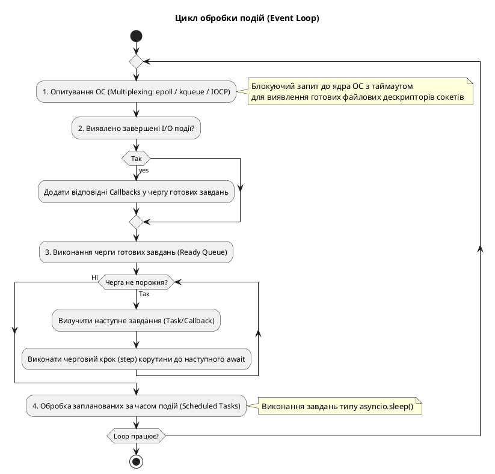
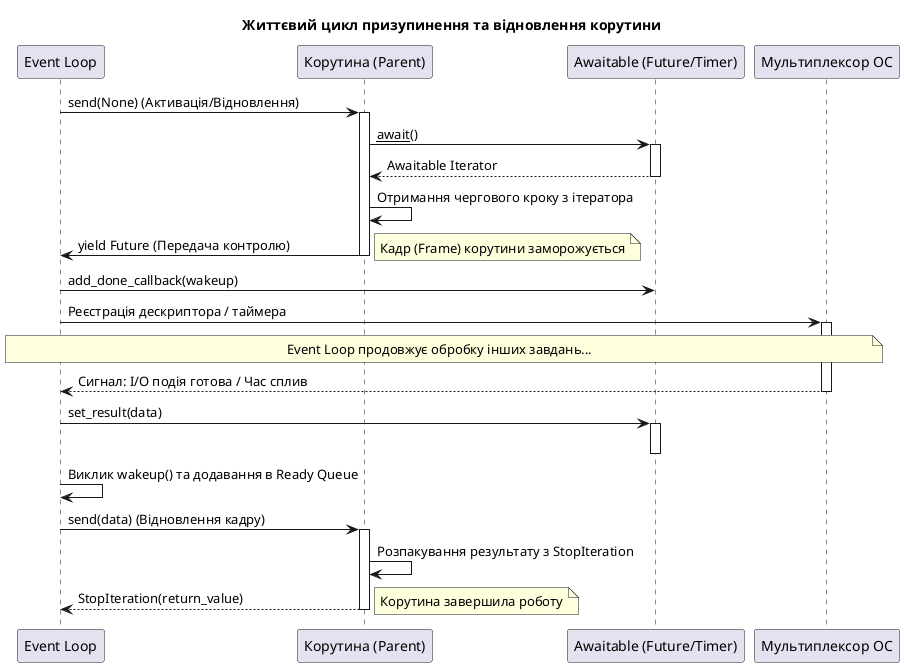

# asyncio — кооперативна конкурентність та event loop

## Проблема C10K: 10 000 з'єднань, один сервер

Під час проєктування сучасних мережевих систем (наприклад, чат-серверів, WebSocket-шлюзів або API-серверів реального часу) розробники стикаються з проблемою **C10K (Concurrent 10,000 Connections)** — потребою обслуговувати 10 000 і більше одночасних клієнтських з'єднань на одному фізичному сервері.

У класичній синхронній моделі програмування кожне нове мережеве з'єднання обслуговується окремим потоком операційної системи (Thread-per-Connection). Проте потоки ОС мають високу ціну.

Обчислимо приблизний обсяг ресурсів для такої моделі за формулою:

::math-formula
Memory*{overhead} = N \times Stack*{size} + ContextSwitch\_{overhead}
::

Якщо підставити реальні значення для 10 000 активних потоків, де розмір стеку одного потоку в Linux/Unix системах зазвичай становить 512 КБ:

::math-formula
10,000 \times 512 \text{ KB} \approx 5 \text{ GB}
::

Окрім споживання 5 ГБ оперативної пам'яті виключно на службові стеки потоків, виникають інші обмеження:

1. **Переключення контексту (Context Switching)**: Ядро операційної системи витрачає значну частину процесорного часу на перемикання між тисячами потоків (збереження регістрів CPU, таблиць сторінок пам'яті тощо), замість виконання корисної роботи.
2. **Системні ліміти**: В ОС Linux за замовчуванням встановлені жорсткі ліміти на загальну кількість потоків (наприклад, `/proc/sys/kernel/threads-max` зазвичай обмежує їх до ~32 000).

Система почне деградувати задовго до досягнення 10 000 з'єднань. Щоб вирішити цю проблему, у 2002 році при розробці вебсервера Nginx було запропоновано подієво-орієнтований підхід (Event-Driven) на основі **Event Loop (циклу подій)**. У Python офіційна підтримка цієї моделі з'явилася у вигляді бібліотеки `asyncio` (PEP 3156, Python 3.4, яка отримала нативний синтаксис `async/await` у Python 3.5 та була кардинально покращена в 3.7+).

---

### Порівняння парадигм конкурентності

Для кращого розуміння відмінностей між потоками та асинхронністю, порівняємо їх ключові характеристики:

::card-group

::card{title="Потоки: preemptive (витісняюча)" icon="i-heroicons-cpu-chip"}
Операційна система примусово призупиняє роботу одного потоку та перемикає CPU на інший за таймером (квантування часу). Це вимагає складних блокувань (Locks, Mutexes) для уникнення Race Conditions. Кожен потік потребує окремого стеку пам'яті.
::

::card{title="asyncio: cooperative (кооперативна)" icon="i-heroicons-arrow-path"}
Корутини виконуються на **одному потоці**. Перемикання контексту відбувається добровільно лише у строго визначених точках — біля ключового слова `await`. Відсутні примусові переривання CPU, а споживання пам'яті на корутину вимірюється байтами.
::

::card{title="Де asyncio є ідеальним" icon="i-heroicons-bolt"}
Будь-які операції I/O-bound (введення-виведення): мережеві HTTP-запити, вебсокети, взаємодія з базами даних, робота з чергами повідомлень (RabbitMQ, Redis), парсинг сайтів або дискове I/O.
::

::card{title="Де asyncio не допоможе" icon="i-heroicons-x-circle"}
CPU-bound задачі (складні математичні обчислення, обробка зображень, кодування відео). Оскільки event loop працює в одному потоці, CPU-bound завдання повністю заблокує його. Для них слід використовувати `multiprocessing` або фонові пули через `run_in_executor`.
::

::

---

## Частина I: Модель event loop — як це працює зсередини

### Від callbacks до coroutines: еволюція асинхронного Python

Історично асинхронне програмування в Python розвивалося у три етапи:

1. **Callback-style (Покоління 1)**: Асинхронність на основі зворотних викликів. Функція ініціює операцію та передає іншу функцію (callback), яку треба викликати після завершення. Цей підхід використовувався у старих фреймворках (Twisted, Tornado) та низькорівневих протоколах `asyncio`. Наслідком є "Callback Hell" (велика вкладеність коду).
2. **Generators & yield from (Покоління 2)**: З появою PEP 380 (Python 3.3) генератори отримали конструкцію `yield from`. Це дозволило писати асинхронний код, який виглядав лінійно, але функції доводилося декорувати як `@asyncio.coroutine`.
3. **Native Coroutines (Покоління 3)**: Починаючи з PEP 492 (Python 3.5), мова отримала першокласну підтримку корутин через ключові слова `async def` та `await`.

Поглянемо на старий низькорівневий callback-стиль, який досі використовується під капотом `asyncio` для взаємодії з мережевими сокетами:

```python
# callback_style.py — низькорівнева callback-модель
import asyncio

def on_data_received(data: bytes) -> None:
    """Викликається автоматично при надходженні даних у сокет."""
    print(f"Отримано: {data.decode()}")

def on_connection_made(transport) -> None:
    """Викликається при успішному встановленні з'єднання."""
    transport.write(b"Hello!\n")
    # Передаємо callback для обробки вхідних даних
    # transport.register_reader(on_data_received)
```

Асинхронний код на базі корутин повністю приховує цю низькорівневу рутину, надаючи розробнику лінійний імперативний інтерфейс.

---

### Анатомія Event Loop

**Event Loop (цикл подій)** — це ядро асинхронної архітектури. З концептуальної точки зору це нескінченний цикл, який керує чергою подій та координує виконання корутин:

::plant-uml



::

Під капотом `asyncio` використовує системні виклики операційної системи для мультиплексування введення-виведення:

- **`epoll`** — у сімействі Linux.
- **`kqueue`** — у macOS та BSD-системах.
- **`IOCP (Input/Output Completion Ports)`** — у Windows.

Для досягнення максимальної продуктивності в продакшені стандартний Event Loop часто замінюють на **`uvloop`** — альтернативну бібліотеку, написану на Cython, яка обгортає надшвидку системну бібліотеку `libuv` (що використовується в Node.js). `uvloop` робить асинхронний Python у 2-4 рази швидшим, наближаючи його продуктивність до Go та Node.js.

Розглянемо базовий приклад конкурентного чергування виконання корутин у циклі подій:

```python
# event_loop_anatomy.py
import asyncio

async def say_hello() -> None:
    print("Привіт!")           # Крок 1
    # Корутина реєструє подію таймера на 1 сек і добровільно віддає контроль Event Loop
    await asyncio.sleep(1)
    print("Пройшла секунда")   # Крок 2 (виконується після спрацьовування таймера)

async def count() -> None:
    for i in range(3):
        print(f"  Рахую: {i}")
        # Корутина реєструє подію таймера на 0.3 сек і віддає контроль
        await asyncio.sleep(0.3)

async def main() -> None:
    # Запускаємо обидві корутини конкурувати за процесорний час
    await asyncio.gather(say_hello(), count())

# Створюємо подієвий цикл, запускаємо головну корутину та закриваємо цикл
asyncio.run(main())
```

::terminal-preview{title="python event_loop_anatomy.py"}

<div class="line"><span class="opacity-40">$</span> <strong>python event_loop_anatomy.py</strong></div>
<div class="line">Привіт!</div>
<div class="line">  Рахую: 0</div>
<div class="line">  Рахую: 1</div>
<div class="line">  Рахую: 2</div>
<div class="line">Пройшла секунда</div>

::

Зверніть увагу: `say_hello` і `count` виконуються у **чергуванні** — поки `say_hello` чекає 1 секунду, `count` тричі встигає вивести значення. Це і є кооперативна конкурентність: один потік, але ілюзія «одночасності» за рахунок перемикання у точках `await`.

### Що відбувається у точці `await` (Глибинний аналіз життєвого циклу корутини)

Коли інтерпретатор Python зустрічає ключове слово `await`, він не просто «зупиняє» виконання. Це складна взаємодія між генераторним кадром (frame) корутини, об'єктом, який ми очікуємо (awaitable), та подієвим циклом (Event Loop).

#### Анатомія призупинення та відновлення

Під капотом Python корутина — це розширена версія генератора (PEP 492). Ключове слово `await` працює аналогічно до `yield from`, але зі строгою семантикою та додатковими перевірками типів.

1. **Ініціація очікування (`awaitable.__await__()`)**:
   Конструкція `await X` вимагає, щоб об'єкт `X` підтримував протокол асинхронного очікування, тобто реалізував магічний метод `__await__()`. Цей метод має повертати ітератор (найчастіше це об'єкт-генератор).

2. **Передача контролю подієвому циклу**:
   Корутина-батько виконує крок `next()` або `send(None)` для ітератора, отриманого з `__await__()`. Якщо очікувана операція (наприклад, асинхронне введення-виведення або таймер) ще не завершена, ітератор генерує спеціальний об'єкт (зазвичай це `asyncio.Future` або `asyncio.Task`) і призупиняє своє виконання через інструкцію `yield`.
   Цей `yield` прокидає об'єкт `Future` вгору по стеку викликів аж до самого Event Loop.

3. **Реєстрація події в ОС**:
   Event Loop отримує цей `Future` і розуміє, що виконання корутини залежить від завершення певної операції. Він реєструє асинхронний callback на цей `Future` (метод `add_done_callback()`) та зв'язує його із відповідним системним дескриптором (через `epoll`/`kqueue`) або таймером.
   Поки подія не відбудеться, Event Loop повністю ігнорує дану корутину і виконує інші готові завдання в Ready Queue.

4. **Пробудження та відновлення виконання (`send()` / `throw()`)**:
   Коли операційна система сигналізує про завершення I/O події, Event Loop змінює стан `Future` на «виконано» (set result) та викликає раніше зареєстрований callback. Цей callback переміщує корутину в чергу готових до виконання.
   На наступній ітерації циклу Event Loop викликає метод `.send(result_value)` (або `.throw(exception)` у випадку помилки) на корутині. Це відновлює її виконання з точної точки `await`.

5. **Завершення та отримання результату (`StopIteration`)**:
   Корутина завершується (досягає `return`), CPython ініціює виняток `StopIteration`. Значення, повернуте через `return`, записується в атрибут `value` цього винятку (`StopIteration.value`).
   Event Loop перехоплює цей виняток, витягує результат та повертає його у батьківську корутину як результат виразу `await`.

Розглянемо послідовність взаємодії у вигляді діаграми:

::plant-uml



::

#### Синхронне проти конкурентного виконання (Аналіз `await_mechanics.py`)

Асинхронність не означає автоматичну паралельність. Якщо ви просто ставите `await` перед кожним викликом корутини, вони будуть виконуватися **послідовно**, оскільки кожна наступна корутина чекатиме завершення попередньої.

Розглянемо практичний приклад, який наочно демонструє різницю у часі виконання при послідовному очікуванні та при використанні конкурентного групування через `asyncio.gather()`:

```python
# await_mechanics.py
import asyncio
import time

async def fast_io() -> str:
    """Симулює швидку I/O операцію (10 мс)."""
    await asyncio.sleep(0.01)
    return "fast result"

async def slow_io() -> str:
    """Симулює повільну I/O операцію (500 мс)."""
    await asyncio.sleep(0.5)
    return "slow result"

async def demonstrate_await() -> None:
    print("=== Послідовне виконання (await кожного окремо) ===")
    t0 = time.perf_counter()
    # 1. Чекаємо завершення fast_io()
    r1 = await fast_io()
    # 2. Тільки після цього починаємо і чекаємо slow_io()
    r2 = await slow_io()
    print(f"Результати: {r1}, {r2}")
    print(f"Час виконання: {time.perf_counter() - t0:.4f}s")  # Очікувано ~0.51s

    print("\n=== Конкурентне виконання (asyncio.gather) ===")
    t0 = time.perf_counter()
    # Запускаємо обидві корутини одночасно в Event Loop і чекаємо на їх результати
    r1, r2 = await asyncio.gather(fast_io(), slow_io())
    print(f"Результати: {r1}, {r2}")
    print(f"Час виконання: {time.perf_counter() - t0:.4f}s")  # Очікувано ~0.50s (лімітується slow_io)

asyncio.run(demonstrate_await())
```

::terminal-preview{title="python await_mechanics.py"}

<div class="line">=== Послідовне виконання (await кожного окремо) ===</div>
<div class="line">Результати: fast result, slow result</div>
<div class="line">Час виконання: <span class="text-rose-400">0.5100s</span>  <span class="opacity-40">← час сумується (t1 + t2)</span></div>
<div class="line"></div>
<div class="line">=== Конкурентне виконання (asyncio.gather) ===</div>
<div class="line">Результати: fast result, slow result</div>
<div class="line">Час виконання: <span class="text-green-400">0.5000s</span>  <span class="opacity-40">← визначається лише найповільнішою задачею max(t1, t2)</span></div>

::

::important
**Фундаментальне правило asyncio**:
Конструкція `await coroutine()` призупиняє поточну корутину до завершення викликаної корутини. Це є лінійним послідовним ланцюжком. Для запуску завдань у конкурентному режимі (коли кілька I/O-операцій очікуються одночасно) необхідно передати їх під контроль Event Loop за допомогою `asyncio.gather()`, `asyncio.create_task()`, або контекстного менеджера `asyncio.TaskGroup`.
::

---

## Частина II: `async def` і `await` — синтаксис і семантика

Асинхронне програмування в Python базується на чіткому розділенні синхронного та асинхронного контекстів. Синтаксичні конструкції `async def` та `await` забезпечують декларативний опис точок перемикання контексту, дозволяючи писати асинхронний код у лінійному імперативному стилі.

---

### Що таке корутина під капотом (Coroutine Object)

Використання ключового слова `async def` перед сигнатурою функції кардинально змінює її поведінку. Замість звичайної функції (`function`), інтерпретатор створює **корутинну функцію** (`coroutine function`).

Коли ви викликаєте корутинну функцію, код всередині її тіла **не починає виконуватись**. Замість цього інтерпретатор повертає об'єкт корутини (`coroutine object`). Цей об'єкт є обгорткою над станом виконання функції (стеком локальних змінних, вказівником інструкцій та кадром виконання).

Для перевірки типу корутин та корутинних функцій використовується вбудований модуль `inspect`:

```python
# coroutine_anatomy.py
import asyncio
import inspect

async def greet(name: str) -> str:
    await asyncio.sleep(0.1)
    return f"Привіт, {name}!"

# 1. Виклик корутинної функції повертає об'єкт корутини (тіло не виконується)
coro = greet("Іван")
print(type(coro))                 # <class 'coroutine'>

# 2. Перевірка об'єкта та функції за допомогою inspect
print(inspect.iscoroutinefunction(greet))  # True (сама функція)
print(inspect.iscoroutine(coro))          # True (об'єкт, отриманий від виклику)
print(inspect.isawaitable(coro))          # True (об'єкт підтримує протокол await)

# 3. Для виконання корутини потрібен Event Loop.
# asyncio.run() створює loop, реєструє корутину та запускає її.
result = asyncio.run(greet("Марія"))
print(result)  # "Привіт, Марія!"

# 4. Або ми викликаємо її зсередини іншої асинхронної функції через await:
async def main():
    result = await greet("Олег")  # відновлення кадру корутини greet
    print(result)

asyncio.run(main())
```

::terminal-preview{title="python coroutine_anatomy.py"}

<div class="line"><span class="text-blue-400">&lt;class 'coroutine'&gt;</span></div>
<div class="line"><span class="text-green-400">True</span></div>
<div class="line"><span class="text-green-400">True</span></div>
<div class="line"><span class="text-green-400">True</span></div>
<div class="line">Привіт, Марія!</div>
<div class="line">Привіт, Олег!</div>

::

---

### Coroutine vs Generator — схожість і відмінність

Історично корутини в Python еволюціонували безпосередньо з генераторів (PEP 342, PEP 380, PEP 492). До версії Python 3.5 асинхронність реалізовувалася за допомогою генераторів, декорованих `@asyncio.coroutine`, де перемикання контексту здійснювалося через `yield from`.

Хоча сучасні рідні корутини (`async def`) під капотом CPython все ще базуються на структурах генераторів, семантично та синтаксично це абсолютно різні сутності:

| Характеристика           | Генератор (`yield`)                              | Рідна корутина (`await`)                      |
| :----------------------- | :----------------------------------------------- | :-------------------------------------------- |
| **Синтаксис оголошення** | `def f(): yield`                                 | `async def f(): await`                        |
| **Основний інтерфейс**   | `__next__()` / `send()`                          | `__await__()` (повертає ітератор)             |
| **Повернення даних**     | Багаторазове повернення значень через `yield`    | Одне фінальне значення через `return`         |
| **Призначення**          | Лінива генерація послідовностей (data streams)   | Неблокуюче очікування I/O операцій            |
| **Сумісність з await**   | Не можна викликати через `await`                 | Можна очікувати через `await`                 |
| **Життєвий цикл**        | Керується вручну клієнтом через `next()` / `for` | Керується Event Loop через планувальник задач |

#### Асинхронні генератори (PEP 525)

Поєднання концепції генератора та корутини дає **асинхронний генератор** (`async generator`). Він створюється, коли всередині `async def` використовується ключове слово `yield`. Асинхронний генератор дозволяє ліниво продукувати послідовності даних, роблячи асинхронні паузи між генерацією елементів (наприклад, при читанні рядків з асинхронного мережевого сокету):

```python
# coro_vs_gen.py
import asyncio

# 1. Класичний генератор (виробник послідовності)
def fibonacci(limit: int):
    a, b = 0, 1
    for _ in range(limit):
        yield a
        a, b = b, a + b

# 2. Асинхронна корутина (одноразова I/O операція)
async def fetch_page(url: str) -> bytes:
    await asyncio.sleep(0.1)   # симуляція асинхронного запиту
    return b"<html>...</html>" # повернення результату при завершенні

# 3. Асинхронний генератор (поєднання обох концепцій)
async def async_range(n: int):
    for i in range(n):
        await asyncio.sleep(0.01)  # асинхронна пауза між значеннями
        yield i                    # генерація елемента

async def consume_async_gen():
    # Асинхронні генератори обходяться через конструкцію 'async for'
    async for value in async_range(5):
        print(value)
```

---

### Що можна `await` (Протокол Awaitable)

Вираз `await` приймає лише ті об'єкти, які реалізують інтерфейс **Awaitable**. Об'єкт є awaitable, якщо у нього визначений магічний метод `__await__()`, який повертає ітератор.

У стандартній бібліотеці `asyncio` є три основні типи awaitable-об'єктів:

::field-group

::field{name="Корутина (Coroutine)" type="async def"}
Об'єкт корутини, створений викликом асинхронної функції. Очікування корутини запускає її виконання безпосередньо в межах поточної задачі. Без `await` корутина просто висить у пам'яті як неактивний об'єкт.
::

::field{name="Задача (Task)" type="asyncio.Task"}
Обгортка над корутиною, яка реєструє її в черзі Event Loop для негайного виконання. Створюється через `asyncio.create_task()`. Задача починає виконуватися самостійно, навіть якщо ви її не очікуєте через `await`. Очікування задачі повертає її результат або викликає виняток, якщо задача завершилась помилкою.
::

::field{name="Ф'ючер (Future)" type="asyncio.Future"}
Низькорівневий об'єкт-контейнер, який представляє кінцевий результат асинхронної операції, що відбудеться в майбутньому. Має внутрішній стан (`PENDING`, `FINISHED`, `CANCELLED`). Зазвичай розробники прикладного коду не створюють ф'ючери вручну; вони використовуються драйверами баз даних або бібліотеками зв'язку для інтеграції низькорівневих I/O подій.
::

::

Розглянемо практичну взаємодію з цими трьома категоріями awaitable-об'єктів:

```python
# awaitables_demo.py
import asyncio

async def compute() -> int:
    await asyncio.sleep(0.1)
    return 42

async def main():
    # 1. Очікування корутини (послідовне виконання в поточному кадрі)
    result = await compute()
    print(f"Coroutine: {result}")

    # 2. Очікування Task (корутина вже виконується у фоні Event Loop)
    task = asyncio.create_task(compute())  # заплановано до виконання
    print("Task створено і запущено у фоні Event Loop...")
    result = await task                    # очікуємо фінального результату
    print(f"Task result: {result}")

    # 3. Робота з низькорівневим Future
    loop = asyncio.get_running_loop()
    future: asyncio.Future[str] = loop.create_future()

    # Встановимо результат вручну через callback в наступній ітерації циклу
    loop.call_soon(future.set_result, "future value")

    result = await future                  # очікування заповнення Future
    print(f"Future: {result}")

asyncio.run(main())
```

---

### `asyncio.run()` — правильна точка входу

Починаючи з Python 3.7, функція `asyncio.run()` є стандартним та рекомендованим методом для запуску асинхронних програм. Вона повністю інкапсулює життєвий цикл Event Loop, автоматизуючи рутинні операції налаштування та завершення.

```python
# asyncio_run_usage.py
import asyncio

async def main() -> int:
    print("Старт")
    await asyncio.sleep(0.1)
    print("Фініш")
    return 0

# ✅ Рекомендований сучасний підхід
exit_code = asyncio.run(main())

# ❌ Застарілий низькорівневий підхід (не використовуйте без потреби):
# loop = asyncio.get_event_loop()
# try:
#     loop.run_until_complete(main())
# finally:
#     loop.close()
```

#### Що відбувається під капотом `asyncio.run()`?

Коли викликається `asyncio.run(coro)`:

1. **Створення циклу**: Функція створює новий екземпляр Event Loop (використовуючи поточну конфігурацію політики Event Loop Policy).
2. **Встановлення контексту**: Вона реєструє створений цикл як поточний для активного потоку виконання.
3. **Запуск корутини**: Виконує передану корутину до її повного завершення.
4. **Очищення незавершених задач**: Після завершення головної корутини вона знаходить усі незавершені задачі (`pending tasks`), скасовує їх через метод `.cancel()` та очікує їх завершення, обробляючи винятки `CancelledError`. Це запобігає «витоку» фонових задач.
5. **Закриття асинхронних генераторів**: Викликає `loop.shutdown_asyncgens()` для коректного закриття всіх активних асинхронних генераторів.
6. **Закриття циклу**: Закриває Event Loop (`loop.close()`) та скидає поточний подієвий цикл для потоку.

::warning
`asyncio.run()` не можна викликати всередині потоку, де вже запущено інший Event Loop. Спроба викликати `asyncio.run()` призведе до помилки `RuntimeError: This event loop is already running`.
Це типова проблема при запуску асинхронного коду в інтерактивних середовищах типу **Jupyter Notebook** або фреймворках на кшталт **Tornado/Twisted**. У Jupyter Notebook подійний цикл запущений за замовчуванням, тому головну корутину потрібно запускати безпосередньо через `await main()` або застосовувати сторонній пакет `nest_asyncio`.
::

---

## Частина III: `Task` і `Future` — конкурентне виконання

Для побудови високопродуктивних додатків недостатньо просто викликати корутини послідовно через `await`. Справжня сила асинхронності полягає в конкурентному виконанні завдань, коли кілька операцій очікують вводу-виводу одночасно. Для керування таким виконанням в `asyncio` використовуються об'єкти `Task` та `Future`, а також спеціальні допоміжні функції групування.

---

### `asyncio.create_task()` — планування та запуск задачі

Функція `asyncio.create_task()` є основним інструментом для переведення корутини в стан активного виконання. Вона обгортає об'єкт корутини в об'єкт `asyncio.Task` (який є підкласом `asyncio.Future`) та негайно реєструє його в черзі виконання Event Loop.

#### Сигнатура функції

```python
asyncio.create_task(coro, *, name=None, context=None)
```

::field-group

::field{name="coro" type="coroutine"}
Об'єкт корутини, який необхідно виконати.
::

::field{name="name" type="str | None" default="None"}
Необов'язкове ім'я задачі (доступне з Python 3.8). Дозволяє ідентифікувати задачу при логуванні, налагодженні та отриманні імені через `task.get_name()` та `task.set_name()`.
::

::field{name="context" type="contextvars.Context | None" default="None"}
Контекст виконання задачі (доступно з Python 3.11). Дозволяє виконувати задачу у власному ізольованому контексті змінних `ContextVar`.
::

::

#### Що відбувається під капотом?

1. **Створення задачі**: `asyncio.create_task()` викликає поточний Event Loop і створює об'єкт `Task`.
2. **Чергування**: Loop реєструє крок виконання (`Task.__step()`) у черзі готових завдань (`Ready Queue`) за допомогою внутрішнього виклику типу `loop.call_soon()`.
3. **Фонове виконання**: Задача починає виконуватися на наступній ітерації Event Loop, незалежно від того, чи було використано ключове слово `await` на самому об'єкті Task у поточному кадрі.

```python
# create_task_demo.py
import asyncio
import time

async def download(name: str, delay: float) -> str:
    print(f"[{name}] Починаю завантаження...")
    await asyncio.sleep(delay)
    print(f"[{name}] Готово! ({delay}s)")
    return f"{name}: {delay}s"

async def concurrent_with_tasks() -> None:
    """Конкурентне виконання через create_task."""
    t0 = time.perf_counter()

    # create_task() планує виконання ОДРАЗУ — всі три завдання стартують конкурентно
    task_a = asyncio.create_task(download("FileA", 1.0), name="task-A")
    task_b = asyncio.create_task(download("FileB", 1.5), name="task-B")
    task_c = asyncio.create_task(download("FileC", 0.8), name="task-C")

    # Чекаємо результатів — оскільки задачі вже в черзі, вони виконуються паралельно
    r1 = await task_a
    r2 = await task_b
    r3 = await task_c
    print(f"Concurrent: {time.perf_counter() - t0:.2f}s")  # Обмежено найдовшим (~1.5s)

asyncio.run(concurrent_with_tasks())
```

::terminal-preview{title="python create_task_demo.py"}

<div class="line">[FileA] Починаю завантаження...</div>
<div class="line">[FileB] Починаю завантаження...</div>
<div class="line">[FileC] Починаю завантаження...</div>
<div class="line">[FileC] Готово! (0.8s)</div>
<div class="line">[FileA] Готово! (1.0s)</div>
<div class="line">[FileB] Готово! (1.5s)</div>
<div class="line">Concurrent: <span class="text-green-400">1.51s</span>  <span class="opacity-40">← усі три стартували одночасно</span></div>

::

---

### `asyncio.gather()` — конкурентне агрегування результатів

Функція `asyncio.gather()` є високорівневим інструментом для одночасного запуску кількох awaitable-об'єктів та збору їхніх результатів в один упорядкований список.

#### Сигнатура функції

```python
asyncio.gather(*aws, return_exceptions=False)
```

::field-group

::field{name="\*aws" type="tuple[Awaitable]"}
Послідовність awaitable-об'єктів (корутини автоматично обгортаються в Tasks).
::

::field{name="return_exceptions" type="bool" default="False"}
Визначає поведінку у випадку виникнення помилки в одній із задач:

- `False` (за замовчуванням): перше ж виключення негайно перериває очікування і прокидається вгору до awaiter'а. При цьому інші задачі продовжують виконуватися у фоні Event Loop (вони **не скасовуються** автоматично).
- `True`: виключення не переривають виконання інших задач, а записуються у фінальний список результатів замість повернених значень.

::

::

```python
# gather_demo.py
import asyncio

async def fetch(url: str) -> tuple[str, int]:
    await asyncio.sleep(0.3)   # симуляція мережевого запиту
    return url, 200

async def main():
    urls = [
        "https://api.example.com/users",
        "https://api.example.com/posts",
        "https://api.example.com/comments",
        "https://api.example.com/tags",
    ]

    # 1. Агрегування успішних результатів з розпакуванням
    (url1, s1), (url2, s2), (url3, s3), (url4, s4) = await asyncio.gather(
        *[fetch(u) for u in urls]
    )
    print(f"Отримано {s1} від {url1}")

    # 2. Робота з помилками при return_exceptions=True
    async def risky_fetch(url: str) -> str:
        if "bad" in url:
            raise ValueError(f"Поганий URL: {url}")
        await asyncio.sleep(0.1)
        return f"OK: {url}"

    mixed_urls = ["good/1", "bad/url", "good/2"]
    results = await asyncio.gather(
        *[risky_fetch(u) for u in mixed_urls],
        return_exceptions=True,   # перехоплює помилки та записує їх у список результатів
    )
    for url, result in zip(mixed_urls, results):
        if isinstance(result, Exception):
            print(f"  ✗ {url}: {result}")
        else:
            print(f"  ✓ {url}: {result}")

asyncio.run(main())
```

::important
Хоча `asyncio.gather()` є класичним API, він має певні недоліки з точки зору структурованої конкурентності: якщо одна задача падає з помилкою, інші продовжують роботу у «підвішеному» стані. Для створення надійного коду в сучасних версіях Python рекомендується використовувати `asyncio.TaskGroup`.
::

---

### `asyncio.wait()` — тонке керування життєвим циклом групи задач

На відміну від `gather()`, функція `asyncio.wait()` не збирає результати безпосередньо. Вона повертає дві множини об'єктів `Task`: завершені (`done`) та ті, що все ще виконуються (`pending`). Це дозволяє створювати складні сценарії обробки (наприклад, реагувати на першу готову задачу або обмежувати час очікування).

#### Сигнатура функції

```python
asyncio.wait(aws, *, timeout=None, return_when=ALL_COMPLETED)
```

::field-group

::field{name="aws" type="Iterable[Task]"}
Колекція (множина чи список) об'єктів `Task`. Зверніть увагу: передача безпосередньо корутин (а не Task-об'єктів) у `wait()` є застарілою поведінкою та викликає попередження `DeprecationWarning`.
::

::field{name="timeout" type="float | int | None" default="None"}
Максимальний час очікування в секундах. Якщо час спливає, функція повертає поточний стан виконаних та незавершених задач. Задачі в `pending` при цьому **не скасовуються** автоматично.
::

::field{name="return_when" type="str" default="ALL_COMPLETED"}
Умова повернення результатів:

- `FIRST_COMPLETED`: повертає керування, як тільки хоча б одна задача завершиться.
- `FIRST_EXCEPTION`: повертає керування, як тільки хоча б одна задача завершиться з помилкою (або коли всі задачі виконані успішно).
- `ALL_COMPLETED`: повертає керування лише після завершення всіх задач.

::

::

```python
# asyncio_wait_demo.py
import asyncio

async def task(name: str, delay: float) -> str:
    await asyncio.sleep(delay)
    return f"{name} ({delay}s)"

async def main():
    tasks = {
        asyncio.create_task(task("Alpha",   0.5)),
        asyncio.create_task(task("Beta",    1.2)),
        asyncio.create_task(task("Gamma",   0.8)),
        asyncio.create_task(task("Delta",   2.0)),
    }

    # 1. Сценарій FIRST_COMPLETED (реакція на першу виконану задачу)
    print("=== FIRST_COMPLETED ===")
    done, pending = await asyncio.wait(tasks, return_when=asyncio.FIRST_COMPLETED)
    for t in done:
        print(f"  Перший завершений: {t.result()}")
    print(f"  Ще виконуються (pending): {len(pending)} задач")

    # Скасування незавершених задач (найкраща практика)
    for t in pending:
        t.cancel()

    # 2. Сценарій ALL_COMPLETED (очікування всіх задач)
    tasks2 = {
        asyncio.create_task(task("X", 0.3)),
        asyncio.create_task(task("Y", 0.6)),
    }
    done2, pending2 = await asyncio.wait(tasks2, return_when=asyncio.ALL_COMPLETED)
    for t in done2:
        print(f"  Результат: {t.result()}")

    # 3. Сценарій з таймаутом (очікування протягом обмеженого часу)
    tasks3 = {asyncio.create_task(task("Slow", 5.0))}
    done3, pending3 = await asyncio.wait(tasks3, timeout=0.5)
    if pending3:
        print(f"  Таймаут: {len(pending3)} задач не встигли завершитись")
        for t in pending3:
            t.cancel()

asyncio.run(main())
```

---

### `asyncio.as_completed()` — обробка результатів по мірі готовності

Функція `asyncio.as_completed()` повертає генератор (ітератор), який на кожному кроці видає `Future`-об'єкт, що завершується наступним за чергою. Це дає змогу обробляти результати задач одразу по мірі їх виконання, мінімізуючи затримки.

#### Сигнатура функції

```python
asyncio.as_completed(aws, *, timeout=None)
```

::note
Помилкою багатьох початківців є використання конструкції `async for` із цією функцією. `asyncio.as_completed()` повертає **звичайний синхронний ітератор** (генератор), який видає асинхронні `Future`. Тому обхід має здійснюватися через класичний цикл `for`, а вже елемент, який він повертає, очікується через `await`.
::

```python
# as_completed_demo.py
import asyncio
import random

async def fetch_random(item_id: int) -> tuple[int, float]:
    delay = random.uniform(0.1, 1.0)
    await asyncio.sleep(delay)
    return item_id, delay

async def main():
    tasks = [fetch_random(i) for i in range(10)]

    print("Результати в порядку завершення:")
    # Використовуємо звичайний 'for' для обходу ітератора, але 'await' для отримання результату
    for coro_future in asyncio.as_completed(tasks):
        item_id, delay = await coro_future
        print(f"  #{item_id:02d} завершено за {delay:.2f}s")

asyncio.run(main())
```

---

### `asyncio.TaskGroup` — структурована конкурентність (Python 3.11+)

Починаючи з версії Python 3.11, концепція конкурентного виконання в `asyncio` отримала значне оновлення у вигляді **`TaskGroup`**. Це асинхронний контекстний менеджер, який реалізує принципи **структурованої конкурентності** (Structured Concurrency).

#### Чому `TaskGroup` є сучасним стандартом?

1. **Безпека скасування**: Якщо будь-яка задача всередині `TaskGroup` завершується з помилкою (кидає виключення), менеджер контексту автоматично скасовує всі інші активні задачі цієї групи.
2. **Гарантія завершення**: При виході з блоку `async with` гарантується, що всі задачі групи або завершилися успішно, або були скасовані, або завершилися помилкою. Виключається поява «загублених» фонових задач.
3. **ExceptionGroup (PEP 654)**: Якщо в групі виникає кілька помилок одночасно, вони групуються у спеціальний виняток `ExceptionGroup`. Їх можна перехоплювати за допомогою нового синтаксису `except*`.

```python
# task_group_demo.py
import asyncio

async def worker(name: str, delay: float) -> str:
    await asyncio.sleep(delay)
    print(f"  [Worker {name}] done")
    return name

async def main():
    try:
        # Усі задачі всередині групи виконуються паралельно
        async with asyncio.TaskGroup() as tg:
            t1 = tg.create_task(worker("A", 0.3))
            t2 = tg.create_task(worker("B", 0.5))
            t3 = tg.create_task(worker("C", 0.8))

        # Вихід із блоку async with можливий ТІЛЬКИ після завершення всіх задач групи
        print(f"Результати: {t1.result()}, {t2.result()}, {t3.result()}")
    except* ValueError as eg:
        # Перехоплення кількох потенційних ValueError за допомогою except*
        print(f"Виявлено помилки у TaskGroup: {eg.exceptions}")

asyncio.run(main())
```

::tip
Використовуйте `asyncio.TaskGroup` замість `asyncio.gather()` для групування задач у нових проектах на Python 3.11+. Це суттєво полегшує налагодження, запобігає витоку ресурсів та гарантує передбачувану поведінку додатку при збоях.
::

---

## Частина IV: Синхронізація в asyncio

Хоча `asyncio` виконує весь прикладний код в одному потоці, це не позбавляє розробника від небезпеки стану гонки (race condition). В асинхронному середовищі точки перемикання контексту (`await`) визначають місця, де одна корутина може призупинитись, а інша — вклинитись у виконання та змінити спільний стан додатку. Для запобігання асинхронним станам гонки `asyncio` пропонує примітиви синхронізації, аналогічні багатопотоковим, але адаптовані під роботу з корутинами.

---

### `asyncio.Lock` — взаємне виключення (Mutex)

Об'єкт `asyncio.Lock` гарантує, що певна секція коду (критична зона) буде виконуватися лише однією корутиною одночасно.

#### Основні методи

- `async acquire()` — захоплює замок. Якщо замок уже захоплений іншою корутиною, поточна корутина блокується в цій точці до моменту звільнення замка.
- `release()` — звільняє замок, прокидаючи корутини, які очікують на його захоплення.
- `locked()` — повертає `True`, якщо замок наразі захоплений.

::tip
Завжди використовуйте `asyncio.Lock` через менеджер контексту: `async with lock:`. Це гарантує автоматичне звільнення замка навіть у випадку виникнення винятку в критичній зоні.
::

```python
# async_lock_demo.py
import asyncio

# Спільний ресурс — глобальний лічильник
counter = 0
lock = asyncio.Lock()

async def increment(name: str, n: int) -> None:
    global counter
    for _ in range(n):
        # Без lock: між читанням та записом counter через await asyncio.sleep(0)
        # інша корутина може встигнути змінити counter, що призведе до втрати інкременту
        async with lock:          # безпечне захоплення замка
            current = counter
            await asyncio.sleep(0)  # симулюємо перемикання контексту
            counter = current + 1
    print(f"[{name}] завершено, counter={counter}")

async def main():
    global counter
    counter = 0

    # Запускаємо два конкурентних інкрементори
    await asyncio.gather(
        increment("A", 1000),
        increment("B", 1000),
    )
    print(f"Фінальний counter: {counter}")  # Завжди рівно 2000 завдяки Lock

asyncio.run(main())
```

---

### `asyncio.Semaphore` — обмеження кількості конкурентних операцій

`asyncio.Semaphore` керує внутрішнім лічильником дозволів. Кожен виклик `acquire()` зменшує лічильник на одиницю. Якщо лічильник стає рівним нулю, виклики `acquire()` блокуються, доки інші корутини не викличуть `release()`.

#### Сигнатура ініціалізації

```python
asyncio.Semaphore(value=1)
```

::field-group

::field{name="value" type="int" default="1"}
Початкова кількість доступних дозволів (має бути `>= 0`).
::

::

Найтиповіший сценарій застосування семафора — обмеження кількості одночасних запитів до зовнішнього веб-сервісу (наприклад, rate limiting / backpressure) для уникнення блокувань чи перевантаження.

```python
# async_semaphore_demo.py
import asyncio
import time

MAX_CONCURRENT_REQUESTS = 3
semaphore = asyncio.Semaphore(MAX_CONCURRENT_REQUESTS)
active_count = 0

async def fetch_with_limit(url: str, session_id: int) -> tuple[str, int]:
    global active_count
    # Одночасно блок async with пройдуть лише 3 корутини
    async with semaphore:
        active_count += 1
        print(f"  → [{session_id}] Запит: {url[-20:]}  (активних: {active_count})")
        try:
            await asyncio.sleep(0.5)  # симуляція мережевого запиту
            return url, 200
        finally:
            active_count -= 1
            print(f"  ← [{session_id}] Готово  (активних: {active_count})")

async def main():
    urls = [f"https://api.example.com/resource/{i}" for i in range(10)]

    t0 = time.perf_counter()
    results = await asyncio.gather(
        *[fetch_with_limit(url, i) for i, url in enumerate(urls)]
    )
    elapsed = time.perf_counter() - t0

    print(f"\nОброблено {len(results)} URL за {elapsed:.2f}s")
    print(f"(Без обмеження: ~0.5s; з Semaphore(3): ~{0.5 * (len(urls) // MAX_CONCURRENT_REQUESTS):.1f}s)")

asyncio.run(main())
```

---

### `asyncio.Event` — асинхронна сигналізація між корутинами

Об'єкт `asyncio.Event` є найпростішим способом координації кількох корутин за принципом «один сигналізує — багато чекають». Він зберігає внутрішній булевий прапорець (початково `False`).

#### Основні методи

- `is_set()` — повертає `True`, якщо прапорець встановлений.
- `set()` — встановлює прапорець у `True` та миттєво розблоковує всі корутини, які чекають на цю подію.
- `clear()` — скидає прапорець у `False`.
- `async wait()` — блокує поточну корутину, доки прапорець події не стане `True`. Якщо прапорець вже встановлений, виклик повертає керування негайно.

```python
# async_event_demo.py
import asyncio

async def producer(event: asyncio.Event, data: list) -> None:
    """Підготовує спільні дані і сигналізує про готовність."""
    print("[Producer] Готую дані...")
    await asyncio.sleep(1.0)
    data.extend([1, 2, 3, 4, 5])
    print("[Producer] Дані готові!")
    event.set()   # Встановлюємо подію, щоб зняти блок з чекаючих корутин

async def consumer(event: asyncio.Event, data: list, consumer_id: int) -> None:
    """Очікує готовності даних та обробляє їх."""
    print(f"[Consumer-{consumer_id}] Чекаю даних...")
    await event.wait()   # Очікування сигналу від Producer
    print(f"[Consumer-{consumer_id}] Отримав {len(data)} елементів: {data}")

async def main():
    ready_event = asyncio.Event()
    shared_data: list[int] = []

    # Запускаємо конкурентно одного постачальника та трьох споживачів
    await asyncio.gather(
        producer(ready_event, shared_data),
        consumer(ready_event, shared_data, 1),
        consumer(ready_event, shared_data, 2),
        consumer(ready_event, shared_data, 3),
    )

asyncio.run(main())
```

---

### `asyncio.Queue` — асинхронна черга для патерну Producer-Consumer

Черга `asyncio.Queue` забезпечує безпечний обмін повідомленнями між різними корутинами без використання замків та прапорців. Вона повністю аналогічна стандартній синхронній `queue.Queue`, але її основні методи є корутинами і не блокують системні потоки ОС при заповненні чи спустошенні черги.

#### Сигнатура ініціалізації

```python
asyncio.Queue(maxsize=0)
```

::field-group

::field{name="maxsize" type="int" default="0"}
Максимальний розмір черги. Якщо ліміт перевищено, метод `put()` блокується, доки в черзі не з'явиться вільне місце (реалізація backpressure). Якщо `maxsize <= 0`, черга має необмежений розмір.
::

::

#### Ключові методи

- `async put(item)` — кладе елемент у чергу. Якщо черга повна, очікує звільнення місця.
- `async get()` — вилучає та повертає елемент із черги. Якщо черга порожня, очікує надходження нових елементів.
- `put_nowait(item)` / `get_nowait()` — неблокуючі варіанти методів. Якщо черга повна/порожня, вони миттєво генерують виняток `QueueFull`/`QueueEmpty`.
- `task_done()` — сигналізує, що раніше вилучена задача успішно оброблена. Викликається споживачем після завершення роботи над елементом.
- `async join()` — блокується, доки всі завдання в черзі не будуть повністю оброблені (кількість викликів `task_done()` зрівняється з кількістю `put()`).

```python
# async_queue_demo.py
import asyncio
import random

async def producer(queue: asyncio.Queue, n_items: int) -> None:
    """Генерує завдання та додає їх у чергу."""
    for i in range(n_items):
        item = random.randint(1, 100)
        await queue.put(item)          # Блокується, якщо черга заповнена
        print(f"  [Producer] → {item} (у черзі: {queue.qsize()})")
        await asyncio.sleep(0.1)

    # Додаємо маркер завершення (sentinel) для кожного споживача
    await queue.put(None)
    await queue.put(None)
    print("  [Producer] Всі завдання успішно надіслані")

async def consumer(queue: asyncio.Queue, name: str) -> None:
    """Вилучає завдання з черги та обробляє їх."""
    total = 0
    while True:
        item = await queue.get()       # Блокується, якщо черга порожня
        if item is None:
            print(f"  [{name}] Отримано маркер завершення. Фінальна сума={total}")
            queue.task_done()
            break
        total += item
        print(f"  [{name}] Обробляю {item}")
        await asyncio.sleep(0.2)       # Споживач працює повільніше за постачальника
        queue.task_done()

async def main():
    # Обмежуємо розмір черги до 5 елементів для стримування продюсера
    queue: asyncio.Queue[int | None] = asyncio.Queue(maxsize=5)

    await asyncio.gather(
        producer(queue, 8),
        consumer(queue, "Consumer-1"),
        consumer(queue, "Consumer-2"),
    )

asyncio.run(main())
```

---

### Таймаути: `asyncio.timeout()` та `asyncio.wait_for()`

Для контролю часу виконання мережевих запитів або довгих операцій в `asyncio` використовуються механізми обмеження часу (timeout).

#### 1. `asyncio.wait_for()` (класичний підхід)

Обгортає одну корутину та обмежує час її очікування. Якщо ліміт вичерпано, задача скасовується (`task.cancel()`) та генерується виняток `asyncio.TimeoutError`.

#### 2. `asyncio.timeout()` (сучасний підхід з Python 3.11+)

Асинхронний контекстний менеджер, який дозволяє обмежувати час виконання цілого блоку коду, що може містити кілька різних `await` інструкцій.

#### 3. `asyncio.timeout_at()` (Python 3.11+)

Аналогічний до `timeout()`, але приймає не відносний час очікування, а абсолютний час Event Loop (можна отримати за допомогою `loop.time()`), після досягнення якого блок коду буде перервано.

```python
# async_timeout_demo.py
import asyncio

async def slow_operation() -> str:
    """Симулює тривале виконання операції."""
    await asyncio.sleep(5.0)
    return "повільний результат"

async def main():
    # 1. Сучасний підхід: asyncio.timeout() (Python 3.11+)
    try:
        async with asyncio.timeout(1.0):  # таймаут на блок коду
            result = await slow_operation()
    except asyncio.TimeoutError:
        print("asyncio.timeout: операція перевищила ліміт в 1s і була скасована")

    # 2. Класичний підхід: asyncio.wait_for()
    try:
        result = await asyncio.wait_for(slow_operation(), timeout=1.0)
    except asyncio.TimeoutError:
        print("wait_for: операція перевищила ліміт в 1s")

    # 3. Динамічне коригування дедлайну
    async def fetch_with_retry(url: str, attempts: int = 3) -> str:
        for attempt in range(1, attempts + 1):
            try:
                # З кожною наступною спробою збільшуємо таймаут
                async with asyncio.timeout(2.0 * attempt) as to:
                    # Можливість змінити таймаут динамічно в процесі:
                    # to.reschedule(loop.time() + new_delay)
                    await asyncio.sleep(1.5)  # симуляція запиту
                    return f"OK from {url} (спроба {attempt})"
            except asyncio.TimeoutError:
                print(f"  Спроба {attempt} перевищила таймаут")
        raise RuntimeError(f"Всі {attempts} спроб завершились невдачею")

    result = await fetch_with_retry("https://api.example.com")
    print(f"Результат: {result}")

asyncio.run(main())
```

::tip
Завжди встановлюйте таймаути на будь-які мережеві I/O запити. Без таймауту некоректно працюючий віддалений сервер може заблокувати виконання корутини нескінченно, споживаючи ресурси. `asyncio.timeout()` є пріоритетнішим вибором у Python 3.11+, оскільки він підтримує динамічне оновлення дедлайну за допомогою методу `Timeout.reschedule()`.
::

---

## Частина V: Інтеграція з синхронним кодом

Подієвий цикл `asyncio` за замовчуванням виконує весь код в одному системному потоці. Якщо всередині корутини викликати важку математичну операцію чи звичайну синхронну функцію, яка блокує потік (наприклад, `time.sleep()` або `requests.get()`), **весь Event Loop зупиниться**. Це призведе до заморожування всіх інших корутин, які чекають на виконання.

Для вирішення цієї проблеми `asyncio` надає можливість переносити блокуючі виклики в окремі системні потоки або процеси за допомогою виконавців (`executors`).

---

### `loop.run_in_executor()` — виконання блокуючого коду без зупинки Event Loop

Метод `loop.run_in_executor()` запускає вказану синхронну функцію в окремому потоці або процесі з пулу, повертаючи об'єкт `Future`, який можна очікувати через `await`.

#### Сигнатура методу

```python
loop.run_in_executor(executor, func, *args)
```

::field-group

::field{name="executor" type="concurrent.futures.Executor | None"}
Об'єкт пулу потоків (`ThreadPoolExecutor`) або пулу процесів (`ProcessPoolExecutor`). Якщо передано `None`, використовується стандартний ThreadPoolExecutor для поточного Event Loop.
::

::field{name="func" type="Callable"}
Синхронна функція (callable-об'єкт), яку потрібно виконати.
::

::field{name="\*args" type="Any"}
Позиційні аргументи, які будуть передані у функцію `func` при виклику.
::

::

#### ThreadPoolExecutor vs ProcessPoolExecutor

- **`ThreadPoolExecutor`** використовується для блокуючих операцій **введення-виведення** (I/O-bound), таких як робота з синхронними клієнтами баз даних, запити через `requests` або робота з файловою системою ОС.
- **`ProcessPoolExecutor`** використовується для важких обчислень (CPU-bound) — наприклад, обробка зображень, криптографія, парсинг великих JSON-структур. Оскільки кожен процес має власну копію інтерпретатора Python, це дозволяє обійти обмеження GIL (Global Interpreter Lock) та задіяти всі ядра процесора.

```python
# run_in_executor_demo.py
import asyncio
import time
import concurrent.futures
import urllib.request

# 1. Синхронна функція введення-виведення — блокує потік
def blocking_http_get(url: str) -> bytes:
    with urllib.request.urlopen(url, timeout=10) as r:
        return r.read()

# 2. Синхронна функція з важкими обчисленнями — блокує CPU
def blocking_cpu_work(n: int) -> int:
    time.sleep(0.1)  # симуляція тривалої CPU-роботи
    return sum(i * i for i in range(n))

async def main():
    # Отримуємо об'єкт поточного Event Loop
    loop = asyncio.get_running_loop()

    # Використання ThreadPoolExecutor для I/O-bound блокуючого коду
    with concurrent.futures.ThreadPoolExecutor(max_workers=5) as thread_pool:
        # Запускаємо синхронний запит у пулі потоків без блокування Event Loop
        result = await loop.run_in_executor(
            thread_pool,
            blocking_http_get,
            "https://httpbin.org/get"
        )
        print(f"HTTP відповідь: {len(result)} байт")

        # Конкурентний запуск кількох блокуючих I/O викликів
        urls = ["https://httpbin.org/delay/0.3"] * 5
        tasks = [
            loop.run_in_executor(thread_pool, blocking_http_get, url)
            for url in urls
        ]
        results = await asyncio.gather(*tasks)
        print(f"Отримано {len(results)} відповідей конкурентно")

    # Використання ProcessPoolExecutor для CPU-bound обчислень (обхід GIL)
    with concurrent.futures.ProcessPoolExecutor(max_workers=4) as proc_pool:
        result = await loop.run_in_executor(
            proc_pool,
            blocking_cpu_work,
            1_000_000
        )
        print(f"CPU результат: {result:,}")

    # Використання стандартного ThreadPoolExecutor (якщо передати None)
    result = await loop.run_in_executor(None, blocking_cpu_work, 500_000)
    print(f"Default executor: {result:,}")

asyncio.run(main())
```

::tip
Намагайтеся не використовувати `run_in_executor()` для нових розробок, якщо існують готові асинхронні аналоги (наприклад, `httpx` замість `requests`, `asyncpg` замість `psycopg2`). Використовуйте ексекутори лише для інтеграції legacy-коду або для перенесення обчислювальних завдань на процеси.
::

---

## Частина VI: Типові антипатерни asyncio

Навіть досвідчені розробники при переході на асинхронну модель допускають помилки, які нівелюють переваги асинхронності або призводять до падіння додатку.

### Антипатерн 1: Блокуючий виклик всередині корутини

Найбільш поширена помилка. Використання синхронної бібліотеки всередині корутини повністю зупиняє весь процес обробки подій Event Loop.

```python
import asyncio
import time
import requests  # синхронна бібліотека запитів

async def bad_fetch(url: str) -> bytes:
    # ❌ НЕПРАВИЛЬНО: requests.get заблокує Event Loop для всіх інших задач!
    response = requests.get(url)
    return response.content

async def good_fetch(url: str) -> bytes:
    # ✅ ПРАВИЛЬНО варіант 1: використовувати асинхронну бібліотеку (наприклад, httpx)
    # import httpx
    # async with httpx.AsyncClient() as client:
    #     resp = await client.get(url)
    #     return resp.content

    # ✅ ПРАВИЛЬНО варіант 2: винести блокуючий запит у ThreadPoolExecutor
    import concurrent.futures
    loop = asyncio.get_running_loop()
    with concurrent.futures.ThreadPoolExecutor() as pool:
        return await loop.run_in_executor(pool, requests.get, url)
```

### Антипатерн 2: Забутий `await`

Спроба викликати асинхронну корутину як звичайну функцію без оператора `await` призводить до того, що повертається не результат обчислення, а сам об'єкт корутини.

```python
import asyncio

async def fetch_data() -> dict:
    await asyncio.sleep(0.1)
    return {"key": "value"}

async def bad_main():
    # ❌ НЕПРАВИЛЬНО: повертається об'єкт корутини, а не словник
    data = fetch_data()
    # Спроба звернутися за ключем викликає помилку:
    # TypeError: 'coroutine' object is not subscriptable
    print(data["key"])
    # Також Python згенерує попередження:
    # RuntimeWarning: coroutine 'fetch_data' was never awaited

async def good_main():
    # ✅ ПРАВИЛЬНО: обов'язкове очікування результату
    data = await fetch_data()
    print(data["key"])
```

### Антипатерн 3: Послідовний `await` замість конкурентного виконання

Якщо перед кожним викликом корутини стоїть `await`, корутини виконуються послідовно одна за одною, а не конкурентно.

```python
import asyncio

async def fetch(n: int) -> int:
    await asyncio.sleep(1.0)
    return n

async def bad_concurrent():
    # ❌ НЕПРАВИЛЬНО: кожна наступна задача чекає на завершення попередньої.
    # Загальний час виконання складе ~3 секунди.
    r1 = await fetch(1)
    r2 = await fetch(2)
    r3 = await fetch(3)
    return [r1, r2, r3]

async def good_concurrent():
    # ✅ ПРАВИЛЬНО: gather запускає корутини одночасно в чергу Event Loop.
    # Загальний час виконання складе ~1 секунду.
    return await asyncio.gather(fetch(1), fetch(2), fetch(3))
```

### Антипатерн 4: Виклик `asyncio.run()` у вже запущеному Event Loop

Спроба створити новий Event Loop там, де один вже активний, завершиться критичною помилкою.

```python
import asyncio

async def inner() -> str:
    return "result"

async def outer():
    # ❌ НЕПРАВИЛЬНО: викликати asyncio.run() всередині активного циклу подій.
    # Призведе до: RuntimeError: This event loop is already running
    result = asyncio.run(inner())

    # ✅ ПРАВИЛЬНО: просто чекати виконання корутини
    result = await inner()
    return result
```

### Антипатерн 5: Створення корутин без запуску

Створення об'єктів корутин та ігнорування їх без виклику `await` або планування через `create_task()`.

```python
import asyncio

async def important_work() -> None:
    print("Виконую важливу роботу!")

async def main():
    # ❌ НЕПРАВИЛЬНО: корутину створено, але не запущено. Вона просто зникне при виході.
    # Python згенерує попередження: RuntimeWarning: coroutine 'important_work' was never awaited
    coro = important_work()

    # ✅ ПРАВИЛЬНО:
    await important_work()

    # Або запуск у фоні Event Loop:
    task = asyncio.create_task(important_work())
    await task
```

---

## Частина VII: Реальний патерн — асинхронний веб-скрапер

Об'єднаємо всі вивчені інструменти (обмеження конкурентності за допомогою `Semaphore`, інтеграція синхронного коду через `run_in_executor`, встановлення таймаутів `asyncio.timeout`, обробка виключень та експоненціальна затримка) в одному реальному додатку — веб-скрапері.

```python
# async_scraper.py
from __future__ import annotations

import asyncio
import time
import urllib.request
from dataclasses import dataclass, field
from collections import defaultdict
import concurrent.futures

@dataclass
class ScrapeResult:
    url: str
    success: bool
    status_code: int = 0
    size_bytes: int = 0
    elapsed: float = 0.0
    attempts: int = 0
    error: str = ""

@dataclass
class ScraperStats:
    total: int = 0
    successful: int = 0
    failed: int = 0
    total_bytes: int = 0
    total_time: float = 0.0
    errors: dict[str, int] = field(default_factory=lambda: defaultdict(int))

def _sync_fetch(url: str) -> tuple[int, bytes]:
    """Синхронний мережевий запит для виконання у пулі потоків."""
    with urllib.request.urlopen(url, timeout=10) as r:
        return r.status, r.read()

async def fetch_url(
    url: str,
    semaphore: asyncio.Semaphore,
    executor: concurrent.futures.ThreadPoolExecutor,
    max_retries: int = 3,
    retry_delay: float = 0.5,
) -> ScrapeResult:
    """Завантажує URL з обмеженням конкурентності, таймаутом і повторними спробами."""
    loop = asyncio.get_running_loop()
    start = time.perf_counter()

    for attempt in range(1, max_retries + 1):
        async with semaphore:    # Обмежуємо кількість одночасних запитів
            try:
                # Встановлюємо жорсткий таймаут на виконання всього запиту
                async with asyncio.timeout(8.0):
                    status, data = await loop.run_in_executor(
                        executor, _sync_fetch, url
                    )
                elapsed = time.perf_counter() - start
                return ScrapeResult(
                    url=url,
                    success=True,
                    status_code=status,
                    size_bytes=len(data),
                    elapsed=elapsed,
                    attempts=attempt,
                )
            except asyncio.TimeoutError:
                error_msg = f"Таймаут (спроба {attempt})"
            except Exception as e:
                error_msg = f"{type(e).__name__}: {e} (спроба {attempt})"

            # Якщо спроба невдала, робимо паузу з експоненціальним зростанням
            if attempt < max_retries:
                await asyncio.sleep(retry_delay * attempt)

    return ScrapeResult(
        url=url,
        success=False,
        elapsed=time.perf_counter() - start,
        attempts=max_retries,
        error=error_msg,
    )

async def scrape_all(
    urls: list[str],
    max_concurrent: int = 10,
    max_retries: int = 3,
    verbose: bool = True,
) -> tuple[list[ScrapeResult], ScraperStats]:
    """Асинхронно завантажує список URL-адрес з виводом статистики."""
    semaphore = asyncio.Semaphore(max_concurrent)
    stats = ScraperStats(total=len(urls))

    with concurrent.futures.ThreadPoolExecutor(max_workers=max_concurrent) as executor:
        tasks = [
            fetch_url(url, semaphore, executor, max_retries)
            for url in urls
        ]

        results: list[ScrapeResult] = []
        t_start = time.perf_counter()

        # ✅ Виправлено: обхід асинхронних результатів по мірі готовності (синхронний for)
        for coro in asyncio.as_completed(tasks):
            result = await coro
            results.append(result)

            if result.success:
                stats.successful += 1
                stats.total_bytes += result.size_bytes
                if verbose:
                    print(
                        f"  ✓ [{result.attempts} спр.] "
                        f"{result.url[-45:]:<45} "
                        f"{result.size_bytes:>7,}b  {result.elapsed:.2f}s"
                    )
            else:
                stats.failed += 1
                stats.errors[result.error] += 1
                if verbose:
                    print(f"  ✗ {result.url[-45:]}: {result.error}")

        stats.total_time = time.perf_counter() - t_start

    if verbose:
        print(f"\n{'─' * 60}")
        print(f"Всього URL:   {stats.total}")
        print(f"Успішно:      {stats.successful}")
        print(f"Помилок:      {stats.failed}")
        print(f"Отримано:     {stats.total_bytes:,} байт")
        print(f"Час:          {stats.total_time:.2f}s")
        if stats.total_time > 0:
            avg_seq = sum(r.elapsed for r in results if r.success)
            print(f"Прискорення:  {avg_seq / stats.total_time:.1f}x")

    return results, stats

if __name__ == "__main__":
    test_urls = [
        f"https://httpbin.org/delay/0.3?id={i}" for i in range(20)
    ]

    print(f"Скрапимо {len(test_urls)} URL (по ~0.3s кожен)\n")
    results, stats = asyncio.run(scrape_all(test_urls, max_concurrent=8))
```

::terminal-preview{title="python async_scraper.py"}

<div class="line"><span class="opacity-40">$</span> <strong>python async_scraper.py</strong></div>
<div class="line">Скрапимо 20 URL (по ~0.3s кожен)</div>
<div class="line"></div>
<div class="line">  ✓ [1 спр.] httpbin.org/delay/0.3?id=3          <span class="text-blue-400">    220b</span>  <span class="text-green-400">0.38s</span></div>
<div class="line">  ✓ [1 спр.] httpbin.org/delay/0.3?id=1          <span class="text-blue-400">    220b</span>  <span class="text-green-400">0.41s</span></div>
<div class="line">  <span class="opacity-40">... (решта 18 результатів)</span></div>
<div class="line">────────────────────────────────────────────────────────────</div>
<div class="line">Всього URL:   <span class="text-blue-400">20</span></div>
<div class="line">Успішно:      <span class="text-green-400">20</span></div>
<div class="line">Помилок:      <span class="text-rose-400">0</span></div>
<div class="line">Отримано:     <span class="text-blue-400">4,400</span> байт</div>
<div class="line">Час:          <span class="text-green-400">0.82s</span></div>
<div class="line">Прискорення:  <span class="text-green-400">9.1x</span></div>

::

---

## Підсумок: таблиця API та ключові принципи

### Повне API asyncio

| Функція / Клас               | Сигнатура / Тип                               | Призначення                                                                                       |
| :--------------------------- | :-------------------------------------------- | :------------------------------------------------------------------------------------------------ |
| **`asyncio.run()`**          | `run(coro, *, debug=None)`                    | Створює Event Loop, запускає корутину як точку входу та коректно завершує цикл.                   |
| **`asyncio.create_task()`**  | `create_task(coro, *, name=None)`             | Обертає корутину в `Task` та реєструє її у черзі виконання Event Loop.                            |
| **`asyncio.gather()`**       | `gather(*aws, return_exceptions=False)`       | Конкурентно запускає кілька задач і повертає список їхніх результатів.                            |
| **`asyncio.wait()`**         | `wait(aws, *, timeout=None, return_when=...)` | Очікує завершення задач, повертаючи множини виконаних (`done`) та незавершених (`pending`) задач. |
| **`asyncio.as_completed()`** | `as_completed(aws, *, timeout=None)`          | Повертає ітератор, який видає результати задач по мірі їх завершення.                             |
| **`asyncio.TaskGroup`**      | Контекстний менеджер                          | Дозволяє керувати групою задач на основі принципів структурованої конкурентності (Python 3.11+).  |
| **`asyncio.sleep()`**        | `sleep(delay, result=None)`                   | Робить асинхронну паузу на вказаний час, не блокуючи Event Loop.                                  |
| **`asyncio.timeout()`**      | `timeout(delay)`                              | Обмежує час виконання всього блоку коду (Python 3.11+).                                           |
| **`asyncio.wait_for()`**     | `wait_for(aw, timeout)`                       | Обгортає асинхронну задачу та обмежує час її очікування.                                          |
| **`asyncio.Lock`**           | Клас                                          | Асинхронний мютекс для запобігання стану гонки та захисту критичних зон.                          |
| **`asyncio.Semaphore`**      | `Semaphore(value=1)`                          | Асинхронний семафор для обмеження кількості конкурентних викликів.                                |
| **`asyncio.Event`**          | Клас                                          | Одноразовий сигнал сповіщення для синхронізації корутин.                                          |
| **`asyncio.Queue`**          | `Queue(maxsize=0)`                            | Асинхронна FIFO-черга для реалізації патерну Producer-Consumer.                                   |
| **`loop.run_in_executor()`** | `run_in_executor(executor, func, *args)`      | Запускає блокуючу синхронну функцію в окремому потоці або процесі.                                |
| **`asyncio.current_task()`** | `current_task(loop=None)`                     | Повертає об'єкт `Task`, який виконується в даний момент.                                          |
| **`asyncio.all_tasks()`**    | `all_tasks(loop=None)`                        | Повертає множину всіх незавершених задач для подієвого циклу.                                     |

### Порівняння механізмів конкурентного групування

| Характеристика              | `asyncio.gather`                       | `asyncio.wait`                                     | `asyncio.as_completed`                          | `asyncio.TaskGroup`                                       |
| :-------------------------- | :------------------------------------- | :------------------------------------------------- | :---------------------------------------------- | :-------------------------------------------------------- |
| **Вимога до вхідних даних** | Список будь-яких awaitables            | Множина об'єктів `Task`                            | Список будь-яких awaitables                     | Створення задач через `.create_task()`                    |
| **Повертане значення**      | Упорядкований список результатів       | Дві множини `done` та `pending`                    | Ітератор асинхронних `Future`                   | Результат кожної задачі отримується через `task.result()` |
| **Поведінка при помилці**   | Скасування не відбувається автоматично | Залежить від `return_when`, задачі не скасовуються | Обробка помилок вручну при отриманні результату | **Автоматичне скасування** всіх інших задач групи         |
| **Поведінка при таймауті**  | Немає вбудованого таймауту             | Частково виконані задачі залишаються в `pending`   | Викидає `TimeoutError` при ітерації             | Скасовує всі невиконані задачі групи                      |
| **Концепція архітектури**   | Неструктурована                        | Напівструктурована                                 | Неструктурована                                 | **Структурована конкурентність** (безпечна)               |

### Ключові принципи роботи з `asyncio`

1. **`await` сам по собі не створює паралельності**. Якщо ви пишете `await task1()` і на наступному рядку `await task2()`, вони виконуватимуться суворо послідовно. Для конкурентного виконання використовуйте `create_task()` або `TaskGroup`.
2. **Неблокуюче виконання**. Будь-який блокуючий виклик (`time.sleep()`, `requests.get()`, `urllib.request.urlopen()`, синхронні драйвери баз даних) зупиняє весь подієвий цикл. Використовуйте асинхронні бібліотеки або виносьте синхронний код через `run_in_executor()`.
3. **Обробка таймаутів**. Завжди лімітуйте час очікування для мережевих викликів. Застосовуйте `asyncio.timeout()` у Python 3.11+ для блоків коду та `asyncio.wait_for()` для поодиноких задач.
4. **Використання семафорів для захисту від перевантажень**. Завжди обмежуйте кількість конкурентних мережевих запитів за допомогою `asyncio.Semaphore`, щоб уникнути блокувань з боку зовнішніх API (Rate Limiting).
5. **Один Event Loop на додаток**. Метод `asyncio.run()` має викликатися рівно один раз на самому верхньому рівні програми (як точка входу). Не викликайте `asyncio.run()` всередині асинхронних функцій.
6. **Пріоритет `TaskGroup`**. У коді на Python 3.11+ віддавайте перевагу менеджеру контексту `asyncio.TaskGroup` замість `asyncio.gather()` для підвищення надійності та автоматичного скасування невикористаних фонових задач.
