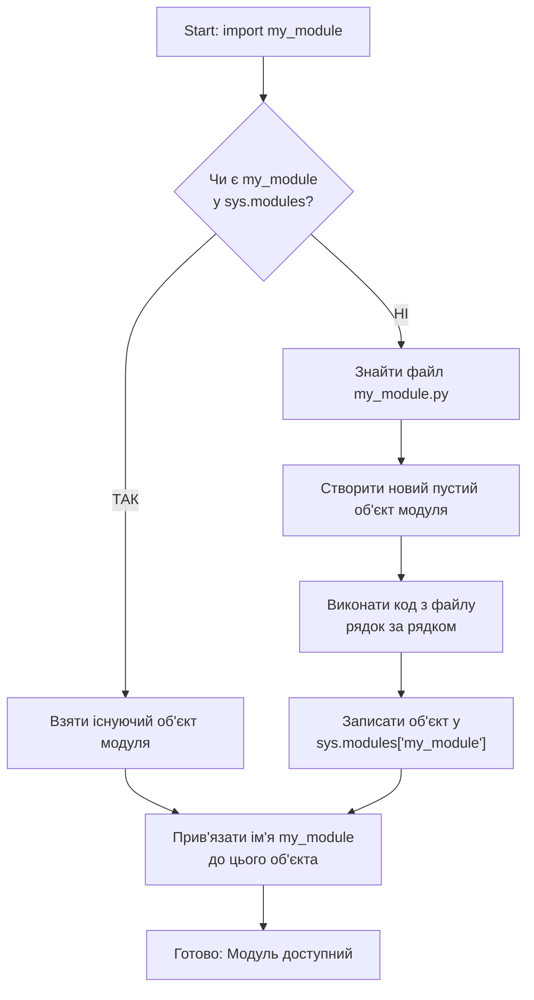

# 📦 Повний посібник з модулів, пакетів та віртуальних середовищ у Python

## Зміст

### Частина 1: Модулі

1.  [Навіщо розділяти код?](#навіщо-розділяти-код)
2.  [Що таке модуль?](#що-таке-модуль)
3.  [Створення власного модуля](#створення-власного-модуля)
4.  [Імпорт модулів: `import`](#імпорт-модулів-import)
5.  [Простір імен модуля](#простір-імен-модуля)
6.  [Імпорт конкретних об'єктів: `from...import`](#імпорт-конкретних-обєктів-from-import)
7.  [Небезпека `from...import *`](#небезпека-from-import)
8.  [Псевдоніми (aliasing): `as`](#псевдоніми-aliasing-as)
9.  [Як Python шукає модулі: `sys.path`](#як-python-шукає-модулі-syspath)
10. [Виконання коду модуля: `if __name__ == "__main__"`](#виконання-коду-модуля-if-name--main)

### Частина 1.5: Поглиблені аспекти модулів

11. [Кешування імпортів: `sys.modules`](#кешування-імпортів-sysmodules)
12. [Перезавантаження модулів: `importlib.reload`](#перезавантаження-модулів-importlibreload)
13. [Циклічні імпорти: як виникають і як їх уникати](#циклічні-імпорти-як-виникають-і-як-їх-уникати)
14. [Запуск модулів як скриптів: `python -m`](#запуск-модулів-як-скриптів-python--m)

### Частина 2: Стандартна бібліотека Python

15. [Що таке стандартна бібліотека?](#що-таке-стандартна-бібліотека)
16. [Огляд популярних модулів](#огляд-популярних-модулів)
17. [Модуль `math`: математичні функції](#модуль-math-математичні-функції)
18. [Модуль `random`: генерація випадкових чисел](#модуль-random-генерація-випадкових-чисел)
19. [Модуль `datetime`: робота з датами та часом](#модуль-datetime-робота-з-датами-та-часом)
20. [Модуль `os`: взаємодія з операційною системою](#модуль-os-взаємодія-з-операційною-системою)
21. [Модуль `sys`: параметри та функції системи](#модуль-sys-параметри-та-функції-системи)

### Частина 2.5: Поглиблений огляд стандартної бібліотеки

22. [Модуль `collections`: спеціалізовані контейнери](#модуль-collections-спеціалізовані-контейнери)
23. [`collections.namedtuple`: кортежі з іменованими полями](#collectionsnamedtuple-кортежі-з-іменованими-полями)
24. [`collections.defaultdict`: словник зі значенням за замовчуванням](#collectionsdefaultdict-словник-зі-значенням-за-замовчуванням)
25. [`collections.Counter`: лічильник елементів](#collectionscounter-лічильник-елементів)
26. [`collections.deque`: двостороння черга](#collectionsdeque-двостороння-черга)
27. [Модуль `os` поглиблено: `os.walk`](#модуль-os-поглиблено-oswalk)

### Частина 3: Пакети

28. [Від модулів до пакетів](#від-модулів-до-пакетів)
29. [Що таке пакет?](#що-таке-пакет)
30. [Створення простого пакета](#створення-простого-пакета)
31. [Файл `__init__.py`: ворота пакета](#файл-initpy-ворота-пакета)
32. [Імпорт з пакетів](#імпорт-з-пакетів)
33. [Абсолютний імпорт](#абсолютний-імпорт)
34. [Відносний імпорт](#відносний-імпорт)
35. [Проблема `Intra-package references`](#проблема-intra-package-references)
36. [Визначення публічного API: `__all__`](#визначення-публічного-api-all)

### Частина 4: Сторонні пакети та віртуальні середовища

37. [Що таке PyPI?](#що-таке-pypi)
38. [Менеджер пакетів `pip`](#менеджер-пакетів-pip)
39. [Встановлення пакетів: `pip install`](#встановлення-пакетів-pip-install)
40. [Перегляд встановлених пакетів: `pip list`, `pip freeze`](#перегляд-встановлених-пакетів-pip-list-pip-freeze)
41. [Видалення пакетів: `pip uninstall`](#видалення-пакетів-pip-uninstall)
42. [Проблема залежностей: "пекло залежностей"](#проблема-залежностей-пекло-залежностей)
43. [Віртуальні середовища: `venv`](#віртуальні-середовища-venv)
44. [Створення віртуального середовища](#створення-віртуального-середовища)
45. [Активація та деактивація середовища](#активація-та-деактивація-середовища)
46. [Робота у віртуальному середовищі](#робота-у-віртуальному-середовищі)
47. [Файл `requirements.txt`: заморожування залежностей](#файл-requirementstxt-заморожування-залежностей)
48. [Повний цикл роботи з проектом](#повний-цикл-роботи-з-проектом)

### Висновки та найкращі практики

49. [Підсумки](#підсумки)
50. [Найкращі практики](#найкращі-практики)

---

## Частина 1: Модулі

### Навіщо розділяти код?

Уявіть, що ви пишете велику програму — наприклад, веб-сайт або гру. Якщо весь код зберігати в одному файлі `main.py`, він дуже швидко перетвориться на гігантський, нечитабельний моноліт.

**Проблеми одного великого файлу:**

1.  **Низька читабельність:** Важко знайти потрібну функцію серед тисяч рядків коду.
2.  **Складність підтримки:** Зміна в одному місці може непередбачувано зламати щось в іншому.
3.  **Неможливість перевикористання:** Неможливо легко взяти частину коду (наприклад, функцію для роботи з користувачами) і використати її в іншому проекті.
4.  **Складна командна робота:** Декільком розробникам буде майже неможливо одночасно працювати над одним файлом.

**Рішення — розділяти код на логічні частини.**

**Аналогія:** Уявіть, що ви пишете книгу. Замість того, щоб писати все на одному гігантському сувої, ви ділите її на глави, розділи та параграфи. Кожна частина має свою мету і є відносно самостійною.

У Python такими "главами" є **модулі**.

---

### Що таке модуль?

**Модуль** — це просто файл з розширенням `.py`, що містить код Python.

**Простими словами:** Будь-який файл `.py`, який ви створюєте, автоматично є модулем.

**Що може містити модуль?**

- **Функції:** `def my_function(): ...`
- **Змінні:** `PI = 3.14159`
- **Класи:** `class MyClass: ...` (про це пізніше)
- Навіть просто виконуваний код (хоча це не завжди гарна ідея)

Модулі дозволяють логічно групувати пов'язаний код, роблячи його чистішим, організованішим та легшим для повторного використання.

**Приклад:**

- `utils.py`: модуль із загальними допоміжними функціями.
- `database.py`: модуль для роботи з базою даних.
- `config.py`: модуль для зберігання налаштувань.

---

### Створення власного модуля

Це надзвичайно просто. Створімо два файли в одній директорії:

**1. Файл `calculator.py` (це наш модуль):**

```python
# calculator.py

# Змінна, доступна для імпорту
PI = 3.1415926535

# Функція для додавання
def add(a, b):
    """Ця функція додає два числа."""
    print(f"Додаємо {a} та {b}")
    return a + b

# Функція для віднімання
def subtract(a, b):
    """Ця функція віднімає два числа."""
    print(f"Віднімаємо {a} та {b}")
    return a - b

# Функція для множення
def multiply(a, b):
    """Ця функція множить два числа."""
    return a * b

# Приватна функція (за домовленістю)
def _helper_function():
    """
    Ця функція не призначена для імпорту ззовні.
    Одинарне підкреслення на початку імені є сигналом для інших розробників.
    """
    print("Це внутрішня допоміжна функція.")

```

**2. Файл `main.py` (тут ми будемо використовувати наш модуль):**

```python
# main.py

# Код, що буде використовувати модуль calculator
print("Це головна програма.")
```

Ми щойно створили модуль `calculator`! Поки що він нічого не робить, але він готовий до використання.

---

### Імпорт модулів: `import`

Щоб використати функції та змінні з іншого модуля, його потрібно **імпортувати**. Для цього використовується ключове слово `import`.

**Давайте імпортуємо наш `calculator` у `main.py`:**

```python
# main.py

import calculator  # Імпортуємо модуль calculator.py

print("Зараз ми будемо використовувати калькулятор.")

# Викликаємо функції з модуля через крапку
result_add = calculator.add(10, 5)
result_sub = calculator.subtract(10, 5)

# Отримуємо доступ до змінної з модуля
pi_value = calculator.PI

print(f"Результат додавання: {result_add}")
print(f"Результат віднімання: {result_sub}")
print(f"Значення PI з модуля: {pi_value}")

# Спробуємо викликати "приватну" функцію
# Хоча технічно це можливо, так робити не варто!
# calculator._helper_function()
```

**Виконання `main.py` дасть результат:**

```
Зараз ми будемо використовувати калькулятор.
Додаємо 10 та 5
Віднімаємо 10 та 5
Результат додавання: 15
Результат віднімання: 5
Значення PI з модуля: 3.1415926535
```

### Простір імен модуля

Коли ви використовуєте `import module_name`, Python створює **простір імен** (namespace) для цього модуля. Це як окрема "коробка" з назвою модуля, в якій лежать усі його функції та змінні.

Щоб отримати доступ до чогось із цієї "коробки", ви повинні вказати її ім'я: `module_name.function_name`.

**Переваги такого підходу:**

- ✅ **Уникнення конфліктів імен.** У вашому `main.py` може бути своя функція `add`, і вона не буде конфліктувати з `calculator.add`.

**Приклад конфлікту, якого ми уникли:**

```python
# main.py
import calculator

def add(text1, text2):
    """Наша власна функція add, яка об'єднує текст."""
    return text1 + " " + text2

# Немає конфлікту!
my_text = add("Привіт", "Світ")
calc_sum = calculator.add(2, 2)

print(my_text)   # Привіт Світ
print(calc_sum)  # 4
```

- ✅ **Читабельність.** Завжди зрозуміло, звідки береться функція (`calculator.add` одразу каже, що це функція з модуля `calculator`).

---

### Імпорт конкретних об'єктів: `from...import`

Іноді писати `module_name` кожного разу незручно. Python дозволяє імпортувати конкретні функції або змінні безпосередньо у простір імен вашого файлу за допомогою конструкції `from ... import ...`.

**Оновимо `main.py`:**

```python
# main.py

# Імпортуємо тільки функцію add та змінну PI
from calculator import add, PI

print("Імпортували add та PI з калькулятора.")

# Тепер ми можемо викликати їх напряму!
result_add = add(100, 200)
print(f"Результат додавання: {result_add}")
print(f"Значення PI: {PI}")

# Але subtract не було імпортовано, тому цей код викличе помилку
# result_sub = subtract(10, 5)  # NameError: name 'subtract' is not defined
```

**Переваги `from...import`:**

- ✅ Коротший код (не треба писати `calculator.`).

**Недоліки та ризики:**

- ❌ **Ризик конфлікту імен.** Якщо у вас вже є функція `add`, вона буде перезаписана імпортованою.
- ❌ **Зниження читабельності.** Дивлячись на виклик `add()`, не одразу зрозуміло, чи це локальна функція, чи вона звідкись імпортована.

**Порівняння підходів:**

| Підхід                       | Приклад                              | Переваги                                | Недоліки                                                       |
| ---------------------------- | ------------------------------------ | --------------------------------------- | -------------------------------------------------------------- |
| **`import module`**          | `import math`<br>`math.sqrt(4)`      | ✅ Немає конфліктів імен<br>✅ Чіткість | 📝 Більше писати                                               |
| **`from module import obj`** | `from math import sqrt`<br>`sqrt(4)` | 📝 Менше писати                         | ⚠️ Ризик конфлікту імен<br>⚠️ Менша чіткість (звідки функція?) |

**Рекомендація:** Для невеликої кількості об'єктів або якщо імена довгі, `from...import` є прийнятним. Але `import module` — це більш безпечний та часто більш читабельний підхід, особливо для великих проектів.

---

### Небезпека `from...import *`

Існує ще один спосіб імпорту: `from module import *`. Він імпортує **всі** публічні імена з модуля у ваш поточний простір імен.

```python
# main.py
# ⚠️ ДУЖЕ ПОГАНА ПРАКТИКА! НІКОЛИ ТАК НЕ РОБІТЬ! ⚠️

from calculator import *

# Тепер всі імена з calculator доступні напряму
result = add(5, 5)
pi_val = PI
sub_res = subtract(10, 2)

print(result, pi_val, sub_res)
```

**Чому це так погано?**

1.  **Забруднення простору імен:** Ви не контролюєте, що саме імпортується. У ваш файл можуть потрапити десятки імен, про які ви навіть не здогадуєтесь.
2.  **Гарантовані конфлікти імен:** Якщо у вас є функція `add`, вона буде мовчки перезаписана. Ви можете навіть не помітити, що викликаєте не ту функцію.
3.  **Нечитабельність коду:** Неможливо зрозуміти, звідки взялася та чи інша функція, не перевіряючи вміст усіх модулів, що імпортуються через `*`.
4.  **Проблеми з інструментами аналізу коду:** Багато лінтерів та IDE не можуть коректно аналізувати такі імпорти.

**Висновок:** `from ... import *` — це зло. Уникайте його завжди, крім дуже рідкісних випадків (наприклад, у деяких фреймворках для зручності в інтерактивній консолі).

---

### Псевдоніми (aliasing): `as`

Що робити, якщо ім'я модуля занадто довге або конфліктує з іншим ім'ям? Ви можете дати йому короткий або унікальний псевдонім за допомогою ключового слова `as`.

**1. Псевдонім для модуля:**

```python
# main.py
import calculator as calc  # Даємо модулю короткий псевдонім 'calc'

# Тепер звертаємось через псевдонім
result = calc.add(7, 3)
print(f"Результат з calc.add: {result}")

# Старе ім'я 'calculator' вже недоступне
# calculator.add(1, 1) # NameError
```

**Це дуже поширена практика.** Наприклад, бібліотеку для побудови графіків `matplotlib.pyplot` прийнято імпортувати як `plt`, а бібліотеку для аналізу даних `pandas` — як `pd`.

**2. Псевдонім для функції або змінної:**

```python
# main.py
from calculator import subtract as minus
from calculator import PI as P

# Використовуємо псевдоніми
result = minus(20, 5)
print(f"Результат minus: {result}")
print(f"Значення P: {P}")
```

Це корисно для уникнення конфліктів імен, якщо ви імпортуєте функції з однаковими назвами з різних модулів.

---

### Як Python шукає модулі: `sys.path`

Коли ви пишете `import my_module`, звідки Python знає, де шукати файл `my_module.py`?

Він послідовно перевіряє список директорій, що зберігається у змінній `sys.path`.

**Порядок пошуку:**

1.  **Поточна директорія:** Директорія, з якої було запущено головний скрипт. (Ось чому `import calculator` працював у нашому прикладі).
2.  **Директорії зі змінної середовища `PYTHONPATH`:** Спеціальна змінна, куди можна вручну додати шляхи до ваших бібліотек.
3.  **Директорії стандартної бібліотеки:** Папки, де встановлено Python та його вбудовані модулі.
4.  **Сторонні бібліотеки:** Папки `site-packages`, куди `pip` встановлює пакети.

**Давайте подивимось на `sys.path`:**

```python
import sys

# sys.path - це звичайний список рядків
print(type(sys.path))

# Виведемо всі шляхи, де Python шукає модулі
for path in sys.path:
    print(path)
```

**Вивід буде приблизно таким (залежить від вашої системи):**

```
<class 'list'>
/Users/user/project/my_app  # 1. Поточна директорія
/usr/local/lib/python3.9     # 3. Стандартна бібліотека
/usr/local/lib/python3.9/lib-dynload
/usr/local/lib/python3.9/site-packages # 4. Сторонні бібліотеки
...
```

Якщо Python не знаходить модуль у жодній з цих директорій, він видає помилку `ModuleNotFoundError`.

**Динамічна зміна `sys.path` (не рекомендується, але можливо):**

```python
import sys

# Додаємо новий шлях для пошуку модулів
# Це погана практика, краще правильно структурувати проект
sys.path.append('/path/to/my/other/modules')

import other_module
```

---

### Виконання коду модуля: `if __name__ == "__main__"`

Що станеться, якщо у файлі `calculator.py` буде не тільки визначення функцій, а й код, що їх викликає?

**Оновимо `calculator.py`:**

```python
# calculator.py
PI = 3.14159

def add(a, b):
    return a + b

def subtract(a, b):
    return a - b

# Додамо цей код в кінець файлу
print("Я модуль calculator і мене завантажують!")
test_result = add(5, 5)
print(f"Тестовий запуск функції add: {test_result}")
```

**Тепер запустимо `main.py`, який просто імпортує `calculator`:**

```python
# main.py
print("Початок головної програми.")
import calculator
print("Кінець головної програми.")
```

**Вивід буде неочікуваним:**

```
Початок головної програми.
Я модуль calculator і мене завантажують!  <-- Код з calculator.py виконавсь!
Тестовий запуск функції add: 10
Кінець головної програми.
```

Код всередині модуля `calculator.py` виконавсь у момент його імпорту в `main.py`. Це не те, чого ми хочемо. Ми хочемо, щоб модуль надавав функції, а не виконував щось сам по собі при імпорті.

**Як це виправити?**

Python надає спеціальну змінну `__name__`. Її значення залежить від того, як запускається файл:

- Якщо файл запускається **напряму** (напр., `python calculator.py`), то `__name__` дорівнює рядку `"__main__"`.
- Якщо файл **імпортується** в інший модуль, то `__name__` дорівнює **назві файлу (модуля)** (напр., `"calculator"`).

Це дозволяє нам створити блок коду, який буде виконуватись **тільки при прямому запуску файлу**.

**Правильна версія `calculator.py`:**

```python
# calculator.py
PI = 3.14159

def add(a, b):
    return a + b

def subtract(a, b):
    return a - b

# Цей блок коду виконається тільки, якщо запустити `python calculator.py`
if __name__ == "__main__":
    # Це ідеальне місце для тестів, прикладів використання або
    # для того, щоб зробити модуль самостійною програмою.
    print("Файл calculator.py запущено напряму!")

    # Проведемо тестування наших функцій
    assert add(2, 3) == 5
    assert subtract(10, 5) == 5
    print("Тести успішно пройдено!")
```

**Тепер давайте перевіримо обидва сценарії:**

**1. Запускаємо `main.py` (який імпортує `calculator`):**

```python
# main.py
print("Початок головної програми.")
import calculator
print(f"В main.py __name__ з модуля calculator: {calculator.__name__}")
result = calculator.add(10, 20)
print(f"Результат в main: {result}")
print("Кінець головної програми.")
```

**Вивід:**

```
Початок головної програми.
В main.py __name__ з модуля calculator: calculator
Результат в main: 30
Кінець головної програми.
```

✅ Код всередині `if` не виконавсь! Все правильно.

**2. Запускаємо `calculator.py` напряму:**

```bash
python calculator.py
```

**Вивід:**

```
Файл calculator.py запущено напряму!
Тести успішно пройдено!
```

✅ Код всередині `if` виконавсь!

**Висновок:** Конструкція `if __name__ == "__main__"` є стандартним та обов'язковим елементом для будь-якого модуля, що може бути запущений як самостійний скрипт. Вона робить ваш код багаторазовим та передбачуваним.

---

## Частина 1.5: Поглиблені аспекти модулів

Тепер, коли ми знаємо основи, зануримось у більш тонкі, але важливі механізми роботи модулів.

---

### Кешування імпортів: `sys.modules`

Ви могли помітити, що повідомлення `print("Я модуль calculator і мене завантажують!")` з нашого першого експерименту з'являлось лише **один раз**, навіть якщо ми імпортували модуль декілька разів.

```python
# main.py
print("Перший імпорт:")
import calculator

print("\nДругий імпорт:")
import calculator  # <-- Чому код модуля не виконується знову?

print("\nТретій імпорт:")
import calculator

print("Готово.")
```

**Вивід (якщо в calculator.py є print):**

```
Перший імпорт:
Я модуль calculator і мене завантажують!

Другий імпорт:

Третій імпорт:
Готово.
```

Це відбувається тому, що Python **кешує** модулі після першого імпорту.

**Як це працює?**
Існує спеціальний словник `sys.modules`. Коли ви робите `import my_module`, Python:

1.  Перевіряє, чи є ключ `"my_module"` у `sys.modules`.
2.  **Якщо так:** він просто бере готовий об'єкт модуля з цього словника. Код файлу модуля **не виконується** повторно.
3.  **Якщо ні:** він знаходить файл `my_module.py`, створює новий об'єкт модуля, виконує код з файлу, щоб наповнити цей об'єкт, і **зберігає цей об'єкт у `sys.modules`** під ключем `"my_module"`.



**Давайте подивимось на `sys.modules`:**

```python
import sys
import calculator

print("Чи є 'calculator' у кеші модулів?")
if 'calculator' in sys.modules:
    print("✅ Так, модуль 'calculator' знайдено у sys.modules.")

# Ми можемо навіть отримати об'єкт модуля напряму з кешу
cached_calculator = sys.modules['calculator']

# Це той самий об'єкт, що ми отримали через import
print(f"Об'єкт з import та з кешу однакові? {calculator is cached_calculator}")

# І ми можемо викликати його функції
print(f"Виклик з кешованого об'єкта: {cached_calculator.add(1, 1)}")
```

**Навіщо потрібне кешування?**

1.  **Продуктивність:** Повторний імпорт майже миттєвий. Це критично важливо у великих проектах, де один і той самий модуль (напр., `os` або `datetime`) може імпортуватися у десятках різних файлів.
2.  **Синхронізація стану (Singleton-подібна поведінка):** Оскільки всі частини програми отримують посилання на **один і той самий** об'єкт модуля, будь-які зміни в цьому модулі (наприклад, зміна значення глобальної змінної) будуть видимі всюди.

**Приклад зі спільним станом:**
Створімо модуль `state.py`:

```python
# state.py
print("Модуль state завантажується...")
counter = 0
```

Тепер два інших модулі будуть його використовувати:

```python
# changer.py
import state

def increment():
    state.counter += 1
    print(f"Changer: лічильник = {state.counter}")

# reader.py
import state

def read():
    print(f"Reader: лічильник = {state.counter}")

# main.py
import changer
import reader

reader.read()    # Виведе 0
changer.increment()
changer.increment()
reader.read()    # Виведе 2! Reader бачить зміни, зроблені Changer'ом.
```

Це потужний механізм, але він вимагає обережності при роботі зі змінними на рівні модуля.

---

### Перезавантаження модулів: `importlib.reload`

Що робити, якщо ви змінили код у файлі модуля, але ваша основна програма все ще працює? Завдяки кешуванню, звичайний `import` не оновить код.

Це особливо актуально при інтерактивній розробці, наприклад, у Jupyter Notebook або в консолі Python.

Для цього існує функція `reload()` з модуля `importlib`.

**Сценарій:**

1.  Запустіть інтерактивну консоль Python (`python`).
2.  Створіть файл `my_config.py`:
    ```python
    # my_config.py
    MESSAGE = "Привіт, Світ!"
    ```
3.  В консолі виконайте:
    ```python
    >>> import my_config
    >>> print(my_config.MESSAGE)
    Привіт, Світ!
    ```
4.  **Не закриваючи консоль**, змініть файл `my_config.py`:
    ```python
    # my_config.py
    MESSAGE = "Привіт, Python!"
    ```
5.  Поверніться в консоль і спробуйте імпортувати знову:
    ```python
    >>> import my_config # Нічого не дасть, модуль вже в кеші
    >>> print(my_config.MESSAGE)
    Привіт, Світ! # ❌ Зміни не підтягнулись!
    ```
6.  **А тепер використаємо `reload`:**
    ```python
    >>> import importlib
    >>> importlib.reload(my_config)
    <module 'my_config' from '/path/to/my_config.py'>
    >>> print(my_config.MESSAGE)
    Привіт, Python! # ✅ Ось тепер зміни застосувались!
    ```

**Як працює `reload()`?**

1.  Він **не видаляє** старий об'єкт модуля з `sys.modules`.
2.  Він **повторно виконує код** з файлу модуля, але наповнює **той самий, вже існуючий** об'єкт модуля новими/зміненими атрибутами.

**Важливі обмеження `reload()`:**

- Він не оновить посилання на старі об'єкти. Якщо ви зробили `from my_config import MESSAGE`, `reload` не оновить вашу локальну змінну `MESSAGE`. Тому краще використовувати `import my_config` і `my_config.MESSAGE`.
- Це інструмент для **розробки та відладки**, а не для використання у фінальному коді програми.

---

### Циклічні імпорти: як виникають і як їх уникати

Циклічний імпорт — це поширена помилка, яка виникає, коли два або більше модулів намагаються імпортувати один одного.

**Сценарій:**

- `module_a.py` імпортує `module_b.py`.
- `module_b.py` імпортує `module_a.py`.

**Давайте створимо таку ситуацію:**

**Файл `a.py`:**

```python
# a.py
print("Завантажується модуль A...")
import b # <-- Намагаємось імпортувати B

def func_a():
    print("Це функція з модуля A")
    b.func_b()

print("Модуль A завантажено.")
```

**Файл `b.py`:**

```python
# b.py
print("Завантажується модуль B...")
import a # <-- Намагаємось імпортувати A

def func_b():
    print("Це функція з модуля B")

print("Модуль B завантажено.")
```

Тепер спробуємо запустити `a.py`: `python a.py`

**Що відбувається "під капотом":**

1.  Python починає виконувати `a.py`.
2.  Він виводить `Завантажується модуль A...`.
3.  Він бачить `import b` і призупиняє `a.py`, щоб завантажити `b.py`.
4.  Він починає виконувати `b.py`.
5.  Він виводить `Завантажується модуль B...`.
6.  Він бачить `import a`. Python розумний і бачить, що модуль `a` вже є в процесі завантаження. Щоб не впасти у нескінченну рекурсію, він **не починає завантажувати `a.py` знову**. Натомість він кладе у `sys.modules` **недозавантажений** об'єкт модуля `a`.
7.  `b.py` продовжує виконуватись, успішно завершується і виводить `Модуль B завантажено.`.
8.  Виконання повертається до `a.py` на рядок `import b`. Імпорт успішно завершено.
9.  `a.py` продовжує виконуватись, виводить `Модуль A завантажено.`.

На цьому етапі все виглядає добре. Але проблема виникає, коли ми спробуємо використати функції.

**Запустимо `main.py`:**

```python
# main.py
import a

a.func_a()
```

**Результат:** `AttributeError: partially initialized module 'b' has no attribute 'func_b' (most likely due to a circular import)`

**Чому так сталося?**
Коли `a.py` намагався викликати `b.func_b()`, модуль `b` ще не був повністю завантажений на той момент, коли `a` його потребував.

**Як уникати циклічних імпортів?**

1.  **Рефакторинг (найкращий спосіб):**
    - Найчастіше циклічний імпорт — це ознака поганої архітектури. Можливо, функції, які потрібні обом модулям, варто винести у третій, незалежний модуль.

    **Правильна структура:**

    ```
    - shared_utils.py (містить спільні функції)
    - module_a.py (import shared_utils)
    - module_b.py (import shared_utils, import module_a)
    ```

2.  **Локальний імпорт (якщо рефакторинг неможливий):**
    - Імпортуйте модуль всередині функції, а не на рівні модуля. Це відкладає імпорт до моменту виклику функції, коли всі модулі вже точно будуть завантажені.

    **Виправимо `a.py`:**

    ```python
    # a.py
    print("Завантажується модуль A...")
    # import b <-- Забираємо звідси

    def func_a():
        import b # <-- Імпортуємо тут!
        print("Це функція з модуля A")
        b.func_b()

    print("Модуль A завантажено.")
    ```

    Тепер `import b` відбудеться тільки при виклику `func_a()`, коли всі модулі вже гарантовано завантажені. Це рішення працює, але є "милицею", яка приховує проблеми з архітектурою.

---

### Запуск модулів як скриптів: `python -m`

Ми вже бачили, як запускати скрипт: `python my_script.py`.
Але є інший спосіб: `python -m my_module`.

Прапорець `-m` каже Python шукати модуль (`my_module`) у `sys.path` і запустити його як головний скрипт.

**У чому різниця?**

Коли ви робите `python path/to/script.py`, Python додає директорію `path/to/` до `sys.path`.
Коли ви робите `python -m package.module` з кореня проекту, Python додає **кореневу директорію проекту** до `sys.path`.

Це критично важливо для правильної роботи імпортів всередині пакетів, як ми вже бачили у розділі "Проблема `Intra-package references`".

**Приклад: створення інструменту командного рядка.**
Давайте зробимо наш `calculator.py` простим калькулятором командного рядка.

**Оновимо `calculator.py`:**

```python
# calculator.py
import sys

PI = 3.14159

def add(a, b):
    return a + b

def subtract(a, b):
    return a - b

def main():
    """Функція, що обробляє логіку командного рядка."""
    # sys.argv -> ['calculator.py', 'add', '5', '10']
    if len(sys.argv) != 4:
        print("Використання: python calculator.py [add|subtract] <число1> <число2>")
        sys.exit(1) # Вихід з помилкою

    operation = sys.argv[1]
    try:
        num1 = float(sys.argv[2])
        num2 = float(sys.argv[3])
    except ValueError:
        print("Помилка: числа повинні бути валідними.")
        sys.exit(1)

    if operation == 'add':
        result = add(num1, num2)
        print(f"Результат: {result}")
    elif operation == 'subtract':
        result = subtract(num1, num2)
        print(f"Результат: {result}")
    else:
        print(f"Невідома операція: {operation}")
        sys.exit(1)


if __name__ == "__main__":
    main()
```

Тепер наш модуль можна використовувати двома способами:

1.  **Як бібліотеку:** `import calculator` в іншому файлі.
2.  **Як самостійний інструмент:**

    ```bash
    $ python calculator.py add 10 25.5
    Результат: 35.5

    $ python calculator.py subtract 100 42
    Результат: 58.0

    $ python calculator.py multiply 2 3
    Невідома операція: multiply
    ```

---

## Частина 2: Стандартна бібліотека Python

### Що таке стандартна бібліотека?

Філософія Python — "batteries included" ("батарейки у комплекті"). Це означає, що разом з Python ви отримуєте величезний набір готових до використання модулів для вирішення найрізноманітніших завдань. Цей набір і називається **стандартною бібліотекою**.

Вам не потрібно нічого додатково встановлювати, щоб працювати з математикою, файлами, мережею, датами та часом, архівами тощо. Все це вже є "в коробці".

**Переваги:**

- ✅ **Надійність:** Модулі ретельно протестовані та підтримуються розробниками Python.
- ✅ **Доступність:** Не треба нічого встановлювати.
- ✅ **Портативність:** Код, що використовує стандартну бібліотеку, буде працювати на будь-якій системі, де встановлено Python.

### Огляд популярних модулів

Ось лише декілька модулів, які ви будете використовувати постійно:

| Модуль        | Опис                                                  |
| ------------- | ----------------------------------------------------- |
| `math`        | Математичні функції та константи.                     |
| `random`      | Генерація випадкових чисел та вибірок.                |
| `datetime`    | Робота з датами, часом та їхньою арифметикою.         |
| `os`          | Взаємодія з операційною системою (файли, директорії). |
| `sys`         | Доступ до системних параметрів Python.                |
| `json`        | Робота з форматом даних JSON.                         |
| `csv`         | Робота з файлами CSV.                                 |
| `collections` | Додаткові структури даних (лічильники, черги).        |
| `re`          | Робота з регулярними виразами.                        |
| `subprocess`  | Запуск зовнішніх процесів.                            |

Давайте детальніше розглянемо декілька з них.

---

### Модуль `math`: математичні функції

Цей модуль надає доступ до математичних функцій, визначених стандартом C.

```python
import math

# --- Константи ---
print(f"Число Пі (pi): {math.pi}")   # 3.14159...
print(f"Число Ейлера (e): {math.e}") # 2.71828...
print(f"Нескінченність (inf): {math.inf}")
print(f"Не-число (nan): {math.nan}")

# --- Округлення ---
x = 4.7
y = 4.2
print(f"Округлення {x} вгору (ceil): {math.ceil(x)}")     # 5
print(f"Округлення {y} вниз (floor): {math.floor(y)}")   # 4
print(f"Відкидання дробової частини (trunc): {math.trunc(x)}") # 4

# --- Степінь та корінь ---
print(f"Квадратний корінь з 16 (sqrt): {math.sqrt(16)}")  # 4.0
print(f"2 у степені 10 (pow): {math.pow(2, 10)}")      # 1024.0
print(f"2 у степені 10 (оператор **): {2 ** 10}")       # 1024 (повертає int, якщо можливо)

# --- Логарифми ---
print(f"Натуральний логарифм від 10: {math.log(10)}")
print(f"Логарифм від 1024 за основою 2: {math.log2(1024)}") # 10.0
print(f"Десятковий логарифм від 1000: {math.log10(1000)}")# 3.0

# --- Тригонометрія (радіани!) ---
# Переведемо 90 градусів у радіани
angle_rad = math.radians(90)
print(f"Синус 90 градусів: {math.sin(angle_rad)}") # 1.0
print(f"Косинус 90 градусів: {math.cos(angle_rad)}")# Дуже близьке до 0

# --- Інші корисні функції ---
print(f"Факторіал 5 (factorial): {math.factorial(5)}") # 1*2*3*4*5 = 120
print(f"Найбільший спільний дільник 48 і 64 (gcd): {math.gcd(48, 64)}") # 16
```

---

### Модуль `random`: генерація випадкових чисел

Цей модуль використовується для генерації псевдовипадкових чисел.

```python
import random

# --- Генерація випадкових чисел ---
# Випадкове число з плаваючою комою від 0.0 до 1.0
print(f"Випадкове число [0.0, 1.0): {random.random()}")

# Випадкове ціле число в діапазоні [1, 10] (включно)
print(f"Випадкове ціле [1, 10]: {random.randint(1, 10)}")

# Випадкове число з плаваючою комою в діапазоні [10.5, 20.5]
print(f"Випадкове дійсне [10.5, 20.5]: {random.uniform(10.5, 20.5)}")

# Випадкове число з послідовності з певним кроком
# (10, 12, 14, ..., 30)
print(f"Випадкове парне [10, 30]: {random.randrange(10, 31, 2)}")

# --- Робота з послідовностями ---
my_list = ['яблуко', 'банан', 'вишня', 'апельсин', 'ківі']
print(f"\nОригінальний список: {my_list}")

# Вибрати один випадковий елемент
choice = random.choice(my_list)
print(f"Випадковий вибір (choice): {choice}")

# Вибрати 3 унікальних випадкових елементи
sample = random.sample(my_list, 3)
print(f"Випадкова вибірка з 3-х (sample): {sample}")

# Перемішати список (змінює оригінальний список!)
random.shuffle(my_list)
print(f"Перемішаний список (shuffle): {my_list}")

# --- Відтворюваність ---
# Іноді потрібно, щоб "випадкові" послідовності були однаковими
# при кожному запуску (напр. для тестування). Для цього є seed.

random.seed(42) # Задаємо початкове значення
print(f"\nЗ seed=42, перше число: {random.randint(1, 100)}") # Завжди буде 82
print(f"З seed=42, друге число: {random.randint(1, 100)}")  # Завжди буде 15

random.seed(42) # Скидаємо seed
print(f"Знову seed=42, перше число: {random.randint(1, 100)}") # Знову 82!
```

---

### Модуль `datetime`: робота з датами та часом

Один з найкорисніших модулів для будь-яких прикладних завдань.

```python
import datetime
import time

# --- Поточна дата та час ---
now = datetime.datetime.now()
today = datetime.date.today()
utc_now = datetime.datetime.utcnow()

print(f"Поточний момент (now): {now}")
print(f"Сьогоднішня дата (today): {today}")
print(f"Поточний момент по UTC (utcnow): {utc_now}")

# --- Створення об'єктів дати та часу ---
# Створюємо конкретну дату
d = datetime.date(2025, 12, 31)
print(f"\nСтворена дата: {d}")

# Створюємо конкретний час
t = datetime.time(23, 59, 59)
print(f"Створений час: {t}")

# Створюємо повну дату з часом
dt = datetime.datetime(2025, 12, 31, 23, 59, 59)
print(f"Створена дата і час: {dt}")

# --- Компоненти об'єкта datetime ---
print(f"\nРік: {now.year}")
print(f"Місяць: {now.month}")
print(f"День: {now.day}")
print(f"Година: {now.hour}")
print(f"Хвилина: {now.minute}")
print(f"Секунда: {now.second}")
print(f"Мікросекунда: {now.microsecond}")
print(f"День тижня (0=Пн): {now.weekday()}")
print(f"День тижня (1=Пн): {now.isoweekday()}")

# --- Арифметика дат: timedelta ---
# timedelta представляє різницю в часі
delta = datetime.timedelta(days=7, hours=5, minutes=30)
print(f"\nРізниця в часі (timedelta): {delta}")

# Додавання та віднімання
tomorrow = today + datetime.timedelta(days=1)
print(f"Завтра: {tomorrow}")

ten_days_ago = now - datetime.timedelta(days=10)
print(f"10 днів тому: {ten_days_ago}")

# Різниця між двома датами
date1 = datetime.date(2025, 1, 1)
date2 = datetime.date(2026, 1, 1)
difference = date2 - date1
print(f"Різниця між датами: {difference.days} днів")


# --- Форматування: з об'єкта в рядок (strftime) ---
# %Y - рік (4 цифри), %m - місяць, %d - день
# %H - година (24), %M - хвилина, %S - секунда
print(f"\nФорматування в рядок (strftime):")
formatted_string = now.strftime("%A, %d %B %Y, %H:%M:%S")
print(formatted_string) # Напр. Friday, 16 May 2025, 14:30:59

# --- Парсинг: з рядка в об'єкт (strptime) ---
date_string = "2025-07-21 10:00:00"
parsed_datetime = datetime.datetime.strptime(date_string, "%Y-%m-%d %H:%M:%S")
print(f"Парсинг з рядка (strptime): {parsed_datetime}")
print(f"Рік з розпарсеної дати: {parsed_datetime.year}")

# --- Робота з Unix timestamp ---
# Timestamp - кількість секунд, що пройшли з 01.01.1970
ts = time.time()
print(f"\nПоточний timestamp: {ts}")

# Конвертація timestamp в datetime
dt_from_ts = datetime.datetime.fromtimestamp(ts)
print(f"Datetime з timestamp: {dt_from_ts}")

# Конвертація datetime в timestamp
ts_from_dt = now.timestamp()
print(f"Timestamp з datetime: {ts_from_dt}")
```

---

### Модуль `os`: взаємодія з операційною системою

Дуже потужний модуль для роботи з файловою системою та іншими функціями ОС.

```python
import os

# --- Поточна робоча директорія ---
cwd = os.getcwd()
print(f"Поточна директорія (getcwd): {cwd}")

# --- Список файлів та директорій ---
try:
    items = os.listdir('.') # '.' означає поточну директорію
    print(f"\nВміст поточної директорії (listdir):")
    for item in items:
        print(f"- {item}")
except FileNotFoundError:
    print("Директорію не знайдено.")

# --- Створення директорій ---
# Створити одну директорію
try:
    os.mkdir("test_folder")
    print("\nСтворено директорію 'test_folder'")
except FileExistsError:
    print("\nДиректорія 'test_folder' вже існує.")

# Створити дерево директорій (напр. a/b/c)
os.makedirs("a/b/c", exist_ok=True) # exist_ok=True не видасть помилку, якщо вони існують
print("Створено директорії 'a/b/c'")


# --- Робота зі шляхами (os.path) ---
# Важливо! os.path.join робить код крос-платформним (працює на Win/Mac/Linux)
file_path = os.path.join('a', 'b', 'c', 'file.txt')
print(f"\nСконструйований шлях (join): {file_path}")

# Перевірка існування
print(f"Чи існує шлях '{file_path}'? {os.path.exists(file_path)}")

# Розділення шляху
directory, filename = os.path.split(file_path)
print(f"Директорія: {directory}")
print(f"Ім'я файлу: {filename}")


# --- Видалення файлів та директорій ---
# Створимо тимчасовий файл для видалення
with open("temp.txt", "w") as f:
    f.write("test")

# Видалення файлу
if os.path.exists("temp.txt"):
    os.remove("temp.txt")
    print("\nФайл 'temp.txt' видалено.")

# Видалення пустої директорії
if os.path.exists("test_folder"):
    os.rmdir("test_folder")
    print("Директорію 'test_folder' видалено.")

# Для видалення непустих директорій потрібен модуль shutil
# import shutil; shutil.rmtree('a')


# --- Змінні середовища ---
# Отримати значення змінної середовища PATH
path_var = os.getenv("PATH")
print(f"\nЗмінна середовища PATH (перші 50 символів): {path_var[:50]}...")

# --- Запуск системних команд ---
# ⚠️ Це може бути небезпечно!
# Краще використовувати модуль subprocess для складних завдань.
# На Windows виконає 'dir', на Linux/Mac - 'ls -l'
if os.name == 'nt': # Windows
    os.system('dir')
else: # Linux/Mac
    os.system('ls -l')
```

_Примітка: для сучасної роботи зі шляхами часто рекомендують використовувати модуль `pathlib`, який надає об'єктно-орієнтований інтерфейс._

---

### Модуль `sys`: параметри та функції системи

Модуль `sys` надає доступ до параметрів та функцій, що специфічні для інтерпретатора Python.

```python
import sys

# --- Аргументи командного рядка ---
# Якщо запустити: python my_script.py arg1 100
# sys.argv буде: ['my_script.py', 'arg1', '100']
print(f"Аргументи командного рядка (sys.argv): {sys.argv}")

# --- Шляхи пошуку модулів ---
# Ми вже розглядали це раніше
print("\nШляхи пошуку модулів (sys.path):")
for p in sys.path[:3]: # покажемо перші 3
    print(f"- {p}")

# --- Інформація про версію Python ---
print(f"Версія Python (sys.version): {sys.version}")

# --- Платформа ---
print(f"Платформа (sys.platform): {sys.platform}") # напр. 'linux', 'win32', 'darwin'

# --- Завершення роботи програми ---
# sys.exit() припиняє виконання програми.
# Можна передати код виходу (0 = успіх, >0 = помилка)
print("\nЗараз програма завершить роботу з кодом 0.")
# sys.exit(0) # Розкоментуйте, щоб перевірити
print("Цей рядок ніколи не виконається, якщо sys.exit() викликано.")
```

---

## Частина 3: Пакети

### Від модулів до пакетів

Коли ваш проект росте, навіть розділення коду на модулі стає недостатнім. У вас можуть з'явитись десятки модулів: `users.py`, `products.py`, `orders.py`, `database.py`, `utils.py`, `api_client.py`... Зберігати їх усі в одній директорії — це знову безлад.

**Аналогія:** Якщо модулі — це глави книги, то **пакети** — це томи або частини цієї книги. "Том 1: Робота з користувачами", "Том 2: Управління товарами".

Пакети дозволяють створити ієрархічну структуру модулів.

---

### Що таке пакет?

**Пакет** (package) — це директорія, яка містить спеціальний файл `__init__.py` та інші модулі або під-пакети.

**Простими словами:** Це папка з файлами `.py`, яка поводиться як один великий модуль.

**Структура простого пакета:**

```
my_project/
├── main.py
└── my_package/
    ├── __init__.py  <-- Обов'язковий файл, що робить директорію пакетом
    ├── module1.py
    └── module2.py
```

- `my_package` — це пакет.
- `module1.py` та `module2.py` — це модулі всередині пакета.

---

### Створення простого пакета

Давайте створимо більш складну структуру для нашого проекту.

**Структура директорій:**

```
e_shop/
├── main.py
└── shop/
    ├── __init__.py
    ├── products.py
    └── customers.py
```

**Файл `shop/__init__.py`:**
Може бути порожнім. Його наявність — це сигнал для Python, що `shop` є пакетом.

```python
# shop/__init__.py
print("Пакет 'shop' ініціалізовано!")
```

**Файл `shop/products.py`:**

```python
# shop/products.py

def get_product(product_id):
    """Повернути інформацію про товар."""
    return f"Інформація про товар з ID: {product_id}"

def list_products():
    """Повернути список всіх товарів."""
    return ["Ноутбук", "Миша", "Клавіатура"]
```

**Файл `shop/customers.py`:**

```python
# shop/customers.py

def get_customer_info(customer_id):
    """Повернути інформацію про клієнта."""
    return f"Інформація про клієнта: {customer_id}"
```

**Файл `main.py`:**
Тут ми будемо використовувати наш пакет `shop`.

```python
# main.py
# Поки що порожній
```

---

### Файл `__init__.py`: ворота пакета

Файл `__init__.py` виконується автоматично, коли пакет або один з його модулів імпортується вперше.

**Його основні ролі:**

1.  **Позначити директорію як пакет.** (Найголовніша роль).
2.  **Виконати ініціалізаційний код.** Наприклад, підключитися до бази даних, завантажити конфігурацію.
3.  **Створити "фасад" для пакета.** Можна імпортувати найважливіші функції з внутрішніх модулів, щоб зробити їх доступними на рівні пакета.

**Приклад "фасаду" у `shop/__init__.py`:**

```python
# shop/__init__.py

print("Пакет 'shop' ініціалізовано!")

# Імпортуємо ключові функції, щоб їх можна було викликати як shop.list_products()
from .products import list_products, get_product
from .customers import get_customer_info

# Визначаємо, що буде імпортовано через 'from shop import *'
__all__ = ['list_products', 'get_product', 'get_customer_info']
```

Тепер `__init__.py` не просто порожній, він активно керує тим, як виглядає наш пакет ззовні.

---

### Імпорт з пакетів

Імпорт з пакетів дуже схожий на імпорт з модулів, але використовує "крапкову нотацію" для доступу до під-модулів.

**Оновимо `main.py`:**

```python
# main.py

# Спосіб 1: Імпортувати весь модуль з пакета
import shop.products

print("--- Спосіб 1 ---")
all_products = shop.products.list_products()
print(f"Всі товари: {all_products}")


# Спосіб 2: Імпортувати конкретну функцію
from shop.customers import get_customer_info

print("\n--- Спосіб 2 ---")
customer = get_customer_info("CUST-007")
print(customer)


# Спосіб 3: Використання "фасаду" з __init__.py
import shop

print("\n--- Спосіб 3 (через __init__.py) ---")
# Тепер ці функції доступні напряму з 'shop'
products_via_facade = shop.list_products()
customer_via_facade = shop.get_customer_info("CUST-008")
print(f"Товари з фасаду: {products_via_facade}")
print(customer_via_facade)
```

**Вивід:**

```
Пакет 'shop' ініціалізовано!
--- Спосіб 1 ---
Всі товари: ['Ноутбук', 'Миша', 'Клавіатура']

--- Спосіб 2 ---
Інформація про клієнта: CUST-007

--- Спосіб 3 (через __init__.py) ---
Товари з фасаду: ['Ноутбук', 'Миша', 'Клавіатура']
Інформація про клієнта: CUST-008
```

---

### Абсолютний імпорт

**Абсолютний імпорт** — це імпорт, що вказує повний шлях від кореневої директорії проекту.

`from shop.products import list_products` — це абсолютний імпорт. Він завжди починається з імені пакета верхнього рівня.

- ✅ **Переваги:** Завжди зрозуміло і однозначно. Якщо ви перемістите файл, що містить цей імпорт, він не зламається.
- ❌ **Недоліки:** Може бути довгим, якщо структура глибока (`from my_app.core.utils.helpers import format_date`).

**Абсолютний імпорт є рекомендованим способом у більшості випадків.**

---

### Відносний імпорт

**Відносний імпорт** — це імпорт відносно поточного модуля. Він використовує крапки для позначення рівнів.

- `.` — поточна директорія (той самий пакет).
- `..` — батьківська директорія (пакет на рівень вище).

**Приклад:** Уявімо, що у `shop/products.py` нам потрібна функція з `shop/customers.py`.

```python
# shop/products.py

# відносний імпорт: з поточної директорії (.) імпортувати модуль customers
from . import customers

def get_product_with_customer_info(product_id, customer_id):
    product = f"Інформація про товар з ID: {product_id}"
    customer = customers.get_customer_info(customer_id)
    return f"{product}\n{customer}"
```

**Переваги:**

- ✅ Коротший.
- ✅ Дозволяє легко перейменовувати пакет верхнього рівня (наприклад, `shop` на `store`), і внутрішні імпорти не зламаються.

**Недоліки:**

- ❌ Працює тільки всередині пакета. Не можна використовувати у головному скрипті.
- ❌ Може бути менш зрозумілим, особливо з `..` або `...`.

**Рекомендація:** Використовуйте відносні імпорти для зв'язків **всередині** вашого власного пакета. Використовуйте абсолютні імпорти для всього іншого.

---

### Проблема `Intra-package references`

Якщо ви спробуєте запустити файл, що використовує відносний імпорт, напряму, ви отримаєте помилку: `ImportError: attempted relative import with no known parent package`.

```bash
# Ми знаходимось в директорії e_shop/
python shop/products.py # ❌ ПОМИЛКА!
```

Python не знає, що `shop` є пакетом, коли ви запускаєте файл зсередини нього.

**Правильний спосіб запуску модуля з пакета:**

Використовуйте прапорець `-m` з кореня проекту. Це каже Python запустити модуль як частину пакета.

```bash
# Ми знаходимось в директорії e_shop/
python -m shop.products # ✅ ПРАВИЛЬНО
```

Таким чином Python розуміє всю структуру пакета, і відносні імпорти працюють.

---

### Визначення публічного API: `__all__`

Ми вже бачили `from ... import *` і знаємо, що це погано. Але поведінкою "зірочки" можна керувати.

У файлі `__init__.py` (або в будь-якому модулі) можна визначити спеціальний список `__all__`, який перераховує імена, що будуть імпортовані при `from ... import *`.

**У `shop/__init__.py`:**

```python
# shop/__init__.py
from .products import list_products, get_product
from .customers import get_customer_info

# Визначаємо, що буде експортовано через 'from shop import *'
__all__ = ['list_products', 'get_product', 'get_customer_info']
```

**У `main.py`:**

```python
from shop import *

# Цей код тепер працює, бо імена є в __all__
products = list_products()
print(products)
```

Хоча `from ... import *` все ще не рекомендується для робочого коду, `__all__` є корисним інструментом для:

1.  **Документації:** Він чітко показує, які функції/класи є частиною публічного API вашого пакета.
2.  **Контролю:** Захищає від випадкового імпорту внутрішніх або допоміжних функцій.

---

## Частина 4: Сторонні пакети та віртуальні середовища

### Що таке PyPI?

Python має величезну екосистему завдяки спільноті, яка створює та ділиться своїми бібліотеками. Центральним місцем для цих бібліотек є **PyPI (Python Package Index)**, який часто називають "сирною крамницею" (Cheese Shop).

Сайт: [pypi.org](https://pypi.org/)

На PyPI ви знайдете сотні тисяч пакетів для будь-яких завдань: від веб-розробки (`Django`, `Flask`) до наукових обчислень (`NumPy`, `Pandas`) та машинного навчання (`TensorFlow`, `PyTorch`).

---

### Менеджер пакетів `pip`

`pip` — це стандартний інструмент командного рядка для встановлення та управління пакетами з PyPI. Він автоматично встановлюється разом з Python (починаючи з версії 3.4).

Ви можете перевірити, чи встановлено `pip`, виконавши в терміналі:

```bash
pip --version
# або
python -m pip --version
```

---

### Встановлення пакетів: `pip install`

Для встановлення пакета використовується команда `pip install`. Давайте встановимо `requests` — популярну бібліотеку для виконання HTTP-запитів.

```bash
pip install requests
```

`pip` завантажить пакет `requests` та всі його залежності (інші пакети, від яких він залежить) з PyPI і встановить їх у вашу систему.

---

### Перегляд встановлених пакетів: `pip list`, `pip freeze`

**`pip list`** показує список усіх встановлених пакетів у вашому середовищі.

```bash
pip list
```

**Вивід буде приблизно таким:**

```
Package    Version
---------- -------
certifi    2023.7.22
charset-normalizer 3.3.0
idna       3.4
pip        23.2.1
requests   2.31.0  <-- Ось наш пакет
setuptools 58.1.0
urllib3    2.0.7
```

**`pip freeze`** робить схожу річ, але виводить список у форматі, який можна зберегти у файл `requirements.txt`. Це дуже важливо для відтворення середовища.

```bash
pip freeze
```

**Вивід:**

```
certifi==2023.7.22
charset-normalizer==3.3.0
idna==3.4
requests==2.31.0
urllib3==2.0.7
```

---

### Видалення пакетів: `pip uninstall`

Якщо пакет більше не потрібен, його можна легко видалити.

```bash
pip uninstall requests
```

`pip` запитає підтвердження і після цього видалить пакет.

---

### Проблема залежностей: "пекло залежностей"

Уявіть ситуацію:

- **Проект А** вимагає стару версію бібліотеки `LibX v1.0`.
- **Проект Б** вимагає нову версію тієї ж бібліотеки `LibX v2.0`.

Якщо ви встановлюєте пакети глобально (для всієї системи), ви не можете мати обидві версії одночасно. Встановлення `v2.0` зламає `Проект А`, а повернення до `v1.0` зламає `Проект Б`. Це і є "пекло залежностей" (dependency hell).

**Рішення — ізолювати проекти один від одного.**

---

### Віртуальні середовища: `venv`

**Віртуальне середовище** — це ізольована копія інтерпретатора Python, стандартної бібліотеки та встановлених пакетів.

**Простими словами:** Це окрема "пісочниця" для кожного вашого проекту.

**Переваги:**

1.  **Ізоляція:** Пакети, встановлені для одного проекту, не впливають на інші проекти або на глобальну систему.
2.  **Відтворюваність:** Ви можете точно зафіксувати версії всіх пакетів для конкретного проекту, що гарантує, що він буде працювати однаково на комп'ютері іншого розробника або на сервері.
3.  **Чистота:** Ваша глобальна установка Python залишається чистою.

Модуль `venv` для створення віртуальних середовищ входить до стандартної бібліотеки Python.

---

### Створення віртуального середовища

1.  Перейдіть у директорію вашого проекту.
2.  Виконайте команду:

```bash
# 'venv' - це назва директорії для середовища. Це загальноприйнята назва.
python -m venv venv
```

Ця команда створить директорію `venv` (або іншу, яку ви вкажете) з копією Python та його інструментів.

**Важливо:** Додайте назву директорії віртуального середовища (напр., `venv/`) до вашого файлу `.gitignore`, щоб не завантажувати її у репозиторій.

---

### Активація та деактивація середовища

Створення середовища — це лише половина справи. Щоб почати його використовувати, його потрібно **активувати**.

**Активація на Windows (Command Prompt/PowerShell):**

```bash
.\venv\Scripts\activate
```

**Активація на macOS/Linux (bash/zsh):**

```bash
source venv/bin/activate
```

Після активації ви побачите, що ваш командний рядок змінився — на початку з'явилась назва середовища, наприклад `(venv)`. Це сигнал, що ви працюєте в ізольованому середовищі.

**Деактивація:**
Щоб вийти з віртуального середовища, просто виконайте команду:

```bash
deactivate
```

---

### Робота у віртуальному середовищі

Коли середовище активоване:

- Команда `python` буде запускати ізольований інтерпретатор з папки `venv`.
- Команда `pip` буде встановлювати пакети в `venv/lib/site-packages`, а не глобально.

Давайте перевіримо. Після активації `venv`:

1.  Виконайте `pip list`. Ви побачите лише декілька базових пакетів (`pip`, `setuptools`).
2.  Виконайте `pip install requests`.
3.  Знову виконайте `pip list`. Тепер ви побачите `requests` та його залежності.
4.  Деактивуйте середовище (`deactivate`).
5.  Виконайте `pip list` ще раз. `requests` зник! Він залишився тільки всередині "пісочниці".

---

### Файл `requirements.txt`: заморожування залежностей

Щоб інша людина (або ви в майбутньому) могла відтворити ваше середовище, потрібно зберегти список всіх пакетів та їхніх версій.

1.  **Активуйте** ваше віртуальне середовище.
2.  Переконайтесь, що всі потрібні пакети встановлені.
3.  Виконайте команду:

```bash
pip freeze > requirements.txt
```

Ця команда візьме вивід `pip freeze` і запише його у файл `requirements.txt`.

**Вміст `requirements.txt`:**

```
certifi==2023.7.22
charset-normalizer==3.3.0
idna==3.4
requests==2.31.0
urllib3==2.0.7
```

Тепер, щоб відтворити це середовище на іншій машині, потрібно:

1.  Створити та активувати нове віртуальне середовище.
2.  Виконати команду:

```bash
pip install -r requirements.txt
```

`pip` прочитає файл і встановить всі перераховані пакети з точно вказаними версіями.

---

### Повний цикл роботи з проектом

1.  Створюєте директорію проекту: `mkdir my-new-project && cd my-new-project`
2.  Створюєте віртуальне середовище: `python -m venv venv`
3.  Активуєте його: `source venv/bin/activate` (або `.\venv\Scripts\activate`)
4.  Встановлюєте потрібні пакети: `pip install django flask requests`
5.  Працюєте над кодом.
6.  Перед тим, як завершити роботу, фіксуєте залежності: `pip freeze > requirements.txt`
7.  Додаєте `requirements.txt` у ваш Git-репозиторій.

---

### Висновки та найкращі практики

### Підсумки

- **Модулі** (`.py` файли) допомагають організувати код.
- **Пакети** (директорії з `__init__.py`) допомагають організувати модулі.
- `import` та `from...import` — основні способи підключення коду.
- `if __name__ == "__main__"` дозволяє модулю бути як бібліотекою, так і скриптом.
- **Стандартна бібліотека** надає величезну кількість готових інструментів.
- **PyPI** — це глобальний репозиторій сторонніх пакетів.
- **`pip`** — інструмент для управління цими пакетами.
- **Віртуальні середовища (`venv`)** — обов'язковий інструмент для ізоляції проектів та управління залежностями.
- **`requirements.txt`** — стандарт для відтворення середовища проекту.

### Найкращі практики

1.  ✅ **Використовуйте `import module` або `from module import name`**. Уникайте `from module import *`.
2.  ✅ **Давайте модулям та пакетам короткі, зрозумілі імена в нижньому регістрі.** (PEP 8).
3.  ✅ **Завжди використовуйте конструкцію `if __name__ == "__main__"`** для коду, що має виконуватись при прямому запуску.
4.  ✅ **Використовуйте абсолютні імпорти** для чіткості, а **відносні — тільки для зв'язків всередині вашого пакета.**
5.  ✅ **Завжди використовуйте віртуальні середовища** для кожного нового проекту. Без винятків.
6.  ✅ **Завжди фіксуйте залежності у `requirements.txt`** і додавайте цей файл до системи контролю версій (напр., Git).
7.  ✅ **Додавайте директорію віртуального середовища (напр., `venv/`) до `.gitignore`**.

Опанувавши ці концепції, ви зробили величезний крок від написання простих скриптів до створення складних, структурованих та підтримуваних програм на Python.
Опанувавши ці концепції, ви зробили величезний крок від написання простих скриптів до створення складних, структурованих та підтримуваних програм на Python.

---

---

# 📖 Додаткові Розділи (Поглиблене вивчення)

Наступні розділи надають ще більше деталей до тем, що були розглянуті вище.

---

## Поглиблені аспекти модулів

Тепер, коли ми знаємо основи, зануримось у більш тонкі, але важливі механізми роботи модулів.

---

### Кешування імпортів: `sys.modules`

Ви могли помітити, що повідомлення `print("Я модуль calculator і мене завантажують!")` з нашого першого експерименту з'являлось лише **один раз**, навіть якщо ми імпортували модуль декілька разів.

```python
# main.py
print("Перший імпорт:")
import calculator

print("\nДругий імпорт:")
import calculator  # <-- Чому код модуля не виконується знову?

print("\nТретій імпорт:")
import calculator

print("Готово.")
```

**Вивід (якщо в calculator.py є print):**

```
Перший імпорт:
Я модуль calculator і мене завантажують!

Другий імпорт:

Третій імпорт:
Готово.
```

Це відбувається тому, що Python **кешує** модулі після першого імпорту.

**Як це працює?**
Існує спеціальний словник `sys.modules`. Коли ви робите `import my_module`, Python:

1.  Перевіряє, чи є ключ `"my_module"` у `sys.modules`.
2.  **Якщо так:** він просто бере готовий об'єкт модуля з цього словника. Код файлу модуля **не виконується** повторно.
3.  **Якщо ні:** він знаходить файл `my_module.py`, створює новий об'єкт модуля, виконує код з файлу, щоб наповнити цей об'єкт, і **зберігає цей об'єкт у `sys.modules`** під ключем `"my_module"`.

**Давайте подивимось на `sys.modules`:**

```python
import sys
import calculator

print("Чи є 'calculator' у кеші модулів?")
if 'calculator' in sys.modules:
    print("✅ Так, модуль 'calculator' знайдено у sys.modules.")

# Ми можемо навіть отримати об'єкт модуля напряму з кешу
cached_calculator = sys.modules['calculator']

# Це той самий об'єкт, що ми отримали через import
print(f"Об'єкт з import та з кешу однакові? {calculator is cached_calculator}")

# І ми можемо викликати його функції
print(f"Виклик з кешованого об'єкта: {cached_calculator.add(1, 1)}")
```

**Навіщо потрібне кешування?**

1.  **Продуктивність:** Повторний імпорт майже миттєвий. Це критично важливо у великих проектах, де один і той самий модуль (напр., `os` або `datetime`) може імпортуватися у десятках різних файлів.
2.  **Синхронізація стану (Singleton-подібна поведінка):** Оскільки всі частини програми отримують посилання на **один і той самий** об'єкт модуля, будь-які зміни в цьому модулі (наприклад, зміна значення глобальної змінної) будуть видимі всюди.

**Приклад зі спільним станом:**
Створімо модуль `state.py`:

```python
# state.py
print("Модуль state завантажується...")
counter = 0
```

Тепер два інших модулі будуть його використовувати:

```python
# changer.py
import state

def increment():
    state.counter += 1
    print(f"Changer: лічильник = {state.counter}")

# reader.py
import state

def read():
    print(f"Reader: лічильник = {state.counter}")

# main.py
import changer
import reader

reader.read()    # Виведе 0
changer.increment()
changer.increment()
reader.read()    # Виведе 2! Reader бачить зміни, зроблені Changer'ом.
```

Це потужний механізм, але він вимагає обережності при роботі зі змінними на рівні модуля.

---

### Перезавантаження модулів: `importlib.reload`

Що робити, якщо ви змінили код у файлі модуля, але ваша основна програма все ще працює? Завдяки кешуванню, звичайний `import` не оновить код.

Це особливо актуально при інтерактивній розробці, наприклад, у Jupyter Notebook або в консолі Python.

Для цього існує функція `reload()` з модуля `importlib`.

**Сценарій:**

1.  Запустіть інтерактивну консоль Python (`python`).
2.  Створіть файл `my_config.py`:
    ```python
    # my_config.py
    MESSAGE = "Привіт, Світ!"
    ```
3.  В консолі виконайте:
    ```python
    >>> import my_config
    >>> print(my_config.MESSAGE)
    Привіт, Світ!
    ```
4.  **Не закриваючи консоль**, змініть файл `my_config.py`:
    ```python
    # my_config.py
    MESSAGE = "Привіт, Python!"
    ```
5.  Поверніться в консоль і спробуйте імпортувати знову:
    ```python
    >>> import my_config # Нічого не дасть, модуль вже в кеші
    >>> print(my_config.MESSAGE)
    Привіт, Світ! # ❌ Зміни не підтягнулись!
    ```
6.  **А тепер використаємо `reload`:**
    ```python
    >>> import importlib
    >>> importlib.reload(my_config)
    <module 'my_config' from '/path/to/my_config.py'>
    >>> print(my_config.MESSAGE)
    Привіт, Python! # ✅ Ось тепер зміни застосувались!
    ```

**Як працює `reload()`?**

1.  Він **не видаляє** старий об'єкт модуля з `sys.modules`.
2.  Він **повторно виконує код** з файлу модуля, але наповнює **той самий, вже існуючий** об'єкт модуля новими/зміненими атрибутами.

**Важливі обмеження `reload()`:**

- Він не оновить посилання на старі об'єкти. Якщо ви зробили `from my_config import MESSAGE`, `reload` не оновить вашу локальну змінну `MESSAGE`. Тому краще використовувати `import my_config` і `my_config.MESSAGE`.
- Це інструмент для **розробки та відладки**, а не для використання у фінальному коді програми.

---

### Циклічні імпорти: як виникають і як їх уникати

Циклічний імпорт — це поширена помилка, яка виникає, коли два або більше модулів намагаються імпортувати один одного.

**Сценарій:**

- `module_a.py` імпортує `module_b.py`.
- `module_b.py` імпортує `module_a.py`.

**Давайте створимо таку ситуацію:**

**Файл `a.py`:**

```python
# a.py
print("Завантажується модуль A...")
import b # <-- Намагаємось імпортувати B

def func_a():
    print("Це функція з модуля A")
    b.func_b()

print("Модуль A завантажено.")
```

**Файл `b.py`:**

```python
# b.py
print("Завантажується модуль B...")
import a # <-- Намагаємось імпортувати A

def func_b():
    print("Це функція з модуля B")

print("Модуль B завантажено.")
```

Тепер спробуємо запустити `a.py`: `python a.py`

**Що відбувається "під капотом":**

1.  Python починає виконувати `a.py`.
2.  Він виводить `Завантажується модуль A...`.
3.  Він бачить `import b` і призупиняє `a.py`, щоб завантажити `b.py`.
4.  Він починає виконувати `b.py`.
5.  Він виводить `Завантажується модуль B...`.
6.  Він бачить `import a`. Python розумний і бачить, що модуль `a` вже є в процесі завантаження. Щоб не впасти у нескінченну рекурсію, він **не починає завантажувати `a.py` знову**. Натомість він кладе у `sys.modules` **недозавантажений** об'єкт модуля `a`.
7.  `b.py` продовжує виконуватись, успішно завершується і виводить `Модуль B завантажено.`.
8.  Виконання повертається до `a.py` на рядок `import b`. Імпорт успішно завершено.
9.  `a.py` продовжує виконуватись, виводить `Модуль A завантажено.`.

На цьому етапі все виглядає добре. Але проблема виникає, коли ми спробуємо використати функції.

**Запустимо `main.py`:**

```python
# main.py
import a

a.func_a()
```

**Результат:** `AttributeError: partially initialized module 'b' has no attribute 'func_b' (most likely due to a circular import)`

**Чому так сталося?**
Коли `a.py` намагався викликати `b.func_b()`, модуль `b` ще не був повністю завантажений на той момент, коли `a` його потребував.

**Як уникати циклічних імпортів?**

1.  **Рефакторинг (найкращий спосіб):**
    - Найчастіше циклічний імпорт — це ознака поганої архітектури. Можливо, функції, які потрібні обом модулям, варто винести у третій, незалежний модуль.

    **Правильна структура:**

    ```
    - shared_utils.py (містить спільні функції)
    - module_a.py (import shared_utils)
    - module_b.py (import shared_utils, import module_a)
    ```

2.  **Локальний імпорт (якщо рефакторинг неможливий):**
    - Імпортуйте модуль всередині функції, а не на рівні модуля. Це відкладає імпорт до моменту виклику функції, коли всі модулі вже точно будуть завантажені.

    **Виправимо `a.py`:**

    ```python
    # a.py
    print("Завантажується модуль A...")
    # import b <-- Забираємо звідси

    def func_a():
        import b # <-- Імпортуємо тут!
        print("Це функція з модуля A")
        b.func_b()

    print("Модуль A завантажено.")
    ```

    Тепер `import b` відбудеться тільки при виклику `func_a()`, коли всі модулі вже гарантовано завантажені. Це рішення працює, але є "милицею", яка приховує проблеми з архітектурою.

---

### Запуск модулів як скриптів: `python -m`

Ми вже бачили, як запускати скрипт: `python my_script.py`.
Але є інший спосіб: `python -m my_module`.

Прапорець `-m` каже Python шукати модуль (`my_module`) у `sys.path` і запустити його як головний скрипт.

**У чому різниця?**

Коли ви робите `python path/to/script.py`, Python додає директорію `path/to/` до `sys.path`.
Коли ви робите `python -m package.module` з кореня проекту, Python додає **кореневу директорію проекту** до `sys.path`.

Це критично важливо для правильної роботи імпортів всередині пакетів, як ми вже бачили у розділі "Проблема `Intra-package references`".

**Приклад: створення інструменту командного рядка.**
Давайте зробимо наш `calculator.py` простим калькулятором командного рядка.

**Оновимо `calculator.py`:**

```python
# calculator.py
import sys

PI = 3.14159

def add(a, b):
    return a + b

def subtract(a, b):
    return a - b

def main():
    """Функція, що обробляє логіку командного рядка."""
    # sys.argv -> ['calculator.py', 'add', '5', '10']
    if len(sys.argv) != 4:
        print("Використання: python calculator.py [add|subtract] <число1> <число2>")
        sys.exit(1) # Вихід з помилкою

    operation = sys.argv[1]
    try:
        num1 = float(sys.argv[2])
        num2 = float(sys.argv[3])
    except ValueError:
        print("Помилка: числа повинні бути валідними.")
        sys.exit(1)

    if operation == 'add':
        result = add(num1, num2)
        print(f"Результат: {result}")
    elif operation == 'subtract':
        result = subtract(num1, num2)
        print(f"Результат: {result}")
    else:
        print(f"Невідома операція: {operation}")
        sys.exit(1)


if __name__ == "__main__":
    main()
```

Тепер наш модуль можна використовувати двома способами:

1.  **Як бібліотеку:** `import calculator` в іншому файлі.
2.  **Як самостійний інструмент:**

    ```bash
    $ python calculator.py add 10 25.5
    Результат: 35.5

    $ python calculator.py subtract 100 42
    Результат: 58.0

    $ python calculator.py multiply 2 3
    Невідома операція: multiply
    ```

---

---

## Поглиблений огляд стандартної бібліотеки: модуль `collections`

Модуль `collections` надає альтернативні, спеціалізовані типи даних-контейнерів, які вирішують конкретні проблеми більш ефективно, ніж стандартні `dict`, `list`, `set` та `tuple`.

---

#### `collections.namedtuple`: кортежі з іменованими полями

Стандартні кортежі (`tuple`) є швидкими та незмінними, але доступ до елементів за індексом (`my_tuple[0]`) робить код менш читабельним. `namedtuple` вирішує цю проблему.

**Проблема:**

```python
# Незрозуміло, що таке user[0] та user[1]
user = ("Іван", "admin")
if user[1] == "admin":
    print(f"Користувач {user[0]} є адміністратором.")
```

**Рішення з `namedtuple`:**

```python
from collections import namedtuple

# 1. Створюємо "фабрику" для нашого іменованого кортежу
#    Перший аргумент - назва типу, другий - рядок з іменами полів
User = namedtuple('User', 'name role')

# 2. Створюємо екземпляр, як звичайний клас
user_ivan = User(name="Іван", role="admin")

print(f"Екземпляр namedtuple: {user_ivan}")

# 3. Доступ до полів за іменем - чисто та зрозуміло!
print(f"Ім'я: {user_ivan.name}")
print(f"Роль: {user_ivan.role}")

# 4. Сумісність зі звичайними кортежами залишається
print(f"Доступ за індексом [0]: {user_ivan[0]}")
name, role = user_ivan # розпакування також працює
print(f"Розпаковані: name={name}, role={role}")
```

`namedtuple` ідеально підходить для створення простих, незмінних структур даних без необхідності писати повноцінний клас.

---

#### `collections.defaultdict`: словник зі значенням за замовчуванням

При роботі зі словниками часто доводиться перевіряти, чи існує ключ, перш ніж додати до нього значення (особливо при групуванні). `defaultdict` автоматизує це.

**Проблема:**

```python
words = ["яблуко", "банан", "слива", "ананас", "вишня", "абрикос"]
grouped_words = {}

for word in words:
    first_letter = word[0]
    # Постійна перевірка існування ключа
    if first_letter not in grouped_words:
        grouped_words[first_letter] = []
    grouped_words[first_letter].append(word)

print(grouped_words)
# {'я': ['яблуко'], 'б': ['банан'], 'с': ['слива'], ...}
```

**Рішення з `defaultdict`:**

```python
from collections import defaultdict

# Створюємо defaultdict, вказуючи "фабрику" для значень за замовчуванням (тут - list)
# Це означає: якщо ключа немає, створи для нього пустий список
grouped_words = defaultdict(list)

words = ["яблуко", "банан", "слива", "ананас", "вишня", "абрикос"]

for word in words:
    first_letter = word[0]
    # Просто додаємо, не перевіряючи. Якщо ключа немає, defaultdict сам створить []
    grouped_words[first_letter].append(word)

print(grouped_words)
```

`defaultdict(int)` буде створювати `0`, `defaultdict(set)` - `set()`, і т.д. Це робить код для підрахунку та групування набагато чистішим.

---

#### `collections.Counter`: лічильник елементів

`Counter` — це підклас словника, призначений для підрахунку хешованих об'єктів.

```python
from collections import Counter

# Підрахунок елементів у списку
my_list = ['a', 'b', 'c', 'a', 'b', 'a', 'd', 'a']
counts = Counter(my_list)
print(f"Лічильник елементів: {counts}")
# Counter({'a': 4, 'b': 2, 'c': 1, 'd': 1})

# Доступ як до звичайного словника
print(f"Кількість 'a': {counts['a']}")
print(f"Кількість 'e' (неіснуючий елемент): {counts['e']}") # Повертає 0, а не помилку!

# Підрахунок букв у рядку
sentence = "основи програмування на python"
letter_counts = Counter(sentence)
print(f"Лічильник букв: {letter_counts}")

# Метод most_common() для отримання найчастіших елементів
print(f"3 найчастіші букви: {letter_counts.most_common(3)}")

# Counter підтримує арифметичні операції
c1 = Counter(['a', 'b', 'c', 'a']) # {'a': 2, 'b': 1, 'c': 1}
c2 = Counter(['a', 'd', 'd'])     # {'a': 1, 'd': 2}

print(f"\nЛічильник 1: {c1}")
print(f"Лічильник 2: {c2}")
print(f"Додавання (c1 + c2): {c1 + c2}")
print(f"Віднімання (c1 - c2): {c1 - c2}") # Залишає тільки додатні лічильники
```

---

#### `collections.deque`: двостороння черга

`deque` (deck, double-ended queue) — це узагальнення списку, яке оптимізоване для швидкого додавання та видалення елементів з обох кінців.

**Проблема:** `list.pop(0)` та `list.insert(0, value)` є повільними операціями, бо вимагають зсуву всіх елементів.

**Рішення з `deque`:**

```python
from collections import deque

# Створюємо deque
d = deque(['c', 'd', 'e'])
print(f"Початковий deque: {d}")

# --- Операції з правим кінцем (швидкі, як у list) ---
d.append('f')
print(f"Після append('f'): {d}")
d.pop()
print(f"Після pop(): {d}")

# --- Операції з лівим кінцем (дуже швидкі, на відміну від list) ---
d.appendleft('b')
print(f"Після appendleft('b'): {d}")
d.popleft()
print(f"Після popleft(): {d}")

# deque також може мати обмежений розмір
# При додаванні нових елементів старі з протилежного кінця будуть зникати
last_five_actions = deque(maxlen=5)

for i in range(10):
    last_five_actions.append(f"Дія {i}")
    print(f"Додано 'Дія {i}': {last_five_actions}")

print(f"\nФінальний deque (останні 5 дій): {last_five_actions}")
```

`deque` ідеально підходить для реалізації черг, стеків та зберігання історії останніх подій.
